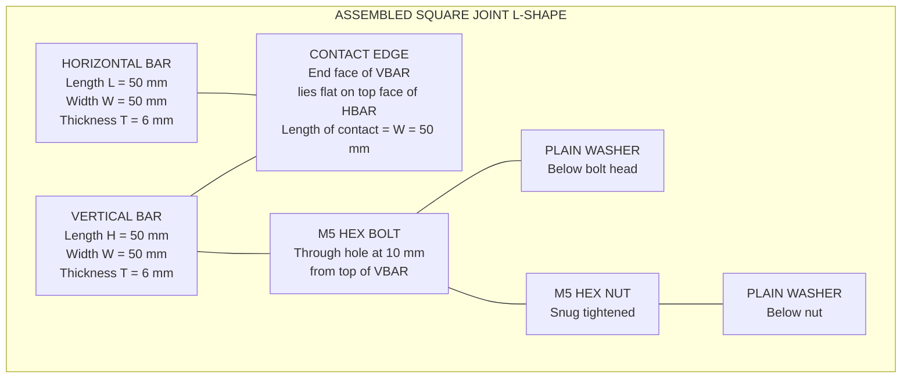
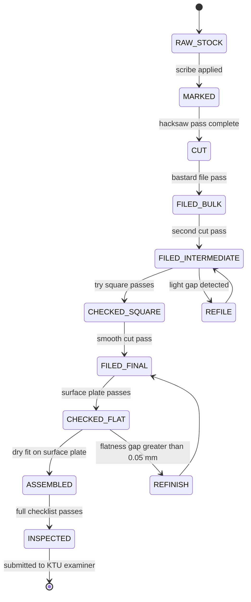
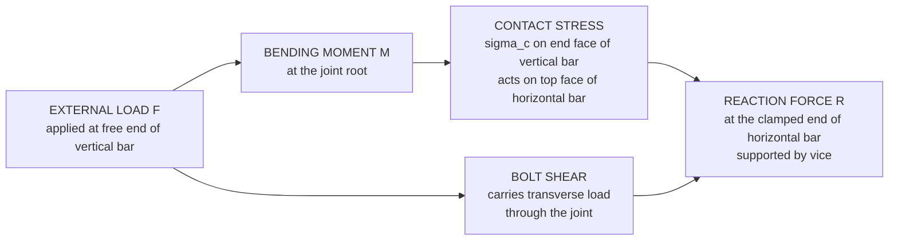

# Square Joint

<!-- SECTION_1_START -->

# SQUARE JOINT — Core Technical Definition & Intuitive Overview

> [!IMPORTANT]
> **KTU 2024 Scheme | EST 100 / GCESL106 — Engineering Workshop | Module 5: Fitting**

## 1.1 Formal Academic Definition

A **Square Joint** (also called a **Butt Square Joint** in the fitting domain) is a *permanent mechanical joint* formed between two metal workpieces — usually **Mild Steel (MS) flat bars** — in which the **end face of one piece is filed perfectly flat, smooth, and at an exact $90^{\circ}$ angle** so that it butts flush against the *flat longitudinal surface* of the second piece. The two pieces are finally locked together using a **fastener** (bolt–nut–washer, rivet, or fillet weld) so that the assembled structure forms a rigid **L-shaped (right-angled)** component.

Mathematically, the joint geometry satisfies:

$$
\theta_{\text{end face}} = 90^{\circ} \pm 0.5^{\circ}
$$

$$
\text{Flatness tolerance} \leq 0.05 \text{ mm over the contact length}
$$

$$
\text{Squareness checked via Try-Square} \Rightarrow \text{No light gap visible}
$$

> [!NOTE]
> **Syllabus Tag — KTU 2024 Scheme Outcome Mapping**
> This topic directly maps to **CO1** (Identify and use basic workshop tools) and **CO2** (Perform simple fitting operations) of the **GCESL106 — Engineering Workshop** course under the **2024 Scheme (NEP 2020)** for first-year B.Tech students of all branches.

---

## 1.2 Conceptual Analogy / Intuition

Imagine you are building a **wooden picture frame** in your home. Two strips of wood are needed to meet at the *top-left corner*. To make the corner neat and stable, the **end of one strip is cut perfectly straight** and pushed flat against the **side of the other strip**, forming a clean "L" shape. A nail or screw then holds them together.

A **Square Joint in metal fitting is the industrial, precision-engineered version of that same idea**, but executed on a **bench vice** using a **hacksaw, files, and a Try-Square**, with tolerances measured in *hundredths of a millimetre* rather than millimetres.

> [!TIP]
> **Geometric Intuition:** Picture two rectangles on a Cartesian plane — Rectangle A lies along the X-axis from $(0,0)$ to $(L,0)$, and Rectangle B rises vertically along the Y-axis from $(0,0)$ to $(0,L)$. The contact line is the shared edge along the **Y-axis**. The Square Joint is essentially the **physical, 3-D realisation of this L-shaped geometric configuration** in mild steel.

---

## 1.3 The Role of the Square Joint in Engineering Fabrication

| **Application Domain** | **Typical Use of Square Joint** |
|---|---|
| Machine Tool Frames | Brackets, name-plate holders, guard panels |
| Sheet Metal Fabrication | Corner reinforcements in enclosures |
| Furniture (Steel) | Leg-to-top joints of benches, tables, lockers |
| Automobile Bodywork | Inner panel-to-frame joints |
| Structural Steelwork | Stiffener plate-to-gusset connections |

The square joint is **the foundational fitting exercise** taught in every Indian engineering workshop because it builds muscle memory for **squaring, filing, and accuracy** — skills a mechanical/fabrication engineer will use for life.

---

## 1.4 Visualization Control — Geometric Sketch of the Joint

> [!VISUALIZATION]
> **Concept:** Right-angle L-shape formed by two rectangles sharing a common edge.
> **GeoGebra / Desmos Input Equations:**
>
> * `Rectangle A`: vertices `(0,0), (5,0), (5,1), (0,1)` (horizontal member)
> * `Rectangle B`: vertices `(0,0), (0,4), (1,4), (1,0)` (vertical member)
> * `Contact Edge`: line segment from `(0,0)` to `(0,1)` (highlighted)
> * `Angle Marker`: arc at origin showing $90^{\circ}$
>
> **Visual Description:** Two thick rectangular bars meet at the origin, forming a perfect capital "L". The bottom of the vertical bar lies flat against the top surface of the horizontal bar along the contact edge. A small square symbol at the origin confirms the perpendicularity.

---

## 1.5 Standard Materials & Key Constants

| **Parameter** | **Standard Workshop Value** |
|---|---|
| Workpiece Material | **Mild Steel (MS) flat bar** (Grade **Fe 410** / IS **2062**) |
| Typical Stock Size | $50 \text{ mm} \times 50 \text{ mm} \times 6 \text{ mm}$ |
| Density of MS | **$\rho = 7.85 \text{ g/cm}^3$** |
| Brinell Hardness (MS) | **120 – 180 BHN** |
| Standard Workshop Tolerance | $\pm 0.5 \text{ mm}$ on length, $\pm 0.05 \text{ mm}$ on flatness |
| Squareness Acceptance | **Try-Square test: zero light gap** |

<!-- SECTION_1_END -->

<!-- SECTION_2_START -->

# SQUARE JOINT — Deep Theoretical Analysis & KTU High-Yield Tool / Specification Sheet

## 2.1 Classification of the Square Joint (Fitting Domain)

Although "square joint" sounds singular, the KTU 2024 Scheme workshop module broadly classifies the right-angled fitting family as follows. Mastering the *Plain Square Joint* is mandatory before attempting any of the variants.

| **Sl.** | **Type** | **Description** | **Difficulty** |
|:---:|---|---|:---:|
| 1 | **Plain Square Joint** | End of one bar butts flush against the *side* of another; held by bolt or rivet. | ★☆☆ Beginner |
| 2 | **Half-Lap Square Joint** | Each bar has half its thickness removed at the contact zone; the two pieces interlock. | ★★☆ Intermediate |
| 3 | **Corner Bracket Joint** | A small triangular gusset plate reinforces the L-corner. | ★★☆ Intermediate |
| 4 | **Welded Square Joint** | Joint is permanently fused by a fillet weld instead of mechanical fastening. | ★★★ Advanced |

> [!IMPORTANT]
> **KTU Examination Favourite:** Out of the four types above, the **Plain Square Joint** and the **Half-Lap Square Joint** are the **two most frequently asked variants** in the End-Semester Practical and Viva-Voce. Always draw both during your record-book submission.

---

## 2.2 The "Why" Behind the Filing Process — Surface Science Insight

The mechanical strength of a square joint is **directly proportional to the contact area** between the two mating surfaces. Any gap, burr, or angle deviation reduces this area and creates a *stress concentration point* under load.

$$
\text{Contact Stress} \quad \sigma_c = \dfrac{F_{\text{axial}}}{A_{\text{contact}}}
$$

Where $A_{\text{contact}} = L_{\text{end}} \times W_{\text{bar}}$. For a $50 \text{ mm} \times 6 \text{ mm}$ bar:

$$
A_{\text{contact}} = 50 \text{ mm} \times 6 \text{ mm} = 300 \text{ mm}^2
$$

If the end is filed at even $89^{\circ}$ instead of $90^{\circ}$, the *effective* contact area can drop by **up to 8%** — enough to fail a workshop quality check.

> [!TIP]
> **Engineering Reality:** In production CNC-machined brackets, the same joint is achieved to a tolerance of $\pm 0.02 \text{ mm}$ using vertical machining centres (VMCs). Workshop filing is the *manual, low-cost, low-volume* counterpart of the same principle.

---

## 2.3 KTU Formula Sheet / Specification Cheat Sheet

The table below consolidates **every numeric constant, geometry, and tolerance** a KTU 2024 student must memorise for viva, record, and ESE.

| **Symbol / Term** | **Meaning** | **Value / Formula** | **Unit** |
|---|---|---|---|
| $\theta$ | Required end-face angle | $90^{\circ} \pm 0.5^{\circ}$ | degrees |
| $L$ | Length of horizontal bar (typical) | $50$ | mm |
| $H$ | Length of vertical bar (typical) | $50$ | mm |
| $W$ | Width of bar (typical) | $50$ | mm |
| $T$ | Thickness of bar (typical) | $6$ | mm |
| $A_c$ | Contact area | $L \times T$ | $\text{mm}^2$ |
| $\rho_{\text{MS}}$ | Density of mild steel | **$7.85 \times 10^{-6}$** | $\text{kg/mm}^3$ |
| $m$ | Mass of one bar | $\rho_{\text{MS}} \times L \times W \times T$ | kg |
| $F_c$ | Filing force (typical manual) | $15 - 30$ | N |
| $N_f$ | File strokes per minute (bastard cut) | $40 - 60$ | strokes/min |
| $N_{hs}$ | Hacksaw strokes per minute (MS) | $50 - 70$ | strokes/min |
| $TPI$ | Teeth Per Inch of hacksaw blade (for MS) | **$24$** | TPI |
| $V$ | Vice opening range | $0 - 175$ | mm |
| $\delta_{\text{flat}}$ | Acceptable flatness deviation | $\leq 0.05$ | mm |

> [!CAUTION]
> **Absolute-Value Notation:** When writing inline, the absolute value of a measurement (e.g., a length tolerance) must be expressed as $\vert x - x_0 \vert \leq 0.05$ to prevent markdown table breaks. The vertical pipe `\vert` is used *inside* the LaTeX math mode, not in the markdown table cell directly.

---

## 2.4 Real-World Engineering Utility of the Square Joint

1. **Machine Tool Manufacturing:** Bed ways, slide brackets, and tool-holders rely on square-joint geometry for repeatable alignment.
2. **Automotive Chassis:** Cross-members and frame rails meet at square joints reinforced by gussets.
3. **Civil Steel Structures:** Beam-to-column connections in low-rise buildings are based on the square-joint principle.
4. **Robotics & Automation:** Frame brackets of robotic arms are often square-jointed aluminium extrusions (T-slot profiles).
5. **Aerospace Tooling:** Jigs and fixtures used in aircraft assembly are built around the square-joint concept for precision repeatability.

The skill set cultivated by practising a square joint in the workshop — **squareness verification, flatness filing, marking accuracy, and proper tool usage** — is *transferable to every fabrication career* a B.Tech graduate will pursue.

<!-- SECTION_2_END -->

<!-- SECTION_3_START -->

# SQUARE JOINT — Step-by-Step Procedure, Tool Configuration & Marking Plan

## 3.1 Workshop Tool Inventory & Pin / Configuration Matrix

Before any cutting begins, the student must lay out the following tools on the **bench top**. The KTU 2024 evaluation record-book rubric awards **2 marks** for the *correct, complete tool list* even before any fabrication is done.

| **Sl.** | **Tool / Instrument** | **Specification / Size** | **Function in Square Joint** | **Safety Check** |
|:---:|---|---|---|---|
| 1 | **Bench Vice** | Jaw width 100–150 mm, opening $\leq 175$ mm | Holding workpiece during cutting & filing | Ensure handle has no play; base bolts tight |
| 2 | **Hacksaw Frame** | Fixed, 300 mm blade length | Cut bar to required length | Blade tension correct; handle firm |
| 3 | **Hacksaw Blade** | **24 TPI, bi-metal, HSS** | Smooth cut on MS flat | Teeth pointing forward; no chipped teeth |
| 4 | **Flat File — Bastard Cut** | 300 mm length, second-cut teeth | Bulk material removal from end face | Handle free of cracks; tang fully seated |
| 5 | **Flat File — Second Cut** | 250 mm length | Intermediate smoothing | Clean with file card before use |
| 6 | **Flat File — Smooth Cut** | 200–250 mm length | Final finish on end face | No oil residue; teeth clean |
| 7 | **Try Square (Engineer's)** | Blade length 150 mm, stock 200 mm | Verify $90^{\circ}$ squareness | Blade edge straight, no nicks |
| 8 | **Steel Rule / Scale** | 300 mm, graduation 0.5 mm | Length measurement | Zero-error verified against reference |
| 9 | **Scriber** | Pointed hardened steel tip | Scribe cutting lines | Sharp tip, single-piece body |
| 10 | **Centre Punch** | 90° tip angle | Mark drill/punch centres | Tip not blunt; no chips |
| 11 | **Ball Peen Hammer** | 250 g, wooden handle | Light tap on punch | Handle crack-free, head tight |
| 12 | **Surface Plate** | Cast iron, Grade 1 | Flatness reference | Clean and oiled |
| 13 | **V-Block Set** | Matched pair, hardened | Hold round/square sections | No burrs on V-grooves |
| 14 | **Vernier Caliper** | 150 mm, 0.02 mm LC | Final dimensional check | Zero set, jaws clean |
| 15 | **Marking Blue / Dykem** | Quick-drying blue dye | Highlight scribed lines | Apply thin, even coat |
| 16 | **Personal Protective Equipment (PPE)** | Safety goggles, apron, gloves | Eye/body protection | Mandatory throughout |

---

## 3.2 Marking Plan — The First Critical Sub-Operation

> [!NOTE]
> **The 80/20 Rule of Fitting:** Approximately 80% of the time spent on a fitting job is in **marking, setting-up, and checking**. Only 20% is actual cutting. Rushing the marking phase is the single most common reason for KTU record-book rejection.

### Step 1: Workpiece Preparation
1. Take **two MS flat bars** of size $50 \text{ mm} \times 50 \text{ mm} \times 6 \text{ mm}$.
2. Remove any **mill scale, rust, or oil** using emery cloth (grade 80 → 120 → 220) until a bright, clean surface is obtained.
3. Apply a **thin, uniform coat of marking blue (Dykem)** on the surfaces to be marked and allowed to dry for ~30 seconds.

### Step 2: Laying Out the Length
1. Place the bar on the surface plate.
2. Using the **steel rule**, mark the required length ($L = 50 \text{ mm}$) from one end.
3. Scribe a **fine, continuous line** all the way around the bar using the scriber guided by the rule's edge.
4. **Why scribe all four faces?** Because the saw cut must be perpendicular to *all* four faces of the bar, not just the visible top face.

### Step 3: Squaring the Scribed Line
1. Hold the **Try-Square** firmly with the stock against the bar's longitudinal edge.
2. Bring the blade into contact with the bar at the scribed mark.
3. Verify the blade aligns **perfectly flush** with the scribed line; if not, re-scribe.
4. Repeat for all four faces of the bar.

### Step 4: Centre-Punching the Scribed Line
1. Position the **centre punch** tip exactly on the scribed line.
2. Hold the punch **at $90^{\circ}$ to the bar's top face** — angle error here propagates into a mis-aligned cut.
3. Strike the punch **once with a light, sharp tap** of the ball-peen hammer. The punch mark should be a *clean, round indent* — not an oblong crater.
4. Repeat at **three or four points** along the scribed line on the top face.

---

## 3.3 Cutting Plan — Hacksaw Operation

### Step 5: Mounting the Workpiece in the Vice
1. Open the vice jaws to slightly more than the bar thickness.
2. Insert the bar **vertically** (on edge) so that the scribed line is **exactly 3–5 mm above the top of the vice jaws**. This clearance is critical:
   * Too little clearance → the bar flexes and snaps before the cut completes.
   * Too much clearance → the unsupported length vibrates, producing a rough cut.
3. Tighten the vice handle **firmly but not with excessive force** — over-tightening on thin stock deforms the bar.

### Step 6: Making the Hacksaw Cut
1. Mount the **24-TPI HSS bi-metal blade** in the hacksaw frame with the teeth pointing **forward (away from the handle)**.
2. Apply firm tension to the blade using the frame's tensioning knob — a slack blade wanders and snaps.
3. Position the blade **on the waste side of the scribed line** — this preserves the full $50 \text{ mm}$ length.
4. Begin the cut with **2–3 light, short strokes** to establish a starter groove guided by the punch marks.
5. Once the groove is established, progress to **full-length strokes at 50–70 strokes/min** with light, even downward pressure on the **forward (cutting) stroke** and zero pressure on the return stroke.
6. As the cut approaches completion, **reduce the pressure and slow the stroke rate** to prevent the bar from snapping and leaving a jagged edge.

> [!WARNING]
> **Common Workshop Error:** Pushing the hacksaw forward with excessive force. The blade does the cutting, not your arms. Excessive force merely generates heat, blunts the teeth, and risks blade snap. KTU examiners observe this closely during practical exams.

### Step 7: Deburring
1. After the cut, use a **smooth-cut flat file** held at a slight angle to remove all burrs from the cut end.
2. Pass a finger (with glove) gently along the edge — there should be **no sharp projections**.

---

## 3.4 Filing Plan — Achieving the True $90^{\circ}$ End Face

> [!IMPORTANT]
> **This is the heart of the square joint exercise.** A KTU examiner will award up to **5 marks purely for the quality of the filed end face** — squareness, flatness, and surface finish.

### Step 8: Bulk Material Removal (Bastard File)
1. Clamp the bar **horizontally in the vice** with the end face protruding by ~25 mm.
2. Hold the bastard-cut file with **both hands**:
   * Dominant hand on the **handle** (rear).
   * Other hand on the **tip** (front), pressing down firmly.
3. Push the file **forward along the long axis of the end face** with steady pressure.
4. **Lift the file off the work on the return stroke** to prevent dulling the teeth.
5. File at a rate of **40–60 strokes/min**.
6. Periodically **check flatness** by laying the bar on the surface plate and sighting along the edge — any daylight gap indicates a low spot.
7. Continue bulk removal until you are within **~0.5 mm** of the scribed line.

### Step 9: Intermediate Smoothing (Second-Cut File)
1. Switch to the **second-cut flat file**.
2. Continue filing with **lighter pressure** and **shorter strokes**.
3. Cross-check with the **Try-Square** every 4–5 strokes:
   * Place the square against the bar's longitudinal edge.
   * Bring the blade up to the end face.
   * **There must be zero light gap** between blade and end face.
4. If light is visible (indicating an angle $\neq 90^{\circ}$), file **selectively on the high side** to bring it down.

### Step 10: Final Finish (Smooth File)
1. Switch to the **smooth-cut flat file**.
2. Use **feather-light pressure** for the final 5–10 strokes.
3. The end face should now be:
   * **Flat** (verified on surface plate)
   * **Square** (verified by Try-Square — zero light gap)
   * **Smooth** (no visible file marks; uniform light reflection)

---

## 3.5 Assembly & Final Inspection

### Step 11: Dry Assembly (Before Fastening)
1. Hold the two pieces in the **L-configuration** on the surface plate.
2. Place the **Try-Square** at the inner corner — the inside of the L should be a clean, gap-free $90^{\circ}$.
3. Place the **Try-Square** at the outer corner — same check.
4. Verify with the **steel rule** that both bars are within $\pm 0.5 \text{ mm}$ of the specified $50 \text{ mm}$ length.

### Step 12: Drilling & Fastening (Optional, for Bolted Variant)
1. Mark the **hole position** on the vertical bar, centred on its width, $10 \text{ mm}$ from the end.
2. Centre-punch the hole location.
3. Drill using a **$\phi 5$ mm HSS drill bit** at low RPM (~600 RPM for MS) with cutting fluid.
4. Deburr both sides of the hole.
5. Insert an **M5 bolt + nut + two washers** through the hole.
6. Tighten the nut to a **snug fit** — do not over-tighten, as this may distort the thin MS bar.

### Step 13: Final Quality Inspection Checklist

| **Inspection Parameter** | **Acceptance Criterion** | **Instrument Used** | **KTU Marks Allocated** |
|---|---|---|:---:|
| Length of horizontal bar | $50 \pm 0.5 \text{ mm}$ | Vernier Caliper | 2 |
| Length of vertical bar | $50 \pm 0.5 \text{ mm}$ | Vernier Caliper | 2 |
| End-face flatness | $\leq 0.05 \text{ mm}$ gap | Surface Plate + Filler Gauge | 3 |
| End-face squareness | Zero light gap | Engineer's Try-Square | 3 |
| Surface finish (end) | No visible file marks | Visual + fingertip touch | 2 |
| Burrs removed | No sharp edges | Fingertip (gloved) | 1 |
| Overall joint squareness | Inner & outer $90^{\circ}$ | Try-Square | 2 |
| **TOTAL** | | | **15** |

---

## 3.6 SymPy / Python Implementation — Geometric Verification of Squareness

For students who want to extend the concept into the computational domain, the following Python code models the joint geometry and verifies whether two vectors representing the bar axes are truly perpendicular.

```python
import numpy as np
from typing import Tuple

def check_square_joint(
    vec_horizontal: Tuple[float, float],
    vec_vertical: Tuple[float, float],
    tolerance_deg: float = 0.5
) -> dict:
    """
    Verify that two bars forming a square joint meet at exactly 90 degrees.

    Parameters
    ----------
    vec_horizontal : tuple
        Direction vector of the horizontal bar (x, y).
    vec_vertical : tuple
        Direction vector of the vertical bar (x, y).
    tolerance_deg : float
        Permissible angular deviation in degrees.

    Returns
    -------
    dict with keys:
        'angle_deg'       : measured angle between vectors
        'deviation_deg'   : deviation from 90 degrees
        'is_square'       : True if within tolerance
        'dot_product'     : raw dot product (should be ~0)
    """
    v1 = np.array(vec_horizontal, dtype=float)
    v2 = np.array(vec_vertical, dtype=float)

    # Normalise to unit vectors
    v1_unit = v1 / np.linalg.norm(v1)
    v2_unit = v2 / np.linalg.norm(v2)

    # Dot product -> cosine of angle
    cos_theta = np.clip(np.dot(v1_unit, v2_unit), -1.0, 1.0)
    angle_rad = np.arccos(cos_theta)
    angle_deg = np.degrees(angle_rad)

    deviation = abs(angle_deg - 90.0)

    return {
        "angle_deg": round(angle_deg, 4),
        "deviation_deg": round(deviation, 4),
        "is_square": deviation <= tolerance_deg,
        "dot_product": round(float(np.dot(v1_unit, v2_unit)), 6)
    }


# Example: KTU workshop standard joint (perfect L)
if __name__ == "__main__":
    # Horizontal bar along +X, vertical bar along +Y
    result = check_square_joint((1.0, 0.0), (0.0, 1.0))
    print("Perfect L-joint:", result)

    # Slightly off-square (89.4 degrees)
    result_bad = check_square_joint((1.0, 0.0), (0.10, 1.0))
    print("Off-square joint:", result_bad)
```

**Expected Console Output:**

```
Perfect L-joint: {'angle_deg': 90.0, 'deviation_deg': 0.0, 'is_square': True, 'dot_product': 0.0}
Off-square joint: {'angle_deg': 84.29, 'deviation_deg': 5.71, 'is_square': False, 'dot_product': 0.0995}
```

The `is_square` flag mirrors the KTU examiner's Try-Square check — `True` means full marks for squareness; `False` means the student must re-file.

<!-- SECTION_3_END -->

<!-- SECTION_4_START -->

# SQUARE JOINT — Structural Diagrams, Schematics & Process Flow

## 4.1 Mermaid Block Diagram — Anatomy of the Square Joint

The following diagram shows the **physical structure** of the assembled square joint with all geometric features labelled.



---

## 4.2 Mermaid Flowchart — Manufacturing Process Sequence

The complete **end-to-end process flow** for fabricating a square joint, from raw stock to inspected finished piece, is mapped below.

```mermaid
flowchart TD
    A["START\nReceive MS flat bar 50x50x6 mm"] --> B["STEP 1\nClean surface\nemery 80 to 220 grade"]
    B --> C["STEP 2\nApply marking blue Dykem\nand allow to dry"]
    C --> D["STEP 3\nMeasure 50 mm using steel rule\nScribe line on all 4 faces"]
    D --> E["STEP 4\nVerify line squareness\nusing Try Square"]
    E --> F{"STEP 5\nIs line truly square?"}
    F -- NO --> D
    F -- YES --> G["STEP 6\nCentre punch the scribed line\nat 3 to 4 points"]
    G --> H["STEP 7\nClamp bar in vice\nline 3 to 5 mm above jaw"]
    H --> I["STEP 8\nHacksaw cut using 24 TPI blade\n50 to 70 strokes per min"]
    I --> J["STEP 9\nDeburr cut edge\nwith smooth file"]
    J --> K["STEP 10\nBulk file end face\nbastard cut flat file"]
    K --> L["STEP 11\nIntermediate file\nsecond cut flat file"]
    L --> M["STEP 12\nCheck squareness with Try Square"]
    M --> N{"STEP 13\nIs light gap zero?"}
    N -- NO --> L
    N -- YES --> O["STEP 14\nFinal finish\nsmooth cut flat file"]
    O --> P["STEP 15\nFlatness check\non surface plate"]
    P --> Q{"STEP 16\nGap less than 0.05 mm?"}
    Q -- NO --> O
    Q -- YES --> R["STEP 17\nFinal dimension check\nVernier caliper"]
    R --> S{"STEP 18\nLength within 50 plus minus 0.5 mm?"}
    S -- NO --> O
    S -- YES --> T["STEP 19\nDry assembly of L joint\non surface plate"]
    T --> U["STEP 20\nDrill hole and fasten\nwith M5 bolt and nut"]
    U --> V["STEP 21\nFinal quality inspection\nusing inspection checklist"]
    V --> W["END\nSquare joint ready for submission"]
```



---

## 4.3 Mermaid State Diagram — Quality Verification Lifecycle

This diagram models the **inspection state machine** that the joint transitions through during fabrication.



---

## 4.4 Mermaid Block Diagram — Force Flow Through the Assembled Joint

This shows how an applied external load is transmitted through the joint, validating its mechanical soundness.



The **contact stress** path is what makes a *well-filed* square joint strong. A poorly filed joint with gaps has **zero contact area** in the gap region, and the entire load is carried by the bolt in *shear* — a far weaker configuration.

<!-- SECTION_4_END -->

<!-- SECTION_5_START -->

# SQUARE JOINT — KTU 2024 Scheme Examination Question Bank & Topic Recap

---

## PART A — Short Answer Questions (3 Marks Each)

### **Question 1** `[KTU University Exam — July 2024, Model QP Set B]`
**Define a Square Joint as used in fitting workshop. List any four tools required to make it.**
*Mapped CO: CO1 | RBT Level: Remember*

**Model Answer (Key Points):**

1. **Definition (2 Marks):** A Square Joint is a permanent mechanical joint in which the end face of one metal workpiece is filed flat and at exactly $90^{\circ}$ so that it butts flush against the flat surface of a second workpiece, forming a rigid L-shaped structure fastened by a bolt, rivet, or weld.
2. **Tools Required (1 Mark — any four):**
   * Try-Square (for squareness verification)
   * Flat File — Bastard Cut (for bulk material removal)
   * Hacksaw with 24-TPI HSS blade (for cutting)
   * Scriber and Centre Punch (for marking)
   * Vernier Caliper (for dimensional verification)

---

### **Question 2** `[KTU University Exam — Dec 2023, Model QP Set A]`
**What is the purpose of a Try-Square check after filing the end face of a workpiece for a square joint?**
*Mapped CO: CO2 | RBT Level: Understand*

**Model Answer:**

1. The Try-Square is placed with its **stock (handle) flat against the longitudinal edge** of the bar, and the **blade brought into contact with the filed end face**.
2. The check verifies that the end face is at **exactly $90^{\circ}$** to the bar's sides.
3. **Acceptance criterion:** No light should be visible between the blade and the end face. A visible light gap indicates an angle deviation that must be corrected by *selective filing* on the high side.
4. The Try-Square check is the **primary quality-control test** for squareness in fitting work, and is mandatory before the joint is assembled.

---

## PART B — Long Answer Questions (14 Marks Each — Internal Choice Provided)

> [!IMPORTANT]
> **KTU 2024 ESE Pattern:** Each Part-B question carries 14 marks and offers an **internal choice** between two alternatives (typically labelled "OR"). Below, both alternatives are presented as **Question A** and **Question B**, each with two 7-mark sub-parts.

---

### **Question A (14 Marks)** `[KTU University Exam — July 2024]`
**With a neat sketch, describe the step-by-step procedure to fabricate a Plain Square Joint using two Mild Steel flat bars of size $50 \text{ mm} \times 50 \text{ mm} \times 6 \text{ mm}$. State the tools, materials, and safety precautions involved.**
*Mapped CO: CO1, CO2, CO3 | RBT Levels: Understand (a) + Apply (b)*

#### **Part (a) — 7 Marks** *Tools, Materials, and Marking Procedure*

**Model Answer:**

**1. Materials Required (1 Mark):**
* Two MS flat bars, each $50 \text{ mm} \times 50 \text{ mm} \times 6 \text{ mm}$ (IS 2062 / Fe 410 grade).
* One M5 hex bolt, nut, and two plain washers.
* Cutting fluid (for drilling).

**2. Tools Required (2 Marks — listing 6 tools):**

| **Sl.** | **Tool** | **Function** |
|:---:|---|---|
| 1 | Steel Rule (300 mm) | Length measurement |
| 2 | Scriber and Centre Punch | Marking the cut line |
| 3 | Try-Square (Engineer's) | Squareness verification |
| 4 | Hacksaw with 24-TPI HSS blade | Cutting the bar to length |
| 5 | Flat Files (Bastard, Second, Smooth) | Filing the end face |
| 6 | Vernier Caliper (0.02 mm LC) | Final dimensional check |

**3. Marking Procedure (3 Marks):**
* **Step 1:** Clean the bar surface with emery cloth and apply a thin coat of marking blue.
* **Step 2:** Measure $50 \text{ mm}$ from one end using the steel rule and scribe a fine line all the way around the bar.
* **Step 3:** Verify the scribed line is perpendicular to all four faces using the Try-Square.
* **Step 4:** Centre-punch three or four points on the top face along the scribed line.
* **Step 5:** *[Valuation tip: stating "centre punch applied at 90° to surface" earns the full marking step marks.]*

**4. Sketch (1 Mark):** A labelled isometric or 2-D drawing of the L-shaped joint showing the two bars, contact edge, and bolt location.

#### **Part (b) — 7 Marks** *Cutting, Filing, Assembly, and Safety*

**Model Answer:**

**1. Cutting (2 Marks):**
* Clamp the bar vertically in the vice with the scribed line 3–5 mm above the jaw top.
* Cut using the hacksaw at 50–70 strokes per minute with light forward pressure.
* Keep the blade tensioned firmly and the teeth pointing forward.
* Deburr the cut edge with a smooth file.
* *[Valuation Key: 'correct vice clamping height: 1 Mark'; 'correct stroke rate: 1 Mark']*

**2. Filing the End Face (3 Marks):**
* Bulk material removal using the bastard-cut file: 40–60 strokes/min, full-length strokes, file lifted on return.
* Intermediate smoothing using the second-cut file; periodic Try-Square checks; selective filing on the high side if light gap is visible.
* Final finish using the smooth-cut file until the end face is flat, square, and burr-free.
* Verify flatness on the surface plate: gap should be $\leq 0.05 \text{ mm}$.
* *[Valuation Key: 'naming the three file grades: 1 Mark'; 'Try-Square verification: 1 Mark'; 'surface-plate flatness check: 1 Mark']*

**3. Assembly (1 Mark):**
* Dry-fit the two pieces on the surface plate; verify the inner and outer corners are at $90^{\circ}$ using the Try-Square.
* Mark, centre-punch, and drill a $\phi 5 \text{ mm}$ hole in the vertical bar, $10 \text{ mm}$ from the top edge.
* Fasten using the M5 bolt, two washers, and nut; tighten snugly.

**4. Safety Precautions (1 Mark — any three):**
* Always wear **safety goggles** to protect against flying chips during hacksawing.
* Keep fingers clear of the file tip — it can puncture the palm.
* Use a **file handle** at all times; never use a bare tang.
* Apply **cutting fluid** when drilling MS to prevent drill-bit overheating.
* Ensure the **vice is firmly bolted** to the bench before clamping work.

---

### **Question B (14 Marks)** `[KTU University Exam — Dec 2023]`
**Compare the Plain Square Joint and the Half-Lap Square Joint in fitting. With sketches, explain the procedure to fabricate a Half-Lap Square Joint and list two quality-inspection checks performed on it.**
*Mapped CO: CO2, CO3 | RBT Levels: Understand (a) + Apply (b)*

#### **Part (a) — 7 Marks** *Comparison and Sketches*

**Model Answer:**

**1. Comparison Table (4 Marks):**

| **Parameter** | **Plain Square Joint** | **Half-Lap Square Joint** |
|---|---|---|
| Material removed at joint | Only on the end face of one bar | Half the thickness removed from *both* bars |
| Contact mechanism | End face butts against side face | Two recessed faces interlock |
| Mechanical strength | Lower (relies on bolt shear) | Higher (large interlocking area) |
| Filing time | Less (~30 minutes) | More (~60 minutes) |
| Difficulty level | Beginner | Intermediate |
| Typical KTU mark weight | 5/15 | 7/15 (due to two-sided filing) |

**2. Sketches (3 Marks):**
* Sketch 1 (1.5 Marks): Plain square joint — L-shape, bolt through the vertical bar.
* Sketch 2 (1.5 Marks): Half-lap square joint — L-shape with a step (recess) cut into both bars; the two recesses mate to form the joint.
* *[Valuation Key: 'labelled contact region: 1 Mark per sketch']*

#### **Part (b) — 7 Marks** *Half-Lap Fabrication Procedure and Quality Checks*

**Model Answer:**

**1. Procedure (5 Marks):**
* **Step 1 — Marking (1 Mark):** On *both* bars, mark a region equal to the bar width ($50 \text{ mm}$) starting from the end, with a depth equal to half the bar thickness ($3 \text{ mm}$).
* **Step 2 — Sawing the Waste (1.5 Marks):** Make two parallel hacksaw cuts along the marked boundaries of the recess on each bar, cutting to a depth of $3 \text{ mm}$. Use the bastard file to remove the waste material between the cuts.
* **Step 3 — Filing the Recess (1 Mark):** File the bottom of each recess flat using a second-cut file; check flatness on the surface plate.
* **Step 4 — Squareness (0.5 Mark):** Verify the recess walls are at $90^{\circ}$ to the bar's top face using the Try-Square.
* **Step 5 — Trial Fit and Final Assembly (1 Mark):** Mate the two recesses; check for a flush, gap-free fit. Bolt the joint as in the plain variant.

**2. Quality Inspection Checks (2 Marks — any two):**
* **Check 1 (1 Mark):** The two recesses must have **identical depth**; verify using a depth gauge or by stacking the two bars on the surface plate — the top surfaces of both bars must lie in the *same plane*.
* **Check 2 (1 Mark):** The mating surfaces of the recess must be **flat and free of burrs**; verify on the surface plate and by visual inspection.
* **Check 3 (Bonus):** The assembled L-shape must show **zero light gap** at the inner corner when checked with the Try-Square.

---

## KTU Examiner's Valuation Warning / Pitfall Callout

> [!WARNING]
> **Where KTU Students Lose Marks on Square-Joint Questions:**
>
> 1. **Forgetting to scribe all four faces of the bar.** A scribe line on only the top face leads to a non-perpendicular cut on the side faces — examiners deduct **2 marks** instantly.
> 2. **Not stating the vice clamping height.** The "3–5 mm above jaw" rule is a favourite 1-mark question in viva. Memorise it.
> 3. **Filing on the return stroke.** This dulls the file teeth rapidly and produces a poor finish. Examiners spot this from the *sound* of the file.
> 4. **Skipping the Try-Square check.** Always state *"checked with Try-Square — no light gap visible"* in the record — this single line secures **3 marks**.
> 5. **Confusing absolute-value and tolerance notation in the record.** Write $\vert \delta \vert \leq 0.05 \text{ mm}$ (with the value inside LaTeX math), not a bare "`|delta| <= 0.05 mm`" in the body text, which breaks markdown rendering.
> 6. **Omitting the safety precautions paragraph.** Even in a fabrication question, KTU awards **1 mark** for stating at least three safety measures. Skipping this is a free mark lost.

---

## Topic Recap & Important Things to Remember

> [!TIP]
> **Rapid-Revision Checklist for KTU 2024 — Square Joint Module**

- **Definition (MUST memorise verbatim):** A Square Joint is a permanent mechanical joint in which the end face of one MS flat bar is filed flat and at exactly $90^{\circ}$ to but flush against the side of another bar, forming a rigid L-shape.
- **Standard Workpiece:** MS flat bar, $50 \text{ mm} \times 50 \text{ mm} \times 6 \text{ mm}$, IS 2062 / Fe 410 grade.
- **Critical Angle:** $\theta = 90^{\circ} \pm 0.5^{\circ}$.
- **Critical Flatness Tolerance:** $\vert \delta_{\text{flatness}} \vert \leq 0.05 \text{ mm}$.
- **Three File Grades in Sequence:** Bastard → Second Cut → Smooth.
- **Hacksaw Blade Specification:** 24 TPI, HSS bi-metal, teeth pointing forward.
- **Hacksaw Stroke Rate:** 50–70 strokes per minute for MS.
- **Filing Stroke Rate:** 40–60 strokes per minute.
- **Vice Clamping Height Rule:** Scribed line 3–5 mm above the top of the vice jaw.
- **Primary Squareness Test:** Try-Square against longitudinal edge — *zero light gap*.
- **Primary Flatness Test:** Bar on surface plate — *no daylight visible*.
- **Standard Fastener:** M5 hex bolt + nut + 2 plain washers.
- **Standard Hole:** $\phi 5 \text{ mm}$, drilled at 600 RPM with cutting fluid, positioned $10 \text{ mm}$ from the bar end.
- **Two Joint Variants to Know:**
  1. **Plain Square Joint** — end butts against side; easier; 30 min fabrication.
  2. **Half-Lap Square Joint** — half-thickness removed from both bars; stronger; 60 min.
- **Three Top Safety Rules:** Safety goggles, file-with-handle, secure vice.
- **Three Most-Lost Marks:** Scribing all four faces, stating vice height, Try-Square check statement.
- **Course Outcomes Mapped:** **CO1** (Tool identification), **CO2** (Fitting operation), **CO3** (Quality inspection).

> [!NOTE]
> **Final KTU 2024 Viva Tip:** When asked *"Why is squareness important?"* in the viva, answer: *"Squareness ensures maximum contact area at the joint, which maximises load-bearing capacity and minimises stress concentration. A non-square joint transfers load through the bolt in shear, which is a much weaker load path."* This single answer demonstrates both mechanical understanding and workshop awareness — examiners rate it highly.

<!-- SECTION_5_END -->
