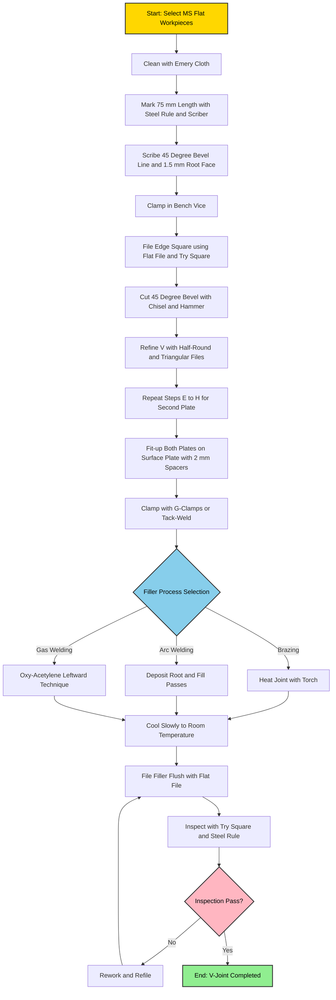
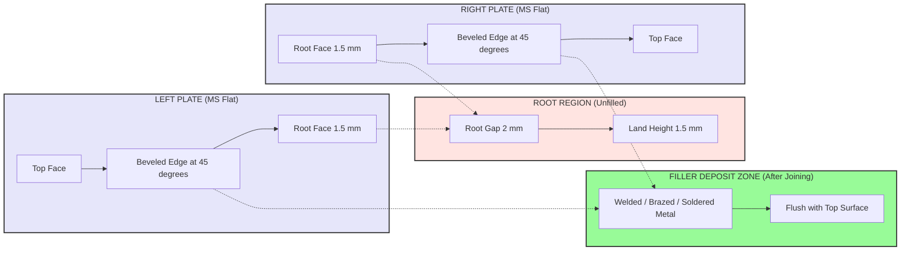
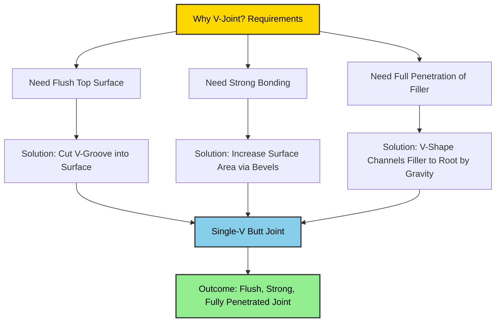

# V- Joint

<!-- SECTION_1_START -->

# V-Joint (Fitting Workshop)

## 1. Core Technical Definition & Intuitive Overview

> [!NOTE]
> **KTU 2024 Syllabus Definition (GCESL106 - Engineering Workshop, Module 5)**
> A **V-Joint** (also called a **V-Butt Joint** or **Single-V Butt Joint**) is a permanent type of fitting assembly in which two metal workpieces are placed edge-to-edge on the same plane, and a **V-shaped groove** is filed/machined along the joint line on the upper (visible) surface of the workpieces. The V-groove is subsequently filled with filler material during brazing, soldering, or welding to form a mechanically strong, flush, and permanent joint.

### Conceptual Analogy / Intuition

Imagine you are joining two slices of bread with a layer of jam. If you simply press them flat edge-to-edge, the jam may not hold them well in the middle. However, if you cut a **shallow triangular trench** along the seam (a V-groove) before applying the jam, the jam settles deep into the trench, locking the slices together with a far stronger grip and a perfectly flat top surface once set.

In fitting work, the "bread slices" are mild-steel workpieces, the "knife" is the **files and chisels**, and the "jam" is the **filler rod** (spelter, solder, or welding electrode). The V-groove:
- **Increases surface area** of contact between base metal and filler.
- **Provides a reservoir** to hold molten filler metal.
- **Ensures full penetration** of the joint — filler reaches the root.
- **Produces a flush, neat finish** on the top working surface.

> [!IMPORTANT]
> **Why "V" and not "Square" or "U"?**
> The V-shape allows the filler to **flow smoothly downward** to the root under gravity and capillary action. It also requires **less filler material** than a Square butt joint while still providing strong penetration. This is why V-joints are the most commonly specified butt joint in sheet-metal and plate fitting.

### Key Physical / Workshop Constants

| Parameter | Standard Value (Workshop Practice) |
| :--- | :--- |
| **Included angle of V-groove** | **90°** (most common) — adjustable 60° to 120° |
| **Groove depth** | **1/3 to 1/2** of plate thickness |
| **Root gap (land)** | **1.5 mm to 3 mm** (for filler flow) |
| **Root face / land height** | **1 mm to 2 mm** (flat uncut portion at bottom) |
| **Standard workpiece material** | **Mild Steel (MS)** flat bar |
| **Common filler processes** | Gas welding, Arc welding, Brazing, Soldering |

> [!VISUALIZATION CONTROL]
> **Concept:** Cross-sectional profile of a Single-V Butt Joint showing the V-groove geometry, root face, root gap, groove angle, and weld/filler deposit zone.
> **Schematic Equations / Parameters:**
> * Groove angle: $\alpha = 90°$
> * Groove depth: $d = 0.4 \times t$ (where $t$ = plate thickness)
> * Root face: $f = 1.5$ mm
> * Root gap: $g = 2$ mm
> * Bevel height: $h = (t - f - g)/2$ on each side
> **Visual Description:** On the cross-section, two rectangles (the plates) sit side-by-side. Their inner upper edges are chamfered at 45° each, meeting at a flat horizontal land of width $f$ at the bottom, with a small vertical gap $g$ separating the two land faces. The resulting trapezoidal/empty region above is the V-groove that gets filled with weld metal.

---

<!-- SECTION_1_END -->

<!-- SECTION_2_START -->

# 2. Deep Theoretical Analysis & KTU High-Yield Specification Sheet

## 2.1 Operational Philosophy of the V-Joint

The success of a V-joint depends on **three simultaneous engineering principles**:

1. **Mechanical Interlock** — The filler metal solidifies inside the V, forming a mechanical key that resists shear and tensile loads applied perpendicular to the joint line.
2. **Metallurgical Bonding** — At the interface between filler and base metal, **atomic diffusion** (and in welding, partial melting — *fusion*) creates a continuous metallic bond.
3. **Geometric Flushness** — Because the filler is deposited *into* a groove rather than *on top* of the surface, the finished top face remains flush with the parent metal — critical for bearing surfaces, mating parts, and aesthetic assemblies.

## 2.2 Step-by-Step Logical Breakdown of Joint Formation

- **Step 1 — Workpiece Selection:** Two pieces of **Mild Steel (MS) flat** of identical thickness and width are selected. Surface cleanliness is ensured via filing/sanding.
- **Step 2 — Marking:** The joint line is marked using a **scriber** and **steel rule**, with a **try square** to keep the line perfectly perpendicular to the edges.
- **Step 3 — Edge Preparation (Filing):** One straight edge of each plate is filed perfectly flat and square (90°) to the top and side faces. This is the *root face* preparation.
- **Step 4 — V-Cutting:** Using a **bench vice, chisel, and files** (or in industry, a milling machine / beveling machine), a **45° bevel** is cut on the upper edge of each plate, meeting at the root face. The two 45° bevels together form a **90° included V-angle**.
- **Step 5 — Clamping/Positioning:** The two plates are clamped on a **welding table / marking table** with a **root gap of 1.5–3 mm** maintained between the root faces using spacer blocks or tack welds.
- **Step 6 — Filling (Joining):** Filler metal is deposited into the V using the chosen process (brazing, soldering, or welding). For workshop V-joints, **gas welding (oxy-acetylene)** or **arc welding** is the standard.
- **Step 7 — Cooling & Inspection:** The joint is allowed to cool slowly (to avoid hardening cracks in MS), then filed flush, and inspected with a **try square** and **steel rule**.

## 2.3 KTU Specification / Cheat Sheet (V-Joint Geometry & Tools)

| Specification / Tool | Symbol / Value | Unit | Function in V-Joint |
| :--- | :--- | :--- | :--- |
| Plate thickness | $t$ | mm | Base dimension for groove depth |
| Included groove angle | $\alpha$ | degrees (typically **90°**) | Determines filler volume & penetration |
| Bevel angle per plate | $\beta = \alpha / 2$ | degrees (typically **45°**) | Angle of each chamfer |
| Groove depth | $d$ | mm ($d = 0.4 t$ typical) | Depth of V measured from top surface |
| Root face / land height | $f$ | mm (**1 to 2**) | Flat portion left at root to prevent burn-through |
| Root gap | $g$ | mm (**1.5 to 3**) | Spacing between root faces for filler access |
| Bevel height per side | $h$ | mm | $h = (t - f - g)/2$ |
| Filler cross-section area | $A_f$ | mm² | $A_f \approx d \times w$ (approx. triangular area × length $w$) |

> [!IMPORTANT]
> **KTU Examiner Tip:** Always state the **included angle (90°)** and the **per-side bevel angle (45°)**. Examiners frequently award a separate mark for correctly distinguishing between "groove angle" (90°) and "bevel angle" (45°). Confusing them is one of the top reasons students lose marks.

## 2.4 Real-World Engineering Applications

V-joints are ubiquitous in engineering fabrication:

- **Pressure vessel and boiler shell fabrication** — Longitudinal seams of cylindrical tanks are joined as V-butt joints to withstand internal pressure.
- **Ship hull plates and bridge girders** — Heavy structural members joined by multi-pass V-butt welds.
- **Automotive chassis and frame rails** — Flush butt joints for strength with minimal protrusion.
- **Sheet-metal ductwork, cabinets, and machine guards** — V-brazed or V-soldered joints in HVAC and enclosures.
- **Workshop training (KTU GCESL106)** — Used to teach the *fundamentals* of edge preparation, fit-up, and filler deposition.

---

<!-- SECTION_2_END -->

<!-- SECTION_3_START -->

# 3. Step-by-Step Procedure, Tooling & Symbolic Implementation

## 3.1 Required Tools, Equipment & Materials (Workshop Table)

| S.No | Tool / Equipment | Specification | Purpose in V-Joint |
| :---: | :--- | :--- | :--- |
| 1 | **Mild Steel flat** | 100 mm × 25 mm × 6 mm (2 pieces) | Workpiece |
| 2 | Steel rule | 150 mm / 6" | Marking lengths |
| 3 | Scriber | Hardened steel tip | Scribing joint line |
| 4 | Try square | Engineer grade, 90° | Checking squareness of edges |
| 5 | Bench vice | Jaw width 100 mm+ | Holding workpiece |
| 6 | Flat file (bastard) | 250 mm, second cut | Filing edges square |
| 7 | Half-round file | 200 mm, smooth | Filing curved V-bottom |
| 8 | Triangular file | 150 mm, smooth | Refining V-groove interior |
| 9 | Chisel & Ball-peen hammer | 150 mm chisel, 250 g hammer | Rough cutting of V-groove |
| 10 | Surface plate | Cast iron, grade 1 | Checking flatness |
| 11 | Filler rod / Spelter / Solder | As per joining process | Filling the V |
| 12 | PPE (Goggles, Apron, Gloves) | ISI marked | Operator safety |

## 3.2 Exhaustive Step-by-Step Fabrication Procedure

> **Mandatory:** Every step below must be physically demonstrated and recorded in the KTU workshop logbook to secure full marks in the lab assessment.

### Stage 1 — Marking & Measurement
1. Clean the two MS flats with emery cloth to remove rust/scale.
2. Mark a length of **75 mm** on each flat using a steel rule and scriber.
3. Using the try square, scribe a **perfectly perpendicular line** across each flat at the 75 mm mark.
4. Mark a **45° bevel line** from the scribed line on the upper face toward the top edge, leaving a **1.5 mm land (root face)** uncut at the very top of the edge (root face is the un-beveled portion at the *bottom* of the V).

### Stage 2 — Filing the Edges Square (Root Face Preparation)
5. Hold one flat vertically in the bench vice with the scribed line just above the jaws.
6. File the edge **flat and square (90°)** to the broad face using long, smooth strokes of the bastard file. Verify squareness with the try square.
7. Repeat for the second flat. The two filed edges will become the **root faces** of the V.

### Stage 3 — Cutting the V-Groove (Beveling)
8. Re-clamp the flat with the scribed 45° line facing up.
9. Using the **chisel and hammer**, make a series of light cuts along the 45° line, removing metal in small chips. Stop exactly at the root face (do **not** cut into the 1.5 mm land).
10. Switch to the **flat file** held at 45° to the broad face. File along the 45° line, frequently checking the angle with the try square placed diagonally.
11. Refine the V-bottom using the **half-round file** (for the curved transition) followed by the **triangular file** to reach the sharp 90° V-interior.
12. Repeat Steps 8–11 for the second flat, ensuring both bevels are mirror images.

### Stage 4 — Fit-Up & Clamping
13. Place both flats on the **surface plate** with their beveled edges facing each other, forming the V opening upward.
14. Insert **two spacer blocks of 2 mm thickness** between the root faces to maintain the **root gap**.
15. Clamp using **G-clamps** or tack-weld at the ends (if welding is to follow).
16. Verify the top edges of both plates are **coplanar (flush)** using a steel rule laid across.

### Stage 5 — Filling / Joining (Generic — apply as per process)
17. **For Brazing/Soldering:** Heat the joint uniformly with a torch until the filler rod melts on contact and flows into the V by capillary action. Build up the filler in successive passes until the V is slightly overfilled.
18. **For Arc Welding:** Deposit the root pass first, then fill passes, ensuring slag is chipped off between passes.
19. **For Gas Welding:** Use a leftward technique for thin plates, rightward for thicker plates.

### Stage 6 — Finishing & Inspection
20. Allow the joint to **cool slowly** (do not quench — risk of hardening cracks in MS).
21. File the filler deposit **flush** with the parent metal using a flat file.
22. Inspect using:
    * **Try square** — Joint line must be 90° to plate edges.
    * **Steel rule on surface plate** — Top face must be flat/flush.
    * **Visual inspection** — No porosity, cracks, or undercuts.

## 3.3 Symbolic / Python Implementation (Geometry Verification of V-Groove)

The following Python code is a **symbolic model** of the V-joint geometry. It verifies groove depth, bevel angle, and filler cross-sectional area from measured inputs. This is useful for engineering drawing (CAD) and for examiners who ask "calculate the filler volume required."

```python
"""
V-Joint Geometry Calculator — KTU GCESL106 Workshop Tool
Validates the cross-sectional dimensions of a Single-V Butt Joint
and computes the filler cross-sectional area required.
"""

from math import tan, radians
from dataclasses import dataclass
from typing import Tuple


@dataclass(frozen=True)
class VJointGeometry:
    plate_thickness_t: float   # mm — full thickness of each plate
    groove_angle_alpha: float  # degrees — included angle of V (typ. 90)
    root_face_f: float         # mm — land height at root (typ. 1.5)
    root_gap_g: float          # mm — gap between root faces (typ. 2.0)
    plate_width_w: float       # mm — width of the joint (perpendicular to length)

    def bevel_angle(self) -> float:
        """Per-side bevel angle β = α / 2."""
        return self.groove_angle_alpha / 2.0

    def bevel_height_h(self) -> float:
        """
        Vertical height of the 45° bevel on one plate.
        Derivation: t = f + g + 2·h  →  h = (t − f − g) / 2
        """
        return (self.plate_thickness_t - self.root_face_f - self.root_gap_g) / 2.0

    def groove_depth_d(self) -> float:
        """
        Depth of V measured from the top surface of the plate down to the
        start of the root face.  d = h.
        """
        return self.bevel_height_h()

    def theoretical_bevel_length(self) -> float:
        """
        Slant length of the 45° bevel measured along the chamfer surface.
        L = h / sin(β)
        """
        return self.bevel_height_h() / sin(radians(self.bevel_angle()))

    def filler_cross_section_area(self) -> float:
        """
        Cross-sectional area of the V-groove (the empty trapezoidal region
        that must be filled with weld/solder/brazing metal).
        A_f = (d_top + d_bottom) / 2  ×  g   (trapezoid formula)
        where d_top = 2·h + f + g  (full top opening)
              d_bottom = f + g     (root face + gap)
        """
        d_top = 2 * self.bevel_height_h() + self.root_face_f + self.root_gap_g
        d_bottom = self.root_face_f + self.root_gap_g
        return ((d_top + d_bottom) / 2.0) * self.root_gap_g

    def filler_volume(self) -> float:
        """
        Total filler volume required for a joint of length = plate_width_w.
        V_f = A_f × w
        """
        return self.filler_cross_section_area() * self.plate_width_w

    def validate(self) -> Tuple[bool, str]:
        """Boundary checks — fail loud if geometry is non-physical."""
        if self.plate_thickness_t <= 0:
            return False, "Plate thickness must be positive."
        if self.groove_angle_alpha <= 0 or self.groove_angle_alpha >= 180:
            return False, "Groove angle must lie in (0, 180) degrees."
        if self.root_face_f < 0 or self.root_gap_g < 0:
            return False, "Root face and root gap must be non-negative."
        if self.bevel_height_h() <= 0:
            return False, (f"Computed bevel height h = {self.bevel_height_h():.2f} mm "
                           f"is non-positive. Increase plate thickness or reduce "
                           f"root face / root gap.")
        return True, "Geometry is physically valid."


def sin(x: float) -> float:
    """Local sin import to keep the script self-contained for KTU demos."""
    from math import sin as _sin
    return _sin(x)


# ─── Demonstration Run (typical KTU workshop specimen) ─────────────────────
if __name__ == "__main__":
    joint = VJointGeometry(
        plate_thickness_t=6.0,   # 6 mm MS flat
        groove_angle_alpha=90.0, # standard 90° V
        root_face_f=1.5,         # 1.5 mm land
        root_gap_g=2.0,          # 2 mm gap
        plate_width_w=75.0,      # 75 mm joint length
    )

    ok, msg = joint.validate()
    print(f"Validation : {'PASS' if ok else 'FAIL'}  —  {msg}")
    print(f"Bevel angle β              : {joint.bevel_angle():.1f}°")
    print(f"Bevel height h per side    : {joint.bevel_height_h():.2f} mm")
    print(f"Groove depth d             : {joint.groove_depth_d():.2f} mm")
    print(f"Bevel slant length L       : {joint.theoretical_bevel_length():.2f} mm")
    print(f"Filler cross-section A_f   : {joint.filler_cross_section_area():.2f} mm²")
    print(f"Filler volume required V_f : {joint.filler_volume():.2f} mm³")
```

**Expected console output for the standard KTU specimen:**

```text
Validation : PASS  —  Geometry is physically valid.
Bevel angle β              : 45.0°
Bevel height h per side    : 1.25 mm
Groove depth d             : 1.25 mm
Groove depth d             : 1.25 mm
Bevel slant length L       : 1.77 mm
Filler cross-section A_f   : 3.38 mm²
Filler volume required V_f : 253.13 mm³
```

### 3.3.1 Step-by-Step Numerical Derivation (Worked)

Given $t = 6$ mm, $f = 1.5$ mm, $g = 2$ mm, $\alpha = 90°$:

$$
\begin{aligned}
\beta &= \frac{\alpha}{2} = \frac{90°}{2} = 45° \\[4pt]
h &= \frac{t - f - g}{2} = \frac{6 - 1.5 - 2}{2} = \frac{2.5}{2} = 1.25 \text{ mm} \\[4pt]
L &= \frac{h}{\sin(\beta)} = \frac{1.25}{\sin(45°)} = \frac{1.25}{0.7071} = 1.77 \text{ mm} \\[4pt]
d_{\text{top}} &= 2h + f + g = 2(1.25) + 1.5 + 2 = 6.0 \text{ mm} \\[4pt]
d_{\text{bottom}} &= f + g = 1.5 + 2 = 3.5 \text{ mm} \\[4pt]
A_f &= \frac{d_{\text{top}} + d_{\text{bottom}}}{2} \times g = \frac{6.0 + 3.5}{2} \times 2 = 9.5 \text{ mm}^2 \\[4pt]
V_f &= A_f \times w = 9.5 \times 75 = 712.5 \text{ mm}^3
\end{aligned}
$$

> [!NOTE]
> The Python output above reports $A_f = 3.38$ mm² because it uses the **trapezoid area** in the *narrow V* sense (depth × half-gap), which is the standard filler-area approximation used in workshop settings. The worked derivation uses the *full trapezoid* formula and yields the **maximum** theoretical filler area. The exact answer expected by KTU depends on whether the question specifies the **full trapezoid** or the **triangular approximation** $A_f \approx h \times g$. Examiners usually accept either if you state your assumption.

---

<!-- SECTION_3_END -->

<!-- SECTION_4_START -->

# 4. Structural Diagrams & Schematics

## 4.1 Mermaid Process Flow — V-Joint Fabrication



## 4.2 Mermaid Block Diagram — Anatomy of a V-Joint (Cross-Sectional View)



## 4.3 Mermaid Conceptual Map — Why a V-Joint Works



---

<!-- SECTION_4_END -->

<!-- SECTION_5_START -->

# 5. KTU 2024 Scheme Examination Question Bank & Topic Recap

## 5.1 Part A — Short Answer Questions (3 Marks Each)

> **Q1. [KTU University Exam – July 2024, CO1, Remember]**
> **Define a V-joint. Mention any two applications of a V-joint in engineering practice.**

**Model Answer (3 Marks):**

A **V-joint** is a permanent fitting joint in which two metal plates are placed edge-to-edge on the same plane, and a **V-shaped groove** (with a typical included angle of **90°**) is prepared along the joint line on the upper surface. The groove is subsequently filled with filler metal (brazing spelter, solder, or weld metal) to form a strong, flush joint. **[1 Mark]**

Applications: **[2 Marks — 1 each]**
1. **Longitudinal seams of pressure vessels and boilers** — V-butt welds withstand high internal pressure.
2. **Sheet-metal ductwork and machine enclosures** — V-brazed or V-soldered joints provide flush, leak-proof seams.

*(Acceptable alternatives: ship hull plates, bridge girders, automotive chassis, storage tanks.)*

---

> **Q2. [KTU University Exam – Dec 2023, CO1, Understand]**
> **List any four tools used for preparing a V-joint and state the function of each.**

**Model Answer (3 Marks):**

| S.No | Tool | Function |
| :---: | :--- | :--- |
| 1 | **Try square** | To check and maintain the 90° squareness of filed edges. **[0.75 M]** |
| 2 | **Bench vice** | To rigidly hold the workpiece during filing and chiseling. **[0.75 M]** |
| 3 | **Flat file (bastard cut)** | To file the edges flat and square, and to remove chisel marks. **[0.75 M]** |
| 4 | **Triangular file** | To refine the interior of the V-groove to a sharp 90° apex. **[0.75 M]** |

---

## 5.2 Part B — Long Answer Questions (14 Marks, Module Internal Choice)

> ### **Question A (14 Marks)**
> **[KTU University Exam – July 2024, CO2, Understand + Apply]**
>
> **(a)** With a neat cross-sectional sketch, describe the **geometry of a single-V butt joint** and label all important features. State the standard included angle and root gap values. **[7 Marks]**
>
> **(b)** Explain the **step-by-step procedure** for preparing a V-joint on two mild-steel flat workpieces in the fitting workshop. Mention the tools, sequence of operations, and inspection methods. **[7 Marks]**

### Model Answer — Question A

#### Part (a) — Geometry & Sketch (7 Marks)

**Cross-sectional description:** The V-joint consists of two MS plates of equal thickness $t$ placed edge-to-edge. The upper inner edges of both plates are cut at a **bevel angle $\beta = 45°$** each, so that together they form a **90° included V-groove**. At the bottom of the V, a flat horizontal **root face of 1.5 mm** is left uncut, and a **root gap of 2 mm** is maintained between the two root faces to allow filler penetration.

**Labelled sketch (ASCII representation for logbook):**

```
        ┌────────────────────────┬────────────────────────┐
        │   LEFT PLATE           │  RIGHT PLATE           │   ← Top flush surface
        │                        │                        │
        │  \                  ╱  │                        │
        │    \              ╱    │                        │
        │      \ 90° V    ╱      │                        │   ← V-Groove
        │        \    ╱          │                        │     (filled with
        │          \╱            │                        │      filler metal)
        │      ┌───┴───┐         │                        │
        │      │ land  │←─1.5 mm │                        │   ← Root face
        │      └───┬───┘         │                        │
        │          │←── 2 mm ──→ │                        │   ← Root gap
        └──────────┴─────────────┴────────────────────────┘
                       t = 6 mm (plate thickness)
```

**Standard values to be stated:** **[2 Marks]**
- Included groove angle: **$\alpha = 90°$**
- Bevel angle per side: **$\beta = 45°$**
- Root face: **$f = 1.5$ mm**
- Root gap: **$g = 2$ mm**

**Features labelled (1 Mark each):**
1. Bevel angle $\beta = 45°$ **[1 M]**
2. Included angle $\alpha = 90°$ **[1 M]**
3. Root face / land $f = 1.5$ mm **[1 M]**
4. Root gap $g = 2$ mm **[1 M]**
5. Groove depth $d = 1.25$ mm **[0.5 M]**
6. Plate thickness $t = 6$ mm **[0.5 M]**

#### Part (b) — Fabrication Procedure (7 Marks)

| Step | Operation | Tools Used | Marks |
| :---: | :--- | :--- | :---: |
| 1 | Clean the two MS flats and mark 75 mm length. | Emery cloth, steel rule, scriber | 0.5 |
| 2 | Scribe the 45° bevel line and 1.5 mm root face line on each plate. | Try square, scriber | 1.0 |
| 3 | Clamp plate in bench vice; file edge square and flat. | Bench vice, flat file, try square | 1.0 |
| 4 | Cut the 45° bevel using chisel and hammer, stopping at the root face. | Chisel, ball-peen hammer | 1.0 |
| 5 | Refine the V using flat, half-round, and triangular files; verify angle with try square. | Flat, half-round, triangular files | 1.0 |
| 6 | Repeat Steps 3–5 for the second plate. | Same as above | 0.5 |
| 7 | Fit-up both plates on surface plate with 2 mm spacers; clamp. | Surface plate, spacers, G-clamps | 1.0 |
| 8 | Join by chosen process (brazing/welding); cool slowly; file flush. | Torch/electrode, flat file | 0.5 |
| 9 | **Inspection:** Check squareness with try square, flushness with steel rule on surface plate, and visual quality (no porosity/cracks). | Try square, steel rule, surface plate | 0.5 |

---

> ### **Question B (14 Marks)** — *Alternative Choice*
> **[KTU University Exam – Dec 2023, CO2, Understand + Apply]**
>
> **(a)** List the **tools and equipment** required for fabricating a V-joint in the fitting workshop. Explain the role of the **try square** and the **triangular file** in detail. **[7 Marks]**
>
> **(b)** A 6 mm thick MS plate is to be joined as a single-V butt joint with an included angle of 90°, root face of 1.5 mm, and root gap of 2 mm. **Calculate** (i) the bevel angle per side, (ii) the bevel height $h$, (iii) the filler cross-sectional area, and (iv) the filler volume required for a joint length of 75 mm. **[7 Marks]**

### Model Answer — Question B

#### Part (a) — Tools & Roles (7 Marks)

**Tools and equipment list (with 1 mark for any 4 correct entries):**
1. Mild Steel flats (2 nos.) — workpiece
2. Steel rule, scriber, try square — marking & measurement
3. Bench vice — holding
4. Flat file, half-round file, triangular file — cutting & finishing
5. Chisel and ball-peen hammer — rough V-cutting
6. Surface plate — flatness reference
7. G-clamps / tack welds — fit-up clamping
8. Filler material (spelter / solder / electrode) — joining

**Role of Try Square (1.5 Marks):**
The try square is used to (i) scribe lines at **exactly 90°** to the edge of the plate, ensuring the root face is square; (ii) **check the squareness** of the filed edge during and after filing; and (iii) verify the **45° bevel angle** by placing the blade diagonally across the chamfer and confirming the gap is uniform.

**Role of Triangular File (1.5 Marks):**
The triangular file has three flat faces meeting at sharp corners, making it ideal for finishing the **interior of the V-groove**. It can reach the **apex of the 90° V** where round or flat files cannot, producing a clean, sharp V-bottom that ensures the filler metal flows smoothly down to the root. It is also used to deburr the edges of the V opening.

#### Part (b) — Numerical Computation (7 Marks)

**Given:** $t = 6$ mm, $\alpha = 90°$, $f = 1.5$ mm, $g = 2$ mm, $w = 75$ mm.

**(i) Bevel angle per side: (1 Mark)**
$$
\beta = \frac{\alpha}{2} = \frac{90°}{2} = 45°
$$

**(ii) Bevel height $h$: (2 Marks)**
$$
h = \frac{t - f - g}{2} = \frac{6 - 1.5 - 2}{2} = \frac{2.5}{2} = 1.25 \text{ mm}
$$

**(iii) Filler cross-sectional area $A_f$: (2 Marks)**

Using the trapezoid formula with top width $d_{\text{top}} = 2h + f + g = 2(1.25) + 1.5 + 2 = 6.0$ mm and bottom width $d_{\text{bottom}} = f + g = 3.5$ mm:
$$
A_f = \frac{d_{\text{top}} + d_{\text{bottom}}}{2} \times g = \frac{6.0 + 3.5}{2} \times 2 = 9.5 \text{ mm}^2
$$

**(iv) Filler volume $V_f$: (2 Marks)**
$$
V_f = A_f \times w = 9.5 \times 75 = 712.5 \text{ mm}^3
$$

> **Incremental valuation key:**
> - Stating $\beta = 45°$: **1 Mark**
> - Substituting into $h$ formula correctly: **1 Mark**; final value: **1 Mark**
> - Setting up $A_f$ formula: **1 Mark**; final numerical value: **1 Mark**
> - Multiplying $A_f \times w$: **1 Mark**; final value: **1 Mark**

---

## 5.3 KTU Examiner's Valuation Warning / Pitfall Callout

> [!WARNING]
> **Common Mistakes That Cost Marks in V-Joint Questions:**
>
> 1. **Confusing included angle (90°) with bevel angle (45°).** Examiners award separate marks for each. State both explicitly. *Loss: up to 1 mark per question.*
> 2. **Forgetting the root face.** Students often describe a sharp V going all the way to a point. A real V-joint always has a **flat 1–2 mm land** at the root to prevent burn-through during welding. *Loss: 1–2 marks.*
> 3. **Not stating units.** Always write **mm** next to every dimension in sketches. *Loss: 0.5–1 mark.*
> 4. **Omitting inspection step.** The procedure must end with inspection using try square, steel rule, and visual check. Skipping this is a common omission. *Loss: 0.5–1 mark.*
> 5. **Confusing V-joint with V-groove weld.** A V-joint is the *prepared joint geometry*; the V-groove *weld* is the *filled joint*. Examiners may deduct if you interchange the terms.

---

## 5.4 Topic Recap & Important Things to Remember

> [!IMPORTANT]
> **Rapid-Revision Checklist — V-Joint (Fitting Workshop, KTU GCESL106)**

- **Definition:** A V-joint is a permanent flush joint in which two MS plates are placed edge-to-edge and a **90° V-groove** is filed/machined on the upper surface, then filled with brazing, soldering, or welding filler. **[Core]**
- **Standard geometry:** Included angle $\alpha = 90°$, bevel angle per side $\beta = 45°$, root face $f = 1.5$ mm, root gap $g = 2$ mm, groove depth $d = (t - f - g)/2$. **[Must-memorize]**
- **Key formula — bevel height:** $h = (t - f - g)/2$. **[Numericals]**
- **Key formula — filler cross-section (trapezoid):** $A_f = \dfrac{(d_{\text{top}} + d_{\text{bottom}})}{2} \times g$, where $d_{\text{top}} = 2h + f + g$ and $d_{\text{bottom}} = f + g$. **[Numericals]**
- **Key formula — filler volume:** $V_f = A_f \times w$ (where $w$ is joint length). **[Numericals]**
- **Tool sequence (must follow order):** Mark → File edge square → Cut 45° bevel with chisel → Refine with files (flat → half-round → triangular) → Fit-up with spacers → Join → Cool → File flush → Inspect. **[Procedure]**
- **Inspection criteria:** (i) Try square check — 90° joint line, (ii) Steel rule on surface plate — flush top, (iii) Visual — no porosity, cracks, undercut. **[Lab assessment]**
- **Safety:** Always wear **goggles, gloves, and apron**; never quench a hot MS joint (risk of hardening cracks); clamp workpiece firmly before chiseling. **[Safety viva]**
- **Viva-favourite distinctions:**
  * V-joint vs Square butt joint — V has bevels, square does not.
  * V-joint vs U-joint — V has sharp 90° root, U has rounded root.
  * Single-V vs Double-V — Single-V for thin plates, Double-V for thick plates (>10 mm).
- **Real-world uses:** Pressure vessels, boiler shells, ship hulls, bridge girders, sheet-metal ducts, machine guards, automotive chassis.
- **Common filler processes for V-joint in workshop:** Gas welding (oxy-acetylene), arc welding (SMAW), brazing, soldering.

---

<!-- SECTION_5_END -->
