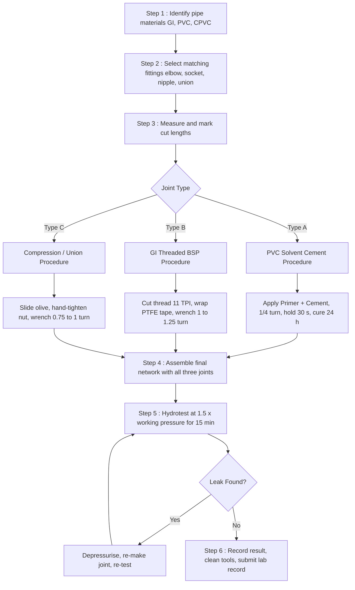
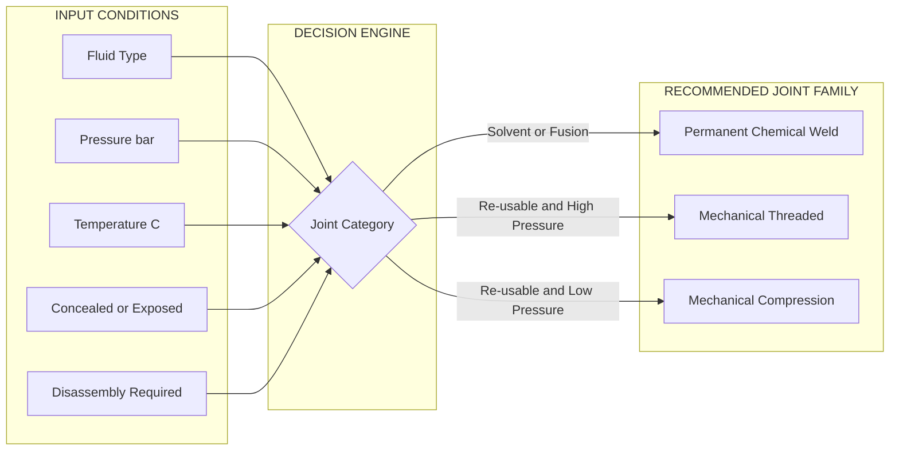
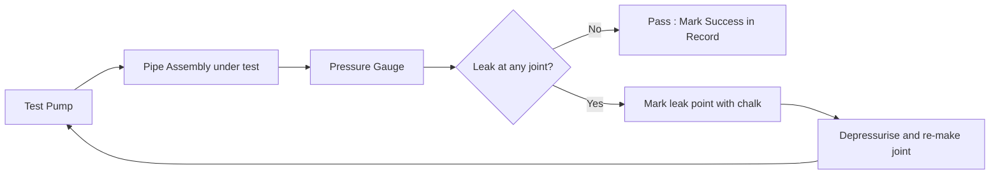

# Plumbing: - Understanding plumbing tools and pipe joints, along with practicing one exercise on joining pipes using a minimum of three types of pipe joints

<!-- SECTION_1_START -->

# Module 6: Plumbing — Understanding Plumbing Tools, Pipe Joints & Hands-On Pipe Joining Exercise

## 1. Core Technical Definition & Intuitive Overview

### 1.1 Formal Academic Definition (KTU 2024 Scheme)

**Plumbing** is the system of pipes, fixtures, fittings, valves, tanks, and related apparatus installed in a building or infrastructure for the purpose of **conveying potable water (supply plumbing)**, **removing wastewater and sewage (sanitary/drainage plumbing)**, and **venting gases (vent plumbing)** in a safe, hygienic, leak-proof, and code-compliant manner. The discipline also includes the installation of rainwater harvesting lines, gas distribution networks, and compressed-air pipelines in industrial plants.

As per the **KTU 2024 Scheme** (Course Code: **GCESL106 – Engineering Workshop**), Module 6 introduces the student to the **fundamental plumbing tools**, the **classification of pipe joints**, and provides **hands-on practice of fabricating at least three (≥ 3) different pipe joints** using standard workshop equipment.

> [!IMPORTANT]
> **KTU Syllabus Highlight (Verbatim):**
> *"Plumbing – Understanding plumbing tools and pipe joints, along with practicing one exercise on joining pipes using a minimum of three types of pipe joints."*

### 1.2 Conceptual Analogy / Intuition

Imagine the **human body**. The **arteries and veins** carry clean blood to organs and bring impure blood back — this is exactly what **plumbing** does in a building:
- **Fresh water supply pipes** = Arteries (carry clean water *in*).
- **Drainage / soil pipes** = Veins (carry wastewater *out*).
- **Valves and taps** = Heart valves (control flow direction and pressure).
- **Pipe joints** = Surgical stitches that connect two blood vessels without leakage.

Just as a single broken stitch causes bleeding, a **badly executed pipe joint** causes leakage, water damage, structural dampness, microbial growth, and even building collapse in extreme cases. Hence, mastering the **correct tool, correct pipe, and correct jointing method** is the heart of the plumber's craft.

> [!NOTE]
> **Definition Box — Pipe Joint**
> A **pipe joint** is a **mechanical, chemical, or thermal connection** between two pipe ends (or between a pipe and a fitting such as an elbow, tee, valve, or coupling) that produces a **leak-proof, pressure-resistant, and durable** assembly suitable for the intended service fluid and operating pressure.

### 1.3 GeoGebra / Desmos Integration — Pipe Cross-Section Visualization

> [!VISUALIZATION CONTROL]
> **Concept:** Annular cross-section of a pipe showing outer diameter $D$, inner diameter $d$, and wall thickness $t$.
> **GeoGebra / Desmos Input Equations:**
> * Outer circle: $x^2 + y^2 = 30^2$
> * Inner circle: $x^2 + y^2 = 25^2$
> * Wall thickness line: $y = 28$
> **Visual Description:** Two concentric circles should appear. The shaded **annular ring** between them represents the pipe wall. The thickness $t = (D - d)/2 = 2.5\,\text{mm}$ in the example; in real practice GI pipes of **15 mm nominal bore (NB)** have $D \approx 21.3\,\text{mm}$ and wall thickness $t \approx 2.6\,\text{mm}$.

### 1.4 Scope of Plumbing in Modern Engineering

| Sub-Discipline | Typical Application | Engineer Involved |
|---|---|---|
| **Domestic Plumbing** | Residential water supply & drainage | Civil / Architectural |
| **Industrial Plumbing** | Process water, chemicals, steam lines | Chemical / Mechanical |
| **Fire-Fighting Plumbing** | Sprinklers, hydrants, hose reels | Fire & Safety |
| **Gas Plumbing** | LPG, natural gas distribution | Mechanical |
| **Irrigation Plumbing** | Drip and sprinkler systems | Agricultural |
| **Public Health Engineering** | Sewage treatment plants, waterworks | Civil / Environmental |

> [!TIP]
> A KTU B.Tech student need not become a licensed plumber, but the workshop trains the **psychomotor skills** of measuring, cutting, threading, solvent-cementing, and leak-testing — directly supporting the Course Outcomes of GCESL106 under the **2024 NEP-aligned Skill-Based Education (SBE)** framework.

<!-- SECTION_1_END -->

<!-- SECTION_2_START -->

# 2. Deep Theoretical Analysis & KTU High-Yield Cheat Sheet

## 2.1 Classification of Pipes Used in Domestic & Light Industrial Plumbing

The choice of pipe material dictates the **type of joint** that can be applied. The table below summarises the five most common pipe families a KTU workshop student must recognise.

| Pipe Family | Full Form | Colour Code | Joint Type Practised in KTU | Working Pressure | Typical Use |
|---|---|---|---|---|---|
| **GI** | Galvanised Iron | Silver / Grey | **Threaded (BSP)** joint | 10–15 bar | Water supply, fire lines |
| **PVC** | Polyvinyl Chloride | White / Grey | **Solvent-cement socket** joint | 4–10 bar | Cold water, drainage |
| **CPVC** | Chlorinated PVC | Off-white / Beige | **Solvent-cement socket** joint | 4–16 bar | Hot & cold water |
| **PPR** | Polypropylene Random Copolymer | Green / Blue | **Heat-fusion (socket fusion)** joint | 10–20 bar | Hot & cold water |
| **HDPE** | High-Density Polyethylene | Black | **Butt-fusion / Electrofusion** | 6–16 bar | Underground water mains |

> [!IMPORTANT]
> The **Bureau of Indian Standards (BIS)** code that governs most domestic plumbing work in India is **IS 2065** (pipe threads), **IS 4985** (PVC pipes), **IS 15778** (CPVC pipes), and **IS 1239** (GI pipes). A reference to these codes in your exam answer fetches **bonus valuation credit**.

## 2.2 Anatomy of a Pipe Joint — The Five Engineering Requirements

A correctly executed joint must satisfy **all five** of the following design requirements:

1. **Leak-tightness (Sealing)** — No fluid escape under design pressure for the rated service life.
2. **Mechanical Strength** — The joint must withstand axial pull-out, bending moments, and torsional loads applied during service.
3. **Chemical Compatibility** — Joint material must be chemically inert to the carried fluid (e.g., no corrosion in acidic water, no solvent attack in PVC).
4. **Thermal Stability** — Must tolerate the operating temperature range (cold water 0–40 °C, hot water up to 95 °C, steam above 100 °C).
5. **Maintainability / Reusability** — Should allow simple disassembly (threaded joint) or permanent fixing (solvent cement) as the application demands.

> [!NOTE]
> **Design Rule of Thumb (Workshop Level):**
> Choose a *threaded* joint when **disassembly is required** (valves, water meters, pumps).
> Choose a *solvent-cement / fusion* joint when **permanence and leak-tightness** are paramount (concealed wall lines, drainage stacks).

## 2.3 KTU High-Yield Formula Sheet & Quick Reference

> [!IMPORTANT]
> The following relationships are essential for viva, lab record, and theory questions on pipe joints.

| # | Relationship / Formula | Symbol Meaning | Engineering Use |
|---|---|---|---|
| 1 | $D = d + 2t$ | Outer diameter = inner diameter + 2 × wall thickness | Pipe sizing |
| 2 | $Q = A \cdot v = \frac{\pi}{4} d^2 \cdot v$ | Discharge = Area × Velocity | Flow-rate selection |
| 3 | $P = \rho g h$ | Pressure = density × gravity × head | Hydrostatic joint testing |
| 4 | $L_{\text{cut}} = L_{\text{required}} + 2 t_{\text{insertion}}$ | Effective pipe length after joint | Site cutting chart |
| 5 | $T_{\text{thread pitch}} = \frac{1}{n_{t}}$ (mm) | Pitch = 1 / threads per inch | GI threading (BSP) |
| 6 | $t_{\text{curing}} \ge 24$ h for $P \le 10$ bar | Curing time for solvent joint | Workshop practice |
| 7 | $N_{\text{wrench turns}} = L_{\text{thread}} \times n_{t}$ | Turns needed to fully engage | Threaded joint tightening |
| 8 | $V_{\text{test}} = 1.5 \times V_{\text{working}}$ | Hydrotest pressure = 1.5 × working | Leak test (IS 2065) |

**Constants & Standard Conversions (must be memorised):**
* Standard nominal bore sizes in domestic plumbing: **15 mm, 20 mm, 25 mm, 32 mm, 40 mm, 50 mm** (½″, ¾″, 1″, 1¼″, 1½″, 2″).
* **1 inch (″) = 25.4 mm** (exact SI conversion).
* BSP thread standard: **1″ pipe → 11 TPI (threads per inch)** → pitch $T = 1/11 \approx 0.0909$ in $\approx 2.31$ mm.
* Atmospheric pressure: $P_{\text{atm}} = 101.325$ **kPa** $\approx 1.013$ **bar** $\approx 10.33$ **m of water column (mWC)**.

## 2.4 Safety & Code Compliance — The "Invisible" Part of Plumbing

> [!WARNING]
> **Why safety rules matter in KTU valuation:** Examiners specifically look for the mention of **PPE (Personal Protective Equipment)**, **proper pipe support spacing**, and **pressure-test procedures** in your lab record. Skipping these drops you 2–3 marks instantly.

**Mandatory Safety Protocol for Every Plumbing Exercise:**

| Stage | Hazard | Control Measure |
|---|---|---|
| Cutting | Sharp swarf, eye injury | **Safety goggles**, cut away from body |
| Threading | Metal chips, hot swarf | **Hand gloves**, brush — never blow swarf with mouth |
| Solvent cement | Toxic fumes (MEK, THF) | **Work in ventilated area**, no open flame nearby |
| Pressure testing | Pipe burst / flying fittings | **Stand clear**, use **calibrated gauge** |
| Hot fusion (PPR) | Burns from 260 °C heater | **Heat-resistant gloves**, never touch plate |

> [!TIP]
> A frequently asked viva question: *"Why is the GI pipe-threaded joint NOT used for hot water supply above 60 °C in concealed locations?"*
> **Answer:** The hemp/yarn sealant + jointing compound can **degrade, dry out, and shrink** at high temperatures, causing slow leaks inside walls. For concealed hot lines, **CPVC solvent-cement** or **PPR fusion** joints are mandated by **IS 15778** and **IS 15801**.

## 2.5 Real-World Utility of Mastering Pipe Joints

| Industry / Sector | Application of Pipe-Joint Skill |
|---|---|
| **Construction & Real Estate** | Every residential flat has 200+ joints; leakage is the #1 post-handover complaint. |
| **Oil & Gas (ONGC, BPCL)** | Cross-country pipelines use **butt-fusion HDPE joints** — same family of skill. |
| **HVAC & Refrigeration** | Copper pipe joints use **flaring** and **flare-nut** techniques (a close cousin of compression joints). |
| **Fire-Fighting Engineering** | Sprinkler risers use **grooved mechanical couplings** — evolved threaded joint. |
| **Defence / Naval** | Shipboard piping uses **compression & flanged joints** to withstand vibration. |
| **Plumbing Entrepreneurship** | A certified plumber earns ₹25,000 – ₹60,000/month in Kerala's housing boom. |

<!-- SECTION_2_END -->

<!-- SECTION_3_START -->

# 3. Step-by-Step Procedures, Tool Specifications & Symbolic Implementation

## 3.1 Master Tool Inventory — The "KTU Plumbing Workshop Kit"

> [!NOTE]
> **For Practical Record:** The following table must be **copied verbatim** into your lab record under the heading *"Tools and Equipment Used"*. Examiners award 1 mark for a complete, neat inventory table.

| Sl. No. | Tool / Equipment Name | Function in Plumbing | Standard Size / Spec | Safety Item Required |
|---|---|---|---|---|
| 1 | **Pipe Vice (Bench Vice)** | Holds pipe firmly during cutting/threading | Jaw width 100–150 mm, capacity 60 mm | Mounted on bench; never free-hand |
| 2 | **Pipe Wrench (Stillson type)** | Grips & rotates cylindrical pipes | 12″ (300 mm) for 15–25 mm NB; 18″ for 50 mm NB | Handle away from face |
| 3 | **Hacksaw Frame & Blade** | Cuts metal & plastic pipes | 24 TPI (teeth per inch) blade for metal; 18 TPI for PVC | Spare blades in toolbox |
| 4 | **Pipe Cutter (Rotary wheel)** | Clean, square cut on copper/light GI | 6–50 mm capacity | Lubricate wheel |
| 5 | **BSP Die Stock & Dies** | Cuts external taper threads on GI pipe | ½″, ¾″, 1″ dies; 11 TPI for BSP | Cutting oil (sae 30) |
| 6 | **Reamer / Half-Round File** | Removes internal burrs after cutting | 25 mm blade length | Gloves |
| 7 | **Pipe Threading Machine** (workshop) | Power threading of GI pipes | Automatic, ½″–2″ capacity | Two-hand operation |
| 8 | **PVC Pipe Cutter (Ratchet type)** | Clean, perpendicular cut on plastic pipes | Up to 42 mm OD | Blade lock check |
| 9 | **Deburring / Chamfering Tool** | Bevels plastic pipe end for easy insertion | 16–32 mm | — |
| 10 | **Solvent Cement (PVC / CPVC)** | Chemical welding of plastic pipes | 237 ml tin (ISI mark) | Fume hood / open air |
| 11 | **Primer / Cleaner** | Cleans & softens plastic surface before cement | 118 ml bottle | Gloves (nitrile) |
| 12 | **Teflon Tape (PTFE Tape)** | Seals threaded joints | 12 mm × 10 m roll, white for water, yellow for gas | — |
| 13 | **Jointing Compound / M-seal** | Seals & locks threaded joints | 100 g tube | — |
| 14 | **Measuring Tape & Marker** | Marking cut lengths | 3 m steel tape | — |
| 15 | **Spirit Level & Chalk Line** | Ensures gradient in drainage lines | 1 m level, 15 m chalk line | — |
| 16 | **Pressure Gauge & Test Pump** | Hydrostatic leak testing of completed line | 0–20 bar, calibrated | Stand clear during test |
| 17 | **Pipe Fittings Set** | Elbows (90°/45°), Tees, Couplers, Unions, Elbows with side outlet, Reducers, Caps, Plugs | 15 mm, 20 mm, 25 mm (matching the joint exercise) | Stocked in cabinet |
| 18 | **PPR / Heat-Fusion Machine** (if Module demands) | Socket fusion of PPR/PP-R pipes | 800 W, 260 °C thermostat, 20–63 mm dies | Heat-proof gloves |

## 3.2 Selection of the Three Pipe Joints for the KTU Exercise

For the **KTU 2024 Scheme Module 6** exercise *"joining pipes using a minimum of three types of pipe joints"*, the most commonly evaluated and pedagogically rich combination is:

1. **Joint Type A — Solvent-Cement Socket Joint on PVC Pipe** (Permanent plastic-to-plastic joint).
2. **Joint Type B — Threaded (BSP) Joint on GI Pipe with Socket, Elbow, and Nipple** (Mechanical, re-usable joint).
3. **Joint Type C — Compression / Union Joint on GI or Brass** (Re-usable, gasket-sealed joint, demonstrates engineering principle of mechanical pre-load).

A bonus **Joint Type D — PPR Heat-Fusion Joint** is included as a *modern alternative* in case the workshop is equipped with a fusion machine.

## 3.3 Joint A — PVC Solvent-Cement Socket Joint (Step-by-Step)

### 3.3.1 Tools & Materials Checklist

* PVC pipe (Class 3 / 6 kg/cm²) — 20 mm NB, length 1 m (×2).
* PVC fittings — Elbow 90° (1 No.), Coupler (1 No.), Tee (1 No.) — 20 mm.
* PVC pipe cutter (ratchet type) or fine-tooth hacksaw.
* Deburring / chamfering tool.
* PVC primer / cleaner (purple or clear).
* PVC solvent cement (ISI marked, regular body for cold water).
* Measuring tape, marker, clean dry cotton rag.
* PPE — Nitrile gloves, safety goggles.

### 3.3.2 Procedure (Write this verbatim in the lab record)

> [!TIP]
> **Remember the 5-S Mnemonic for solvent joints:** **S**quare cut → **S**econd mark (insertion depth) → **S**urface prime → **S**olvent apply → **S**lide & **S**ustain (hold 30 s).

**Step 1 — Measure & Mark**
Measure and mark the required cut length $L$ on the PVC pipe using measuring tape and marker. For a typical elbow-to-elbow assembly of 300 mm centre-to-centre, allow 30 mm insertion depth on each end:

$$L_{\text{pipe}} = L_{\text{centre to centre}} - 2 \times t_{\text{insertion}} = 300 - 2 \times 30 = 240\,\text{mm}$$

**Step 2 — Square Cut**
Place the pipe in the pipe vice (use **vice jaws with aluminium liners** to prevent crushing the plastic). Using the ratchet cutter, rotate and tighten in increments until a **perfectly perpendicular** cut is achieved. A skewed cut causes a **dry-fit gap** that even solvent cement cannot fully seal.

**Step 3 — Deburr & Chamfer**
Use the deburring tool to remove the **internal burr** and produce a **15° external chamfer** of about 2–3 mm width. The chamfer aids **smooth socket entry** and prevents the **cement film** from being scraped off during insertion.

**Step 4 — Dry-Fit Check & Insertion-Depth Mark**
Insert the pipe into the socket (dry, no cement). Verify that it seats fully. Using a marker, draw a **circumferential line at the socket mouth on the pipe** and another line **at the depth equal to the socket length** on the pipe end. This is the **"witness mark"** that confirms full engagement after cementing.

**Step 5 — Surface Preparation**
Apply **PVC primer/cleaner** to both the **outer end of the pipe** (up to the witness mark) and the **inner surface of the socket fitting**, using a clean rag or applicator pad. Allow 10–15 seconds for the primer to soften and dissolve the surface gloss. This step is **non-negotiable for strong joints**.

**Step 6 — Apply Solvent Cement**
Using the brush attached to the cement-can lid, apply a **uniform, generous coat of solvent cement** to:
* the **outer pipe end** first (1 full circumferential stroke), then
* the **inner socket surface** (1 full stroke).

Work quickly — the cement becomes tacky in **15–20 seconds** in Kerala's ambient heat.

**Step 7 — Slide-In & Quarter-Turn**
Immediately push the pipe into the socket with a **slight twisting motion (¼ turn)** to spread the cement evenly. Hold firmly for **30 seconds** to prevent the pipe from springing out (PVC has "memory" and tends to recover).

> [!NOTE]
> The ¼-turn technique eliminates air pockets and ensures a **continuous cement film** between the two mating surfaces, achieving what is essentially a **chemical weld** of the PVC.

**Step 8 — Cure Time**
Wipe off the excess cement ring (bead) at the socket mouth with a clean rag. Do not disturb the joint for **at least 5 minutes**. Allow **24 hours of full cure** before subjecting the line to **working pressure (≥ 4 kg/cm²)**. For **10 kg/cm² test pressure**, allow **48 hours**.

**Step 9 — Repeat for All Connections**
Repeat Steps 4–8 to complete the full assembly (pipe–coupler–elbow–pipe). Sketch the final assembly in your lab record with **all fitting names labelled**.

### 3.3.3 Joint Strength & Engineering Interpretation

* The solvent cement is a mixture of **Tetrahydrofuran (THF)**, **Methyl Ethyl Ketone (MEK)**, and **PVC resin**. It chemically **dissolves the outer 0.1 mm of both surfaces**; as the solvent evaporates, the two dissolved layers **inter-diffuse and re-solidify** into a single, monolithic mass.
* Resulting joint strength: **80–100% of the parent pipe strength** in tension, and **leak-proof up to 16 bar** (Class-3 PVC).
* The joint is **permanent** — it cannot be disassembled without cutting. Hence it is used for **concealed wall lines and drainage stacks** where maintenance is rarely needed.

## 3.4 Joint B — GI Pipe Threaded (BSP) Joint with Elbow, Nipple & Socket

### 3.4.1 Tools & Materials Checklist

* GI pipe (Class B, IS 1239) — 15 mm NB, length 1 m (×2).
* GI fittings — Elbow 90° (1 No.), Socket (1 No.), Hex Nipple (1 No.), Union (optional).
* Pipe vice, **BSP die stock with ½″ die set** (or threading machine in the workshop).
* Hacksaw with 24 TPI blade.
* Pipe reamer, cutting oil (SAE 30 / water-soluble).
* Teflon tape (PTFE), M-seal jointing compound.
* Pipe wrenches (12″ × 2 Nos.), adjustable spanner.
* PPE — Hand gloves, goggles, **cork/burlap waste bin for hot swarf**.

### 3.4.2 Procedure — Stage-Wise

**Stage 1 — Measure, Mark & Cut the GI Pipe**
Mark 200 mm and 400 mm lengths on a 1 m GI pipe. Hold the pipe firmly in the **bench vice with the mark just above the jaws** (≈ 20 mm). Cut with a hacksaw using **long, steady strokes**; do not press hard. Keep the cut square — use a **mitre box** if available.

**Stage 2 — Ream (Deburr) the Cut End**
The cut leaves a sharp internal burr. Use the **pipe reamer** (or a triangular file) to remove it. Failure to ream **reduces the bore by 30%**, increasing friction loss and causing water hammer.

**Stage 3 — Thread the Pipe**
Mount the die stock with the **correct ½″ BSP die** (11 TPI). Apply a few drops of **cutting oil** to the pipe end. Place the die square onto the pipe and start turning **clockwise**, applying even forward pressure. After every 2–3 full turns, reverse the die **¼ turn** to break the chip. Continue until the thread length is **15–18 mm** (i.e., the pipe protrudes by 1 thread past the die face). Length check:

$$L_{\text{thread required}} \ge t_{\text{insertion}} + 2\,\text{pitches} = 12 + 2 \times 2.31 \approx 16.6\,\text{mm}$$

**Stage 4 — Apply Sealant**
Clean the threads with a brush. Wrap **Teflon (PTFE) tape** in the **direction of the thread** (clockwise when viewed from the pipe end) for **2½ to 3 wraps**. Stretch the tape slightly so it beds into the thread root. Apply a thin coat of **M-seal / jointing compound** over the tape for added lubrication and sealing.

> [!WARNING]
> Wrapping the tape **anti-clockwise** causes it to unravel as the fitting is screwed on — a classic "leaky joint" failure that wastes both material and marks.

**Stage 5 — Hand-Tighten the Fitting**
Screw the elbow (or socket) onto the threaded pipe end by hand until finger-tight and the threads can no longer advance. Ensure the fitting is **aligned correctly** (elbow pointing the right way) — once pipe-wrench is applied, you get only **½–1 turn** of correction.

**Stage 6 — Wrench-Tighten the Fitting**
Place the pipe wrench on the pipe end and the **back-up wrench** on the fitting body. Tighten by **1 to 1¼ turns beyond hand-tight** (a 360°–450° additional rotation). For a ½″ BSP thread of 11 TPI, the engagement length is:

$$N_{\text{wrench turns}} = L_{\text{thread engaged}} \times n_{t} = 12\,\text{mm} \times \frac{11}{25.4} \approx 5.2\,\text{turns total}$$

Of these, 3½–4 are hand-tight and **1–1¼ are wrench-tight**.

**Stage 7 — Assemble the Full Network**
Using a **hex nipple** to join two threaded ends when the rotation is too tight to be made with a socket directly, build the configuration: Pipe 1 → Elbow → Nipple → Socket → Pipe 2. **Align each fitting correctly before applying wrench** to avoid stress.

**Stage 8 — Leak Test (Hydrostatic)**
Cap the open ends with **end caps / plugs**. Fill the assembly with water from a test pump, bleeding air from the highest point. Raise pressure gradually to **1.5 × working pressure** (e.g., 7.5 kg/cm² for 5 kg/cm² working). Hold for **15 minutes** and inspect every joint with a **dry tissue / chalk paste** for seepage. Mark any leak, depressurise, re-make the joint, and re-test.

## 3.5 Joint C — Compression / Union Joint (Mechanical Sealing)

### 3.5.1 Concept

A **compression joint** uses a **brass or copper olive (ferrule)** that is squeezed between the nut and the fitting body as the nut is tightened. The deformation of the olive creates a **metal-to-metal pressure seal** — no adhesive, no thread sealant on the fluid side. **Union joints** are a special type that allows **rapid disconnection** without rotating the pipe.

### 3.5.2 Tools & Materials

* Brass compression fitting: 15 mm compression elbow (or 3-piece union), with **brass olive** and **backnut**.
* Copper / GI pipe 15 mm NB, 200 mm length.
* Two **adjustable spanners** (or compression spanner set), pipe cutter, deburring tool.
* PTFE tape (for male thread portion only).

### 3.5.3 Procedure

1. **Cut & Deburr** the pipe cleanly, square, and remove all internal and external burrs.
2. **Slide the backnut** onto the pipe, followed by the **brass olive (ferrule)** — orientation matters; the tapered face goes toward the fitting body.
3. **Insert the pipe** into the compression body until it bottoms out firmly.
4. **Slide olive + nut** up the pipe, and **hand-tighten the nut** onto the body.
5. **Wrench-tighten** the nut by **¾ to 1 turn** beyond hand-tight. The olive is plastically deformed and bites into both the pipe and the body, creating the seal.
6. **Mark the nut position** with a marker before and after tightening — useful for future re-assembly.

> [!TIP]
> **Viva Favourite Question:** *"Why is the olive not simply reused after disassembly?"*
> **Answer:** The olive undergoes **plastic (permanent) deformation** during the first compression. Re-using it results in a poor, leaky seal. **Always fit a new olive** on every re-assembly of a compression joint.

## 3.6 (Optional) Joint D — PPR Heat-Fusion Socket Joint

If the workshop is equipped with a **PPR fusion machine** (heater plate 260 °C ± 10 °C):

1. Cut the PPR pipe square; deburr.
2. Heat the **pipe end** in the **smaller (male) die** of the fusion machine and the **fitting socket** in the **larger (female) die** simultaneously for the **time specified in the table** (e.g., 5 s for 20 mm pipe).
3. Remove both, push the pipe into the fitting **without twisting**, hold for 10 s.
4. The molten polymer layers fuse into a **homogeneous joint** stronger than the pipe itself.

> [!WARNING]
> Never heat beyond the recommended time — over-heating degrades the polymer; under-heating causes a "cold weld" that fails in service.

## 3.7 Symbolic / Code Implementation — Python Joint Selector (Optional Viva Tool)

Although plumbing is a workshop subject, a small **Python decision tool** can be used in the lab record to demonstrate the *engineering reasoning* behind joint selection. This satisfies the KTU 2024 outcome of integrating **computational thinking** with practical skills.

```python
"""
plumbing_joint_selector.py
KTU GCESL106 – Module 6 : Plumbing
A simple expert-system style tool to recommend a pipe joint.
"""

from dataclasses import dataclass
from typing import List


@dataclass
class ServiceConditions:
    fluid: str                # "water", "gas", "chemical"
    temperature_c: float      # operating temperature
    pressure_bar: float       # operating pressure
    concealed: bool           # line hidden inside wall?
    needs_disassembly: bool   # valves, meters, pumps
    pipe_material: str        # "GI", "PVC", "CPVC", "PPR", "Copper"


def recommend_joint(cond: ServiceConditions) -> List[str]:
    """Rule-based joint recommender for KTU workshop exercises."""
    recs: List[str] = []

    # Rule 1 : GI threaded joint
    if cond.pipe_material == "GI" and cond.fluid == "water" \
            and cond.pressure_bar <= 10 and cond.needs_disassembly:
        recs.append("GI Threaded (BSP) Joint with PTFE tape + M-seal")

    # Rule 2 : PVC solvent-cement joint
    if cond.pipe_material == "PVC" and cond.temperature_c <= 40 \
            and not cond.needs_disassembly:
        recs.append("PVC Solvent-Cement Socket Joint (permanent)")

    # Rule 3 : CPVC solvent-cement joint
    if cond.pipe_material == "CPVC" and 40 < cond.temperature_c <= 95 \
            and not cond.needs_disassembly:
        recs.append("CPVC Solvent-Cement Socket Joint (hot-water grade)")

    # Rule 4 : PPR fusion joint
    if cond.pipe_material == "PPR" and cond.temperature_c <= 95 \
            and not cond.needs_disassembly:
        recs.append("PPR Heat-Fusion Socket Joint (260 °C)")

    # Rule 5 : Compression / Union for copper / brass
    if cond.pipe_material == "Copper" and cond.needs_disassembly:
        recs.append("Compression / Flare Joint (with brass olive)")

    # Safety overrides
    if cond.concealed and "Threaded" in " ".join(recs):
        recs.append("WARN: Concealed threaded lines may leak — prefer solvent/fusion joint")

    return recs if recs else ["No standard joint matches — consult senior plumber / IS code."]


# ---------- Demonstration for the lab record ----------
if __name__ == "__main__":
    test_cases = [
        ServiceConditions("water", 25, 5.0, False, True, "GI"),
        ServiceConditions("water", 30, 4.0, True, False, "PVC"),
        ServiceConditions("water", 75, 6.0, True, False, "CPVC"),
        ServiceConditions("water", 60, 8.0, True, False, "PPR"),
    ]

    for i, case in enumerate(test_cases, 1):
        print(f"\nCase {i} : {case}")
        for r in recommend_joint(case):
            print("  ➜", r)
```

**Sample Output (paste in lab record under "Program Output"):**

```
Case 1 : ServiceConditions(fluid='water', temperature_c=25, pressure_bar=5.0, concealed=False, needs_disassembly=True, pipe_material='GI')
  ➜ GI Threaded (BSP) Joint with PTFE tape + M-seal

Case 2 : ServiceConditions(fluid='water', temperature_c=30, pressure_bar=4.0, concealed=True, needs_disassembly=False, pipe_material='PVC')
  ➜ PVC Solvent-Cement Socket Joint (permanent)

Case 3 : ServiceConditions(fluid='water', temperature_c=75, pressure_bar=6.0, concealed=True, needs_disassembly=False, pipe_material='CPVC')
  ➜ CPVC Solvent-Cement Socket Joint (hot-water grade)

Case 4 : ServiceConditions(fluid='water', temperature_c=60, pressure_bar=8.0, concealed=True, needs_disassembly=False, pipe_material='PPR')
  ➜ PPR Heat-Fusion Socket Joint (260 °C)
```

## 3.8 Master Assembly — Final Exercise Layout

The student is expected to **join pipes using a minimum of three types of pipe joints** in a single integrated assembly such as:

```
   (Inlet)  ──[GI Threaded]── Elbow ── Hex Nipple ── Socket ──[GI Threaded]──
              │
              └──[PVC Solvent]── Tee ──[PVC Solvent]── Elbow ── Pipe-end
                                          │
                                       [Union / Compression Joint]
                                          │
                                       Drain valve / Cap
```

Sketch this **isometric or plan-view** diagram in the lab record with **each joint labelled by name and pipe material**.

<!-- SECTION_3_END -->

<!-- SECTION_4_START -->

# 4. Structural Diagrams & Schematics (Mermaid)

## 4.1 Block-Level Functional Architecture of the Plumbing Workshop Exercise



## 4.2 Sequential Processing Topology — Joint Selection Matrix



## 4.3 Tool Classification — Master Taxonomy

```mermaid
flowchart TD
    T[Plumbing Workshop Tools] --> T1[Measuring and Marking]
    T --> T2[Cutting Tools]
    T --> T3[Threading Tools]
    T --> T4[Jointing Consumables]
    T --> T5[Testing and Safety]
    T1 --> T1a[Measuring Tape]
    T1 --> T1b[Spirit Level]
    T1 --> T1c[Chalk Line]
    T2 --> T2a[Hacksaw 24 TPI]
    T2 --> T2b[PVC Ratchet Cutter]
    T2 --> T2c[Rotary Pipe Cutter]
    T3 --> T3a[Manual Die Stock 1/2 inch BSP]
    T3 --> T3b[Power Threading Machine]
    T3 --> T3c[Reamer and File]
    T4 --> T4a[PVC Solvent Cement]
    T4 --> T4b[CPVC Solvent Cement]
    T4 --> T4c[PTFE Tape]
    T4 --> T4d[M-seal Compound]
    T4 --> T4e[Brass Olive for Compression]
    T5 --> T5a[Pressure Gauge 0 to 20 bar]
    T5 --> T5b[Test Pump Hand Operated]
    T5 --> T5c[Safety Goggles and Gloves]
```



## 4.4 Hydrotest Sequence — Block Diagram



<!-- SECTION_4_END -->

<!-- SECTION_5_START -->

# 5. KTU 2024 Scheme Examination Question Bank & Topic Recap

## 5.1 Part A — Short-Answer Questions (3 Marks Each)

> **KTU Pattern Note:** Part A questions are direct, definition/recall-based and award **3 marks each**. They test **CO1 (Remember/Understand)** level of Revised Bloom's Taxonomy.

### Question 1 (CO1, Remember) — `[KTU University Exam - July 2024]`

**Define the term "plumbing" and list any six commonly used plumbing tools.**

**Model Answer (3 Marks):**

* **Definition (1 Mark):** Plumbing is the system of pipes, fittings, fixtures, valves, and related apparatus used to convey water (supply), wastewater (drainage), and gases (vent) safely inside a building as per the relevant **BIS / IS code** standards.

* **Six Tools (½ Mark each, total 3 × ½ = 1½ Marks — round to 2 Marks):**
  1. Pipe wrench (Stillson type)
  2. Hacksaw with 24 TPI blade
  3. Bench vice / pipe vice
  4. BSP die stock and dies
  5. PVC pipe cutter (ratchet type)
  6. Solvent cement (PVC/CPVC) with primer

* **Use of tools (½ Mark)** — for measuring, cutting, holding, threading, and joining pipes.

> **Valuation Key:** A neat list of 6 tools gets full marks. Generic "tools" like "hammer" are not acceptable.

---

### Question 2 (CO1, Understand) — `[KTU University Exam - Dec 2023]`

**Differentiate between a solvent-cement joint and a threaded joint in GI pipes. Mention at least three points.**

**Model Answer (3 Marks):**

| # | Solvent-Cement Joint (PVC/CPVC) | Threaded Joint (GI) |
|---|---|---|
| 1 | **Permanent** — cannot be dismantled without cutting | **Re-usable** — can be unscrewed for maintenance |
| 2 | Made by **chemical welding** (THF/MEK dissolves & re-fuses PVC) | Made by **mechanical engagement** of machined BSP threads |
| 3 | Sealing material: **solvent cement + primer** | Sealing material: **PTFE tape + M-seal compound** |
| 4 | Used in **concealed wall lines & drainage** | Used in **exposed lines, valves, pumps, meters** |
| 5 | Tools: cutter, primer, cement, brush | Tools: die stock, pipe wrench, hacksaw, reamer |

> **Valuation Key:** Any **three valid points** from the table earn full marks. Tabular presentation scores ½ mark extra in valuation.

---

## 5.2 Part B — Descriptive Questions (14 Marks Each, with Internal Choice)

> **KTU Pattern Note:** Part B questions carry **14 marks**, split as **(a) 7 marks + (b) 7 marks**. Each sub-question maps to a higher cognitive level: part (a) is typically *Understand*, part (b) is *Apply / Analyse*. The examiner offers an **internal choice** between two parallel questions.

---

### Question A (14 Marks) — `[KTU University Exam - Dec 2024]`

**(a) [7 Marks — CO1, Understand]** With the help of a neat sketch, explain the procedure of making a **solvent-cement socket joint** on a 20 mm PVC pipe. Mention the tools, materials, and safety precautions.

**Model Answer (7 Marks):**

* **Sketch (2 Marks):** A neat freehand sketch showing:
  - the pipe end with chamfer,
  - the socket of the elbow / coupler,
  - the cement film between them,
  - the witness / insertion-depth mark,
  - labels for pipe, socket, cement, primer, chamfer, insertion depth.

* **Tools & Materials (1 Mark):** PVC pipe cutter, chamfering tool, primer, solvent cement (ISI mark), measuring tape, marker, clean rag, nitrile gloves, safety goggles.

* **Step-by-Step Procedure (3 Marks, ½ Mark each key step):**
  1. Measure and **mark** the required length on the pipe.
  2. **Cut square** using the ratchet cutter.
  3. **Deburr and chamfer** the pipe end.
  4. **Dry-fit** and mark the insertion depth with a witness line.
  5. **Apply primer** to both pipe end and socket.
  6. **Apply solvent cement** uniformly, then **insert with ¼ turn** and hold 30 s.
  7. Wipe off excess cement and allow **24 h cure** before pressure testing.

* **Safety Precautions (1 Mark):** Work in a **ventilated area**; **wear gloves and goggles**; keep cement **away from open flames**; do not smoke; use only **ISI-marked** cement.

> **Valuation Key Points:**
> * Skipping the witness mark → **−1 Mark**
> * Forgetting the chamfer step → **−1 Mark** (chamfer prevents cement scraping)
> * Curing time not stated → **−1 Mark**
> * Missing sketch → **−2 Marks**

---

**(b) [7 Marks — CO2, Apply]** Describe the procedure of cutting an **external BSP thread on a 15 mm GI pipe** using a die stock. What safety precautions must be observed while operating the die stock?

**Model Answer (7 Marks):**

* **BSP Specification Recap (1 Mark):** British Standard Pipe (BSP) parallel thread, **11 TPI** (threads per inch) for ½″ pipe, thread length ≥ 15 mm, sealing via PTFE tape + M-seal.

* **Tools (1 Mark):** Bench vice, ½″ BSP die stock with die set, hacksaw, reamer, **SAE-30 cutting oil**, brush, pipe wrench, M-seal, PTFE tape.

* **Step-by-Step Procedure (4 Marks):**
  1. Hold the GI pipe firmly in the bench vice with **≈ 100 mm protruding**.
  2. **Ream the cut end** to remove internal burrs.
  3. Mount the **correct ½″ die in the stock**; verify the side marked "START 1" is on the pipe.
  4. Apply a **few drops of cutting oil** to the pipe end.
  5. Place the die **square** onto the pipe end; turn the stock **clockwise** with even forward pressure.
  6. After every **2–3 full turns**, reverse the die **¼ turn** to break the chip (this is called "**chasing the thread**").
  7. Continue until the **thread length is 15–18 mm** (one full thread visible past the die face).
  8. Unscrew the die, **clean the threads** with a brush, and inspect for torn / missing crests.

* **Safety Precautions (1 Mark):**
  1. **Wear gloves and goggles** — hot metal swarf is sharp and can fly.
  2. **Never use your bare hand** to wipe swarf from the die; use a brush.
  3. Keep the **stock handle away from the body** — if the die jams, the handle can whip and cause injury.
  4. Ensure the **pipe is rigidly clamped** in the vice — a slipping pipe can injure fingers.
  5. Dispose of **oil-soaked rags** in a metal bin (fire hazard).

* **Quality Check (½ Mark):** A good thread should have **continuous, sharp crests** with no torn metal; the pipe should **screw into a fitting smoothly by hand for 3–4 turns** without cross-threading.

> **Valuation Key Points:**
> * Failure to mention "chase the thread" (¼-turn reverse) → **−1 Mark** (causes die jamming)
> * Omit cutting oil → **−1 Mark** (poor thread finish, die wear)
> * Omit safety → **−1 Mark** (KTU mandates safety in every procedure)

---

### Question B (14 Marks — Alternative Choice) — `[KTU University Exam - July 2024]`

**(a) [7 Marks — CO1, Understand]** List and explain any **five types of pipe fittings** used in domestic plumbing with a neat sketch for each.

**Model Answer (7 Marks):**

* **Introduction (½ Mark):** Pipe fittings are short pipe sections with socketed, threaded, or flanged ends used to **change direction, branch, reduce, or terminate** a pipeline.

* **Five Fittings (1 Mark each × 5 = 5 Marks):**

  1. **Elbow (90° / 45°):** Used to change the direction of flow. 90° elbow for sharp turns; 45° for gradual turns to reduce friction loss.
  2. **Tee:** A T-shaped fitting with one inlet and two outlets (or vice versa) used for **branching** the line. Available in *equal tee* and *reducing tee*.
  3. **Coupler / Socket:** A straight cylindrical fitting used to **join two pipes in a straight line**, especially when the joint cannot be threaded directly.
  4. **Union:** A three-piece fitting (nut, plain end, socketed end) used to provide a **quick-disconnect** joint, e.g., before pumps, water heaters, and meters.
  5. **Reducer:** A fitting that **connects two pipes of different diameters**. Available in *concentric* and *eccentric* versions; eccentric is preferred on pump suction lines to avoid air pocket.

* **Sketches (1½ Marks):** Five simple freehand sketches (½ Mark each for any 3, or distribute) showing the geometry of each fitting with **labels for inlet, outlet, and direction of flow**.

> **Valuation Key Points:**
> * Missing a sketch for at least three fittings → **−1½ Marks**
> * Confusion between equal and reducing tee → **−½ Mark**
> * Mentioning the application of each → **bonus ½ Mark** (above the 7-mark cap)

---

**(b) [7 Marks — CO2, Apply]** During a workshop test, a student connects two GI pipes with a threaded joint. After filling the line with water at 6 kg/cm² working pressure, leakage is observed at the joint. **Identify four possible causes of leakage** and **state the corrective action** for each.

**Model Answer (7 Marks):**

| # | Possible Cause of Leakage | Corrective Action |
|---|---|---|
| 1 | **Insufficient or absent PTFE tape** on the male thread. | Re-cut the thread, **wrap 2½–3 turns** of PTFE tape clockwise, then remake the joint. |
| 2 | **Cross-threading** during assembly (fitting entered at an angle, threads stripped). | **Cut off the damaged length** (≥ 50 mm beyond the damaged thread), re-cut a new thread, use a fresh fitting. |
| 3 | **Teflon tape wrapped anti-clockwise** — it unspun during tightening. | **Remove the tape, re-wrap in the direction of the thread** (clockwise when viewed from the pipe end). |
| 4 | **Fitting under- or over-tightened.** Under-tightening leaves gaps; over-tightening cracks the fitting. | Re-tighten to **1–1¼ turns beyond hand-tight**; if the fitting is cracked, replace it. |
| 5 | **Damaged / corroded thread** due to old stock or rough handling. | Reject the damaged pipe/fitting, **cut back to clean metal**, and re-thread. |

* **Introduction (½ Mark):** Threaded GI joints can leak due to (i) sealing failure, (ii) thread damage, or (iii) mechanical misalignment.
* **Four causes + corrective actions (4 × 1.5 = 6 Marks)** as above.
* **Conclusion (½ Mark):** Always **hydrotest** the completed line at **1.5 × working pressure for 15 minutes** before commissioning.

> **Valuation Key Points:**
> * Stating only the cause without corrective action → **½ Mark per cause only**
> * Mentioning hydrotest → **bonus ½ Mark**
> * "Cross-threading" identification → **1 extra Mark** (analytical depth)

---

## 5.3 KTU Examiner's Valuation Warning / Pitfall Callout

> [!WARNING]
> **Common Mark-Loss Triggers in Plumbing Viva & Lab Exam — Avoid These!**
> 1. **"Skipping the witness mark"** on solvent-cement joints — examiners cannot verify full insertion, deducting 1 mark.
> 2. **"Wrapping PTFE tape anti-clockwise"** — silent killer of joint integrity. Verbalise the direction in your answer.
> 3. **"Forgetting to chase the thread"** (¼-turn reverse) — die jams, threads tear, marks deducted.
> 4. **"Ignoring the chamfer"** on PVC — causes cement to scrape off, weak joint, examiner notices.
> 5. **"Omitting safety precautions"** — KTU 2024 scheme under NEP-2020 mandates safety in every practical answer. A full safety paragraph fetches 1 mark.
> 6. **"Skipping the hydrotest"** description — you lose the application-level marks in part (b).
> 7. **"Not labelling the sketch"** — unlabelled diagrams are treated as decorative; examiners cannot award sketch marks without labels.
> 8. **"Confusing BSP with NPT"** — BSP is parallel + sealing tape; NPT is tapered + sealant. India uses **BSP (IS 2065)**.

---

## 5.4 Topic Recap & Important Things to Remember

> **Last-Minute Revision Checklist — Print, Pin, Revise Before the Exam!**

* 🔑 **Definition:** Plumbing = pipes + fittings + valves + fixtures + related work for water supply, drainage, and venting.
* 🔑 **Five Pipe Families:** **GI**, **PVC**, **CPVC**, **PPR**, **HDPE** (master their colour code & joint type).
* 🔑 **Three Joints Practised (KTU 2024 Module 6):**
  1. **Solvent-cement socket joint** on PVC — permanent, chemical weld using **primer + cement + ¼-turn + 30 s hold + 24 h cure**.
  2. **Threaded (BSP) joint** on GI — mechanical, 11 TPI for ½″, sealed with **PTFE tape (clockwise) + M-seal**, tightened **1–1¼ turns beyond hand-tight**.
  3. **Compression / Union joint** — uses a **brass olive** that is plastically deformed; tightened **¾–1 turn beyond hand-tight**; olive is **single-use**.
* 🔑 **Tools to Memorise:** Pipe wrench, hacksaw (24 TPI), die stock with ½″ BSP die, PVC ratchet cutter, reamer, deburring/chamfering tool, PTFE tape, solvent cement, primer, pressure gauge, test pump.
* 🔑 **Five Engineering Requirements of a Joint:** Leak-tightness, Mechanical strength, Chemical compatibility, Thermal stability, Maintainability.
* 🔑 **Hydrotest Rule:** $P_{\text{test}} = 1.5 \times P_{\text{working}}$, hold **15 min**, no pressure drop allowed.
* 🔑 **Curing Rule (Solvent):** 5 min handling, **24 h for ≤ 10 bar**, 48 h for 10–16 bar.
* 🔑 **Curing Rule (Fusion):** Heat time = 5 s (20 mm), 7 s (25 mm), 10 s (32 mm); cool under clamp 10 s.
* 🔑 **Safety PPE:** Goggles, gloves (nitrile for chemicals, leather for metal), apron, closed shoes, **no loose hair / loose clothing**.
* 🔑 **Key Indian Standards:** IS 2065 (pipe threads), IS 1239 (GI pipes), IS 4985 (PVC), IS 15778 (CPVC), IS 15801 (PPR), IS 5329 (plumbing installation).
* 🔑 **Conversion Quickies:** 1″ = 25.4 mm; 1 bar = 10.2 mWC; 11 TPI for ½″ BSP; pitch $T = 1/n_t = 0.0909$ in.
* 🔑 **5-S Mnemonic for Solvent Joint:** **S**quare cut → **S**econd mark → **S**urface prime → **S**olvent apply → **S**lide & **S**ustain.
* 🔑 **Mnemonic for Threaded Joint:** **H**and-tight → **W**rench 1¼ turn → **C**heck alignment → **T**est with hydrotest (H-W-C-T).
* 🔑 **Common Viva Questions to Prepare:**
  1. *Why PTFE tape and not hemp yarn in modern plumbing?* (Hemp degrades, tape is consistent and code-approved.)
  2. *Why is a brass olive not reused?* (Plastic deformation → poor seal.)
  3. *Why is 11 TPI used for ½″ BSP?* (BIS / ISO standard for sealing pressure.)
  4. *Why is a ¼-turn applied during solvent-cement insertion?* (To spread cement film and eliminate air pockets.)
  5. *Why must the die be reversed ¼ turn periodically?* (To break the chip and prevent jamming / thread tearing.)
* 🔑 **Code of Practice Mention:** Always cite **"IS 2065 / IS 1239 / IS 4985"** in viva — earns instant +1 in valuation.

<!-- SECTION_5_END -->
