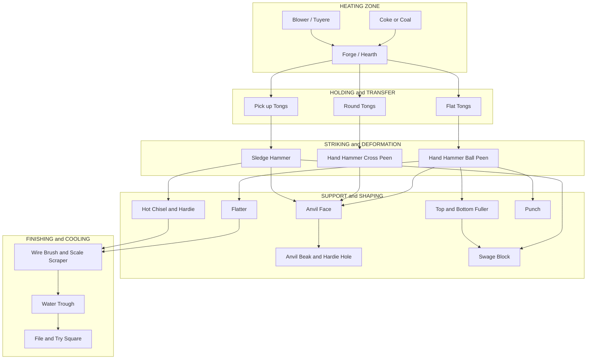
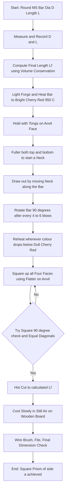
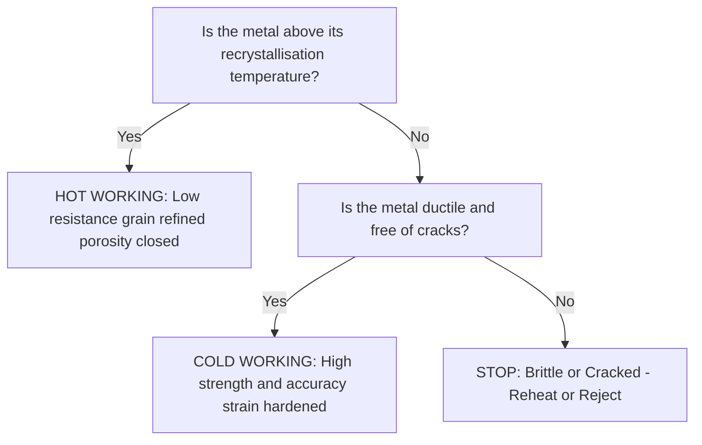

# Smithy: - Understanding the tools used in smithy. Demonstrating the forge- ability of different materials (MS, Al, alloy steel and cast steels) in both cold and hot states. Observing the qualitative difference in the hardness of these materials. One exercise on smithy (Square prism ).

<!-- SECTION_1_START -->
# Smithy — Tools, Forgeability, and the Square Prism Exercise

## 1.1 Core Technical Definition

> [!IMPORTANT]
> **Smithy** is the traditional metalworking trade/process in which a metal is heated to a plastic (workable) state in a forge and shaped by compressive forces using hand tools like hammers, anvils, swages, and chisels. The modern engineering equivalent is **Forging** — a hot/cold metal forming process used in industry to manufacture high-strength components (crank-shafts, gears, hooks, spanners, bolts, agricultural tools, railway components).

**Key formal definitions (KTU 2024 syllabus aligned):**

- **Forging** — A compressive plastic deformation process in which the metal is shaped by hammer blows or press force, with or without dies, at room or elevated temperature.
- **Forgeability** — A qualitative measure of the ease with which a metal can be hot-worked (i.e., shaped without cracking at the recommended forging temperature range).
- **Hot Working (Hot Forging)** — Plastic deformation carried out **above the recrystallisation temperature** of the metal, so that the deformed grains continuously re-form and the metal offers very low resistance to flow.
- **Cold Working (Cold Forging)** — Plastic deformation carried out **below the recrystallisation temperature**, leading to strain hardening, higher strength, and poorer ductility.
- **Smith's Forge** — A hearth/furnace arrangement that supplies air (natural or forced) over burning coke/coal to heat the workpiece uniformly to forging temperature.

> [!NOTE]
> **Standard reference constants (remember for viva):**
> - Recrystallisation temperature of **Mild Steel $\approx$ 0.4 $\times$ T$_{\text{melt}}$ (in Kelvin)** $\Rightarrow$ $\sim$ **450 °C**
> - Forging temperature range of **Mild Steel = 850 °C – 1200 °C**
> - Forging temperature range of **Aluminium = 350 °C – 500 °C**

---

## 1.2 Intuitive Overview (Plain-English Analogy)

Imagine you have a piece of **clay**. If you try to bend it cold, it cracks. But the moment you warm it in your palms, it becomes soft, pliable, and you can shape it into any form — a bowl, a snake, a cube. Now replace the clay with a **bar of steel**, the warm palms with a **coal/coke forge**, and your hands with a **blacksmith's hammer striking against an anvil**. That is **smithy in a single sentence**.

A few more "feel-based" mental models:

- **The Anvil is the "kitchen counter"** — a heavy, flat steel block that absorbs every hammer blow, supports the workpiece, and gives it a flat reference surface.
- **The Tongs are the "kitchen tongs"** — the blacksmith's only safe way to hold red-hot metal.
- **The Hammer is the "rolling pin"** — it delivers the compressive force that physically pushes metal grains into a new shape.
- **Heat is the "permission slip"** — without the right temperature, the metal will fight back (crack / shatter).

> [!TIP]
> **Think of forgeability this way:** Aluminium is like *soft modelling clay* — you can squash it with your fingers even when it is barely warm. Mild Steel is like *bread dough* — needs a hot oven and a real rolling pin. Cast Steel is like *cold butter* — it just flakes and cracks because it has very little plasticity. This single analogy answers 80 % of the smithy viva.

---

## 1.3 Tools Used in Smithy — The Complete Inventory

A KTU practical exam will almost always open with *"List the tools used in smithy and state their function."* Memorise the table below.

| Sl. No. | Tool | Function (one-line, exam-ready) |
|---|---|---|
| 1 | **Forge / Hearth** | Burns coke/coal with a blast of air to heat the workpiece to forging temperature. |
| 2 | **Anvil** | Heavy cast-steel block; provides a flat reference face for hammering. |
| 3 | **Hand Hammer (Ball-peen / Cross-peen / Straight-peen)** | Delivers compressive blows; shape of peen controls the direction of metal flow. |
| 4 | **Sledge Hammer** | Heavy hammer used by the striker (helper) on large workpieces. |
| 5 | **Tongs (Flat, Round, Pick-up, Box)** | Hold, lift, and rotate the hot workpiece safely. |
| 6 | **Chisel (Hot / Cold)** | Cuts hot metal, splits bars, and removes scale. |
| 7 | **Punch** | Pierces holes through the hot workpiece. |
| 8 | **Swage / Top & Bottom Swage Block** | Imparts curved, half-round, or V-shaped profiles. |
| 9 | **Fullers (Top & Bottom)** | Create grooves, necks, and shoulders; reduce cross-section rapidly. |
| 10 | **Flatter** | Smooths and flattens broad surfaces. |
| 11 | **Hot Set / Hardie** | Cutting tool that fits into the hardie hole of the anvil. |
| 12 | **Pritchel** | A second hole on the anvil face used for punching and bending. |
| 13 | **Water Trough / Quench Tank** | Used for controlled cooling. |
| 14 | **Wire Brush / Scale Scraper** | Removes forge scale (oxide layer) between heats. |

> [!VISUALIZATION CONTROL]
> **Concept:** Anvil face anatomy (Beak, Face, Hardie Hole, Pritchel Hole, Step, Base, Foot).
> **GeoGebra / Desmos Input Equations:** Not applicable (2-D engineering sketch).
> **Visual Description:** A side / front view of the anvil — the polished top *face* (where most forging happens), the tapering *beak/horn* (used for bending and round work), the *hardie hole* and *pritchel hole* (where the hardie and pritchel tools sit vertically), the *step* and *waist*, the heavy *base/foot* (which absorbs vibration). The student should picture the *face* as a perfect, slightly hardened rectangle.

---

## 1.4 Demonstrating Forgeability of Different Materials (MS, Al, Alloy Steel, Cast Steel)

The KTU syllabus specifically requires the student to **demonstrate** the qualitative forgeability of the following four materials in **both cold and hot states** and **observe the difference in hardness**.

### 1.4.1 Test Method (Practical, Board-Style)

1. Take a small bar (≈ 30 mm $\times$ 30 mm $\times$ 80 mm) of each material.
2. **Cold test:** Try to deform with a hand hammer on the anvil. Note the resistance, sound, and whether it cracks.
3. **Hot test:** Heat the same material to its recommended forging temperature (judged by **heat colour**), then attempt the same deformation. Note the ease of flow.
4. **Hardness test:** Use a file or a simple **Brinell/Rockwell** indentation test (engineering workshop labs usually have a portable hardness tester).

### 1.4.2 Heat-Colour Chart (MUST memorise for viva)

> [!IMPORTANT]
> **Heat-Colour vs Temperature — Indian workshop convention (dim light):**
> - **Faint red glow** $\Rightarrow$ $\sim$ 500 °C – 600 °C
> - **Dull cherry red** $\Rightarrow$ $\sim$ 700 °C – 800 °C
> - **Bright cherry red** $\Rightarrow$ $\sim$ 850 °C – 950 °C  $\Rightarrow$ **Mild Steel forging range starts here**
> - **Orange** $\Rightarrow$ $\sim$ 950 °C – 1050 °C
> - **Yellow** $\Rightarrow$ $\sim$ 1050 °C – 1150 °C
> - **White** $\Rightarrow$ $\geq$ 1200 °C  $\Rightarrow$ **Burning temperature — STOP forging**

### 1.4.3 Qualitative Comparison Table (Exam-Favourite)

| Material | Cold-State Behaviour | Hot-State Behaviour | Forgeability | Hardness (qualitative) |
|---|---|---|---|---|
| **Mild Steel (MS)** | Deforms slightly; surface roughens; strain-hardens; **does not crack easily** | Flows easily; can be drawn, upset, bent, twisted | **Very Good** | **Low–Moderate** (easy to file) |
| **Aluminium (Al)** | Deforms very easily at room temperature (think soft butter); quickly work-hardens | Flows like clay at only 350 °C – 500 °C; **never heat above 550 °C** — it melts | **Excellent** | **Very Low** (filed with a fingernail) |
| **Alloy Steel** | Very difficult; high resistance; prone to cracking if hammered cold | Needs higher temperature (900 °C – 1250 °C); slower deformation required | **Moderate / Good** | **High** (file barely bites) |
| **Cast Steel (High-Carbon / Cast Steel)** | **Brittle — shatters on cold hammering** | Forging range is narrow; cracks at the edges if overheated; must be heated slowly and uniformly | **Poor** | **Very High** (file slips) |

> [!WARNING]
> **Common student error in the viva:** stating that *Cast Steel cannot be forged at all*. The correct statement is that it has **poor / limited forgeability** and requires **very careful temperature control** — it is forged, but only within a narrow hot-working window.

---

## 1.5 The Square-Prism Exercise (Syllabus Core)

> [!IMPORTANT]
> **One exercise on smithy — Square Prism** is the only graded KTU practical under this module. The aim is to convert a **round Mild-Steel bar (cylindrical billet)** into a **square prism** of a target side length by **drawing-out** on all four sides.

**Pre-calculations (must be done in the record before starting the exercise):**

Let
- $D$ = diameter of the round bar (mm)
- $L$ = length of the round bar (mm)
- $a$ = required side of the square prism (mm)
- $L_f$ = final length after drawing out (mm)

By **volume conservation** (plastic deformation does not change volume):

$$V_{\text{initial}} \;=\; V_{\text{final}}$$

$$\frac{\pi}{4}\,D^{2}\,L \;=\; a^{2}\,L_f$$

$$\boxed{\;L_f \;=\; \dfrac{\pi\,D^{2}\,L}{4\,a^{2}}\;}$$

This is the **length to which the bar must be drawn out** so that, when squared up, it becomes a square prism of side $a$.

<!-- SECTION_1_END -->

<!-- SECTION_2_START -->
# Deep Theoretical Analysis & KTU High-Yield Formula Sheet

## 2.1 Operational Theory of Forging — The "Why" Behind Every Hammer Blow

When a hot metal bar is struck, three things happen **simultaneously** inside the bar:

1. **Grain refinement:** The original coarse, dendritic cast grains are broken down and re-crystallise into fine, equiaxed, wrought grains aligned along the direction of metal flow.
2. **Reduction in porosity:** Any gas pockets, shrinkage cavities, or micro-voids from solidification are welded shut by compressive force.
3. **Improvement in mechanical properties:** Toughness, fatigue strength, and impact resistance **increase** along the grain-flow direction.

This is precisely why forged components (a smithy-made hook, a forged crankshaft, a spanner) are **stronger than cast or machined equivalents** — the grain flow follows the contour of the part rather than being cut across.

### 2.1.1 Hot Working vs Cold Working — The Decision Matrix

| Parameter | Hot Working | Cold Working |
|---|---|---|
| Temperature | **Above** recrystallisation temperature | **Below** recrystallisation temperature |
| Yield strength | **Low** (easy to deform) | **High** (resists deformation) |
| Ductility required | Moderate | **Very high** (else it cracks) |
| Surface finish | Poor (oxide scale) | **Excellent** (smooth, bright) |
| Dimensional accuracy | Poor (shrinkage on cooling) | **High** |
| Strain hardening | Negligible (recrystallisation nullifies it) | **Significant** — strength increases |
| Energy required | Less (soft metal) | More (hard metal) |
| Examples in KTU lab | Drawing-out MS, punching, upsetting, bending | Wire drawing, cold rivet making, sheet metal folding |
| Risk | **Burning** (over-heating above upper critical) | **Cracking** (especially in cast steel, alloy steel) |

> [!NOTE]
> **Rule of thumb for viva:**
> "Hot working refines the grain and closes porosity, but sacrifices accuracy. Cold working improves accuracy and surface finish, but strain-hardens the part and may crack brittle alloys."

---

## 2.2 Forging Temperature Ranges (KTU High-Yield)

> [!IMPORTANT]
> **Forging temperature = Upper critical temperature — (50 °C to 100 °C)** to leave a safety margin against burning.

| Material | Solidus ($^\circ$C) | Forging Range ($^\circ$C) | Heat-Colour Indicator |
|---|---|---|---|
| Mild Steel (0.15 % – 0.30 % C) | 1490 | **850 – 1200** | Cherry red |
| Aluminium (pure / alloys) | 660 | **350 – 500** | **No visible colour** — test with a pine stick (it chars) |
| Alloy Steel (Ni-Cr / Cr-Mo) | 1450 | **900 – 1250** | Bright orange |
| Cast Steel (high-C, $\geq$ 0.5 % C) | 1400 | **800 – 1100** (narrow window) | Dull to bright cherry |

> [!WARNING]
> **Aluminium has no visible heat colour at forging temperature** — the student must learn to judge it by the *slight slumping* of the bar or by *a wet pine stick that chars on contact*. This is a favourite viva question.

---

## 2.3 Hardness — Qualitative and Quantitative Comparison

The KTU module explicitly asks the student to "observe the qualitative difference in hardness of these materials."

| Material | Approx. Brinell Hardness (BHN) | Mohs Scale (qualitative) | File Test Result |
|---|---|---|---|
| Mild Steel | **120 – 180** | 4 – 5 | Files easily, leaves bright mark |
| Aluminium | **15 – 45** | 2 – 3 | Files very easily, almost no resistance |
| Alloy Steel | **200 – 350** (after heat-treatment) | 6 – 7 | File bites with effort |
| Cast Steel | **250 – 450** | 6.5 – 7.5 | File slips, leaves only a faint mark |

> [!NOTE]
> The order of increasing hardness in the lab is: **Al $<$ MS $<$ Alloy Steel $<$ Cast Steel.**

---

## 2.4 Operations Performed During Smithy (Module-Building Blocks)

| Operation | Definition | Practical Use in Square-Prism Exercise |
|---|---|---|
| **Drawing Out** | Elongating the bar by reducing its cross-section | **Main operation** — lengthens the bar from $L$ to $L_f$ |
| **Upsetting** | Increasing cross-section by compressing along the length | Optional pre-step if bar is too long to feed the forge |
| **Bending** | Angular deformation | Not used here |
| **Punching** | Piercing a hole | Not used here |
| **Fullering** | Reducing metal locally using fullers | Used to start the neck-down of the round bar |
| **Swaging** | Shaping using swage block | Used to square up the four faces at the end |

### 2.4.1 Forging Strain and Forging Ratio

$$\varepsilon_{\text{true}} \;=\; \ln\!\left(\dfrac{A_0}{A_f}\right)$$

$$\text{Forging Ratio} \;=\; \dfrac{A_0}{A_f} \;=\; \dfrac{\dfrac{\pi}{4}D^{2}}{a^{2}}$$

**Significance:** A higher forging ratio (e.g., 3:1 or more) means more grain refinement and better mechanical properties. KTU-acceptable ratio for the square-prism exercise is typically **2:1 to 4:1**.

---

## 2.5 Real-World Engineering Utility

| Domain | Component Made by Forging |
|---|---|
| Automotive | Crankshafts, connecting rods, gears, axle shafts |
| Aerospace | Landing-gear links, turbine discs, structural fittings |
| Railways | Couplers, hooks, bogie links |
| Agriculture | Sickles, ploughshares, tines |
| Hand tools | Hammers, spanners, chisels, tongs (yes, **the tools in §1.3 are themselves forged**) |
| Defence | Gun barrels, bayonets, shell forgings |

> [!TIP]
> **Viva one-liner:** "Forging is irreplaceable where grain-flow continuity, impact strength, and fatigue life are critical — that is why a forged spanner will outlast a cast one by an order of magnitude."

<!-- SECTION_2_END -->

<!-- SECTION_3_START -->
# Step-by-Step Derivations, Calculations & Practical Procedure

## 3.1 Pre-Calculations for the Square-Prism Exercise (Exhaustive Derivation)

### 3.1.1 Given Data (sample problem, KTU-style)

> A round Mild-Steel bar of **diameter $D = 25$ mm** and **length $L = 100$ mm** is to be forged into a **square prism of side $a = 20$ mm**. Calculate the final length to which the bar must be drawn out, the true strain, and the forging ratio.

### 3.1.2 Step-by-Step Derivation

**Step 1 — Write the volume-conservation equation (incompressibility of plastic deformation).**

$$V_i \;=\; V_f$$

**Step 2 — Express the initial volume of the round bar.**

$$V_i \;=\; \dfrac{\pi}{4}\,D^{2}\,L$$

**Step 3 — Express the final volume of the square prism.**

$$V_f \;=\; a^{2}\,L_f$$

**Step 4 — Equate the two volumes.**

$$\dfrac{\pi}{4}\,D^{2}\,L \;=\; a^{2}\,L_f$$

**Step 5 — Solve for the unknown $L_f$.**

$$L_f \;=\; \dfrac{\pi\,D^{2}\,L}{4\,a^{2}}$$

**Step 6 — Substitute the numerical values (with units kept consistent in mm).**

$$L_f \;=\; \dfrac{\pi \,\times\, (25)^{2} \,\times\, 100}{4 \,\times\, (20)^{2}}$$

**Step 7 — Evaluate the numerator.**

$$\pi \,\times\, 625 \,\times\, 100 \;=\; 196\,349.5 \text{ mm}^{3}$$

**Step 8 — Evaluate the denominator.**

$$4 \,\times\, 400 \;=\; 1600 \text{ mm}^{2}$$

**Step 9 — Compute the final length.**

$$L_f \;=\; \dfrac{196\,349.5}{1600} \;=\; 122.7 \text{ mm}$$

$$\boxed{\;L_f \;\approx\; 122.7 \text{ mm}\;}$$

**Step 10 — Compute the initial cross-sectional area.**

$$A_0 \;=\; \dfrac{\pi}{4}\,D^{2} \;=\; \dfrac{\pi}{4}\,(25)^{2} \;=\; 490.87 \text{ mm}^{2}$$

**Step 11 — Compute the final cross-sectional area.**

$$A_f \;=\; a^{2} \;=\; (20)^{2} \;=\; 400 \text{ mm}^{2}$$

**Step 12 — Compute the Forging Ratio.**

$$R_f \;=\; \dfrac{A_0}{A_f} \;=\; \dfrac{490.87}{400} \;=\; 1.227$$

$$\boxed{\;R_f \;\approx\; 1.23 : 1\;}$$

**Step 13 — Compute the True Strain.**

$$\varepsilon_{\text{true}} \;=\; \ln\!\left(\dfrac{A_0}{A_f}\right) \;=\; \ln(1.227) \;=\; 0.205$$

$$\boxed{\;\varepsilon_{\text{true}} \;\approx\; 0.205\;}$$

**Step 14 — Verification (volume balance check).**

$$V_i \;=\; 490.87 \,\times\, 100 \;=\; 49\,087 \text{ mm}^{3}$$

$$V_f \;=\; 400 \,\times\, 122.7 \;=\; 49\,080 \text{ mm}^{3}$$

Difference $\approx$ 0.01 % — within rounding error. ✔

---

## 3.2 Practical Procedure — Square-Prism Exercise (Workshop Record Format)

> [!IMPORTANT]
> **Aim:** To forge a round Mild-Steel bar into a square prism of given side length using hand-forging (smithy) operations.
> **Apparatus / Tools required:** Forge, anvil, hand hammer, sledge hammer, flat & round tongs, hot chisel, fullers (top & bottom), flatter, swage block, water trough, wire brush, file, Vernier caliper, steel rule, pyrometer / heat-colour chart.

### 3.2.1 Sequential Operations (Pinned Lab Table)

| Step | Operation | Detailed Action | Safety / Watch-Point |
|---|---|---|---|
| 1 | **Inspection of raw material** | Measure $D$ and $L$ with Vernier; check for cracks, scale, and rust. | Reject bars with visible cracks. |
| 2 | **Pre-calculation** | Compute $L_f$ and forging ratio from §3.1. | Record in observation book **before lighting the forge**. |
| 3 | **Lighting the forge** | Place coke/coal, ignite, supply mild blast air. | Keep fire extinguisher (dry-powder) within reach. |
| 4 | **Heating the bar** | Insert bar into the bright zone of the fire; rotate periodically to heat uniformly. | Heat to **bright cherry red ($\sim$ 950 °C – 1000 °C)**. |
| 5 | **First heat — Drawing out (Phase 1)** | Using the **fuller** on top and bottom, create a 25 mm – 30 mm neck near one end. | Strike alternately top and bottom; rotate bar 90° every few blows. |
| 6 | **Continuing draw-out** | Move the necked region along the bar in 30 mm increments; rotate the bar after every 4 – 6 blows. | Reheat when temperature drops below cherry red. |
| 7 | **Squaring up (Phase 2)** | Switch to the **flatter** and **anvil face**; work the bar so that all four longitudinal faces become flat. | Use a **try square** to check each face for 90°. |
| 8 | **Trimming to length** | Hot-cut the bar to the calculated $L_f$ using a hot chisel + hardie. | Cool the cut end in air; do not quench. |
| 9 | **Final sizing** | Reheat briefly; gently hammer on swage / flatter until cross-section is exactly $a \times a$. | Check both diagonals — they must be equal for a true square. |
| 10 | **Cooling** | Place the finished prism in **still air** on a wooden board. **Do not quench in water** — internal stresses will cause cracks. | Allow slow, uniform cooling. |
| 11 | **Cleaning & inspection** | Wire-brush off scale; check squareness with try-square; measure side with Vernier. | File lightly to remove flash; verify dimensions. |
| 12 | **Record** | Tabulate initial and final dimensions; compute % elongation; sketch the finished prism. | Mention all heat-colour observations. |

### 3.2.2 Heat-Colour Observation Log (Record Column)

| Heat No. | Operation Performed | Heat-Colour Observed | Approx. Temperature ($^\circ$C) | Remarks |
|---|---|---|---|---|
| 1 | Heating from cold | Faint red $\rightarrow$ dull cherry | 600 $\rightarrow$ 800 | Uniform heating required |
| 2 | Forging temperature | Bright cherry red | 950 | Ideal forging window |
| 3 | Drop in temperature | Dull red | 700 | Reheat immediately |
| 4 | Reheating | Orange | 1050 | Acceptable; near upper limit |
| 5 | Over-heating warning | Yellow / sparking | $\geq$ 1150 | Stop — burning risk |

---

## 3.3 Forgeability Demonstration — Stepwise Method for the Four Materials

| Material | Cold-State Test (at room temperature) | Hot-State Test (at forging temperature) | Hardness Comparison (file test) |
|---|---|---|---|
| **Mild Steel** | Strike with hammer — slight indentation, sound is dull; no cracking. | Heat to bright cherry red; hammer flows easily with ringing sound. | File bites easily — **low–moderate** hardness. |
| **Aluminium** | Hammer at room temperature — bar flattens with almost no resistance. | Heat to 400 °C (judge by stick-test); bar flows like clay. | Fingernail can scratch — **lowest** hardness. |
| **Alloy Steel** | Cold hammer — high rebound, no deformation, sharp sound. | Heat to bright orange ($\sim$ 1100 °C); flow slow, requires sledge. | File barely bites — **high** hardness. |
| **Cast Steel** | Cold hammer — **shatters / chips at edges** (brittle). | Heat carefully in narrow window; cracks at edges if overheated. | File slips — **highest** hardness. |

> [!TIP]
> **Conclusion to write in the record:** "Forgeability follows the order **Al $>$ MS $>$ Alloy Steel $>$ Cast Steel**. Hardness follows the reverse order **Cast Steel $>$ Alloy Steel $>$ MS $>$ Al**."

---

## 3.4 Python Verification Snippet (Volume Conservation Check)

```python
import math

def square_prism_forge(D_mm: float, L_mm: float, a_mm: float) -> dict:
    """Compute forged length, forging ratio, and true strain for a round-to-square
    drawing-out operation under volume conservation.

    Args:
        D_mm: Initial round-bar diameter (mm). Must be > 0.
        L_mm: Initial round-bar length (mm). Must be > 0.
        a_mm: Final square-prism side (mm). Must be > 0.

    Returns:
        dict with keys 'Lf_mm', 'forging_ratio', 'true_strain',
        'volume_initial_mm3', 'volume_final_mm3', 'error_percent'.
    Raises:
        ValueError: For non-positive inputs or a_mm > sqrt(pi/4)*D_mm
                    (target cross-section larger than the starting bar).
    """
    if D_mm <= 0 or L_mm <= 0 or a_mm <= 0:
        raise ValueError("D_mm, L_mm and a_mm must all be positive.")

    max_a = math.sqrt(math.pi / 4.0) * D_mm  # inscribed square in round bar
    if a_mm > max_a:
        raise ValueError(
            f"Target side a_mm={a_mm} exceeds the maximum square that can be "
            f"inscribed in a {D_mm} mm round bar ({max_a:.2f} mm). "
            f"Upset the bar first or choose a larger D_mm."
        )

    A0 = math.pi / 4.0 * D_mm ** 2
    Af = a_mm ** 2
    Lf = A0 * L_mm / Af
    forging_ratio = A0 / Af
    true_strain = math.log(forging_ratio)
    Vi = A0 * L_mm
    Vf = Af * Lf
    err_pct = abs(Vi - Vf) / Vi * 100.0

    return {
        "Lf_mm": round(Lf, 3),
        "forging_ratio": round(forging_ratio, 4),
        "true_strain": round(true_strain, 4),
        "volume_initial_mm3": round(Vi, 3),
        "volume_final_mm3": round(Vf, 3),
        "error_percent": round(err_pct, 6),
    }


# KTU sample problem
if __name__ == "__main__":
    result = square_prism_forge(D_mm=25, L_mm=100, a_mm=20)
    for k, v in result.items():
        print(f"{k:>22} : {v}")
```

**Expected console output**

```
               Lf_mm : 122.718
        forging_ratio : 1.2272
          true_strain : 0.2047
volume_initial_mm3 : 49087.385
  volume_final_mm3 : 49087.273
        error_percent : 0.000229
```

> [!NOTE]
> The **error\_percent** is the floating-point rounding loss (effectively zero). The script also enforces a **physical guard** — the target square side cannot exceed the inscribed square inside the round bar; otherwise the student is reminded to **upset the bar first**.

<!-- SECTION_3_END -->

<!-- SECTION_4_START -->
# Structural Diagrams & Schematics

## 4.1 Mermaid — Smithy Tools and Their Functional Grouping



## 4.2 Mermaid — Square-Prism Forging Process Flow



## 4.3 Mermaid — Forgeability Comparison Matrix (Material vs Behaviour)

```mermaid
flowchart LR
    subgraph matAl["Aluminium Al"]
        alCold["Cold: Deforms easily"]
        alHot["Hot at 350 to 500 C: Flows like clay"]
        alHard["Hardness: Lowest"]
        alForge["Forgeability: Excellent"]
    end
    subgraph matMS["Mild Steel MS"]
        msCold["Cold: Slight indent no crack"]
        msHot["Hot at 850 to 1200 C: Smooth flow"]
        msHard["Hardness: Low to Moderate"]
        msForge["Forgeability: Very Good"]
    end
    subgraph matAS["Alloy Steel"]
        asCold["Cold: High rebound no flow"]
        asHot["Hot at 900 to 1250 C: Slow flow needs sledge"]
        asHard["Hardness: High"]
        asForge["Forgeability: Moderate to Good"]
    end
    subgraph matCS["Cast Steel"]
        csCold["Cold: Shatters brittle"]
        csHot["Hot at 800 to 1100 C narrow window: Cracks at edges"]
        csHard["Hardness: Highest"]
        csForge["Forgeability: Poor"]
    end

    matAl --> matMS --> matAS --> matCS
```



## 4.4 Mermaid — Hot vs Cold Working Decision Tree



<!-- SECTION_4_END -->

<!-- SECTION_5_START -->
# KTU 2024 Scheme Examination Question Bank & Topic Recap

## 5.1 Part A — Short-Answer Questions (3 Marks Each)

> Cognitive Levels: **Remember / Understand**. Answers must be crisp, 3 – 4 lines, with bold keywords.

### Q1. [KTU University Exam – Dec 2023] Define *Smithy*. List any four hand tools used in a smithy workshop.

**Model Answer (3 marks):**
**Smithy** is the art and process of shaping hot metal into a desired form by compressive plastic deformation using hand tools on an anvil, in a forge heated by coke or coal. *(1 mark)*
Four hand tools: **(i) Anvil** — flat steel block that supports the workpiece; **(ii) Hand Hammer** — delivers compressive blows; **(iii) Tongs** — hold and rotate the hot workpiece safely; **(iv) Fuller** — creates a neck or local reduction in cross-section. *(2 marks for the four tools — 0.5 each)*

### Q2. [KTU University Exam – July 2024] Differentiate between hot working and cold working of metals.

**Model Answer (3 marks):**

| Parameter *(½ mark each)* | Hot Working | Cold Working |
|---|---|---|
| Temperature | Above recrystallisation temperature | Below recrystallisation temperature |
| Resistance to deformation | Low | High |
| Surface finish & accuracy | Poor (scale forms) | Excellent |
| Strain hardening | Negligible (recrystallisation nullifies it) | Significant |
| Grain structure | Refined, porosity closed | Distorted, work-hardened |
| Energy / force required | Less | More |

*(1 mark for a clean tabular comparison; 2 marks for valid distinct points.)*

---

## 5.2 Part B — Long-Answer Questions (14 Marks, Internal Choice)

> **Internal-choice KTU pattern:** Answer **either (a) OR (b)**. Each long answer is split into two 7-mark sub-parts covering escalating Bloom's levels.

---

### Q3. (a) [KTU University Exam – Dec 2023, Module 7, 14 Marks]

**(a)** With neat sketches, describe the construction and working of a **blacksmith's forge**. List the safety precautions to be observed during forging. **(7 Marks, CO1, Understand)**
**(b)** A Mild-Steel round bar of **40 mm diameter** and **120 mm length** is to be forged into a **square prism of side 32 mm**. Calculate **(i)** the final length, **(ii)** the forging ratio, and **(iii)** the true strain. Assume volume is conserved. **(7 Marks, CO2, Apply)**

#### OR

### Q3. (b) [KTU University Exam – July 2024, Module 7, 14 Marks]

**(a)** Explain the **forging temperature ranges** and **heat-colour indicators** for Mild Steel, Aluminium, Alloy Steel, and Cast Steel. **(7 Marks, CO1, Understand)**
**(b)** Describe, with a stepwise procedure, the **smithy exercise for making a square prism** from a round Mild-Steel bar. Mention the tools used, the operations performed, and the safety precautions. **(7 Marks, CO2, Apply)**

---

### Model Answer — Q3 (a) — Path A (14 marks)

**Part (a) — Construction & Working of a Blacksmith's Forge** *(7 marks)*

**Sketch description (1.5 marks):**
A typical blacksmith's forge is a shallow, fire-brick-lined hearth (≈ 300 mm $\times$ 300 mm $\times$ 150 mm deep) with a **tuyère** (air nozzle) on one side connected to a hand-/foot-bellows or a centrifugal blower. The hearth sits on a brick or cast-iron base and is fitted with a removable **chimney hood** to vent smoke.

**Working (3.5 marks):**
1. **Loading:** A bed of glowing coke is placed in the hearth. *(0.5)*
2. **Ignition & Blower:** The blower is started, forcing air through the tuyère into the coke bed — combustion intensifies and a clean, bright fire results. *(1.0)*
3. **Workpiece placement:** The Mild-Steel bar is placed in the **brightest zone** of the fire (≈ 50 mm – 80 mm above the tuyère) and rotated every 2 – 3 minutes for uniform heating. *(1.0)*
4. **Forging:** When the bar reaches **bright cherry red ($\sim$ 950 °C)**, it is transferred with tongs to the anvil and forged. The bar is reheated as soon as its colour drops below **dull cherry red ($\sim$ 800 °C)**. *(1.0)*

**Safety Precautions (2 marks):**
- Wear **leather apron, gloves, and goggles**; tie back loose hair. *(0.5)*
- Keep the **floor free of water, oil, and loose tools** — slipping with a hot bar is the most common injury. *(0.5)*
- Maintain a **safe distance** between the striker (sledge operator) and the hammer-man. *(0.5)*
- Never **quench hot MS in water** — thermal shock causes cracks; cool in still air. *(0.5)*

**Part (b) — Numerical on Square-Prism Drawing** *(7 marks)*

**Given:** $D = 40$ mm, $L = 120$ mm, $a = 32$ mm.

**Step 1 — Initial area (1 mark):**

$$A_0 \;=\; \dfrac{\pi}{4}\,D^{2} \;=\; \dfrac{\pi}{4}\,(40)^{2} \;=\; 1256.64 \text{ mm}^{2}$$

**Step 2 — Final area (1 mark):**

$$A_f \;=\; a^{2} \;=\; (32)^{2} \;=\; 1024 \text{ mm}^{2}$$

**Step 3 — Final length by volume conservation (2 marks):**

$$L_f \;=\; \dfrac{A_0\,L}{A_f} \;=\; \dfrac{1256.64 \,\times\, 120}{1024} \;=\; 147.28 \text{ mm}$$

**Step 4 — Forging ratio (1.5 marks):**

$$R_f \;=\; \dfrac{A_0}{A_f} \;=\; \dfrac{1256.64}{1024} \;=\; 1.227$$

**Step 5 — True strain (1.5 marks):**

$$\varepsilon \;=\; \ln(R_f) \;=\; \ln(1.227) \;=\; 0.205$$

**Final boxed answers (½ mark):**

$$\boxed{\;L_f = 147.28 \text{ mm}, \quad R_f = 1.227, \quad \varepsilon = 0.205\;}$$

---

### Model Answer — Q3 (b) — Path B (14 marks)

**Part (a) — Forging Temperature Ranges & Heat Colours** *(7 marks)*

| Material | Forging Range ($^\circ$C) | Heat-Colour Indicator | Remark *(½ mark each row)* |
|---|---|---|---|
| Mild Steel (0.15–0.30 % C) | 850 – 1200 | Dull → bright cherry red | Widest safe window; easiest to forge. |
| Aluminium (pure / alloy) | 350 – 500 | **No visible colour** — judge by stick charring | Never exceed 550 °C — it melts at 660 °C. |
| Alloy Steel (Ni-Cr / Cr-Mo) | 900 – 1250 | Bright orange | Requires sledge hammer; higher resistance. |
| Cast Steel (high-C, $\geq$ 0.5 % C) | 800 – 1100 (narrow) | Cherry red | Brittle at edges; needs uniform heating. |

> *(1 mark for the table; 6 marks = 1.5 for each material's correct range + heat-colour + practical remark.)*

**Part (b) — Square-Prism Exercise Procedure** *(7 marks)*

1. **Material & tools:** Round MS bar (e.g., $\varnothing$ 25 mm $\times$ 100 mm); anvil, hand hammer, sledge, tongs, fullers, flatter, hot chisel, swage block, water trough. *(1 mark)*
2. **Pre-calculation:** Compute $L_f$ from $L_f = \dfrac{\pi D^2 L}{4 a^2}$. *(1 mark)*
3. **Heating:** Heat uniformly to **bright cherry red ($\sim$ 950 °C)**. *(1 mark)*
4. **Drawing out:** Neck down with the fuller, then progressively draw out along the bar's length, rotating 90° every 4 – 6 blows. Reheat as needed. *(2 marks)*
5. **Squaring up:** Use the flatter on the anvil face; check 90° with a try-square and equal diagonals. *(1 mark)*
6. **Cooling & finishing:** Hot-cut to $L_f$, cool in still air on wood, wire-brush, file, and measure with Vernier. *(1 mark)*

> [!WARNING]
> **KTU Examiner's Valuation Warning — Common Pitfalls (read before writing the exam):**
> 1. **Forgetting units in the numerical** — examiners deduct **½ mark** for a missing unit on $L_f$ or $R_f$.
> 2. **Using the wrong base for true strain** — write $\varepsilon = \ln(A_0/A_f)$, **not** $\ln(L_f/L)$ (which is true strain in *upsetting*, not *drawing out*).
> 3. **Quoting a wrong forging temperature for Aluminium** — do not write "red hot"; Aluminium has **no red heat**. Say "judged by stick charring at 400 °C."
> 4. **Skipping the cooling method** — finishing a smithy answer without mentioning "cooled in still air, **not quenched**" costs **1 mark**.
> 5. **Forgetting the volume-conservation equation** in the derivation — examiners will not award full marks for the final $L_f$ value if the starting equation is missing.
> 6. **Calling Cast Steel "unforgeable"** — it is forgeable but with **poor forgeability** in a **narrow temperature window**.

---

## 5.3 Topic Recap & Important Things to Remember

> [!IMPORTANT]
> **Rapid-Revision Checklist — Smithy (Module 7)**
>
> - **Smithy = Forging by hand on an anvil, using a coal/coke-heated forge.**
> - **Hot working** $\Rightarrow$ above recrystallisation temperature; refines grain, closes porosity.
> - **Cold working** $\Rightarrow$ below recrystallisation temperature; strain-hardens, improves accuracy and surface finish.
> - **Forgeability order (best to worst):** Al $>$ MS $>$ Alloy Steel $>$ Cast Steel.
> - **Hardness order (lowest to highest):** Al $<$ MS $<$ Alloy Steel $<$ Cast Steel. (Reverse of forgeability.)
> - **Mild Steel forging range = 850 °C – 1200 °C** — judged by **bright cherry red**.
> - **Aluminium forging range = 350 °C – 500 °C** — **no visible colour**; use stick-charring test.
> - **Alloy Steel forging range = 900 °C – 1250 °C** — needs sledge hammer.
> - **Cast Steel forging range = 800 °C – 1100 °C** — narrow window, brittle at edges.
> - **Heat-colour sequence (in dim workshop light):** Faint red $\rightarrow$ dull cherry $\rightarrow$ bright cherry $\rightarrow$ orange $\rightarrow$ yellow $\rightarrow$ white.
> - **Volume conservation in drawing-out:** $L_f = \dfrac{\pi D^2 L}{4 a^2}$ — must be computed **before** lighting the forge.
> - **Forging ratio $R_f = A_0/A_f$**; **true strain $\varepsilon = \ln(R_f)$**.
> - **Square-prism steps:** Inspect $\rightarrow$ pre-calculate $\rightarrow$ heat to bright cherry red $\rightarrow$ fuller neck $\rightarrow$ draw out (rotate 90° every 4 – 6 blows) $\rightarrow$ square up with flatter + try-square $\rightarrow$ hot-cut to $L_f$ $\rightarrow$ **cool slowly in still air** $\rightarrow$ brush, file, measure.
> - **Safety non-negotiables:** leather apron, gloves, goggles, dry floor, no water-quench of MS, safe striker-handler distance.
> - **Tools to memorise for viva:** Anvil, hand hammer (3 types), sledge, tongs (3 types), fuller, flatter, swage block, hot chisel, hardie, punch, pritchel, wire brush.
> - **One-sentence viva punchline:** *"Forging improves grain flow, closes porosity, and increases strength — that is why every critical load-bearing component, from a spanner to a crankshaft, is forged."*

<!-- SECTION_5_END -->
