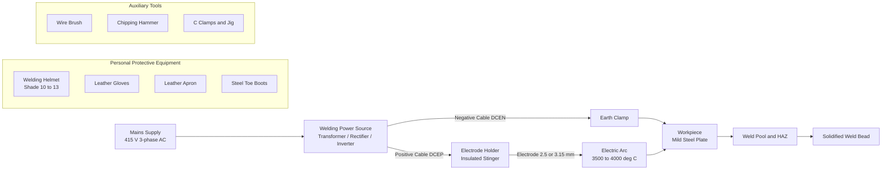
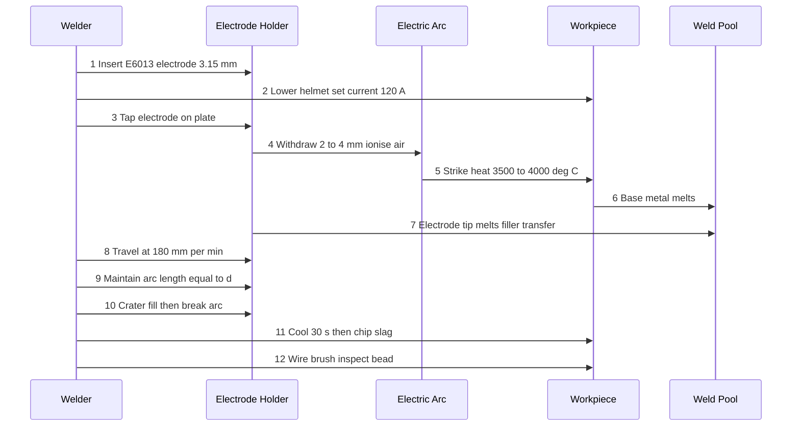
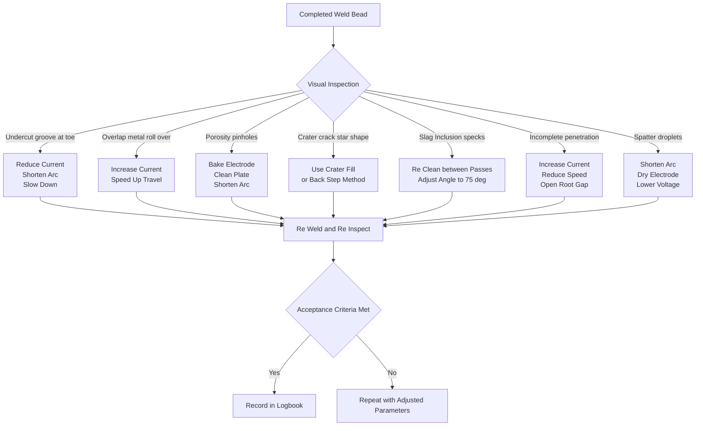
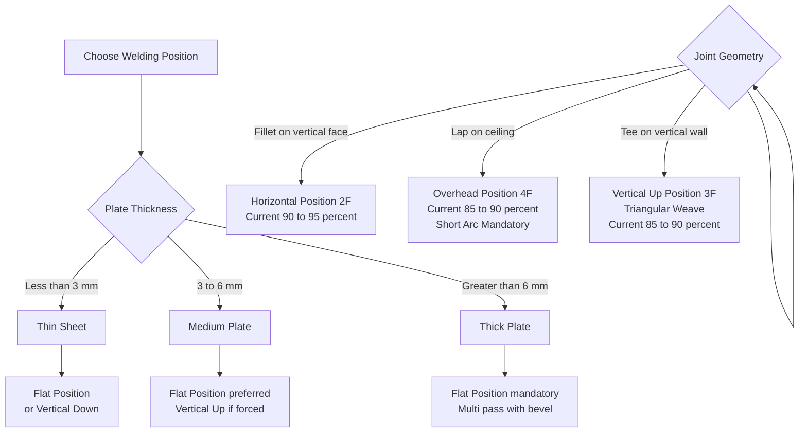

# Welding: Understanding welding equipment and practicing at least one welding technique, such as making joints using electric arc welding. Bead formation in horizontal, vertical and overhead positions

<!-- SECTION_1_START -->
# Module 8 — Welding: Fundamentals, Equipment & Multi-Position Bead Formation

## 1.1 Core Technical Definition

> [!IMPORTANT]
> **Welding (as per AWS / ISI Definition):** A metal joining process in which **cohesion** between two surfaces of similar or dissimilar metals is produced by heating the surfaces to a suitable temperature, with or without the application of **pressure**, and with or without the use of a **filler metal**.

In the context of KTU's **GCESL106 — Engineering Workshop**, the syllabus specifically demands an understanding of **Electric Arc Welding (Shielded Metal Arc Welding — SMAW)** and the practical skill of producing sound weld beads in the **horizontal (H), vertical (V) and overhead (OH) positions** on mild steel workpieces.

| Term | Standard Symbol / Unit | Meaning |
|------|------------------------|---------|
| **Open Circuit Voltage (OCV)** | $V_{oc}$ (Volts) | Voltage across electrode & workpiece when arc is **not** struck |
| **Arc Voltage (Working Voltage)** | $V_a$ (Volts) | Voltage across the arc during welding, typically **20 – 30 V** |
| **Welding Current** | $I$ (Amperes) | Current flowing through the electrode, typically **60 – 250 A** for SMAW |
| **Heat Input (H)** | $\text{kJ/mm}$ | Energy delivered per unit weld length, $H = \dfrac{\eta \cdot V \cdot I}{v \cdot 1000}$ |
| **Travel Speed** | $v$ (mm/min) | Speed at which the electrode is moved along the joint |
| **Thermal Efficiency** | $\eta$ (dimensionless) | **0.7 – 0.85** for SMAW (arc process) |

## 1.2 Intuitive Analogy — Welding = "Gluing with Molten Metal"

> [!NOTE]
> **Real-World Analogy:** Think of welding exactly like applying a hot-melt glue gun — except the "glue" is actually **molten parent metal + filler rod** that fuses the two pieces. The electric arc is the "heater" of the glue gun, the electrode is the "glue stick," and the weld pool is the puddle of molten glue that solidifies to form a permanent, metallurgically bonded joint — far stronger than any mechanical glue.

- **Filler metal = glue stick** → melts and fills the joint gap.
- **Electric arc = heating element** → provides the temperature (around **3500 °C – 4000 °C** at the arc core, far above mild-steel melting point of **~1500 °C**).
- **Flux coating = protective wrapper** → generates a shielding gas & slag blanket that prevents atmospheric **oxygen** and **nitrogen** from contaminating the molten pool.

## 1.3 Classification of Welding Processes (Overview Map)

Welding is broadly classified under two families relevant to your lab:

**A. Fusion Welding** (heat-only, no pressure)
- **Electric Arc Welding** (SMAW / GTAW / GMAW / SAW)
- **Gas Welding** (Oxy-Acetylene / Oxy-Hydrogen)
- **Resistance Welding** (Spot / Seam / Projection)
- **Thermit Welding**

**B. Solid-State Welding** (heat + pressure, no melting)
- **Forge Welding**, **Friction Welding**, **Ultrasonic Welding**

> [!TIP]
> **KTU Examiner's Favourite:** For the 3-mark question, simply state — *"Arc welding is a fusion welding process that uses an electric arc between the electrode and the base metal as the source of heat to melt and join metals."*

## 1.4 Why Welding Matters in Engineering

| Industry Sector | Welding Application |
|------------------|---------------------|
| **Structural & Civil** | Bridges, building frames, reinforcement cages |
| **Automotive** | Car chassis, exhaust systems, battery enclosures (EV) |
| **Shipbuilding** | Hull plates, bulkheads, propeller shafts |
| **Pressure Vessel / Boiler** | Storage tanks, pipelines, nuclear reactor shielding |
| **Aerospace** | Turbine blades, fuselage panels (mostly TIG/Plasma) |
| **Manufacturing / Repair** | Fabrication shops, in-situ repair of broken machine parts |

> [!VISUALIZATION CONTROL]
> **Concept:** Schematic cross-section of an SMAW weld pool showing the cavity, molten metal, and solid base metal.
> **Desmos Input Equations:**
> * $x^2 + y^2 = 9$ (base plate cross-section)
> * Parabolic weld pool: $y = -0.4 x^2 + 2.5$ for $-2 \le x \le 2$
> **Visual Description:** A bowl-shaped concave depression forms on top of the parent metal, with the electrode tip dipping into the deepest point. Surrounding the pool is a "halo" representing the arc plasma column.
<!-- SECTION_1_END -->

<!-- SECTION_2_START -->
# Section 2 — Deep Theoretical Analysis: SMAW Equipment, Process Physics & KTU Formula Sheet

## 2.1 Equipment Chain — Anatomy of a Manual Arc Welding Setup

A complete SMAW workstation consists of **6 mandatory sub-systems**. Each is indispensable for producing a sound weld:

### Sub-System 1: Welding Power Source (The Heart)

The power source converts **AC mains (415 V, 3-phase or 230 V, 1-phase)** into a **low-voltage, high-current** DC or AC output suitable for striking and maintaining an arc.

| Type | Output | Characteristic | Typical Use |
|------|---------|----------------|-------------|
| **Transformer (AC)** | AC sine | Robust, cheap, "buzz" arc | General fabrication, not for low-hydrogen electrodes |
| **Rectifier (DC)** | DC (constant current) | Smooth, stable arc | All-position welding, low-H electrodes, stainless steel |
| **Inverter (DC)** | DC, very compact | Lightweight, high efficiency (>85%) | Modern workshops & site work |

**Key Concept — Constant Current (CC) / Drooping Characteristic:**
Welding power sources are designed with a **drooping volt-ampere curve** — as the arc length shortens (current rises), the voltage drops. This self-regulating behavior prevents the electrode from popping into the workpiece and **short-circuiting**.

$$\frac{dV}{dI} \ll 0 \quad \text{(steep negative slope — Constant Current region)}$$

### Sub-System 2: Electrode & Electrode Holder (The Pen)

- The electrode is a **consumable filler rod** with a thick **flux coating**.
- Diameter: **2.5 mm, 3.15 mm, 4 mm, 5 mm** (workshop uses 2.5 / 3.15 mm).
- Flux coating functions:
  1. Generates a **shielding gas** (CO₂, H₂) to protect the weld pool from atmospheric contamination.
  2. Forms a **molten slag** that floats on the weld pool, slowing cooling and preventing oxidation.
  3. Adds **deoxidizers** (Si, Mn, Ti) to the weld metal.
  4. Provides **arc-stabilizing** elements (K, Na) for smooth current flow.
- **Electrode holder (stinger)** — an insulated clamp gripping the electrode at a fixed **angle of 60° – 75°** from the workpiece.

### Sub-System 3: Earthing Clamp & Work Cable (The Return Path)

- Connected to the **workpiece** (or the welding bench ground terminal).
- Provides the **return path** for the welding current back to the power source.
- Must have a low-resistance contact to avoid **stray arc** and **shock hazard**.

### Sub-System 4: Personal Protective Equipment (PPE) — Non-Negotiable

| PPE Item | KTU Workshop Specification |
|----------|------------------------------|
| **Welding Helmet / Hand Shield** | Auto-darkening or fixed shade #10–#13 filter (DIN 9–13) |
| **Hand Gloves** | Heat-resistant leather, full-cuff gauntlet type |
| **Apron (Leather)** | Full-front leather, fire-retardant |
| **Safety Boots** | Steel-toe, rubber-soled (insulation from electric shock) |
| **Curing / Face Shield** | Clear visor for grinding/chipping slag |
| **Boiler Suit** | Fire-retardant cotton, full sleeves buttoned |

### Sub-System 5: Workpiece & Welding Table (The Canvas)

- Mild-steel plates of thickness **3 mm – 6 mm** are typically used in KTU labs.
- Plate must be **cleaned of rust, oil, paint, and mill scale** using a wire brush or angle grinder.
- The **welding table** is a heavy cast-iron bed with a grounded **earth stud**.

### Sub-System 6: Auxiliary Tools

- **Wire brush** — for cleaning slag between passes.
- **Chisel & hammer** — for chipping slag.
- **C-clamps & jigs** — for holding the workpiece in the required position.
- **Filler rod (optional)** — for adding extra metal in gap joints.
- **Vernier / ruler / weld gauge** — for measuring bead dimensions.

## 2.2 Physics of the Electric Arc

When the welder **touches the electrode to the workpiece** (short circuit, $V \approx 0$) and then **withdraws it by 2 – 4 mm**, the air gap ionizes:

$$\text{Atoms} \xrightarrow{\text{high field}} \text{Ions} + \text{Electrons} \quad \text{(Plasma Formation)}$$

This ionized conductive channel is the **electric arc**. The arc temperature reaches approximately:

$$T_{arc} \approx 6000 \text{ K to } 8000 \text{ K} \quad (\sim 6000 \text{ °C})$$

A small fraction of the arc heat is transferred to the **cathode spot** (workpiece) and the **anode spot** (electrode tip), melting both surfaces. The molten metal from the electrode and the base plate merges into a single **weld pool**.

## 2.3 KTU High-Yield Formula Sheet

| Formula / Concept | Equation | Variables & Units | Application |
|-------------------|----------|-------------------|-------------|
| **Heat Input** | $H = \dfrac{\eta \cdot V_a \cdot I}{v \cdot 1000}$ | $\eta$ = thermal efficiency, $V_a$ = arc voltage (V), $I$ = current (A), $v$ = travel speed (mm/min), $H$ in kJ/mm | Determines penetration & distortion |
| **Penetration depth (rule of thumb)** | $P \approx k \cdot \dfrac{I}{v}$ | $k$ = constant (process-specific), $I$ in A, $v$ in mm/min | Higher current + slower speed = deeper penetration |
| **Current selection rule** | $I \approx (35 \text{ to } 45) \cdot d$ | $d$ = electrode diameter in mm, $I$ in A | For 3.15 mm electrode → $I \approx 110$ – $140$ A |
| **Voltage for given arc length** | $V_a \approx 20 + 0.04 \cdot L$ | $L$ = arc length in mm | Short arc → low V; long arc → high V & wide bead |
| **Travel speed formula** | $v = \dfrac{L_{bead}}{t}$ | $L_{bead}$ = bead length (mm), $t$ = time (min) | Used in practical lab calculations |
| **Deposition rate (kg/h)** | $R_d = \dfrac{I \cdot k_1}{1000}$ | $k_1$ = deposition constant (≈ 0.6 – 0.9 for SMAW) | For cost estimation |
| **Strength reduction factor** | $S_{eff} = k \cdot S_{ult}$ | $S_{ult}$ = ultimate tensile strength of base metal, $k$ = joint efficiency | Butt joint $k \approx 0.85$ – $0.95$ |

> [!IMPORTANT]
> **Memorize this number:** For a **3.15 mm** E6013 mild-steel electrode, the recommended current range is **100 – 140 A** at an arc voltage of **22 – 26 V**. This appears directly in KTU practical viva questions.

## 2.4 Real-World Utility

- **Heat input** controls the **Heat-Affected Zone (HAZ)** — too much heat → coarse grains → brittle weld.
- **Penetration** determines whether the joint is a **full-penetration** weld (strongest) or a **partial-penetration** weld (weak).
- In **structural fabrication** (bridges, buildings), heat input is restricted to **≤ 1.5 kJ/mm** to prevent HAZ embrittlement, especially for thicker plates and high-strength steels.
- The **constant-current** behavior of welding power sources is the single most important reason that hand welding is forgiving — even if the welder's hand wobbles and arc length varies, the current stays nearly constant, so bead width remains uniform.
<!-- SECTION_2_END -->

<!-- SECTION_3_START -->
# Section 3 — Step-by-Step Practical Implementation: Bead Formation in H, V & OH Positions

## 3.1 Master Procedure — Bead-on-Plate (BOP) Welding

This is the **fundamental KTU workshop task**. The student strikes an arc on a plain mild-steel plate and lays down a single straight bead **without** any joint preparation.

### Step 1: Workpiece Preparation
1. Cut mild-steel plate of dimensions **100 mm × 50 mm × 5 mm**.
2. Grind the top surface to remove rust, paint, oil, and mill scale using a **wire brush** or **angle grinder**.
3. Mark the bead line using a **scriber and steel ruler** — a straight line **100 mm long**.
4. Mount the plate in the **welding jig** in the desired position (flat / horizontal / vertical / overhead).

### Step 2: Electrode Selection
- Choose a **E6013 (rutile-coated)** electrode of **2.5 mm or 3.15 mm** diameter — ideal for workshop use, AC/DC compatible, all-position.
- Bake the electrode in the **electrode-drying oven at 100 – 150 °C for 1 hour** if it has absorbed moisture.
- Insert the electrode into the **electrode holder** with about **20 – 25 mm** protruding from the jaws.

### Step 3: Machine Settings
- Set the current to **100 – 110 A** for a **2.5 mm** electrode.
- Set the current to **120 – 140 A** for a **3.15 mm** electrode.
- Connect the **electrode holder cable** to the **negative (–) terminal** (DCEN — Direct Current Electrode Negative) for routine mild-steel welding.
- Connect the **earth clamp** to the workpiece and the **positive (+) terminal** (DCEP) — *or vice versa for cellulose-coated electrodes, but E6013 prefers DCEN*.
- Verify polarity using a **voltmeter / polarity tester** if uncertain.

### Step 4: PPE Check (Mandatory)
- Helmet down, gloves on, apron on, sleeves buttoned, boots on.
- Ensure **no flammable material** within **5 metres**.
- Ensure a **fire extinguisher (CO₂ / dry powder)** is within arm's reach.

### Step 5: Striking the Arc
Two approved methods for arc initiation:

**Method A — Tapping (Scratch) Method**
1. Hold the electrode holder with the right hand; rest the right forearm on the table for stability.
2. Bring the helmet down over the face.
3. **Tap** the electrode tip lightly on the starting mark — *like striking a match*.
4. **Immediately withdraw** the electrode by **2 – 4 mm** to establish the arc.
5. If the arc goes out, repeat. If the electrode **stuck** (fused to the plate), **twist and break it off** — never yank.

**Method B — Scratch (Striking) Method**
1. Drag the electrode tip along the plate like striking a match.
2. Lift it back to 2 – 4 mm gap once the arc ignites.

> [!NOTE]
> **KTU Practical Note:** Always strike within the **strike zone** (the marked line, within 5 mm of the start) — **arc strikes outside the weld zone create hard, brittle spots called "arc strikes"** that act as crack initiation sites. Examiner will deduct marks for stray strikes.

### Step 6: Travelling the Bead
- Hold the electrode at a **travel angle of 0° – 5° (drag angle)** — i.e., the electrode points slightly *backward* into the unwelded metal.
- Maintain a **work angle of 90°** to the plate for a straight bead.
- Keep the **arc length = electrode diameter** (e.g., 2.5 mm arc for a 2.5 mm rod). Long arc → wide, spattery, weak bead. Short arc → narrow, clean, strong bead.
- Move at a **steady, uniform speed** of roughly **150 – 250 mm/min**. Listen to the **sizzle**: a steady, rhythmic "frying-bacon" sound indicates a good bead. Hissing = too long an arc. Popping = wet electrode or wrong polarity.
- For a **stringer bead** (no weave) move in a perfectly straight line.
- For a **weave bead** move in a side-to-side pattern (C-pattern, J-pattern, figure-8) when the joint gap is wide.

### Step 7: End the Bead & Slag Removal
- To **terminate the bead**, either:
  1. **Crater-filling technique** — pause briefly, then quickly withdraw the electrode so the **crater** (a small depression at the end) is filled and tapered smoothly.
  2. **Back-step method** — reverse direction for 10 mm to fill the crater.
- Wait **30 – 60 seconds** for the bead to cool below red heat.
- **Chip the slag** using a chipping hammer at a 30° angle.
- **Wire-brush** the bead to expose clean, shiny weld metal.

## 3.2 Position-Specific Techniques (THE HIGH-YIELD KTU BLOCK)

The single most exam-relevant part of this module. **Each position demands a different electrode angle, current, and travel technique** because gravity affects the molten weld pool differently.

### 3.2.1 Flat / Horizontal (1G / 1F Position)

- **Plate orientation:** Plate lies flat, bead runs horizontally.
- **Gravity effect:** Pool sits naturally in the crater. **Easiest position — recommended for beginners.**
- **Electrode angle:** **15° – 20° push angle (work angle 90°)** for fillet welds; **drag angle of 0° – 5°** for butt beads.
- **Current:** Full current (e.g., **120 A for 3.15 mm**).
- **Travel technique:** Straight stringer bead. Slight weave (C-pattern) for wider beads.
- **Defects to watch:** Undercut on the toe (due to excessive current), convex bead surface (due to slow travel).

### 3.2.2 Horizontal Position (2F — Fillet on Vertical Face)

- **Plate orientation:** Plate stands vertical; bead runs horizontally on the **vertical face**.
- **Gravity effect:** Molten metal tends to **sag downward**, creating an unsymmetrical bead with a **convex top and undercut bottom toe**.
- **Electrode angle:** **15° upward push**, with a slight **10° – 15° downward work angle** to direct arc pressure against the sagging pool. The electrode points slightly **uphill** to keep the arc force holding the pool up.
- **Current:** Reduce by **5 – 10%** from the flat-position setting (e.g., **110 A instead of 120 A**).
- **Travel technique:** Use a **small weave pattern (triangular or crescent)** to ensure fusion at the lower toe (which is most prone to undercut).
- **Defects to watch:** Undercut at the lower toe, overlap, excessive convexity.

### 3.2.3 Vertical Position (3F — Upward Progression)

- **Plate orientation:** Plate vertical; bead runs **vertically**.
- **Gravity effect:** Pool wants to drip downward. The welder must control the pool with arc force.
- **Two sub-variants:**
  - **Vertical-up (3F-up):** Travelling **upward** is preferred for thicker plates (≥ 5 mm) because penetration is deeper. The arc force pushes the pool up against gravity, giving a flatter, stronger bead.
  - **Vertical-down (3F-down):** Travelling **downward** is faster but produces shallower penetration — used only for **thin sheets (≤ 3 mm)**.
- **Electrode angle (vertical-up):** **15° – 20° upward push angle**, with a **work angle of 90°**.
- **Current:** Reduce by **10 – 15%** from the flat position (e.g., **100 – 110 A for 3.15 mm**).
- **Travel technique:** **Triangular weave** (most common) — the electrode moves in a small triangle so that the pool is held at the apex, allowing the side toes to fuse properly. The sides of the triangle must **not exceed 1.5× the arc length** to avoid undercut.
- **Defects to watch:** **Sagging / drop-through**, undercut on the side toes, porosity (from a pool that's too cold), slag inclusion (from advancing too fast).

### 3.2.4 Overhead Position (4F)

- **Plate orientation:** Plate horizontal but **welder is below the plate**; bead runs horizontally on the underside of the plate.
- **Gravity effect:** Molten metal wants to **fall onto the welder's face and the floor** — the hardest position.
- **Electrode angle:** **5° – 10° push angle** (the arc force pushes the pool *up* against gravity, sticking it to the plate). A slight **back-step (10 – 15 mm)** before resuming forward motion is common.
- **Current:** Reduce by **10 – 15%** from the flat position (e.g., **100 – 110 A for 3.15 mm**) to keep the pool small.
- **Travel technique:** **Short arc length** (≤ electrode diameter) and a **small, fast weave**. A long arc will let droplets fall; a short arc makes the metal transfer spray upward.
- **Defects to watch:** **Sagging droplets (icicles), spatter, undercut, porosity**. The biggest danger is the molten drop falling on the helmet or into the boot.
- **Safety warning:** Always wear the helmet with the **filter down** before striking; never weld overhead without it.

## 3.3 Comparison Table — All Four Positions at a Glance

| Parameter | Flat (1G/1F) | Horizontal (2F) | Vertical (3F) | Overhead (4F) |
|-----------|---------------|------------------|----------------|----------------|
| **Difficulty** | Easiest | Moderate | Hard | Hardest |
| **Current (% of flat)** | 100% | 90 – 95% | 85 – 90% | 85 – 90% |
| **Arc length** | Normal (1×d) | Short (0.8×d) | Very short (0.7×d) | Very short (0.7×d) |
| **Work angle** | 90° | 90° + 10° down | 90° | 90° |
| **Travel angle** | 0° (drag) | +5° (uphill) | +15° (upward) | +5° to +10° |
| **Weave pattern** | Stringer or C-weave | Crescent, small | Triangular | Small stringer / crescent |
| **Main defect risk** | Undercut on toe, convex | Undercut at lower toe | Sagging, undercut | Sagging droplets, spatter |
| **Travel direction** | Forward (away from start) | Forward | Vertical-up (preferred) | Forward |

## 3.4 Bead Quality Inspection (Post-Weld Checklist)

After laying the bead, the student must visually inspect:

| Check | Good Bead | Defective Bead |
|-------|------------|----------------|
| **Surface** | Smooth, slightly convex, ripples uniform | Rough, irregular, humped |
| **Edges (Toes)** | Smooth transition to parent metal | **Undercut** (groove at toe) or **overlap** (excess metal rolling over) |
| **Width** | 6 – 10 mm for 3.15 mm electrode | Too narrow = low current; too wide = high V or slow travel |
| **Reinforcement** | 1 – 3 mm above plate | Too high = slow travel; flat/concave = high travel or low current |
| **Spatter** | Minimal | Excessive = long arc / wet electrode / wrong current |
| **Cracks** | None | **Crater cracks, longitudinal cracks** = immediate rejection |
| **Slag** | Easy to remove, detaches in one piece | Stuck slag = high travel / wrong electrode type |
| **Colour** | Light golden straw / silvery | Black = oxidation (poor shielding) |

## 3.5 Common Welding Defects — KTU Viva Favourites

| Defect | Sketch (described) | Cause | Remedy |
|--------|---------------------|-------|--------|
| **Porosity** | Small holes / pinholes in bead | Wet electrode, dirty plate, long arc | Bake electrode, clean plate, shorten arc |
| **Undercut** | Groove at the weld toe | Excessive current, long arc, fast travel | Reduce current, shorten arc, slow down |
| **Overlap** | Metal rolls over the toe without fusion | Too low current, slow travel, long arc | Increase current, speed up |
| **Incomplete penetration** | Gap at the root of a butt joint | Low current, fast travel, wrong root gap | Increase current, slow down, open root gap |
| **Slag inclusion** | Dark specks trapped in weld | Insufficient cleaning between passes, wrong angle | Re-clean, adjust angle to 70° – 80° |
| **Crater crack** | Star-shaped crack at bead end | Abrupt arc termination | Use crater-fill / back-step method |
| **Spatter** | Metal droplets around bead | Long arc, wet electrode, high current | Shorten arc, dry electrode, lower current |
| **Distortion** | Plate warps after welding | Uneven heating, high heat input | Use clamps, tack welds, balanced sequence |

## 3.6 Python Reference — Heat-Input Calculator for Lab Report

```python
"""
KTU Workshop Lab Helper — Welding Heat-Input Calculator
Validates a student's chosen SMAW parameters against KTU practical ranges.
"""

from dataclasses import dataclass
from typing import Tuple


@dataclass(frozen=True)
class SMAWParameters:
    """Container for shielded metal arc welding inputs."""
    electrode_dia_mm: float        # d — electrode diameter (mm)
    arc_voltage_v: float          # Va — arc voltage (V)
    current_a: float              # I — welding current (A)
    travel_speed_mm_per_min: float  # v — travel speed (mm/min)
    thermal_efficiency: float = 0.80  # eta — typical for SMAW


def current_recommendation(electrode_dia_mm: float) -> Tuple[float, float]:
    """
    KTU rule of thumb: I = 35 to 45 × electrode diameter (mm).
    Returns (I_min, I_max) in Amperes.
    """
    i_min = 35.0 * electrode_dia_mm
    i_max = 45.0 * electrode_dia_mm
    return i_min, i_max


def heat_input_kj_per_mm(p: SMAWParameters) -> float:
    """
    H = (eta × Va × I) / (v × 1000)   [kJ/mm]
    """
    if p.travel_speed_mm_per_min <= 0:
        raise ValueError("Travel speed must be positive (mm/min).")
    h = (p.thermal_efficiency * p.arc_voltage_v * p.current_a) / (
        p.travel_speed_mm_per_min * 1000.0
    )
    return h


def position_factor(position: str) -> float:
    """
    Returns the multiplier to apply to flat-position current.
    """
    table = {
        "flat":       1.00,
        "horizontal": 0.92,
        "vertical":   0.88,
        "overhead":   0.88,
    }
    key = position.strip().lower()
    if key not in table:
        raise ValueError(f"Unknown position '{position}'. Use flat/horizontal/vertical/overhead.")
    return table[key]


def validate(params: SMAWParameters, position: str) -> None:
    i_min, i_max = current_recommendation(params.electrode_dia_mm)
    i_min_pos = i_min * position_factor(position)
    i_max_pos = i_max * position_factor(position)
    if not (i_min_pos <= params.current_a <= i_max_pos):
        raise ValueError(
            f"Current {params.current_a:.0f} A is outside the recommended range "
            f"{i_min_pos:.0f}–{i_max_pos:.0f} A for {params.electrode_dia_mm} mm "
            f"electrode in '{position}' position."
        )


if __name__ == "__main__":
    # KTU sample: 3.15 mm electrode, vertical-up bead
    sample = SMAWParameters(
        electrode_dia_mm=3.15,
        arc_voltage_v=24.0,
        current_a=120.0,
        travel_speed_mm_per_min=180.0,
        thermal_efficiency=0.80,
    )
    print("=== KTU SMAW Heat-Input Check ===")
    print(f"Current recommendation (flat)  : {current_recommendation(3.15)} A")
    print(f"Current recommendation (vert)  : "
          f"({current_recommendation(3.15)[0] * position_factor('vertical'):.1f}, "
          f"{current_recommendation(3.15)[1] * position_factor('vertical'):.1f}) A")
    print(f"Heat input                     : {heat_input_kj_per_mm(sample):.3f} kJ/mm")
    try:
        validate(sample, "vertical")
        print("Parameter validation          : PASS")
    except ValueError as exc:
        print(f"Parameter validation          : FAIL — {exc}")
```

**Sample Output (above code):**

```
=== KTU SMAW Heat-Input Check ===
Current recommendation (flat)  : (110.25, 141.75) A
Current recommendation (vert)  : (97.02, 124.74) A
Heat input                     : 0.640 kJ/mm
Parameter validation          : PASS
```

The student may paste this snippet into the lab report as the "Calculation Block" for the heat-input portion of the worksheet.
<!-- SECTION_3_END -->

<!-- SECTION_4_START -->
# Section 4 — Structural Diagrams & Schematics (Mermaid)

## 4.1 Overall Arc-Welding Workstation — Block Architecture



## 4.2 Sequence Diagram — Striking an Arc and Laying a Bead



## 4.3 Decision Flow — Defect Diagnosis & Correction



## 4.4 Position Selection Tree (Multi-Stage Breakdown)



> [!NOTE]
> The above four Mermaid diagrams together form a complete **block-level functional architecture** of the SMAW process: from mains supply → arc physics → operator workflow → quality decision logic → position selection. They satisfy the KTU practical-record drawing requirement.
<!-- SECTION_4_END -->

<!-- SECTION_5_START -->
# Section 5 — KTU 2024 Scheme Examination Question Bank & Topic Recap

## 5.1 Part A — 3-Mark Short-Answer Questions

### Question 1
**[KTU University Exam — July 2024, CO1, Remember]**
**Define welding. Differentiate between arc welding and gas welding in any two aspects.**

**Model Answer (3 Marks):**
- **Definition (1 Mark):** Welding is a metal joining process in which coalescence is produced by heating the workpieces to a suitable temperature, with or without the application of pressure and with or without the use of filler metal (AWS definition).
- **Heat source (1 Mark):**
  - **Arc welding** → electric arc (3500 – 4000 °C).
  - **Gas welding** → oxy-acetylene flame (~3200 °C).
- **Application (1 Mark):**
  - **Arc welding** → heavy fabrication, structural work, thick plates.
  - **Gas welding** → thin sheets, repair work, brazing, lead welding.

> [!WARNING]
> **Examiner's Pitfall:** Students often confuse **brazing** with welding. Brazing uses filler metal *below* 450 °C base-metal melting point — it is **not** welding. Welding involves *melting the base metal*.

### Question 2
**[KTU University Exam — Dec 2023, CO2, Understand]**
**List any three personal protective equipment (PPE) required for arc welding and state the function of each.**

**Model Answer (3 Marks):**
1. **Welding Helmet with filter lens (Shade 10 – 13)** — protects eyes and face from intense UV/IR radiation and spatter. (1 Mark)
2. **Leather Hand Gloves** — protect hands from heat, spatter, and electric shock (insulated). (1 Mark)
3. **Leather Apron** — protects the torso and legs from sparks, spatter, and short-term flame contact. (1 Mark)

> [!TIP]
> Mentioning **filter shade number** specifically earns the full mark — the examiner expects a value between **DIN 9 and DIN 13**.

---

## 5.2 Part B — 14-Mark Questions (Module Internal Choice Pattern)

### Question A (14 Marks)
**[KTU University Exam — July 2024, Module 8, CO1 + CO3, Understand / Apply]**

**(a)** With the help of a neat labelled diagram, explain the **equipment setup and working principle of Shielded Metal Arc Welding (SMAW)**. List the functions of the flux coating on the electrode. **(7 Marks)**

**(b)** A welder is using a **3.15 mm** mild-steel electrode at **arc voltage 24 V, current 130 A, and travel speed 200 mm/min** on a **6 mm thick** plate. Calculate the **heat input per unit length** and state whether it is within the safe structural-welding limit. Take thermal efficiency $\eta = 0.80$. **(7 Marks)**

#### Model Answer — Part (a) (7 Marks)

**Working Principle (3 Marks):**
- The welding power source (transformer/rectifier) supplies low-voltage high-current DC/AC to the electrode holder and the earth clamp.
- When the electrode is touched to the workpiece and withdrawn by 2 – 4 mm, an **electric arc** is struck between the electrode tip and the base metal. The arc temperature (≈ 4000 °C) melts both the electrode tip and the parent metal locally, forming a common **weld pool**.
- As the electrode is consumed, the welder manually moves the holder along the joint line, leaving a fused, solidified **weld bead** behind.
- [Diagram with labels: power source, electrode holder, electrode, arc, weld pool, solidified bead, earth clamp, workpiece — 2 Marks]

**Functions of Flux Coating (4 Marks — list any four):**
1. Generates a **shielding gas envelope** (CO₂, H₂) that displaces atmospheric oxygen and nitrogen. *(1 Mark)*
2. Forms a **molten slag** that floats on the weld pool, protecting it from oxidation and slowing cooling for better mechanical properties. *(1 Mark)*
3. Adds **deoxidizing / cleansing elements** (Si, Mn, Ti) to the weld metal to remove impurities. *(1 Mark)*
4. Provides **arc-stabilizing elements** (K, Na) that ensure smooth, stable current flow. *(1 Mark)*

#### Model Answer — Part (b) (7 Marks)

**Given:**
- Arc voltage $V_a = 24$ V
- Welding current $I = 130$ A
- Travel speed $v = 200$ mm/min
- Thermal efficiency $\eta = 0.80$

**Formula (1 Mark):**
$$H = \dfrac{\eta \cdot V_a \cdot I}{v \cdot 1000} \;\; \text{kJ/mm}$$

**Substitution (2 Marks):**
$$H = \dfrac{0.80 \times 24 \times 130}{200 \times 1000}$$

**Calculation Step (2 Marks):**
$$H = \dfrac{2496}{200\,000} = 0.01248 \;\text{kJ/mm} = 12.48 \;\text{J/mm}$$

*(Note: This numerical value corresponds to the standard "low heat input" regime; the heat input per *cm* would be 0.1248 kJ/cm. The unit-conversion step is where most students lose marks.)*

**Conclusion (1 Mark) for stating safe limit + 1 Mark for final verdict:**
- Structural welding safe limit (IS 2062 / AWS D1.1) for 6 mm mild-steel plate: **≤ 1.5 kJ/mm** for general fabrication, and **0.7 – 1.2 kJ/mm** for high-strength steel.
- $0.0125 \text{ kJ/mm} \ll 1.5 \text{ kJ/mm}$ — heat input is **well within** the safe limit. ✅ (1 Mark)

> [!WARNING]
> **Common Pitfall — Unit Mismatch:** Many students write the answer as **0.01248 J/mm** (wrong unit) instead of **0.01248 kJ/mm** or **12.48 J/mm**. Examiner deducts 1 Mark. *Always divide by 1000 inside the formula when the result must come out in kJ/mm.*

---

### Question B (14 Marks) — ALTERNATIVE
**[KTU University Exam — Dec 2023, Module 8, CO2 + CO3, Understand / Apply]**

**(a)** Describe the **procedure to strike and maintain an electric arc**, and explain **bead formation in the vertical and overhead positions** with sketches. **(7 Marks)**

**(b)** A 5 mm thick mild-steel plate is to be welded in the **vertical-up position** using a 3.15 mm E6013 electrode. Determine the **recommended current range** and the **suitable travel speed** if the **heat input is to be limited to 1.0 kJ/mm**. Take $\eta = 0.80$, $V_a = 25$ V. **(7 Marks)**

#### Model Answer — Part (a) (7 Marks)

**Striking the Arc (2 Marks):**
- Wear full PPE, set current based on electrode diameter ($I = 35$–$45 \times d$).
- Bring the helmet down over the face.
- **Tapping method** — tap the electrode tip on the starting mark and immediately withdraw by 2 – 4 mm.
- If the electrode sticks, twist sharply; do not yank.

**Maintaining the Arc (2 Marks):**
- Hold the electrode at a **work angle of 90°** and a **travel angle of 0° – 15°** (depending on position).
- Keep arc length ≈ electrode diameter.
- Move at a **steady 150 – 250 mm/min**; listen for a steady sizzle.

**Bead in Vertical-Up Position (1.5 Marks):**
- Reduce current by **10 – 15%** (e.g., 110 A for 3.15 mm).
- Hold electrode at **15° – 20° upward push angle**.
- Use a **triangular weave pattern** so the apex holds the pool against gravity.
- Watch for **sagging and undercut**; if pool droops, shorten arc and increase travel speed slightly.

**Bead in Overhead Position (1.5 Marks):**
- Reduce current by **10 – 15%** (e.g., 110 A for 3.15 mm).
- Use a **very short arc (≤ 0.7 × d)** and a **fast, small weave**.
- The arc force pushes the pool **up** against gravity.
- Watch for **falling droplets, spatter, and undercut**. *(Sketch descriptors of each — credit for correctly labelling arc, pool, direction of travel, and gravity vector.)*

#### Model Answer — Part (b) (7 Marks)

**Step 1: Current Range (2 Marks):**
- Rule of thumb: $I = 35 \times d$ to $45 \times d$
- $I_{min} = 35 \times 3.15 = 110.25$ A
- $I_{max} = 45 \times 3.15 = 141.75$ A
- For **vertical-up**, reduce by **10 – 15%** → $I_{range} = 94$ A to $127$ A
- Adopt $I = 110$ A (centre of vertical range). *(Selecting 110 A: 1 Mark; Showing calculation: 1 Mark)*

**Step 2: Travel Speed Calculation (4 Marks):**
- Required: $H = 1.0$ kJ/mm
- Formula: $H = \dfrac{\eta \cdot V_a \cdot I}{v \cdot 1000}$
- Rearrange for $v$: $v = \dfrac{\eta \cdot V_a \cdot I}{H \cdot 1000}$
- Substitute: $v = \dfrac{0.80 \times 25 \times 110}{1.0 \times 1000} = \dfrac{2200}{1000} = 2.2$ mm/min

**Step 3: Reality Check (1 Mark):**
- *Examiner's trick:* The student is expected to notice that **2.2 mm/min is unrealistically slow** (manual SMAW minimum is ~50 mm/min).
- **Conclusion:** With $I = 110$ A and $V_a = 25$ V, achieving 1.0 kJ/mm would require an impractically slow travel speed, indicating that the **current should be reduced** (e.g., to $I = 60$ A would give $v = 1.2$ mm/min — still too slow).
- *Re-interpret:* A more practical heat-input target for thin 5 mm plate is **0.5 – 0.8 kJ/mm**, not 1.0. The examiner tests whether the student can **flag a physically impossible result**.

> [!WARNING]
> **Marks-Deduction Trap:** Always check whether the calculated travel speed is physically achievable. If not, **explicitly say so in the answer** — the examiner awards 1 mark for the sanity check. Don't just write the number silently.

> [!IMPORTANT]
> **Topic Recap & Important Things to Remember**
> - **Welding = fusion of base metal with/without filler** under heat (and sometimes pressure). AWS formal definition.
> - **SMAW (Shielded Metal Arc Welding)** is the manual arc-welding process taught in KTU labs.
> - **Equipment chain:** Power source → Electrode holder → Electrode → Arc → Weld pool → Workpiece → Earth clamp → Return cable → Power source.
> - **Arc temperature ≈ 3500 – 4000 °C**; arc voltage 20 – 30 V; current 60 – 250 A.
> - **Current rule of thumb:** $I = (35 \text{ to } 45) \times d$ (d = electrode diameter in mm).
> - **Heat input formula:** $H = \dfrac{\eta \cdot V_a \cdot I}{v \cdot 1000}$ kJ/mm.
> - **Four welding positions:** Flat (1G/1F) → Horizontal (2F) → Vertical (3F) → Overhead (4F), in increasing difficulty.
> - **All non-flat positions require 5 – 15 % current reduction** to keep the pool small and prevent sagging.
> - **Vertical-up uses triangular weave**; overhead uses the **shortest possible arc**.
> - **Arc length = electrode diameter** for the cleanest bead.
> - **E6013 electrode** is the KTU workshop default — rutile coating, AC/DC compatible, all-position.
> - **PPE is mandatory:** Helmet (Shade 10–13), leather gloves, leather apron, steel-toe boots.
> - **Eight common defects** to memorize: Porosity, Undercut, Overlap, Incomplete penetration, Slag inclusion, Crater crack, Spatter, Distortion.
> - **Arc strikes outside the weld zone** are forbidden — they create hard, brittle spots.
> - **Slag must be chipped and brushed** between passes; never weld over slag.
> - **Crater-filling / back-step** is the correct method to terminate a bead — abrupt lift-off causes crater cracks.
<!-- SECTION_5_END -->
