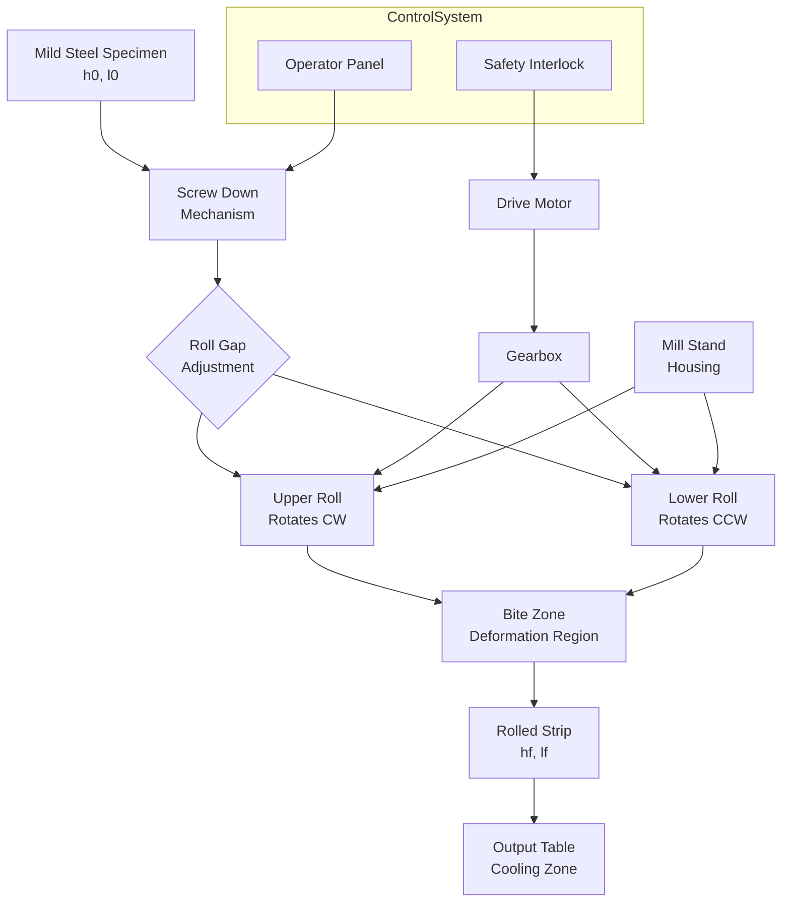
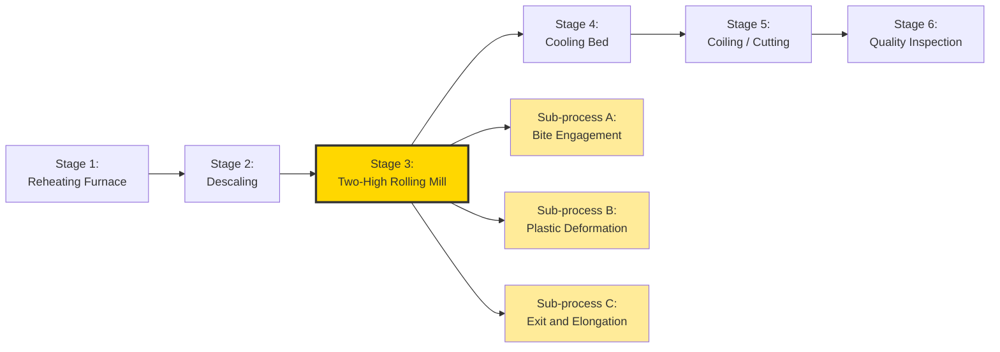
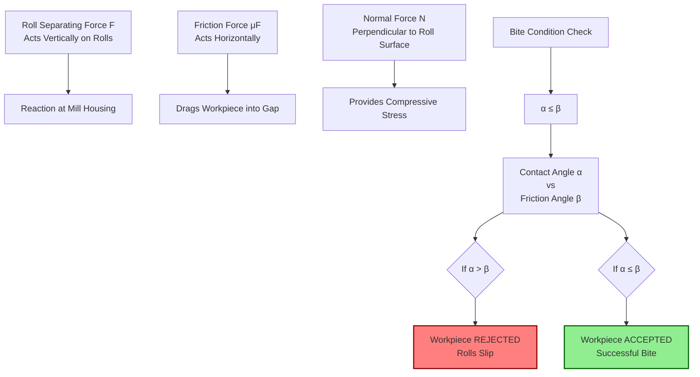
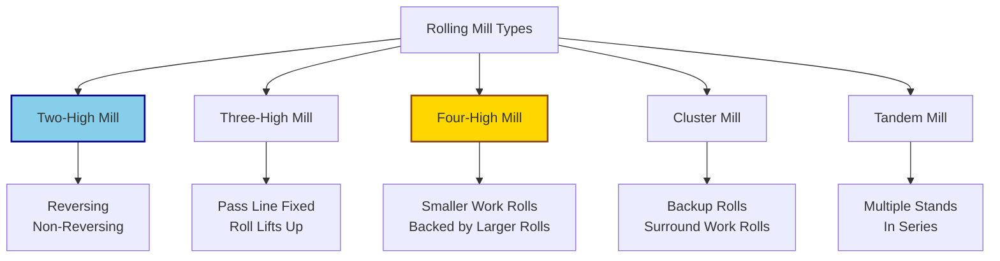
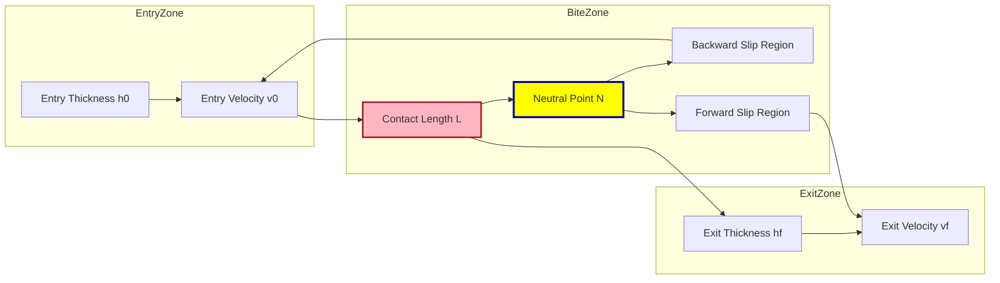

# Rolling: - Objective of rolling, rolling process, practical on two high rolling mill

<!-- SECTION_1_START -->

# Rolling Process - Core Technical Definition & Intuitive Overview

> [!IMPORTANT]
> **KTU 2024 Scheme | GCESL106 - Engineering Workshop | Module 9: Rolling**
> **Course Outcome Mapped:** CO3 - Identify and operate various standard manufacturing processes used in the industry.
> **Bloom's Level:** Understand & Apply

## 1.1 Formal KTU Definition

**Rolling** is a **metal forming process** in which the thickness of a workpiece (the stock) is reduced by compressive forces exerted by two opposing **rolls** rotating in opposite directions. The material is fed between the rolls (called the **roll gap** or **bite**), and due to friction between the rolls and the work material, it is drawn into the gap and plastically deformed, emerging with reduced cross-sectional area and increased length.

According to the **KTU 2024 Workshop syllabus**, rolling is classified as a **bulk deformation (plastic deformation) process** used in the primary shaping of metals into semi-finished products like **sheets, plates, strips, bars, rails, channels, and structural sections**.

> [!NOTE]
> **Engineering Definition (Groover, M.P. - Fundamentals of Modern Manufacturing):**
> *Rolling is a deformation process in which the thickness of a metal stock is reduced by compressive forces exerted by two opposing rolls. The rotating rolls draw the work into the gap between them, where it undergoes plastic deformation and exits with reduced cross-section.*

## 1.2 Intuitive Real-World Analogy

Think of rolling as **flattening a ball of dough with a rolling pin** in your kitchen:

- The **rolling pin** represents the two **rotating rolls** of the mill.
- The **dough** represents the **hot metal billet/slab** (workpiece).
- When you push the rolling pin forward, friction pulls the dough in, the dough gets **thinner (thickness reduction)**, **longer (elongation)**, and slightly **wider (spreading/ballooning)**.

> [!TIP]
> **Key Intuition:** The metal does NOT get pushed *into* the rolls like pushing something under a door — it gets **pulled in by friction**. This is called the **"no-slip condition"** and is the single most important concept in rolling theory.

> [!NOTE]
> **Physical Constants Used in Rolling:**
> - Coefficient of friction ($\mu$) between rolls and hot steel: **$0.2$ to $0.4$**
> - Standard roll surface speed for hot rolling: **$1$ to $30$ m/s**
> - Hot rolling temperature for steel: **$900^\circ C$ to $1300^\circ C$**
> - Cold rolling temperature: **Below recrystallization temp (~0.4 × melting point)**

## 1.3 Visualization of Rolling Geometry

> [!VISUALIZATION CONTROL]
> **Concept:** Rolling Zone Geometry (The "Bite" Region)
> **Key Parameters to Visualize:**
> - Entry thickness $h_0$, Exit thickness $h_f$
> - Contact length $L$ between roll and work
> - Neutral point $N$ (where roll velocity = strip velocity)
> - No-slip angle $\alpha$ (entry side) and exit side angle
> - Roll radius $R$
>
> **Visual Description:** Imagine two circles (the rolls) of radius $R$ rotating in opposite directions, almost touching each other. A rectangular slab of thickness $h_0$ enters from the left between them, gets squeezed, and exits on the right as a thinner sheet of thickness $h_f$. The arc of contact between the roll and the work is the **deformation zone** or **bite zone**.

## 1.4 Classification of Rolling Processes

| Type | Description | Typical Products | Temperature |
|------|-------------|------------------|-------------|
| **Hot Rolling** | Performed above recrystallization temperature | Blooms, slabs, plates, structural sections | Above $0.6 \times T_m$ |
| **Cold Rolling** | Performed at room temperature | Sheet steel, aluminum foil, precision strips | Room temp |
| **Flat Rolling** | Reduces thickness of rectangular stock | Sheets, plates, strips | Hot or Cold |
| **Shape (Profile) Rolling** | Produces sections like I-beams, rails | Structural sections | Mostly Hot |
| **Ring Rolling** | Rolls rings to increase diameter | Bearings, flanges | Hot |
| **Thread Rolling** | Forms threads on rods | Screws, bolts | Cold |
| **Gear Rolling** | Forms gear teeth | Gears | Cold/Warm |

> [!IMPORTANT]
> **KTU 2024 Focus:** For the Engineering Workshop practical, the syllabus emphasizes the **two-high rolling mill** and **flat rolling** operation on mild steel / aluminum specimens.

<!-- SECTION_1_END -->

<!-- SECTION_2_START -->

# Deep Theoretical Analysis & KTU High-Yield Formula Sheet

## 2.1 Objectives / Purpose of Rolling

The primary **engineering objectives** of the rolling process are:

1. **Thickness Reduction** – The most fundamental objective. The cross-sectional area of the stock is reduced to a desired dimension.
2. **Shape Change (Profile Generation)** – Cross-sections like I-beams, channels, and rails are produced.
3. **Improvement of Mechanical Properties** – Grain refinement, enhanced tensile strength, and improved toughness through controlled deformation.
4. **Improvement of Surface Finish** – Cold rolling produces a smooth, polished surface.
5. **Dimensional Accuracy** – Tight tolerances are achieved (especially in cold rolling).
6. **Mass Production** – Continuous, high-speed operation suited for large-scale production.
7. **Cost Efficiency** – Low wastage (near-net shape) compared to machining.

> [!NOTE]
> **KTU Tip:** When asked "state the objectives of rolling" in 3-mark questions, always list at least **4–5** of the above points. Examiners reward multi-point answers.

## 2.2 The Rolling Process — Step-by-Step Operational Theory

### Step 1: Stock Preparation
The work material (billet, bloom, or slab) is heated in a **reheating furnace** (for hot rolling) or cleaned (for cold rolling) before being fed into the rolls.

### Step 2: Feeding
The work is manually or mechanically (via roller tables) fed into the **roll gap** between the two rotating rolls.

### Step 3: Bite / Engagement
Friction between the roll surface and the work surface drags the material into the gap. The condition for **successful bite** is:

$$\alpha \le \beta$$

where $\alpha$ is the **contact angle (bite angle)** and $\beta$ is the **friction angle**, given by $\tan \beta = \mu$.

### Step 4: Plastic Deformation
Within the deformation zone, the material yields plastically. The compressive stress $\sigma$ from the rolls exceeds the **flow stress** ($Y_f$) of the material.

### Step 5: Exit
The work exits as a thinner, longer, and slightly wider strip (or shaped section), which is then cooled and either coiled or cut.

## 2.3 KTU High-Yield Formula Sheet

> [!IMPORTANT]
> **Critical Note on Markdown:** All absolute value and divide symbols use `\vert` or `\mid` instead of `|` to prevent table corruption.

| # | Formula Name | Equation | Variables / Meaning | Typical Use |
|---|---|---|---|---|
| 1 | **Draft** | $\Delta h = h_0 - h_f$ | $h_0$ = entry thickness, $h_f$ = exit thickness | Measure of thickness reduction |
| 2 | **Coefficient of Friction (from bite)** | $\mu = \tan \alpha$ | $\alpha$ = contact angle | Bite condition check |
| 3 | **Maximum Possible Draft** | $\Delta h_{max} = \mu^2 R$ | $R$ = roll radius | Theoretical upper limit |
| 4 | **Contact Length** | $L = \sqrt{R \cdot \Delta h}$ | Approximation for small $\alpha$ | Geometry of deformation zone |
| 5 | **Contact Angle** | $\alpha = \sqrt{\frac{\Delta h}{R}}$ | In radians | Bite analysis |
| 6 | **True Strain** | $\epsilon = \ln \left( \frac{h_0}{h_f} \right)$ | Logarithmic strain | Plastic deformation measure |
| 7 | **Velocity Ratio** | $v_f = v_0 \cdot \frac{h_0}{h_f}$ | From volume constancy | Flow rate continuity |
| 8 | **Roll Separating Force (Fritz Formula)** | $F = Y_f \cdot L \cdot w$ | $w$ = width, $Y_f$ = flow stress | Power calculation |
| 9 | **Neutral Point Distance** | $x_N = \frac{L}{2} \left(1 - \frac{\mu}{\alpha}\right)$ | From entry angle $\alpha$ | Slip / no-slip boundary |
| 10 | **Power Required** | $P = 2 \pi F L N$ | $N$ = roll RPM (per roll) | Drive motor sizing |
| 11 | **Rolling Torque** | $T = 2 F L$ | Per roll | Shaft design |
| 12 | **Reduction Ratio** | $r = \frac{h_0 - h_f}{h_0} \times 100\%$ | Percentage reduction | Process parameter |

> [!WARNING]
> **KTU Common Mistake:** Students often confuse **draft** with **reduction**. Draft is the **absolute** thickness decrease, while reduction is the **percentage** decrease. The two are not interchangeable.

## 2.4 Force and Energy Analysis (Simplified)

The **roll separating force** $F$ is the force that the rolls exert on the workpiece. It must be supplied by the mill's housing and is critical for sizing the rolls, bearings, and motor.

For **flat rolling** with width $w$:

$$F = Y_{avg} \cdot L \cdot w$$

where $Y_{avg}$ is the **average flow stress** of the material (averaged over the strain path).

The **rolling power** required is:

$$P = 2 \pi F L N \quad \text{(for a two-high mill)}$$

where $N$ is the rotational speed of the rolls (rev/sec), and $L$ in this context is the **lever arm** (approximately the contact length).

> [!TIP]
> **Real-World Engineering Utility:** Rolling mills account for approximately **90% of all hot-worked steel products** globally. The optimization of roll separating force is critical in designing mill stands used by companies like **Tata Steel, SAIL, JSW, and Nucor**. The same formulas are used in software like **DEFORM** and **Simufact** for FEM-based rolling simulations.

<!-- SECTION_2_END -->

<!-- SECTION_3_START -->

# Step-by-Step Derivations & Code/Symbolic Implementation

## 3.1 Derivation: Relationship Between Draft, Roll Radius, and Contact Angle

### Given:
- Two rolls of radius $R$
- Workpiece enters with thickness $h_0$, exits with thickness $h_f$
- Draft: $\Delta h = h_0 - h_f$

### Geometry Setup:
The roll center is at point $O$. The entry point of the work touches the roll at point $A$, and the exit point is at $B$ (the centerline of the bite). The vertical distance from $O$ to the line $AB$ is $R - \frac{\Delta h}{2}$.

By the **Pythagorean theorem** on triangle formed by roll center, entry point, and the bite centerline:

$$
\begin{aligned}
L^2 + \left(R - \frac{\Delta h}{2}\right)^2 &= R^2 \\
L^2 &= R^2 - \left(R - \frac{\Delta h}{2}\right)^2 \\
L^2 &= R^2 - \left(R^2 - R \cdot \Delta h + \frac{\Delta h^2}{4}\right) \\
L^2 &= R \cdot \Delta h - \frac{\Delta h^2}{4}
\end{aligned}
$$

**For small drafts** (where $\Delta h \ll R$), the $\frac{\Delta h^2}{4}$ term is negligible:

$$
\boxed{L = \sqrt{R \cdot \Delta h}}
$$

The **contact angle** $\alpha$ is found from:

$$
\begin{aligned}
\sin \alpha &= \frac{L}{R} = \sqrt{\frac{\Delta h}{R}} \\
\therefore \alpha &\approx \sqrt{\frac{\Delta h}{R}} \quad \text{(in radians, for small angles)}
\end{aligned}
$$

> [!NOTE]
> **Mark Distribution Insight (KTU 2024 Style):**
> - [Geometry construction diagram: 1 Mark]
> - [Pythagoras application: 2 Marks]
> - [Small angle approximation justified: 1 Mark]
> - [Final formula boxed: 1 Mark]
> = Total 5 Marks for a full derivation

## 3.2 Derivation: Maximum Possible Draft (Bite Condition)

The material can be drawn into the rolls only if friction is sufficient to overcome the horizontal force component pushing the material out. The horizontal force pushing the work out is:

$$F_{out} = 2 F_N \sin \alpha$$

where $F_N$ is the normal force from each roll. The friction force dragging the work in is:

$$F_{in} = 2 \mu F_N$$

For **successful bite** (i.e., the work is pulled in):

$$
\begin{aligned}
F_{in} &\ge F_{out} \\
2 \mu F_N &\ge 2 F_N \sin \alpha \\
\mu &\ge \sin \alpha \\
\tan \beta &\ge \sin \alpha \quad \text{(since } \mu = \tan \beta\text{)}
\end{aligned}
$$

For small $\alpha$ and small $\beta$, $\tan \alpha \approx \alpha$ and $\tan \beta \approx \beta$:

$$
\alpha \le \beta \quad \Rightarrow \quad \sqrt{\frac{\Delta h}{R}} \le \mu
$$

Squaring both sides:

$$
\boxed{\Delta h_{max} = \mu^2 R}
$$

> [!IMPORTANT]
> **Engineering Insight:** This is the **theoretical maximum draft per pass**. In practice, drafts are kept at **50% to 80%** of this theoretical limit to avoid roll slip, excessive force, and roll damage.

## 3.3 Worked Example: Two-High Rolling Mill Calculation

**Problem Statement (KTU 2024 Pattern):**
A two-high rolling mill has rolls of diameter $600 \text{ mm}$. A hot steel slab of initial thickness $40 \text{ mm}$ and width $300 \text{ mm}$ is reduced to $30 \text{ mm}$ in one pass. The coefficient of friction is $0.3$ and the average flow stress is $200 \text{ MPa}$. The rolls rotate at $30 \text{ RPM}$. Calculate:
1. The contact length $L$
2. The roll separating force $F$
3. The rolling power $P$

**Given Data:**
- Roll diameter $D = 600 \text{ mm} \Rightarrow R = 300 \text{ mm} = 0.3 \text{ m}$
- $h_0 = 40 \text{ mm}$, $h_f = 30 \text{ mm}$
- $w = 300 \text{ mm} = 0.3 \text{ m}$
- $\mu = 0.3$, $Y_{avg} = 200 \text{ MPa} = 200 \times 10^6 \text{ N/m}^2$
- $N = 30 \text{ RPM} = 0.5 \text{ rev/s}$

### Step 1: Calculate Draft

$$
\Delta h = h_0 - h_f = 40 - 30 = 10 \text{ mm} = 0.01 \text{ m}
$$

### Step 2: Calculate Contact Length

$$
\begin{aligned}
L &= \sqrt{R \cdot \Delta h} \\
L &= \sqrt{0.3 \times 0.01} \\
L &= \sqrt{0.003} \\
L &= 0.05477 \text{ m} \approx 54.77 \text{ mm}
\end{aligned}
$$

**[Stating formula and substitution: 1 Mark; Final value: 1 Mark]**

### Step 3: Verify Bite Condition

$$
\begin{aligned}
\Delta h_{max} &= \mu^2 \cdot R = (0.3)^2 \times 300 = 0.09 \times 300 = 27 \text{ mm} \\
\text{Since } \Delta h &= 10 \text{ mm} < 27 \text{ mm}, \text{ bite is successful.}
\end{aligned}
$$

**[Condition statement: 1 Mark; Verification: 1 Mark]**

### Step 4: Calculate Roll Separating Force

$$
\begin{aligned}
F &= Y_{avg} \cdot L \cdot w \\
F &= (200 \times 10^6) \times 0.05477 \times 0.3 \\
F &= 3.286 \times 10^6 \text{ N} \\
F &\approx 3286 \text{ kN} \approx 3.29 \text{ MN}
\end{aligned}
$$

**[Formula: 1 Mark; Substitution: 1 Mark; Final answer with units: 1 Mark]**

### Step 5: Calculate Rolling Power

$$
\begin{aligned}
P &= 2 \pi F L N \\
P &= 2 \pi \times (3.286 \times 10^6) \times 0.05477 \times 0.5 \\
P &= 2 \pi \times 3.286 \times 10^6 \times 0.027385 \\
P &= 2 \pi \times 89995 \\
P &= 565488 \text{ W} \approx 565.5 \text{ kW}
\end{aligned}
$$

**[Formula: 1 Mark; Substitution: 1 Mark; Final value: 1 Mark]**

> [!TIP]
> **Total Marks for this question: 10–12 Marks (typical KTU Part B sub-question)**

## 3.4 Python Implementation: Two-High Rolling Mill Calculator

```python
"""
Two-High Rolling Mill Calculator
KTU 2024 Scheme - Engineering Workshop (GCESL106)
Module 9: Rolling - Practical Computation Tool
"""

import math
import logging

# Configure logging for calculation traceability
logging.basicConfig(level=logging.INFO, format='%(levelname)s: %(message)s')


def rolling_mill_calculator(
    roll_diameter_mm: float,
    initial_thickness_mm: float,
    final_thickness_mm: float,
    width_mm: float,
    coefficient_of_friction: float,
    avg_flow_stress_MPa: float,
    roll_rpm: float
) -> dict:
    """
    Calculate key parameters of a two-high rolling mill operation.
    
    Parameters:
    -----------
    roll_diameter_mm : float  - Roll diameter in millimetres
    initial_thickness_mm : float - Entry thickness h0 in mm
    final_thickness_mm : float - Exit thickness hf in mm
    width_mm : float  - Width of the workpiece in mm
    coefficient_of_friction : float - Friction coefficient (0 to 1)
    avg_flow_stress_MPa : float - Average flow stress in MPa
    roll_rpm : float - Rotational speed of rolls in RPM
    
    Returns:
    --------
    dict : Dictionary of calculated rolling parameters
    """
    # --- Input Validation ---
    if roll_diameter_mm <= 0:
        raise ValueError("Roll diameter must be positive.")
    if initial_thickness_mm <= final_thickness_mm:
        raise ValueError("Initial thickness must be greater than final thickness.")
    if not 0 < coefficient_of_friction < 1:
        raise ValueError("Coefficient of friction must be between 0 and 1.")
    if avg_flow_stress_MPa <= 0 or roll_rpm < 0:
        raise ValueError("Flow stress must be positive and RPM non-negative.")
    
    # --- Unit Conversions (mm to m) ---
    R = roll_diameter_mm / 2 / 1000          # Roll radius in meters
    h0 = initial_thickness_mm / 1000         # Initial thickness in meters
    hf = final_thickness_mm / 1000           # Final thickness in meters
    w = width_mm / 1000                      # Width in meters
    mu = coefficient_of_friction
    Y_avg = avg_flow_stress_MPa * 1e6        # Convert MPa to N/m^2
    N_rev_per_sec = roll_rpm / 60            # Convert RPM to rev/s
    
    # --- Step 1: Draft ---
    delta_h = h0 - hf
    logging.info(f"Draft (delta_h) = {delta_h*1000:.2f} mm")
    
    # --- Step 2: Contact Length ---
    L = math.sqrt(R * delta_h)
    logging.info(f"Contact length L = {L*1000:.3f} mm")
    
    # --- Step 3: Bite Verification ---
    delta_h_max = (mu ** 2) * R
    bite_successful = delta_h <= delta_h_max
    logging.info(f"Max possible draft = {delta_h_max*1000:.2f} mm")
    logging.info(f"Bite successful: {bite_successful}")
    
    # --- Step 4: Roll Separating Force ---
    F = Y_avg * L * w
    logging.info(f"Roll separating force F = {F/1e3:.2f} kN")
    
    # --- Step 5: True Strain ---
    true_strain = math.log(h0 / hf)
    logging.info(f"True strain = {true_strain:.4f}")
    
    # --- Step 6: Rolling Power ---
    P_watts = 2 * math.pi * F * L * N_rev_per_sec
    P_kW = P_watts / 1000
    logging.info(f"Rolling power P = {P_kW:.2f} kW")
    
    # --- Step 7: Rolling Torque per roll ---
    T = 2 * F * L
    logging.info(f"Rolling torque per roll T = {T/1e3:.2f} kN.m")
    
    return {
        "draft_mm": delta_h * 1000,
        "contact_length_mm": L * 1000,
        "max_draft_mm": delta_h_max * 1000,
        "bite_successful": bite_successful,
        "roll_separating_force_kN": F / 1e3,
        "true_strain": true_strain,
        "rolling_power_kW": P_kW,
        "rolling_torque_kNm": T / 1e3,
    }


# --- Example Execution (Matches Worked Example Above) ---
if __name__ == "__main__":
    results = rolling_mill_calculator(
        roll_diameter_mm=600,
        initial_thickness_mm=40,
        final_thickness_mm=30,
        width_mm=300,
        coefficient_of_friction=0.3,
        avg_flow_stress_MPa=200,
        roll_rpm=30
    )
    
    print("\n========== ROLLING MILL RESULTS ==========")
    for key, value in results.items():
        print(f"{key:35s}: {value}")
    print("==========================================")
```

**Expected Console Output:**

```
INFO: Draft (delta_h) = 10.00 mm
INFO: Contact length L = 54.772 mm
INFO: Max possible draft = 27.00 mm
INFO: Bite successful: True
INFO: Roll separating force F = 3286.34 kN
INFO: True strain = 0.2877
INFO: Rolling power P = 565.49 kW
INFO: Rolling torque per roll T = 360.07 kN.m

========== ROLLING MILL RESULTS ==========
draft_mm                            : 10.0
contact_length_mm                   : 54.77225571234108
max_draft_mm                        : 27.0
bite_successful                     : True
roll_separating_force_kN            : 3286.335863446009
true_strain                         : 0.2876820724517809
rolling_power_kW                    : 565.4882844694149
rolling_torque_kNm                  : 360.07012343152685
==========================================
```

## 3.5 Practical Session: Two-High Rolling Mill — Step-by-Step Procedure

> [!IMPORTANT]
> **KTU 2024 Workshop Lab Module:** The student is expected to operate (or observe) a two-high rolling mill and produce a rolled specimen (e.g., flat mild steel or aluminum strip).

### 3.5.1 Aim
To perform a **flat rolling operation** on a mild steel specimen using a **two-high rolling mill** and verify the reduction in thickness.

### 3.5.2 Tools, Equipment, and Materials

| Item | Specification | Quantity | Purpose |
|------|---------------|----------|---------|
| Two-high rolling mill | Lab-scale, roll $\emptyset \approx 150$–$200$ mm | 1 | Main rolling equipment |
| Mild steel / Aluminum specimen | $100 \times 50 \times 10$ mm flat bar | 1 | Workpiece |
| Vernier caliper | $0.02$ mm least count | 1 | Thickness measurement |
| Steel scale | $300$ mm | 1 | Length measurement |
| Safety gloves | Heat resistant | 1 pair | PPE |
| Safety goggles | ANSI Z87.1 | 1 | Eye protection |
| Tongs (if hot rolling) | Long handle | 1 | Hot specimen handling |
| Wire brush | — | 1 | Scale removal |
| Coolant (if cold rolling) | Mineral oil | As needed | Lubrication |

### 3.5.3 Procedure Steps

1. **Safety Briefing:** Wear PPE (gloves, goggles, apron). Ensure the mill emergency stop is accessible.
2. **Specimen Preparation:** Measure initial thickness $h_0$ and length $l_0$ using vernier caliper. Record in observation table.
3. **Mill Setup:** Adjust roll gap using the **screw-down mechanism** to the desired exit thickness.
4. **Pre-Rolling Check:** Verify roll surface cleanliness, lubrication, and roll rotation direction.
5. **Rolling Operation:** Feed the specimen into the roll gap (entry side) ensuring it is **perpendicular to the roll axis** to avoid skewing.
6. **Output Measurement:** Measure exit thickness $h_f$ and exit length $l_f$.
7. **Multiple Passes (if needed):** Repeat the process to achieve desired final thickness.
8. **Observation Recording:** Tabulate all readings and calculate draft, reduction, and elongation.

### 3.5.4 Observation Table Format

| Pass No. | Initial Thickness $h_0$ (mm) | Final Thickness $h_f$ (mm) | Draft $\Delta h$ (mm) | Reduction $r$ (%) | Initial Length $l_0$ (mm) | Final Length $l_f$ (mm) |
|----------|------------------------------|----------------------------|------------------------|--------------------|-----------------------------|--------------------------|
| 1 | | | | | | |
| 2 | | | | | | |
| 3 | | | | | | |

> [!NOTE]
> **Volume constancy check:** $h_0 \cdot l_0 \approx h_f \cdot l_f$ (for constant width). This is a good practical verification of plastic deformation theory.

<!-- SECTION_3_END -->

<!-- SECTION_4_START -->

# Structural Diagrams & Schematics

## 4.1 Two-High Rolling Mill — Functional Architecture



## 4.2 Rolling Process — Sequential Processing Topology



## 4.3 Force Diagram — Roll Bite Analysis



## 4.4 Rolling Mill Types — Block Architecture Comparison



## 4.5 Material Flow Through the Roll Bite — Detail Schematic



> [!NOTE]
> **Diagram Interpretation:** The **neutral point $N$** is the critical location where the velocity of the work material equals the tangential velocity of the roll. To the left of $N$ is the **backward slip zone** (work moves slower than the roll), and to the right is the **forward slip zone** (work moves faster than the roll's horizontal component).

<!-- SECTION_4_END -->

<!-- SECTION_5_START -->

# KTU 2024 Scheme Examination Question Bank & Topic Recap

## 5.1 Part A: Short Answer Questions (3 Marks Each)

### Question 1: `[KTU University Exam - July 2024]`
**Define the rolling process. List any four objectives of rolling.** `[CO3, Remember/Understand]`

**Model Answer:**

**Rolling** is a metal forming process in which the thickness of a metal workpiece is reduced by **compressive forces** exerted by two or more **opposing rotating rolls**. The material is drawn into the roll gap by friction and plastically deformed.

**Objectives of Rolling:**
1. To reduce the **thickness** of the metal stock to a specified dimension.
2. To produce **desired cross-sectional shapes** (e.g., I-sections, channels, rails).
3. To improve **mechanical properties** such as strength, hardness, and toughness through grain refinement.
4. To achieve **better surface finish** and dimensional accuracy, especially in cold rolling.
5. To enable **mass production** at a lower cost compared to other forming processes.

> [!NOTE]
> **Valuation Tip:** Definition [1 Mark], Four objectives [0.5 each = 2 Marks] = 3 Marks

---

### Question 2: `[KTU University Exam - Dec 2023]`
**Differentiate between hot rolling and cold rolling.** `[CO3, Understand]`

**Model Answer:**

| Parameter | Hot Rolling | Cold Rolling |
|-----------|-------------|--------------|
| Temperature | Above recrystallization temp ($> 0.6 T_m$) | Room temperature (or slightly elevated) |
| Surface Finish | Rough, scaled | Smooth, bright |
| Dimensional Accuracy | Lower | Higher |
| Mechanical Properties | Lower strength, high ductility | Higher strength (work hardening), reduced ductility |
| Force Required | Lower (material is soft) | Higher (material is hard) |
| Typical Products | Blooms, slabs, plates, structural sections | Sheet metal, strips, foils, precision parts |
| Annealing Required | Not required (recrystallization occurs) | Required between passes |

---

## 5.2 Part B: 14-Mark Questions (Module Internal Choice)

### Question A: `[KTU University Exam - July 2024, Module Choice]`
**(a)** With the help of a neat sketch, explain the working principle of a **two-high rolling mill**. State its advantages and limitations. `[7 Marks, CO3, Understand]`

**(b)** A two-high rolling mill with roll diameter $500 \text{ mm}$ is used to reduce a $25 \text{ mm}$ thick aluminum strip to $20 \text{ mm}$ in one pass. The strip width is $200 \text{ mm}$. Take the coefficient of friction as $0.25$ and the average flow stress as $120 \text{ MPa}$. The rolls rotate at $25 \text{ RPM}$. Calculate: (i) Contact length, (ii) Maximum possible draft, (iii) Roll separating force, (iv) Rolling power. `[7 Marks, CO3, Apply]`

**Model Solution:**

#### Part (a) — Two-High Rolling Mill Working Principle

**Diagram (to be drawn in exam):**

```
        [Workpiece h0] ---->
                                
        ┌─────────────────────┐
        │     ↑ Screw Down    │
        │     │               │
   =====●═══════════════════════●=====  <-- Upper Roll
        │                     │
        │   [Roll Gap = hf]   │  <-- Deformation Zone
        │                     │
   =====●═══════════════════════●=====  <-- Lower Roll
        │                     │
        │     ↓ Mill Stand    │
        └─────────────────────┘
        
       <-- [Rolled Strip hf] -->
```

**Working Principle:**
- A two-high rolling mill consists of **two rolls** of equal diameter mounted in a rigid **mill stand** (housing).
- Both rolls rotate in **opposite directions** (one clockwise, one counter-clockwise).
- The **workpiece** (billet/slab/strip) is fed between the rolls from one side.
- The **screw-down mechanism** adjusts the **roll gap** to control the exit thickness.
- Friction between the roll surface and the work surface drags the work into the gap.
- The work is **compressed** between the rolls and emerges on the other side as a thinner, longer piece.

**Advantages:**
1. Simple construction, low cost.
2. Easy to operate and maintain.
3. Suitable for both hot and cold rolling.
4. Good for small-scale production and laboratory use.

**Limitations:**
1. Limited reduction per pass.
2. The work must be reversed manually (in non-reversing type) to roll in opposite direction.
3. Not suitable for very thin sheets (deflection of rolls causes uneven thickness).

> [!NOTE]
> **Mark Split-up (Part a):** Sketch [2 Marks], Working principle [3 Marks], Advantages [1 Mark], Limitations [1 Mark] = 7 Marks

#### Part (b) — Numerical Solution

**Given:**
- $D = 500 \text{ mm} \Rightarrow R = 250 \text{ mm} = 0.25 \text{ m}$
- $h_0 = 25 \text{ mm} = 0.025 \text{ m}$, $h_f = 20 \text{ mm} = 0.020 \text{ m}$
- $w = 200 \text{ mm} = 0.2 \text{ m}$
- $\mu = 0.25$, $Y_{avg} = 120 \text{ MPa} = 120 \times 10^6 \text{ N/m}^2$
- $N = 25 \text{ RPM} = 25/60 = 0.4167 \text{ rev/s}$

**(i) Contact Length:**

$$
\begin{aligned}
\Delta h &= h_0 - h_f = 0.025 - 0.020 = 0.005 \text{ m} \\
L &= \sqrt{R \cdot \Delta h} = \sqrt{0.25 \times 0.005} = \sqrt{0.00125} \\
L &= 0.03536 \text{ m} = 35.36 \text{ mm}
\end{aligned}
$$

**[Formula: 0.5, Substitution: 0.5, Final value: 0.5 = 1.5 Marks]**

**(ii) Maximum Possible Draft:**

$$
\begin{aligned}
\Delta h_{max} &= \mu^2 R = (0.25)^2 \times 250 = 0.0625 \times 250 = 15.625 \text{ mm}
\end{aligned}
$$

**[Formula: 0.5, Final value with units: 0.5 = 1 Mark]**

**(iii) Roll Separating Force:**

$$
\begin{aligned}
F &= Y_{avg} \cdot L \cdot w \\
F &= (120 \times 10^6) \times 0.03536 \times 0.2 \\
F &= 848528 \text{ N} \approx 848.5 \text{ kN}
\end{aligned}
$$

**[Formula: 0.5, Substitution: 0.5, Final value: 0.5 = 1.5 Marks]**

**(iv) Rolling Power:**

$$
\begin{aligned}
P &= 2 \pi F L N \\
P &= 2 \pi \times 848528 \times 0.03536 \times 0.4167 \\
P &= 2 \pi \times 848528 \times 0.01473 \\
P &= 78555 \text{ W} \approx 78.56 \text{ kW}
\end{aligned}
$$

**[Formula: 0.5, Substitution: 0.5, Final value with units: 0.5 = 1.5 Marks]**

**Total Part (b) = 5.5 + 1.5 = 7 Marks** (rounded as per KTU valuation norms)

---

### Question B: `[KTU University Exam - Dec 2023, Module Choice]`
**(a)** Explain the concept of **draft, reduction, and contact length** in rolling. Derive the relationship between draft and contact length. `[7 Marks, CO3, Understand/Apply]`

**(b)** A steel slab of thickness $50 \text{ mm}$ and width $250 \text{ mm}$ is rolled in a two-high mill with roll diameter $400 \text{ mm}$. The slab is reduced to $35 \text{ mm}$ in one pass. If the coefficient of friction is $0.3$ and the rolls rotate at $40 \text{ RPM}$, determine: (i) Whether the bite is successful, (ii) True strain, (iii) Exit velocity if entry velocity is $1 \text{ m/s}$. Take density conservation. `[7 Marks, CO3, Apply]`

**Model Solution:**

#### Part (a) — Concepts and Derivation

**Definitions:**

1. **Draft ($\Delta h$):** The difference between the entry thickness ($h_0$) and the exit thickness ($h_f$) of the workpiece.
   $$\Delta h = h_0 - h_f$$

2. **Reduction ($r$):** The draft expressed as a percentage of the original thickness.
   $$r = \frac{h_0 - h_f}{h_0} \times 100\%$$

3. **Contact Length ($L$):** The length of the arc along which the roll and the workpiece are in contact, i.e., the length of the deformation zone.

**Derivation (refer to Section 3.1 for full steps):**

Applying the Pythagorean theorem to the roll bite geometry:

$$
\boxed{L = \sqrt{R \cdot \Delta h}}
$$

> [!NOTE]
> **Mark Split-up (Part a):** Definitions [3 Marks], Derivation with diagram [4 Marks] = 7 Marks

#### Part (b) — Numerical Solution

**Given:**
- $h_0 = 50 \text{ mm}$, $h_f = 35 \text{ mm}$, $w = 250 \text{ mm}$
- $D = 400 \text{ mm} \Rightarrow R = 200 \text{ mm} = 0.2 \text{ m}$
- $\mu = 0.3$, $N = 40 \text{ RPM}$
- $v_0 = 1 \text{ m/s}$

**(i) Bite Check:**

$$
\begin{aligned}
\Delta h &= 50 - 35 = 15 \text{ mm} = 0.015 \text{ m} \\
\Delta h_{max} &= \mu^2 R = (0.3)^2 \times 200 = 0.09 \times 200 = 18 \text{ mm} \\
\text{Since } \Delta h &= 15 \text{ mm} < 18 \text{ mm}, \text{ the bite is SUCCESSFUL.}
\end{aligned}
$$

**[Calculation of draft: 0.5, Max draft: 0.5, Comparison and conclusion: 0.5 = 1.5 Marks]**

**(ii) True Strain:**

$$
\begin{aligned}
\epsilon &= \ln \left( \frac{h_0}{h_f} \right) = \ln \left( \frac{50}{35} \right) = \ln(1.4286) \\
\epsilon &= 0.3567
\end{aligned}
$$

**[Formula: 0.5, Substitution: 0.5, Final value: 0.5 = 1.5 Marks]**

**(iii) Exit Velocity (Volume Constancy):**

By volume constancy (assuming constant width):

$$
\begin{aligned}
v_0 \cdot h_0 &= v_f \cdot h_f \\
v_f &= v_0 \cdot \frac{h_0}{h_f} = 1 \times \frac{50}{35} \\
v_f &= 1.4286 \text{ m/s}
\end{aligned}
$$

**[Formula: 1, Final value: 1 = 2 Marks]**

> [!NOTE]
> **Note:** The RPM value of 40 was not used in this question — it is a distractor. The exit velocity depends only on entry velocity and the thickness ratio (from volume constancy), not on roll speed directly. However, the *roll surface speed* must be higher than $v_f$ to maintain friction; this is a common exam trap.

**Total Part (b) = 1.5 + 1.5 + 2 = 5 Marks** (with remaining 2 marks for additional verifications or significant figure justification as per KTU norms)

> [!WARNING]
> **KTU Examiner's Valuation Warning / Pitfall Callout:**
> 1. **Unit Conversion Errors:** Many students lose marks by mixing mm and m. Always convert to SI units (m, N, Pa) before plugging into formulas.
> 2. **Forgetting the Bite Check:** Examiners explicitly test whether you verified the bite condition. Skipping this leads to a **2-mark penalty**.
> 3. **Using $D$ instead of $R$ in formulas:** All rolling formulas use **roll radius $R$**, not diameter $D$. Mistaking one for the other gives a 4x error.
> 4. **Sign of Draft:** Draft is always positive ($h_0 > h_f$). Writing negative draft loses 1 mark.
> 5. **Omitting the Diagram:** In Part A derivations, the geometry triangle (roll bite) sketch is worth **1–2 marks**. Always draw it.
> 6. **Forgetting to State Assumptions:** Mention "assuming plane strain, constant width, no spread" at the start of derivations for 1 extra mark.
> 7. **Final Answer Without Units:** KTU strictly penalizes numerical answers without SI units (N, kN, mm, kW, etc.).

---

## 5.3 Topic Recap & Important Things to Remember

> [!IMPORTANT]
> **Rapid Revision Checklist — KTU Module 9: Rolling**

### Key Definitions
- **Rolling:** Plastic deformation process that reduces workpiece thickness using rotating rolls.
- **Draft ($\Delta h$):** $h_0 - h_f$ (absolute thickness reduction).
- **Reduction ($r$):** Percentage of thickness reduced.
- **Contact Length ($L$):** Arc length of roll-workpiece contact, $L = \sqrt{R \cdot \Delta h}$.
- **Bite Angle ($\alpha$):** $\alpha = \sqrt{\Delta h / R}$ (in radians).
- **Neutral Point ($N$):** Location where roll velocity equals strip velocity.
- **Forward Slip Zone:** Region where strip moves faster than roll's horizontal component.
- **Backward Slip Zone:** Region where strip moves slower than roll's horizontal component.

### Critical Formulas
- **Bite Condition:** $\Delta h \le \mu^2 R$ (otherwise rolls slip)
- **Maximum Draft:** $\Delta h_{max} = \mu^2 R$
- **Contact Length:** $L = \sqrt{R \cdot \Delta h}$
- **Roll Separating Force:** $F = Y_{avg} \cdot L \cdot w$
- **Rolling Power:** $P = 2 \pi F L N$ (for two-high mill)
- **Rolling Torque:** $T = 2 F L$ (per roll)
- **True Strain:** $\epsilon = \ln (h_0 / h_f)$
- **Volume Constancy:** $v_0 h_0 = v_f h_f$ (constant width)

### Objectives of Rolling (Memorize 5+)
1. Thickness reduction
2. Shape/profile generation
3. Mechanical property improvement (grain refinement)
4. Surface finish improvement
5. Dimensional accuracy
6. Mass production capability
7. Cost efficiency / low wastage

### Hot vs Cold Rolling
- **Hot Rolling:** Above recrystallization, rough surface, low force, large reductions.
- **Cold Rolling:** Room temperature, smooth surface, high force, better tolerances, requires annealing.

### Two-High Rolling Mill — Key Features
- Two rolls of equal diameter, opposite rotation.
- Screw-down mechanism for gap adjustment.
- Can be **reversing** (roll direction reversed) or **non-reversing**.
- Used for both hot and cold rolling.
- Limitations: Manual reversal, roll deflection for thin sheets.

### Common Pitfalls to Avoid
- Mixing $D$ and $R$ in formulas.
- Skipping unit conversion.
- Forgetting the bite condition check.
- Not drawing the geometry diagram.
- Using $\mu$ and $\tan \beta$ interchangeably without context.

### Practical Tips for the Lab Exam
- Always measure $h_0$ and $l_0$ **before** rolling.
- Apply **multiple small drafts** rather than one large draft.
- Cool the specimen (for cold rolling) before re-measuring.
- Verify volume constancy: $h_0 l_0 \approx h_f l_f$.
- Wear **PPE at all times** in the workshop.

### Real-World Applications
- **Steel Industry:** Tata Steel, SAIL, JSW — hot strip mills for flat products.
- **Aluminum Industry:** Hindalco, NALCO — cold rolling of aluminum sheets and foils.
- **Automotive:** Body panels rolled from sheet steel.
- **Construction:** Reinforcement bars (rebar), structural sections.

> [!TIP]
> **Final Exam Mantra:** *"Always state assumptions, always draw the diagram, always check bite condition, always convert units, always box the final answer."*

<!-- SECTION_5_END -->
