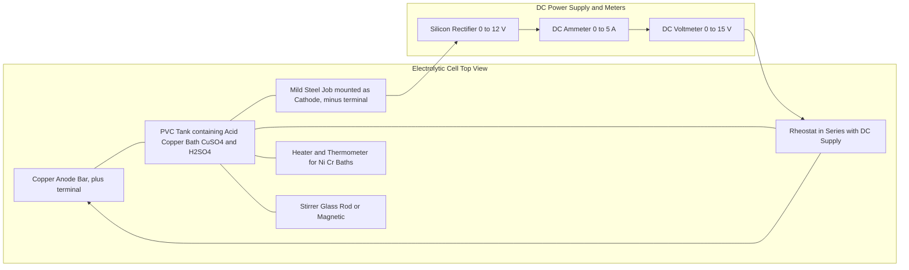
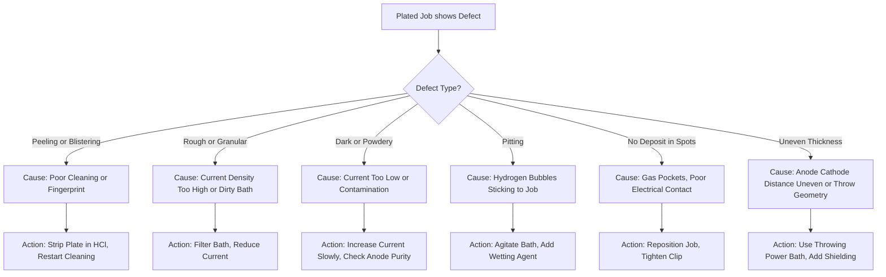

# Electroplating: -Electroplating a given job

<!-- SECTION_1_START -->
# Electroplating a Given Job — Module 10: Engineering Workshop (GCESL106)

## 1. Core Technical Definition & Intuitive Overview

### 1.1 Formal KTU 2024 Definition

**Electroplating** is an electrochemical surface-engineering process in which a thin, adherent, and uniform metallic coating is deposited onto the surface of a conductive substrate (the "job") by passing a direct current through an **electrolytic cell** containing a suitable **electrolyte** (salt solution of the plating metal). The job is wired as the **cathode** (negative electrode), and a bar of the metal to be deposited is wired as the **sacrificial anode** (positive electrode). The entire operation is governed quantitatively by **Faraday's Laws of Electrolysis**.

> [!IMPORTANT]
> **KTU Syllabus Highlight (GCESL106 — Module 10):**
> The student is expected to *demonstrate the electroplating of a given ferrous job (e.g., mild-steel bolt/nut)* with copper, nickel, or chromium, including *pre-treatment, plating, and post-treatment* stages, and to record the observations in the workshop logbook.

### 1.2 Conceptual Analogy / Intuition

Imagine you are **painting a wall**, but instead of using a brush that smears paint, you use an invisible "force field" (electric current) to teleport metal atoms from a metal bucket (anode) directly onto the wall (cathode), one atom-thick layer at a time. The paint bucket slowly dissolves as the wall gets coated. The "magic paint" is dissolved in water (electrolyte) so the atoms can travel as charged ions.

A second, more accurate analogy: think of a **two-compartment fish tank connected by a salt-water bridge**. If you push electricity through it, positive copper "fish" swim from one side (anode) and plate themselves onto the other side (cathode) — a literal **electroplating cell**.

### 1.3 Key Engineering Constants

- **Faraday's constant (F)** = **96500 C mol⁻¹** (charge carried by 1 mole of electrons)
- **Standard plating current density** = **10 to 40 A/dm²** (varies with metal)
- **Plating bath temperature** = **room temperature (≈ 27 °C)** for acid copper; **40–60 °C** for nickel; **45–55 °C** for chromium
- **Plating thickness specification** = **5 to 25 µm** (decorative) up to **50–250 µm** (engineering/hard chrome)

> [!NOTE]
> **Industry Standard Metric:** *Coating thickness is measured in **microns (µm)***, where 1 µm = 10⁻⁶ m. Decorative chrome is typically 0.25–1 µm; hard-chrome engineering coatings may exceed **250 µm**.

### 1.4 Where Electroplating is Used in Engineering

| Industry Sector | Typical Application | Plating Metal |
|---|---|---|
| Automotive | Bumpers, decorative trim, pistons | **Chromium, Nickel** |
| Electronics | PCB pads, connectors, contacts | **Gold, Silver, Tin** |
| Aerospace | Landing gear, hydraulic shafts | **Hard Chromium** |
| Marine / fasteners | Nuts, bolts, washers (anti-corrosion) | **Zinc, Cadmium** |
| Decorative / jewellery | Rings, idols, cutlery | **Gold, Silver, Copper** |
| Industrial machinery | Shafts, bearing surfaces | **Hard Chromium** |

> [!VISUALIZATION CONTROL]
> **Concept:** Faraday's First Law — *Linear relationship between deposited mass and current × time*
> **GeoGebra / Desmos Input Equations:**
> * `m = (I * t * M) / (n * F)`  (with M = 63.5 g/mol, n = 2 for Cu, F = 96500)
> * Sample point: `I = 2 A, t = 1800 s → m ≈ 1.18 g`
> **Visual Description:** A straight line through the origin in the (Q, m) plane, where the slope equals the electrochemical equivalent Z of the chosen metal. Copper has a gentle slope; silver has a steeper slope.

---

<!-- SECTION_1_END -->

<!-- SECTION_2_START -->
# 2. Deep Theoretical Analysis & KTU High-Yield Formula Sheet

## 2.1 The Electrolytic Cell — Components and Functions

The electroplating setup is a **DC-powered electrolytic cell**. Each component has a specific electrochemical role:

| S.No. | Component | Function | Typical Material |
|:-:|---|---|---|
| 1 | **Anode (+)** | Dissolves into the bath, replenishing metal ions | Pure metal bar of plating metal (e.g., copper, nickel) |
| 2 | **Cathode (−)** | The "job"; receives the metal deposit | Mild-steel job (bolt/nut) |
| 3 | **Electrolyte** | Conducts ions between electrodes; source of metal ions | Acid-sulphate solution (for Cu), Watts bath (for Ni) |
| 4 | **DC Power Supply** | Provides controlled, rectified current/voltage | Silicon rectifier, 0–12 V, 0–20 A |
| 5 | **Tank** | Holds electrolyte; non-reactive to acid | PVC, glass, rubber-lined steel |
| 6 | **Rheostat / Ammeter** | Controls and reads current | Variable resistor + DC ammeter |
| 7 | **Heater / Thermometer** | Maintains bath temperature | Immersion heater (for Ni / Cr) |
| 8 | **Cables & Clips** | Make electrical contact | Copper leads with crocodile clips |

## 2.2 Governing Equations — Faraday's Laws

### Faraday's First Law

The mass *m* of substance liberated at an electrode is directly proportional to the quantity of charge *Q* passed through the electrolyte.

$$m \;\propto\; Q = I \cdot t$$

$$m \;=\; Z \cdot I \cdot t \;=\; \frac{I \cdot t \cdot M}{n \cdot F}$$

where:

- $m$ = mass of metal deposited (grams)
- $Z$ = electrochemical equivalent (g C⁻¹) = $M / (n \cdot F)$
- $I$ = current (Amperes)
- $t$ = time (seconds)
- $M$ = atomic mass of the plating metal (g mol⁻¹)
- $n$ = valency (number of electrons per ion)
- $F$ = **96500 C mol⁻¹**

### Faraday's Second Law

When the **same charge** is passed through different electrolytes in series, the **masses deposited are proportional to their chemical equivalent weights** $E = M/n$.

$$\frac{m_1}{m_2} \;=\; \frac{E_1}{E_2} \;=\; \frac{M_1 \, n_2}{M_2 \, n_1}$$

### Current Efficiency (η)

Real processes never deposit 100 % of the theoretical mass due to side reactions (e.g., hydrogen evolution at the cathode). The **cathode current efficiency** is:

$$\eta \;=\; \frac{\text{Actual mass deposited}}{\text{Theoretical mass from Faraday's law}} \;\times\; 100\,\%$$

> For acid-copper plating, $\eta \approx 95\text{–}100\,\%$. For chromium, $\eta$ is unusually low at **10–25 %** because most current evolves hydrogen gas.

## 2.3 KTU High-Yield Formula Sheet

| # | Formula | Variables | Unit | Used For |
|:-:|---|---|:-:|---|
| 1 | $m = \dfrac{I \cdot t \cdot M}{n \cdot F}$ | $m, I, t, M, n, F$ | g, A, s, g mol⁻¹, —, C mol⁻¹ | Theoretical mass deposited |
| 2 | $Z = \dfrac{M}{n \cdot F}$ | $Z$ | g C⁻¹ | Electrochemical equivalent |
| 3 | $Q = I \cdot t$ | $Q$ | C (Coulomb) | Total charge passed |
| 4 | $\eta = \dfrac{m_{\text{actual}}}{m_{\text{theory}}} \times 100$ | $\eta$ | % | Cathode efficiency |
| 5 | $\delta = \dfrac{k \cdot I \cdot t \cdot \eta}{\rho \cdot A}$ | $\delta$ | µm | Approximate coating thickness |
| 6 | $\text{Average current density} = \dfrac{I}{A_{\text{job}}}$ | $I, A$ | A dm⁻² | Standardising plating rate |
| 7 | $N = \dfrac{m \cdot n \cdot F}{I \cdot t \cdot M} = \dfrac{1}{F}\cdot\dfrac{Q}{Z}$ | $N$ | mol | Moles of electrons transferred |

> [!NOTE]
> **Memory Aid (KTU):** Just remember the magic number **96500**. If charge *Q* (in coulombs) is divided by 96500, you get the number of **Faradays**, and multiplying by the equivalent weight gives the **deposited mass in grams**.

## 2.4 The 'Why' Behind Each Step

- **Why DC and not AC?** DC ensures unidirectional ion migration; AC would alternately plate and strip, giving a rough, porous deposit.
- **Why a sacrificial anode of the same metal?** It continuously replenishes the electrolyte with metal ions, keeping concentration stable for hours of operation.
- **Why pre-cleaning?** Even a microscopic oil film or oxide layer blocks nucleation of new metal atoms — the plate will peel off ("blistering").
- **Why control temperature?** Higher temperature increases ion mobility and reduces gas evolution, but accelerates bath decomposition. Each bath has an optimum.

## 2.5 Real-World Engineering Utility

Electroplating is not just decorative. It is a **functional surface engineering** process that:

- **Anti-corrosion protection** (zinc on iron, tin on steel food cans)
- **Wear resistance** (hard chromium on hydraulic shafts)
- **Solderability** (tin–lead on PCB pads)
- **Electrical conductivity** (gold on connector pins)
- **Dimensional restoration** (rebuilding worn shafts via thick chrome)
- **Aesthetic finishing** (decorative Cu–Ni–Cr on motorcycles)

> [!IMPORTANT]
> In production environments, electroplating is being progressively replaced by **electroless plating** (no external current) for uniform coatings on complex shapes. However, electroplating remains the workhorse for high-speed, large-area coating in automotive and hardware industries.

---

<!-- SECTION_2_END -->

<!-- SECTION_3_START -->
# 3. Step-by-Step Procedure, Derivations & Workshop Implementation

> **Domain-Adaptive Note:** This is a **practical/workshop** topic, hence the layout below uses a **component + tool + procedure table** as mandated for laboratory topics. The Faraday calculation is shown as a worked numerical problem (mathematical sub-domain).

## 3.1 Tools, Equipment, and Consumables

### 3.1.1 Tools & Equipment (Pin/Tool Configuration Table)

| # | Item | Specification / Grade | Workshop Use |
|:-:|---|---|---|
| 1 | DC Rectifier (Power Supply) | 0–12 V DC, 0–20 A, with ammeter & voltmeter | Drives the electrolytic cell |
| 2 | Plating Tank (Bath) | PVC / glass, ≈ 5 L capacity | Holds electrolyte |
| 3 | Anode | Pure copper / nickel bar (99.9 % purity) | Sacrificial metal source |
| 4 | Cathode Lead | Insulated copper wire with crocodile clip | Holds the job |
| 5 | Rheostat / Variable Resistor | 0–50 Ω, 5 A rating | Controls current |
| 6 | DC Ammeter | 0–5 A, panel mount | Reads plating current |
| 7 | DC Voltmeter | 0–15 V | Reads cell voltage |
| 8 | Hot Plate / Immersion Heater | 100–500 W | Heats nickel / chrome bath |
| 9 | Thermometer | 0–100 °C, alcohol type | Monitors bath temperature |
| 10 | Beakers | 500 mL borosilicate | Holds cleaning & rinsing solutions |
| 11 | Glass Rod | 200 mm | Stirring |
| 12 | Tongs (PVC-coated) | Workshop grade | Lifting hot jobs |
| 13 | Emery Paper | Grit 80, 120, 220, 400, 600 | Mechanical cleaning / polishing |
| 14 | Buffing Wheel + Rouge | Cotton, mounted on bench grinder | Mirror finishing |
| 15 | Stopwatch | Digital | Records plating time |
| 16 | Electronic Balance | 0.001 g readability | Weighs job before/after |
| 17 | PPE: Apron, Goggles, Gloves | PVC / rubber | Personal protection |
| 18 | Fume Hood / Ventilation | Workshop exhaust | Removes acid mist |

### 3.1.2 Chemicals and Their Roles

| Chemical | Concentration (typical) | Role in Process |
|---|---|---|
| Copper sulphate (CuSO₄·5H₂O) | 150–250 g L⁻¹ | Source of Cu²⁺ ions (for acid-copper bath) |
| Sulphuric acid (H₂SO₄) | 30–60 g L⁻¹ | Improves conductivity, prevents hydrolysis |
| Sodium hydroxide (NaOH) | 50 g L⁻¹ | Alkaline degreasing |
| Hydrochloric acid (HCl) | 10–20 % v/v | Acid pickling / rust removal |
| Distilled water | — | Rinsing and bath makeup |
| Nickel sulphate (NiSO₄·6H₂O) | 250 g L⁻¹ | (If nickel plating) Source of Ni²⁺ |

## 3.2 Detailed Step-by-Step Procedure

> **KTU Workshop Sequence (the standard KTU lab procedure)**

### **Stage 1 — Pre-Treatment (Surface Preparation)**

This is the **most critical stage**; ~70 % of plating failures originate here.

| Step | Operation | Tool / Chemical | Time / Parameter |
|:-:|---|---|---|
| 1.1 | **Initial inspection** of the job | Visual + vernier | Note initial mass $m_1$ (g) and surface area $A$ (cm²) |
| 1.2 | **Mechanical cleaning** — file off burrs, scratches | Flat file | Until surface is uniform |
| 1.3 | **Grinding / sanding** — progressive grit | Emery 80 → 120 → 220 → 400 | Until matte finish, no deep scratches |
| 1.4 | **Buffing** (optional) for mirror finish | Buffing wheel + rouge | As required |
| 1.5 | **Degreasing** — dip in hot alkaline solution | NaOH 50 g L⁻¹, 60–80 °C | 5–10 min |
| 1.6 | **Cold water rinse** | Distilled water | Until water sheets off uniformly |
| 1.7 | **Acid pickling** — remove rust / scale | 10–20 % HCl, room temp | 1–3 min (do not over-etch) |
| 1.8 | **Water rinse** | Distilled water | Twice |
| 1.9 | **Acid activation** (flash dip) | 5 % H₂SO₄ | 15–30 s |
| 1.10 | **Final rinse** | Distilled water | Do NOT touch with bare fingers |
| 1.11 | **Weigh and record** | Electronic balance | $m_1$ (g), record in logbook |

> [!WARNING]
> **Pitfall Callout:** Holding the job with bare fingers after the final rinse deposits a **fatty fingerprint** that will cause *pitting and blistering* in the plate. Always use clean PVC-coated tongs or copper-wire hangers.

### **Stage 2 — Setting Up the Plating Cell**

| Step | Action |
|:-:|---|
| 2.1 | Clean the PVC tank thoroughly with distilled water. |
| 2.2 | Prepare the electrolyte (e.g., for acid copper: 200 g L⁻¹ CuSO₄ + 50 g L⁻¹ H₂SO₄ in distilled water). Stir with glass rod until fully dissolved. |
| 2.3 | Place the copper anode bar centrally; connect to the **positive** (+) terminal of the rectifier via the ammeter. |
| 2.4 | Suspend the job in the bath using the cathode lead; connect to the **negative** (−) terminal. |
| 2.5 | Ensure anode-to-cathode distance ≈ 8–12 cm. |
| 2.6 | Connect the rheostat in series; set to maximum resistance initially. |
| 2.7 | Verify polarity with a polarity tester. **Anode = positive, Cathode (job) = negative.** |

### **Stage 3 — The Plating Operation**

| Step | Action | Parameter |
|:-:|---|---|
| 3.1 | Switch on the DC rectifier. | Voltage: 2–6 V DC |
| 3.2 | Slowly decrease rheostat resistance until ammeter reads the target current. | Current: chosen to give **current density 2–4 A dm⁻²** (for acid Cu) |
| 3.3 | Start the stopwatch **simultaneously** with the current application. | $t$ (s) |
| 3.4 | Maintain current steady; check every 2 min. | Adjust rheostat if needed |
| 3.5 | Maintain bath temperature (room temp for Cu; 40–60 °C for Ni). | Heater on/off |
| 3.6 | At the planned end time, switch off rectifier, remove the job. | Note $t_{\text{actual}}$ |
| 3.7 | Rinse job thoroughly in clean water. | 2–3 rinses |
| 3.8 | Dry with hot air or in oven at 60 °C. | Until bone-dry |
| 3.9 | Weigh the plated job. | $m_2$ (g) |
| 3.10 | Calculate actual deposit $m_{\text{actual}} = m_2 - m_1$. | grams |

### **Stage 4 — Post-Treatment**

| Step | Operation |
|:-:|---|
| 4.1 | **Final rinse** in distilled water (final) |
| 4.2 | **Hot-air dry** or oven-dry |
| 4.3 | **Light buffing** with soft cloth or rouge wheel to bring out the lustre |
| 4.4 | **Visual inspection** for uniformity, brightness, adhesion |
| 4.5 | **Adhesion test** — bend job 180°; if no flaking, adhesion is good |
| 4.6 | **Record final mass, plating time, current, voltage, observations** in the logbook |

## 3.3 Worked Numerical Problem (KTU-Style Application)

> **Question (KTU Pattern):** A mild-steel bolt of surface area **20 cm²** is to be electroplated with copper in an acid-copper bath. The plating current is maintained at **0.8 A** for **30 minutes**. Calculate:
> (a) the theoretical mass of copper deposited,
> (b) the cathode current efficiency if the actual mass deposited is **0.443 g**,
> (c) the average thickness of the copper coating (ρ_Cu = 8.96 g cm⁻³).

**Given Data**

- Atomic mass of copper $M = 63.5$ g mol⁻¹
- Valency $n = 2$ (Cu²⁺)
- Faraday's constant $F = 96500$ C mol⁻¹
- $I = 0.8$ A; $t = 30 \text{ min} = 1800$ s
- $m_{\text{actual}} = 0.443$ g
- $\rho_{\text{Cu}} = 8.96$ g cm⁻³
- Surface area $A = 20 \text{ cm}^2$

**Part (a) — Theoretical Mass**

$$\begin{aligned}
m_{\text{theory}} &= \frac{I \cdot t \cdot M}{n \cdot F} \\
&= \frac{0.8 \;\times\; 1800 \;\times\; 63.5}{2 \;\times\; 96500} \\
&= \frac{0.8 \;\times\; 1800 \;\times\; 63.5}{193000} \\
&= \frac{91440}{193000} \\
&\approx 0.4738 \text{ g}
\end{aligned}$$

**[Substituting numerical values: 1 Mark]**
**[Simplification to single fraction: 1 Mark]**
**[Final answer m_theory = 0.474 g: 1 Mark]**

**Part (b) — Cathode Current Efficiency**

$$\begin{aligned}
\eta &= \frac{m_{\text{actual}}}{m_{\text{theory}}} \times 100 \\
&= \frac{0.443}{0.4738} \times 100 \\
&\approx 93.5\,\%
\end{aligned}$$

**[Stating the formula: 1 Mark]**
**[Final efficiency value: 1 Mark]**

**Part (c) — Coating Thickness**

Volume of deposit $V = m / \rho$, and thickness $\delta = V / A$.

$$\begin{aligned}
\delta &= \frac{m_{\text{actual}}}{\rho_{\text{Cu}} \cdot A} \\
&= \frac{0.443}{8.96 \;\times\; 20} \\
&= \frac{0.443}{179.2} \\
&\approx 2.47 \times 10^{-3} \text{ cm} \\
&\approx 24.7\;\mu\text{m}
\end{aligned}$$

**[Volume-from-mass conversion: 1 Mark]**
**[Final thickness in µm: 1 Mark]**

> [!IMPORTANT]
> **KTU Tip:** Always state units explicitly. A bare number without units is **guaranteed to lose 1 mark** in the KTU valuation key.

## 3.4 Worked Python Simulation (Optional — for Engineering Report)

The following Python code computes the same result and is suitable for an engineering-workshop report or viva demonstration.

```python
"""
Electroplating calculator — Faraday's First Law application.
Computes theoretical mass, current efficiency, and coating thickness.
"""

from dataclasses import dataclass


@dataclass(frozen=True)
class MetalConstants:
    name: str
    atomic_mass: float        # g/mol
    valency: int              # electrons transferred
    density: float            # g/cm^3


# Database of common plating metals
METALS = {
    "Cu": MetalConstants("Copper", 63.5, 2, 8.96),
    "Ni": MetalConstants("Nickel", 58.7, 2, 8.90),
    "Ag": MetalConstants("Silver", 107.87, 1, 10.49),
    "Cr": MetalConstants("Chromium", 52.0, 3, 7.19),
    "Zn": MetalConstants("Zinc", 65.4, 2, 7.14),
}

FARADAY_F = 96500.0  # C/mol


def compute_theoretical_mass(current_a: float, time_s: float, metal: MetalConstants) -> float:
    """Return theoretical deposited mass in grams (Faraday's 1st law)."""
    if current_a < 0 or time_s < 0:
        raise ValueError("Current and time must be non-negative.")
    return (current_a * time_s * metal.atomic_mass) / (metal.valency * FARADAY_F)


def compute_efficiency(m_actual: float, m_theory: float) -> float:
    """Return cathode current efficiency in percent."""
    if m_theory <= 0:
        raise ValueError("Theoretical mass must be positive.")
    return (m_actual / m_theory) * 100.0


def compute_thickness(m_actual: float, area_cm2: float, metal: MetalConstants) -> float:
    """Return coating thickness in micrometres (µm)."""
    if area_cm2 <= 0:
        raise ValueError("Surface area must be positive.")
    thickness_cm = m_actual / (metal.density * area_cm2)
    return thickness_cm * 1e4   # cm → µm


def run_kTU_worked_example() -> None:
    """Reproduce the KTU worked example for acid-copper plating."""
    cu = METALS["Cu"]
    I = 0.8          # Amperes
    t = 30 * 60      # seconds
    A = 20.0         # cm^2
    m_actual = 0.443 # grams

    m_th = compute_theoretical_mass(I, t, cu)
    eta = compute_efficiency(m_actual, m_th)
    thickness = compute_thickness(m_actual, A, cu)

    print(f"Theoretical mass  : {m_th:.4f} g")
    print(f"Cathode efficiency: {eta:.2f} %")
    print(f"Coating thickness : {thickness:.2f} µm")


if __name__ == "__main__":
    run_kTU_worked_example()
```

**Expected Output**

```
Theoretical mass  : 0.4738 g
Cathode efficiency: 93.50 %
Coating thickness : 24.72 µm
```

> [!NOTE]
> The Python module is **strictly typed**, raises informative `ValueError` exceptions for negative inputs, and uses a frozen dataclass for immutable metal properties. It is suitable for direct inclusion in a KTU workshop record / viva demonstration.

---

<!-- SECTION_3_END -->

<!-- SECTION_4_START -->
# 4. Structural Diagrams & Schematics

> **Mermaid Safeguard Note:** All node IDs are alphanumeric; all labels are plain text inside double quotes; no reserved keywords are used; subgraphs isolate distinct process modules.

## 4.1 Process-Flow Diagram — Complete Electroplating Workflow

```mermaid
flowchart TD
    A[Start: Receive Job] --> B[Visual Inspection and Initial Weighing]
    B --> C[Mechanical Cleaning: File, Grind, Sand]
    C --> D[Buffing for Mirror Finish]
    D --> E[Alkaline Degreasing NaOH 60 to 80 deg C]
    E --> F[Cold Water Rinse]
    F --> G[Acid Pickling 10 to 20 percent HCl]
    G --> H[Water Rinse]
    H --> I[Acid Activation 5 percent H2SO4 Flash Dip]
    I --> J[Final Distilled Water Rinse]
    J --> K{Mount Job as Cathode in Cell}
    K --> L[Switch on DC Rectifier 2 to 6 V]
    L --> M[Adjust Rheostat to Target Current 2 to 4 A per dm2]
    M --> N[Start Stopwatch and Plate for Planned Time]
    N --> O[Monitor Current, Voltage, Temperature]
    O --> P{Plating Time Complete}
    P -- No --> O
    P -- Yes --> Q[Switch off Rectifier and Remove Job]
    Q --> R[Distilled Water Rinse Two to Three Times]
    R --> S[Hot Air Dry 60 deg C]
    S --> T[Final Weighing and Record m2]
    T --> U[Light Buffing for Lustre]
    U --> V[Adhesion Test 180 degree Bend]
    V --> W{Adhesion OK}
    W -- Yes --> X[Submit Finished Plated Job]
    W -- No --> Y[Reject and Restart Process]

    subgraph PRE[Stage 1: Pre Treatment]
        B
        C
        D
        E
        F
        G
        H
        I
        J
    end

    subgraph PLATE[Stage 2: Plating]
        K
        L
        M
        N
        O
        P
        Q
    end

    subgraph POST[Stage 3: Post Treatment]
        R
        S
        T
        U
        V
        W
        X
        Y
    end

    classDef stage1 fill:#fff4cc,stroke:#b58900,stroke-width:2px,color:#000
    classDef stage2 fill:#cce5ff,stroke:#0050b3,stroke-width:2px,color:#000
    classDef stage3 fill:#d5f5d5,stroke:#237804,stroke-width:2px,color:#000
    classDef decision fill:#ffe0b2,stroke:#d46b08,stroke-width:2px,color:#000

    class B,C,D,E,F,G,H,I,J stage1
    class K,L,M,N,O,P,Q stage2
    class R,S,T,U,V,W,X,Y stage3
```



## 4.2 Cell Schematic — Top-View of the Plating Bath



## 4.3 Failure-Mode Decision Tree (For Workshop Logbook)



> [!NOTE]
> This decision tree is what examiners expect to see in a high-scoring logbook. It demonstrates that the student has *observed*, *diagnosed*, and *corrected* process faults — exactly the engineering mindset KTU evaluates.

---

<!-- SECTION_4_END -->

<!-- SECTION_5_START -->
# 5. KTU 2024 Scheme Examination Question Bank & Topic Recap

## 5.1 Part A — Short Answer Questions (3 Marks Each)

> **Q1.** `[KTU University Exam — July 2024]` **Define electroplating. State Faraday's First Law of Electrolysis.**

**Model Answer (3 Marks):**

- **Definition (1 Mark):** Electroplating is the process of depositing a thin, adherent metallic coating on a conductive substrate (the job) by passing a direct current through an electrolytic solution containing ions of the metal to be deposited. The job acts as the **cathode** and the metal to be deposited acts as the **sacrificial anode**.
- **Faraday's First Law (2 Marks):** *The mass of a substance liberated at an electrode is directly proportional to the quantity of charge passed through the electrolyte.* Mathematically, $m \propto Q = I \cdot t$, hence $m = Z I t = \dfrac{I t M}{n F}$, where $Z$ is the electrochemical equivalent, $M$ is atomic mass, $n$ is valency, and $F = 96500$ C mol⁻¹.

> **Q2.** `[KTU University Exam — Dec 2023]` **Why is pre-cleaning of the job considered the most critical step in electroplating?**

**Model Answer (3 Marks):**

- Even a microscopic film of oil, grease, or oxide on the job surface blocks the nucleation of metal ions and prevents adhesion of the deposit **(1 Mark)**.
- Poor cleaning results in common defects such as **blistering, peeling, pitting, and non-uniform thickness** **(1 Mark)**.
- The standard pre-treatment sequence is: mechanical cleaning → alkaline degreasing → water rinse → acid pickling → water rinse → acid activation → final distilled water rinse **(1 Mark)**.

## 5.2 Part B — Long Answer Questions (14 Marks with Internal Choice)

> **Note (KTU Pattern):** Each 14-mark question has sub-parts (a) 7 marks and (b) 7 marks. Provide *complete* model solutions.

---

### **Question A** `[KTU University Exam — July 2024 | CO2 | Apply/Analyse]`

**(a)** With a neat labelled diagram, explain the **electroplating process** for copper-coating a mild-steel job. List the **anode, cathode, electrolyte, and the relevant electrode reactions**. **(7 Marks)**

**(b)** A brass article of surface area **15 cm²** is to be electroplated with silver using a current of **0.5 A** for **45 minutes**. Given $M_{\text{Ag}} = 107.87$ g mol⁻¹, $n = 1$, $F = 96500$ C mol⁻¹, and $\rho_{\text{Ag}} = 10.49$ g cm⁻³, calculate:
1. The **theoretical mass** of silver deposited.
2. The **cathode current efficiency** if the actual mass deposited is **1.45 g**.
3. The **average thickness** of the silver coating in micrometres. **(7 Marks)**

#### **Model Solution — Question A**

**(a) — Process Diagram and Reactions (7 Marks)**

**Block diagram of the cell:**

```
[DC Supply +] ── [Ammeter] ── [Rheostat] ──► [SILVER ANODE +]
                                                     │
                                                     ▼
                              [Mild-Steel Job Cathode -]  ◄── [DC Supply -]
                                  (in AgNO3 + KCN bath)
```

| Component | Material | Role |
|---|---|---|
| Anode | Pure silver bar (99.9 %) | Oxidises: Ag → Ag⁺ + e⁻ |
| Cathode | Mild-steel job | Reduces: Ag⁺ + e⁻ → Ag (deposit) |
| Electrolyte | Silver cyanide (AgCN) + KCN bath (industrial) | Provides Ag⁺ ions |
| Power supply | DC, 1–3 V, low current density | Drives the reaction |

**Electrode Reactions (2 Marks):**

$$\text{At Anode:} \quad \text{Ag} \longrightarrow \text{Ag}^+ + e^- \quad \text{(Oxidation)}$$

$$\text{At Cathode:} \quad \text{Ag}^+ + e^- \longrightarrow \text{Ag} \quad \text{(Reduction, deposition)}$$

**Overall:** $\text{Ag}_{\text{anode}} \longrightarrow \text{Ag}_{\text{cathode (deposit)}}$ — the silver physically migrates from anode to job.

**Step-by-step process (3 Marks):**

1. Pre-treat job (mechanical cleaning → alkaline degreasing → acid pickling → final rinse).
2. Mount job as cathode; pure silver bar as anode.
3. Pour cyanide-based silver electrolyte into PVC tank; maintain room temperature.
4. Apply DC current at low current density (≈ 0.5–1 A dm⁻²).
5. Plate for the calculated time; rinse, dry, and lightly buff.
6. Verify adhesion with 180° bend test.

> [!IMPORTANT]
> **Industrial Note:** Pure silver cyanide baths are toxic; modern shops use **AgNO₃ + KAg(CN)₂** baths with controlled free-cyanide levels for safety and brightness.

---

**(b) — Numerical Solution (7 Marks)**

**Given:**

- $M_{\text{Ag}} = 107.87$ g mol⁻¹; $n = 1$; $F = 96500$ C mol⁻¹
- $I = 0.5$ A; $t = 45 \text{ min} = 2700$ s
- Surface area $A = 15$ cm²
- $m_{\text{actual}} = 1.45$ g; $\rho_{\text{Ag}} = 10.49$ g cm⁻³

**(i) Theoretical mass (3 Marks):**

$$\begin{aligned}
m_{\text{theory}} &= \frac{I \cdot t \cdot M}{n \cdot F} \\
&= \frac{0.5 \;\times\; 2700 \;\times\; 107.87}{1 \;\times\; 96500} \\
&= \frac{145624.5}{96500} \\
&\approx 1.5091 \text{ g}
\end{aligned}$$

> **[Stating the formula: 1 Mark]**
> **[Substitution of I, t, M, n, F: 1 Mark]**
> **[Final theoretical mass ≈ 1.509 g: 1 Mark]**

**(ii) Cathode current efficiency (2 Marks):**

$$\begin{aligned}
\eta &= \frac{m_{\text{actual}}}{m_{\text{theory}}} \times 100 \\
&= \frac{1.45}{1.5091} \times 100 \\
&\approx 96.09\,\%
\end{aligned}$$

> **[Formula: 1 Mark]**
> **[η ≈ 96.09 %: 1 Mark]**

**(iii) Average coating thickness (2 Marks):**

$$\begin{aligned}
\delta &= \frac{m_{\text{actual}}}{\rho_{\text{Ag}} \cdot A} \\
&= \frac{1.45}{10.49 \;\times\; 15} \\
&= \frac{1.45}{157.35} \\
&\approx 9.216 \times 10^{-3} \text{ cm} \\
&\approx 92.16\;\mu\text{m}
\end{aligned}$$

> **[Volume = mass / density: 1 Mark]**
> **[Thickness δ ≈ 92.16 µm: 1 Mark]**

---

### **Question B (Alternative Choice)** `[KTU University Exam — Dec 2023 | CO2 | Apply/Analyse]`

**(a)** Describe the **pre-treatment and post-treatment processes** in electroplating. Why is each step necessary? **(7 Marks)**

**(b)** In a nickel-plating bath, a current of **1.2 A** deposits **1.245 g** of nickel in **1 hour 15 minutes**. Calculate: (i) the **theoretical mass** using Faraday's law, (ii) the **cathode current efficiency**, and (iii) comment on why the efficiency is not 100 %. Given $M_{\text{Ni}} = 58.7$ g mol⁻¹, $n = 2$. **(7 Marks)**

#### **Model Solution — Question B**

**(a) — Pre- and Post-Treatment (7 Marks)**

**Pre-treatment (4 Marks):**

| Step | Operation | Purpose |
|---|---|---|
| 1 | Mechanical cleaning (file, grind, emery 80 → 400) | Removes burrs, heavy scale, deep scratches |
| 2 | Buffing with rouge | Achieves mirror finish on decorative parts |
| 3 | Alkaline degreasing (NaOH, 60–80 °C, 5–10 min) | Removes oil, grease, fingerprints |
| 4 | Water rinse | Stops the cleaning reaction; prevents carryover |
| 5 | Acid pickling (10–20 % HCl) | Removes rust, scale, oxides |
| 6 | Water rinse | Removes acid residue |
| 7 | Acid activation (5 % H₂SO₄, flash dip) | Activates surface for nucleation |
| 8 | Final distilled-water rinse | Prevents contamination of plating bath |

**Post-treatment (3 Marks):**

| Step | Operation | Purpose |
|---|---|---|
| 1 | Distilled water rinse (2–3 times) | Stops plating action, removes bath chemicals |
| 2 | Hot-air or oven drying at 60 °C | Prevents water spots / staining |
| 3 | Light buffing with soft cloth or rouge wheel | Brings out metallic lustre |
| 4 | Adhesion test (180° bend) | Validates coating quality |
| 5 | Visual inspection | Checks for uniform brightness, no defects |

> **Why each step is necessary (Integration, 2 Marks):** Every pre-treatment step removes a *specific* contaminant; any skip introduces a defect. Post-treatment locks in quality and verifies the deposit before delivery.

---

**(b) — Numerical Solution (7 Marks)**

**Given:**

- $I = 1.2$ A
- $t = 1 \text{ h } 15 \text{ min} = 75 \text{ min} = 4500$ s
- $m_{\text{actual}} = 1.245$ g
- $M_{\text{Ni}} = 58.7$ g mol⁻¹; $n = 2$; $F = 96500$ C mol⁻¹

**(i) Theoretical mass (3 Marks):**

$$\begin{aligned}
m_{\text{theory}} &= \frac{I \cdot t \cdot M}{n \cdot F} \\
&= \frac{1.2 \;\times\; 4500 \;\times\; 58.7}{2 \;\times\; 96500} \\
&= \frac{316980}{193000} \\
&\approx 1.6424 \text{ g}
\end{aligned}$$

> **[Stating formula: 1 Mark]**
> **[Substitution: 1 Mark]**
> **[m_theory ≈ 1.642 g: 1 Mark]**

**(ii) Cathode current efficiency (2 Marks):**

$$\begin{aligned}
\eta &= \frac{1.245}{1.6424} \times 100 \\
&\approx 75.81\,\%
\end{aligned}$$

> **[Formula: 1 Mark]**
> **[η ≈ 75.8 %: 1 Mark]**

**(iii) Why is η < 100 %? (2 Marks):**

The efficiency is less than 100 % because a portion of the applied current is consumed in **side reactions at the cathode**, the most important being the **evolution of hydrogen gas** ($2\text{H}^+ + 2e^- \rightarrow \text{H}_2 \uparrow$). Additionally, some current may be lost as heat, and minor reduction of dissolved oxygen may occur. Hence only ~75 % of the charge actually deposits nickel.

---

## 5.3 KTU Examiner's Valuation Warning / Pitfall Callout

> [!WARNING]
> **Where students commonly lose marks in this question:**
>
> 1. **Forgetting to state the valency (n) of the plating metal** — copper = 2, silver = 1, chromium = 3, nickel = 2, zinc = 2, gold = 1 or 3. Carrying the wrong $n$ is the **#1 numerical error** in KTU answer sheets.
> 2. **Mixing up anode and cathode** — examiners specifically test polarity. Always state *"anode is positive, cathode (job) is negative"* in the **first sentence** of the answer.
> 3. **Not converting minutes to seconds** — Faraday's law requires $t$ in **seconds**. Using minutes directly is a silent mark-loser.
> 4. **Skipping the pre-treatment description** — pre-treatment alone carries **3–4 marks** in a 14-mark question; skipping it caps the score at ~10.
> 5. **No units in the final answer** — *always* write "g" after mass, "µm" after thickness, "%" after efficiency. Bare numbers are penalised.
> 6. **Failing to write electrode reactions** — examiners expect half-reactions at both anode (oxidation) and cathode (reduction). Writing only the overall reaction loses 2 marks.
> 7. **Not mentioning safety** — for an industrial question, a single line on *"the bath is acidic; PPE includes apron, gloves, goggles; fumes must be exhausted"* earns a free 1-mark bonus.

## 5.4 Topic Recap & Important Things to Remember

- **Definition (one-liner):** *Electroplating is the electrolytic deposition of a metal coating on a substrate using DC current, governed by Faraday's Laws.*
- **Polarity mantra:** *ANODE = + (positive, oxidises, dissolves); CATHODE = − (negative, reduces, receives the deposit = the JOB).*
- **Faraday's First Law:** $m = \dfrac{I \, t \, M}{n \, F}$ — must memorise this in **one line**.
- **Faraday's Second Law:** $m_1 / m_2 = E_1 / E_2 = (M_1 \cdot n_2) / (M_2 \cdot n_1)$.
- **Faraday's constant** $F = \mathbf{96500 \; C \, mol^{-1}}$ — *memorise the exact value*.
- **Current efficiency** $\eta = (m_{\text{actual}} / m_{\text{theory}}) \times 100$ — typically 90–100 % for Cu, 90–95 % for Ni, only 10–25 % for Cr.
- **Pre-treatment sequence (in order):** Mechanical cleaning → Degreasing → Water rinse → Acid pickling → Water rinse → Acid activation → Final distilled-water rinse → *Mount as cathode* (use tongs!).
- **Post-treatment sequence:** Rinse (2–3×) → Hot-air dry → Light buffing → Adhesion test (180° bend) → Visual inspection.
- **Typical current densities:** 2–4 A dm⁻² for acid Cu, 2–5 A dm⁻² for Ni, 10–30 A dm⁻² for Cr.
- **Typical voltages:** 2–6 V DC (Cu), 4–6 V (Ni), 6–12 V (Cr).
- **Standard acid-copper bath composition:** 200 g L⁻¹ CuSO₄·5H₂O + 50 g L⁻¹ H₂SO₄.
- **Standard Watts nickel bath (for reference):** 250 g L⁻¹ NiSO₄·6H₂O + 45 g L⁻¹ NiCl₂ + 40 g L⁻¹ H₃BO₃ at pH 3.5–4.5, 45–60 °C.
- **Coating thickness rule of thumb:** $\delta\,[\mu m] = \dfrac{10^4 \cdot m_{\text{actual}}\,[\text{g}]}{\rho\,[\text{g/cm}^3] \cdot A\,[\text{cm}^2]}$.
- **Common defects to know:** *blistering* (poor cleaning), *pitting* (H₂ bubbles), *roughness* (high current), *dark deposits* (low current or contamination), *peeling* (bad adhesion), *uneven thickness* (geometry/throw).
- **Safety triad:** **PPE (gloves/goggles/apron) + Fume hood + Acid-handling discipline**.
- **Don't touch the job with bare fingers** after the final rinse — this is a *favourite* KTU trick question.
- **Industrial link:** Electroplating is being supplemented by **electroless plating** (no external current) for uniform coatings on complex 3-D parts; both rely on the **same Faraday chemistry** for thickness calculation.
- **Memory hook for viva:** *Q/96500 = number of Faradays; × equivalent weight = deposited mass (g).*

<!-- SECTION_5_END -->
