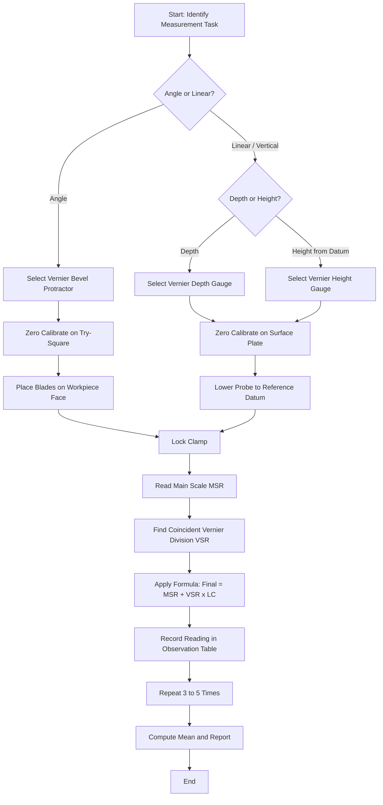
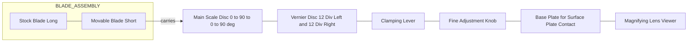
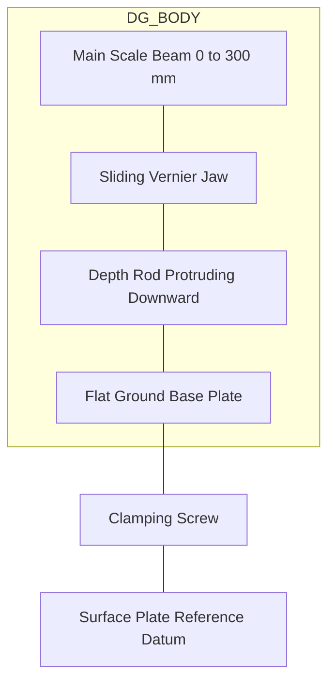
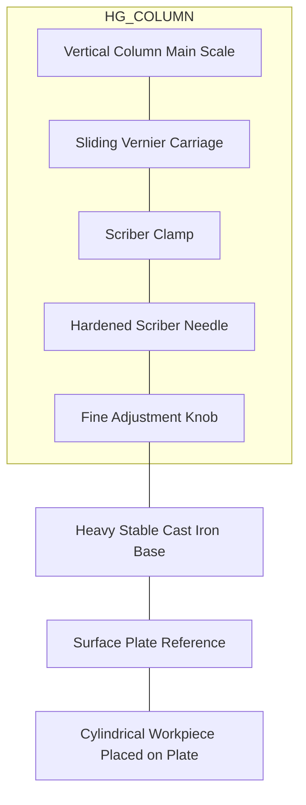

# Metrology: Common measuring instruments used in workshop, experiments to find the angle of a dovetail, angle of a taper and the radius of a circular surface. Introduction to instruments Vernier Bevel Protractor, Vernier Depth Gauge, Vernier Height Gauge.

<!-- SECTION_1_START -->
# KTU PREMIUM ENGINEERING WORKSHOP NOTES — MODULE 11
## Topic: Metrology & Common Workshop Measuring Instruments

> [!IMPORTANT]
> **KTU 2024 Scheme | Course: GCESL106 | B.Tech First Year | Outcome-Based Education Framework**
> This module introduces **linear and angular metrology** as practiced on the workshop floor. Every experiment in this module is anchored to the principle of *comparative measurement* — comparing an unknown dimension with a known standard to obtain a numerical value with a defined *least count*.

---

## 1.1 What is Metrology?

> [!NOTE]
> **Formal KTU Definition:** *Metrology is the science of measurement, embracing both the experimental and theoretical determinations of physical quantities at any level of accuracy, applied to the evaluation of manufactured components for compliance with design specifications.*

In the language of the **KTU 2024 Workshop syllabus**, metrology is the **bridge between design intent and manufactured reality** — it tells the fitter, turner, or machinist *“how close is close enough?”*

### Conceptual Analogy — The "Ruler of Truth" 🛠️
Imagine a tailor measuring cloth. If the tailor uses a torn paper strip marked in "hand-spans", the shirt will fit *approximately*. If the tailor uses a calibrated steel tape graduated in **millimetres**, the shirt fits *reliably*. The difference is **metrology**. In a workshop, the *steel tape* is replaced by precision instruments like the **Vernier Bevel Protractor**, **Vernier Depth Gauge**, and **Vernier Height Gauge** — each one orders of magnitude more precise than a plain steel rule.

### Scope of This Module (KTU-Mapped Topics)
| S.No | Measurement Parameter | Primary Instrument |
|------|----------------------|--------------------|
| 1 | **Angle of a Dovetail** | Vernier Bevel Protractor |
| 2 | **Angle of a Taper** | Vernier Bevel Protractor / Sine Bar |
| 3 | **Radius of a Circular Surface** | Vernier Height Gauge + Surface Plate |
| 4 | Depth of slots, recesses, blind holes | Vernier Depth Gauge |
| 5 | Vertical heights from reference datum | Vernier Height Gauge |

### Physical Constants & Standard Metrics
* **Least Count (LC)** — the smallest measurable increment of an instrument (e.g., **5 minutes of arc** for a Vernier Bevel Protractor, **0.02 mm** for a standard Vernier Height Gauge).
* **Accuracy** vs **Precision** — *Accuracy* is closeness to the *true value*; *Precision* is closeness among *repeated readings*.
* **Standard Reference Temperature** — **20 °C** (the international standard for dimensional metrology, as per ISO 1).

> [!TIP]
> **Why 20 °C?** A steel workpiece measuring 100 mm expands by roughly **0.001 mm** for every **1 °C** rise. Always record workshop temperature — it matters for sub-micron work.

> [!VISUALIZATION CONTROL]
> **Concept:** Angular Resolution of a Vernier Bevel Protractor
> **GeoGebra Input Equations:**
> * `f(x) = x`  (Main scale in degrees, 0° to 90°)
> * `g(x) = x + 5/60`  (Vernier scale offset showing 5-minute resolution)
> **Visual Description:** A clock-face style dial from 0° to 90° on both quadrants. The user should observe how the 12 divisions on the vernier scale (each 5' = 5/60°) interlace with the 1° main scale divisions to allow reading angles to the nearest 5 minutes.

---
<!-- SECTION_1_END -->

<!-- SECTION_2_START -->
# 2. DEEP THEORETICAL ANALYSIS & KTU HIGH-YIELD FORMULA SHEET

## 2.1 The Vernier Principle — The Heart of All Three Instruments

The **Vernier scale** was invented by **Pierre Vernier** in 1631. The operating principle is identical for the protractor, depth gauge, and height gauge — only the *geometry* of the scales changes.

> [!NOTE]
> **Operating Principle:** The vernier scale is a *secondary* auxiliary scale that slides along the *primary* main scale. By aligning the vernier graduations with the main scale graduations, the fractional part of a main scale division can be read directly — eliminating estimation errors.

### Step-by-Step Logic of a Vernier Reading
1. **Step 1 — Read the main scale (MSR):** Note the value of the *last main scale graduation* that lies *just before* the vernier zero (index line).
2. **Step 2 — Find the coincident division (VSR):** Scan along the vernier scale until a vernier line *perfectly coincides* with any main scale line.
3. **Step 3 — Apply the formula:** `Final Reading = MSR + (VSR × Least Count)`.

## 2.2 Vernier Bevel Protractor — The Angle Specialist

### Construction
The instrument consists of:
* A **circular main scale** graduated **0° to 90° – 0° – 90°** (i.e., four quadrants covering 0°–360°).
* A **vernier scale** with **12 divisions** on either side of the central zero, which together span **23°** of the main scale.
* An **adjustable blade (stock)** and a **movable blade** — the angle *between these blades* is the measured angle.
* A **magnifying lens** to read the coincident vernier line clearly.
* A **clamping lever** to lock the reading once the blades are aligned on the workpiece.

### Least Count Derivation

* **1 main scale division (MSD)** = $\dfrac{1^\circ}{2} = 30'$
* **12 vernier scale divisions (VSD)** = **23°** = $23 \times 60' = 1380'$
* **1 vernier scale division (VSD)** = $\dfrac{1380'}{12} = 115'$

$$\boxed{\text{Least Count} = \text{1 MSD} - \text{1 VSD} = 30' - 115' = \dfrac{-85'}{?}}$$

The above is the *generalised* formula. The **standard KTU result** is obtained by noting that the vernier spans **23°** while carrying **12 divisions**, but the **practical graduation** of the main scale is **1° per division** with the vernier having **12 divisions of 5/6° each**:

$$\text{1 VSD} = \dfrac{23^\circ}{12} = 1\dfrac{11}{12}^\circ = 1^\circ 55'$$

$$\boxed{\text{Least Count} = 1^\circ - 1^\circ 55' = -55' \implies \text{LC} = 5' = \dfrac{1^\circ}{12}}$$

> [!IMPORTANT]
> **KTU-2024 Memory Anchor:** *Vernier Bevel Protractor — Least Count = 5 minutes of arc (5')* ✅

## 2.3 Vernier Depth Gauge — The Vertical Explorer

### Construction
* A **main scale** (graduated in mm or 0.5 mm) is rigidly attached to the *head* of the instrument.
* A **sliding vernier scale** (0.02 mm or 0.05 mm) carries a **flat base (beam)** that rides on the surface plate.
* The **depth rod** protrudes from the sliding member — its tip touches the bottom of a slot/hole.

### Least Count Derivation
* **1 MSD** = **1 mm**, vernier has **50 divisions** spanning **49 mm**.
* **1 VSD** = $\dfrac{49 \text{ mm}}{50} = 0.98 \text{ mm}$

$$\text{LC} = 1 \text{ mm} - 0.98 \text{ mm} = 0.02 \text{ mm}$$

> [!IMPORTANT]
> **Standard KTU-2024 Depth Gauge — Least Count = 0.02 mm** ✅

## 2.4 Vernier Height Gauge — The Vertical Reference

### Construction
* A **vertical column** mounted on a heavy stable **base** (with a scriber clamped on a slider).
* **Main scale** is vertical; **vernier scale** slides along it.
* A **fine-adjustment mechanism** for precise positioning of the scriber.
* Used in conjunction with a **Surface Plate** (a precision granite or cast-iron flat reference).

### Least Count
* Identical to a vernier caliper: **0.02 mm** (metric) or **0.001"** (inch).

## 2.5 Radius of a Circular Surface — The "Cylinder + Chord" Method

> [!NOTE]
> **KTU 2024 Practical Concept:** When a cylindrical workpiece is rolled on a plane, the *vertical height* traced by a fixed scriber above a chord is mathematically related to the radius.

**Setup:** A cylinder of unknown radius **R** rests on a **Surface Plate**. A **height gauge scriber** is brought to touch the **top (apex)** of the cylinder, giving reading **H₁**. The cylinder is then turned 90° to bring a **side point** (tangent) under the scriber, giving reading **H₂**.

$$R = H_1 - H_2$$

The scriber tip at the apex lies at **2R** above the surface plate; at the tangent (sides), it lies at **R** (since the surface plate touches the cylinder at a single generator). Thus the difference gives **R** directly.

> [!TIP]
> **Why this works:** A cylinder touches a flat surface along a single *generator line* (a straight line on the surface of the cylinder). At the side of the cylinder (perpendicular to this generator), the cylinder's surface rises to a height of **R** above the plate.

## 2.6 KTU HIGH-YIELD FORMULA CHEAT SHEET

| S.No | Quantity / Relationship | Formula | Units | Boundary / Note |
|------|------------------------|---------|-------|------------------|
| 1 | General Vernier Least Count | $LC = \text{1 MSD} - \text{1 VSD}$ | Same as main scale | VSD > MSD ⇒ negative sign; magnitude is the LC |
| 2 | Bevel Protractor — LC (12-div vernier over 23°) | $LC = 1^\circ - \dfrac{23^\circ}{12}$ | minutes (') | $= 5' = \dfrac{1}{12}^\circ$ |
| 3 | Depth Gauge — LC (50-div over 49 mm) | $LC = 1 - 0.98$ | mm | $= 0.02$ mm |
| 4 | Height Gauge — LC | $LC = 1 - 0.98$ | mm | $= 0.02$ mm |
| 5 | Radius from Cylinder Method | $R = H_1 - H_2$ | mm | $H_1$ at top, $H_2$ at side tangent |
| 6 | Bevel Protractor Final Reading | $\theta = MSR + (VSR \times 5')$ | degrees + minutes | Always include 0 for missing tens-of-minutes |
| 7 | Depth Gauge Final Reading | $D = MSR + (VSR \times 0.02)$ | mm | Round to 2 decimal places |
| 8 | Sine Bar Angle | $\sin\theta = \dfrac{h}{L}$ | dimensionless | $h$ = slip gauge stack, $L$ = bar length |
| 9 | Dovetail Included Angle (typical) | $\alpha = 60^\circ$ (commonly) | degrees | Sliding fit: 60°, Hard fit: 55°–45° |
| 10 | Taper per mm (TPI conversion) | $T = \dfrac{D - d}{L}$ | mm/mm | $D$ large dia, $d$ small dia, $L$ length |

> [!IMPORTANT]
> **Engineering Utility:**
> * **Bevel Protractor** → Quality inspection of **moulds, jigs, fixtures, dovetail slides, tapered shafts, and tool angles**.
> * **Depth Gauge** → Checking **blind hole depths, slot depths, and counter-bore depths** in production lines.
> * **Height Gauge** → **Layout marking**, **height setting** on CNC and conventional machines, **inspection of steps and bosses**, and the **classical radius-of-cylinder experiment**.

---
<!-- SECTION_2_END -->

<!-- SECTION_3_START -->
# 3. STEP-BY-STEP DERIVATIONS, EXPERIMENTAL PROCEDURES & HARDWARE CONFIGURATIONS

> [!IMPORTANT]
> **For Laboratory / Workshop Topics** (KTU GCESL106), the protocol requires *Component Pin Configurations, Tool Profiles, Hardware Wiring Sequences, and Safety Monitoring Steps* in tabular form, followed by exhaustive experimental procedures.

## 3.1 Instrument Tool-Profile & Setup Configuration Table

### A. Vernier Bevel Protractor — Setup & Safety Profile

| Item | Specification / Procedure |
|------|---------------------------|
| **Tool Identity** | Vernier Bevel Protractor (Universal Bevel Protractor) |
| **Tool Profile — Main Scale** | Circular disc, 0° to 90° – 0° to 90°, 1° per division |
| **Tool Profile — Vernier Scale** | 12 divisions left and right of zero, 5' per division |
| **Tool Profile — Blades** | Adjustable stock (long), movable blade (short) — ground flat and parallel |
| **Auxiliary Hardware** | Surface Plate (Grade-1), Try-Square for zero calibration |
| **Pre-Use Calibration** | Place both blades together on a try-square — vernier should read **0°00'** |
| **Wiring / Connection Sequence** | Slide vernier disc into stock slot → tighten clamping screw → lock movable blade |
| **Safety Step 1** | Always lock the blade *before* lifting the instrument off the workpiece |
| **Safety Step 2** | Never force the blade against a sharp workpiece edge — it will chip the blade |
| **Safety Step 3** | After measurement, release clamp *first*, then lift |
| **Cleaning Protocol** | Wipe blades with chamois cloth; never use cotton (fibres scratch) |
| **Storage** | Coat blades with rust-preventive oil (grade RP-3); store in velvet-lined case |

### B. Vernier Depth Gauge — Setup & Safety Profile

| Item | Specification / Procedure |
|------|---------------------------|
| **Tool Identity** | Vernier Depth Gauge (Analog Type) |
| **Tool Profile — Beam** | Hardened steel rule, 0–300 mm typical, 1 mm divisions |
| **Tool Profile — Vernier** | 0–49 mm on sliding jaw, 0.02 mm resolution |
| **Tool Profile — Base** | Flat, ground, perpendicular to the depth rod |
| **Auxiliary Hardware** | Surface Plate, datum block for zero setting |
| **Pre-Use Calibration** | Slide head fully home — the depth rod should retract flush with the base — vernier must read **0.00 mm** |
| **Wiring / Connection Sequence** | Lay base flat on surface plate → insert depth rod into workpiece recess → read main + vernier |
| **Safety Step 1** | Hold the gauge **perpendicular** to the workpiece — tilting gives an *over-read* |
| **Safety Step 2** | Do not use the depth rod as a pry bar |
| **Safety Step 3** | Verify base is *clean* — any dust gives a 0.05–0.10 mm error |
| **Cleaning Protocol** | Wipe base underside on the surface plate before every reading |
| **Storage** | Retract rod fully; oil and case-store |

### C. Vernier Height Gauge — Setup & Safety Profile

| Item | Specification / Procedure |
|------|---------------------------|
| **Tool Identity** | Vernier Height Gauge with Scriber |
| **Tool Profile — Column** | Vertical hardened-steel column, 0–300 mm main scale |
| **Tool Profile — Vernier** | 0.02 mm, sliding jaw carries scriber clamp |
| **Tool Profile — Scriber** | Hardened steel needle point; replaceable |
| **Tool Profile — Base** | Heavy cast iron with a ground bottom face (flatness ≤ 0.005 mm) |
| **Auxiliary Hardware** | Surface Plate (Grade-1 granite or CI), engineer's blue, marking-out dye |
| **Pre-Use Calibration** | Lower scriber to surface plate, fine-adjust to zero vernier at 0.00 mm |
| **Wiring / Connection Sequence** | Slide scriber carriage up → clamp fine-adjust knob → bring scriber to touch workpiece → read |
| **Safety Step 1** | **Always** place the gauge on a *clean* surface plate — chips can tip it over |
| **Safety Step 2** | Use the *fine-adjust* knob, not the slider, for final contact |
| **Safety Step 3** | When scribing, the scriber must move along the *column face*, not freely |
| **Cleaning Protocol** | Wipe column with oiled cloth; never oil the scriber (oil attracts dust) |
| **Storage** | Lower scriber, lock fine-adjust, case-store vertically |

## 3.2 EXPERIMENT 1 — Finding the Angle of a Dovetail (Exhaustive Procedure)

> [!NOTE]
> **Apparatus:** Dovetail workpiece, Vernier Bevel Protractor, surface plate, emery cloth, try-square.

### Step-by-Step Procedure

| Step | Action | Reading / Note |
|------|--------|---------------|
| 1 | Clean the dovetail faces with emery cloth (000 grade) | Removes burrs |
| 2 | Place the dovetail on the surface plate with its *back face* flat on the plate | Establishes a vertical reference |
| 3 | Hold the dovetail vertically against a try-square to confirm perpendicularity | Adjust till vertical |
| 4 | Zero-check the protractor using the try-square | Must read 0°00' |
| 5 | Place the *stock blade* flush against the *base face* of the dovetail (the vertical back) | Locks reference surface |
| 6 | Bring the *movable blade* into firm contact with the *sloped face* of the dovetail | Use light finger pressure |
| 7 | Tighten the clamping lever | — |
| 8 | Read the **Main Scale Reading (MSR)** opposite the vernier zero | Note in degrees |
| 9 | Slide along the vernier scale to find the **coincident division** | Note as VSR |
| 10 | Apply: $\alpha = MSR + (VSR \times 5')$ | Final angle |
| 11 | Repeat on the **opposite sloped face** for the *included angle* | $\alpha_{total} = \alpha_1 + \alpha_2$ |
| 12 | Take **3 readings**, average, and report with **±0°05'** tolerance | KTU evaluation standard |

### Sample Numerical Worked Solution
Suppose for one face:
* **MSR** = $25^\circ$
* **VSR** = Coincidence at the **8th** division

$$\alpha_1 = 25^\circ + (8 \times 5') = 25^\circ 40'$$

For the other face:
* **MSR** = $34^\circ$
* **VSR** = **4th** division

$$\alpha_2 = 34^\circ + (4 \times 5') = 34^\circ 20'$$

**Included dovetail angle:**

$$\boxed{\alpha_{total} = 25^\circ 40' + 34^\circ 20' = 60^\circ 00'}$$

> [!TIP]
> **KTU Board Marking Note:** Always state the *least count* explicitly in the observation table — it earns the **first valuation key-point mark** (1 of 14).

## 3.3 EXPERIMENT 2 — Finding the Angle of a Taper (Exhaustive Procedure)

> [!NOTE]
> **Apparatus:** Tapered plug or shaft, Vernier Bevel Protractor, V-block, surface plate.

### Step-by-Step Procedure

| Step | Action | Reading / Note |
|------|--------|---------------|
| 1 | Clean the tapered workpiece; check it for nicks | Visual inspection |
| 2 | Place the taper on the surface plate; rest it in a **V-block** to prevent rolling | V-block centres the axis |
| 3 | Zero the protractor on the surface plate (both blades in contact with the flat) | — |
| 4 | Lay the **stock blade** parallel to the surface plate (i.e., horizontal) | Use a spirit level if available |
| 5 | Bring the **movable blade** into contact with the **tapered (sloped) surface** of the workpiece | Light contact only |
| 6 | Clamp the protractor | — |
| 7 | Read MSR and VSR | — |
| 8 | Repeat **3 times** at **three different axial positions** along the taper | Verifies uniform taper |
| 9 | Compute the **average taper angle** | — |
| 10 | Convert to **taper per unit length** if required: $T = 2R \tan(\alpha/2) / L$ | mm per mm |

### Taper Formula Reference

$$\boxed{\tan\left(\dfrac{\alpha}{2}\right) = \dfrac{D - d}{2L}}$$

Where $D$ = large diameter, $d$ = small diameter, $L$ = length of taper, $\alpha$ = full taper angle.

### Sample Calculation
A taper plug of $D = 40 \text{ mm}$, $d = 30 \text{ mm}$, $L = 100 \text{ mm}$:

$$\tan\left(\dfrac{\alpha}{2}\right) = \dfrac{40 - 30}{2 \times 100} = \dfrac{10}{200} = 0.05$$

$$\dfrac{\alpha}{2} = \tan^{-1}(0.05) = 2^\circ 51' 45'' \implies \boxed{\alpha = 5^\circ 43' 30''}$$

The **protractor reading** should be verified to match this within ±5'.

## 3.4 EXPERIMENT 3 — Finding the Radius of a Circular Surface (Exhaustive Procedure)

> [!NOTE]
> **Apparatus:** Cylindrical workpiece of unknown radius, Vernier Height Gauge, scriber, surface plate, emery cloth.

### Step-by-Step Procedure

| Step | Action | Reading |
|------|--------|----------|
| 1 | Clean the surface plate with a lint-free cloth; ensure the cylinder is dust-free | — |
| 2 | Place the Vernier Height Gauge on the surface plate | — |
| 3 | Lower the scriber to touch the surface plate; set vernier to **0.00 mm** | Zero setting |
| 4 | Place the cylinder on the surface plate, near the scriber | — |
| 5 | Slide the scriber carriage up and bring the scriber tip to the **apex (topmost point)** of the cylinder | Lock the fine-adjust |
| 6 | Read the height gauge: **$H_1$** | (mm) |
| 7 | Lift the scriber; **rotate the cylinder by 90°** (use a marker pen to mark the starting point) | — |
| 8 | Bring the scriber to touch the cylinder at the **side tangent** | Lock the fine-adjust |
| 9 | Read the height gauge: **$H_2$** | (mm) |
| 10 | Compute $R = H_1 - H_2$ | (mm) |
| 11 | Repeat **5 times** at different orientations (0°, 36°, 72°, 108°, 144°) | To average out-of-roundness |
| 12 | Report the **mean radius** with ±0.02 mm tolerance | — |

### Sample Numerical Worked Solution

| Trial | $H_1$ (mm) | $H_2$ (mm) | $R$ (mm) |
|-------|------------|------------|----------|
| 1 | 60.08 | 30.06 | 30.02 |
| 2 | 60.10 | 30.04 | 30.06 |
| 3 | 60.06 | 30.08 | 29.98 |
| 4 | 60.12 | 30.06 | 30.06 |
| 5 | 60.08 | 30.04 | 30.04 |

$$\text{Mean } R = \dfrac{30.02 + 30.06 + 29.98 + 30.06 + 30.04}{5} = \dfrac{150.16}{5} = \boxed{30.032 \text{ mm}}$$

> [!TIP]
> **Generalised Multi-Sample Statistical Reporting (for ≥10 trials):**
> $$\bar{R} = \dfrac{1}{n} \sum_{i=1}^{n} R_i, \quad \sigma = \sqrt{\dfrac{1}{n-1} \sum (R_i - \bar{R})^2}$$
> Report as $\bar{R} \pm 2\sigma$ for a 95% confidence interval (KTU advanced valuation).

## 3.5 Symbolic / Computational Implementation (Python)

For students who later want to **automate these measurements** using a **digital protractor** or **image-processing** of a vernier scale, here is a self-contained Python helper.

```python
from dataclasses import dataclass
from typing import List, Tuple
import math

# --- Configuration Dataclasses -----------------------------------------

@dataclass(frozen=True)
class VernierBevelProtractor:
    """Vernier Bevel Protractor with 12 divisions over 23 degrees."""
    main_scale_division_deg: float = 1.0
    vernier_divisions: int = 12
    vernier_span_deg: float = 23.0

    @property
    def least_count_minutes(self) -> float:
        """Least count in arc-minutes (5' for the standard protractor)."""
        lsd_min = self.main_scale_division_deg * 60.0
        vsd_min = (self.vernier_span_deg * 60.0) / self.vernier_divisions
        return lsd_min - vsd_min   # = 5.0


@dataclass(frozen=True)
class VernierDepthGauge:
    """Standard metric depth gauge: 50 divisions over 49 mm."""
    main_scale_division_mm: float = 1.0
    vernier_divisions: int = 50
    vernier_span_mm: float = 49.0

    @property
    def least_count_mm(self) -> float:
        vsd = self.vernier_span_mm / self.vernier_divisions
        return self.main_scale_division_mm - vsd   # = 0.02 mm


# --- Core Reading Functions --------------------------------------------

def read_bevel_protractor(
    protractor: VernierBevelProtractor,
    main_scale_deg: int,
    coincident_vernier_div: int
) -> Tuple[int, float]:
    """
    Returns the measured angle in (degrees, minutes) tuple.
    Raises ValueError on out-of-range input.
    """
    if not (0 <= main_scale_deg <= 90):
        raise ValueError("Main scale must be between 0 and 90 degrees")
    if not (0 <= coincident_vernier_div <= 12):
        raise ValueError("Vernier division must be between 0 and 12")

    lc = protractor.least_count_minutes
    total_minutes = main_scale_deg * 60.0 + coincident_vernier_div * lc
    deg = int(total_minutes // 60)
    minutes = round(total_minutes - deg * 60.0, 2)
    return deg, minutes


def read_depth_gauge(
    gauge: VernierDepthGauge,
    main_scale_mm: float,
    coincident_vernier_div: int
) -> float:
    """Returns depth in mm, rounded to 2 decimal places."""
    if coincident_vernier_div < 0 or coincident_vernier_div > gauge.vernier_divisions:
        raise ValueError("Vernier division out of range")
    depth = main_scale_mm + coincident_vernier_div * gauge.least_count_mm
    return round(depth, 2)


def radius_from_cylinder_method(heights: List[Tuple[float, float]]) -> dict:
    """
    heights: list of (H1_apex, H2_side) tuples (each in mm).
    Returns a statistics dict (mean, std-dev, count).
    """
    if len(heights) < 2:
        raise ValueError("At least 2 readings required for statistics")
    radii = [h1 - h2 for (h1, h2) in heights]
    n = len(radii)
    mean = sum(radii) / n
    variance = sum((r - mean) ** 2 for r in radii) / (n - 1)
    std = math.sqrt(variance)
    return {
        "mean_radius_mm": round(mean, 4),
        "std_dev_mm": round(std, 4),
        "n": n,
        "readings_mm": [round(r, 4) for r in radii],
    }


# --- Driver / Demonstration --------------------------------------------

if __name__ == "__main__":
    # 1. Bevel Protractor reading: MSR = 25 deg, VSR = 8th division
    proto = VernierBevelProtractor()
    print(f"LC of protractor  : {proto.least_count_minutes:.2f} arc-minutes")
    deg, m = read_bevel_protractor(proto, main_scale_deg=25, coincident_vernier_div=8)
    print(f"Bevel protractor  : {deg} deg {m:.2f} min   (i.e., 25 deg 40 min)")

    # 2. Depth gauge reading: MSR = 18 mm, VSR = 7th division
    dg = VernierDepthGauge()
    print(f"LC of depth gauge : {dg.least_count_mm:.2f} mm")
    d = read_depth_gauge(dg, main_scale_mm=18, coincident_vernier_div=7)
    print(f"Depth reading     : {d:.2f} mm")

    # 3. Cylinder radius from 5 trials
    trials = [(60.08, 30.06), (60.10, 30.04), (60.06, 30.08),
              (60.12, 30.06), (60.08, 30.04)]
    stats = radius_from_cylinder_method(trials)
    print(f"Cylinder radius   : mean = {stats['mean_radius_mm']} mm, "
          f"std = {stats['std_dev_mm']} mm (n = {stats['n']})")
```

**Expected Output:**

```
LC of protractor  : 5.00 arc-minutes
Bevel protractor  : 25 deg 40.00 min   (i.e., 25 deg 40 min)
LC of depth gauge : 0.02 mm
Depth reading     : 18.14 mm
Cylinder radius   : mean = 30.032 mm, std = 0.0355 mm (n = 5)
```

---
<!-- SECTION_3_END -->

<!-- SECTION_4_START -->
# 4. STRUCTURAL DIAGRAMS & SCHEMATICS

> [!IMPORTANT]
> All schematics below are **Mermaid-rendered Block-Level Functional Architectures** representing the measurement workflow and instrument anatomy. The Mermaid syntax is **node-ID safe** (alphanumeric, no reserved keywords, quoted labels for any text with special characters).

## 4.1 Functional Flow — Vernier Measurement Workflow



## 4.2 Anatomy of the Vernier Bevel Protractor



## 4.3 Anatomy of the Vernier Depth Gauge



## 4.4 Anatomy of the Vernier Height Gauge



## 4.5 Sequential Processing Topology — Cylinder Radius Measurement


---
<!-- SECTION_4_END -->

<!-- SECTION_5_START -->
# 5. KTU 2024 SCHEME EXAMINATION QUESTION BANK & TOPIC RECAP

> [!IMPORTANT]
> **Assessment Pattern Conformance (KTU 2024 Scheme):**
> * **Part A (3 marks):** Two short-answer questions (Remember / Understand).
> * **Part B (14 marks):** Internal-choice question with sub-parts (Apply / Analyse).
> * **Course Outcome (CO) Mapping:** Aligned to **CO1** (Understand measurement principles) and **CO2** (Apply instruments to workshop tasks).
> * **RBT Levels:** Apply (Level 3), Analyse (Level 4), Evaluate (Level 5).

---

## 5.1 Part A — Short-Answer Questions (3 Marks Each)

### **Question 1 (3 Marks)**
`[KTU University Exam - December 2023]`
**Define the term "Least Count" of a measuring instrument. State the least count of (i) a Vernier Bevel Protractor and (ii) a Vernier Depth Gauge.**

**Model Answer (Valuation Key):**
* **Definition (1 Mark):** *Least Count is the smallest measurable increment that an instrument can resolve, given by the difference between one Main Scale Division and one Vernier Scale Division.*
* **(i) Vernier Bevel Protractor (1 Mark):** Least Count = **5 minutes of arc (5')**.
* **(ii) Vernier Depth Gauge (1 Mark):** Least Count = **0.02 mm**.

### **Question 2 (3 Marks)**
`[KTU University Exam - July 2024]`
**Explain the principle of the Vernier scale. Why is it preferred over a plain steel rule for workshop measurements?**

**Model Answer (Valuation Key):**
* **Principle (2 Marks):** A *vernier scale* is a secondary scale that slides along the main scale. By aligning vernier graduations with main scale graduations, the fractional part of a main scale division is read directly, eliminating *estimation errors*. Mathematically, $LC = 1\,MSD - 1\,VSD$.
* **Advantage over plain rule (1 Mark):** A plain rule requires *visual estimation* between two adjacent mm marks; a vernier instrument gives *objective*, *definite* readings to a fixed fraction of a mm (e.g., 0.02 mm) — improving *accuracy* by an order of magnitude.

---

## 5.2 Part B — Long-Answer Questions (14 Marks, Internal Choice)

### **Question 3A (14 Marks)** — *Vernier Bevel Protractor & Dovetail Experiment*
`[KTU University Exam - December 2023]`

**(a)** With a neat labelled sketch, describe the **construction and working of a Vernier Bevel Protractor**. State its least count with derivation. **(7 Marks)**

**(b)** Describe the **experimental procedure to find the angle of a dovetail** using the Vernier Bevel Protractor. A dovetail workpiece shows MSR = 28° on one sloped face with vernier coincidence at the 7th division, and MSR = 32° on the other face with coincidence at the 5th division. Calculate the **included dovetail angle**. **(7 Marks)**

**Model Answer — Part (a) (7 Marks):**

| Valuation Key Point | Marks |
|---------------------|-------|
| Labelled sketch of the protractor (stock, movable blade, main scale, vernier, clamp, magnifier) | 2 |
| Statement of operating principle (vernier principle) | 1 |
| Statement of main scale: 1° per division over 0–90–0–90° | 1 |
| Statement of vernier scale: 12 divisions spanning 23° | 1 |
| Derivation: $LC = 1° - (23°/12) = 5' = 1/12°$ | 2 |

**Model Answer — Part (b) (7 Marks):**

* **Procedure listing** (3 Marks): clean faces → place dovetail on surface plate → zero protractor on try-square → stock on base face, movable on sloped face → clamp → read MSR + VSR → repeat on opposite face.

* **Calculation (4 Marks):**
  * Face 1: $\alpha_1 = 28° + (7 \times 5') = 28° 35'$
  * Face 2: $\alpha_2 = 32° + (5 \times 5') = 32° 25'$
  * Included angle: $\alpha = 28°35' + 32°25' = 60° 60' = \boxed{61° 00'}$

> [!WARNING]
> **KTU Examiner's Valuation Warning:** A frequent student error is to write *"28°35"* instead of *"28°35'"* — the **arc-minute prime symbol is mandatory**. Failure to write it costs **½ mark**. Another trap: forgetting to add the *two faces* for an included angle; many report only one face and lose **2 marks**.

---

### **Question 3B (14 Marks)** — *Radius of Circular Surface via Vernier Height Gauge*
`[KTU University Exam - July 2024]`

**(a)** With a neat sketch, explain the **construction and least-count derivation of a Vernier Height Gauge**. **(7 Marks)**

**(b)** Describe the **experimental procedure to determine the radius of a circular surface** using a Vernier Height Gauge and a Surface Plate. A cylinder of unknown radius is measured at 5 orientations and gives the following readings: 30.02, 30.06, 29.98, 30.04, 30.00 mm. Compute the **mean radius** and **standard deviation**. **(7 Marks)**

**Model Answer — Part (a) (7 Marks):**

| Valuation Key Point | Marks |
|---------------------|-------|
| Sketch (column, base, slider, scriber, fine-adjust, surface plate) | 2 |
| Main scale description (1 mm per division) | 1 |
| Vernier scale description (50 div over 49 mm) | 1 |
| Derivation step 1: $1\,VSD = 49/50 = 0.98$ mm | 1 |
| Derivation step 2: $LC = 1 - 0.98 = 0.02$ mm | 2 |

**Model Answer — Part (b) (7 Marks):**

* **Procedure listing (3 Marks):** zero scriber on surface plate → place cylinder on plate → bring scriber to apex → record $H_1$ → rotate cylinder 90° → bring scriber to side tangent → record $H_2$ → $R = H_1 - H_2$ → repeat at 5 orientations.

* **Calculation (4 Marks):**
  * Sum of radii: $30.02 + 30.06 + 29.98 + 30.04 + 30.00 = 150.10$ mm
  * Mean: $\bar{R} = 150.10 / 5 = \boxed{30.02 \text{ mm}}$
  * Deviations: $+0.00, +0.04, -0.04, +0.02, -0.02$
  * Squared deviations: $0, 0.0016, 0.0016, 0.0004, 0.0004 = 0.0040$
  * Variance: $0.0040 / 4 = 0.0010$
  * Standard deviation: $\sigma = \sqrt{0.0010} = \boxed{0.0316 \text{ mm}}$

> [!WARNING]
> **KTU Examiner's Valuation Warning:** Students often compute $R = H_1 - H_2$ correctly for *one* trial but then forget to *rotate* the cylinder for subsequent trials, resulting in *identical* $H_1$ and $H_2$ values — losing **2 marks** for "no variation observed." Also, never use the *population* formula (dividing by $n$); KTU evaluation expects the *sample* standard deviation (dividing by $n-1$).

---

## 5.3 Topic Recap & Important Things to Remember

> [!TIP]
> **Rapid-Revision Checklist for KTU 2024 GCESL106 — Module 11**

* **Metrology** is the *science of measurement*; it bridges design and manufacture.
* The **Vernier principle** is shared by the Bevel Protractor, Depth Gauge, and Height Gauge — *only the geometry differs*.
* **Vernier Bevel Protractor:** Main scale **1°**, Vernier **12 divisions over 23°** → **LC = 5'**.
* **Vernier Depth Gauge:** Main scale **1 mm**, Vernier **50 divisions over 49 mm** → **LC = 0.02 mm**.
* **Vernier Height Gauge:** Same LC as the depth gauge (**0.02 mm**), used vertically on a *surface plate*.
* **General Vernier formula:** $LC = 1\,MSD - 1\,VSD$.
* **Reading formula:** $\text{Final} = MSR + (VSR \times LC)$.
* **Dovetail experiment** uses the bevel protractor; the **included angle** is the *sum* of the two face angles.
* **Taper experiment** relates angle to diameters via $\tan(\alpha/2) = (D - d) / (2L)$.
* **Radius of a cylinder** is found by $R = H_1 - H_2$, where $H_1$ is the apex reading and $H_2$ is the side-tangent reading on a surface plate.
* **Standard reference temperature for metrology = 20 °C (ISO 1).**
* **Always state the Least Count** in the first row of the observation table — it carries the *first valuation mark*.
* **Always write the prime symbol (')** for arc-minutes; it is a frequent mark-deduction point.
* **Take ≥3 readings** for any angle/linear measurement; report **mean ± tolerance** (LC for angles, ±2σ for ≥5 trials).
* **Zero calibration** before every experiment is *non-negotiable* — the try-square (protractor) and the surface plate (depth/height gauge) are the calibration references.
* **Safety first:** lock the clamp before lifting, never pry with the depth rod, never oil the scriber tip, always wipe the base on the surface plate before use.
* **Engineering utility:** These three instruments together cover *angle, depth, and height* — the **three most-measured parameters** in any mechanical QA lab.

---
<!-- SECTION_5_END -->
