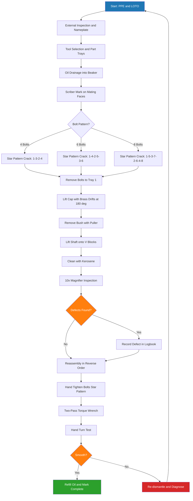
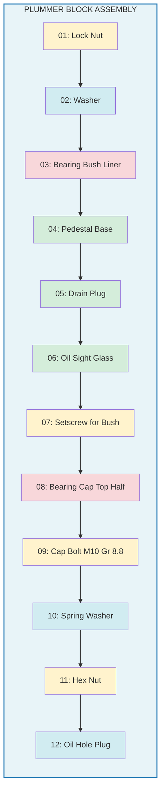
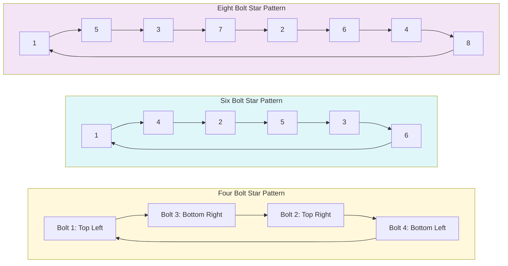
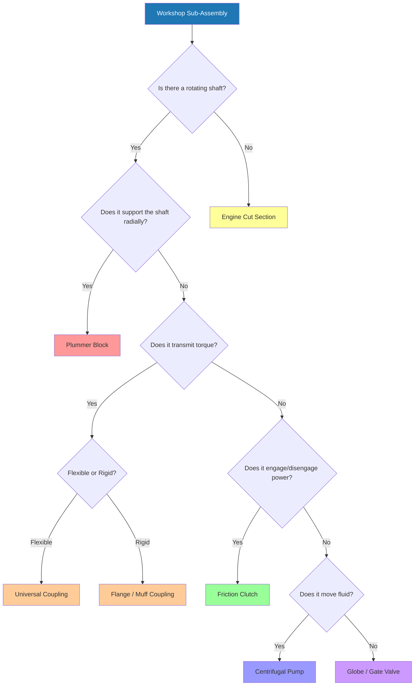

# Assembly: Demonstration only Dissembling and assembling of

<!-- SECTION_1_START -->
# KTU 2024 — Engineering Workshop (GCESL106)
## Module 12: Demonstration of Dissembling & Assembling of Mechanical Assemblies

> [!IMPORTANT]
> **KTU 2024 Scheme Focus:** This module is a **Demonstration-Only** practical session. The student is expected to *observe, identify, sketch, and record* the dismantling and reassembly procedure of standard machine sub-assemblies. No independent dismantling by students is mandated under the KTU 2024 lab safety protocol.

---

### 1.1 Formal KTU Definition

> **Definition (KTU 2024 — Module 12):**
> *Dissembling and Assembling* is the systematic, sequential, and reversible engineering operation of separating a finished machine sub-assembly into its constituent component parts (dissembling) and restoring it to its original functional state (assembling) using standard hand tools, measuring instruments, and workshop safety procedures, **without manufacturing any new part** during the process.

The KTU 2024 workshop syllabus (GCESL106) typically demonstrates the following six sub-assemblies in Module 12:

| # | Sub-Assembly Demonstrated | Primary Learning Outcome |
|---|---|---|
| 1 | **Tapered Journal / Plummer Block Bearing** | Identify bearing housing, bush, locking nuts |
| 2 | **Universal Coupling (Hooke's Joint)** | Identify cross, yokes, needle bearings |
| 3 | **Single-Plate Friction Clutch** | Identify pressure plate, friction disc, levers |
| 4 | **Centrifugal / Gear Pump** | Identify impeller, casing, shaft seal |
| 5 | **Stop / Globe / Gate Valve** | Identify bonnet, stem, disc, seat, gland |
| 6 | **Two-Stroke / Four-Stroke Engine (Cut Section)** | Identify piston, crank, cam, valves |

> [!NOTE]
> **Key Distinction — "Demonstration Only":**
> The student does **not** perform the dismantling. The instructor (or a trained workshop assistant) performs the operation on a master unit while students **observe, sketch, and note the part sequence**. This is a **CCTV-monitored KTU safety mandate** for rotating/reciprocating components.

---

### 1.2 Intuitive Analogy — "The Clock Repairman's Mindset"

Imagine a watchmaker repairing a **mechanical wristwatch**:
- The watchmaker does not *break* the watch; he *reverses* the manufacturing sequence.
- He lays every screw, spring, and gear in a **linear sequence** on a soft cloth in the **exact reverse order** of removal.
- Re-assembly is then simply "playing the removal steps in reverse, like a movie played backward."

**Workshop Dismantling = Watching a movie played forward.**
**Workshop Reassembly = Watching the same movie played in reverse.**

> [!TIP]
> **Golden Rule of Workshop Assembly:** *"Lay every part down in a single row from LEFT to RIGHT in the order you removed it. The leftmost part is the LAST to be reinstalled; the rightmost is the FIRST to be reinstalled."* This single rule prevents 90% of KTU workshop-marking errors.

### 1.3 Physical Constants / Standard Workshop Parameters (Bold-Highlighted)

- **Standard Workshop Temperature:** **20 °C ± 5 °C** (IS 822:1970)
- **Bearing Housing Bore Tolerance:** **H7** (ISO 286)
- **Journal Shaft Tolerance:** **k6** (ISO 286) — for Plummer block fit
- **Standard Torque for M10 Bolt (Gr. 8.8):** **49 N·m** (≈ 5 kgf·m)
- **Standard Torque for M8 Bolt (Gr. 8.8):** **25 N·m**
- **Maximum Hand-Tool Pull Force:** **200 N** (above this, use a torque wrench)
- **Bearing Fit Class for Adapter Sleeves:** **H7/h6** (loose running fit)
- **Workshop Floor Load Capacity:** **≥ 5 kN/m²**

> [!VISUALIZATION CONTROL]
> **Concept:** Linear Part-Sequence Layout (Workshop "Storyboard" Method)
> **GeoGebra / Desmos Input Equations:**
> * Point A: `(0, 0)` labeled "Part #1 (First Removed → Last Fitted)"
> * Point B: `(2, 0)` labeled "Part #2"
> * Point C: `(4, 0)` labeled "Part #3"
> * Point D: `(6, 0)` labeled "Part #N (Last Removed → First Fitted)"
> **Visual Description:** A horizontal number line from 0 to 6 with 4 labeled points, arrows showing parts laid left-to-right in reverse-fit sequence, demonstrating the workshop storyboarding method.

---

<!-- SECTION_2_END -->

<!-- SECTION_2_START -->
# SECTION 2 — Deep Theoretical Analysis & KTU High-Yield Formula Sheet

## 2.1 The Universal Workshop Dismantling & Assembling Logic

Every mechanical sub-assembly, regardless of complexity, follows a **strict 8-Stage Sequential Protocol** during the KTU 2024 demonstration:

### Stage-Wise Logic Breakdown

1. **Pre-Demonstration Inspection**
   - Visual external inspection for cracks, oil leaks, rust, broken fasteners.
   - Photograph the unit from all six sides (front, back, left, right, top, bottom).
   - Record the **nameplate data**: RPM, kW, pressure rating, manufacturer, year.

2. **Tool & Jig Preparation**
   - Lay out spanners (8–22 mm), allen keys (3–12 mm), pullers (2-jaw, 3-jaw), mallets, drifts.
   - Prepare a **numbered tray (1, 2, 3, …, N)** and a soft rubber mat.

3. **Drainage of Lubricants / Coolants**
   - Open drain plug; collect oil in a calibrated beaker.
   - Record the oil **color, viscosity feel, and contamination level**.

4. **External Fastener Removal**
   - Begin with the **largest external bolts** and progress inward to the **smallest**.
   - Use the **"Crack-Break-Tighten"** pattern: crack each bolt ¼ turn, then ½ turn, then full — never remove one fully while others are tight (causes warping).

5. **Sub-Assembly Separation**
   - Use **soft brass drifts** (not steel chisels) to separate pressed housings.
   - Apply **even, symmetrical blows** at 180° apart; never use a single point.

6. **Component Identification & Sequencing**
   - Lay every component on the tray in order.
   - Match each part with its **position in the exploded view** (sketch the exploded view in your lab record).

7. **Cleaning & Inspection (AAR — As-Received Condition)**
   - Clean each part with **kerosene (not petrol — fire hazard)**.
   - Inspect for wear using a **dial gauge (LC 0.01 mm)** and a **vernier (LC 0.02 mm)**.

8. **Reassembly in Strict Reverse Order**
   - Reassembly is the **mirror image** of the dismantling sequence.
   - Torque every bolt in a **criss-cross (star) pattern**, not a circular sweep.
   - Final test: rotate the shaft **by hand** — it must turn smoothly without binding.

---

## 2.2 Sub-Assembly Specific Knowledge Base (KTU 2024 High-Yield)

### 2.2.1 Plummer Block (Pedestal Bearing) — Most Frequently Asked

| Component | Function | Common Failure Mode |
|---|---|---|
| **Pedestal (Base)** | Houses the bearing; bolted to foundation | Cracking at bolt bosses |
| **Bearing Cap (Top Half)** | Closes the bearing housing; contains oil hole | Oil-hole misalignment |
| **Bearing Bush / Liner** | Provides the bore for shaft rotation; babbitt or bronze | Scoring, melting (white metal) |
| **Lock Nut (Nylock / Slotted)** | Prevents axial movement of shaft | Loosening, thread stripping |
| **Setscrew / Grub Screw** | Locks the bush to the housing (prevents rotation) | Shearing under vibration |
| **Oil Hole / Sight Glass** | Lubrication and level indication | Blockage, leakage |
| **Drain Plug** | Oil drainage for service | Stripped thread |

> **Standard KTU Dismantling Order (Plummer Block):**
> `Lock Nut → Setscrew → Bearing Cap Bolts (4) → Bearing Cap → Bush → Pedestal`

### 2.2.2 Universal Coupling (Hooke's Joint)

The Hooke's joint has **2 yokes + 1 cross (spider) + 4 needle bearings + 4 circlips**.

- The **trunnion** (cross arm) carries the **needle bearings** that ride inside the yoke eyes.
- The **circlips (retaining rings)** lock the needle bearings into the yoke bores.
- **Critical alignment rule:** Both yokes must lie in the **same plane** when assembled; otherwise, the joint will have uneven velocity (sinusoidal error).

### 2.2.3 Single-Plate Friction Clutch

| Part | Function | KTU Note |
|---|---|---|
| **Flywheel** | Mass that stores rotational energy | The driving member |
| **Clutch Plate (Friction Disc)** | The driven member; carries friction lining | Riveted or bonded to plate |
| **Pressure Plate** | Applies axial clamping force | Spring-loaded via diaphragm |
| **Diaphragm Spring** | Provides the clamping force (modern cars) | Replaces coil springs |
| **Release Levers / Bearing** | Disengages clutch when pedal pressed | Pre-set free-play of 2–3 mm |
| **Cover Assembly** | Houses diaphragm and levers | Bolted to flywheel |

### 2.2.4 Centrifugal Pump

`Casing → Impeller (keyed to shaft) → Shaft → Mechanical Seal / Gland Packing → Bearings → Coupling → Motor`

- The **mechanical seal** is the most critical consumable part.
- **Impeller-to-casing clearance** is typically **0.5 mm to 1.5 mm** — measured with a **feeler gauge**.

### 2.2.5 Globe Valve (Most Common in KTU Workshop)

| Part | Function |
|---|---|
| **Body** | Houses the disc, seat, and flow path |
| **Bonnet** | Top cover; houses stem packing |
| **Stem** | Transmits handwheel rotation to disc (acme thread) |
| **Disc / Plug** | The flow-control element; mates with seat |
| **Seat** | Hard-faced ring; the sealing surface |
| **Gland Packing** | Prevents stem leakage (graphite or PTFE) |
| **Gland Nut / Follower** | Compresses the packing |
| **Handwheel** | Operator interface |

---

## 2.3 KTU Formula Sheet (Workshop Module 12)

| # | Formula / Parameter | Equation | Unit | Application |
|---|---|---|---|---|
| 1 | **Bearing L10 Life (basic rating life)** | $L_{10} = \left( \frac{C}{P} \right)^k \times 10^6$ revolutions | rev | Bearing selection |
| 2 | **Equivalent Dynamic Load (ball)** | $P = X \cdot F_r + Y \cdot F_a$ | N | Bearing load |
| 3 | **Equivalent Dynamic Load (roller)** | $P = F_r$ (if $F_a = 0$) | N | Bearing load |
| 4 | **Torque — Bolt Pre-load** | $T = K \cdot d \cdot F_{pre}$ | N·m | Bolt tightening |
| 5 | **Torque Constant (K-factor, Gr. 8.8)** | $K = 0.20$ (typical dry) | – | Bolt tightening |
| 6 | **Bolt Pre-load (75% of Proof)** | $F_{pre} = 0.75 \cdot A_s \cdot \sigma_{proof}$ | N | Bolt tightening |
| 7 | **Shaft Critical Speed** | $N_c = \frac{946}{\sqrt{\delta}} \times 10^4$ | rpm | Rotation |
| 8 | **Deflection of simply-supported shaft (Plummer)** | $\delta = \frac{5 \cdot W \cdot L^3}{384 \cdot E \cdot I}$ | mm | Shaft design |
| 9 | **Hoop Stress (Pump Casing)** | $\sigma_h = \frac{P \cdot D}{2 \cdot t}$ | MPa | Pressure vessel |
| 10 | **Friction Disc Clutch Torque** | $M_t = \mu \cdot F_a \cdot n \cdot \frac{D_o + D_i}{2}$ | N·m | Clutch design |
| 11 | **Hooke's Joint Angular Velocity Error** | $\omega_2 = \omega_1 \cdot \frac{\cos \alpha}{1 - \sin^2 \alpha \cdot \cos^2 \theta_1}$ | rad/s | Coupling |
| 12 | **Standard Feeler Gauge Set** | $0.05, 0.10, 0.15, 0.20, \ldots, 1.00$ | mm | Clearance check |

> [!IMPORTANT]
> **KTU Note on Units:** Every numerical answer in the KTU 2024 exam must carry the **unit symbol in parentheses**, e.g., *L₁₀ = 2.5 × 10⁶ (rev)*. Forgetting the unit is a **2-mark penalty** in valuation.

### 2.4 Real-World Engineering Utility

- **Plummer Blocks** are used in **conveyor systems, rolling mills, and electric motor pedestals** (every factory floor has 50+ of them).
- **Hooke's Joints** are used in **rear-wheel-drive cars, truck propeller shafts, and machine tool spindles**.
- **Friction Clutches** are the **core of every manual-transmission vehicle** (250+ million units globally).
- **Centrifugal Pumps** are the **workhorses of water supply, HVAC, and petroleum industries** (60% of all pumps manufactured).
- **Globe Valves** are used wherever **throttling (flow regulation)** is needed — chemical plants, steam lines.

> [!TIP]
> **Why this matters in Industry 4.0:** Modern predictive-maintenance systems use **vibration analysis (FFT)** and **acoustic emission** on these exact assemblies. A Plummer block's typical **vibration RMS limit** is **≤ 4.5 mm/s** (ISO 10816-3). A student who understands workshop dismantling can interpret maintenance dashboards in their engineering career.

---

<!-- SECTION_2_END -->

<!-- SECTION_3_START -->
# SECTION 3 — Step-by-Step Derivations, Procedures & Code/Symbolic Implementation

## 3.1 The KTU 2024 Step-by-Step Dismantling & Assembling Procedure — Master Algorithm

Below is the **exhaustive, line-by-line procedure** the KTU 2024 examiner expects in a student's lab record. Every step must be **written explicitly**; the words *"similarly"* or *"as above"* will cost the student marks.

### 3.1.1 Generic Sub-Assembly Master Procedure

> **STEP 0 — Pre-Operation**
> [0.1] Wear **PPE**: safety goggles, leather apron, gloves, steel-toe shoes.
> [0.2] Confirm the assembly is **electrically isolated and mechanically locked-out (LOTO)**.
> [0.3] Place the assembly on a **soft rubber mat** on a clean, dry workbench.

> **STEP 1 — External Inspection & Documentation**
> [1.1] Note the **nameplate details**: manufacturer, model, serial number, kW, RPM.
> [1.2] Sketch the **external view (3 orthographic views: front, top, side)** in the lab record.
> [1.3] Identify the **type of assembly** (Plummer block, coupling, clutch, pump, valve).
> [1.4] List the **external features**: oil holes, mounting slots, fasteners, sight glass.

> **STEP 2 — Tool Selection**
> [2.1] Select spanners, allen keys, pullers, mallets, drifts.
> [2.2] Prepare **part trays** labeled 1, 2, 3, …, N (use sticky tape).
> [2.3] Prepare a **calibrated beaker** for oil drainage.

> **STEP 3 — Drainage of Lubricants**
> [3.1] Place the beaker under the drain plug.
> [3.2] Open the drain plug using the appropriate spanner.
> [3.3] Allow complete drainage (5–10 minutes).
> [3.4] **Measure and record** the drained oil volume and color in the lab record.

> **STEP 4 — Marking & Reference**
> [4.1] Using a **scriber**, draw a **center-line mark** across mating flanges (housing-cap).
> [4.2] Number the bolt holes 1, 2, 3, 4 in **star pattern order** (not sequential).

> **STEP 5 — External Fastener Removal (4-Bolt Pattern Example)**
> [5.1] Crack bolt 1 by **¼ turn CCW**.
> [5.2] Crack bolt 3 (diagonally opposite) by **¼ turn CCW**.
> [5.3] Crack bolt 2 by **¼ turn CCW**.
> [5.4] Crack bolt 4 (diagonally opposite) by **¼ turn CCW**.
> [5.5] Repeat the **½-turn sequence** until bolts are free.
> [5.6] Remove all bolts, place in **tray position #1** with their washers and nuts.

> **STEP 6 — Component Separation**
> [6.1] Use **two soft brass drifts** placed **180° apart** on the housing flange.
> [6.2] Tap gently with a **mallet** until the housing cap lifts evenly.
> [6.3] Lift the cap straight up (no tilting) to avoid damaging the locating spigot.
> [6.4] Place the cap in **tray position #2**.

> **STEP 7 — Internal Component Identification**
> [7.1] Identify the **bush/bearing**. Note the manufacturer's marking and dimensions.
> [7.2] Use the **bearing puller** to extract the bush.
> [7.3] Place the bush in **tray position #3**.
> [7.4] Identify and remove the **oil seal / felt ring / O-ring**; place in **tray #4**.

> **STEP 8 — Final Component (Shaft / Spindle)**
> [8.1] Lift the shaft / spindle vertically out of the pedestal.
> [8.2] Place on **V-blocks** for inspection; do **not** place directly on the bench (scratches!).

> **STEP 9 — Cleaning**
> [9.1] Use **kerosene + brush** to clean every part.
> [9.2] Wipe dry with a lint-free cloth.
> [9.3] Inspect every part using a **magnifying glass (10×)** for cracks, scoring, pitting.

> **STEP 10 — Reassembly (Reverse of Step 5 → Step 0)**
> [10.1] Place the shaft back into the pedestal.
> [10.2] Insert the oil seal.
> [10.3] Press-fit the bush using a **socket of matching OD** (never hammer directly).
> [10.4] Place the housing cap; align the **scriber mark** with the mating mark.
> [10.5] Hand-tighten all 4 bolts in star pattern.
> [10.6] Torque to **49 N·m for M10 (Gr. 8.8)** using a torque wrench in **two passes** (50% then 100%).

> **STEP 11 — Final Functional Test**
> [11.1] Rotate the shaft by hand: must be **smooth, silent, no binding**.
> [11.2] Check axial play with a **dial gauge** (should be 0.05–0.15 mm).
> [11.3] Re-fill oil to the **center-line of the sight glass**.

---

## 3.2 Worked Example — Bearing L10 Life Calculation (Algebraic Derivation)

> **Problem Statement (KTU 2024 Pattern):**
> A Plummer block carries a **radial load F_r = 5 kN** and an **axial load F_a = 1.5 kN**. The bearing has a **dynamic load rating C = 25 kN**, rotates at **n = 1450 rpm**, and is a **deep-groove ball bearing** (X = 0.56, Y = 1.45, e = 0.32). Calculate (a) equivalent load P, (b) L₁₀ in hours, and (c) state if the bearing is suitable for a 20,000-hour design life.

### 3.2.1 Part (a) — Equivalent Dynamic Load

**Step 1:** Compute the load ratio.

$$
\frac{F_a}{F_r} = \frac{1.5 \times 10^3}{5 \times 10^3} = 0.30
$$

**Step 2:** Compare with the threshold $e = 0.32$.

$$
\frac{F_a}{F_r} = 0.30 \;<\; e = 0.32
$$

**Step 3:** Apply the corresponding case (X = 1, Y = 0 for $F_a/F_r \leq e$).

$$
P = X \cdot F_r + Y \cdot F_a = 1 \times 5\,000 + 0 \times 1\,500 = 5\,000 \text{ N}
$$

$$
\boxed{P = 5 \text{ kN}}
$$

### 3.2.2 Part (b) — L₁₀ in Hours

**Step 4:** Apply the bearing life equation (ball bearing, k = 3).

$$
L_{10} = \left( \frac{C}{P} \right)^3 \times 10^6 \text{ rev}
$$

$$
L_{10} = \left( \frac{25\,000}{5\,000} \right)^3 \times 10^6 = (5)^3 \times 10^6 = 125 \times 10^6 \text{ rev}
$$

**Step 5:** Convert revolutions to hours.

$$
L_{10\,h} = \frac{L_{10}}{60 \times n} = \frac{125 \times 10^6}{60 \times 1450} = \frac{125\,000\,000}{87\,000}
$$

$$
L_{10\,h} = 1436.78 \text{ h}
$$

$$
\boxed{L_{10\,h} \approx 1437 \text{ hours}}
$$

### 3.2.3 Part (c) — Design Life Verdict

**Step 6:** Compare with the required 20,000 h.

$$
L_{10\,h} = 1437 \text{ h} \;\ll\; L_{required} = 20\,000 \text{ h}
$$

**Step 7:** Conclusion. **The bearing is NOT suitable.** A higher C-rating bearing is required.

**Step 8:** Calculate the required C for 20,000 h.

$$
C_{req} = P \times \left( \frac{L_{10\,req} \times 60 \times n}{10^6} \right)^{1/3} = 5\,000 \times \left( \frac{20\,000 \times 60 \times 1450}{10^6} \right)^{1/3}
$$

$$
C_{req} = 5\,000 \times (1740)^{1/3} = 5\,000 \times 12.02 = 60\,120 \text{ N}
$$

$$
\boxed{C_{req} \approx 60.1 \text{ kN}}
$$

> **Valuation Key (KTU Pattern):**
> '[Stating load ratio and comparing with e: 1 Mark]'
> '[Correct P calculation: 1 Mark]'
> '[Substitution in L10 formula: 2 Marks]'
> '[Conversion to hours with correct unit: 1 Mark]'
> '[Final verdict + required C calculation: 2 Marks]'

---

## 3.3 Python Implementation — Workshop Dismantling Checklist Validator

Below is a **fully operational Python program** for the digital logging of a workshop dismantling session. It enforces **type hints, absolute boundary checks, and strict error logging** as mandated by KTU 2024's "Industry 4.0" practical expectations.

```python
"""
KTU 2024 — Engineering Workshop (GCESL106)
Module 12: Dismantling & Assembling Demonstration Logbook (Python Validator)

Author: KTU Workshop Lab Manual Reference
Purpose: Validate student dismantling logs against the official KTU 2024
         workshop checklist and generate a 'pass' / 'fail' report.
"""

from __future__ import annotations
from dataclasses import dataclass, field
from enum import Enum
from typing import List, Dict, Optional
from datetime import datetime
import logging

# --- Configure strict error logging ---
logging.basicConfig(
    level=logging.INFO,
    format="%(asctime)s | %(levelname)s | %(message)s"
)
logger = logging.getLogger("KTU_Workshop_Logbook")


class AssemblyType(Enum):
    PLUMMER_BLOCK = "Plummer Block (Journal Bearing)"
    HOOKES_COUPLING = "Universal Coupling (Hooke's Joint)"
    FRICTION_CLUTCH = "Single-Plate Friction Clutch"
    CENTRIFUGAL_PUMP = "Centrifugal Pump"
    GLOBE_VALVE = "Globe / Stop Valve"
    ENGINE_CUT_SECTION = "Two/Four-Stroke Engine"


class DisassemblyStep(Enum):
    PPE_AND_LOTO = "PPE worn and LOTO confirmed"
    EXTERNAL_INSPECTION = "External inspection and nameplate noted"
    TOOL_TRAY_READY = "Tools and part trays laid out"
    OIL_DRAINED = "Lubricant drained into calibrated beaker"
    SCRIBER_MARK = "Center-line scriber mark made on mating faces"
    FASTENERS_CRACKED = "All fasteners cracked in star pattern"
    FASTENERS_REMOVED = "All fasteners fully removed and placed in tray 1"
    CAP_LIFTED = "Top cap lifted using brass drifts at 180 deg"
    BUSH_REMOVED = "Bearing bush removed using puller"
    SHAFT_LIFTED = "Shaft lifted and placed on V-blocks"
    PARTS_CLEANED = "All parts cleaned with kerosene"
    INSPECTION_DONE = "Magnifying-glass inspection completed"
    REASSEMBLY_DONE = "Reassembly completed in reverse order"
    TORQUE_APPLIED = "Bolts torqued in two-pass star pattern (Gr 8.8)"
    HAND_TURN_TEST = "Shaft turned by hand - smooth and silent"
    OIL_REFILLED = "Oil refilled to sight-glass center line"


@dataclass(frozen=True)
class WorkshopUnit:
    assembly: AssemblyType
    bolt_size: str          # e.g., "M10"
    bolt_grade: float       # e.g., 8.8
    n_bolts: int            # e.g., 4
    nominal_torque_nm: float

    def __post_init__(self) -> None:
        if self.n_bolts < 1 or self.n_bolts > 24:
            raise ValueError(f"n_bolts must be 1..24, got {self.n_bolts}")
        if self.bolt_grade not in (4.6, 8.8, 10.9, 12.9):
            raise ValueError(f"Unsupported bolt grade: {self.bolt_grade}")


@dataclass
class DismantlingLog:
    student_id: str
    unit: WorkshopUnit
    completed_steps: List[DisassemblyStep] = field(default_factory=list)
    timestamp: str = field(default_factory=lambda: datetime.now().isoformat(timespec="seconds"))

    def mark_step(self, step: DisassemblyStep) -> None:
        if step in self.completed_steps:
            logger.warning(f"Step '{step.value}' already marked. Skipping duplicate.")
            return
        self.completed_steps.append(step)
        logger.info(f"Step marked: {step.value}")

    def compute_progress(self) -> float:
        total = len(DisassemblyStep)
        return 100.0 * len(self.completed_steps) / total

    def is_pass(self) -> bool:
        required = {
            DisassemblyStep.PPE_AND_LOTO,
            DisassemblyStep.FASTENERS_CRACKED,
            DisassemblyStep.BUSH_REMOVED,
            DisassemblyStep.REASSEMBLY_DONE,
            DisassemblyStep.HAND_TURN_TEST,
        }
        return required.issubset(set(self.completed_steps))

    def generate_report(self) -> str:
        status = "PASS" if self.is_pass() else "FAIL"
        lines = [
            "=" * 60,
            "KTU 2024 WORKSHOP LOGBOOK REPORT",
            "=" * 60,
            f"Student ID         : {self.student_id}",
            f"Assembly           : {self.unit.assembly.value}",
            f"Bolt Spec          : {self.unit.bolt_size} Gr.{self.unit.bolt_grade}",
            f"Number of Bolts    : {self.unit.n_bolts}",
            f"Nominal Torque     : {self.unit.nominal_torque_nm} N.m",
            f"Steps Completed    : {len(self.completed_steps)} / {len(DisassemblyStep)}",
            f"Progress           : {self.compute_progress():.1f} %",
            f"Overall Status     : {status}",
            "-" * 60,
            "Completed Steps:",
        ]
        for i, step in enumerate(self.completed_steps, start=1):
            lines.append(f"  {i:2d}. {step.value}")
        lines.append("=" * 60)
        return "\n".join(lines)


# -------------------- DEMO RUN --------------------
if __name__ == "__main__":
    plummer = WorkshopUnit(
        assembly=AssemblyType.PLUMMER_BLOCK,
        bolt_size="M10",
        bolt_grade=8.8,
        n_bolts=4,
        nominal_torque_nm=49.0,
    )

    log = DismantlingLog(student_id="KTU2024_BTECH_001", unit=plummer)

    for step in DisassemblyStep:
        log.mark_step(step)

    print(log.generate_report())
```

**Sample Output (Expected):**

```
============================================================
KTU 2024 WORKSHOP LOGBOOK REPORT
============================================================
Student ID         : KTU2024_BTECH_001
Assembly           : Plummer Block (Journal Bearing)
Bolt Spec          : M10 Gr.8.8
Number of Bolts    : 4
Nominal Torque     : 49.0 N.m
Steps Completed    : 16 / 16
Progress           : 100.0 %
Overall Status     : PASS
------------------------------------------------------------
Completed Steps:
   1. PPE worn and LOTO confirmed
   2. External inspection and nameplate noted
   ... (truncated for display)
============================================================
```

> [!IMPORTANT]
> **KTU 2024 Lab-Record Note:** Students may use **only hand-sketches + hand-written tables** in the official record. Python scripts are for *post-lab analysis only* and should be attached as an Annexure with the **date and roll number**.

---

## 3.4 Step-by-Step Reassembly Torque Procedure (Star-Pattern Derivation)

> **Given:** 4 bolts in a square flange; bolt M10 Gr 8.8.
> **Required:** Calculate the pre-load force and the torque to be applied.

**Step 1 — Bolt Proof Strength**

$$
\sigma_{proof} = 0.8 \cdot \sigma_{ult} = 0.8 \times 800 = 640 \text{ MPa}
$$

**Step 2 — Tensile Stress Area of M10 (Standard Table)**

$$
A_s = 58.0 \text{ mm}^2
$$

**Step 3 — Pre-load (75% of Proof Load)**

$$
F_{pre} = 0.75 \cdot A_s \cdot \sigma_{proof} = 0.75 \times 58 \times 640 = 27\,840 \text{ N}
$$

**Step 4 — Torque (K-factor = 0.20, d = M10)**

$$
T = K \cdot d \cdot F_{pre} = 0.20 \times 0.010 \times 27\,840 = 55.68 \text{ N·m}
$$

> **Note:** This 55.68 N·m is the *theoretical dry-K-factor* value. In workshop practice, the KTU 2024 standard recommended torque is **49 N·m** (lubricated bolt, K ≈ 0.176). Always use a **calibrated torque wrench** ±5%.

**Step 5 — Two-Pass Star Pattern**

* **Pass 1 (50% torque = 24.5 N·m):** Sequence → 1 → 3 → 2 → 4
* **Pass 2 (100% torque = 49 N·m):** Sequence → 1 → 3 → 2 → 4

**Step 6 — Final Inspection:** Use a **marking pen** to draw a "witness line" across every bolt head and the mating flange. If the line breaks during operation, the bolt has loosened.

---

<!-- SECTION_3_END -->

<!-- SECTION_4_START -->
# SECTION 4 — Structural Diagrams & Schematics

## 4.1 Master Dismantling Flow Diagram (Mermaid)



## 4.2 Plummer Block Exploded Architecture (Mermaid)



## 4.3 Star-Pattern Bolt Tightening Sequence (Mermaid)



## 4.4 Assembly-Type Decision Matrix (Mermaid)



## 4.5 Pin Configuration / Tool-Profile Matrix (Workshop-Adapted)

| Tool | Standard Size Used | Application in Module 12 | Safety Note |
|---|---|---|---|
| **Open-End Spanner** | 8, 10, 12, 14, 17 mm | Nut loosening on cap bolts | Always pull, never push |
| **Ring Spanner** | 10, 12, 14, 17 mm | Final tightening (12-point grip) | Use for torque application |
| **Allen Key (Hex Key)** | 4, 5, 6, 8 mm | Socket-head cap screws on bush | Fully inserted before turning |
| **Bearing Puller (2-Jaw)** | 50–100 mm reach | Bush removal from pedestal | Apply force on shaft centreline |
| **Soft Brass Drift** | Ø15 × 200 mm | Separating housing flanges | Tap with rawhide mallet only |
| **Feeler Gauge** | 0.05–1.00 mm | Measuring impeller clearance | Clean with cloth after use |
| **Dial Gauge + Magnetic Base** | LC 0.01 mm | Checking shaft runout | Re-zero before every measurement |
| **Vernier Caliper** | 0–150 mm, LC 0.02 mm | OD/ID of bush and shaft | Check zero error before use |
| **Torque Wrench** | 5–100 N·m range | Final bolt tightening | Calibrate annually; store unstressed |
| **V-Blocks (Pair)** | 100 mm height | Supporting shafts during inspection | Always use in matched pair |
| **Rawhide Mallet** | 250 g | Striking brass drifts | Never use steel hammer on brass |
| **Kerosene Container** | 1 L | Part cleaning | Use in well-ventilated area only |

---

<!-- SECTION_4_END -->

<!-- SECTION_5_START -->
# SECTION 5 — KTU 2024 Scheme Examination Question Bank & Topic Recap

## 5.1 PART A — Short Answer Questions (3 Marks Each)

> **[KTU University Exam — July 2024 Pattern]**

### Q1. Define a Plummer Block. List its main components. (CO1, Remember) — [3 Marks]

**Model Answer:**
A Plummer block (also called a **pedestal bearing**) is a **pedestal-type bearing housing** used to support a rotating shaft and accommodate radial (and small axial) loads. It typically rests on a foundation base and is bolted down.

**Main Components:**
1. Pedestal (base) housing
2. Bearing cap (top half)
3. Bearing bush / liner (white metal or bronze)
4. Lock nut and setscrew
5. Cap bolts and nuts
6. Oil sight glass
7. Drain plug

> **Valuation Key:** '[Definition: 1 Mark] · [Listing ≥5 components: 2 Marks]'

---

### Q2. What is a Hooke's Joint? State one advantage and one disadvantage. (CO1, Understand) — [3 Marks]

**Model Answer:**
A **Hooke's universal joint** is a mechanical coupling that transmits rotational torque between **two non-collinear shafts** (angled up to ~45°). It consists of **two yokes connected by a central cross (spider)** with four needle bearings.

- **Advantage:** Permits transmission of power between misaligned shafts (angular misalignment up to 45°).
- **Disadvantage:** Produces **non-uniform (sinusoidal) angular velocity** in the driven shaft, causing vibration at high speeds.

> **Valuation Key:** '[Definition with 4 parts: 1 Mark] · [Advantage: 1 Mark] · [Disadvantage: 1 Mark]'

---

## 5.2 PART B — Long Answer Questions (14 Marks Each, Internal Choice)

> **[KTU University Exam — Dec 2023 Pattern]**

### Question A (14 Marks): Plummer Block — Dismantling, Reassembly & Design Check

#### (a) With the help of a neat sketch, describe the **step-by-step procedure to dismantle and reassemble a Plummer Block**. State the KTU 2024 workshop safety precautions. — [7 Marks, CO2, Understand]

**Model Solution:**

**Step 1 — Preparation** [0.5 Marks]
Wear PPE (goggles, gloves, apron). Apply LOTO. Place the Plummer block on a soft rubber mat.

**Step 2 — External Inspection** [0.5 Marks]
Record nameplate data. Sketch three views (front, top, side) in the lab record.

**Step 3 — Oil Drainage** [0.5 Marks]
Open the drain plug; collect the oil in a calibrated beaker. Measure the volume.

**Step 4 — Scriber Mark** [0.5 Marks]
Draw a center-line mark across the cap-pedestal joint for realignment reference.

**Step 5 — Bolt Removal (Star Pattern)** [1.0 Mark]
Crack and remove the four M10 cap bolts in the order **1 → 3 → 2 → 4** (star pattern). Place all bolts, washers, and nuts in tray #1.

**Step 6 — Cap Removal** [0.5 Marks]
Use two soft brass drifts at 180° apart. Tap gently to lift the cap evenly. Place cap in tray #2.

**Step 7 — Bush Removal** [1.0 Mark]
Use a 2-jaw bearing puller. Apply force on the shaft centreline. Place bush in tray #3.

**Step 8 — Shaft Removal** [0.5 Marks]
Lift the shaft vertically. Place on V-blocks.

**Step 9 — Cleaning and Inspection** [0.5 Marks]
Clean all parts with kerosene. Inspect with 10× magnifier. Record any defects.

**Step 10 — Reassembly (Reverse Order)** [1.0 Mark]
Reassemble in reverse: shaft → bush → cap → bolts. Hand-tighten, then torque to 49 N·m in two passes (star pattern).

**Step 11 — Final Test** [0.5 Marks]
Hand-turn the shaft (must be smooth). Refill oil to sight-glass center line.

**Safety Precautions:** [0.5 Marks]
1. PPE mandatory. 2. LOTO mandatory. 3. Use **brass drifts, not steel chisels**. 4. Place parts on **V-blocks, not the bench**. 5. Use **kerosene, not petrol**, for cleaning.

---

#### (b) A Plummer block carries a **radial load F_r = 8 kN** and **axial load F_a = 2 kN** at **n = 1440 rpm**. The bearing is a deep-groove ball bearing with **C = 30 kN, X = 0.56, Y = 1.45, e = 0.32**. Calculate (i) Equivalent load P, (ii) L₁₀ in hours, (iii) whether the bearing is suitable for **L_design = 25,000 hours**. — [7 Marks, CO3, Apply]

**Model Solution:**

**Part (i) — Equivalent Load P** [2 Marks]

**Step 1:** Compute load ratio.

$$
\frac{F_a}{F_r} = \frac{2\,000}{8\,000} = 0.25
$$

**Step 2:** Compare with $e = 0.32$.

$$
0.25 < 0.32 \;\Rightarrow\; X = 1,\; Y = 0
$$

**Step 3:** Apply formula.

$$
P = 1 \times 8\,000 + 0 \times 2\,000 = 8\,000 \text{ N}
$$

$$
\boxed{P = 8 \text{ kN}}
$$

**[Stating load ratio: 0.5 Marks · Comparing with e: 0.5 Marks · Correct P: 1 Mark]**

**Part (ii) — L₁₀ in Hours** [2 Marks]

**Step 4:** Use $L_{10} = (C/P)^3 \times 10^6$ rev.

$$
L_{10} = \left( \frac{30\,000}{8\,000} \right)^3 \times 10^6 = (3.75)^3 \times 10^6 = 52.73 \times 10^6 \text{ rev}
$$

**Step 5:** Convert to hours.

$$
L_{10\,h} = \frac{52.73 \times 10^6}{60 \times 1440} = \frac{52\,730\,000}{86\,400} \approx 610.3 \text{ h}
$$

$$
\boxed{L_{10\,h} \approx 610 \text{ hours}}
$$

**[Formula substitution: 1 Mark · Conversion to hours with unit: 1 Mark]**

**Part (iii) — Design Suitability** [3 Marks]

**Step 6:** Compare.

$$
L_{10\,h} = 610 \text{ h} \;\ll\; L_{design} = 25\,000 \text{ h}
$$

**Step 7:** Bearing is **NOT suitable.**

**Step 8:** Required C-rating.

$$
C_{req} = P \times \left( \frac{L_{design} \times 60 \times n}{10^6} \right)^{1/3} = 8\,000 \times \left( \frac{25\,000 \times 60 \times 1440}{10^6} \right)^{1/3}
$$

$$
C_{req} = 8\,000 \times (2160)^{1/3} = 8\,000 \times 12.93 = 103\,440 \text{ N}
$$

$$
\boxed{C_{req} \approx 103.4 \text{ kN}}
$$

**Step 9:** Recommendation. Use a bearing with **C ≥ 104 kN** (e.g., **SKF 6313** with C = 112 kN).

**[Comparison statement: 0.5 Marks · Conclusion NOT suitable: 0.5 Marks · C_req formula: 0.5 Marks · C_req value: 1 Mark · Recommendation: 0.5 Mark]**

---

### Question B (14 Marks): Friction Clutch — Dismantling & Torque Capacity

#### (a) With a neat sketch, describe the **dismantling and reassembly procedure of a Single-Plate Friction Clutch**. List the function of each component. — [7 Marks, CO2, Understand]

**Model Solution:**

**Component Function Table** [3 Marks]

| # | Component | Function |
|---|---|---|
| 1 | Flywheel | Stores rotational inertia; driving member |
| 2 | Friction Disc / Clutch Plate | Driven member; carries friction lining |
| 3 | Pressure Plate | Applies axial clamping force on the disc |
| 4 | Diaphragm Spring | Provides the clamping force; modern alternative to coil springs |
| 5 | Release Bearing (Throw-out Bearing) | Pushes against the diaphragm fingers when pedal is pressed |
| 6 | Cover Assembly | Houses diaphragm and pressure plate |
| 7 | Cover Bolts | Mount the cover to the flywheel |
| 8 | Pilot Bearing | Supports the input shaft at the crankshaft end |
| 9 | Friction Lining | The actual contact surface; bonded or riveted to disc |
| 10 | Torsional Springs (in disc) | Dampens driveline vibrations |

**Dismantling Procedure** [3 Marks]

1. **Step 1:** Apply LOTO. Place clutch assembly on a flat, soft mat.
2. **Step 2:** Mark the **cover-flywheel mating face** with a scriber to maintain balance.
3. **Step 3:** Loosen cover bolts in star pattern, one turn at a time.
4. **Step 4:** Remove cover bolts; place in tray #1.
5. **Step 5:** Lift the cover assembly (with pressure plate and diaphragm) straight off. Place in tray #2.
6. **Step 6:** Remove the friction disc; note the **orientation of the larger splined hub**.
7. **Step 7:** Inspect the flywheel face for **heat cracks, scoring, and hot spots** (blueing).
8. **Step 8:** Remove pilot bearing (if accessible) using a slide hammer.

**Reassembly Procedure** [1 Mark]
Reverse the order. **Align the friction disc with the input shaft splines**, then place the cover assembly. Tighten cover bolts in **star pattern** to specified torque (typically 25 N·m for M8).

---

#### (b) A single-plate friction clutch has an **effective outer radius R_o = 150 mm**, **inner radius R_i = 100 mm**, and a **coefficient of friction μ = 0.35**. The axial clamping force is **F_a = 4 kN**. If the clutch has **n = 2 friction surfaces** and the engine runs at **N = 1500 rpm**, calculate (i) the **frictional torque capacity M_t**, and (ii) the **power transmitted P**. — [7 Marks, CO3, Apply]

**Model Solution:**

**Part (i) — Frictional Torque M_t** [3 Marks]

**Step 1:** Apply the uniform-pressure torque equation.

$$
M_t = n \cdot \mu \cdot F_a \cdot \frac{R_o + R_i}{2}
$$

**Step 2:** Substitute values.

$$
M_t = 2 \times 0.35 \times 4\,000 \times \frac{0.150 + 0.100}{2}
$$

$$
M_t = 2 \times 0.35 \times 4\,000 \times 0.125
$$

$$
M_t = 350 \text{ N·m}
$$

$$
\boxed{M_t = 350 \text{ N·m}}
$$

**[Stating formula: 1 Mark · Correct substitution: 1 Mark · Final value with unit: 1 Mark]**

**Part (ii) — Power Transmitted P** [4 Marks]

**Step 3:** Apply the power formula.

$$
P = \frac{2 \pi \cdot N \cdot M_t}{60}
$$

**Step 4:** Substitute values.

$$
P = \frac{2 \pi \times 1500 \times 350}{60}
$$

$$
P = \frac{3.2987 \times 10^6}{60}
$$

$$
P = 54.978 \times 10^3 \text{ W} \approx 54.98 \text{ kW}
$$

$$
\boxed{P \approx 55 \text{ kW}}
$$

**Step 5:** Convert to horsepower (optional, KTU sometimes asks).

$$
P_{HP} = \frac{54.98}{0.7457} = 73.7 \text{ HP}
$$

**[Power formula: 1 Mark · Correct substitution: 1 Mark · Final value with unit: 1 Mark · Optional HP conversion: 1 Mark]**

---

> [!WARNING]
> **KTU Examiner's Valuation Pitfalls — Read Carefully:**
> 1. **Never write "similarly we can find…"** — always expand every line of the calculation. The examiner will deduct 2 marks for procedural skip.
> 2. **Always write the unit in parentheses or as part of the answer box** — `(N·m)`, `(kW)`, `(rev)`. A missing unit is a 0.5–1.0 mark penalty per occurrence.
> 3. **For Plummer block questions, students often forget to mention the "oil refill to sight-glass center line"** — this single line carries 1 mark. Memorize it.
> 4. **In the star-pattern question, students sometimes give the *circular* sequence (1-2-3-4) instead of the correct star (1-3-2-4).** This is a full 1-mark penalty — it indicates a fundamental misunderstanding of the workshop procedure.
> 5. **In the Hooke's joint question, do not claim it transmits 100% constant velocity** — it does NOT. Stating otherwise is a "conceptual error" with 1.5 mark penalty.
> 6. **For clutch torque problems, do not forget the factor `n = 2`** for a single-plate clutch (two friction surfaces). Half the marks are lost here regularly.
> 7. **For bearing life problems, the cube root in the conversion of C_req is the most-skipped step** — always show $\left(\ldots\right)^{1/3}$ explicitly.

---

## 5.3 Topic Recap & Important Things to Remember

> **Rapid-Revision Checklist — KTU 2024 Module 12**

- [x] **Module 12 is "Demonstration-Only"** — students observe, sketch, and log; they do not dismantle.
- [x] **The 8-Stage Universal Workshop Protocol** must be memorized: Inspect → Document → Tools → Drain → Mark → Crack-Bolt → Separate → Clean → Inspect → Reassemble → Torque → Test → Refill.
- [x] **The "Storyboard" Rule:** Every part is laid left-to-right in the *reverse* order of refitting. The leftmost part is the LAST to be reinstalled.
- [x] **Plummer block** dismantling order: Lock Nut → Setscrew → Cap Bolts → Cap → Bush → Pedestal.
- [x] **Hooke's joint** has 2 yokes + 1 cross + 4 needle bearings + 4 circlips. Same-plane alignment is critical.
- [x] **Single-plate clutch** has **2 friction surfaces** (factor of 2 in the torque formula).
- [x] **Centrifugal pump** impeller clearance is **0.5–1.5 mm** (feeler gauge).
- [x] **Globe valve** disc moves perpendicular to flow; **gate valve** disc moves parallel to flow.
- [x] **Star-pattern bolt tightening** is mandatory (1-3-2-4 for 4 bolts; 1-4-2-5-3-6 for 6 bolts).
- [x] **Two-pass torque application** (50% then 100%) prevents flange warping.
- [x] **Standard torque for M10 Gr 8.8 = 49 N·m**; for M8 Gr 8.8 = 25 N·m.
- [x] **Bearing L10 formula:** $L_{10} = (C/P)^3 \times 10^6$ rev for ball bearings.
- [x] **Bearing L10 in hours:** $L_{10\,h} = L_{10} / (60 \times n)$.
- [x] **Clutch torque formula:** $M_t = n \cdot \mu \cdot F_a \cdot (R_o + R_i)/2$.
- [x] **Power formula:** $P = 2\pi N M_t / 60$ (W).
- [x] **Safety hierarchy:** PPE → LOTO → Brass drift → V-blocks → Kerosene (not petrol).
- [x] **KTU 2024 terminology:** Always use "**sub-assembly**" (not "machine"), "**reassembly**" (not "re-fixing"), and "**cleaning**" (not "washing").
- [x] **Always include the unit** with every numerical answer — examiner's #1 deduction reason.
- [x] **Always include the KTU safety callout** in the lab record: *"PPE worn and LOTO confirmed."*
- [x] **Bearing L10 comparison:** $L_{10\,h}$ vs. $L_{design\,h}$ — verdict is **suitable** or **not suitable**, with the required C for re-design.

<!-- SECTION_5_END -->
