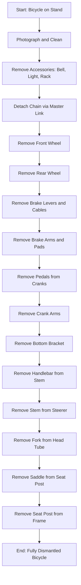
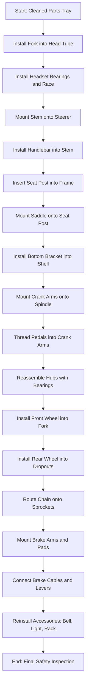

# Bicycle

<!-- SECTION_1_START -->
# Module 12: Bicycle — Assembly Demonstration, Dismantling & Reassembling

## 1.1 Core Technical Definition (KTU 2024 Scheme Aligned)

> [!NOTE]
> **KTU Syllabus Definition (GCESL106 — Engineering Workshop):**
> *Bicycle* is a human-powered, pedal-driven, single-track vehicle consisting of two wheels mounted in a frame, one behind the other. In the context of the KTU Engineering Workshop, a bicycle serves as the canonical **kinematic-chain teaching model** for studying gear trains, chain drives, bearing assemblies, and fastener systems. The laboratory exercise focuses on the **systematic dismantling, inspection, lubrication, and reassembly** of a standard bicycle to develop hands-on mechanical aptitude.

The bicycle, though seemingly simple, is a masterpiece of mechanical engineering comprising a closed-loop chain drive, a friction-based braking system, a rolling-element bearing system, free-wheel mechanism, and a rigid welded frame structure. Studying it bridges the gap between theoretical machine design and practical hardware manipulation.

### 1.2 Conceptual Analogy & Intuition

> [!IMPORTANT]
> **Intuitive Analogy — The Bicycle as a "Mechanical Human Body"**
> Think of a bicycle as a human skeleton:
> - The **frame** is the skeleton (rigid backbone).
> - The **wheels with ball bearings** are the joints (allowing smooth rotation).
> - The **chain and gear** system is the muscular system (transmitting force).
> - The **brake pads** act as the gripping hands (stopping motion on command).
> - The **pneumatic tyres** are the cushioned feet (absorbing shocks).
>
> Just as a doctor must understand anatomy to diagnose a patient, a mechanical engineer must understand a bicycle's "anatomy" to diagnose mechanical faults.

The *standard wheel diameter* of **26 inches (66.04 cm)** and *tyre pressure* of approximately **40–65 PSI (Pounds per Square Inch)** are universal industrial metrics. The *gear ratio* of a standard bicycle (typically 1:1 to 1:3.5 between chainring and rear sprocket) is critical for understanding torque vs. speed trade-off.

### 1.3 Key Engineering Constants & Standard Metrics

- **Standard Wheel Sizes:** 20" (kids), 24" (junior), 26" (adult MTB), 27.5"/29" (modern MTB), 700C (road bike)
- **Standard Crank Arm Length:** 170 mm (standard), 172.5 mm, 175 mm
- **Standard Bottom Bracket Shell Width:** 68 mm (English/BSA threaded), 73 mm (BMX/MTB)
- **Standard Chain Pitch:** 12.7 mm (1/2 inch) — this is a **GLOBAL INDUSTRY STANDARD**
- **Standard Chain Roller Diameter:** 7.75 mm (5/16 inch)
- **Standard Tyre Pressure:** 40–65 PSI for hybrid, 80–130 PSI for road bikes
- **Bicycle Frame Materials:** Mild Steel (Hi-Tensile), Chromium-Molybdenum Steel (Chromoly), Aluminium Alloy (6061/7005), Carbon Fibre Composite, Titanium

> [!VISUALIZATION CONTROL]
> **Concept:** Free-Body Force Diagram of a Bicycle on Level Ground
> **GeoGebra / Desmos Input Equations:**
> * Point A = (0, 0) representing the rear wheel contact patch
> * Point B = (1.05, 0) representing the front wheel contact patch (wheelbase ≈ 1.05 m)
> * Point C = (0.55, 0.55) representing the Centre of Gravity (CoG) of rider + bicycle
> * `f_normal_rear = 350` (Newtons, vertical reaction at A)
> * `f_normal_front = 500` (Newtons, vertical reaction at B)
> * `f_weight = 850` (Newtons, downward at C, since total mass ≈ 87 kg)
> **Visual Description:** Students should observe a triangle of forces (two normal reactions balancing weight) and appreciate that on a level surface, weight distribution is typically **45% rear / 55% front** for an upright bicycle. This is the foundation of why brakes work differently on front vs. rear wheels.

---

<!-- SECTION_1_END -->

<!-- SECTION_2_START -->
# 2. Deep Theoretical Analysis & KTU High-Yield Reference Sheet

## 2.1 Major Subsystems of a Standard Bicycle

A bicycle is conventionally divided into **seven primary subsystems**. Understanding this division is essential for systematic dismantling and reassembly.

### A. Frame & Fork (The Skeleton)
- The **frame** is a **closed rhombus-like structure** made of tubular members.
- Primary triangles:
  1. **Front Triangle:** Top tube, down tube, seat tube, head tube.
  2. **Rear Triangle:** Seat tube, seat stays, chain stays, dropouts.
- The **head tube** houses the headset bearing assembly which allows handlebar steering.
- The **bottom bracket shell** houses the bottom bracket axle.

### B. Wheel Assembly (Two Units)
Each wheel consists of:
- **Hub** (contains the bearing cones, ball bearings, axle, locknuts)
- **Spokes** (typically 32 or 36, made of stainless steel; tensioned in a specific pattern)
- **Rim** (aluminium alloy, often double-walled for strength)
- **Tyre** (rubber, with inner tube in traditional setups, or tubeless in modern)
- **Inner tube** (butyl rubber, with Schrader or Presta valve)

### C. Drivetrain (The Power Transmission System)
- **Pedals** → **Crank Arms** → **Chainring (Front Sprocket)** → **Chain** → **Rear Sprocket (Cassette/Freewheel)** → **Rear Hub**
- The **derailleur system** (front and rear) shifts the chain across multiple gears.

### D. Braking System
- **Rim Brakes (V-Brakes / Caliper):** Brake pads squeeze the rim.
- **Disc Brakes:** Rotor attached to hub, caliper squeezes rotor via hydraulic or mechanical cable actuation.
- **Coaster/Drum Brakes:** Integrated into rear hub; activated by back-pedaling.

### E. Steering System
- **Handlebar** → **Stem** → **Steerer Tube** (passes through head tube) → **Fork**
- Controlled via the **headset** (a set of bearing races and ball bearings).

### F. Saddle & Seat Post
- The **saddle** (seat) is mounted on a **seat post**, which slides into the **seat tube** of the frame and is clamped.

### G. Accessories
- Mudguards, bell, light, reflectors, water bottle cage, kickstand, carrier rack.

## 2.2 Theoretical Principles at Play

### Principle 1: Gear Ratio (Mechanical Advantage)

The fundamental equation governing the bicycle's drivetrain is:

$$ i = \frac{N_1}{N_2} = \frac{D_1}{D_2} = \frac{\omega_2}{\omega_1} $$

Where:
- $i$ = Gear ratio (dimensionless)
- $N_1$ = Number of teeth on chainring (front)
- $N_2$ = Number of teeth on rear sprocket
- $D_1, D_2$ = Pitch diameters of respective gears
- $\omega_1$ = Angular velocity of chainring (rad/s)
- $\omega_2$ = Angular velocity of rear sprocket (rad/s)

**Example (KTU Worked Value):** A standard adult bicycle has a 44-tooth chainring and a 16-tooth rear sprocket.
$$ i = \frac{44}{16} = 2.75 $$

This means **one full rotation of the pedals produces 2.75 rotations of the rear wheel**. The torque is correspondingly reduced by the same factor (conservation of power, ignoring losses):

$$ T_{wheel} = i \times T_{pedal} = 2.75 \times T_{pedal} $$

### Principle 2: Chain Drive Kinematics

The chain is a **flexible power transmission element** with a standard pitch of $p = 12.7$ mm. The relationship between chain length, sprocket teeth, and centre distance is given by:

$$ L_p = 2 \left( \frac{C}{p} \right) + \frac{N_1 + N_2}{2} + \frac{\left( \frac{N_1 - N_2}{2\pi} \right)^2}{\left( \frac{C}{p} \right)} $$

Where:
- $L_p$ = Chain length in pitches
- $C$ = Centre distance between sprockets (mm)
- $p$ = Pitch (12.7 mm)
- $N_1, N_2$ = Number of teeth on driving and driven sprockets

> For practical workshop purposes, the chain length is simply calculated as: $L = 2C + \frac{N_1 + N_2}{2} + \left(\frac{N_1 - N_2}{2\pi}\right)^2 \cdot \frac{p}{C}$ and rounded up to the nearest even whole number of pitches (so it can be joined with a master link).

### Principle 3: Bearing Friction (Hub & Bottom Bracket)

The wheel hubs use **cup-and-cone ball bearings**. The relevant friction torque is:

$$ T_f = \mu \cdot W \cdot r_{eff} $$

Where:
- $\mu$ = Coefficient of rolling friction (very low, ≈ 0.001 for properly lubricated ball bearings)
- $W$ = Radial load on the bearing
- $r_{eff}$ = Effective radius of the bearing contact

**Practical Engineering Insight:** This is why a well-lubricated bicycle hub rotates for several minutes with a single push (low $T_f$).

### Principle 4: Brake Mechanics (Rim Brake)

The braking force generated by a V-brake (or caliper) is:

$$ F_{friction} = \mu_{pad} \cdot F_{normal} $$

Where $F_{normal}$ is the squeezing force applied by the cable/lever mechanism and $\mu_{pad}$ is the coefficient of friction between the rubber pad and the rim (typically **0.4–0.6** for dry conditions).

The **stopping distance** is given by:

$$ s = \frac{v^2}{2 \cdot \mu_{road} \cdot g} $$

Where $\mu_{road}$ is the tyre-road friction coefficient (≈ 0.7 dry asphalt, ≈ 0.2 wet).

## 2.3 KTU Formula Sheet & Component Specification Table

| **Component / System** | **Specification / Formula** | **Standard Value / Unit** |
|---|---|---|
| Chain pitch ($p$) | Standard industrial | **12.7 mm (1/2 inch)** |
| Chain roller diameter | $d_r$ | **7.75 mm (5/16 inch)** |
| Standard chainring teeth (single) | $N_1$ | 44T (adult) |
| Standard rear sprocket teeth | $N_2$ | 16T (adult single-speed) |
| Gear ratio | $i = N_1 / N_2$ | **1.0 – 3.5** typical |
| Wheel diameter (traditional) | $D_w$ | **26 inches (66.04 cm)** |
| Crank arm length | $L_c$ | **170 mm** |
| Bottom bracket shell width | $BB$ | **68 mm (BSA)** |
| Pedaling cadence (normal) | $\omega$ | **60–90 rpm** |
| Tyre pressure (hybrid) | $P$ | **40–65 PSI** |
| Tyre pressure (road) | $P$ | **80–130 PSI** |
| Wheel bearing ball size | $d_b$ | **1/4 inch (6.35 mm) × 9 balls** |
| Headset bearing ball size | $d_b$ | **5/32 inch (3.97 mm) × 20+ balls** |
| Freewheel mechanism | One-way clutch | Pawl-and-ratchet type |
| Standard spoke count | $N_s$ | **32 or 36** per wheel |
| Spoke tension | $T$ | **80–120 kgf** (rear), 70–100 kgf (front) |
| Spoke cross pattern | $X$ | **3-cross (most common)** |
| Frame material (Hi-Tensile) | $E$ | 200 GPa (modulus) |
| Frame material (Al 6061) | $E$ | **69 GPa** |
| Braking distance (dry, 20 km/h) | $s$ | ≈ **5.7 m** |

> [!IMPORTANT]
> **Real-World Engineering Utility:**
> The bicycle's chain-drive system is the conceptual ancestor of every motorcycle, scooter, and industrial conveyor. The same gear ratio, pitch, and freewheel principles are used in CNC machines, 3D printers, and automotive timing chains. Mastering bicycle assembly gives a student the foundational vocabulary for ALL chain-driven machinery.

---

<!-- SECTION_2_END -->

<!-- SECTION_3_START -->
# 3. Step-by-Step Workshop Procedure: Dismantling & Reassembling

> [!NOTE]
> **Workshop Context (KTU Module 12):** This is a hands-on demonstration. Every step must be performed under faculty supervision. Safety glasses and closed-toe footwear are mandatory.

## 3.1 Tools & Materials Required (Pre-Workshop Checklist)

| **S.No** | **Tool / Material** | **Specification** | **Purpose** |
|---|---|---|---|
| 1 | Open-end spanner set | 8 mm – 17 mm | Axle nuts, seat clamp, pedal |
| 2 | Allen key (hex) set | 2 mm – 10 mm | Brake, stem, seat, derailleur bolts |
| 3 | Adjustable wrench | 150 mm, 250 mm | General purpose |
| 4 | Philips screwdriver | PH1, PH2 | Brake lever, accessories |
| 5 | Flat screwdriver | 6 mm, 10 mm | Tyre lever substitute |
| 6 | Tyre levers (plastic) | 2 pieces | Tyre removal |
| 7 | Cone spanners | 13 mm × 14 mm, 15 mm × 17 mm | Hub bearing adjustment |
| 8 | Pliers (needle nose) | 150 mm | Chain master link, cable |
| 9 | Chain breaker tool | Universal | Chain link removal/insertion |
| 10 | Pedal wrench | 15 mm thin-profile | Pedal removal |
| 11 | Grease (lithium-based) | NLGI Grade 2 | Bearing lubrication |
| 12 | Chain lubricant | Dry or wet type | Drivetrain lubrication |
| 13 | Clean rags | Cotton | Cleaning components |
| 14 | Cleaning solvent | Kerosene / degreaser | Degreasing chain, sprockets |
| 15 | Work stand (optional) | Clamp-type | Holding bicycle |
| 16 | Safety glasses | ANSI Z87.1 | Eye protection |

## 3.2 Procedure A: Complete Dismantling of the Bicycle

> [!IMPORTANT]
> **Rule of Thumb for KTU Evaluation:** Dismantling follows the **"Outside-In, Top-Down, Rear-to-Front"** principle. Mark every part's orientation and side (left/right) as you remove it.

### Step 1: Pre-Dismantling Preparation
1. Place the bicycle on a stable work stand or invert it on a soft surface (handlebar + saddle resting on ground).
2. **Photograph the bicycle from all four sides** (this is your reassembly reference).
3. Clean the bicycle thoroughly with a dry brush and rag to remove dust/mud, allowing clear identification of all bolts and parts.
4. Prepare a **parts tray** (magnetic tray preferred) and label slots for bolts of different sizes.

### Step 2: Remove Accessories (Outermost Layer)
1. **Bell, light, reflectors, water bottle cage** — remove using a screwdriver or hex key. Keep screws in a labelled zip pouch.
2. **Mudguards (fenders)** — loosen the mudguard stays at the frame eyelets and the stays at the fork/chainstay. Slide off.
3. **Carrier rack** — remove the four bolts (two at seat stay, two at dropout/pannier) using an Allen key (typically 5 mm or 6 mm).
4. **Kickstand** — single bolt at the chainstay near the rear dropout.

### Step 3: Detach the Chain
1. Locate the **master link** (also called the quick link) on the chain — it is visually distinct (silver-coloured plate).
2. Using needle-nose pliers, squeeze the master link plates together and slide them off.
3. If the chain has no master link, use a **chain breaker tool**: align its punch with a chain pin, turn the handle clockwise to push the pin out by ≈ 3 mm (do not push it fully out — this allows reassembly).
4. **Carefully unthread the chain** from the chainring and rear sprocket. Note the routing direction.

### Step 4: Remove the Wheels
**Front Wheel:**
1. If the bicycle has rim brakes, **disengage the brake noodle** (V-brake) by squeezing the arms together and unhooking the cable housing.
2. Loosen the two **axle nuts** (typically 15 mm) using an open-end spanner.
3. Hold the front wheel, lift the bicycle slightly, and slide the wheel out of the front fork dropouts.
4. **Caution:** Note the position of the **safety washers** (curved tabs) on the axle.

**Rear Wheel:**
1. Shift the **rear derailleur to the smallest cog** (this relaxes chain tension).
2. Pull the derailleur body **rearward** to release chain tension.
3. Disengage the brake as above.
4. Loosen the two axle nuts.
5. Lift the chain off the rear sprocket and slide the rear wheel backward out of the dropouts.
6. The **axle, locknuts, cone nuts, ball bearings, and hub shell** can now be separated for inspection.

### Step 5: Remove the Brake System
1. **V-Brakes:**
   - Loosen the cable pinch bolt (5 mm Allen key).
   - Detach the cable from the brake arm noodle.
   - Remove the two centre bolt nuts (10 mm spanner) holding each brake arm to the frame/fork boss.
   - Remove the brake pads by unscrewing the pad retaining bolt (typically 5 mm Allen or a 10 mm spanner).
2. **Disc Brakes:** Do NOT squeeze the brake lever once the rotor is removed (pistons will protrude). Use a **plastic tyre lever** between the pads to keep them apart if needed.

### Step 6: Remove the Pedals and Crankset
1. **Right pedal:** The right pedal unscrews **counter-clockwise** (standard thread). Use a 15 mm pedal wrench or 6 mm Allen key from the back of the crank.
2. **Left pedal:** The left pedal unscrews **counter-clockwise when viewed from the non-drive side** (i.e., it is left-hand threaded — a common point of confusion!).
3. **Crank arms:** Loosen the **crank bolt** (8 mm Allen key, hidden under a dust cap on the crank arm). The dust cap can be pried off with a flat screwdriver.
4. Slide the crank arms off the square taper or splined bottom bracket axle (a crank puller tool is required for tapered cranks).

### Step 7: Remove the Bottom Bracket
1. For a **sealed cartridge bottom bracket**: use a **bottom bracket tool** (e.g., Shimano TL-FC series) and turn counter-clockwise (drive side) and clockwise (non-drive side).
2. For a **cup-and-cone type**: use a large spanner (36 mm or specific BB tool) to unscrew the adjustable cup on the drive side, then the fixed cup on the non-drive side.

### Step 8: Remove the Handlebar and Stem
1. Loosen the **stem faceplate bolts** (4 bolts, 4 mm or 5 mm Allen key).
2. Lift the handlebar out of the stem clamp.
3. Loosen the **steerer clamp bolts** on the stem (typically 2 or 4 bolts, 5 mm or 6 mm Allen).
4. Slide the stem off the steerer tube.
5. **Headset disassembly:** Loosen the top cap and remove it, then slide the fork downward out of the head tube. The upper and lower bearing races (with ball bearings) will be exposed.

### Step 9: Remove the Seat Assembly
1. Loosen the **seat clamp bolt** (typically 6 mm Allen key) at the top of the seat tube.
2. Slide the seat post out of the frame.
3. Loosen the **saddle rail clamp bolts** (one or two 6 mm Allen bolts under the saddle) to separate the saddle from the seat post.

### Step 10: Inspect, Clean, Lubricate
- All ball bearings should be **cleaned in kerosene**, dried, and re-greased with lithium grease.
- The chain should be **soaked in degreaser**, scrubbed with an old toothbrush, and re-lubricated.
- All threads should be inspected for damage; all bearings checked for pitting or roughness.

## 3.3 Procedure B: Reassembling the Bicycle (Reverse Order)

> [!NOTE]
> **KTU Examiner Tip:** Reassembly follows the **reverse sequence** of dismantling. If you forgot a step or part, refer to the photographs taken in Step 1.

### Step 1: Reassemble the Headset & Fork
1. Place the **lower bearing race** onto the fork crown.
2. Apply a generous layer of grease to the **lower bearing cup** in the head tube.
3. Insert the **lower ball bearings** (grease holds them in place).
4. Slide the fork's steerer tube up through the head tube from below.
5. Slide the **upper bearing race** onto the steerer from above.
6. Insert the **upper ball bearings**.
7. Slide the **upper bearing cup** over the steerer.
8. Thread the **locknut and top cap** onto the steerer. Tighten the top cap to remove play, then tighten the locknut.

### Step 2: Reassemble the Stem and Handlebar
1. Slide the stem onto the steerer tube, aligning it with the front wheel.
2. Tighten the steerer clamp bolts evenly (alternating, to a torque of ≈ 5 Nm).
3. Place the handlebar centrally in the stem clamp.
4. Tighten the faceplate bolts in a **diagonal pattern** to ensure even clamping (≈ 4 Nm).

### Step 3: Reinstall the Saddle and Seat Post
1. Slide the seat post into the seat tube to a depth of at least **100 mm** (marked minimum insertion line on post).
2. Tighten the seat clamp bolt (≈ 5 Nm).
3. Set the saddle angle horizontal and tighten the rail clamp(s).

### Step 4: Reassemble the Bottom Bracket
1. Apply anti-seize compound or grease to the BB threads.
2. Thread the **fixed cup** (non-drive side) into the BB shell **clockwise** (when viewed from the non-drive side).
3. Slide the spindle through the BB.
4. Thread the **adjustable cup** (drive side) **counter-clockwise** into the shell.
5. Set the bearing preload — there should be no play but the spindle should rotate freely.

### Step 5: Reinstall the Crankset
1. Slide the drive-side crank arm onto the square taper spindle.
2. Tighten the crank bolt to ≈ 35 Nm.
3. Slide the non-drive crank arm onto the other end and tighten similarly.

### Step 6: Reinstall the Pedals
1. **Right pedal** — threads **clockwise into the crank arm** (standard right-hand thread).
2. **Left pedal** — threads **counter-clockwise into the crank arm** (left-hand thread).
3. **Tighten firmly** (≈ 35 Nm) — pedals carry significant cyclic load.

### Step 7: Reassemble the Hub and Install the Wheels
**Hub Reassembly:**
1. Insert the axle through the hub shell.
2. Slide the **cone nuts** with their dust covers onto each end.
3. Place the **ball bearings (9 per side for front, 9 or 10 per side for rear)** into each cup, with grease holding them.
4. Thread the cone nuts into the cups, adjust for **zero play + free rotation**, then tighten the **locknuts** against the cones (using two cone spanners).

**Wheel Installation:**
1. Insert the front wheel into the fork dropouts, ensuring the **safety washers** are correctly oriented (the raised tab engaging the dropout slot).
2. Tighten the axle nuts evenly.
3. Re-engage the V-brake noodle.
4. For the rear wheel, route the chain onto the smallest rear cog, pull the derailleur back, and slot the axle into the dropouts.
5. Verify the wheel is **centred between the fork blades / chainstays** (no rubbing on the brake pads).

### Step 8: Reinstall the Brakes
1. Attach the brake arms to the frame/fork bosses.
2. Install the brake pads, aligning the pad surface with the rim braking surface (NOT the tyre).
3. Reconnect the brake cable through the noodle.
4. Squeeze the brake arm to take up cable slack, then tighten the pinch bolt.
5. Adjust the **spring tension screws** (one on each arm) so that the pads contact the rim evenly.

### Step 9: Reinstall the Chain
1. Route the chain around the **rear sprocket first, then the chainring** (or vice versa — both work; the key is to maintain the original routing).
2. Determine the correct length: the chain should have about **12–25 mm of vertical slack** at the midpoint between chainring and rear sprocket.
3. If the chain was cut: use the chain breaker tool to install a fresh pin, or use a new master link.
4. Ensure the chain runs straight from the chainring to the rear sprocket in each gear.

### Step 10: Final Checks (KTU Mandatory Step)
1. **Squeeze both brake levers** firmly — the bicycle should not roll forward when pushed.
2. **Spin both wheels** — they should rotate freely without rubbing the brake pads or frame.
3. **Lift the front of the bicycle and swing the handlebar side-to-side** — steering should be smooth, with no binding or play.
4. **Spin the pedals backward** — chain should run smoothly without skipping.
5. **Lift each wheel and tap the spokes** — a "ring" sound indicates proper tension; a "thud" indicates a loose spoke (inform the instructor).
6. **Check all quick-release levers and bolts for tightness.**

---

<!-- SECTION_3_END -->

<!-- SECTION_4_START -->
# 4. Structural Diagrams & Schematics

## 4.1 Mermaid Diagram: Bicycle Subsystem Architecture

```mermaid
graph TD
    A[BICYCLE SYSTEM] --> B[FRAME and FORK SUBSYSTEM]
    A --> C[DRIVETRAIN SUBSYSTEM]
    A --> D[BRAKING SUBSYSTEM]
    A --> E[STEERING SUBSYSTEM]
    A --> F[WHEEL SUBSYSTEM]
    A --> G[SADDLE SUBSYSTEM]

    B --> B1[Main Frame Tubes]
    B --> B2[Front Fork]
    B --> B3[Dropouts]

    C --> C1[Pedals]
    C --> C2[Crank Arms]
    C --> C3[Chainring]
    C --> C4[Chain]
    C --> C5[Rear Sprocket]
    C --> C6[Freewheel]

    D --> D1[Brake Levers]
    D --> D2[Brake Cables]
    D --> D3[Brake Arms]
    D --> D4[Brake Pads]

    E --> E1[Handlebar]
    E --> E2[Stem]
    E --> E3[Steerer Tube]
    E --> E4[Headset Bearings]

    F --> F1[Hub]
    F --> F2[Spokes]
    F --> F3[Rim]
    F --> F4[Tyre and Tube]

    G --> G1[Saddle]
    G --> G2[Seat Post]
    G --> G3[Seat Clamp]
```

## 4.2 Mermaid Diagram: Dismantling Flow Sequence (Top-Down Approach)

## 4.3 Mermaid Diagram: Reassembly Flow Sequence (Bottom-Up Approach)

## 4.4 Mermaid Diagram: Force Flow in Drivetrain

## 4.5 Schematic: Cup-and-Cone Hub Assembly (Block Topology)

```mermaid
graph TD
    subgraph HUB_ASSEMBLY_LEFT_SIDE
        HL1[Axle Nut 15mm] --> HL2[Washer]
        HL2 --> HL3[Locknut]
        HL3 --> HL4[Cone Wrench Flat]
        HL4 --> HL5[Inner Cone]
        HL5 --> HL6[Ball Bearings 9 pcs in Cup]
        HL6 --> HL7[Hub Shell]
    end

    subgraph HUB_ASSEMBLY_CENTRE
        HC1[Hub Shell] --> HC2[Spoke Flange 1]
        HC2 --> HC3[Spoke Flange 2]
    end

    subgraph HUB_ASSEMBLY_RIGHT_SIDE
        HR1[Hub Shell] --> HR2[Ball Bearings 9 pcs in Cup]
        HR2 --> HR3[Inner Cone]
        HR3 --> HR4[Cone Wrench Flat]
        HR4 --> HR5[Locknut]
        HR5 --> HR6[Washer]
        HR6 --> HR7[Axle Nut 15mm]
    end
```

---

<!-- SECTION_4_END -->

<!-- SECTION_5_START -->
# 5. KTU 2024 Scheme Examination Question Bank & Topic Recap

## 5.1 Part A Questions (3 Marks Each — Remember / Understand)

> **[KTU University Exam — July 2024 Style]**

### **Q1. (3 Marks)** [CO1, Remember]
**List the seven major subsystems of a standard bicycle and briefly state the function of any three.**

**Model Answer:**

The seven major subsystems are:
1. Frame and Fork
2. Drivetrain (Pedals → Chain → Sprockets)
3. Braking System
4. Steering System
5. Wheel Assembly (Front and Rear)
6. Saddle and Seat Post
7. Accessories

Functions of three (any three, 1 mark each):
- **Frame and Fork:** Provides the rigid structural backbone of the bicycle, supporting the rider and all other components. [1 Mark]
- **Drivetrain:** Transmits the muscular effort of the rider from the pedals to the rear wheel, providing the necessary torque multiplication. [1 Mark]
- **Braking System:** Converts the kinetic energy of the moving bicycle into heat via friction, allowing controlled deceleration and stopping. [1 Mark]

### **Q2. (3 Marks)** [CO1, Understand]
**Explain the function of the freewheel mechanism in a bicycle's rear hub. Why is it essential?**

**Model Answer:**

The freewheel (or free hub) is a **one-way clutch mechanism** built into the rear hub. [1 Mark]

**Function:** It allows the rear wheel to rotate faster than the pedals, e.g., during coasting downhill. The pawls engage only when the sprocket drives the hub forward; when the wheel spins faster, the pawls disengage and "ratchet" over the ratchet teeth. [1 Mark]

**Why essential:**
- It allows the rider to **coast** without pedaling (resting the legs).
- It enables **changing gears** without the rear wheel locking up.
- It is critical for the **balance and efficiency** of the bicycle; without it, the rider would have to pedal continuously. [1 Mark]

---

## 5.2 Part B Questions (14 Marks Each — KTU ESE Module Internal Choice)

> **[KTU University Exam — Dec 2023 / July 2024 Style]**

### **Question A (14 Marks):** [CO2, Apply + Analyze]

**(a) [7 Marks]** With the help of a neat labelled diagram, describe the construction of a **bicycle wheel hub with cup-and-cone ball bearings**. List the components and explain the role of each.

**Model Solution:**

**Diagram (Text-Based Schematic):**
*(Student should draw a cross-sectional view of the hub showing the axle in the centre, two cones facing inward, ball bearings between the cones and the cup surfaces inside the hub shell, with locknuts and axle nuts on the outside.)*

**Components and their roles:**

| **Component** | **Role** | **Marks** |
|---|---|---|
| **Axle** | Central shaft that transmits torque from sprocket to wheel; clamped into the frame dropouts via axle nuts. | [1 Mark] |
| **Hub Shell** | Outer cylindrical body; the spoke flanges at its ends provide anchorage for the spokes. | [1 Mark] |
| **Inner Cones** (×2) | Tapered rings that mate with the ball bearings; their position determines the bearing preload. | [1 Mark] |
| **Ball Bearings** (≈9 per side) | Rolling elements that convert sliding friction into rolling friction, enabling smooth rotation with minimal resistance. | [1 Mark] |
| **Cups** (×2) | Hardened bearing races inside the hub shell, providing the outer race for the ball bearings. | [1 Mark] |
| **Locknuts** (×2) | Secure the cone position after adjustment, preventing loosening under vibration. | [1 Mark] |
| **Axle Nuts** (×2) | Clamp the axle into the frame dropouts. | [1 Mark] |

**(b) [7 Marks]** Compute the **gear ratio** of a bicycle whose chainring has **48 teeth** and the rear sprocket has **18 teeth**. If the cyclist pedals at **70 rpm**, find (i) the rotational speed of the rear wheel, and (ii) the torque available at the rear wheel, given that the cyclist applies an average pedal force of **200 N** on a crank arm of length **170 mm**. Assume 100% efficiency.

**Model Solution:**

**Step 1: Gear Ratio Calculation** [1 Mark]
$$ i = \frac{N_1}{N_2} = \frac{48}{18} = 2.667 $$

**Step 2: Rotational Speed of Rear Wheel** [2 Marks]
$$ \omega_{wheel} = i \times \omega_{pedal} = 2.667 \times 70 = 186.67 \text{ rpm} $$

Converting to rad/s: $186.67 \times \frac{2\pi}{60} = 19.55$ rad/s

**Step 3: Torque at the Pedal** [1 Mark]
$$ T_{pedal} = F \times L_c = 200 \text{ N} \times 0.170 \text{ m} = 34 \text{ N·m} $$

**Step 4: Torque at the Rear Wheel** [2 Marks]
$$ T_{wheel} = i \times T_{pedal} = 2.667 \times 34 = 90.67 \text{ N·m} $$

**Step 5: Final Tabulation** [1 Mark]
- Gear ratio: $i = 2.667$
- Rear wheel speed: $\omega_{wheel} \approx 186.67$ rpm
- Rear wheel torque: $T_{wheel} \approx 90.67$ N·m

**Valuation Key Points:**
- [Correctly identifying $i = N_1/N_2$: 1 Mark]
- [Unit conversion of rpm to rad/s: 1 Mark]
- [Correct torque amplification: 1 Mark]
- [Final numerical answer: 1 Mark]

---

### **Question B (14 Marks):** [CO2, Apply + Analyze]

**(a) [7 Marks]** Describe the **step-by-step procedure to dismantle a bicycle wheel from the bicycle frame**. Mention the tools required and the safety precautions to be observed.

**Model Solution:**

**Tools Required:** [1 Mark]
- Open-end spanner (15 mm) for axle nuts
- Adjustable spanner
- Allen key set (for brake pad/disc rotor bolts)
- Tyre levers (if removing tyre)
- Pliers (for V-brake noodle)

**Procedure:** [5 Marks]

1. **Place the bicycle on a stable work stand** (or invert it carefully on handlebar and saddle). [0.5 Marks]
2. **Disengage the V-brake** by squeezing the brake arms together and unhooking the cable housing from the noodle. *(Skip this step for disc brakes — do not squeeze the brake lever.)* [1 Mark]
3. **Loosen the two axle nuts** on the side of the wheel using a 15 mm open-end spanner. Turn counter-clockwise. Do not remove them yet. [1 Mark]
4. **For the rear wheel:** Shift the rear derailleur to the smallest cog to slacken the chain. Pull the derailleur body rearward to release chain tension. [1 Mark]
5. **Lift the bicycle** slightly (or remove the wheel while the bike is on the ground), and **slide the wheel downward** out of the front fork dropouts (or rearward out of the rear dropouts). [1 Mark]
6. **Catch the safety washers** that sit between the axle nuts and the dropouts — these are easily lost. [0.5 Marks]

**Safety Precautions:** [1 Mark]
- Wear safety glasses to prevent injury from spring-loaded parts.
- Do not squeeze the brake lever after removing a wheel with disc brakes (the pistons will protrude and may require re-alignment).
- Place removed wheels on a clean surface to avoid damaging the spokes.
- Keep small parts (washers, nuts) in a magnetic tray to prevent loss.

**(b) [7 Marks]** Explain the construction and working of a **V-brake system** used in bicycles. Why is it preferred over drum brakes for lightweight applications?

**Model Solution:**

**Construction:** [3 Marks]
A V-brake (also called a linear-pull brake) consists of:
- **Two brake arms** mounted on either side of the wheel, pivoting on a frame/fork boss.
- **Brake pads** (rubberized) attached to the brake arms via pad holders.
- **A cable** that, when pulled by the brake lever, draws the two arms together.
- **A "noodle"** — a curved tube at the cable housing end that seats in the carrier of one brake arm.
- **A straddle cable** (or link wire) that connects the two arms via a central yoke.
- **Tensioning springs** (one on each arm pivot) that push the arms apart when the brake is released.

**Working:** [2 Marks]
When the rider squeezes the brake lever:
1. The brake cable pulls the straddle cable upward.
2. The straddle cable pulls the two brake arms together (pivoting on the frame bosses).
3. The brake pads on the arm tips contact the rim and apply a normal force.
4. Friction between the pads and the rim generates a braking torque that decelerates the wheel.

When the lever is released, the tensioning springs push the arms back apart, releasing the rim.

**Why V-Brake is Preferred:** [2 Marks]
- **Lightweight:** V-brakes weigh only ≈ 200 g vs. ≈ 700 g for a drum brake.
- **Better heat dissipation:** The rim acts as a large heat sink.
- **Easy maintenance:** Pads can be replaced in 2 minutes with a single Allen key.
- **Sufficient braking power** for urban and off-road use in dry conditions.
- **Low cost** and simple construction.

**Valuation Key Points:**
- [Correct diagram with all labelled parts: 2 Marks]
- [Explanation of working sequence: 2 Marks]
- [Comparison table or comparative points: 1 Mark]
- [Engineering rationale: 2 Marks]

---

## 5.3 KTU Examiner's Valuation Warning / Pitfall Callout

> [!WARNING]
> **Common Student Mistakes in KTU Evaluations — Bicycle Workshop:**
> 1. **Left vs. Right Pedal Thread Confusion:** Many students fail to remember that the **left pedal is left-hand threaded** (counter-clockwise to tighten, when viewed from the rider's left). This is the **#1 reason** for stripped pedal threads in workshops.
> 2. **Forgetting to re-engage the V-brake noodle** after wheel installation — this is a **safety hazard** flagged by examiners.
> 3. **Over-tightening the headset top cap** — students often crush the upper bearing cup. The correct procedure is to tighten the top cap until play is removed, THEN tighten the stem clamp bolts (not the other way around).
> 4. **Confusing the gear ratio direction:** $i = N_{chainring}/N_{sprocket}$ is the **speed multiplier**. Some students invert it, leading to wrong numerical answers.
> 5. **Omitting the safety washer:** Examiners deduct 1 mark if the safety washer orientation is not described in the wheel installation step.
> 6. **Skipping the lubrication step:** A bicycle reassembled without grease on the bearings is considered a "failed assembly" in KTU evaluations.

---

## 5.4 Topic Recap & Important Things to Remember

> [!IMPORTANT]
> **High-Density Revision Checklist — Module 12: Bicycle**

**🔑 Key Definitions:**
- **Bicycle:** Human-powered, pedal-driven vehicle with two wheels in tandem.
- **Frame:** Rigid tubular structure forming the bicycle's skeleton.
- **Freewheel:** One-way clutch in the rear hub, allowing coasting.
- **Cup-and-Cone Bearing:** Friction-reducing mechanism using balls between a tapered cone and a hardened cup.
- **Gear Ratio (i):** $i = N_1 / N_2$ where $N_1$ = chainring teeth, $N_2$ = rear sprocket teeth.

**🔑 Critical Numbers to Memorize:**
- Chain pitch: **12.7 mm (1/2 inch)**
- Standard wheel diameter: **26 inches**
- Standard crank length: **170 mm**
- Standard pedal cadence: **60–90 rpm**
- Number of ball bearings per hub side: **9 balls** (front), 9–10 balls (rear)
- Hub ball size: **1/4 inch (6.35 mm)**
- Headset ball size: **5/32 inch (3.97 mm)**

**🔑 Tools to Recognize:**
- Cone spanner (13 × 14 mm and 15 × 17 mm)
- Chain breaker tool
- Pedal wrench (15 mm thin profile)
- Bottom bracket tool (Shimano TL-FC series)
- Crank puller
- Tyre levers (plastic, two-piece set)

**🔑 Process Mnemonics:**
- **Dismantling:** **"Outside-In, Top-Down, Rear-to-Front"** — Accessories → Chain → Wheels → Brakes → Cranks → Bottom Bracket → Handlebar → Saddle.
- **Reassembly:** **"Inside-Out, Bottom-Up, Front-to-Rear"** — Fork/Headset → Cranks → Wheels → Chain → Brakes → Accessories.

**🔑 Common Exam Pitfalls:**
- Left pedal = left-hand thread (counter-clockwise to tighten).
- V-brake = must re-engage the noodle after wheel installation.
- Headset top cap adjusted BEFORE stem bolts.
- Gear ratio = chainring teeth / sprocket teeth (not the inverse).
- Brake pads contact the RIM, not the TYRE.

**🔑 Safety Mantras:**
- Wear safety glasses throughout the workshop.
- Never squeeze a disc-brake lever with the wheel removed.
- Keep all small fasteners in a labelled tray.
- Photograph the bicycle before disassembly for reference.

---

<!-- SECTION_5_END -->
