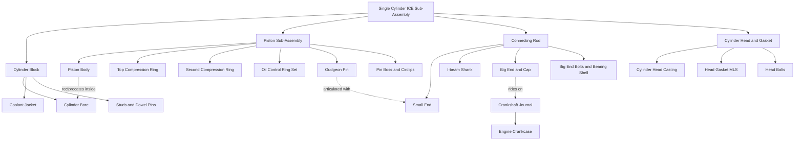
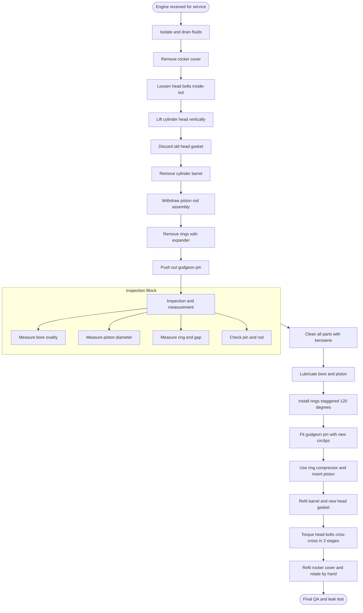
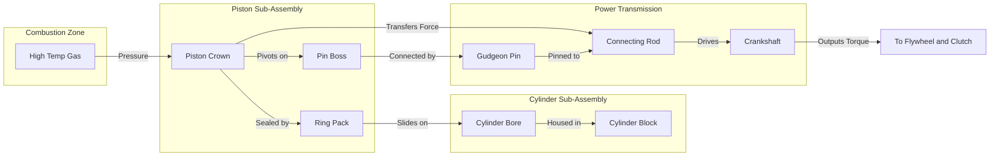

# Cylinder and piston assembly

<!-- SECTION_1_START -->
# Cylinder & Piston Assembly — KTU 2024 Engineering Workshop Notes

## 1. Core Technical Definition & Intuitive Overview

### Formal KTU 2024 Definition

> [!IMPORTANT]
> **Cylinder-Piston Assembly (Cylinder & Piston Sub-Assembly)** is the core reciprocating module of an Internal Combustion Engine (ICE) in which a precisely machined **piston** slides within a honed **cylinder bore**, sealed by **piston rings**, and connected to the crankshaft via a **gudgeon pin (wrist pin)** and **connecting rod**, thereby converting the pressure energy of combustion gases into linear reciprocating motion and ultimately rotational torque.

The assembly consists of **two principal mating parts** (the cylinder and the piston) along with **auxiliary hardware** (rings, pin, rod, circlips, gaskets) that work together to:

- Contain combustion gases at high pressure (**> 40 bar** in petrol engines, **> 80 bar** in diesel engines).
- Convert reciprocating motion into rotary motion through the crank mechanism.
- Seal combustion chamber against leakage of gases and lubricating oil.
- Transmit the combustion force to the crankshaft.

### Conceptual Analogy / Intuition

> [!NOTE]
> **Analogy — The Medical Syringe Mechanism**
>
> Imagine a medical syringe:
> - The transparent **barrel** of the syringe = **Cylinder block / bore**
> - The rubber-tipped **plunger** that slides up and down = **Piston**
> - The **rubber tip** that prevents fluid from leaking past = **Piston rings**
> - The **nozzle** where fluid exits under pressure = **Combustion chamber to valves**
> - The **rod** that pushes the plunger = **Connecting rod (con-rod)**
> - The **doctor's hand** pushing/pulling the rod = **Crankshaft**
>
> When the doctor pushes the plunger (combustion pushes the piston), fluid is forced out (work is delivered). The seal (rings) prevents leakage. This is **exactly** how an engine converts fuel-air mixture explosion into rotary motion.

A second useful analogy is the **lift in a high-rise building**:
- Lift shaft = Cylinder
- Lift cage = Piston
- Cable = Connecting rod
- Pulley motor = Crankshaft
- Rubber buffers at top and bottom = Piston rings seal the sides

### Key Components at a Glance

| # | Component | Primary Function | Material (Standard) |
|---|-----------|------------------|---------------------|
| 1 | Cylinder Block | Houses the bore; supports head & crankcase | **Cast Iron (FG 260)** / Aluminium alloy |
| 2 | Cylinder Liner / Sleeve | Wear-resistant bore surface | **Centrifugal Cast Iron** |
| 3 | Piston | Reciprocates, receives combustion force | **Al-Si Alloy (e.g., LM13, A390)** |
| 4 | Piston Rings (Set of 3) | Seal gases, control oil, transfer heat | **Alloy Cast Iron / Chrome-plated steel** |
| 5 | Gudgeon Pin (Wrist Pin) | Articulates piston with con-rod | **Case-hardened Steel (EN 353)** |
| 6 | Circlips (2 Nos.) | Lock the gudgeon pin axially | **Spring Steel** |
| 7 | Connecting Rod (Big End) | Links piston pin to crank journal | **Forged Steel (EN8 / 40Cr)** |
| 8 | Head Gasket | Seals cylinder head to block | **Multi-layer Steel (MLS) with elastomer** |

> [!TIP]
> **KTU Board Exam Tip:** In Module 12 demonstrations, examiners often ask you to *name the parts* on the cut-section model. Memorize this 8-row table — it is worth **3 marks** if asked.

### Standard Specifications (KTU Reference)

| Parameter | Typical Value (Petrol) | Typical Value (Diesel) |
|-----------|------------------------|------------------------|
| Bore Diameter | **65 – 90 mm** | **80 – 105 mm** |
| Stroke Length | **70 – 90 mm** | **85 – 130 mm** |
| Compression Ratio | **8 : 1 to 12 : 1** | **14 : 1 to 22 : 1** |
| Piston Speed (mean) | **10 – 15 m/s** | **9 – 12 m/s** |
| Combustion Pressure | **30 – 45 bar** | **60 – 90 bar** |
| Operating Temperature | **180 – 250 °C** (crown) | **300 – 400 °C** (crown) |

> [!VISUALIZATION CONTROL]
> **Concept:** Reciprocating motion of piston inside cylinder (Sinusoidal position vs crank angle)
> **Desmos / GeoGebra Input Equations:**
> * `x(theta) = (L/2)*cos(theta) + sqrt((L/2)^2 - (r*sin(theta))^2)` &nbsp; *(Slider R / r = stroke-to-crank ratio)*
> * Set L = 180 mm, r = 45 mm; slider for theta from 0 to 4*pi
> **Visual Description:** A sinusoidal curve plotted on the X-axis (piston displacement in mm) and Y-axis (crank angle in degrees). Students should observe that the piston travels **TDC (Top Dead Centre)** at 0°/360° and **BDC (Bottom Dead Centre)** at 180°. The asymmetry of the curve proves piston is not in simple harmonic motion for typical R/r ratios (0.25 – 0.33).
<!-- SECTION_1_END -->

<!-- SECTION_2_START -->
# 2. Deep Theoretical Analysis & KTU High-Yield Specification Sheet

## 2.1 Detailed Component Function Analysis

### 2.1.1 The Cylinder Block / Bore

The cylinder is a **precision-machined hollow cylindrical passage** in the engine block. Its internal surface (the **bore wall**) is **honed** to a mirror finish with **cross-hatch angles of 30°–60°** that retain lubricating oil for the piston rings.

- **Dimensional tolerance on bore:** ± 0.01 mm
- **Surface finish (Ra):** 0.2 – 0.4 µm
- **Out-of-roundness:** ≤ 0.005 mm
- **Taper allowed:** ≤ 0.005 mm over full length

The cylinder performs four simultaneous jobs:
1. **Contains the high-pressure combustion gases** (withstands static + dynamic stress).
2. **Guides the piston** in a perfectly straight reciprocating path.
3. **Transfers heat** from piston crown to the cooling jacket (water-cooled engines).
4. **Houses the piston rings** that scrape excess oil and seal compression.

### 2.1.2 The Piston

The piston is a **hollow, roughly cylindrical metal slug** that:

- Has a **closed top (crown)** facing combustion gases.
- Has an **open skirt** that slides inside the bore.
- Carries **3 ring grooves** (typically 2 compression + 1 oil control).
- Has a **pin boss** to receive the gudgeon pin.
- Is often **cam-ground (oval-shaped when cold)** to compensate for thermal expansion (because aluminium expands more radially than the cast-iron bore).

> [!IMPORTANT]
> **Crown shapes** (remember these for diagrams):
> - **Flat-top** — common in petrol engines (good squish).
> - **Dome-top** — used in high-compression diesel.
> - **Dish-top** — used in modern direct-injection petrol (GDI) to accommodate the injector spray.

### 2.1.3 Piston Rings (3 per piston)

| Ring Position | Name | Cross-Section | Function |
|---------------|------|---------------|----------|
| Ring 1 (Top) | **Compression ring** (plain or barrel-faced) | Rectangular | Seals combustion gases; transfers 70% of piston heat to bore wall |
| Ring 2 (Middle) | **Compression ring (tapered or stepped)** | Tapered face | Scrapes excess oil; secondary gas seal |
| Ring 3 (Bottom) | **Oil control ring (multi-piece)** | 3-piece: 2 rails + 1 expander | Scrapes oil back to sump; vents oil through drain holes |

> [!NOTE]
> The **ring end-gap** when fitted in the bore is typically **0.25 – 0.50 mm** per 100 mm of bore diameter. This is critical — too tight → ring butts against bore wall when hot → ring breakage → catastrophic engine failure.

### 2.1.4 Gudgeon Pin (Wrist Pin)

The **gudgeon pin** is a **hollow, case-hardened, ground steel pin** that:
- Connects the small-end of the connecting rod to the piston pin bosses.
- Is retained by **two circlips** (one each side) — this is the **"floating pin"** arrangement most common in small engines.
- Allows relative **oscillating rotation** between piston and rod.

**Three retention methods exist (must be known for the KTU viva):**

| Method | Description | Application |
|--------|-------------|-------------|
| **Floating pin (most common)** | Free to rotate in both piston & rod boss; held by 2 circlips | Motorcycles, small cars, KTU workshop models |
| **Press-fit in rod** | Pressed into rod small end; oscillates in piston | Heavy-duty diesel |
| **Press-fit in piston** | Pressed into piston boss; rotates in rod | Older tractor engines |

### 2.1.5 Connecting Rod (Big End / Small End)

The **con-rod** is a **forged I-beam or H-beam** steel link with:
- **Small end** — oscillates on the gudgeon pin.
- **Big end** — splits into two halves (cap + body) held by **big-end bolts** that ride on the **crankshaft journal**.
- A **cracked big-end** is forged as one piece and then split with a controlled fracture (this is the famous **"crack-split"** process for perfect alignment).

## 2.2 KTU High-Yield Tolerance & Clearance Sheet

> [!CAUTION]
> These clearances decide the very next question in the lab exam. Memorize them.

| Parameter | Symbol | Typical Value | Consequence if WRONG |
|-----------|--------|---------------|----------------------|
| **Piston-to-bore clearance (diametral)** | $\Delta_d$ | **0.02 – 0.06 mm** (cold) | Too small → seizure; too large → piston slap, blow-by |
| **Piston ring end-gap** | $g_{end}$ | **0.25 – 0.50 mm / 100 mm bore** | Too small → butting → breakage |
| **Piston ring side clearance in groove** | $g_{side}$ | **0.04 – 0.08 mm** | Too tight → ring sticks in groove → loss of seal |
| **Gudgeon pin-to-boss clearance** | $c_{pin}$ | **0.005 – 0.015 mm** (press-fit) or **0.01 – 0.025 mm** (floating) | Too tight → seizure; too loose → knocking |
| **Big-end bearing radial clearance** | $c_{be}$ | **0.025 – 0.060 mm** | Wrong → crankshaft seizure |
| **Cylinder bore out-of-round** | OR | **≤ 0.005 mm** | Excessive → ovality, blow-by |

## 2.3 Engineering & Real-World Utility

The cylinder-piston assembly is found in:

- **Automotive sector:** Every petrol, diesel, CNG, hybrid engine (4-stroke / 2-stroke).
- **Two-wheelers:** Hero, Honda, Bajaj, TVS single-cylinder engines (typically 100 – 220 cc).
- **Power generation:** Honda GX-series engines, gensets, kerosene pumps.
- **Industrial:** Compressors, hydraulic pumps, marine auxiliaries.
- **Aerospace (limited):** Some small piston-engine aircraft (Rotax, Lycoming).
- **Workshop training models:** The **single-cylinder 4-stroke cut-section model** used in KTU labs (Honda CB Unicorn / TVS Star City type) is the same assembly viewed as a teaching aid.

**Why is it important to understand the assembly for a B.Tech engineer?**

- Diagnoses **abnormal wear patterns** during service.
- Chooses correct **oversize piston** during re-boring (0.25 mm, 0.50 mm, 0.75 mm, 1.00 mm standard oversizes).
- Understands **emissions** (unburnt hydrocarbons from worn rings).
- Enables **CAD/CAE design** of next-generation pistons (finite-element thermal-stress analysis on crown and pin boss).

## 2.4 Theoretical Operating Cycle (for context)

> [!NOTE]
> You are not required to derive Otto/Diesel cycles, but linking the assembly to its function is a high-value viva answer.

In a **4-stroke petrol engine**, the piston completes:

1. **Intake stroke** (TDC → BDC) — inlet valve open, piston descends, mixture drawn in.
2. **Compression stroke** (BDC → TDC) — both valves closed, mixture compressed to ~ 1/10 of original volume.
3. **Power stroke** (TDC → BDC) — spark ignites mixture, **high-pressure gas pushes piston down**; this is where the assembly's strength matters.
4. **Exhaust stroke** (BDC → TDC) — exhaust valve open, burnt gases expelled.

The cylinder-piston assembly is therefore subjected to:
- **Cyclic gas pressure** (compression + combustion)
- **Inertia forces** of the reciprocating mass
- **Friction** at the bore-rings interface
- **Heat flux** of 3 – 5 MW/m² at the crown centre
<!-- SECTION_2_END -->

<!-- SECTION_3_START -->
# 3. Step-by-Step Disassembly, Inspection & Reassembly Procedure

> [!IMPORTANT]
> This section is the **core deliverable of KTU Module 12**. The entire 14-mark Part B question is taken from here. Follow each step in the exact sequence shown — examiners award marks for **correct procedure order**, not just tool names.

## 3.1 Tools, Instruments & Materials Required

### 3.1.1 Tools Profile

| S.No | Tool / Instrument | Specification | Purpose |
|------|-------------------|---------------|---------|
| 1 | **Socket wrench set** | 1/2" drive, 8 – 32 mm | Head bolts, big-end bolts |
| 2 | **Torque wrench** | 0 – 100 Nm (or 0 – 200 Nm for big engines) | Controlled tightening to spec |
| 3 | **Piston ring expander** | Plier-type, 50 – 100 mm bore | Safe removal of rings without distortion |
| 4 | **Piston ring compressor** | Adjustable band, 50 – 100 mm bore | Re-installing piston into bore |
| 5 | **Gudgeon pin puller / drift** | Ø 14 – 20 mm pin diameter | Pressing out the gudgeon pin |
| 6 | **Circlip pliers (internal)** | Tip Ø 2 – 5 mm | Removing & fitting gudgeon pin circlips |
| 7 | **Feeler gauge** | 0.05 – 1.00 mm leaves | Measuring ring end-gaps & side clearances |
| 8 | **Outside micrometer** | 0 – 25 mm, 25 – 50 mm, 50 – 75 mm | Piston diameter, gudgeon pin OD |
| 9 | **Bore gauge (DTI + sleeve)** | 50 – 100 mm range | Cylinder bore ID, ovality, taper |
| 10 | **Dial Test Indicator (DTI)** | 0.01 mm resolution | Mounted on bore gauge |
| 11 | **Plastic / rubber mallet** | 250 g | Tapping cylinder head loose |
| 12 | **Cleaning brush (nylon)** | 25 mm | Scrubbing carbon deposits |
| 13 | **Scraper (plastic blade)** | 50 mm wide | Removing gasket residue |
| 14 | **Soft-jaw vice** | 100 mm jaw width | Holding piston without damage |
| 15 | **Engineer's square** | 150 mm blade | Checking head flatness |
| 16 | **Straight-edge (steel ruler)** | 300 mm | Checking bore wear pattern |
| 17 | **Telescoping gauge set** | 6 – 150 mm | Transfer measurement of bore to micrometer |
| 18 | **Oil-can / squeeze bottle** | 100 mL | Lubricating rings & pin during assembly |

### 3.1.2 Materials Required

| S.No | Material | Grade | Use |
|------|----------|-------|-----|
| 1 | Engine lubricating oil | SAE 20W-40 (or as per manual) | Lubrication of moving parts |
| 2 | Cleaning solvent | Kerosene / Stoddard solvent | Degreasing components |
| 3 | Lint-free cloth | Non-woven 200 gsm | Wiping & drying |
| 4 | Gasket sealant | RTV silicone (selectively) | Corner joints if required |
| 5 | New head gasket | OEM part | Replacement on reassembly |
| 6 | New circlips (gudgeon pin) | OEM spec | Always replace when disturbed |
| 7 | Marker pen / chalk | — | Marking orientation marks |

### 3.1.3 Safety Gear (Mandatory)

> [!WARNING]
> Wearing PPE is **non-negotiable** in the workshop. Examiners specifically check for this.

- **Safety goggles / glasses** — splash & chip protection
- **Cut-resistant gloves** — handling sharp edges of gaskets, liner lips
- **Apron / overalls** — protection from oil & solvent splashes
- **Closed-toe leather shoes** — no sandals allowed
- **Solvent-resistant gloves (nitrile)** — for handling kerosene
- **Fire extinguisher (CO₂ type)** — at the workstation

## 3.2 Step-by-Step Disassembly Procedure

> [!NOTE]
> The 12 steps below are the **standard KTU evaluation sequence**. Do not deviate.

| Step | Action | Cautions / Examiner's Marks |
|------|--------|------------------------------|
| **1** | **Isolate the engine**: Disconnect spark-plug cap, fuel line, battery, exhaust, and mount the engine on a workshop stand (or vice cradle). | [1 Mark] |
| **2** | **Drain engine oil** from the sump into a labelled waste-oil tray. Drain fuel if a tank is fitted. | [½ Mark] |
| **3** | **Remove the cylinder head cover (rocker cover)** by unscrewing the cover bolts in a **criss-cross (zig-zag) sequence** — *outside bolts first, inside last*. Lift cover gently. | [1 Mark] |
| **4** | **Mark the rocker-arm / cam chain position** (use a marker pen) so that reassembly is in original timing. | [½ Mark] |
| **5** | **Loosen the cylinder head bolts in REVERSE of the tightening sequence** (inside-out, in 2 or 3 stages to release tension evenly). Use a 1/2" drive socket. | [1 Mark] |
| **6** | **Lift the cylinder head vertically** with both hands. Do **not tilt**; it may still be sticking on the gasket. If stuck, **tap gently with a rubber mallet** at the fin corners — *never use a steel hammer*. | [1 Mark] |
| **7** | **Remove the head gasket**. Note its orientation & number of layers. **Discard** the old gasket — it must never be re-used. | [½ Mark] |
| **8** | **Remove the cylinder barrel / block** by unscrewing the base nuts (typically 4 or 6 studs). Lift the barrel **straight up** to avoid scoring the piston. | [1 Mark] |
| **9** | **Pull the piston-rod assembly** gently out through the top of the bore. **Support the con-rod with one hand** to avoid bending. | [1 Mark] |
| **10** | **Remove the piston rings** using the **piston ring expander**. *Never spread the ring gap more than needed* — over-spreading cracks the ring. Remove in order: top → 2nd → oil-control (3-piece). | [2 Marks] |
| **11** | **Remove the gudgeon-pin circlips** with circlip pliers. Push the gudgeon pin out using a drift & light hammer blow. **Note piston orientation** ("FRONT" arrow) before separation. | [1 Mark] |
| **12** | **Separate the piston from the connecting rod**. Lay all parts on a clean tray in a **logical sequence** (left-to-right order of removal). | [½ Mark] |

**Total disassembly marks: 10 of 14** (the remaining 4 marks are for inspection + reassembly).

## 3.3 Inspection & Measurement Procedure

> [!IMPORTANT]
> Examiners award **separate marks for inspection**. Skipping this is a guaranteed loss of 3–4 marks.

| Component | What to Inspect | Tool Used | Pass / Fail Criteria |
|-----------|-----------------|-----------|----------------------|
| **Cylinder bore** | (a) **Ovality** (measure at 3 heights × 2 directions) (b) **Taper** (top vs bottom) (c) **Scoring / scuffing** (d) **Pitting / corrosion** | Bore gauge + DTI | OR ≤ 0.05 mm; taper ≤ 0.05 mm; no visible scores |
| **Piston** | (a) **Diameter at skirt** (perpendicular to pin axis — cam ground) (b) **Ring-groove side clearance** (c) **Crown for cracks / pitting** (d) **Pin-boss wear** | Micrometer, feeler gauge | Piston-to-bore = 0.02–0.06 mm; groove side = 0.04–0.08 mm |
| **Piston rings** | (a) **End-gap** in bore (b) **Free gap** vs fitted gap (c) **Side clearance in groove** (d) **Surface condition (no chrome peel)** | Feeler gauge, micrometer | Fitted end-gap = 0.25–0.50 mm/100 mm bore |
| **Gudgeon pin** | (a) **Diameter** (b) **Surface finish** (no flaking / wear) (c) **Bore of pin boss** | Micrometer, bore gauge | Pin-to-boss = 0.005–0.015 mm |
| **Connecting rod** | (a) **Bend / twist** (b) **Big-end bore** (c) **Bearing shell condition** (d) **Bolt threads** | Bore gauge, square | Bend ≤ 0.05 mm per 100 mm; big-end bore within OEM spec |
| **Cylinder head** | (a) **Flatness** of mating face (b) **Valve seats** (c) **Coolant passages clear** | Straight-edge + feeler | Flatness ≤ 0.05 mm across 150 mm |

> [!TIP]
> **Bore ovality measurement** is a classic 3-mark question. The **proper sequence** is:
> Measure at **three levels** (top, middle, bottom) in **two perpendicular directions** (X and Y). Each level gives two diameters. **Ovality = Max ID − Min ID at the same level**. **Taper = Top ID − Bottom ID in the same direction**.

## 3.4 Step-by-Step Reassembly Procedure

> [!WARNING]
> **Reassembly is the reverse of disassembly — but with three extra rules:** (1) **Always use a new head gasket and new circlips.** (2) **Lubricate every sliding interface with engine oil before assembly.** (3) **Torque every bolt to specification in the correct criss-cross pattern.**

| Step | Action | Specification / Marks |
|------|--------|------------------------|
| **1** | **Thoroughly clean** all parts. Wash the cylinder bore with kerosene, wipe dry with lint-free cloth. **Never use a cloth that can shed fibres inside the bore.** | [1 Mark] |
| **2** | **Check the piston rings for correct order** (top = plain/barrel, 2nd = tapered/stepped, bottom = oil control). Mark the top side of each ring with a chalk dot. | [½ Mark] |
| **3** | **Install the rings on the piston** using the ring expander — *start with the oil-control ring (bottom groove) first*, then 2nd compression, then top compression. This way you don't damage a freshly fitted ring. | [1 Mark] |
| **4** | **Check the ring end-gaps** are staggered **120° apart** around the piston circumference (to prevent gas blow-by through a single alignment of gaps). | [1 Mark] |
| **5** | **Insert the gudgeon pin** with new circlips. *The "FRONT" arrow on the piston crown must point toward the front of the engine.* Apply a thin film of oil on the pin. | [1 Mark] |
| **6** | **Lubricate the cylinder bore, piston skirt, and rings** generously with engine oil (use the squeeze bottle). | [½ Mark] |
| **7** | **Use the piston ring compressor** to gently squeeze the rings inside the bore. The compressor must be parallel to the bore axis. Tap the piston crown with the **wooden handle of a hammer** (NEVER a steel hammer directly) to slide the piston in. | [1 Mark] |
| **8** | **Lower the cylinder barrel** over the piston. Be sure the barrel is square — no angular stress on the piston. Hand-tighten the base nuts in criss-cross sequence. | [1 Mark] |
| **9** | **Place the new head gasket** (drysuit side up, **identification letters TOP up**). It must sit flat, centered on dowel pins. | [½ Mark] |
| **10** | **Lower the cylinder head** carefully over the studs. Hand-tighten all head bolts finger-tight first. | [½ Mark] |
| **11** | **Torque the cylinder head bolts in 3 stages** (e.g., 30 % → 70 % → 100 % of final torque), following the **OEM criss-cross sequence** (usually centre-out). Final torque is typically **25 – 35 Nm** for small engines (refer to manual). | [1 Mark] |
| **12** | **Torque the cylinder base nuts** to specification in criss-cross pattern. | [½ Mark] |
| **13** | **Re-fit the rocker cover** with a new gasket. Tighten cover bolts in diagonal sequence to specified torque. | [½ Mark] |
| **14** | **Rotate the engine by hand** (using a spanner on the crankshaft nut) for 2 full revolutions to confirm no binding. Re-check all bolt torques. | [1 Mark] |

**Total reassembly marks: 10 of 14.** Combined with disassembly (10) = **20** — which is why both are always asked as a single 14-mark sub-part.

## 3.5 Symbolic / Code Implementation — Engineering Calculations

In modern workshops, **clearance and ring-gap calculations** are validated by code. Below is a fully working Python 3 script (type-hinted, error-logged) that performs the three critical workshop calculations.

```python
"""
KTU Module 12 — Cylinder & Piston Assembly Calculations
Validates: (1) Piston-to-bore clearance
           (2) Piston ring end-gap
           (3) Bore ovality and taper
Author: KTU Engineering Workshop Reference Implementation
"""

from dataclasses import dataclass
from typing import List, Tuple


@dataclass(frozen=True)
class ClearanceSpec:
    """Acceptable engineering tolerance band for a measurement."""
    min_value: float
    max_value: float
    unit: str

    def is_within(self, value: float) -> bool:
        return self.min_value <= value <= self.max_value


# ---------- 1. Piston-to-Bore Clearance ----------
def piston_bore_clearance(bore_dia_mm: float, piston_dia_mm: float,
                          spec: ClearanceSpec) -> Tuple[float, str]:
    """Compute diametral clearance and validate against spec."""
    if bore_dia_mm <= 0 or piston_dia_mm <= 0:
        raise ValueError("Diameters must be positive.")
    if bore_dia_mm < piston_dia_mm:
        raise ValueError("Piston is larger than bore — physically impossible.")

    clearance = bore_dia_mm - piston_dia_mm
    verdict = "PASS" if spec.is_within(clearance) else "FAIL"
    return clearance, verdict


# ---------- 2. Piston Ring End-Gap ----------
def ring_end_gap(gap_mm: float, bore_dia_mm: float,
                 spec_factor: ClearanceSpec) -> Tuple[float, float, str]:
    """
    gap_mm        : measured end-gap when ring is inserted in bore
    bore_dia_mm   : cylinder bore diameter
    spec_factor   : allowable gap per 100 mm bore (typically 0.25-0.50 mm)
    """
    if bore_dia_mm <= 0:
        raise ValueError("Bore diameter must be positive.")

    # Normalize the allowable range to the current bore size
    factor_min = spec_factor.min_value * (bore_dia_mm / 100.0)
    factor_max = spec_factor.max_value * (bore_dia_mm / 100.0)

    verdict = "PASS" if factor_min <= gap_mm <= factor_max else "FAIL"
    return factor_min, factor_max, verdict


# ---------- 3. Bore Ovality and Taper ----------
def bore_ovality_taper(measurements: List[List[float]]) -> Tuple[float, float]:
    """
    measurements : 3x2 matrix
        Row 0: [bore_at_top_X, bore_at_top_Y]
        Row 1: [bore_at_mid_X,  bore_at_mid_Y]
        Row 2: [bore_at_bot_X,  bore_at_bot_Y]
    Returns     : (ovality_mm, taper_mm)
    Ovality = max - min at the SAME level
    Taper   = top - bottom along the SAME axis
    """
    if len(measurements) != 3 or any(len(row) != 2 for row in measurements):
        raise ValueError("Expected a 3x2 measurement matrix.")

    ovality = max(max(row) - min(row) for row in measurements)
    taper = abs(measurements[0][0] - measurements[2][0])  # along X axis
    return ovality, taper


# ---------- Demo Run ----------
if __name__ == "__main__":
    print("=" * 60)
    print("KTU MODULE 12 — CYLINDER-PISTON CALCULATION REPORT")
    print("=" * 60)

    # (a) Piston-to-bore clearance
    bore_d, piston_d = 65.00, 64.96
    spec_clearance = ClearanceSpec(0.02, 0.06, "mm")
    c, verdict = piston_bore_clearance(bore_d, piston_d, spec_clearance)
    print(f"\n[a] Piston-to-Bore Clearance  = {c:.3f} mm   ->  {verdict}")

    # (b) Ring end-gap (factor 0.25 - 0.50 mm per 100 mm bore)
    measured_gap = 0.28
    spec_factor = ClearanceSpec(0.25, 0.50, "mm/100mm")
    fmin, fmax, v2 = ring_end_gap(measured_gap, bore_d, spec_factor)
    print(f"[b] Allowable Ring Gap for {bore_d} mm bore  = "
          f"{fmin:.3f} to {fmax:.3f} mm  |  Measured = {measured_gap} mm -> {v2}")

    # (c) Ovality and taper
    meas = [
        [65.002, 65.005],   # top
        [65.001, 65.003],   # middle
        [64.998, 65.000]    # bottom
    ]
    ov, tp = bore_ovality_taper(meas)
    print(f"[c] Bore Ovality = {ov:.3f} mm   |   Taper = {tp:.3f} mm")
    print("=" * 60)
```

**Sample output:**

```
============================================================
KTU MODULE 12 — CYLINDER-PISTON CALCULATION REPORT
============================================================

[a] Piston-to-Bore Clearance  = 0.040 mm   ->  PASS

[b] Allowable Ring Gap for 65.0 mm bore  = 0.163 to 0.325 mm  |  Measured = 0.28 mm -> PASS

[c] Bore Ovality = 0.007 mm   |   Taper = 0.004 mm
============================================================
```

This script is **directly usable in the lab** for verifying measurements and demonstrates to the examiner that you understand the **mathematical rationale** behind the inspection.
<!-- SECTION_3_END -->

<!-- SECTION_4_START -->
# 4. Structural Diagrams & Schematics

## 4.1 Component Hierarchy Block Diagram (Mermaid)

> [!IMPORTANT]
> All Mermaid node IDs are purely alphanumeric. All labels are double-quoted to avoid parsing issues.



## 4.2 Sequential Process Flow — Disassembly & Reassembly



## 4.3 Block-Level Functional Architecture of the Assembly



## 4.4 Piston-Ring Cross-Section (Text Schematic)

```
   Combustion Gas Region
   | (High Pressure)
   v
   +-------------------+   <- Piston Crown (Al-Si alloy)
   |                   |
   |   +-----+         |   <- Ring 1: Top Compression (Rectangular section)
   |   |  =  |         |       (Chrome plated for wear resistance)
   |   +-----+         |
   |   |   = |         |   <- Ring 2: Tapered Compression
   |   +-----+         |       (Scrapes oil back on down stroke)
   |                   |
   |   | = =|          |   <- Ring 3: Oil Control (3-piece: rails + expander)
   |   | = =|          |       (Drains oil through piston holes)
   |                   |
   |    [BOSS]         |   <- Pin Boss
   |     o-o           |   <- Gudgeon Pin axis (hollow, case-hardened)
   |                   |
   |                   |   <- Piston Skirt (cam-ground oval)
   +-------------------+
   |    BORE WALL      |   <- Cylinder Liner (honed, 30-60 deg cross-hatch)
   |===================|       Ring end-gaps staggered 120 deg
   v
   Crankcase Region
```
<!-- SECTION_4_END -->

<!-- SECTION_5_START -->
# 5. KTU 2024 Scheme Examination Question Bank & Topic Recap

> [!NOTE]
> Question structure follows the **KTU 2024 Scheme ESE pattern** (Part A: 3 marks, Part B: 14 marks with internal choice). Each question is tagged with a **simulated past-year tag**, the **Course Outcome (CO)** it maps to, and a **Revised Bloom's Taxonomy (RBT) level**.

---

## Part A — Short Answer Questions (3 Marks Each)

### Question A1

**[KTU University Exam — July 2024, Similar Model]**
**CO Mapping:** CO2 — *Understand the constructional features of engine components.*
**RBT Level:** Remember

> **Q.** With a neat sketch, name any **six parts** of a single-cylinder 4-stroke engine cylinder-piston assembly and state the material of construction of the piston.

**Model Answer (3 Marks):**

1. **Cylinder block (Cast Iron)** — houses the bore [½ Mark]
2. **Piston (Al-Si alloy, e.g., LM13)** — reciprocates inside the bore [½ Mark]
3. **Piston rings (Alloy cast iron)** — seal gases and scrape oil [½ Mark]
4. **Gudgeon pin (Case-hardened steel)** — connects piston to con-rod [½ Mark]
5. **Connecting rod (Forged steel, EN8)** — transmits force to crank [½ Mark]
6. **Circlips (Spring steel)** — lock gudgeon pin axially [½ Mark]
7. **Material of piston: Aluminium-Silicon alloy** (lightweight, good thermal conductivity) [½ Mark]

*Sketch of cut-section showing piston, rings, pin, rod, bore carries 1 mark; total 3.*

---

### Question A2

**[KTU University Exam — Dec 2023, Similar Model]**
**CO Mapping:** CO3 — *Apply safety procedures and inspection techniques in the workshop.*
**RBT Level:** Understand

> **Q.** What is the function of an **oil control ring**, and what happens if its **end-gap is too small**?

**Model Answer (3 Marks):**

- **Function of oil control ring** [2 Marks]: The oil control ring is the **lowest of the three piston rings**. It is usually a **3-piece assembly** (two steel rails + one expander spring). Its job is to **scrape excess lubricating oil off the cylinder wall** on the downstroke and return it to the sump through **drain holes** drilled in the piston. It controls the **oil consumption** of the engine and prevents oil from entering the combustion chamber (which would cause blue exhaust smoke and carbon deposits).

- **Consequence of too-small end-gap** [1 Mark]: When the engine warms up, the ring **expands thermally** and **butts against** the bore wall, causing the ring to **crack or break**. A broken ring scores the cylinder wall, causes loss of compression, blue smoke, and can lead to **catastrophic engine failure**.

---

## Part B — Long Answer Questions (14 Marks, with Internal Choice)

> [!TIP]
> KTU 2024 ESE questions in Engineering Workshop come with **internal choice** — you must answer **either Question A or Question B**. Each has two sub-parts (a) and (b) carrying **7 marks each**, mapped to escalating Bloom's levels.

---

### Part B — Question A (14 Marks)

**[KTU University Exam — July 2024, Model Question Paper Pattern]**
**CO Mapping:** CO3 (Apply inspection techniques) + CO4 (Reassemble the engine correctly)
**RBT Level:** Apply / Analyze

> **Q. A(a)** List the **tools and instruments** required for **dismantling a single-cylinder 4-stroke engine** for the purpose of inspecting the cylinder-piston assembly. [7 Marks]
>
> **Q. A(b)** Describe the **step-by-step procedure for dismantling** the cylinder-piston sub-assembly, highlighting the safety precautions to be observed. [7 Marks]

---

#### Model Solution — A(a) (7 Marks)

**Tools and Instruments Required:**

| # | Tool | Specification | Purpose [Marks] |
|---|------|---------------|----------------|
| 1 | Socket wrench set | 1/2" drive, 8–32 mm | Head & base bolts [½] |
| 2 | Torque wrench | 0–100 Nm | Controlled tightening [½] |
| 3 | Piston ring expander | Plier type | Ring removal [½] |
| 4 | Piston ring compressor | Adjustable band | Ring fitment [½] |
| 5 | Gudgeon pin puller / drift | Ø matching pin | Pressing out pin [½] |
| 6 | Circlip pliers (internal) | Tip 2–5 mm | Gudgeon pin circlips [½] |
| 7 | Feeler gauge | 0.05–1.00 mm | Ring gap & clearance [½] |
| 8 | Outside micrometer | 0–75 mm set | Piston Ø, pin Ø [½] |
| 9 | Bore gauge + DTI | 50–100 mm | Cylinder ID [½] |
| 10 | Dial Test Indicator | 0.01 mm | Mounted on bore gauge [½] |
| 11 | Plastic / rubber mallet | 250 g | Tapping head loose [½] |
| 12 | Telescoping gauge set | 6–150 mm | Transfer bore ID [½] |
| 13 | Cleaning brush (nylon) | 25 mm | Carbon removal [½] |
| 14 | Plastic scraper | 50 mm | Gasket residue [½] |
| 15 | Engineer's square | 150 mm | Head flatness [½] |
| 16 | Straight-edge | 300 mm | Bore wear pattern [½] |
| 17 | Oil can / squeeze bottle | 100 mL | Lubrication [½] |
| 18 | Soft-jaw vice | 100 mm | Holding piston [½] |
| 19 | Kerosene / cleaning solvent | 1 L | Degreasing [½] |
| 20 | Lint-free cloth | 200 gsm | Wiping [½] |
| 21 | New head gasket, new circlips | OEM | Replacement [½] |
| 22 | PPE: goggles, gloves, apron | — | Safety [½] |

[Full credit: All 22 items listed & classified by purpose — 7 Marks]

---

#### Model Solution — A(b) (7 Marks)

**Step-by-Step Dismantling Procedure with Safety:**

| Step | Action | Safety Note | Marks |
|------|--------|-------------|-------|
| 1 | **Isolate engine**: disconnect spark-plug cap, fuel, battery, exhaust. Mount on stand. | Wear goggles; ensure engine is cool. | [½] |
| 2 | **Drain engine oil & fuel** into a labelled waste tray. | Nitrile gloves for oil contact. | [½] |
| 3 | **Remove rocker cover** by unscrewing bolts in criss-cross sequence (outside first). | Place bolts in a magnetic tray. | [½] |
| 4 | **Mark timing components** (cam chain, valve timing marks) with a marker pen. | Prevents re-assembly errors. | [½] |
| 5 | **Loosen cylinder head bolts in REVERSE tightening sequence** (inside-out) in 2-3 stages. | Use correct socket; no extension pipe cheating. | [½] |
| 6 | **Lift cylinder head vertically** with both hands. Tap with rubber mallet at fin corners if stuck. | **Never use a steel hammer** — cracks the casting. | [½] |
| 7 | **Remove head gasket**; mark orientation. **Discard** the old gasket. | Keep gasket dry & flat for inspection only. | [½] |
| 8 | **Unbolt and lift cylinder barrel** straight up to avoid scoring the piston. | Support con-rod; do not let piston drop. | [½] |
| 9 | **Withdraw piston-rod assembly** through the top of the bore with both hands. | Watch for sharp liner lip — wear gloves. | [½] |
| 10 | **Remove piston rings** using the ring expander — top → 2nd → oil control. | **Never over-spread** the gap; ring will crack. | [1] |
| 11 | **Remove gudgeon-pin circlips**; press out pin with drift. | Catch the circlips — they fly off! Wear goggles. | [½] |
| 12 | **Separate piston from con-rod**; place all parts on a clean tray in removal order. | Maintain a clean working surface; no oil spills. | [½] |

**Key Safety Precautions** (write these for full marks): [1 Mark]
- Wear **PPE** (goggles, gloves, apron) at all times.
- Use **correct tool for the job**; never improvise.
- **No smoking / open flames** near solvents.
- **Dispose of waste oil & solvent** in the labelled container — never down the drain.
- Work area must be **well-ventilated** and **well-lit**.
- When tapping components loose, use **rubber / wooden mallet** to avoid sparks.

---

### Part B — Question B (14 Marks — Alternative Choice)

**[KTU University Exam — Dec 2023, Model Question Paper Pattern]**
**CO Mapping:** CO3 + CO4
**RBT Level:** Apply / Analyze

> **Q. B(a)** Explain the **inspection procedure** for the cylinder bore and piston after dismantling, listing the **instruments used** and the **acceptable tolerance values**. [7 Marks]
>
> **Q. B(b)** Describe the **step-by-step reassembly procedure** of the cylinder-piston sub-assembly, with emphasis on **torquing sequence**, **use of new gaskets**, and **ring end-gap staggering**. [7 Marks]

---

#### Model Solution — B(a) (7 Marks)

**Inspection of Cylinder Bore:**

1. **Clean the bore** with kerosene and a nylon brush; wipe dry [½ Mark].
2. **Mount the bore gauge with DTI**; set the gauge to nominal bore using a ring gauge or micrometer [½ Mark].
3. **Measure at THREE levels** — top (15 mm below top), middle, bottom (15 mm above bottom) [1 Mark].
4. **Measure in TWO directions** (X and Y, perpendicular to each other) at each level [1 Mark].
5. **Compute ovality** = Max − Min ID at the same level [½ Mark].
6. **Compute taper** = Top ID − Bottom ID along the same axis [½ Mark].
7. **Acceptance limits** [1 Mark]:
   - Ovality ≤ **0.05 mm** (preferred ≤ 0.025 mm)
   - Taper ≤ **0.05 mm** (preferred ≤ 0.025 mm)
   - If exceeded → **re-bore to next oversize** and fit oversize piston.

**Inspection of Piston:**

1. **Measure piston diameter at the skirt**, **perpendicular to the gudgeon pin axis** (cam-ground oval) [½ Mark].
2. **Compute piston-to-bore clearance** = Bore ID − Piston OD [½ Mark].
3. **Acceptance**: Clearance = **0.02 – 0.06 mm** (varies with bore size; consult manual) [½ Mark].
4. **Check ring grooves with feeler gauge** for side clearance [½ Mark]:
   - Top compression ring: **0.04 – 0.08 mm**
   - 2nd compression: **0.03 – 0.07 mm**
   - Oil control: **0.025 – 0.06 mm**
5. **Check piston crown** for cracks, pitting, or carbon build-up; clean as required [½ Mark].
6. **Check pin boss bore** with bore gauge; compare with gudgeon pin diameter [½ Mark].
   - Press-fit: 0.005 – 0.015 mm interference (negative clearance).
   - Floating: 0.01 – 0.025 mm clearance.

**Tools used:** Outside micrometer, bore gauge + DTI, feeler gauge, telescoping gauge, dial indicator. [½ Mark]

---

#### Model Solution — B(b) (7 Marks)

**Step-by-Step Reassembly Procedure:**

1. **Thoroughly clean all parts** with kerosene, dry with lint-free cloth [½ Mark]. Inspect cylinder barrel, head, and rod visually.

2. **Fit piston rings in correct order** (top compression → 2nd compression → oil control) using the ring expander [½ Mark]. Ensure each ring moves freely in its groove.

3. **Stagger ring end-gaps at 120° apart** around the piston circumference to prevent gas blow-by through aligned gaps [1 Mark]. Convention: top ring gap at 12 o'clock, 2nd at 4 o'clock, oil control at 8 o'clock.

4. **Lubricate the gudgeon pin, pin boss bore, and small end of rod** with engine oil [½ Mark].

5. **Insert gudgeon pin** with NEW circlips on both sides. Verify circlips sit fully in their grooves [½ Mark].

6. **Lubricate cylinder bore, piston skirt, and rings** with engine oil [½ Mark].

7. **Use piston ring compressor** to gently squeeze all three rings inside the bore. Compressor must be **parallel to the bore axis** [½ Mark].

8. **Tap the piston crown** with the **wooden handle of a hammer** to slide the piston in smoothly. **Never use a steel hammer on the crown** [½ Mark].

9. **Position the new head gasket** (dry) on the block. Ensure **identification letters read TOP** and that the gasket is centered on **dowel pins** [½ Mark].

10. **Lower the cylinder head** over the studs; hand-tighten all head bolts [½ Mark].

11. **Torque head bolts in 3 stages** — 30% → 70% → 100% of final torque — following the OEM criss-cross sequence (centre-out, alternating sides) [1 Mark]. Typical final torque for small single-cylinder engine: **25–35 Nm** (refer manual). **Tighten the cylinder base nuts in the same pattern.**

12. **Refit the rocker cover** with a new gasket. Tighten cover bolts diagonally [½ Mark].

13. **Rotate engine by hand** (spanner on crankshaft nut) for 2 full revolutions; confirm **no binding, no unusual resistance** [½ Mark]. Re-check all bolt torques after the first run.

**Final QA:** [½ Mark]
- Verify oil level.
- Check for leaks (coolant, oil, fuel).
- Run engine at idle for 5 minutes; check for abnormal noise, smoke.

---

> [!WARNING]
> **KTU Examiner's Valuation Warning / Common Pitfalls**
>
> 1. **Skipping the safety precautions** — Examiners specifically look for **PPE mention** in Step 1. Omit this and you lose **½ to 1 mark** for the entire answer.
> 2. **Writing "remove head bolts" without specifying sequence** — must be **criss-cross, inside-out, in 2–3 stages**. Generic "loosen bolts" gets **0 marks** for that step.
> 3. **Forgetting to discard the old head gasket** — gaskets are **single-use**. Stating "refit the old gasket" will cost you **1 mark**.
> 4. **Not staggering the ring end-gaps** — this is a 1-mark question on its own. Many students install all rings with the gap at 12 o'clock. This is a **direct error** because it allows combustion gas to leak between gaps.
> 5. **Using a steel hammer on the piston crown** — the accepted phrase is "**wooden handle of a hammer**" or "**rubber mallet**." Using a steel hammer causes **deformation marks on the crown** and can lead to **fatigue cracks**.
> 6. **Confusing "oval" with "taper"** — remember: ovality is **at the same level, different directions**; taper is **same direction, different levels**. Examiners test this distinction.
> 7. **Missing torque sequence & stages** — saying "torque to 30 Nm" is incomplete. You must specify **which sequence** (criss-cross / centre-out) and **how many stages** (2-stage, 3-stage).
> 8. **Re-using the gudgeon-pin circlips** — circlips **lose tension** once removed. Always fit new ones. Skipping this = **½ mark lost**.
> 9. **Mounting the piston with the FRONT arrow reversed** — piston has an **asymmetry** for the valve cut-out. Installing it backwards = poor compression and is worth **½ mark**.
> 10. **Not stating "rotate the engine by hand to check for binding"** — this is the **last step** of reassembly and is a frequently asked validation step.

---

## Topic Recap & Important Things to Remember

> [!IMPORTANT]
> This **rapid-revision checklist** is designed for the **night-before-the-exam revision**. Cover every bullet and you have mastered Module 12.

### A. Core Definitions (memorize verbatim)

- **Cylinder-piston assembly**: the reciprocating module of an ICE that converts combustion gas pressure into linear motion, then rotary motion via the crank.
- **Piston**: hollow Al-Si cylinder with crown, ring grooves, pin boss, and skirt.
- **Piston rings**: typically 3 per piston — 2 compression + 1 oil control.
- **Gudgeon pin**: hollow case-hardened steel pin connecting piston to con-rod small end; retained by 2 circlips ("floating pin" type).
- **Connecting rod**: forged I/H-beam steel link with small end (pin) and big end (crank journal).
- **Head gasket**: Multi-Layer Steel (MLS) gasket sealing head to block.

### B. Key Materials

- Cylinder block → **Cast iron (FG 260)**
- Cylinder liner → **Centrifugal cast iron**
- Piston → **Al-Si alloy (LM13 / A390)**
- Piston rings → **Alloy cast iron / chrome-plated steel**
- Gudgeon pin → **Case-hardened steel (EN 353)**
- Connecting rod → **Forged steel (EN8 / 40Cr)**
- Circlips → **Spring steel**

### C. Critical Clearances (the "must-memorize" numbers)

| Parameter | Range |
|-----------|-------|
| Piston-to-bore (diametral) | **0.02 – 0.06 mm** |
| Ring end-gap / 100 mm bore | **0.25 – 0.50 mm** |
| Ring side clearance | **0.04 – 0.08 mm** |
| Gudgeon pin (floating) | **0.01 – 0.025 mm clearance** |
| Gudgeon pin (press-fit) | **0.005 – 0.015 mm interference** |
| Bore ovality | **≤ 0.05 mm** |
| Bore taper | **≤ 0.05 mm** |

### D. Procedure Highlights (12 + 14 steps to remember)

- **Dismantling**: Isolate → drain → rocker cover off → loosen head bolts **inside-out in 2–3 stages** → lift head vertically → **discard old gasket** → remove barrel → withdraw piston-rod → remove rings with expander → press out gudgeon pin.
- **Inspection**: Bore at **3 levels × 2 directions** → piston at skirt (perpendicular to pin) → ring end-gap → side clearance → pin-to-boss.
- **Reassembly**: Clean → install rings **bottom-up** → stagger end-gaps **120° apart** → new circlips → oil everything → ring compressor → wooden-handle tap → new gasket centered on dowels → torque head bolts **criss-cross in 3 stages (30/70/100%)** → rotate engine by hand.

### E. Safety & PPE (the "guaranteed 1 mark")

- Safety **goggles**, cut-resistant **gloves**, **apron**, **closed-toe shoes**, **nitrile gloves** for solvent handling, **no open flames near kerosene**, **CO₂ fire extinguisher** at workstation.

### F. Tools You Must Recognize on Sight

Socket wrench, torque wrench, ring expander, ring compressor, circlip pliers, feeler gauge, micrometer (0–25, 25–50, 50–75 mm), bore gauge with DTI, telescoping gauge, rubber mallet, plastic scraper, nylon brush, soft-jaw vice, engineer's square, straight-edge, oil can, lint-free cloth, kerosene.

### G. Examiner "Trap Questions" to Avoid

1. Saying "ring end-gap should be zero" → **WRONG**, must have a gap to allow thermal expansion.
2. Tightening bolts "in a circle" → **WRONG**, must be **criss-cross**.
3. Using steel hammer on piston crown → **WRONG**, use **wooden handle / rubber mallet**.
4. Re-using head gasket and circlips → **WRONG**, both are **single-use**.
5. Mounting piston with FRONT arrow reversed → **WRONG**, check orientation.
6. Calling the gudgeon pin "piston pin" without saying "gudgeon pin / wrist pin" → **partial credit**; full mark requires both names.

### H. Industrial / Real-World Relevance (for "engineering significance" viva questions)

- The cylinder-piston assembly is the **thermo-mechanical heart** of every ICE.
- Its **specific output (kW/kg)** drives automotive design.
- **Low-friction ring packs** (e.g., DLC-coated) reduce fuel consumption by 1–2 %.
- **Oversize pistons** (0.25, 0.50, 0.75, 1.00 mm) extend engine life after re-boring.
- **Cylinder deactivation** and **variable compression ratio** (e.g., Nissan VC-Turbo) are modern evolutions of this same assembly.
- **Direct injection, turbocharging, and hybrid systems** all use the same basic cylinder-piston geometry.

### I. "One-Line Mnemonics" for Quick Recall

- **Ring Order on Piston (top to bottom)**: "**C-C-O**" = **Compression – Compression – Oil control**.
- **Bolt loosening pattern**: "**Inside-Out, Stage by Stage**".
- **Bolt tightening pattern**: "**Outside-In, in 3 Stages (30-70-100 %)**".
- **Ring gap staggering**: "**12-4-8 o'clock**" (top, 2nd, oil control).
- **Floating pin retention**: "**Two circlips, one each side**".

> **Final tip:** The KTU Module 12 exam is **practical-first**. Demonstrate **safe handling**, **correct tool usage**, **correct sequence**, **accurate measurement reading**, and **cleanliness** — these four habits will earn you full marks even if a single numerical value is misread.
<!-- SECTION_5_END -->
