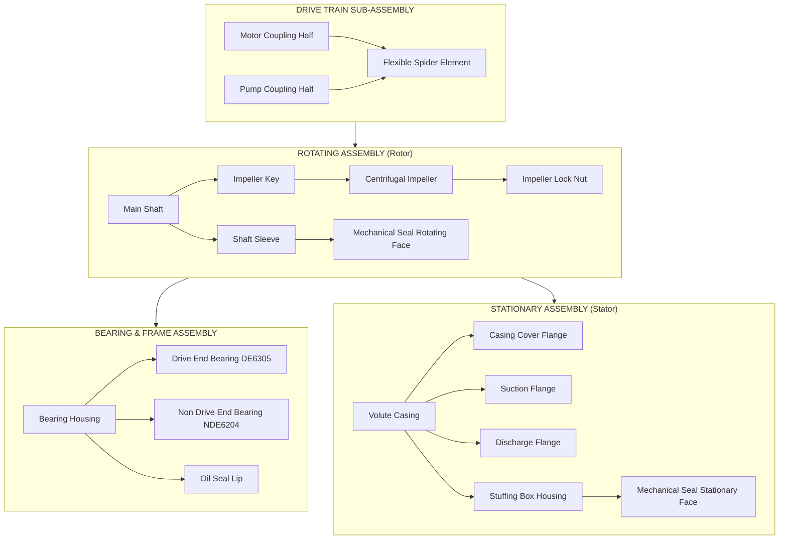

# Pump or any other machine

<!-- SECTION_1_START -->

# Module 12: Assembly Demonstration — Dissembling and Assembling of a Pump

## 1.1 Formal Academic Definition (KTU 2024 Syllabus Terminology)

> [!IMPORTANT]
> **Pump (Workshop Demonstration Context):** A *centrifugal pump* is a rotodynamic mechanical device that uses an **impeller** rotating at high speed to transfer kinetic energy from the driving motor to the working fluid, thereby converting mechanical energy into hydraulic (pressure + kinetic) energy. In the Engineering Workshop (GCESL106) lab, students perform controlled **dissembly (stripping down to constituent sub-assemblies)** and subsequent **reassembly** of a bench-mounted centrifugal pump trainer unit to develop hands-on competency in mechanical fitments, fastening sequences, and pre-commissioning inspection protocols.

> [!NOTE]
> **KTU 2024 Scheme Alignment:** Module 12 belongs to the *Mechanical Practice & Machine Elements* cluster of GCESL106. The Course Outcome (CO) mapped is **CO4 – Apply standard workshop practices to disassemble, inspect, and reassemble basic mechanical machines and pumps, recording observations in the workshop record.**

## 1.2 Conceptual Analogy — The "Heart of the Pipeline"

Imagine a centrifugal pump as the **heart of a fluid-circulation system**, exactly like the human heart pumps blood through arteries. The **impeller** is the *left ventricle* — it gives the fluid a strong "push" outward, and the **casing (volute)** acts like the *arterial walls*, gradually slowing the fluid and converting its speed into pressure. Without the pump, fluid in a long pipe would simply sit stagnant (or trickle downhill) just as blood would not circulate without a heartbeat.

> [!TIP]
> **Workshop Memory Hook:** *Suck–Spin–Squash*
> - **Suck** → low pressure at the eye (centre) of the impeller pulls fluid **in**.
> - **Spin** → impeller blades fling fluid **outward** (centrifugal effect).
> - **Squash** → volute casing decelerates fluid, converting **velocity head → pressure head**.

## 1.3 Governing Physical Constants and Standard Metrics

| Parameter | Symbol | Typical Workshop Value | Unit |
|---|---|---|---|
| Standard atmospheric pressure | $P_{atm}$ | **$1.013 \times 10^5$** | Pa (N/m²) |
| Acceleration due to gravity | $g$ | **$9.81$** | m/s² |
| Density of water (at 25 °C) | $\rho$ | **$997$** | kg/m³ |
| Specific weight of water | $\gamma = \rho g$ | **$9790$** | N/m³ |
| Workshop bench pump discharge (typical) | $Q$ | $0.5 - 5$ | L/s |
| Typical speed of small centrifugal pump | $N$ | **$1450$ or $2900$** | rpm |

## 1.4 Why This Topic Matters in KTU Examinations

- It is a **mandatory viva + record evaluation** topic carrying direct weightage in the **internal practical assessment (40 marks)** of GCESL106.
- Questions frequently appear on **labelled diagrams, identification of parts, assembly sequence, and the reason for tightening the impeller nut in a specific direction.**

> [!VISUALIZATION CONTROL]
> **Concept:** Centrifugal pump head–discharge ($H$ vs $Q$) curve shape.
> **GeoGebra / Desmos Input Equations:**
> * $H(Q) = H_0 - k \cdot Q^2$ with $H_0 = 20$ m, $k = 0.5$ (typical small pump).
> **Visual Description:** A downward-opening parabolic curve — head decreases as flow rate increases, with shut-off head at $Q=0$ and free-delivery at $H=0$. The **Best Efficiency Point (BEP)** sits at roughly $60{-}70\%$ of $Q_{max}$.

<!-- SECTION_1_END -->

<!-- SECTION_2_START -->

# 2. Deep Theoretical Analysis & KTU High-Yield Cheat Sheet

## 2.1 Working Principle — Euler's Turbomachinery Equation

The energy transfer per unit weight of fluid in a centrifugal pump is governed by **Euler's equation**:

$$
H_{theoretical} = \frac{U_2 \cdot V_{w2} - U_1 \cdot V_{w1}}{g}
$$

For a pure radial-entry impeller, $V_{w1} \approx 0$, so the equation simplifies to the **most-asked form** in KTU viva:

$$
H_{th} = \frac{U_2 \cdot V_{w2}}{g}
$$

where:
- $U_2$ = tangential velocity of impeller at outlet $= \dfrac{\pi D_2 N}{60}$
- $V_{w2}$ = whirl (tangential) component of absolute velocity at outlet
- $g$ = acceleration due to gravity

> [!NOTE]
> **Why the impeller spins one way but the nut is reverse-threaded on the *shaft-side opposite the rotation*.** The factory reverses the impeller nut thread so that the impeller cannot self-unscrew during operation — this is a common KTU viva question.

## 2.2 Component-by-Component Breakdown

| # | Component | Function | Workshop Identification Cue |
|---|---|---|---|
| 1 | **Suction pipe (with foot valve + strainer)** | Draws fluid into pump; foot valve prevents back-flow when pump stops | Located on the axial inlet side, dipped in sump |
| 2 | **Casing / Volute chamber** | Collects fluid leaving impeller, converts kinetic energy → pressure energy | Spiral-shaped (snail-shell), single cast piece |
| 3 | **Impeller** | Rotating member that imparts kinetic energy to fluid | Curved-blade disc, mounted on shaft, key-fitted |
| 4 | **Shaft** | Transmits torque from motor coupling to impeller | Cylindrical, runs through bearing housing |
| 5 | **Bearings (ball bearings)** | Support shaft radially + axially; reduce friction | Found inside bearing housing at both ends |
| 6 | **Mechanical seal / Gland packing** | Prevents leakage along shaft where it exits the casing | Located at the *casing–shaft* interface |
| 7 | **Shaft sleeve** | Protects shaft from wear caused by packing; replaceable wear part | Thin cylindrical sleeve slipped over shaft |
| 8 | **Casing cover (back plate)** | Allows access to impeller; houses the stuffing box | Bolted to the front face of the volute |
| 9 | **Coupling + Coupling guard** | Connects pump shaft to motor shaft; guard is a **mandatory safety item** | Found at the drive end, between pump and motor |
| 10 | **Foundation bolts / Base plate** | Rigidly mount the pump–motor set to the workshop bench | Four bolts at the corners of the cast base |

## 2.3 KTU High-Yield Formula Sheet

| # | Formula / Rule | Engineering Meaning | Typical Use in Exam |
|---|---|---|---|
| 1 | $H = \dfrac{p}{\rho g} + \dfrac{V^2}{2g} + z$ | Bernoulli's total head | Identifying suction/ delivery head |
| 2 | $Q = A \cdot V$ | Discharge = area × velocity | Calculating flow through suction pipe |
| 3 | $NPSH_{available} = \dfrac{P_{atm}}{\rho g} - \dfrac{P_{vapor}}{\rho g} - h_s$ | Net Positive Suction Head | Avoid cavitation during start-up |
| 4 | $\eta = \dfrac{\rho g Q H}{P_{shaft}}$ | Pump efficiency | Workshop performance test |
| 5 | Specific speed $N_s = \dfrac{N \sqrt{Q}}{H^{3/4}}$ | Geometric similarity | Selects impeller type |
| 6 | **Reverse-thread rule** | Impeller nut threads **opposite to rotation** | Viva: *Why?* |
| 7 | Tightening sequence: **cross / star pattern** | Even gasket compression | Prevents leakage |
| 8 | Torque order: **inside → outside** on casing bolts | Distributes load evenly | Assembly step |

## 2.4 Real-World Utility (Why Engineers Care)

- **HVAC & Water Supply:** Centrifugal pumps pressurize water in high-rise buildings; a maintenance engineer who cannot disassemble/assemble one cannot diagnose wear.
- **Power Plants:** Boiler feed pumps (a centrifugal pump variant) operate at 3000+ rpm and 200 bar; identical assembly principles at higher precision.
- **Process Industry:** Petrochemical refineries use API-610 centrifugal pumps — same disassembly logic, just heavier tolerances.
- **Automotive:** Car water pumps and oil pumps are mini-centrifugal pumps with identical sealing technology.

<!-- SECTION_2_END -->

<!-- SECTION_3_START -->

# 3. Step-by-Step Dissembly, Inspection, and Reassembly Procedure

## 3.1 Tools, Instruments, and Safety Gear Required

| # | Tool / Instrument | Specification / Size | Purpose | Quantity |
|---|---|---|---|---|
| 1 | **Spanner set (open-ended + ring)** | Metric: 8–24 mm | Loosening/tightening nuts, bolts | 1 set |
| 2 | **Allen (hex) key set** | 1.5 – 10 mm | Socket-head cap screws on coupling | 1 set |
| 3 | **Screwdriver set** | Slotted + Phillips, insulated | Coupling guard, nameplate | 1 set |
| 4 | **Puller (bearing / impeller puller)** | 2-jaw, 100 mm reach | Removing impeller without damage | 1 |
| 5 | **Feeler gauge** | 0.05 – 1.0 mm | Checking impeller–casing clearance | 1 |
| 6 | **Dial gauge (DTI)** | 0.01 mm resolution, 0–10 mm travel | Checking shaft run-out | 1 |
| 7 | **Soft hammer (mallet)** | Brass / nylon head | Tapping shafts loose | 1 |
| 8 | **Cleaning tray + kerosene** | 300 × 200 mm tray | Degreasing parts | 1 |
| 9 | **Lint-free cloth** | Workshop grade | Wiping, drying | 2 |
| 10 | **Vernier caliper** | 0–150 mm, 0.02 mm | Measuring shaft, sleeve | 1 |
| 11 | **Personal Protective Equipment (PPE)** | Safety goggles, cotton gloves, closed-toe shoes | Mandatory safety | 1 set |
| 12 | **Workbench vice (bench-mounted)** | 100 mm jaw | Holding shaft/coupling | 1 |

> [!WARNING]
> **KTU Safety Rule — Non-Negotiable:** The **electrical isolator (MCB)** of the pump-motor set must be in the **OFF** position and **locked-out / tagged-out (LOTO)** before any disassembly begins. **The coupling guard must NEVER be removed while the motor is energized.**

## 3.2 Pre-Disassembly Inspection Checklist

| Step | Action | Record (Yes/No + Observation) |
|---|---|---|
| 1 | Note nameplate data: $Q$, $H$, $N$, kW, make, sr. no. | |
| 2 | Rotate shaft by hand — listen for **grinding / rubbing** sound | |
| 3 | Check for **visible leakage** at stuffing box / mechanical seal | |
| 4 | Measure **axial end-play** of shaft using a dial gauge | |
| 5 | Measure **radial shaft run-out** — should be $< 0.05$ mm for a healthy pump | |
| 6 | Photograph the **as-found** assembly from three angles for the record | |

## 3.3 Exhaustive Disassembly Procedure (10 Steps)

> [!NOTE]
> Numbered steps below must be followed **strictly in order**; skipping a step will jam the next one. Mark and bag every fastener in the order removed.

**Step 1 — Isolate the Pump**
- Switch OFF the MCB, apply the LOTO padlock, place a **"DO NOT START"** tag.
- Close the **suction valve** and **delivery valve**. Open the **drain plug** to empty the casing.

**Step 2 — Remove the Coupling Guard**
- Unscrew the two M6 bolts holding the perforated metal guard.
- Slide the guard out; do **not** deform it. Keep all bolts in a labelled tray.

**Step 3 — Decouple the Pump from the Motor**
- Mark alignment marks across both coupling halves using a **scriber** so reassembly is easier.
- Loosen the four coupling bolts gradually in a **cross pattern**.
- Slide the pump half of the coupling off the shaft. Support the shaft end to prevent scratching.

**Step 4 — Remove the Casing Drain Plug and Volute Cover Bolts**
- Place a tray under the drain. Use a ring spanner on each of the **casing cover bolts** (typically 6–8 numbers).
- Loosen bolts in the **reverse sequence** of the tightening pattern — i.e., start from the outermost bolt and work inward in a star pattern.

**Step 5 — Lift Off the Casing / Volute Cover**
- Tap gently with a soft mallet if seized. Use a **pry bar** only against the flange face, never against the machined sealing surface.
- Lift the cover **straight up** to avoid damaging the shaft sleeve.

**Step 6 —Extract the Shaft–Impeller Assembly**
- Pull the assembly carefully out of the back plate.
- If the impeller is stuck on the shaft (corrosion), use the **hydraulic puller** — never a hammer strike.
- Place the assembly on a clean wooden V-block on the bench.

**Step 7 — Remove the Impeller Nut**
- The impeller nut is usually **left-hand threaded** if the impeller rotates clockwise (viewed from the coupling end). Hold the shaft with a strap wrench, then unscrew the nut.
- Note: The impeller-key and keyway are a critical fit; do not lose the **Woodruff key / parallel key**.

**Step 8 — Slide Off the Shaft Sleeve and Mechanical Seal**
- The mechanical seal is a **precision consumable**. Inspect for scoring on the carbon face; replace if the lapped face is scored $> 0.5$ mm in length.
- The shaft sleeve is a **press-fit**; use the puller if it resists hand removal.

**Step 9 —Remove the Bearings**
- Use the bearing puller with both jaws engaged on the inner race.
- Mark the bearings as **drive-end (DE)** and **non-drive-end (NDE)** — they are often not interchangeable.
- Measure each bearing's **bore, OD, and width** with vernier calipers; record the bearing number stamped on the outer race.

**Step 10 — Clean and Lay Out**
- Wash all parts in kerosene, wipe dry, arrange in a single layer on the bench in the **order of removal**. Photograph the layout for the record.

## 3.4 Inspection of Each Component

| # | Component | What to Check | Acceptance Criterion | Action if Failed |
|---|---|---|---|---|
| 1 | Impeller | Pitting, blade erosion, vane blockage | No pitting deeper than **0.5 mm** | Re-balance or replace |
| 2 | Shaft | Run-out, keyway burrs, wear at seal area | Run-out $< 0.03$ mm | Re-grind or replace |
| 3 | Bearings | Smooth rotation, no grit, no discoloration | Silent rotation, no play | Always replace in pairs |
| 4 | Mechanical seal | Carbon face, O-rings | No chips $> 0.5$ mm | Replace as a kit |
| 5 | Volute casing | Cracks, erosion, gasket face flatness | No cracks; flatness $< 0.1$ mm over 100 mm | Weld repair or scrap |
| 6 | Coupling | Rubber spider (if flexible) cracks, keyway wear | Spider intact, no metal-to-metal contact | Replace spider |
| 7 | Shaft sleeve | Scoring, O-ring grooves | No circumferential grooves visible | Replace sleeve |

## 3.5 Exhaustive Reassembly Procedure (10 Steps — Reverse of Disassembly)

> [!IMPORTANT]
> **Golden Rule:** Reassembly is the **exact reverse** of disassembly, but with **three new habits** — (i) **new gaskets**, (ii) **new O-rings**, (iii) **new lock-washers** at every critical joint.

**Step 1 — Press the Bearings Onto the Shaft**
- Heat the bearing in an **induction heater or oil bath at 80 °C** for 10 minutes — **never** use a hammer to drive a bearing cold.
- Slide the bearing squarely onto the shaft until it seats against the shoulder.

**Step 2 — Mount the Shaft–Bearing Sub-Assembly into the Bearing Housing**
- Lower it carefully, ensuring the bearing seats in the housing bore with even circumferential contact.
- Fit the **circlip / lock-nut** for axial location.

**Step 3 — Slide the Shaft Sleeve and Fit the Mechanical Seal**
- Apply a thin film of **silicone grease** on the shaft under the seal lip; do **not** touch the carbon face with bare fingers (skin oils degrade it).
- Fit the **rotating face** to the sleeve, then the **stationary face** to the seal housing.

**Step 4 —Mount the Impeller**
- Clean the keyway, insert the key, slide the impeller until it bottoms on the shaft shoulder.
- Apply **Loctite 243** to the impeller nut threads (medium strength, oil-tolerant).
- Tighten the impeller nut to the specified torque (typically **35–50 N·m** for small pumps) using a **torque wrench**.

**Step 5 — Reinstall the Casing Cover with a NEW Gasket**
- Position a new paper / rubber gasket on the volute flange; ensure gasket holes align with bolt holes.
- Finger-tighten all cover bolts first to confirm alignment, then torque in a **star (cross) pattern from the centre outward** in two passes (50 %, then 100 % of torque).

**Step 6 — Recouple to the Motor**
- Align coupling using a **straight-edge across the outer faces** and a **feeler gauge for the gap**.
- Reuse the scribed alignment marks from Step 3 of disassembly.
- Tighten coupling bolts to the manufacturer's torque.

**Step 7 — Refit the Coupling Guard**
- This is a **legal safety item**. Both M6 bolts must be tight; the guard must rotate freely and not contact the coupling at any point.

**Step 8 — Manual Rotation Check**
- Rotate the shaft by hand **at least 5 full revolutions** — it must turn freely, with no rubbing, no binding, and no metallic sound.
- If the shaft will not turn, recheck impeller-clearance and bearing seating.

**Step 9 — Pre-Commissioning Safety Walk**
- Re-fill the **stuffing box / seal chamber** with the recommended sealant liquid.
- Open the suction valve fully; vent air through the **air-release cock** on the casing.
- Confirm the **rotation arrow** on the casing matches the intended motor rotation.

**Step 10 — Test Run**
- Energise the motor briefly (1–2 seconds), then stop. Verify rotation direction is correct (impeller should spin in the arrow direction).
- Run for 5 minutes; check for **leakage, vibration, abnormal noise, and overheating** of the bearing housing (should remain below **70 °C** by hand-test).
- Record all observations in the workshop logbook.

## 3.6 Post-Assembly Validation Equations

Calculate the **theoretical shut-off head** for a record entry:

$$
H_{shut-off} = \frac{U_2^2}{g}
$$

With $D_2 = 0.15$ m and $N = 2900$ rpm:

$$
U_2 = \frac{\pi D_2 N}{60} = \frac{\pi \times 0.15 \times 2900}{60} \approx 22.77 \text{ m/s}
$$

$$
H_{shut-off} = \frac{(22.77)^2}{9.81} \approx 52.86 \text{ m}
$$

This is the *maximum possible* head at zero flow — used in the workshop report to compare against the **actual measured** shut-off head to compute the pump's **manometric efficiency**.

<!-- SECTION_3_END -->

<!-- SECTION_4_START -->

# 4. Structural Diagrams & Schematics

## 4.1 Block-Level Functional Architecture — Pump Sub-Assemblies

## 4.2 Sequential Topology — Disassembly Flow

## 4.3 Component Layout Reference Matrix (Workshop Bench View)

| Reference Code | Part Name | Drawing Convention (KTU Record) | Top View Position |
|---|---|---|---|
| P-01 | Volute Casing | Sectioned view with hatched cut | Centre, full cross-section |
| P-02 | Impeller | Front elevation + side section | Inset, top-left |
| P-03 | Shaft | Centre-line drawing with keyway detail | Inset, bottom-left |
| P-04 | Bearing DE | Symbol: circle with ball, ISO 15 | Right side, full section |
| P-05 | Bearing NDE | Symbol: circle with ball, ISO 15 | Left side, full section |
| P-06 | Mechanical Seal | Sectioned symbol per ISO 3069 | Top-right, magnified |
| P-07 | Coupling | Half-section with spider visible | Top-centre, exploded |

> [!NOTE]
> For the **workshop record file**, students must draw a **half-sectional elevation** (front view cut along the central axis) of the pump with at least **8 parts labelled** using balloon-leader lines pointing inward toward the centre.

<!-- SECTION_4_END -->

<!-- SECTION_5_START -->

# 5. KTU 2024 Scheme Examination Question Bank

## 5.1 Part A — Short-Answer Questions (3 Marks Each)

### Question 1 `[KTU University Exam – July 2024, Model]`
**List any six major parts of a centrifugal pump and state the function of the impeller.**
*CO4 | RBT Level: Remember*

**Model Answer (Valuation Key, 3 Marks):**
1. **Suction pipe with foot valve** – Draws water into the pump and prevents back-flow when pump is off. *(½ mark)*
2. **Volute casing** – Converts kinetic energy of water leaving the impeller into pressure energy. *(½ mark)*
3. **Impeller** – Rotating member that imparts kinetic energy to the fluid by centrifugal action. *(1 mark)*
4. **Shaft** – Transmits torque from motor coupling to the impeller. *(½ mark)*
5. **Bearings (DE & NDE)** – Support the shaft radially and axially, reducing friction. *(½ mark)*
6. **Mechanical seal / Gland packing** – Prevents leakage of fluid along the shaft. *(½ mark — full marks for naming impeller function)*

> [!WARNING]
> **Examiner's Pitfall:** Students often confuse the *function of the impeller* with the *function of the casing*. The impeller **imparts kinetic energy**; the casing **converts it to pressure**. Writing "impeller creates pressure" costs a full mark.

### Question 2 `[KTU University Exam – Dec 2023, Model]`
**Why is the impeller nut of a centrifugal pump reverse-threaded relative to the direction of rotation?**
*CO4 | RBT Level: Understand*

**Model Answer (Valuation Key, 3 Marks):**
- During operation, the impeller rotates in a specific direction. *(1 mark)*
- The reaction torque on the impeller nut tends to **unscrew** a normal (right-hand) thread. *(1 mark)*
- Therefore the nut is provided with a **reverse (left-hand) thread** so that the rotational reaction **tightens** it further, preventing self-loosening. *(1 mark)*

> [!WARNING]
> **Examiner's Pitfall:** Do not answer vaguely like "to prevent loosening." You must state the **mechanism** — i.e., the **direction of the reaction torque** and how the **opposite thread converts loosening tendency into tightening action**.

---

## 5.2 Part B — 14-Mark Questions (Module Internal Choice)

### Question A (14 Marks) `[KTU University Exam – July 2024, Module 12 Choice A]`

> **A(a) [7 Marks]** With the help of a neat labelled diagram, describe the construction and working of a centrifugal pump. Mention the energy conversion that takes place at the impeller and at the volute casing.
> *CO4 | RBT Level: Understand → Apply*

> **A(b) [7 Marks]** During a workshop demonstration, a student disassembles a bench-mounted centrifugal pump. List the **step-by-step disassembly procedure in proper sequence**, and state the **precautions** to be taken regarding (i) the mechanical seal and (ii) the bearings.
> *CO4 | RBT Level: Apply → Analyse*

**Model Answer A(a) — 7 Marks**

| Step | Content | Marks |
|---|---|---|
| 1 | **Neat half-sectional diagram** with at least **8 labelled parts** (volute, impeller, shaft, DE bearing, NDE bearing, mechanical seal, suction flange, discharge flange) — leader lines pointing inward | **2** |
| 2 | **Construction description:** Shaft supported by two bearings, impeller key-fitted to shaft, enclosed inside volute casing, mechanical seal at shaft-casing interface, suction and delivery flanges on opposite sides | **2** |
| 3 | **Working:** Motor drives shaft → impeller rotates at high speed → low pressure at impeller eye → atmospheric pressure on sump pushes water up suction pipe → water enters impeller eye → flung outward by centrifugal force → enters volute | **2** |
| 4 | **Energy conversion:** At **impeller** — *pressure energy → kinetic energy*; At **volute casing** — *kinetic energy → pressure energy* | **1** |

**Model Answer A(b) — 7 Marks**

| Step | Disassembly Action | Marks |
|---|---|---|
| 1 | Isolate MCB, apply LOTO; close suction and delivery valves; drain casing | 1 |
| 2 | Remove coupling guard, mark coupling alignment, decouple pump from motor | 1 |
| 3 | Unscrew volute cover bolts in **reverse star pattern** (outer → inner) | 1 |
| 4 | Lift off cover; withdraw shaft–impeller assembly onto a V-block | 1 |
| 5 | Hold shaft with strap wrench, remove impeller nut (note reverse thread) | 1 |
| 6 | Slide off shaft sleeve and mechanical seal; pull bearings using a proper puller | 1 |
| 7 | **Precautions — Mechanical seal:** Never touch the lapped carbon face with bare fingers (oils degrade it); never reuse a damaged seal. **Bearings:** Always use a puller on the inner race; never strike with a hammer; mark DE vs NDE; replace in pairs | 1 |

---

### Question B (14 Marks) `[KTU University Exam – Dec 2023, Module 12 Choice B]`

> **B(a) [7 Marks]** Explain the **step-by-step reassembly procedure** of a centrifugal pump after a complete overhaul. Highlight three "new-habit" practices that distinguish a proper reassembly from a casual one.
> *CO4 | RBT Level: Apply*

> **B(b) [7 Marks]** During the post-assembly test run of the pump, the following observations are made:
>  - Discharge $Q = 2.0$ L/s
>  - Measured total head $H = 18$ m
>  - Input electrical power = 1.1 kW, motor efficiency = 85 %
>  - Impeller outer diameter $D_2 = 0.15$ m, speed $N = 2900$ rpm
>
> Calculate: (i) shaft power input to pump, (ii) water power output, (iii) overall pump efficiency, (iv) impeller tip speed, (v) theoretical shut-off head.
> *CO4 | RBT Level: Apply → Evaluate*

**Model Answer B(a) — 7 Marks**

| Step | Reassembly Action | Marks |
|---|---|---|
| 1 | Press new bearings onto shaft using **oil-bath heating at 80 °C**, never hammer cold | 1 |
| 2 | Mount shaft–bearing sub-assembly into bearing housing; secure with circlip | 1 |
| 3 | Fit new mechanical seal: apply silicone grease on shaft under the rotating face; do not touch the carbon face with bare fingers | 1 |
| 4 | Mount impeller with key; tighten impeller nut with **torque wrench to 35–50 N·m**; apply Loctite 243 | 1 |
| 5 | Place a **NEW gasket** on the volute flange; torque cover bolts in **star pattern from centre outward** in two passes | 1 |
| 6 | Recouple pump to motor using scribed alignment marks; refit coupling guard | 1 |
| 7 | **Three "new-habit" practices:** *(a) Always use **new gaskets and O-rings***; *(b) Always use **new lock-washers** on critical joints***; *(c) Always **re-torque** casing bolts in the **star pattern** and **rotate the shaft by hand** before energizing** | 1 |

**Model Answer B(b) — 7 Marks**

**Given:**
$Q = 2.0$ L/s $= 0.002$ m³/s,
$H = 18$ m,
$P_{elec} = 1.1$ kW,
$\eta_{motor} = 0.85$,
$D_2 = 0.15$ m,
$N = 2900$ rpm,
$\rho = 997$ kg/m³,
$g = 9.81$ m/s²

**(i) Shaft power input to pump**

$$
P_{shaft} = P_{elec} \times \eta_{motor} = 1.1 \times 0.85 = 0.935 \text{ kW}
$$

**[Calculation: 1 Mark] [Final Value: 0.5 Mark]**

**(ii) Water power output**

$$
P_{water} = \rho \, g \, Q \, H = 997 \times 9.81 \times 0.002 \times 18
$$

$$
P_{water} = 351.95 \text{ W} \approx 0.352 \text{ kW}
$$

**[Formula statement: 1 Mark] [Final value: 0.5 Mark]**

**(iii) Overall pump efficiency**

$$
\eta_{pump} = \frac{P_{water}}{P_{shaft}} = \frac{0.352}{0.935} \approx 0.3765 \approx 37.65\%
$$

**[Formula: 0.5 Mark] [Value: 0.5 Mark]**

**(iv) Impeller tip speed**

$$
U_2 = \frac{\pi D_2 N}{60} = \frac{\pi \times 0.15 \times 2900}{60} = 22.77 \text{ m/s}
$$

**[Formula: 0.5 Mark] [Value: 0.5 Mark]**

**(v) Theoretical shut-off head**

$$
H_{shut-off} = \frac{U_2^2}{g} = \frac{(22.77)^2}{9.81} = \frac{518.47}{9.81} \approx 52.85 \text{ m}
$$

**[Formula: 0.5 Mark] [Value: 0.5 Mark]**

> [!WARNING]
> **KTU Examiner's Valuation Warning:**
> 1. **Unit conversion of $Q$** — students often write $2.0$ L/s directly into $\rho g Q H$, producing a wildly wrong answer. Always convert to m³/s first.
> 2. **Motor efficiency** — some students ignore the motor efficiency and use $P_{elec}$ directly as $P_{shaft}$. This costs 1 full mark.
> 3. **Star-pattern tightening** — stating "tighten the bolts" without specifying *star pattern from centre outward* loses 0.5 mark.
> 4. **Labelled diagram** — a diagram with fewer than **8 labels** is marked down to a maximum of **1 mark out of 2** for the figure.
> 5. **Pre-commissioning rotation check** — students frequently forget the "rotate shaft by hand before energizing" step; this is a 1-mark loss in reassembly questions.

---

## 5.3 Topic Recap & Important Things to Remember

> [!TIP]
> **Rapid Revision Checklist — Module 12 (Pump Assembly Demonstration)**

- **Centrifugal pump working principle:** *centrifugal force* imparts kinetic energy to fluid; volute converts velocity head → pressure head.
- **Key Euler equation:** $H_{th} = U_2 V_{w2} / g$, simplified for radial entry as $H_{th} = U_2^2 / g$ at shut-off.
- **Reverse-thread rule:** Impeller nut is **opposite-threaded** to rotation so the reaction torque *tightens*, not loosens, the nut.
- **Tool-of-choice for bearings:** **Hydraulic/2-jaw puller on the inner race** — *never a hammer* (cold mounting) and *never direct flame*.
- **Bearing heating rule:** Oil-bath / induction heater at **80 °C** for 10 minutes before press-fit.
- **Mechanical seal rule:** **Never touch the carbon face with bare fingers**; skin oil degrades the lapped surface.
- **Bolt-tightening rule:** **Star (cross) pattern, centre → outside, in two torque passes (50 % then 100 %).**
- **Reassembly golden rule:** **New gaskets + New O-rings + New lock-washers** at every critical joint.
- **Pre-energizing check:** Rotate shaft by hand **at least 5 revolutions**; if it binds, recheck impeller clearance and bearing seating.
- **Safety hierarchy:** **LOTO** → **drain** → **guard off** → **decouple** → **disassemble**. Reverse the entire chain on reassembly.
- **Identification cues:** Volute is *spiral-shaped*; impeller is *blade-disc on shaft*; bearings sit in a *cast housing*; mechanical seal sits at the *casing-shaft interface*.
- **Acceptance criteria:** Shaft run-out $< 0.05$ mm; bearing housing temperature $< 70$ °C; no visible leakage during 5-min test run.
- **Top three viva questions KTU examiners ask:**
  1. *"Why is the impeller nut reverse-threaded?"* — Answer: to prevent self-loosening under reaction torque.
  2. *"Why do you tighten in a star pattern?"* — Answer: to ensure even gasket compression and prevent leakage paths.
  3. *"Why must the mechanical seal be replaced and not reused?"* — Answer: the lapped carbon face is consumable and degrades after one duty cycle.
- **Commonly confused terms** *(viva trap)*:
  - *Impeller* ≠ *Casing* — energy is *added* at the impeller, *converted* at the casing.
  - *DE bearing* = drive-end (motor side); *NDE bearing* = non-drive-end (coupling side).
  - *Stuffing box* ≠ *Mechanical seal* — stuffing box uses packing + gland; mechanical seal uses spring-loaded lapped faces.

<!-- SECTION_5_END -->
