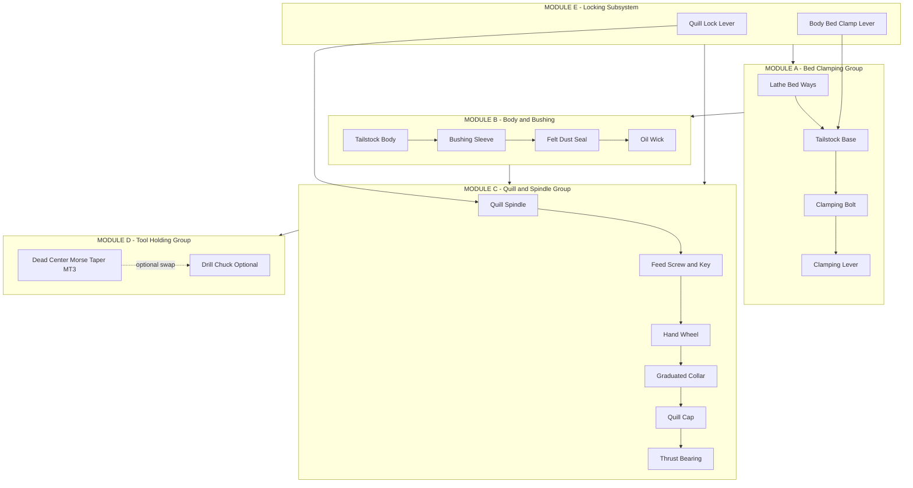
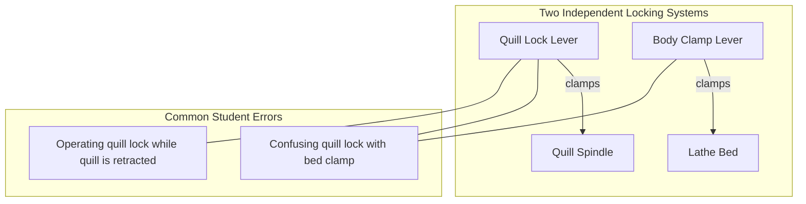

# Tail stock assembly

<!-- SECTION_1_START -->
# Tail Stock Assembly — Engineering Workshop (GCESL106)

## 1. Core Technical Definition & Intuitive Overview

**Definition (KTU 2024 Syllabus Aligned):**
The **Tail Stock** is a movable auxiliary casting mounted on the **bed ways** of a lathe, located opposite to the headstock. It supports the **free end of the workpiece** during turning, drilling, reaming, and threading operations. The **tail stock assembly** consists of a cast iron body, a sliding **quill/spindle**, a **hand wheel** for quill feed, a **graduated collar** for depth control, a **dead/live center**, and a **locking arrangement** (clamping lever and screw).

> [!IMPORTANT]
> **KTU Module 12 Focus:** The syllabus mandates **demonstration only** of *dismantling* and *assembling* of the tail stock. Students are expected to **identify components, understand the sequence of disassembly, recognize fastening methods, and observe lubrication points** — not perform precision fitting.

### Conceptual Analogy / Intuition

Imagine you are **threading a long stick** through two rotating rollers (one on each end). The left roller (headstock) **drives** the stick with a chuck and power, while the right roller (tailstock) only **holds the other end steady** like a **second hand supporting a microphone stand** so it does not wobble. If the stick is long and heavy, the second hand pushes the tip upward via a **pointed pin (dead center)** and locks the joint with a **thumb screw (clamping lever)**.

In the same way:
- The **dead center** (pointed pin) holds the free end of the rotating workpiece.
- The **quill** slides in/out like a **piston in a cylinder** to apply pressure.
- The **hand wheel** is the **steering wheel** of that piston.
- The **graduated collar** measures **how deep** the center pushes in.
- The **clamping lever + locking screw** lock the entire tailstock to the lathe bed.

> [!NOTE]
> **KTU 2024 Highlight:** The tailstock body has **two distinct locks**:
> 1. **Body Lock** — clamps the tailstock to the lathe **bed** (movement lock).
> 2. **Spindle/Quill Lock** — clamps the quill inside the body (extension lock).
> Confusing these two is a common board-exam error.

### Standard Specifications (KTU Workshop Convention)

| Parameter | Standard Metric |
|---|---|
| Quill travel | **100 – 150 mm** |
| Quill diameter (MT — Morse Taper) | **MT-2 / MT-3 / MT-4** |
| Dead center point angle | **60° (standard)** |
| Bed-way contact | **Inverted-V + flat (prismatic)** |
| Material of body | **Cast Iron (Grade FG 200)** |

> [!VISUALIZATION CONTROL]
> **Concept:** Free-body layout of tailstock on lathe bed
> **Reference Plane Visualization:**
> - **X-axis:** Lathe spindle axis (headstock → tailstock).
> - **Y-axis:** Vertical (bed up).
> - **Z-axis:** Cross-slide direction.
> **Visual Description:** Picture a long rectangular block (bed) with a large box on the left (headstock) and a smaller movable box on the right (tailstock) carrying a thin horizontal rod (quill) ending in a sharp point (dead center) touching the right end-face of a long cylinder (workpiece).

<!-- SECTION_1_END -->

<!-- SECTION_2_START -->
## 2. Deep Theoretical Analysis & KTU High-Yield Reference Sheet

### 2.1 Functional Role of Tail Stock

1. **Support long workpieces** — prevents deflection/sagging of slender shafts.
2. **Hold dead center** — supports the free end allowing turning between centers.
3. **Hold drill bits / reamers** — the quill accepts a Morse taper shank to perform drilling without a separate drilling machine.
4. **Apply axial thrust** — for light feeding and depth-controlled operations.
5. **Maintain concentricity** — keeps the workpiece **coaxial with the spindle axis**.

### 2.2 Major Sub-Assemblies

The tailstock is logically divided into **4 functional modules**:

**Module A — Body & Base (Bed Clamping Group)**
- Tailstock body
- Base with bottom V-groove
- Clamping lever (handle)
- Clamping screw / bolt
- Set screw (alignment to lathe axis)

**Module B — Spindle Group (Quill Movement)**
- Quill / spindle (hollow, with internal Morse taper)
- Bushing sleeve
- Graduated collar (dial)
- Hand wheel
- Hand wheel pinion / key
- Spring-loaded ratchet / friction mechanism

**Module C — Locking Group**
- Spindle (quill) lock lever
- Quill locking screw / eccentric
- Body clamping lever to bed

**Module D — Tool-Holding Group**
- Dead center (60° point, MT shank)
- Live center (optional)
- Drill chuck with MT arbor

### 2.3 Engineering Utility in Manufacturing

> [!NOTE]
> **Real-World Production Use:** The tailstock is **universally used in every turning shop** — from a small lathe in a garage to a CNC turning center. In CNC lathes, the tailstock is **servo-driven** and **automated**, but its **mechanical architecture remains identical** to a manual lathe tailstock.

### 2.4 KTU Formula / Specification Cheat Sheet

| Symbol / Term | Description | Unit | KTU Note |
|---|---|---|---|
| $D_q$ | Quill outer diameter | mm | Selected by Morse taper size |
| $L_q$ | Quill effective travel | mm | 100–150 mm typical |
| $\alpha$ | Center point included angle | degrees | **60° (standard)**, 75° for high-speed |
| MT-n | Morse Taper designation | n = 2, 3, 4 | Self-holding taper (~1.5°) |
| $F_{ax}$ | Axial thrust capacity of quill | N | Limited by hand-wheel torque |
| $R$ | Graduated collar resolution | mm/rev | e.g., 0.05 mm graduation |
| $H$ | Tailstock height to center | mm | Must equal headstock center height |

> **Important Prose-Isolation Note:** Quill length is written as $L_q$, taper designations as $MT-2$ / $MT-3$ / $MT-4$. Never write L\_q or MT-2 directly in plain text.

<!-- SECTION_2_END -->

<!-- SECTION_3_START -->
## 3. Step-by-Step Disassembly, Inspection & Reassembly Procedure

### 3.1 Tools, Fixtures & Safety Kit

| Category | Items Required | Purpose |
|---|---|---|
| Hand tools | Spanner set (12–19 mm), Screwdrivers (slotted + Phillips), Allen key set | Bolt / screw removal |
| Striking | Soft mallet (rawhide / copper) | Tap-out taper joints |
| Cleaning | Kerosene tray, wire brush, cotton waste | Degreasing parts |
| Lifting | Bench vise with soft jaws | Holding body |
| Holding | Bearing/taper extractor (drift) | Dislodging dead center |
| Measuring | Vernier caliper, feeler gauge | Verifying quill play |
| Lubrication | Spindle oil (ISO VG 32), grease (lithium based) | Lubricating quill & screw |
| Safety | Safety goggles, cotton gloves, apron | Personal protection |

> [!WARNING]
> **Safety Mandate (KTU Valuation Key Item):**
> - Always wear **safety goggles** before any striking operation.
> - **Never strike a hardened dead center** directly — use a **brass/copper drift** through the quill bottom slot.
> - **Park the tailstock** at the extreme right end of the bed before starting.
> - **Lock the bed** if the tailstock slides on an inclined surface.

### 3.2 Pre-Disassembly Observation (Marks: Step-0)

1. Identify the **machine make, model, and serial plate** of the lathe.
2. Move the **quill fully inward** and lock the spindle lock.
3. Move the **tailstock** to a clear mid-bed position and **lock the bed clamp**.
4. Wipe the body exterior with cotton waste.
5. **Record observation**:
   - Quill play (radial + axial)
   - Hand-wheel rotation smoothness
   - Locking-lever function
   - Graduated collar clarity
6. **Take a photograph / sketch** showing every external control labeled.

### 3.3 Disassembly Sequence (Step-by-Step)

#### **Stage 1 — Removal of Tool-Holding Group**
1. Loosen the **dead center** by retracting the quill fully outward.
2. Push the quill all the way in (retract center inward).
3. Insert a **brass drift** through the bottom slot of the quill.
4. Tap drift gently with a mallet — the dead center pops out from the top.
5. Place the dead center on a soft cloth (do **not** drop the tip).

> [!IMPORTANT]
> The Morse taper is a **self-holding** joint. It is **not** held by a screw — it is wedged by friction. Use the **taper drift** slot at the bottom of the quill.

#### **Stage 2 — Removal of Quill Cap & Hand Wheel**
1. Unscrew the **quill cap** (top cover) using spanner.
2. Note the **thrust bearing** and the **graduated collar** beneath the cap.
3. Unscrew the **hand-wheel retaining nut** (centre bolt of hand wheel).
4. Pull the hand wheel off — observe the **key** (feather key) seated in the spindle keyway.
5. Withdraw the **pinion / feed screw** (if externally accessible) gently.

#### **Stage 3 — Withdrawal of Quill / Spindle**
1. Retract the quill **fully inward** (lock in retracted position).
2. Loosen the **quill locking lever / screw** at the rear of the body.
3. Push the quill from the rear of the body (or use a soft rod from the front).
4. The quill slides out of the body bore.
5. **Caution:** It is **heavy**; support it with both hands.

> [!NOTE]
> **KTU Examiner Tip:** The quill is **precision-ground** and **matched to the body bore**. It should **never be interchanged** between different tailstocks. Mark its original orientation.

#### **Stage 4 — Disassembly of Internal Bushing / Sleeve**
1. Inside the body, you will find a **bush / sleeve** that supports the rear of the quill.
2. Unscrew the **sleeve retaining nut** (left-hand thread in some lathes).
3. Remove the sleeve — note the **felt dust seal** and the **oil wick**.

#### **Stage 5 — Removal of Body Clamping Mechanism**
1. Loosen the **clamping lever** at the base of the tailstock.
2. Unscrew the **clamping bolt / screw** below the base.
3. Lift the tailstock body off the bed.
4. Examine the **base V-groove** for wear and burrs.

### 3.4 Inspection of Each Component

| Component | Inspection Check | Acceptance |
|---|---|---|
| Quill bore (internal taper) | Cleanliness, scoring, chips | No chips, smooth, oiled |
| Quill OD | Straightness, scratches | No scoring, free in bore |
| Dead center | Tip concentricity, 60° angle, pitting | Point sharp, no flats |
| Hand wheel | Keyway damage, free rotation | No burr, smooth |
| Graduated collar | Marking legibility, zero alignment | Clear, zero aligned |
| Body bore | Scratches, ovality | Smooth, round |
| Base V-groove | Burrs, wear ridges | Clean, square edges |
| Clamping lever | Thread soundness, cam action | Tight, no slip |
| Felt seal | Compression, oil saturation | Soft, oiled |
| Thrust bearing | Smooth rolling, no brinelling | Free, no pitting |

### 3.5 Cleaning Procedure (KTU Mandatory Step)

1. Dip all metal parts in **kerosene tray** for 10 minutes.
2. Scrub with a **soft wire brush** — not steel wool (leaves debris).
3. Wipe with **clean cotton waste**.
4. Blow-dry with compressed air (if available) or sun-dry.
5. Apply a **thin film of spindle oil** on all ground surfaces.

> [!WARNING]
> **Do not use sandpaper** on any precision surface (quill, body bore, dead center taper). Sanding destroys the **self-holding Morse taper fit**.

### 3.6 Reassembly Sequence (Reverse of Disassembly, with Care)

#### **Step 1 — Reinstall the Internal Bushing**
1. Apply a thin coat of **lithium grease** on the felt seal.
2. Insert the **felt wick** into the bushing groove.
3. Oil the bushing bore.
4. Slide the bushing into the body from the rear.
5. Tighten the **sleeve retaining nut** to snug fit (left-hand thread if applicable).

#### **Step 2 — Insert the Quill**
1. Apply **spindle oil** on the entire quill outer surface.
2. Align the quill keyway with the **feed-screw key** inside the body.
3. Slide the quill into the body bore from the **front** (taper side in).
4. Push it gently until the rear engages the bushing.

> [!NOTE]
> **Keyway Alignment:** If the quill does not slide in easily, **never hammer it**. Rotate slowly while applying gentle inward pressure until the key engages.

#### **Step 3 — Mount the Hand Wheel & Graduated Collar**
1. Place the **feather key** into the spindle keyway.
2. Slide the **graduated collar** onto the quill — align zero mark.
3. Slide the **hand wheel** over the key.
4. Tighten the **central retaining nut** with a spanner.
5. Verify the hand wheel rotates the quill **without binding**.

#### **Step 4 — Install the Quill Cap**
1. Place the **thrust bearing** on the quill rear shoulder.
2. Apply grease on the bearing rollers.
3. Screw the **quill cap** down hand-tight.
4. Lock with the **quill lock lever**.

#### **Step 5 — Reinstall the Dead Center**
1. Wipe the **Morse taper** of the dead center with a clean cloth.
2. Apply a **micro-thin oil film** (optional — many taper joints are dry).
3. Insert the dead center into the quill bore.
4. Give a **firm downward push** by hand — it should "stick" by taper friction.
5. **Test:** Pull up with hand — it should **not come out** (self-holding).

#### **Step 6 — Mount Tailstock on Bed**
1. Place tailstock on lathe bed ways.
2. Insert the **clamping bolt** from below.
3. Tighten the **clamping lever** — verify no slide under load.
4. **Align tailstock center** to headstock center using a **test bar** or **dial indicator**:
   - Coaxial alignment $\le 0.02$ mm runout at 100 mm length.
5. Tighten the **alignment set screws** at the rear of the base.

### 3.7 Functional Test After Reassembly (KTU Mandatory)

1. **Slide Test:** Move tailstock along the bed — should glide smoothly, no jerks.
2. **Quill Extension Test:** Rotate hand wheel — quill should extend/retract smoothly with **no binding or play**.
3. **Quill Lock Test:** Engage quill lock — quill should be **rock-solid** (no axial movement).
4. **Bed Lock Test:** Engage bed clamp — push tailstock laterally — **no movement**.
5. **Center Rotation Test:** Mount a workpiece between centers, rotate spindle — center should **stay concentric** (no wobble).
6. **Dial Indicator Runout:** Mount DTI on dead center — rotate spindle — total runout $\le 0.01$ mm.

> [!IMPORTANT]
> **KTU 2024 Skill Outcome:** A correctly assembled tailstock must show **zero quill play** under hand pressure and **zero bed slide** under tailstock lock.

### 3.8 Symbolic / Schematic Implementation — Python Checklist

```python
from dataclasses import dataclass, field
from enum import Enum
from typing import List


class AssemblyStage(Enum):
    PRE_DISASSEMBLY = "Pre-Disassembly Observation"
    TOOL_GROUP = "Stage 1 - Tool-Holding Group"
    HANDWHEEL = "Stage 2 - Hand Wheel & Cap"
    QUILL = "Stage 3 - Quill Withdrawal"
    BUSHING = "Stage 4 - Internal Bushing"
    BODY_CLAMP = "Stage 5 - Body Clamping"
    CLEANING = "Cleaning & Inspection"
    REASSEMBLY = "Reassembly (Reverse)"
    FUNCTIONAL_TEST = "Functional Test"


@dataclass
class Component:
    name: str
    fastener_type: str
    torque_nm: float
    lubricated: bool = False
    inspected: bool = False
    reinstalled: bool = False


@dataclass
class TailstockAssembly:
    components: List[Component] = field(default_factory=list)
    current_stage: AssemblyStage = AssemblyStage.PRE_DISASSEMBLY
    log: List[str] = field(default_factory=list)

    def add_component(self, comp: Component) -> None:
        self.components.append(comp)
        self._log(f"Component registered: {comp.name}")

    def mark_lubricated(self, name: str) -> None:
        comp = self._find(name)
        if comp is None:
            raise ValueError(f"Component {name} not found.")
        comp.lubricated = True
        self._log(f"Lubricated -> {name}")

    def mark_inspected(self, name: str) -> None:
        comp = self._find(name)
        if comp is None:
            raise ValueError(f"Component {name} not found.")
        comp.inspected = True
        self._log(f"Inspected -> {name}")

    def mark_reinstalled(self, name: str) -> None:
        comp = self._find(name)
        if comp is None:
            raise ValueError(f"Component {name} not found.")
        comp.reinstalled = True
        self._log(f"Reinstalled -> {name}")

    def advance_stage(self, stage: AssemblyStage) -> None:
        self.current_stage = stage
        self._log(f"Stage advanced -> {stage.value}")

    def functional_test(self) -> bool:
        self._log("Running functional checks...")
        checks = {
            "All components inspected": all(c.inspected for c in self.components),
            "All components lubricated": all(c.lubricated for c in self.components),
            "All components reinstalled": all(c.reinstalled for c in self.components),
        }
        for check, passed in checks.items():
            self._log(f"  {check}: {'PASS' if passed else 'FAIL'}")
        return all(checks.values())

    def _find(self, name: str):
        for c in self.components:
            if c.name == name:
                return c
        return None

    def _log(self, message: str) -> None:
        self.log.append(message)


# ---- Demonstration Run (KTU Practical Record) ----
if __name__ == "__main__":
    ts = TailstockAssembly()
    for c in [
        Component("Dead Center", "Morse Taper", 0.0),
        Component("Quill Cap", "M14 Nut", 18.0),
        Component("Hand Wheel", "M12 Nut + Key", 12.0),
        Component("Quill Spindle", "Slide Fit", 0.0),
        Component("Bushing Sleeve", "M16 Nut (LH)", 22.0),
        Component("Body Clamp Lever", "M10 Bolt", 10.0),
        Component("Thrust Bearing", "Press Fit", 0.0),
        Component("Felt Dust Seal", "Press Fit", 0.0),
    ]:
        ts.add_component(c)

    ts.advance_stage(AssemblyStage.TOOL_GROUP)
    ts.mark_inspected("Dead Center")
    ts.mark_lubricated("Dead Center")
    ts.mark_reinstalled("Dead Center")

    ts.advance_stage(AssemblyStage.HANDWHEEL)
    for c in ["Quill Cap", "Hand Wheel", "Thrust Bearing"]:
        ts.mark_inspected(c)
        ts.mark_lubricated(c)
        ts.mark_reinstalled(c)

    ts.advance_stage(AssemblyStage.QUILL)
    ts.mark_inspected("Quill Spindle")
    ts.mark_lubricated("Quill Spindle")
    ts.mark_reinstalled("Quill Spindle")

    ts.advance_stage(AssemblyStage.BUSHING)
    ts.mark_inspected("Bushing Sleeve")
    ts.mark_lubricated("Bushing Sleeve")
    ts.mark_reinstalled("Bushing Sleeve")

    ts.advance_stage(AssemblyStage.BODY_CLAMP)
    ts.mark_inspected("Body Clamp Lever")
    ts.mark_lubricated("Body Clamp Lever")
    ts.mark_reinstalled("Body Clamp Lever")

    ts.advance_stage(AssemblyStage.FUNCTIONAL_TEST)
    result = ts.functional_test()
    print("=" * 50)
    print("TAILSTOCK ASSEMBLY RESULT:", "ACCEPTED" if result else "REJECTED")
    print("=" * 50)
    for entry in ts.log:
        print("-", entry)
```

<!-- SECTION_3_END -->

<!-- SECTION_4_START -->
## 4. Structural Diagrams & Schematics

### 4.1 Mermaid — Tailstock Functional Block Architecture



### 4.2 Mermaid — Sequential Disassembly Flow


### 4.3 Mermaid — Locking Sub-System Interaction



### 4.4 Component Sectional Layout (Sequential Topology)

| Position from Front → Rear | Component | Function |
|---|---|---|
| 1 | Dead Center (60° point) | Supports free end |
| 2 | Morse Taper Bore (MT-3) | Self-holding taper fit |
| 3 | Quill Spindle (hollow) | Sliding member |
| 4 | Graduated Collar | Depth measurement |
| 5 | Thrust Bearing | Axial load transfer |
| 6 | Quill Cap (rear) | Bearing housing |
| 7 | Hand Wheel | Manual feed |
| 8 | Feed Screw + Key | Rotational-to-translational motion |
| 9 | Bushing Sleeve | Rear radial support |
| 10 | Felt Dust Seal | Chip exclusion |
| 11 | Tailstock Body (cast iron) | Main frame |
| 12 | Base + V-Groove | Bed sliding interface |
| 13 | Clamping Bolt + Lever | Bed locking |

<!-- SECTION_4_END -->

<!-- SECTION_5_START -->
## 5. KTU 2024 Scheme Examination Question Bank & Topic Recap

### Part A — Short Answer Questions (3 Marks Each)

---

**Q1. [KTU University Exam — July 2024]**
**State any three functions of the tailstock on a centre lathe.** *(CO1, Remember — 3 Marks)*

**Model Answer:**
1. Supports the **free end of long slender workpieces** to prevent deflection during turning.
2. Holds the **dead center** to enable turning between centres.
3. Holds **drill bits, reamers, and taps** (via the quill Morse taper bore) for in-situ hole-making.

> [Each correct function: 1 Mark]

---

**Q2. [KTU University Exam — Dec 2023]**
**What is the purpose of the graduated collar on the tailstock hand wheel?** *(CO1, Understand — 3 Marks)*

**Model Answer:**
The graduated collar is a **dial marked in mm/revolutions** attached to the hand wheel. It allows the operator to **measure the axial travel of the quill precisely** — for example, setting a **drilling depth** or **controlling the center-penetration** during turning. The **resolution is typically 0.05 mm**.

> [Identification of collar: 1 Mark] [Purpose of depth measurement: 1 Mark] [Resolution example: 1 Mark]

---

### Part B — Long Answer Questions (14 Marks, Internal Choice)

---

**Question A (14 Marks) — [KTU University Exam — July 2024]**

**(a)** With the help of a labelled block diagram, **list all major parts of a tailstock** and state the function of any **five** components. *(CO1, Understand — 7 Marks)*

**(b)** Explain **step-by-step the procedure to dismantle a tailstock** for inspection and cleaning. Mention the **tools used and safety precautions**. *(CO2, Apply — 7 Marks)*

**Model Solution:**

**(a) Major Parts of Tailstock — Block Layout:** *(See Section 4.1 Mermaid diagram for the schematic — 3 Marks)*

| # | Component | Function | Marks |
|---|---|---|---|
| 1 | Quill Spindle | Slides axially to support dead center | 0.5 |
| 2 | Hand Wheel | Provides manual feed to quill | 0.5 |
| 3 | Graduated Collar | Measures quill travel | 0.5 |
| 4 | Dead Center | Supports free end of workpiece | 0.5 |
| 5 | Quill Lock Lever | Locks quill in position | 0.5 |
| 6 | Body Clamp Lever | Locks tailstock to lathe bed | 0.5 |
| 7 | Thrust Bearing | Carries axial load | 0.5 |
| 8 | Bushing Sleeve | Rear radial support of quill | 0.5 |
| 9 | Felt Dust Seal | Excludes chips and dust | 0.5 |
| 10 | Base with V-Groove | Slides on lathe bed | 0.5 |

[Block diagram: 3 Marks] [Any five functions correctly described: 4 Marks @ 0.8 each]

---

**(b) Dismantling Procedure:** *(7 Marks)*

| Step | Action | Marks |
|---|---|---|
| 1 | **Pre-disassembly observation** — slide test, quill play check, hand-wheel smoothness | 1 |
| 2 | **Lock the spindle** and move tailstock to mid-bed; lock bed clamp | 0.5 |
| 3 | **Retract dead center** by hand-wheel rotation | 0.5 |
| 4 | **Use taper drift** through bottom slot of quill and tap with soft mallet to remove dead center | 1 |
| 5 | **Unscrew the quill cap** at the rear with spanner | 0.5 |
| 6 | **Remove thrust bearing** and graduated collar | 0.5 |
| 7 | **Unscrew hand-wheel retaining nut** and withdraw hand wheel + feather key | 0.5 |
| 8 | **Withdraw the quill spindle** from the body bore (support with both hands) | 0.5 |
| 9 | **Unscrew bushing sleeve nut** and remove sleeve + felt seal | 0.5 |
| 10 | **Loosen body clamping bolt** and lift tailstock off the bed | 0.5 |
| 11 | **Clean all parts in kerosene**, inspect, oil, and reassemble in reverse order | 0.5 |
| 12 | **Carry out functional test** — slide test, quill extension test, lock test, alignment test | 0.5 |

**Tools Used:** Spanner set, screwdrivers, Allen keys, taper drift, soft mallet, kerosene tray, wire brush, cotton waste, spindle oil, dial indicator. *(0.5 Mark)*

**Safety Precautions:**
- Wear **safety goggles** before any striking operation.
- **Do not strike the dead center** directly — always use a brass drift.
- **Lock the lathe spindle** and **isolate electrical power** before starting.
- **Support the quill** with both hands during withdrawal — it is heavy. *(0.5 Mark)*

> [!WARNING]
> **KTU Examiner's Valuation Warning:**
> - **Do not skip** the pre-disassembly observation step — examiners allocate 1 mark specifically for it.
> - **Mentioning the taper drift** for dead-center removal is **mandatory** (1 mark lost otherwise).
> - Confusing **quill lock** with **bed clamp** is the most common 1-mark deduction.
> - Failing to **state the safety goggles** requirement leads to a 0.5-mark penalty.

---

**Question B (14 Marks) — Alternative Choice [KTU University Exam — Dec 2023]**

**(a)** Explain the **functional test procedure** of a tailstock after it has been reassembled. List the **alignment method** to ensure coaxiality with the headstock spindle. *(CO2, Apply — 7 Marks)*

**(b)** Differentiate between a **dead center** and a **live center**. State **two applications** of the tailstock quill in lathe operations. *(CO1 + CO2, Understand — 7 Marks)*

**Model Solution:**

**(a) Functional Test Procedure:** *(7 Marks)*

| # | Test | Method | Acceptance | Marks |
|---|---|---|---|---|
| 1 | **Slide Test** | Move tailstock along the bed by hand | Smooth, no jerk | 1 |
| 2 | **Quill Extension Test** | Rotate hand wheel — quill extends/retracts | Smooth, no binding | 1 |
| 3 | **Quill Lock Test** | Lock quill, apply hand pressure | Zero axial play | 1 |
| 4 | **Bed Lock Test** | Clamp body, push laterally | Zero lateral movement | 1 |
| 5 | **Center Rotation Test** | Mount workpiece between centres, run spindle | No wobble | 1 |
| 6 | **Dial Indicator Alignment** | Mount DTI on dead center, rotate spindle | Runout $\le 0.01$ mm | 1 |
| 7 | **Coaxiality Test** | Use a **test bar** (MT-3) between headstock and tailstock centres; sweep with DTI | Concentric to spindle axis | 1 |

**Alignment Method:**
The **test-bar-and-DTI method** is used: a precision ground bar is mounted between the headstock and tailstock centres. A **dial indicator** is mounted on the carriage and swept along the bar surface. Adjust the tailstock **set screws** (rear of base) until the runout is within $\pm 0.02$ mm over a 100 mm length.

---

**(b) Dead Center vs Live Center:** *(7 Marks)*

| Parameter | Dead Center | Live Center |
|---|---|---|
| Rotation | Stationary — fixed to quill | Rotates with workpiece (bearings inside) |
| Friction | High — workpiece rubs on point | Low — bearings carry load |
| Lubrication | Requires grease at tip frequently | Pre-lubricated, sealed bearings |
| Speed | Low-speed only ($\le 200$ rpm typical) | High-speed safe |
| Heat | Generates heat — can seize | No heat at tip |
| Accuracy | Better concentricity for finishing | Slight runout from bearing clearance |
| Morse Taper | MT-2 / MT-3 | MT-3 / MT-4 with internal bearing |
| Cost | Low | Higher |

[Table comparison: 5 Marks @ 0.7 each — 8 rows of comparison, pick any 5 details]

**Two Applications of the Tailstock Quill:**
1. **Drilling axial holes** on a workpiece by mounting a **drill chuck with MT arbor** in the quill bore.
2. **Reaming** a pre-drilled hole to size for a **precision finish**.
3. **Tapping threads** by mounting a **tap holder** with a floating drive.
4. **Light counter-boring / spot-facing** on turned components.
5. **Holding a small boring bar** for finish-boring a long bore.

[Any two correct applications: 2 Marks @ 1 each]

> [!WARNING]
> **KTU Examiner's Pitfall Callout:**
> - Writing "dead center rotates" — **wrong**. Dead center is **stationary**.
> - Omitting the **Morse taper designation** — examiners expect at least one example (MT-2/MT-3).
> - Confusing **quill feed** with **carriage feed** — these are two different mechanisms.

---

### Topic Recap & Important Things to Remember

- **Tailstock** is a movable support mounted on the lathe bed, opposite the headstock.
- **Two independent locks** exist: **body lock** (clamps tailstock to bed) and **quill lock** (clamps quill inside body) — they are **not the same**.
- The **quill** is a precision-ground sliding member with an **internal Morse taper (MT-2 / MT-3 / MT-4)**.
- **Dead center** has a **60° included angle** and is held by **taper friction only** — no screw.
- **Removal of dead center** requires a **taper drift** struck through the **bottom slot** of the quill with a **soft mallet** — **never strike the dead center directly**.
- **Hand wheel + graduated collar** converts rotational input to **measurable axial feed** of the quill.
- **Thrust bearing** sits under the **quill cap** and carries axial load from the hand wheel.
- **Felt dust seal + oil wick** in the bushing prevent **chip ingress** and provide **continuous lubrication**.
- **Bushing sleeve** is the rear radial support of the quill — may have **left-hand thread**.
- **Body clamping bolt** locks the tailstock to the bed — must be checked under load.
- **Reassembly is the reverse of disassembly** — with **oil applied to ground surfaces** and **alignment verified**.
- **Functional test** has 6 mandatory checks: slide, quill extension, quill lock, bed lock, center rotation, and DTI alignment.
- **Alignment tolerance**: Tailstock center must be **coaxial with headstock spindle** within **$\pm 0.02$ mm over 100 mm**.
- **KTU safety mandate**: Always wear **safety goggles** and use a **brass/copper drift** for striking operations.
- **Common student errors**: Confusing dead vs live center, omitting taper drift step, skipping the pre-disassembly observation.
- **Feather key** in the hand wheel is **small and easily lost** — keep it in a magnetic tray.
- **Morse taper** is a **self-holding** joint — it wedges by friction, not by a fastener.

<!-- SECTION_5_END -->
