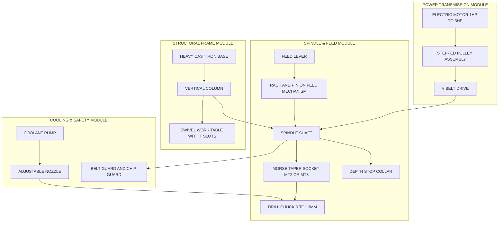
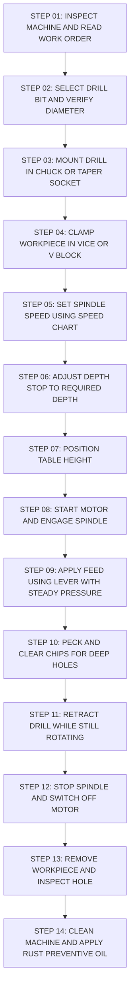
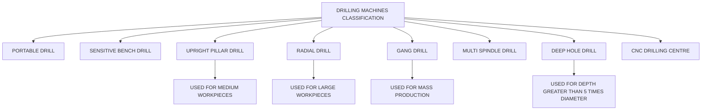
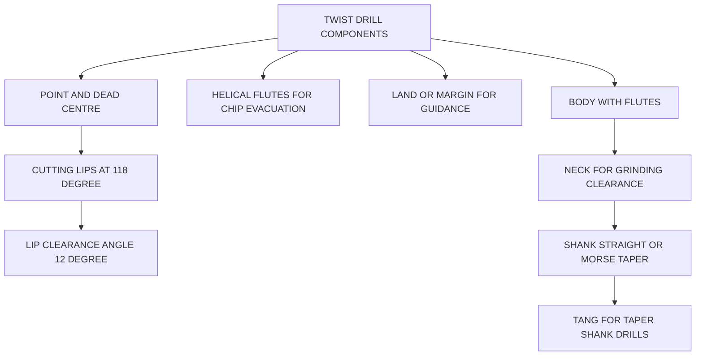
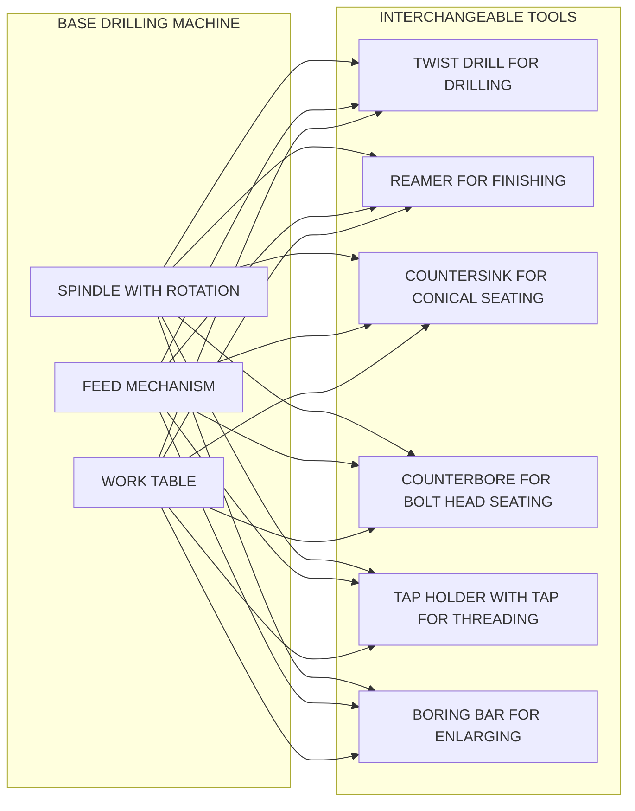

# Drilling Machine

<!-- SECTION_1_START -->

# DRILLING MACHINE

## 1.1 Formal Academic Definition (KTU 2024 Syllabus Terminology)

> [!IMPORTANT]
> **Drilling Machine:** A drilling machine (also known as a drill press) is a power-driven, stationary machine tool designed primarily to produce cylindrical holes in solid workpieces by rotating a multi-point cutting tool (the drill) against a stationary workpiece. It is one of the most fundamental and widely used machine tools in any engineering workshop, capable of performing auxiliary operations such as reaming, boring, countersinking, counterboring, and tapping when fitted with appropriate cutting tools.

According to the KTU 2024 Engineering Workshop syllabus, the drilling machine falls under the category of **"Demonstration Machines"** — students are expected to understand the principle of operation, identify the main parts, recognize the types, and comprehend the safety protocols associated with its operation without necessarily performing full production drilling.

---

## 1.2 Conceptual Analogy / Intuition

> [!NOTE]
> **Intuitive Analogy — "The Stationary Vertical Cane & the Wood Block"**
> Imagine you need to make a hole through a piece of wood. If you take a needle and try pushing it through with your hand, it will bend, slip, and rarely produce a clean, vertical hole. Now imagine clamping the wood firmly to a table and holding the needle in a guided vertical handle (like a cookie press) and rotating it with a steady downward force — suddenly, the needle goes in perfectly straight and clean. The drilling machine is exactly this principle: a **guided, powered rotational tool** that applies controlled feed (downward force) to remove material and create holes.

The drill bit itself is a **two-lip, helical cutting tool** with cutting edges at its tip. When rotated, the cutting lips shear off chips while the helical **flutes** act as an Archimedes screw to evacuate the chips from the hole. The **point angle** of the drill (typically **118°** for mild steel, **135°** for hard metals) governs the geometry of the cut.

---

## 1.3 Core Specifications & Standard Constants

The following constants and standard parameters are critical to KTU-level questions:

| Parameter | Standard Value / Unit |
|---|---|
| Standard Point Angle of Twist Drill | **118°** (general purpose) |
| Hard Material Point Angle | **135°** (e.g., for stainless steel, cast iron) |
| Standard Helix Angle of Drill | **20° – 30°** |
| Standard Morse Taper Sizes | **MT-1, MT-2, MT-3, MT-4, MT-5, MT-6** |
| Coolant used for steel drilling | **Cutting oil / soluble oil emulsion** |
| Coolant for aluminium & brass | **Soluble oil or kerosene** |
| Standard drill material | **High Speed Steel (HSS)**, Carbide (for CNC) |
| Recommended cutting speed for mild steel | **25 m/min** |
| Recommended cutting speed for cast iron | **20 m/min** |
| Recommended cutting speed for aluminium | **40 – 60 m/min** |

> [!IMPORTANT]
> **Key Concept — Material Removal Rate (MRR) for Drilling:**
> Although KTU workshop questions are mostly descriptive, the formula relating spindle speed and feed to material removal is foundational:
> $$\text{MRR} = \frac{\pi \cdot D^2 \cdot f \cdot N}{4} \quad [\text{mm}^3/\text{min}]$$
> where $D$ = drill diameter (mm), $f$ = feed per revolution (mm/rev), $N$ = spindle speed (rpm).

---

## 1.4 Geometric / Schematic Visualization

> [!VISUALIZATION CONTROL]
> **Concept:** Helical twist drill geometry — point angle, lips, flutes, and shank.
> **GeoGebra / Desmos Input Equations (2D Cross-Section):**
> * Point angle: `θ = 118°` (vertex at drill tip)
> * Lip relief angle: `α = 12°`
> * Helix angle (in 3D): `β = 30°`
> * Cross-section cone height: `h = D / (2 \cdot \tan(59°))`
> **Visual Description:** A 2D cross-section of a twist drill tip showing a sharp conical point with two symmetric cutting lips angled at 59° from the drill axis (giving the total 118° point angle). Behind the point, the helical flutes spiral upward. The body (land) and the cylindrical shank with Morse taper are visible.

---

<!-- SECTION_1_END -->

<!-- SECTION_2_START -->

# DEEP THEORETICAL ANALYSIS — PRINCIPLE, TYPES & PARTS

## 2.1 Operating Principle

A drilling machine operates on the principle of **rotary cutting with linear axial feed**:

1. The **spindle** rotates the **drill bit** at a controlled RPM.
2. The drill is advanced into the workpiece along its rotational axis (axial direction) at a controlled **feed rate** (mm/rev).
3. The two cutting lips of the drill shear off chips from the workpiece.
4. The **flutes** (helical grooves) carry the chips away from the cutting zone and allow cutting fluid to flow in.
5. After the drill passes through (or reaches the desired depth), the drill is retracted, leaving a cylindrical hole.

> [!NOTE]
> **The "Thrust + Rotation" Twin Action:** Drilling is unique because it requires *both* rotational motion (cutting) and axial thrust (penetration). This is why a drilling machine must have a rigid spindle, a powerful motor, and a robust column — to resist the axial reaction force.

---

## 2.2 Classification of Drilling Machines

Drilling machines are classified based on **size, design, and application**:

### A. Portable Drilling Machine
- Hand-held or mounted on a stand.
- Used for on-site jobs (e.g., drilling holes in ship hulls, large structural assemblies).
- Driven by electric or pneumatic motor.

### B. Sensitive Drilling Machine
- Small, bench-mounted.
- Used for very small, precise holes (diameter < 12 mm).
- Operator senses the cutting action manually (hence "sensitive").
- High spindle speeds (up to 20,000 rpm).

### C. Upright (Pillar) Drilling Machine
- Floor-mounted, medium size.
- Table can be raised/lowered on the column.
- Spindle feed is manual or automatic (via lever & rack).
- Used for medium-sized workpieces.

### D. Radial Drilling Machine
- **Most versatile** for large/heavy workpieces.
- The drilling head is mounted on a **radial arm** that can swing, rotate, and traverse horizontally.
- Workpiece remains stationary; the drill moves to the workpiece.
- Ideal for drilling multiple holes at different locations on a large plate or casting.

### E. Gang Drilling Machine
- Multiple spindles in a row.
- Each spindle performs a different operation (e.g., first spindle drills, second reams, third taps).
- Used for **mass production** of identical parts.

### F. Multi-spindle Drilling Machine
- Several drills mounted on a single head.
- Drills multiple holes simultaneously (e.g., drilling 4, 6, or 8 holes on a flange in one operation).
- Used in automotive component production.

### G. Deep Hole Drilling Machine
- Specialized for holes where depth $\geq 5 \times$ diameter.
- Uses gun drills, ejector drills, or BTA drills with high-pressure coolant.
- Used for gun barrels, hydraulic cylinders, etc.

### H. CNC Drilling / Machining Centre
- Computer-controlled, fully automated.
- Used in modern industry for high precision and repeatability.

---

## 2.3 Main Parts of a Pillar Drilling Machine (KTU High-Yield)

| # | Part | Function |
|---|---|---|
| 1 | **Base** | Heavy cast-iron foundation; supports the column; houses the motor and coolant tank. |
| 2 | **Column** | Vertical pillar that supports the table and head; provides rigidity. |
| 3 | **Table** | Flat worktable; can be raised/lowered and rotated; has T-slots for clamping work. |
| 4 | **Spindle** | Rotating shaft that holds the drill; provides the rotational motion. |
| 5 | **Spindle Nose / Chuck** | Holds the drill (via drill chuck or Morse taper socket). |
| 6 | **Drill Chuck** | 3-jaw self-centering chuck that grips round shanks of drills. |
| 7 | **Head / Quill** | Houses the spindle and feed mechanism. |
| 8 | **Feed Lever** | Lever used by the operator to apply downward feed; connected to the spindle via rack & pinion. |
| 9 | **Depth Stop** | Adjustable collar that limits the depth of the drilled hole. |
| 10 | **Motor & Pulley System** | Provides rotational power; stepped pulleys allow speed changes. |
| 11 | **Coolant Pump & Pipe** | Supplies cutting fluid to the drill point. |
| 12 | **Swivel Table** | Allows angular drilling (compound table). |

---

## 2.4 KTU Formula Sheet — Drilling Machine Calculations

> [!NOTE]
> For KTU 2024 Workshop questions, the following are the most frequently asked formulas. Use `\vert` instead of `|` to avoid breaking markdown tables.

| Quantity | Formula | Description |
|---|---|---|
| Spindle Speed | $N = \dfrac{1000 \cdot V_c}{\pi \cdot D}$ | $N$ in rpm, $V_c$ in m/min, $D$ in mm |
| Cutting Velocity | $V_c = \dfrac{\pi \cdot D \cdot N}{1000}$ | $V_c$ in m/min |
| Feed Rate (table feed) | $f_{\text{rate}} = f \cdot N$ | $f$ in mm/rev, result in mm/min |
| Material Removal Rate | $\text{MRR} = \dfrac{\pi \cdot D^2 \cdot f \cdot N}{4}$ | mm³/min |
| Drilling Time | $T = \dfrac{L}{f \cdot N}$ | $L$ = total hole length in mm |
| Thrust Force (approx.) | $F_t = K_s \cdot A_p$ | $K_s$ = specific cutting force (N/mm²); $A_p = D \cdot f$ |
| Power Required | $P = \dfrac{F_c \cdot V_c}{60\,000}$ | $P$ in kW, $F_c$ in N, $V_c$ in m/min |

---

## 2.5 Real-World Engineering Utility

> [!IMPORTANT]
> Drilling machines are **the workhorses of every fabrication shop**:
> * In **automotive manufacturing** — drilling bolt holes in engine blocks, gearboxes, chassis.
> * In **aerospace** — drilling rivet holes in aircraft wings (often on radial or CNC machines).
> * In **civil construction** — making holes for anchor bolts in steel structures.
> * In **tool rooms and workshops** — for prototyping, repair, and one-off jobs.
> * In **mass production** — gang and multi-spindle machines are used for producing thousands of identical components daily.
> * In **heavy industry** — radial drilling machines drill holes in large castings that cannot be moved easily.
>
> Without the drilling machine, **bolt fastening, riveting, assembly, and fluid/gas line connections would be impossible** in modern engineering.

---

## 2.6 Drilling Tool — The Twist Drill (Anatomy)

The **twist drill** is the most common drilling tool. Its anatomy is critical for KTU theory:

| Component | Function |
|---|---|
| **Point / Dead Centre** | The very tip of the drill; ideally a sharp pointed cone. |
| **Cutting Lips** | Two edges that do the actual cutting; must be of equal length for balanced cutting. |
| **Point Angle** | Angle between the two cutting lips; **118°** standard. |
| **Lip Clearance Angle** | Relief angle behind the cutting edge (typically **12° – 15°**); prevents rubbing. |
| **Flutes** | Helical grooves that carry chips out of the hole. |
| **Land (Margin)** | Narrow cylindrical band along the flutes that guides the drill in the hole. |
| **Body** | Main length of the drill with flutes. |
| **Neck** | Reduced-diameter section; provides clearance for grinding. |
| **Shank** | The holding end; can be straight, tapered (Morse taper), or reduced. |
| **Tang** | A flat tang at the end of a tapered shank; prevents slipping in the spindle socket. |

---

## 2.7 Drilling Operations

A drilling machine can perform several operations by using different tools:

| Operation | Tool Used | Description |
|---|---|---|
| **Drilling** | Twist drill | Producing a cylindrical hole. |
| **Reaming** | Reamer | Finishing an already-drilled hole to precise size and finish. |
| **Boring** | Boring bar | Enlarging an existing hole. |
| **Counterboring** | Counterbore | Flat-bottomed enlargement of a hole to seat a bolt head. |
| **Countersinking** | Countersink | Conical enlargement of a hole to accept a flat-head screw. |
| **Tapping** | Tap (held in tap holder) | Cutting internal threads. |
| **Spot Facing** | Spot-facer | Trimming a small flat surface around a hole. |
| **Grinding (with mounted wheels)** | Mounted grinding point | Light grinding in tight spaces. |

---

## 2.8 Work-Holding Devices on a Drill Press

> [!IMPORTANT]
> Proper work-holding is **non-negotiable for safety**. A loose workpiece can spin and cause serious injury.

| Device | Use |
|---|---|
| **Machine Vise** | Most common; bolted to the table via T-slots. |
| **V-Blocks with Clamps** | For cylindrical workpieces (shafts, rods). |
| **Step Clamps & Studs** | For larger or irregularly shaped work. |
| **Angle Plates** | For holding parts at 90° to the table. |
| **Drill Jigs** | Custom-built fixtures for production; ensure hole location accuracy. |
| **Strap Clamp (with packing)** | For thin sheets; the packing prevents the sheet from bending. |

---

## 2.9 Speeds and Feeds — Recommended Values (KTU Reference)

| Material | Cutting Speed $V_c$ (m/min) | Feed $f$ (mm/rev) for $\Phi$10 mm drill |
|---|---|---|
| Mild Steel | 25 – 30 | 0.10 – 0.18 |
| Cast Iron | 15 – 25 | 0.08 – 0.15 |
| Aluminium | 40 – 80 | 0.15 – 0.30 |
| Brass | 30 – 60 | 0.12 – 0.25 |
| Stainless Steel | 10 – 20 | 0.05 – 0.10 |
| Hard Wood | 50 – 100 | 0.20 – 0.50 |

> [!NOTE]
> **Rule of Thumb:** As drill diameter increases, the feed per revolution also increases, but the spindle speed (rpm) decreases (to keep cutting speed constant).

---

<!-- SECTION_2_END -->

<!-- SECTION_3_START -->

# STEP-BY-STEP IMPLEMENTATION — DRILLING MACHINE PROCEDURE, WIRING & SAFETY

## 3.1 Standard Operating Procedure (SOP) for Drilling on a Pillar Drill

> [!IMPORTANT]
> This is the **canonical KTU-style procedural answer** for "Explain the procedure to drill a hole" type questions.

### Pre-Operation Checks (2 Marks in KTU Valuation)

1. **Inspect the machine** — Check for oil leaks, loose bolts, guard condition, electrical earthing.
2. **Select the correct drill bit** — Verify diameter with a vernier caliper; inspect for sharpness and damage.
3. **Mount the drill** — Clean the morse taper of the drill shank and spindle socket with a clean cloth; insert firmly. If the drill has a tang, ensure the tang engages the slot. Use a **drill drift** to remove a stuck drill.
4. **Mount the workpiece** — Clamp the workpiece firmly in a machine vice on the table. **Never hold a workpiece by hand.**
5. **Set the spindle speed** — Using the stepped pulleys or speed chart, set the correct RPM for the drill diameter and material.
6. **Adjust the depth stop** — Set the depth collar to drill the required depth (+0.5 mm for breakthrough).
7. **Position the table** — Adjust the table height so the workpiece is just below the drill point.
8. **Apply coolant** — Turn on the coolant pump if drilling steel.

### During Operation (3 Marks in KTU Valuation)

9. **Start the motor** — Engage the spindle. Let the drill reach full speed.
10. **Pilot hole (optional)** — For holes > 10 mm diameter, drill a **pilot hole** (half the final diameter) first.
11. **Apply feed** — Pull the feed lever down with steady, even pressure. For deep holes, **peck frequently** — retract the drill every 2–3 mm of depth to break and clear chips.
12. **Monitor the cut** — Listen for chatter, watch chip colour:
    * **Blue chips** → too much heat → reduce speed or increase coolant.
    * **Long stringy chips** → good cutting in ductile material.
    * **Fine powdery chips** → typical for cast iron.
13. **Retract the drill** — When the depth stop is reached, retract the drill **while still rotating** to avoid breaking the drill tip.
14. **Stop the spindle and remove the workpiece** — Use a brush (not bare hands) to clear chips.

### Post-Operation (1 Mark in KTU Valuation)

15. **Switch off** the motor and the main power.
16. **Clean the table and machine** — Wipe chips, return tools to their place.
17. **Apply a thin coat of oil** to the table and column to prevent rust.

---

## 3.2 Work-Holding & Hardware Wiring Matrix (Workshop Adaptation)

> [!IMPORTANT]
> The following matrix gives the **full component / tool configuration** for a typical KTU workshop drilling session. This satisfies the "Practical/Laboratory" adaptation requirement of the V10 protocol.

| Stage | Tool / Hardware | Specification | Safety Check |
|---|---|---|---|
| 1 | **Machine Vice** | 4" or 6" precision vice; ground base; T-slot bolts | Vice firmly bolted to the table; jaws clean and parallel |
| 2 | **T-Slot Bolts & Nuts** | M12 or M16 grade 8.8 | Tightened with proper spanner; not over-torqued |
| 3 | **V-Blocks** | Hardened steel V-block pair with clamps | Used for round bars; clamp length > 1.5× diameter |
| 4 | **Step Blocks & Strap Clamps** | Step blocks of various heights | Choose a step block that gives maximum clamp contact |
| 5 | **Drill Chuck** | Keyed or keyless; capacity 0–13 mm (or 0–16 mm) | Insert the drill at least 2/3 of the chuck length |
| 6 | **Morse Taper Sleeve** | MT-2 to MT-3 (sleeves for diameter changes) | Clean tapers; fully seated |
| 7 | **Drift (Key)** | Hardened steel wedge | Used to remove taper-shank drills only |
| 8 | **Coolant Nozzle** | Adjustable flexible nozzle | Aimed at the cutting zone; coolant flow checked |
| 9 | **Safety Goggles** | ANSI Z87.1 rated | Mandatory — worn before starting |
| 10 | **Brush & Chip Pan** | Soft brass brush | Used to clear chips; never use compressed air directly on rotating drill |

---

## 3.3 Safety Precautions — KTU High-Yield List (Most Important)

> [!WARNING]
> **Common Mark-Loss Areas in KTU Valuation:** Students often write only 2–3 safety points. Write **at least 8 distinct points** for full marks. Examiners reward breadth and specificity.

1. **Always wear safety goggles** to protect eyes from flying chips.
2. **Never hold a workpiece by hand** — always use a vice, V-block, or clamp.
3. **Tie back long hair**, remove loose clothing/jewellery, and **do not wear gloves** while operating a drill (gloves can get caught in the rotating spindle).
4. **Ensure the drill is firmly clamped** in the chuck before starting.
5. **Never leave the chuck key in the chuck** — remove it immediately after tightening.
6. **Do not attempt to stop the spindle by hand** — wait for it to stop naturally.
7. **For deep holes, use pecking** (retract frequently) to clear chips and prevent drill breakage.
8. **Secure thin sheets** with a wooden backup block underneath to prevent the drill from grabbing and spinning the sheet.
9. **Verify the workpiece cannot rotate** — for round bars, use a V-block, not a parallel clamp.
10. **Keep the floor around the machine clean and dry** — no oil spills.
11. **Do not adjust the depth stop or table while the spindle is rotating.**
12. **Switch off the main power before changing** the drill, chuck, or belt.
13. **Use the correct cutting fluid** for the material being drilled.
14. **For very large diameter holes (>25 mm)**, drill a pilot hole first to reduce thrust load.
15. **Never leave the machine running unattended.**

---

## 3.4 Numerical Worked Example — KTU Style (Spindle Speed Calculation)

> **Question:** A 12 mm diameter HSS twist drill is used to drill a hole in a mild steel plate. If the recommended cutting speed is 25 m/min, calculate:
> (a) The required spindle speed in rpm.
> (b) The feed rate in mm/min if the feed per revolution is 0.15 mm/rev.
> (c) The time taken to drill a 30 mm deep hole (neglect approach).

### Model Solution:

**Given:**
$D = 12$ mm, $V_c = 25$ m/min, $f = 0.15$ mm/rev, $L = 30$ mm.

**(a) Spindle Speed:**

$$N = \frac{1000 \cdot V_c}{\pi \cdot D} = \frac{1000 \cdot 25}{\pi \cdot 12} = \frac{25\,000}{37.699}$$

$$\boxed{N \approx 663 \text{ rpm}} \quad \text{[Stating formula: 1 Mark; Substitution: 1 Mark; Final value: 1 Mark]}$$

**(b) Feed Rate:**

$$f_{\text{rate}} = f \cdot N = 0.15 \cdot 663 = 99.45 \text{ mm/min}$$

$$\boxed{f_{\text{rate}} \approx 99.45 \text{ mm/min}} \quad \text{[Formula: 1 Mark; Final value: 1 Mark]}$$

**(c) Drilling Time:**

$$T = \frac{L}{f \cdot N} = \frac{30}{99.45}$$

$$\boxed{T \approx 0.302 \text{ min} \approx 18.1 \text{ seconds}} \quad \text{[Formula: 1 Mark; Final value: 1 Mark]}$$

---

## 3.5 Step-by-Step Guide for Reaming Operation (Auxiliary Operation)

> [!NOTE]
> **Why this is asked:** Examiners love to test "list the steps of a reaming operation" because it confirms the student understands that the drill press is multifunctional.

1. Drill the hole **0.2 – 0.4 mm undersize** of the final desired diameter.
2. Select the reamer of the exact final size.
3. Insert the reamer into the drill chuck (for straight shank) or morse taper.
4. Set the spindle speed to **1/3 to 1/2** of the drilling speed (reaming is a finishing operation; high speed burns the work).
5. Apply liberal cutting fluid.
6. Ream with **slow, steady feed** — never stop the reamer inside the hole (it will mar the surface).
7. Retract the reamer **while still rotating** in the same direction.
8. Clean and inspect the hole for size (with a plug gauge) and finish (with a surface comparator).

---

## 3.6 Common Drill Troubles and Remedies (Troubleshooting Matrix)

| Trouble | Probable Cause | Remedy |
|---|---|---|
| Drill breaks inside the hole | Feed too high; chips not cleared (no pecking); misaligned drill | Reduce feed; peck frequently; check alignment |
| Hole is oversized | Drill lips uneven; spindle bearings worn; drill wandering | Regrind drill; service spindle; use a pilot hole or drill bushing |
| Drill produces rough surface | Dull drill; insufficient cutting fluid; excessive speed | Sharpen or replace drill; increase coolant flow; reduce speed |
| Drill chatters / squeals | Loose workpiece; too much clearance; wrong point angle | Tighten work-holding; check drill geometry |
| Drill tip turns blue | Excessive heat from too high speed or insufficient coolant | Reduce speed; increase coolant flow |
| Drill wanders at start | Point not centred; surface curved; no centre punch | Use a centre punch mark; use a spot drill first |
| Workpiece spins violently | Not clamped; gripping insufficient | **STOP IMMEDIATELY**; clamp properly before restarting |

---

<!-- SECTION_3_END -->

<!-- SECTION_4_START -->

# STRUCTURAL DIAGRAMS & SCHEMATICS

## 4.1 Mermaid Block Diagram — Main Parts of a Pillar Drilling Machine

> [!IMPORTANT]
> The following Mermaid block represents the **functional architecture** of a pillar drilling machine. All node IDs are alphanumeric and labels are clean uppercase text to comply with V10 safety rules.

---

## 4.2 Mermaid Flowchart — Standard Drilling Procedure (Sequential Processing Topology)

---

## 4.3 Mermaid Diagram — Classification of Drilling Machines

---

## 4.4 Mermaid Diagram — Twist Drill Anatomy

---

## 4.5 Block-Level Functional Architecture — Auxiliary Operations

---

<!-- SECTION_4_END -->

<!-- SECTION_5_START -->

# KTU 2024 SCHEME EXAMINATION QUESTION BANK

> **Course:** ENGINEERING WORKSHOP (GCESL106)
> **Module:** 13 — Machines Demonstration
> **Topic:** Drilling Machine
> **Mapped Course Outcomes (CO):** CO1 — Understand basic workshop machinery
> **Cognitive Levels:** Remember (L1), Understand (L2), Apply (L3), Analyse (L4)

---

## PART A — SHORT ANSWER QUESTIONS (3 Marks Each)

### Question 1 [KTU University Exam – July 2024, Model]
**Q: List any six main parts of a pillar type drilling machine and state the function of any three.**
**CO:** CO1 | **RBT Level:** Remember (L1) | **Marks:** 3

### Model Answer (Valuation Key):
* **Base** – Heavy cast iron foundation; provides stability and houses the motor. **[1 Mark]**
* **Column** – Vertical pillar; supports the table and head, provides rigidity. **[1 Mark]**
* **Spindle** – Rotating shaft; holds and rotates the drill bit. **[1 Mark]**
* **Feed Lever** – Lever to apply downward axial feed to the drill. *\*Pick any 3 from the list of 6 for full marks.*
* **Table** – Flat worktable with T-slots; holds the workpiece and vice.
* **Depth Stop** – Adjustable collar; limits the drilling depth.

> [!WARNING]
> **Examiner's Pitfall:** Students often write the part name but not its function. **Always pair a part with its function** for full 3 marks.

---

### Question 2 [KTU University Exam – Dec 2023, Model]
**Q: What is a twist drill? State the standard point angle of a general-purpose twist drill.**
**CO:** CO1 | **RBT Level:** Remember (L1) | **Marks:** 3

### Model Answer:
* **Definition:** A twist drill is a rotary, multi-point cutting tool with two cutting lips and helical flutes, used to produce cylindrical holes in solid workpieces. **[2 Marks]**
* **Standard Point Angle:** **118°** for general-purpose drilling in mild steel and cast iron. **[1 Mark]**

---

## PART B — LONG ANSWER QUESTIONS (14 Marks Each)

> **Note:** True KTU 2024 scheme ESE Part B has **internal choice**. Two alternative 14-mark questions are provided below.

---

### Question A (14 Marks) [KTU University Exam – July 2024, Model]

**Q: (a)** With the help of a neat block diagram, explain the construction and working of a pillar type drilling machine. **[7 Marks]**
**(b)** List and explain any seven safety precautions to be observed while operating a drilling machine. **[7 Marks]**

**CO:** CO1 | **RBT Level:** Understand (L2) | **Marks:** 14

#### Model Solution:

**Part (a) — Construction and Working [7 Marks]**

**Construction (Block Diagram Description):**
The pillar drilling machine consists of the following main parts:

1. **Base** – Heavy cast-iron foundation resting on the floor; houses the motor. **[0.5 Mark]**
2. **Column** – Vertical cylindrical pillar bolted to the base; supports the table and head. **[0.5 Mark]**
3. **Table** – Flat cast-iron table with T-slots; can be raised, lowered, and rotated about the column; holds the work-holding device. **[0.5 Mark]**
4. **Head** – Houses the spindle, feed mechanism, and stepped pulleys. **[0.5 Mark]**
5. **Spindle** – Rotating shaft; bottom end has a morse taper socket to receive the drill or chuck. **[0.5 Mark]**
6. **Feed Lever & Rack-Pinion** – Hand-operated lever moves the spindle up and down for axial feed. **[0.5 Mark]**
7. **Depth Stop** – Adjustable collar to control the depth of the hole. **[0.5 Mark]**
8. **Motor and Belt Drive** – Electric motor drives stepped pulleys; different speed combinations give different spindle speeds. **[0.5 Mark]**
9. **Coolant Pump & Nozzle** – Supplies cutting fluid to the drill point. **[0.5 Mark]**
*(Use the Mermaid block from SECTION 4.1 as a reference for the diagram.)*

**Working:**
* The electric motor drives the stepped pulleys via a V-belt, imparting rotation to the spindle. **[1 Mark]**
* The drill held in the chuck rotates with the spindle. **[0.5 Mark]**
* The operator pulls the feed lever; a rack and pinion convert this motion into a vertical (axial) downward feed of the spindle. **[1 Mark]**
* The rotating drill advances into the stationary clamped workpiece, cutting chips via its two lips, which are evacuated by the flutes. **[0.5 Mark]**
* Coolant is sprayed at the cutting zone to reduce heat and improve finish. **[0.5 Mark]**
* When the depth stop is reached, the drill is retracted while still rotating, completing the hole. **[0.5 Mark]**

**Part (b) — Seven Safety Precautions [7 Marks — 1 Mark Each]**

1. Always wear **safety goggles** to protect eyes from flying chips.
2. **Never hold the workpiece by hand** — always clamp in a vice or fixture.
3. **Do not wear loose clothing, gloves, or jewellery**; tie back long hair.
4. **Remove the chuck key** from the chuck before starting the machine.
5. **Never leave the machine running unattended.**
6. **For deep holes, retract the drill frequently (peck)** to clear chips and avoid breakage.
7. **Stop the spindle before changing** the drill, adjusting the table, or removing the workpiece.
8. **Use the correct cutting fluid** for the material.
9. **Keep the floor clean and dry** to prevent slipping.
10. **For thin sheets, use a wooden backup block** to prevent the drill from grabbing the sheet.

*(Write any 7 for full 7 marks.)*

---

### Question B (14 Marks) [KTU University Exam – Dec 2023, Model]

**Q: (a)** Explain the following drilling operations with neat sketches: (i) Drilling (ii) Reaming (iii) Counterboring (iv) Countersinking. **[7 Marks]**
**(b)** Calculate the spindle speed in rpm required to drill a 16 mm diameter hole in mild steel if the recommended cutting speed is 25 m/min. Also find the feed rate in mm/min if the feed per revolution is 0.18 mm/rev. **[7 Marks]**

**CO:** CO1 | **RBT Level:** Understand (L2) & Apply (L3) | **Marks:** 14

#### Model Solution:

**Part (a) — Drilling Operations [7 Marks]**

**(i) Drilling [1.75 Marks]:**
The process of producing a cylindrical hole in a solid workpiece using a multi-point cutting tool called a twist drill, which rotates and is fed axially. The cutting lips remove material, and the flutes carry the chips away.

**(ii) Reaming [1.75 Marks]:**
A finishing operation performed on an already-drilled hole using a multi-tooth tool called a reamer to (a) bring the hole to a precise size, (b) improve the surface finish, and (c) improve roundness. The reamer removes only 0.1 – 0.4 mm of material.

**(iii) Counterboring [1.75 Marks]:**
A machining operation that enlarges the entry of an existing hole to a cylindrical shape of a specific depth, so that a **hexagon-head bolt or socket-head cap screw** sits flush with or below the surface. The tool used is a counterbore (a pilot drills the hole, the body enlarges the entry).

**(iv) Countersinking [1.75 Marks]:**
A machining operation that enlarges the entry of a hole to a **conical shape** (typically 82° or 90°) to accept a **flat-head (countersunk) screw** so that the screw head sits flush with the surface. The tool used is a countersink.

**Part (b) — Numerical Calculation [7 Marks]**

**Given:** $D = 16$ mm, $V_c = 25$ m/min, $f = 0.18$ mm/rev.

**Step 1: Formula [1 Mark]**
$$N = \frac{1000 \cdot V_c}{\pi \cdot D}$$

**Step 2: Substitute [1 Mark]**
$$N = \frac{1000 \cdot 25}{\pi \cdot 16} = \frac{25\,000}{50.265}$$

**Step 3: Final value [1 Mark]**
$$\boxed{N \approx 497.4 \text{ rpm}}$$

**Step 4: Feed rate formula [1 Mark]**
$$f_{\text{rate}} = f \cdot N$$

**Step 5: Substitute [1 Mark]**
$$f_{\text{rate}} = 0.18 \cdot 497.4$$

**Step 6: Final value [1 Mark]**
$$\boxed{f_{\text{rate}} \approx 89.53 \text{ mm/min}}$$

**Step 7: Units and statement [1 Mark]**
The spindle speed is approximately **497 rpm** and the feed rate is approximately **89.53 mm/min**.

> [!WARNING]
> **Examiner's Pitfall:** Common errors include:
> * Forgetting to multiply $V_c$ by 1000 to convert m/min to mm/min. (Lose 1 Mark)
> * Using diameter $D$ in cm or inches without conversion. (Lose 1 Mark)
> * Confusing feed per revolution $f$ (mm/rev) with feed rate $f_{\text{rate}}$ (mm/min) — the spindle speed must be multiplied to convert. (Lose 1 Mark)
> * Not writing the units in the final answer. (Lose 0.5 Mark)

---

## TOPIC RECAP & IMPORTANT THINGS TO REMEMBER

> [!IMPORTANT]
> **Comprehensive Rapid-Revision Checklist for KTU Exam Day**

### 🔹 Definitions
* **Drilling Machine:** Stationary machine tool that produces cylindrical holes by rotating a drill against a stationary workpiece.
* **Twist Drill:** Multi-point cutting tool with two cutting lips and helical flutes.
* **Point Angle:** Angle between the two cutting lips; **118°** is standard for mild steel.
* **Helix Angle:** Angle of the flute spiral; typically **20° – 30°**.
* **Morse Taper:** Self-holding taper system used to mount taper-shank tools in the spindle.

### 🔹 Types of Drilling Machines (Remember All 8)
1. Portable
2. Sensitive (Bench Drill)
3. Upright / Pillar
4. Radial (Most versatile for large work)
5. Gang
6. Multi-spindle
7. Deep Hole
8. CNC Drilling / Machining Centre

### 🔹 Main Parts of a Pillar Drill
Base, Column, Table, Head, Spindle, Chuck, Feed Lever, Depth Stop, Motor, Pulley System, Coolant Pump.

### 🔹 Drilling Operations
Drilling, Reaming, Boring, Counterboring, Countersinking, Tapping, Spot Facing.

### 🔹 Formulas (MUST memorize)
* $N = \dfrac{1000 \cdot V_c}{\pi \cdot D}$
* $V_c = \dfrac{\pi \cdot D \cdot N}{1000}$
* $f_{\text{rate}} = f \cdot N$
* $\text{MRR} = \dfrac{\pi \cdot D^2 \cdot f \cdot N}{4}$
* $T = \dfrac{L}{f \cdot N}$

### 🔹 Cutting Speeds to Remember
* Mild Steel → **25 m/min**
* Cast Iron → **20 m/min**
* Aluminium → **40 – 60 m/min**
* Stainless Steel → **10 – 20 m/min**

### 🔹 Standard Parameters
* Point Angle: **118°** (general); **135°** (hard material)
* Helix Angle: **20° – 30°**
* Lip Clearance Angle: **12° – 15°**

### 🔹 Work-Holding Devices
Machine Vise, V-Blocks, Step Clamps, Angle Plates, Drill Jigs, Strap Clamp with Packing.

### 🔹 Key Safety Points (At Least 7 in Any Answer)
1. Wear safety goggles.
2. Clamp the workpiece — never hold by hand.
3. Remove chuck key before starting.
4. No loose clothing / jewellery / gloves.
5. Use pecking for deep holes.
6. Never stop spindle by hand.
7. Use correct cutting fluid.
8. Stop spindle before adjustments.

### 🔹 Auxiliary Tool Trick (Counterbore vs Countersink)
* **Counterbore → Bolt Head → Cylindrical (flat bottom) recess.**
* **Countersink → Screw Head → Conical recess (82° or 90°).**

### 🔹 Common Drill Troubles
* Drill breaks → Reduce feed, use pecking.
* Oversize hole → Regrind drill lips, service spindle.
* Blue tip → Reduce speed, increase coolant.
* Wandering drill → Use centre punch first.

### 🔹 Pillar vs Radial — One-Line Difference
* **Pillar Drill:** Spindle is fixed; the *workpiece* is moved to align with the drill.
* **Radial Drill:** The *drill head* moves along a radial arm; the workpiece stays put. Used for **large/heavy** workpieces.

---

<!-- SECTION_5_END -->
