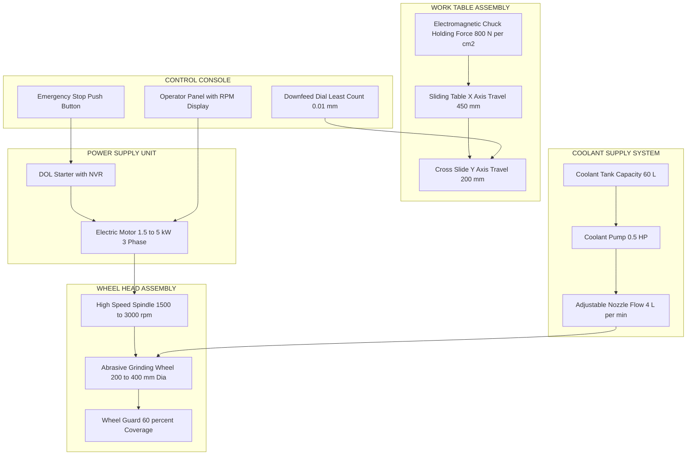
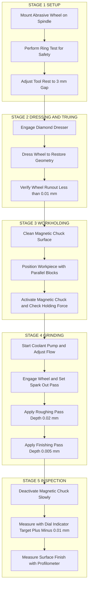
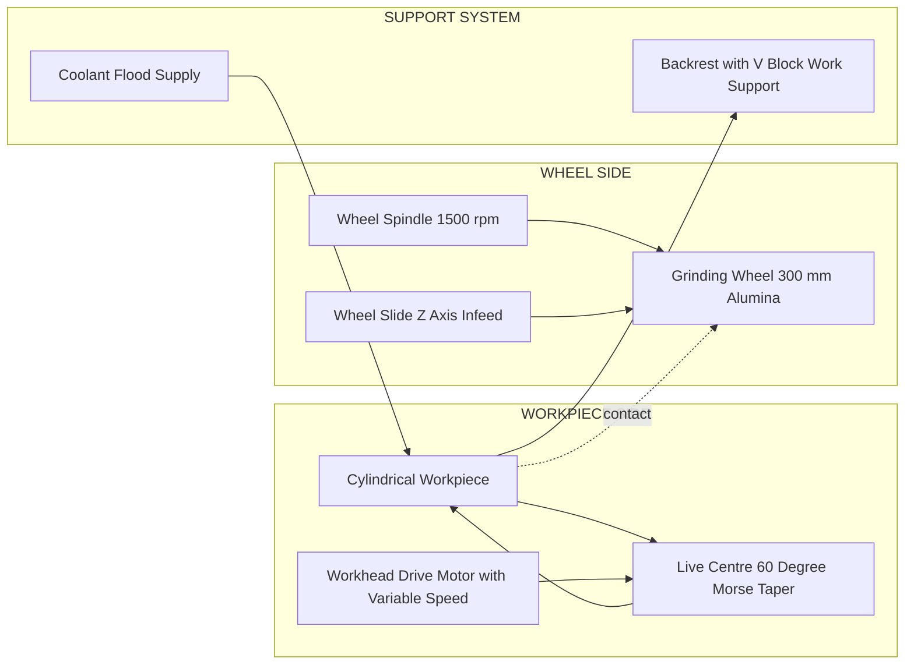
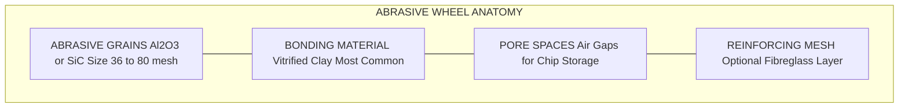

# Grinding Machine

<!-- SECTION_1_START -->
# GRINDING MACHINE

## 1. Core Technical Definition & Intuitive Overview

### Formal KTU 2024 Definition
A **Grinding Machine** is a precision power-driven machine tool that uses an **abrasive wheel** (rotating at very high peripheral speed) as a multi-point cutting tool to remove microscopic chips from a workpiece, primarily for **finishing operations** requiring high dimensional accuracy, superior surface finish, and tight geometrical tolerances. It is classified under **abrasive machining processes** in the KTU Engineering Workshop syllabus (Module 13).

> [!NOTE]
> **KTU 2024 Syllabus Highlight**
> Grinding is a **subtractive manufacturing process** that uses **abrasive particles** held together by a bonding material. Each abrasive grain acts as a miniature cutting edge, and the cumulative action of thousands of such grains produces a smooth, accurate surface.

### Intuitive Analogy (Plain English)
Imagine sharpening a kitchen knife on a wet stone. The stone is full of tiny sharp crystals that scrape off minute pieces of steel. A **grinding machine** is simply a **mechanized, motorized, super-precise version of that wet stone**. Instead of rubbing the knife by hand, the machine spins a stone-like wheel at thousands of RPM and slides the workpiece past it with micrometer-level precision.

> [!IMPORTANT]
> **Why Grinding is the "Last Step"**
> Milling and turning can only achieve surface roughness of about **1.6 µm Ra**. Grinding, using fine abrasive grits (down to sub-micron sizes), can achieve **0.1 µm Ra or better** — often the final operation before assembly.

> [!VISUALIZATION CONTROL]
> **Concept:** Abrasive Grit Action on Workpiece Surface
> **GeoGebra / Desmos Input Equations:**
> * `f(x) = 0.05 * sin(50 * pi * x)` — represents the micro-cutting profile of abrasive grits
> * `y = 0` — represents the nominal workpiece surface
> * `Point: (0.02, 0.05)` — represents a single abrasive grain peak
> **Visual Description:** Plot the sine wave and the horizontal line on the same graph. Observe that the grits only "scrape" where they protrude above the nominal surface, leaving behind microscopic chips and a smooth finish.

### Standard Specification Reference (KTU Workshop Manual)
| Parameter | Standard Value |
|---|---|
| Abrasive Wheel Hardness | Grade L to N (KTU bench grinder default) |
| Recommended Wheel Speed (Vitrified Bond) | **30 m/s** |
| Recommended Wheel Speed (Resinoid Bond) | **35–50 m/s** |
| Coolant Pressure | **0.5–1.5 bar** |
| Surface Finish Achievable | **0.1–1.6 µm Ra** |

---

<!-- SECTION_2_START -->
# 2. Deep Theoretical Analysis & KTU High-Yield Formula Sheet

## 2.1 The Fundamental Working Principle

Grinding operates on the principle of **abrasive micro-machining**. Unlike a single-point cutting tool (e.g., a lathe bit) that removes material in a continuous chip, a grinding wheel contains **thousands of randomly distributed abrasive grains** bonded together. The mechanism works in three concurrent stages:

1. **Rubbing** — The flank of the grit elastically deforms the workpiece (low material removal).
2. **Ploughing** — The grit pushes material sideways into ridges ahead and beside it.
3. **Cutting** — The grit forms a true micro-chip when the depth of engagement exceeds a critical threshold.

> [!TIP]
> **Examiner Insight:** Only **~20%** of all grits on a wheel are actually cutting at any instant. The rest are either rubbing, ploughing, or are dull/blunt. This is why grinding generates intense **localized heat** at the grit-workpiece interface.

## 2.2 The Standard Grinding Wheel Marking (KTU Mandatory)

The **BIS/ISO 525** standard marking for a grinding wheel is a **7-character code**:

$$
\texttt{Manufacturer Abrasive\_Type  Grit\_Size  Grade  Structure  Bond  Record}
$$

**Example:** `51 A 60 L 5 V 23`

| Position | Code | Meaning |
|---|---|---|
| 1 | 51 | Manufacturer's symbol |
| 2 | A | Abrasive: **Aluminum Oxide (Al₂O₃)** |
| 3 | 60 | Grit size: **Coarse (60 mesh)** |
| 4 | L | Grade: **Medium-Soft** |
| 5 | 5 | Structure: **Dense (low porosity)** |
| 6 | V | Bond: **Vitrified (most common)** |
| 7 | 23 | Manufacturer's record |

### Grade and Structure Reference

| Grade | Hardness | Typical Use |
|---|---|---|
| A, B, C, D, E, F, G | **Soft** | Hard workpiece material, fine finish |
| H, I, J, K | **Medium** | General purpose |
| L, M, N, O, P, Q, R, S, T, U, V, W, X, Y, Z | **Hard** | Soft workpiece, heavy stock removal |

## 2.3 Classification of Grinding Machines (KTU Module 13 Core)

| Type | Function | Typical Application |
|---|---|---|
| **Surface Grinder** | Flat surface finishing | Machine tool beds, slideways |
| **Cylindrical Grinder** | External cylindrical/conical surfaces | Shafts, pins, bearings |
| **Centerless Grinder** | External cylindrical without centres | Mass production of pins |
| **Internal Grinder** | Internal bores, bushings | Cylinder bores, sleeves |
| **Tool & Cutter Grinder** | Resharpening milling cutters, drills | Tool room operations |
| **Bench/Floor Grinder** | Off-hand sharpening | Workshop general use |
| **Jig Grinder** | Precision holes in jigs | Tool room precision work |

## 2.4 KTU High-Yield Formula Sheet

> [!IMPORTANT]
> **Use `\vert` instead of `|` in all formula tables to avoid breaking the markdown table parser.**

| # | Parameter | Formula | Symbol Meaning | Standard Unit |
|---|---|---|---|---|
| 1 | Peripheral Speed of Wheel | $v = \dfrac{\pi \cdot D \cdot N}{60{,}000}$ | $v$ = surface speed, $D$ = wheel dia, $N$ = rpm | m/s |
| 2 | Spindle Speed | $N = \dfrac{v \cdot 60{,}000}{\pi \cdot D}$ | Solve for $N$ given $v$ and $D$ | rpm |
| 3 | Material Removal Rate (MRR) | $Z_w = w \cdot d \cdot v_f$ | $w$ = width, $d$ = depth, $v_f$ = table feed | mm³/min |
| 4 | Specific Grinding Energy | $e = \dfrac{P}{Z_w}$ | $P$ = power, $Z_w$ = MRR | J/mm³ |
| 5 | Equivalent Chip Thickness | $h_{eq} = \dfrac{v_f}{v \cdot r \cdot C}$ | $r$ = grit radius, $C$ = active grit density | mm |
| 6 | Average Grit Spacing | $s_g = \dfrac{1}{\sqrt{C}}$ | $C$ = number of active grits per mm² | mm |
| 7 | Surface Finish (Ra) | $R_a \approx 0.20 \cdot \dfrac{v_f^{0.5}}{v \cdot C^{0.5}}$ | Empirical relation from Snoeys | µm |

## 2.5 Real-World Engineering Utility
* **Aerospace:** Finish-grinding of turbine blades to sub-µm accuracy.
* **Automotive:** Cylindrical grinding of crankshaft journals, cam profiles.
* **Tool Room:** Re-sharpening worn HSS and carbide milling cutters.
* **Bearings & Gears:** Raceway and gear tooth flank finishing.
* **Defence & Nuclear:** Precision boring of missile components.

> [!NOTE]
> **Production Note:** Modern CNC grinding machines (e.g., Studer, Schaublin) integrate **in-process gauging** and **adaptive control**, where the wheel feed automatically adjusts to maintain a constant stock removal rate, achieving **±0.5 µm** dimensional control.

---

<!-- SECTION_3_START -->
# 3. Step-by-Step Derivations & Practical Implementation

## 3.1 Derivation: Peripheral Speed of a Grinding Wheel

The grinding wheel is a rotating disc. Every grit on its periphery traces a **circular path** of circumference equal to $\pi \cdot D$ per revolution.

**Step 1 — Linear distance per revolution:**
A point on the rim travels a distance equal to the circumference:
$$
\text{Distance per rev} = \pi \cdot D
$$

**Step 2 — Distance per minute (using N revolutions per minute):**
$$
\text{Distance per minute} = \pi \cdot D \cdot N
$$

**Step 3 — Convert to SI unit (meters per second):**
Since 1 minute = 60 seconds and 1 m = 1000 mm:
$$
v = \dfrac{\pi \cdot D \cdot N}{60 \cdot 1000} = \dfrac{\pi \cdot D \cdot N}{60{,}000}
$$

**Final Result:**
$$
\boxed{\,v = \dfrac{\pi \cdot D \cdot N}{60{,}000}\ \text{m/s}\,}
$$

This is the **governing equation** the KTU examiner uses to test your ability to convert between wheel diameter, RPM, and surface speed.

## 3.2 Worked Numerical Problem (KTU 14-Mark Style)

### Problem Statement
A grinding wheel has a diameter of **300 mm** and rotates at **1500 rpm**. The depth of cut is **0.02 mm**, width of grinding is **40 mm**, and the workpiece table feed is **6 m/min**. Calculate:
(a) Peripheral speed of the wheel in m/s
(b) Material removal rate in mm³/min
(c) Specific energy if the grinding power is 2.2 kW

### Solution

**Step 1 — Peripheral speed $v$:**
$$
v = \dfrac{\pi \cdot D \cdot N}{60{,}000} = \dfrac{\pi \cdot 300 \cdot 1500}{60{,}000}
$$
$$
v = \dfrac{3.1416 \cdot 450{,}000}{60{,}000} = \dfrac{1{,}413{,}720}{60{,}000} = 23.56\ \text{m/s}
$$

> **[Substitution of values: 1 Mark], [Unit conversion check (mm→m): 1 Mark]**

**Step 2 — Material Removal Rate $Z_w$:**
Convert table feed: $v_f = 6\ \text{m/min} = 6000\ \text{mm/min}$
$$
Z_w = w \cdot d \cdot v_f = 40 \cdot 0.02 \cdot 6000
$$
$$
Z_w = 4800\ \text{mm}^3/\text{min}
$$

> **[Formula statement: 1 Mark], [Unit consistency (all mm): 1 Mark]**

**Step 3 — Specific Energy $e$:**
Convert power: $P = 2.2\ \text{kW} = 2.2 \cdot 60{,}000\ \text{J/min} = 132{,}000\ \text{J/min}$
$$
e = \dfrac{P}{Z_w} = \dfrac{132{,}000}{4800} = 27.5\ \text{J/mm}^3
$$

> **[Power unit conversion: 1 Mark], [Final numerical answer: 1 Mark]**

**Final Answer Box:**
$$
v = 23.56\ \text{m/s},\quad Z_w = 4800\ \text{mm}^3/\text{min},\quad e = 27.5\ \text{J/mm}^3
$$

## 3.3 Practical Laboratory Specifications (Workshop Bench Grinder)

> [!NOTE]
> **Per KTU 2024 Workshop Manual — Practical Demonstration Mandate**

| # | Component / Tool | Specification / Profile | Function | Safety Check |
|---|---|---|---|---|
| 1 | **Abrasive Wheel** | Aluminium Oxide (A), 60 grit, Grade K, Vitrified bond | Material removal | **Ring test** before mount |
| 2 | **Wheel Guard** | Covers ≥ 60% of wheel diameter | Contain fragments | Inspect for cracks |
| 3 | **Tool Rest** | Gap ≤ **3 mm** from wheel | Work support | Tighten set screw |
| 4 | **Eye Shield / Guard** | Polycarbonate, ≥ 2 mm thickness | Spark protection | Replace if scratched |
| 5 | **Coolant Nozzle** (Surface Grinder) | Adjustable flow 4–6 L/min | Heat dissipation | Check alignment |
| 6 | **Wheel Dresser** | Diamond-tipped, single point | Wheel truing | Mount securely |
| 7 | **Magnetic Chuck** (Surface Grinder) | 800–1200 N/cm² holding force | Work holding | Verify demagnetization |
| 8 | **Work-holding Vise** (Cylindrical) | Hardened jaws, accuracy 0.01 mm | Holds cylindrical jobs | Clean jaw faces |
| 9 | **Spindle Bearing** | Preloaded angular contact, ABEC-7 grade | Precision rotation | Listen for noise |
| 10 | **Power Switch** | No-volt release (NVR) type | Safe restart | Test after power off |

## 3.4 Step-by-Step Procedure (Bench Grinder — Off-Hand Grinding)

1. **Step 1:** Wear **safety glasses** and **heat-resistant gloves**. Remove loose clothing/jewellery.
2. **Step 2:** Perform a **ring test** — suspend the wheel on a finger, tap lightly with a non-metallic mallet. A clear ringing tone = safe; a dull thud = cracked wheel (discard immediately).
3. **Step 3:** Mount wheel on arbor, tighten **flanges** (diameter ≥ ⅓ of wheel diameter), and refit guard.
4. **Step 4:** Stand **to one side** of the wheel, not in front, and start the machine. Run idle for **2 minutes** to check vibration.
5. **Step 5:** Adjust tool rest to **≤ 3 mm** from the wheel face. Tighten firmly.
6. **Step 6:** Hold workpiece **firmly with both hands**, rest on the tool-rest, present at an angle of **15°–30°** to the wheel face (this creates a fresh cutting surface).
7. **Step 7:** Apply light pressure; **never force** the workpiece. Dip in water after every 2–3 strokes to prevent overheating.
8. **Step 8:** Stop the machine and use a **wheel dresser** if the wheel becomes glazed or loaded.

---

<!-- SECTION_4_START -->
# 4. Structural Diagrams & Schematics

## 4.1 Block Architecture of a Surface Grinding Machine

## 4.2 Sequential Processing Topology of a Grinding Cycle

## 4.3 Cylindrical Grinding — Functional Block Layout

## 4.4 Grinding Wheel Anatomy — Block Cross-Section

---

<!-- SECTION_5_START -->
# 5. KTU 2024 Scheme Examination Question Bank & Topic Recap

## 5.1 PART A — Short Answer Questions (3 Marks Each)

> **KTU Pattern:** Direct, definition-based, scoring 1 mark for keyword + 2 marks for explanation.

### Question 1 — `[KTU University Exam — July 2024]`
**Define grinding and list any four operations performed on a surface grinding machine.**

**Model Answer (3 Marks):**
Grinding is an **abrasive machining process** in which material is removed by the action of a multi-point abrasive wheel rotating at high peripheral speed. The wheel acts as the cutting tool, with each abrasive grain functioning as a microscopic cutting edge.
*(Definition — 1 Mark)*

**Four operations on a surface grinder:**
1. **Surface grinding** — producing flat surfaces.
2. **Slot grinding** — cutting narrow slots.
3. **Form grinding** — generating contoured profiles using a shaped wheel.
4. **Side or face grinding** — using the periphery of the wheel for vertical surfaces.
*(List with 0.25 Mark each + 0.5 Mark accuracy = 1 Mark; explanation 1 Mark = 2 Marks)*

### Question 2 — `[KTU University Exam — Dec 2023]`
**What is meant by "grade" of a grinding wheel? Why is grade selection critical?**

**Model Answer (3 Marks):**
**Grade** of a grinding wheel indicates the **holding strength of the bond** that retains the abrasive grains. It is denoted by **letters A (softest) to Z (hardest)** in the standard wheel marking.
*(Definition — 1 Mark)*

Grade selection is critical because:
* A **hard grade** retains dull grains — suitable for **soft workpieces** and high contact area.
* A **soft grade** releases dull grains — suitable for **hard workpieces** and avoids **glazing**.
* Wrong grade selection leads to **wheel glazing**, **workpiece burn**, or **rapid wheel wear**.
*(Explanation — 2 Marks)*

---

## 5.2 PART B — Long Answer Questions (14 Marks Each)

> **KTU Pattern:** Internal choice between two questions, each with two 7-mark sub-parts covering **Understand + Apply** cognitive levels.

---

### Question A — `[KTU University Exam — July 2024]`

#### (a) With a neat sketch, explain the construction and working of a surface grinding machine. **(7 Marks)**

**Model Answer (Valuation Key):**

**Construction — Major Parts (3.5 Marks):**
1. **Base** — heavy cast iron, supports the entire machine, provides rigidity.
2. **Table** — T-slotted cast iron bed, moves longitudinally via hydraulic or hand wheel feed. Mounts the magnetic chuck/workpiece.
3. **Wheel Head** — houses the high-speed spindle (1500–3000 rpm) carrying the abrasive wheel.
4. **Wheel Guard** — covers ≥ 60% of the wheel periphery; protects from sparks and fragments.
5. **Coolant System** — tank, pump, nozzles; delivers cutting fluid to the grinding zone.
6. **Magnetic Chuck** — electromagnetic work-holding device used for ferrous workpieces.
7. **Cross-Slide and Vertical Feed** — enable transverse and vertical movement of the wheel head.

> **[Naming 7 main parts: 1 Mark]; [Functional description of each: 2 Marks]; [Neat labelled sketch: 0.5 Mark]**

**Working Principle (3.5 Marks):**
* The workpiece is clamped on the **magnetic chuck**; demagnetization is verified.
* The wheel head carrying the abrasive wheel is brought down to the workpiece.
* **Hydraulic longitudinal feed** moves the table back-and-forth under the rotating wheel.
* **Cross-feed** adjusts the lateral position; **down-feed** sets the depth of cut.
* **Coolant** is flooded onto the contact zone to dissipate heat and flush chips.
* Spark-out passes (no downfeed) at the end improve finish and dimensional accuracy.

> **[Sequential explanation: 2 Marks]; [Mention of coolant, spark-out, magnetic chuck: 1.5 Marks]**

---

#### (b) A grinding wheel of diameter 250 mm rotates at 1800 rpm. Calculate the peripheral speed. If the depth of cut is 0.015 mm and the table feed is 4 m/min, find the material removal rate for a grinding width of 50 mm. **(7 Marks)**

**Model Answer (Valuation Key):**

**Step 1 — Peripheral Speed (3 Marks):**
$$
v = \dfrac{\pi \cdot D \cdot N}{60{,}000} = \dfrac{3.1416 \cdot 250 \cdot 1800}{60{,}000}
$$
$$
v = \dfrac{1{,}413{,}720}{60{,}000} = 23.56\ \text{m/s}
$$

> **[Formula statement: 1 Mark]; [Substitution: 1 Mark]; [Final answer with unit: 1 Mark]**

**Step 2 — Material Removal Rate (4 Marks):**
Convert feed: $v_f = 4\ \text{m/min} = 4000\ \text{mm/min}$
$$
Z_w = w \cdot d \cdot v_f = 50 \cdot 0.015 \cdot 4000
$$
$$
Z_w = 3000\ \text{mm}^3/\text{min}
$$

> **[Formula statement: 1 Mark]; [Unit conversion: 1 Mark]; [Substitution: 1 Mark]; [Final answer: 1 Mark]**

**Final Answer Box:**
$$
v = 23.56\ \text{m/s},\qquad Z_w = 3000\ \text{mm}^3/\text{min}
$$

---

### Question B — `[KTU University Exam — Dec 2023]`

#### (a) Explain the standard grinding wheel marking system. What are the different types of bonds and abrasives used? **(7 Marks)**

**Model Answer (Valuation Key):**

**Standard Marking (2.5 Marks):**
A grinding wheel is specified by a **7-character code** per BIS/ISO 525:
* **Position 1:** Manufacturer's symbol.
* **Position 2:** Type of abrasive (A = Al₂O₃, C = SiC, etc.).
* **Position 3:** Grit size (10–600; coarse to fine).
* **Position 4:** Grade (A–Z; soft to hard).
* **Position 5:** Structure number (1–16; dense to open).
* **Position 6:** Type of bond.
* **Position 7:** Manufacturer's record.

**Example:** `A 60 K 5 V` = Aluminium oxide, 60 grit, medium-hard, dense, vitrified bond.

> **[All 7 positions listed: 1.5 Marks]; [Correct example: 1 Mark]**

**Abrasives Used (2 Marks):**
* **Natural:** Emery, Corundum, Diamond, Quartz — rarely used now.
* **Artificial (Synthetic):**
  * **Aluminium Oxide (Al₂O₃):** Tough, for grinding steel and ferrous alloys.
  * **Silicon Carbide (SiC):** Hard, brittle, for cast iron, carbide, and non-ferrous.
  * **Cubic Boron Nitride (CBN):** For hard tool steels and tool room.
  * **Synthetic Diamond:** For ceramic, glass, and carbide.

> **[At least 2 natural and 3 artificial with application: 2 Marks]**

**Bonds Used (2.5 Marks):**
* **Vitrified (V):** Most common, rigid, heat-resistant.
* **Resinoid (B):** Strong, used for rough grinding and cutoff wheels.
* **Rubber (R):** Flexible, for fine finish and thread grinding.
* **Silicate (S):** Brittle, for cool cutting (cutlery).
* **Shellac (E):** Elastic, for fine finish on small parts.
* **Metal (M):** For electroplated and CBN wheels.

> **[Any 5 bonds with 1 characteristic each: 2.5 Marks]**

---

#### (b) Discuss the various safety precautions to be observed while operating a grinding machine. **(7 Marks)**

**Model Answer (Valuation Key):**

| # | Precaution | Reason |
|---|---|---|
| 1 | **Always wear safety glasses & face shield** | Protects eyes from sparks & fragments. |
| 2 | **Perform ring test before mounting wheel** | Detects internal cracks in the wheel. |
| 3 | **Mount wheel with proper flanges & blotters** | Ensures balanced rotation; prevents slippage. |
| 4 | **Fit the wheel guard** | Contains fragments in case of wheel breakage. |
| 5 | **Stand to one side while starting** | Avoids injury if wheel shatters. |
| 6 | **Adjust tool rest gap ≤ 3 mm** | Prevents workpiece jamming. |
| 7 | **Never exceed the maximum safe RPM** | Avoids centrifugal bursting. |
| 8 | **Dress the wheel periodically** | Maintains sharpness; prevents glazing. |
| 9 | **Use coolant on hardened work** | Prevents thermal damage & burns. |
| 10 | **Stop machine before opening chuck** | Prevents workpiece ejection. |

> **[Listing 10 points with reason: 5 Marks]; [Ring test, tool rest gap, max RPM, coolant emphasis: 2 Marks]**

---

## 5.3 KTU Examiner's Valuation Warning

> [!WARNING]
> **Common Pitfalls that Cost Marks**
> 1. **Unit mixing trap:** Forgetting to convert $D$ from **mm to m** or feed from **m/min to mm/min** before applying formulas — examiner deducts **1 mark per error**.
> 2. **Wheel marking confusion:** Writing grade as "hardness of wheel" instead of "holding strength of the bond" — partial marking only.
> 3. **Skipping the ring test mention** in safety precautions — examiners in KTU Kerala expect this as a **mandatory 1-mark line item**.
> 4. **Forgetting to draw a labelled sketch** in 7-mark construction questions — **0.5 to 1 mark** is reserved for the diagram, even in pure theory answers.
> 5. **Confusing MRR formula with turning:** In grinding, $Z_w = w \cdot d \cdot v_f$ — students often wrongly substitute speed of wheel for $v_f$, leading to wrong units and a **2-mark penalty**.

---

## 5.4 Topic Recap & Important Things to Remember

> [!NOTE]
> **Last-Minute Revision Checklist — Grinding Machine (Module 13)**

- **Definition:** Abrasive machining using a multi-point wheel; finishing process achieving **0.1–1.6 µm Ra**.
- **Standard wheel marking** is 7-character: **Abrasive, Grit, Grade, Structure, Bond, Manufacturer, Record**.
- **Grade A–Z** represents bond strength, NOT wheel hardness.
- **Abrasives:** Al₂O₃ (steel), SiC (cast iron/carbide), CBN (hardened tool steel), Diamond (ceramics/glass).
- **Bonds:** Vitrified (V) is most common; others include Resinoid, Rubber, Shellac, Silicate, Metal.
- **Peripheral speed formula:** $v = \pi D N / 60{,}000$ (when $D$ in mm, $N$ in rpm, $v$ in m/s).
- **MRR formula:** $Z_w = w \cdot d \cdot v_f$ (all linear units in mm).
- **Specific energy $e = P / Z_w$** lies between **20 and 80 J/mm³** for normal grinding.
- **Maximum safe peripheral speed:** Vitrified ≈ **30 m/s**, Resinoid ≈ **35–50 m/s**.
- **Tool rest gap must be ≤ 3 mm** — a critical KTU safety standard.
- **Ring test** is the first mandatory check before mounting any grinding wheel.
- **Coolant pressure 0.5–1.5 bar** is standard for surface grinding.
- **Major types:** Surface, Cylindrical, Centerless, Internal, Tool & Cutter, Bench, Jig.
- **Spark-out pass** at the end of grinding improves dimensional accuracy and surface finish.
- **Magnetic chuck** is the standard work-holding for ferrous workpieces on surface grinders.
- **Work rest on bench grinder** must be at an angle of **15°–30°** to the wheel face for fresh cutting.
- **KTU Expected Vignettes:** Centreless grinding for mass-produced pins; tool and cutter grinder for workshop sharpening; surface grinder for die and mould finishing.
