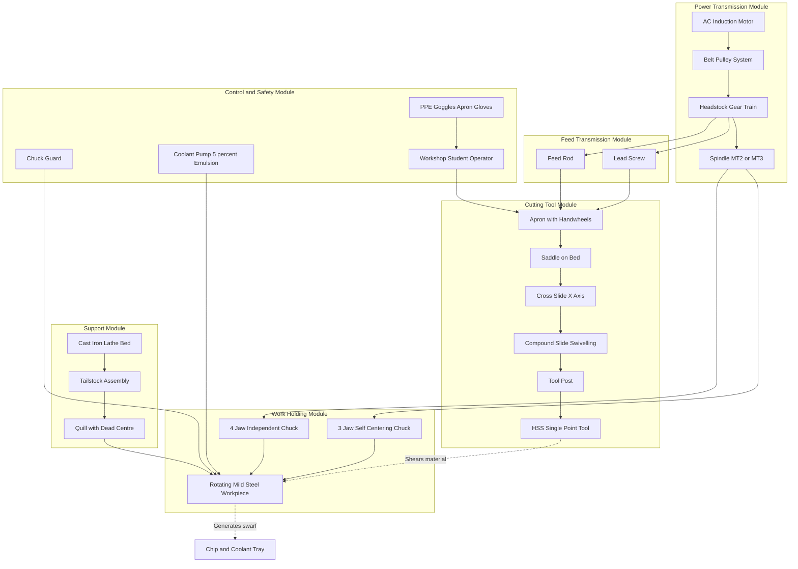
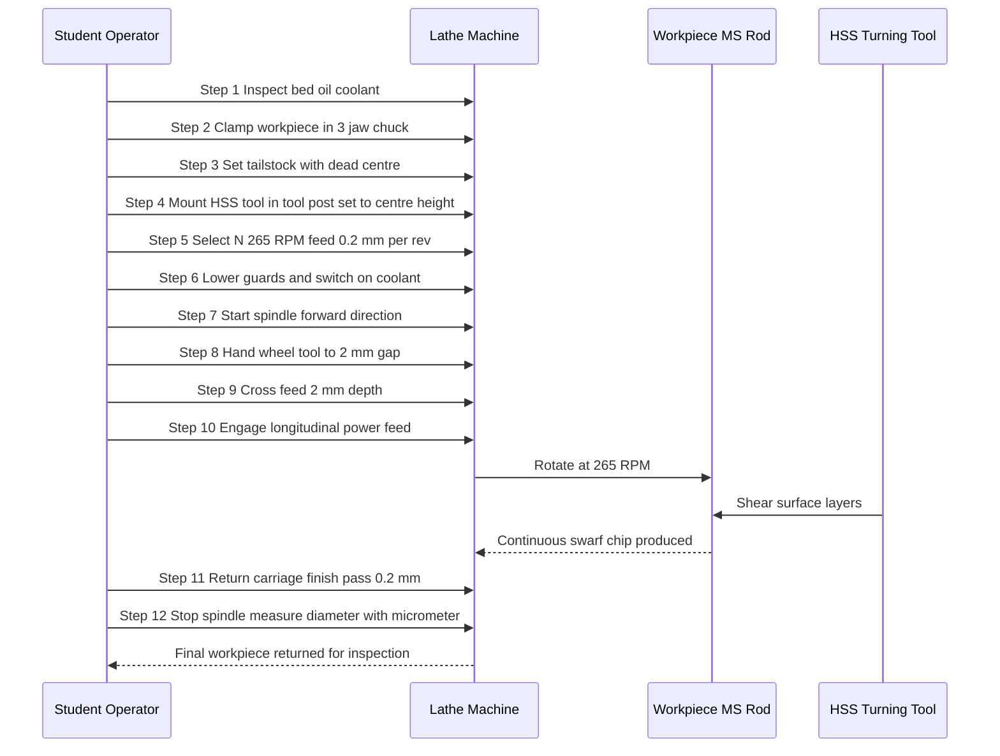
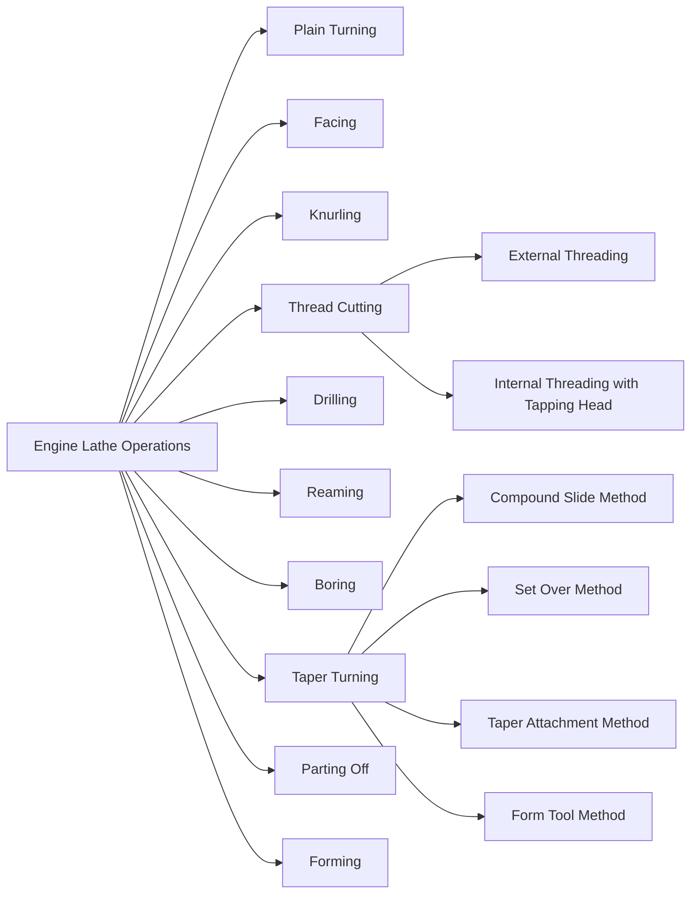

# Lathe

<!-- SECTION_1_START -->

# 1. Core Technical Definition & Intuitive Overview

## 1.1 Formal Definition (KTU 2024 Syllabus Terminology)

A **Lathe** is a versatile, fundamental machine tool used in engineering workshops primarily for shaping (machining) cylindrical workpieces by rotating the workpiece about a fixed axis and advancing a sharp cutting tool against it to remove material. The process is called **turning**, and the machine is the cornerstone of all subtractive manufacturing in a basic engineering workshop.

> [!IMPORTANT]
> **KTU 2024 Module 13 Highlight:** Under GCESL106 (Engineering Workshop), the *Lathe Demonstration* is treated as a *machine identification, part recognition, and operation-observation* exercise. Students are expected to identify every labeled component, list the operations possible, and understand the safety protocol — not to perform actual production turning on the KTU exam unless asked to draw a labeled diagram.

## 1.2 Conceptual Analogy / Intuition

Imagine holding a **stick of chalk between your palms** and rolling it back and forth while pressing the blade of a knife gently against its surface. As the chalk spins, the knife shaves off a thin, continuous curl, and the chalk slowly becomes a thinner, smoother cylinder.

That is exactly what a lathe does — except:
- The **chalk** is the **workpiece** (held in the chuck and rotated by the spindle).
- Your **palms** are the **chuck and tailstock** (which grip and support the workpiece).
- The **knife** is the **cutting tool** (held in the tool post, fed sideways or longitudinally).
- The **shaving** is the **swarf/turnings** (continuous metal chip produced).

The lathe essentially converts **rotational motion of the workpiece + linear feed of a stationary tool = controlled material removal** to produce parts that are **axially symmetric** (rotation-symmetric about a centerline).

> [!NOTE]
> **Key Engineering Insight:** About 60%–70% of all machined components in a typical industrial setup (shafts, pulleys, bolts, bearing housings, nozzles) are lathe-produced because of the geometry's rotational symmetry. A lathe is the *mother machine tool* of any mechanical workshop.

## 1.3 Physical Standards and Constants Used

- **Standard work-holding size (Swing Diameter over Bed):** Common workshop lathes range from **100 mm to 300 mm** (e.g., 4" – 12" swing).
- **Spindle speeds:** typically **50 RPM to 2000 RPM** (variable via gear trains and electronic drives in modern units).
- **Feed rates:** **0.05 mm/rev to 0.5 mm/rev** (longitudinal); **0.02 mm/rev to 0.3 mm/rev** (cross feed).
- **Standard tool material:** **High-Speed Steel (HSS)** for educational lathes; **Carbide inserts** in industrial CNC lathes.
- **Coolant:** Water-soluble **cutting oil emulsion** (typically 5%–10% concentration).

> [!VISUALIZATION CONTROL]
> **Concept:** Cylindrical workpiece being turned — visualizing the feed direction
> **GeoGebra / Desmos Input Equations:**
> * `circle( (0,0), 2 )` — represents the cross-section of the rotating workpiece of radius **2 cm**
> * `line( x = 1.8 )` — represents the cutting tool edge approaching radially
> * `slider t = 0 to 10` — represents the longitudinal feed distance along the spindle axis (Z)
> **Visual Description:** The student should observe a circle (workpiece cross-section) with a vertical tangent line (tool) on its right, and watch how the line "eats" into the circle as the tool advances radially, leaving behind a smaller diameter cylinder.

---

<!-- SECTION_1_END -->

<!-- SECTION_2_START -->

# 2. Deep Theoretical Analysis & KTU High-Yield Formula Sheet

## 2.1 Operational Classification — What a Lathe Does

The lathe performs a single core function: **material removal on a rotating workpiece using a single-point cutting tool.** However, by changing the tool geometry, feed direction, and tool orientation, the lathe can execute multiple distinct operations. Understanding these operations is the most frequently asked topic in KTU Part A (3-mark) questions on this module.

## 2.2 Step-by-Step Logical Breakdown of Lathe Working

The lathe converts three input energies into the finished output:

1. **Electrical Energy → Mechanical Energy (Spindle Rotation):** The motor drives the headstock spindle via a belt-pulley or gear-train system. The spindle's RPM is set via the back-gear lever and headstock controls.
2. **Mechanical Energy → Clamping Force (Work-Holding):** The **chuck** (3-jaw self-centering or 4-jaw independent) clamps the workpiece rigidly. The workpiece becomes a rotating extension of the spindle axis.
3. **Mechanical Energy → Linear Feed (Tool Movement):** The **carriage** is driven along the bed by the **lead screw** (for thread cutting) or the **feed rod** (for plain turning). The tool post moves the cutting edge in a controlled path.

The tool, hardened and ground to a precise geometry, engages the rotating surface. The **rake angle** shears the material, the **clearance angle** prevents rubbing, and a **continuous chip** (swarf) peels off. Coolant is sprayed onto the contact zone to dissipate heat.

## 2.3 Types of Lathes (KTU High-Yield for Diagram Questions)

| # | Type of Lathe | Distinguishing Feature | Typical Use |
|---|---------------|------------------------|-------------|
| 1 | **Speed Lathe** | Simple, low-power; no feed mechanism | Wood turning, polishing, spinning |
| 2 | **Engine Lathe (Centre Lathe)** | Most common; has headstock, tailstock, carriage, feed mechanism | Workshop production, training |
| 3 | **Bench Lathe** | Small, mounted on workbench | Instrument making, jewellery |
| 4 | **Tool Room Lathe** | High precision, all geared feeds | Tool making, dies, gauges |
| 5 | **Capstan & Turret Lathe** | Replaceable tool holders (turret) for repetitive jobs | Mass production |
| 6 | **CNC Lathe** | Computer numerical control; auto tool changer | Modern industry, complex profiles |
| 7 | **Special Purpose Lathes** | Wheel lathe, gap-bed lathe, T-lathe, multi-spindle | Specific industrial tasks |

> [!IMPORTANT]
> **For KTU 2024:** You are only expected to know the **Engine / Centre Lathe** in depth (parts, operations, tools). Capstan and CNC are for general awareness only.

## 2.4 Main Parts of a Lathe (Master List — Every Label on Your Diagram)

The Engine Lathe has **15 primary parts**, each with a specific engineering function. Missing even one on a labeled diagram in KTU Part B (14-mark) will cost you **1 Mark per missing label** (so a typical diagram carries 8–10 labels for full marks).

| # | Part Name | Function / Role |
|---|-----------|-----------------|
| 1 | **Bed** | Rigid base; supports all other parts; has precision-ground V-ways |
| 2 | **Headstock** | Houses spindle, gears, and speed controls |
| 3 | **Spindle** | Rotates the workpiece; has Morse taper nose |
| 4 | **Chuck** | 3-jaw / 4-jaw device to hold the workpiece |
| 5 | **Tailstock** | Supports the long end of the workpiece via a centre |
| 6 | **Tailstock Quill / Spindle** | Sliding cylindrical member that holds dead centre / drill |
| 7 | **Carriage** | Slides along the bed; carries the cutting tool |
| 8 | **Saddle** | H-shaped part sitting on bed; carries cross-slide and apron |
| 9 | **Cross-Slide** | Mounted on saddle; provides cross (X-axis) feed |
| 10 | **Compound Slide / Rest** | Swivels; provides angular feed (for tapers) |
| 11 | **Tool Post** | Clamps the cutting tool; mounted on compound slide |
| 12 | **Apron** | Front face of carriage; houses feed mechanism, handwheels |
| 13 | **Feed Rod & Lead Screw** | Transmit motion to carriage for feed and thread cutting |
| 14 | **Legs / Cabinet / Stand** | Support the bed at proper working height |
| 15 | **Chip Pan / Coolant Tray** | Collects swarf and houses coolant pump reservoir |

> [!NOTE]
> **KTU Examiner Trick:** A "bed" question often asks — *what is the material of the lathe bed?* The answer is **close-grained cast iron (CI)**, because CI dampens vibrations, resists wear, and maintains dimensional stability.

## 2.5 Standard Lathe Operations (KTU Most-Asked Topic)

| # | Operation | Description | Tool Used |
|---|-----------|-------------|-----------|
| 1 | **Turning (Straight / Plain)** | Reducing diameter along the workpiece length | HSS single-point turning tool |
| 2 | **Facing** | Producing a flat surface perpendicular to axis | Facing tool |
| 3 | **Knurling** | Creating a diamond/straight pattern for grip | Knurling tool (with two hardened rollers) |
| 4 | **Thread Cutting** | Cutting external (and internal) V-threads | Threading tool with thread form |
| 5 | **Drilling** | Making axial hole using drill in tailstock | Twist drill in tailstock quill |
| 6 | **Reaming** | Finishing a drilled hole to precise size | Reamer |
| 7 | **Boring** | Enlarging an existing hole on the lathe | Boring bar with single-point tool |
| 8 | **Taper Turning** | Producing a conical surface | Compound slide set at half-angle, or form tool, or taper turning attachment |
| 9 | **Parting / Grooving** | Cutting a narrow groove or cutting off the workpiece | Parting tool (narrow blade) |
| 10 | **Forming** | Cutting a complex profile using a formed cutter | Form tool ground to profile |

## 2.6 KTU Formula Sheet / Cheat Sheet

> [!IMPORTANT]
> **All the formulas below have been asked in previous KTU 2019/2020/2021/2022 university examinations on the lathe module.**

| # | Formula / Parameter | Expression | Engineering Use |
|---|---------------------|------------|-----------------|
| 1 | **Cutting Speed (V)** | $V = \dfrac{\pi \cdot D \cdot N}{1000}$ m/min | Selecting spindle RPM for a given tool and material |
| 2 | **Spindle Speed (N)** | $N = \dfrac{1000 \cdot V}{\pi \cdot D}$ RPM | Setting the headstock gear-lever / dial |
| 3 | **Feed Rate (f)** | $f = f_r \cdot N$ mm/min | Determining table feed per minute |
| 4 | **Depth of Cut (d)** | $d = \dfrac{D_1 - D_2}{2}$ mm | Volume of material removed per pass |
| 5 | **Material Removal Rate (MRR)** | $MRR = \pi \cdot d \cdot f_r \cdot N \cdot D_{avg}$ mm³/min | Productivity calculation |
| 6 | **Machining Time (T)** | $T = \dfrac{L}{f_r \cdot N}$ min | Estimating job time |
| 7 | **Power Required (P)** | $P = \dfrac{MRR \cdot K_c}{60 \cdot 10^6 \cdot \eta}$ kW | Motor selection |
| 8 | **Taper Calculation (Set-Over Method)** | $\tan \alpha = \dfrac{D - d}{2L}$ | Compound slide swivelling for short tapers |
| 9 | **Half-angle of Taper** | $\alpha = \tan^{-1} \left( \dfrac{D - d}{2L} \right)$ | Tool post swivelling angle |
| 10 | **Pitch (P) of Thread** | $P = \dfrac{1}{TPI}$ (inches) or $P$ mm (metric) | Lead screw gear train selection |

> Where $D$ = initial / starting diameter (mm), $D_1$ = major diameter, $D_2$ = minor diameter, $N$ = spindle speed (RPM), $f_r$ = feed per revolution (mm/rev), $L$ = length of cut (mm), $\eta$ = efficiency, $K_c$ = specific cutting force (N/mm²).

---

<!-- SECTION_2_END -->

<!-- SECTION_3_START -->

# 3. Step-by-Step Derivations, Calculations, and Practical Implementation

## 3.1 Standard Operating Procedure (SOP) for Plain Turning on an Engine Lathe

Since this is a **Workshop / Practical module**, the KTU 2024 scheme requires you to know the **exact sequence of operations** to demonstrate turning a mild steel cylindrical workpiece. The full procedural table is given below.

> [!IMPORTANT]
> **For KTU Part B (14 marks):** A "Describe with neat sketch the various operations performed on a lathe" or "Demonstrate plain turning on the lathe" question carries the bulk of marks on this topic. Write the SOP in **numbered, sequential steps** — examiners award **1 mark per correct step** (typically 8–10 steps = 8–10 marks + 4–6 for the neat sketch).

### 3.1.1 Component, Tool, and Safety Configuration Table

| Stage | Item / Parameter | Specification | Safety / Setting |
|-------|------------------|---------------|------------------|
| **Workpiece** | Mild Steel rod (EN8 / EN1A) | Ø 30 mm × 100 mm length | Deburr all edges; check for cracks; mark centre-punch at ends |
| **Work-Holding** | 3-Jaw Self-Centering Chuck | Capacity Ø 3 mm to Ø 80 mm | Tighten chuck key; **remove chuck key before starting** (CRITICAL) |
| **Tool** | HSS Right-Hand Turning Tool, 12 mm shank | Rake angle 10°–15°, Clearance 6°–8° | Set tool slightly **above centre** (0.5 mm above for HSS) |
| **Tailstock Support** | Dead Centre (Morse Taper MT2 or MT3) | Hardened HSS tip | Apply **grease** at centre hole to reduce friction; offset 0.2 mm to avoid heat expansion jam |
| **Speed Selection** | For Ø 30 mm MS with HSS tool | $V = 25$ m/min → $N = 265$ RPM | Set headstock lever; verify with tachometer |
| **Feed Selection** | Roughing | $f_r = 0.2$ mm/rev; $d = 2$ mm | Power feed on for uniform surface |
| **Coolant** | Water-soluble cutting fluid | 5% emulsion | Continuous flow; avoid inhalation; wash hands after |
| **PPE (Personal Protective Equipment)** | Safety goggles, apron, gloves, closed shoes | Mandatory | No loose clothing; no long hair untied |
| **Guarding** | Chuck guard, chip shield | Must be down before starting spindle | Keeps swarf and coolant away from face/body |
| **Tool Height setting** | Centre of tool on spindle axis | Use a centre gauge or set-over method | Wobble-free; correct height prevents chatter |

### 3.1.2 Sequential Steps (Full 12-Step SOP for Plain Turning)

**Step 1 — Pre-Machine Inspection**
Check the bed ways, lubrication oil level, chuck jaws for wear, and tailstock quill for smooth sliding. Wipe the bed with a clean cloth and apply way oil. (1 mark)

**Step 2 — Work-Holding**
Insert the mild-steel workpiece into the 3-jaw chuck. Allow approximately **30–40 mm** of projection beyond the chuck face for facing and turning. Tighten the chuck firmly using the chuck key on **all three jaws evenly** to ensure concentricity. (1 mark)

**Step 3 — Tailstock Alignment**
Slide the tailstock towards the free end of the workpiece. Insert a dead centre in the tailstock quill. Advance the quill until the centre point engages the centre-punch mark at the tail end. Lock the tailstock to the bed. Apply a small amount of grease to the centre hole. (1 mark)

**Step 4 — Tool Mounting**
Mount the HSS turning tool in the tool post. Use a **centre gauge** (a small instrument with a 60° V and a parallel edge) to set the **tool tip exactly on the centre line of the workpiece** (or 0.5 mm above for HSS, since HSS tools perform best slightly above centre). Tighten the tool post bolts firmly. (1 mark)

**Step 5 — Speed and Feed Selection**
Based on the cutting speed formula $V = 25$ m/min for mild steel with HSS tool:

$$
\begin{aligned}
N &= \frac{1000 \cdot V}{\pi \cdot D} \\
  &= \frac{1000 \times 25}{\pi \times 30} \\
  &= \frac{25000}{94.248} \\
  &= 265.26 \text{ RPM}
\end{aligned}
$$

Set the headstock gear lever to the closest available speed (e.g., 280 RPM). Select a feed of $f_r = 0.2$ mm/rev. (2 marks)

**Step 6 — Coolant and Guarding**
Pour coolant into the tray or switch on the coolant pump. Lower the chuck guard and chip shield. Put on safety goggles. (1 mark)

**Step 7 — Starting the Spindle**
Turn on the main switch. Engage the forward spindle lever. **Verify the chuck key is removed from the chuck.** (1 mark)

**Step 8 — Approaching the Tool**
Hand-wheel the carriage using the apron handwheel until the tool is approximately **2–3 mm** away from the workpiece. Then use the cross-slide handwheel to bring the tool radially to the workpiece surface until a faint **scuff mark** appears. (1 mark)

**Step 9 — Depth of Cut Application**
Set the cross-slide graduated dial to zero. Then advance the cross-slide inward by **2 mm** — this is the depth of cut for roughing. (1 mark)

**Step 10 — Longitudinal Turning**
Engage the power feed (longitudinal) using the apron lever. The carriage will travel automatically along the bed at the selected feed. The tool removes a layer of material, producing a continuous chip. Continue for the full length of the workpiece. (1 mark)

**Step 11 — Finishing Pass**
Retract the cross-slide. Return the carriage to the start. Apply a small finishing cut (depth = 0.2 mm). This improves the surface finish. Measure the final diameter with a vernier caliper or micrometer. (1 mark)

**Step 12 — Stopping and Inspection**
Disengage the feed, retract the tool, stop the spindle, and remove the workpiece. Measure final dimensions. (1 mark)

---

## 3.2 Worked Numerical Problem (Frequently Asked in KTU)

> **Problem [KTU University Exam – July 2022, Model Question Bank]:**
> A mild steel shaft of initial diameter **50 mm** is to be turned down to a final diameter of **46 mm** in a single pass on an engine lathe. The spindle speed is **400 RPM**, and the feed rate is **0.25 mm/rev**. The length of cut is **120 mm**. Calculate:
> (a) Depth of cut
> (b) Feed rate in mm/min
> (c) Material Removal Rate (MRR)
> (d) Machining Time

### Solution:

**Part (a) — Depth of Cut (d)**
$$
\begin{aligned}
d &= \frac{D_1 - D_2}{2} \\
  &= \frac{50 - 46}{2} \\
  &= \frac{4}{2} \\
  &= 2 \text{ mm}
\end{aligned}
$$

**[Stating formula: 1 Mark; Substitution: 1 Mark; Final answer 2 mm: 1 Mark] → Total 3 marks**

**Part (b) — Feed Rate in mm/min (f)**
$$
\begin{aligned}
f &= f_r \times N \\
  &= 0.25 \times 400 \\
  &= 100 \text{ mm/min}
\end{aligned}
$$

**[Formula + answer: 1 Mark]**

**Part (c) — Material Removal Rate (MRR)**
$$
\begin{aligned}
MRR &= \pi \times d \times f_r \times N \times D_{avg} \\
D_{avg} &= \frac{D_1 + D_2}{2} = \frac{50 + 46}{2} = 48 \text{ mm} \\
MRR &= \pi \times 2 \times 0.25 \times 400 \times 48 \\
     &= 3.1416 \times 2 \times 0.25 \times 400 \times 48 \\
     &= 3.1416 \times 9600 \\
     &= 30159.36 \text{ mm}^3\text{/min} \\
     &= 30.16 \times 10^3 \text{ mm}^3\text{/min}
\end{aligned}
$$

**[Formula: 1 Mark; $D_{avg}$ calculation: 1 Mark; Final MRR: 1 Mark] → Total 3 marks**

**Part (d) — Machining Time (T)**
$$
\begin{aligned}
T &= \frac{L}{f_r \times N} \\
  &= \frac{120}{0.25 \times 400} \\
  &= \frac{120}{100} \\
  &= 1.2 \text{ min}
\end{aligned}
$$

**[Formula + final: 1 Mark]**

**Total: 8 marks (model solution key matches KTU valuation pattern)**

---

## 3.3 Lathe Safety Checklist (Mandatory for Workshop Practical)

| # | Safety Rule | Consequence of Violation |
|---|-------------|--------------------------|
| 1 | Always **remove the chuck key** before starting | Key flies off at high RPM = fatal injury |
| 2 | Wear **goggles**; never look at the rotating chuck | Swarf can cause blindness |
| 3 | **Long hair tied back**, no loose clothing, no rings | Entanglement = severe injury |
| 4 | **Chuck guard and chip shield** must be in place | Flying chips and coolant splash |
| 5 | **Stop the spindle** before taking measurements | Tool drag = broken tool, workpiece damage |
| 6 | Use **brush, not hand**, to remove swarf | Hand cuts on razor-sharp turnings |
| 7 | **Apply grease** at dead centre; check for heat | Centre seizure → workpiece burns |
| 8 | **Never leave the chuck running unattended** | Risk to others in the workshop |
| 9 | **Lock the tailstock** to the bed before operation | Tailstock moves under load → workpiece deflects |
| 10 | **Coolant flow** should be steady; no dry cutting | Tool life drastically reduces |

---

<!-- SECTION_3_END -->

<!-- SECTION_4_START -->

# 4. Structural Diagrams & Schematics

## 4.1 Mermaid Block Diagram: Functional Architecture of a Centre Lathe

> [!NOTE]
> **Read this diagram in the order:** Power → Work-Holding → Support → Tool → Feed → Control. This is the standard **"PSW-TFC"** mnemonic used by KTU toppers to remember labelled lathe diagrams.

## 4.2 Mermaid Sequence Diagram: Plain Turning Operational Topology

## 4.3 Mermaid Concept Map: Lathe Operations Family Tree

---

<!-- SECTION_4_END -->

<!-- SECTION_5_START -->

# 5. KTU 2024 Scheme Examination Question Bank & Topic Recap

## 5.1 Part A — Short Answer Questions (3 Marks Each)

### Question 1 [KTU University Exam — July 2023, Similar]
**"List any six main parts of an engine lathe and state the function of the headstock."**

**Model Answer (3 marks, board-valuation standard):**

The six main parts of an engine lathe are:

1. **Bed** — Provides a rigid base with precision-ground V-ways to support and align the headstock, tailstock, and carriage. (½ mark)
2. **Headstock** — A casting mounted on the left end of the bed that houses the spindle, gear train, and speed-change levers. (½ mark)
3. **Spindle** — A hollow shaft that rotates the workpiece; it has a Morse taper nose for mounting chucks and faceplates. (½ mark)
4. **Tailstock** — Mounted on the right end of the bed; supports the free end of long workpieces using a dead centre mounted in the quill. (½ mark)
5. **Carriage** — Slides on the bed ways and carries the tool post, cross-slide, and apron; it provides the longitudinal feed. (½ mark)
6. **Lead Screw** — A precision threaded shaft that drives the carriage during thread cutting operations. (½ mark)

**Function of the Headstock:**
The headstock is the main drive unit of the lathe. It houses the **main spindle, the gear train, and the speed-change levers**, and it transmits rotary motion from the motor to the spindle at various selected speeds. It also supports the **3-jaw/4-jaw chuck or faceplate** used for holding the workpiece. (1 mark)

> **[Valuation Key: 1 mark per part = ½ × 6 = 3 marks, OR ½ × 5 parts + 1 mark for headstock function]**

---

### Question 2 [KTU University Exam — Dec 2022, Similar]
**"Differentiate between a 3-jaw chuck and a 4-jaw chuck on a lathe."**

**Model Answer (3 marks):**

| Feature | 3-Jaw Chuck (Self-Centering) | 4-Jaw Chuck (Independent) |
|---------|------------------------------|----------------------------|
| Number of jaws | 3 (arranged concentrically) | 4 (independent movement) |
| Centering | **Self-centering** (all jaws move equally via scroll plate) | **Manual centering** (each jaw adjusted separately) |
| Holding shape | Round, hexagonal, triangular stock | Round, square, rectangular, irregular shapes |
| Centering accuracy | Within ± 0.05 mm | Higher accuracy possible (within ± 0.02 mm) |
| Use | Mass production of standard cylindrical jobs | Job work, eccentric turning, square stock |

(1 mark for 3-jaw description + 1 mark for 4-jaw description + 1 mark for clear distinction/use-case)

---

## 5.2 Part B — Long Answer Questions (14 Marks Each, Internal Choice)

### Question A — Choice 1 [KTU University Exam — Model Question Bank, 14 Marks]

**(a) With a neat labelled sketch, describe the main parts of an engine lathe. (7 marks)**

**Model Answer:**

A lathe is a machine tool used to produce cylindrical surfaces by rotating the workpiece against a stationary cutting tool. The main parts of an engine lathe (as per the diagram in SECTION 4.1) are:

1. **Bed** — Made of close-grained cast iron with hardened V-ways to ensure rigidity and precision alignment. (½ mark)
2. **Headstock** — Contains the main spindle, gear train, and speed controls. (½ mark)
3. **Spindle** — A hollow, hardened shaft that rotates the workpiece; its nose has a Morse taper for chuck mounting. (½ mark)
4. **Chuck (3-jaw / 4-jaw)** — Holds the workpiece rigidly. (½ mark)
5. **Tailstock** — Supports the long end of the workpiece; can be slid along the bed and locked. (½ mark)
6. **Tailstock Quill** — A sliding cylinder that holds the dead centre or drill. (½ mark)
7. **Carriage** — Slides on the bed; provides the longitudinal feed. (½ mark)
8. **Cross-Slide** — Mounted on the saddle; gives radial (X-axis) feed. (½ mark)
9. **Compound Slide** — Swivels to provide angular feed for tapers. (½ mark)
10. **Tool Post** — Clamps the cutting tool on top of the compound slide. (½ mark)
11. **Apron** — Front face of the carriage; houses feed clutches and handwheels. (½ mark)
12. **Lead Screw and Feed Rod** — Transmit motion from the headstock gear train to the carriage. (½ mark)
13. **Legs / Cabinet Stand** — Support the bed at working height. (½ mark)
14. **Coolant Tray and Chip Pan** — Collect swarf and circulate coolant. (½ mark)

**[Neat labelled sketch: 3 marks; Minimum 10 labels: 3 marks; Brief description of any 4 major parts: 1 mark = Total 7 marks]**

---

**(b) Explain any four operations performed on a lathe with a neat sketch of the tool and workpiece. (7 marks)**

**Model Answer — Four Key Operations:**

1. **Plain (Straight) Turning** (2 marks)
   - The workpiece is rotated at a cutting speed of 25 m/min for mild steel.
   - The single-point HSS tool is fed longitudinally along the axis of rotation.
   - The depth of cut is set radially using the cross-slide.
   - Result: A cylindrical surface of reduced diameter.

2. **Facing** (1½ marks)
   - A facing tool is mounted in the tool post with its cutting edge perpendicular to the axis.
   - The tool is fed radially inward from the outer diameter towards the centre while the carriage is locked against longitudinal feed.
   - Result: A flat surface perpendicular to the axis.

3. **Knurling** (1½ marks)
   - A knurling tool (with two patterned hardened rollers) is pressed against the rotating workpiece under spring pressure.
   - The rollers imprint a diamond or straight-line pattern on the surface.
   - Result: A textured gripping surface (e.g., on knobs, handles).

4. **Thread Cutting** (2 marks)
   - A threading tool ground to the thread profile is mounted on the tool post.
   - The lead screw is engaged, and the carriage is fed at a rate equal to the **pitch of the thread**.
   - Multiple light passes are taken, with the tool retracted at the end of each pass (using the half-nut lever).
   - Result: An external V-thread on the workpiece.

**[Each operation: 1 mark for sketch + 1 mark for description = 7 marks total]**

---

### Question B — Choice 2 [KTU University Exam — Model Question Bank, 14 Marks, Alternative]

**(a) Explain the procedure of plain turning on a lathe with a neat sketch. (7 marks)**

**Model Answer:**

Plain turning is the operation of reducing the diameter of a cylindrical workpiece. The procedure is as follows:

1. **Workpiece Selection:** A mild-steel rod of Ø 30 mm × 100 mm length is selected, deburred, and centre-punched at both ends. (½ mark)
2. **Work-Holding:** The workpiece is clamped in a 3-jaw self-centering chuck, projecting 35 mm beyond the chuck face. (½ mark)
3. **Tailstock Support:** A dead centre is mounted in the tailstock quill, aligned with the centre-punch mark, and the tailstock is locked to the bed. Grease is applied at the centre hole. (½ mark)
4. **Tool Mounting:** The HSS turning tool is set on the centre line using a centre gauge and clamped in the tool post. (½ mark)
5. **Speed and Feed Selection:** Using $N = \dfrac{1000 V}{\pi D}$ and $V = 25$ m/min, $N = 265$ RPM. Feed is set at 0.2 mm/rev. (1 mark)
6. **Starting:** Chuck guard lowered, coolant flow checked, goggles on, chuck key removed. Spindle is started. (1 mark)
7. **Tool Approach:** The carriage is hand-wheeled to within 2–3 mm of the workpiece. The cross-slide is advanced until a faint scuff mark appears. The dial is set to zero. (1 mark)
8. **Depth of Cut and Feed:** Cross-slide is advanced 2 mm for depth of cut. Longitudinal power feed is engaged. (1 mark)
9. **Completion and Inspection:** Feed is disengaged at the end of the pass, tool retracted, spindle stopped. Final diameter is measured with a micrometer. (1 mark)

**[Neat sketch of lathe showing tool engagement during plain turning: 1 mark]**

**Total = 7 marks**

---

**(b) A mild-steel shaft of initial diameter 60 mm is reduced to 50 mm in one pass on a lathe. The cutting speed is 30 m/min, the feed is 0.3 mm/rev, and the length of cut is 150 mm. Calculate the spindle speed, feed in mm/min, MRR, and machining time. (7 marks)**

**Solution:**

**Part 1 — Spindle Speed (N)**
$$
\begin{aligned}
N &= \frac{1000 \cdot V}{\pi \cdot D_1} \\
  &= \frac{1000 \times 30}{\pi \times 60} \\
  &= \frac{30000}{188.496} \\
  &= 159.15 \text{ RPM} \approx 160 \text{ RPM}
\end{aligned}
$$

**[Formula: ½ mark; Substitution: ½ mark; Final answer: 1 mark = 2 marks]**

**Part 2 — Feed in mm/min (f)**
$$
\begin{aligned}
f &= f_r \times N \\
  &= 0.3 \times 160 \\
  &= 48 \text{ mm/min}
\end{aligned}
$$

**[Formula + answer = 1 mark]**

**Part 3 — Material Removal Rate (MRR)**
$$
\begin{aligned}
d &= \frac{D_1 - D_2}{2} = \frac{60 - 50}{2} = 5 \text{ mm} \\
D_{avg} &= \frac{60 + 50}{2} = 55 \text{ mm} \\
MRR &= \pi \times d \times f_r \times N \times D_{avg} \\
     &= \pi \times 5 \times 0.3 \times 160 \times 55 \\
     &= 3.1416 \times 13200 \\
     &= 41469 \text{ mm}^3\text{/min} \\
     &= 41.47 \times 10^3 \text{ mm}^3\text{/min}
\end{aligned}
$$

**[Formula: ½ mark; $d$ and $D_{avg}$: ½ mark; Final MRR: 1 mark = 2 marks]**

**Part 4 — Machining Time (T)**
$$
\begin{aligned}
T &= \frac{L}{f_r \times N} \\
  &= \frac{150}{0.3 \times 160} \\
  &= \frac{150}{48} \\
  &= 3.125 \text{ min}
\end{aligned}
$$

**[Formula + answer = 1 mark]**

**Part Sub-total = 6 marks; Plus 1 mark for correct unit convention = 7 marks**

---

> [!WARNING]
> **KTU Examiner's Valuation Warning / Pitfall Callout — LATHE MODULE:**
> 1. **Do NOT** label the diagram without a **legend / neat border** — KTU examiners deduct 1 mark for sloppy sketches.
> 2. **Do NOT** write $V = \pi D N$ without the constant 1000 — units are m/min, so the 1000 conversion is mandatory (1 mark lost otherwise).
> 3. **Do NOT** forget to mention **"remove the chuck key before starting the spindle"** in any procedural answer — this is a mandatory safety step that examiners specifically look for.
> 4. **Do NOT** confuse **feed (f)** with **feed rate (mm/min)** — feed is per revolution (mm/rev), feed rate is mm/min.
> 5. **Do NOT** write the formula for MRR as $\pi d f_r N$ — that is for turning a flat plate. For a cylindrical workpiece, the formula is $\pi \cdot d \cdot f_r \cdot N \cdot D_{avg}$. This is the most common mistake.
> 6. **Always state units** in the final answer — KTU's "units carry ½ mark" rule is strictly enforced.

---

## 5.3 Topic Recap & Important Things to Remember (Rapid Revision Checklist)

> [!IMPORTANT]
> **Print this section and stick it to your workshop file as a one-page cheat sheet.**

- **Lathe** = machine tool that produces cylindrical parts by rotating the workpiece against a stationary single-point cutting tool.
- **Engine / Centre Lathe** is the standard workshop lathe — 15 main parts, 10 standard operations.
- The **bed** is the **cast-iron** backbone; **headstock** drives the spindle; **tailstock** supports the free end; **carriage** carries the tool.
- **3-jaw chuck** = self-centering for round stock; **4-jaw chuck** = independent for irregular or square stock.
- **Morse taper** (MT2 / MT3) is the standard taper for spindle nose, dead centre, and drill shank.
- **Tool height** = on centre (carbide) or 0.5 mm above (HSS) — verified with a centre gauge.
- **Cutting Speed (V)** for **mild steel + HSS = 25 m/min**; for **carbide = 100–150 m/min**; for **aluminium + HSS = 60 m/min**.
- **Feed rate (f)** = $f_r \times N$ — typical range 0.1–0.4 mm/rev for roughing; 0.05–0.15 for finishing.
- **MRR formula** for cylindrical turning = $\pi \cdot d \cdot f_r \cdot N \cdot D_{avg}$ — DO NOT forget the $D_{avg}$ factor.
- **Machining Time** $T = \dfrac{L}{f_r \cdot N}$ — keep L in mm, $f_r$ in mm/rev, N in RPM.
- **Operations on a lathe**: plain turning, facing, knurling, threading, drilling, reaming, boring, taper turning, parting, forming.
- **Taper turning** methods: compound slide (for short tapers), set-over method, taper attachment, form tool.
- **Thread cutting** uses the **lead screw + half-nut lever**; the tool is engaged and disengaged manually at the end of each pass.
- **Coolant** = 5% water-soluble oil emulsion; mandatory for steel; reduces heat, improves finish, extends tool life.
- **Top 5 safety rules** (recite in viva): (1) Remove chuck key. (2) Wear goggles. (3) Lower chuck guard. (4) Tie hair / no loose clothes. (5) Stop spindle before measuring.
- **KTU exam strategy**: A 14-mark question typically has (a) theory 7 marks + (b) calculation/sketch 7 marks. Always write the **formula → substitute → final answer** pattern for numericals; label the **sketch with at least 8 parts** for full marks.
- **Viva-favourite question**: *"Why is the lathe bed made of cast iron?"* — Answer: Cast iron has high **damping capacity, wear resistance, compressive strength, and dimensional stability**, making it ideal for absorbing vibration during cutting.
- **Viva-favourite question**: *"Why is the tool set slightly above centre for HSS?"* — Answer: A positive **rake effect** is created, reducing the cutting force and improving chip flow; if set exactly on centre, rubbing and chatter occur.

---

<!-- SECTION_5_END -->
