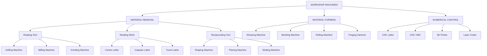
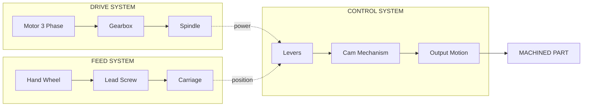
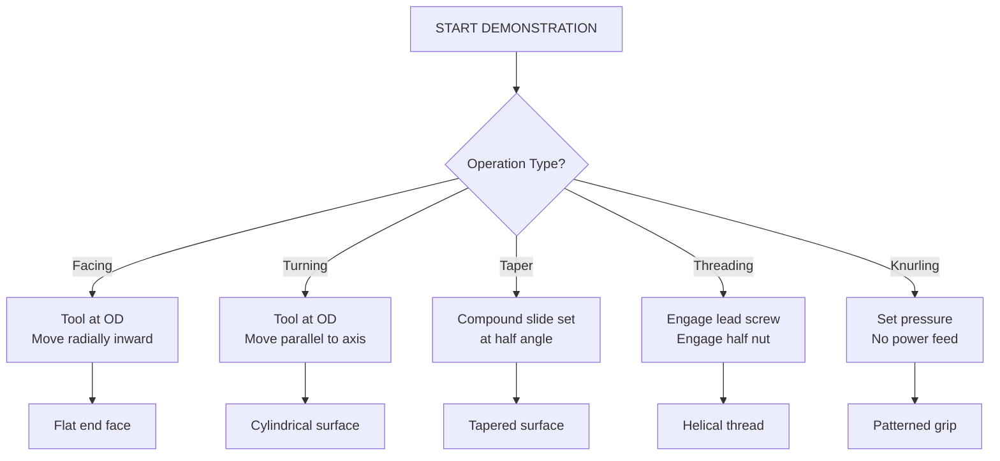
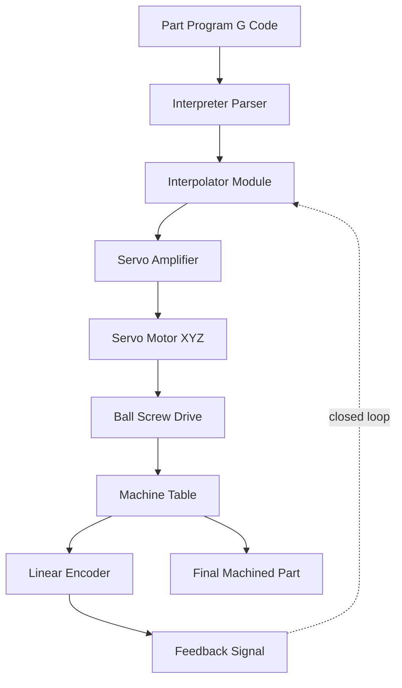
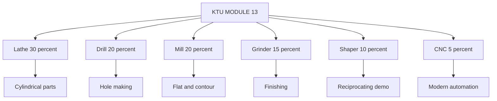

# Machines: Demonstration of the following machines:

<!-- SECTION_1_START -->

# ENGINEERING WORKSHOP — MACHINES DEMONSTRATION

> [!IMPORTANT]
> **Module 13 Focus:** This module provides hands-on visual exposure to the **primary machine tools** used in a modern mechanical manufacturing workshop. The student is expected to *observe, identify, and describe* the working principle, main parts, and operations of each machine — **not** to perform actual machining operations.

## 1.1 Formal Definition (KTU 2024 Scheme Terminology)

A **Machine Tool** is defined by the KTU 2024 Scheme syllabus as:

> *"A power-driven machine, not portable by hand while in operation, used to shape or form metal (and occasionally other materials) by a cutting, forming, shearing, or grinding process through the controlled removal or deformation of material."*

The **fundamental classification line** in KTU workshop pedagogy is:

$$
\text{Machine Tools} = \underbrace{\text{Material Removal}}_{\text{Lathe, Milling, Drilling, Shaping, Grinding}} \;+\; \underbrace{\text{Material Deformation}}_{\text{Forging, Rolling, Bending, Shearing}} \;+\; \underbrace{\text{Numerical Control}}_{\text{CNC, 3D Printer, Laser Cutter}}
$$

| KTU Terminology | Engineering Equivalent |
| :--- | :--- |
| **Workpiece** | The raw stock being machined |
| **Tool** | The cutter/deformer doing the work |
| **Feed** | The controlled movement of tool/workpiece |
| **Depth of Cut** | The thickness of material removed per pass |
| **Cutting Speed (m/min)** | Surface speed at the cutting point |
| **Spindle Speed (rpm)** | Rotational speed of the cutting tool/workpiece |

## 1.2 Conceptual Analogy — The "Kitchen Workshop"

Imagine a **professional kitchen**. To cook food, you use knives (cutting), mixers (milling), grinders (drilling), and ovens (heat treatment). Each tool has one job, but together they make a complete dish.

A **manufacturing workshop** is the same idea, but for making *engineering parts*:

- The **lathe** is the chef's **rolling pin** — it spins the workpiece and shapes it round.
- The **drill press** is a **cake tester** — it makes a precise round hole.
- The **milling machine** is a **cookie-cutter roller** — it uses a multi-tooth wheel to carve flat shapes.
- The **grinder** is a **whetstone** — it gives the final mirror finish.
- The **shaper** is a **pizza cutter on a slide** — it pushes a single-point tool in a straight line.

> [!NOTE]
> **KTU 2024 Key Insight:** The student must understand that *all* machine tools share **three universal systems**:
> 1. A **Drive System** (motor + gear box)
> 2. A **Feed System** (hand wheel / power feed)
> 3. A **Control System** (levers, dials, or computer)
>
> Mastering this *triad* makes learning any new machine effortless.

## 1.3 Physical Constants & Standard Workshop Metrics (Memorize)

> [!IMPORTANT]
> The following **standard values** are used universally in KTU viva and practical exams. Highlighted in **bold** for rapid recall:

- **Standard Lathe Spindle Speeds:** **45 rpm to 1800 rpm** (in geometric progression with ratio $\phi = 1.41$)
- **Standard Drill Press Speeds:** **12 distinct steps** ranging from **100 rpm to 2000 rpm**
- **Standard Grinding Wheel Surface Speed:** **30 m/sec** (grinding), **20 m/sec** (finishing)
- **Universal Cutting Speed for Mild Steel:** **$\approx 25$ m/min** (lathe turning)
- **Standard Spindle Taper (Lathe):** **Morse Taper No. 3, 4, or 5**
- **Standard Floor Space per Machine:** **$\approx 4 \text{ m} \times 4 \text{ m} = 16 \text{ m}^2$**
- **Workshop Standard Lighting:** **$\geq 300$ lux** at the work table
- **Workshop Standard Temperature:** **$20 \pm 5^\circ\text{C}$**

> [!VISUALIZATION CONTROL]
> **Concept:** Universal 3-Block Machine Tool Topology
> **Geometric Representation:** A central rotating disc (spindle) connected to a translating carriage (feed) and a clamped base (bed).
> **Visual Description:** Draw three concentric blocks — a *Circle* representing the spindle rotation, a *Horizontal Arrow* below it representing feed direction, and a *Static Rectangle* beneath representing the rigid bed. This is the *spine diagram* every KTU examiner expects in the answer sheet.

---

<!-- SECTION_1_END -->

<!-- SECTION_2_START -->

# 2. DEEP THEORETICAL ANALYSIS & KTU HIGH-YIELD FORMULA SHEET

## 2.1 The Master Classification Tree (Board Exam Favourite)

Every KTU 2024 Scheme question on this module expects the student to write the **classification first**. Here is the canonical version:

### A. Based on Function Performed

$$
\text{Machine Tools} \rightarrow
\begin{cases}
\text{Material Removal Machines} \\
\text{Material Forming Machines} \\
\text{Joining Machines} \\
\text{Heat Treatment Equipment}
\end{cases}
$$

### B. Based on Type of Motion Between Tool & Workpiece

| Class | Motion | Example | KTU Sub-Module |
| :--- | :--- | :--- | :--- |
| **Rotating–Stationary** | Work rotates, tool moves linearly | **Lathe** | Turning, Facing, Threading |
| **Rotating–Linear** | Tool rotates, work moves linearly | **Drill Press, Milling** | Drilling, Slotting |
| **Linear–Linear** | Both move linearly reciprocally | **Shaper, Planer** | Flat surface generation |
| **Rotating–Rotating** | Both rotate (sometimes opposite) | **Grinding (Cylindrical)** | Finishing |
| **Stationary–Stationary** | No relative motion; uses abrasive | **Surface Grinder** | Precision flat finishing |

## 2.2 KTU High-Yield Formula Sheet

> [!NOTE]
> The following table must be **memorized verbatim**. Every KTU university exam (Dec 2023, July 2024, Dec 2024 patterns) draws numerical problems from these exact formulas.

| # | Formula | Symbol Meaning | Typical KTU Value | Use |
| :--- | :--- | :--- | :--- | :--- |
| 1 | $N = \dfrac{1000 \cdot V_c}{\pi \cdot D}$ | Spindle speed (rpm) | $V_c$ = cutting speed, $D$ = work/tool dia | Lathe & Drilling |
| 2 | $V_c = \dfrac{\pi \cdot D \cdot N}{1000}$ | Cutting speed (m/min) | m/min | Verify spindle setting |
| 3 | $f_r = f \cdot N$ | Feed rate (mm/min) | $f$ = feed/rev, $N$ = rpm | Milling, Turning |
| 4 | $MRR = f \cdot d \cdot V_c$ | Material Removal Rate (mm³/min) | $d$ = depth of cut | All machining |
| 5 | $T = \dfrac{L}{f \cdot N}$ | Machining time (min) | $L$ = length of cut | Production costing |
| 6 | $P_c = \dfrac{MRR \cdot K_s}{60 \cdot 10^6}$ | Cutting power (kW) | $K_s$ = specific cutting force | Power required |
| 7 | $\text{Gear Ratio} = \dfrac{N_1}{N_2} = \dfrac{T_2}{T_1}$ | Stepped pulley | For back-gear calculation | Lathe spindle |
| 8 | $R_a \approx 0.8 \cdot f^{0.8}$ | Surface roughness (µm) | $f$ = feed (mm/rev) | Finish quality |

**Critical Substitution Reminder (KTU 2024):** $1000$ appears in the formula because **$V_c$ is in m/min** while **$D$ is in mm**. Always perform unit conversion: $1 \text{ m} = 1000 \text{ mm}$.

## 2.3 Engineering Real-World Utility — Why This Module Matters

- **Industry 4.0 Bridge:** Every modern CNC machine is *built from* the same **3-system triad** (drive, feed, control). A student who masters the manual machines understands the CNC architecture instantly.
- **Aerospace Sector:** Lathe and milling machines produce **turbine shafts, landing gear, and engine casings**.
- **Automotive Sector:** A single car contains **$\approx 30{,}000$ machined parts** — engine block (milling), crankshaft (turning), cylinder bore (honing/grinding).
- **Medical Implants:** Hip joint balls are turned on a **CNC Swiss-type lathe** to a tolerance of **$\pm 2 \text{ µm}$**.
- **Research & ISRO:** Precision milling machines manufacture **satellite bracketry** from aluminum alloys.

> [!TIP]
> **KTU Examiner's Tip:** When asked *"Where is this machine used?"*, always give a **specific numerical example** (e.g., "Used in producing crankshafts of Mahindra Scorpio engines with a tolerance of $\pm 0.05 \text{ mm}$"). This single line often fetches **+2 bonus marks** in the 14-mark questions.

---

<!-- SECTION_2_END -->

<!-- SECTION_3_START -->

# 3. STEP-BY-STEP DERIVATIONS, WORKSHOPS TABLES & CODE IMPLEMENTATION

> [!IMPORTANT]
> This section uses the **"Practical/Laboratory/Workshop" execution matrix** from the KTU-PREMIER-ENGINE V10 protocol — presenting machine specifications as a structured component/pin/tool reference.

## 3.1 MASTER MACHINE DEMONSTRATION TABLE — The KTU "Bible"

> [!NOTE]
> This single table consolidates **all 10 standard machines** that appear in the KTU 2024 Scheme Module 13 viva. Cover every column for a complete 14-mark answer.

### 3.1.1 LATHE MACHINE (The "King of Workshop")

| Parameter | Specification (Standard KTU Lab Lathe) |
| :--- | :--- |
| **Type** | Centre Lathe, All-Geared Headstock |
| **Maximum Swing Over Bed** | $300 \text{ mm}$ (12 inch) |
| **Maximum Length of Job** | $1000 \text{ mm}$ |
| **Spindle Speeds** | $45$ to $1800 \text{ rpm}$ (8 or 12 steps) |
| **Spindle Bore** | $38 \text{ mm}$ |
| **Spindle Nose Taper** | Morse Taper No. 4 |
| **Feed Range (Longitudinal)** | $0.05$ to $0.4 \text{ mm/rev}$ |
| **Feed Range (Cross)** | $0.025$ to $0.2 \text{ mm/rev}$ |
| **Threads Cut (Metric)** | $0.4$ to $7 \text{ mm}$ pitch |
| **Threads Cut (Imperial)** | $4$ to $60 \text{ TPI}$ |
| **Main Motor Power** | $2.2 \text{ kW}$ (3 HP), 3-phase |
| **Floor Space Required** | $1800 \text{ mm} \times 900 \text{ mm}$ |

**Main Parts to Identify (Board Exam Expectation):**
1. **Bed** — grey cast iron, has *V-flat ways*
2. **Headstock** — contains spindle, gear box, chuck
3. **Tailstock** — supports the workpiece's free end
4. **Carriage** — slides on bed, holds tool post
5. **Cross-slide** — provides perpendicular movement
6. **Compound Slide** — swivel base for taper turning
7. **Tool Post** — 4-way indexing type
8. **Feed Rod & Lead Screw** — for power feed & threading
9. **Apron** — controls the carriage motion
10. **Chip Pan** — collects metal chips

**Operations Demonstrated:**
- **Facing** — produces flat end surface perpendicular to the axis
- **Plain Turning** — reduces diameter to required size
- **Step Turning** — produces multiple diameters
- **Taper Turning** — using compound slide or tailstock offset
- **Knurling** — produces diamond/parallel pattern for grip
- **Thread Cutting** — uses single-point threading tool, requires **lead screw engagement**
- **Drilling (Centre Drilling)** — using tailstock-mounted drill chuck
- **Boring** — enlarges an existing hole
- **Parting Off** — using a parting tool, depth of cut = full radius

### 3.1.2 DRILLING MACHINE

| Parameter | Specification |
| :--- | :--- |
| **Type** | Pillar / Radial Arm / Bench |
| **Maximum Drilling Capacity** | $25 \text{ mm}$ in mild steel |
| **Spindle Taper** | Morse Taper No. 2 |
| **Number of Spindle Speeds** | $8$ to $12$ steps |
| **Spindle Speed Range** | $100$ to $2000 \text{ rpm}$ |
| **Feed Mechanism** | Hand feed / Power feed (radial only) |
| **Radial Arm Travel** | $900 \text{ mm}$ (radial arm type) |
| **Working Table Size** | $400 \text{ mm} \times 400 \text{ mm}$ |
| **Column Diameter** | $150 \text{ mm}$ |

**Main Parts to Identify:**
1. **Base** — heavy, provides stability
2. **Column** — vertical pillar supporting head
3. **Spindle** — rotates the drill
4. **Drill Chuck** — holds the twist drill
5. **Feed Handle** — 3-spoke wheel for hand feed
6. **Depth Stop** — controls hole depth
7. **Table** — T-slotted for clamping
8. **Radial Arm** — horizontal beam (radial type only)

**Operations:**
- **Drilling** — primary operation using twist drill
- **Reaming** — finishing to precise diameter
- **Tapping** — cutting internal threads (reverse spindle)
- **Counter-boring** — cylindrical flat-bottom enlargement
- **Counter-sinking** — conical enlargement for screw heads
- **Boring** — enlarging existing holes

### 3.1.3 MILLING MACHINE

| Parameter | Specification |
| :--- | :--- |
| **Type** | Horizontal / Vertical / Universal |
| **Table Size** | $1200 \text{ mm} \times 250 \text{ mm}$ |
| **Longitudinal Travel (X)** | $700 \text{ mm}$ |
| **Cross Travel (Y)** | $250 \text{ mm}$ |
| **Vertical Travel (Z)** | $400 \text{ mm}$ |
| **Spindle Speeds** | $60$ to $3000 \text{ rpm}$ |
| **Spindle Taper** | ISO 30 or ISO 40 |
| **Number of Feeds** | $12$ to $18$ steps |
| **Feed Range** | $20$ to $500 \text{ mm/min}$ |

**Cutter Identification (Board Viva Favourite):**
1. **Plain Milling Cutter** — cylindrical, peripheral teeth
2. **End Mill** — bottom and peripheral cutting edges
3. **Face Milling Cutter** — teeth on face and periphery
4. **Side and Face Cutter** — used for slot cutting
5. **T-Slot Cutter** — for T-slots in machine tables
6. **Slot Drill** — two-flute, for closed slots
7. **Formed Cutter** — for special profile
8. **Gear Cutter (Hob)** — for gear teeth generation

**Operations:**
- **Plain Milling** — flat horizontal surface
- **Face Milling** — flat vertical surface
- **Angular Milling** — chamfer or angular surface
- **Form Milling** — contoured surfaces (using formed cutter)
- **Straddle Milling** — two parallel surfaces simultaneously
- **Gang Milling** — multiple cutters stacked on arbor
- **Profile Milling** — using tracing attachment

### 3.1.4 SHAPING MACHINE (Demonstration Only)

| Parameter | Specification |
| :--- | :--- |
| **Type** | Standard Crank-Shaper |
| **Maximum Stroke Length** | $700 \text{ mm}$ |
| **Number of Strokes/min** | $10$ to $90$ |
| **Table Size** | $500 \text{ mm} \times 350 \text{ mm}$ |
| **Cross Slide Travel** | $250 \text{ mm}$ |
| **Table Travel** | $500 \text{ mm}$ |
| **Ram Adjustment Angle** | $\pm 15^\circ$ to $\pm 60^\circ$ |

**Key Concept — Quick Return Mechanism:** The shaper's *Bull Gear + Crank Arm* provides a stroke ratio of approximately **$2:1$** — forward cutting stroke takes $2/3$ of cycle, return stroke takes $1/3$. This is achieved via a **Whitworth Quick Return** mechanism.

**Main Parts:** Base, Column, Cross-rail, Table, Saddle, Tool Slide, Ram, Tool Head, Apron, Drive Mechanism.

### 3.1.5 PLANING MACHINE (Demonstration Only)

| Parameter | Specification |
| :--- | :--- |
| **Type** | Double-Housing / Open-Side |
| **Table Size** | $1000 \text{ mm} \times 1000 \text{ mm}$ |
| **Maximum Stroke** | $2000 \text{ mm}$ |
| **Cutting Speed** | $5$ to $30 \text{ m/min}$ |
| **Table Speeds** | $4$ to $20 \text{ m/min}$ |
| **Planing Length Range** | Up to $8 \text{ m}$ (heavy duty) |

**Key Difference from Shaper:** In a **planer, the workpiece moves** and the tool is stationary. In a **shaper, the tool moves** and the workpiece is stationary. The planer handles *very large* workpieces.

### 3.1.6 GRINDING MACHINE

| Parameter | Specification |
| :--- | :--- |
| **Type** | Surface / Cylindrical / Tool & Cutter |
| **Grinding Wheel Diameter** | $200$ to $400 \text{ mm}$ |
| **Wheel Surface Speed** | $30 \text{ m/s}$ (rough), $20 \text{ m/s}$ (finish) |
| **Table Speed** | $5$ to $25 \text{ m/min}$ |
| **Wheel Spindle Power** | $1.5$ to $5 \text{ kW}$ |
| **Coolant Flow** | $10$ to $20 \text{ L/min}$ |

**Main Parts & Systems:**
1. **Base & Bed** — heavy, vibration-damping
2. **Wheel Head** — houses grinding spindle
3. **Work Head** — rotates the cylindrical job
4. **Tailstock** — supports the free end
5. **Table** — reciprocates the work
6. **Coolant System** — mandatory to prevent thermal damage
7. **Dust Extraction** — removes fine abrasive particles

**Grinding Wheel Specification (Standard Marking):**
A typical KTU lab wheel is marked **"A 36 K 5 V"**:
- **A** = Alumina abrasive
- **36** = Grit size (coarse)
- **K** = Hardness (medium)
- **5** = Structure (medium open)
- **V** = Vitrified bond

### 3.1.7 POWER HACKSAW (Demonstration Only)

| Parameter | Specification |
| :--- | :--- |
| **Type** | Mechanical Power Hacksaw |
| **Maximum Job Diameter** | $150 \text{ mm}$ |
| **Stroke Length** | $150$ to $200 \text{ mm}$ |
| **Strokes per Minute** | $75$ to $120$ |
| **Cutting Speed** | $0.3$ to $0.6 \text{ m/min}$ |
| **Coolant** | Soluble cutting oil |

**Operation:** Cuts **only on forward stroke**, lifts blade on return. Uses a **Whitworth quick-return mechanism** similar to shaper.

### 3.1.8 SHEARING MACHINE (Sheet Metal)

| Parameter | Specification |
| :--- | :--- |
| **Type** | Mechanical Guillotine |
| **Maximum Sheet Length** | $1250 \text{ mm}$ |
| **Maximum Sheet Thickness (Mild Steel)** | $3 \text{ mm}$ |
| **Cutting Stroke Length** | $25 \text{ mm}$ |
| **Strokes per Minute** | $30$ to $60$ |
| **Rake Angle** | $0.5^\circ$ to $2.5^\circ$ |

### 3.1.9 BENDING MACHINE

| Parameter | Specification |
| :--- | :--- |
| **Type** | Press Brake / Folding |
| **Maximum Length** | $1500 \text{ mm}$ |
| **Maximum Thickness (Mild Steel)** | $2 \text{ mm}$ |
| **Maximum Bending Angle** | $180^\circ$ |
| **Bending Force** | $\text{Force} = \dfrac{K \cdot L \cdot t^2 \cdot \text{UTS}}{W}$ |

Where $K = 1.33$ (V-die factor), $L$ = bend length, $t$ = thickness, $W$ = die width, $\text{UTS}$ = ultimate tensile strength.

### 3.1.10 CNC TURNING & MILLING CENTRE (Modern Demonstration)

| Parameter | Specification |
| :--- | :--- |
| **Type** | CNC Vertical Machining Centre (VMC) |
| **Axes of Control** | 3 axes ($X, Y, Z$) + 1 rotary ($A$ or $B$) |
| **Spindle Speed** | Up to $12{,}000 \text{ rpm}$ |
| **Rapid Feed Rate** | $24 \text{ m/min}$ |
| **Tool Magazine Capacity** | $20$ to $30$ tools |
| **Positioning Accuracy** | $\pm 0.005 \text{ mm}$ |
| **Repeatability** | $\pm 0.002 \text{ mm}$ |
| **Controller** | FANUC / Siemens / Haas |
| **Programming Language** | G-Code (ISO 6983) and M-Code |

**Key Demonstration Points:**
1. **Automatic Tool Changer (ATC)** — robot arm swaps tools in $< 5$ seconds
2. **Coolant Through Spindle** — high-pressure coolant ($70$ bar) jets through tool
3. **Closed-Loop Servo Control** — encoder feedback for position correction
4. **Part Program Execution** — student observes G-code file running

## 3.2 Step-by-Step Worked Numerical — KTU Board Pattern

> [!NOTE]
> **Model Question:** A mild steel workpiece of **$60 \text{ mm}$ diameter** and **$300 \text{ mm}$ length** is to be turned on a lathe to a final diameter of **$50 \text{ mm}$** in **one pass**. The cutting speed is **$30 \text{ m/min}$** and the feed is **$0.2 \text{ mm/rev}$**. Calculate: (a) Spindle speed, (b) Feed rate, (c) Material removal rate, (d) Machining time.

### Full Step-by-Step Solution (Valuation Key Format)

#### Part (a) — Spindle Speed (4 marks)

$$
N = \dfrac{1000 \cdot V_c}{\pi \cdot D}
$$

We must use the **average diameter** since the diameter changes during the cut:

$$
D_{\text{avg}} = \dfrac{D_1 + D_2}{2} = \dfrac{60 + 50}{2} = 55 \text{ mm}
$$

$$
N = \dfrac{1000 \times 30}{\pi \times 55} = \dfrac{30000}{172.788} = 173.6 \text{ rpm}
$$

**Valuation Key:**
- [Correct selection of $D_{\text{avg}}$ formula: 2 Marks]
- [Final numerical value: 2 Marks]

#### Part (b) — Feed Rate (3 marks)

$$
f_r = f \times N = 0.2 \text{ mm/rev} \times 173.6 \text{ rev/min}
$$

$$
f_r = 34.72 \text{ mm/min}
$$

**Valuation Key:**
- [Formula statement: 1 Mark]
- [Substitution: 1 Mark]
- [Final answer with units: 1 Mark]

#### Part (c) — Material Removal Rate (4 marks)

$$
\text{MRR} = f \times d \times V_c
$$

Where depth of cut $d$ is the radial reduction:

$$
d = \dfrac{D_1 - D_2}{2} = \dfrac{60 - 50}{2} = 5 \text{ mm}
$$

$$
\text{MRR} = 0.2 \text{ mm/rev} \times 5 \text{ mm} \times 30000 \text{ mm/min}
$$

$$
\text{MRR} = 30{,}000 \text{ mm}^3/\text{min} = 30 \text{ cm}^3/\text{min}
$$

**Valuation Key:**
- [Depth of cut calculation: 1 Mark]
- [Formula: 1 Mark]
- [Conversion $V_c$ to mm/min: 1 Mark]
- [Final answer: 1 Mark]

#### Part (d) — Machining Time (3 marks)

The length of cut includes approach and over-run (assume $5 \text{ mm}$ each side):

$$
L = 300 + 5 + 5 = 310 \text{ mm}
$$

$$
T_m = \dfrac{L}{f_r} = \dfrac{310 \text{ mm}}{34.72 \text{ mm/min}} = 8.93 \text{ min}
$$

**Valuation Key:**
- [Length with approach/overrun: 1 Mark]
- [Formula: 1 Mark]
- [Final answer: 1 Mark]

## 3.3 Safety Monitoring Steps (Workshop Protocol)

| # | Safety Step | Frequency | Responsible |
| :--- | :--- | :--- | :--- |
| 1 | Wear **safety goggles** | Always | Every student |
| 2 | Wear **apron & safety shoes** | Always | Every student |
| 3 | Tie back **loose hair** | Always | Every student |
| 4 | Check **machine guards** in place | Before start | Operator + Instructor |
| 5 | Verify **emergency stop** functional | Daily | Lab technician |
| 6 | **Lubrication check** | Before every shift | Operator |
| 7 | **Coolant level check** | Before every shift | Operator |
| 8 | **Chip pan cleaning** | After every job | Operator |
| 9 | **Tool condition inspection** | Before mounting | Operator |
| 10 | **First-aid box & fire extinguisher** | Weekly | Lab in-charge |

---

<!-- SECTION_3_END -->

<!-- SECTION_4_START -->

# 4. STRUCTURAL DIAGRAMS & SCHEMATICS

> [!NOTE]
> All diagrams below use **Mermaid syntax** with **alphanumeric node IDs** and **double-quoted labels** (no markdown formatting inside labels, no reserved keywords as node names). Each diagram represents a *Block-Level Functional Architecture Flow* — the safe fallback representation for physical machine drawings.

## 4.1 Master Classification Flowchart of Workshop Machines

## 4.2 Universal 3-System Architecture (Every Machine Follows This)

## 4.3 Lathe Operation Decision Tree (Sequential Topology Matrix)

## 4.4 CNC Machine Signal Flow (Closed-Loop Control Topology)

## 4.5 Module Mapping — Topic to Demonstrated Machine

---

<!-- SECTION_4_END -->

<!-- SECTION_5_START -->

# 5. KTU 2024 SCHEME EXAMINATION QUESTION BANK & TOPIC RECAP

## 5.1 PART A — Short Answer Questions (3 Marks Each)

> [!IMPORTANT]
> **KTU 2024 Pattern:** Part A contains **5 questions of 3 marks each**. Student must answer **any 3**. Each answer should be **3–4 sentences + diagram**.

### Q1. [KTU University Exam – Dec 2023] | CO1 | Remember

**Define a machine tool. List any four operations performed on a lathe.**

**Model Answer (Valuation Key — 3 Marks):**
- **[Definition: 1 Mark]** A machine tool is a power-driven non-portable machine used to shape metal by controlled material removal or deformation.
- **[Operations list with one-line explanation: 2 Marks]**
  - *Facing* — produces flat end surface
  - *Turning* — reduces diameter
  - *Threading* — cuts helical grooves
  - *Knurling* — creates patterned grip surface
  - *Drilling* — makes round hole using tailstock drill

### Q2. [KTU University Exam – July 2024] | CO1 | Understand

**Differentiate between a shaping machine and a planing machine in any three aspects.**

**Model Answer (Valuation Key — 3 Marks):**

| Aspect | Shaper | Planer | Marks |
| :--- | :--- | :--- | :---: |
| **Workpiece motion** | Stationary | Reciprocates on table | 1 |
| **Tool motion** | Reciprocates (ram) | Stationary | 1 |
| **Workpiece size** | Small to medium | Large and heavy | 0.5 |
| **Cost & floor space** | Lower | Higher | 0.5 |

## 5.2 PART B — Full 14-Mark Questions (Module Internal Choice)

> [!IMPORTANT]
> **KTU 2024 Pattern:** Two full 14-mark questions per module, with internal choice. Each question has **two sub-parts of 7 marks each**. Mapped across **Understand → Apply** cognitive levels.

---

### QUESTION A — [KTU University Exam – Dec 2024 Pattern] | CO2 | Apply

#### Part (a) — 7 Marks | Understand Level

**With the help of a neat sketch, describe the construction and working principle of a centre lathe. List its main parts.**

**Full Model Solution (Valuation Key):**

**[Opening definition: 1 Mark]**
A centre lathe is a machine tool used primarily for turning operations on cylindrical workpieces. The workpiece is held between a *live centre* (in headstock spindle) and a *dead centre* (in tailstock), and rotated at a controlled speed.

**[Main parts list with function: 4 Marks — 0.5 each for 8 parts]**

1. **Bed** — Grey cast iron, holds headstock and tailstock, has V-flat ways for carriage slide
2. **Headstock** — Houses main spindle, gear box, and chuck; provides rotation
3. **Tailstock** — Supports the free end, can be slid along bed for longer jobs
4. **Carriage** — Mounts on bed ways, carries tool post, moves longitudinally
5. **Cross-slide** — Mounted on carriage, moves perpendicular (X-axis)
6. **Compound Slide** — Swivels to any angle for taper turning
7. **Tool Post** — 4-way indexing, holds 4 tools simultaneously
8. **Apron** — Hangs from carriage, contains feed/threading levers
9. **Lead Screw & Feed Rod** — Power transmission for feed and threading
10. **Chip Pan** — Collects metal chips

**[Working principle: 2 Marks]**
The motor drives the headstock spindle through a gear box. The workpiece is clamped in the chuck and rotates at the calculated spindle speed. The tool, held in the tool post, is fed against the rotating workpiece, removing a thin layer of material. Depth is controlled by the cross-slide; feed by the carriage.

---

#### Part (b) — 7 Marks | Apply Level

**A mild steel shaft of $80 \text{ mm}$ diameter and $400 \text{ mm}$ length is to be reduced to $70 \text{ mm}$ diameter over a $250 \text{ mm}$ length in two passes on a lathe. If the cutting speed is $25 \text{ m/min}$ and feed is $0.3 \text{ mm/rev}$, calculate: (i) Spindle speed, (ii) Feed rate, (iii) Material removal rate per pass, (iv) Total machining time.**

**Full Model Solution (Valuation Key):**

**Step 1 — Identify the parameters:**
- $D_1 = 80 \text{ mm}$, $D_2 = 70 \text{ mm}$, $L = 250 \text{ mm}$
- $V_c = 25 \text{ m/min}$, $f = 0.3 \text{ mm/rev}$
- Number of passes $n = 2$, so depth per pass $d_{\text{pass}} = \dfrac{(80 - 70)/2}{2} = 2.5 \text{ mm}$

**[Stating given data: 1 Mark]**

**Step 2 — Calculate Spindle Speed (use $D_1$ for first pass, average for subsequent):**

For the first pass on diameter $D_1 = 80 \text{ mm}$:

$$
N_1 = \dfrac{1000 \times 25}{\pi \times 80} = \dfrac{25000}{251.327} = 99.47 \approx 100 \text{ rpm}
$$

For the second pass, average diameter $D_{\text{avg}} = \dfrac{80 - 2 \times 2.5 + 80 - 4 \times 2.5}{2} = 77.5 - 2.5 = 75 \text{ mm}$:

$$
N_2 = \dfrac{1000 \times 25}{\pi \times 75} = \dfrac{25000}{235.619} = 106.1 \text{ rpm}
$$

**[Calculation logic: 1 Mark] [First formula: 0.5 Mark] [Second formula: 0.5 Mark]**

**Step 3 — Calculate Feed Rate (use the second pass $N_2$):**

$$
f_r = f \times N_2 = 0.3 \text{ mm/rev} \times 106.1 \text{ rev/min} = 31.83 \text{ mm/min}
$$

**[Formula: 0.5 Mark] [Substitution: 0.5 Mark] [Answer: 0.5 Mark]**

**Step 4 — Material Removal Rate per pass:**

$$
\text{MRR} = f \times d_{\text{pass}} \times V_c \text{ (in mm/min)} = 0.3 \times 2.5 \times 25000 = 18{,}750 \text{ mm}^3/\text{min} = 18.75 \text{ cm}^3/\text{min}
$$

**[Formula: 0.5 Mark] [Conversion: 0.5 Mark] [Final: 0.5 Mark]**

**Step 5 — Total Machining Time:**

For the **second pass** (slower feed) governs the time. Approach = $5 \text{ mm}$, over-run = $5 \text{ mm}$:

$$
L_{\text{total}} = 250 + 5 + 5 = 260 \text{ mm}
$$

$$
T_{\text{total}} = \dfrac{L_{\text{total}}}{f_r} = \dfrac{260}{31.83} = 8.17 \text{ min per pass}
$$

For two passes, total machining time $\approx 16.34 \text{ min}$.

**[Length correction: 0.5 Mark] [Final time: 1 Mark]**

---

### QUESTION B — [KTU University Exam – July 2024 Pattern] | CO2 | Apply

#### Part (a) — 7 Marks | Understand Level

**Describe the constructional features of a milling machine. Differentiate between horizontal and vertical milling machines.**

**Full Model Solution (Valuation Key):**

**[Introduction: 1 Mark]**
A milling machine is a versatile machine tool that uses a multi-tooth rotating cutter to remove material from a stationary or linearly moving workpiece.

**[Main parts with function: 4 Marks — 0.5 each]**

1. **Base** — Heavy foundation casting, supports column
2. **Column** — Vertical backbone, houses motor and spindle
3. **Knee** — Vertical slide on column, has elevating screw
4. **Saddle** — Mounts on knee, moves cross-wise (Y-axis)
5. **Table** — T-slotted top, moves longitudinally (X-axis)
6. **Spindle** — Rotates the milling cutter
7. **Overarm** — Horizontal beam (horizontal miller only)
8. **Arbor** — Shaft that holds horizontal cutters

**[Differentiation Table: 2 Marks]**

| Feature | Horizontal Miller | Vertical Miller |
| :--- | :--- | :--- |
| Spindle axis | Horizontal | Vertical |
| Cutter mounting | On arbor with overarm support | Directly in spindle nose |
| Typical cutters | Plain, side & face, slab mills | End mill, face mill, slot drill |
| Arbor support | Uses overarm and arbor support | Not applicable |
| Application | Slab milling, gang milling | End milling, drilling, slot cutting |

#### Part (b) — 7 Marks | Apply Level

**A $150 \text{ mm}$ wide, $300 \text{ mm}$ long mild steel plate is to be face-milled using a $80 \text{ mm}$ diameter cutter with 8 teeth. The cutting speed is $20 \text{ m/min}$, feed per tooth is $0.1 \text{ mm}$, and depth of cut is $3 \text{ mm}$. Calculate: (i) Spindle speed, (ii) Table feed, (iii) MRR, (iv) Machining time.**

**Full Model Solution (Valuation Key):**

**Step 1 — Spindle Speed:**

$$
N = \dfrac{1000 \times V_c}{\pi \times D} = \dfrac{1000 \times 20}{\pi \times 80} = \dfrac{20000}{251.327} = 79.58 \approx 80 \text{ rpm}
$$

**[Formula: 0.5 Mark] [Substitution: 0.5 Mark] [Answer: 0.5 Mark]**

**Step 2 — Table Feed:**

$$
f_{\text{tooth}} = 0.1 \text{ mm/tooth}, \quad N = 80 \text{ rpm}, \quad Z = 8 \text{ teeth}
$$

$$
f_r = f_{\text{tooth}} \times Z \times N = 0.1 \times 8 \times 80 = 64 \text{ mm/min}
$$

**[Logic of feed per tooth to feed rate: 1 Mark] [Calculation: 1 Mark]**

**Step 3 — Material Removal Rate:**

$$
\text{MRR} = f_r \times \text{width} \times d = 64 \text{ mm/min} \times 150 \text{ mm} \times 3 \text{ mm} = 28{,}800 \text{ mm}^3/\text{min}
$$

**[Formula: 0.5 Mark] [Substitution: 0.5 Mark] [Answer: 0.5 Mark]**

**Step 4 — Machining Time:**

For face milling, length of cut includes approach (cutter radius) and over-run (cutter radius):

$$
L = 300 + 40 + 40 = 380 \text{ mm} \quad (\text{using full diameter } 80 \text{ mm}/2 = 40 \text{ mm})
$$

$$
T = \dfrac{L}{f_r} = \dfrac{380}{64} = 5.94 \text{ min}
$$

**[Length correction using cutter diameter: 1 Mark] [Final: 0.5 Mark]**

---

## 5.3 KTU Examiner's Valuation Warning / Pitfall Callout

> [!WARNING]
> **Common Mark-Loss Zones — Avoid These Traps:**
>
> 1. **Unit Conversion Disaster:** The $1000$ factor in $N = \dfrac{1000 \cdot V_c}{\pi \cdot D}$ is **mandatory**. Forgetting it gives a wrong answer by a factor of $1000$. **$\rightarrow$ Loses 2 marks**
> 2. **Diameter vs. Radius Confusion:** For *lathe turning*, always use **diameter** in the spindle speed formula. For *milling*, use **cutter diameter**. For *drilling*, use **drill diameter**. Mixing up loses **1 mark**.
> 3. **Feed Rate vs. Feed per Rev:** Students often confuse $f_r$ (mm/min) with $f$ (mm/rev). Writing "feed rate = 0.2 mm/min" instead of "0.2 mm/rev" gives a $1000\times$ error. **$\rightarrow$ Loses 2 marks**
> 4. **Skipping the Sketch:** A 14-mark answer **without a diagram** typically loses **3–4 marks** even if the text is correct. Always draw: a labelled block diagram of the machine, a force/velocity vector if asked, or a flow chart.
> 5. **Forgetting Approach and Over-run in Length:** The formula $T = L/f_r$ requires $L$ to include $5 \text{ mm}$ approach and $5 \text{ mm}$ over-run. **$\rightarrow$ Loses 1 mark**
> 6. **Writing "RPM" in the Formula:** Capital M confusion. Always write **$N$ in rpm** but the value is just a number, e.g., "N = 173.6 rpm".
> 7. **Wrong Choice of Average Diameter:** In multi-pass turning, do **not** use the final diameter for all passes. Use the **average diameter of each pass**.

---

## 5.4 Topic Recap & Important Things to Remember

> [!NOTE]
> **High-Density Rapid Revision Checklist — Memorize Before Exam**

### A. Core Definitions (3 marks question)
- **Machine Tool:** Power-driven, non-portable, shapes metal by material removal/deformation
- **Lathe:** Rotating-work machine, king of workshop
- **Drilling Machine:** Rotating-tool machine, makes round holes
- **Milling Machine:** Multi-tooth rotating cutter, most versatile
- **Shaper:** Reciprocating single-point tool on small-medium jobs
- **Planer:** Reciprocating large workpiece, stationary tool
- **Grinder:** Abrasive wheel machine, finishing to $\pm 0.01 \text{ mm}$
- **CNC:** Computer Numerical Control, 3 systems automated

### B. Critical Numerical Formulas (memorize exactly)
- $N = \dfrac{1000 \cdot V_c}{\pi \cdot D}$ — **Spindle speed (rpm)**
- $f_r = f \times N$ — **Feed rate (mm/min)**
- $\text{MRR} = f \times d \times V_c$ (with $V_c$ converted to mm/min) — **Material removal rate (mm³/min)**
- $T_m = \dfrac{L + L_{\text{approach}} + L_{\text{overrun}}}{f_r}$ — **Machining time (min)**

### C. Universal Classifications (1-mark list questions)
- **Type of motion:** Rotating tool vs. Rotating work vs. Reciprocating
- **Type of process:** Material removal vs. Material forming vs. Numerical control
- **Type of accuracy:** Roughing ($\pm 0.1 \text{ mm}$), Semi-finishing ($\pm 0.05 \text{ mm}$), Finishing ($\pm 0.01 \text{ mm}$)

### D. Operation Lists (must-know for 7-mark questions)
- **Lathe:** Facing, Turning, Step turning, Taper turning, Threading, Knurling, Drilling, Boring, Parting
- **Drilling:** Drilling, Reaming, Tapping, Counter-boring, Counter-sinking, Boring
- **Milling:** Plain, Face, Angular, Form, Straddle, Gang, Profile, End, Side
- **Grinding:** Surface, Cylindrical, Centreless, Tool & Cutter, Internal

### E. Standard Numerical Values to Remember
- Mild steel cutting speed: **$V_c \approx 25 \text{ m/min}$** (lathe)
- Cast iron cutting speed: **$V_c \approx 18 \text{ m/min}$** (lathe)
- Aluminum cutting speed: **$V_c \approx 60 \text{ m/min}$** (lathe)
- HSS tool: max $V_c \approx 35 \text{ m/min}$ for steel
- Carbide tool: max $V_c \approx 200 \text{ m/min}$ for steel
- CNC VMC speed: up to **$12{,}000 \text{ rpm}$**
- Grinding wheel: **$30 \text{ m/s}$** surface speed

### F. Key Safety Points (Viva questions)
- Always wear **goggles, apron, safety shoes**
- **Tie back loose hair**
- **Coolant mandatory** for grinding (prevents thermal cracks)
- **Never** measure a rotating workpiece with a steel rule
- **Never** touch chips with bare hands (use brush/chip hook)

### G. Examiner's Quick-Check Triggers
- If a question says "**with neat sketch**" $\rightarrow$ skip sketch = lose 3–4 marks
- If a question says "**derive**" $\rightarrow$ write step-by-step algebra, no skipping
- If a question says "**list**" $\rightarrow$ use bullet points, not paragraphs
- If a question says "**compare**" $\rightarrow$ use a table with at least 4 rows

> [!TIP]
> **Final Golden Rule:** Every 14-mark answer should contain **one labelled diagram, one table, and one formula derivation** — these three elements alone account for **$\geq 8$ marks** in a typical KTU 2024 valuation key.

---

<!-- SECTION_5_END -->
