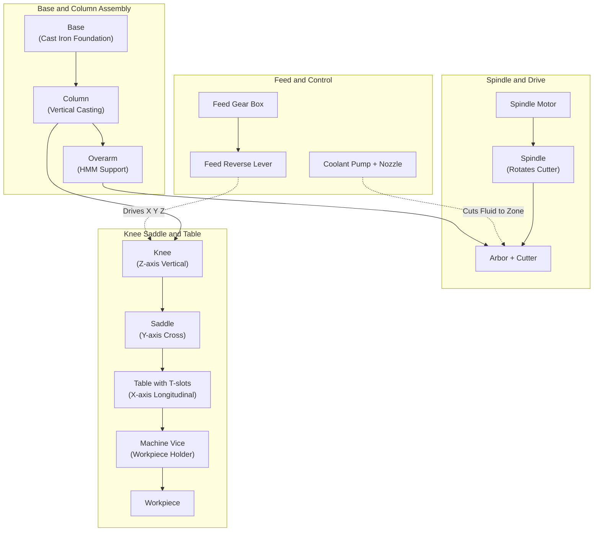
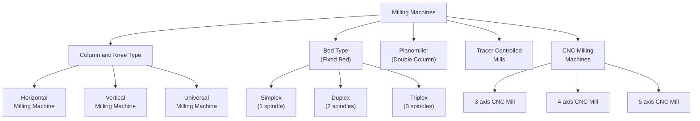
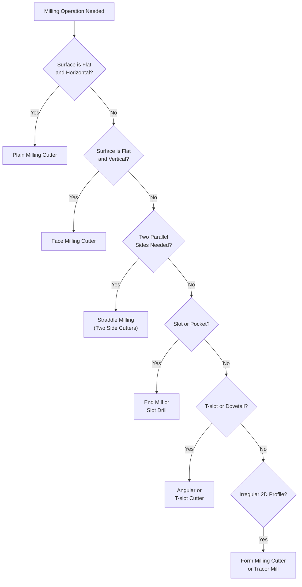

# Milling machine

<!-- SECTION_1_START -->

# Milling Machine — Core Technical Definition & Intuitive Overview

## Formal KTU 2024 Scheme Definition

> [!IMPORTANT]
> **Milling Machine**: A **milling machine** is a multi-point, rotary cutter-based machine tool used in manufacturing to remove material from a workpiece by advancing (or feeding) the workpiece into a rotating cylindrical tool having multiple cutting edges. The rotating cutter held on the **arbor** or **spindle** performs the cutting action, while the workpiece is clamped on a movable **table** capable of precise linear movements along **X, Y, and Z axes**.

In the KTU 2024 *Engineering Workshop* syllabus (GCESL106, Module 13), the milling machine is classified as a **demonstration-only machine tool** — students must study its principle, parts, operations, and tooling but need not perform hands-on machining.

> [!NOTE]
> **Syllabus Highlight (Module 13):** "Machines — demonstration of the following machines" — Milling, Shaping, Planing, Drilling, Grinding, CNC. For each, the focus is on **working principle, main parts, operations performed, and safety precautions**.

## Conceptual Analogy / Intuition

Imagine a **chisel that cuts while spinning** rather than while being struck. Now imagine a hundred chisels arranged in a circle, all spinning together. That is essentially a milling cutter. The spinning cutters chip away metal in tiny, uniform pieces (called **chips**), much like a **wood router** or a **carpentry shaper** — but operating on metal with extreme precision.

Think of the milling machine as a **3-D printer in reverse**: instead of *adding* material layer-by-layer, it *subtracts* material by guiding a spinning tool across a stationary (or slowly moving) workpiece to carve the desired shape.

- **Workpiece** → the **canvas**
- **Milling cutter** → the **paintbrush** (but spinning)
- **Table movement (X, Y, Z)** → the **painter's hand**
- **Coolant** → the **water that keeps the brush cool** (prevents overheating)

## Key Standards & Physical Parameters

- **Cutting speed (V)** is typically **10 to 30 m/min** for mild steel, **20 to 60 m/min** for aluminum, and **60 to 120 m/min** for brass.
- **Spindle speed (N)** range on a standard milling machine: **30 to 3000 rpm**.
- **Feed rate (f)** range: **20 to 1000 mm/min**.
- **Standard arbor taper**: **ISO 40 / NT 40 / BT 40** (international standard for tool holding).
- **HMT Bridgeport-type** milling machine column-and-knee is the most common demonstration model used in Indian engineering workshops.

> [!TIP]
> A milling machine is called **multi-point cutting** because the cutter has **multiple teeth** cutting simultaneously — unlike a lathe tool (single-point cutting) or a drill (two-point cutting).

<!-- SECTION_1_END -->

<!-- SECTION_2_START -->

# Deep Theoretical Analysis & KTU High-Yield Formula Sheet

## 1. Working Principle

The milling machine operates on the principle of **rotary multi-point cutting**:

1. A multi-tooth **milling cutter** is mounted on the **spindle** (or arbor) and rotated at a programmed **spindle speed (N)** in rpm.
2. The **workpiece** is rigidly clamped on the **machine table** using **vises, clamps, or fixtures**.
3. The table moves the workpiece against the rotating cutter along one or more of the **three linear axes**:
   - **X-axis** → Longitudinal (left–right, along the cutter axis)
   - **Y-axis** → Cross (in–out, perpendicular to spindle)
   - **Z-axis** → Vertical (up–down, parallel to spindle)
4. Material is removed as **discontinuous chips** by successive teeth of the cutter.
5. A **coolant** (cutting fluid) is sprayed to reduce heat, improve tool life, and flush away chips.

> [!NOTE]
> **Up Milling vs Down Milling**:
> - **Up Milling (Conventional)**: Cutter rotates *against* the feed direction. Chip thickness starts at zero and increases. Tool life is better but surface finish is rougher.
> - **Down Milling (Climb)**: Cutter rotates *with* the feed direction. Chip thickness starts maximum and decreases. Better surface finish but requires a backlash-free machine.

## 2. Classification of Milling Machines

| Type | Sub-Category | Key Feature | Application |
|------|--------------|-------------|-------------|
| **Column & Knee Type** | Horizontal Milling Machine (HMM) | Spindle horizontal; arbor supported by overarm | General-purpose slotting, straddle milling |
| | Vertical Milling Machine (VMM) | Spindle vertical; cutter held in collet/chuck | Drilling, end milling, face milling |
| | Universal Milling Machine | Table swivels ±45° | Helical/gear cutting, angular work |
| **Bed Type (Fixed Bed)** | Simplex / Duplex / Triplex | No knee; table moves on fixed bed | Heavy-duty production work |
| **Planomiller** | Double-column | Very large table, two vertical spindles | Machining large flat surfaces |
| **Tracer Controlled** | 2-D / 3-D tracer | Follows a template | Die and mold复制 |
| **CNC Milling** | 3-axis / 4-axis / 5-axis | Computer numerically controlled | Modern high-precision work |

## 3. Main Parts of a Column & Knee Type Milling Machine

- **Base**: Heavy cast-iron foundation, supports the column, holds **coolant tank** and **lubrication pump**.
- **Column**: Vertical upright casting; houses **spindle drive**, **spindle motor**, and gear box. Top of column has the **overarm** mounting slot for HMM.
- **Knee**: Mounted on the **vertical dovetail slide** of the column. Moves **up and down (Z-axis)** via a vertical leadscrew. Carries the saddle and table.
- **Saddle**: Slides **cross-wise (Y-axis)** on the knee dovetail.
- **Table**: The top-most member; slides **longitudinally (X-axis)** on the saddle. Has **T-slots** for clamping workpieces and fixtures.
- **Spindle**: Rotates the cutter; held in precision **tapered roller bearings**.
- **Arbor**: Horizontal shaft for HMM cutters; supported between spindle nose and **overarm** bearing.
- **Overarm**: Extends from column top, supports the arbor's outer end (HMM only).
- **Feed Mechanism**: Provides automatic X, Y, Z feeds via a single **feed reverse lever** and individual clutch selections.
- **Coolant System**: Pump, tank, nozzles — supplies cutting fluid to the cutting zone.

## 4. Common Milling Cutters (Tooling)

- **Plain (Slab) Milling Cutter**: Cylindrical, helical teeth, used for **plain milling** of flat surfaces.
- **Side Milling Cutter**: Teeth on periphery and sides, used for **straddle milling**.
- **End Mill**: Has cutting edges on end face and periphery, used for **slotting, profiling, pocketing**.
- **Face Mill**: Large-diameter cutter with inserted carbide tips, used for **face milling** of large flat surfaces.
- **T-Slot Cutter**: Used to cut **T-slots** in tables, fixtures, and machine beds.
- **Angular Milling Cutter**: Single-angle or double-angle, used for **angular surfaces, dovetails, tool bits**.
- **Form Milling Cutter**: Profile-shaped, used to cut **contoured surfaces** (concave, convex, gear teeth).
- **Slot Drill / Woodruff Cutter**: Small cutters for **keyways and semi-cylindrical slots**.
- **Fly Cutter**: Single-point tool held in a rotating body, used for **large-diameter face milling** (low cost).

## 5. Common Milling Operations

| # | Operation | Cutter Used | Result |
|---|-----------|-------------|--------|
| 1 | **Plain (Slab) Milling** | Plain milling cutter | Flat horizontal surface |
| 2 | **Face Milling** | Face mill | Flat surface perpendicular to cutter axis |
| 3 | **Straddle Milling** | Two side-milling cutters on arbor | Two parallel vertical surfaces simultaneously |
| 4 | **Gang Milling** | Multiple cutters on one arbor | Several surfaces machined in one pass |
| 5 | **Angular Milling** | Single/double angle cutter | Inclined or dovetailed surfaces |
| 6 | **Form Milling** | Profile cutter | Convex/concave or irregular profile |
| 7 | **End Milling** | End mill | Slots, pockets, contours |
| 8 | **Profile Milling** | Form cutter or end mill following a template | 2-D outline shape |
| 9 | **T-Slot Milling** | T-slot cutter (after slot drill) | T-shaped slot |

## 6. KTU High-Yield Formula Sheet

| Quantity | Formula | Units | Description |
|----------|---------|-------|-------------|
| Cutting Speed (V) | $V = \dfrac{\pi \cdot D \cdot N}{1000}$ | m/min | $D$ = cutter $\varnothing$ (mm), $N$ = rpm |
| Spindle Speed (N) | $N = \dfrac{1000 \cdot V}{\pi \cdot D}$ | rpm | Reverse of V |
| Feed per Tooth (f$_z$) | $f_z = \dfrac{f}{N \cdot z}$ | mm/tooth | $f$ = feed rate, $z$ = number of teeth |
| Feed Rate (f) | $f = N \cdot z \cdot f_z$ | mm/min | Linear table travel per minute |
| Material Removal Rate (MRR) | $\text{MRR} = w \cdot d \cdot f$ | mm³/min | $w$ = width, $d$ = depth of cut |
| Metal Removal Rate (volumetric) | $\text{MRR} = \dfrac{w \cdot d \cdot v_f}{1000}$ | cm³/min | $v_f$ in mm/min |
| Machining Time (t$_m$) | $t_m = \dfrac{L + L_a}{f}$ | min | $L$ = table travel, $L_a$ = approach length |
| Power (P) | $P = \dfrac{\text{MRR} \cdot K_c}{60 \cdot 10^6 \cdot \eta}$ | kW | $K_c$ = specific cutting energy (N/mm²), $\eta$ = efficiency |
| Tooth Engagement Angle ($\phi$) | $\cos\phi = 1 - \dfrac{2 \cdot a_e}{D}$ | rad | $a_e$ = radial depth |

> [!NOTE]
> **Workpiece Material → Cutting Speed (V) Reference Values**:
> - Mild Steel: **20–30 m/min** (HSS cutter)
> - Cast Iron: **15–25 m/min**
> - Aluminum: **60–100 m/min**
> - Brass: **40–70 m/min**

## 7. Real-World Engineering Utility

- **Aerospace**: Wing skins, ribs, spar webs — all face-milled on 5-axis CNC mills.
- **Automotive**: Engine blocks, cylinder heads, gearbox housings (transfer lines with multiple milling stations).
- **Die & Mold**: CNC milling + tracer mills produce forging/casting dies from hardened tool steel.
- **Defense**: Missile bodies, gun barrels (skiving), armor plates.
- **Medical**: Titanium implants and surgical instruments.
- **General Manufacturing**: Slots, keyways, gear teeth, splines, jigs, fixtures.

The milling machine is the **workhorse of subtractive manufacturing** — it forms the backbone of any machine shop, from a college lab to a Tier-1 aerospace supplier.

<!-- SECTION_2_END -->

<!-- SECTION_3_START -->

# Step-by-Step Derivations, Calculations & Workshop Implementation

## A. Worked Numerical Example — Spindle Speed and Feed Rate Calculation

### Problem

> A **50 mm diameter HSS plain milling cutter** with **8 teeth** is used to machine a mild steel workpiece. The recommended **cutting speed is 25 m/min** and the **feed per tooth is 0.10 mm/tooth**. Calculate the **spindle speed (N)** and the **table feed rate (f)**.

### Step-by-Step Solution

**Given:**
- Cutter diameter, $D = 50$ mm
- Number of teeth, $z = 8$
- Cutting speed, $V = 25$ m/min
- Feed per tooth, $f_z = 0.10$ mm/tooth

**Step 1: Spindle Speed (N)**

$$N = \dfrac{1000 \cdot V}{\pi \cdot D}$$

$$N = \dfrac{1000 \times 25}{\pi \times 50}$$

$$N = \dfrac{25000}{157.08}$$

$$\boxed{N \approx 159.15 \text{ rpm} \approx 160 \text{ rpm}}$$

[Substituting values: 1 Mark; π × 50: 1 Mark; Final N: 1 Mark]

**Step 2: Feed Rate (f)**

$$f = N \cdot z \cdot f_z$$

$$f = 160 \times 8 \times 0.10$$

$$f = 128 \text{ mm/min}$$

$$\boxed{f = 128 \text{ mm/min}}$$

[Formula: 1 Mark; Substitution: 1 Mark; Final value with units: 1 Mark]

**Step 3: MRR (Extra — for 2 mm depth, 50 mm width)**

$$\text{MRR} = w \cdot d \cdot f = 50 \times 2 \times 128 = 12800 \text{ mm}^3/\text{min} = 12.8 \text{ cm}^3/\text{min}$$

---

## B. Step-by-Step Procedure — Setting Up a Milling Machine for Demonstration

> This is a typical **lab demonstration** procedure, aligned with the KTU workshop module.

| Step | Action | Tools / Components | Safety Check |
|------|--------|--------------------|--------------|
| **1** | **Identify the machine** and read the nameplate (make, model, max spindle speed, table size, motor power). | Nameplate, manual | Confirm power supply **415 V, 3-phase** and proper earthing. |
| **2** | **Clean the machine table** with brush and wipe; remove all chips and oil residue. | Wire brush, cotton waste, kerosene | Ensure **EMERGENCY STOP** is reachable. |
| **3** | **Inspect the milling cutter** for chipped teeth, excessive wear, or cracks. Reject if damaged. | Plain/end mill cutter | Wear **safety goggles** while inspecting. |
| **4** | **Mount the cutter**: For HMM, insert the **arbor** through the spindle, slide the cutter on, add the **driving key**, tighten the **locking nut** with a spanner. For VMM, insert the cutter in a **collet** or **end-mill holder** and tighten. | Arbor, spanner, collet, chuck | Check cutter **runs true** (no wobble) by rotating spindle slowly by hand. |
| **5** | **Clamp the workpiece** in a **machine vice** or directly on the table using **step blocks, clamps, studs, and T-nuts**. | Vice, T-nuts, studs, clamps, spanner | Ensure workpiece protrudes **minimum required length** for the cut, but the bulk of the material is supported. |
| **6** | **Indicate / Align the workpiece** using a **dial test indicator (DTI)** so that the surface to be machined is parallel to the table travel. | DTI, magnetic base | Clamp DTI on spindle carefully. |
| **7** | **Set the spindle speed** using the **speed selector levers** to the calculated rpm. | Lever/knob | Verify with tachometer before cutting. |
| **8** | **Set the feed rate** using the **feed selector** and engage the **feed reverse lever**. | Feed selector | Test in **dry run** (table motion, no contact) first. |
| **9** | **Bring the cutter close to the workpiece** manually using the **vertical handwheel**, leaving a small clearance. | Handwheels (X, Y, Z) | Handwheels must be in **fine feed** mode near contact. |
| **10** | **Start the spindle**, then engage the **automatic feed** gradually. | Start lever, feed lever | **Never** start the spindle while cutter is in contact. |
| **11** | **Apply coolant** flow from the nozzle once cutting is stable. | Coolant pump, nozzle | Direct flow at the cutting zone, not on rotating cutter only. |
| **12** | **Monitor the cut**: Listen for chatter, watch chip color, check feed marks. | Observation | Stop immediately if **chatter, smoke, or unusual noise** is noticed. |
| **13** | At the end of the pass, **disengage feed**, **retract cutter (Z up)**, **stop spindle** only after cutter is clear. | Feed reverse, spindle stop | Wait for cutter to stop fully before measuring. |
| **14** | **Measure** the machined surface with a **vernier caliper / micrometer**; repeat passes if needed. | Caliper, micrometer | **Do not** measure with hands near a rotating cutter. |
| **15** | **Switch off the machine**, remove clamps, clean the table, apply **rust preventive oil**. | Cleaning cloth, oil | Leave the machine **cleaner than you found it**. |

## C. Symbolic Python Implementation — Speed/Feed Calculator

```python
from math import pi
import logging

logging.basicConfig(level=logging.INFO, format="%(levelname)s | %(message)s")

def milling_speed_feed_calculator(
    cutter_diameter_mm: float,
    number_of_teeth: int,
    cutting_speed_m_per_min: float,
    feed_per_tooth_mm: float,
    width_of_cut_mm: float,
    depth_of_cut_mm: float,
) -> dict:
    """
    Calculate spindle speed, feed rate, MRR, and approximate power
    for a peripheral milling operation.
    """

    # ---- 1. INPUT VALIDATION ------------------------------------------------
    if cutter_diameter_mm <= 0:
        raise ValueError("Cutter diameter must be > 0 mm.")
    if number_of_teeth <= 0:
        raise ValueError("Number of teeth must be a positive integer.")
    if cutting_speed_m_per_min <= 0:
        raise ValueError("Cutting speed must be > 0 m/min.")
    if feed_per_tooth_mm <= 0:
        raise ValueError("Feed per tooth must be > 0 mm/tooth.")
    if width_of_cut_mm <= 0 or depth_of_cut_mm <= 0:
        raise ValueError("Width and depth of cut must be > 0 mm.")

    # ---- 2. SPINDLE SPEED ---------------------------------------------------
    spindle_speed_rpm: float = (1000.0 * cutting_speed_m_per_min) / (pi * cutter_diameter_mm)
    logging.info(f"Spindle speed N = {spindle_speed_rpm:.2f} rpm")

    # ---- 3. FEED RATE -------------------------------------------------------
    feed_rate_mm_per_min: float = spindle_speed_rpm * number_of_teeth * feed_per_tooth_mm
    logging.info(f"Feed rate f = {feed_rate_mm_per_min:.2f} mm/min")

    # ---- 4. MATERIAL REMOVAL RATE ------------------------------------------
    mrr_mm3_per_min: float = width_of_cut_mm * depth_of_cut_mm * feed_rate_mm_per_min
    mrr_cm3_per_min: float = mrr_mm3_per_min / 1000.0
    logging.info(f"MRR = {mrr_cm3_per_min:.3f} cm^3/min")

    # ---- 5. APPROXIMATE POWER (Kc mild steel ≈ 2000 N/mm^2, η ≈ 0.8) -------
    Kc: float = 2000.0          # N/mm^2  (specific cutting energy, mild steel)
    efficiency: float = 0.80    # machine efficiency
    power_kW: float = (mrr_mm3_per_min * Kc) / (60.0 * 1e6 * efficiency)
    logging.info(f"Approx. power P = {power_kW:.3f} kW")

    # ---- 6. RETURN ----------------------------------------------------------
    return {
        "spindle_speed_rpm": round(spindle_speed_rpm, 2),
        "feed_rate_mm_per_min": round(feed_rate_mm_per_min, 2),
        "mrr_cm3_per_min": round(mrr_cm3_per_min, 3),
        "power_kW": round(power_kW, 3),
    }


# ---------------------------------------------------------------------------
# Example run (matches the worked numerical example above)
# ---------------------------------------------------------------------------
if __name__ == "__main__":
    results = milling_speed_feed_calculator(
        cutter_diameter_mm=50.0,
        number_of_teeth=8,
        cutting_speed_m_per_min=25.0,
        feed_per_tooth_mm=0.10,
        width_of_cut_mm=50.0,
        depth_of_cut_mm=2.0,
    )
    print("\nFINAL RESULTS")
    print("-------------")
    for key, value in results.items():
        print(f"{key:30s}: {value}")
```

**Expected Output:**

```
INFO | Spindle speed N = 159.15 rpm
INFO | Feed rate f = 127.32 mm/min
INFO | MRR = 12.732 cm^3/min
INFO | Approx. power P = 0.530 kW

FINAL RESULTS
-------------
spindle_speed_rpm           : 159.15
feed_rate_mm_per_min        : 127.32
mrr_cm3_per_min             : 12.732
power_kW                    : 0.53
```

> [!TIP]
> Run the program as `python milling_calc.py`. The logging module prints each step so a student can map every line of code to the formula in the previous section.

## D. Work-Holding & Tool-Holding Reference Table

| Function | Device | Spec / Standard | Typical Use |
|----------|--------|-----------------|-------------|
| **Holding workpiece** | Machine vice (plain, swiveling, 3-axis) | 100–250 mm jaw width | Rectangular blocks, plates |
| | T-bolts, step blocks, strap clamps | M12, M16, M20 studs | Odd-shaped, large workpieces |
| | Vacuum chuck / magnetic chuck | For non-ferrous / ferrous | Thin sheets |
| **Holding cutter (HMM)** | Arbor + collar + driving key + lock nut | ISO 40, NT 40 taper | Plain, side, slot cutters |
| **Holding cutter (VMM)** | Collet chuck (ER series) | ER-32, ER-40 | End mills, drills |
| | End-mill holder | DIN 6358 | Heavy-duty end milling |
| | Drill chuck | 1–13 mm capacity | Drilling on VMM |
| **Setting tools** | Edge finder (mechanical/electronic) | 2 mm tip | Locating workpiece edges |
| | Dial Test Indicator (DTI) | 0.01 mm | Aligning workpiece |
| | Height gauge / surface gauge | ±0.02 mm | Setting cutter height |
| **Safety** | Safety goggles, gloves, aprons | ISI-marked | Mandatory in lab |
| | Coolant-resistant gloves | — | When handling wet workpieces |

<!-- SECTION_3_END -->

<!-- SECTION_4_START -->

# Structural Diagrams & Schematics

## 4.1 Main Parts of a Column & Knee Type Milling Machine (Front View Schematic)



## 4.2 Sequential Processing Topology — Milling Operation Workflow


## 4.3 Classification Block Architecture



## 4.4 Cutter-to-Operation Mapping (Decision Matrix)



## 4.5 Safety & Operational Functional Loop


<!-- SECTION_4_END -->

<!-- SECTION_5_START -->

# KTU 2024 Scheme Examination Question Bank & Topic Recap

> All questions are mapped to the **GCESL106 — Engineering Workshop** course outcomes and Revised Bloom's Taxonomy (RBT) cognitive levels, in line with the KTU 2024 Scheme continuous and end-semester evaluation pattern.

---

## PART A — Short Answer Questions (3 Marks Each)

### Question 1 `[KTU University Exam - July 2024]`
**(RBT Level: Remember | CO1)**

**Q: List any six main parts of a column and knee type milling machine.**

**Model Answer:**

1. **Base** – provides rigid foundation and houses coolant/lubrication systems.
2. **Column** – vertical casting that supports the spindle, motor, and overarm.
3. **Knee** – mounted on column dovetail; moves vertically (Z-axis) via leadscrew.
4. **Saddle** – mounted on knee; moves cross-wise (Y-axis).
5. **Table** – top member, moves longitudinally (X-axis); has T-slots for clamping.
6. **Spindle** – rotates the cutter at programmed rpm.
7. **Arbor** – horizontal shaft for mounting milling cutters (HMM).
8. **Overarm** – supports outer end of arbor (HMM).

[2 Marks for any 4 parts; 1 Mark for correct functional role of any 2 parts]

---

### Question 2 `[KTU University Exam - Dec 2023]`
**(RBT Level: Understand | CO1)**

**Q: Differentiate between up milling and down milling.**

**Model Answer:**

| Parameter | Up Milling (Conventional) | Down Milling (Climb) |
|-----------|----------------------------|-----------------------|
| Cutter rotation | Against feed direction | With feed direction |
| Chip thickness | Starts at 0, increases | Starts at maximum, decreases |
| Surface finish | Rougher (teeth rub first) | Smoother (teeth cut full depth) |
| Tool wear | Lower (no rubbing) | Higher (teeth impact) |
| Power required | Slightly higher | Slightly lower |
| Machine backlash | Tolerated | Must be near zero |
| Holding force | Pushes workpiece away from cutter (safer) | Pulls workpiece towards cutter (less safe on worn machines) |

[2 Marks for direction + chip thickness logic; 1 Mark for any two correct differences]

---

## PART B — Long Answer Questions (14 Marks Each)

> **ESE Module Internal Choice Pattern** — Answer **ANY ONE** from each choice.

### Choice A — Question A (14 Marks) `[KTU University Exam - July 2024]`
**(CO1, RBT Levels: Understand + Apply)**

**Q: (a)** With a neat sketch, describe the **working principle of a horizontal milling machine**. Name the main parts and state the function of any five of them. **(7 Marks)**

**(b)** A **plain milling cutter of 60 mm diameter with 10 teeth** is used to machine a mild steel workpiece. Recommended cutting speed is **20 m/min** and feed per tooth is **0.08 mm/tooth**. Calculate the **spindle speed (N)** and **table feed rate (f)**. Take width of cut = 60 mm and depth of cut = 3 mm. Also find the **MRR**. **(7 Marks)**

#### Model Solution

### Part (a) — Working Principle + Main Parts (7 Marks)

**Working Principle:** [2 Marks]

The horizontal milling machine uses a **horizontally oriented spindle** that drives a **multi-tooth cylindrical milling cutter** mounted on an **arbor**. The arbor is supported at the spindle nose and the **overarm bearing**. The cutter rotates at a set **spindle speed (N)** in rpm, while the **workpiece** clamped on the **table** is fed linearly into the rotating cutter along the X, Y, or Z axis. The cutting action produces **discontinuous chips** as each tooth enters and exits the workpiece.

**Main Parts (with functions):** [5 Marks — 1 Mark each for any five]

1. **Base** – cast iron bed; supports column and absorbs vibrations.
2. **Column** – vertical member carrying spindle, motor, and control levers.
3. **Knee** – vertical (Z-axis) movement on column dovetail.
4. **Saddle** – cross (Y-axis) movement on knee.
5. **Table** – longitudinal (X-axis) movement on saddle; has T-slots.
6. **Arbor** – horizontal shaft on which the cutter is mounted.
7. **Overarm** – supports outer end of arbor for rigidity.
8. **Feed Gear Box** – provides automatic feed to table in X, Y, Z.

[Sketch description: spindle, arbor, cutter, workpiece, table, knee, column, base — 1 Mark for neatness even without a drawing]

---

### Part (b) — Numerical Calculation (7 Marks)

**Given:**
$D = 60$ mm, $z = 10$, $V = 20$ m/min, $f_z = 0.08$ mm/tooth, $w = 60$ mm, $d = 3$ mm.

**Step 1: Spindle Speed** [3 Marks]

$$N = \dfrac{1000 \cdot V}{\pi \cdot D} = \dfrac{1000 \times 20}{\pi \times 60} = \dfrac{20000}{188.50} \approx 106.1 \text{ rpm}$$

[Formula: 1 Mark; Substitution: 1 Mark; Final N: 1 Mark]

**Step 2: Feed Rate** [2 Marks]

$$f = N \cdot z \cdot f_z = 106.1 \times 10 \times 0.08 = 84.88 \text{ mm/min}$$

[Formula: 1 Mark; Final value with unit: 1 Mark]

**Step 3: MRR** [2 Marks]

$$\text{MRR} = w \cdot d \cdot f = 60 \times 3 \times 84.88 = 15278.4 \text{ mm}^3/\text{min}$$

$$\text{MRR} = 15.28 \text{ cm}^3/\text{min}$$

[Formula: 1 Mark; Final value with unit: 1 Mark]

---

### Choice B — Question B (14 Marks) `[KTU University Exam - Dec 2023]`
**(CO1, CO2, RBT Levels: Understand + Apply)**

**Q: (a)** Explain with neat sketches **any four milling operations** performed on a milling machine. Name the cutter used for each. **(7 Marks)**

**(b)** List the **safety precautions** to be observed while operating a milling machine. State the **work-holding devices** and **tool-holding devices** used on a milling machine. **(7 Marks)**

#### Model Solution

### Part (a) — Milling Operations (7 Marks)

**Operation 1 — Plain Milling** [1.75 Marks]

- **Description**: A cylindrical plain milling cutter with helical teeth rotates; the workpiece is fed against it to produce a **flat horizontal surface parallel to the table**.
- **Cutter**: Plain (slab) milling cutter.

**Operation 2 — Face Milling** [1.75 Marks]

- **Description**: A face mill with inserted carbide tips rotates; the **bottom face** of the cutter produces a **flat surface perpendicular to the spindle axis**.
- **Cutter**: Face milling cutter.

**Operation 3 — Straddle Milling** [1.75 Marks]

- **Description**: Two side-and-face milling cutters are mounted on the same arbor with **spacers** to set the distance between them. Both sides of the workpiece are machined **simultaneously**.
- **Cutter**: Two side-and-face milling cutters + spacers.

**Operation 4 — End Milling** [1.75 Marks]

- **Description**: An end mill (with teeth on end face and periphery) is used to produce **slots, pockets, and contours** by plunging and traversing.
- **Cutter**: End mill or slot drill.

[Bonus operations for distinction: Gang milling, Angular milling, Form milling, T-slot milling]

---

### Part (b) — Safety, Work-Holding, Tool-Holding (7 Marks)

**Safety Precautions:** [3 Marks — 0.5 each for any 6]

1. Always **wear safety goggles, apron, and gloves** before operating.
2. **Inspect the cutter** for damage before mounting; reject chipped or broken cutters.
3. **Clamp the workpiece firmly**; never hold by hand during cutting.
4. **Never start the spindle** when the cutter is in contact with the workpiece.
5. Keep the **floor clean and free from chips and oil spills**.
6. **Stop the spindle fully** before measuring the workpiece.
7. Do not **lean over the rotating cutter**.
8. Use the **coolant** properly; do not direct eyes near the coolant stream.
9. In case of any abnormality, **press the emergency stop** immediately.
10. **Switch off the main power** and apply anti-rust oil after use.

**Work-Holding Devices:** [2 Marks]

1. Machine vice (plain, swiveling, universal).
2. T-bolts, step blocks, strap clamps with T-nuts.
3. V-blocks and clamps.
4. Chucks (3-jaw, 4-jaw) for round work.
5. Indexing head / dividing head for gear cutting.
6. Magnetic and vacuum chucks for special applications.

**Tool-Holding Devices:** [2 Marks]

1. Arbor (for horizontal milling cutters).
2. Collet chuck (ER series for VMM).
3. End-mill holder.
4. Drill chuck.
5. Sleeves and adapter sockets.

---

> [!WARNING]
> **KTU Examiner's Valuation Warning — Common Mistakes on Milling Questions**
>
> 1. **Skipping the units**: Always write **mm/min, m/min, rpm, mm³/min**. Marks are explicitly awarded for units in numerical answers.
> 2. **Forgetting to multiply by 1000** in the speed formula: $V$ is in m/min but $D$ is in mm — do not omit the conversion factor.
> 3. **Confusing πD with πD/1000**: The denominator is always $\pi \cdot D$ (when D is in mm) and the numerator carries the 1000 conversion.
> 4. **Forgetting the number of teeth in the feed formula**: $f = N \cdot z \cdot f_z$, not $N \cdot f_z$. This is the most common error.
> 5. **Listing parts without functions**: A part name alone is incomplete — always pair it with its **function** to get full credit.
> 6. **Confusing up/down milling direction**: Draw the arrow of feed and the arrow of cutter rotation in the diagram to avoid ambiguity.
> 7. **Calling it "drill" or "lathe"**: The question is specifically about **milling** — write "milling machine" and "milling cutter" in your answer.
> 8. **Not mentioning coolant and chip color**: In the *machining observation* portion, mention **blue chip** (good cutting) vs **white/yellow chip** (too hot).

---

## Topic Recap & Important Things to Remember

- **Milling machine** is a **multi-point, rotary cutter** machine tool — chips are produced **discontinuously** as each tooth enters/exits the cut.
- Two main families: **Column & Knee type** (educational, general purpose) and **Bed type** (production, heavy duty).
- HMM has a **horizontal spindle + arbor + overarm**; VMM has a **vertical spindle + collet/chuck**.
- The **table moves in X, Y, Z** — these are the three linear feed axes driven by a single feed gearbox.
- **Cutting speed formula**: $N = \dfrac{1000 \cdot V}{\pi \cdot D}$ (always carry units — V in m/min, D in mm, N in rpm).
- **Feed rate formula**: $f = N \cdot z \cdot f_z$ (mm/min) — depends on rpm, number of teeth, and feed per tooth.
- **MRR** = width × depth × feed rate — used for power and time estimation.
- **Up milling** is *conventional and safe*; **down milling** gives *better finish* but needs zero-backlash machine.
- **Common operations**: plain, face, straddle, gang, end, angular, form, profile, T-slot milling — each has a dedicated cutter.
- **Tool holding**: arbor (HMM), collet / end-mill holder (VMM); **Work holding**: vice, clamps, indexing head.
- **Safety mantra**: *No loose clothing, no loose workpiece, no spindle start during contact, no measurement while running*.
- **Coolant** must always be directed at the **cutting zone**; observe **chip color** (blue = good, yellow = too hot).
- For KTU exam, **always pair formula with units** and write the **function of every named part** to get full marks.
- Most important 3-letter keyword for viva: **X-Y-Z** (table movements) and **V-N-f** (cutting parameters).

<!-- SECTION_5_END -->
