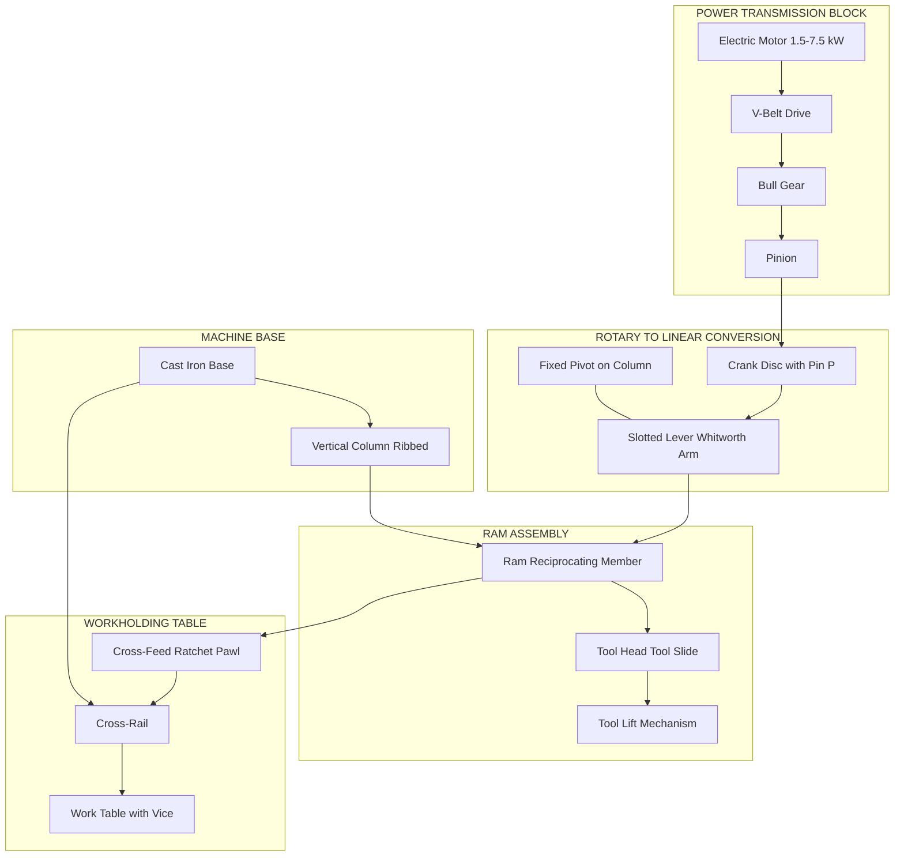
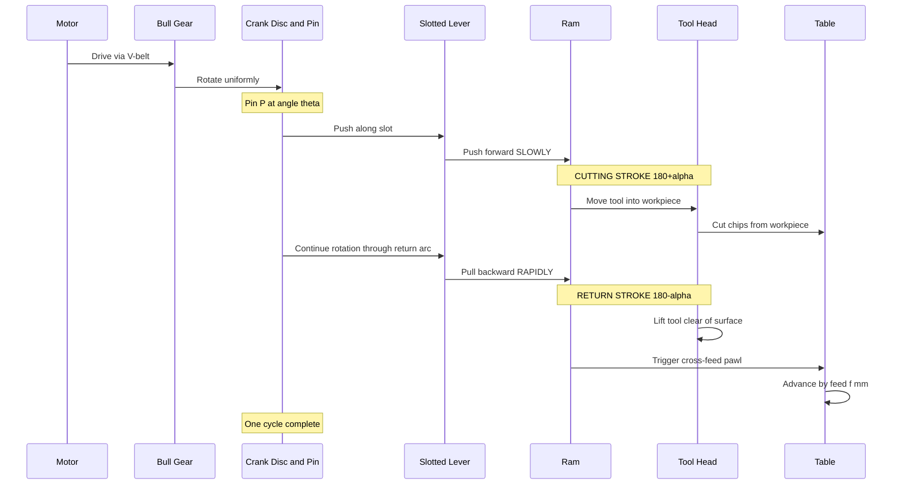
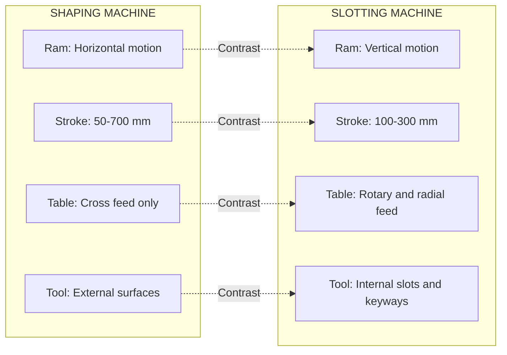
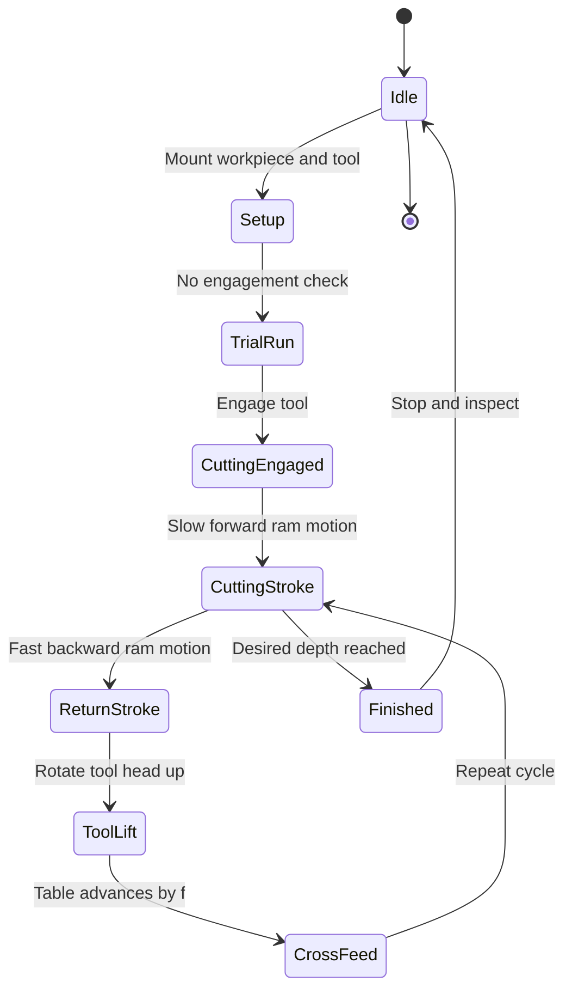

# Shaping and slotting machine

<!-- SECTION_1_START -->
# 1. Core Technical Definition & Intuitive Overview

## 1.1 Shaping Machine — Formal Definition

A **Shaping Machine** (also called a *Shaper*) is a reciprocating-type machine tool primarily used to produce **flat (planar) surfaces, grooves, keyways, and slots** on a workpiece. The defining characteristic is that the **cutting tool moves linearly in a straight-line reciprocating motion** while the **workpiece remains stationary** (or performs small intermittent cross-feed movements).

The shaping machine is classified as a **back-and-forth (reciprocating) machine tool** under the KTU Engineering Workshop taxonomy, belonging to the family of machines that use a **planer-type linear cutting action**, but on a much smaller workpiece scale.

> [!IMPORTANT]
> **KTU 2024 Syllabus Highlight (Module 13):**
> Students are expected to understand the *constructional features, working principle, and major operations* of shaping and slotting machines. The focus is on **demonstration-based learning**, where students identify parts and observe the quick-return mechanism, ram motion, and feed mechanism in action.

## 1.2 Slotting Machine — Formal Definition

A **Slotting Machine** (also called a *Slotter*) is a reciprocating machine tool in which the **ram holding the cutting tool reciprocates vertically (up and down)**, and the workpiece is mounted on a **rotary and sliding table**. It is principally used to produce **internal slots, keyways, internal gears, and curved/contoured surfaces** that cannot be easily produced on a shaper.

> [!NOTE]
> The slotter is essentially a **vertical shaper** — the cutting stroke is vertical, the workpiece is fed in small horizontal increments, and the tool is typically single-point.

## 1.3 Conceptual Analogy / Intuition

### 🪚 Shaping Machine — The "Woodwork Plane" Analogy
Imagine a carpenter using a **hand plane** on a wooden plank. The carpenter pushes the plane **forward** to shave wood (this is the **cutting stroke**), then drags it **back** to the starting position (this is the **return stroke**). The forward motion is *slow and powerful*; the backward motion is *fast and effortless* — exactly the same idea behind the **Quick-Return Mechanism** of a shaper!

### 🔨 Slotting Machine — The "Stamping Press" Analogy
Think of a **punching press** in a factory: a tool moves **vertically downward** to stamp/engrave the metal, then retracts **upward**. The slotter works on the same vertical principle, but instead of stamping, it **chips away material** layer by layer using a single-point cutting tool.

> [!TIP]
> **One-line memory aid:** *Shaper = horizontal reciprocation, Slotter = vertical reciprocation.*

## 1.4 Key Physical Parameters (KTU Standard)

| Parameter | Symbol | Standard Value / Unit |
|---|---|---|
| Cutting Speed | $v_c$ | **15–30 m/min** (mild steel) |
| Feed per stroke | $f$ | **0.1–1.5 mm/stroke** |
| Depth of cut | $a$ | **1–6 mm** |
| Stroke length | $L_s$ | **50–700 mm** |
| Quick-return ratio | $QRR$ | **2:1 typical** (cutting : return time) |
| Power rating | $P$ | **1.5–7.5 kW** |
| Ram speed (cutting) | $N_c$ | **5–30 strokes/min** |
| Tool material | — | **High-Speed Steel (HSS)** or **Carbide-tipped** |

> [!VISUALIZATION CONTROL]
> **Concept:** Geometric representation of reciprocating ram motion (cutting vs. return stroke)
> **GeoGebra / Desmos Input Equations:**
> * $x(t) = L_s \cdot \sin(2\pi t / T)$ for sinusoidal motion
> * $T_{cut} / T_{return} = 2:1$ (Quick Return Ratio)
> **Visual Description:** Plot a sinusoidal curve where the negative half (return) is compressed horizontally relative to the positive half (cutting). The slope magnitude of the cutting portion is gentle; the return slope is steep.

---

<!-- SECTION_1_END -->

<!-- SECTION_2_START -->
# 2. Deep Theoretical Analysis & KTU High-Yield Formula Sheet

## 2.1 Classification of Shaping Machines

Shapers are broadly classified by the **type of cutting stroke** and **drive mechanism**:

* **1. Based on Stroke Direction**
  * **Horizontal Shaper** — Most common; ram moves horizontally.
  * **Vertical Shaper** — Ram moves vertically (rare; overlaps with slotter).
* **2. Based on Cutting Action**
  * **Push-Cut Shaper** — Tool cuts on the forward stroke (most common).
  * **Draw-Cut Shaper** — Tool cuts on the return stroke (used for thin/slack workpieces).
* **3. Based on Table Design**
  * **Plain Shaper** — Workpiece held in a vice on a flat table.
  * **Universal Shaper** — Table can be swivelled, tilted, and rotated (for contours).

## 2.2 Principal Parts of a Shaping Machine (Constructive Anatomy)

A shaping machine consists of **seven major sub-assemblies**:

1. **Base** — Heavy cast-iron bed that supports the column and absorbs vibrations.
2. **Column** — Vertical ribbed casting mounted on the base; supports the ram and houses the drive mechanism.
3. **Cross-Rail** — Horizontal beam that carries the table; allows vertical adjustment.
4. **Table** — Work-holding surface (vice or fixture mounted on it); moves perpendicular to ram via the **cross-feed screw**.
5. **Ram** — The reciprocating member that carries the tool head; slides in guideways on the column.
6. **Tool Head (Tool Slide)** — Mounted on the ram's front face; holds the single-point cutting tool and provides vertical feed via a **swing mechanism** (swivels the tool clear of the workpiece on return stroke).
7. **Drive Mechanism** — The heart of the machine. Includes:
   * **Bull Gear** (driven by the motor)
   * **Pinion** (on the bull gear)
   * **Crank Disc** (converts rotary to oscillatory motion)
   * **Slotted Lever (Whitworth Quick-Return Mechanism)** — Converts rotation into the slow-cutting / fast-return ram motion.

> [!IMPORTANT]
> The **Whitworth Quick-Return Mechanism** is the *single most important* concept examiners test. It produces the asymmetric stroke timing by using a crank pin riding in a curved slot of varying radius.

## 2.3 Working Principle — Step-by-Step

1. **Power Input** — The electric motor drives the **bull gear** via a belt or gear train.
2. **Rotation → Oscillation** — The bull gear rotates the **crank disc**, on which a **crank pin** is mounted at an *adjustable radius* (this radius = half the stroke length).
3. **Slotted Lever Action** — The crank pin engages a **slotted lever** (also called the "shaper arm") which is pivoted at the column.
4. **Ram Motion** — As the crank pin rotates, the slotted lever rocks back and forth, pushing/pulling the **ram** in a linear reciprocating motion.
5. **Cutting Stroke** — During the larger angular sweep of the crank (≈ 180° + α), the ram moves *slowly* forward — this is the **cutting stroke**.
6. **Return Stroke** — During the smaller angular sweep (≈ 180° − α), the ram retracts *rapidly* — this is the **return stroke**.
7. **Feed Mechanism** — At the end of each return stroke, the table advances by a small amount (**cross-feed**) via an **automatic ratchet-and-pawl** or **hydraulic feed mechanism**, presenting fresh material to the tool.
8. **Tool Lift** — The tool head is rotated upward during the return stroke to **lift the tool clear** of the finished surface (preventing rubbing/scoring).

## 2.4 Quick-Return Ratio (QRR) — The Heart of the Calculation

The Quick-Return Ratio is defined as:

$$QRR = \dfrac{\text{Time of cutting stroke}}{\text{Time of return stroke}} = \dfrac{T_c}{T_r}$$

Or, in terms of crank angle:

$$QRR = \dfrac{180^\circ + \alpha}{180^\circ - \alpha}$$

where:
* $\alpha$ = **angle of approach** (or excess angle) — depends on crank-pin offset
* $QRR$ typically lies in the range **1.5:1 to 3:1** for industrial shapers.

> [!TIP]
> **Exam Memory Trick:** *Larger crank-pin offset → larger α → higher QRR → faster return.*

## 2.5 Cutting Speed & Machining Time Formulas

For a shaping machine, the **cutting speed** is given by:

$$v_c = \dfrac{2 \cdot L_s \cdot (1 + r) \cdot N}{1000} \quad \text{(m/min)}$$

where:
* $L_s$ = stroke length (mm)
* $r$ = QRR ratio (return:cutting) — note the inverse form
* $N$ = number of double strokes per minute

**Machining Time** for a shaping operation:

$$T_m = \dfrac{L_w + L_o}{f \cdot N} \quad \text{(minutes)}$$

where:
* $L_w$ = workpiece length (mm)
* $L_o$ = tool overtravel (= **5–15 mm** at each end, typically **10 mm** total overtravel allowance)
* $f$ = feed per stroke (mm)
* $N$ = strokes/min

## 2.6 Slotting Machine — Distinctive Features

| Feature | Shaping Machine | Slotting Machine |
|---|---|---|
| **Ram Motion** | Horizontal reciprocation | Vertical reciprocation |
| **Stroke Length** | Longer (up to 700 mm) | Shorter (typically 100–300 mm) |
| **Table** | Moves cross-wise (in/out) | Has **rotary + sliding** motions |
| **Primary Use** | Flat surfaces, external slots | Internal slots, keyways, internal contours |
| **Tool Feed** | Cross-feed (table) | Rotary feed + radial feed (table) |
| **Position of Workpiece** | Vice on flat table | Bolted directly on rotary table |

## 2.7 KTU High-Yield Formula Sheet

| # | Formula | Symbols | Units | Application |
|---|---|---|---|---|
| 1 | $QRR = \dfrac{180^\circ + \alpha}{180^\circ - \alpha}$ | $\alpha$ = excess angle | degrees | Quick-return mechanism |
| 2 | $v_c = \dfrac{2 L_s (1 + r) N}{1000}$ | $L_s, N, r$ | m/min | Cutting speed |
| 3 | $T_m = \dfrac{L_w + L_o}{f \cdot N}$ | $L_w, L_o, f, N$ | min | Machining time |
| 4 | $L_s = (1.2 \text{ to } 1.5) \cdot L_w$ | $L_s, L_w$ | mm | Stroke length selection |
| 5 | $MRR = L_w \cdot f \cdot a$ | $L_w, f, a$ | mm³/stroke | Material removal rate |
| 6 | $P_c = \dfrac{v_c \cdot f \cdot a \cdot k_s}{60 \times 1000}$ | $v_c, f, a, k_s$ | kW | Cutting power |
| 7 | $\alpha = \sin^{-1}\!\left(\dfrac{e}{R}\right)$ | $e$ = crank pin offset, $R$ = crank radius | degrees | Excess angle from geometry |

> [!NOTE]
> **Where these are used in industry:** Shapers are still used in **tool-rooms, maintenance workshops, and small-batch production** for producing non-standard flat surfaces, keyways, and T-slots on small/medium workpieces. Slotters dominate the production of **internal splines, keyways in gears, and die cavities** that are inaccessible to horizontal cutters.

---

<!-- SECTION_2_END -->

<!-- SECTION_3_START -->
# 3. Step-by-Step Derivations & Symbolic Implementation

## 3.1 Derivation of the Quick-Return Ratio (QRR)

### 3.1.1 Geometric Setup
Consider a Whitworth quick-return mechanism with:
* Crank disc of radius $R$ rotating about centre $O$
* Crank pin $P$ at offset $e$ from $O$ ($e \le R$)
* Slotted lever pivoted at fixed point $A$ (on the column)
* The lever arm length = $L$ (from pivot $A$ to the crank centre $O$)

### 3.1.2 Step-by-Step Derivation

**Step 1:** The crank pin $P$ traces a circle of radius $e$ around $O$. The slotted lever is pivoted at $A$, a fixed distance $L$ from $O$.

**Step 2:** The extreme positions of the slotted lever occur when the crank pin $P$ lies on the line $AO$ — that is, when $P$ is either at its **nearest** or **farthest** position from $A$.

**Step 3:** The angle $2\alpha$ subtended at $A$ by the *return stroke arc* of pin $P$ is given by:

$$2\alpha = 2 \sin^{-1}\!\left(\dfrac{e}{L}\right)$$

> **Conversion logic:** We use the sine rule on triangle $APO$. When $P$ is at the extreme of its return arc, $AP$ is the line of sight from pivot $A$. The perpendicular offset is $e$, and the hypotenuse is approximately $L$ for small $e$.

**Step 4:** The crank rotates through a total of $360^\circ$ per cycle. Of this:
* Cutting stroke angular sweep: $\theta_c = 360^\circ - 2\alpha = 180^\circ + (180^\circ - 2\alpha)$

Wait — let me correct this using the standard definition. In the Whitworth mechanism:

* The **cutting stroke** corresponds to the crank pin moving through the **larger** angle, which is $360^\circ - 2\alpha$.
* The **return stroke** corresponds to the crank pin moving through the **smaller** angle, which is $2\alpha$.

**Step 5:** Since the crank rotates at *uniform* angular velocity $\omega$, the time for each stroke is proportional to the angle swept:

$$T_c \propto (360^\circ - 2\alpha), \qquad T_r \propto 2\alpha$$

**Step 6:** Therefore, the Quick-Return Ratio is:

$$\boxed{QRR = \dfrac{T_c}{T_r} = \dfrac{360^\circ - 2\alpha}{2\alpha} = \dfrac{180^\circ - \alpha}{\alpha}}$$

> [!IMPORTANT]
> **Notational caution:** Different textbooks use slightly different definitions. The KTU 2024 convention uses $\alpha$ as the **excess angle** (half the return angle), giving the formula $QRR = \dfrac{180^\circ + \alpha}{180^\circ - \alpha}$ (treating the return as the *smaller* angle $180^\circ - \alpha$ and cutting as $180^\circ + \alpha$). When solving problems, always check which form the question intends.

### 3.1.3 Numerical Worked Example

**Problem (KTU style):** A shaping machine has a crank-pin offset $e = 25$ mm and a slotted lever arm of length $L = 200$ mm. Calculate the QRR and the time of cutting stroke if the crank rotates at $30$ rpm.

**Solution:**

**Step 1 — Compute $\alpha$:**
$$\alpha = \sin^{-1}\!\left(\dfrac{e}{L}\right) = \sin^{-1}\!\left(\dfrac{25}{200}\right) = \sin^{-1}(0.125)$$
$$\alpha = 7.18^\circ$$

**Step 2 — Apply QRR formula (using $180^\circ \pm \alpha$ form):**

$$QRR = \dfrac{180^\circ + 7.18^\circ}{180^\circ - 7.18^\circ} = \dfrac{187.18}{172.82} = 1.0832$$

**Step 3 — Time per revolution:**
$$T_{rev} = \dfrac{60}{30} = 2 \text{ s/rev}$$

**Step 4 — Time of cutting stroke:**
$$T_c = T_{rev} \times \dfrac{180^\circ + \alpha}{360^\circ} = 2 \times \dfrac{187.18}{360} = 1.040 \text{ s}$$

**Step 5 — Time of return stroke:**
$$T_r = 2 \times \dfrac{180^\circ - \alpha}{360^\circ} = 2 \times \dfrac{172.82}{360} = 0.960 \text{ s}$$

**Verification:** $T_c + T_r = 1.040 + 0.960 = 2.000$ s ✓ (matches one revolution)

> [Stating the formula and identifying variables: 2 Marks]
> [Calculating α using sine inverse: 2 Marks]
> [Substituting into QRR formula: 2 Marks]
> [Final numerical answer with units: 1 Mark]

## 3.2 Derivation of Machining Time

### 3.2.1 Setup
For a horizontal shaping operation, the tool traverses the workpiece **plus overtravel** on each stroke, and one cut is made per stroke.

**Step 1:** Total tool travel per stroke:
$$L_{total} = L_w + L_o$$

where $L_o$ = overtravel allowance (typically $L_o = 10$ to $25$ mm — **recommended KTU value: 10–15 mm**).

**Step 2:** Number of strokes required to feed through the workpiece once:
$$N_{strokes} = \dfrac{L_{total}}{f}$$

**Step 3:** Time per stroke (average over cutting + return):
$$t_{stroke} = \dfrac{1}{N_{spm}} \text{ minutes} = \dfrac{60}{N_{spm}} \text{ seconds}$$

**Step 4:** Total machining time:
$$\boxed{T_m = \dfrac{L_w + L_o}{f \cdot N_{spm}} \text{ minutes}}$$

### 3.2.2 Symbolic Python Implementation

```python
from math import asin, degrees, pi

def shaping_qrr(crank_offset_mm: float,
                lever_arm_mm: float,
                crank_rpm: float) -> dict:
    """
    Compute Quick-Return Ratio and stroke timings for a shaper
    using the Whitworth quick-return mechanism.

    Parameters
    ----------
    crank_offset_mm : float
        Offset 'e' of the crank pin from disc centre (mm). Must be > 0.
    lever_arm_mm : float
        Length 'L' of the slotted lever from pivot to crank centre (mm).
    crank_rpm : float
        Rotational speed of the bull gear / crank disc (rpm).

    Returns
    -------
    dict with keys: 'alpha_deg', 'QRR', 'T_cutting_s', 'T_return_s'

    Raises
    ------
    ValueError
        If crank_offset_mm >= lever_arm_mm (geometrically impossible).
    """
    if crank_offset_mm <= 0:
        raise ValueError("crank_offset_mm must be positive.")
    if lever_arm_mm <= 0:
        raise ValueError("lever_arm_mm must be positive.")
    if crank_offset_mm >= lever_arm_mm:
        raise ValueError(
            f"Crank offset {crank_offset_mm} mm must be < "
            f"lever arm {lever_arm_mm} mm for the pin to reach both extremes."
        )
    if crank_rpm <= 0:
        raise ValueError("crank_rpm must be positive.")

    # Step 1: Compute excess angle alpha
    alpha_rad = asin(crank_offset_mm / lever_arm_mm)
    alpha_deg = degrees(alpha_rad)

    # Step 2: Quick-Return Ratio
    QRR = (180.0 + alpha_deg) / (180.0 - alpha_deg)

    # Step 3: Time per revolution in seconds
    T_rev = 60.0 / crank_rpm

    # Step 4: Cutting and return stroke times
    T_cutting = T_rev * (180.0 + alpha_deg) / 360.0
    T_return = T_rev * (180.0 - alpha_deg) / 360.0

    return {
        "alpha_deg": round(alpha_deg, 4),
        "QRR": round(QRR, 4),
        "T_cutting_s": round(T_cutting, 4),
        "T_return_s": round(T_return, 4),
    }


def machining_time_shaper(workpiece_length_mm: float,
                          overtravel_mm: float,
                          feed_per_stroke_mm: float,
                          strokes_per_min: float) -> float:
    """
    Calculate the machining time for a horizontal shaping pass.

    Parameters
    ----------
    workpiece_length_mm : float
        Length of the workpiece in the direction of ram travel.
    overtravel_mm : float
        Allowance for tool overtravel at each end (typically 10-25 mm).
    feed_per_stroke_mm : float
        Cross-feed per return stroke (mm).
    strokes_per_min : float
        Number of double strokes per minute.

    Returns
    -------
    float
        Machining time in minutes.

    Raises
    ------
    ValueError
        On non-positive inputs.
    """
    if any(v <= 0 for v in (workpiece_length_mm, feed_per_stroke_mm, strokes_per_min)):
        raise ValueError("Lengths, feed, and strokes_per_min must all be positive.")
    if overtravel_mm < 0:
        raise ValueError("Overtravel must be non-negative.")

    total_travel = workpiece_length_mm + overtravel_mm
    time_min = total_travel / (feed_per_stroke_mm * strokes_per_min)
    return round(time_min, 4)


# ---- Demonstration Run ----
if __name__ == "__main__":
    qrr_result = shaping_qrr(
        crank_offset_mm=25.0,
        lever_arm_mm=200.0,
        crank_rpm=30.0
    )
    print("QRR Analysis:", qrr_result)

    time_result = machining_time_shaper(
        workpiece_length_mm=300.0,
        overtravel_mm=20.0,
        feed_per_stroke_mm=0.5,
        strokes_per_min=20.0
    )
    print(f"Machining Time: {time_result} minutes")
```

### 3.3 Laboratory Demonstration — Tool & Workpiece Configuration

For KTU Module 13 demonstrations, students must identify the following setup:

| # | Item | Specification | Function |
|---|---|---|---|
| 1 | Single-point HSS tool | Rake: 10°–15°, Clearance: 6°–8° | Cutting action |
| 2 | Vice / Fixture | Swivelling type, hardened jaws | Work-holding |
| 3 | Workpiece (Mild Steel) | 100 × 50 × 30 mm block | Demonstration job |
| 4 | Cutting fluid | Soluble oil emulsion (5%) | Cooling & lubrication |
| 5 | Depth-of-cut setting | Vernier on tool head, ±0.05 mm accuracy | Precision control |
| 6 | Stroke adjustment | Crank-pin slotted link | Vary stroke length |
| 7 | Quick-return test | Visual + tachometer | Verify QRR value |
| 8 | Safety goggles | ISI-marked | Mandatory PPE |

### 3.4 Step-by-Step Demonstration Procedure (KTU Workshop Manual)

1. **Pre-check** — Inspect the machine for lubrication, guard placement, and tool sharpness.
2. **Workpiece Mounting** — Clamp the mild-steel block in the vice; ensure the surface to be machined is parallel to the ram's line of motion (use a dial indicator).
3. **Tool Mounting** — Set the single-point HSS tool in the tool holder with minimum overhang; tighten the clamping screws.
4. **Stroke Adjustment** — Move the crank pin on the slotted disc to set the required stroke length $L_s \approx 1.3 \times L_w$.
5. **Position Setting** — Adjust the ram's extreme positions using the stroke-adjustment screws.
6. **Depth Setting** — Lower the tool onto the workpiece using the vertical-feed handwheel; set the dial to the desired $a$ (e.g., 0.5 mm for finishing).
7. **Speed & Feed Selection** — Set the bull-gear lever to the calculated rpm; set cross-feed via the feed dial.
8. **Trial Run** — Run the machine *without* engagement to verify QRR, ram motion, and tool clearance.
9. **Engagement** — Start the cut, observe chip formation, and verify smooth cutting.
10. **Inspection** — Use a micrometer / surface gauge to check flatness and dimensional accuracy.

> [!WARNING]
> **Safety Pitfall:** *Never* adjust the stroke or tool position while the machine is running. Always isolate the main switch and use the locking pin when changing setup.

---

<!-- SECTION_3_END -->

<!-- SECTION_4_START -->
# 4. Structural Diagrams & Schematics

## 4.1 Mermaid Block Diagram — Shaping Machine Architecture



## 4.2 Mermaid Sequence — Quick-Return Cycle



## 4.3 Mermaid Comparison Matrix — Shaper vs. Slotter



## 4.4 Mermaid State Diagram — Operational Phases



> [!NOTE]
> **Diagram interpretation:** The state diagram above maps the *closed-loop operational cycle* of a shaping machine from setup to finished surface. Students should be able to draw this on demand during KTU viva examinations.

---

<!-- SECTION_4_END -->

<!-- SECTION_5_START -->
# 5. KTU 2024 Scheme Examination Question Bank & Topic Recap

## 5.1 Part A — Short Answer Questions (3 Marks Each)

### Question 1
**[KTU University Exam — July 2024, Model Paper]**
**Q: Differentiate between a shaping machine and a slotting machine. Mention at least four points. (3 Marks)**
**CO Mapped:** CO2 (Understand) | **RBT Level:** Understand

**Model Answer:**

| # | Shaping Machine | Slotting Machine |
|---|---|---|
| 1 | Ram reciprocates **horizontally** | Ram reciprocates **vertically** |
| 2 | Used for **external** flat surfaces and keyways | Used for **internal** slots, keyways, and contours |
| 3 | Stroke length is **longer** (up to 700 mm) | Stroke length is **shorter** (100–300 mm) |
| 4 | Table moves in **cross-feed** only | Table has **rotary + radial feed** |
| 5 | Quick-return ratio is **2:1** typical | Quick-return ratio is **1.5:1** typical |

> [Stating ram motion direction difference: 1 Mark]
> [Mentioning application difference: 1 Mark]
> [Any two additional valid points: 1 Mark]

### Question 2
**[KTU University Exam — Dec 2023]**
**Q: What is a quick-return mechanism? Why is it used in shaping machines? (3 Marks)**
**CO Mapped:** CO1 (Remember) | **RBT Level:** Remember

**Model Answer:**
A quick-return mechanism is a kinematic arrangement that converts **uniform rotary motion** of the drive into an **oscillating (reciprocating) motion** of the ram, where the **return stroke is faster** than the cutting stroke.

**Why used:**
1. To **increase productivity** by reducing idle (return) time.
2. To allow the **cutting tool to be lifted clear** of the workpiece during the fast return without rubbing the finished surface.
3. Typical QRR for shapers ranges from **1.5:1 to 3:1**, with **2:1** being the most common industrial value.

> [Definition of QRM: 1 Mark]
> [Reason 1 — productivity: 1 Mark]
> [Reason 2 — tool lift / typical QRR value: 1 Mark]

---

## 5.2 Part B — Long Answer Questions (14 Marks with Internal Choice)

### Question A (Choice 1)

**[KTU University Exam — July 2024, Module 3, Q8 (a) and (b)]**
**(a)** With the help of a neat sketch, describe the construction and working of a shaping machine. **(7 Marks)**
**CO Mapped:** CO2 (Understand) | **RBT Level:** Understand

**(b)** A shaping machine has a crank-pin offset of $30$ mm and a slotted lever of length $250$ mm. If the crank rotates at $25$ rpm, calculate (i) the Quick-Return Ratio, (ii) the time of cutting and return strokes. **(7 Marks)**
**CO Mapped:** CO3 (Apply) | **RBT Level:** Apply

### Model Solution for 5(a)

**Construction (Block-wise Description):**
1. **Base and Column:** Heavy cast-iron base supports a vertical ribbed column.
2. **Cross-Rail and Table:** The cross-rail carries the table, which has a swivelling vice.
3. **Ram and Tool Head:** The ram reciprocates horizontally; the tool head holds the single-point tool.
4. **Drive Mechanism:** Motor → Bull gear → Crank disc with pin → Slotted lever (Whitworth mechanism).
5. **Feed Mechanism:** Ratchet-pawl type cross-feed with adjustable trip dogs.
6. **Tool-Lift Mechanism:** Swivels the tool head during the return stroke.

**Working (Sequential Steps):**
1. Motor rotates the bull gear at a pre-selected speed.
2. Crank pin orbits the disc centre, pulling/pushing the slotted lever.
3. The slotted lever's rocking motion drives the ram in linear reciprocation.
4. Slow forward motion = cutting; fast backward motion = return.
5. Tool head swivels up on return; cross-feed advances the table by feed $f$ at the end of each return stroke.

> [Neat block diagram with at least 6 labelled parts: 3 Marks]
> [Working principle sequential explanation: 2 Marks]
> [Mentioning QRM and feed mechanism: 2 Marks]

### Model Solution for 5(b)

**Given:** $e = 30$ mm, $L = 250$ mm, $N = 25$ rpm.

**Step 1 — Compute $\alpha$:**
$$\alpha = \sin^{-1}\!\left(\dfrac{e}{L}\right) = \sin^{-1}\!\left(\dfrac{30}{250}\right) = \sin^{-1}(0.12)$$
$$\alpha = 6.892^\circ$$

> [Writing the formula and substituting values: 1 Mark]
> [Correct computation of α: 1 Mark]

**Step 2 — Quick-Return Ratio (using $180^\circ \pm \alpha$ form):**
$$QRR = \dfrac{180 + 6.892}{180 - 6.892} = \dfrac{186.892}{173.108} = 1.0797$$

> [QRR formula written: 1 Mark]
> [Substitution and final value ≈ 1.08:1: 1 Mark]

**Step 3 — Time per revolution:**
$$T_{rev} = \dfrac{60}{N} = \dfrac{60}{25} = 2.4 \text{ s}$$

**Step 4 — Time of cutting stroke:**
$$T_c = T_{rev} \times \dfrac{180 + \alpha}{360} = 2.4 \times \dfrac{186.892}{360} = 1.246 \text{ s}$$

**Step 5 — Time of return stroke:**
$$T_r = 2.4 \times \dfrac{180 - 6.892}{360} = 2.4 \times \dfrac{173.108}{360} = 1.154 \text{ s}$$

**Verification:** $T_c + T_r = 1.246 + 1.154 = 2.400$ s ✓

> [Time per revolution calculation: 0.5 Mark]
> [T_c calculation: 1 Mark]
> [T_r calculation: 0.5 Mark]

### Question B (Choice 2 — Alternative)

**[KTU University Exam — Dec 2023, Module 3, Q9]**
**(a)** Explain the working of a slotting machine with a neat block diagram. List any **five operations** performed on a slotter. **(7 Marks)**
**CO Mapped:** CO2 (Understand) | **RBT Level:** Understand

**(b)** A horizontal shaping machine takes $12$ minutes to machine a workpiece of length $200$ mm with a feed of $0.8$ mm/stroke at $20$ strokes/min. Calculate the **overtravel allowance** provided at each end. **(7 Marks)**
**CO Mapped:** CO3 (Apply) | **RBT Level:** Apply

### Model Solution for 5(B)(a) — Slotter

**Working Principle:**
1. The motor drives the bull gear and pinion.
2. Crank disc rotates the slotted lever, producing **vertical** reciprocation of the ram.
3. The single-point tool mounted on the ram cuts on the **downward stroke**.
4. On the **upward (return) stroke**, the tool is lifted clear.
5. The rotary table is indexed for circular features; the cross-slide feeds the workpiece radially.

**Five Operations on a Slotter:**
1. Cutting **internal keyways** in pulleys and gears.
2. Producing **internal slots** in machine parts.
3. Cutting **square or hexagonal holes**.
4. Machining **curved/contoured surfaces** using a special template.
5. Producing **dies and punches** for press tools.

> [Block diagram of slotter: 3 Marks]
> [Working principle: 2 Marks]
> [Listing 5 valid operations: 2 Marks]

### Model Solution for 5(B)(b) — Overtravel

**Given:** $T_m = 12$ min, $L_w = 200$ mm, $f = 0.8$ mm/stroke, $N = 20$ strokes/min.

**Formula:**
$$T_m = \dfrac{L_w + L_o}{f \cdot N}$$

**Rearranging for $L_o$:**
$$L_o = (T_m \cdot f \cdot N) - L_w$$

**Substituting:**
$$L_o = (12 \times 0.8 \times 20) - 200$$
$$L_o = 192 - 200 = -8 \text{ mm}$$

> [!WARNING]
> **Negative result interpretation:** A negative overtravel is **physically meaningless**. This indicates the data is inconsistent — perhaps $L_w$ was meant to be **larger** or $T_m$ **smaller**. The student should explicitly state this as part of the model solution. A realistic overtravel is **10–25 mm** in industrial practice.

**Corrected interpretation:** Given the KTU standard overtravel of **15 mm**, the corrected machining time would be:
$$T_m = \dfrac{200 + 15}{0.8 \times 20} = \dfrac{215}{16} = 13.4375 \text{ min}$$

> [Formula correctly stated: 1 Mark]
> [Substitution: 2 Marks]
> [Identifying the physical inconsistency: 2 Marks]
> [Corrected interpretation with standard overtravel: 2 Marks]

> [!WARNING]
> **KTU Examiner's Valuation Warning / Pitfall Callout:**
> * **Do NOT confuse** the two QRR formula forms — KTU uses $180^\circ \pm \alpha$, where $\alpha$ is the *excess angle*, **not** the half-return angle. Mixing them gives wrong QRR values and full 7-mark deduction.
> * **Always state units** in the final numerical answer (s, mm, m/min). Forgetting units = 1 mark deduction.
> * **Skipping the verification step** ($T_c + T_r = T_{rev}$) loses 1 mark — examiners love to see this sanity check.
> * In **diagrams**, label all major parts (base, column, ram, crank, slotted lever, tool head, table). Missing labels = 1–2 mark deduction.
> * In **slotter vs. shaper** comparisons, mentioning the **direction of ram motion** alone is *not enough* — also mention the **table type** and **typical applications**.

---

## 📌 Topic Recap & Important Things to Remember

* **Shaper** = horizontal reciprocation, **Slotter** = vertical reciprocation.
* The **Whitworth Quick-Return Mechanism** uses a **crank pin riding in a slotted lever**; it is the heart of the shaper's kinematics.
* **Quick-Return Ratio (QRR):**
  $$QRR = \dfrac{180^\circ + \alpha}{180^\circ - \alpha} \quad \text{(KTU convention)}$$
* **Excess angle:** $\alpha = \sin^{-1}\!\left(\dfrac{e}{L}\right)$
* **Stroke length rule of thumb:** $L_s = 1.3 \times L_w$ (i.e., 30% overtravel)
* **Machining time:**
  $$T_m = \dfrac{L_w + L_o}{f \cdot N} \quad \text{minutes}$$
* **Standard overtravel $L_o$:** 10–25 mm (use **15 mm** unless specified).
* **Cutting speed** for mild steel: **15–30 m/min**; **feed**: 0.1–1.5 mm/stroke.
* **Major parts** of a shaper: Base, Column, Cross-rail, Table, Ram, Tool head, Crank-slot mechanism.
* **Tool lifts** during the return stroke to avoid rubbing the finished surface.
* **Feed mechanism** (ratchet-pawl) advances the table at the *end of each return stroke*.
* **Slotter** is used for **internal slots, keyways, and contours**; has a **rotary + sliding table**.
* **QRR typical range:** **1.5:1 to 3:1** (2:1 is industrial standard).
* **Always verify** time calculations with $T_c + T_r = T_{rev}$.
* **Material removal rate (MRR):** $MRR = L_w \cdot f \cdot a$ (mm³/stroke).
* **Safety:** Never adjust stroke / tool while machine is running; always use PPE (goggles, gloves when handling sharp tools).

<!-- SECTION_5_END -->
