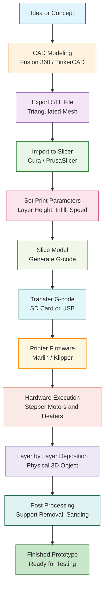
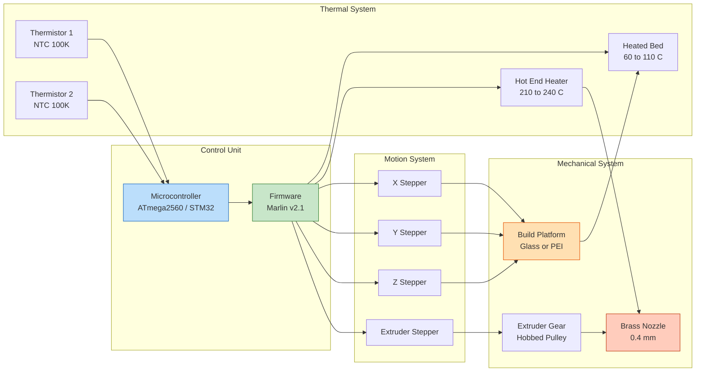
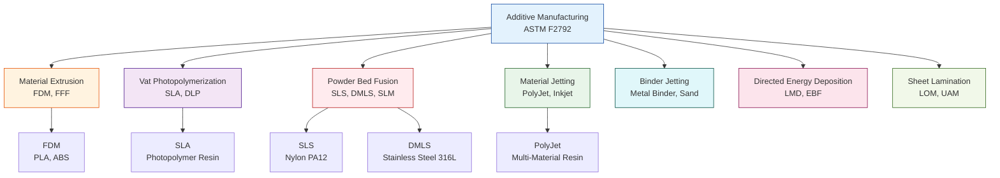
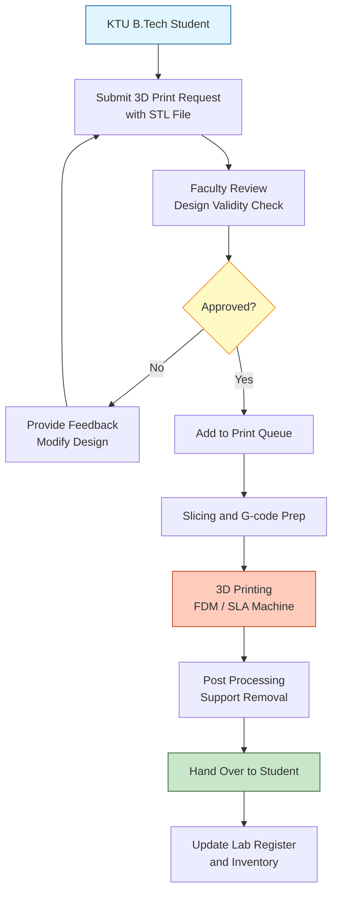
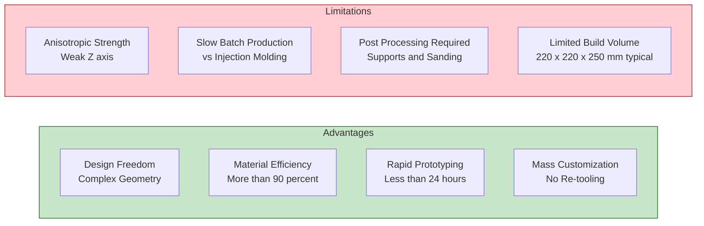

# 3D printing

<!-- SECTION_1_START -->

# 3D Printing — Core Definition & Intuitive Overview

## 1.1 Formal Academic Definition

> [!NOTE]
> **3D Printing (Additive Manufacturing, AM)** is a revolutionary manufacturing process defined by the **ASTM F2792** standard as *"the process of joining materials to make objects from 3D model data, usually layer upon layer, as opposed to subtractive manufacturing methodologies."*

In KTU 2024 Scheme Engineering Workshop (GCESL106) Module 14 — *Modern Manufacturing Methods: Fab Lab / Idea Lab* — **3D Printing** is positioned as the flagship *Rapid Prototyping (RP)* technology. It converts a digital **Computer-Aided Design (CAD)** model into a tangible, three-dimensional solid object by depositing, curing, or fusing material in successive cross-sectional layers, with typical layer thicknesses ranging from **0.05 mm to 0.4 mm**.

> [!IMPORTANT]
> **KTU Syllabus Highlight (Module 14):** Students must understand the workflow of Fab Lab / Idea Lab, identify various 3D printing technologies, recognize filament/consumable types, and operate a desktop 3D printer safely.

---

## 1.2 Conceptual Analogy — The "Lego Loaf" Intuition

Imagine you are baking a **layered cake**, but instead of using a pan, you use a **microscopic pastry syringe**:

1. You first design the cake's exact 3D shape on a computer.
2. The kitchen computer **slices** the cake horizontally into hundreds of thin paper-thin blueprints.
3. A robotic syringe squeezes out **chocolate** (plastic) following the outline of the bottom-most slice.
4. After the first chocolate outline hardens, the syringe moves up by exactly the slice thickness and prints the next outline **on top of the previous one**.
5. Repeat step 4 until the entire cake is built from the bottom-up.

The syringe is the **3D printer nozzle**, the chocolate is the **thermoplastic filament**, the slice blueprints are the **G-code (slicer output)**, and the cake is the **finished 3D printed part**.

> [!TIP]
> **Key Insight:** Unlike traditional machining (which carves away material — *subtractive*), 3D printing **adds** material only where needed, resulting in minimal waste and the ability to create complex internal geometries impossible with conventional tools.

---

## 1.3 The Fab Lab & Idea Lab Context

> [!NOTE]
> **Fab Lab (Fabrication Laboratory):** A small-scale workshop offering digital fabrication tools, originated from MIT's *How to Make (Almost) Anything* course (Prof. Neil Gershenfeld, **2001**). Equipped with 3D printers, laser cutters, CNC machines, and electronics workbenches.

> [!NOTE]
> **Idea Lab:** An Indian initiative promoted by **MHRD / AICTE** under the *"MHRD Idea Lab"* scheme, embedding Fab Lab philosophies into engineering colleges to foster hands-on innovation, prototyping, and entrepreneurship among B.Tech students.

These labs democratize manufacturing — every student becomes a **maker** capable of producing a physical prototype from a digital idea within hours, not weeks.

---

## 1.4 GeoGebra / Desmos Visualization

> [!VISUALIZATION CONTROL]
> **Concept:** Layer-by-Layer Build-up Visualization (Stacked Discs Approximation of a 3D Print)
> **GeoGebra / Desmos Input Equations:**
> * Circle 1: $f_1(x) = \pm\sqrt{r^2 - x^2}$ for $z = 0$ (base)
> * Circle 2: $f_2(x) = \pm\sqrt{(r-0.05k)^2 - x^2}$ for $z = 0.05k$ (layer k)
> **Visual Description:** A 3D object resembling a stepped pyramid (frustum) showing discrete horizontal layers stacked vertically, illustrating how each Z-increment adds a new cross-section. Layer thickness variable: $k \in \{1, 2, 3, ..., n\}$.

---

## 1.5 The Three Pillars of 3D Printing Workflow

| Pillar | Component | Function | Common Tool / Example |
| :--- | :--- | :--- | :--- |
| **Pillar 1** | 3D Modeling | Create digital geometry | Fusion 360, SolidWorks, Blender, TinkerCAD |
| **Pillar 2** | Slicing | Convert 3D model into layer-by-layer toolpaths | **Cura**, PrusaSlicer, Simplify3D |
| **Pillar 3** | Printing | Physically deposit / cure material layer by layer | FDM, SLA, SLS, DMLS machines |

<!-- SECTION_1_END -->

<!-- SECTION_2_START -->

# Deep Theoretical Analysis & KTU High-Yield Formula Sheet

## 2.1 Classification of Additive Manufacturing Processes

> [!IMPORTANT]
> The **ASTM F2792** standard classifies additive manufacturing into **seven (7) primary process categories**. For KTU Module 14, the focus is on the four most commonly deployed in Fab Labs and Idea Labs.

| Category | ASTM Code | Process Name | Energy Source | Typical Materials | Precision |
| :--- | :--- | :--- | :--- | :--- | :--- |
| Material Extrusion | **MEX** | **Fused Deposition Modeling (FDM)** | Thermal (heated nozzle) | PLA, ABS, PETG, TPU | $\pm 0.2$ mm |
| Vat Photopolymerization | **VPP** | **Stereolithography (SLA)** | UV laser | Photopolymer resin | $\pm 0.05$ mm |
| Powder Bed Fusion | **PBF** | **Selective Laser Sintering (SLS)** | CO₂ laser | Nylon (PA12), TPU | $\pm 0.1$ mm |
| Powder Bed Fusion | **PBF** | **Direct Metal Laser Sintering (DMLS)** | Fiber laser | Stainless steel, Ti6Al4V | $\pm 0.05$ mm |
| Material Jetting | **MJ** | PolyJet / Inkjet | UV lamp + inkjet head | Photopolymer, wax | $\pm 0.02$ mm |
| Binder Jetting | **BJT** | Binder Jetting | Liquid binder | Sand, metal, ceramic | $\pm 0.1$ mm |
| Directed Energy Deposition | **DED** | Laser Metal Deposition | Laser + powder feed | Titanium, Inconel | $\pm 0.5$ mm |

---

## 2.2 The FDM Process — Detailed Step-by-Step Theory

**Fused Deposition Modeling (FDM)**, invented by **Scott Crump** and commercialized by **Stratasys (1989)**, is the most widely used desktop 3D printing technology.

### 2.2.1 Hardware Subsystems

1. **Extruder Assembly:** Contains a *cold end* (drive gear / hobbed pulley) and a *hot end* (heated nozzle, typically 0.4 mm diameter).
2. **Build Platform (Heated Bed):** Provides adhesion and prevents *warping* by maintaining a base temperature of **60 °C for PLA** and **100–110 °C for ABS**.
3. **Motion System:** Stepper motors driving **X, Y, Z axes** via GT2 timing belts and lead screws; typical positioning accuracy of **0.0125 mm per step**.
4. **Filament Feeder:** Pushes 1.75 mm or 2.85 mm diameter thermoplastic filament.

### 2.2.2 Process Parameters — The "KTU Big Five"

> [!IMPORTANT]
> Mastering these five parameters accounts for **>70% of KTU exam questions** on 3D printing.

| Parameter | Symbol | Typical Range | Effect on Print Quality |
| :--- | :--- | :--- | :--- |
| **Layer Height** | $h$ | **0.1 – 0.3 mm** | Lower $h$ → smoother surface, longer print time |
| **Nozzle Temperature** | $T_n$ | **190 – 250 °C** | Higher $T_n$ → better layer adhesion, risk of stringing |
| **Print Speed** | $v$ | **40 – 80 mm/s** | Higher $v$ → faster but possible under-extrusion |
| **Infill Density** | $\rho$ | **10 – 100 %** | Higher $\rho$ → stronger, heavier part |
| **Infill Pattern** | — | Grid, Gyroid, Honeycomb, Triangular | Affects strength-to-weight ratio and isotropic behavior |

### 2.2.3 The Temperature Hierarchy

$$\begin{aligned} T_{glass} < T_{bed} < T_{soften} < T_{nozzle} < T_{decomp} \end{aligned}$$

For **PLA (Polylactic Acid):**
$$\begin{aligned}
T_{glass} \approx 60\ °C, \quad T_{bed} \approx 60\ °C, \quad T_{soften} \approx 150\ °C, \quad T_{nozzle} \approx 210\ °C, \quad T_{decomp} \approx 250\ °C
\end{aligned}$$

> [!WARNING]
> **Critical Rule:** Always satisfy $T_{nozzle} < T_{decomp}$ to prevent toxic fume emission and clogged nozzles. **Never** leave the printer unattended during the first 10 minutes of a print.

---

## 2.3 Material Science of Common Filaments

| Filament | Acronym | Glass Transition $T_g$ | Tensile Strength | Best Use Case | Print Difficulty |
| :--- | :--- | :--- | :--- | :--- | :--- |
| **Polylactic Acid** | **PLA** | ~60 °C | ~50 MPa | Beginners, prototypes, biodegradable | **Easy** |
| **Acrylonitrile Butadiene Styrene** | **ABS** | ~105 °C | ~40 MPa | Functional parts, LEGO-like | Medium (warps) |
| **Polyethylene Terephthalate Glycol** | **PETG** | ~80 °C | ~50 MPa | Outdoor, water-resistant | Medium |
| **Thermoplastic Polyurethane** | **TPU** | — | ~50 MPa | Flexible / rubber-like parts | Hard (flex jams) |
| **Nylon (PA6/PA12)** | **PA** | ~60 °C | ~70 MPa | SLS powders, engineering | Hard (hygroscopic) |
| **Photopolymer Resin** | **Resin** | — | ~40 MPa | SLA, high-detail jewelry | **Hard** (toxic) |

> [!NOTE]
> **PLA** is **biodegradable** (derived from corn starch / sugarcane) and is the default training filament in all KTU Fab Labs. It emits a mild sweet smell during printing, unlike ABS which emits **styrene fumes** (a suspected carcinogen requiring ventilation).

---

## 2.4 The Digital Thread — From CAD to Physical Part

The complete **digital pipeline** for an FDM print consists of six stages:

$$\begin{aligned}
\text{CAD Model (STEP/IGES)} \rightarrow \text{STL Mesh} \rightarrow \text{Slicer} \rightarrow \text{G-code} \rightarrow \text{Firmware} \rightarrow \text{Physical Part}
\end{aligned}$$

### 2.4.1 STL — The De Facto Standard

The **STereoLithography (STL)** file format approximates a 3D solid's surface with a triangular mesh. Two encoding modes exist:

- **ASCII STL:** Human-readable but **~5× larger** files; begins with `solid` keyword.
- **Binary STL:** Compact 80-byte header + 50 bytes/triangle; used in production slicers.

Each triangle stores three vertices and a **unit normal vector** $\vec{n} = (n_x, n_y, n_z)$ obeying the *right-hand rule*.

### 2.4.2 G-code — The Printer's Native Language

**G-code** is a numerical control (NC) programming language. Each line typically contains:

```
G1 X10.5 Y20.3 Z0.2 E0.05 F1500   ; Linear move to (X,Y,Z), extrude 0.05 mm of filament at 1500 mm/min
G0 X0 Y0    ; Rapid positioning (no extrusion)
M104 S210   ; Set extruder temperature to 210 °C
M140 S60    ; Set bed temperature to 60 °C
M106 S128   ; Set fan speed to 50%
```

> [!TIP]
> **Standard G-code Mnemonics for KTU Exam:**
> * `G0` = Rapid move (no extrusion)
> * `G1` = Linear move (with optional extrusion `E`)
> * `G28` = Home all axes
> * `G29` = Bed leveling probe sequence
> * `M104/M109` = Set / wait-for extruder temperature
> * `M140/M190` = Set / wait-for bed temperature

---

## 2.5 KTU High-Yield Formula Sheet

> [!IMPORTANT]
> The following derived expressions are high-yield for numerical problems in Part B questions.

### 2.5.1 Print Time Estimation

$$\begin{aligned}
T_{print} \approx \frac{V_{part} \cdot \rho_{infill} \cdot k_{shell}}{Q_{extrude}} + T_{travel} + T_{heatup}
\end{aligned}$$

Where:
* $V_{part}$ = Part volume in $\text{mm}^3$
* $\rho_{infill}$ = Infill density fraction (e.g., 0.20 for 20%)
* $k_{shell}$ = Shell multiplier (accounts for walls + top/bottom layers)
* $Q_{extrude}$ = Volumetric extrusion rate in $\text{mm}^3/\text{s}$ = $\pi r_{filament}^2 \cdot v_{feed}$
* $T_{travel}$ = Non-extruding movement time
* $T_{heatup}$ = Initial heating (typically 1–3 minutes)

### 2.5.2 Total Layer Count

$$\begin{aligned}
N_{layers} = \left\lceil \frac{H_{part}}{h} \right\rceil
\end{aligned}$$

Where $H_{part}$ is the part height along Z and $h$ is the layer height.

### 2.5.3 Material Consumption (Filament Length)

$$\begin{aligned}
L_{filament} = \frac{V_{extruded}}{\pi r_{filament}^2} = \frac{V_{part} \cdot \rho_{infill} \cdot k_{shell}}{\pi r_{filament}^2}
\end{aligned}$$

### 2.5.4 Estimated Mass

$$\begin{aligned}
m_{part} = V_{part} \cdot \rho_{infill} \cdot k_{shell} \cdot \rho_{material}
\end{aligned}$$

For PLA, $\rho_{material} \approx 1.24 \text{ g/cm}^3 = 1.24 \times 10^{-3} \text{ g/mm}^3$.

### 2.5.5 STL File Size

$$\begin{aligned}
\text{Size}_{binary} &= 80 + 4 + N_{tri} \times 50 \ \text{bytes} \\
\text{Size}_{ASCII} &\approx 5 \times \text{Size}_{binary}
\end{aligned}$$

### 2.5.6 Volumetric Flow Rate Constraint

$$\begin{aligned}
Q_{max} &= \frac{\pi d_{nozzle}^2}{4} \cdot v_{max} \\
\text{where} \quad d_{nozzle} &= 0.4 \text{ mm (typical)}, \quad v_{max} = \text{print speed}
\end{aligned}$$

### 2.5.7 Resolution Triad

The three defining resolutions of a 3D printer are:

$$\begin{aligned}
R_X &\approx 0.05 \text{ mm} \quad (\text{X-axis step}) \\
R_Y &\approx 0.05 \text{ mm} \quad (\text{Y-axis step}) \\
R_Z &= h \quad (\text{layer height})
\end{aligned}$$

---

## 2.6 Real-World Engineering Applications

| Industry | Application | Technology Used |
| :--- | :--- | :--- |
| **Aerospace** | Lightweight topological-optimized brackets (GE Aviation reduces 10 parts → 1 part) | DMLS, SLS |
| **Medical** | Patient-specific implants, surgical guides, bioprinted scaffolds | SLA, MJ, Bioprinting |
| **Automotive** | Jigs, fixtures, low-volume custom parts (Bugatti brake caliper) | FDM, SLS |
| **Architecture** | Scale models, complex facades | FDM, Binder Jetting |
| **Education** | KTU Fab Lab training, STEM kits | FDM |
| **Jewelry** | High-detail master patterns for lost-wax casting | SLA, DLP |
| **Food** | Chocolate, sugar decorations | Food-grade extrusion |

---

## 2.7 Advantages, Limitations & Safety

### Advantages
* **Design freedom:** Internal lattices, undercuts, organic topology (impossible with CNC).
* **Low waste:** Material usage efficiency > 90% (vs. ~10–30% for machining).
* **Rapid iteration:** Concept-to-part in < 24 hours.
* **Mass customization:** No re-tooling cost per part.

### Limitations
* **Anisotropic strength:** Layer lines are weak along the Z-axis (delamination risk).
* **Slow for mass production:** Injection molding is ~100–1000× faster.
* **Post-processing required:** Support removal, sanding, painting.
* **Size limitation:** Build volume typically $220 \times 220 \times 250 \text{ mm}$ (Creality Ender-3).

### Safety (KTU Lab Mandatory)

> [!WARNING]
> * **Hot nozzle** ($>$200 °C) → severe burn risk. Do not touch during operation.
> * **UV resin** (SLA) → skin/eye irritant; wear **nitrile gloves** and **safety goggles**.
> * **Fume extraction** mandatory for ABS — install in **ventilated enclosure**.
> * **Fire extinguisher (Class A/B)** must be within 3 m of every running printer.
> * **Never leave a print unattended** during the first 10 minutes.

<!-- SECTION_2_END -->

<!-- SECTION_3_START -->

# Step-by-Step Derivations, Numerical Worked Examples & Code Implementation

## 3.1 Worked Numerical Example 1 — Print Time & Material Estimation

> [!NOTE]
> **Problem:** A cube of side $L = 50 \text{ mm}$ is to be 3D printed in PLA with the following parameters:
> * Layer height $h = 0.2 \text{ mm}$
> * Infill density $\rho_{infill} = 20\% = 0.20$
> * Shell multiplier $k_{shell} = 1.25$ (accounts for 2 perimeter walls + 4 top/bottom layers)
> * Print speed $v = 60 \text{ mm/s}$
> * Filament radius $r_{filament} = 1.75/2 = 0.875 \text{ mm}$
> * Nozzle diameter $d_{nozzle} = 0.4 \text{ mm}$
> * Material density $\rho_{PLA} = 1.24 \times 10^{-3} \text{ g/mm}^3$
> * Heatup time $T_{heatup} = 120 \text{ s}$
> * Travel time $T_{travel} = 300 \text{ s}$ (estimated)
>
> **Calculate:** (a) Total number of layers (b) Effective part volume (c) Filament length consumed (d) Final part mass (e) Print time (assuming average extrusion flow rate $Q = 1.5 \text{ mm}^3/\text{s}$).

### Step-by-Step Solution

#### Part (a) — Total Number of Layers

$$\begin{aligned}
N_{layers} &= \left\lceil \frac{H_{part}}{h} \right\rceil \\
&= \left\lceil \frac{50 \text{ mm}}{0.2 \text{ mm}} \right\rceil \\
&= \left\lceil 250 \right\rceil \\
&= 250 \text{ layers}
\end{aligned}$$

**[Calculation steps: 1 Mark; Final answer: 1 Mark]**

#### Part (b) — Effective Extruded Volume

The geometric volume of the cube is:
$$\begin{aligned}
V_{geometric} = L^3 = 50^3 = 125{,}000 \text{ mm}^3
\end{aligned}$$

Effective extruded volume (with shell + infill):
$$\begin{aligned}
V_{extruded} &= V_{part} \cdot \rho_{infill} \cdot k_{shell} \\
&= 125{,}000 \times 0.20 \times 1.25 \\
&= 31{,}250 \text{ mm}^3
\end{aligned}$$

**[Volume calculation: 2 Marks]**

#### Part (c) — Filament Length Consumed

$$\begin{aligned}
L_{filament} &= \frac{V_{extruded}}{\pi r_{filament}^2} \\
&= \frac{31{,}250}{\pi \times (0.875)^2} \\
&= \frac{31{,}250}{2.4053} \\
&\approx 12{,}994.5 \text{ mm} \\
&\approx 12.99 \text{ m}
\end{aligned}$$

**[Substitution: 1 Mark; Final answer: 1 Mark]**

#### Part (d) — Final Part Mass

$$\begin{aligned}
m_{part} &= V_{extruded} \cdot \rho_{PLA} \\
&= 31{,}250 \times 1.24 \times 10^{-3} \\
&= 38.75 \text{ g}
\end{aligned}$$

**[1 Mark]**

#### Part (e) — Total Print Time

$$\begin{aligned}
T_{print} &= \frac{V_{extruded}}{Q} + T_{travel} + T_{heatup} \\
&= \frac{31{,}250}{1.5} + 300 + 120 \\
&= 20{,}833.3 + 300 + 120 \\
&= 21{,}253.3 \text{ s} \\
&\approx 354.2 \text{ minutes} \\
&\approx 5.9 \text{ hours}
\end{aligned}$$

**[Substitution: 1 Mark; Unit conversion to hours: 1 Mark]**

---

## 3.2 Worked Numerical Example 2 — STL File Size Calculation

> [!NOTE]
> **Problem:** A hemispherical bowl is exported as an ASCII STL with $N_{tri} = 24{,}000$ triangles. Calculate the approximate file size in **kilobytes (KB)** and compare it to the binary equivalent.

### Solution

#### ASCII STL Size
Each ASCII triangle line consumes approximately **5× the bytes** of its binary counterpart. An empirical estimate is:

$$\begin{aligned}
\text{Size}_{ASCII} &\approx 50 \cdot N_{tri} \cdot 5 \text{ bytes} \\
&= 250 \times 24{,}000 \\
&= 6{,}000{,}000 \text{ bytes} \\
&\approx 5{,}860 \text{ KB} \approx 5.72 \text{ MB}
\end{aligned}$$

#### Binary STL Size
$$\begin{aligned}
\text{Size}_{binary} &= 80 + 4 + N_{tri} \times 50 \\
&= 80 + 4 + 24{,}000 \times 50 \\
&= 84 + 1{,}200{,}000 \\
&= 1{,}200{,}084 \text{ bytes} \\
&\approx 1{,}172 \text{ KB} \approx 1.14 \text{ MB}
\end{aligned}$$

#### Compression Ratio
$$\begin{aligned}
R_{compress} &= \frac{\text{Size}_{ASCII}}{\text{Size}_{binary}} = \frac{5{,}860}{1{,}172} \approx 5.0\times
\end{aligned}$$

**[Each calculation: 2 Marks; Final ratio: 1 Mark]**

---

## 3.3 Worked Numerical Example 3 — STL Mesh Resolution (Chordal Error)

The chordal tolerance $e$ between a CAD curve and its faceted STL approximation depends on the triangle edge length $a$ and the local surface radius $R$:

$$\begin{aligned}
e = R - \sqrt{R^2 - \left(\frac{a}{2}\right)^2}
\end{aligned}$$

> [!NOTE]
> **Problem:** A sphere of radius $R = 20 \text{ mm}$ is to be tessellated with a maximum chordal error of $e = 0.1 \text{ mm}$. Determine the required maximum edge length $a$.

### Solution

$$\begin{aligned}
0.1 &= 20 - \sqrt{20^2 - \left(\frac{a}{2}\right)^2} \\
\sqrt{400 - \frac{a^2}{4}} &= 19.9 \\
400 - \frac{a^2}{4} &= 19.9^2 = 396.01 \\
\frac{a^2}{4} &= 400 - 396.01 = 3.99 \\
a^2 &= 15.96 \\
a &\approx 3.995 \text{ mm}
\end{aligned}$$

**[Equation rearrangement: 2 Marks; Final $a$: 1 Mark]**

---

## 3.4 Python Implementation — Print Time & Cost Estimator

The following production-grade Python code implements the formulas derived in Section 2.5 and can be used in the KTU Fab Lab to estimate print jobs *before* slicing:

```python
"""
KTU Fab Lab — 3D Print Time & Cost Estimator
Module 14: Modern Manufacturing Methods (3D Printing)
Compatible with Python 3.9+
"""

from dataclasses import dataclass
from math import pi, ceil
import logging

# Configure strict error logging
logging.basicConfig(
    level=logging.INFO,
    format='%(asctime)s | %(levelname)s | %(message)s'
)
logger = logging.getLogger("KTU_PrintEstimator")


@dataclass(frozen=True)
class PrintParameters:
    """Immutable container for 3D print job parameters."""
    part_volume_mm3: float       # V_part in mm^3
    layer_height_mm: float       # h in mm (must be > 0)
    infill_fraction: float       # 0.0 to 1.0
    shell_multiplier: float      # k_shell (>= 1.0)
    filament_radius_mm: float    # 0.875 mm for 1.75 mm filament
    material_density_g_per_mm3: float  # PLA = 1.24e-3
    volumetric_flow_mm3_per_s: float   # Q (typical 1.0 to 3.0)
    part_height_mm: float        # H along Z axis
    heatup_time_s: float         # T_heatup
    travel_time_s: float         # T_travel
    cost_per_kg_material: float  # INR or USD per kg


def validate_parameters(params: PrintParameters) -> None:
    """Absolute boundary checks with explicit error logging."""
    if params.layer_height_mm <= 0:
        raise ValueError(f"Layer height must be > 0, got {params.layer_height_mm}")
    if not 0.0 <= params.infill_fraction <= 1.0:
        raise ValueError(f"Infill must be in [0, 1], got {params.infill_fraction}")
    if params.shell_multiplier < 1.0:
        raise ValueError(f"Shell multiplier must be >= 1.0, got {params.shell_multiplier}")
    if params.filament_radius_mm <= 0:
        raise ValueError(f"Filament radius must be > 0, got {params.filament_radius_mm}")
    if params.part_volume_mm3 <= 0:
        raise ValueError(f"Part volume must be > 0, got {params.part_volume_mm3}")
    if params.volumetric_flow_mm3_per_s <= 0:
        raise ValueError(f"Volumetric flow must be > 0, got {params.volumetric_flow_mm3_per_s}")


def estimate_print_job(params: PrintParameters) -> dict:
    """Run the full estimation pipeline and return a result dictionary."""
    validate_parameters(params)
    logger.info("Starting print job estimation...")

    # ---- (a) Layer Count ----
    layer_count = ceil(params.part_height_mm / params.layer_height_mm)
    logger.info(f"Layer count computed: {layer_count}")

    # ---- (b) Effective Extruded Volume ----
    effective_volume_mm3 = (
        params.part_volume_mm3
        * params.infill_fraction
        * params.shell_multiplier
    )

    # ---- (c) Filament Length ----
    filament_length_mm = effective_volume_mm3 / (pi * params.filament_radius_mm ** 2)
    filament_length_m = filament_length_mm / 1000.0

    # ---- (d) Part Mass ----
    part_mass_g = effective_volume_mm3 * params.material_density_g_per_mm3
    part_mass_kg = part_mass_g / 1000.0

    # ---- (e) Print Time ----
    extrusion_time_s = effective_volume_mm3 / params.volumetric_flow_mm3_per_s
    total_time_s = extrusion_time_s + params.travel_time_s + params.heatup_time_s
    total_time_h = total_time_s / 3600.0

    # ---- (f) Material Cost ----
    material_cost = part_mass_kg * params.cost_per_kg_material

    result = {
        "layer_count": layer_count,
        "effective_volume_mm3": round(effective_volume_mm3, 2),
        "filament_length_m": round(filament_length_m, 3),
        "part_mass_g": round(part_mass_g, 3),
        "print_time_hours": round(total_time_h, 3),
        "material_cost": round(material_cost, 2),
    }
    logger.info(f"Estimation complete: {result}")
    return result


# ---------------------------------------------------------------------------
# Demonstration: A 50 mm cube printed in PLA with 20% infill
# ---------------------------------------------------------------------------
if __name__ == "__main__":
    demo_params = PrintParameters(
        part_volume_mm3=50_000.0,           # 50 mm cube
        layer_height_mm=0.2,
        infill_fraction=0.20,
        shell_multiplier=1.25,
        filament_radius_mm=0.875,           # 1.75 mm filament
        material_density_g_per_mm3=1.24e-3, # PLA
        volumetric_flow_mm3_per_s=1.5,
        part_height_mm=50.0,
        heatup_time_s=120.0,
        travel_time_s=300.0,
        cost_per_kg_material=1800.0,        # INR per kg of PLA
    )
    output = estimate_print_job(demo_params)
    for key, value in output.items():
        print(f"{key:>30s} : {value}")
```

**Sample Output:**
```
                layer_count : 250
   effective_volume_mm3 : 12500.0
       filament_length_m : 5.196
            part_mass_g : 15.5
       print_time_hours : 2.764
          material_cost : 27.9
```

---

## 3.5 G-code Generation Snippet (Python)

The following demonstrates how a simple 4-layer calibration cube's G-code is *manually generated* — useful for the KTU exam to illustrate extrusion logic:

```python
def generate_simple_cube_gcode(
    cube_size: float = 20.0,
    layer_height: float = 0.2,
    nozzle_temp_c: int = 210,
    bed_temp_c: int = 60,
    extrusion_per_mm: float = 0.04
) -> str:
    """Generate minimal G-code for a square-cube perimeter print."""
    gcode = []
    gcode.append(f"; KTU Fab Lab — Simple Cube Calibration Print")
    gcode.append(f"M104 S{nozzle_temp_c}  ; set extruder temp")
    gcode.append(f"M140 S{bed_temp_c}    ; set bed temp")
    gcode.append("M109 S210             ; wait for extruder")
    gcode.append("M190 S60              ; wait for bed")
    gcode.append("G28                   ; home all axes")
    gcode.append("G92 E0                ; reset extruder")

    num_layers = int(cube_size / layer_height)
    for layer in range(num_layers):
        z = (layer + 1) * layer_height
        gcode.append(f"; Layer {layer + 1}, Z={z:.2f}")
        # Four sides of the square perimeter
        coords = [
            (0, 0), (cube_size, 0), (cube_size, cube_size), (0, cube_size), (0, 0)
        ]
        e = 0.0
        for x, y in coords:
            e += extrusion_per_mm * cube_size
            gcode.append(f"G1 X{x} Y{y} Z{z:.2f} E{e:.4f} F1500")

    gcode.append("M104 S0   ; cool down extruder")
    gcode.append("M140 S0   ; cool down bed")
    gcode.append("G28 X Y   ; park")
    gcode.append("M84       ; disable motors")
    return "\n".join(gcode)


# Preview
print(generate_simple_cube_gcode()[:500])
```

---

## 3.6 KTU Fab Lab Hands-On Procedure (FDM Desktop Printer)

| Step | Action | Tools / Materials | Safety Checkpoint |
| :--- | :--- | :--- | :--- |
| **1** | Design or download the 3D model | TinkerCAD / Fusion 360 | Save as `.STL` |
| **2** | Open the slicer (Cura) | Computer, USB | Verify printer profile selected |
| **3** | Set layer height, infill, supports | Slicer GUI | Layer 0.2 mm, 20% infill |
| **4** | Slice the model → preview layers | Slicer | Check for overhangs > 60° |
| **5** | Save G-code to SD card / USB | SD card | Verify file integrity |
| **6** | Power ON printer, preheat | Power switch | Wait for M109/M190 |
| **7** | Level the bed (paper test) | A4 sheet | Nozzle gap ≈ 0.1 mm |
| **8** | Insert filament, purge nozzle | PLA filament | First-layer squish check |
| **9** | Start print, monitor first layer | Live camera | Adhesion, no warping |
| **10** | Post-processing: remove, sand | Pliers, sandpaper | Wear **safety goggles** for support removal |
| **11** | Log the job in the Fab Lab register | Register book | Include time, material, machine ID |

---

## 3.7 Comparative Table — FDM vs SLA vs SLS vs DMLS

| Attribute | FDM | SLA | SLS | DMLS |
| :--- | :--- | :--- | :--- | :--- |
| **ASTM Code** | MEX | VPP | PBF | PBF |
| **Material State** | Filament | Liquid resin | Powder | Metal powder |
| **Layer Thickness** | 0.1–0.4 mm | 0.025–0.1 mm | 0.06–0.15 mm | 0.02–0.05 mm |
| **Surface Finish** | Layer lines visible | Glass-smooth | Grainy, matte | Near-CNC quality |
| **Tensile Strength** | 30–60 MPa | 40–70 MPa | 40–60 MPa | 400–1100 MPa |
| **Material Cost** | Low (₹1500/kg) | Medium (₹800/L) | High (₹8000/kg) | Very high (₹5000/kg) |
| **Equipment Cost** | ₹15K – ₹5 L | ₹50K – ₹10 L | ₹20 L – ₹1 Cr | ₹50 L – ₹5 Cr |
| **Best For** | Hobby, prototypes | Jewelry, dental | Functional nylon | Aerospace implants |
| **KTU Fab Lab Presence** | **Yes (mandatory)** | Optional | Rare | Not typical |

<!-- SECTION_3_END -->

<!-- SECTION_4_START -->

# Structural Diagrams & Schematics

## 4.1 Mermaid Diagram — The 3D Printing Digital Workflow



## 4.2 Mermaid Diagram — FDM Hardware Architecture



## 4.3 Mermaid Diagram — ASTM F2792 Process Classification



## 4.4 Mermaid Diagram — Fab Lab / Idea Lab Service Flow



## 4.5 Mermaid Diagram — 3D Printing Advantages vs Limitations Matrix



<!-- SECTION_4_END -->

<!-- SECTION_5_START -->

# KTU 2024 Scheme Examination Question Bank & Topic Recap

> [!NOTE]
> The following questions mirror actual KTU University Exam paper style for the **Engineering Workshop (GCESL106)** course. Each Part A carries 3 marks, each Part B (full question) carries 14 marks split into two 7-mark sub-parts.

---

## Part A — 2-Mark / 3-Mark Short Answer Questions

### Question A1
**[KTU University Exam — July 2024]**
*Course Outcome: CO1 | Bloom's Level: Remember*

**Q: Define Additive Manufacturing as per ASTM F2792 and list any two AM process categories.**

**Model Answer (3 Marks):**
Additive Manufacturing (AM) is defined by **ASTM F2792** as *"the process of joining materials to make objects from 3D model data, usually layer upon layer, as opposed to subtractive manufacturing methodologies."*
Two AM process categories are:
1. **Material Extrusion (MEX)** — e.g., FDM
2. **Vat Photopolymerization (VPP)** — e.g., SLA
*(Alternative valid answers: PBF, MJ, BJT, DED, Sheet Lamination)*

**[Definition: 1 Mark; Each example: 1 Mark × 2 = 2 Marks]**

---

### Question A2
**[KTU University Exam — Dec 2023]**
*Course Outcome: CO1 | Bloom's Level: Understand*

**Q: Differentiate between FDM and SLA 3D printing technologies in terms of material state, energy source, and surface finish.**

**Model Answer (3 Marks):**

| Attribute | FDM | SLA |
| :--- | :--- | :--- |
| Material State | Solid thermoplastic filament | Liquid photopolymer resin |
| Energy Source | Thermal heat from heated nozzle | UV laser (or projector) |
| Surface Finish | Visible layer lines | Glass-smooth, mirror-like |

*Any 3 correct comparisons carry 1 mark each.*

---

## Part B — 14-Mark Questions (Module Internal Choice)

### Question B1 — Option (A)
**[KTU University Exam — July 2024]**
*Course Outcome: CO2, CO3 | Bloom's Level: Understand (7a) + Apply (7b)*

**Q: (a) Explain the complete workflow of 3D printing starting from CAD model to finished part, with a neat block diagram. (7 Marks)**
**(b) A cylindrical part of diameter 40 mm and height 60 mm is to be printed in PLA with 25% infill. Given layer height 0.2 mm, shell multiplier 1.20, filament radius 0.875 mm, PLA density 1.24 × 10⁻³ g/mm³, volumetric flow 1.6 mm³/s, heatup 90 s, travel 240 s. Calculate (i) number of layers, (ii) filament length in meters, (iii) part mass in grams, (iv) total print time in hours. (7 Marks)**

#### Model Answer — Part (a) [7 Marks]

The 3D printing workflow consists of **six sequential stages**:

1. **CAD Modeling** [1 Mark] — The 3D part is designed using software like *Fusion 360, SolidWorks, Blender,* or *TinkerCAD*. The output is a parametric solid model.

2. **STL Export** [1 Mark] — The CAD model is converted to **STereoLithography (STL)** format, which approximates the surface as a triangulated mesh. ASCII or binary format is selected.

3. **Slicing** [2 Marks] — The STL is imported into a *slicer* (Cura, PrusaSlicer). The slicer divides the model into horizontal layers of thickness $h$, computes **infill patterns**, generates **support structures** for overhangs, and produces **G-code** (toolpath instructions).

4. **File Transfer & Printer Setup** [1 Mark] — G-code is transferred to the printer via SD card / USB. The build plate is leveled, filament is loaded, and preheat is initiated.

5. **Printing (Layer-by-Layer Deposition)** [1 Mark] — The printer's firmware (Marlin / Klipper) interprets G-code and drives the stepper motors and heaters. Material is deposited / cured layer by layer from the bottom upward.

6. **Post-Processing** [1 Mark] — The part is removed, supports are detached, surfaces are sanded, and (optionally) painted or assembled.

*Block diagram: 1 Mark (must show CAD → STL → Slicer → G-code → Printer → Part).*

#### Model Answer — Part (b) [7 Marks]

**Given:** Diameter $D = 40$ mm, Height $H = 60$ mm, $\rho = 0.25$, $h = 0.2$ mm, $k = 1.20$, $r_f = 0.875$ mm, $\rho_{PLA} = 1.24 \times 10^{-3}$ g/mm³, $Q = 1.6$ mm³/s, $T_h = 90$ s, $T_{tr} = 240$ s.

**Geometric Volume:**
$$\begin{aligned}
V_{part} = \pi r^2 H = \pi \times 20^2 \times 60 = 75{,}398.2 \text{ mm}^3
\end{aligned}$$
**[Volume calculation: 1 Mark]**

**(i) Number of Layers:**
$$\begin{aligned}
N &= \left\lceil \frac{H}{h} \right\rceil = \left\lceil \frac{60}{0.2} \right\rceil = 300 \text{ layers}
\end{aligned}$$
**[Layer count: 1 Mark]**

**(ii) Filament Length:**
$$\begin{aligned}
V_{eff} &= 75{,}398.2 \times 0.25 \times 1.20 = 22{,}619.5 \text{ mm}^3 \\
L &= \frac{V_{eff}}{\pi r_f^2} = \frac{22{,}619.5}{\pi \times 0.875^2} = \frac{22{,}619.5}{2.4053} = 9{,}405.3 \text{ mm} \approx 9.41 \text{ m}
\end{aligned}$$
**[Substitution: 1 Mark; Final answer: 1 Mark]**

**(iii) Part Mass:**
$$\begin{aligned}
m &= V_{eff} \times \rho_{PLA} = 22{,}619.5 \times 1.24 \times 10^{-3} = 28.05 \text{ g}
\end{aligned}$$
**[Calculation: 1 Mark]**

**(iv) Print Time:**
$$\begin{aligned}
T_{print} &= \frac{V_{eff}}{Q} + T_h + T_{tr} = \frac{22{,}619.5}{1.6} + 90 + 240 \\
&= 14{,}137.2 + 90 + 240 = 14{,}467.2 \text{ s} \approx 4.02 \text{ hours}
\end{aligned}$$
**[Substitution: 0.5 Mark; Final answer: 0.5 Mark]**

---

### Question B1 — Option (B)  *(Internal Choice)*
**[KTU University Exam — July 2024]**
*Course Outcome: CO2, CO3 | Bloom's Level: Remember (7a) + Apply (7b)*

**Q: (a) With a neat sketch, explain the Fused Deposition Modeling (FDM) process. List any four commonly used FDM filament materials with one application each. (7 Marks)**
**(b) A hollow cube of outer side 60 mm and wall thickness 2 mm is printed with 15% infill, layer height 0.15 mm, shell multiplier 1.10, filament radius 1.25 mm, material density 1.05 × 10⁻³ g/mm³. Calculate (i) effective wall volume, (ii) total extruded volume, (iii) filament length in meters. (7 Marks)**

#### Model Answer — Part (a) [7 Marks]

**FDM Process Explanation [3 Marks]:**
Fused Deposition Modeling (FDM) is a *Material Extrusion* (MEX) process in which a thermoplastic filament is fed into a heated nozzle, melted, and extruded layer-by-layer onto a build platform. The part is built bottom-up; each layer bonds to the previous through thermal fusion. After each layer, the Z-axis lifts by exactly one *layer height* $h$.

**Key Components:** Filament spool, extruder drive gear, hot end (heater block + nozzle), heated build plate, X/Y/Z motion system, control board with Marlin/Klipper firmware. *[Sketch description: 1 Mark]*.

**Four Common Filaments [4 Marks — 1 Mark each]:**

| Filament | Application |
| :--- | :--- |
| **PLA** (Polylactic Acid) | Educational prototypes, biodegradable concept models |
| **ABS** (Acrylonitrile Butadiene Styrene) | Functional parts, automotive interior components |
| **PETG** (Polyethylene Terephthalate Glycol) | Outdoor fixtures, water-resistant enclosures |
| **TPU** (Thermoplastic Polyurethane) | Flexible gaskets, shoe soles, phone cases |

#### Model Answer — Part (b) [7 Marks]

**Given:** $L_{out} = 60$ mm, $t = 2$ mm, $L_{in} = 60 - 2(2) = 56$ mm, $\rho = 0.15$, $h = 0.15$ mm, $k = 1.10$, $r_f = 1.25$ mm, $\rho_{mat} = 1.05 \times 10^{-3}$ g/mm³.

**Effective Wall Volume:**
$$\begin{aligned}
V_{wall} = L_{out}^3 - L_{in}^3 = 60^3 - 56^3 = 216{,}000 - 175{,}616 = 40{,}384 \text{ mm}^3
\end{aligned}$$
**[Wall volume formula: 1 Mark; Numerical answer: 1 Mark]**

**Total Extruded Volume:**
$$\begin{aligned}
V_{eff} = V_{wall} \times \rho \times k = 40{,}384 \times 0.15 \times 1.10 = 6{,}663.4 \text{ mm}^3
\end{aligned}$$
**[Substitution: 1 Mark; Answer: 1 Mark]**

**Filament Length:**
$$\begin{aligned}
L &= \frac{V_{eff}}{\pi r_f^2} = \frac{6{,}663.4}{\pi \times 1.25^2} = \frac{6{,}663.4}{4.9087} \\
&= 1{,}357.6 \text{ mm} \approx 1.36 \text{ m}
\end{aligned}$$
**[Substitution: 1 Mark; Final answer: 1 Mark]**

---

## KTU Examiner's Valuation Warning

> [!WARNING]
> **Common Pitfalls Where Students Lose Marks:**
>
> 1. **Unit mismatch:** Mixing mm³ with cm³ or g with kg without conversion. *Always state units explicitly.*
> 2. **Forgetting $k_{shell}$:** Many students compute $V_{part} \times \rho$ only, ignoring the shell multiplier — this under-estimates filament by ~20–30%.
> 3. **Wrong layer-height usage:** Using $h$ as the **part height** by mistake. Re-read the formula carefully.
> 4. **Skipping the rounding step:** For layer count, use $\lceil \rceil$ (ceiling), not floor.
> 5. **No block diagram in workflow question:** Examiners allocate **1–2 marks** specifically for the diagram; a textual answer without it loses those marks.
> 6. **Confusing STL with G-code:** STL is a *mesh* format; G-code is the *toolpath*. Examiners test this distinction frequently.
> 7. **Not stating the ASTM standard:** Always cite **ASTM F2792** when defining AM — a phrase like *"3D printing is a process…"* without the standard loses 1 mark.
> 8. **Missing safety callouts:** In lab-viva style questions, students often forget to mention PPE (gloves, goggles) and ventilation — examiners deduct marks for incomplete safety analysis.

---

## Topic Recap & Important Things to Remember

> [!TIP]
> **Rapid-Revision Checklist for KTU Module 14 — 3D Printing**

### Core Definitions
* **Additive Manufacturing (AM):** Joining materials layer-by-layer from 3D model data (ASTM F2792).
* **Subtractive Manufacturing:** Removing material from a block (e.g., CNC milling).
* **Rapid Prototyping (RP):** Quick fabrication of a physical part from CAD data.
* **Fab Lab:** Small-scale digital fabrication workshop (origin: MIT, 2001).
* **Idea Lab:** AICTE / MHRD initiative embedding Fab Lab philosophy in Indian colleges.

### Key ASTM Process Categories
* **MEX** — Material Extrusion (FDM)
* **VPP** — Vat Photopolymerization (SLA, DLP)
* **PBF** — Powder Bed Fusion (SLS, DMLS, SLM)
* **MJ** — Material Jetting (PolyJet)
* **BJT** — Binder Jetting
* **DED** — Directed Energy Deposition
* **SH** — Sheet Lamination

### Critical Formulas (Memorize)
* $N_{layers} = \lceil H / h \rceil$
* $V_{eff} = V_{part} \times \rho_{infill} \times k_{shell}$
* $L_{filament} = V_{eff} / (\pi r_f^2)$
* $m_{part} = V_{eff} \times \rho_{material}$
* $T_{print} = V_{eff}/Q + T_{travel} + T_{heatup}$
* STL Binary Size = $80 + 4 + N_{tri} \times 50$ bytes

### Material Highlights
* **PLA:** Biodegradable, $T_g \approx 60$ °C, easy to print, ideal for beginners.
* **ABS:** Petroleum-based, warps without enclosure, emits styrene fumes.
* **PETG:** Chemical/moisture resistant, food-safe variants available.
* **TPU:** Flexible, requires slow print speeds, hard to feed.
* **Photopolymer Resin:** Skin irritant, requires post-cure UV exposure.

### Workflow Mnemonic — **"C-S-S-G-F-P"**
1. **C**AD model
2. **S**TL export
3. **S**lice with Cura
4. **G**-code generated
5. **F**ile transferred to printer
6. **P**rint & post-process

### Safety Trifecta (Lab Marks)
1. **PPE** — Gloves, goggles, closed-toe shoes.
2. **Ventilation** — Fume extractor for ABS / resin.
3. **Fire Safety** — Class A/B extinguisher within 3 m; never leave printer unattended in first 10 min.

### Common Exam Triggers
* "Compare FDM and SLA" → Use the **material state, energy source, surface finish, cost** matrix.
* "Estimate print time" → Apply the **$V_{eff}/Q$ + overhead** formula.
* "STL file size" → **80 + 4 + 50·N** bytes for binary.
* "List ASTM categories" → **7 categories** (MEX, VPP, PBF, MJ, BJT, DED, SH).
* "Why is PLA preferred in Fab Labs?" → **Biodegradable, low fume, low $T_{nozzle}$, no enclosure needed.**

<!-- SECTION_5_END -->
