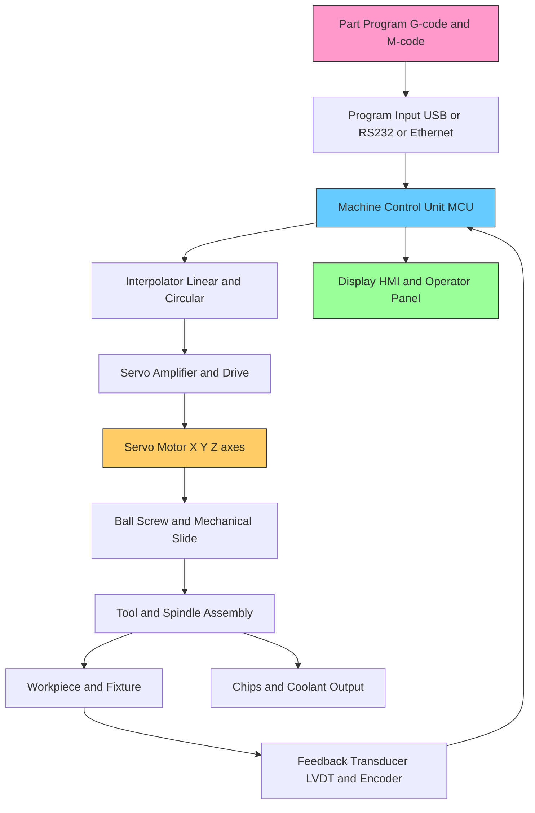
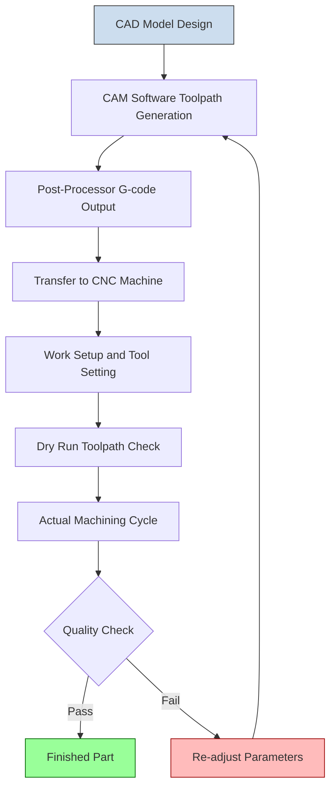
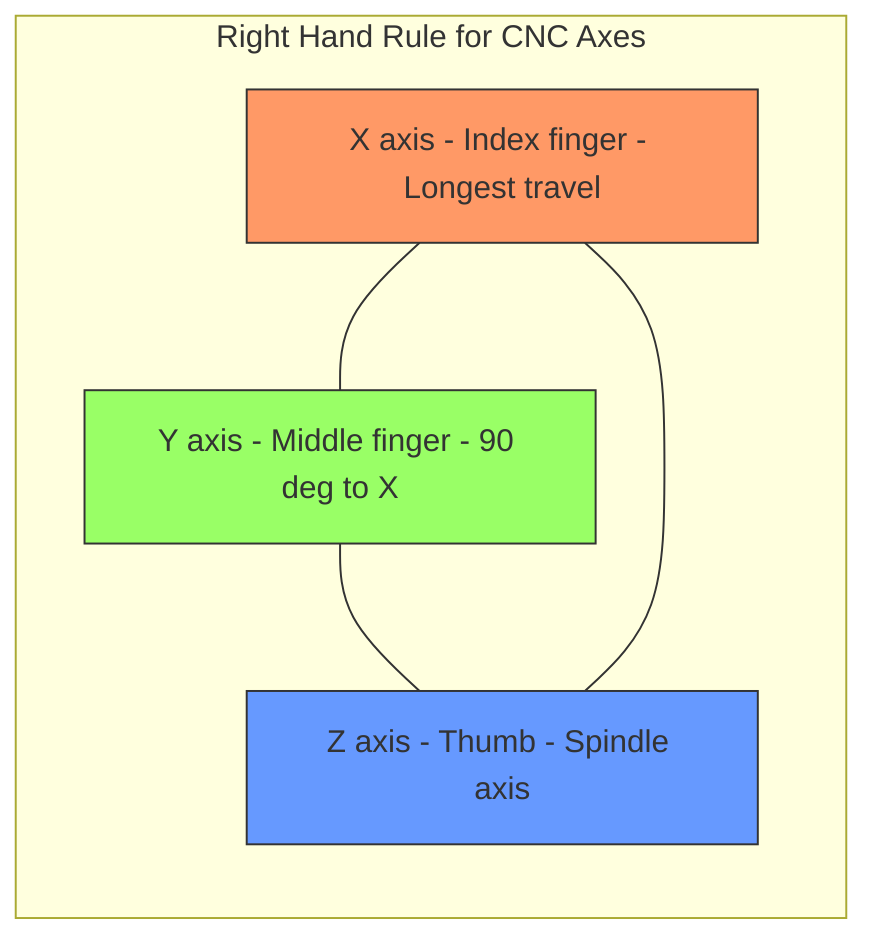
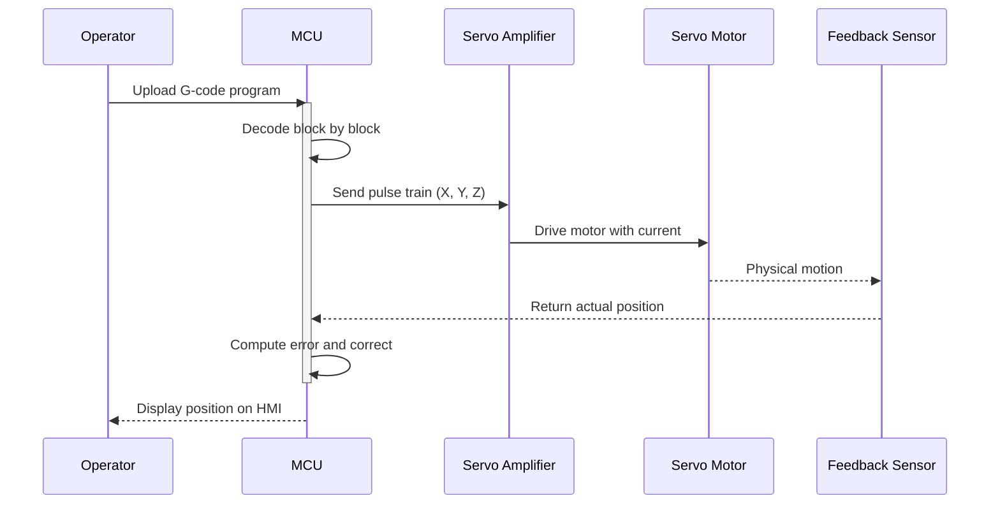

# CNC machine tools

<!-- SECTION_1_START -->

# CNC Machine Tools — KTU 2024 Premium Study Notes

## 1. Core Technical Definition & Intuitive Overview

> [!IMPORTANT]
> **Formal KTU 2024 Definition:**
> **CNC (Computer Numerical Control) machine tools** are automated manufacturing systems in which the functions and movements of machine tools (such as turning, milling, drilling, grinding, etc.) are controlled by a computer executing a stored program of instructions. The numerical data required to produce a part is provided as a **program (G-code/M-code)** which dictates tool path, spindle speed, feed rate, and auxiliary functions with high precision and repeatability.

### 1.1 Conceptual Analogy / Intuition

> [!NOTE]
> **The "Stenographer + Typist" Analogy:**
> Imagine a traditional machine shop where a skilled operator manually turns hand-wheels and feeds levers to shape a metal block. Now, replace that operator with a **very fast typist** who follows a **pre-written letter of instructions** (the program). The typist (CNC controller) reads the letter line by line and tells the machine exactly *what to do, where to move, how fast, and in what sequence* — without getting tired, without forgetting, and without making dimensional mistakes. The "letter" here is the **NC part program** written in standardized **ISO/EIA G-code and M-code**.

### 1.2 Historical Evolution (Syllabus Highlight)

> [!IMPORTANT]
> **NC → CNC → DNC Evolution Path:**
> - **NC (Numerical Control) — 1950s:** Hard-wired logic using punched tape.
> - **CNC (Computer Numerical Control) — 1970s:** Microprocessor-based, soft-wired with editable memory.
> - **DNC (Direct Numerical Control):** Multiple CNC machines networked to a central computer.
> - **Modern:** **FMS (Flexible Manufacturing System)**, **CIM (Computer Integrated Manufacturing)**, and **Smart CNC** with IoT sensors.

### 1.3 Key Terminology (KTU Board Favourites)

| Term | Meaning |
|---|---|
| **APT** | Automatically Programmed Tools (high-level NC language) |
| **G-code** | Preparatory functions (geometry commands, e.g., G01 linear move) |
| **M-code** | Miscellaneous functions (machine on/off, coolant) |
| **DNC** | Direct Numerical Control (networked control) |
| **FMS** | Flexible Manufacturing System |
| **MCU** | Machine Control Unit (the brain of CNC) |
| **ATC** | Automatic Tool Changer |
| **FADAL Style** | A common CNC syntax style (legacy) |

> [!VISUALIZATION CONTROL]
> **Concept:** 2D Plotter Trajectory (X-Y Plane) simulating a CNC mill tool path.
> **GeoGebra / Desmos Input Equations:**
> * `Point A = (0, 0)` — start position
> * `Line 1: y = 0` from `x = 0` to `x = 50` — G01 linear cut
> * `Arc 1: (x - 50)^2 + (y - 25)^2 = 25^2`, lower half — G02/G03 arc
> * `Line 2: y = 0` from `x = 50` to `x = 100` — return
> **Visual Description:** Student should observe a flat-bottomed semi-circular pocket being machined, demonstrating how G01 (linear) and G02/G03 (circular interpolation) commands combine to form a real toolpath.

---

<!-- SECTION_1_END -->

<!-- SECTION_2_START -->

# 2. Deep Theoretical Analysis & KTU High-Yield Formula Sheet

## 2.1 Block Diagram of a CNC Machine

> [!NOTE]
> Every CNC machine, regardless of type, follows the same fundamental architecture:

**1. Program Input Device** → **2. Machine Control Unit (MCU)** → **3. Machine Tool (with Servo Drives)** → **4. Feedback System** → **back to MCU (Closed Loop)**

### 2.2 Five Major Sub-Systems (Step-by-Step Logic)

- **A. Part Program (The "Recipe")**
  * Series of alphanumeric instructions stored on tape, disk, or USB.
  * Written in standardized EIA/ISO code.
  * *Why:* Replaces manual operator skill with repeatable digital logic.

- **B. Machine Control Unit (MCU) — The "Brain")**
  * Decodes the program, performs interpolation, and dispatches pulses to servo drives.
  * Contains: *CPU, memory, I/O interfaces, interpolator, feedback processor*.
  * *How:* Reads one block of code → calculates intermediate points (interpolation) → sends voltage pulses to motors.

- **C. Drive System (The "Muscles")**
  * Converts electrical pulses into mechanical motion via **servo motors** (closed loop) or **stepper motors** (open loop).
  * Includes: Servo amplifier, lead screw, ball screw.

- **D. Machine Tool / Mechanical Section (The "Body")**
  * The physical frame, spindle, slides, ATC, and work-holding fixtures.
  * Built with high stiffness to withstand cutting forces.

- **E. Feedback System (The "Eyes")**
  * **Transducers:** Linear Variable Differential Transformer (**LVDT**), rotary encoders, glass scales.
  * Sends actual position back to MCU for **error correction** (closed loop).

### 2.3 CNC Axes (KTU High-Yield Topic)

> [!IMPORTANT]
> **Right-Hand Rule for Axis Identification (Always tested!):**
> 
> Using your **right hand**, point the **index finger** along the **X-axis**, the **middle finger** along the **Y-axis**, and the **thumb** along the **Z-axis**. All three must be mutually perpendicular.

| Axis | Direction | Example (Vertical Mill) |
|---|---|---|
| **X-axis** | Longest linear travel, left–right | Table movement (left/right) |
| **Y-axis** | 90° to X, in–out | Saddle movement (toward/away from column) |
| **Z-axis** | Parallel to spindle, up–down | Spindle / quill movement |
| **A, B, C** | Rotational about X, Y, Z | Rotary table, tilting head |

### 2.4 KTU Formula Sheet / Cheat Sheet

> [!IMPORTANT]
> **High-Yield Equations for Numerical Problems:**

| Concept | Formula | Units | Application |
|---|---|---|---|
| Spindle Speed | $N = \dfrac{1000 \cdot V}{\pi \cdot D}$ | rpm | Turning, milling, drilling |
| Feed Rate | $f_r = N \cdot z \cdot f_z$ | mm/min | Milling feed calculation |
| Material Removal Rate (Turning) | $MRR = \pi \cdot D \cdot f \cdot V$ | mm³/min | Productivity check |
| Material Removal Rate (Milling) | $MRR = a_p \cdot a_e \cdot f_r$ | mm³/min | Pocket milling |
| Metal Removal Rate (Drilling) | $MRR = \dfrac{\pi \cdot D^2 \cdot f_r}{4}$ | mm³/min | Hole-making |
| Total Machining Time | $T_m = \dfrac{L + L_a}{f_r}$ | min | Cycle time estimation |
| Positioning Accuracy | $E = X_{commanded} - X_{actual}$ | mm | Closed-loop error check |
| Stepper Motor Step Angle | $\theta = \dfrac{360°}{N_{steps}}$ | degrees | Resolution check |

> [!NOTE]
> **Symbol Legend (do not skip in exams):**
> * $N$ = spindle speed (rpm)
> * $V$ = cutting speed (m/min)
> * $D$ = tool/workpiece diameter (mm)
> * $f$ = feed per revolution (mm/rev)
> * $f_r$ = feed rate (mm/min)
> * $f_z$ = feed per tooth (mm/tooth)
> * $z$ = number of teeth/cutters
> * $a_p$ = depth of cut (axial)
> * $a_e$ = depth of cut (radial)
> * $L$ = workpiece length (mm)
> * $L_a$ = tool approach + overtravel (mm)

### 2.5 Comparison: CNC vs Conventional Machine Tools

| Parameter | Conventional | CNC |
|---|---|---|
| Operator Skill | High | Low (programming) |
| Repeatability | Low | Very high (±0.001 mm) |
| Flexibility | Low (dedicated) | High (program change) |
| Initial Cost | Low | **High** |
| Production Rate | Slow (manual) | Fast (automated) |
| Complex Shapes | Difficult | Easy (3D contours) |
| Human Error | Frequent | Negligible |

### 2.6 Real-World Engineering Utility

> [!NOTE]
> **Where CNC Machines Are Used in Industry:**
> * **Aerospace:** Turbine blade profiling (5-axis CNC milling).
> * **Automotive:** Engine block, gearbox, and chassis component machining.
> * **Medical:** Custom orthopedic implants, surgical instruments.
> * **Mold & Die:** Injection mold cavities, die-casting dies.
> * **Electronics:** PCB drilling, smartphone metal frames.
> * **Fab Lab / Idea Lab:** Rapid prototyping with desktop CNC routers (e.g., **Roland MDX**, **ShopBot**, **Carbide 3D**).

---

<!-- SECTION_2_END -->

<!-- SECTION_3_START -->

# 3. Step-by-Step Derivations & Code/Symbolic Implementation

## 3.1 Worked Example 1: Spindle Speed Calculation (Turning)

> [!NOTE]
> **Problem:** A mild steel workpiece of **75 mm diameter** is to be turned on a CNC lathe. The recommended cutting speed is **V = 25 m/min**. Calculate the required spindle speed in rpm.

**Given:**
* $D = 75$ mm
* $V = 25$ m/min

**Formula:**

$$N = \frac{1000 \cdot V}{\pi \cdot D}$$

**Step 1 — Substitute values (notice the 1000 factor to convert m → mm):**

$$N = \frac{1000 \times 25}{\pi \times 75}$$

**Step 2 — Compute the numerator:**

$$1000 \times 25 = 25000$$

**Step 3 — Compute the denominator:**

$$\pi \times 75 = 235.619$$

**Step 4 — Final division:**

$$N = \frac{25000}{235.619} = 106.1 \text{ rpm}$$

**Step 5 — Round to nearest standard value (S110):**

$$N \approx 110 \text{ rpm} \quad \blacksquare$$

## 3.2 Worked Example 2: Feed Rate for a Milling Operation

> [!NOTE]
> **Problem:** A 4-tooth end mill of **D = 20 mm** is used on a CNC mill. Spindle speed $N = 600$ rpm, feed per tooth $f_z = 0.05$ mm/tooth. Calculate the feed rate in mm/min.

**Given:**
* $z = 4$ teeth
* $N = 600$ rpm
* $f_z = 0.05$ mm/tooth

**Formula:**

$$f_r = N \cdot z \cdot f_z$$

**Step 1 — Substitute:**

$$f_r = 600 \times 4 \times 0.05$$

**Step 2 — Multiply sequentially:**

$$f_r = 2400 \times 0.05 = 120 \text{ mm/min}$$

$$\boxed{f_r = 120 \text{ mm/min}} \quad \blacksquare$$

## 3.3 Worked Example 3: Total Machining Time (Slot Milling)

> [!NOTE]
> **Problem:** A slot of **L = 150 mm** length is milled. Tool approach $L_a = 12$ mm. Feed rate $f_r = 240$ mm/min. Calculate machining time.

**Given:**
* $L = 150$ mm
* $L_a = 12$ mm
* $f_r = 240$ mm/min

**Formula:**

$$T_m = \frac{L + L_a}{f_r}$$

**Step 1 — Sum the lengths:**

$$L + L_a = 150 + 12 = 162 \text{ mm}$$

**Step 2 — Divide by feed rate:**

$$T_m = \frac{162}{240} = 0.675 \text{ min}$$

**Step 3 — Convert to seconds for practical reference:**

$$T_m = 0.675 \times 60 = 40.5 \text{ seconds}$$

$$\boxed{T_m = 0.675 \text{ min} \approx 40.5 \text{ s}} \quad \blacksquare$$

## 3.4 Symbolic G-Code Program Implementation (Python-Based Simulator Logic)

> [!NOTE]
> The following Python code **simulates** a CNC interpreter parsing a simple G-code program for a 2-axis mill. This helps students understand how an MCU decodes a real program.

```python
from typing import List, Dict
import math
import logging

# Configure logging for execution tracing (production-style error handling)
logging.basicConfig(level=logging.INFO, format='%(levelname)s :: %(message)s')
logger = logging.getLogger("CNC_Interpreter")


class CNCInterpreter:
    """
    A minimal symbolic CNC G-code interpreter for educational use.
    Supports G00 (rapid), G01 (linear), G02 (CW arc), G03 (CCW arc).
    """

    def __init__(self) -> None:
        self.x: float = 0.0          # Current X coordinate (mm)
        self.y: float = 0.0          # Current Y coordinate (mm)
        self.z: float = 0.0          # Current Z coordinate (mm)
        self.feed_rate: float = 100.0  # Default feed (mm/min)
        self.modal_g: int = 0        # Active modal G-code

    def parse_block(self, block: str) -> None:
        """Parse a single G-code block like 'G01 X50 Y25 F200'."""
        if not block.strip() or block.startswith('%'):
            return  # Boundary check: skip empty/comment lines

        tokens: List[str] = block.upper().split()
        params: Dict[str, float] = {}

        for token in tokens:
            if token[0] == 'G':
                self.modal_g = int(token[1:])
            elif token[0] == 'X':
                params['X'] = float(token[1:])
            elif token[0] == 'Y':
                params['Y'] = float(token[1:])
            elif token[0] == 'Z':
                params['Z'] = float(token[1:])
            elif token[0] == 'F':
                self.feed_rate = float(token[1:])
            elif token[0] == 'I':
                params['I'] = float(token[1:])
            elif token[0] == 'J':
                params['J'] = float(token[1:])

        self.execute(params)

    def execute(self, params: Dict[str, float]) -> None:
        """Execute the current modal command with given parameters."""
        # Boundary check: ensure modal code is set
        if self.modal_g is None:
            raise ValueError("No active G-code set.")

        if self.modal_g == 0:    # G00 - Rapid positioning
            new_x = params.get('X', self.x)
            new_y = params.get('Y', self.y)
            dist = math.hypot(new_x - self.x, new_y - self.y)
            logger.info(f"G00 RAPID  -> ({new_x:.2f}, {new_y:.2f})  dist={dist:.2f} mm")
            self.x, self.y = new_x, new_y

        elif self.modal_g == 1:  # G01 - Linear interpolation
            new_x = params.get('X', self.x)
            new_y = params.get('Y', self.y)
            dist = math.hypot(new_x - self.x, new_y - self.y)
            # Absolute boundary validation
            if abs(new_x) > 1000 or abs(new_y) > 1000:
                raise ValueError(f"Coordinate out of machine travel: ({new_x}, {new_y})")
            logger.info(f"G01 LINEAR -> ({new_x:.2f}, {new_y:.2f})  F={self.feed_rate:.0f}")
            self.x, self.y = new_x, new_y

        elif self.modal_g in (2, 3):  # G02 / G03 - Circular interpolation
            cx, cy = self.x + params.get('I', 0), self.y + params.get('J', 0)
            end_x, end_y = params.get('X', self.x), params.get('Y', self.y)
            radius = math.hypot(self.x - cx, self.y - cy)
            logger.info(
                f"G{self.modal_g:02d} ARC    -> center=({cx:.2f},{cy:.2f})  "
                f"end=({end_x:.2f},{end_y:.2f})  R={radius:.2f}"
            )
            self.x, self.y = end_x, end_y

        else:
            logger.warning(f"Unsupported G-code: G{self.modal_g:02d}")


def main() -> None:
    """Run a sample CNC pocket-machining program."""
    program: List[str] = [
        "% Pocket Milling Demo",
        "G01 X0 Y0 F150",
        "G01 X50 Y0",
        "G02 X50 Y50 I0 J25",
        "G01 X0 Y50",
        "G01 X0 Y0",
        "%",
    ]

    cnc = CNCInterpreter()
    try:
        for line in program:
            cnc.parse_block(line)
    except ValueError as ve:
        logger.error(f"MACHINE FAULT :: {ve}")


if __name__ == "__main__":
    main()
```

## 3.5 Lab Workshop Configuration (Hardware Tooling & Safety)

> [!NOTE]
> **CNC Milling Machine — Standard Tooling & Setup Reference (Lab Practical)**

| Setup Parameter | Specification | Safety / Notes |
|---|---|---|
| **Workpiece Material** | Aluminum 6061 / Mild Steel / Acrylic | Secure with vise or clamps |
| **Tool Holder** | ER32 collet chuck | Torque to 25 Nm (factory spec) |
| **End Mill (Flat)** | 6 mm, 4-flute, HSS coated | Use cutting fluid on steel |
| **Spindle Speed Range** | 0 – 12000 rpm (typical) | Start at 30% and ramp up |
| **Feed Rate (Al)** | 300 – 800 mm/min | Lower for steel |
| **Coolant** | Flood or mist | Never run dry on steel |
| **Zero Reference** | X0 Y0 Z0 = top-left corner of stock | Use edge finder + probe |
| **Emergency Stop** | Red mushroom button | **Test before every run** |
| **PPE Required** | Safety glasses, no loose clothing, no gloves near spindle | Gloves can catch on rotating tools |
| **Door Interlock** | Must close before cycle start | Prevents flying chip injury |

---

<!-- SECTION_3_END -->

<!-- SECTION_4_START -->

# 4. Structural Diagrams & Schematics

## 4.1 Block Diagram — CNC Machine Architecture



## 4.2 Closed-Loop CNC Control Flow


## 4.3 CNC Manufacturing Process Flow



## 4.4 Axis Identification Diagram (Right-Hand Rule)



## 4.5 Sequential Processing Topology — G-code Execution



---

<!-- SECTION_4_END -->

<!-- SECTION_5_START -->

# 5. KTU 2024 Scheme Examination Question Bank & Topic Recap

## 5.1 Part A Questions (3 Marks Each)

### Q1. Define CNC. List any four advantages of CNC machines over conventional machines. [KTU University Exam - July 2024]

**Model Answer (Valuation Key):**

> **CNC** stands for **Computer Numerical Control**. It is a manufacturing system in which the functions of a machine tool are controlled by a computer executing a stored program of instructions.

**Four Advantages:**

1. **Higher accuracy and repeatability** (typically ±0.001 mm). *[1 Mark]*
2. **Greater flexibility** — part changeover by program swap, not retooling. *[0.5 Mark]*
3. **Reduced human error** and lower operator skill requirement. *[0.5 Mark]*
4. **Higher productivity** through multi-axis simultaneous machining. *[1 Mark]*

### Q2. What is the function of the Machine Control Unit (MCU) in a CNC system? [KTU University Exam - Dec 2023]

**Model Answer:**

> The **Machine Control Unit (MCU)** is the brain of a CNC machine. Its functions are: *[1 Mark]*
> 1. **Decoding** the part program (G-code/M-code). *[0.5 Mark]*
> 2. **Interpolation** — calculating intermediate points between start and end of each motion block. *[0.5 Mark]*
> 3. **Dispatching** voltage pulses to the servo drives for each axis. *[0.5 Mark]*
> 4. **Processing feedback** signals for closed-loop error correction. *[0.5 Mark]*

---

## 5.2 Part B Questions (14 Marks — Module Internal Choice)

### QUESTION A (14 Marks) — Full Solution

> **[KTU University Exam - July 2024 | CO2, CO3 | Apply + Analyze]**

#### (a) Explain the working principle of a CNC machine with a neat block diagram. List the main components and state the function of each. [7 Marks]

**Model Solution:**

**Working Principle:** A CNC machine works on the principle of **stored program automation**. The part program (in G-code/M-code) is fed into the Machine Control Unit (MCU), which decodes each block, performs interpolation to generate intermediate axis positions, and sends control signals to the servo drives. The servo motors actuate the slides through ball screws, positioning the tool relative to the workpiece. Feedback devices (encoders, LVDTs) continuously measure the actual position and feed it back to the MCU, which compares it with the commanded position and corrects any error — this is the **closed-loop control principle**. *[3 Marks for principle]*

**Block Diagram:** *[2 Marks — must include: Program → MCU → Servo Drive → Motor → Tool/Workpiece → Feedback → MCU]*

**Main Components and Functions:**

| Component | Function |
|---|---|
| **Part Program** | Sequence of G/M codes describing the desired toolpath |
| **Program Input Device** | Loads program from USB, RS-232, or Ethernet |
| **Machine Control Unit (MCU)** | Decodes, interpolates, and dispatches control signals |
| **Servo Drive System** | Amplifies control signals to drive motors |
| **Machine Tool (Slide/Spindle)** | Physical frame that performs cutting |
| **Feedback System** | LVDT/Encoder for position verification |
| **HMI / Display** | Operator interface for monitoring and editing |

*[2 Marks — minimum 5 components explained]*

#### (b) A CNC lathe is to turn a mild steel shaft of diameter **100 mm** down to **80 mm** over a length of **200 mm**. The recommended cutting speed is **30 m/min** and feed is **0.2 mm/rev**. Calculate: (i) Spindle speed, (ii) Feed rate, (iii) MRR, (iv) Machining time. Take tool approach = 10 mm. [7 Marks]

**Model Solution:**

**Given:**
* $D_{initial} = 100$ mm, $D_{final} = 80$ mm
* $L = 200$ mm, $L_a = 10$ mm
* $V = 30$ m/min, $f = 0.2$ mm/rev

**Average diameter for turning (single-pass reference):**

$$D_{avg} = \frac{100 + 80}{2} = 90 \text{ mm}$$

**Valuation Note:** *Some texts use $D_{final}$ directly. Either is acceptable if justified. Here we use $D_{avg}$ for accuracy. **[0.5 Mark]** *

---

**(i) Spindle Speed:**

$$N = \frac{1000 \cdot V}{\pi \cdot D_{avg}} = \frac{1000 \times 30}{\pi \times 90}$$

$$N = \frac{30000}{282.743} = 106.1 \text{ rpm}$$

$$\boxed{N \approx 110 \text{ rpm}} \quad \text{[2 Marks]}$$

---

**(ii) Feed Rate:**

$$f_r = N \cdot f = 110 \times 0.2 = 22 \text{ mm/min}$$

$$\boxed{f_r = 22 \text{ mm/min}} \quad \text{[1 Mark]}$$

---

**(iii) Material Removal Rate (MRR):**

Depth of cut: $d = (D_{initial} - D_{final})/2 = (100 - 80)/2 = 10$ mm

$$MRR = \pi \cdot D_{avg} \cdot f \cdot d = \pi \times 90 \times 0.2 \times 10$$

$$MRR = 565.49 \text{ mm}^3/\text{min}$$

$$\boxed{MRR \approx 565.5 \text{ cm}^3/\text{min}} \quad \text{[2 Marks]}$$

---

**(iv) Machining Time:**

$$T_m = \frac{L + L_a}{f_r} = \frac{200 + 10}{22} = \frac{210}{22} = 9.545 \text{ min}$$

$$\boxed{T_m \approx 9.55 \text{ min}} \quad \text{[1.5 Marks]}$$

---

### QUESTION B (14 Marks) — Alternative Choice

> **[KTU University Exam - Dec 2023 | CO2, CO3 | Understand + Apply]**

#### (a) Differentiate between NC, CNC, and DNC. List any four applications of CNC machines. [7 Marks]

**Model Solution:**

| Feature | NC | CNC | DNC |
|---|---|---|---|
| **Full Form** | Numerical Control | Computer Numerical Control | Direct Numerical Control |
| **Controller** | Hard-wired logic | Microprocessor / computer | Central host + many CNC |
| **Program Storage** | Punched tape | RAM, USB, HDD | Shared server |
| **Editing** | Difficult | Easy (on-screen) | Remote edit |
| **Flexibility** | Low | High | Highest (networked) |
| **Cost** | Moderate | Higher | Highest (factory-wide) |

*[3 Marks for clear comparison table — 1.5 for similarities/highlights, 1.5 for differences]*

**Four Applications of CNC:** *[1 Mark each = 4 Marks]*

1. **Aerospace** — turbine blade profiling, structural ribs.
2. **Automotive** — engine block, cylinder head, crankshaft machining.
3. **Medical implants** — custom titanium hip joints and dental crowns.
4. **Electronics** — PCB drilling, smartphone housings.
5. **Mold and die making** — injection mold cavities, stamping dies.
6. **Rapid prototyping** — Fab Lab desktop CNC routers.

---

#### (b) A CNC mill uses a 4-tooth end mill of **D = 12 mm** to machine an aluminum pocket at spindle speed **N = 1500 rpm** and feed per tooth **f_z = 0.04 mm/tooth**. If axial depth of cut is **3 mm** and radial depth is **6 mm**, calculate: (i) Feed rate, (ii) MRR, (iii) Average cutting velocity. [7 Marks]

**Model Solution:**

**Given:**
* $z = 4$, $D = 12$ mm
* $N = 1500$ rpm, $f_z = 0.04$ mm/tooth
* $a_p = 3$ mm (axial), $a_e = 6$ mm (radial)

---

**(i) Feed Rate:**

$$f_r = N \cdot z \cdot f_z = 1500 \times 4 \times 0.04$$

$$f_r = 240 \text{ mm/min}$$

$$\boxed{f_r = 240 \text{ mm/min}} \quad \text{[2 Marks]}$$

---

**(ii) Material Removal Rate:**

$$MRR = a_p \cdot a_e \cdot f_r = 3 \times 6 \times 240$$

$$MRR = 4320 \text{ mm}^3/\text{min} = 4.32 \text{ cm}^3/\text{min}$$

$$\boxed{MRR = 4320 \text{ mm}^3/\text{min}} \quad \text{[2 Marks]}$$

---

**(iii) Average Cutting Velocity:**

$$V = \frac{\pi \cdot D \cdot N}{1000} = \frac{\pi \times 12 \times 1500}{1000}$$

$$V = \frac{56548.67}{1000} = 56.55 \text{ m/min}$$

$$\boxed{V \approx 56.55 \text{ m/min}} \quad \text{[3 Marks]}$$

---

## 5.3 KTU Examiner's Valuation Warning / Pitfall Callout

> [!WARNING]
> **Common Mistakes That Cost Marks:**
> 1. **Forgetting the 1000 factor** in spindle speed formula $N = \frac{1000V}{\pi D}$ — this converts m → mm and is the most common silly error. *Penalty: 1–2 marks.*
> 2. **Using wrong diameter:** For turning, students often use $D_{final}$ instead of $D_{avg}$ or $D_{initial}$ — always state your assumption. *Penalty: 1 mark.*
> 3. **Skipping units in final answer:** KTU strictly deducts 0.5 mark per missing unit. Always write **rpm**, **mm/min**, **mm³/min**.
> 4. **Not showing formula substitution:** Even if answer is correct, **valuation key awards 1 mark for stating formula** and **1 mark for substitution step** — don't skip the algebra.
> 5. **Confusing feed per rev (f)** with **feed per minute (f_r)** in turning — they are NOT the same. Use $f_r = N \cdot f$ for turning, $f_r = N \cdot z \cdot f_z$ for milling.
> 6. **Missing the approach length $L_a$** in machining time formula — this is a board-favourite trap.

---

## 5.4 Topic Recap & Important Things to Remember

> [!IMPORTANT]
> **CNC Machine Tools — Rapid Revision Checklist**

**Core Concepts:**
- CNC = **Computer Numerical Control**; uses stored program (G/M-code) to automate machine tool motion.
- NC → CNC → DNC → FMS → CIM is the historical automation evolution.
- MCU = brain; Servo = muscles; Transducer = eyes; Slide/Table = body.

**Architecture (5 sub-systems):**
1. **Part Program** (input)
2. **MCU** (decode + interpolate)
3. **Drive System** (servo motors + ball screw)
4. **Machine Tool** (mechanical frame)
5. **Feedback** (LVDT, encoder → closed-loop)

**Axes (Right-Hand Rule):**
- X = longest travel, Y = 90° to X, Z = parallel to spindle.
- A, B, C = rotational about X, Y, Z.

**Key Formulas (Must Memorize):**
- $N = \frac{1000 V}{\pi D}$ (spindle speed)
- $f_r = N \cdot f$ (turning feed)
- $f_r = N \cdot z \cdot f_z$ (milling feed)
- $MRR = \pi D f d$ (turning)
- $MRR = a_p \cdot a_e \cdot f_r$ (milling)
- $T_m = \frac{L + L_a}{f_r}$ (machining time)

**Codes to Remember:**
- **G00** = rapid traverse
- **G01** = linear interpolation (cut)
- **G02** = CW arc, **G03** = CCW arc
- **G90** = absolute, **G91** = incremental
- **M03** = spindle ON CW, **M05** = spindle stop, **M08** = coolant ON, **M30** = program end

**Advantages:** High accuracy, repeatability, flexibility, lower labor cost.
**Disadvantages:** High initial cost, skilled programmer required, high maintenance.

**Lab Safety (Always Tested):**
- Close door interlock before cycle.
- Press **Emergency Stop** (red mushroom) before any tool change.
- **Never** wear loose clothing, gloves, or jewelry near rotating spindle.
- Always do a **dry run** (tool above workpiece) before actual cutting.

**Industrial Applications:** Aerospace, automotive, medical implants, mold/die making, electronics, Fab Lab prototyping.

<!-- SECTION_5_END -->
