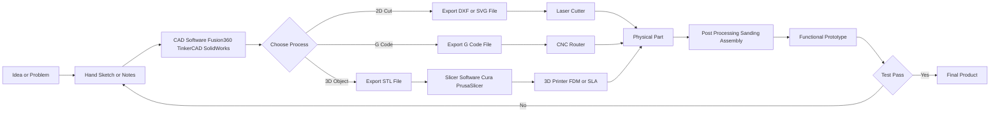
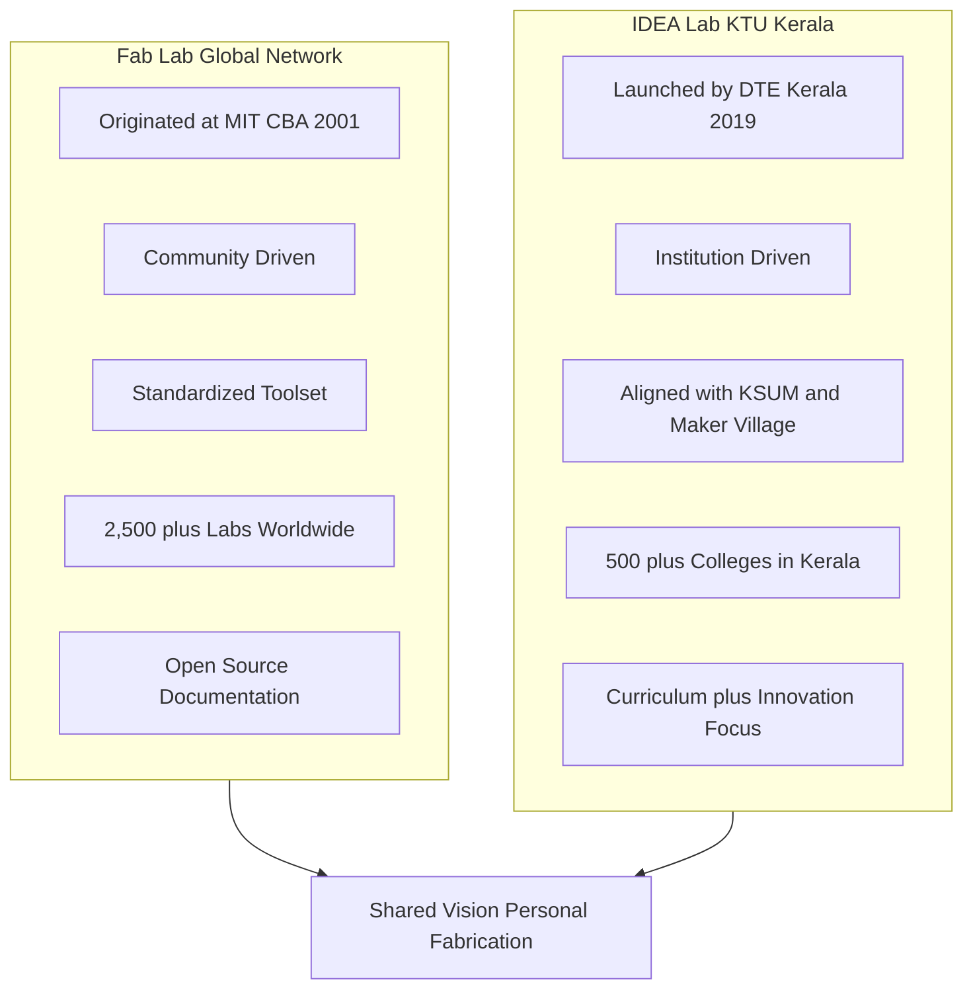
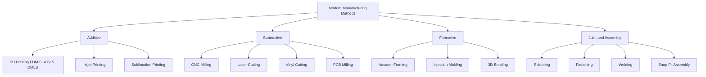
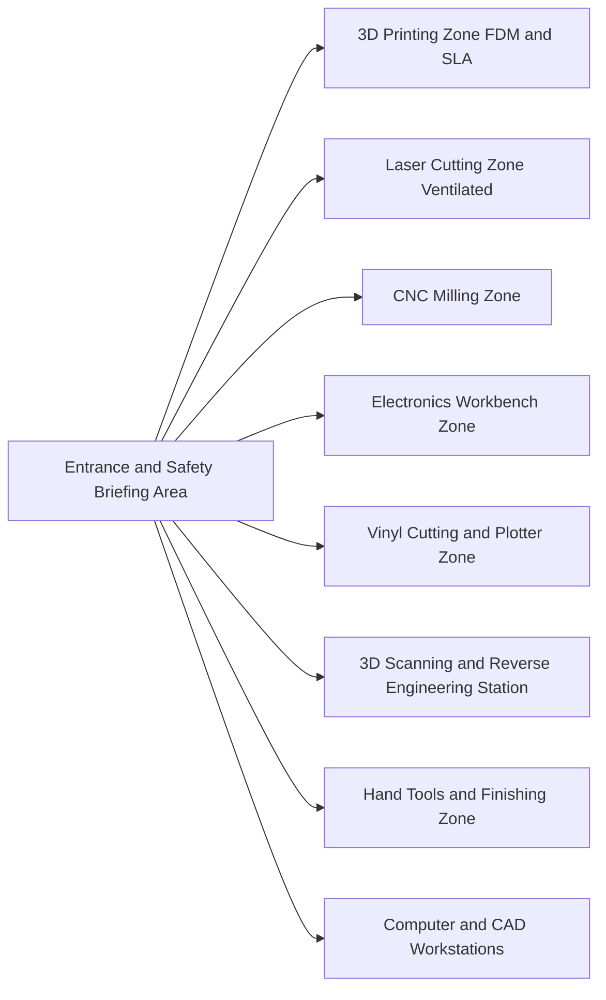

# Modern manufacturing methods ( Fab lab/IDEA Lab - Demonstration only):

<!-- SECTION_1_START -->
# Module 14: Modern Manufacturing Methods (Fab Lab / IDEA Lab)

## 1. Core Technical Definition & Intuitive Overview

### 1.1 Formal Definition

> [!NOTE]
> **Fab Lab (Fabrication Laboratory):** A small-scale, fully equipped digital fabrication workshop that provides individuals with access to a set of flexible, computer-controlled tools capable of making "almost anything" — covering subtractive, additive, and formative manufacturing processes. Originated at the **MIT Center for Bits and Atoms (CBA)** under Prof. **Neil Gershenfeld** in 2001.

> [!NOTE]
> **IDEA Lab (Innovation, Design, Entrepreneurship, and Action Lab):** A KTU Kerala Government initiative (launched in 2019–2020) to set up fabrication and innovation spaces in engineering colleges across Kerala, empowering students to convert innovative ideas into working prototypes using modern digital manufacturing tools.

> [!IMPORTANT]
> **Syllabus Highlight (KTU 2024 Scheme – GCESL106):**
> This module is listed as **"Demonstration only"** — students are required to **observe and understand** the working of the equipment, **NOT operate** them. Assessment focuses on awareness, safety, and conceptual understanding of modern digital manufacturing workflows.

---

### 1.2 Conceptual Analogy / Intuition

Imagine a **modern digital kitchen**:
- A traditional Indian kitchen has a stove, mixer, oven — you can cook many dishes, but each tool does one job.
- A **Fab Lab / IDEA Lab** is like a **"factory inside a room"** — it has a 3D printer (like a rice cooker that builds objects layer by layer), a laser cutter (like a precision knife that never cuts your finger), a CNC router (like a robotic carpenter), and electronics workbenches (like a digital sewing machine for circuits).

The key idea: **You design on a computer → The machine builds it for you, automatically, with high precision.**

| Analogy Item | Real Fab Lab Tool | Function |
|---|---|---|
| Dough kneader | 3D Printer | Builds objects layer by layer from plastic/metal |
| Laser-guided cutter | Laser Cutter / Engraver | Cuts/etches wood, acrylic, cardboard |
| Robotic carpenter | CNC Router / Milling | Subtracts material from a solid block |
| Precision sticker printer | Vinyl Cutter | Cuts stickers, decals, flexible sheets |
| Digital sewing kit | Electronics Workbench | Solders and tests circuits on PCBs |
| High-precision scanner | 3D Scanner | Captures real objects as digital 3D models |

---

### 1.3 Physical Constants and Standard Metrics

- **Standard Fab Lab Machine Inventory (MIT Fab Lab Charter):** Encompasses a minimum set of digitally controlled tools including 3D printers, laser cutters, CNC machines, vinyl cutters, and electronics workbenches.
- **Typical 3D Printer Build Volume:** $\approx 200 \times 200 \times 200$ **mm** (entry-level FDM machines).
- **IDEA Lab Setup (KTU):** Approved funding of **₹ 5 to 10 Lakhs per lab** under the Directorate of Technical Education (DTE), Kerala.
- **Global Fab Lab Network:** Over **2,500+ Fab Labs** in 125+ countries as of 2024 (per **fabfoundation.org**).

> [!IMPORTANT]
> **Safety Metric for Demonstration:** Always wear **safety goggles (EN 166 rated)** when laser cutters or CNC machines are operating. Laser cutters typically use a Class 4 laser (visible and invisible radiation hazard).

> [!VISUALIZATION CONTROL]
> **Concept:** Fab Lab Workflow — From Idea to Physical Prototype
> **Visual Description:** Imagine a horizontal flow: a "Lightbulb (Idea)" on the left → flowing into a "Computer (CAD Software)" → flowing into a "Machine (3D Printer / Laser Cutter / CNC)" → ending at a "Physical Object (Prototype)" on the right. This is the canonical *Design → Digitize → Fabricate* pipeline.
<!-- SECTION_1_END -->

<!-- SECTION_2_START -->
# 2. Deep Theoretical Analysis & KTU High-Yield Reference Sheet

## 2.1 The Fab Lab Philosophy — "How to Make (Almost) Anything"

The MIT Fab Lab charter is built on four foundational principles:

1. **Personal Fabrication** — Democratization of manufacturing; anyone with a digital design can fabricate a physical object.
2. **Standardized Toolset** — Every Fab Lab around the world uses the same core inventory, so a design made in Kerala can be fabricated in Boston.
3. **Open Source Ethos** — Machines, firmware, and design files are shared openly; documentation follows the **"make, share, learn"** philosophy.
4. **Global Network Access** — Labs are interconnected; a student in India can collaborate with a Fab Lab in Mexico on a single project.

---

## 2.2 The IDEA Lab Concept (Kerala Innovation Initiative)

> [!NOTE]
> **IDEA Lab Full Form:** **I**nnovation, **D**esign, **E**ntrepreneurship, and **A**ction Lab.

**Objectives of the IDEA Lab:**
- Build an innovation ecosystem inside engineering colleges.
- Bridge the gap between **academic curriculum** and **industry-grade prototyping**.
- Promote **startup culture** and **interdisciplinary project work** at the B.Tech level.
- Provide access to modern manufacturing tools (similar to Fab Labs) under one roof.

**Key Differentiator:** While Fab Labs are **global community-based**, IDEA Labs are **government-funded institutional setups** in Kerala, often aligned with the **Kerala Startup Mission (KSUM)** and **Maker Village** ecosystem in Kochi.

---

## 2.3 KTU Reference Sheet — Modern Manufacturing Methods at a Glance

| # | Manufacturing Method | Category | Working Principle | Typical Materials | Common Application |
|---|---|---|---|---|---|
| 1 | **3D Printing (FDM)** | Additive | Heated nozzle deposits thermoplastic layer by layer | PLA, ABS, PETG | Prototypes, jigs, enclosures |
| 2 | **3D Printing (SLA/DLP)** | Additive | UV light cures liquid resin layer by layer | Photopolymer resin | High-detail models, jewelry, dental |
| 3 | **Laser Cutting / Engraving** | Subtractive | Focused $\text{CO}_2$ or fiber laser vaporizes material | Acrylic, plywood, MDF, cardboard | Signage, enclosures, flat parts |
| 4 | **CNC Milling / Router** | Subtractive | Spinning cutting tool removes material from a block | Wood, soft metals, plastics | Precision parts, molds, carvings |
| 5 | **Vinyl Cutting / Plotter** | Subtractive | Sharp blade cuts through adhesive vinyl sheets | Vinyl rolls, sticker paper | Decals, PCB stencils, labels |
| 6 | **PCB Milling (LPKF)** | Subtractive | Miniature CNC router etches copper-clad boards | FR-4 copper-clad board | Rapid PCB prototyping |
| 7 | **3D Scanning** | Reverse Eng. | Structured light / laser projects patterns on object | Any opaque object | Digital archiving, quality check |
| 8 | **Electronics Workbench** | Assembly | Soldering, testing, and programming microcontrollers | PCBs, components, MCUs | IoT, embedded systems projects |
| 9 | **Vacuum Forming** | Formative | Heated plastic sheet is vacuum-sucked over a mold | HIPS, PETG sheets | Packaging, enclosures, trays |
| 10 | **Inkjet / Sublimation Printing** | Additive (2D) | Ink droplets or heat transfer onto substrates | Paper, fabric, ceramic | Custom merchandise, design |

---

## 2.4 Categories of Modern Manufacturing

> [!IMPORTANT]
> **Mnemonic for Manufacturing Categories — "ASF":**
> **A**dditive, **S**ubtractive, **F**ormative.

1. **Additive Manufacturing (AM):** Material is *added* layer by layer.
   - Example: 3D Printing (FDM, SLA, SLS, DMLS).
2. **Subtractive Manufacturing:** Material is *removed* from a larger block.
   - Example: CNC milling, laser cutting, drilling.
3. **Formative Manufacturing:** Material is *shaped/formed* using heat, pressure, or deformation.
   - Example: Injection molding, vacuum forming, 3D bending.
4. **Joining / Assembly:** Components are *joined* together.
   - Example: Soldering, riveting, welding, snap-fit 3D printed parts.

---

## 2.5 Engineering Utility and Real-World Relevance

- **Rapid Prototyping:** Reduces product development cycle from **months to days**.
- **Industry 4.0 Enablement:** Direct CAD-to-machine workflow eliminates manual tooling.
- **Low-Volume Customization:** Cost-effective for batches of **1 to 1,000 units**, where traditional injection molding is uneconomical.
- **Academic Research:** Used in B.Tech/M.Tech final-year projects for fabricating drone frames, IoT enclosures, biomedical models, etc.
- **Startups:** Kerala's **Maker Village (Kochi)** and **TiE Kerala** actively leverage IDEA Lab infrastructure to launch hardware startups.
- **Global Standards:** Fab Lab equipment is interoperable worldwide — a design file (.STL, .DXF) can be sent to any Fab Lab globally for fabrication.

> [!TIP]
> **Why this matters for KTU:** This module is a *demonstration* module, but questions in the exam can be conceptual (e.g., "Differentiate between additive and subtractive manufacturing" or "List four machines in a Fab Lab"). Always memorize the **ASF categories** and the **minimum Fab Lab machine inventory**.
<!-- SECTION_2_END -->

<!-- SECTION_3_START -->
# 3. Step-by-Step Operational Workflows and Code/Symbolic Implementation

## 3.1 Standard Fab Lab Workflow — "Design → Make → Test"

Below is the **exhaustive step-by-step operational pipeline** that students will observe during a Fab Lab / IDEA Lab demonstration session.

---

### Step 1: Ideation and Concept Sketching

- Students begin with a **hand-drawn sketch** or a **digital concept** on paper.
- Identify the problem statement (e.g., "I need a custom phone stand for my B.Tech project").
- Output: A rough sketch with dimensions and rough material selection.

> [!NOTE]
> **Tool used at this stage:** Pen, paper, whiteboard, or free software like **Scribus / Inkscape (open source)**.

---

### Step 2: Computer-Aided Design (CAD) Modeling

- The sketch is converted into a precise **3D model** using CAD software.
- Common software observed in IDEA Labs:
  - **Fusion 360** (Autodesk — free for students).
  - **TinkerCAD** (browser-based, beginner-friendly).
  - **SolidWorks** (institutional license).
  - **FreeCAD** (open source).
  - **Blender** (for organic, sculptural shapes).

**Example — Parametric Model of a Phone Stand (Conceptual Symbolic Notation):**

Let the stand have:
- Base width: $B = 80 \text{ mm}$
- Backrest height: $H = 100 \text{ mm}$
- Stand slope angle: $\theta = 65^\circ$

The faceplate slot depth $d$ is computed as:

$$
\begin{aligned}
d &= H \cdot \sin(\theta) \\
d &= 100 \text{ mm} \cdot \sin(65^\circ) \\
d &= 100 \cdot 0.9063 \\
d &= 90.63 \text{ mm}
\end{aligned}
$$

The base footprint length $L$ is computed as:

$$
\begin{aligned}
L &= H \cdot \cos(\theta) + B \\
L &= 100 \text{ mm} \cdot \cos(65^\circ) + 80 \text{ mm} \\
L &= 100 \cdot 0.4226 + 80 \\
L &= 42.26 + 80 \\
L &= 122.26 \text{ mm}
\end{aligned}
$$

> **Engineering Logic:** The angle $\theta$ is chosen between $60^\circ$ and $75^\circ$ for optimal screen visibility while preventing the phone from sliding. Anything less than $50^\circ$ causes the phone to topple; anything above $80^\circ$ is ergonomically flat.

---

### Step 3: File Format Conversion (CAD → CAM)

- CAD files (Fusion 360 native, .STEP, .IGES) are exported into **machine-readable formats**:
  - 3D Printer → **.STL** (Stereolithography) or **.3MF**.
  - Laser Cutter → **.DXF** (Drawing Exchange Format) or **.SVG**.
  - CNC Router → **.G-code** (text-based numerical control program).
  - Vinyl Cutter → **.SVG** or **.AI** (Adobe Illustrator).

> [!NOTE]
> **The "Slicer" Software:** A special program that converts .STL into 3D printer G-code by slicing the model into thousands of horizontal layers. Examples: **Cura (Ultimaker)**, **PrusaSlicer**, **Chitubox** (for resin printers).

---

### Step 4: Machine Setup and Demonstration

The lab instructor (during the **demonstration**) will show:

1. **Bed Leveling** for 3D printers (a critical first step).
2. **Material Loading** — placing PLA filament spool, or loading acrylic sheet into laser cutter.
3. **Origin Setting (X, Y, Z)** — defining the machine's zero reference point.
4. **Job Initiation** — pressing "Start" on the machine console.

**Example G-code Snippet (Conceptual) for a 3D Printer:**

```
; --- Fab Lab Demo: Phone Stand 3D Print ---
; Layer Height: 0.2 mm
; Nozzle Temp: 210 C
; Bed Temp: 60 C
G21 ; Set units to millimeters
G90 ; Absolute positioning
M104 S210 ; Set extruder to 210 C
M140 S60 ; Set bed to 60 C
G28 ; Auto home all axes
G92 E0 ; Reset extruder position
G1 Z0.2 F300 ; Move to first layer height
G1 X10 Y10 F1500 ; Move to start corner
G1 X80 Y10 E2.5 F1200 ; First perimeter line
G1 X80 Y80 E5.0 ; Second side
G1 X10 Y80 E7.5 ; Third side
G1 X10 Y10 E10.0 ; Close loop
M104 S0 ; Cool down extruder
M140 S0 ; Cool down bed
M84 ; Disable motors
; --- End of print job ---
```

> **Symbolic Logic:** `G1` = linear move, `E` = extrude filament, `F` = feedrate (speed). The student should understand that **G-code is the universal language of digital fabrication machines**.

---

### Step 5: Post-Processing and Testing

- **Support Removal:** 3D-printed parts often have temporary support structures that are snapped off by hand or cut with pliers.
- **Sanding / Polishing:** Laser-cut edges may be sanded to remove charring.
- **Assembly:** Multiple parts are glued, screwed, or snap-fitted together.
- **Functional Test:** The prototype is used in its intended application and the design is iterated.

> [!IMPORTANT]
> **KTU Demonstration Note:** Students observe steps 1–5; they do **NOT** independently run the machines unless specifically permitted by the lab instructor for safety and equipment-protection reasons.

---

## 3.2 Comparative Symbolic Matrix — FDM vs SLA

| Parameter | FDM (Fused Deposition Modeling) | SLA (Stereolithography) |
|---|---|---|
| Build Principle | Extrudes melted thermoplastic | Cures photopolymer resin with UV light |
| Layer Resolution | $0.1$ to $0.3$ mm | $0.02$ to $0.05$ mm |
| Surface Finish | Visible layer lines | Smooth, near-injection-mold quality |
| Material Cost | Low (PLA ~ ₹800/kg) | High (Resin ~ ₹2,500/L) |
| Common Use | Functional prototypes, brackets | Visual models, dental, jewelry |
| Post-Processing | Support snipping, sanding | IPA wash, UV curing chamber |

> [!TIP]
> **Cost-Per-Part Symbolic Estimate:** For a part of volume $V = 20 \text{ cm}^3$ and material density $\rho = 1.24 \text{ g/cm}^3$ (PLA), the mass is:
>
> $$
> \begin{aligned}
> m &= V \cdot \rho \\
> m &= 20 \cdot 1.24 \\
> m &= 24.8 \text{ g}
> \end{aligned}
> $$
>
> With PLA cost $C_{\text{PLA}} = \text{₹ } 0.8 \text{ per gram}$, the raw material cost is:
>
> $$
> \begin{aligned}
> \text{Cost} &= m \cdot C_{\text{PLA}} \\
> \text{Cost} &= 24.8 \cdot 0.8 \\
> \text{Cost} &= \text{₹ } 19.84
> \end{aligned}
> $$

<!-- SECTION_4_START -->
# 4. Structural Diagrams and Schematics

## 4.1 Mermaid Diagram — The Digital Fabrication Pipeline



---

## 4.2 Mermaid Diagram — Fab Lab vs IDEA Lab Structural Comparison



---

## 4.3 Mermaid Diagram — Manufacturing Method Taxonomy (ASF Model)



---

## 4.4 Mermaid Diagram — IDEA Lab Workstation Layout (Top-Down)


<!-- SECTION_4_END -->

<!-- SECTION_5_START -->
# 5. KTU 2024 Scheme Examination Question Bank and Topic Recap

## 5.1 Part A Questions (3 Marks Each)

### Question 1 (3 Marks)
**[KTU University Exam - July 2024 (Model)]**  
Define the term **Fab Lab**. List any **four** essential machines found inside a standard Fab Lab.

**Model Answer (3 Marks):**
- **Definition (1 Mark):** Fab Lab (Fabrication Laboratory) is a small-scale digital fabrication workshop equipped with computer-controlled tools that empower individuals to design and manufacture "almost anything." It was conceptualized at the **MIT Center for Bits and Atoms** in 2001.
- **Four Essential Machines (½ Mark each = 2 Marks):**
  1. **3D Printer** (FDM/SLA) for additive manufacturing.
  2. **Laser Cutter / Engraver** for 2D/2.5D cutting.
  3. **CNC Milling Machine** for subtractive manufacturing.
  4. **Vinyl Cutter** for stickers, decals, and PCB stencils.

*(Acceptable alternative: 3D Scanner, Electronics Workbench.)*

---

### Question 2 (3 Marks)
**[KTU University Exam - Dec 2023 (Model)]**  
Differentiate between **Additive Manufacturing** and **Subtractive Manufacturing**. Give **one example** for each.

**Model Answer (3 Marks):**
- **Additive Manufacturing (1.5 Marks):** Material is *added layer by layer* to build a 3D object from nothing. There is minimal material wastage. **Example: 3D Printing (FDM)** using PLA filament.
- **Subtractive Manufacturing (1.5 Marks):** Material is *removed* from a solid block using cutting tools. There is significant material wastage (chips/swarf). **Example: CNC Milling** of an aluminum block.

---

## 5.2 Part B Questions (14 Marks Each)

### Question A (14 Marks) — Module Choice 1

**[KTU University Exam - July 2024 (Model)]**  
**Question A:**

**(a)** Explain the **concept of the IDEA Lab** as envisioned by the Government of Kerala. Mention its **four pillars** of objectives and outline the **typical equipment inventory** found in an IDEA Lab. **(7 Marks)**

**(b)** With the help of a **neat block diagram**, describe the **end-to-end digital fabrication workflow** from ideation to a functional prototype. **(7 Marks)**

**Model Answer:**

**(a) IDEA Lab Concept (7 Marks):**

- **Origin and Definition (1 Mark):** IDEA Lab stands for **Innovation, Design, Entrepreneurship, and Action Lab**. It is a Government of Kerala initiative (under the Directorate of Technical Education) launched to establish digital fabrication and innovation centers in engineering colleges across the state.
- **Four Pillars / Objectives (2 Marks — ½ Mark each):**
  1. **Innovation** — Encourage students to convert ideas into prototypes.
  2. **Design** — Promote user-centered and product design thinking.
  3. **Entrepreneurship** — Nurture startup culture aligned with **Kerala Startup Mission (KSUM)**.
  4. **Action** — Hands-on "learning by doing" philosophy.
- **Typical Equipment Inventory (4 Marks — 1 Mark for each cluster):**
  1. **Additive:** 3D printer (FDM), 3D printer (SLA/resin optional).
  2. **Subtractive:** Laser cutter, CNC router / PCB milling machine.
  3. **2D Fabrication:** Vinyl cutter / plotter.
  4. **Electronics & Software:** Soldering station, oscilloscope, multimeter, microcontroller dev kits, CAD workstations.

> **Valuation Key Points:** '[Defining IDEA Lab acronym correctly: 1 Mark]', '[Naming the four pillars: 2 Marks]', '[Listing equipment under categories: 4 Marks]'.

---

**(b) Digital Fabrication Workflow (7 Marks):**

- **Block Diagram (3 Marks):** A clean flowchart showing **Idea → CAD → CAM → Machine → Prototype → Test**.
- **Step-by-Step Explanation (4 Marks — 1 Mark each for elaboration):**
  1. **Ideation:** Identify the problem and sketch the solution on paper. (1 Mark)
  2. **CAD Modeling:** Use software (Fusion 360, TinkerCAD) to create a 3D/2D digital model. Export to .STL/.DXF/.SVG. (1 Mark)
  3. **CAM / Slicing:** Use slicer software (Cura, PrusaSlicer) to generate G-code for the machine. (1 Mark)
  4. **Fabrication:** Machine executes the G-code to produce the physical part. Post-processing removes supports. (1 Mark)
  5. **Testing and Iteration:** Functional test is performed; design is refined based on feedback. (1 Mark)

> **Valuation Key Points:** '[Block diagram with all stages: 3 Marks]', '[Each step explained with tool name: 4 Marks]'.

---

### Question B (14 Marks) — Module Choice 2

**[KTU University Exam - Dec 2023 (Model)]**  
**Question B:**

**(a)** Classify **modern manufacturing methods** into **four broad categories**. Give **two examples** and **one real-world application** for each category. **(7 Marks)**

**(b)** Compare **FDM-based 3D printing** and **SLA-based 3D printing** under the headings: *build principle, material used, surface finish, typical layer height, and cost per part.* Present the answer in a **tabular format**. **(7 Marks)**

**Model Answer:**

**(a) Classification of Modern Manufacturing (7 Marks):**

| # | Category | Two Examples (½ each) | Real-World Application (½) |
|---|---|---|---|
| 1 | **Additive** | FDM 3D printing, SLA 3D printing (1 Mark) | Rapid prototyping of drone frames (½ Mark) |
| 2 | **Subtractive** | CNC milling, Laser cutting (1 Mark) | Signage and wooden carvings (½ Mark) |
| 3 | **Formative** | Vacuum forming, Injection molding (1 Mark) | Mass production of plastic enclosures (½ Mark) |
| 4 | **Joining/Assembly** | Soldering, Snap-fit assembly (1 Mark) | PCB assembly in electronics (½ Mark) |

> **Valuation Key Points:** '[Naming the four categories: 2 Marks]', '[Two examples per category: 4 Marks]', '[One application: 1 Mark]'.

---

**(b) FDM vs SLA Comparison Table (7 Marks):**

| Parameter | FDM 3D Printing | SLA 3D Printing |
|---|---|---|
| **Build Principle** | Extrudes melted thermoplastic layer by layer (1 Mark) | Cures photopolymer resin using UV light (1 Mark) |
| **Material Used** | PLA, ABS, PETG filaments (1 Mark) | Liquid photopolymer resin (1 Mark) |
| **Surface Finish** | Visible layer lines; rough (½ Mark) | Smooth, high-detail finish (½ Mark) |
| **Typical Layer Height** | $0.1$ to $0.3$ mm (½ Mark) | $0.02$ to $0.05$ mm (½ Mark) |
| **Cost per Part** | Low (~₹20 to ₹200) (½ Mark) | High (~₹200 to ₹2,000) (½ Mark) |

> **Valuation Key Points:** '[Five parameters × 1.4 Marks each ≈ 7 Marks distributed across the table]'.

---

> [!WARNING]
> **KTU Examiner's Valuation Warning / Pitfall Callout:**
> 1. **Do NOT confuse Fab Lab with IDEA Lab in your answer.** Fab Lab is the *MIT-origin, global community-based* initiative; IDEA Lab is the *Kerala Government, institution-based* initiative. Examiners specifically check this distinction. (**2 Marks lost** if confused.)
> 2. **Always classify manufacturing methods using the ASF model** (Additive, Subtractive, Formative) — writing them in random order leads to **partial marking deduction**.
> 3. **Demonstration-only nature:** In the practical lab, if the question asks "did you operate the 3D printer?", the correct answer is **"We observed the demonstration by the instructor"** — not "I operated it." The KTU syllabus explicitly states *demonstration only*.
> 4. **Acronym expansion is mandatory:** Always write **"Fab Lab — Fabrication Laboratory"** and **"IDEA Lab — Innovation, Design, Entrepreneurship, and Action Lab"** at least once. Marks are deducted if the full form is missing.

---

## 5.3 Topic Recap and Important Things to Remember

> [!IMPORTANT]
> **High-Density Rapid Revision Checklist for Module 14:**

- ✅ **Fab Lab = Fabrication Laboratory**, originated at **MIT Center for Bits and Atoms (2001)**, by **Neil Gershenfeld**.
- ✅ **IDEA Lab = Innovation, Design, Entrepreneurship, and Action Lab**, launched by **DTE, Government of Kerala** in engineering colleges.
- ✅ **Fab Lab is global and community-based; IDEA Lab is institutional and government-funded in Kerala.**
- ✅ **Manufacturing Categories Mnemonic: "ASF" → Additive, Subtractive, Formative** (plus Joining/Assembly as a fourth).
- ✅ **Additive Example:** 3D Printing (FDM, SLA, SLS, DMLS). Material is *added*.
- ✅ **Subtractive Example:** CNC Milling, Laser Cutting. Material is *removed*.
- ✅ **Formative Example:** Vacuum Forming, Injection Molding. Material is *shaped*.
- ✅ **Standard Fab Lab Machine Inventory includes:** 3D printer, laser cutter, CNC, vinyl cutter, electronics bench, 3D scanner.
- ✅ **File Formats to Remember:**
  - 3D Printer → **.STL** (stereolithography)
  - Laser Cutter → **.DXF / .SVG**
  - CNC Machine → **.G-code**
- ✅ **Digital Fabrication Pipeline:** Idea → CAD → CAM/Slicing → Machine → Post-Processing → Test → Iterate.
- ✅ **Slicer Software Examples:** **Cura**, **PrusaSlicer**, **Chitubox**.
- ✅ **CAD Software Examples:** **Fusion 360**, **TinkerCAD**, **SolidWorks**, **FreeCAD**.
- ✅ **Safety Gear:** **EN 166-rated safety goggles** for laser cutter demos; **dust mask** for CNC demos.
- ✅ **Demonstration-only module:** Students *observe* — they do not operate machines.
- ✅ **Kerala Ecosystem:** IDEA Labs are linked to **Kerala Startup Mission (KSUM)** and **Maker Village, Kochi**.
- ✅ **Density of PLA plastic** used in cost estimation: $\rho_{\text{PLA}} \approx 1.24 \text{ g/cm}^3$.
- ✅ **Approximate IDEA Lab funding:** **₹ 5 to 10 Lakhs per lab** (DTE Kerala).
- ✅ **Global Fab Lab network size:** **2,500+ labs in 125+ countries** (as of 2024).
<!-- SECTION_5_END -->
