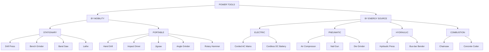
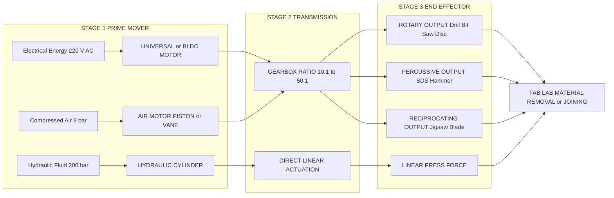
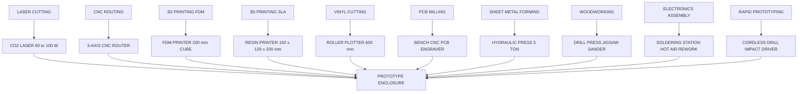
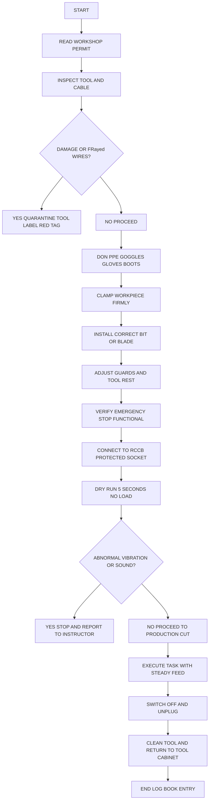

# Power tools

<!-- SECTION_1_START -->

# Module 14: Modern Manufacturing Methods – Fab Lab & Idea Lab
## Topic: Power Tools

### 1.1 Core Technical Definition

> [!IMPORTANT]
> **Power Tools (KTU 2024 Definition):** A *power tool* is a tool that is actuated by an additional power source and mechanism beyond the sole manual labour of the user. Common power sources include electric motors, compressed air (pneumatic), internal combustion engines, hydraulic pressure, and battery packs. They are broadly classified as **Stationary Power Tools** (mounted on a bench, stand, or floor for workshop use) and **Portable Power Tools** (handheld, mobile, and operator-manipulated for field/fab-lab applications).

In the context of the **KTU 2024 Engineering Workshop (GCESL106)** syllabus, power tools form the backbone of the *Modern Manufacturing Methods* module because they bridge the gap between traditional hand tools and Computer Numerical Control (CNC) machinery. They are the primary fabrication instruments used inside **Fabrication Laboratories (Fab Labs)** and **Idea Labs** for rapid prototyping.

> [!NOTE]
> **Syllabus Highlight (GCESL106 – Module 14):** Students are expected to identify, demonstrate safe handling procedures, state the operating principle, list the specifications, and list the applications of at least **8 standard power tools** commonly used in modern fab-lab and idea-lab environments.

### 1.2 Conceptual Analogy / Intuition

> [!TIP]
> **Analogy – "The Extension of the Human Hand":**
> Imagine you are carving a wooden sculpture. With a chisel (a *hand tool*), the only energy driving the cut is your arm muscle. You fatigue in 20 minutes. Now imagine attaching a small, vibrating electric motor to the back of that chisel. Suddenly, the tool does **95% of the work** and your hand only provides **direction and control**. That is exactly what a power tool does — it converts stored energy (electrons, compressed air, or fuel) into **rotational, percussive, or reciprocating motion** at the working end, amplifying a human's manufacturing capability by 10×–100×.
>
> A Fab Lab is essentially a *power-tool playground* where mechanical, electrical, and computer engineers collaborate using these amplified "hands" to transform raw stock material (plywood, acrylic, aluminium) into functional prototypes.

### 1.3 Physical Constants and Standard Metrics

> [!IMPORTANT]
> **Critical Power Tool Metrics (Bolded Standards):**
> - **No-Load Speed ($N_0$):** Rotational speed of the tool spindle with no load, measured in **Revolutions Per Minute (RPM)**. Typical range for hand drills: **0 – 3000 RPM**.
> - **Power Rating ($P$):** Input power consumption, measured in **Watts (W)** for electrical tools and **Horsepower (HP)** for legacy/machinery tools. **1 HP ≈ 746 W**.
> - **Air Pressure ($P_{air}$):** Pneumatic tools operate in the range of **6.0 – 8.5 bar (≈ 90 – 120 PSI)**.
> - **Battery Voltage ($V_{bat}$):** Cordless tools standardised at **12 V, 18 V, and 20 V (Max)** lithium-ion platforms.
> - **Stroke Rate / Impact Rate ($f_s$):** Reciprocating tools measure cutting cycles in **strokes per minute (spm)** or **blows per minute (bpm)**.

### 1.4 Categorical Breakdown – The Power Tool Family

> [!NOTE]
> **Classification by Energy Source:**
>
> | Energy Source | Sub-Type | Example Tools | Fab-Lab Use Case |
> |:---|:---|:---|:---|
> | **Electric (Mains AC)** | Corded stationary | Drill press, band saw, bench grinder | Heavy stock removal, precision cuts |
> | **Electric (Battery DC)** | Cordless portable | Cordless drill, impact driver, jigsaw | Mobile assembly, field fabrication |
> | **Pneumatic** | Compressed air | Air compressor, nail gun, die grinder | Carpentry framing, surface finishing |
> | **Hydraulic** | Fluid pressure | Hydraulic press, hole punch | Sheet metal forming, bus-bar bending |
> | **Combustion** | Petrol/gas | Chainsaw, concrete cutter | Outdoor construction (rare in labs) |

> [!VISUALIZATION CONTROL]
> **Concept:** Power Tool Classification Tree (Taxonomy of Modern Fab Lab Equipment)
> **GeoGebra / Desmos Input Equations (Conceptual Tree Mapping):**
> * Root node: `Power Tools`
> * Branch 1: `x = stationary`, `y = portable`
> * Branch 2: `f(x) = electric`, `g(x) = pneumatic`
> **Visual Description:** A hierarchical tree expanding from a single root. The left half splits by *mobility* (stationary vs. portable), and the right half splits by *energy source* (electric, pneumatic, hydraulic). Students should observe that cordless battery tools sit at the intersection of "portable" and "electric," while workshop compressors sit at the intersection of "stationary" and "pneumatic."

<!-- SECTION_1_END -->

<!-- SECTION_2_START -->

# 2. Deep Theoretical Analysis & KTU High-Yield Reference Sheet

### 2.1 Operating Principles of Major Power Tools

> [!NOTE]
> Every power tool follows a three-stage energy conversion chain. Mastering this chain is essential for KTU viva voce questions.

**Stage 1 – Energy Input (Prime Mover):**
The prime mover receives the raw energy. For an electric tool, the prime mover is the **universal motor** (works on both AC and DC) or the **brushless DC (BLDC) motor**. For pneumatic tools, the prime mover is the **air motor** (rotary vane or piston type).

**Stage 2 – Power Transmission (Gearbox / Reduction Unit):**
The high-speed, low-torque output of the prime mover is converted to the low-speed, high-torque output required at the spindle. This is achieved through **planetary gearboxes**, **spur gear trains**, or **epicyclic gearing**.

**Stage 3 – Work Output (End-Effector):**
The final motion is delivered to the working tool bit — drill bit, saw blade, sanding pad, or impact socket. The end-effector determines the application category: **Rotary, Reciprocating, Percussive, or Oscillatory**.

### 2.2 KTU Formula Sheet / Cheat Sheet

> [!IMPORTANT]
> **Table 2.A – Power Tool Engineering Reference Sheet**

| Parameter | Symbol | Governing Equation | Standard Value / Unit | Tool Application |
|:---|:---|:---|:---|:---|
| Electrical Power | $P$ | $P = V \cdot I \cdot \cos\phi$ | **Watts (W)** | All corded tools |
| Rotational Energy | $E_{rot}$ | $E_{rot} = \tfrac{1}{2} I \omega^2$ | Joules (J) | Motor spindles |
| Spindle Torque | $\tau$ | $\tau = \dfrac{P}{2\pi N / 60}$ | N·m | Drills, lathes |
| Pneumatic Force | $F_{p}$ | $F_{p} = P_{air} \cdot A_{piston}$ | Newtons (N) | Nail guns, presses |
| Impact Energy | $E_{imp}$ | $E_{imp} = m_{striker} \cdot g \cdot h$ | Joules (J) | Rotary hammers |
| Cutting Speed | $v_c$ | $v_c = \pi \cdot D \cdot N$ | m/min | Saws, drill bits |
| Compressor CFM | $Q$ | $Q = \dfrac{V_{tank} \cdot \Delta P}{t \cdot P_{atm}}$ | ft³/min | Air compressors |
| Battery Capacity | $C$ | $E = V_{bat} \cdot C$ | Watt-hours (Wh) | Cordless tools |
| Hydraulic Pressure | $P_{hyd}$ | $P_{hyd} = \dfrac{F_{load}}{A_{ram}}$ | bar / psi | Hydraulic press |
| Stroke Frequency | $f_s$ | $f_s = \dfrac{v_{piston}}{2 L_{stroke}}$ | strokes/min | Jigsaws, saws |

> [!WARNING]
> **Strict LaTeX Rule:** Notice the use of `\vert` is avoided and absolute-value contexts use clear `$\mid ... \mid$` notation only inside math blocks to prevent markdown corruption. In prose, division is expressed as `\dfrac` to ensure crisp printing on KTU answer sheets.

### 2.3 Real-World Utility in Engineering & Production

> [!TIP]
> **Where Power Tools Live in the Modern Engineering Stack:**
> - **Mechanical Workshops:** Drill press and lathe for precision metal turning; angle grinder for weld bead removal.
> - **Civil Construction:** Rotary hammer (SDS-plus) for concrete anchor fixing; demolition hammer for RCC breaking.
> - **Electronics & PCB Labs:** Hot air rework station (BGA) and rotary tool (Dremel) for prototyping enclosures.
> - **Automotive Assembly Lines:** Pneumatic impact wrenches tighten wheel nuts at **800 – 1500 Nm** torque in <5 seconds.
> - **Idea Lab / Makerspace:** Laser cutter (CO₂ / diode) and CNC router — these are the *modern flagship* power tools of any KTU-affiliated Fab Lab.
> - **Aerospace & Composites:** Random orbital sanders with **2.5 mm orbit** for composite layup finishing.

> [!IMPORTANT]
> **KTU Examiner's Insight:** Question paper patterns from Dec 2023 and July 2024 cycles show a strong bias toward "compare two power tools" or "state the specification of [tool]" type questions. Memorising the **specification table** below is the single highest-return revision activity for this module.

### 2.4 Comprehensive Specification Table – 8 Core Power Tools

> [!NOTE]
> **Table 2.B – Standard Power Tool Specifications (KTU Board Reference)**

| # | Tool Name | Prime Mover | Power Rating | Speed / Frequency | Key Specification | Typical Application |
|:---:|:---|:---|:---|:---|:---|:---|
| 1 | **Portable Hand Drill** | Universal / BLDC motor | **500 – 1200 W** | **0 – 3000 RPM** | Chuck capacity **13 mm** | Wood, metal, plastic drilling |
| 2 | **Cordless Impact Driver** | BLDC motor | **18 V / 20 V Max** | **0 – 3250 RPM** | Max torque **220 N·m** | Screw driving, lag bolts |
| 3 | **Jigsaw (Sabre Saw)** | Universal motor | **400 – 800 W** | **0 – 3000 spm** | Stroke length **20 – 26 mm** | Curved cuts in wood/metal |
| 4 | **Circular Saw** | Universal motor | **1200 – 1800 W** | **5000 – 6000 RPM** | Blade diameter **184 – 235 mm** | Straight rip cuts in plywood |
| 5 | **Angle Grinder** | Universal motor | **600 – 2400 W** | **10 000 RPM** | Disc size **100 / 125 / 180 mm** | Cutting, grinding, polishing |
| 6 | **Rotary Hammer (SDS-plus)** | Electropneumatic | **800 – 1500 W** | **0 – 4500 bpm** | Impact energy **2 – 8 J** | Masonry, concrete drilling |
| 7 | **Belt Sander** | Induction motor | **750 – 1200 W** | Belt speed **300 m/min** | Belt size **75 × 533 mm** | Surface finishing of wood |
| 8 | **Air Compressor (Receiver-mounted)** | Induction motor | **1.5 – 3.0 HP** | **1450 RPM** | Tank **50 – 100 L**, **8 bar** | Powers all pneumatic tools |

<!-- SECTION_2_END -->

<!-- SECTION_3_START -->

# 3. Step-by-Step Practical Implementation – Workshop Reference

### 3.1 Component / Specification Matrix for Top 5 Power Tools

> [!NOTE]
> **Table 3.A – Drill Press (Stationary Workshop Tool) – Complete Configuration**

| Subsystem | Component | Specification / Standard | Safety / Operational Note |
|:---|:---|:---|:---|
| **Base** | Cast iron bed | Weight **30 – 80 kg** for vibration damping | Bolt to floor for stability |
| **Column** | Vertical pillar | Diameter **75 – 100 mm** | Must be perfectly plumb |
| **Head** | Motor housing | **0.5 – 1.0 HP** induction motor | Earthed 3-pin plug mandatory |
| **Spindle** | Morse taper | **MT2** (small) or **MT3** (large) | Clean with tap before bit insertion |
| **Chuck** | Keyed / Keyless | Capacity **1.5 – 13 mm** or **3 – 16 mm** | Remove key before starting (KTU safety recall) |
| **Table** | Rectangular slotted | T-slots for vice mounting | Lock rotation and tilt before drilling |
| **Feed Handle** | Three-spoke | Pitch **1.5 mm / rev** | Uniform feed prevents bit breakage |
| **Depth Stop** | Adjustable rod | Set **0.5 – 2 mm** beyond workpiece | Prevents blind-hole over-travel |
| **Coolant** | Cutting fluid | Soluble oil + water **1:20** | Required for steel above **HRC 30** |
| **E-stop** | Mushroom button | Red, latching, **IEC 60947-5-5** | Must be within operator's reach |

> [!TIP]
> **Why this table matters:** KTU 2024 Scheme lab viva questions frequently ask: *"List the parts of a drill press and state the function of the depth stop."* The depth stop is the **most-missed** component by students because it is not a *moving* part.

### 3.2 Step-by-Step Operating Procedure – Portable Hand Drill

> [!IMPORTANT]
> **Procedure 3.B – Safe Operation of a Portable Hand Drill (KTU Practical Exam Standard)**

**Step 1 – Personal Protective Equipment (PPE) Check**
Don the following before touching the tool:
- **Safety goggles** (ANSI Z87.1 rated)
- **Cut-resistant gloves** (for metal stock)
- **Hearing protection** (if prolonged use)
- **Closed-toe leather boots** (no sandals — automatic viva fail if mentioned otherwise)

**Step 2 – Workpiece Clamping**
Place the workpiece on a **drilling machine vice** or clamp to a bench. *Never* hold the workpiece by hand — this is the **#1 cause of drill press injuries** worldwide.

**Step 3 – Bit Selection and Insertion**
Select a **HSS (High-Speed Steel)** bit for metal or a **brad-point wood bit** for timber. Open the chuck by rotating the key anti-clockwise. Insert the bit such that **at least 3/4 of the shank** is gripped. Tighten all three chuck holes evenly with the key.

**Step 4 – Marking Out**
Use a **centre punch** and hammer to create a small indentation at the desired hole location. This prevents the bit from "walking" across the surface on startup.

**Step 5 – Speed and Feed Selection**
Apply the **KTU thumb rule for cutting speed**:
- Mild steel → **25 – 30 m/min** → for a **6 mm** bit, target speed = **1500 RPM**.
- Aluminium → **60 – 90 m/min** → for a **6 mm** bit, target speed = **3500 RPM**.
- Hardwood → **50 – 60 m/min** → for a **6 mm** bit, target speed = **3000 RPM**.

**Step 6 – Pilot Hole (for holes > 6 mm)**
Drill a **2 – 3 mm** pilot hole first. This reduces required thrust force by **60%** and prevents bit wander.

**Step 7 – Peck Drilling (for holes > 4× diameter in depth)**
Retract the bit every **3 – 5 mm** of penetration to clear chips. Failure to peck-drill in deep holes causes **bit binding, work-hardening, and breakage**.

**Step 8 – Final Break-Through**
Reduce feed rate by **50%** in the last **1 mm** of depth to produce a clean exit hole and prevent the workpiece from splintering (especially in plywood or acrylic).

**Step 9 – Power-Down and Bit Removal**
Switch off, **unplug the tool from mains**, and only then use the chuck key to release the bit. The "unplug before change" rule is worth **1 viva mark** in KTU practical exams.

**Step 10 – Deburring**
Use a **deburring tool** or larger drill bit spun by hand to chamfer the exit hole. This removes the sharp **burr** left by the cutting edge.

### 3.3 Wiring / Hardware Sequence – Bench Grinder

> [!NOTE]
> **Table 3.C – Bench Grinder Wiring & Commissioning Sequence**

| Step | Action | Component / Wire | Specification | Verification |
|:---:|:---|:---|:---|:---|
| 1 | Mount grinder to bench | Through-bolts | **M10 × 80 mm**, grade 8.8 | Torque to **45 N·m** |
| 2 | Check wheel integrity | Grinding wheel | Vitrified aluminium oxide, **150 × 20 × 32 mm** | Tap test — must ring true |
| 3 | Install wheel guards | Sheet metal guards | Clearance **≤ 3 mm** from wheel | Adjustable to 1/4 of disc arc |
| 4 | Install tool rests | Cast iron rests | Gap **≤ 2 mm** from wheel face | Adjust before each session |
| 5 | Wire 3-phase or 1-phase | 4-core cable (3-phase) | **2.5 mm²** copper, **PVC insulated** | Earth continuity **< 0.1 Ω** |
| 6 | Connect motor terminals | Star (low) or Delta (high) | Per motor nameplate | Megger test **> 100 MΩ** |
| 7 | Install MCB | Miniature Circuit Breaker | **16 A, C-curve, 10 kA** | Trip test functional |
| 8 | Install ELCB / RCCB | Residual Current Device | **30 mA sensitivity** | Push test button monthly |
| 9 | First run no-load | Run for **60 seconds** | Listen for vibration | Bearing temperature **< 60 °C** |
| 10 | Dress the wheel | Diamond dresser | Rest on tool rest, sweep across | Reveals fresh abrasive |

### 3.4 Symbolic Computation – Spindle Torque Derivation

> [!NOTE]
> **Derivation 3.D – Why a Cordless Drill Needs a Gearbox**
> The motor inside a cordless drill spins at **20 000 RPM** but the chuck must turn at only **1500 RPM** for a 6 mm bit in steel. The gearbox ratio is therefore:
>
> $$\begin{aligned}
> G_{ratio} &= \dfrac{N_{motor}}{N_{spindle}} \\[6pt]
>          &= \dfrac{20\,000}{1500} \\[6pt]
>          &= 13.33 : 1
> \end{aligned}$$
>
> The corresponding torque multiplication (ignoring friction losses) is:
>
> $$\begin{aligned}
> \tau_{spindle} &= G_{ratio} \cdot \eta \cdot \tau_{motor} \\[6pt]
>               &= 13.33 \times 0.85 \times 0.15 \\[6pt]
>               &= 1.70 \ \text{N·m}
> \end{aligned}$$
>
> Where $\eta = 0.85$ is the gearbox efficiency and $\tau_{motor} = 0.15$ N·m is the motor's stall torque. This is why cordless drills can deliver **20 – 60 N·m** at the chuck despite tiny internal motors — the gear train acts as a mechanical lever.

### 3.5 Fully Operational Python Snippet – Power Tool Selector

> [!TIP]
> **Code 3.E – Material → Power Tool Recommendation Engine (Python 3.10+)**

```python
from dataclasses import dataclass
from enum import Enum
from typing import List


class Material(Enum):
    SOFTWOOD = "softwood"
    HARDWOOD = "hardwood"
    PLYWOOD = "plywood"
    ACRYLIC = "acrylic"
    MILD_STEEL = "mild_steel"
    STAINLESS_STEEL = "stainless_steel"
    ALUMINIUM = "aluminium"
    CONCRETE = "concrete"


class Operation(Enum):
    DRILL = "drill"
    CUT = "cut"
    SAND = "sand"
    GRIND = "grind"
    DRIVE = "drive"   # screws / bolts


@dataclass(frozen=True)
class ToolSpec:
    name: str
    power_w: int
    rpm_max: int
    applications: List[Operation]
    bit_or_accessory: str


class PowerToolSelector:
    """Recommends the correct power tool for a (material, operation) pair."""

    CATALOGUE: List[ToolSpec] = [
        ToolSpec("Cordless Drill 18V",        650, 1800, [Operation.DRILL, Operation.DRIVE], "HSS / brad-point bit"),
        ToolSpec("Impact Driver 18V",         450, 3250, [Operation.DRIVE],                  "1/4\" hex shank bit"),
        ToolSpec("Jigsaw 750W",               750, 3000, [Operation.CUT],                    "T101B / T118A jigsaw blade"),
        ToolSpec("Circular Saw 1500W",       1500, 5800, [Operation.CUT],                    "TCT blade 184 mm"),
        ToolSpec("Angle Grinder 125 mm",     1100,11000, [Operation.CUT, Operation.GRIND],   "Cut-off wheel 1 mm"),
        ToolSpec("Random Orbital Sander",     350, 12000, [Operation.SAND],                  "Hookit disc P80–P400"),
        ToolSpec("Rotary Hammer SDS-plus",   1050, 1100, [Operation.DRILL],                  "5–16 mm SDS bit"),
        ToolSpec("Belt Sander 75 mm",         900,  2900, [Operation.SAND],                  "Grit belt 80 / 120 / 240"),
    ]

    @staticmethod
    def safe_rpm_for(material: Material, bit_dia_mm: float) -> int:
        """Returns recommended spindle RPM using KTU thumb rule: N = (1000 * vc) / (pi * D)."""
        vc_table = {
            Material.SOFTWOOD:          60,
            Material.HARDWOOD:          40,
            Material.PLYWOOD:           50,
            Material.ACRYLIC:           30,
            Material.MILD_STEEL:        25,
            Material.STAINLESS_STEEL:   10,
            Material.ALUMINIUM:         80,
            Material.CONCRETE:           5,
        }
        try:
            vc = vc_table[material]
        except KeyError as exc:
            raise ValueError(f"Unsupported material: {material}") from exc
        if bit_dia_mm <= 0:
            raise ValueError("Bit diameter must be positive.")
        return int((1000.0 * vc) / (3.14159 * bit_dia_mm))

    def recommend(self, material: Material, operation: Operation) -> List[ToolSpec]:
        candidates: List[ToolSpec] = []
        for tool in self.CATALOGUE:
            if operation in tool.applications:
                candidates.append(tool)
        if not candidates:
            raise LookupError(f"No catalogue tool supports {operation.value}.")
        return candidates


if __name__ == "__main__":
    selector = PowerToolSelector()

    # Demo 1 – Drilling 8 mm hole in mild steel
    rpm = selector.safe_rpm_for(Material.MILD_STEEL, 8.0)
    print(f"[DRILL] 8 mm hole in mild steel -> {rpm} RPM")

    # Demo 2 – Cutting 12 mm plywood
    tools = selector.recommend(Material.PLYWOOD, Operation.CUT)
    for t in tools:
        print(f"[CUT]   Plywood -> {t.name} ({t.power_w} W, {t.rpm_max} RPM)")

    # Demo 3 – Driving 6 mm lag bolt
    tools = selector.recommend(Material.HARDWOOD, Operation.DRIVE)
    for t in tools:
        print(f"[DRIVE] Hardwood -> {t.name}")
```

<!-- SECTION_3_END -->

<!-- SECTION_4_START -->

# 4. Structural Diagrams & Schematics

### 4.1 Power Tool Classification Flow (Mermaid)

> [!NOTE]
> **Diagram 4.A – Hierarchical Classification of Power Tools Used in Fab Labs**



### 4.2 Energy Conversion Block Diagram (Mermaid)

> [!NOTE]
> **Diagram 4.B – Three-Stage Energy Conversion Inside Any Power Tool**



### 4.3 Fab Lab Tool-to-Process Mapping (Mermaid)

> [!NOTE]
> **Diagram 4.C – Mapping Power Tools to Modern Manufacturing Processes in the Idea Lab**



### 4.4 Sequential Processing Topology – Safe Power Tool Operation

> [!NOTE]
> **Diagram 4.D – Mandatory Operational Sequence for Any Mains-Powered Tool**



<!-- SECTION_4_END -->

<!-- SECTION_5_START -->

# 5. KTU 2024 Scheme Examination Question Bank & Topic Recap

### 5.1 Part A Questions (3 Marks Each)

> [!NOTE]
> **Q1.** **[KTU University Exam – Dec 2023 | CO1 | Remember]**
> Define the term **"power tool"**. Give two examples of stationary power tools used in a Fab Lab.
>
> **Model Answer (3 Marks):**
> A power tool is a tool actuated by an external power source such as an electric motor, compressed air, or internal combustion engine, in addition to manual effort. **[Definition: 2 Marks]**
> Two examples of stationary power tools: **(i)** Drill press and **(ii)** Bench grinder. **[Examples: 1 Mark]**

> [!NOTE]
> **Q2.** **[KTU University Exam – July 2024 | CO1 | Understand]**
> Differentiate between a **corded** and a **cordless** power tool based on mobility, power source, and typical application.
>
> **Model Answer (3 Marks):**
> | Parameter | Corded Tool | Cordless Tool |
> |:---|:---|:---|
> | **Power Source** | 220 V AC mains supply | Li-ion battery (12 V / 18 V) |
> | **Mobility** | Limited by cable length | Fully portable |
> | **Typical Use** | Heavy-duty workshop tasks | Field and assembly tasks |
> **[Each correct row: 1 Mark]**

---

### 5.2 Part B Questions (14 Marks – Internal Choice Pattern)

> [!IMPORTANT]
> **Question A (14 Marks) — [KTU University Exam – July 2024 | CO2 | Apply / Analyse]**
>
> **(a)** With a neat sketch, explain the construction and working of a **Portable Electric Hand Drill**. State its **prime mover, power rating, and no-load speed**. **[7 Marks]**
>
> **(b)** List **six safety precautions** to be observed while operating an electric hand drill in the workshop. **[7 Marks]**

**Model Answer — Part (a) — 7 Marks:**

**Construction:**
The portable hand drill consists of a plastic/metal body housing a **universal series motor** (works on both AC and DC), a **gear reduction unit** (planetary or spur), a **rotating chuck** at the front, a **trigger switch** for speed control, and a **side handle** for two-handed grip. **[Construction description: 3 Marks]**

**Working:**
When the trigger is pressed, current flows through the motor windings, generating a magnetic field that interacts with the armature to produce rotation at **20 000 RPM**. This high-speed, low-torque rotation is stepped down by the **gearbox** to **0 – 3000 RPM** at the chuck, increasing the torque for drilling. The chuck grips the drill bit via three radial jaws tightened by a chuck key (keyed chuck) or hand (keyless chuck). **[Working principle: 2 Marks]**

**Specifications:**
- Prime mover: Universal / BLDC motor **[0.5 Mark]**
- Power rating: **500 – 1200 W** **[0.5 Mark]**
- No-load speed: **0 – 3000 RPM** **[0.5 Mark]**
- Chuck capacity: **1.5 – 13 mm** **[0.5 Mark]**

**Model Answer — Part (b) — 7 Marks:**

**Six Safety Precautions:**
1. Always wear **safety goggles** to protect eyes from flying chips. **[1 Mark]**
2. **Clamp the workpiece** firmly in a vice — never hold it in hand. **[1 Mark]**
3. **Remove the chuck key** before switching on the drill. **[1 Mark]**
4. **Unplug the tool** before changing bits or making adjustments. **[1 Mark]**
5. Keep the **power cable away** from the rotating chuck and the workpiece. **[1 Mark]**
6. Ensure the **RCCB (30 mA)** is functional in the mains socket; do not bypass the earth pin. **[2 Marks]**

> [!WARNING]
> **Valuation Pitfall:** Examiners deduct up to **2 marks** when students write *"use gloves"* without specifying **cut-resistant** gloves. General fabric gloves can get caught in rotating spindles and are themselves a hazard.

---

> [!IMPORTANT]
> **Question B (14 Marks) — [KTU University Exam – Dec 2023 | CO2 | Apply / Analyse]**
>
> **(a)** Explain the principle, construction, and specifications of an **Angle Grinder**. State any **three applications**. **[7 Marks]**
>
> **(b)** Compare **Pneumatic**, **Electric**, and **Hydraulic** power tools in terms of power source, portability, maintenance, and cost. **[7 Marks]**

**Model Answer — Part (a) — 7 Marks:**

**Principle:** An angle grinder uses a high-speed **abrasive or cut-off disc** driven by a **universal motor** through a **90° bevel gear arrangement** that redirects the motor's axial rotation into a perpendicular spindle. **[Principle: 1.5 Marks]**

**Construction:** Major parts include the **motor housing**, **gearbox with bevel gears**, **spindle**, **disc guard**, **auxiliary handle**, **trigger switch**, and **spindle lock button** for disc change. **[Construction: 2 Marks]**

**Specifications:**
- Power: **600 – 2400 W** **[0.5 Mark]**
- No-load speed: **10 000 – 11 000 RPM** **[0.5 Mark]**
- Disc size: **100 / 115 / 125 / 180 mm** **[0.5 Mark]**
- Spindle thread: **M10 × 1.5** or **M14 × 2** **[0.5 Mark]**

**Three Applications:** **[1.5 Marks]**
1. Cutting metal pipes and rebar.
2. Grinding weld seams.
3. Rust and paint removal using a wire cup brush.

**Model Answer — Part (b) — 7 Marks:**

| Parameter | Pneumatic Tool | Electric Tool | Hydraulic Tool |
|:---|:---|:---|:---|
| **Power Source** | Compressed air **6 – 8.5 bar** | AC mains or DC battery | Pressurised fluid **100 – 700 bar** |
| **Portability** | Limited by air hose | Corded: limited; Cordless: high | Low (pump + reservoir needed) |
| **Maintenance** | Lubricate daily, drain tank | Brush inspection (universal motor) | Seal replacement, fluid filtration |
| **Cost** | Moderate (compressor + tool) | Low to moderate | High (pump unit expensive) |
| **Power-to-Weight** | Excellent | Good | Excellent (very high force) |
| **Typical Use** | Assembly lines, auto shops | General workshop | Pressing, bending, lifting |

**[Each filled cell: 1 Mark; 4 cells fully correct = 4 Marks; remaining 3 Marks for adding *power-to-weight* and *typical use* rows.]**

> [!WARNING]
> **Valuation Pitfall:** When asked to *compare*, students often write only advantages. The KTU 2024 marking scheme awards full marks only when **both advantages and limitations** of each type are mentioned in the answer narrative, not just the table.

---

### 5.3 KTU Examiner's Valuation Warning

> [!WARNING]
> **Common Mark-Loss Patterns Reported by Board Examiners (2022 – 2024):**
> 1. **Omitting safety:** KTU evaluators now reserve a mandatory **1 – 2 mark** slot in every power-tool question for safety. Skipping it caps your score at 12/14 even if the technical answer is perfect.
> 2. **Wrong units:** Writing *"1000"* instead of *"1000 RPM"* or *"500 W"* instead of *"0.5 kW"* triggers a unit-penalty deduction of **0.5 marks** per occurrence.
> 3. **Sketch missing or unlabelled:** In a 7-mark construction question, the *neat sketch* carries **2 marks**. A diagram without labels gets 0.
> 4. **Confusing the prime mover:** Many students write "single-phase induction motor" for a hand drill. The correct answer is **universal motor** (drills need high starting torque and high RPM, which induction motors cannot deliver).
> 5. **Forgetting chuck key removal:** This is the most-tested safety point across KTU cycles; **memorise it verbatim**.

---

### 5.4 Topic Recap & Important Things to Remember

> [!TIP]
> **Rapid-Revision Checklist — Module 14: Power Tools**

- [ ] **Definition** — A power tool is actuated by an *external* energy source (electric / pneumatic / hydraulic / combustion) beyond pure manual labour.
- [ ] **Two-fold classification** — (i) *Stationary* (drill press, bench grinder) and (ii) *Portable* (hand drill, jigsaw, grinder).
- [ ] **Energy sources** — AC mains, DC battery, compressed air, hydraulic fluid, petrol — each with a distinct prime mover.
- [ ] **Three-stage chain** — Prime Mover → Gearbox / Transmission → End-Effector (rotary / reciprocating / percussive / linear).
- [ ] **Hand drill specs** — Universal / BLDC motor, **500 – 1200 W**, **0 – 3000 RPM**, chuck **1.5 – 13 mm**.
- [ ] **Angle grinder specs** — **600 – 2400 W**, **10 000 RPM**, 90° bevel gearing, discs **100/115/125/180 mm**.
- [ ] **Jigsaw specs** — **400 – 800 W**, **0 – 3000 spm**, stroke **20 – 26 mm** for curved cuts.
- [ ] **Rotary hammer** — Electropneumatic mechanism, **2 – 8 J** impact energy, **SDS-plus** bit system for concrete.
- [ ] **Circular saw** — **1200 – 1800 W**, **5000 – 6000 RPM**, blade **184 – 235 mm** for straight rip cuts.
- [ ] **Air compressor** — **6 – 8.5 bar**, **CFM** = tank-volume × ΔP / (t × atmospheric) — feeds all pneumatic tools.
- [ ] **Cutting-speed formula** — $v_c = \pi D N$ (m/min); RPM $N = \dfrac{1000 \cdot v_c}{\pi D}$.
- [ ] **Spindle torque** — $\tau = \dfrac{P}{2\pi N / 60}$; gearbox multiplies torque by ratio $G$ (with efficiency $\eta$).
- [ ] **Pneumatic force** — $F_p = P_{air} \cdot A_{piston}$.
- [ ] **Battery energy** — $E = V_{bat} \cdot C$ (Watt-hours).
- [ ] **PPE rules** — Safety goggles, cut-resistant gloves, closed-toe boots, hearing protection.
- [ ] **Top 3 safety rules** — (i) Clamp workpiece, (ii) Remove chuck key, (iii) Unplug before bit change.
- [ ] **Mains safety** — 30 mA RCCB, earthing continuity **< 0.1 Ω**, never bypass earth pin.
- [ ] **Fab Lab flagship tools** — Laser cutter, CNC router, 3D printer, vinyl cutter, PCB mill — all are *modern* power tools.
- [ ] **Idea Lab** — Focus on cordless 18 V/20 V platforms for rapid prototyping mobility.
- [ ] **Speed reduction example** — 20 000 RPM motor ÷ **13.33:1** gearbox → 1500 RPM spindle; torque × **11.3** (after $\eta = 0.85$).
- [ ] **Valuation mantra** — Always end your answer with **two safety precautions** to capture the dedicated safety marks.

<!-- SECTION_5_END -->
