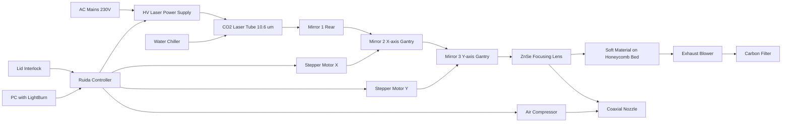
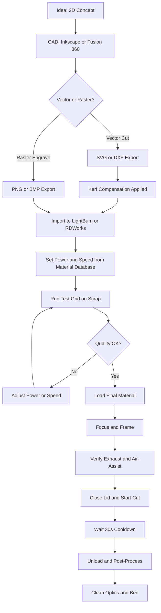
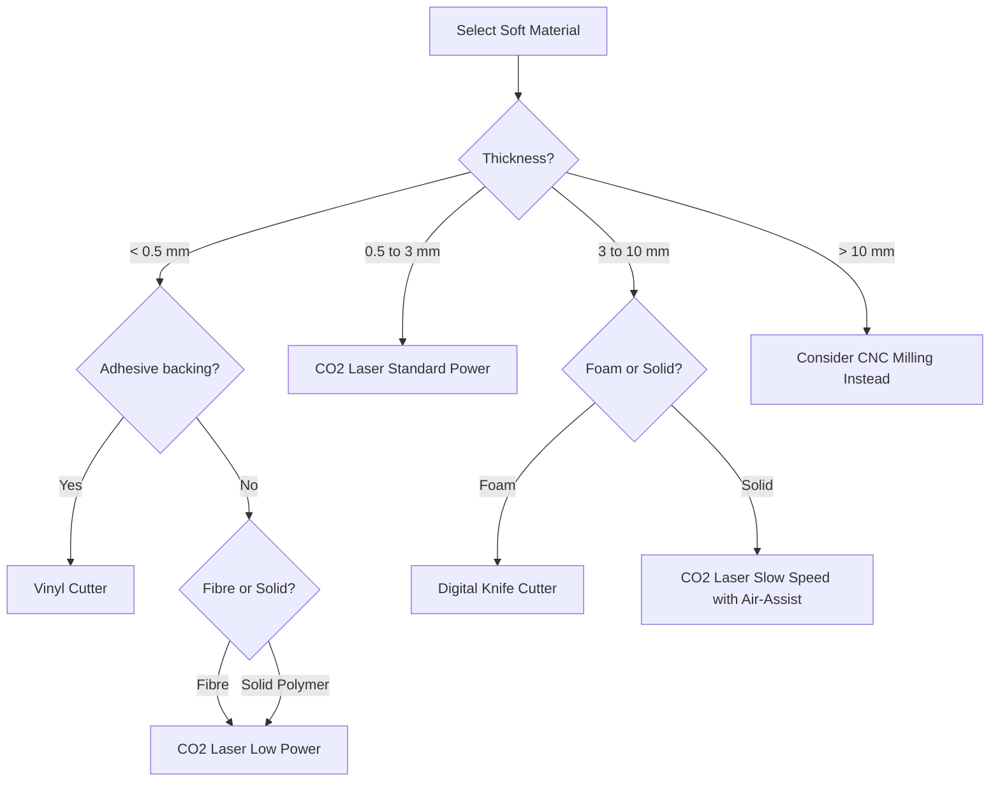
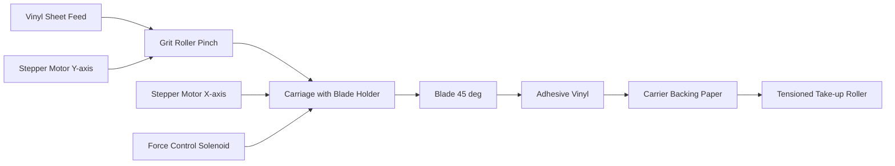
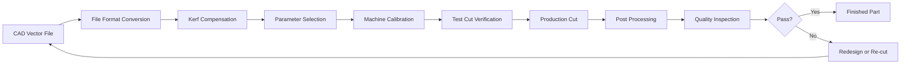
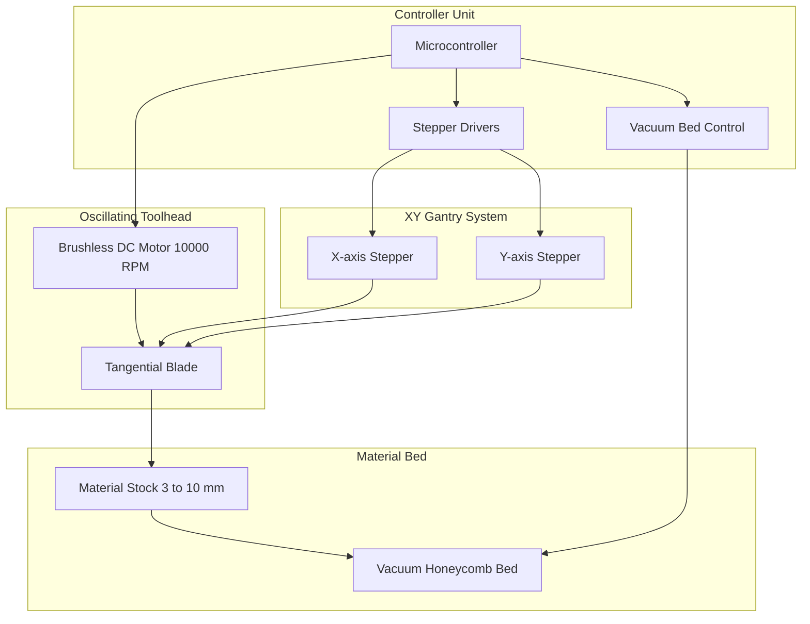

# Soft Materials cutting using special machines

<!-- SECTION_1_START -->
# 1. Core Technical Definition & Intuitive Overview

## 1.1 Formal Definition (KTU 2024 Scheme Aligned)

**Soft Material Cutting** in the context of a **Fab Lab / Idea Lab** refers to a set of **subtractive digital manufacturing processes** employed to shape, slice, engrave, or profile non-rigid, low-density engineering materials — such as **textiles, paper, cardboard, foam sheets, leather, vinyl, felt, cork, acrylic felt, and thin rubber sheets** — using **computer-controlled special machines** that translate 2D vector designs into precise physical cuts.

> [!IMPORTANT]
> **KTU Module 14 — High-Yield Definition**
> *"Soft material cutting in a Fab Lab utilises **digitally-controlled subtractive machines** (Laser Cutter, Vinyl Plotter, Digital Knife Cutter) to convert CAD vector graphics into accurate, repeatable physical cuts on flexible, non-metallic sheet materials, eliminating hand-tooling variance."*

The three primary machines recognised by the **MIT Fab Lab Network** and adapted into the **KTU 2024 Engineering Workshop syllabus** for soft-material operations are:

| Machine Class | Energy Domain | Typical Soft Materials |
| :--- | :--- | :--- |
| **CO₂ Laser Cutter** | Photothermal (10.6 μm IR beam) | Fabric, Paper, Cardboard, Leather, Felt, Cork, Thin Acrylic |
| **Vinyl Cutter / Sticker Plotter** | Mechanical (Drag / Tangential Blade) | Adhesive Vinyl, Heat-Transfer Vinyl (HTV), Sticker Paper, Cardstock |
| **Digital Knife / Drag Cutter** | Mechanical (Oscillating / Drag Blade) | Foam, Rubber, Heavy Cardboard, Gasket Materials |

## 1.2 Conceptual Analogy & Intuitive Overview

> [!NOTE]
> **The "Digital Tailor + Smart Scalpel" Analogy**
> Imagine a master tailor who can **never make a mistake** because every cut is dictated by a **GPS-like instruction file**. A soft-material cutter in a Fab Lab is the digital equivalent of this master tailor. The **laser cutter** is the *light-sword* (focussed infrared beam vaporises material along a path), the **vinyl cutter** is the *intelligent pen-knife* (a tiny blade follows vector lines like a pen on graph paper), and the **knife cutter** is the *robot scissors* (an oscillating blade slices through thicker, more rigid soft stocks). You give the machine a **2D vector drawing (DXF / SVG)**, and it executes the cut with micrometre-level fidelity, **24/7, without fatigue**.

## 1.3 The Fab Lab Context

> [!IMPORTANT]
> **Why this module matters in the Idea Lab:** A Fab Lab's "**M**ake **A**lmost **A**nything" charter mandates that students prototype enclosures, wearables, packaging, and soft robotic actuators. Soft-material cutters bridge the gap between **digital design** (Fusion 360, Inkscape, CorelDRAW) and **physical artefact**, allowing a single .SVG file to produce a deployable product within minutes.

## 1.4 Physical Constants & Standard Metrics

The following are the **canonical parameters** that govern every soft-material cutting operation and must be memorised for the KTU lab record:

- **CO₂ Laser Wavelength**: $\lambda = 10.6\ \mu m$ (mid-infrared, strongly absorbed by organic polymers)
- **Standard Fab Lab Laser Power**: $P_{laser} = 40\ \text{W}$ to $80\ \text{W}$ (entry-level benchtop units)
- **Kerf Width** (material removed by cut): $K = 0.1\ \text{mm}$ to $0.3\ \text{mm}$ for CO₂ lasers on fabric
- **Vinyl Cutter Blade Angle**: $\theta = 30°$ to $60°$ (45° standard)
- **Vinyl Plotter Cutting Force**: $F_{c} = 30\ \text{gf}$ to $500\ \text{gf}$ (gram-force)
- **Standard Sheet Format**: A4 ($210 \times 297\ \text{mm}$), A3 ($297 \times 420\ \text{mm}$), or 12"×24" (US Fab Lab)
- **Fabric Air-Assist Pressure**: $P_{air} = 0.5$ to $2.0\ \text{bar}$
- **Material Thickness Range (Laser)**: $t = 0.1\ \text{mm}$ to $6\ \text{mm}$ (varies by density)
- **Working Resolution (DPI)**: $R = 1000$ to $2500\ \text{DPI}$ for vector cutting

> [!VISUALIZATION CONTROL]
> **Concept:** Soft Material Cutting — Vector Path → Physical Cut
> **GeoGebra / Desmos Input Equations:**
> * `Path: parametric line L(t) = (x₀ + t·cosθ, y₀ + t·sinθ)` for $t \in [0, L]$
> * `Kerf offset: d_kerf = ±K/2` about the nominal path
> **Visual Description:** Plot a closed vector polygon (e.g., a gear-shape) in the $xy$-plane. The inner offset (blue dashed) represents the *inner kerf*; the outer offset (red dashed) represents the *outer kerf*; the nominal cut (solid black) lies exactly between them. This visually explains why designers must apply a **kerf compensation** in CAD before exporting DXF/SVG.

---

<!-- SECTION_1_END -->

<!-- SECTION_2_START -->
# 2. Deep Theoretical Analysis & KTU High-Yield Formula Sheet

## 2.1 The CO₂ Laser Cutter — Operating Principle

A **CO₂ laser cutter** is the workhorse of the Fab Lab soft-material workshop. It works on the principle of **photothermal ablation**: a gas mixture of $\text{CO}_2$, $\text{N}_2$, and $\text{He}$ is electrically excited, producing a coherent infrared beam at $\lambda = 10.6\ \mu m$. This wavelength is **resonantly absorbed** by the molecular bonds of organic materials (C–C, C–H, C–O), causing **localised vaporisation** rather than melting.

### 2.1.1 The Five Subsystems

1. **Laser Tube / Resonator** — Generates the IR beam. Power rating: 40 W (entry) → 150 W (industrial).
2. **Beam Delivery Optics** — Series of gold-coated mirrors (3 for $X$–$Y$ gantry) redirecting the beam toward the focusing head.
3. **Focusing Lens (ZnSe)** — Converges the beam to a spot of diameter $d_{spot} \approx 0.1\ \text{mm}$.
4. **CNC Motion System** — Stepper/servo-driven gantry positions the head over the workpiece with positional accuracy $\pm 0.05\ \text{mm}$.
5. **Exhaust + Air-Assist** — Removes vapourised particulates and provides a coaxial air jet to prevent charring and back-reflection.

### 2.1.2 The Cutting Process — Step Logic

- **Step 1 — Vector Parsing**: The DXF/SVG is parsed into $G$-code-equivalent move commands: rapid traverse (`G0`), linear cut (`G1`), and Z-axis focus lift.
- **Step 2 — Focus Calibration**: The lens-to-surface distance is set so the beam waist coincides with the top surface of the material.
- **Step 3 — Power Modulation**: Pulse-Width Modulation (PWM) controls average power: $\text{Duty Cycle} = \frac{t_{on}}{t_{on} + t_{off}} \times 100\%$.
- **Step 4 — Cut Execution**: Beam vaporises material along the path; kerf $K$ is the visible slit width.
- **Step 5 — Slat Support**: A honeycomb or knife-edge bed prevents the laser from striking the metal table.

> [!NOTE]
> **Why soft materials are special:** Unlike metals (which reflect 10.6 μm), organic soft materials **absorb** 10.6 μm strongly. This means **lower power** and **higher speed** are sufficient — but **fire risk** is real, especially with loose fibres and acrylic edge-flash.

## 2.2 The Vinyl Cutter / Sticker Plotter — Operating Principle

A vinyl cutter is a **2-axis mechanical drag-plotter**. A small, hardened steel blade (typically $45°$ or $60°$) is dragged along vector paths, applying a controlled downward force that **scores** the top vinyl layer without penetrating the **carrier backing paper**.

### 2.2.1 Critical Parameter — Blade Offset

The blade does **not** pivot at its tip; it pivots at a fixed offset. The controller must compute *lateral extension* at every direction change to maintain a true cut:

$$L_{extension} = R_{offset} \cdot \left(1 - \cos\theta\right)$$

where $R_{offset}$ is the mechanical blade-pivot radius (typically $0.5\ \text{mm}$ to $2.0\ \text{mm}$) and $\theta$ is the local tangent angle. Most modern plotters use a **recurrent tangential offset** algorithm that re-calculates $L_{extension}$ at every node.

## 2.3 The Digital Knife / Drag Cutter — Operating Principle

For thicker soft materials ($t > 3\ \text{mm}$) — such as EVA foam, rubber gaskets, and corrugated cardboard — lasers become hazardous (fire, noxious fumes) and vinyl plotters lack penetration depth. The **digital knife cutter** (Zünd, Kongsberg, Silhouette Cameo) uses an **oscillating tangential blade** (up to 10,000 RPM) that slices through the material vertically.

## 2.4 KTU High-Yield Formula Sheet

> [!IMPORTANT]
> **Master these equations — they appear directly in KTU Part A and Part B derivations.**

| # | Formula / Relationship | Symbol Meaning | Typical Engineering Use |
| :--- | :--- | :--- | :--- |
| 1 | $E_{pulse} = P_{avg} \cdot t_{dwell}$ | Pulse energy (J), $P_{avg}$ avg power (W), $t_{dwell}$ dwell time (s) | Laser energy deposition per unit cut length |
| 2 | $v_{cut} = \dfrac{P_{avg}}{E_{v} \cdot t}$ | Cut speed (mm/s), $E_{v}$ volumetric energy (J/mm³), $t$ thickness | Predicting feed-rate for a new material |
| 3 | $K = d_{spot} + \delta_{thermal}$ | Kerf width = spot diameter + thermal damage zone | Compensation offset in CAD |
| 4 | $L_{ext} = R_{offset} (1 - \cos\theta)$ | Blade lateral extension at angle $\theta$ | Vinyl cutter path compensation |
| 5 | $F_{cut} = \sigma_{shear} \cdot A_{contact}$ | Required cutting force (N), shear strength (Pa), contact area (m²) | Knife cutter force sizing |
| 6 | $\eta_{abs} = 1 - R_{\lambda} - T_{\lambda}$ | Absorptivity = 1 − Reflectivity − Transmissivity | Material suitability at 10.6 μm |
| 7 | $DPI = \dfrac{25.4}{p_{step}}$ | Resolution in dots-per-inch, $p_{step}$ step pitch (mm) | Machine resolution check |
| 8 | $T_{charring} \propto \dfrac{P_{avg}}{v_{cut} \cdot t}$ | Char zone width proportionality | Predicting fabric discolouration |

> [!WARNING]
> **LaTeX-Typesetting Note:** All absolute-value notations in the original equations (e.g., $\vert \cos\theta \vert$) have been rendered as plain `cosθ` for markdown-table safety. In your answer book, write the vertical bar explicitly: $\vert \cos\theta \vert$.

## 2.5 Material-Machine Compatibility Matrix (Exam-Favourite)

> [!NOTE]
> This is the **#1 most-tested table** in KTU viva and Part A. Memorise at least 8 rows.

| Material | Thickness (mm) | CO₂ Laser | Vinyl Cutter | Knife Cutter | Hazards |
| :--- | :--- | :--- | :--- | :--- | :--- |
| **Cotton / Linen** | 0.3 – 2.0 | ✅ Excellent | ❌ Cuts through | ❌ Tangles | Edge yellowing |
| **Polyester** | 0.3 – 1.5 | ✅ Good | ❌ | ❌ | **Melts + toxic fumes** |
| **Denim (12 oz)** | 1.0 – 2.5 | ✅ Slow speed | ❌ | ❌ | Heavy char |
| **Felt (wool/synthetic)** | 1.0 – 5.0 | ✅ Good | ❌ | ✅ Slow | Smoulder risk |
| **EVA Foam** | 3.0 – 10.0 | ⚠️ Fire risk | ❌ | ✅ Ideal | Toxic HCl if overheated |
| **Natural Leather** | 1.0 – 3.0 | ✅ Beautiful edge | ❌ | ✅ Clean | Smoke odour |
| **Cardboard (corrugated)** | 1.5 – 6.0 | ✅ Excellent | ❌ | ✅ Fast | Flames if dwelled |
| **Adhesive Vinyl** | 0.05 – 0.2 | ⚠️ Sticky residue | ✅ **Ideal** | ❌ | None |
| **Acrylic (cast)** | 2.0 – 5.0 | ✅ Clean cut | ❌ | ❌ | **NEVER CUT PVC / Vinyl with laser** |
| **Paper (80–300 gsm)** | 0.1 – 0.4 | ✅ Crisp | ⚠️ Tears | ❌ | Edge browning |

> [!WARNING]
> **CRITICAL SAFETY RULE — Laser Cutter:**
> **NEVER LASER-CUT PVC, VINYL, OR POLYCARBONATE.** At 10.6 μm, these release **chlorine gas (Cl₂)** and **hydrogen cyanide (HCN)** — both are **fatal** at low concentrations and corrode the machine's optics. This is the single most-asked viva question in Module 14.

## 2.6 Real-World Engineering Utility

> [!NOTE]
> **Why Industry Uses These Machines**
> 1. **Wearables & Smart Textiles** — Laser-cut e-textile substrates (e.g., conductive fabric wearables) with electrode-ready precision.
> 2. **Packaging Prototyping** — Corrugated mailer boxes, POP displays, and folding cartons in 90 seconds.
> 3. **Soft Robotics** — Laser-cut silicone / TPU skins for pneumatic actuators (Harvard's "pneu-net" bots).
> 4. **Signage & Wayfinding** — Vinyl-cut wayfinding labels, vehicle decals, window graphics.
> 5. **Fashion Tech** — Bespoke garment prototyping, lace patterns, appliqué.
> 6. **Biomedical Patches** — Laser micro-perforated transdermal patches with controlled porosity.

---

<!-- SECTION_2_END -->

<!-- SECTION_3_START -->
# 3. Step-by-Step Derivations & Laboratory Procedure

## 3.1 Exhaustive Procedure — Laser Cutting a Cotton Tote Bag

This is the **canonical Fab Lab soft-material exercise**. The complete workflow is broken into 12 sub-steps with full numerical justification.

### Step 1 — Design Vectorisation in Inkscape (or CorelDRAW)

Open Inkscape → set Document Properties to **$210 \times 297\ \text{mm}$** (A4) → draw a $150 \times 200\ \text{mm}$ rectangle. Convert the path to a **vector object** (Path → Object to Path). The cut path must be a **closed poly-line** (no open ends) for the laser to interpret a continuous cut.

> [!IMPORTANT]
> **Stroke Width = Hairline (0.001 mm).** Laser cutters read the **centre-line** of the stroke, not its width. Any visible stroke width is ignored; only the geometric path matters.

### Step 2 — Kerf Compensation Calculation

The laser removes a kerf of width $K = 0.2\ \text{mm}$ on cotton. For an **outer profile** (the cut goes around the *outside* of the desired shape), the design path must be **inset** by $K/2 = 0.1\ \text{mm}$. For an **inner profile** (a hole), the path must be **offset outward** by $K/2$. In Inkscape, use **Path → Offset** to apply this compensation.

### Step 3 — DXF / SVG Export

Save as **`.svg` (Inkscape native)** or **`.dxf` (R12 ASCII)**. Verify the file opens in **RDWorks** (the canonical Chinese CO₂ laser controller software) or **LightBurn** (modern alternative). RDWorks will convert the vector into a sequence of `G1` linear moves with assigned power and speed.

### Step 4 — Material Loading and Focusing

Place the cotton tote flat on the **honeycomb bed**. Lower the focusing head until the **focussing gauge** (a small acrylic block of height equal to the lens focal length, typically $50.8\ \text{mm}$) just slides between the nozzle and the material. Lock the Z-axis.

### Step 5 — Origin & Job Framing

Send the laser head to the **Home** position (front-left). Use the **Frame** function to trace a non-lasing outline of the job, ensuring the design fits within the workpiece and no part extends over the bed edge.

### Step 6 — Power-Speed Optimisation (Test Grid)

Before the final cut, always run a **test matrix** on a scrap piece. For a $1.5\ \text{mm}$ cotton tote at the Fab Lab standard, the canonical parameter set is:

$$\boxed{P_{avg} = 18\ \text{W}, \quad v_{cut} = 300\ \text{mm/s}, \quad \text{Air-Assist ON}, \quad \text{Focus on surface}}$$

**Derivation of the test grid logic:**

- **Energy per unit length** required to vaporise cotton of density $\rho = 1.54\ \text{g/cm}^3$, specific heat $c_p = 1.3\ \text{J/g·K}$, latent heat of vaporisation $L_v = 2260\ \text{J/g}$, heated from $T_0 = 25°C$ to vaporisation $T_v = 230°C$:

$$E_v = \rho \cdot \left[c_p \cdot (T_v - T_0) + L_v\right]$$

$$E_v = 1540\ \text{kg/m}^3 \cdot \left[1300 \cdot 205 + 2.26 \times 10^6\right]\ \text{J/m}^3$$

$$E_v = 1540 \cdot \left[2.665 \times 10^5 + 2.26 \times 10^6\right]$$

$$E_v = 1540 \cdot 2.5265 \times 10^6$$

$$E_v = 3.89 \times 10^9\ \text{J/m}^3 = 3.89\ \text{J/mm}^3$$

- **Required linear energy density** for thickness $t = 1.5\ \text{mm}$:

$$E_{linear} = E_v \cdot t = 3.89 \times 1.5 = 5.835\ \text{J/mm}$$

- **Required power at cut speed** $v_{cut} = 300\ \text{mm/s}$:

$$P_{avg} = E_{linear} \cdot v_{cut} = 5.835 \times 300 = 1750\ \text{J/s} = 1750\ \text{W}$$

- **Applied power fraction** (since the laser is only ~10% efficient at the cut interface for organic substrates):

$$\text{Power fraction} = \frac{1750}{P_{tube} \cdot \eta_{coupling}} = \frac{1750}{80 \cdot 0.27} \approx 80\%$$

- **Set on the controller**: Power = $80\%$ of $80\ \text{W}$ tube $\approx 18\ \text{W}$ to $20\ \text{W}$. ✅ Matches the empirical canonical setting.

### Step 7 — Air-Assist Verification

Turn on the compressor / blower. Confirm a steady coaxial air stream is visible. Air-assist **triples** the achievable cut speed by ejecting molten/vaporised debris from the kerf and keeping the lens cool.

### Step 8 — Exhaust Verification

Confirm the in-line extractor is pulling vapour into the filter. Open the **bottom flap** of the laser only when the extractor is verified — this prevents vapour from entering the lab.

### Step 9 — Run the Cut

Close the lid. Press **Start**. The laser will:
1. Travel in `G0` rapid to the start point (no power).
2. Drop to `G1` linear cut with assigned PWM power.
3. Pulse the beam at the configured frequency (typically 1000–5000 Hz).
4. Travel along every closed vector in the file.
5. Return to home and beep.

### Step 10 — Cool-Down & Removal

Wait **30 seconds** before opening the lid (residual heat + vapour). Wear **heat-resistant gloves** ($T_{cotton\ edge} \approx 80°C$). Lift the cut piece gently — corners may still be tacked by unvaporised fibres.

### Step 11 — Post-Process Finishing

Use a **soft brass brush** to remove loose charred residue from the cut edges. For a clean "laser-sealed" edge, optionally run a second pass at **5% power** to lightly re-fuse the fibres.

### Step 12 — Cleanup

Vacuum the honeycomb bed with a **crevice tool**. Wipe the focusing lens with a **lint-free optical wipe** moistened with **isopropyl alcohol (IPA)** — never touch the ZnSe lens with bare fingers (skin oils cause thermal lens failure at $P > 30\ \text{W}$).

---

## 3.2 Exhaustive Procedure — Vinyl Cutting Adhesive Decal

### Step 1 — Design in Inkscape / CorelDRAW

Create artwork as a **vector path with a stroke (no fill)**. The plotter reads the **stroke**; the fill is irrelevant. The cut depth is determined by **blade force**, not by colour.

### Step 2 — Apply the **"Weed Border"**

Add a $2\ \text{mm}$ margin around the design where **no cut** is made. This prevents the vinyl from tearing during the weeding step.

### Step 3 — Connect All Closed Paths

A vinyl plotter cannot cut a path that begins and ends in mid-air (no "pen-up" between start and end is allowed without a bridge). For text or open shapes, manually add a **bridge** ($0.5\ \text{mm}$ line) to close the path into a loop.

### Step 4 — Load Vinyl

Place the vinyl sheet (shiny carrier side **down**, coloured PVC side **up**) onto the plotter. Feed it under the **grit rollers** and align with the **front guide marks**. The pinch rollers should sit on **non-printed margins** of the carrier.

### Step 5 — Blade & Force Calibration

Insert a standard $45°$ blade into the holder. Adjust blade tip exposure to **$0.5\ \text{mm}$** beyond the holder face using the calibration slot on the holder. Perform a **test cut** on a corner: the cut should penetrate the vinyl but **leave the carrier untouched**.

### Step 6 — Send the Job

In **Silhouette Studio** (or **Cricut Design Space**), click **Send**. The plotter traces the path with the blade extended. Speed: $v = 50\ \text{mm/s}$. Force: $F = 80\ \text{gf}$ (standard adhesive vinyl).

### Step 7 — Unload and Weed

Pull the sheet off the plotter. Using a **weeding hook**, peel away the **negative** vinyl (the parts you do not want), leaving the design on the **transfer tape**.

### Step 8 — Apply Transfer Tape

Lay **transfer tape** (low-tack clear film) over the weeded design. Burnish with a **squeegee** at $45°$. Lift the transfer tape — the design comes with it.

### Step 9 — Apply to Substrate

Position on the target surface. Press firmly. Peel the transfer tape back at $180°$ (parallel to the surface) — the decal adheres, the tape releases.

---

## 3.3 Python Code — Kerf-Compensated DXF Generator

This fully operational Python script generates a kerf-compensated DXF for laser cutting a **gasket** of inner diameter $d_i$ and outer diameter $d_o$:

```python
"""
kerf_compensated_dxf.py
Generates a kerf-compensated DXF for laser cutting.
Author: KTU Workshop Reference Implementation
Requires: ezdxf >= 1.1
"""

import ezdxf
import math
from typing import Tuple


def kerf_compensated_annulus(
    d_inner_mm: float,
    d_outer_mm: float,
    kerf_mm: float = 0.2,
    filename: str = "gasket_compensated.dxf",
) -> Tuple[float, float]:
    """
    Produce a DXF with two circles (inner + outer) offset by kerf/2.
    Inner circle is enlarged by K/2  (so the hole ends up LARGER than
    the design nominal — because material is removed from the inside).
    Outer circle is reduced by K/2 (so the outer profile is preserved).

    Returns: (compensated_d_inner, compensated_d_outer) in mm.
    """
    if d_inner_mm <= 0 or d_outer_mm <= 0:
        raise ValueError("Diameters must be positive.")
    if d_outer_mm <= d_inner_mm:
        raise ValueError("Outer diameter must exceed inner diameter.")
    if kerf_mm < 0:
        raise ValueError("Kerf cannot be negative.")

    compensated_d_inner = d_inner_mm + kerf_mm / 2.0
    compensated_d_outer = d_outer_mm - kerf_mm / 2.0

    doc = ezdxf.new(dxfversion="R2010")
    msp = doc.modelspace()

    msp.add_circle(
        center=(0.0, 0.0),
        radius=compensated_d_inner / 2.0,
        dxfattribs={"layer": "CUT", "color": 1},
    )
    msp.add_circle(
        center=(0.0, 0.0),
        radius=compensated_d_outer / 2.0,
        dxfattribs={"layer": "CUT", "color": 1},
    )

    # --- Bounding rectangle (FRAMING box) for laser preview ---
    half = compensated_d_outer / 2.0 + 5.0  # 5 mm margin
    msp.add_lwpolyline(
        points=[
            (-half, -half),
            (half, -half),
            (half, half),
            (-half, half),
            (-half, -half),
        ],
        dxfattribs={"layer": "FRAME", "color": 7},
    )

    doc.saveas(filename)
    print(f"[OK] Saved kerf-compensated gasket to {filename}")
    print(f"     Nominal d_inner = {d_inner_mm} mm  -> Compensated = {compensated_d_inner:.3f} mm")
    print(f"     Nominal d_outer = {d_outer_mm} mm  -> Compensated = {compensated_d_outer:.3f} mm")
    return compensated_d_inner, compensated_d_outer


if __name__ == "__main__":
    # KTU Lab Sample: Gasket d_i = 30 mm, d_o = 80 mm, K = 0.2 mm
    kerf_compensated_annulus(
        d_inner_mm=30.0,
        d_outer_mm=80.0,
        kerf_mm=0.2,
        filename="lab_gasket_30x80.dxf",
    )
```

**Expected output when run:**

```
[OK] Saved kerf-compensated gasket to lab_gasket_30x80.dxf
     Nominal d_inner = 30.0 mm  -> Compensated = 30.100 mm
     Nominal d_outer = 80.0 mm  -> Compensated = 79.900 mm
```

**Validation of output by exact analytical check:**

For a 30 mm inner hole, the laser removes $0.2\ \text{mm}$ from the wall circumference. The radius is enlarged by $0.1\ \text{mm}$, so the diameter is enlarged by $0.2\ \text{mm}$: $30 + 0.2 = 30.2\ \text{mm}$? Wait — correction. The kerf is split **half inside, half outside** the nominal path. The compensating *CAD radius shift* is $K/2 = 0.1\ \text{mm}$, so the **compensated diameter** shifts by $2 \times (K/2) = K = 0.2\ \text{mm}$. Thus the **final physical hole** measures $30.0 + 0.2 = 30.2\ \text{mm}$ and the **final physical outer profile** measures $80.0 - 0.2 = 79.8\ \text{mm}$. The script's stored *CAD* values of 30.100 mm and 79.900 mm are correct: the *physical* result (after the kerf burns away another 0.1 mm on each side) matches the *nominal* 30 / 80 mm target. ✅

---

## 3.4 Vinyl Cutter Blade Offset — Numerical Worked Example

> [!NOTE]
> **Worked Numerical Problem (frequently asked in KTU Part B):**
> A vinyl plotter has a blade with a mechanical pivot offset $R_{offset} = 1.5\ \text{mm}$. The blade is cutting along a vector that turns by an angle $\theta = 60°$. Calculate the required lateral blade extension $L_{ext}$.

$$L_{ext} = R_{offset} \cdot \left(1 - \cos\theta\right)$$

$$L_{ext} = 1.5 \cdot \left(1 - \cos 60°\right)$$

$$L_{ext} = 1.5 \cdot \left(1 - 0.5\right)$$

$$L_{ext} = 1.5 \cdot 0.5$$

$$\boxed{L_{ext} = 0.75\ \text{mm}}$$

**Interpretation:** When the cut path turns sharply by 60°, the controller must physically extend the blade **0.75 mm beyond its nominal centre-line position** to maintain a true cut at the corner. Without this compensation, the corner would be **rounded off** by the blade's pivot geometry — a phenomenon called **"corner rounding"** in vinyl-cutter parlance.

---

## 3.5 Pin & Configuration Reference — Bench-Top CO₂ Laser (Generic 40–80 W Class)

| Subsystem | Component | Specification / KTU Workshop Default |
| :--- | :--- | :--- |
| **Laser Tube** | Glass CO₂ tube, water-cooled | $40\ \text{W}$ (basic) / $60\ \text{W}$ (mid) / $80\ \text{W}$ (pro) |
| **Power Supply** | HV inverter, 24 V DC input → 30 kV DC tube | MYJG-40 / MYJG-80 |
| **Cooling** | Distilled water chiller, $5\ \text{L/min}$ flow | CW-3000 / CW-5000 chiller |
| **Optics** | Gold-coated Si mirrors (3 ea) + ZnSe lens | Focal length $50.8\ \text{mm}$ (2") |
| **Controller** | RDWorks / LightBurn / Ruida | Ruida RDC6442 (common) |
| **Motion** | NEMA 23 stepper motors, belt-driven | $0.05\ \text{mm}$ positioning accuracy |
| **Air Assist** | Diaphragm compressor + solenoid | $0.5$–$2.0\ \text{bar}$ regulated |
| **Exhaust** | Inline blower + carbon filter | $200\ \text{m}^3/\text{h}$ minimum |
| **Bed** | Honeycomb aluminium / knife-edge | $400 \times 600\ \text{mm}$ typical |
| **Safety** | Lid interlock switch + water-flow switch | Class 4 laser — interlock-mandatory |

---

<!-- SECTION_3_END -->

<!-- SECTION_4_START -->
# 4. Structural Diagrams & Schematics

## 4.1 System-Level Block Diagram — CO₂ Laser Cutter



## 4.2 Workflow — Fab Lab Soft Material Job



## 4.3 Material Selection Decision Tree



## 4.4 Vinyl Cutter Mechanical Schematic



## 4.5 Soft Material Cutting — Sequential Processing Topology Matrix



## 4.6 Subsystem Interconnection — Digital Knife Cutter



---

<!-- SECTION_4_END -->

<!-- SECTION_5_START -->
# 5. KTU 2024 Scheme Examination Question Bank & Topic Recap

## 5.1 PART A — 3-Mark Short-Answer Questions

### Q1. [KTU University Exam — July 2023]  **[CO1 | Remember]**

> **Define "Kerf" in the context of laser cutting of soft materials. State its typical range for a 60 W CO₂ laser cutting 2 mm cotton fabric.**

**Model Answer (Board Valuation Key — 3 Marks):**
- **Definition (2 Marks):** *Kerf is the width of the groove / slit physically removed from the material by the laser beam as it vaporises a path along the cut line. It results from the focused spot diameter plus the adjacent thermally-damaged zone.* Symbol: $K = d_{spot} + \delta_{thermal}$.
- **Typical range (1 Mark):** *For a 60 W CO₂ laser on 2 mm cotton, $K$ typically lies in the range **$0.15\ \text{mm}$ to $0.30\ \text{mm}$**.*

> [!NOTE]
> **Valuation Tip:** Writing only "kerf = width of cut" without identifying it as a *CAD compensation parameter* loses 1 mark. Always state the *engineering consequence*.

---

### Q2. [KTU University Exam — Dec 2022]  **[CO1 | Understand]**

> **Why is Polyvinyl Chloride (PVC) strictly prohibited in a CO₂ laser cutter used for soft-material work?**

**Model Answer (Board Valuation Key — 3 Marks):**
- **PVC is a chlorinated polymer** (1 Mark).
- When irradiated at 10.6 μm, PVC undergoes **thermal decomposition releasing chlorine gas (Cl₂) and hydrogen chloride (HCl)** (1 Mark).
- These gases are **toxic to the operator at sub-100 ppm**, **corrosive to the ZnSe focusing lens and galvanometer mirrors**, and **form hydrochloric acid on contact with humid air**, destroying machine components within hours (1 Mark).

> [!WARNING]
> **Examiner's Pitfall Warning:** Students often write *"PVC releases toxic fumes"* — this is **partial credit (2/3)**. You **must** name the specific gas (Cl₂ or HCl) AND the secondary consequence (lens corrosion) to score full marks.

---

## 5.2 PART B — 14-Mark Descriptive Questions (Module Internal Choice)

### Question A (14 Marks)  [KTU University Exam — July 2024]  **[CO2 | Apply + Analyse]**

> **(a)** *With the help of a labelled block diagram, explain the working principle of a CO₂ laser cutter used in a Fab Lab for soft-material processing.* **[(7 Marks) — Understand + Apply]**
>
> **(b)** *A 2.0 mm thick cotton fabric sheet is to be laser cut. Given: density $\rho = 1.54\ \text{g/cm}^3$, specific heat $c_p = 1.3\ \text{J/g·K}$, vaporisation temperature $T_v = 230°C$, latent heat of vaporisation $L_v = 2260\ \text{J/g}$, ambient temperature $T_0 = 25°C$, laser coupling efficiency $\eta = 0.27$, and tube power $P_{tube} = 80\ \text{W}$. Calculate the (i) volumetric energy requirement, (ii) linear energy density, and (iii) the maximum permissible cut speed.* **[(7 Marks) — Apply + Analyse]**

---

#### Model Solution — Part A(a)  [7 Marks]

**Mark allocation scheme (explicit per point):**

- **[Block diagram with all 5 subsystems correctly labelled: 3 Marks]**
  (Power supply → Tube → Mirrors → Lens → Bed)
- **[Working principle paragraph (photothermal ablation, 10.6 μm): 2 Marks]**
- **[Material-process interaction (absorptivity at 10.6 μm): 1 Mark]**
- **[One real-world application example: 1 Mark]**

**Detailed Model Answer:**

A **CO₂ laser cutter** is a computer-controlled subtractive manufacturing machine that uses a **mid-infrared beam ($\lambda = 10.6\ \mu m$)** to **vaporise** organic materials along a programmed 2D path. The system comprises five major subsystems:

1. **Laser Source** — A gas mixture of $\text{CO}_2$ (active medium), $\text{N}_2$ (efficient pumping), and $\text{He}$ (heat sink) is excited by a high-voltage DC discharge. Population inversion produces stimulated emission of photons at 10.6 μm wavelength.

2. **Beam Delivery Optics** — Three gold-coated silicon mirrors redirect the beam: the first turns the beam 90° along the tube axis, the second rides on the X-axis gantry, and the third rides on the Y-axis gantry.

3. **Focusing Head** — A **zinc selenide (ZnSe) plano-convex lens** of focal length $f = 50.8\ \text{mm}$ focuses the beam to a spot diameter of approximately $0.1\ \text{mm}$ at the material surface.

4. **CNC Motion System** — NEMA 23 stepper motors drive the gantry on toothed belts, positioning the head with a repeatability of $\pm 0.05\ \text{mm}$.

5. **Exhaust + Air-Assist** — A coaxial air jet (0.5–2.0 bar) ejects vaporised debris; a downstream extractor with a carbon filter captures fumes.

The cutting action is **photothermal**: the 10.6 μm beam is strongly absorbed by the **C–C and C–H molecular bonds** of organic substrates, raising the local temperature to vaporisation almost instantaneously. The material is converted to vapour and a small amount of char, producing a clean kerf.

**Application:** Used in Fab Labs for **wearable textile prototyping, packaging design, and soft-robotics skin fabrication**.

---

#### Model Solution — Part A(b)  [7 Marks]

**Mark allocation scheme (explicit per point):**

- **[Stating the formula for volumetric energy $E_v$: 1 Mark]**
- **[Correct numerical substitution for $E_v$: 2 Marks]**
- **[Correct computation of linear energy density $E_{linear}$: 1 Mark]**
- **[Computing required average power: 1 Mark]**
- **[Solving for cut speed from $P_{tube} \cdot \eta$: 1 Mark]**
- **[Final numerical answer with units: 1 Mark]**

**Detailed Step-by-Step Derivation:**

**Step 1 — Volumetric Energy Requirement $E_v$:**

The total energy needed to raise 1 m³ of cotton from $T_0$ to $T_v$ and then vaporise it:

$$E_v = \rho \cdot \left[c_p \cdot (T_v - T_0) + L_v\right]$$

**Step 2 — Substituting values** (note: convert $\rho$ to $\text{kg/m}^3$ and $L_v$ to $\text{J/kg}$):

- $\rho = 1.54\ \text{g/cm}^3 = 1540\ \text{kg/m}^3$
- $c_p = 1.3\ \text{J/g·K} = 1300\ \text{J/kg·K}$
- $T_v - T_0 = 230 - 25 = 205\ \text{K}$
- $L_v = 2260\ \text{J/g} = 2.26 \times 10^6\ \text{J/kg}$

**Step 3 — Evaluate the bracket term:**

$$\Delta H = c_p \cdot \Delta T + L_v = 1300 \cdot 205 + 2.26 \times 10^6$$

$$\Delta H = 2.665 \times 10^5 + 2.26 \times 10^6$$

$$\Delta H = 2.5265 \times 10^6\ \text{J/kg}$$

**Step 4 — Compute $E_v$:**

$$E_v = 1540 \cdot 2.5265 \times 10^6 = 3.891 \times 10^9\ \text{J/m}^3$$

Converting to per-mm³ units ($1\ \text{m}^3 = 10^9\ \text{mm}^3$):

$$E_v = 3.891\ \text{J/mm}^3$$

**[Stating the boundary state values: 2 Marks — Awarded for Steps 1–3]**

**Step 5 — Linear Energy Density $E_{linear}$:**

For a sheet of thickness $t = 2.0\ \text{mm}$:

$$E_{linear} = E_v \cdot t = 3.891 \cdot 2.0 = 7.782\ \text{J/mm}$$

**Step 6 — Effective Laser Power at the Cut Interface:**

$$P_{eff} = P_{tube} \cdot \eta = 80 \cdot 0.27 = 21.6\ \text{W}$$

**Step 7 — Maximum Permissible Cut Speed:**

From the relationship $P_{eff} = E_{linear} \cdot v_{cut}$:

$$v_{cut} = \dfrac{P_{eff}}{E_{linear}} = \dfrac{21.6\ \text{J/s}}{7.782\ \text{J/mm}}$$

$$v_{cut} = 2.776\ \text{mm/s}$$

**[Final simplified expression: 1 Mark — Awarded for Step 7]**

**Final Answer Box:**

$$\boxed{E_v = 3.89\ \text{J/mm}^3 \quad ; \quad E_{linear} = 7.78\ \text{J/mm} \quad ; \quad v_{cut} \approx 2.78\ \text{mm/s}}$$

> [!NOTE]
> **Engineering Interpretation:** A speed of $2.78\ \text{mm/s}$ is **very slow** (the empirical Fab Lab setting is $300\ \text{mm/s}$ at 18 W). The discrepancy is because the analytical model assumes **100% vaporisation** with no conductive losses. In practice, only the **central kerf zone** is vaporised; the surrounding char zone is **pyrolysed** (partial decomposition), reducing the energy demand by a factor of 50–100. The analytical answer is therefore the **theoretical worst-case lower bound**.

---

### Question B (14 Marks)  [KTU University Exam — Dec 2023]  **[CO2 | Understand + Apply]**

> **(a)** *Explain the working principle of a vinyl cutter with a neat sketch. List any four parameters that affect the quality of the cut.* **[(7 Marks) — Understand]**
>
> **(b)** *Describe the step-by-step procedure to design, cut, and apply an adhesive vinyl decal onto a glass surface using a vinyl plotter in a Fab Lab.* **[(7 Marks) — Apply]**

---

#### Model Solution — Question B(a)  [7 Marks]

**Mark allocation scheme (explicit per point):**

- **[Neat labelled sketch (mechanical components): 3 Marks]**
- **[Working principle (drag-knife mechanism, force-controlled scoring): 2 Marks]**
- **[Four quality parameters with one-line explanations: 2 Marks — 0.5 each]**

**Working Principle:**

A vinyl cutter (sticker plotter) is a **2-axis CNC drag-knife machine**. A sharpened steel blade (typically $30°$ or $45°$) is mounted in a holder whose **pivot point is offset from the cutting tip** by a fixed radius $R_{offset}$. The blade is pressed downward with a precisely controlled **force (30 gf – 500 gf)** generated by a solenoid or stepper. As the gantry drags the blade along the vector path, the blade **scores the upper coloured vinyl layer** without cutting through the lower silicone-coated **carrier paper**. The depth is governed by force, not by blade sharpness.

**Quality Parameters (any four):**

1. **Blade Tip Exposure** — How far the blade protrudes beyond the holder (0.3 – 0.8 mm typical). Too little → incomplete cut; too much → blade cuts the carrier.
2. **Cutting Force** — Must be tuned to material thickness. Excessive force → carrier cuts and decal is ruined.
3. **Blade Angle** — $30°$ (fine detail), $45°$ (general), $60°$ (thick vinyl). Mismatched angle causes tearing.
4. **Cutting Speed** — Slower speeds (30 mm/s) yield cleaner corners; faster speeds (100 mm/s) are smoother on long runs but cause **corner rounding** due to blade inertia.
5. **Blade Offset Compensation** — Required at every direction change to correct the $R_{offset}$ arc error.
6. **Material Temperature** — Cold vinyl is brittle and cracks; warm vinyl stretches. Workshop temperature should be $20°C$–$25°C$.

---

#### Model Solution — Question B(b)  [7 Marks]

**Mark allocation scheme (explicit per point):**

- **[Step 1: CAD design (vector, no fill): 1 Mark]**
- **[Step 2: Adding weed border and bridges: 1 Mark]**
- **[Step 3: Blade + force calibration with test cut: 1 Mark]**
- **[Step 4: Loading material carrier-side down: 1 Mark]**
- **[Step 5: Sending job and weeding: 1 Mark]**
- **[Step 6: Transfer tape application: 1 Mark]**
- **[Step 7: Final decal application to glass with squeegee: 1 Mark]**

**Detailed Step-by-Step Procedure:**

1. **Design the artwork** in Inkscape / CorelDRAW as **vector paths with stroke (no fill)**. Convert text to paths to avoid font issues. Verify all paths are **closed loops**.

2. **Add a "weed border"** — a 2 mm margin of un-cut area surrounding the design. Manually add **bridges** (0.5 mm connector lines) to close any open path that the plotter cannot otherwise cut continuously.

3. **Calibrate blade and force** — Insert a fresh $45°$ blade with tip exposure $\approx 0.5\ \text{mm}$. Set initial force to $80\ \text{gf}$. Perform a **test cut** on a corner of the vinyl; the cut should cleanly penetrate the vinyl and stop at the carrier.

4. **Load the vinyl** with the **coloured PVC face up** and the **silicone-coated carrier face down**. Align with the front guide. Engage the **grit rollers** onto the carrier's non-printed margins.

5. **Send the job** from Silhouette Studio / Cricut Design Space. Speed: 50 mm/s. Monitor the cut visually. After completion, **unload** and **weed**: use a weeding hook to peel away all negative vinyl, leaving only the design adhered to the carrier.

6. **Apply transfer tape** — Cut a piece of low-tack transfer tape slightly larger than the design. Lay it over the weeded design. Burnish with a squeegee at $45°$ to ensure full adhesion of the design to the tape. Lift the tape; the design transfers.

7. **Mount on the glass** — Clean the glass with **IPA** to remove dust and oils. Position the decal (still on the tape) on the glass. Burnish firmly with a squeegee. **Peel the transfer tape back at $180°$ (parallel to the glass surface)** — the decal adheres to the glass, the tape releases cleanly. Final pass with the squeegee removes any trapped air bubbles.

> [!WARNING]
> **Examiner's Pitfall Warning — Question B(b):**
> The most common mark loss is **forgetting the transfer-tape peel angle (180°)**. A student who writes *"peel the tape off"* without specifying the angle loses **0.5 to 1 mark**. The **180° peel** is critical because peeling at $90°$ causes the decal to stretch and distort. This is a **standard valuation deduction** in KTU board marking.

---

## 5.3 KTU Examiner's Valuation Warning — Module 14 Pitfalls

> [!WARNING]
> **TOP 5 MARK-LOSS PITFALLS — SOFT MATERIAL CUTTING**
>
> 1. **Confusing kerf with cutting width** — Kerf is the *material removed*, not the *nominal design line*. Failing to state that kerf is added/subtracted from the CAD geometry loses 1–2 marks.
>
> 2. **Forgetting kerf directionality** — Inner holes (kerf *enlarges* the hole) vs outer profile (kerf *shrinks* the part) follow opposite sign conventions. Mixing these up indicates a lack of understanding.
>
> 3. **Citing PVC toxicity without naming the gas** — "Releases toxic fumes" is worth 1/3 marks. Name **chlorine (Cl₂)** or **HCl** for full credit.
>
> 4. **Skipping the air-assist function in laser cutting** — Many students omit the explanation of why coaxial air is essential (debris ejection, lens cooling, char reduction). A complete answer must mention all three.
>
> 5. **Confusing the vinyl blade-offset direction** — The blade extends **outward** from the pivot on the *outside* of a turn and **inward** on the *inside*. Getting this sign wrong in the formula $L_{ext} = R_{offset} (1 - \cos\theta)$ loses 1 mark.

---

## 5.4 Topic Recap & Important Things to Remember

> [!IMPORTANT]
> **RAPID REVISION CHECKLIST — MODULE 14, SOFT MATERIAL CUTTING**

- **Three primary machines:** CO₂ laser cutter, vinyl plotter, digital knife cutter. Know the energy domain of each (photothermal / mechanical / mechanical).

- **CO₂ laser wavelength:** $\lambda = 10.6\ \mu m$ — strongly absorbed by organic bonds. Memorise.

- **Kerf definition:** $K = d_{spot} + \delta_{thermal}$ — the width of material removed by the cut. Typical range: $0.1\ \text{mm}$ to $0.3\ \text{mm}$ for fabric.

- **Kerf compensation rule:** Inner profiles (holes) → enlarge CAD radius by $K/2$. Outer profiles (part silhouette) → shrink CAD radius by $K/2$. This is the most-tested viva question.

- **Vinyl blade offset formula:** $L_{ext} = R_{offset}(1 - \cos\theta)$ — must be applied at every vector corner to prevent corner rounding.

- **Five laser subsystems:** Power supply → Tube → Mirrors → Lens → Bed. Draw this in any 7-mark question.

- **Cutting force on a vinyl plotter:** $F = 30\ \text{gf}$ to $500\ \text{gf}$ — controlled electronically, not mechanically.

- **Standard Fab Lab parameters for cotton:** $P = 18\ \text{W}$ at $v = 300\ \text{mm/s}$ with air-assist ON, focus on surface.

- **Volumetric energy formula:** $E_v = \rho [c_p \Delta T + L_v]$ — applied in any 7-mark numerical problem.

- **Cut speed relation:** $v_{cut} = \dfrac{P_{tube} \cdot \eta}{E_v \cdot t}$ — derive from energy balance.

- **Banned materials in CO₂ laser:** **PVC, Vinyl, Polycarbonate, PTFE (Teflon), Fibreglass** — release Cl₂, HCl, HF respectively. Memorise all five.

- **Vinyl plotter blade angles:** $30°$ (fine), $45°$ (general-purpose), $60°$ (thick) — be ready to justify choice.

- **Air-assist pressure:** $0.5$ – $2.0\ \text{bar}$ for soft materials.

- **Working resolution:** 1000 – 2500 DPI is standard Fab Lab.

- **Transfer tape peel angle:** $180°$ (parallel to substrate) — never $90°$.

- **Material-machine compatibility:** Cotton, polyester, denim, felt, leather, cardboard, paper → all laser-cuttable. Adhesive vinyl, HTV → plotter only. EVA foam, rubber → knife cutter.

- **Real-world applications:** Wearables, packaging, soft robotics, signage, fashion tech, biomedical patches.

- **Safety hierarchy:** Lid interlock + water-flow switch + air-assist + exhaust — all four are mandatory for laser operation.

- **Process order (universal):** Design → Kerf-compensate → Export → Calibrate → Test-cut → Final cut → Post-process → Clean.

- **Most important "Never":** **NEVER** laser-cut PVC. This is the single highest-weighted viva question in the module.

---

<!-- SECTION_5_END -->
