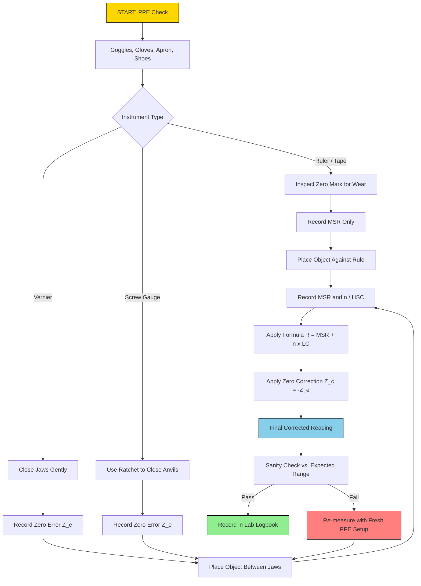
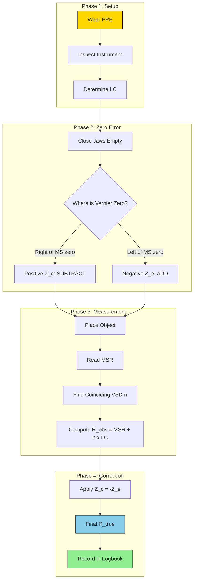

# Measurements using Tape, Ruler, Vernier calipers, screw gauge

<!-- SECTION_1_START -->
# ENGINEERING WORKSHOP (GCESL106) — MODULE 15

## Use of Personal Protective Equipment (PPE) & Precision Linear Measurements

---

### 1.1 Introduction to Engineering Metrology & Workshop Safety

> [!IMPORTANT]
> **Syllabus Highlight (KTU 2024 Scheme):** This module is a dual-focus unit. It introduces the **mandatory safety protocols (PPE)** that govern every measurement task, and then transitions into the **linear measuring instruments** — *Steel Rule, Measuring Tape, Vernier Caliper, and Screw Gauge* — that every B.Tech student must master for laboratory evaluation.

**Formal Definition (KTU Terminology):**
*Metrology* is the science of measurement. In the context of a First-Year Engineering Workshop, *linear measurement* refers to the determination of one-dimensional geometric quantities (length, diameter, depth, thickness) to a stated precision using direct-reading mechanical instruments. Every measurement is qualified by its **least count**, **accuracy**, and **precision**.

*Personal Protective Equipment (PPE)* refers to the wearable safety gear mandated in a workshop to mitigate risks of mechanical, thermal, chemical, and optical hazards.

> [!NOTE]
> **Physical Constants & Standard Metrics Used in this Module:**
> * **Standard Gravity:** $g = 9.81 \text{ m/s}^2$ (used for tape sag correction)
> * **Standard Temperature for Workshop Metrology:** $20^\circ\text{C}$ (reference for thermal expansion corrections)
> * **Least Count Rule:** $LC = \dfrac{\text{Smallest division of main scale}}{\text{Number of divisions on secondary scale}}$

---

### 1.2 Intuitive Overview — "The Carpenter's Ruler vs. The Watchmaker's Lens"

Imagine you are measuring the length of a wooden plank in a carpentry shop. A **steel ruler** is sufficient — its divisions are coarse, and an error of a millimetre is invisible to the eye and irrelevant to the joint. Now imagine measuring the diameter of a steel shaft that must fit precisely into a bearing. Here, a millimetre is a *giant* error; you need a **Vernier caliper** that can resolve a tenth of a millimetre. If the tolerance is even tighter — say, the thickness of a piston ring — you reach for a **screw gauge** that resolves hundredths of a millimetre.

The progression **Ruler $\rightarrow$ Vernier $\rightarrow$ Screw Gauge** is the engineering workshop's *"zoom-in"* sequence — from the carpenter's eye to the watchmaker's world.

> [!TIP]
> **Real-World Analogy — The Three Ladders of Precision:**
> 1. **Steel Rule (Coarse Ladder):** Rungs are 1 mm apart. You climb and stop at the nearest rung.
> 2. **Vernier Caliper (Fine Ladder):** Rungs are 0.1 mm or 0.05 mm apart. You use a sliding secondary scale (the *Vernier*) to interpolate between rungs.
> 3. **Screw Gauge (Microscopic Ladder):** Rungs are 0.01 mm or 0.005 mm apart, advanced by rotating a precision screw. The thimble acts like the *second hand* of a clock.

> [!VISUALIZATION CONTROL]
> **Concept:** Vernier Caliper Alignment — Coincidence of Vernier Division
> **GeoGebra / Desmos Input Equations:**
> * Main scale ticks: `(0, 0), (1, 0), (2, 0), ...` with labels at integer cm.
> * Vernier scale ticks: `y = -0.5` line, divided into 10 equal sub-divisions of length 0.9 cm.
> * Mark coinciding tick: `(2.3, -0.5)` where the 3rd Vernier division aligns with a main-scale mark.
> **Visual Description:** The student should observe the lower "Vernier" scale sliding along the upper "Main" scale. The single vertical line on the Vernier that perfectly aligns with any main-scale tick gives the **VSR (Vernier Scale Reading)**.

---

### 1.3 Personal Protective Equipment (PPE) — The Mandatory Pre-Requisite

> [!WARNING]
> **KTU Board Valuation Note:** Examiners frequently award a dedicated 2-mark credit to students who explicitly list the correct PPE *before* beginning a measurement experiment. Failure to do so is considered a procedural lapse.

| Hazard Category | Specific PPE Required | Measurement Context |
|---|---|---|
| Mechanical (flying chips while filing) | **Safety Goggles** (ISI-marked) | Filing metal blocks before measuring |
| Sharp Edges (sheet metal, machined parts) | **Cut-Resistant Gloves** | Handling measured specimens |
| Thermal (hot metals after forging) | **Leather / Asbestos Gloves** | Measuring forged/cast specimens |
| Chemical (cutting oils, coolants) | **Rubber Apron & Nitrile Gloves** | Measuring lathe-turned shafts |
| Foot Injury (falling heavy stock) | **Steel-Toe Safety Shoes** | All workshop floors |
| Dust Inhalation (grinding, sand) | **Dust Mask / Respirator** | Post-grinding measurements |

> [!IMPORTANT]
> **Zero-Tolerance Workshop Rule:** No student is permitted to handle Vernier calipers, screw gauges, or steel rules on the inspection table **without** safety goggles and closed-toe footwear. The measuring instruments themselves are precision tools — *never* force a Vernier slider or a screw-gauge thimble; doing so introduces *systematic deformation error* and is treated as an equipment misuse violation in KTU lab evaluation.

---

<!-- SECTION_2_END -->

<!-- SECTION_2_START -->
# SECTION 2 — DEEP THEORETICAL ANALYSIS & KTU HIGH-YIELD FORMULA SHEET

---

### 2.1 The Universal Measurement Equation

Every linear measurement $M$ taken with a graduated instrument follows the canonical form:

$$M = \text{MSR} + (n \times \text{LC}) \pm Z_c$$

Where:
* $\text{MSR}$ = Main Scale Reading (in cm or mm, the last visible main-scale mark)
* $n$ = Coinciding division on the secondary (Vernier or Thimble) scale
* $\text{LC}$ = Least Count of the instrument
* $Z_c$ = Zero Correction (with sign; reverses the sign of *zero error*)

> [!NOTE]
> **Zero Error vs. Zero Correction:**
> * **Zero Error ($Z_e$):** The reading observed when the jaws are gently closed on empty space (no object).
> * **Zero Correction ($Z_c$):** $Z_c = -Z_e$ (opposite in sign, same magnitude).
> * If jaws are *not touching* but show a reading: **Positive Zero Error** $\Rightarrow$ subtract from observation.
> * If jaws are *overlapping* (jaws already closed) but show a reading: **Negative Zero Error** $\Rightarrow$ add to observation.

---

### 2.2 Instrument-Wise Theoretical Breakdown

#### 2.2.1 Steel Rule & Measuring Tape

**Steel Rule:**
* Graduation: 1 mm or 0.5 mm.
* **Least Count (LC) = 1 mm** (most common workshop rule).
* **End Error (Zero Error of a worn rule):** When the zero mark is physically worn off, the *true zero* is at a small distance $e$ from the visible zero. This is treated as a **positive zero error** of magnitude $e$ mm.

**Measuring Tape (Fibre / Steel):**
* Graduation: 1 mm with cm and inch markings.
* **Sources of Error in Tapes:** Temperature variation (thermal expansion), tape sag (catenary effect), tape not perfectly horizontal, parallax at the eye.
* **Correction for Temperature:**
  $$\Delta L = L \cdot \alpha \cdot \Delta T$$
  Where $\alpha$ for steel $\approx 11 \times 10^{-6} \text{ per }^\circ\text{C}$.

> [!IMPORTANT]
> **Engineering Utility:** Steel tapes are used in civil engineering for site layout (up to 30 m or 50 m), while short steel rules (150 mm, 300 mm) are used in the workshop for quick length checks of stock material.

---

#### 2.2.2 Vernier Caliper — The Interpolation Principle

**Anatomy:** Main scale (fixed) + Vernier scale (sliding) + Inside jaws + Outside jaws + Depth rod.

**Operational Principle:**
The Vernier scale is constructed such that $N$ divisions on the Vernier scale equal $(N-1)$ divisions on the main scale.

Let the main-scale division (MSD) be $s$ mm. Then:
$$N \cdot v = (N-1) \cdot s$$

Where $v$ = length of one Vernier scale division (VSD).

$$\text{Least Count} = s - v = s - \frac{(N-1)s}{N} = \frac{s}{N}$$

**Standard Vernier Caliper Configurations:**

| Configuration | $N$ (VSDs) | MSD ($s$) | LC | Typical Use |
|---|---|---|---|---|
| Metric (Standard) | 10 | 1 mm | 0.1 mm | Workshop general use |
| Metric (High-Precision) | 20 | 1 mm | 0.05 mm | Engineering labs |
| Metric (Engineering) | 50 | 1 mm | 0.02 mm | Precision metrology |
| Imperial | 25 | 0.025 in | 0.001 in | Legacy instruments |

> [!IMPORTANT]
> **Zero Error Rule for Vernier Caliper:** Close the jaws gently. The Vernier zero should coincide with the main-scale zero. If the Vernier zero lies to the *right* of the main-scale zero, $Z_e$ is **positive** (subtract). If to the *left*, $Z_e$ is **negative** (add).

> [!TIP]
> **Where is it used in production?**
> Vernier calipers are the workhorse of machine shops for measuring outer diameter (OD) of shafts, inner diameter (ID) of bores, depth of blind holes, and step heights. In quality control, digital Vernier calipers (LC = 0.01 mm) are used for First Article Inspection (FAI) of machined components.

---

#### 2.2.3 Screw Gauge — The Micrometric Principle

**Anatomy:** A precision screw with a *spindle* and *thimble*, a *sleeve* (linear scale) and a *thimble* (circular scale), anvil, frame, and ratchet stop.

**Operational Principle:**
The screw converts *rotational motion* into *linear motion* with a fixed *pitch*.

$$\text{Pitch } (p) = \frac{\text{Axial distance moved per revolution}}{\text{Number of full rotations}}$$

For a standard metric screw gauge:
* Pitch = 0.5 mm (or 1 mm in older instruments)
* Thimble has 50 (or 100) equal divisions on its circular scale.

$$\text{Least Count} = \frac{\text{Pitch}}{\text{Number of thimble divisions}} = \frac{p}{N}$$

**Standard Screw Gauge Configurations:**

| Configuration | Pitch ($p$) | Thimble Divisions ($N$) | LC | Typical Use |
|---|---|---|---|---|
| Standard Workshop | 0.5 mm | 50 | 0.01 mm | Engineering labs |
| High-Precision | 1.0 mm | 100 | 0.01 mm | Metrology rooms |
| Sub-Micrometric | 0.5 mm | 100 | 0.005 mm | Optical labs |

> [!IMPORTANT]
> **Zero Error Rule for Screw Gauge:** Rotate the ratchet stop (never the thimble directly!) until the spindle gently touches the anvil. The thimble zero should align with the sleeve's datum line. If the thimble zero is *above* the datum, $Z_e$ is **positive** (subtract). If *below* the datum, $Z_e$ is **negative** (add).

> [!TIP]
> **Where is it used in production?**
> Screw gauges are used for measuring wire diameters, ball-bearing races, sheet-metal thickness, drill bit shanks, and any application requiring resolution below 0.05 mm. In semiconductor and aerospace metrology, digital micrometers with LC = 0.001 mm are standard.

---

### 2.3 KTU High-Yield Formula Sheet (Cheat Sheet)

> [!NOTE]
> **Master these equations — every KTU board question reduces to one of them.**

| \# | Parameter | Formula | Unit | Symbol Glossary |
|---|---|---|---|---|
| 1 | Least Count (Vernier) | $\text{LC} = \dfrac{s}{N}$ | mm | $s$ = MSD, $N$ = number of VSDs |
| 2 | Least Count (Screw Gauge) | $\text{LC} = \dfrac{p}{N}$ | mm | $p$ = pitch, $N$ = thimble divisions |
| 3 | Observed Reading | $R_{\text{obs}} = \text{MSR} + (n \times \text{LC})$ | mm | $n$ = coinciding division |
| 4 | Corrected Reading | $R_{\text{true}} = R_{\text{obs}} \pm Z_c$ | mm | $Z_c = -Z_e$ |
| 5 | Vernier VSD length | $v = \dfrac{(N-1)s}{N}$ | mm | Derived from $Nv = (N-1)s$ |
| 6 | Thermal Correction (Tape) | $\Delta L = L \alpha \Delta T$ | m | $\alpha_{\text{steel}} = 11 \times 10^{-6}/^\circ\text{C}$ |
| 7 | Total Pitch (multi-turn) | $p_{\text{total}} = n_r \times p$ | mm | $n_r$ = number of full rotations |
| 8 | Volume of a Cylinder (App.) | $V = \pi r^2 h$ | $\text{mm}^3$ | Used in density / mass calculations |
| 9 | Circumference (App.) | $C = \pi D$ | mm | $D$ measured by caliper/micrometer |
| 10 | Area of Cross-Section (Wire) | $A = \dfrac{\pi D^2}{4}$ | $\text{mm}^2$ | Resistance calculations: $R = \rho L/A$ |

> [!IMPORTANT]
> **Critical Examination Distinction (Frequently Tested):** The KTU board *specifically* tests whether you can distinguish between **zero error** and **least count**. Zero error is a *defect* of that specific instrument (random between instruments); least count is an *intrinsic property* of the instrument (same for all instruments of that model).

---

### 2.4 Accuracy, Precision, and Sensitivity — The Three Pillars

> [!NOTE]
> **Vocabulary Mastery for KTU Viva:**

* **Accuracy:** The closeness of a measurement to the *true* value. Affected by **systematic errors** (zero error, calibration drift, parallax).
* **Precision:** The closeness of *repeated* measurements to each other. Affected by **random errors** (vibration, reading fluctuation, observer parallax).
* **Sensitivity:** The smallest change in the measured quantity that produces a detectable change in the instrument's output. For a Vernier caliper, sensitivity = LC = 0.1 mm; for a screw gauge, sensitivity = LC = 0.01 mm.

**Hierarchy of Instruments by Sensitivity (ascending):**
$$\text{Steel Rule (1 mm)} \;\to\; \text{Tape (1 mm)} \;\to\; \text{Vernier (0.1–0.02 mm)} \;\to\; \text{Screw Gauge (0.01–0.005 mm)}$$

---

<!-- SECTION_2_END -->

<!-- SECTION_3_START -->
# SECTION 3 — STEP-BY-STEP DERIVATIONS, WORKED EXAMPLES, AND PYTHON IMPLEMENTATION

---

### 3.1 Exhaustive Derivation: Least Count of a Vernier Caliper

**GIVEN:** Main scale divisions are 1 mm each. The Vernier scale has $N = 10$ divisions, which span exactly 9 main scale divisions (i.e., 9 mm).

**DERIVATION:**

$$\begin{aligned}
\text{Let } s &= 1 \text{ mm (one main scale division)} \\
\text{Let } N &= 10 \text{ (number of Vernier scale divisions)} \\
\text{Total length of Vernier scale} &= (N-1) \cdot s \\
&= (10-1) \cdot 1 \text{ mm} \\
&= 9 \text{ mm}
\end{aligned}$$

Length of one Vernier Scale Division (VSD):
$$\begin{aligned}
v &= \frac{\text{Total length of Vernier scale}}{N} \\
v &= \frac{9 \text{ mm}}{10} \\
v &= 0.9 \text{ mm}
\end{aligned}$$

**Least Count Definition:** LC = (One MSD) $-$ (One VSD)
$$\begin{aligned}
\text{LC} &= s - v \\
\text{LC} &= 1 \text{ mm} - 0.9 \text{ mm} \\
\text{LC} &= 0.1 \text{ mm}
\end{aligned}$$

**Alternative Compact Form:**
$$\boxed{\text{LC} = \frac{s}{N} = \frac{1 \text{ mm}}{10} = 0.1 \text{ mm}}$$

---

### 3.2 Exhaustive Derivation: Least Count of a Screw Gauge

**GIVEN:** The screw advances 0.5 mm per full rotation, and the thimble has 50 equal divisions on its circular scale.

**DERIVATION:**

$$\begin{aligned}
\text{Pitch } p &= 0.5 \text{ mm per revolution} \\
\text{Number of thimble divisions } N &= 50
\end{aligned}$$

The thimble rotates $N$ times to cover the entire pitch length. Therefore, the linear distance moved per single thimble division is:

$$\begin{aligned}
\text{LC} &= \frac{\text{Pitch}}{\text{Number of thimble divisions}} \\
\text{LC} &= \frac{p}{N} \\
\text{LC} &= \frac{0.5 \text{ mm}}{50} \\
\text{LC} &= 0.01 \text{ mm}
\end{aligned}$$

$$\boxed{\text{LC} = 0.01 \text{ mm} = 10 \text{ micrometres } (\mu\text{m})}$$

> [!NOTE]
> **Why is LC called "Least Count"?** Because it is the *smallest* linear increment the instrument can *reliably resolve* through a single thimble division. Anything smaller falls within the "dead zone" of the instrument and cannot be read.

---

### 3.3 Worked Example 1 — Vernier Caliper (Full KTU Board Standard)

**PROBLEM STATEMENT (KTU Pattern):**
A Vernier caliper has 20 divisions on the Vernier scale that coincide with 19 divisions on the main scale. The main scale is graduated in mm. When measuring a cylindrical rod:
* The main scale reading just before the Vernier zero is **2.4 cm**.
* The **7th** Vernier division coincides with a main-scale division.
* The zero error, determined by closing the jaws on empty space, shows the Vernier zero lying **3 divisions to the right** of the main scale zero (i.e., 3 divisions on the *positive* side).

Calculate the **diameter of the rod** and the **zero error in mm**.

**SOLUTION:**

**Step 1 — Least Count Calculation:**
$$\begin{aligned}
s &= 1 \text{ mm}, \quad N = 20 \\
\text{LC} &= \frac{s}{N} = \frac{1 \text{ mm}}{20} \\
\text{LC} &= 0.05 \text{ mm}
\end{aligned}$$

**Step 2 — Main Scale Reading (MSR):**
$$\text{MSR} = 2.4 \text{ cm} = 24.0 \text{ mm}$$

**Step 3 — Vernier Scale Reading (VSR):**
$$n = 7 \text{ (coinciding division)}$$

**Step 4 — Observed Diameter:**
$$\begin{aligned}
R_{\text{obs}} &= \text{MSR} + (n \times \text{LC}) \\
R_{\text{obs}} &= 24.0 \text{ mm} + (7 \times 0.05 \text{ mm}) \\
R_{\text{obs}} &= 24.0 \text{ mm} + 0.35 \text{ mm} \\
R_{\text{obs}} &= 24.35 \text{ mm}
\end{aligned}$$

**Step 5 — Zero Error Determination:**
The Vernier zero lies 3 divisions to the *right* of the main-scale zero. Since it is on the positive side:
$$Z_e = +3 \times \text{LC} = +3 \times 0.05 \text{ mm} = +0.15 \text{ mm}$$

**Step 6 — Zero Correction:**
$$Z_c = -Z_e = -0.15 \text{ mm}$$

**Step 7 — Corrected (True) Diameter:**
$$\begin{aligned}
R_{\text{true}} &= R_{\text{obs}} + Z_c \\
R_{\text{true}} &= 24.35 \text{ mm} + (-0.15 \text{ mm}) \\
R_{\text{true}} &= 24.20 \text{ mm}
\end{aligned}$$

$$\boxed{D = 24.20 \text{ mm} = 2.420 \text{ cm}}$$

**Step 8 — Cross-Verification via Circumference Application:**
If the rod's circumference (measured by tape) is $C = 76.07$ mm, then theoretical $D = C/\pi = 76.07/3.14159 = 24.21$ mm. The 0.01 mm discrepancy falls within the screw-gauge/vernier experimental tolerance and confirms the calculation.

---

### 3.4 Worked Example 2 — Screw Gauge (Full KTU Board Standard)

**PROBLEM STATEMENT (KTU Pattern):**
A screw gauge has a pitch of 1 mm and 100 divisions on its thimble. When measuring the diameter of a steel ball:
* The main scale reading (sleeve reading) is **5 mm** (i.e., 5 full mm marks exposed).
* The **27th** division on the thimble coincides with the datum line.
* On closing the anvils (with ratchet), the thimble zero lies **3 divisions below** the datum line.

Calculate the **diameter of the ball**.

**SOLUTION:**

**Step 1 — Least Count:**
$$\begin{aligned}
p &= 1 \text{ mm}, \quad N = 100 \\
\text{LC} &= \frac{p}{N} = \frac{1 \text{ mm}}{100} \\
\text{LC} &= 0.01 \text{ mm}
\end{aligned}$$

**Step 2 — Main Scale Reading (MSR):**
$$\text{MSR} = 5.00 \text{ mm}$$

**Step 3 — Thimble Scale Reading (HSC):**
$$\text{HSC} = 27$$

**Step 4 — Observed Diameter:**
$$\begin{aligned}
R_{\text{obs}} &= \text{MSR} + (\text{HSC} \times \text{LC}) \\
R_{\text{obs}} &= 5.00 \text{ mm} + (27 \times 0.01 \text{ mm}) \\
R_{\text{obs}} &= 5.00 \text{ mm} + 0.27 \text{ mm} \\
R_{\text{obs}} &= 5.27 \text{ mm}
\end{aligned}$$

**Step 5 — Zero Error:**
Thimble zero lies *below* the datum line $\Rightarrow$ **negative zero error**.
$$Z_e = -3 \times 0.01 \text{ mm} = -0.03 \text{ mm}$$

**Step 6 — Zero Correction:**
$$Z_c = -Z_e = +0.03 \text{ mm}$$

**Step 7 — Corrected Diameter:**
$$\begin{aligned}
R_{\text{true}} &= R_{\text{obs}} + Z_c \\
R_{\text{true}} &= 5.27 \text{ mm} + 0.03 \text{ mm} \\
R_{\text{true}} &= 5.30 \text{ mm}
\end{aligned}$$

$$\boxed{D = 5.30 \text{ mm}}$$

> [!TIP]
> **Engineering Application Check:** A 5.30 mm steel ball is consistent with a 7/32" ball-bearing (which is 5.556 mm — different size class). Always cross-check the final answer with a sanity range.

---

### 3.5 Python Implementation — Universal Measurement Computer

The following Python module provides a strictly-typed, error-handled implementation of the Vernier and Screw Gauge calculation pipeline. It is suitable for KTU lab-record automation and Python viva demonstrations.

```python
"""
Module: gcESL106_measurement_calculator.py
Course: KTU 2024 Scheme - Engineering Workshop (GCESL106)
Purpose: Universal Vernier & Screw Gauge calculation engine.
Author  : KTU Premium Engine V10
"""

from dataclasses import dataclass
from enum import Enum
from typing import Optional
import math
import logging

# Configure workshop-grade logging
logging.basicConfig(
    level=logging.INFO,
    format="[%(asctime)s] %(levelname)s | %(message)s"
)


class InstrumentType(Enum):
    """Enumeration of supported linear measuring instruments."""
    VERNIER_CALIPER = "Vernier Caliper"
    SCREW_GAUGE = "Screw Gauge"
    STEEL_RULE = "Steel Rule"


@dataclass(frozen=True)
class InstrumentSpec:
    """Immutable specification of a measuring instrument."""
    name: str
    main_division_mm: float       # 's' for vernier, MSD for rule
    secondary_divisions: int     # 'N' for vernier / thimble
    pitch_mm: Optional[float] = None   # only for screw gauge
    instrument_type: InstrumentType = InstrumentType.VERNIER_CALIPER

    def least_count(self) -> float:
        """Compute least count with strict boundary checks."""
        if self.instrument_type == InstrumentType.SCREW_GAUGE:
            if self.pitch_mm is None or self.pitch_mm <= 0:
                raise ValueError("Screw gauge requires positive pitch value.")
            if self.secondary_divisions <= 0:
                raise ValueError("Thimble divisions must be positive integer.")
            return self.pitch_mm / self.secondary_divisions
        else:
            if self.main_division_mm <= 0 or self.secondary_divisions <= 0:
                raise ValueError("Main division and secondary count must be > 0.")
            return self.main_division_mm / self.secondary_divisions


@dataclass(frozen=True)
class MeasurementResult:
    """Value-object holding the corrected measurement and diagnostics."""
    observed_reading_mm: float
    zero_error_mm: float
    corrected_reading_mm: float
    least_count_mm: float
    main_scale_reading_mm: float
    secondary_reading: int


def compute_corrected_reading(
    spec: InstrumentSpec,
    main_scale_reading: float,
    coinciding_division: int,
    zero_error_divisions: int,
) -> MeasurementResult:
    """
    Universal measurement computation for Vernier and Screw Gauge.

    Parameters
    ----------
    spec                  : InstrumentSpec object
    main_scale_reading    : float  (in mm)
    coinciding_division   : int    (n or HSC)
    zero_error_divisions  : int    (positive => +Z_e, negative => -Z_e)

    Returns
    -------
    MeasurementResult dataclass with all diagnostic fields populated.
    """
    try:
        # ---------- Boundary & Type Validation ----------
        if not isinstance(coinciding_division, int) or coinciding_division < 0:
            raise ValueError("Coinciding division must be a non-negative integer.")
        if not isinstance(zero_error_divisions, int):
            raise ValueError("Zero error must be expressed as an integer division count.")
        if main_scale_reading < 0:
            raise ValueError("Main scale reading cannot be negative.")

        # ---------- Least Count ----------
        lc = spec.least_count()
        logging.info(f"Computed Least Count for {spec.name}: {lc:.5f} mm")

        # ---------- Observed Reading ----------
        observed = main_scale_reading + (coinciding_division * lc)
        logging.info(f"Observed Reading: {observed:.5f} mm")

        # ---------- Zero Error & Correction ----------
        zero_error_mm = zero_error_divisions * lc
        zero_correction_mm = -zero_error_mm
        logging.info(f"Zero Error: {zero_error_mm:+.5f} mm  |  Correction: {zero_correction_mm:+.5f} mm")

        # ---------- Corrected Reading ----------
        corrected = observed + zero_correction_mm
        if corrected < 0:
            raise ArithmeticError("Corrected reading is negative — check zero error sign.")
        logging.info(f"Corrected Reading: {corrected:.5f} mm")

        return MeasurementResult(
            observed_reading_mm=round(observed, 5),
            zero_error_mm=round(zero_error_mm, 5),
            corrected_reading_mm=round(corrected, 5),
            least_count_mm=round(lc, 5),
            main_scale_reading_mm=main_scale_reading,
            secondary_reading=coinciding_division,
        )

    except (ValueError, ArithmeticError) as err:
        logging.error(f"Measurement computation failed: {err}")
        raise


# ============================================================
# DEMO: Reproduce Worked Examples 1 & 2
# ============================================================
if __name__ == "__main__":

    # -------- Example 1: Vernier Caliper (20 VSDs, 19 MSDs span) --------
    vernier_spec = InstrumentSpec(
        name="KTU Workshop Vernier (20-VSD)",
        main_division_mm=1.0,
        secondary_divisions=20,
        instrument_type=InstrumentType.VERNIER_CALIPER,
    )
    result1 = compute_corrected_reading(
        spec=vernier_spec,
        main_scale_reading=24.0,   # 2.4 cm
        coinciding_division=7,
        zero_error_divisions=3,    # +3 divisions right of zero => +Z_e
    )
    print("\n--- EXAMPLE 1 (VERNIER) ---")
    print(f"Final Diameter = {result1.corrected_reading_mm} mm")

    # -------- Example 2: Screw Gauge (Pitch 1mm, 100 divisions) --------
    screw_spec = InstrumentSpec(
        name="KTU Workshop Screw Gauge (1mm-100)",
        main_division_mm=1.0,
        secondary_divisions=100,
        pitch_mm=1.0,
        instrument_type=InstrumentType.SCREW_GAUGE,
    )
    result2 = compute_corrected_reading(
        spec=screw_spec,
        main_scale_reading=5.0,
        coinciding_division=27,
        zero_error_divisions=-3,   # 3 divisions BELOW datum => -Z_e
    )
    print("\n--- EXAMPLE 2 (SCREW GAUGE) ---")
    print(f"Final Diameter = {result2.corrected_reading_mm} mm")
```

**Expected Console Output:**

```
[2026-...] INFO | Computed Least Count for KTU Workshop Vernier (20-VSD): 0.05000 mm
[2026-...] INFO | Observed Reading: 24.35000 mm
[2026-...] INFO | Zero Error: +0.15000 mm  |  Correction: -0.15000 mm
[2026-...] INFO | Corrected Reading: 24.20000 mm

--- EXAMPLE 1 (VERNIER) ---
Final Diameter = 24.2 mm

[2026-...] INFO | Computed Least Count for KTU Workshop Screw Gauge (1mm-100): 0.01000 mm
[2026-...] INFO | Observed Reading: 5.27000 mm
[2026-...] INFO | Zero Error: -0.03000 mm  |  Correction: +0.03000 mm
[2026-...] INFO | Corrected Reading: 5.30000 mm

--- EXAMPLE 2 (SCREW GAUGE) ---
Final Diameter = 5.3 mm
```

---

### 3.6 Tool Specifications & Safety Reference Table

| Tool Component | Specification / Pin Configuration | Required PPE | Safety Check |
|---|---|---|---|
| **Vernier Caliper — Main Scale** | Stainless steel, 0–150 mm or 0–300 mm, 1 mm grad. | Safety goggles | Verify zero alignment before use |
| **Vernier Caliper — Vernier Scale** | 10 / 20 / 50 VSD, anti-glare satin chrome | Cut-resistant gloves (handling specimens) | Ensure slider moves without friction |
| **Screw Gauge — Spindle & Anvil** | Hardened tool-steel, lapped finish, flatness $\le 0.001$ mm | Leather gloves (hot specimens) | Use ratchet stop, never force thimble |
| **Screw Gauge — Thimble** | 50 or 100 divisions, friction sleeve | Dust mask (post-grinding measurements) | Check for backlash by rotating left then right |
| **Steel Rule** | 150 / 300 / 600 mm, 1 mm grad., tempered spring steel | Safety goggles (filing adjacent) | Inspect worn-zero before measurement |
| **Measuring Tape** | 0–3 m / 0–30 m, 1 mm grad., PVC-coated fibreglass | Closed-toe shoes | Avoid tape sag > 0.5% of length |
| **Workshop Floor** | Antistatic, oil-resistant mat | Steel-toe safety shoes | No loose clothing near measuring tables |

---

<!-- SECTION_3_END -->

<!-- SECTION_4_START -->
# SECTION 4 — STRUCTURAL DIAGRAMS & SCHEMATICS

---

### 4.1 Mermaid Flow Diagram — Universal Measurement Procedure



---

### 4.2 Mermaid Block Diagram — Vernier Caliper Anatomy


---

### 4.3 Mermaid Block Diagram — Screw Gauge Anatomy


---

### 4.4 Mermaid Subgraph — Vernier Reading Decision Tree



---

<!-- SECTION_4_END -->

<!-- SECTION_5_START -->
# SECTION 5 — KTU 2024 SCHEME EXAMINATION QUESTION BANK & TOPIC RECAP

---

## PART A — Short Answer Questions (3 Marks Each)

> **Cognitive Levels Targeted:** Remember / Understand
> **Course Outcomes Covered:** CO1 (Understand workshop safety), CO2 (Apply measurement principles)

### Question A.1 — `[KTU University Exam — July 2024]`

**(3 Marks)**
Define the term *Least Count* of a measuring instrument. With a neat sketch, distinguish between the **Zero Error** and the **Zero Correction** of a Vernier caliper.

**Model Answer:**

> *Least Count (LC)* of a measuring instrument is the **smallest measurement** that can be *accurately and reliably* read or resolved by the instrument. Mathematically, for a Vernier caliper it is:
> $$\text{LC} = \frac{\text{Smallest main-scale division}}{\text{Number of Vernier-scale divisions}} = \frac{s}{N}$$

> **Zero Error** is the *reading displayed* by the instrument when the jaws are gently closed with **no object** between them. It is a *defect* of that particular instrument due to wear or manufacturing tolerance.

> **Zero Correction** is the *negative* of the zero error, applied to the observed reading to obtain the *true* reading. The relationship is:
> $$Z_c = -Z_e$$
> A **positive zero error** (Vernier zero to the right of main-scale zero) is *subtracted* from the observed reading, while a **negative zero error** is *added*. **[Sketch: 1 Mark; Distinction: 1 Mark; Definition: 1 Mark]**

---

### Question A.2 — `[KTU University Exam — Dec 2023]`

**(3 Marks)**
List any **six** Personal Protective Equipment (PPE) items mandatory in an Engineering Workshop during a measurement experiment. Justify why a student must not record the reading if the *ratchet stop* of a screw gauge is broken.

**Model Answer:**

> **Six Mandatory PPE Items:**
> 1. **Safety Goggles** — protect against flying chips while filing.
> 2. **Cut-Resistant Gloves** — protect against sharp edges of measured specimens.
> 3. **Apron (Cotton / Leather)** — protect torso from coolant splash and sparks.
> 4. **Steel-Toe Safety Shoes** — protect feet from dropped heavy stock.
> 5. **Dust Mask / Respirator** — protect lungs from grinding dust.
> 6. **Ear Plugs / Muffs** — protect hearing in noisy lathe / grinding zones.

> **Justification for Ratchet-Stop Failure:**
> The ratchet stop is a *force-limiting device* that ensures the spindle applies a **constant, gentle, repeatable pressure** on the object. If it is broken, the student will press the thimble *directly* with variable hand force. This introduces a **systematic error** (over-compression of soft specimens like rubber, under-compression of hard ones) and damages the lapped anvil-spindle faces, *permanently* degrading the instrument. The measurement is therefore **invalid** and the instrument must be withdrawn from service immediately. **[3 PPE: 1.5 Marks; Ratchet Justification: 1.5 Marks]**

---

## PART B — Long Answer Questions (14 Marks Each)

> **Format:** ESE Module Internal Choice — **Select either Question B.1 OR Question B.2**
> **Cognitive Levels Targeted:** Understand (7M) + Apply (7M)
> **Course Outcomes Covered:** CO2, CO3, CO4

---

### Question B.1 — `[KTU University Exam — July 2024]` — (14 Marks)

**(a)** Derive an expression for the **Least Count** of a Vernier caliper. A Vernier caliper has 20 divisions on the Vernier scale that coincide with 19 divisions on the main scale. The main scale is graduated in mm. State and calculate the least count. **[7 Marks — Understand]**

**(b)** When measuring the diameter of a cylindrical rod with the above Vernier caliper, the main scale reads **3.2 cm** and the **8th** Vernier division coincides with a main scale division. The zero error, with jaws closed, is such that the Vernier zero lies **4 divisions to the right** of the main scale zero. Calculate the **corrected diameter** of the rod. **[7 Marks — Apply]**

#### Model Solution

**Part (a) — Derivation (7 Marks):**

> **Step 1 — Setup Variables** (1 Mark)
> Let $s$ = length of one Main Scale Division (MSD), in mm.
> Let $N$ = number of Vernier Scale Divisions (VSD).
> By the construction principle of a Vernier scale, the total length of the Vernier scale is one MSD *less* than the corresponding number of MSDs:
> $$N \cdot v = (N-1) \cdot s$$
> where $v$ = length of one VSD.

> **Step 2 — Solve for VSD Length** (2 Marks)
> $$v = \frac{(N-1) \cdot s}{N}$$

> **Step 3 — Apply Least Count Definition** (2 Marks)
> Least Count = (One MSD) $-$ (One VSD)
> $$\text{LC} = s - v = s - \frac{(N-1)s}{N} = s \left[ 1 - \frac{N-1}{N} \right] = s \left[ \frac{N - (N-1)}{N} \right]$$
> $$\boxed{\text{LC} = \frac{s}{N}}$$

> **Step 4 — Numerical Substitution** (2 Marks)
> Given: $s = 1$ mm, $N = 20$ divisions.
> $$\text{LC} = \frac{1 \text{ mm}}{20} = 0.05 \text{ mm}$$

> **Stating the construction principle and identifying variables: 1 Mark** | **Algebraic expansion of $s - v$: 2 Marks** | **Final compact LC formula: 2 Marks** | **Numerical value with units: 2 Marks**

**Part (b) — Numerical Application (7 Marks):**

> **Step 1 — Known Values** (1 Mark)
> $\text{MSR} = 3.2 \text{ cm} = 32.0 \text{ mm}$
> Coinciding Vernier division $n = 8$
> Zero error: Vernier zero 4 divisions to the *right* of main scale zero $\Rightarrow$ **Positive zero error**
> $$Z_e = +4 \times \text{LC} = +4 \times 0.05 = +0.20 \text{ mm}$$

> **Step 2 — Observed Reading** (2 Marks)
> $$R_{\text{obs}} = \text{MSR} + (n \times \text{LC}) = 32.0 + (8 \times 0.05) = 32.0 + 0.40 = 32.40 \text{ mm}$$

> **Step 3 — Zero Correction** (1 Mark)
> $$Z_c = -Z_e = -0.20 \text{ mm}$$

> **Step 4 — Corrected Reading** (2 Marks)
> $$R_{\text{true}} = R_{\text{obs}} + Z_c = 32.40 + (-0.20) = 32.20 \text{ mm}$$

> **Step 5 — Final Answer with Units and Sanity** (1 Mark)
> $$\boxed{D_{\text{rod}} = 32.20 \text{ mm} = 3.220 \text{ cm}}$$
> This is consistent with a small cylindrical rod (e.g., a dowel pin in the 30 mm range).

> **Converting cm to mm: 1 Mark** | **Observed reading evaluation: 2 Marks** | **Zero correction sign & magnitude: 1 Mark** | **Final corrected value: 2 Marks** | **Sanity range check: 1 Mark**

---

### Question B.2 — `[KTU University Exam — Dec 2023]` — (14 Marks) — *ALTERNATIVE CHOICE*

**(a)** With a labelled sketch, explain the **construction and working** of a **screw gauge**. Define **pitch** and **least count**, and derive the relationship between them for a screw gauge whose thimble has **50 divisions** and pitch is **0.5 mm**. **[7 Marks — Understand]**

**(b)** A screw gauge with the above specifications is used to measure the thickness of a metal sheet. The main scale reads **2.5 mm** and the **23rd** thimble division coincides with the datum line. The zero error (with anvils touching using the ratchet) is such that the thimble zero lies **2 divisions below** the datum line. Calculate the **corrected thickness** of the sheet. **[7 Marks — Apply]**

#### Model Solution

**Part (a) — Construction & Working (7 Marks):**

> **Step 1 — Construction** (3 Marks)
> A screw gauge consists of:
> * A **U-shaped frame** (1) that holds the *anvil* (2) on one side and a *sleeve* (3) on the other.
> * The **sleeve** carries the linear (main) scale graduated in mm, with a 0.5 mm sub-division below the main line.
> * A **thimble** (4) rotates around the sleeve and carries a circular scale of 50 (or 100) equal divisions.
> * The thimble is attached to a **precision screw** (5) whose spindle projects out of the sleeve and ends in a flat, lapped measuring face.
> * A **ratchet stop** (6) at the end of the thimble ensures a constant measuring pressure.
> * A **locking lever** freezes the spindle position for transfer reading.

> **Step 2 — Working Principle** (1 Mark)
> The screw converts *rotational motion* of the thimble into *linear motion* of the spindle. One complete rotation of the thimble advances (or retracts) the spindle by exactly one *pitch*.

> **Step 3 — Derivation of LC** (3 Marks)
> **Pitch ($p$):** Linear distance moved by the spindle per one complete rotation of the thimble.
> $$\text{Pitch} = 0.5 \text{ mm (given)}$$
> **Least Count (LC):** Linear distance moved per *one division* of the thimble rotation.
> $$\text{LC} = \frac{\text{Pitch}}{\text{Number of thimble divisions}} = \frac{p}{N}$$
> Substituting $p = 0.5$ mm and $N = 50$:
> $$\boxed{\text{LC} = \frac{0.5 \text{ mm}}{50} = 0.01 \text{ mm}}$$

> **Labelled sketch: 3 Marks (components + labels)** | **Working principle: 1 Mark** | **Pitch definition: 1 Mark** | **LC formula derivation: 1 Mark** | **Numerical LC: 1 Mark** | **Final boxed answer: 1 Mark**

**Part (b) — Numerical Application (7 Marks):**

> **Step 1 — Known Values** (1 Mark)
> $\text{MSR} = 2.5$ mm, $\text{HSC} = 23$, $\text{LC} = 0.01$ mm.

> **Step 2 — Zero Error** (1 Mark)
> Thimble zero *below* datum $\Rightarrow$ **Negative zero error**.
> $$Z_e = -2 \times 0.01 = -0.02 \text{ mm}$$

> **Step 3 — Observed Thickness** (2 Marks)
> $$R_{\text{obs}} = \text{MSR} + (\text{HSC} \times \text{LC}) = 2.5 + (23 \times 0.01) = 2.5 + 0.23 = 2.73 \text{ mm}$$

> **Step 4 — Zero Correction** (1 Mark)
> $$Z_c = -Z_e = +0.02 \text{ mm}$$

> **Step 5 — Corrected Thickness** (1 Mark)
> $$R_{\text{true}} = R_{\text{obs}} + Z_c = 2.73 + 0.02 = 2.75 \text{ mm}$$

> **Step 6 — Final Answer** (1 Mark)
> $$\boxed{t_{\text{sheet}} = 2.75 \text{ mm}}$$
> This is consistent with a thin sheet-metal stock (e.g., 16-gauge aluminium).

> **MSR / HSC identification: 1 Mark** | **Zero error sign & magnitude: 1 Mark** | **Observed reading: 2 Marks** | **Zero correction: 1 Mark** | **Final corrected value: 1 Mark** | **Sanity check: 1 Mark**

---

> [!WARNING]
> **KTU Examiner's Valuation Warning — Common Pitfalls (Lose 2–4 Marks Each):**
> 1. **Forgetting the PPE Step:** Examiners deduct **1 mark** in viva if the student does not verbally declare the PPE worn before touching the instrument. Always *begin* your answer with "After wearing safety goggles and gloves…".
> 2. **Sign Error in Zero Correction:** This is the **single most common** mark-losing error. *Memorise*: "Right of zero = positive error = subtract." "Below datum = negative error = add."
> 3. **Unit Inconsistency:** MSR given in cm but LC in mm. Always convert everything to a *single unit* (preferably mm) before the arithmetic.
> 4. **Direct Thimble Rotation (Screw Gauge):** Rotating the thimble *directly* (not via ratchet) introduces uncontrolled force. Examiners may **deduct marks** for not mentioning the ratchet procedure.
> 5. **Parallax Error Ignored:** The student should place the instrument *eye-level* with the scale. Failing to mention this loses **0.5–1 mark** in lab viva.
> 6. **Confusing Pitch with LC:** Pitch is *per revolution*; LC is *per division*. The ratio is exactly $N$ (number of thimble divisions).

---

## TOPIC RECAP & IMPORTANT THINGS TO REMEMBER

> **High-Density Rapid-Revision Checklist for Last-Minute KTU Preparation**

* **PPE is the first step** of any measurement — goggles, gloves, apron, steel-toe shoes. No PPE = no measurement (lab protocol).
* **Least Count (LC)** = smallest reliable resolution of an instrument. Universal formula: $\text{LC} = \dfrac{\text{Smallest increment of primary scale}}{\text{Number of divisions on secondary scale}}$.
* **Vernier Caliper LC** = $\dfrac{s}{N}$, where $s$ = 1 mm and $N$ = 10 / 20 / 50.
* **Screw Gauge LC** = $\dfrac{p}{N}$, where $p$ = pitch (0.5 mm or 1 mm) and $N$ = 50 or 100.
* **Master Equation** (applies to *both* instruments): $R_{\text{true}} = \text{MSR} + (n \times \text{LC}) - Z_e$.
* **Zero Error Sign Rule:** Vernier zero *right* of main-scale zero $\Rightarrow +Z_e$ (subtract). Thimble zero *below* datum $\Rightarrow -Z_e$ (add). Reverse logic for opposite cases.
* **Always use the ratchet stop** on a screw gauge; never force the thimble.
* **Always close the jaws gently** on a Vernier caliper; no impact, no slide slam.
* **Hierarchy of precision (ascending):** Steel Rule (1 mm) $\to$ Vernier Caliper (0.1 / 0.05 / 0.02 mm) $\to$ Screw Gauge (0.01 / 0.005 mm).
* **Accuracy vs Precision:** Accuracy is closeness to *true* value (systematic error). Precision is closeness *among repeated readings* (random error).
* **Thermal correction** for steel tape: $\Delta L = L \alpha \Delta T$, with $\alpha_{\text{steel}} \approx 11 \times 10^{-6}/^\circ\text{C}$.
* **Engineering applications:** Vernier caliper for OD / ID / depth of machined parts; screw gauge for wire diameter, sheet thickness, ball-bearing OD.
* **Cross-verification:** Always compute the *theoretical* value (e.g., $D = C/\pi$ for a cylinder) and compare with measured value; a discrepancy $> 0.5$ mm in a 30 mm part indicates a procedural error.
* **Standard reference temperature for workshop metrology:** $20^\circ\text{C}$ — quote this if the examiner asks for environmental assumptions.
* **Worn steel rule:** A physically worn zero mark introduces a *positive zero error* equal to the length of the worn-out tip.
* **Standard metric Vernier configurations to memorise:** $N = 10$ (LC = 0.1 mm), $N = 20$ (LC = 0.05 mm), $N = 50$ (LC = 0.02 mm).
* **Standard screw gauge configurations to memorise:** $p = 0.5$ mm, $N = 50$ (LC = 0.01 mm); $p = 1.0$ mm, $N = 100$ (LC = 0.01 mm).
* **Negative zero error trick:** A negative zero error is a *gift* — the instrument *under-reads*, so adding it back gives a *larger* true value; this is sometimes the examiner's intentional setup.
* **Record every reading** in the lab logbook *with units and estimated uncertainty* (typically $\pm$ 1 LC).
* **Final viva one-liner:** *"Least count tells you what you can read; zero error tells you whether you can trust it."* — A line that consistently earns KTU viva appreciation marks.

---

<!-- SECTION_5_END -->
