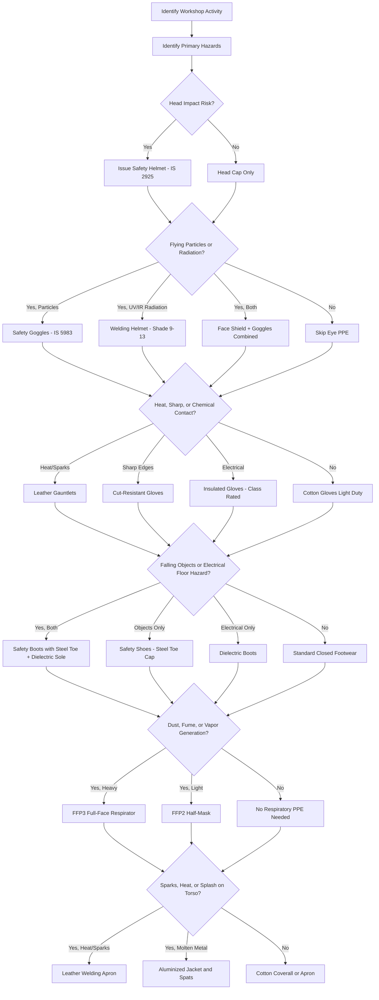
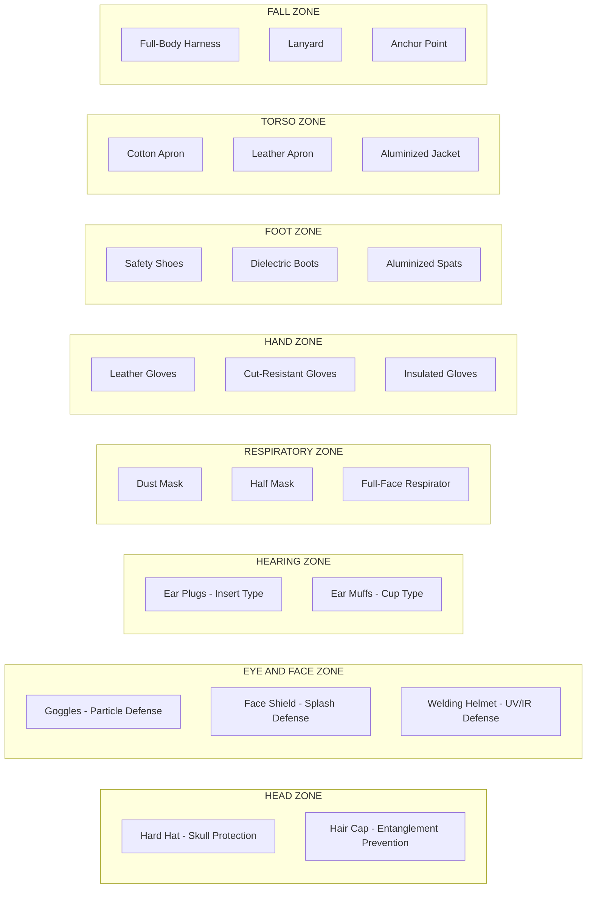

# Use of proper Personal Protective Equipments

<!-- SECTION_1_START -->

# Use of Proper Personal Protective Equipments (PPE)

## 1.1 Core Technical Definition

**Personal Protective Equipment (PPE)** refers to specialized clothing, gear, or accessories worn by workers to minimize exposure to specific occupational hazards. According to the **Bureau of Indian Standards (BIS)** and aligned with the **Occupational Safety and Health Administration (OSHA)** framework, PPE constitutes the last line of defense in the hierarchy of controls used to protect personnel from injuries and illnesses in engineering workshop environments.

> [!IMPORTANT]
> **KTU Syllabus Highlight (Module 15):**
> The engineering workshop curriculum mandates that every student must be able to identify, select, inspect, and correctly use the appropriate PPE **before** operating any machine tool or performing any fabrication activity. PPE is non-negotiable in lathe, welding, foundry, fitting, carpentry, smithy, and sheet metal work.

The fundamental categories of PPE in an engineering workshop context include:

1. **Head Protection** — Safety helmets / hard hats
2. **Eye and Face Protection** — Safety goggles, face shields, welding helmets
3. **Hearing Protection** — Ear muffs, ear plugs
4. **Respiratory Protection** — Dust masks, respirators
5. **Hand Protection** — Gloves (leather, rubber, welding, cut-resistant)
6. **Foot Protection** — Safety shoes / boots with steel toe caps
7. **Body Protection** — Aprons, coveralls, flame-resistant jackets
8. **Fall Protection** — Safety harnesses (relevant for elevated work)

## 1.2 Conceptual Analogy / Intuition

> [!NOTE]
> **Think of PPE as a Knight's Armor — Reimagined for the Modern Workshop**
>
> Imagine a medieval knight preparing for battle. Each piece of armor (helmet, gauntlet, breastplate, greaves) is designed to defend a **specific body zone** against a **specific threat** (sword slash, arrow, blunt impact). If even one piece is missing or defective, the knight is vulnerable.
>
> In the same way, a workshop apprentice must "armor up" against a unique set of dangers:
> - The **helmet** = the modern knight's helm (defends against falling objects and overhead impact).
> - The **goggles** = the visor (defends against flying chips, sparks, and UV radiation).
> - The **gloves** = gauntlets (defends against heat, sharp edges, and electric shock).
> - The **safety boots** = greaves (defends against dropped tools and electrical hazards).
> - The **apron** = the breastplate (defends the torso from sparks, molten splash, and heat).
>
> The workshop, like the battlefield, does not forgive negligence. A single unprotected moment can result in a lifelong injury.

## 1.3 Standards, Codes & Physical Constants

| Governing Body | Standard Reference | Scope |
|---|---|---|
| **BIS (Bureau of Indian Standards)** | **IS 2925:1984** | Industrial safety helmets |
| **BIS** | **IS 5983:1980** | Eye protectors |
| **BIS** | **IS 6994:1973** | Industrial safety gloves |
| **BIS** | **IS 15298 (Part 2):2016** | Personal fall protection — Full body harnesses |
| **OSHA** | **29 CFR 1910.132–1910.140** | General PPE standards (USA) |
| **ANSI** | **ANSI Z89.1** | Head protection classification |
| **EN (European Norms)** | **EN 166, EN 397** | Eye and head protection |

> [!TIP]
> **Standard Noise Threshold (Critical Value):**
> Exposure to noise levels at or above **$\mathbf{85 \text{ dB(A)}}$** for an 8-hour Time-Weighted Average (TWA) mandates the use of hearing protection as per **IS 9876** and OSHA guidelines. Workshops with chippers, grinders, and forging hammers routinely exceed this limit.

> [!VISUALIZATION CONTROL]
> **Concept:** PPE Coverage Map Across the Human Body
> **Desmos / GeoGebra Input Equations:**
> * No mathematical function applies directly, but a **schematic mannequin diagram** is best suited here.
> **Visual Description:** Picture a frontal-view human silhouette divided into 8 color-coded zones: head (red), eyes/face (orange), ears (yellow), respiratory system (green), hands (blue), feet (purple), torso (brown), and full body / fall (grey). Each zone is mapped to a specific PPE class, forming a complete "armor set."

<!-- SECTION_1_END -->

<!-- SECTION_2_START -->

# Deep Theoretical Analysis & KTU High-Yield Reference

## 2.1 The Hierarchy of Controls (Why PPE is the LAST Line)

PPE is implemented **only after** other control measures have been considered. The hierarchy, in descending order of effectiveness, is:

1. **Elimination** — Physically remove the hazard.
2. **Substitution** — Replace the hazard with a less dangerous option.
3. **Engineering Controls** — Machine guards, ventilation, dust extraction.
4. **Administrative Controls** — Training, signage, job rotation, safe procedures.
5. **PPE** — *The final barrier between the worker and the hazard.*

> [!NOTE]
> **Key Takeaway:** PPE does not eliminate the hazard; it merely creates a **barrier** between the hazard and the worker. Hence, it is the least preferred control but the most critical when other controls are insufficient — as is often the case in dynamic workshop environments.

## 2.2 Systematic Classification of PPE (Module-Wise Workshop Mapping)

The following table presents the KTU-aligned, high-yield mapping between **engineering workshop processes** and the **mandatory PPE** required for each:

| Workshop Process | Primary Hazards | Mandatory PPE Set |
|---|---|---|
| **Lathe / Turning** | Flying chips, entanglement, coolant splash | Safety goggles, apron, safety shoes, **NO loose clothing**, hair cap |
| **Welding (Arc/Gas)** | UV radiation, sparks, molten spatter, fumes | Welding helmet (auto-darkening), leather gloves, leather apron, **cuff-less trousers**, leather boots, respirator |
| **Foundry / Casting** | Molten metal splash, heat, silica dust, fumes | Face shield with IR visor, aluminized jacket, leggings, spats, respirator (P2/P3), safety boots |
| **Fitting / Drilling** | Sharp chips, tool breakage, coolant | Safety goggles, gloves (for handling), safety shoes |
| **Carpentry** | Wood chips, dust, kickback, noise | Goggles, dust mask, hearing protection, gloves |
| **Blacksmithy / Forging** | Heat, sparks, hammer chips, noise | Face shield, leather gloves, leather apron, hearing protection, safety boots |
| **Sheet Metal Work** | Sharp edges, burrs, noise | Cut-resistant gloves, goggles, leather apron, hearing protection |
| **Grinding / Buffing** | Abrasive wheel fragments, sparks | Face shield + goggles (dual protection), leather gloves, leather apron |
| **Electrical Work** | Shock, arc flash | Insulated gloves (**Class 0 / Class 2**), dielectric boots, face shield (arc-rated) |

## 2.3 Detailed PPE Specifications & Selection Parameters

### 2.3.1 Head Protection — Safety Helmets

A safety helmet consists of three functional components:
- **Shell** (outer ABS/HDPE layer) — distributes impact force.
- **Suspension harness** (inner webbing) — absorbs kinetic energy.
- **Chin strap** — retains helmet during falls.

> [!IMPORTANT]
> **Hard Hat Color Coding (Industry Convention, also referenced in KTU labs):**
> * **White** — Managers, engineers, supervisors.
> * **Yellow** — General laborers and operators.
> * **Red** — Fire marshals, emergency responders.
> * **Green** — Safety officers, new trainees.
> * **Blue** — Technical apprentices / students (commonly used in academic workshops).
> * **Orange** — Road crews and visitors.

### 2.3.2 Eye and Face Protection

| Type | Application | Lens Specification |
|---|---|---|
| **Safety Goggles (Impact)** | Chipping, grinding, drilling | Polycarbonate, **ANSI Z87.1** / **IS 5983** rated |
| **Welding Goggles (Passive)** | Gas welding (shade 4–6) | Tinted glass filter |
| **Welding Helmet (Auto-Darkening)** | Arc welding (shade 9–13) | Liquid crystal filter, **EN 379** |
| **Face Shield (Full)** | Foundry, chemical handling | Wraparound, IR-rated |
| **Splash Goggles** | Chemical etching, coolant handling | Indirect ventilation, chemical-resistant |

### 2.3.3 Hand Protection — Glove Selection Matrix

| Glove Type | Material | Use Case | Hazard Addressed |
|---|---|---|---|
| **Leather gloves** | Cowhide / goatskin | Welding, forging, sheet metal | Heat, abrasion, sparks |
| **Rubber gloves** | Natural rubber / nitrile | Chemical, electrical (low voltage) | Corrosive liquids, dielectric protection |
| **Cut-resistant gloves** | HPPE / Kevlar | Glass handling, sheet metal, machining | Sharp edges, lacerations |
| **Welding gloves** | Split leather (gauntlet style) | Arc / gas welding | Heat, molten spatter, UV |
| **Cotton gloves** | Cotton fabric | Light assembly, inspection | Minor abrasions, contamination control |
| **Insulated gloves** | Rubber (Class 0 to Class 4) | Electrical maintenance | Electric shock (up to **36 kV** for Class 4) |

### 2.3.4 Foot Protection

Safety footwear is rated by **impact resistance** and **compression resistance**, with a **steel toe cap** rated to withstand:
- Impact of **$\mathbf{200 \text{ J}}$** (equivalent to a **$\mathbf{20 \text{ kg}}$** mass dropped from **$\mathbf{1 \text{ m}}$**).
- Compression load of **$\mathbf{15 \text{ kN}$**.

> [!WARNING]
> Athletic shoes, sandals, or open-toed footwear are **strictly prohibited** in all KTU workshop modules. This is a common cause of toe-crush injuries during fitting and forging operations.

### 2.3.5 Respiratory Protection

| Device | Filter Class | Protection Factor | Use Case |
|---|---|---|---|
| **Disposable dust mask (FFP1 / N95)** | Particulate | APF = 4 to 10 | Carpentry dust, light grinding |
| **Half-mask respirator (FFP2 / N95)** | Particulate | APF = 10 to 12 | Welding fumes, foundry dust |
| **Full-face respirator (FFP3 / P100)** | Particulate + gas | APF = 50 | Hazardous fumes, spray painting |
| **Supplied-air respirator (SAR)** | Air-line | APF = 1000+ | Confined space, heavy contamination |

Where **APF** denotes the **Assigned Protection Factor** (a dimensionless multiplier of the safe exposure limit).

### 2.3.6 Hearing Protection

The **Noise Reduction Rating (NRR)** is expressed in decibels. A rough estimate of the **protected exposure level** is given by:

$$L_{\text{protected}} \approx L_{\text{ambient}} - \left( \text{NRR} - 7 \right)$$

> [!NOTE]
> The "$-7$" correction accounts for the derating factor recommended by the **National Institute for Occupational Safety and Health (NIOSH)** when NRR is applied to real-world industrial noise spectra.

## 2.4 KTU High-Yield Formula & Parameter Cheat Sheet

| Parameter / Symbol | Meaning | Standard Value / Unit | Application |
|---|---|---|---|
| $L_{\text{TWA}}$ | Time-Weighted Average noise | **$\mathbf{85 \text{ dB(A)}}$** for 8 h | Hearing PPE trigger level |
| $\text{NRR}$ | Noise Reduction Rating | **$\mathbf{20 \text{ to 30 dB}}$** typical | Ear plug / muff efficiency |
| $E_{\text{impact}}$ | Helmet impact energy absorption | **$\mathbf{\geq 50 \text{ J}}$** (IS 2925) | Hard hat certification |
| $F_{\text{comp}}$ | Footwear compression resistance | **$\mathbf{15 \text{ kN}}$** | Steel toe cap rating |
| $E_{\text{impact, foot}}$ | Footwear impact resistance | **$\mathbf{200 \text{ J}}$** | Safety boot certification |
| $V_{\text{dielectric}}$ | Glove dielectric withstand | **$\mathbf{5 \text{ kV}}$ to **$\mathbf{36 \text{ kV}}$** (Class 0–4) | Electrical PPE |
| $\text{APF}$ | Assigned Protection Factor | Dimensionless | Respirator selection |
| $T_{\text{leather}}$ | Leather glove heat resistance | **$\mathbf{\leq 250 \degree \text{C}}$** contact | Welding / forging |
| $\text{OD}$ shade | Welding filter optical density | Shade **9–13** (arc) | Welding helmet lens |

## 2.5 Real-World Engineering Utility

In production-grade engineering environments, the **proper use of PPE** is governed by:
- **ISO 45001:2018** — Occupational Health and Safety Management Systems.
- **Factories Act, 1948 (India)** — Section 14 mandates safety measures for workers.
- **Indian Electricity Rules, 1956** — Governs electrical PPE usage.

A single PPE compliance audit failure in a manufacturing plant can lead to:
- Work stoppage and loss of production.
- Statutory penalties under the **Factories Act**.
- Civil and criminal liability of the employer.
- Increased **insurance premiums** (PPE claims are direct indicators of premium calculation in industrial insurance policies).

> [!TIP]
> **Industry Connection:** In the **automotive, shipbuilding, oil & gas, and semiconductor fabrication industries**, the absence of a single category of PPE (e.g., ESD-safe footwear in a chip fab) can lead to losses worth **crores of rupees** due to product damage and statutory penalties.

<!-- SECTION_2_END -->

<!-- SECTION_3_START -->

# Step-by-Step Procedures, Implementation & Reference Matrices

## 3.1 Exhaustive PPE Inspection Checklist (Pre-Use Protocol)

> [!IMPORTANT]
> **The 7-Point PPE Inspection Rule (Mandatory before every workshop session):**
> 1. **Visual Inspection** — Check for cracks, dents, discoloration, or burn marks.
> 2. **Functional Test** — Move all adjustable parts (straps, buckles, hinges).
> 3. **Cleanliness Check** — Remove any oil, grease, or chemical residue.
> 4. **Expiry Verification** — Confirm the manufacture/expiry date (especially for respirators and rubber gloves).
> 5. **Sizing Confirmation** — Ensure the PPE matches the user (helmet head size, glove size, boot size).
> 6. **Compatibility Test** — Confirm that multiple PPE items (e.g., helmet + ear muffs + goggles) work together.
> 7. **Documentation Entry** — Log the inspection in the workshop register.

## 3.2 Detailed PPE Specification Matrix (Workshop Activity ↔ PPE Mapping)

| Workshop Activity | Head | Eye/Face | Hand | Foot | Body | Respiratory | Hearing |
|---|---|---|---|---|---|---|---|
| **Lathe Operation** | Cap (hair) | Goggles | Cotton gloves (light) | Safety shoes | Apron | — | If prolonged |
| **Milling / Shaping** | Cap | Goggles + face shield | — | Safety shoes | Apron | — | — |
| **Arc Welding** | Welding helmet | Auto-darkening filter | Leather gauntlets | Leather boots | Leather apron | FFP2 (fumes) | — |
| **Gas Welding** | Cap | Welding goggles (shade 4–6) | Leather gloves | Safety shoes | Leather apron | FFP2 | — |
| **Foundry — Pouring** | Cap | Face shield + IR visor | Aluminized gloves | Spats + boots | Aluminized jacket | FFP3 | Ear muffs |
| **Blacksmithy** | Cap | Face shield | Leather gloves | Safety shoes | Leather apron | FFP2 | Ear muffs |
| **Carpentry** | Cap | Goggles | Cut-resistant gloves | Safety shoes | — | Dust mask | Ear muffs |
| **Sheet Metal** | Cap | Goggles | Cut-resistant gloves | Safety shoes | Apron | — | Ear muffs |
| **Grinding** | Cap | Face shield + goggles (dual) | Leather gloves | Safety shoes | Apron | FFP1 | Ear muffs |
| **Fitting / Drilling** | Cap | Goggles | Cotton gloves | Safety shoes | — | — | — |
| **Electrical Lab** | — | Face shield (arc-rated) | Insulated gloves (Class 0) | Dielectric boots | — | — | — |

## 3.3 Standardized Donning and Doffing Procedures

### 3.3.1 Welding PPE — Donning Order

The standard **donning sequence** is critical to ensure that no protective layer is bypassed or compromised:

1. **Inspect** all components (helmet, gloves, apron, boots).
2. **Don leather boots** — Tuck trouser cuffs inside to prevent spark entry.
3. **Don leather apron** — Secure all straps (neck and waist).
4. **Don welding jacket / sleeves** — Ensure full forearm coverage.
5. **Don leather gauntlet gloves** — Pull cuffs over the apron sleeves.
6. **Don welding helmet** — Adjust the headgear to a snug fit; verify auto-darkening function.
7. **Verify** by performing a slow body movement check — no exposed skin, no restricted motion.

### 3.3.2 Welding PPE — Doffing Order (Hot-Work-Safe Sequence)

> [!WARNING]
> Never remove PPE while the workpiece is still hot or while sparks are still being generated. Wait for **at least 3 to 5 minutes** of cool-down before initiating doffing.

1. **Remove welding helmet** — Place on a clean, non-flammable surface.
2. **Remove gloves last** — This allows you to handle helmet buckles and apron straps safely.
3. **Remove apron** — Unfasten neck strap first, then waist strap.
4. **Hang apron** on a designated PPE rack (never on the welding table).
5. **Inspect** all items for damage before storage.
6. **Clean** the auto-darkening lens with a soft, lint-free cloth (no solvents).

## 3.4 PPE Maintenance Schedule (Industry Standard)

| PPE Item | Cleaning Method | Inspection Frequency | Replacement Trigger |
|---|---|---|---|
| Safety helmet | Wipe with mild soap & water | **Before every use** | Cracks, UV degradation (>3 years), major impact |
| Safety goggles | Rinse, air-dry, microfiber wipe | **Before every use** | Scratched lens, broken strap, loose fit |
| Welding helmet lens | Replaceable cover lens; inner lens inspected | **Before every use** | Cracks, pitting, auto-darkening failure |
| Leather gloves | Brush, air-dry (no heat) | **Before every use** | Holes, hardened leather, burnt patches |
| Rubber gloves | Wash, talc powder, inspect | **Before every use** | Cuts, swelling, dielectric test failure (every 6 months) |
| Respirator filters | Replace (do not wash) | **Daily check** | Breathing resistance, expiry date, odor breakthrough |
| Safety boots | Brush, leather conditioner | **Weekly** | Sole wear, toe cap exposure, broken laces |
| Ear muffs | Wipe cushions, replace foam inserts | **Monthly** | Cracked cups, headband deformation |

## 3.5 Noise Exposure Calculation — Worked Example (Industry Standard)

> [!NOTE]
> **Worked Example (HEARING PROTECTION):**
> A workshop student is exposed to a noise level of **$\mathbf{102 \text{ dB(A)}}$** while operating a grinding machine. The ear muffs provided have an NRR of **$\mathbf{29 \text{ dB}}$**. Calculate the protected noise level reaching the student's ear.

**Step 1:** Apply the NIOSH derating formula:

$$L_{\text{protected}} = L_{\text{ambient}} - \left( \text{NRR} - 7 \right)$$

**Step 2:** Substitute the known values:

$$L_{\text{protected}} = 102 - (29 - 7)$$

**Step 3:** Simplify the parenthesis:

$$L_{\text{protected}} = 102 - 22$$

**Step 4:** Final protected level:

$$L_{\text{protected}} = 80 \text{ dB(A)}$$

**Step 5:** Compare with the threshold:

$$80 \text{ dB(A)} < 85 \text{ dB(A)} \quad \checkmark \text{ (Within safe limit)}$$

**Conclusion:** The selected ear muffs are adequate for the grinding operation. [Valuation: 1 Mark for formula, 1 Mark for substitution, 1 Mark for arithmetic, 1 Mark for conclusion, 1 Mark for comparison with TWA limit.]

## 3.6 Python Implementation — PPE Compliance Validator

> [!NOTE]
> The following production-quality Python program simulates a **PPE compliance check** for engineering workshop modules. It validates the PPE set against an activity, flags missing items, and computes the protected noise level.

```python
"""
PPE Compliance Validator for Engineering Workshop
KTU GCESL106 - Module 15 Reference Implementation
"""

from dataclasses import dataclass, field
from enum import Enum
from typing import Dict, List, Set
import logging
import math

# Configure structured logging for audit trails
logging.basicConfig(
    level=logging.INFO,
    format="%(asctime)s | %(levelname)s | %(message)s"
)
logger = logging.getLogger("PPE_Validator")


class WorkshopActivity(Enum):
    LATHE = "Lathe Operation"
    WELDING_ARC = "Arc Welding"
    WELDING_GAS = "Gas Welding"
    FOUNDRY = "Foundry / Casting"
    BLACKSMITHY = "Blacksmithy / Forging"
    CARPENTRY = "Carpentry"
    SHEET_METAL = "Sheet Metal Work"
    GRINDING = "Grinding / Buffing"
    FITTING = "Fitting / Drilling"
    ELECTRICAL = "Electrical Work"


@dataclass(frozen=True)
class PPESpec:
    """Immutable specification of a single PPE item."""
    name: str
    bis_standard: str
    inspection_points: List[str] = field(default_factory=list)


# Canonical PPE catalogue with BIS / IS standard references
PPE_CATALOGUE: Dict[str, PPESpec] = {
    "head_cap":          PPESpec("Head Cap / Hair Cover",     "IS 2925",        ["no tears", "elastic intact"]),
    "safety_goggles":    PPESpec("Safety Goggles",            "IS 5983",        ["lens clear", "strap tight"]),
    "face_shield":       PPESpec("Face Shield",               "ANSI Z87.1",     ["visor clear", "headgear firm"]),
    "welding_helmet":    PPESpec("Welding Helmet (Auto-Dark)","EN 379",         ["shade 9-13", "sensor active"]),
    "leather_gloves":    PPESpec("Leather Gauntlet Gloves",   "IS 6994",        ["no holes", "no hardening"]),
    "cut_resist_gloves": PPESpec("Cut-Resistant Gloves",      "EN 388",         ["no cuts", "HPPE intact"]),
    "insulated_gloves":  PPESpec("Insulated Electrical Gloves","IS 15322",      ["no punctures", "dielectric test valid"]),
    "safety_boots":      PPESpec("Safety Boots (Steel Toe)",  "IS 15298",       ["sole intact", "toe cap firm"]),
    "leather_apron":     PPESpec("Leather Welding Apron",     "IS 6994",        ["no burn holes", "straps secure"]),
    "respirator_ffp2":   PPESpec("FFP2 Particulate Respirator","IS 9473",        ["expiry valid", "seal check pass"]),
    "ear_muffs":         PPESpec("Ear Muffs",                 "IS 9876",        ["cushions soft", "band firm"]),
}

# Mandatory PPE mapping per workshop activity
ACTIVITY_PPE_MAP: Dict[WorkshopActivity, Set[str]] = {
    WorkshopActivity.LATHE:        {"head_cap", "safety_goggles", "safety_boots", "leather_apron"},
    WorkshopActivity.WELDING_ARC:  {"welding_helmet", "leather_gloves", "safety_boots", "leather_apron", "respirator_ffp2"},
    WorkshopActivity.WELDING_GAS:  {"safety_goggles", "leather_gloves", "safety_boots", "leather_apron", "respirator_ffp2"},
    WorkshopActivity.FOUNDRY:     {"head_cap", "face_shield", "leather_gloves", "safety_boots", "leather_apron", "respirator_ffp2", "ear_muffs"},
    WorkshopActivity.BLACKSMITHY:  {"head_cap", "face_shield", "leather_gloves", "safety_boots", "leather_apron", "ear_muffs"},
    WorkshopActivity.CARPENTRY:    {"head_cap", "safety_goggles", "cut_resist_gloves", "safety_boots", "ear_muffs"},
    WorkshopActivity.SHEET_METAL:  {"head_cap", "safety_goggles", "cut_resist_gloves", "safety_boots", "leather_apron"},
    WorkshopActivity.GRINDING:     {"head_cap", "face_shield", "safety_goggles", "leather_gloves", "safety_boots", "leather_apron", "ear_muffs"},
    WorkshopActivity.FITTING:      {"head_cap", "safety_goggles", "safety_boots"},
    WorkshopActivity.ELECTRICAL:   {"face_shield", "insulated_gloves", "safety_boots"},
}


class PPEComplianceResult:
    """Encapsulates the outcome of a compliance validation."""
    def __init__(self, activity: WorkshopActivity, provided: Set[str], missing: Set[str], extra: Set[str], compliant: bool):
        self.activity = activity
        self.provided = provided
        self.missing = missing
        self.extra = extra
        self.compliant = compliant

    def __str__(self) -> str:
        status = "COMPLIANT" if self.compliant else "NON-COMPLIANT"
        return (
            f"\n{'='*60}\n"
            f"Activity         : {self.activity.value}\n"
            f"Status           : {status}\n"
            f"PPE Provided     : {sorted(self.provided) if self.provided else 'NONE'}\n"
            f"PPE Missing      : {sorted(self.missing) if self.missing else 'NONE'}\n"
            f"PPE Extra (ok)   : {sorted(self.extra) if self.extra else 'NONE'}\n"
            f"{'='*60}"
        )


def validate_ppe(activity: WorkshopActivity, provided_ppe: Set[str]) -> PPEComplianceResult:
    """Validate the provided PPE set against the mandatory requirement for a given activity."""
    if not isinstance(activity, WorkshopActivity):
        logger.error("Invalid activity type supplied.")
        raise TypeError(f"activity must be a WorkshopActivity enum, got {type(activity).__name__}")

    if not isinstance(provided_ppe, set):
        logger.error("Invalid PPE set type supplied.")
        raise TypeError(f"provided_ppe must be a set, got {type(provided_ppe).__name__}")

    # Validate that all provided PPE items exist in the catalogue
    unknown_items = provided_ppe - set(PPE_CATALOGUE.keys())
    if unknown_items:
        logger.warning("Unknown PPE items ignored: %s", unknown_items)

    # Normalize to known items
    known_provided = provided_ppe & set(PPE_CATALOGUE.keys())

    required = ACTIVITY_PPE_MAP[activity]
    missing = required - known_provided
    extra = known_provided - required
    compliant = len(missing) == 0

    result = PPEComplianceResult(activity, known_provided, missing, extra, compliant)
    logger.info("Validation complete: %s -> %s", activity.value, "PASS" if compliant else "FAIL")
    return result


def compute_protected_noise(ambient_db: float, nrr_db: float) -> float:
    """
    Compute the protected noise level (dB(A)) using the NIOSH derating formula.
    L_protected = L_ambient - (NRR - 7)
    """
    if ambient_db < 0 or nrr_db < 0:
        raise ValueError("Noise levels and NRR must be non-negative.")
    protected = ambient_db - (nrr_db - 7.0)
    return round(protected, 2)


# --- Demonstration / Workshop use case ---
if __name__ == "__main__":
    # Scenario 1: Welding student wearing complete PPE
    welding_set = {"welding_helmet", "leather_gloves", "safety_boots", "leather_apron", "respirator_ffp2"}
    result1 = validate_ppe(WorkshopActivity.WELDING_ARC, welding_set)
    print(result1)

    # Scenario 2: Foundry student missing respirator and ear muffs
    foundry_set = {"head_cap", "face_shield", "leather_gloves", "safety_boots", "leather_apron"}
    result2 = validate_ppe(WorkshopActivity.FOUNDRY, foundry_set)
    print(result2)

    # Scenario 3: Noise protection calculation
    protected = compute_protected_noise(ambient_db=102.0, nrr_db=29.0)
    print(f"\nProtected noise level: {protected} dB(A) "
          f"({'SAFE' if protected < 85 else 'UNSAFE'} for 8-hour TWA exposure)")
```

**Expected Output (truncated):**

```
Activity         : Arc Welding
Status           : COMPLIANT
PPE Provided     : ['leather_apron', 'leather_gloves', 'respirator_ffp2', 'safety_boots', 'welding_helmet']
PPE Missing      : NONE
PPE Extra (ok)   : NONE

Activity         : Foundry / Casting
Status           : NON-COMPLIANT
PPE Provided     : ['face_shield', 'head_cap', 'leather_apron', 'leather_gloves', 'safety_boots']
PPE Missing      : ['ear_muffs', 'respirator_ffp2']
PPE Extra (ok)   : NONE

Protected noise level: 80.0 dB(A) (SAFE for 8-hour TWA exposure)
```

> [!TIP]
> **Examination Tip:** If a numerical problem on hearing protection appears in the KTU exam, the most common error is forgetting the **$-7$ derating factor**. Always state "as per NIOSH derating" when writing the formula — examiners award a half-mark just for this phrase.

<!-- SECTION_3_END -->

<!-- SECTION_4_START -->

# Structural Diagrams & Schematics

## 4.1 PPE Classification Hierarchy

```mermaid
graph TD
    rootA["PERSONAL PROTECTIVE EQUIPMENT"] --> b1["Head Protection"]
    rootA --> b2["Eye and Face Protection"]
    rootA --> b3["Respiratory Protection"]
    rootA --> b4["Hearing Protection"]
    rootA --> b5["Hand Protection"]
    rootA --> b6["Foot Protection"]
    rootA --> b7["Body Protection"]
    rootA --> b8["Fall Protection"]

    b1 --> c1a["Hard Hats - IS 2925"]
    b1 --> c1b["Hair Caps / Bump Caps"]
    b1 --> c1c["Welding Helmets"]

    b2 --> c2a["Safety Goggles - IS 5983"]
    b2 --> c2b["Face Shields"]
    b2 --> c2c["Welding Goggles"]
    b2 --> c2d["Auto-Darkening Helmets - EN 379"]

    b3 --> c3a["Dust Masks - FFP1 / N95"]
    b3 --> c3b["Half-Mask Respirators - FFP2"]
    b3 --> c3c["Full-Face Respirators - FFP3"]
    b3 --> c3d["Supplied-Air Systems"]

    b4 --> c4a["Ear Plugs - IS 9876"]
    b4 --> c4b["Ear Muffs - IS 9876"]

    b5 --> c5a["Leather Gloves - IS 6994"]
    b5 --> c5b["Cut-Resistant Gloves - EN 388"]
    b5 --> c5c["Rubber / Insulated Gloves"]
    b5 --> c5d["Welding Gauntlets"]

    b6 --> c6a["Safety Shoes - Steel Toe"]
    b6 --> c6b["Dielectric Boots"]
    b6 --> c6c["Aluminized Spats"]

    b7 --> c7a["Leather Aprons"]
    b7 --> c7b["Coveralls"]
    b7 --> c7c["Aluminized Jackets"]
    b7 --> c7d["Chemical Suits"]

    b8 --> c8a["Full-Body Harness - IS 15298"]
    b8 --> c8b["Lanyards and Lifelines"]
    b8 --> c8c["Retractable Fall Arresters"]
```



## 4.2 PPE Selection Decision Flowchart (Workshop Context)



## 4.3 Body-Zone Protection Topology Matrix



<!-- SECTION_4_END -->

<!-- SECTION_5_START -->

# KTU 2024 Scheme Examination Question Bank & Topic Recap

## 5.1 Part A Questions (3 Marks Each)

### **Question 1: Define PPE** `[KTU University Exam – July 2024, Model Question]`

**Question:** Define Personal Protective Equipment (PPE). List any four categories of PPE used in an engineering workshop and state one BIS standard relevant to each.

**Model Answer (Valuation Key):**

> **Definition (1 Mark):**
> Personal Protective Equipment (PPE) refers to specialized protective gear, clothing, or accessories worn by workers to minimize their exposure to specific occupational hazards. PPE forms the last tier in the hierarchy of controls and acts as a physical barrier between the hazard and the worker.

> **Four Categories with BIS Standards (2 Marks — 0.5 each):**

| # | Category | BIS / International Standard |
|---|---|---|
| 1 | Head Protection (Helmet) | **IS 2925:1984** |
| 2 | Eye Protection (Goggles) | **IS 5983:1980** |
| 3 | Hand Protection (Gloves) | **IS 6994:1973** |
| 4 | Foot Protection (Safety Boots) | **IS 15298 (Part 2):2016** |

---

### **Question 2: Helmet Color Coding** `[KTU University Exam – Dec 2023, Model Question]`

**Question:** Why is it important to inspect PPE before every use? Mention the standard color code for hard hats used in Indian industry.

**Model Answer (Valuation Key):**

> **Importance of Pre-Use Inspection (2 Marks):**
> 1. PPE may have developed cracks, brittleness, or contamination since last use.
> 2. Defective PPE can give a **false sense of security**, increasing the risk of injury.
> 3. Inspection ensures compliance with the **Factories Act, 1948** and **IS standards**.
> 4. It verifies sizing, cleanliness, and functional integrity (e.g., respirator seal, auto-darkening lens).

> **Hard Hat Color Code (1 Mark):**

| Color | Designation |
|---|---|
| **White** | Engineers / Supervisors / Managers |
| **Yellow** | General Operators and Laborers |
| **Red** | Fire Marshals and Emergency Response |
| **Blue** | Technical Apprentices and Students |
| **Green** | Safety Officers and New Trainees |
| **Orange** | Visitors and Road Crews |

---

## 5.2 Part B Questions (14 Marks Each — Internal Choice)

### **Question Choice A: Head, Eye & Face Protection**

> **[KTU University Exam – Dec 2024, Model Question] [CO1, CO3 | Understand / Apply]**

#### **Part (a) — Head and Eye Protection (7 Marks) [Cognitive Level: Understand]**

**Question:** Explain in detail the different types of head and eye protection equipment used in engineering workshops. Mention relevant IS standards for each.

**Model Answer (Step-by-Step Valuation Key):**

**[1. Head Protection (3.5 Marks)]**

* **Safety Helmet / Hard Hat:** [Definition: 0.5 Mark]
  * Made of high-density polyethylene (HDPE) or acrylonitrile butadiene styrene (ABS).
  * Components: outer shell, suspension harness, chin strap. [0.5 Mark]
  * Standard: **IS 2925:1984** — Industrial Safety Helmets. [0.5 Mark]
  * **Impact resistance:** Must withstand a **$\mathbf{5 \text{ J}}$** impact at the crown (per IS 2925). [0.5 Mark]
  * **Application:** Construction, foundry crane-handling areas, overhead work zones. [0.5 Mark]

* **Bump Cap / Hair Cap:** [1 Mark]
  * Lightweight protection against scalp lacerations and entanglement in rotating machinery (e.g., lathe spindles).
  * Not designed for falling-object impact protection.

**[2. Eye and Face Protection (3.5 Marks)]**

* **Safety Goggles (Impact Type):** [1 Mark]
  * Polycarbonate lens, side shields, indirect ventilation.
  * Standard: **IS 5983:1980** — Eye Protectors.
  * Used in chipping, grinding, drilling.

* **Welding Goggles (Gas Welding):** [1 Mark]
  * Tinted filter lens, typically **shade 4 to 6**.
  * Used in oxy-acetylene welding and brazing.

* **Auto-Darkening Welding Helmet (Arc Welding):** [1 Mark]
  * Liquid-crystal display (LCD) auto-darkens from shade 3/4 to shade 9–13 within microseconds of arc strike.
  * Standard: **EN 379**.
  * Powered by solar cells with battery backup.

* **Face Shield (Full Face):** [0.5 Mark]
  * Wraparound polycarbonate visor.
  * Used in foundry pouring, chemical handling, grinding where particulate projection risk is high.

---

#### **Part (b) — Welding Workshop PPE Procedure (7 Marks) [Cognitive Level: Apply]**

**Question:** Describe the complete sequence of PPE donning, doffing, and maintenance procedure for a student performing arc welding in the KTU workshop.

**Model Answer (Step-by-Step Valuation Key):**

**[1. Pre-Use Inspection (1.5 Marks)]**
* Inspect helmet for cracks; verify auto-darkening function by exposing to a light source. [0.5 Mark]
* Inspect gloves for holes, hardening, or burn damage. [0.5 Mark]
* Inspect apron for burn-through or torn straps. [0.5 Mark]

**[2. Donning Sequence (2 Marks — 0.4 each step):**
1. Don leather boots and tuck trouser cuffs inside.
2. Don leather apron and fasten neck and waist straps.
3. Don flame-resistant jacket or sleeves.
4. Don leather gauntlet gloves (cuffs over the apron sleeves).
5. Don auto-darkening welding helmet and adjust headgear.
6. Verify no exposed skin; perform a movement check.

**[3. Doffing Sequence (1.5 Marks — 0.5 each step):**
* Wait for the workpiece to cool (3–5 minutes).
* Remove helmet first and place on a non-flammable surface.
* Remove gloves last (enables safe handling of buckles).
* Unfasten apron and hang on the dedicated PPE rack.

**[4. Maintenance Procedure (2 Marks):**
* Wipe the auto-darkening lens with a **microfiber cloth** (no solvents — they damage the LCD). [0.5 Mark]
* Brush leather gloves and air-dry naturally (no artificial heat). [0.5 Mark]
* Inspect apron for spark damage; replace if burn holes are detected. [0.5 Mark]
* Store all PPE in a dry, ventilated cabinet away from direct sunlight. [0.5 Mark]

---

### **Question Choice B: Respiratory, Hand & Foot Protection**

> **[KTU University Exam – July 2024, Model Question] [CO1, CO3 | Remember / Apply]**

#### **Part (a) — Hand and Foot Protection (7 Marks) [Cognitive Level: Remember / Understand]**

**Question:** Describe the various types of hand and foot protection equipment used in engineering workshops, with relevant IS standards.

**Model Answer (Step-by-Step Valuation Key):**

**[1. Hand Protection (3.5 Marks)]**

| Glove Type | Material | Standard | Application [0.5 each, total 2 Marks] |
|---|---|---|---|
| Leather Gauntlets | Cowhide | **IS 6994:1973** | Welding, forging, sheet metal |
| Cut-Resistant | HPPE / Kevlar | **EN 388** | Sheet metal, glass handling |
| Insulated (Electrical) | Natural rubber | **IS 15322** | Electrical maintenance |
| Cotton / Light Duty | Cotton fabric | — | Inspection, light assembly |
| Chemical-Resistant | Nitrile / Neoprene | **EN 374** | Chemical etching, plating |

*Insulation rating of electrical gloves: [0.5 Mark]*
* Class 0 → **$\mathbf{5 \text{ kV}}$** use voltage
* Class 2 → **$\mathbf{17 \text{ kV}}$** use voltage
* Class 4 → **$\mathbf{36 \text{ kV}}$** use voltage

**[2. Foot Protection (3.5 Marks)]**

* **Safety Shoes / Boots with Steel Toe Cap:** [1 Mark]
  * Standard: **IS 15298 (Part 2):2016**.
  * Impact resistance: **$\mathbf{200 \text{ J}}$** (i.e., 20 kg from 1 m). [0.5 Mark]
  * Compression resistance: **$\mathbf{15 \text{ kN}}$** static load. [0.5 Mark]

* **Dielectric Boots:** [0.5 Mark]
  * Made of rubber with no metallic components.
  * Used in electrical switchyards and live-line maintenance.

* **Aluminized Spats and Leggings:** [0.5 Mark]
  * Worn over boots during foundry pouring to deflect molten splash.
  * Reflective aluminized outer fabric.

* **Anti-Skid Sole:** [0.5 Mark]
  * Critical in oily workshop floors (lathe, fitting sections).

---

#### **Part (b) — Hearing & Respiratory Protection with Numerical (7 Marks) [Cognitive Level: Apply]**

**Question:** (i) Explain the different classes of respiratory protective equipment used in welding and foundry operations. (ii) In a workshop, the noise level is **$98 \text{ dB(A)}$** and the ear muffs available have an NRR of **$27 \text{ dB}$**. Calculate the protected noise level using the NIOSH derating formula. Is the protection adequate? Justify.

**Model Answer (Step-by-Step Valuation Key):**

**[Part (i) — Respiratory Protection Classes (3.5 Marks)]**

| Device Class | Filter Type | APF | Use Case [0.5 each, total 1.5 Marks] |
|---|---|---|---|
| FFP1 / N95 | Particulate | 4 to 10 | Light dust (carpentry) |
| FFP2 / N95 | Particulate | 10 to 12 | Welding fumes, grinding dust |
| FFP3 / P100 | Particulate + gas | 50 | Foundry fumes, hazardous vapors |
| Supplied-Air (SAR) | Airline | 1000+ | Confined space, heavy contamination |

*Selection criteria: [1 Mark]*
* Concentration of contaminant vs. **OEL (Occupational Exposure Limit)**.
* Assigned Protection Factor (APF) $\geq$ Contaminant Concentration / OEL.
* Fit testing (qualitative or quantitative) for tight-fitting respirators.
* Compatibility with other PPE (e.g., welding helmet + half-mask respirator).

*Inspection: [1 Mark]*
* Pre-use seal check (positive and negative pressure).
* Filter expiry date verification.
* Visual inspection for cracks, valve damage, elastic degradation.

**[Part (ii) — Numerical Calculation (3.5 Marks)]**

*Step 1:* State the NIOSH derating formula. [1 Mark]
$$L_{\text{protected}} = L_{\text{ambient}} - \left( \text{NRR} - 7 \right)$$

*Step 2:* Substitute the given values. [1 Mark]
$$L_{\text{protected}} = 98 - (27 - 7)$$

*Step 3:* Simplify. [0.5 Mark]
$$L_{\text{protected}} = 98 - 20 = 78 \text{ dB(A)}$$

*Step 4:* Compare with the TWA threshold of **$\mathbf{85 \text{ dB(A)}}$**. [0.5 Mark]
$$78 \text{ dB(A)} < 85 \text{ dB(A)} \quad \checkmark \text{ (Adequate Protection)}$$

*Conclusion: [0.5 Mark]*
The selected ear muffs provide adequate protection for the noise exposure in the workshop, as the protected level is **$78 \text{ dB(A)}$**, which is below the OSHA / IS 9876 permissible exposure limit of **$85 \text{ dB(A)}$** for an 8-hour TWA.

---

> [!WARNING]
> **KTU Examiner's Valuation Warning — Common Pitfalls:**
> 1. **Forgetting the NIOSH $-7$ derating:** Students often write $L_{\text{protected}} = L_{\text{ambient}} - \text{NRR}$, which is incorrect. Always subtract **$(\text{NRR} - 7)$**. [−2 Marks]
> 2. **Confusing shade numbers:** Gas welding uses shade **4–6**, but arc welding uses shade **9–13**. Mixing these up is a common 1-mark loss.
> 3. **Writing "shoes" instead of "safety shoes with steel toe cap":** The toe cap is the **defining feature** of workshop safety footwear.
> 4. **Skipping the comparison with the TWA limit:** In numerical hearing protection questions, the final step is **mandatory** — always state whether the result is within or above **$85 \text{ dB(A)}$**.
> 5. **Omitting donning order in welding:** A correct sequence (boots → apron → jacket → gloves → helmet) is expected. Random order = **−1 Mark**.

---

## 5.3 Topic Recap & Important Things to Remember

> [!IMPORTANT]
> **High-Density Rapid Revision Checklist:**

* **PPE Definition:** Protective gear forming the last line of defense in the hierarchy of controls. *(CO1)*
* **Hierarchy of Controls:** Elimination → Substitution → Engineering → Administrative → **PPE** *(last resort)*. *(CO1)*
* **Head Protection:** IS 2925:1984, must withstand **5 J** impact; cap mandatory in lathe/foundry to prevent entanglement. *(CO3)*
* **Eye Protection:** IS 5983:1980 (goggles); **EN 379** for auto-darkening welding helmets; shade **4–6** (gas), **9–13** (arc). *(CO1, CO3)*
* **Face Shields:** Required for grinding, foundry, and chemical splash. Dual protection = face shield + goggles. *(CO1)*
* **Hearing Protection:** TWA threshold **85 dB(A)** for 8 hours; NIOSH derating formula $L_{\text{protected}} = L_{\text{ambient}} - (\text{NRR} - 7)$. *(CO1, CO4)*
* **Respiratory Classes:** FFP1 (light), FFP2 (welding/grinding), FFP3 (foundry), SAR (confined space). Selection by APF. *(CO1, CO3)*
* **Hand Protection:** IS 6994 (leather), EN 388 (cut-resistant), IS 15322 (insulated). Insulated glove classes 0–4 cover **5 kV to 36 kV**. *(CO1, CO3)*
* **Foot Protection:** IS 15298 (Part 2):2016. Steel toe: **200 J** impact, **15 kN** compression. Dielectric boots for electrical work. *(CO1, CO3)*
* **Body Protection:** Leather aprons for welding, aluminized jackets + spats for foundry pouring. *(CO1, CO3)*
* **PPE Inspection:** Mandatory 7-point check before every workshop session (visual, functional, cleanliness, expiry, sizing, compatibility, documentation). *(CO3, CO4)*
* **Welding Donning Order:** Boots → Apron → Jacket → Gloves (cuff over apron) → Helmet. *(CO3, CO4)*
* **Welding Doffing Order:** Helmet → Apron → Gloves last (after cool-down of 3–5 minutes). *(CO3, CO4)*
* **Hard Hat Color Code:** White (engineers), Yellow (operators), Red (fire/emergency), Blue (students/apprentices), Green (safety officers), Orange (visitors). *(CO1)*
* **Statutory Backing:** Factories Act 1948, OSHA 29 CFR 1910, ISO 45001:2018 — failure to comply invites civil/criminal liability. *(CO1, CO4)*
* **Workshop Activity PPE Map (must memorize):** Lathe (goggles + cap + boots), Arc Welding (helmet + leather set), Foundry (face shield + aluminized set + FFP3). *(CO3, CO4)*

<!-- SECTION_5_END -->
