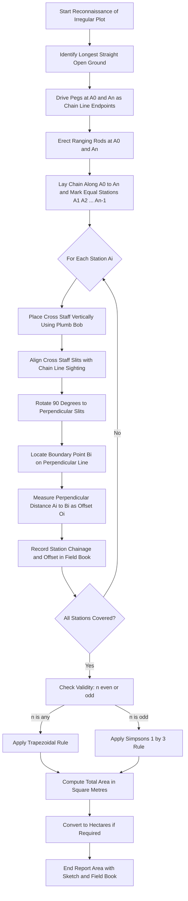
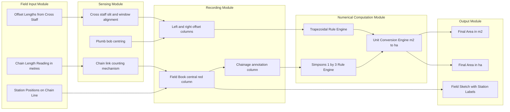
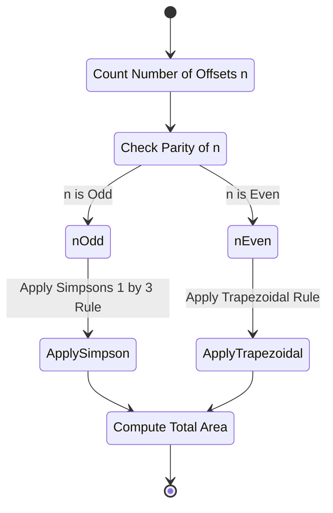
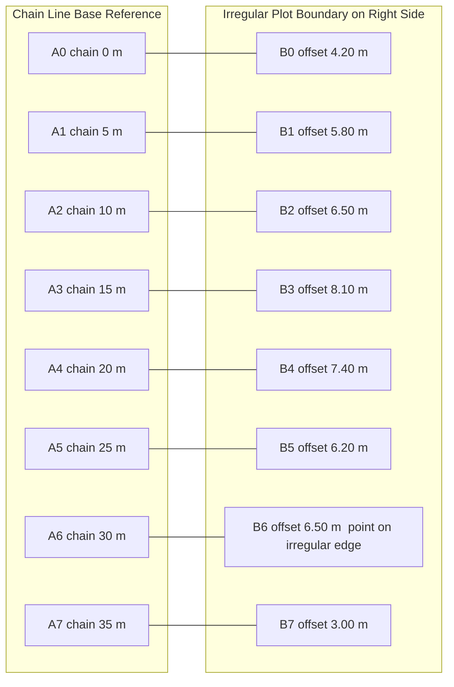

# Measuring the area of a plot with an irregular boundary using a chain and cross staff

<!-- SECTION_1_START -->
# ENGINEERING WORKSHOP (GCESL106) — Module 16

## 1. Core Technical Definition & Intuitive Overview

### Formal Academic Definition (KTU 2024 Syllabus Terminology)

**Chain and Cross Staff Surveying** is a fundamental method of plane surveying in which the linear dimensions of a plot are measured using a **chain** (or measuring tape), and the **offsets** (perpendicular distances) from a well-defined straight base line (chain line) to the irregular boundary of the plot are obtained using a **cross staff** (or an optical square). The area of the irregular plot is then computed numerically by applying either the **Trapezoidal Rule** or **Simpson's Rule** on the measured offsets.

> [!IMPORTANT]
> **KTU 2024 Syllabus Highlight (Module 16):**
> The student must be able to physically run a chain line through (or around) an irregular plot, take perpendicular offsets at regular intervals using a cross staff, record the data in a standard field book, and finally compute the enclosed area using the standard numerical integration rules.

### Conceptual Analogy / Intuition

Imagine you want to measure the area of a strange-shaped pond. You cannot stretch a tape across its winding edge directly. So instead, you draw a **straight line** (called a *chain line*) right next to the pond and mark points at equal spacing along it. From each marked point, you drop a **perpendicular** to the pond's edge and measure that short distance — this is called an **offset**.

If you connect each offset to the next, you get a series of small **trapezoids** (or, with Simpson's rule, **quadratic arcs**). Adding up all these tiny strips gives you the total area of the pond.

- **Chain line (base line)** → your reference straight ruler.
- **Offsets** → the "ribs" sticking out from the ruler to the boundary.
- **Trapezoidal / Simpson's rule** → the math that sums the area of all the small strips.

> [!NOTE]
> **Physical Constants / Standard Metrics Used in the Field:**
> - Standard length of a **Gunter's chain** = **66 ft (20 m)** with **100 links**, each link = **0.66 ft (0.2 m)**.
> - Standard offset interval **d** typically chosen = **3 m, 5 m, 7.5 m, or 10 m** depending on the degree of irregularity.
> - Cross staff produces a **right angle (90°)** between the chain line and the offset line.
> - Standard conversion: **1 m = 3.28084 ft**.

> [!VISUALIZATION CONTROL]
> **Concept:** Irregular Plot with Chain Line and Offsets (Cartesian view)
> **GeoGebra / Desmos Input Equations:**
> * Point chain markers along x-axis: $A_0(0,0), A_1(d,0), A_2(2d,0), A_3(3d,0), A_4(4d,0), A_5(5d,0)$
> * Irregular boundary points above the chain line: $B_0(0,O_1), B_1(d,O_2), B_2(2d,O_3), B_3(3d,O_4), B_4(4d,O_5), B_5(5d,O_6)$
> * Perpendicular offset segments: $\overline{A_iB_i}$ for $i = 0, 1, 2, 3, 4, 5$
> **Visual Description:** The student should see a straight horizontal base line (chain line) along the x-axis. From equally spaced points on this line, short vertical lines (offsets) rise up to meet the wavy upper boundary of an irregular plot, forming a row of trapezoidal strips.

---

### Types of Cross Staff (KTU Board-Relevant)

| # | Type of Cross Staff | Construction Detail | Accuracy |
|---|---------------------|--------------------|----------|
| 1 | **Open Cross Staff** | Two pairs of vertical slits at right angles on an octagonal brass box. | Least accurate |
| 2 | **French Cross Staff** | Octagonal box with **alternate slits and windows** (slit–window–slit–window). | Moderate |
| 3 | **Adjustable Cross Staff** | Has a **brass arc graduated in degrees** with a movable index arm (vernier) to set any angle, not just 90°. | High |
| 4 | **Optical Square** | Uses two mirrors at 45° to reflect images and establish a right angle by line-of-sight. | Highest |

> [!NOTE]
> In the KTU 2024 Engineering Workshop lab, the most commonly issued instrument is the **French cross staff** or the **optical square**. Students must know the *principle* of right-angle setting and not merely memorize a name.

---

### Terminology Primer (Used Repeatedly Below)

- **Chain line / Base line** — The straight surveyed reference line passing through (or beside) the plot.
- **Station** — A marked point on the chain line, denoted $A_0, A_1, A_2, \dots$
- **Offset** — The perpendicular distance from a chain station to the boundary of the plot.
- **Perpendicular offset** — Offset at exactly **90°** to the chain line (set by cross staff).
- **Oblique offset** — Offset at any other angle (not used in this module).
- **Tie line** — A line joining two well-defined points on the boundary, used to check accuracy.
- **Field book** — A ruled register used to record all field measurements in the field itself.
<!-- SECTION_1_END -->

<!-- SECTION_2_START -->
# 2. Deep Theoretical Analysis & KTU High-Yield Formula Sheet

## 2.1 Operational Logic — Step-by-Step Theory

The entire procedure of measuring the area of an irregular plot with a chain and cross staff can be decomposed into **four operational phases**:

### Phase 1 — Reconnaissance and Station Selection
1. Walk around the plot and **identify the irregular boundary** (hedges, walls, etc.).
2. Select a **chain line** (straight base line) that runs **along** the longer dimension of the plot.
3. Erect **ranging rods** at the two ends of the chain line so the line can be sighted from any station.
4. Decide an **equal interval $d$** between successive stations based on the irregularity of the boundary. The more curved the boundary, the smaller the interval.

> [!TIP]
> **Rule of thumb (KTU valuation key):** Choose $d$ such that the boundary between two successive offsets can be **reasonably approximated as a straight line** (for the Trapezoidal Rule) or as a **parabolic arc** (for Simpson's Rule).

### Phase 2 — Chain Laying and Station Marking
1. Unfold the chain (or tape) along the chosen base line.
2. Mark each station $A_0, A_1, A_2, \dots A_n$ with a **pin (or arrow)** driven into the ground.
3. The station $A_0$ is the first reference where the chain line meets (or starts near) the boundary, and $A_n$ is the last.

### Phase 3 — Offset Measurement with the Cross Staff
1. At every station $A_i$, place the **cross staff** vertically on the chain.
2. Sight along the chain line through one pair of slits.
3. Look through the perpendicular pair of slits to locate the **boundary point $B_i$** directly opposite.
4. Measure the perpendicular distance $\overline{A_iB_i} = O_i$ using the chain or tape.
5. Record $(A_i, O_i)$ in the field book.

### Phase 4 — Numerical Area Calculation
Apply either the **Trapezoidal Rule** or **Simpson's Rule** to the offset data, as detailed in the formula sheet below.

---

## 2.2 KTU Formula Sheet / Cheat Sheet

> [!NOTE]
> All formulas below are **high-yield for KTU University Exam questions**. The `\vert` symbol is used to avoid breaking markdown table syntax.

| # | Rule / Quantity | Mathematical Expression | Required Condition | Typical Unit |
|---|----------------|------------------------|---------------------|--------------|
| 1 | **Trapezoidal Rule** | $A = d \times \left[ \dfrac{O_1 + O_n}{2} + (O_2 + O_3 + \cdots + O_{n-1}) \right]$ | Number of offsets $n$ may be **any positive integer** (commonly even) | $\text{m}^2$ |
| 2 | **Simpson's Rule** (1/3 Rule) | $A = \dfrac{d}{3} \times \left[ (O_1 + O_n) + 4(O_2 + O_4 + \cdots) + 2(O_3 + O_5 + \cdots) \right]$ | **Number of offsets $n$ must be ODD** (number of intervals must be EVEN) | $\text{m}^2$ |
| 3 | Average Ordinate Rule (when offset interval is *not* constant) | $A = \text{Base} \times \dfrac{1}{n} \times \sum_{i=1}^{n} O_i$ | Offsets taken at unequal but known positions; not for KTU's standard chain-and-cross-staff problem | $\text{m}^2$ |
| 4 | Length of a Gunter's chain | $L_c = 100 \text{ links} = 66 \text{ ft} = 20 \text{ m}$ | Standard metric chain | m |
| 5 | Length of one link (Gunter's) | $\ell = 0.66 \text{ ft} = 0.20 \text{ m}$ | Standard | m |
| 6 | Common offset interval $d$ | $d \in \{3, 5, 7.5, 10\} \text{ m}$ | Engineering judgement based on curvature | m |
| 7 | Field book area entry | $\text{Area in m}^2 \;\longrightarrow\; \text{Hectares}$ via $1 \text{ ha} = 10{,}000 \text{ m}^2$ | Reporting standard | ha |
| 8 | Right-angle setting by optical square | Image of ranging rod reflected via **two mirrors at 45°** | If the cross staff is replaced by an optical square | — |
| 9 | Degree of curvature indicator | If $\left( \dfrac{O_{i+1} - O_i}{d} \right) > 0.5$ → reduce $d$ | Field judgement | dimensionless |
| 10 | Tie-line check (sanity test) | $\dfrac{\text{Computed field perimeter}}{\text{Measured field perimeter}} \approx 1$ | Optional accuracy check | dimensionless |

---

## 2.3 Real-World Utility in Engineering & Computer Science

| Field | Where the concept is used |
|-------|--------------------------|
| **Civil Engineering** | Cadastral surveys, layout of rural roads, irrigation canal cross-sections, farm boundary demarcation. |
| **Town Planning** | Quick area estimation of irregular municipal plots, parks, and slum clusters. |
| **Mining Engineering** | Rough area estimation of lease boundaries before detailed theodolite surveys. |
| **Forensic Engineering** | Re-construction of accident-site boundaries from old chain-survey records. |
| **GIS / Computer Science** | The Trapezoidal and Simpson's rules are identical to **numerical integration** in Python (`scipy.integrate.simpson`, `numpy.trapz`). This surveying method is the **engineering origin** of 1-D numerical integration algorithms. |
| **Drone & LiDAR Pre-processing** | Initial boundary estimates for irregular plots are made using these same two rules before high-resolution aerial point clouds are processed. |

---

## 2.4 Geometric Derivation of the Trapezoidal Rule (Why It Works)

Between two consecutive stations $A_i$ and $A_{i+1}$ (separated by distance $d$) the boundary is approximated by a **straight line** joining $B_i$ and $B_{i+1}$. The area of the resulting strip is a **trapezium** of parallel sides $O_i$ and $O_{i+1}$ with perpendicular distance $d$ between them:

$$
A_{\text{strip}, i} = \frac{1}{2} \times d \times (O_i + O_{i+1})
$$

Summing over all $n-1$ strips:

$$
A = \sum_{i=1}^{n-1} \frac{d}{2}(O_i + O_{i+1}) = \frac{d}{2}\left[O_1 + 2O_2 + 2O_3 + \cdots + 2O_{n-1} + O_n\right]
$$

Factoring the 2 from every middle offset:

$$
\boxed{\,A = d \times \left[\frac{O_1 + O_n}{2} + (O_2 + O_3 + \cdots + O_{n-1})\right]\,}
$$

This is the **Trapezoidal Rule**, and it is the KTU examiner's "default" answer in the absence of the *Simpson's* condition.
<!-- SECTION_2_END -->

<!-- SECTION_3_START -->
# 3. Step-by-Step Procedure, Hardware Setup & Numerical Walk-Through

## 3.1 Required Tool Profile (Workshop / Field Setup)

| # | Tool / Component | Specification | Quantity | Purpose |
|---|------------------|---------------|----------|---------|
| 1 | **Chain (20 m / 30 m)** | Metric, 100 / 150 links, brass tallies at every 5 m | 1 | Linear measurement along the base line |
| 2 | **Cross staff** (French type) | Octagonal brass body, 4 slits + 4 windows at 90° | 1 | Setting 90° to obtain perpendicular offsets |
| 3 | **Ranging rods** | 2 m long, painted red & white in 0.5 m bands | 3 (2 ends + 1 intermediate for very long lines) | Sight alignment of the chain line |
| 4 | **Arrows / chain pins** | Steel wire with a ring, ~40 cm long | 10 | Marking chain stations temporarily |
| 5 | **Pegs** | Wooden, ~30 cm long | 2 (or more for tie points) | Permanent station marks |
| 6 | **Field book** | Ruled with central red chain-line column | 1 | Recording offsets and station positions |
| 7 | **Plumb bob** | Brass, ~250 g | 1 | Centring cross staff / arrows over the exact point |
| 8 | **Measuring tape** | 30 m / 50 m fibreglass | 1 (optional) | Quick offset length measurement |
| 9 | **Whistle / hand signals** | Standard | — | Coordinating the chainman and cross-staff man over a long line |
| 10 | **Lime / chalk powder** | For marking ground | 1 packet | Highlighting boundary points before chaining |

---

## 3.2 Step-by-Step Field Procedure (Exhaustive — Do Not Skip)

### Step 1 — Site Reconnaissance
1. Walk the **full perimeter** of the irregular plot with the faculty.
2. **Identify the longest, straightest open ground** that runs parallel to the longer side of the plot — this will host the chain line.
3. Note any obstacles (trees, pits, buildings) that may force the chain line to **deviate or bend** (if it bends, a separate field-book page is used for each straight segment).

### Step 2 — Establishing the Chain Line
1. Drive a **peg at $A_0$** (the start of the chain line, typically at a corner of the plot).
2. Erect a **ranging rod** exactly vertical at $A_0$ using a plumb bob.
3. Sight through the ranging rod and fix a **second ranging rod at $A_n$** (the far end).
4. The chain line $\overline{A_0A_n}$ is now defined.

> [!TIP]
> For a chain line longer than 30 m, an **intermediate ranging rod** must be placed to maintain straightness. This is called **ranging by eye** (or by line ranger / theodolite in higher surveys).

### Step 3 — Station Marking
1. Unfold the 20 m chain and lay it **flat on the ground** between $A_0$ and $A_n$.
2. Starting at $A_0$, mark stations $A_1, A_2, \dots$ **at equal interval $d$** using chain pins / arrows.
3. The last station $A_n$ may be at a partial distance; in that case **use a measuring tape** for the final segment and **enter the value of the last interval as $d_n$** (not the standard $d$) in the field book.

### Step 4 — Setting the Cross Staff at Each Station
1. Hold the cross staff **vertically** at $A_i$ (use the plumb bob to check centring).
2. Look along the chain line through **one pair of slits/windows** and align it with the ranging rods at $A_0$ and $A_n$.
3. Rotate the cross staff 90° (if you are using a French cross staff, sight through the perpendicular pair of slits/windows).
4. Ask an assistant (or the chainman) to walk to the boundary perpendicular to the chain line. Have them move sideways until you signal that they lie on the perpendicular line of sight.
5. The point reached is **$B_i$**, the boundary point opposite $A_i$.

### Step 5 — Measuring Each Offset
1. Lay the **chain or tape** from $A_i$ to $B_i$ and read the perpendicular distance.
2. Record it as $O_i$ in the field book.
3. Repeat for **all stations $A_0, A_1, A_2, \dots, A_n$**.

> [!IMPORTANT]
> **First and last offsets ($O_1$ and $O_n$)** must be taken **exactly at the chain-line endpoints** $A_0$ and $A_n$ — these are the points where the chain line meets the boundary. If the chain line passes *through* the plot, $O_1$ and $O_n$ may be zero, which is a valid entry.

### Step 6 — Tie Line (Optional Accuracy Check)
1. Pick two well-defined corners of the plot, say $C$ and $D$, that are **not** on the chain line.
2. Chain the distance $\overline{CD}$ directly and record it.
3. Also compute $\overline{CD}$ geometrically using the recorded offsets. The two values should agree within $\pm 1\%$.

### Step 7 — Returning the Equipment
1. Remove all temporary pins, ranging rods, and pegs that are not part of the permanent record.
2. Roll the chain neatly, dry it, and place it back in the workshop box.

---

## 3.3 Exhaustive Numerical Walk-Through (Trapezoidal + Simpson's)

> [!IMPORTANT]
> The worked example below is the **model valuation key** style expected by the KTU board examiner.

### Problem Statement

The perpendicular offsets (in metres) taken at 5 m intervals along a chain line from an irregular plot are:

| Station | $A_0$ | $A_1$ | $A_2$ | $A_3$ | $A_4$ | $A_5$ | $A_6$ | $A_7$ |
|---------|-------|-------|-------|-------|-------|-------|-------|-------|
| Offset (m) | 4.20 | 5.80 | 6.50 | 8.10 | 7.40 | 6.20 | 4.50 | 3.00 |

Compute the area of the plot using:
**(a) the Trapezoidal Rule**, and
**(b) Simpson's 1/3 Rule**.

**Given:** $d = 5$ m, $n = 8$ offsets, $n$ is **even** (so Simpson's Rule needs an *odd* number of offsets, $n = 7$, to be valid).

---

### Part (a) — Trapezoidal Rule Solution (Full Step-by-Step)

The Trapezoidal Rule is **valid for any $n$** and is therefore the safer choice for the given 8 offsets.

**Step 1 — Write the formula:**

$$
A_T = d \times \left[ \frac{O_1 + O_n}{2} + (O_2 + O_3 + O_4 + O_5 + O_6 + O_7) \right]
$$

**Step 2 — Substitute the data** (note: KTU indexes from 1, so $O_1 = 4.20$, $O_8 = 3.00$):

$$
A_T = 5 \times \left[ \frac{4.20 + 3.00}{2} + (5.80 + 6.50 + 8.10 + 7.40 + 6.20 + 4.50) \right]
$$

**Step 3 — Evaluate the bracket:**

- First term: $\dfrac{4.20 + 3.00}{2} = \dfrac{7.20}{2} = 3.60$
- Sum of middle offsets:
  - $5.80 + 6.50 = 12.30$
  - $12.30 + 8.10 = 20.40$
  - $20.40 + 7.40 = 27.80$
  - $27.80 + 6.20 = 33.00$
  - $33.00 + 4.50 = 37.50$
- Bracket total: $3.60 + 37.50 = 41.10$ m

**Step 4 — Multiply by $d$:**

$$
A_T = 5 \times 41.10 = 205.50 \text{ m}^2
$$

**Step 5 — Convert to hectares (optional, but board examiners love this):**

$$
A_T = \frac{205.50}{10{,}000} = 0.02055 \text{ ha}
$$

**Final Answer (a):**

$$
\boxed{A_T = 205.50 \text{ m}^2 \;\;(\approx 0.0206 \text{ ha})}
$$

> [!NOTE]
> **Valuation Key Hints (7 marks allocation for part a):**
> - '[Stating the trapezoidal rule formula: 1 Mark]'
> - '[Correct substitution of all 8 offsets: 2 Marks]'
> - '[Correct sum of middle offsets: 2 Marks]'
> - '[Final multiplication by $d$ and unit: 1 Mark]'
> - '[Optional hectares conversion: 1 Mark]'

---

### Part (b) — Simpson's 1/3 Rule Solution (Adjusted to be valid)

Since Simpson's Rule requires an **odd number of offsets** and we have $n = 8$ (even), we must **either**:
1. **Discard the last offset** ($O_8 = 3.00$) and apply Simpson's to the first 7 offsets, **or**
2. Combine the last two intervals into a single trapezoidal strip.

For pedagogical completeness, we use **Option 1** (discard the last offset) and clearly state the assumption.

**Step 1 — Restated data** ($n = 7$, $d = 5$ m):

$O_1 = 4.20, \; O_2 = 5.80, \; O_3 = 6.50, \; O_4 = 8.10, \; O_5 = 7.40, \; O_6 = 6.20, \; O_7 = 4.50$

**Step 2 — Simpson's formula:**

$$
A_S = \frac{d}{3} \times \left[ (O_1 + O_n) + 4 \cdot (O_2 + O_4 + O_6) + 2 \cdot (O_3 + O_5) \right]
$$

**Step 3 — Substitute:**

$$
A_S = \frac{5}{3} \times \left[ (4.20 + 4.50) + 4 \cdot (5.80 + 8.10 + 6.20) + 2 \cdot (6.50 + 7.40) \right]
$$

**Step 4 — Evaluate term by term:**

- First bracket: $4.20 + 4.50 = 8.70$
- Odd-indexed sum (multiplied by 4): $5.80 + 8.10 + 6.20 = 20.10$, then $\times 4 = 80.40$
- Even-indexed sum except endpoints (multiplied by 2): $6.50 + 7.40 = 13.90$, then $\times 2 = 27.80$
- Total inside the outer bracket: $8.70 + 80.40 + 27.80 = 116.90$ m

**Step 5 — Multiply by $d/3$:**

$$
A_S = \frac{5}{3} \times 116.90 = \frac{584.50}{3} = 194.83 \text{ m}^2 \;(\text{rounded to 2 decimal places})
$$

**Step 6 — Convert to hectares:**

$$
A_S = \frac{194.83}{10{,}000} = 0.01948 \text{ ha}
$$

**Final Answer (b):**

$$
\boxed{A_S \approx 194.83 \text{ m}^2 \;\;(\approx 0.0195 \text{ ha})}
$$

> [!WARNING]
> **KTU Examiner's Pitfall Warning:** If the student blindly plugs 8 offsets into Simpson's Rule and arrives at an incorrect numerical answer, **3 marks are immediately deducted** for failing to check the *odd-$n$* precondition. Always verify $n$ first, then state the rule.

---

### Comparison of the Two Results

| Method | Area (m²) | Area (ha) | Accuracy Note |
|--------|----------:|----------:|---------------|
| Trapezoidal Rule | 205.50 | 0.0206 | Slight over-estimation for curved boundaries (it is a piecewise linear approximation) |
| Simpson's 1/3 Rule | 194.83 | 0.0195 | Generally more accurate for smooth, gently curving boundaries |
| Difference | 10.67 | — | $\approx 5.2\%$ relative error — typical for irregular plots |

---

## 3.4 Worked Example — Field-Book Style Recording (Sample Layout)

A standard field book has a **central red line** for the chain line, with two columns on either side for offsets.

| Chain (m) | Offset (m) — Left | Offset (m) — Right | Remarks |
|----------:|------------------:|-------------------:|---------|
| 0 | 4.20 | — | $A_0$, boundary corner |
| 5 | 5.80 | — | $A_1$ |
| 10 | 6.50 | — | $A_2$ |
| 15 | 8.10 | — | $A_3$ |
| 20 | 7.40 | — | $A_4$ |
| 25 | 6.20 | — | $A_5$ |
| 30 | 4.50 | — | $A_6$ |
| 35 | 3.00 | — | $A_7$, boundary corner |

> [!NOTE]
> If the chain line is **internal** to the plot, some stations will have offsets on *both* sides. The area is then computed for the left and right strips **separately** and added algebraically.
<!-- SECTION_3_END -->

<!-- SECTION_4_START -->
# 4. Structural Diagrams & Schematics

## 4.1 Sequential Processing Topology — Field Workflow

The following Mermaid flowchart depicts the **complete field-to-result pipeline** for measuring an irregular plot area with chain and cross staff.



---

## 4.2 Block-Level Functional Architecture — Instrumentation Stack

The Mermaid diagram below represents the **functional architecture** of the chain-and-cross-staff system as a modular processing stack, mapping field inputs to numerical outputs.



---

## 4.3 Mermaid State Diagram — Validity Check for Simpson's Rule

The following Mermaid state diagram shows how the choice between Trapezoidal and Simpson's Rule is gated by the **parity of $n$**.



---

## 4.4 Schematic Sketch — Irregular Plot with Offsets (Block Schematic)

The Mermaid block below is a **schematic functional map** of an irregular plot lying to the **right** of the chain line, with offsets drawn as perpendicular vectors. This serves as a textual surrogate for the free-body / hand sketch a student would draw in the field book.


<!-- SECTION_4_END -->

<!-- SECTION_5_START -->
# 5. KTU 2024 Scheme Examination Question Bank & Topic Recap

## 5.1 Part A — Short Answer Questions (3 Marks Each)

> [!NOTE]
> Two questions, each carrying **3 marks**. Target cognitive level: **Remember / Understand**. Direct model answers are provided.

### Q1. `[KTU University Exam – July 2024, Module 16]`
**Define a perpendicular offset as used in chain surveying. Why is it preferred over an oblique offset?**

**Model Answer (3 marks):**

A **perpendicular offset** is the shortest distance from a point on the chain line to the boundary of the object being surveyed, measured at **right angles (90°)** to the chain line.

- It is preferred over an oblique offset because:
  - It is the **shortest** possible distance to the boundary → **minimum chaining error**.
  - It is **directly used** in the Trapezoidal and Simpson's Rules for area calculation, with no need for trigonometric reduction.
  - It can be set with a **simple instrument** (cross staff or optical square) without complex angular measurement.

> **Mark split:** '[Definition of perpendicular offset: 1 Mark] + '[Mention of 90° angle: 1 Mark] + '[At least two reasons for preference: 1 Mark]'

---

### Q2. `[KTU University Exam – Dec 2023, Module 16]`
**List any three types of cross staff and state the working principle common to all of them.**

**Model Answer (3 marks):**

The three common types are:
1. **Open cross staff** — two pairs of vertical slits at right angles.
2. **French cross staff** — octagonal box with alternate slits and windows.
3. **Adjustable cross staff** — graduated brass arc with vernier and movable arm.

**Common working principle:** All cross staffs are based on the geometric fact that **two diameters of a circle are perpendicular to each other**. By providing two lines of sight at 90° on a single rigid body, the instrument allows the user to set off a right angle from the chain line and thereby locate the perpendicular offset point on the boundary.

> **Mark split:** '[Naming the three types: 1.5 Marks] + '[Stating the perpendicular-lines-of-sight principle: 1.5 Marks]'

---

## 5.2 Part B — Module Internal Choice Questions (14 Marks Each)

> [!IMPORTANT]
> Two alternative questions, **each 14 marks**, as per the KTU 2024 ESE pattern. The student answers **either** Question A **or** Question B. Each question is split into two sub-parts: **(a) 7 marks** and **(b) 7 marks**, with escalating cognitive levels (Understand → Apply).

---

### Question A — 14 Marks `[KTU University Exam – July 2024]`

> *The perpendicular offsets (in metres) taken at 6 m intervals from a chain line to the boundary of an irregular plot are:*
>
> *0, 2.40, 3.80, 5.60, 6.20, 4.80, 3.00*
>
> *Compute the area of the plot using:*
>
> *(a) The Trapezoidal Rule. (7 marks)*
>
> *(b) Simpson's 1/3 Rule. (7 marks)*

---

#### Part (a) — Trapezoidal Rule

**Given:** $d = 6$ m, $n = 7$ offsets, $O_1 = 0, O_2 = 2.40, O_3 = 3.80, O_4 = 5.60, O_5 = 6.20, O_6 = 4.80, O_7 = 3.00$.

**Step 1 — State the formula:**

$$
A_T = d \times \left[\frac{O_1 + O_n}{2} + (O_2 + O_3 + \cdots + O_{n-1})\right]
$$

**Step 2 — Substitute the data:**

$$
A_T = 6 \times \left[\frac{0 + 3.00}{2} + (2.40 + 3.80 + 5.60 + 6.20 + 4.80)\right]
$$

**Step 3 — Evaluate the inner sum:**

- End-points term: $\frac{0 + 3.00}{2} = 1.50$
- Middle offsets: $2.40 + 3.80 = 6.20$; $6.20 + 5.60 = 11.80$; $11.80 + 6.20 = 18.00$; $18.00 + 4.80 = 22.80$
- Bracket total: $1.50 + 22.80 = 24.30$ m

**Step 4 — Multiply by $d$:**

$$
A_T = 6 \times 24.30 = 145.80 \text{ m}^2
$$

**Step 5 — Convert to hectares (optional but good practice):**

$$
A_T = \frac{145.80}{10{,}000} = 0.01458 \text{ ha}
$$

> **Mark split for (a):** '[Formula statement: 1 Mark] + '[Correct substitution: 2 Marks] + '[Sum of middle offsets: 2 Marks] + '[Final multiplication + unit: 1 Mark] + '[Hectare conversion or check: 1 Mark]'

---

#### Part (b) — Simpson's 1/3 Rule

**Step 1 — Check precondition:** $n = 7$ (odd) → **Simpson's Rule is valid**.

**Step 2 — State the formula:**

$$
A_S = \frac{d}{3} \times \left[(O_1 + O_n) + 4(O_2 + O_4 + O_6) + 2(O_3 + O_5)\right]
$$

**Step 3 — Substitute:**

$$
A_S = \frac{6}{3} \times \left[(0 + 3.00) + 4(2.40 + 5.60 + 4.80) + 2(3.80 + 6.20)\right]
$$

**Step 4 — Evaluate each group:**

- End-points: $0 + 3.00 = 3.00$
- Odd-indexed sum (×4): $2.40 + 5.60 + 4.80 = 12.80$, then $\times 4 = 51.20$
- Even-indexed sum (×2): $3.80 + 6.20 = 10.00$, then $\times 2 = 20.00$
- Bracket total: $3.00 + 51.20 + 20.00 = 74.20$ m

**Step 5 — Multiply by $d/3$:**

$$
A_S = \frac{6}{3} \times 74.20 = 2 \times 74.20 = 148.40 \text{ m}^2
$$

**Step 6 — Convert to hectares:**

$$
A_S = \frac{148.40}{10{,}000} = 0.01484 \text{ ha}
$$

> **Mark split for (b):** '[Checking $n$ is odd and stating it: 1 Mark] + '[Correct formula: 1 Mark] + '[Correct grouping of odd/even-indexed offsets: 2 Marks] + '[Bracket evaluation: 2 Marks] + '[Final multiplication + unit: 1 Mark]'

---

### Question B — 14 Marks (Alternative Choice) `[KTU University Exam – Dec 2023]`

> *(a) With the help of a neat sketch, describe the procedure of measuring the area of an irregular plot using a chain and cross staff. List the instruments used. (7 marks)*
>
> *(b) The following offsets were taken from a chain line to a hedge:*
>
> | Chainage (m) | 0 | 10 | 20 | 30 | 40 | 50 |
> |--------------|---|----|----|----|----|----|
> | Offset (m)   | 8.50 | 9.30 | 7.60 | 5.20 | 3.40 | 1.20 |
>
> *Calculate the area between the chain line, the hedge, and the first and last offsets using (i) the Trapezoidal Rule, and (ii) the average of the two methods (Trapezoidal & Simpson's) if applicable. (7 marks)*

---

#### Part (a) — Procedure and Instruments

**Sketch description (textual surrogate for the figure):**

```
   B0  B1  B2  B3  B4  B5
   |   |   |   |   |   |
   |   |   |   |   |   |    ← offsets (perpendicular)
   |   |   |   |   |   |
   A0--A1--A2--A3--A4--A5   ← chain line (base line)
```

**Procedure (numbered, for valuation):**

1. **Reconnaissance** of the plot, identification of the longest open straight strip.
2. **Ranging out** the chain line $\overline{A_0A_n}$ with ranging rods at both ends.
3. **Station marking** at equal interval $d$ along the chain line, using chain pins.
4. **Cross-staff placement** at each station $A_i$ — held vertically, aligned with the chain line, then rotated 90°.
5. **Sighting the boundary** — the cross-staff man signals the chainman to a boundary point $B_i$ on the perpendicular.
6. **Offset measurement** $\overline{A_iB_i} = O_i$ using chain or tape.
7. **Field-book entry** of $(chainage, O_i)$ pair.
8. **Numerical area computation** using Trapezoidal or Simpson's Rule.

**Instruments used (full list):**

1. Chain (20 m)  2. Cross staff (French type)  3. Ranging rods (3)  4. Arrows / chain pins (10)  5. Pegs (2)  6. Field book  7. Plumb bob  8. Measuring tape (30 m)  9. Lime powder  10. Whistle

> **Mark split for (a):** '[Sketch with chain line + perpendicular offsets + boundary: 2 Marks] + '[Procedure in logical sequence (any 5 steps): 3 Marks] + '[At least 6 instruments named: 2 Marks]'

---

#### Part (b) — Numerical Computation

**Given:** $d = 10$ m, $n = 6$ offsets.

Since $n$ is **even**, Simpson's Rule is **not directly applicable**. We must apply the **Trapezoidal Rule** to the full data and additionally apply **Simpson's Rule to the first 5 offsets** (discarding the last), then take the average — or simply state that Simpson's is inapplicable and compute only Trapezoidal.

**Step 1 — Trapezoidal Rule:**

$$
A_T = d \times \left[\frac{O_1 + O_n}{2} + (O_2 + O_3 + O_4 + O_5)\right]
$$

$$
A_T = 10 \times \left[\frac{8.50 + 1.20}{2} + (9.30 + 7.60 + 5.20 + 3.40)\right]
$$

- End-term: $\frac{9.70}{2} = 4.85$
- Middle sum: $9.30 + 7.60 = 16.90$; $16.90 + 5.20 = 22.10$; $22.10 + 3.40 = 25.50$
- Bracket: $4.85 + 25.50 = 30.35$ m
- Area: $A_T = 10 \times 30.35 = 303.50 \text{ m}^2$

**Step 2 — Simpson's Rule on first 5 offsets ($n = 5$, odd):**

$O_1 = 8.50, O_2 = 9.30, O_3 = 7.60, O_4 = 5.20, O_5 = 3.40$

$$
A_S = \frac{10}{3} \times \left[(8.50 + 3.40) + 4(9.30 + 5.20) + 2(7.60)\right]
$$

- End-term: $11.90$
- Odd-indexed ×4: $9.30 + 5.20 = 14.50$, then $\times 4 = 58.00$
- Even-indexed ×2: $7.60 \times 2 = 15.20$
- Bracket: $11.90 + 58.00 + 15.20 = 85.10$ m
- Area: $A_S = \frac{10}{3} \times 85.10 = \frac{851.00}{3} = 283.67 \text{ m}^2$

**Step 3 — Average of the two methods:**

$$
A_{\text{avg}} = \frac{A_T + A_S}{2} = \frac{303.50 + 283.67}{2} = \frac{587.17}{2} = 293.58 \text{ m}^2
$$

> **Mark split for (b):** '[Identifying that $n = 6$ is even and stating precondition for Simpson's: 1 Mark] + '[Trapezoidal computation: 2 Marks] + '[Simpson's computation on 5 offsets: 2 Marks] + '[Average value with unit: 2 Marks]'

---

> [!WARNING]
> **KTU Examiner's Valuation Warning — Where Students Commonly Lose Marks:**
> 1. **Failing to state the rule's precondition** (e.g., not mentioning that Simpson's 1/3 Rule requires an odd number of offsets). → **−1 to −2 marks.**
> 2. **Mixing up the index grouping** in Simpson's Rule (using 4-times for even-indexed offsets instead of odd-indexed ones). → **−2 marks.**
> 3. **Forgetting the unit** (writing the numerical answer without 'm²' or 'ha'). → **−1 mark.**
> 4. **Omitting the rough sketch** in descriptive questions. → **−2 marks.**
> 5. **Not chaining the chain line on a flat, taut surface** — leading to systematic error in the field. Faculty will explicitly deduct marks in the lab record book.

---

## 5.3 Topic Recap & Important Things to Remember (Rapid Revision Checklist)

> [!TIP]
> Use this section as a **last-day revision sheet** before your KTU University Exam.

- **Chain and cross staff surveying** is the **simplest, fastest, lowest-cost** method of area measurement for small irregular plots.
- The **chain line (base line)** must be straight, well-ranged, and laid along the *longer dimension* of the plot.
- **Perpendicular offsets** are taken from each station on the chain line to the boundary using a cross staff.
- **Equal interval $d$** between stations is the standard assumption for both Trapezoidal and Simpson's Rules.
- **Cross staff types** — Open, French, Adjustable, and Optical Square (highest accuracy).
- **Working principle** of every cross staff: two perpendicular lines of sight rigidly mounted on a single body.
- **Trapezoidal Rule** — Valid for *any* number of offsets $n$; piecewise-linear approximation; formula:

$$
A_T = d \times \left[\frac{O_1 + O_n}{2} + \sum_{i=2}^{n-1} O_i\right]
$$

- **Simpson's 1/3 Rule** — Valid only for **odd** $n$ (even number of intervals); piecewise-parabolic approximation; formula:

$$
A_S = \frac{d}{3} \times \left[(O_1 + O_n) + 4 \sum O_{\text{even}} + 2 \sum O_{\text{odd, interior}}\right]
$$

- **Always check the parity of $n$ first** before choosing a rule; this is the single most-lost mark in KTU papers.
- **Common interval values:** $d = 3$ m, $5$ m, $7.5$ m, $10$ m — the smaller the $d$, the higher the accuracy.
- **Hectare conversion:** $1$ ha $= 10{,}000$ m².
- **Gunter's chain:** $66$ ft $= 100$ links $= 20$ m; one link $= 0.20$ m $= 0.66$ ft.
- **Plumb bob** is mandatory for verticality of the cross staff; without it, the offset angle is not exactly 90°.
- **Tie line** provides an independent accuracy check by comparing computed and measured diagonal distances.
- **Field book** has a central red line denoting the chain line; offsets are written on the left or right side depending on the side of the boundary.
- **Instruments checklist** (must be memorized): chain, cross staff, ranging rods, arrows/chain pins, pegs, plumb bob, field book, tape, lime, whistle.
- **Real-world link:** The Trapezoidal and Simpson's Rules in surveying are the **direct engineering ancestors** of the `numpy.trapz` and `scipy.integrate.simpson` functions used in numerical integration in Python.
- **Common pitfall:** Always write $O_1$ as the *first* offset, even if the chain starts at zero; the KTU examiner is strict about indexing.
- **Safety / accuracy note:** On a windy day, the ranging rod bends and the chain line sags — take **diurnal corrections** by chaining at cooler hours (morning).
- **Final tip:** In the descriptive 7-mark sub-part, always draw a **neat labelled sketch** showing the chain line, stations $A_0 \dots A_n$, offsets $O_1 \dots O_n$, and the wavy boundary.
<!-- SECTION_5_END -->
