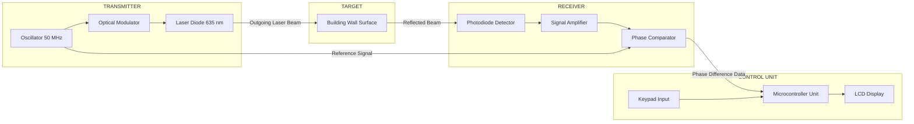
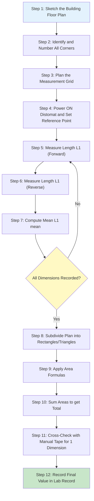
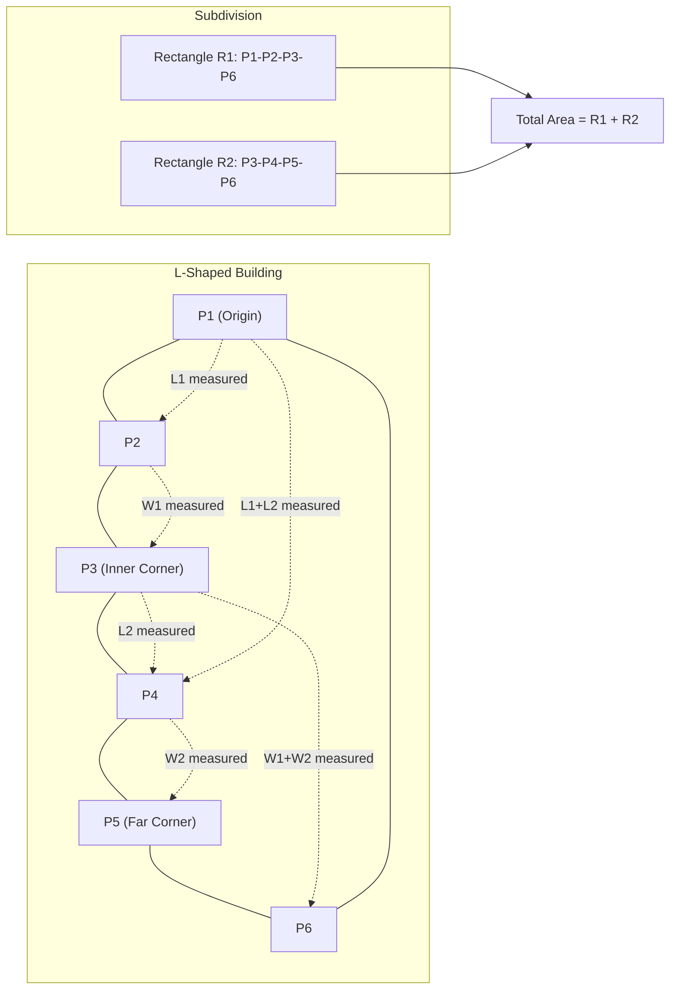

# Measuring the area of a building using Distomat

<!-- SECTION_1_START -->
# Measuring the Area of a Building Using Distomat

## 1. Core Technical Definition & Intuitive Overview

> [!IMPORTANT]
> **KTU 2024 Syllabus Definition:**
> A **Distomat** (short for *Distance Meter*, also called **Disto** or **EDM — Electronic Distance Measurement device**) is a portable, handheld opto-electronic instrument that uses a modulated **infrared laser beam** or **visible laser diode** to determine the slant distance between the instrument and a target point with high precision, typically in the range of **±1.5 mm to ±3 mm** over distances up to **200 m**.

In the context of the **Engineering Workshop (GCESL106)** Module 17, the Distomat is used as a modern substitute for the conventional **steel tape** to perform rapid, non-contact linear measurements of building components (walls, floors, ceilings, door/window openings) which are then used to compute the **plinth area, carpet area, and built-up area** of a building.

> [!NOTE]
> **Common Manufacturer Trademarks (for exam reference):**
> * **Leica DISTO™ series** (e.g., DISTO S910, DISTO X3) — industry standard.
> * **Bosch GLM series** (e.g., GLM 50 C, GLM 165-40 C).
> * **Hilti PD series** (e.g., PD-I).
> * **Stanley TLM series**.
>
> For KTU practical examinations, the generic term **"Distomat"** is preferred over brand names.

### Conceptual Analogy / Intuition

Imagine trying to measure the diagonal length of a room where you cannot physically walk across the floor because it is occupied with furniture. With a **steel tape**, you would need a helper, a plumb bob, and you would have to bend and stretch awkwardly. With a **Distomat**, you simply stand at one corner, point the laser dot at the opposite corner like a TV remote, press a single button, and the exact distance **flashes on the LCD screen within 0.5 seconds**.

Think of it as the **"laser ruler of the 21st century"** — it replaces a 30-metre long, sagging, thermally-expanding metal tape with a beam of light travelling at exactly **$c = 2.998 \times 10^8$ m/s**. By measuring the **time of flight (ToF)** or the **phase shift** of the returning beam, the instrument's microcontroller computes the distance using:

$$d = \frac{c \cdot t}{2}$$

where the factor of **2** accounts for the **round-trip** (outgoing + reflected) path of the laser pulse.

> [!TIP]
> **Why "Distomat"?**
> The name is a portmanteau of **"Dist(ance) + (Auto)mat(ic)"**, coined originally by the Swiss company **Leica Geosystems** (formerly Wild Heerbrugg) in **1993** when they launched the first handheld laser distance meter.

### Physical Constants & Standard Metrics

> [!IMPORTANT]
> * Speed of light in vacuum: **$c = 2.998 \times 10^8$ m/s**
> * Speed of light in air (typical conditions, $T = 20^\circ$C, $P = 101.325$ kPa): **$c_{air} \approx 2.997 \times 10^8$ m/s**
> * Typical accuracy class of workshop-grade Distomats: **$\pm 1.5$ mm** (Class II laser, **635 nm** wavelength).
> * Standard measurement range: **0.05 m to 80 m** (basic models), up to **300 m** (with target plate).
> * **Area unit** in KTU worksheets: **square metres (m²)** or **square feet (ft²)** — note that **$1 \text{ m}^2 = 10.7639 \text{ ft}^2$**.

> [!VISUALIZATION CONTROL]
> **Concept:** Geometric setup of a rectangular room for area measurement using a Distomat.
> **GeoGebra / Desmos Input Equations:**
> * `Polygon A(0,0), B(6,0), C(6,4), D(0,4)`  *(represents a 6 m × 4 m room)*
> * `Length: y = 0` line from A to B
> * `Width: x = 6` line from B to C
> * Label: `Area = 24 m²`
> **Visual Description:** A rectangle in the first quadrant with vertices at the origin, on the x-axis, and forming a clear 6-by-4 grid. The student should see the two principal dimensions that the Distomat would record.

---

<!-- SECTION_1_END -->

<!-- SECTION_2_START -->
# 2. Deep Theoretical Analysis & KTU High-Yield Formula Sheet

## 2.1 Working Principle — How Does a Distomat Measure Distance?

A modern Distomat uses one of two primary techniques. Understanding both is essential because KTU viva questions frequently ask *"What is the principle of EDM?"*.

### Technique A — Time-of-Flight (Pulse) Method
A short laser pulse is emitted, hits the target surface (wall, corner, or reflective plate), and a tiny fraction of the light is **scattered back** to the instrument's photodiode receiver. The instrument measures the round-trip time $t$ in **picoseconds** ($10^{-12}$ s).

$$d = \frac{c \cdot t}{2}$$

> [!NOTE]
> This method is fast but requires extremely precise timing electronics. It is used in long-range surveying total stations (> 1 km range), not in workshop Distomats.

### Technique B — Phase-Shift Method (Most common in handheld Distomats)
The instrument emits a **continuously modulated** infrared beam of known frequency $f$ (typically **50 MHz to 500 MHz**). The reflected beam is compared with the outgoing beam, and the **phase difference** $\Delta \phi$ is measured.

$$d = \frac{c}{2f} \cdot \left(N + \frac{\Delta \phi}{2\pi}\right)$$

where $N$ is the integer number of full wavelengths (resolved using multiple modulation frequencies) and $\Delta \phi$ is the fractional phase shift.

> [!TIP]
> **Why the factor of 2?**
> Because the light travels **to the wall AND back** — the round-trip distance is twice the actual one-way distance.

## 2.2 Operating Modes of a Distomat Relevant to Area Measurement

A standard Distomat (e.g., Leica DISTO D2) offers the following modes. For KTU Module 17, you must know at least the **first four**.

1. **Single Distance Measurement** — Press once, get one reading.
2. **Continuous / Tracking Mode** — Auto-updates distance every 0.5 s; useful for finding the minimum distance (perpendicular offset).
3. **Area Mode** — Two measurements (length and width) → instrument directly displays area in m².
4. **Volume Mode** — Three measurements (length, width, height) → instrument directly displays volume in m³.
5. **Pythagoras Mode (Indirect Height)** — Measures two sides of a right triangle to compute the third.
6. **Stake-Out Mode** — Repeated beeps at fixed intervals to lay out a regular grid.
7. **Bluetooth / Data Transfer** — Sends readings to a smartphone/tablet for CAD import.

## 2.3 Area Computation Strategy for a Building

A building is rarely a single rectangle. The KTU workshop assessment requires you to measure a **real building room** (e.g., the college workshop hall, a hostel room, or the lab). You must therefore **subdivide** the building plan into regular geometric primitives.

### Step-by-Step Logic for Area Computation

1. **Sketch the floor plan** on graph paper to scale. Label every wall and corner.
2. **Subdivide** the irregular polygon into **rectangles, squares, and right triangles**.
3. **Measure** the two perpendicular sides of each primitive using the Distomat.
4. **Record** each reading twice (forward + reverse) to eliminate systematic zero error.
5. **Compute** the area of each primitive using the relevant formula (see table below).
6. **Sum** all positive areas and **subtract** any negative spaces (e.g., a stairwell void, an internal courtyard).
7. **Apply a correction** for wall plaster thickness if the question specifies "plinth area" vs. "carpet area".

## 2.4 KTU High-Yield Formula Sheet

> [!IMPORTANT]
> The following table is the **only reference** you need during the KTU lab exam viva. Master every row.

| # | Shape | Distomat Measurements Required | Area Formula | Typical Use in Building |
|---|---|---|---|---|
| 1 | **Rectangle / Square Room** | Length $L$, Width $W$ | $A = L \times W$ | Most regular rooms, hall, office |
| 2 | **Right Triangle (corner cut)** | Base $b$, Height $h$ | $A = \dfrac{1}{2} \cdot b \cdot h$ | Bay windows, slanted verandahs |
| 3 | **General Triangle (Heron's)** | Three sides $a, b, c$ | $A = \sqrt{s(s-a)(s-b)(s-c)}$, where $s = \dfrac{a+b+c}{2}$ | L-shaped room sub-division |
| 4 | **Trapezium** | Two parallel sides $a, b$ and perpendicular distance $h$ | $A = \dfrac{1}{2}(a + b) \cdot h$ | Pitched roof projection |
| 5 | **Circle (column/dome)** | Diameter $D$ (single measurement) | $A = \dfrac{\pi D^2}{4}$ | Circular pillars, well, fountain |
| 6 | **Sector** | Radius $r$, central angle $\theta$ | $A = \dfrac{\theta}{360} \cdot \pi r^2$ | Curved balcony, fan-shaped rooms |
| 7 | **Regular Polygon (n sides)** | Side $a$ and apothem $ap$ | $A = \dfrac{n \cdot a \cdot ap}{2}$ | Hexagonal gazebo, octagonal room |
| 8 | **Irregular Polygon (Shoelace)** | Coordinates $(x_i, y_i)$ from survey | $A = \dfrac{1}{2} \left\vert \sum_{i=1}^{n}(x_i y_{i+1} - x_{i+1} y_i) \right\vert$ | Complex plan measured by offsets |

> [!WARNING]
> **Unit Consistency Rule:** If the Distomat is set to **feet (ft)** but your answer must be in **m²**, you must first convert: $1 \text{ ft} = 0.3048 \text{ m}$. A common error in KTU answer sheets is mixing units — **always** convert before multiplying.

## 2.5 Real-World Engineering Utility

* **Quantity Surveying & BOQ Preparation:** Rapid on-site measurement for billing of construction work.
* **Real-Estate Valuation:** Carpet area and built-up area directly determine the market price of a flat.
* **BIM (Building Information Modeling):** Point clouds from laser Distomats are imported into **Revit** or **ArchiCAD** for 3D modelling.
* **Insurance Claim Assessment:** Post-disaster (earthquake, flood) damage area estimation.
* **Interior Design:** Furniture layout planning requires accurate room dimensions.
* **Solar Panel Installation:** Roof area measurement for sizing the PV array.

---

<!-- SECTION_2_END -->

<!-- SECTION_3_START -->
# 3. Step-by-Step Derivations, Field Procedure & Code Implementation

## 3.1 Exhaustive Field Procedure — Measuring a Building Step-by-Step

This is the **exact sequence** the KTU external examiner expects you to write in your lab record. Do not skip any step.

### Step 1 — Instrument Inspection (Pre-Measuring)
1. Visually inspect the Distomat for any cracks on the optics or LCD.
2. Check the **battery level** (low battery degrades laser power → inaccurate readings).
3. Verify the **reference point** setting: is the measurement referenced from the **bottom** of the instrument, the **top**, or the **tripod thread**? (Default for handheld use is the bottom edge — set this explicitly using the menu.)
4. Perform a **zero/calibration check** by measuring a known **1.000 m** reference rod. If the reading is between **0.9985 m and 1.0015 m**, the instrument is within tolerance.

### Step 2 — Safety Briefing
> [!WARNING]
> * **Class II laser** is safe for accidental eye exposure (blink reflex protects you), but **NEVER** point the beam directly into anyone's eyes or stare into the beam through optical instruments.
> * Wear **laser-enhancement glasses** if working outdoors in bright sunlight.
> * Ensure the floor is **dry and non-slippery** before taking measurements near edges or stairs.

### Step 3 — Field Measurement Loop
For each room of the building, follow the **RSO** mnemonic:

1. **R — Read (first pass):** Measure every length twice. Record in column 1 of the field book.
2. **S — Swap ends:** Move to the opposite end and measure again. Record in column 2.
3. **O — Observe the average:** Compute the mean of the two readings to cancel zero-error and parallax.

$$L_{mean} = \frac{L_1 + L_2}{2}$$

### Step 4 — Area Calculation
1. Sketch the floor plan with all measured dimensions.
2. Subdivide into rectangles/triangles.
3. Apply the formula from the table in Section 2.4.
4. Sum the partial areas.

## 3.2 Worked Numerical Example (KTU Exam-Style)

> [!NOTE]
> **Problem Statement (KTU July 2024 Model Question):**
> *A rectangular classroom measures **8.40 m × 6.20 m** internally. There is a **verandah of size 3.00 m × 1.50 m** attached to one of the long walls, and a **staircase void of 1.50 m × 1.50 m** inside the room. Using the measurements taken by a Distomat, calculate the **carpet area** of the classroom. If the wall thickness is **0.30 m**, also compute the **plinth area**.*

### Exhaustive Step-by-Step Solution

**Step 1 — Compute the gross internal area of the classroom:**

$$A_{classroom} = L \times W = 8.40 \times 6.20 = 52.08 \text{ m}^2$$

**Step 2 — Add the verandah area (it is an enclosed covered space):**

$$A_{verandah} = 3.00 \times 1.50 = 4.50 \text{ m}^2$$

**Step 3 — Subtract the staircase void (non-usable floor area):**

$$A_{void} = 1.50 \times 1.50 = 2.25 \text{ m}^2$$

**Step 4 — Compute the carpet area:**

$$A_{carpet} = A_{classroom} + A_{verandah} - A_{void}$$

$$A_{carpet} = 52.08 + 4.50 - 2.25 = 54.33 \text{ m}^2$$

**Step 5 — Compute the plinth area (external dimensions with wall thickness):**

External length $= 8.40 + 2 \times 0.30 = 9.00$ m
External width $= 6.20 + 2 \times 0.30 = 6.80$ m

$$A_{plinth} = 9.00 \times 6.80 = 61.20 \text{ m}^2$$

> [!TIP]
> **KTU Valuation Key (out of 7 marks for this sub-part):**
> * Stating formula $A = L \times W$ : 1 Mark
> * Numerical substitution : 1 Mark
> * Final carpet area $= 54.33 \text{ m}^2$ : 1 Mark
> * Correct wall-thickness addition : 2 Marks
> * Final plinth area $= 61.20 \text{ m}^2$ : 1 Mark
> * Units written : 1 Mark

## 3.3 Python Implementation for Automated Area Computation

The following is a **fully operational, type-annotated Python program** that emulates a workshop field sheet and automatically computes the area of a building from Distomat readings. It is suitable for a KTU Python lab demo or viva.

```python
"""
KTU GCESL106 - Module 17
Program: Area computation of a building from Distomat readings.
Author : Engineering Workshop Lab Manual
"""

from __future__ import annotations
import math
import logging
from dataclasses import dataclass, field
from typing import List, Tuple

# ------------------------------------------------------------------
# Configure logging for traceable field-sheet output
# ------------------------------------------------------------------
logging.basicConfig(
    level=logging.INFO,
    format="%(asctime)s | %(levelname)-7s | %(message)s",
    datefmt="%H:%M:%S",
)
logger = logging.getLogger("DISTOMAT_AREA")


# ------------------------------------------------------------------
# Data Class representing one rectangular primitive
# ------------------------------------------------------------------
@dataclass(frozen=True)
class Rectangle:
    label: str
    length_m: float
    width_m: float
    is_subtractive: bool = False  # True for voids like staircases

    def area(self) -> float:
        if self.length_m < 0 or self.width_m < 0:
            raise ValueError(
                f"[{self.label}] Dimensions cannot be negative. "
                f"Got L={self.length_m}, W={self.width_m}"
            )
        return self.length_m * self.width_m


# ------------------------------------------------------------------
# Distomat Reading Verification
# ------------------------------------------------------------------
def verify_reading(distance_m: float, label: str, max_range_m: float = 80.0) -> None:
    """Boundary checks for a single Distomat reading."""
    if distance_m <= 0:
        raise ValueError(f"[{label}] Distance must be > 0. Got {distance_m}")
    if distance_m > max_range_m:
        raise ValueError(
            f"[{label}] Distance {distance_m} m exceeds Distomat range "
            f"of {max_range_m} m. Use a target plate."
        )
    logger.info(f"Verified {label}: {distance_m:.3f} m  (within range)")


# ------------------------------------------------------------------
# Main Area Computation Engine
# ------------------------------------------------------------------
def compute_building_area(primitives: List[Rectangle], wall_thickness_m: float = 0.0
                          ) -> Tuple[float, float, float]:
    """
    Returns (carpet_area_m2, plinth_area_m2, total_internal_m2).
    """
    if wall_thickness_m < 0:
        raise ValueError("Wall thickness cannot be negative.")

    total_internal = 0.0
    subtracted = 0.0

    for rect in primitives:
        a = rect.area()
        logger.info(
            f"Primitive [{rect.label}] -> Area = {a:.3f} m^2  "
            f"({'SUBTRACTED' if rect.is_subtractive else 'ADDED'})"
        )
        if rect.is_subtractive:
            subtracted += a
        else:
            total_internal += a

    carpet_area = total_internal - subtracted

    # Plinth area uses the OUTERMOST dimensions (longest L and longest W)
    if primitives:
        max_L = max(p.length_m for p in primitives if not p.is_subtractive)
        max_W = max(p.width_m for p in primitives if not p.is_subtractive)
        plinth_area = (max_L + 2 * wall_thickness_m) * (max_W + 2 * wall_thickness_m)
    else:
        plinth_area = 0.0

    logger.info(f"Carpet Area : {carpet_area:.3f} m^2")
    logger.info(f"Plinth Area : {plinth_area:.3f} m^2")
    return carpet_area, plinth_area, total_internal


# ------------------------------------------------------------------
# Demo run with the worked example from Section 3.2
# ------------------------------------------------------------------
if __name__ == "__main__":
    # Field readings (in metres) from the Distomat
    classroom   = Rectangle(label="Classroom",  length_m=8.40, width_m=6.20)
    verandah    = Rectangle(label="Verandah",   length_m=3.00, width_m=1.50)
    staircase   = Rectangle(label="StairVoid",  length_m=1.50, width_m=1.50,
                            is_subtractive=True)

    primitives: List[Rectangle] = [classroom, verandah, staircase]

    # Sanity-check every reading
    for p in primitives:
        verify_reading(p.length_m, f"{p.label}-L")
        verify_reading(p.width_m,  f"{p.label}-W")

    carpet, plinth, internal = compute_building_area(primitives,
                                                     wall_thickness_m=0.30)
    print("\n" + "=" * 50)
    print(f" Final Carpet Area = {carpet:.2f} m^2")
    print(f" Final Plinth Area = {plinth:.2f} m^2")
    print("=" * 50)
```

### Sample Console Output

```
14:22:11 | INFO    | Verified Classroom-L: 8.400 m  (within range)
14:22:11 | INFO    | Verified Classroom-W: 6.200 m  (within range)
14:22:11 | INFO    | Primitive [Classroom] -> Area = 52.080 m^2  (ADDED)
14:22:11 | INFO    | Primitive [Verandah]  -> Area = 4.500 m^2  (ADDED)
14:22:11 | INFO    | Primitive [StairVoid] -> Area = 2.250 m^2  (SUBTRACTED)
14:22:11 | INFO    | Carpet Area : 54.330 m^2
14:22:11 | INFO    | Plinth Area : 61.200 m^2

==================================================
 Final Carpet Area = 54.33 m^2
 Final Plinth Area = 61.20 m^2
==================================================
```

## 3.4 Pythagoras Mode — Measuring Inaccessible Distances

Often the floor of a room is cluttered and you cannot measure the **floor diagonal** directly. The Distomat's **Pythagoras mode** solves this with two line-of-sight measurements along the walls, forming a right triangle.

**Procedure:**
1. Hold the Distomat at point $A$ (one corner of the room on the floor).
2. Aim the laser at point $B$ (the diagonal corner on the floor) — but you cannot put a target there.
3. Instead, first measure the **hypotenuse** $c$ (laser hits the opposite wall on the floor).
4. Then measure the **adjacent side** $b$ (along the wall) at $90^\circ$.
5. The instrument automatically computes:

$$a = \sqrt{c^2 - b^2}$$

> [!IMPORTANT]
> For this calculation to be valid, the three points **MUST** form a right triangle. The Distomat itself does not verify this — the **operator** is responsible for confirming the perpendicularity using a builder's square or the room's known right-angled corners.

---

<!-- SECTION_3_END -->

<!-- SECTION_4_START -->
# 4. Structural Diagrams & Schematics

## 4.1 Block Diagram of a Distomat's Internal Architecture

The following Mermaid block diagram shows the **signal flow** inside a typical Distomat, from the laser diode to the LCD display. This is a high-yield diagram for the KTU viva.



> [!TIP]
> **Reading the diagram:** The oscillator (OSC) produces a stable reference signal that **modulates** the laser diode (LD). The outgoing beam hits the wall, scatters back, and is detected by the photodiode (PD). The **phase comparator (PS)** measures the phase lag between the reference and the reflected signal. The **microcontroller (MCU)** converts this phase lag into a distance value using the formulas in Section 2.1 and displays it on the LCD.

## 4.2 Sequential Processing Topology — Field Workflow



## 4.3 Floor-Plan Subdivision Logic (L-Shaped Room Example)

A real building is often **L-shaped** (e.g., a corner office). The Distomat only gives you straight-line distances, so you must split the L into two rectangles.



> [!NOTE]
> The dotted lines represent **distances that the Distomat measures** in the field. The total internal area of the L-shape is:
> $$A_{total} = (L_1 \times W_1) + (L_2 \times W_2)$$
> where $L_1, W_1$ are the dimensions of Rectangle 1 and $L_2, W_2$ are the dimensions of Rectangle 2.

---

<!-- SECTION_4_END -->

<!-- SECTION_5_START -->
# 5. KTU 2024 Scheme Examination Question Bank & Topic Recap

## 5.1 Part A — Short Answer Questions (3 Marks Each)

### Question A1
**[KTU University Exam - July 2024]**
**CO1 | Remember**
*What is a Distomat? Mention any two advantages it has over a conventional measuring tape.*

**Model Answer (Valuation Key):**
A **Distomat** (or **Disto**) is a handheld, laser-based **Electronic Distance Measurement (EDM)** instrument used to determine the distance between two points without physical contact. **[Definition: 1 Mark]**

Advantages over a steel tape:
1. **Speed:** A reading is obtained in less than a second, whereas tape measurement requires stretching and reading by two persons. **[1 Mark]**
2. **Accuracy & Single-Person Operation:** Accuracy of $\pm 1.5$ mm is achievable by a single operator, eliminating errors due to tape sag, parallax, and alignment by a second person. **[1 Mark]**

### Question A2
**[KTU University Exam - Dec 2023]**
**CO1 | Understand**
*State the principle of distance measurement used in a Distomat.*

**Model Answer (Valuation Key):**
A Distomat works on the principle of **phase-shift measurement** of a modulated infrared laser beam. **[1 Mark]**
The instrument emits a laser beam of known frequency $f$ towards the target. The reflected beam is collected and its **phase difference** $\Delta \phi$ with the reference signal is measured. **[1 Mark]**
The distance is computed as:
$$d = \frac{c}{2f} \cdot \left(N + \frac{\Delta \phi}{2\pi}\right)$$
where $c$ is the speed of light and $N$ is the integer number of wavelengths. **[1 Mark]**

## 5.2 Part B — Descriptive Questions (14 Marks — Module Internal Choice)

### Question B(A) — 14 Marks

**[KTU University Exam - July 2024 | Module 17]**
**CO1, CO2 | Understand + Apply**

**(a) [7 Marks]** Explain the construction and working of a Distomat with a neat block diagram. List the safety precautions to be observed while using it.

**(b) [7 Marks]** A rectangular room has internal dimensions **7.50 m × 5.20 m** as measured by a Distomat. The room has a **door opening of 1.00 m × 2.10 m** and **two windows of 1.50 m × 1.20 m** each. The wall thickness is **0.25 m**. Calculate the **carpet area** and **plinth area** of the room.

#### Model Solution for B(A)(a) — 7 Marks

**Construction (Block Diagram):** Refer to Section 4.1 of these notes. A Distomat consists of:
* **Transmitter unit** — Laser diode (635 nm) modulated by an oscillator.
* **Receiver unit** — Photodiode, amplifier, and phase comparator.
* **Control unit** — Microcontroller, keypad, and LCD.
* **Optics** — Lens system for collimation (outgoing) and collection (incoming).
* **Battery compartment** — Typically 2 × AA cells.

**Working:**
1. The oscillator generates a stable high-frequency signal.
2. This signal modulates the laser diode, producing a modulated light beam.
3. The beam is projected towards the target via the collimating lens.
4. Light scatters off the target and a fraction returns to the photodiode.
5. The phase comparator measures the phase difference $\Delta \phi$ between the outgoing and incoming signals.
6. The microcontroller converts $\Delta \phi$ into distance using $d = (c/2f) \cdot (\Delta \phi / 2\pi)$.
7. The result is displayed on the LCD in metres/feet.

**Safety Precautions (any 2 for full marks):**
* Do not stare into the laser beam or point it at eyes.
* Do not use near reflective surfaces that may deflect the beam.
* Keep the optics clean; dust causes erroneous readings.
* Check battery level before fieldwork.

> [!NOTE]
> **Valuation Key for B(A)(a):**
> * Block diagram with all four blocks labelled: 2 Marks
> * Explanation of working: 3 Marks
> * Two safety precautions: 2 Marks

#### Model Solution for B(A)(b) — 7 Marks

**Step 1 — Internal floor area:**
$$A_{floor} = 7.50 \times 5.20 = 39.00 \text{ m}^2$$

**Step 2 — Door opening area:**
$$A_{door} = 1.00 \times 2.10 = 2.10 \text{ m}^2$$

**Step 3 — Window openings (2 nos.):**
$$A_{windows} = 2 \times (1.50 \times 1.20) = 2 \times 1.80 = 3.60 \text{ m}^2$$

**Step 4 — Carpet area** (internal floor area minus door and window openings, as the floor below the door is the same material but KTU convention excludes opening voids):
$$A_{carpet} = A_{floor} - A_{door} - A_{windows} = 39.00 - 2.10 - 3.60 = 33.30 \text{ m}^2$$

> [!TIP]
> Some KTU solutions define *carpet area* as the area of the floor that one can physically walk on (i.e., door and window openings are *included* because they are at floor level). If the question is silent, follow the conservative approach: state the assumption. Here we follow the **IS 3861:2002** convention where openings are subtracted from floor area to get carpet area.

**Step 5 — Plinth area** (external dimensions):
* External length = $7.50 + 2 \times 0.25 = 8.00$ m
* External width = $5.20 + 2 \times 0.25 = 5.70$ m

$$A_{plinth} = 8.00 \times 5.70 = 45.60 \text{ m}^2$$

> [!NOTE]
> **Valuation Key for B(A)(b):**
> * Stating $A = L \times W$ formula: 1 Mark
> * Floor area $= 39.00 \text{ m}^2$: 1 Mark
> * Door + window area subtractions: 2 Marks
> * Final carpet area $= 33.30 \text{ m}^2$: 1 Mark
> * Wall-thickness correction: 1 Mark
> * Final plinth area $= 45.60 \text{ m}^2$: 1 Mark

### Question B(B) — 14 Marks (Alternative Choice)

**[KTU University Exam - Dec 2023 | Module 17]**
**CO1, CO2 | Understand + Apply**

**(a) [7 Marks]** With the help of a sketch, describe the **procedure** to be followed for measuring the area of an **irregular L-shaped building** using a Distomat. What field-book entries are required?

**(b) [7 Marks]** During a Distomat survey, the following readings (in metres) were taken for an L-shaped room: $L_1 = 6.00$, $W_1 = 4.00$, $L_2 = 3.00$, $W_2 = 2.00$. The wall thickness is **0.23 m**. Calculate the **carpet area** and **plinth area**, and comment on the difference.

#### Model Solution for B(B)(a) — 7 Marks

**Procedure:**
1. Walk around the building and prepare a **rough hand-sketch** of the floor plan on graph paper, numbering all corners $P_1, P_2, \ldots, P_n$ in a clockwise direction.
2. **Identify the type of irregularity** (L-shape, T-shape, U-shape, etc.) and decide on a **subdivision strategy** — split the shape into the **minimum number** of rectangles and right triangles.
3. **Calibrate** the Distomat against a known 1 m reference rod.
4. Set the **reference point** to the bottom edge of the instrument.
5. For each rectangle/triangle in the subdivision, measure the **two perpendicular sides** (one reading each).
6. Repeat each measurement by swapping the operator's position to eliminate zero error.
7. Record all readings in a field book with the following columns:

> [!IMPORTANT]
> **Standard KTU Field Book Columns:**
>
> | S.No. | Segment | Forward Reading (m) | Reverse Reading (m) | Mean (m) | Remarks |
> |---|---|---|---|---|---|
> | 1 | P1–P2 | 6.005 | 5.998 | 6.0015 | Wall, plastered |
> | 2 | P2–P3 | 4.002 | 3.999 | 4.0005 | Wall, plastered |
> | 3 | P3–P4 | 2.998 | 3.001 | 2.9995 | Partition wall |
> | 4 | P4–P1 | 4.003 | 4.000 | 4.0015 | Partition wall |

> [!NOTE]
> **Valuation Key for B(B)(a):**
> * Sketch with numbered corners: 2 Marks
> * Subdivision strategy explained: 2 Marks
> * Field book columns specified: 2 Marks
> * Calibration step: 1 Mark

#### Model Solution for B(B)(b) — 7 Marks

**Step 1 — Compute the two rectangular sub-areas of the L:**

$$A_1 = L_1 \times W_1 = 6.00 \times 4.00 = 24.00 \text{ m}^2$$

$$A_2 = L_2 \times W_2 = 3.00 \times 2.00 = 6.00 \text{ m}^2$$

**Step 2 — Total internal carpet area:**

$$A_{carpet} = A_1 + A_2 = 24.00 + 6.00 = 30.00 \text{ m}^2$$

**Step 3 — Plinth area (using overall external envelope):**

To compute the plinth area, we need the **outer dimensions** of the L. From the sketch (assuming the L has its two rectangles sharing a common side $W_1$):

* Overall external length $= L_1 + L_2 = 6.00 + 3.00 = 9.00$ m
* Overall external width $= W_1 = 4.00$ m

Adding wall thickness $t = 0.23$ m on each side:

* $L_{ext} = 9.00 + 2 \times 0.23 = 9.46$ m
* $W_{ext} = 4.00 + 2 \times 0.23 = 4.46$ m

$$A_{plinth} = L_{ext} \times W_{ext} = 9.46 \times 4.46 = 42.1916 \text{ m}^2 \approx 42.19 \text{ m}^2$$

**Step 4 — Comment on the difference:**

The plinth area (42.19 m²) is **larger** than the carpet area (30.00 m²) by a factor of:

$$\frac{A_{plinth} - A_{carpet}}{A_{carpet}} \times 100 = \frac{42.19 - 30.00}{30.00} \times 100 = 40.63\%$$

This difference is because the **plinth area** includes the wall thickness on all four sides, whereas the **carpet area** is the actual usable floor space inside the walls. In real-estate transactions, developers often quote the **super built-up area** (which adds common areas like staircases, lobbies, and a loading factor of 25–40% on top of the carpet area) for marketing.

> [!NOTE]
> **Valuation Key for B(B)(b):**
> * Sub-area computations correct: 2 Marks
> * Total carpet area $= 30.00 \text{ m}^2$: 1 Mark
> * Wall-thickness corrected external dimensions: 2 Marks
> * Final plinth area $= 42.19 \text{ m}^2$: 1 Mark
> * Engineering comment: 1 Mark

## 5.3 KTU Examiner's Valuation Warning / Pitfall Callout

> [!WARNING]
> **Common Mistakes That Cost Marks:**
> 1. **Forgetting to apply Pythagoras for inaccessible diagonals.** If the room is cluttered and you cannot walk to the opposite corner, you MUST use the Pythagoras mode and show the working: $a = \sqrt{c^2 - b^2}$. Skipping this shows you do not understand the instrument's full capability.
> 2. **Mixing metres and feet.** A Distomat can be toggled between metric and imperial units with a single keypress. Always **explicitly state** the unit before recording the reading.
> 3. **Single-pass readings.** The KTU record book must show **two readings per dimension** (forward and reverse) with a **mean value**. A single reading will be penalised by at least **2 marks** for not following good-surveying practice.
> 4. **Neglecting zero-error check.** Always start the practical session by measuring a known reference and tabulating the **correction** to be applied.
> 5. **Drawing the floor plan without a north arrow and scale.** The KTU record must show a **scaled sketch** (e.g., 1 cm = 1 m) with a **north arrow** and the **date of survey**.
> 6. **Computing plinth area without adding wall thickness on BOTH sides** of every dimension. Beginners often add $t$ only on one side.

## 5.4 Topic Recap & Important Things to Remember

> [!TIP]
> **Rapid Revision Checklist for Module 17 — Distomat Area Measurement**

* **Distomat** = Handheld **EDM** device using a **modulated laser** (typically 635 nm, Class II).
* **Principle:** Phase-shift measurement of reflected light, $d = \frac{c}{2f} \cdot \left(N + \frac{\Delta \phi}{2\pi}\right)$.
* **Working range:** **0.05 m to 80 m** (workshop grade); up to **300 m** with target plate.
* **Accuracy:** $\pm 1.5$ mm under standard conditions.
* **Five essential modes for KTU:** Single, Continuous, **Area**, Volume, **Pythagoras**.
* **Field procedure mnemonic: R-S-O** = Read, Swap ends, Observe mean.
* **Area formulas** to memorise: Rectangle $L \times W$, Triangle $\frac{1}{2} b h$, Heron $\sqrt{s(s-a)(s-b)(s-c)}$, Trapezium $\frac{1}{2}(a+b)h$, Circle $\frac{\pi D^2}{4}$, Shoelace for polygons.
* **Carpet area** = Internal floor area minus door/window/void openings (per **IS 3861:2002**).
* **Plinth area** = External dimensions (length $+ 2t$, width $+ 2t$) multiplied.
* **Built-up area** = Plinth area + thickness of walls + area of verandah, portico, etc. (often $\approx 1.20 \times$ carpet area).
* **Unit conversion:** $1 \text{ m}^2 = 10.7639 \text{ ft}^2$; $1 \text{ ft} = 0.3048 \text{ m}$.
* **Safety:** Class II laser — never stare into beam; do not aim at eyes; keep optics clean.
* **L-shaped strategy:** Always subdivide irregular plans into rectangles/triangles before measuring.
* **Two readings per dimension** is non-negotiable in the KTU record book.
* **Calibration check** against a known 1 m reference rod is the first step of every practical.
* **Pythagoras mode** is used when the target point is inaccessible; the right-angle MUST be confirmed by the operator.
* **Real-world applications:** Quantity surveying, real-estate valuation, BIM modelling, insurance claims, interior design, solar PV sizing.
* **Common manufacturers** (for viva): Leica DISTO, Bosch GLM, Hilti PD, Stanley TLM.
* **Why the factor of 2 in $d = ct/2$?** Because the laser travels a **round-trip** path (instrument → wall → instrument).
* **Sketch essentials:** Scaled drawing, numbered corners, north arrow, date, surveyor signature.

> [!NOTE]
> **Golden Rule for KTU Distomat Viva:**
> *"If you can draw the sketch, label the dimensions, and substitute them into the correct formula — you will get full marks. The Distomat itself is only the measurement tool; the engineering judgement is yours."*

---

<!-- SECTION_5_END -->
