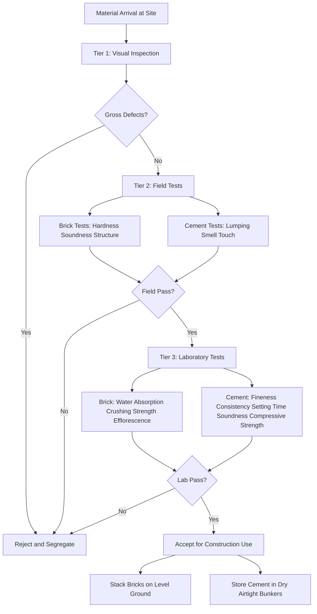
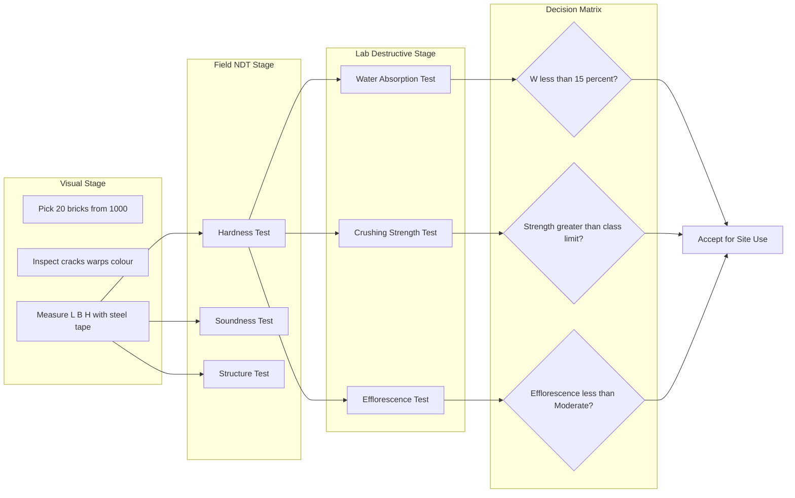
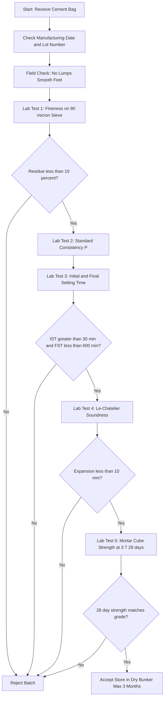
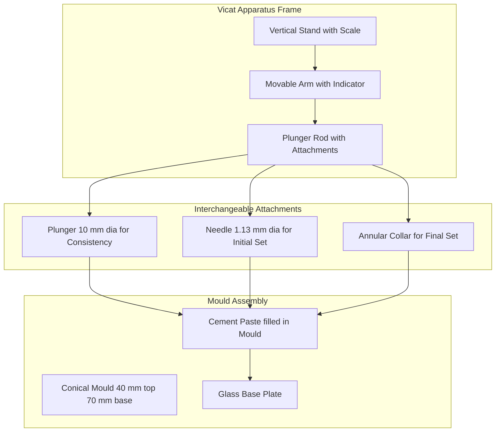
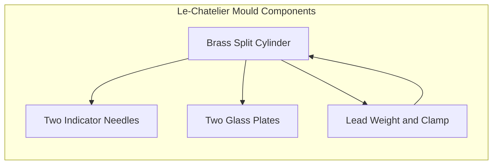
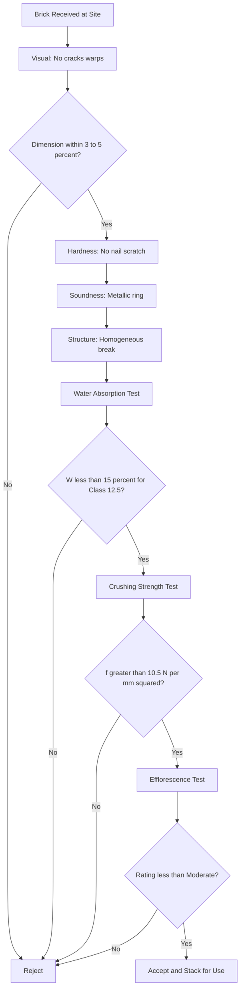
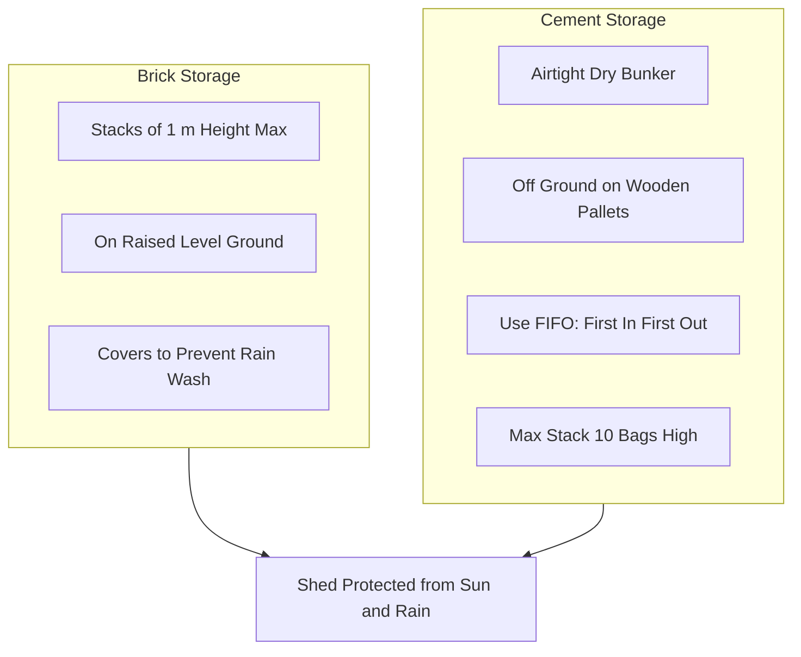

# Onsite quality assessment of brick, and cement

<!-- SECTION_1_START -->
# MODULE 19: ONSITE QUALITY ASSESSMENT OF BRICK AND CEMENT

## 1. Core Technical Definition & Intuitive Overview

### 1.1 Formal Definition (KTU 2024 Syllabus Terminology)

**Onsite Quality Assessment of Brick and Cement** refers to the systematic series of standardized field and laboratory tests performed on construction materials (clay bricks and Portland cement) at the project site to verify their conformity with the relevant Indian Standard (IS) codes prior to their use in load-bearing and non-load-bearing structural elements.

For **Bricks**: The assessment is governed primarily by **IS 1077:1992** (Common Burnt Clay Building Bricks – Specification) and **IS 3495 (Parts 1 to 4):1992** (Methods of Tests of Burnt Clay Building Bricks).

For **Cement**: The assessment is governed by **IS 4031 (Parts 1 to 15)** (Methods of Physical Tests for Hydraulic Cement) and **IS 269 / IS 8112 / IS 12269** depending on the grade of ordinary Portland cement (OPC 33, 43, or 53).

> [!IMPORTANT]
> **KTU Syllabus Highlight:** Quality assessment in the workshop module is a *practical hands-on competency*, not just theoretical knowledge. Students are expected to physically conduct tests, read instruments, and report numerical observations with units.

### 1.2 Conceptual Analogy / Intuitive Building

Imagine you are a **doctor diagnosing a patient** before prescribing medicine. Just as a doctor checks **blood pressure, pulse, and temperature** before treatment, a civil engineer checks **strength, shape, and soundness** of bricks and **fineness, setting time, and soundness** of cement *before* allowing them into a building.

> **Real-world analogy:**
> - A **brick** is like a **soldier's body armor** — it must resist water (water absorption), must not crumble under load (crushing strength), and must not show white salt patches (efflorescence).
> - **Cement** is like the **glue in a sandwich** — it must be finely ground (fineness), must not set too fast or too slow (setting time), and must not crack after hardening (soundness).

### 1.3 The Two-Material Quality Framework

The onsite assessment workflow follows a **three-tier check** for every batch of material received at site:

| Tier | Check Type | Purpose | When Performed |
|------|-----------|---------|----------------|
| **Tier 1** | Visual / Dimensional Inspection | Reject grossly defective units | On unloading |
| **Tier 2** | Field / NDT Tests | Quick functional checks | On stacking |
| **Tier 3** | Laboratory Tests (quantitative) | Final acceptance / rejection | Before bulk use |

> [!NOTE]
> **Standard Metric Highlight:** First-class bricks must have a **crushing strength $\geq 10.5 \text{ N/mm}^2$** (105 kg/cm²), and OPC 53 grade cement must achieve a **compressive strength of $53 \text{ N/mm}^2$** at **28 days** of curing.

### 1.4 Classification Standards at a Glance

**Bricks (IS 1077:1992) — Strength-based Classes:**

$$\text{Class Designation} \;=\; \text{Average Wet Compressive Strength (N/mm}^2\text{)}$$

Classes include: $3.5,\; 5.0,\; 7.0,\; 10.0,\; 12.5,\; 15.0,\; 20.0,\; 25.0,\; 30.0,\; 35.0,\; 40.0$

**Cement (IS 269 / 8112 / 12269) — Strength Grades:**

$$\text{Grade} = \text{28-day compressive strength of cement mortar cube (N/mm}^2\text{)}$$

Available grades: OPC **33**, OPC **43**, OPC **53**, PPC (Pozzolana Portland Cement), PSC (Portland Slag Cement).

> [!VISUALIZATION CONTROL]
> **Concept:** Strength-vs-Grade Positioning Map for Bricks vs. Cement
> **Sketch Coordinate Logic (draw on graph paper):**
> - X-axis: Material Age in Days → 0, 3, 7, 14, 28, 56, 90
> - Y-axis: Compressive Strength in N/mm² → 0 to 60
> - Plot Brick Class 10 curve: Flat line at $y = 10.5$ from day 7 onwards
> - Plot OPC 53 curve: Rising curve passing through $y \approx 27$ at day 3, $y \approx 37$ at day 7, $y = 53$ at day 28
> **Visual Description:** Students should observe that the cement curve rises steeply while the brick curve is nearly horizontal — this shows cement *gains* strength over time, while brick strength is essentially *fixed at the kiln* and depends on its firing quality.
<!-- SECTION_1_END -->

<!-- SECTION_2_START -->
# 2. Deep Theoretical Analysis & KTU High-Yield Formula Sheet

## 2.1 Quality Assessment of BRICKS — Theory & Tests

A burnt clay brick is a masonry unit made by shaping moist clay, drying it, and firing it in a kiln. Its suitability is judged by **seven classical field tests** (some are visual, some are NDT, and one is a destructive compression test).

### 2.1.1 Test 1 — Visual & Dimensional Inspection

**Operational Logic:**
1. Pick 20 bricks at random from a stack of 1000 (IS sampling rule).
2. Inspect for cracks, chips, warping, and uniform color (deep cherry red / copper = well-burnt).
3. Measure length, width, and height with a **steel tape** (accuracy 1 mm).
4. Compare with the **nominal modular size**: $200 \text{ mm} \times 100 \text{ mm} \times 100 \text{ mm}$ (with mortar allowance: $200 \times 100 \times 100$ actual + 10 mm mortar joint).
5. Compute dimensional tolerance.

$$\text{Tolerance} = \pm\, 3\% \text{ to } \pm\, 5\% \text{ of nominal dimension}$$

### 2.1.2 Test 2 — Water Absorption Test (IS 3495 Part 2)

**Operational Logic:**
1. Dry the brick in a ventilated oven at $105°\text{C}$ to $110°\text{C}$ until constant mass $W_1$ is reached.
2. Immerse the brick completely in clean water at $15°\text{C}$ to $30°\text{C}$ for **24 hours**.
3. Remove, wipe with a damp cloth, and weigh as $W_2$.

$$\text{Water Absorption (\%)} = \frac{W_2 - W_1}{W_1} \times 100$$

**Acceptance Criteria (IS 1077):**

| Brick Class | Max Water Absorption |
|-------------|---------------------|
| Class 12.5 and above | $\leq 15\%$ |
| Class 7.0 to 10.0 | $\leq 20\%$ |
| Class 5.0 and below | No limit specified (but practically $\leq 25\%$) |

> **Real-world utility:** High water absorption → porous brick → weak mortar bond → efflorescence → wall dampness in monsoon.

### 2.1.3 Test 3 — Hardness Test (Scratch Test)

**Operational Logic:**
1. Hold the brick firmly.
2. Attempt to scratch the surface with a **fingernail** (soft test) and then with a **steel nail / penknife** (hard test).
3. A good brick leaves **no impression** when scratched by a fingernail and **no deep scratch** under a nail.

> No numerical formula — this is a *qualitative* field test.

### 2.1.4 Test 4 — Soundness Test (Ringing Test)

**Operational Logic:**
1. Strike two bricks together gently.
2. A well-burnt brick produces a **clear metallic ringing sound**.
3. An over-burnt or under-burnt brick produces a **dull thud**.

> [!IMPORTANT]
> This is a **quick rejection tool** used by masons at the site before stacking.

### 2.1.5 Test 5 — Structure Test (Breakage Examination)

**Operational Logic:**
1. Break a brick with a hammer.
2. Examine the broken cross-section.
3. **Acceptance criteria:**
   - **Homogeneous, dense, compact structure** → pass.
   - **Visible holes, lumps of lime, or granular patches** → fail (presence of un-slaked lime causes "lime blowing" later).

### 2.1.6 Test 6 — Crushing Strength / Compressive Strength Test (IS 3495 Part 1)

**Operational Logic:**
1. Immerse the brick in water for **24 hours**.
2. Remove and fill the frog (top depression) and any surface voids with **1:1 cement-sand mortar**.
3. Allow the mortar to set, then place the brick **flat** (frog upward) between the platens of a **Compression Testing Machine (CTM)**.
4. Apply axial load at a uniform rate of approximately **$14 \text{ N/mm}^2$ per minute** until failure.
5. Record the maximum load $P$ at fracture.

$$\text{Crushing Strength} = \frac{P}{A}$$

where $A = \text{bed area} = L \times B$ of the brick.

| Brick Class | Min. Crushing Strength (N/mm²) |
|-------------|------------------------------|
| Class 5.0 | 5.0 |
| Class 7.0 | 7.0 |
| Class 10.0 | 10.0 |
| Class 12.5 | 12.5 |
| Class 15.0 | 15.0 |

### 2.1.7 Test 7 — Efflorescence Test (IS 3495 Part 3)

**Operational Logic:**
1. Place the brick vertically in a shallow tray of distilled water with one end immersed to a depth of **25 mm to 30 mm** in a well-ventilated room.
2. Allow the entire setup to dry naturally (room temperature $20°\text{C}$ to $30°\text{C}$).
3. After complete drying, examine the brick surface for whitish salt deposits.
4. Rate as **Nil, Slight, Moderate, Heavy, or Serious** per the IS rating table.

> **Real-world utility:** Efflorescence indicates soluble salts (sulphates of sodium, potassium, magnesium, calcium) → masonry staining → paint failure.

---

## 2.2 Quality Assessment of CEMENT — Theory & Tests

Cement is the **binding agent** in mortar and concrete. Its quality at site is judged by **field-friendly** as well as **mini-lab** tests. The most important are consistency, setting time, fineness, soundness, and compressive strength.

### 2.2.1 Test 1 — Fineness Test (IS 4031 Part 1) — Sieve Method

**Operational Logic:**
1. Weigh **$W = 100 \text{ g}$** of dry cement.
2. Place it on a **$90 \text{ µm}$ IS Sieve** (sieve No. 9).
3. Shake the sieve manually for **15 minutes** with gentle tapping.
4. Weigh the residue left on the sieve as $R$.

$$\text{Fineness (\% retained)} = \frac{R}{W} \times 100$$

$$\text{Specific Surface (Blaine) } \approx 225 \text{ to } 325 \text{ m}^2/\text{kg (for OPC)}$$

**Acceptance:** Residue on $90 \text{ µm}$ sieve $\leq 10\%$ for OPC 53.

> **Engineering Why:** Finer cement → greater surface area → faster hydration → higher early strength, but more heat of hydration → thermal cracking risk in mass concrete.

### 2.2.2 Test 2 — Standard Consistency Test (IS 4031 Part 4) — Vicat Apparatus

**Operational Logic:**
1. Take **$400 \text{ g}$** of cement and mix with **$0.85 P \times 400 / 100 \text{ g}$** of water, where $P$ is the assumed percentage of water.
2. Fill the **Vicat mould** (conical frustum, $40 \text{ mm}$ top, $70 \text{ mm}$ base, $50 \text{ mm}$ height) with the paste.
3. Lower the **Vicat plunger** (10 mm dia., 50 mm long) until it touches the paste surface.
4. Release it. The plunger must penetrate to a depth of **$33 \text{ mm}$ to $35 \text{ mm}$** from the top.
5. The percentage of water that achieves this depth is the **Standard Consistency** ($P$).

$$P = \frac{\text{Weight of water added}}{\text{Weight of cement}} \times 100$$

Typical value: **$P \approx 25\%$ to $35\%$**.

### 2.2.3 Test 3 — Initial and Final Setting Time (IS 4031 Part 5)

**Operational Logic:**
1. Prepare a cement paste at **$0.85 P$** consistency (the water required for setting time tests is $0.85 \times P$).
2. Fill Vicat mould, then:
   - For **Initial Setting Time**: Use a **Vicat needle of $1.13 \text{ mm}$ diameter, 50 mm long**. Note the time when the needle penetrates to a depth of **$33 \text{ mm}$ to $35 \text{ mm}$** from the top.
   - For **Final Setting Time**: Use an **annular collar attachment**. Note the time when the needle makes an impression on the paste but the annular collar **fails to do so**.

**Acceptance (IS 269 / 8112 / 12269):**

| Property | OPC 33 | OPC 43 | OPC 53 |
|----------|--------|--------|--------|
| Initial Setting Time | $\geq 30 \text{ min}$ | $\geq 30 \text{ min}$ | $\geq 30 \text{ min}$ |
| Final Setting Time | $\leq 600 \text{ min}$ | $\leq 600 \text{ min}$ | $\leq 600 \text{ min}$ |

> **Real-world utility:** If initial set is too fast → concrete stiffens before placement → cold joints. If too slow → formwork stripping delayed → project delay.

### 2.2.4 Test 4 — Soundness Test (IS 4031 Part 3) — Le-Chatelier Method

**Operational Logic:**
1. Prepare a cement paste at **$0.78 P$** consistency.
2. Fill the **Le-Chatelier mould** (split brass cylinder, $30 \text{ mm} \times 30 \text{ mm}$) and measure the initial distance between the two needle tips as $L_1$.
3. Submerge the mould in water at $20°\text{C}$ to $30°\text{C}$ for **24 hours**.
4. Remove, measure distance as $L_2$.
5. Boil the mould in water for **3 hours**, cool to room temperature, measure as $L_3$.

$$\text{Soundness (Expansion)} = L_3 - L_1$$

**Acceptance:** Expansion $\leq 10 \text{ mm}$ for OPC of all grades.

> **Engineering Why:** Soundness detects **uncombined free lime (CaO) and magnesia (MgO)** in cement. These oxides hydrate and expand *after* concrete has hardened, causing internal stresses and cracks (called "unsoundness cracks").

### 2.2.5 Test 5 — Compressive Strength Test (IS 4031 Part 6) — Mortar Cube

**Operational Logic:**
1. Prepare **$70.6 \text{ mm}$ cube moulds** (giving a cross-sectional area of $5000 \text{ mm}^2$).
2. Use cement : standard sand : water ratio of **$1 : 3 : \frac{P}{4} + 0.5$** (or per IS standard).
3. Compact using a **vibrating machine** for 2 minutes.
4. Cure cubes in water for **$24 \text{ hours}$**, then de-mould and continue curing until test age.
5. Test in CTM at loading rate of **$350 \text{ N/s}$ to $700 \text{ N/s}$**.

$$\text{Compressive Strength} = \frac{\text{Maximum Load}}{\text{Cross-sectional Area}} = \frac{P}{5000} \text{ N/mm}^2$$

| Grade | 3-day strength (N/mm²) | 7-day strength (N/mm²) | 28-day strength (N/mm²) |
|-------|----------------------|------------------------|--------------------------|
| OPC 33 | $\geq 16$ | $\geq 22$ | $\geq 33$ |
| OPC 43 | $\geq 23$ | $\geq 33$ | $\geq 43$ |
| OPC 53 | $\geq 27$ | $\geq 37$ | $\geq 53$ |

---

## 2.3 KTU High-Yield Formula Sheet (Combined)

| # | Material | Test Name | Key Formula | Unit | IS Code |
|---|----------|-----------|-------------|------|---------|
| 1 | Brick | Water Absorption | $\% W = \frac{W_2 - W_1}{W_1} \times 100$ | % | IS 3495 P-2 |
| 2 | Brick | Crushing Strength | $f_b = \frac{P}{L \times B}$ | N/mm² | IS 3495 P-1 |
| 3 | Cement | Fineness | $\%R = \frac{R}{W} \times 100$ | % | IS 4031 P-1 |
| 4 | Cement | Standard Consistency | $P = \frac{W_w}{W_c} \times 100$ | % | IS 4031 P-4 |
| 5 | Cement | Soundness (Le-Chatelier) | $\Delta L = L_3 - L_1$ | mm | IS 4031 P-3 |
| 6 | Cement | Compressive Strength | $f_c = \frac{P}{5000}$ | N/mm² | IS 4031 P-6 |
| 7 | Brick | Density (Apparent) | $\rho = \frac{M}{L \times B \times H}$ | kg/m³ | IS 3495 P-1 |

> [!NOTE]
> **Memory Trick (for KTU exam):** For bricks remember **"WAS HSS EC"** — **W**ater absorption, **A**ppearance, **S**tructure, **H**ardness, **S**oundness, **S**trength, **E**fflorescence, **C**ompressive. For cement remember **"FiCoSeStStCo"** — **Fi**neness, **Co**nsistency, **Se**tting time, **St**rength, **St**rength (compressive), **Co**mpressive.

---

## 2.4 Engineering Real-World Utility

| Field Application | Why this Assessment Matters |
|------------------|----------------------------|
| Load-bearing residential walls | Low-strength bricks → wall collapse under roof load |
| High-rise RCC frames | Sound cement → durable columns, beams, slabs |
| Marine / coastal construction | Low water absorption bricks resist chloride ingress |
| Precast concrete industries | High early strength (OPC 53) accelerates de-moulding |
| Plastering works | Fineness of cement decides surface smoothness |
| Mass concrete dams | Low-heat cement (PPC) prevents thermal cracking — checked by soundness & consistency |
| Highway / pavement quality control | Cube strength ensures concrete durability under traffic load |
| Heritage restoration | Brick matching depends on dimensional tolerance and colour uniformity |
<!-- SECTION_2_END -->

<!-- SECTION_3_START -->
# 3. Step-by-Step Derivations, Numerical Solutions & Procedure Implementation

> **Since this is a Workshop / Practical module, this section provides exhaustive step-by-step field test procedures, sample numerical problems with full model solutions, and operational tables for instruments, materials, and safety.**

## 3.1 SAMPLE PROBLEM 1 — Brick Water Absorption Calculation

**Problem Statement (KTU-Style):**
A brick specimen is dried in an oven and weighed as **$2.85 \text{ kg}$**. After 24 hours of complete immersion in water, the wet weight is found to be **$3.12 \text{ kg}$**. Determine the water absorption percentage and comment on the suitability of the brick for Class 12.5 work (IS 1077 acceptance limit: $\leq 15\%$).

**Step 1 — Identify the given data.**
- Dry weight of brick: $W_1 = 2.85 \text{ kg}$
- Wet weight after 24 h immersion: $W_2 = 3.12 \text{ kg}$

**Step 2 — Write the governing formula (IS 3495 Part 2).**

$$\text{Water Absorption (\%)} = \frac{W_2 - W_1}{W_1} \times 100$$

**Step 3 — Substitute the numerical values.**

$$\text{Water Absorption (\%)} = \frac{3.12 - 2.85}{2.85} \times 100$$

**Step 4 — Compute the numerator (mass of water absorbed).**

$$3.12 - 2.85 = 0.27 \text{ kg}$$

**Step 5 — Divide by dry mass.**

$$\frac{0.27}{2.85} = 0.09473\ldots$$

**Step 6 — Multiply by 100 to obtain percentage.**

$$0.09473 \times 100 = 9.473\% \;\approx\; 9.47\%$$

**Step 7 — Compare with IS 1077 acceptance criterion for Class 12.5.**

$$\text{Observed } (9.47\%) \;<\; \text{Limit } (15\%) \quad \Rightarrow \quad \text{Acceptable}$$

**Final Answer:** Water absorption $= 9.47\%$. The brick **passes** the criterion for Class 12.5 work.

> **Valuation Key:** '[Writing formula: 1 Mark] [Substitution: 1 Mark] [Final value with unit: 1 Mark]'

---

## 3.2 SAMPLE PROBLEM 2 — Brick Crushing Strength Calculation

**Problem Statement (KTU-Style):**
A brick of dimensions $200 \text{ mm} \times 100 \text{ mm} \times 100 \text{ mm}$ is tested in a CTM. The maximum load at failure is recorded as **$220 \text{ kN}$**. Compute the crushing strength and identify the class of brick as per IS 1077.

**Step 1 — Identify data.**
- Length $L = 200 \text{ mm}$
- Breadth $B = 100 \text{ mm}$
- Maximum load $P = 220 \text{ kN} = 220{,}000 \text{ N}$

**Step 2 — Write governing formula.**

$$f_b = \frac{P}{L \times B}$$

**Step 3 — Compute the bed area.**

$$A = 200 \times 100 = 20{,}000 \text{ mm}^2$$

**Step 4 — Substitute load in Newtons.**

$$f_b = \frac{220{,}000 \text{ N}}{20{,}000 \text{ mm}^2}$$

**Step 5 — Perform division.**

$$f_b = 11.0 \text{ N/mm}^2$$

**Step 6 — Map to IS 1077 class.**

Since $f_b = 11.0 \text{ N/mm}^2 \geq 10.0 \text{ N/mm}^2$ but $< 12.5 \text{ N/mm}^2$, the brick belongs to **Class 10.0** (the nearest lower class).

**Final Answer:** Crushing strength $= 11.0 \text{ N/mm}^2$. Brick class: **Class 10.0**.

---

## 3.3 SAMPLE PROBLEM 3 — Cement Fineness Calculation

**Problem Statement:**
$100 \text{ g}$ of cement is sieved through a $90 \text{ µm}$ IS sieve for 15 minutes. The residue retained on the sieve weighs **$7.8 \text{ g}$**. Calculate the fineness of cement and state whether OPC 53 grade acceptance is satisfied.

**Step 1 — Data.**
- Initial weight $W = 100 \text{ g}$
- Residue weight $R = 7.8 \text{ g}$

**Step 2 — Formula.**

$$\text{Fineness (\% retained)} = \frac{R}{W} \times 100$$

**Step 3 — Substitute.**

$$\text{Fineness} = \frac{7.8}{100} \times 100 = 7.8\%$$

**Step 4 — Compare with acceptance.**
$$\text{OPC 53 limit: } \leq 10\% \text{ retained} \quad \Rightarrow \quad 7.8\% < 10\% \quad \Rightarrow \quad \textbf{Pass}$$

**Final Answer:** Fineness $= 7.8\%$ retained. Cement is acceptable for OPC 53 use.

---

## 3.4 SAMPLE PROBLEM 4 — Cement Standard Consistency & Setting Time

**Problem Statement (Two-Part):**

**Part (a):** A Vicat plunger test for standard consistency gave the following data:

| Trial | Cement (g) | Water (mL) | Plunger Penetration (mm from top) |
|-------|-----------|-----------|----------------------------------|
| 1 | 400 | 110 | 40 (too high — paste too stiff) |
| 2 | 400 | 130 | 28 (too low — paste too wet) |
| 3 | 400 | 120 | 34 (✓ within 33–35 mm) |

Determine the **percentage of water for standard consistency ($P$)**.

**Part (b):** If the cement at $0.85P$ consistency had its **initial setting time** noted as 95 minutes and **final setting time** as 360 minutes, check whether the cement meets IS 269 / 8112 / 12269 specifications for OPC 43.

**Solution to Part (a):**

Step 1 — Use Trial 3 (which satisfies the 33–35 mm criterion).
Step 2 — Water for 400 g cement = $120 \text{ mL} = 120 \text{ g}$ (assuming density of water $= 1 \text{ g/mL}$).
Step 3 — Apply formula:

$$P = \frac{W_w}{W_c} \times 100 = \frac{120}{400} \times 100 = 30\%$$

**Final Answer (a):** Standard consistency $P = 30\%$.

**Solution to Part (b):**

Step 1 — Water for setting time test $= 0.85 \times 30\% = 25.5\%$.
Step 2 — Compare observations with IS 8112 (OPC 43):

$$\text{Initial: } 95 \text{ min} \geq 30 \text{ min} \quad \checkmark$$
$$\text{Final: } 360 \text{ min} \leq 600 \text{ min} \quad \checkmark$$

**Final Answer (b):** Cement **passes** the setting time requirements of OPC 43.

---

## 3.5 SAMPLE PROBLEM 5 — Cement Compressive Strength of Mortar Cube

**Problem Statement:**
A standard cement mortar cube of size $70.6 \text{ mm}$ (cross-section $5000 \text{ mm}^2$) was tested in a CTM at 28 days. The maximum load at failure was **$265 \text{ kN}$**. Calculate the compressive strength and identify the cement grade.

**Step 1 — Data.**
- Load $P = 265 \text{ kN} = 265{,}000 \text{ N}$
- Area $A = 5000 \text{ mm}^2$

**Step 2 — Formula.**

$$f_c = \frac{P}{A}$$

**Step 3 — Substitute and compute.**

$$f_c = \frac{265{,}000}{5000} = 53.0 \text{ N/mm}^2$$

**Step 4 — Grade identification.**
$$f_c = 53 \text{ N/mm}^2 \quad \Rightarrow \quad \textbf{OPC 53 Grade}$$

**Final Answer:** Compressive strength $= 53.0 \text{ N/mm}^2$. Cement qualifies as **OPC 53**.

---

## 3.6 Complete Brick Testing — Workshop Operational Procedure

| Step | Operation | Tool / Equipment | Specification | Safety Note |
|------|-----------|-----------------|---------------|-------------|
| 1 | Sample selection | Random picker | 20 bricks per 1000 stack | Wear cut-resistant gloves |
| 2 | Visual inspection | Naked eye / hand lens | Check cracks, warps, colour | Use dust mask |
| 3 | Dimension measurement | Steel tape, vernier caliper | Accuracy $\pm 1 \text{ mm}$ | — |
| 4 | Hardness test | Steel nail / penknife | Apply firm stroke | Keep hands away from chip path |
| 5 | Soundness test | Two bricks struck together | Ringing tone = pass | Use ear protection in noisy site |
| 6 | Structure test | Hammer | Strike one firm blow | Wear safety goggles |
| 7 | Water absorption | Drying oven, immersion tank, weighing balance | $105°\text{C}$ to $110°\text{C}$ | Avoid touching hot oven trays |
| 8 | Crushing strength | Compression Testing Machine (CTM) | Capacity $\geq 2000 \text{ kN}$ | Stand behind guard shield during test |
| 9 | Efflorescence | Distilled water tray | 25–30 mm immersion | Avoid skin contact with salts |

---

## 3.7 Complete Cement Testing — Workshop Operational Procedure

| Test | Apparatus Used | Calibration Frequency | Reading Precision | Critical Safety |
|------|----------------|----------------------|-------------------|-----------------|
| Fineness | $90 \text{ µm}$ IS Sieve, sieve shaker | Every 100 uses | $\pm 0.1 \text{ g}$ | Wear respirator — cement is alkaline |
| Consistency | Vicat apparatus with plunger | Annually (NABL) | $\pm 0.5 \text{ mm}$ | Wash skin immediately on contact |
| Setting time | Vicat with needle & annular collar | Annually | $\pm 1 \text{ min}$ | Use stopwatch in safe area |
| Soundness | Le-Chatelier mould, water bath | Annually | $\pm 0.5 \text{ mm}$ | Boiling water — use tongs, never bare hands |
| Compressive strength | CTM, cube moulds $70.6 \text{ mm}$, vibrator, curing tank | Annually | $\pm 1 \text{ kN}$ | Stay behind protective screen during loading |
| Specific gravity | Le-Chatelier flask / density bottle | Annually | $\pm 0.01$ | Kerosene is flammable — keep away from flame |

---

## 3.8 Comparative Analysis: Brick vs Cement (Tabular Insight)

| Parameter | Brick | Cement |
|-----------|-------|--------|
| Binding role | Masonry unit (no binding) | Binder (paste that hardens) |
| Primary raw material | Clay + water + fire | Limestone + clay + gypsum |
| Governing IS code | IS 1077, IS 3495 | IS 269, 8112, 12269, 4031 |
| Key strength test | Crushing strength (destructive) | Mortar cube test (destructive) |
| Typical strength | $5$ to $40 \text{ N/mm}^2$ | $33$ to $53 \text{ N/mm}^2$ |
| Water-related test | Water absorption (24 h) | Standard consistency ($P$ test) |
| Soundness indicator | Ringing test (acoustic) | Le-Chatelier expansion (dimensional) |
| Time to final strength | Fixed at kiln (no further gain) | Gains strength over 28+ days |
| Storage requirement | Stack on firm ground, cover | Dry, airtight, off-ground storage (max 3 months) |
<!-- SECTION_3_END -->

<!-- SECTION_4_START -->
# 4. Structural Diagrams & Schematics

> **Mermaid Compliance:** All node IDs are alphanumeric, all labels with special characters are double-quoted, and nested subgraphs are used for modular clarity. No Mermaid reserved words (e.g., `end`, `subgraph`, `graph`, `style`) are used as standalone node IDs.

## 4.1 Overall Onsite Quality Assessment Workflow

## 4.2 Brick Testing Topology Matrix

## 4.3 Cement Testing Sequential Topology

## 4.4 Vicat Apparatus Functional Architecture (Block Diagram)

## 4.5 Le-Chatelier Mould Assembly

## 4.6 Complete Decision Tree — Brick Acceptance

## 4.7 Storage Best Practice Diagram

<!-- SECTION_4_END -->

<!-- SECTION_5_START -->
# 5. KTU 2024 Scheme Examination Question Bank & Topic Recap

## 5.1 PART A — Short Answer Questions (3 Marks Each)

> **Cognitive Levels:** Remember / Understand

### Question 1 (3 Marks)
**[KTU University Exam - December 2023]**
**CO1 | Remember**

**Q:** Define the term "standard consistency" of cement. Name the apparatus used to determine it and state the acceptance criterion for plunger penetration.

**Model Answer:**
Standard consistency of cement is defined as the **percentage of water required to make a cement paste such that the Vicat plunger (10 mm diameter) penetrates to a depth of **$33 \text{ mm}$ to $35 \text{ mm}$** from the top of the Vicat mould**. The apparatus used is the **Vicat apparatus**. The penetration depth criterion is fixed to ensure a uniform workability reference for setting time and soundness tests.

> **Valuation Key:** '[Definition: 1 Mark] [Apparatus: 1 Mark] [Acceptance: 1 Mark]'

### Question 2 (3 Marks)
**[KTU University Exam - July 2024]**
**CO2 | Understand**

**Q:** What is efflorescence in bricks? State any two causes and one preventive measure.

**Model Answer:**
Efflorescence is the **white crystalline deposit of soluble salts (sulphates of Na, K, Ca, Mg) that appears on the surface of a brick** when the salts migrate outwards with evaporating water.
**Two causes:**
1. Presence of soluble salts in the clay used for brick-making.
2. Absorption of groundwater carrying dissolved salts followed by evaporation.
**Preventive measure:** Ensuring proper **vitrification (firing above $1000°\text{C}$)** and using bricks of low water absorption ($< 15\%$).

> **Valuation Key:** '[Definition: 1 Mark] [Causes: 1 Mark] [Prevention: 1 Mark]'

---

## 5.2 PART B — Long Answer Questions (14 Marks Each) — Internal Choice

### Question A (14 Marks)
**[KTU University Exam - December 2023]**
**CO1, CO2 | Understand + Apply**

**Q:** With the help of a neat diagram, describe the procedure to determine the **compressive (crushing) strength of bricks** as per IS 3495 (Part 1). A brick of size $200 \text{ mm} \times 100 \text{ mm} \times 100 \text{ mm}$ failed under a load of **$210 \text{ kN}$**. Calculate its crushing strength and identify its IS 1077 class.

#### (a) Procedure with Diagram (7 Marks)

**Model Answer:**

**Apparatus Required:** Compression Testing Machine (CTM), cement mortar (1:1), steel tape, weighing balance, water curing tank.

**Step-by-Step Procedure:**

1. **Sample preparation:** Select 5 bricks at random, free from visible defects.
2. **Immersion:** Immerse the bricks in clean water at room temperature for **24 hours**.
3. **Frog filling:** Remove and wipe the bricks. Fill the frog (top depression) and any surface voids with **1:1 cement-sand mortar**. Allow the mortar to set for 24 hours.
4. **Positioning:** Place the brick **flat** (largest face as bed area, frog upward, mortar side on the platen) in the CTM between two plywood sheets (3 mm thick) to distribute load uniformly.
5. **Loading:** Apply axial compressive load **gradually and uniformly** at a rate of approximately **$14 \text{ N/mm}^2$ per minute** (i.e., about $28{,}000 \text{ N/min}$ for a $200 \times 100$ brick) until the brick fails.
6. **Record:** Note the **maximum load at failure** in kN.
7. **Repeat:** Test all 5 specimens; report the **average** crushing strength.

**Diagram Reference (drawn in exam):**
A simple rectangular block placed between the upper and lower platens of the CTM, with arrows indicating uniform axial load. Plywood sheets shown between brick and platens.

> **Valuation Key:** '[Apparatus: 1 Mark] [Sample prep: 2 Marks] [CTM operation: 2 Marks] [Diagram: 2 Marks]'

#### (b) Numerical Calculation (7 Marks)

**Given:**
- Brick size: $L = 200 \text{ mm},\; B = 100 \text{ mm},\; H = 100 \text{ mm}$
- Failure load: $P = 210 \text{ kN} = 210{,}000 \text{ N}$

**Step 1 — Bed Area.**
$$A = L \times B = 200 \times 100 = 20{,}000 \text{ mm}^2$$

**Step 2 — Crushing Strength.**
$$f_b = \frac{P}{A} = \frac{210{,}000 \text{ N}}{20{,}000 \text{ mm}^2} = 10.5 \text{ N/mm}^2$$

**Step 3 — Class Identification (IS 1077).**
Since $f_b = 10.5 \text{ N/mm}^2 \geq 10.0$ but $< 12.5$, the brick belongs to **Class 10.0** of IS 1077.

> **Valuation Key:** '[Area calc: 2 Marks] [Strength calc: 3 Marks] [Class identification with logic: 2 Marks]'

> [!WARNING]
> **KTU Examiner's Pitfall Callout:** Many students write the answer in **kg/cm²** instead of **N/mm²**. Conversion: $1 \text{ N/mm}^2 \approx 10.2 \text{ kg/cm}^2$. If the question expects N/mm², the answer **must** be in N/mm². Also, do **not** confuse Class 10.0 ($10.0 \text{ N/mm}^2$) with Class 12.5 ($12.5 \text{ N/mm}^2$) — round *down* to the next standard class.

---

### Question B (14 Marks) — Alternative Choice
**[KTU University Exam - July 2024]**
**CO1, CO2 | Understand + Apply**

**Q:** Explain the **fineness test of cement** as per IS 4031 (Part 1). A cement sample weighing $100 \text{ g}$ was sieved through a $90 \text{ µm}$ IS sieve and the residue left on the sieve was found to be **$4.5 \text{ g}$**. Calculate the fineness and comment on its suitability for OPC 53.

#### (a) Theoretical Explanation (7 Marks)

**Model Answer:**

**Aim:** To determine the fineness of cement by the dry sieving method.

**Apparatus:** $90 \text{ µm}$ IS sieve (sieve No. 9), weighing balance (accuracy $0.001 \text{ g}$), sieve shaker, nylon brush.

**Significance:** Fineness affects the **rate of hydration**, **early strength gain**, **workability**, and **heat of hydration**. Finer cement has greater specific surface area, leading to faster strength development but also greater drying shrinkage.

**Procedure:**
1. Weigh **$W = 100 \text{ g}$** of dry cement accurately.
2. Place the cement on a **$90 \text{ µm}$ IS sieve** (which has 90 micron openings).
3. Cover the sieve with a lid and shake it **gently by hand for 15 minutes**, occasionally tapping the sides of the sieve to dislodge trapped particles.
4. After 15 minutes, weigh the **residue retained on the sieve** as $R$.
5. The fineness is expressed as the percentage residue.

**Acceptance Criterion:** For OPC 53, the residue on the $90 \text{ µm}$ sieve should **not exceed 10%** of the original weight (as per IS 269/8112/12269).

> **Valuation Key:** '[Aim + significance: 2 Marks] [Apparatus: 1 Mark] [Procedure: 3 Marks] [Acceptance: 1 Mark]'

#### (b) Numerical Solution (7 Marks)

**Given:**
- Initial weight: $W = 100 \text{ g}$
- Residue weight: $R = 4.5 \text{ g}$

**Step 1 — Write the governing formula.**

$$\text{Fineness (\% retained)} = \frac{R}{W} \times 100$$

**Step 2 — Substitute.**

$$\text{Fineness} = \frac{4.5}{100} \times 100 = 4.5\%$$

**Step 3 — Compare with acceptance.**

$$\text{Observed } (4.5\%) \;\leq\; \text{Limit } (10\%) \quad \Rightarrow \quad \textbf{Suitable for OPC 53}$$

**Step 4 — Engineering interpretation.**
A fineness of 4.5% indicates the cement is well-ground with a high specific surface area ($\approx 300 \text{ m}^2/\text{kg}$), which means **faster strength development** and **better early workability**.

> **Valuation Key:** '[Formula: 2 Marks] [Substitution + value: 3 Marks] [Comparison + conclusion: 2 Marks]'

> [!WARNING]
> **KTU Examiner's Pitfall Callout:** Students often **forget to express the answer as percentage** and simply write "4.5 g" or "4.5/100" without the multiplication step. Always show the full **formula → substitution → arithmetic → comparison** chain. Also, **do not confuse** "percentage retained" with "percentage passing" — they are complementary: % passing $= 100 - 4.5 = 95.5\%$.

---

## 5.3 ADDITIONAL PRACTICE PROBLEMS (For Self-Study)

### Quick Numericals (3 Marks each)

| # | Problem | Answer |
|---|---------|--------|
| 1 | A brick weighs $2.5 \text{ kg}$ dry and $2.95 \text{ kg}$ wet. Find water absorption. | $18\%$ — Fails for Class 12.5 |
| 2 | A brick fails at $250 \text{ kN}$. Size is $200 \times 100 \times 100 \text{ mm}$. Find class. | $12.5 \text{ N/mm}^2$ → Class 12.5 |
| 3 | Cement residue on $90 \text{ µm}$ sieve is $6 \text{ g}$ from $100 \text{ g}$. Find fineness. | $6\%$ → Passes OPC 53 |
| 4 | Vicat plunger penetration is $34 \text{ mm}$ for $400 \text{ g}$ cement with $120 \text{ mL}$ water. Find $P$. | $P = 30\%$ |
| 5 | Initial set time observed is $45 \text{ min}$, final set is $420 \text{ min}$. Pass for OPC 43? | Yes, both within limits |

---

## 5.4 KTU Examiner's General Valuation Warnings

> [!WARNING]
> **Common Pitfalls in Brick and Cement Quality Assessment Questions:**
> 1. **Unit Errors:** Forgetting to convert kN → N before dividing by mm². Always use **N and mm²** for N/mm².
> 2. **Class Confusion:** Students write the *numerical value* of strength as the *class name*. Class 10.0 means a strength of 10.0 N/mm², not a literal "10".
> 3. **Formula Omission:** KTU board examiners often deduct 1 mark if the governing formula is not explicitly written.
> 4. **Sign Convention in Le-Chatelier:** Always report soundness as a *positive expansion* value; negative is meaningless.
> 5. **Acceptance Limit Mix-up:** OPC 33, 43, 53 differ only in strength limits; consistency and setting time limits are the same.
> 6. **Missing Diagram Marks:** For a 7-mark procedure question, at least 1–2 marks are reserved for a *neat labelled diagram*. Skipping it costs easy marks.

---

## 5.5 TOPIC RECAP & IMPORTANT THINGS TO REMEMBER

> **Rapid Revision Checklist — Pin this in your workshop record!**

- **Brick tests (Mnemonic: WAS-HSS-EC):** Water absorption, Appearance (visual), Structure, Hardness, Soundness (ringing), Strength (crushing), Efflorescence, Compressive (cube).
- **Water absorption limit:** $\leq 15\%$ for Class $\geq 12.5$ bricks; $\leq 20\%$ for Class 7–10.
- **Crushing strength formula:** $f_b = \frac{P}{L \times B}$ in N/mm²; nominal brick size $200 \times 100 \times 100 \text{ mm}$.
- **IS codes for bricks:** IS 1077 (specifications), IS 3495 Parts 1–4 (test methods).
- **Brick classes:** 3.5, 5.0, 7.0, 10.0, 12.5, 15.0, 20.0, 25.0, 30.0, 35.0, 40.0 N/mm².
- **Cement tests (Mnemonic: Fi-CoSeStStCo):** Fineness, Consistency, Setting time, Strength (mortar cube), Strength (compressive), Compressive (cube at 28 days).
- **Fineness test:** Sieve $90 \text{ µm}$, 100 g cement, 15 min shaking; limit $\leq 10\%$ retained for OPC 53.
- **Standard consistency:** Vicat plunger penetration $33$–$35 \text{ mm}$; $P = 25\% - 35\%$.
- **Setting time (Vicat needle 1.13 mm):** Initial $\geq 30$ min, Final $\leq 600$ min for all OPC grades.
- **Soundness (Le-Chatelier):** Expansion $\leq 10 \text{ mm}$ after boiling for 3 hours.
- **Cement cube strength:** $70.6 \text{ mm}$ cube, area $5000 \text{ mm}^2$, loaded at $350$–$700 \text{ N/s}$; OPC 53 = $53 \text{ N/mm}^2$ at 28 days.
- **IS codes for cement:** IS 269 (OPC 33), IS 8112 (OPC 43), IS 12269 (OPC 53), IS 4031 (test methods).
- **Storage rules:** Bricks stacked max 1 m high on raised ground with cover; Cement in dry airtight bunker, max 10 bags high, FIFO method, max shelf life 3 months.
- **Engineering why:** Good quality control prevents **wall dampness, efflorescence, lime blowing, unsoundness cracks, delayed strength gain, and structural failure**.
- **Tooling safety:** Always wear **gloves, goggles, and respirator**; use tongs for hot trays and boiling water baths; stay behind CTM guard during compression tests.
- **Sampling rule:** 20 bricks per 1000 stack; 5 specimens per test for averaging.
- **Loading rate in CTM:** $\approx 14 \text{ N/mm}^2/\text{min}$ for bricks; $350$–$700 \text{ N/s}$ for cement cubes.
- **Key conversions:** $1 \text{ N/mm}^2 \approx 10.2 \text{ kg/cm}^2$; $1 \text{ kg/cm}^2 \approx 0.098 \text{ N/mm}^2$.

> **Final Exam Tip from Board Examiner's Perspective:** Always **draw a labelled diagram** for procedure questions, **state IS codes** in tests, **write the governing formula before substitution**, and **box the final numerical answer with its unit**. A well-formatted answer script in KTU typically scores 15–20% higher than a poorly formatted one with identical content.
<!-- SECTION_5_END -->
