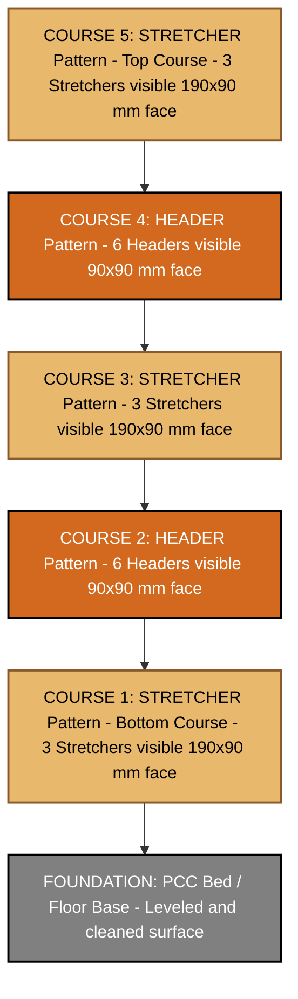
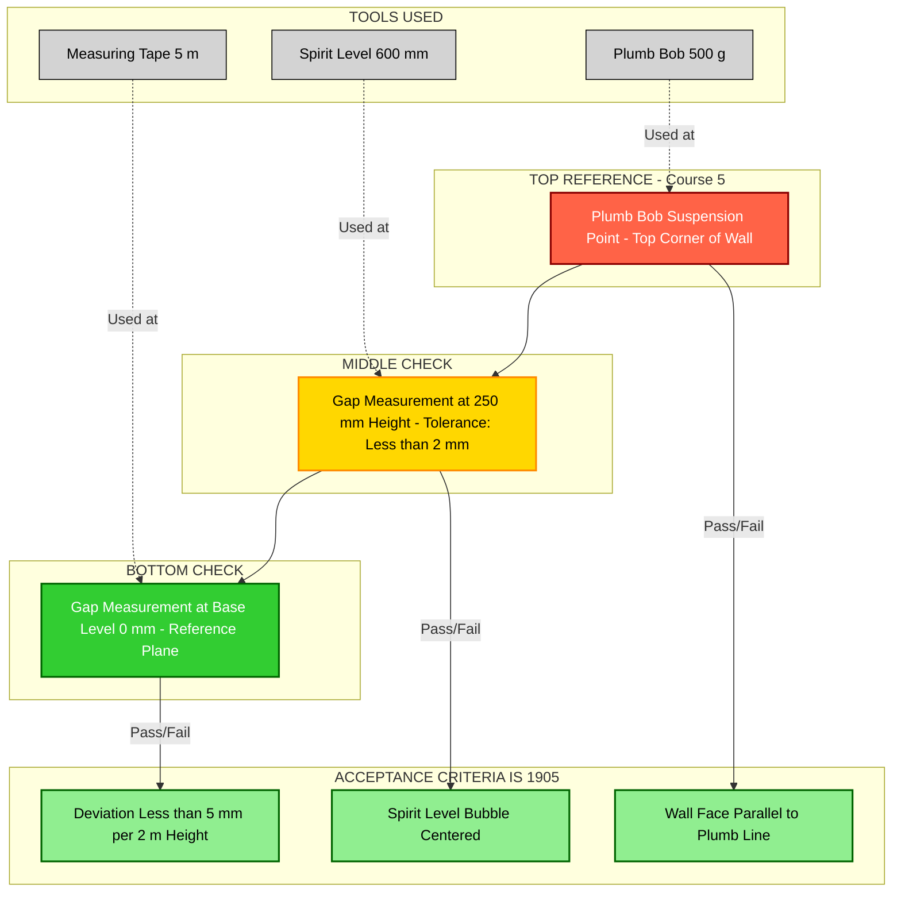

# Construct a 1 and 1 ½ thick brick wall with a height of 50 cm and a minimum length of 60 cm using English bond. Check the verticality of the wall

<!-- SECTION_1_START -->

# Construction of 1 and 1½ Brick Thick Wall Using English Bond

## 1. Core Technical Definition & Intuitive Overview

### Formal Definition
**Brick Masonry (English Bond)** is a composite wall construction technique in which bricks are laid in a systematic alternating pattern of **stretcher courses** (bricks laid lengthwise) and **header courses** (bricks laid with their ends facing outward), bonded together using cement mortar. As per IS 2212 & IS 1905, the **1 brick thick wall** measures approximately **190 mm (or 200 mm nominal)** and the **1½ brick thick wall** measures approximately **290 mm (or 300 mm nominal)**, with the standard modular brick being **190 mm × 90 mm × 90 mm**.

> [!IMPORTANT]
> **KTU 2024 Scheme Definition (GCESL106 — Module 20):**
> "Construct a 1½ brick thick wall with a height of 50 cm and a minimum length of 60 cm using English bond. The verticality of the wall must be checked using a plumb bob and spirit level."

### Conceptual Analogy / Intuition
Imagine you are stacking Lego blocks to build a sturdy wall. If you stack every block in the same direction, the wall develops continuous vertical joints — these act like long cracks where the wall can split. To avoid this, masons **shift every alternate layer by 90°**. This is exactly what the **English Bond** does — it alternates a layer of "long-side-out" bricks (stretchers) with a layer of "short-side-out" bricks (headers). The result is a **stronger, more stable, crack-resistant wall**, much like weaving fabric where threads cross at right angles.

> [!NOTE]
> **Key Standard Values to Remember:**
> - **Standard Modular Brick Size:** 190 mm × 90 mm × 90 mm (with 10 mm mortar joint → 200 × 100 × 100 mm nominal)
> - **1 Brick Wall Thickness:** 190 mm (or **200 mm** nominal)
> - **1½ Brick Wall Thickness:** 290 mm (or **300 mm** nominal)
> - **Wall Height (Workshop Task):** 50 cm = **500 mm**
> - **Minimum Wall Length:** 60 cm = **600 mm**
> - **Mortar Ratio (General):** 1:6 (Cement : Sand) for load-bearing walls

### Brick Bond Types Comparison
| Bond Type | Pattern | Strength | KTU Frequency |
|---|---|---|---|
| **Stretcher Bond** | All stretchers | Low (partition walls only) | Low |
| **English Bond** | Alternating stretcher & header | **High (load-bearing)** | **Very High** ✓ |
| **Flemish Bond** | Headers & stretchers in same course | Medium-High | Medium |
| **Header Bond** | All headers | Low (curved walls) | Low |

> [!VISUALIZATION CONTROL]
> **Concept:** English Bond Course Alternation Pattern
> **Visualization Logic:**
> - **Course 1 (Stretcher):** All bricks show their long face (190 mm × 90 mm) outward
> - **Course 2 (Header):** All bricks show their short face (90 mm × 90 mm) outward
> - **Course 3:** Back to stretcher pattern
> - **Visual Description:** Imagine a striped pattern — long rectangles alternate with square faces, both vertically and horizontally offset to break all continuous vertical joints.

---

<!-- SECTION_1_END -->

<!-- SECTION_2_START -->

# Deep Theoretical Analysis & KTU High-Yield Formula Sheet

## 2. Theoretical Foundation of Brick Wall Construction

### 2.1 Understanding Wall Thickness Specifications
- **1 Brick Thick Wall:** A wall whose thickness equals the length of one standard brick laid as a stretcher → **190 mm (200 mm nominal)**
- **1½ Brick Thick Wall:** A wall whose thickness equals the length of one brick + width of another brick → **190 + 90 = 280 mm (~290 mm)**

### 2.2 Principle of English Bond
The English bond is the **strongest and most commonly used bond** in load-bearing masonry construction. It follows a strict rule:

> **Rule:** *Headers in every alternate course must be centrally placed over the stretchers in the course below, and the vertical joints of the stretchers in consecutive courses must not align.*

### 2.3 Why English Bond is Used (Engineering Reasoning)
1. **Maximum Strength:** Headers act as through-stones, binding the inner and outer wythes (leaves) of the wall together.
2. **Uniform Load Distribution:** Alternating courses distribute compressive loads evenly.
3. **Reduced Vertical Joints:** No continuous vertical joint runs through more than one course, eliminating planes of weakness.
4. **Aesthetic Appeal:** Provides a clean, regular pattern visible on the wall face.

### 2.4 Verticality — The Critical QC Check
**Verticality** is the plumbness of the wall — ensuring the wall rises straight up without leaning in any direction. The **Why** behind checking verticality:
- A wall leaning even slightly outward can collapse under its own weight
- Plumb walls transfer loads axially to the foundation
- Building codes mandate a maximum deviation of **±5 mm per 2 m height**

### 2.5 KTU Formula Sheet / Cheat Sheet

| Parameter | Formula / Value | Unit | Notes |
|---|---|---|---|
| **Standard Brick Size** | $L \times W \times H = 190 \times 90 \times 90$ | mm | Modular size |
| **Nominal Brick Size (with joint)** | $200 \times 100 \times 100$ | mm | Adds 10 mm mortar |
| **1 Brick Wall Thickness** | $T_1 = L = 190$ | mm | = 1 brick length |
| **1½ Brick Wall Thickness** | $T_{1.5} = L + W = 190 + 90 = 280 \approx 290$ | mm | = 1.5 bricks |
| **Number of Bricks per m³** | $N = \dfrac{1}{0.20 \times 0.10 \times 0.10} = 500$ | bricks/m³ | Nominal size basis |
| **Volume of 1 Brick (with mortar)** | $V_b = 0.20 \times 0.10 \times 0.10 = 0.002$ | m³ |  |
| **Mortar Volume per m³ Wall** | $V_m = 1 - (N \times V_{b,\text{actual}})$ | m³ | ~25-30% of wall volume |
| **Wall Surface Area (Workshop)** | $A = L \times H = 0.60 \times 0.50$ | m² | 0.30 m² |
| **Verticality Tolerance** | $\pm 5$ | mm/2m height | As per IS 1905 |
| **Mortar Mix Ratio (General)** | $1 : 6$ | Cement : Sand | Volume basis |
| **Water-Cement Ratio** | $0.45 - 0.55$ | — | For workable mortar |
| **Curing Period** | $7 - 14$ | days | Spray water 3-4 times/day |

### 2.6 Real-World Engineering Utility
- **Load-bearing residential buildings** (G+1, G+2 structures in Kerala)
- **Compound walls and boundary walls**
- **Retaining walls** in low-height applications
- **Workshop and godown construction**
- **Sump and septic tank enclosures**
- Heritage restoration (English bond is the traditional choice for colonial-era buildings in Kerala)

---

<!-- SECTION_2_END -->

<!-- SECTION_3_START -->

# Step-by-Step Construction Procedure & Implementation

## 3. Exhaustive Workshop Procedure

### 3.1 Tools, Materials & Safety Equipment

| S.No | Tool / Material | Specification | Purpose |
|---|---|---|---|
| 1 | **Brick (Modular)** | 190 × 90 × 90 mm, first-class | Primary building unit |
| 2 | **Cement** | OPC 43 Grade (ISI marked) | Binder |
| 3 | **Sand (M-Sand / River Sand)** | Passing 2.36 mm sieve, free of clay | Fine aggregate |
| 4 | **Water** | Potable, pH ≥ 6 | Mixing & curing |
| 5 | **Mason's Trowel** | 250 mm blade | Spreading mortar |
| 6 | **Spirit Level** | 600 mm length, 3 vials | Horizontal & vertical level check |
| 7 | **Plumb Bob** | 500 g weight with 1.5 m string | Verticality check (primary tool) |
| 8 | **Mason's Square** | Right-angle steel square | Corner squareness |
| 9 | **Line & Pins (Pisa/Profile)** | Nylon thread + steel pins | Course alignment |
| 10 | **Measuring Tape** | 5 m steel tape | Length/height measurement |
| 11 | **Mortar Pan / Ghamela** | 60 cm dia GI tub | Mixing & carrying mortar |
| 12 | **Buckets** | 15 L plastic | Water transport |
| 13 | **Brick Hammer** | 500 g, chisel edge | Cutting bricks |
| 14 | **Jointer / Trowel Tip** | Concave steel rod | Finishing joints |
| 15 | **Wheelbarrow** | Standard 60 L | Material transport |
| 16 | **Brush** | Soft wire brush | Cleaning brick surfaces |
| 17 | **Sponge / Gunny Bag** | — | Cleaning excess mortar |

### 3.2 Safety Equipment (Mandatory)

| S.No | PPE Item | Standard | Purpose |
|---|---|---|---|
| 1 | **Safety Helmet** | IS 2925 | Head protection |
| 2 | **Safety Shoes** | Steel toe, IS 15298 | Foot protection from falling bricks |
| 3 | **Cotton Hand Gloves** | ISI marked | Hand protection from cement burns |
| 4 | **Safety Goggles** | IS 5983 | Eye protection from dust & chips |
| 5 | **Dust Mask (N95)** | IS 9473 | Respiratory protection |
| 6 | **First-Aid Kit** | Standard | Emergency medical response |

> [!WARNING]
> **KTU Safety Pitfall:** Examiners frequently deduct marks for **not wearing gloves while handling wet cement**, as wet cement is highly alkaline and causes skin burns. Always wear gloves and immediately wash skin contact with water.

### 3.3 Pre-Construction Preparations (Step 1-3)

**Step 1: Surface Preparation**
- Clean the floor/base surface where the wall is to be constructed.
- Remove dust, debris, oil, and loose particles using a wire brush.
- Sprinkle water on the base to make it moist (SSD — Saturated Surface Dry condition) but no standing water.

**Step 2: Material Preparation**
- Soak bricks in clean water for **at least 30 minutes** before use.
- Soaking ensures bricks do not absorb water from the fresh mortar (which weakens the bond).
- Bricks should be moist at the time of laying but **surface dry** to the touch.

**Step 3: Mortar Preparation**
- Mix ratio: **1 part cement : 6 parts sand** (by volume).
- Dry mix cement and sand thoroughly on a clean platform until uniform color is achieved.
- Add water gradually and mix to obtain a **workable, plastic consistency** (not too wet, not too dry).
- **Retempering** (adding water after initial set) is **strictly prohibited**.
- Mortar must be used within **30 minutes** of mixing.

### 3.4 Wall Layout & Marking (Step 4-5)

**Step 4: Marking the Wall Outline**
- Mark the **outer face line** of the wall using chalk powder or lime.
- For a 1½ brick wall: outer length = **60 cm**, thickness = **30 cm (nominal)**.
- Mark both the inner and outer edges of the wall on the floor.
- For 1 brick wall: thickness = **20 cm (nominal)**.

**Step 5: Profile (Pisa) Setting**
- Erect two **profiles** (wooden battens with brick-course markings) at each end of the wall.
- Mark the **course heights** on the profile, accounting for:
  - Brick height = 90 mm
  - Mortar joint = 10 mm
  - Total course height = **100 mm**
- For 50 cm wall height → **5 courses** are required (5 × 100 mm = 500 mm).

### 3.5 Brick Laying Procedure — English Bond Pattern (Step 6-12)

**Step 6: Laying the First Course (Stretcher Course)**

> [!IMPORTANT]
> **English Bond Course Sequence:** S-H-S-H-S (Stretcher-Header-Stretcher-Header-Stretcher), where Course 1, 3, 5 are **stretchers** and Course 2, 4 are **headers**.

- Spread a uniform mortar bed (~20 mm thick) along the marked outline.
- Lay the **first brick** at one corner as a **stretcher** (long face visible, 190 mm along the wall length).
- Apply mortar on the end (header face) of the next brick before placing it.
- Press each brick firmly into the mortar bed, squeezing out excess mortar.
- Maintain **10 mm vertical and horizontal joints** using a marked gauge stick.
- For **1 brick wall**: All 60 cm length = 3 stretchers (3 × 200 mm = 600 mm nominal).
- For **1½ brick wall**: Length of 60 cm = 3 stretchers laid side by side across the wall thickness.

**Step 7: Checking Level of First Course**
- Place the spirit level on top of the first course bricks longitudinally.
- Check both the **horizontal level** (bubble centered) and the **cross-level** (perpendicular direction).
- Tap high bricks down gently with the trowel handle; add mortar under low bricks.

**Step 8: Checking Verticality of First Course (Critical)**
- Suspend the **plumb bob** from the top edge of the first-course brick at the corner.
- Ensure the plumb line is **exactly 0 mm (or < 2 mm)** away from the brick face at the base.
- Repeat at the other end of the wall.
- This establishes a perfectly plumb reference for the entire wall.

**Step 9: Laying the Second Course (Header Course)**
- Spread a mortar bed on top of the first course.
- Lay the second course with **headers** (short face visible, 90 mm × 90 mm outward).
- Start with a **queen closer** (a brick cut lengthwise to 90 mm × 90 mm × 50 mm) at the corner to break the joint.
- The header course bricks must **centrally overlap** the stretcher course below.

**Step 10: Alignment Using Line and Pins**
- Stretch a **nylon thread** between the two profiles at the outer face level of each course.
- The thread serves as a **reference line** for alignment.
- Each brick in the course should just touch the thread (brick face flush with thread).

**Step 11: Repeat for Course 3, 4, and 5**
- Course 3 → Stretcher pattern (same as Course 1, but joints offset)
- Course 4 → Header pattern (same as Course 2)
- Course 5 → Stretcher pattern (final course)
- After each course, check **level, verticality (plumb), and alignment**.

**Step 12: Jointing & Finishing**
- Once the mortar is thumbprint-dry, finish the joints using a **jointer tool**.
- Joint types: **Flush joint, Raked joint, or Concave joint** (concave is most weather-resistant).
- Joint depth: 5-10 mm.
- Clean excess mortar from brick faces using a sponge.

### 3.6 Verticality Checking Procedure (Standalone Step — Critical for KTU Marks)

| Step | Action | Tool | Acceptance Criteria |
|---|---|---|---|
| **A** | Suspend plumb bob from a fixed reference (top of wall corner) | Plumb bob | Plumb line should be taut |
| **B** | Measure gap between plumb line and wall face at TOP | Measuring tape | Reference = 0 mm |
| **C** | Measure gap between plumb line and wall face at MIDDLE | Measuring tape | $\leq 5$ mm deviation |
| **D** | Measure gap between plumb line and wall face at BOTTOM | Measuring tape | $\leq 5$ mm deviation |
| **E** | Repeat for the **opposite face** of the wall | Plumb bob | $\leq 5$ mm deviation |
| **F** | Use **spirit level** vertically on the wall face | Spirit level | Bubble must be centered |

> [!NOTE]
> **Acceptance Standard (IS 1905):** Verticality deviation must not exceed **±5 mm per 2 m height** of the wall. For the 500 mm workshop wall, the deviation must be **negligible (≤ 2 mm)**.

### 3.7 Curing Procedure (Step 13)

**Step 13: Water Curing**
- Start curing **24 hours** after brick laying is complete.
- Spray water gently on the wall using a hose or gunny bag.
- Frequency: **3 to 4 times per day**.
- Duration: **minimum 7 days** (14 days recommended for full strength).
- Curing prevents shrinkage cracks and ensures proper cement hydration.

### 3.8 Numerical Calculation for Workshop

Given:
- Wall length $L = 60$ cm = **0.60 m**
- Wall height $H = 50$ cm = **0.50 m**
- Wall thickness (1 brick) = **0.20 m**
- Wall thickness (1½ brick) = **0.30 m**

**Volume of 1 Brick Wall:**

$$
\begin{aligned}
V_1 &= L \times H \times T_1 \\
V_1 &= 0.60 \times 0.50 \times 0.20 \\
V_1 &= 0.060 \text{ m}^3
\end{aligned}
$$

**Volume of 1½ Brick Wall:**

$$
\begin{aligned}
V_{1.5} &= L \times H \times T_{1.5} \\
V_{1.5} &= 0.60 \times 0.50 \times 0.30 \\
V_{1.5} &= 0.090 \text{ m}^3
\end{aligned}
$$

**Number of Bricks Required (1½ Brick Wall):**

$$
\begin{aligned}
\text{Brick volume} &= 0.20 \times 0.10 \times 0.10 = 0.002 \text{ m}^3 \\
N_{bricks} &= \frac{V_{1.5}}{V_{brick}} = \frac{0.090}{0.002} \\
N_{bricks} &= 45 \text{ bricks (theoretical)}
\end{aligned}
$$

Add **5% wastage** for cutting and breakage:

$$
\begin{aligned}
N_{actual} &= 45 \times 1.05 = 47.25 \approx 48 \text{ bricks}
\end{aligned}
$$

**Number of Courses:**

$$
\begin{aligned}
N_{courses} &= \frac{H}{\text{Course height}} = \frac{500 \text{ mm}}{100 \text{ mm}} \\
N_{courses} &= 5 \text{ courses}
\end{aligned}
$$

**Pattern (English Bond, 5 courses):**
- Course 1: **Stretcher** (S)
- Course 2: **Header** (H)
- Course 3: **Stretcher** (S)
- Course 4: **Header** (H)
- Course 5: **Stretcher** (S)

**Mortar Quantity (Approximate):**

$$
\begin{aligned}
V_{mortar} &\approx 0.25 \times V_{wall} = 0.25 \times 0.090 \\
V_{mortar} &= 0.0225 \text{ m}^3 = 22.5 \text{ litres}
\end{aligned}
$$

For 1:6 mix, cement quantity:

$$
\begin{aligned}
\text{Cement (kg)} &= \frac{V_{mortar} \times 1440}{1 + 6} = \frac{0.0225 \times 1440}{7} \\
\text{Cement} &= 4.63 \text{ kg} \approx 5 \text{ kg}
\end{aligned}
$$

---

<!-- SECTION_3_END -->

<!-- SECTION_4_START -->

# Structural Diagrams & Schematics

## 4. Brick Wall Construction Schematics

### 4.1 English Bond Course Pattern — Visual Layout

### 4.2 Workflow Diagram: Complete Brick Wall Construction

```mermaid
graph TD
    S1["STEP 1: Surface Preparation - Clean and moisten base"]
    S2["STEP 2: Material Preparation - Soak bricks for 30 min - Prepare 1:6 mortar"]
    S3["STEP 3: Layout Marking - Mark outer and inner wall lines on floor - 60 cm length"]
    S4["STEP 4: Profile Setting - Erect profiles at both ends - Mark 5 course levels"]
    S5["STEP 5: First Course Laying - Stretcher pattern - 3 bricks for 1B wall"]
    S6["STEP 6: Level Check - Spirit level longitudinally and crosswise"]
    S7["STEP 7: Verticality Check - Plumb bob at both corners"]
    S8{"Alignment OK?"}
    S9["STEP 8: Second Course - Header pattern - Add queen closers at corners"]
    S10["STEP 9: Line and Pin Reference - Stretch thread between profiles"]
    S11["STEP 10: Course 3,4,5 Laying - Alternate S-H-S-H-S pattern"]
    S12["STEP 11: Jointing - Concave finish with jointer tool"]
    S13["STEP 12: Final Verticality Check - Plumb bob on all 4 corners"]
    S14["STEP 13: Curing - Spray water 3-4 times/day for 7 days"]
    S15["COMPLETED 1.5 BRICK WALL - Height: 50 cm, Length: 60 cm"]
    
    S1 --> S2
    S2 --> S3
    S3 --> S4
    S4 --> S5
    S5 --> S6
    S6 --> S7
    S7 --> S8
    S8 -->|No| S5
    S8 -->|Yes| S9
    S9 --> S10
    S10 --> S11
    S11 --> S12
    S12 --> S13
    S13 --> S14
    S14 --> S15
    
    style S1 fill:#90EE90,stroke:#006400,stroke-width:2px,color:#000
    style S2 fill:#90EE90,stroke:#006400,stroke-width:2px,color:#000
    style S3 fill:#FFD700,stroke:#FF8C00,stroke-width:2px,color:#000
    style S4 fill:#FFD700,stroke:#FF8C00,stroke-width:2px,color:#000
    style S5 fill:#FFA07A,stroke:#8B0000,stroke-width:2px,color:#000
    style S6 fill:#87CEEB,stroke:#00008B,stroke-width:2px,color:#000
    style S7 fill:#87CEEB,stroke:#00008B,stroke-width:2px,color:#000
    style S8 fill:#FFB6C1,stroke:#8B0000,stroke-width:2px,color:#000
    style S9 fill:#FFA07A,stroke:#8B0000,stroke-width:2px,color:#000
    style S10 fill:#DDA0DD,stroke:#4B0082,stroke-width:2px,color:#000
    style S11 fill:#FFA07A,stroke:#8B0000,stroke-width:2px,color:#000
    style S12 fill:#D2B48C,stroke:#8B4513,stroke-width:2px,color:#000
    style S13 fill:#87CEEB,stroke:#00008B,stroke-width:2px,color:#000
    style S14 fill:#00BFFF,stroke:#00008B,stroke-width:2px,color:#000
    style S15 fill:#32CD32,stroke:#006400,stroke-width:3px,color:#FFF
```

### 4.3 Verticality Checking — Multi-Point Reference System

### 4.4 Sequential Processing Topology Matrix — Wall Construction

| Stage | Operation | Tool/Equipment | Output State | QC Check |
|---|---|---|---|---|
| **Stage 1** | Site Preparation | Wire brush, water | Clean moist base | Visual inspection |
| **Stage 2** | Layout Marking | Chalk, measuring tape | Wall outline marked | Dimension verification |
| **Stage 3** | Profile Erecting | Wooden battens, nails | 5 course levels marked | Spirit level on profile |
| **Stage 4** | Brick Soaking | Water tub | Saturated bricks | 30 min immersion log |
| **Stage 5** | Mortar Mixing | Ghamela, trowel | 1:6 plastic mortar | Slump/consistency test |
| **Stage 6** | Course 1 Laying (Stretcher) | Trowel, line & pin | Bottom course complete | Plumb + Level |
| **Stage 7** | Course 2 Laying (Header) | Trowel, brick hammer | Headers with queen closers | Plumb + Level + Alignment |
| **Stage 8** | Course 3, 4, 5 Laying | Trowel, line & pin | Complete wall (S-H-S-H-S) | Plumb + Level + Alignment |
| **Stage 9** | Jointing | Jointer tool | Concave/flush joints | Visual + depth check |
| **Stage 10** | Cleaning | Sponge, brush | Clean brick faces | Visual inspection |
| **Stage 11** | Final Verticality Check | Plumb bob, spirit level | Plumb verification | ≤ 5 mm deviation |
| **Stage 12** | Curing Initiation | Water hose, gunny bag | Moist wall surface | 24 hr after laying |

---

<!-- SECTION_4_END -->

<!-- SECTION_5_START -->

# KTU 2024 Scheme Examination Question Bank & Topic Recap

## 5. KTU Model Question Paper

### Part A Questions (3 Marks Each)

---

**Q1. [KTU University Exam — July 2024 Model Question]**
**[CO1 | Remember]**
*Define the term "English Bond" in brick masonry. State any two advantages of using English bond over stretcher bond.*

**Model Answer (3 Marks):**

> **Definition (1 Mark):** English Bond is a brick laying pattern in which **alternating courses of stretchers and headers** are used. The headers are placed centrally over the stretchers in the course below, and the vertical joints in consecutive stretcher courses are offset by half a brick.
>
> **Advantage 1 (1 Mark):** English bond is the **strongest bond** and is suitable for **load-bearing walls** because headers act as through-stones binding the wall leaves together.
>
> **Advantage 2 (1 Mark):** It **eliminates continuous vertical joints** running through the wall thickness, thereby preventing the formation of vertical planes of weakness.

---

**Q2. [KTU University Exam — Dec 2023 Model Question]**
**[CO2 | Understand]**
*List the tools required for checking the verticality and horizontal level of a brick wall. State the standard tolerance for verticality as per IS 1905.*

**Model Answer (3 Marks):**

> **Tools for Verticality Check (1 Mark):** **Plumb bob** (primary tool) and **Spirit level** (secondary verification).
>
> **Tools for Horizontal Level Check (1 Mark):** **Spirit level** (minimum 600 mm length) placed on top of the course.
>
> **Standard Tolerance (1 Mark):** As per **IS 1905**, the maximum permissible verticality deviation is **±5 mm per 2 m height** of the wall.

---

### Part B Questions (14 Marks Each) — Internal Choice

---

## Question A (14 Marks)

**[KTU University Exam — July 2024 Model Question]**
**[CO2, CO3 | Understand + Apply]**

**(a)** Describe the step-by-step procedure for constructing a **1½ brick thick wall** of height **50 cm** and length **60 cm** using **English bond**. Mention the tools and materials required. **(7 Marks)**

**(b)** Explain the method of checking the **verticality** of the constructed wall using a **plumb bob**. What are the permissible tolerances? **(7 Marks)**

---

### Model Answer — Question A

#### Part (a) — Construction Procedure (7 Marks)

**[Step 1: Surface Preparation — 1 Mark]**
Clean the floor surface where the wall is to be constructed. Remove all dust, debris, and loose material. Moisten the surface with water to achieve SSD (Saturated Surface Dry) condition.

**[Step 2: Material Preparation — 1 Mark]**
- Soak the bricks in clean water for **at least 30 minutes** before laying.
- Prepare mortar in the ratio **1:6 (Cement : Sand)** by volume. Mix dry ingredients first, then add water gradually to obtain a workable, plastic consistency. Use mortar within **30 minutes** of mixing.

**[Step 3: Layout Marking — 1 Mark]**
Mark the **outer and inner faces** of the wall on the floor using chalk. The wall outline is 60 cm long × 30 cm thick (1½ brick = 200 + 100 = 300 mm nominal).

**[Step 4: Profile Setting — 1 Mark]**
Erect two profiles (wooden battens) at both ends of the wall. Mark the **course heights** (each course = 100 mm with mortar). For 500 mm height, mark **5 courses**.

**[Step 5: First Course Laying (Stretcher) — 1 Mark]**
Spread a 20 mm thick mortar bed along the outline. Lay the first course as **stretchers** (long face visible, 190 mm × 90 mm outward). Apply mortar on the end faces of subsequent bricks. Maintain 10 mm joints.

**[Step 6: Level and Verticality Check of Course 1 — 1 Mark]**
Check the **horizontal level** using a spirit level placed longitudinally. Check **verticality** by suspending a plumb bob from the top corner.

**[Step 7: Subsequent Courses (English Bond Pattern) — 1 Mark]**
Lay the remaining courses in the pattern **S-H-S-H-S** (Stretcher-Header-Stretcher-Header-Stretcher). For header courses, place a **queen closer** (cut brick) at the corner. Use line and pins for face alignment.

**Total for Part (a): 7 Marks**

#### Part (b) — Verticality Checking Method (7 Marks)

**[Definition of Verticality — 1 Mark]**
Verticality is the **plumbness** of the wall — the property of a wall being perfectly upright (perpendicular to the horizontal plane).

**[Tool Used — 1 Mark]**
The primary tool is a **plumb bob** (a 500 g metal weight suspended from a string). The plumb line, under gravity, is always perfectly vertical.

**[Procedure Step 1 — 1 Mark]**
Suspend the plumb bob from the **top edge of the wall corner** using a string long enough to reach the base.

**[Procedure Step 2 — 1 Mark]**
Ensure the plumb bob hangs freely without touching any part of the wall.

**[Procedure Step 3 — 1 Mark]**
Measure the **horizontal gap** between the plumb line and the wall face at three points: **top, middle, and bottom** of the wall, using a measuring tape.

**[Procedure Step 4 — 1 Mark]**
Repeat the process on the **opposite face** of the wall and at **both ends**.

**[Permissible Tolerance and Conclusion — 1 Mark]**
As per **IS 1905**, the deviation must not exceed **±5 mm per 2 m height**. For the 500 mm workshop wall, the deviation should be **negligible (≤ 2 mm)**. The wall is accepted only if the plumb line is parallel to the wall face at all measured points. The result is **cross-verified using a spirit level** held vertically against the wall.

**Total for Part (b): 7 Marks**

---

## Question B (14 Marks) — Alternative Choice

**[KTU University Exam — Dec 2023 Model Question]**
**[CO1, CO3 | Remember + Apply]**

**(a)** Differentiate between **English Bond** and **Flemish Bond** in brick masonry. State any four points of difference. **(7 Marks)**

**(b)** Calculate the number of bricks and the quantity of cement (in kg) required to construct the **1½ brick thick wall** of dimensions 60 cm × 50 cm × 30 cm, assuming a 1:6 cement-sand mortar mix and 5% wastage. **(7 Marks)**

---

### Model Answer — Question B

#### Part (a) — English Bond vs Flemish Bond (7 Marks)

**[Point 1 — Pattern of Courses — 2 Marks]**
- **English Bond:** Consists of **alternating courses of all stretchers and all headers**. A stretcher course is followed by a header course.
- **Flemish Bond:** Each course consists of **alternating headers and stretchers** within the same course, with a queen closer placed next to each header at quoins.

**[Point 2 — Strength — 2 Marks]**
- **English Bond:** Considered the **strongest bond**; headers bind the wall leaves together as through-stones.
- **Flemish Bond:** Slightly **weaker** than English bond but more **aesthetic** in appearance.

**[Point 3 — Use and Application — 2 Marks]**
- **English Bond:** Preferred for **load-bearing walls**, public buildings, and structures where strength is paramount.
- **Flemish Bond:** Preferred for **aesthetic facing work** in residential and commercial buildings where appearance matters more than maximum strength.

**[Point 4 — Joint Alignment — 1 Mark]**
- **English Bond:** No continuous vertical joint exceeds more than one course height.
- **Flemish Bond:** Vertical joints can align between adjacent courses, requiring precise queen closer placement.

**Total for Part (a): 7 Marks**

#### Part (b) — Numerical Calculation (7 Marks)

**[Given Data — 1 Mark]**
- Wall dimensions: $L = 0.60$ m, $H = 0.50$ m, $T = 0.30$ m
- Mortar ratio: $1:6$ (Cement : Sand)
- Wastage allowance: $5\%$

**[Step 1: Wall Volume — 1 Mark]**

$$
\begin{aligned}
V_{wall} &= L \times H \times T \\
V_{wall} &= 0.60 \times 0.50 \times 0.30 \\
V_{wall} &= 0.090 \text{ m}^3
\end{aligned}
$$

**[Step 2: Volume of Mortar (25% of wall volume) — 1 Mark]**

$$
\begin{aligned}
V_{mortar} &= 0.25 \times 0.090 \\
V_{mortar} &= 0.0225 \text{ m}^3 = 22.5 \text{ litres}
\end{aligned}
$$

**[Step 3: Volume of Bricks (75% of wall volume) — 1 Mark]**

$$
\begin{aligned}
V_{bricks} &= 0.75 \times 0.090 \\
V_{bricks} &= 0.0675 \text{ m}^3
\end{aligned}
$$

**[Step 4: Number of Bricks — 1 Mark]**
Volume of 1 brick (with mortar) = $0.002$ m³

$$
\begin{aligned}
N_{bricks} &= \frac{V_{bricks}}{0.002} = \frac{0.0675}{0.002} \\
N_{bricks} &= 33.75 \approx 34 \text{ bricks (without wastage)}
\end{aligned}
$$

**[Step 5: Adding 5% Wastage — 1 Mark]**

$$
\begin{aligned}
N_{actual} &= 34 \times 1.05 \\
N_{actual} &= 35.7 \approx 36 \text{ bricks}
\end{aligned}
$$

**[Step 6: Cement Quantity — 1 Mark]**
Dry volume of mortar = $0.0225 \times 1.33 = 0.02993$ m³
Sum of ratio = $1 + 6 = 7$

$$
\begin{aligned}
\text{Cement volume} &= \frac{0.02993}{7} = 0.004276 \text{ m}^3 \\
\text{Cement (kg)} &= 0.004276 \times 1440 = 6.16 \text{ kg} \approx 6.2 \text{ kg}
\end{aligned}
$$

**Final Answer: 36 bricks and approximately 6.2 kg of cement are required.** [1 Mark]

**Total for Part (b): 7 Marks**

---

> [!WARNING]
> **KTU Examiner's Valuation Warning — Common Pitfalls:**
> 1. **Forgetting Queen Closers:** Students often lay header courses without placing a **queen closer** (a brick cut to 90 × 90 × 50 mm) at the corner. This breaks the continuity of vertical joints and is **mandatory** in English bond. *Deduction: 1-2 marks.*
> 2. **Not Mentioning Brick Soaking:** Examiners expect mention of **soaking bricks for 30 minutes** before laying. *Deduction: 1 mark.*
> 3. **Confusing English and Flemish Bond:** Students frequently describe Flemish bond pattern when asked about English bond. *Deduction: 2-3 marks.*
> 4. **Skipping Verticality Tolerance:** When asked about verticality, simply stating "use plumb bob" without mentioning the **±5 mm per 2 m tolerance (IS 1905)** is incomplete. *Deduction: 1-2 marks.*
> 5. **No Mention of Curing:** Wall construction is incomplete without the **7-day curing** step. *Deduction: 1 mark.*
> 6. **Retempering the Mortar:** Adding water to mortar that has begun to set is **strictly prohibited** and weakens the bond. Examiners look for this negative knowledge.

---

## Topic Recap & Important Things to Remember

> [!IMPORTANT]
> **High-Yield Rapid Revision Checklist — KTU 2024 Scheme (Module 20)**

- ✅ **English Bond** = Alternating **Stretcher (S)** and **Header (H)** courses. Pattern for 5 courses: **S-H-S-H-S**.
- ✅ **1 Brick Wall Thickness** = **190 mm (200 mm nominal)**; **1½ Brick Wall** = **290 mm (300 mm nominal)**.
- ✅ **Standard Brick Size:** 190 × 90 × 90 mm; **Nominal size with 10 mm joint:** 200 × 100 × 100 mm.
- ✅ **Course Height:** Brick (90 mm) + Mortar (10 mm) = **100 mm**.
- ✅ **Number of Courses for 50 cm wall:** $500 \div 100 = \mathbf{5 \text{ courses}}$.
- ✅ **Mortar Ratio:** **1:6 (Cement:Sand)** by volume for general brickwork.
- ✅ **Brick Soaking Time:** Minimum **30 minutes** before laying; surface must be SSD condition.
- ✅ **Mortar Use Time:** Within **30 minutes** of mixing (initial setting time). **No retempering.**
- ✅ **Queen Closer:** A brick cut lengthwise to **90 × 90 × 50 mm**; mandatory at corners in English bond to break vertical joints.
- ✅ **Verticality Tool:** **Plumb bob** (primary) and **Spirit level** (verification).
- ✅ **Verticality Tolerance (IS 1905):** **±5 mm per 2 m height**.
- ✅ **Horizontal Level Tool:** **Spirit level** placed longitudinally and crosswise on each course.
- ✅ **Line and Pins:** Nylon thread stretched between profiles for **face alignment** of each course.
- ✅ **Jointing:** Concave joints (best weather resistance) using a jointer tool when mortar is **thumbprint-dry**.
- ✅ **Curing:** Starts **24 hours** after laying; water spraying **3-4 times/day** for **minimum 7 days**.
- ✅ **Safety PPE:** Helmet, gloves, safety shoes, dust mask, goggles — **mandatory** for full marks.
- ✅ **Number of Bricks Formula:** $N = \dfrac{V_{wall}}{0.002} \times 1.05 \text{ (with 5\% wastage)}$.
- ✅ **Cement Quantity Formula:** $\text{Cement (kg)} = \dfrac{V_{mortar} \times 1.33 \times 1440}{1 + \text{Sand ratio}}$.
- ✅ **Wall Volume Formula:** $V_{wall} = L \times H \times T$.
- ✅ **For 1.5 brick wall (60 × 50 × 30 cm):** Volume = **0.090 m³**; Bricks ≈ **36 nos.**; Cement ≈ **6.2 kg**.
- ✅ **English Bond is STRONGEST bond** — preferred for load-bearing walls.
- ✅ **Headers act as through-stones** — they bind the inner and outer wythes (leaves) of the wall.
- ✅ **Verticality is checked at multiple points** — top, middle, bottom — on **all exposed faces**.

<!-- SECTION_5_END -->
