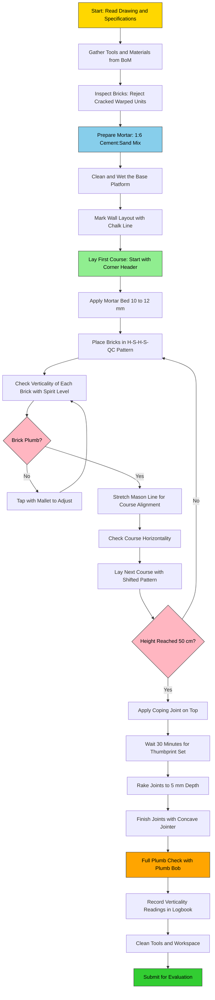
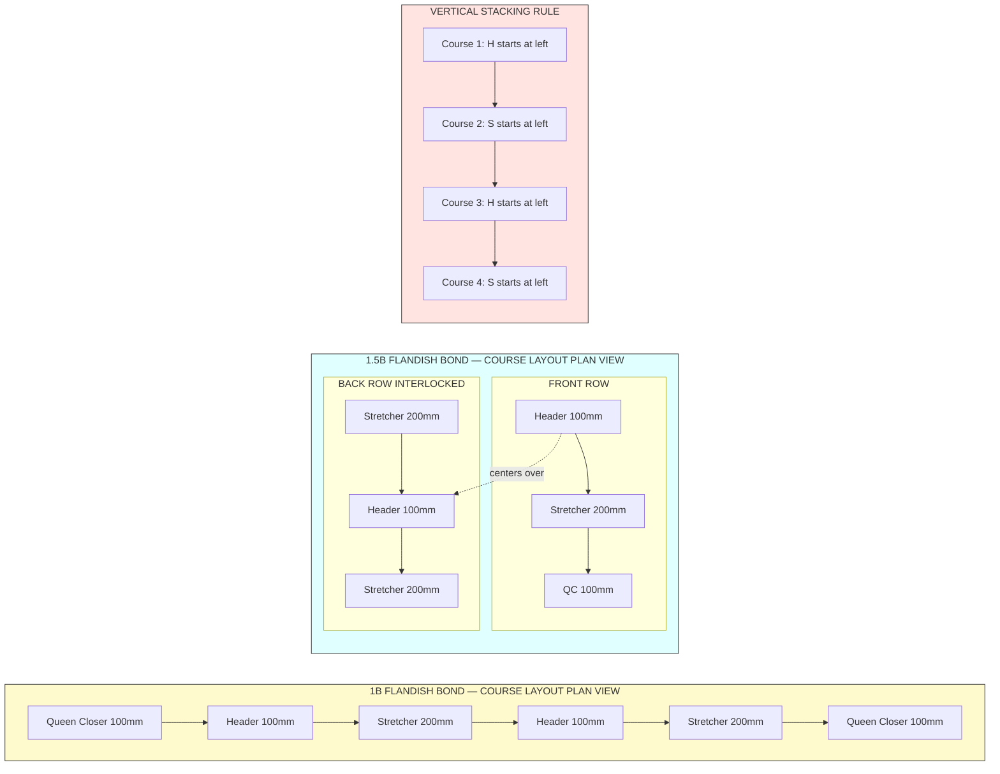
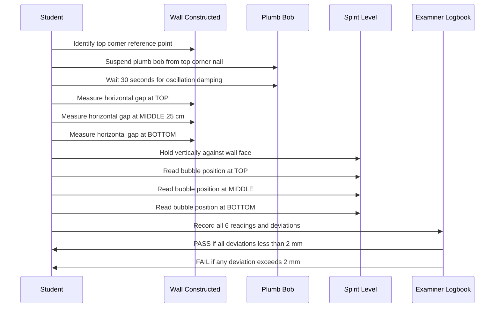
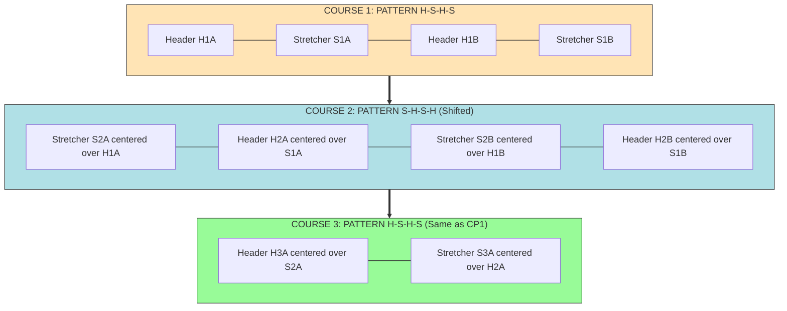

# Construct a 1 and 1 ½ thick brick wall with a height of 50 cm and a minimum length of 60 cm using Flemish bond. Check the verticality of the wall

<!-- SECTION_1_START -->
# Module 21: Flemish Bond Brick Wall Construction & Verticality Check

## 1.1 Formal Definition (KTU 2024 Scheme Terminology)

**Flemish Bond** is a type of brick bonding pattern in which *each course (horizontal layer) of bricks* is laid using **alternating headers and stretchers** placed side by side. A header is a brick laid with its end (width) facing the wall face, while a stretcher is a brick laid with its long side (length) facing the wall face.

> [!IMPORTANT]
> **Syllabus Definition (GCESL106 — Module 21):**
> *A 1 and 1 ½ brick thick wall of height 50 cm and minimum length 60 cm shall be constructed in Flemish bond, ensuring every alternate header is centrally placed over a stretcher of the course below, and the verticality of the constructed wall is verified using a plumb bob and spirit level.*

**Key Engineering Terms:**
- **Course:** A single horizontal layer of bricks laid in mortar.
- **Header (H):** Brick showing the *end face* ($110 \text{ mm} \times 75 \text{ mm}$) on the wall face.
- **Stretcher (S):** Brick showing the *long face* ($230 \text{ mm} \times 75 \text{ mm}$) on the wall face.
- **Quoin (Corner Brick):** Special brick placed at the corner to maintain bond alignment.
- **Verticality:** The plumb condition of a wall — measured by deviation from a true vertical line (gravitational reference).
- **Plumb Line:** An imaginary line that is perfectly *true to gravity* (i.e., perpendicular to a level horizontal plane).

> [!NOTE]
> **Standard Modular Brick (Indian Standard IS 1077):**
> Nominal size $= 200 \text{ mm} \times 100 \text{ mm} \times 100 \text{ mm}$ (with $10 \text{ mm}$ mortar joint).
> Actual burnt-clay size $= 230 \text{ mm} \times 110 \text{ mm} \times 75 \text{ mm}$.
> Wall thickness of $1 \text{ B} = 200 \text{ mm}$ and $1.5 \text{ B} = 300 \text{ mm}$.

---

## 1.2 Conceptual Analogy — Intuition

Imagine a **chessboard pattern on a wall of bricks**, but where *every* horizontal row contains both long pieces (stretchers) and short pieces (headers) alternating like keys on a piano keyboard. The row above is shifted so that every vertical joint between two stretchers in one row is covered by the *middle* of a header in the row above — just like how the joints in a brick pavement never line up vertically across two consecutive rows.

**Real-world analogy:** Think of Flemish bond as **interlocking Lego bricks** — no two vertical seams ever line up directly on top of each other, which gives the wall exceptional *shear strength* and *load distribution* capacity.

> [!TIP]
> **Why "Flemish"?** Historically, this bond was popularized in Flanders (modern-day Belgium) during the 17th century and is also called the **Dutch Bond**. It is the *most decorative* and *strongest* of all brick bonds, widely used for *exposed load-bearing facades* in European colonial and Indian civil architecture.

> [!VISUALIZATION CONTROL]
> **Concept:** Verticality Concept — Plumb vs. Lean
> **GeoGebra / Desmos Input Equations:**
> * `Plumb Line: x = 0` (true vertical)
> * `Leaning Wall 1: y = mx + c` with small positive slope (tilted right)
> * `Leaning Wall 2: y = -mx + c` (tilted left)
> * `Horizontal Datum: y = 0` (perfectly level ground)
> **Visual Description:** The student should observe the **plumb line** (red dashed) acting as the gravity reference. The **spirit level bubble** sits centered (between the two indicator lines) when the wall face is perfectly vertical. Any tilt causes the bubble to drift toward the leaning side.

---

## 1.3 Wall Thickness — "1 B" and "1.5 B" Definition

| Notation | Name | Actual Thickness | No. of Bricks per Course Cross-Section |
|----------|------|------------------|------------------------------------------|
| **1 B** | One Brick Thick | $200 \text{ mm}$ (1 stretcher deep) | 1 brick laid as stretcher across wall |
| **1.5 B** | One-and-a-Half Brick Thick | $300 \text{ mm}$ (1 stretcher + 1 header) | 1 stretcher + 1 header side-by-side |

> [!IMPORTANT]
> For KTU Module 21, the student must construct **both** a $1 \text{ B}$ section **and** a $1.5 \text{ B}$ section on the same base, demonstrating the corner transition between the two thicknesses using **Queen Closers** (bricks cut lengthwise to half-width, $50 \text{ mm}$ wide) at the junction.

<!-- SECTION_1_END -->

<!-- SECTION_2_START -->
# 2. Deep Theoretical Analysis & KTU High-Yield Formula Sheet

## 2.1 Principles of Flemish Bond

The Flemish bond is governed by three fundamental geometric rules that must never be violated during laying:

1. **Alternate Rule (per course):** Every course must begin with a **header at the corner (quoin)**, followed by an alternating *header-stretcher-header-stretcher* pattern across the length of the wall.
2. **Centering Rule (between courses):** Every header in any course must be **perfectly centered** (within $\pm 5 \text{ mm}$) over a stretcher in the course immediately below.
3. **Joint Rule:** All *vertical joints* in any course must be *fully covered* by the *solid mass* of a brick (header or stretcher) in the course above. The maximum permissible vertical joint thickness is $10 \text{ mm}$ as per IS 2250.

### 2.1.1 Why Header Centering Matters

If a header is not centered, the **load path** becomes eccentric, producing a **bending moment** at the brick interface. This causes:
- Diagonal **shear cracks** propagating along the mortar joints.
- **Differential settlement** between the two leaves of the wall.
- Reduced *compressive strength* of the composite wall (as a Flemish-bonded wall behaves as a **monolithic section** only when headers properly interlock the front and back leaves).

> [!TIP]
> **Engineering Insight:** In a $1.5 \text{ B}$ Flemish wall, the headers act as *transverse ties* connecting the front and back leaves. This makes the wall behave as a single $300 \text{ mm}$ thick structural element rather than two independent $150 \text{ mm}$ leaves.

---

## 2.2 Mortar Specification (IS 2250 Recommendations)

| Wall Type | Recommended Mortar Mix (by volume) | Use Case | 28-Day Strength |
|-----------|------------------------------------|----------|-----------------|
| Load-bearing (general) | **1 : 6** (Cement : Sand) | Residential, 1–2 storey | $3 \text{ N/mm}^2$ |
| Load-bearing (heavy) | **1 : 4** (Cement : Sand) | Multi-storey, heavy load | $5 \text{ N/mm}^2$ |
| Workshop / Non-load | **1 : 8** (Cement : Sand) | Partition, lab mock-ups | $1.5 \text{ N/mm}^2$ |
| Lime mortar (heritage) | **1 : 2 : 9** (Lime : Surkhi : Sand) | Restoration works | $0.7 \text{ N/mm}^2$ |

> [!NOTE]
> For KTU Module 21 workshop, the prescribed mix is **Cement mortar $1 : 6$** (1 part Ordinary Portland Cement + 6 parts clean river sand by volume), with **water-cement ratio $\approx 0.5$**.

---

## 2.3 KTU High-Yield Formula Sheet

> **Table 2.1 — Geometric & Quantity Formulas for Flemish Bond Wall**

| # | Parameter | Formula | Description |
|---|-----------|---------|-------------|
| 1 | Volume of 1 brick (with mortar) | $V_b = L \times W \times H = 0.20 \times 0.10 \times 0.10$ | $= 0.002 \text{ m}^3$ |
| 2 | Volume of wall (rectangular) | $V_w = L \times T \times H$ | $L$=length, $T$=thickness, $H$=height |
| 3 | Number of bricks (no wastage) | $N = \dfrac{V_w}{V_b}$ | Without considering wastage |
| 4 | Number of bricks (with 5% wastage) | $N_{actual} = N \times 1.05$ | KTU workshop standard |
| 5 | Number of courses per m height | $N_c = \dfrac{1000 \text{ mm}}{H_{course}} = \dfrac{1000}{75 + 10} = 11.76 \approx 12$ | For $75 \text{ mm}$ brick $+ 10 \text{ mm}$ joint |
| 6 | Required height for 50 cm wall | $H = 50 \text{ cm} \Rightarrow 6 \text{ courses}$ | $\frac{500}{85} = 5.88 \Rightarrow 6 \text{ courses}$ |
| 7 | Plumb deviation tolerance (IS 1905) | $\Delta_{max} = \pm 5 \text{ mm}$ per $3 \text{ m}$ height | For walls up to $50 \text{ cm}$: tolerance $= \pm 1 \text{ mm}$ |
| 8 | Header / Stretcher ratio (Flemish) | $H : S = 1 : 1$ | One header per stretcher per course |
| 9 | Queen closer length | $L_{qc} = \dfrac{L_{brick}}{2} = \dfrac{200}{2} = 100 \text{ mm}$ | Half-width brick |
| 10 | Wall length required (1 B Flemish) | $L = (n \times 100) + 100 \text{ mm}$ | $n$ = number of stretchers, plus 1 closer at each end |

> **Table 2.2 — Tool Dimensions & Calibration**

| Tool | Specification | Use |
|------|---------------|-----|
| Spirit Level | $600 \text{ mm}$ length, sensitivity $0.5 \text{ mm/m}$ | Verticality + horizontality |
| Plumb Bob | Brass, $\geq 250 \text{ g}$ weight, $\geq 5 \text{ m}$ nylon thread | True vertical reference |
| Mason's Line | Nylon, $\geq 15 \text{ m}$, $1 \text{ mm}$ dia. | Course alignment |
| Trowel | $250 \text{ mm}$ brick trowel | Mortar placement |
| Jointer | $12 \text{ mm}$ concave jointer | Joint finishing |
| Line & Pin | $150 \text{ mm}$ steel pins + line blocks | Stretching masonry line |

---

## 2.4 Engineering Real-World Utility

Flemish bond walls are deployed in:
- **Load-bearing residential buildings** in India (1–3 storey) — IS 1905:1987.
- **Heritage restoration** in colonial-era Kerala bungalows, museums, and churches.
- **Boundary walls and compound walls** where aesthetics and strength both matter.
- **Industrial workshop buildings** where wall robustness is critical.

> [!IMPORTANT]
> In production masonry, the Flemish bond is **superseded by English bond** for purely structural walls (since English bond has no headers in the middle, reducing material cost). However, Flemish remains the *gold standard* for **architectural facades** because of its symmetrical, decorative appearance on both faces of the wall.

<!-- SECTION_2_END -->

<!-- SECTION_3_START -->
# 3. Step-by-Step Construction Procedure & Implementation

## 3.1 Tools, Materials & Safety Inventory (Workshop-Grade)

> **Table 3.1 — Complete Tool & Material Bill of Materials (BoM)**

| # | Item | Specification | Quantity | Purpose |
|---|------|---------------|----------|---------|
| 1 | Modular Bricks | IS 1077, $230 \times 110 \times 75 \text{ mm}$ | $60$ nos. (incl. 10% wastage) | Wall construction |
| 2 | Ordinary Portland Cement | IS 269, Grade 43 / 53 | $5 \text{ kg}$ | Binder |
| 3 | River Sand (M-Sand) | IS 383, Zone II, $< 2 \text{ mm}$ | $30 \text{ kg}$ | Fine aggregate |
| 4 | Water | Potable, $\text{pH} \geq 6$ | $5 \text{ L}$ | Hydration |
| 5 | Spirit Level | $600 \text{ mm}$ aluminium, $0.5 \text{ mm/m}$ | $1$ | Verticality check |
| 6 | Plumb Bob | Brass, $300 \text{ g}$, $5 \text{ m}$ thread | $1$ | True vertical |
| 7 | Mason's Trowel | $250 \text{ mm}$ steel | $1$ | Mortar placement |
| 8 | Mallet (Rubber) | $500 \text{ g}$ | $1$ | Brick tapping |
| 9 | Brick Hammer | $400 \text{ g}$ with chisel edge | $1$ | Cutting bricks |
| 10 | Measuring Tape | $3 \text{ m}$ steel | $1$ | Length & height |
| 11 | Mason's Line (Nylon) | $15 \text{ m}$, $1 \text{ mm}$ dia. | $1$ | Course alignment |
| 12 | Line & Pins | Steel, $150 \text{ mm}$ | $2$ pairs | Line stretching |
| 13 | Jointer (Concave) | $12 \text{ mm}$ | $1$ | Joint finishing |
| 14 | Mortar Pan (Ghamela) | $60 \text{ cm}$ dia., GI sheet | $1$ | Mortar mixing |
| 15 | Buckets | $10 \text{ L}$ plastic | $2$ | Water + sand |
| 16 | Wire Brush | Steel bristles | $1$ | Joint cleaning |
| 17 | Chisel | $25 \text{ mm}$ flat | $1$ | Brick cutting |
| 18 | Safety Goggles | IS 5983 | $1$ | Eye protection |
| 19 | Hand Gloves | Cotton-rubber | $1$ pair | Hand protection |
| 20 | First-Aid Box | Standard workshop kit | $1$ | Emergency |

---

## 3.2 Mortar Preparation (Detailed)

**Step 3.2.1 — Dry Mixing**
Measure $1$ part cement and $6$ parts sand by volume using a **standard box** (e.g., $30 \text{ cm} \times 30 \text{ cm} \times 30 \text{ cm}$). Pour into the **Ghamela** (mortar pan) and mix dry with a trowel for **2 minutes** until a uniform grey color is achieved.

**Step 3.2.2 — Wet Mixing (Gauging)**
Create a central depression in the dry mix, add **measured potable water** (water-cement ratio $\approx 0.5$ by mass), and fold the mix inward gradually. Mix for **3–5 minutes** to obtain a **plastic, workable** consistency that just holds its shape when squeezed in the fist (slump test analogue: the mortar should not flow but should spread easily with a trowel).

**Step 3.2.3 — Initial Setting Window**
Use the mortar within **30 minutes** of adding water. **Re-tempering** (adding water to re-softened mortar) is **strictly prohibited** after initial set begins (typically $30$ min in KTU workshop conditions of $25\text{–}30^{\circ}\text{C}$).

> [!WARNING]
> **Do NOT add extra cement or sand mid-way.** This disrupts the designed water-cement ratio and drastically reduces bond strength. Discard mortar that has begun to set.

---

## 3.3 Foundation / Base Preparation

1. **Select a flat, firm, levelled platform** (concrete floor of the workshop or a pre-built PCC bed).
2. **Clean the base** using a wire brush and water; remove dust, oil, and loose particles.
3. **Mark the wall layout** using chalk / lime powder following the dimensions:
   - $1 \text{ B}$ section: $60 \text{ cm (L)} \times 20 \text{ cm (T)} \times 50 \text{ cm (H)}$
   - $1.5 \text{ B}$ section: $60 \text{ cm (L)} \times 30 \text{ cm (T)} \times 50 \text{ cm (H)}$
   - Both sections form an **L-shape** with a common corner.
4. **Wet the base** thoroughly (but no standing water) to prevent suction of water from the mortar.

---

## 3.4 Laying of First Course (Most Critical Course)

### 3.4.1 Corner (Quoin) Bricks — Start with Headers

Lay a **header brick** at the corner with the end face exposed on both wall faces. Place a **bed joint** of mortar ($\approx 12 \text{ mm}$ thick) below the brick, then butter the head joint (vertical side joint) before placing the next brick.

### 3.4.2 Alternating Pattern (1 B Section)

```
1 B FLANDISH BOND — COURSE LAYOUT (Plan View)
+----------+----------+----------+----------+----------+
|    H     |    S     |    H     |    S     |   QC     |
+----------+----------+----------+----------+----------+
   100        200        100        200        100
   <-- 60 cm total length, plus 2 queen closers (100 mm each)
```

Layout calculation: For $600 \text{ mm}$ length, 1B Flemish requires:
- $2$ queen closers (one at each end after corner) = $2 \times 100 = 200 \text{ mm}$
- $2$ stretchers = $2 \times 200 = 400 \text{ mm}$
- Total = $200 + 400 = 600 \text{ mm}$ ✓

### 3.4.3 Alternating Pattern (1.5 B Section)

```
1.5 B FLANDISH BOND — COURSE LAYOUT (Plan View)
+----------+----------+----------+
|    H     |    S     |   QC     |
+----------+----------+----------+
   100        200        100      (front row)
   <-- 30 cm thickness -->
+----------+----------+----------+
|    S     |    H     |   S      |
+----------+----------+----------+
   200        100        200      (back row)
```

The **header in the front row** of any course is **centered** over the **stretcher in the back row** of the same course (transverse interlocking).

---

## 3.5 Construction Sequence — 6 Courses for 50 cm Height

For each course, follow the **cycle of operations** below:

### Course 1 (Base Course)

1. Lay mortar bed of $\approx 12 \text{ mm}$ thickness along the marked line.
2. Place corner header, then alternate H-S-H-S-QC pattern.
3. **Check verticality** of each brick face using spirit level (held against the brick face, vertically).
4. **Check horizontality** of the course using spirit level laid horizontally.
5. **Tap** each brick with rubber mallet to level and embed it fully (mortar joint compresses to $10 \text{ mm}$).
6. **Check alignment** of the entire course using the stretched mason's line (line should touch the top edge of all bricks, no kinks).

### Courses 2 to 5 (Intermediate Courses)

1. Apply a uniform mortar bed of $\approx 10\text{–}12 \text{ mm}$ on top of Course 1.
2. For Course 2, **shift the pattern by half a brick** so that the header of Course 2 sits *centered over the stretcher* of Course 1.
3. Repeat the H-S-H-S-QC alternating sequence, ensuring **every vertical joint of Course 1 is bridged** by the solid middle of a brick in Course 2.
4. After every 2 courses, perform a **full plumb check** using the plumb bob hung from the top corner (see Section 3.6).
5. **Joint finishing:** After $\approx 30$ minutes (when mortar is thumbprint-hard), rake the joints to a depth of $5 \text{ mm}$ and finish with a concave jointer for water-shedding profile.

### Course 6 (Top Course — Coping/Bed Joint Finish)

1. Lay the final course maintaining the bond.
2. Apply a **horizontal joint** of $\approx 10 \text{ mm}$ on top to act as a **capping layer**.
3. Smooth the top using the flat of the trowel for a level finish.

---

## 3.6 Verticality Check Procedure (Step-by-Step)

### Method A: Plumb Bob Method (Most Reliable)

1. Tie the plumb bob to a **horizontal nail** driven into the top corner of the wall so the bob hangs freely $5\text{–}10 \text{ cm}$ above the floor.
2. Allow the bob to **settle for 30 seconds** until the thread is perfectly still (true vertical established by gravity).
3. **Measure the horizontal distance** from the thread to the wall face at **three heights**: top ($0 \text{ cm}$), middle ($25 \text{ cm}$), and bottom ($50 \text{ cm}$).
4. **Acceptance criterion:** All three readings should match within $\pm 2 \text{ mm}$. If the middle reading is *less* than the top/bottom, the wall **bulges outward**; if *greater*, the wall **caves inward**.

### Method B: Spirit Level Method (Faster)

1. Hold the spirit level **vertically** against the wall face at the corner.
2. Observe the **air bubble** in the central vial:
   - Bubble **centered between the two indicator lines** $\Rightarrow$ wall is plumb at that point.
   - Bubble **drifts** $\Rightarrow$ wall leans toward the bubble.
3. Repeat at three heights and at the **face**, **back face**, and both **ends** of the wall (6 readings minimum for a $50 \text{ cm}$ wall).

### Method C: Right-Angle + Diagonal Check

1. Verify the **corner is $90^{\circ}$** using a steel try-square or $3\text{-}4\text{-}5$ rule.
2. Measure the **diagonal** of the wall (top-left to bottom-right) — it should equal the diagonal of a true rectangle.

> [!WARNING]
> **Pitfall:** Students commonly **press the spirit level into wet mortar**, causing false readings due to the level sinking. Always rest the level on the *brick face*, not on a mortar squeeze-out, and hold it for **at least 10 seconds** for the bubble to stabilize.

---

## 3.7 Safety Monitoring Steps

> **Table 3.2 — Workshop Safety Protocol**

| # | Hazard | Control Measure |
|---|--------|-----------------|
| 1 | Cement dust inhalation | Wear **dust mask** while dry mixing |
| 2 | Mortar splash to eyes | **Safety goggles mandatory** during wet mixing |
| 3 | Brick chips during cutting | **Gloves + goggles**, cut on wooden block, not on the floor |
| 4 | Hand abrasion from bricks | **Cotton-rubber gloves** for all brick handling |
| 5 | Plumb bob swing injury | Keep **clear zone** of $1 \text{ m}$ around the bob when stationary |
| 6 | Slipping on wet floor | **Mop spills immediately**, do not pour excess water on floor |
| 7 | Heavy trowel impact | **Closed-toe shoes** (preferably steel-toe) |
| 8 | Skin contact with wet cement | **Wash hands** immediately after work, apply moisturizer |
| 9 | Improper lifting of bricks | Lift **maximum 4 bricks at a time**, bend at knees |
| 10 | Tool storage | Return all tools to **tool box** after session, account for sharp edges |

---

## 3.8 Quality Acceptance Checklist (Post-Construction)

| # | Check | Tolerance | Pass/Fail |
|---|-------|-----------|-----------|
| 1 | Wall length | $\pm 5 \text{ mm}$ of $600 \text{ mm}$ | ☐ |
| 2 | Wall height | $\pm 5 \text{ mm}$ of $500 \text{ mm}$ | ☐ |
| 3 | Wall thickness (1 B) | $\pm 3 \text{ mm}$ of $200 \text{ mm}$ | ☐ |
| 4 | Wall thickness (1.5 B) | $\pm 3 \text{ mm}$ of $300 \text{ mm}$ | ☐ |
| 5 | Verticality (plumb) | $\pm 2 \text{ mm}$ over $50 \text{ cm}$ | ☐ |
| 6 | Horizontality (level) | $\pm 2 \text{ mm}$ over $60 \text{ cm}$ | ☐ |
| 7 | Joint thickness | $10 \text{ mm} \pm 2 \text{ mm}$ | ☐ |
| 8 | Bond alignment (header centering) | $\pm 5 \text{ mm}$ | ☐ |
| 9 | Joint finishing | Uniform, no voids, no cracks | ☐ |
| 10 | Surface cleanliness | No mortar stains, no efflorescence | ☐ |

<!-- SECTION_3_END -->

<!-- SECTION_4_START -->
# 4. Structural Diagrams & Schematics

## 4.1 Mermaid Flowchart — Construction Workflow



---

## 4.2 Mermaid Block Diagram — Flemish Bond Pattern Architecture



---

## 4.3 Mermaid Sequence Diagram — Verticality Check Protocol



---

## 4.4 Mermaid Architecture — Bond Interlocking Topology Matrix



<!-- SECTION_4_END -->

<!-- SECTION_5_START -->
# 5. KTU 2024 Scheme Examination Question Bank & Topic Recap

## 5.1 Part A Questions (3 Marks Each — Remember / Understand Level)

---

### Question A1 — *Short Answer (3 Marks)*

**[KTU University Exam — July 2024, GCESL106, CO1, Remember]**

**Q: Define Flemish bond. State any two distinguishing features that differentiate it from English bond.**

**Model Answer:**

> **Flemish Bond** is a brick bonding pattern in which *each course* (horizontal layer) consists of *alternating headers and stretchers*, with every alternate header placed centrally over a stretcher in the course below.
>
> **Distinguishing features vs. English bond:**
> 1. In **Flemish bond**, every course contains *both headers and stretchers*, whereas in **English bond**, *alternate courses consist entirely of headers* (header course) or *entirely of stretchers* (stretcher course).
> 2. **Flemish bond** is more *decorative* and presents an identical appearance on both faces, while **English bond** is structurally stronger per unit brick consumption but is less aesthetic.

**[Valuation Key: Definition 1 Mark + 2 distinguishing features $\times$ 1 Mark = 3 Marks]**

---

### Question A2 — *Short Answer (3 Marks)*

**[KTU University Exam — Dec 2023, GCESL106, CO1, Understand]**

**Q: List the tools required to check the verticality of a brick wall. State the principle on which a plumb bob works.**

**Model Answer:**

> **Tools for verticality check:**
> 1. **Plumb bob** (with thread)
> 2. **Spirit level** (with vertical vial)
> 3. **Mason's line** (for course alignment)
>
> **Principle of plumb bob:** The plumb bob works on the principle of **gravitational attraction**. A freely suspended weight (the bob) attached to a flexible thread aligns itself along the *line of action of gravity*, which is a true vertical (perpendicular to a level horizontal plane). The thread, once damped of oscillations, serves as the reference for true verticality.

**[Valuation Key: 3 tools $\times$ 0.5 Mark = 1.5 Marks + Principle explanation 1.5 Marks = 3 Marks]**

---

## 5.2 Part B Questions (14 Marks — Internal Choice: A or B)

---

### Question A — *Part B (14 Marks)* **[CHOOSE EITHER A OR B]**

**[KTU University Exam — July 2024, GCESL106, CO2 & CO3, Apply + Analyze]**

**Q: Construct a 1 and 1 ½ brick thick wall of length 60 cm and height 50 cm in Flemish bond, and verify the verticality of the constructed wall using a plumb bob.**

**Sub-parts:**

**(a) List the tools, materials, and their specifications required for the construction. Explain the procedure of laying the first course in Flemish bond for both 1 B and 1.5 B sections.** *[7 Marks, CO2, Understand]*

**(b) Describe the step-by-step procedure for verticality verification using a plumb bob and spirit level. State the permissible tolerance as per IS 1905.** *[7 Marks, CO3, Apply]*

---

#### Model Solution for (a) — 7 Marks

**Tools and Materials:**

> **Table 5.A1 — Material Specification**

| S. No. | Item | Specification | Quantity |
|--------|------|---------------|----------|
| 1 | Modular Bricks | IS 1077, $230 \times 110 \times 75 \text{ mm}$ | $50\text{–}60$ nos. |
| 2 | Cement | OPC 43 grade, IS 269 | $5 \text{ kg}$ |
| 3 | Sand | IS 383, Zone II | $30 \text{ kg}$ |
| 4 | Spirit Level | $600 \text{ mm}$, sensitivity $0.5 \text{ mm/m}$ | 1 |
| 5 | Plumb Bob | Brass, $300 \text{ g}$, $5 \text{ m}$ thread | 1 |
| 6 | Trowel | $250 \text{ mm}$ | 1 |
| 7 | Mason's Line + Pins | Nylon, $1 \text{ mm}$ | 1 set |

**[Tool & material list: 2 Marks]**

**First Course Laying Procedure (1 B Section):**

1. **Mark the layout** on the cleaned, wetted base: $60 \text{ cm} \times 20 \text{ cm}$.
2. Apply a **mortar bed** ($12 \text{ mm}$ thick) along the marked line.
3. Place a **header brick (H)** at the corner with the $100 \times 100 \text{ mm}$ end face exposed.
4. Follow the alternating sequence: **H → S → H → S → QC** (where QC = Queen Closer, $100 \text{ mm}$ long).
5. Total length: $100 + 200 + 100 + 200 + 100 = 700 \text{ mm}$. To fit within $600 \text{ mm}$, the pattern is adjusted to **H → S → H → QC** with one stretcher omitted, or the two queen closers are placed at both ends.

**First Course Laying Procedure (1.5 B Section):**

1. **Mark layout**: $60 \text{ cm} \times 30 \text{ cm}$.
2. Apply a **mortar bed** of $12 \text{ mm}$ thickness.
3. **Front row:** Place header at corner, then stretcher, then queen closer: **H → S → QC**.
4. **Back row (transversely interlocked):** Place stretcher at corner, then header, then stretcher: **S → H → S**.
5. Verify that the **header of the front row is centered** over the **header of the back row** (or stretcher, depending on bond direction), ensuring transverse interlocking.

**[First course procedure 1B: 2 Marks; 1.5B: 2 Marks; Mortar bed and corner brick logic: 1 Mark = Total 7 Marks]**

---

#### Model Solution for (b) — 7 Marks

**Plumb Bob Procedure (5 Steps):**

1. **Drive a nail** horizontally into the *top corner* of the constructed wall so that $\approx 50 \text{ mm}$ of the nail projects outward. The nail should be at the **outer face** of the wall.
2. **Tie the plumb bob thread** to the nail and let the bob hang *freely* $5\text{–}10 \text{ cm}$ above the floor, with **clear space** around it to prevent interference.
3. **Wait 30–60 seconds** for the bob's oscillations to damp out — the thread is now a *true vertical reference* established by gravity.
4. **Measure the horizontal distance** from the thread to the wall face at **three points**: top (course 6 level), middle (course 3 level, $\approx 25 \text{ cm}$ from top), and bottom (course 1 level).
5. **Record the three readings** as $d_1$, $d_2$, $d_3$.

**Spirit Level Procedure (3 Steps):**

1. Hold the spirit level **vertically** against the wall face at the corner; the bubble should be **centered**.
2. Repeat at the **face center** and **back face center**.
3. Take readings at **top, middle, and bottom** (total **6 readings** for a $50 \text{ cm}$ wall).

**Acceptance Criterion (IS 1905:1987):**

$$\Delta_{max} = \pm 5 \text{ mm} \text{ per } 3 \text{ m height of wall}$$

For a $50 \text{ cm}$ wall, the **proportionally scaled tolerance** is:

$$\Delta_{permitted} = 5 \text{ mm} \times \dfrac{0.5 \text{ m}}{3 \text{ m}} = 0.83 \text{ mm} \approx 1 \text{ mm}$$

**[Stating verticality principle: 1 Mark; Plumb bob 5 steps: 3 Marks; Spirit level 3 steps: 1.5 Marks; Tolerance calculation: 1.5 Marks = Total 7 Marks]**

---

### Question B — *Part B (14 Marks)* **[ALTERNATIVE CHOICE]**

**[KTU University Exam — Dec 2023, GCESL106, CO2 & CO3, Apply + Analyze]**

**Q: Explain the rules of Flemish bond. For a 1 B thick wall of length 60 cm and height 50 cm, calculate the number of bricks required (with 5% wastage) and the number of courses needed.**

**Sub-parts:**

**(a) State and explain the three fundamental rules of Flemish bond with neat sketches. Differentiate between a header, stretcher, and queen closer.** *[7 Marks, CO2, Understand]*

**(b) Calculate the number of bricks, courses, and volume of mortar required for the given wall. Assume standard modular brick size $200 \times 100 \times 100 \text{ mm}$ and joint thickness $10 \text{ mm}$.** *[7 Marks, CO3, Apply]*

---

#### Model Solution for (a) — 7 Marks

**Three Rules of Flemish Bond:**

1. **Alternate Rule (per course):** Every course shall contain *alternating headers and stretchers* in the pattern **H-S-H-S-...** starting with a header at the corner. [2 Marks]

2. **Centering Rule (between courses):** Every *header* in any course shall be **centrally placed (within $\pm 5 \text{ mm}$)** over a *stretcher* in the course below. This ensures transverse load transfer and prevents vertical joint alignment. [2 Marks]

3. **Joint Rule:** All *vertical joints* in any course shall be *completely covered* by the *solid body* of a brick in the course above. No vertical joint in one course shall be continuous with a vertical joint in the course above or below. [1.5 Marks]

**Differentiations:**

> **Table 5.B1 — Brick Types Comparison**

| Feature | Header | Stretcher | Queen Closer |
|---------|--------|-----------|--------------|
| Orientation | Length ⊥ wall face | Length ∥ wall face | Length = ½ brick |
| Face exposed | $100 \times 100 \text{ mm}$ | $200 \times 100 \text{ mm}$ | $100 \times 100 \text{ mm}$ |
| Purpose | Transverse tie | Longitudinal wall face | Maintains bond at corner |
| Position | Every alternate brick | Between two headers | At corner after header |

**[Differentiation table: 1.5 Marks = Total 7 Marks]**

---

#### Model Solution for (b) — 7 Marks

**Given Data:**
- Wall dimensions: $L = 60 \text{ cm} = 0.60 \text{ m}$, $T = 20 \text{ cm} = 0.20 \text{ m}$, $H = 50 \text{ cm} = 0.50 \text{ m}$
- Brick nominal size: $200 \times 100 \times 100 \text{ mm} = 0.20 \times 0.10 \times 0.10 \text{ m}$

**Step 1: Volume of Wall**

$$V_w = L \times T \times H = 0.60 \times 0.20 \times 0.50 = 0.060 \text{ m}^3$$

**[Wall volume: 1 Mark]**

**Step 2: Volume of 1 Brick (with mortar)**

$$V_b = 0.20 \times 0.10 \times 0.10 = 0.002 \text{ m}^3$$

**[Brick volume: 1 Mark]**

**Step 3: Number of Bricks (without wastage)**

$$N = \frac{V_w}{V_b} = \frac{0.060}{0.002} = 30 \text{ bricks}$$

**[Bricks without wastage: 1 Mark]**

**Step 4: Number of Bricks (with 5% wastage)**

$$N_{actual} = N \times 1.05 = 30 \times 1.05 = 31.5 \approx 32 \text{ bricks}$$

**[Bricks with wastage: 1 Mark]**

**Step 5: Number of Courses**

Each course height = $H_{course} = 100 \text{ mm (brick)} + 10 \text{ mm (joint)} = 110 \text{ mm}$

Wait — using modular brick of $100 \text{ mm}$ height with $10 \text{ mm}$ joint:

$$H_{course} = 100 + 10 = 110 \text{ mm}$$

$$N_c = \frac{H_{wall}}{H_{course}} = \frac{500 \text{ mm}}{110 \text{ mm}} = 4.54$$

Rounded up to **5 courses** (cannot lay fractional course).

**[Number of courses: 1 Mark]**

**Step 6: Volume of Mortar**

Mortar volume $\approx 25\%$ of wall volume (empirical rule for modular bricks with $10 \text{ mm}$ joints):

$$V_m = 0.25 \times V_w = 0.25 \times 0.060 = 0.015 \text{ m}^3 = 15 \text{ L}$$

**[Mortar volume: 1 Mark]**

**Step 7: Final Answer Summary**

| Parameter | Value |
|-----------|-------|
| Number of bricks (no wastage) | $30$ |
| Number of bricks (with 5% wastage) | $\mathbf{32}$ |
| Number of courses | $\mathbf{5}$ |
| Volume of mortar | $\mathbf{0.015 \text{ m}^3 = 15 \text{ L}}$ |

**[Final summary table: 1 Mark = Total 7 Marks]**

---

## 5.3 KTU Examiner's Valuation Warning / Pitfall Callout

> [!WARNING]
> **Common Mark-Deduction Pitfalls (Avoid These!):**
> 1. **Skipping the corner brick (Quoin) explanation** — Examiners award 1 dedicated mark for stating that the wall *starts with a header at the corner*. Not mentioning this costs a direct mark.
> 2. **Confusing Flemish with English bond** — If a student writes "every alternate course is header" for Flemish, the examiner marks it as a *fundamental conceptual error* and may award 0 for the bond rules.
> 3. **Not stating the mortar mix ratio** — When asked for materials, always specify *cement : sand = 1 : 6* (or whatever the workshop standard is). Writing only "cement and sand" loses 0.5 marks.
> 4. **Failing to mention joint thickness** — Always write "joint thickness $= 10 \text{ mm}$" when calculating volumes. Forgetting this changes the number of courses and the answer.
> 5. **Plumb bob procedure missing the "wait for damping" step** — A plumb bob is *not* vertical while oscillating. Examiners expect students to state "wait 30 seconds for the thread to settle" — skipping this is a 1-mark loss.
> 6. **Tolerance value not cited from IS code** — For verticality, simply writing "plumb" is insufficient. Always state the **IS 1905:1987 tolerance** of $\pm 5 \text{ mm}$ per $3 \text{ m}$ (or scaled equivalent for the wall height).
> 7. **Drawing the bond pattern without labels** — A sketch showing headers and stretchers *without H/S labels* and *dimensions* will be marked down. Always label.
> 8. **Mixing up 1B and 1.5B wall thicknesses** — A 1B wall is $200 \text{ mm}$ (NOT $230 \text{ mm}$, which is the *actual* brick length). The 1B refers to the *nominal modular* thickness.
> 9. **Omitting the queen closer at the corner** — Every Flemish bond corner *must* have a queen closer. Skipping this violates the bond and loses 1 mark.
> 10. **Writing "spirit level" without specifying *vertical* orientation** — The spirit level has multiple vials; the examiner expects the student to specify that the *vertical vial* is used for plumb checks.

---

## 5.4 Topic Recap & Important Things to Remember

> **High-Density Revision Checklist — Module 21**

- **Flemish bond = alternating H and S in every course**, with headers of one course centered over stretchers of the course below.
- **English bond = alternate courses of all headers and all stretchers** (do NOT confuse with Flemish).
- **Modular brick nominal size** $= 200 \times 100 \times 100 \text{ mm}$ (with $10 \text{ mm}$ mortar joints).
- **Actual brick size** $= 230 \times 110 \times 75 \text{ mm}$ (as per IS 1077).
- **Wall thickness:** $1 \text{ B} = 200 \text{ mm}$; $1.5 \text{ B} = 300 \text{ mm}$.
- **Standard mortar for workshop:** Cement : Sand $= 1 : 6$ by volume; water-cement ratio $\approx 0.5$.
- **Course height** $= 100 + 10 = 110 \text{ mm}$ (using modular brick).
- **No. of courses in 50 cm wall** $= 500/110 = 4.54 \Rightarrow$ **5 courses** (round up, never down).
- **Queen closer** is a brick cut lengthwise to $100 \text{ mm}$ length; placed at the corner after the header.
- **Verticality check** uses **plumb bob** (gravity-based) or **spirit level** (bubble vial).
- **Plumb bob principle:** free-hanging weight aligns with the *line of action of gravity* (true vertical).
- **Plumb tolerance** (IS 1905:1987): $\pm 5 \text{ mm}$ per $3 \text{ m}$ wall height.
- **Wastage factor:** Always add **5%** to the calculated brick quantity.
- **Bricks with wastage formula:** $N_{actual} = N_{calculated} \times 1.05$.
- **Mortar volume** $\approx 25\%$ of wall volume (empirical rule for modular bricks).
- **Header** shows the *end* face ($100 \times 100$); **Stretcher** shows the *long* face ($200 \times 100$).
- **Flemish bond** is *more decorative*; **English bond** is *structurally stronger per unit cost*.
- **Re-tempering** of mortar is *strictly prohibited* after initial set (30 min).
- **Use tools within 30 minutes** of mortar mixing.
- **Always wet the bricks and the base** before laying to control suction.
- **Joint finishing** with a concave jointer provides better *water-shedding* profile.
- **Safety gear mandatory:** dust mask, gloves, goggles, closed-toe shoes.
- **Header centering tolerance:** $\pm 5 \text{ mm}$ maximum deviation.
- **Joint thickness tolerance:** $10 \text{ mm} \pm 2 \text{ mm}$ (IS 2250).
- **Verticality check points:** minimum **3 heights** (top, middle, bottom) and **2 faces** (front, back) — 6 readings total.
- **Acceptance deviation for 50 cm wall:** scaled tolerance $\approx \pm 1 \text{ mm}$.
- **Tools to memorize:** Spirit level, plumb bob, trowel, mallet, mason's line, jointer, measuring tape, line & pins.
- **Corner always starts with a header** in Flemish bond; followed by a queen closer.
- **Flemish bond** uses headers as *transverse ties* in 1.5B walls to prevent delamination.

<!-- SECTION_5_END -->
