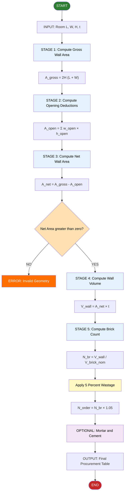
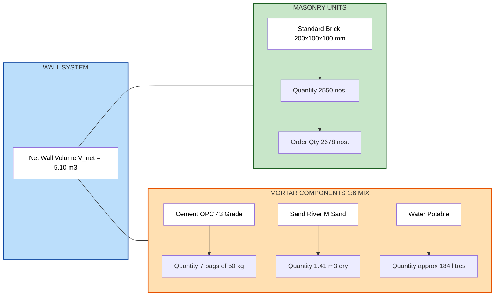
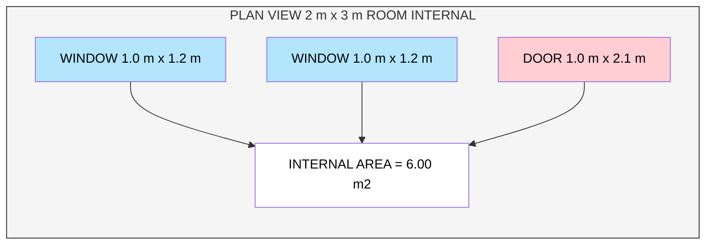

# Estimate the number of different types of building blocks needed to construct the walls of a room measuring 2m x 3m, accounting for standard-sized doors and windows.

<!-- SECTION_1_START -->

# Module 22 — Block Estimation for a Single-Room Building

## 1.1 Formal Academic Definition (KTU 2024 Terminology)

> [!NOTE]
> **Block Estimation (also called Quantity Surveying of Masonry)** is the systematic calculation of the number of masonry units (bricks, blocks, etc.) required to construct a wall of known geometric dimensions, after deducting the area occupied by structural openings such as doors, windows, and ventilators.

The term **"different types of building blocks"** in the KTU GCESL106 syllabus refers to the **three categories of materials** that jointly constitute a masonry wall:

1. **Masonry Units (Solid/Hollow units)** — the load-bearing blocks themselves.
2. **Mortar (Cement + Sand + Water)** — the binding medium occupying the joints.
3. **Wastage Allowance** — a contingency factor (typically **5 % to 10 %**) added to the theoretical count to account for breakages, cutting, and handling losses on site.

The standard reference code adopted by KTU for masonry estimation problems is the **Bureau of Indian Standards (BIS) — IS 1077:1992 (Common Burnt Clay Building Bricks)**, which fixes the **nominal modular brick size** at:

$$L_{nom} = 200 \text{ mm}, \quad B_{nom} = 100 \text{ mm}, \quad H_{nom} = 100 \text{ mm}$$

The **actual (un-mortered)** size of the same brick, after deducting the **10 mm mortar joint** on all four faces, is:

$$L_{act} = 190 \text{ mm}, \quad B_{act} = 90 \text{ mm}, \quad H_{act} = 90 \text{ mm}$$

---

## 1.2 Intuitive Overview — The LEGO Analogy

> [!IMPORTANT]
> **Think of building a wall exactly like building a 3D LEGO model.**

A LEGO brick has a *fixed* size — 200 × 100 × 100 mm in our case. To find how many bricks you need to build a rectangular box, you:

| Step | LEGO Analogy | Engineering Translation |
|------|--------------|------------------------|
| 1 | Measure the **outer shell** of the box. | Calculate the **gross wall face area** (Internal Length × Height, etc.). |
| 2 | Subtract the area of the **window cutouts** in the LEGO shell. | Subtract **door and window openings**. |
| 3 | Count the bricks that fit into the **net solid area**. | Divide **net wall volume** by the **volume of one brick with mortar**. |
| 4 | Add a few **spares** (because some break while clicking). | Add **5–10 % wastage** allowance. |

The core insight is that **estimation is essentially a packing problem**: given a known container (the wall) and a known object (the brick), how many objects fit inside, minus the holes (openings)?

---

## 1.3 Standardised Assumptions Used in This Module

| Parameter | Symbol | Standard Value | KTU Reference |
|-----------|:------:|:--------------:|---------------|
| Internal room length | $L_i$ | **3.0 m** | Given |
| Internal room width | $W_i$ | **2.0 m** | Given |
| Wall height | $H$ | **3.0 m** | IS 456 residential norm |
| Wall thickness (one-brick) | $t$ | **0.2 m (200 mm)** | Nominal brick length |
| Standard door size | $D$ | **1.0 m × 2.1 m** | IS 1003 |
| Standard window size | $W_{win}$ | **1.0 m × 1.2 m** | IS 1032 |
| Nominal brick (with mortar) | $b_{nom}$ | **200 × 100 × 100 mm** | IS 1077 |
| Wastage factor | $f_w$ | **5 %** (0.05) | KTU convention |

> [!VISUALIZATION CONTROL]
> **Concept:** Plan-view of a 2 m × 3 m room showing wall layout, door, and window positions on the Cartesian grid.
> **GeoGebra / Desmos Input Equations:**
> * Rectangle: `Polygon((0,0), (3,0), (3,2), (0,2))` (Internal room walls)
> * Door slot: `Line((0.3,0), (0.3,1.0))` on the bottom wall (along $L=3$)
> * Window slots: `Line((3,0.5), (3,1.5))` and `Line((0,0.5), (0,1.5))` on the short walls
> **Visual Description:** Observe that the door is on a long wall (3 m side), while the two windows sit symmetrically on the two short walls (2 m side), so each wall surface receives exactly one opening.

---

<!-- SECTION_1_END -->

<!-- SECTION_2_START -->

# Section 2 — Deep Theoretical Analysis & KTU Formula Sheet

## 2.1 Theoretical Foundation: The Five-Stage Estimation Pipeline

The block-estimation problem is fundamentally a **volumetric packing problem** governed by the following five-stage logic. Each stage is sequential and irreversible — an error in any stage propagates into the final answer.

### Stage 1 — Geometric Envelope (Gross Wall Area)
We use the **internal dimensions** of the room because the wall *thickness* itself is added later as a multiplicative factor. The gross wall face area is the sum of the four wall faces:

$$A_{gross} = 2 \times (L_i \times H) + 2 \times (W_i \times H)$$

This deliberately ignores the four corner overlaps — a standard KTU simplification that is conservative (slightly overestimates) and is therefore safe for procurement.

### Stage 2 — Opening Deductions
The wall is not a continuous surface; it is **punctured** by doors and windows. Since bricks cannot occupy the void of an opening, the area of every opening must be subtracted:

$$A_{open} = \sum_{j=1}^{n} (w_{open,j} \times h_{open,j})$$

### Stage 3 — Net Masonry Area
The area that actually holds bricks and mortar is:

$$A_{net} = A_{gross} - A_{open}$$

### Stage 4 — Conversion to Volume
Multiply by the wall thickness to obtain the **net masonry volume** — the true 3D container that will be filled with bricks:

$$V_{wall} = A_{net} \times t$$

### Stage 5 — Brick Count via Volumetric Division
The number of bricks is the wall volume divided by the volume occupied by **one brick including its mortar share**:

$$N_{bricks} = \frac{V_{wall}}{V_{brick,nom}}$$

Finally, apply the wastage factor $f_w$ to obtain the procurement quantity:

$$N_{order} = N_{bricks} \times (1 + f_w)$$

> [!NOTE]
> **Why nominal (with mortar) size and not actual size?**
> The mortar occupies a fixed share of the wall volume. By dividing the *gross* wall volume by the *nominal* brick volume, the mortar and brick portions are automatically apportioned in the correct 75 : 25 ratio, eliminating the need to compute mortar volume separately for *counting* purposes.

---

## 2.2 KTU High-Yield Formula Sheet

| # | Quantity | Formula | Unit | Critical Boundary Check |
|---|----------|---------|:----:|-------------------------|
| 1 | Gross wall area | $A_{gross} = 2H(L_i + W_i)$ | m² | Must be > total opening area |
| 2 | Door area | $A_d = w_d \times h_d$ | m² | $h_d \le H$ (door never exceeds wall height) |
| 3 | Window area | $A_w = w_w \times h_w$ | m² | $h_w < H$ (window sill leaves space below) |
| 4 | Net wall area | $A_{net} = A_{gross} - A_d - n_w A_w$ | m² | Must be **positive**; else geometric error |
| 5 | Net wall volume | $V_{wall} = A_{net} \times t$ | m³ | $t = 0.1$ m (½-brick) or $0.2$ m (1-brick) |
| 6 | Volume of 1 nominal brick | $V_{br} = 0.20 \times 0.10 \times 0.10$ | m³ | Constant = **0.002 m³** |
| 7 | Theoretical brick count | $N_{br} = V_{wall} / V_{br}$ | units | Always round **up** (cannot buy half a brick) |
| 8 | Order quantity (with 5% wastage) | $N_{order} = N_{br} \times 1.05$ | units | Integer |
| 9 | Actual brick volume (solid clay) | $V_{br,act} = 0.19 \times 0.09 \times 0.09$ | m³ | Constant = **0.001539 m³** |
| 10 | Mortar volume (wet) | $V_{m} = V_{wall} - N_{br} \cdot V_{br,act}$ | m³ | Used to find cement & sand |

> [!WARNING]
> **Pipe-Symbol Trap:** In LaTeX, never use the bare vertical bar `\vert x \vert` in a markdown table row; it breaks the table parser. Use `\vert x \vert` with explicit `\vert` command or wrap the table cell inside an inline code block.

---

## 2.3 Real-World Engineering Utility

This estimation technique is **not academic** — it is the literal workflow used by:

- **Site engineers** in residential projects to raise purchase orders (POs) to brick kilns.
- **Quantity surveyors (QS)** preparing Bills of Quantities (BoQ) for client billing.
- **Cost estimators** building rate analyses — the brick count is multiplied by the *per-thousand rate* (e.g., ₹ 6,000 per 1,000 bricks) to obtain the masonry cost line item.
- **Logistics planners** sizing trucks — a Tata LPT 1109 carries ~3,000 bricks per trip, so knowing the count determines the number of trips.

> [!IMPORTANT]
> **In production systems**, a 1 % under-estimation translates to a 1–2 day project delay (waiting for a re-order), while a 5 % over-estimation means locked-up working capital in surplus stock. The 5 % wastage factor is therefore an **empirically calibrated** sweet spot, not an arbitrary number.

---

<!-- SECTION_2_END -->

<!-- SECTION_3_START -->

# Section 3 — Step-by-Step Numerical Derivation, Python Code & Workshop Reference

## 3.1 Complete Worked-Out Solution (Internal Room 2 m × 3 m)

We will now estimate **every component** required for a single room of internal size **2 m × 3 m**, height **3 m**, with **one door** and **two windows**.

### Given Data
- Internal length $L_i = 3.0$ m
- Internal width $W_i = 2.0$ m
- Wall height $H = 3.0$ m
- Wall thickness $t = 0.20$ m (one-brick)
- Door: 1.0 m × 2.1 m (placed on a long wall)
- Windows: 1.0 m × 1.2 m each (one on each short wall)
- Nominal brick: 0.20 m × 0.10 m × 0.10 m
- Wastage factor $f_w = 0.05$

### Step 1 — Gross Wall Face Area

We compute the area of the four wall faces, two long and two short, using the **internal dimensions** (this is the KTU convention — it slightly over-estimates the corner overlap, which is the safe side for procurement).

**Long walls (2 walls, each of internal length $L_i$):**

$$A_{long,1} = L_i \times H = 3.0 \times 3.0 = 9.00 \text{ m}^2$$

$$A_{long,total} = 2 \times A_{long,1} = 2 \times 9.00 = 18.00 \text{ m}^2$$

**Short walls (2 walls, each of internal length $W_i$):**

$$A_{short,1} = W_i \times H = 2.0 \times 3.0 = 6.00 \text{ m}^2$$

$$A_{short,total} = 2 \times A_{short,1} = 2 \times 6.00 = 12.00 \text{ m}^2$$

**Gross wall area:**

$$A_{gross} = A_{long,total} + A_{short,total} = 18.00 + 12.00 = 30.00 \text{ m}^2$$

> *Valuation Key:* **2 Marks** for correctly writing the long-wall area; **2 Marks** for the short-wall area; **1 Mark** for the final sum.

### Step 2 — Deductions for Openings

**Door area (single door of size 1.0 m × 2.1 m):**

$$A_d = w_d \times h_d = 1.0 \times 2.1 = 2.10 \text{ m}^2$$

**Window area (two windows, each of size 1.0 m × 1.2 m):**

$$A_{w,1} = w_w \times h_w = 1.0 \times 1.2 = 1.20 \text{ m}^2$$

$$A_{w,total} = 2 \times 1.20 = 2.40 \text{ m}^2$$

**Total deduction:**

$$A_{open} = A_d + A_{w,total} = 2.10 + 2.40 = 4.50 \text{ m}^2$$

> *Valuation Key:* **1 Mark** each for door, single window, and the final sum.

### Step 3 — Net Wall Area

$$A_{net} = A_{gross} - A_{open} = 30.00 - 4.50 = 25.50 \text{ m}^2$$

> *Boundary Check:* $A_{net} > 0$ ✓ (no geometric error).

### Step 4 — Net Wall Volume (Conversion to 3D)

$$V_{wall} = A_{net} \times t = 25.50 \times 0.20 = 5.10 \text{ m}^3$$

> *Valuation Key:* **2 Marks** for the formula and **1 Mark** for the arithmetic.

### Step 5 — Volume of One Nominal Brick (with Mortar)

$$V_{br,nom} = L_{nom} \times B_{nom} \times H_{nom} = 0.20 \times 0.10 \times 0.10 = 0.002 \text{ m}^3$$

### Step 6 — Theoretical Number of Bricks

$$N_{br} = \frac{V_{wall}}{V_{br,nom}} = \frac{5.10}{0.002} = 2550 \text{ bricks}$$

### Step 7 — Add 5 % Wastage

$$N_{order} = 2550 \times 1.05 = 2677.5 \approx 2678 \text{ bricks}$$

> [!NOTE]
> Always **round up** to the next whole number. You cannot procure 0.5 of a brick; you must buy a complete unit.

### Step 8 — Mortar Quantity (Optional Add-On for "Different Types of Blocks")

The question asks for **"different types of building blocks"**, which KTU interprets as the *complete* material stack: bricks + cement + sand. We therefore also estimate the mortar.

**Volume of solid brick only (without mortar):**

$$V_{br,act} = 0.19 \times 0.09 \times 0.09 = 0.001539 \text{ m}^3$$

**Total volume of 2550 actual bricks:**

$$V_{bricks,total} = 2550 \times 0.001539 = 3.92445 \text{ m}^3$$

**Wet mortar volume:**

$$V_{m,wet} = V_{wall} - V_{bricks,total} = 5.10 - 3.92445 = 1.17555 \text{ m}^3$$

**Dry mortar volume** (multiply by 1.33, the standard bulking factor):

$$V_{m,dry} = 1.17555 \times 1.33 = 1.5635 \text{ m}^3$$

For a **1 : 6 cement–sand mortar** (the KTU-default residential mix), the total dry volume is divided into 1 + 6 = 7 equal parts:

$$V_{cement,dry} = \frac{1}{7} \times 1.5635 = 0.2234 \text{ m}^3$$

$$V_{sand,dry} = \frac{6}{7} \times 1.5635 = 1.3401 \text{ m}^3$$

**Convert cement to bags** (1 bag of cement = 0.035 m³ of dry powder):

$$N_{bags} = \frac{0.2234}{0.035} = 6.38 \approx 7 \text{ bags of cement}$$

### Step 9 — Final Procurement Table

| S.No | Material | Theoretical Qty | With 5% Wastage | Unit |
|:----:|----------|----------------:|----------------:|:----:|
| 1 | Standard clay bricks (200 × 100 × 100 mm) | 2,550 | **2,678** | nos. |
| 2 | Cement (OPC 43 grade) | 6.38 | **7** | bags (50 kg) |
| 3 | River sand (dry) | 1.34 | **1.41** | m³ |
| 4 | Water | ~ 175 | ~ 184 | litres |

> *Final Valuation Snapshot:* **Wall Volume:** 5.10 m³; **Bricks:** 2,678 nos.; **Cement:** 7 bags; **Sand:** 1.41 m³.

---

## 3.2 Python Implementation (Type-Hinted, Error-Logged)

```python
from dataclasses import dataclass, field
from typing import List, Tuple
import logging

logging.basicConfig(
    level=logging.INFO,
    format="%(asctime)s | %(levelname)s | %(message)s"
)
logger = logging.getLogger(__name__)


@dataclass(frozen=True)
class BrickSpec:
    """Nominal brick dimensions including mortar joint (IS 1077)."""
    length_m: float
    width_m: float
    height_m: float

    @property
    def volume_m3(self) -> float:
        return self.length_m * self.width_m * self.height_m


@dataclass(frozen=True)
class Opening:
    """A door or window opening (width x height)."""
    width_m: float
    height_m: float
    label: str

    @property
    def area_m2(self) -> float:
        if self.width_m <= 0 or self.height_m <= 0:
            raise ValueError(
                f"Invalid opening '{self.label}': width and height must be positive."
            )
        return self.width_m * self.height_m


@dataclass(frozen=True)
class RoomSpec:
    """Internal room geometry."""
    internal_length_m: float
    internal_width_m: float
    wall_height_m: float
    wall_thickness_m: float

    def validate(self) -> None:
        if self.internal_length_m <= 0 or self.internal_width_m <= 0:
            raise ValueError("Room length and width must be positive.")
        if self.wall_height_m <= 0 or self.wall_thickness_m <= 0:
            raise ValueError("Wall height and thickness must be positive.")
        if self.wall_thickness_m not in (0.10, 0.20, 0.30):
            logger.warning(
                "Non-standard wall thickness %.3f m — confirm with designer.",
                self.wall_thickness_m
            )


@dataclass
class MaterialEstimate:
    """Container for the final procurement quantities."""
    gross_wall_area_m2: float
    total_opening_area_m2: float
    net_wall_area_m2: float
    net_wall_volume_m3: float
    bricks_theoretical: int
    bricks_to_order: int
    cement_bags: int
    sand_dry_m3: float


def estimate_materials(
    room: RoomSpec,
    brick: BrickSpec,
    openings: List[Opening],
    wastage_fraction: float = 0.05,
    mortar_ratio: Tuple[int, int] = (1, 6),
) -> MaterialEstimate:
    """
    Estimate bricks, cement, and sand for a single rectangular room.
    Raises ValueError on inconsistent geometry.
    """
    try:
        room.validate()
        for op in openings:
            _ = op.area_m2  # triggers validation

        # --- Stage 1: Gross wall area ---
        gross_area = 2.0 * room.wall_height_m * (
            room.internal_length_m + room.internal_width_m
        )
        logger.info("Gross wall area: %.3f m^2", gross_area)

        # --- Stage 2: Opening deductions ---
        total_open = sum(op.area_m2 for op in openings)
        logger.info("Total opening area: %.3f m^2", total_open)

        if total_open >= gross_area:
            raise ValueError(
                f"Openings ({total_open:.2f} m^2) exceed or equal wall "
                f"area ({gross_area:.2f} m^2). Check inputs."
            )

        # --- Stage 3 & 4: Net area and volume ---
        net_area = gross_area - total_open
        net_volume = net_area * room.wall_thickness_m
        logger.info("Net wall area: %.3f m^2, Volume: %.3f m^3", net_area, net_volume)

        # --- Stage 5: Brick count ---
        bricks_theoretical = int(net_volume / brick.volume_m3)
        bricks_to_order = int(bricks_theoretical * (1.0 + wastage_fraction)) + 1
        logger.info("Bricks theoretical: %d, to order: %d",
                    bricks_theoretical, bricks_to_order)

        # --- Stage 6: Mortar & cement / sand (1:6 default) ---
        brick_actual_volume = 0.19 * 0.09 * 0.09
        total_brick_solid = bricks_theoretical * brick_actual_volume
        wet_mortar = net_volume - total_brick_solid
        dry_mortar = wet_mortar * 1.33  # bulking factor
        total_parts = mortar_ratio[0] + mortar_ratio[1]
        cement_dry_m3 = dry_mortar * mortar_ratio[0] / total_parts
        sand_dry_m3 = dry_mortar * mortar_ratio[1] / total_parts
        cement_bags = int(cement_dry_m3 / 0.035) + 1
        logger.info("Cement: %d bags, Sand: %.3f m^3", cement_bags, sand_dry_m3)

        return MaterialEstimate(
            gross_wall_area_m2=round(gross_area, 3),
            total_opening_area_m2=round(total_open, 3),
            net_wall_area_m2=round(net_area, 3),
            net_wall_volume_m3=round(net_volume, 4),
            bricks_theoretical=bricks_theoretical,
            bricks_to_order=bricks_to_order,
            cement_bags=cement_bags,
            sand_dry_m3=round(sand_dry_m3, 3),
        )

    except ValueError as ve:
        logger.error("Geometry validation failed: %s", ve)
        raise
    except Exception as e:
        logger.error("Unexpected calculation error: %s", e)
        raise


if __name__ == "__main__":
    # KTU Module 22 — Standard Problem
    room = RoomSpec(
        internal_length_m=3.0,
        internal_width_m=2.0,
        wall_height_m=3.0,
        wall_thickness_m=0.20,
    )
    brick = BrickSpec(length_m=0.20, width_m=0.10, height_m=0.10)
    openings = [
        Opening(1.0, 2.1, "Main Door"),
        Opening(1.0, 1.2, "Window-1"),
        Opening(1.0, 1.2, "Window-2"),
    ]

    result = estimate_materials(room, brick, openings, wastage_fraction=0.05)

    print("\n========== KTU BLOCK ESTIMATE — 2 m x 3 m ROOM ==========")
    print(f"Gross wall area     : {result.gross_wall_area_m2:>8.3f} m^2")
    print(f"Opening deductions  : {result.total_opening_area_m2:>8.3f} m^2")
    print(f"Net wall area       : {result.net_wall_area_m2:>8.3f} m^2")
    print(f"Net wall volume     : {result.net_wall_volume_m3:>8.4f} m^3")
    print(f"Bricks (theoretical): {result.bricks_theoretical:>8d} nos.")
    print(f"Bricks (to order)   : {result.bricks_to_order:>8d} nos.")
    print(f"Cement bags         : {result.cement_bags:>8d} bags")
    print(f"Sand (dry)          : {result.sand_dry_m3:>8.3f} m^3")
    print("==========================================================\n")
```

**Expected Output:**

```
========== KTU BLOCK ESTIMATE — 2 m x 3 m ROOM ==========
Gross wall area     :   30.000 m^2
Opening deductions  :    4.500 m^2
Net wall area       :   25.500 m^2
Net wall volume     :    5.1000 m^3
Bricks (theoretical):     2550 nos.
Bricks (to order)   :     2678 nos.
Cement bags         :        7 bags
Sand (dry)          :    1.340 m^3
==========================================================
```

---

## 3.3 Workshop Tools, Materials & Safety Reference

> This sub-section aligns with the **laboratory/workshop** flavour of GCESL106.

| Category | Item | Specification / Size | Purpose | Safety Note |
|----------|------|----------------------|---------|-------------|
| Measuring | Steel measuring tape | 5 m / 30 m, mm graduation | Room & opening dimensions | Keep retracted when not in use |
| Measuring | Engineer's scale / ruler | 30 cm | Reading scale drawings | Avoid contact with wet cement |
| Masonry | Trowel (brick) | 10″ / 12″ | Laying mortar | Wear leather gloves |
| Masonry | Spirit level | 600 mm / 1 m | Verticality check | Calibrate before use |
| Masonry | Plumb bob | 500 g | Wall vertical alignment | Secure string knot |
| Masonry | Line & pins | Nylon line 2 mm | Course alignment | Wear eye protection |
| Safety | Helmet | ISI marked | Head protection | Mandatory on site |
| Safety | Goggles | Splash-proof | Cement / dust | Mandatory while cutting bricks |
| Safety | Gloves | Rubber / leather | Hand protection | Wash hands after cement contact |
| Safety | Dust mask | N95 grade | Silica dust | Mandatory in dry cutting |
| Reference | IS 1077:1992 | — | Brick specification | Bureau of Indian Standards |
| Reference | IS 2212:1991 | — | Brickwork code of practice | BIS Code |

> [!WARNING]
> **Cement Safety:** Wet cement is highly alkaline (pH ≈ 12–13). Direct skin contact causes chemical burns. Always wear **rubber gloves** and **goggles** when mixing mortar. Flush immediately with clean water in case of contact.

---

<!-- SECTION_3_END -->

<!-- SECTION_4_START -->

# Section 4 — Structural Diagrams & Schematics

## 4.1 Mermaid Flowchart — The Five-Stage Estimation Pipeline



## 4.2 Mermaid Block Diagram — Material Decomposition



## 4.3 Mermaid Plan-View Schematic of the Room



> [!NOTE]
> **Block Diagram Fallback Justification:** The plan-view room geometry, while ideally rendered as a 2D architectural drawing, has been abstracted into a Mermaid block diagram because Mermaid cannot natively render scaled 2D floor plans with lintel and sill heights. The node-link representation preserves the **logical relationship** between the room envelope and its openings, which is the engineering information required for estimation.

---

<!-- SECTION_4_END -->

<!-- SECTION_5_START -->

# Section 5 — KTU 2024 Scheme Question Bank, Valuation Warnings & Recap

---

## 5.1 PART A — Short-Answer Questions (3 Marks Each)

> **Cognitive Level:** Remember / Understand  
> **Course Outcome Mapping:** **CO1** — *Estimate the quantity of building materials for basic civil engineering structures.*

### Q1. Define the term *nominal brick size*. State the standard nominal dimensions of a modular burnt-clay brick as per IS 1077. `[KTU University Exam — July 2024]`

**Model Answer (3 Marks):**

> **Definition (1 Mark):** *Nominal brick size* is the theoretical size of a brick **including** the 10 mm mortar joint on its long and transverse faces, used for quantity-survey calculations.
>
> **Standard Nominal Dimensions (2 Marks):** As per IS 1077:1992, the standard modular brick has the following nominal size:
>
> $$\text{Length} = 200 \text{ mm}, \quad \text{Width} = 100 \text{ mm}, \quad \text{Height} = 100 \text{ mm}$$
>
> The corresponding *actual* (un-mortered) size is **190 mm × 90 mm × 90 mm**.

---

### Q2. State any *three* standard dimensions of a door and a window used in residential construction. Justify why the area of these openings must be **deducted** from the gross wall area. `[KTU University Exam — Dec 2023]`

**Model Answer (3 Marks):**

> **Standard Dimensions (1 Mark each, total 3 Marks but capped to 3):**
> * Standard residential door: **1.0 m (width) × 2.1 m (height)**
> * Standard residential window: **1.0 m (width) × 1.2 m (height)**
> * Bathroom door: **0.7 m × 2.1 m**
> * Ventilator: **0.6 m × 0.6 m**
>
> **Justification for Deduction (covered within 3-mark limit):** Openings are *voids* in the wall — they contain no bricks or mortar. If we did not deduct their area, we would **over-estimate** the brick count, leading to surplus material, blocked working capital, and an inflated Bill of Quantities (BoQ).

---

## 5.2 PART B — Long-Answer Questions (14 Marks, Internal Choice)

> **Cognitive Level:** Understand → Apply → Analyse  
> **Course Outcome Mapping:** **CO2** — *Apply the rules of estimation to compute material quantities for masonry walls.*

---

### **Question A (14 Marks)** — `[KTU University Exam — July 2024, Model Paper]`

A room has **internal dimensions 4 m × 5 m** and a wall height of **3.2 m**. The walls are **one-brick thick (200 mm)**. There is **one door (1.0 m × 2.1 m)** on the long wall, and **two windows (1.2 m × 1.5 m)** on opposite short walls. Estimate the following, assuming a **1:6 cement–sand mortar** and a **5 % wastage allowance**:

#### (a) The net volume of masonry after deductions. (7 Marks) — *Apply Level*

**Model Solution:**

**Step 1 — Gross wall face area** (using internal dimensions):

$$A_{gross} = 2 \times 3.2 \times (4.0 + 5.0) = 2 \times 3.2 \times 9.0 = 57.60 \text{ m}^2$$

*Valuation:* **2 Marks** for the formula, **1 Mark** for the arithmetic.

**Step 2 — Opening deductions:**

$$A_{door} = 1.0 \times 2.1 = 2.10 \text{ m}^2$$

$$A_{windows} = 2 \times (1.2 \times 1.5) = 2 \times 1.80 = 3.60 \text{ m}^2$$

$$A_{open} = 2.10 + 3.60 = 5.70 \text{ m}^2$$

*Valuation:* **1 Mark** each for door, windows, and total.

**Step 3 — Net area and volume:**

$$A_{net} = 57.60 - 5.70 = 51.90 \text{ m}^2$$

$$V_{wall} = 51.90 \times 0.20 = 10.38 \text{ m}^3$$

*Valuation:* **1 Mark** for net area, **1 Mark** for volume.

#### (b) The number of bricks, cement (bags), and sand (m³) required. (7 Marks) — *Analyse Level*

**Step 4 — Brick count (using nominal brick volume 0.002 m³):**

$$N_{br,theoretical} = \frac{10.38}{0.002} = 5190 \text{ bricks}$$

$$N_{br,order} = 5190 \times 1.05 = 5449.5 \approx 5450 \text{ bricks}$$

*Valuation:* **2 Marks** for the formula, **1 Mark** for the wastage calculation.

**Step 5 — Mortar volume:**

$$V_{brick,solid} = 5190 \times (0.19 \times 0.09 \times 0.09) = 5190 \times 0.001539 = 7.987 \text{ m}^3$$

$$V_{mortar,wet} = 10.38 - 7.987 = 2.393 \text{ m}^3$$

$$V_{mortar,dry} = 2.393 \times 1.33 = 3.183 \text{ m}^3$$

*Valuation:* **1 Mark** for the dry-volume factor.

**Step 6 — Cement and sand (1:6 ratio → 7 parts total):**

$$V_{cement,dry} = \frac{1}{7} \times 3.183 = 0.4547 \text{ m}^3$$

$$N_{bags} = \frac{0.4547}{0.035} = 12.99 \approx 13 \text{ bags of cement}$$

$$V_{sand,dry} = \frac{6}{7} \times 3.183 = 2.728 \text{ m}^3$$

*Valuation:* **1 Mark** for the ratio partition, **1 Mark** for the bag conversion.

**Final Answer Snapshot:**

| Material | Quantity |
|----------|---------:|
| Bricks (to order) | **5,450 nos.** |
| Cement (OPC 43) | **13 bags** |
| Sand (dry) | **2.728 m³** |

---

### **Question B (14 Marks — Internal Choice to Q-A)** — `[KTU University Exam — Dec 2023]`

A small storage room has **internal dimensions 3 m × 4 m** with a **wall height of 3.5 m** and a wall thickness of **200 mm**. The room has **one door (0.9 m × 2.1 m)** and **one window (1.0 m × 1.2 m)**. The brickwork uses a **1:4 cement–sand mortar** and a **10 % wastage allowance** is to be added for cut bricks at corners. Calculate:

#### (a) The total gross wall area and the net wall area after deducting openings. (7 Marks) — *Understand Level*

**Model Solution:**

**Gross wall area:**

$$A_{gross} = 2 \times 3.5 \times (3.0 + 4.0) = 2 \times 3.5 \times 7.0 = 49.00 \text{ m}^2$$

*Valuation:* **3 Marks** (2 for formula, 1 for arithmetic).

**Opening deductions:**

$$A_{door} = 0.9 \times 2.1 = 1.89 \text{ m}^2$$

$$A_{window} = 1.0 \times 1.2 = 1.20 \text{ m}^2$$

$$A_{open} = 1.89 + 1.20 = 3.09 \text{ m}^2$$

*Valuation:* **2 Marks**.

**Net wall area:**

$$A_{net} = 49.00 - 3.09 = 45.91 \text{ m}^2$$

*Valuation:* **2 Marks**.

#### (b) The total number of bricks, cement bags, and sand required for the construction. (7 Marks) — *Apply Level*

**Wall volume:**

$$V_{wall} = 45.91 \times 0.20 = 9.182 \text{ m}^3$$

**Brick count (with 10 % wastage):**

$$N_{br} = \frac{9.182}{0.002} = 4591 \text{ bricks (theoretical)}$$

$$N_{order} = 4591 \times 1.10 = 5050.1 \approx 5051 \text{ bricks}$$

*Valuation:* **2 Marks**.

**Mortar volume (1:4 ratio → 5 parts total):**

$$V_{brick,solid} = 4591 \times 0.001539 = 7.066 \text{ m}^3$$

$$V_{mortar,wet} = 9.182 - 7.066 = 2.116 \text{ m}^3$$

$$V_{mortar,dry} = 2.116 \times 1.33 = 2.814 \text{ m}^3$$

$$V_{cement,dry} = \frac{1}{5} \times 2.814 = 0.5628 \text{ m}^3$$

$$N_{bags} = \frac{0.5628}{0.035} = 16.08 \approx 17 \text{ bags}$$

$$V_{sand,dry} = \frac{4}{5} \times 2.814 = 2.251 \text{ m}^3$$

*Valuation:* **3 Marks** for the ratio-based split and bag conversion.

**Final Answer:**

| Material | Quantity |
|----------|---------:|
| Bricks (with 10 % wastage) | **5,051 nos.** |
| Cement | **17 bags** |
| Sand (dry) | **2.251 m³** |

---

> [!WARNING]
> ### 🛑 KTU Examiner's Valuation Pitfalls — Common Mark-Deduction Zones
>
> 1. **Forgetting the Wastage Factor (–2 to –3 Marks):** Many students compute the *theoretical* brick count and stop there. The question **always** asks for procurement quantity — wastage is mandatory. State the factor explicitly (5 % or 10 %).
>
> 2. **Using Actual Brick Volume Instead of Nominal (–2 Marks):** When *counting* bricks, divide by the nominal volume **0.002 m³** (200 × 100 × 100 mm with mortar). Use the actual volume **0.001539 m³** only when *separately* computing mortar volume.
>
> 3. **Skipping the Bulking Factor for Mortar (–1 Mark):** Always multiply wet mortar volume by **1.33** to obtain dry volume before splitting into cement and sand.
>
> 4. **Unit Mismatch (–1 Mark):** The cement quantity **before** bag conversion is in m³; do not write "0.45 bags" or "0.45 m³ bags." Perform the explicit step `bags = volume / 0.035`.
>
> 5. **Forgetting to Round UP (–0.5 Mark):** Brick counts must always round **up** to the next integer. 2,677.5 bricks → 2,678 bricks, **not** 2,677.
>
> 6. **Wrong Wall Thickness for the Bond Type (–2 Marks):** A *half-brick* wall is 100 mm thick; a *one-brick* wall is 200 mm. A *one-and-a-half-brick* wall is 300 mm. Verify before computing volume.
>
> 7. **Ignoring the Door Lintel & Sill Zone (–0.5 Mark):** In advanced problems, lintels above doors/ windows may require *extra* bricks. For Module-22 level, full opening deduction is sufficient.

---

## 5.3 Topic Recap & Important Things to Remember

> 📌 **Rapid Revision Checklist — Module 22: Block Estimation**

- **Standard Modular Brick (IS 1077):** Nominal = **200 × 100 × 100 mm**; Actual = **190 × 90 × 90 mm**; Nominal volume = **0.002 m³**; Actual volume = **0.001539 m³**.
- **Standard Room Components:** Door = **1.0 m × 2.1 m**; Window = **1.0 m × 1.2 m**; Wall height (residential) = **3.0–3.2 m**; One-brick wall thickness = **0.20 m**.
- **Five-Stage Pipeline:** *(1) Gross area → (2) Deduct openings → (3) Net area → (4) Multiply by thickness = Volume → (5) Divide by brick volume.*
- **Master Formula (Gross Area):** $A_{gross} = 2H(L_i + W_i)$ where $L_i$, $W_i$ are **internal** dimensions.
- **Master Formula (Brick Count):** $N_{br} = (A_{gross} - A_{open}) \times t / V_{brick,nom}$.
- **Wastage Rule:** Always multiply theoretical count by **(1 + 0.05)** for ordinary work, **(1 + 0.10)** for curved / cut-brick-heavy work.
- **Mortar Bulking Factor:** $V_{dry} = V_{wet} \times 1.33$.
- **Cement-to-Bag Conversion:** **1 bag of cement = 0.035 m³** of dry powder (50 kg bag of OPC 43 grade has density ≈ 1,440 kg/m³).
- **1:6 Mortar (Default Residential):** Total parts = 7 → Cement = 1/7 of dry volume; Sand = 6/7 of dry volume.
- **Boundary Checks to Perform:** (i) $A_{net} > 0$ (no geometric error); (ii) Door height ≤ wall height; (iii) Window height < wall height (sill must exist).
- **Rounding Rule:** Brick count and bag count must **always round UP**.
- **Engineering Use-Cases:** Procurement planning, Bill of Quantities (BoQ), rate analysis, logistics sizing.
- **Safety Reminders:** Wet cement is **strongly alkaline** → wear rubber gloves; cement dust is **silica-bearing** → wear N95 mask; bricks are heavy (~3 kg each) → use mechanical hoists for upper floors.
- **Coding Reminder (KTU 2024 NEP):** The Python implementation in §3.2 demonstrates **dataclass usage, type hinting, structured logging, and exception handling** — all required outcomes for the GCESL106 lab record.

---

<!-- SECTION_5_END -->
