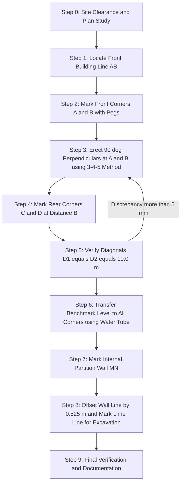
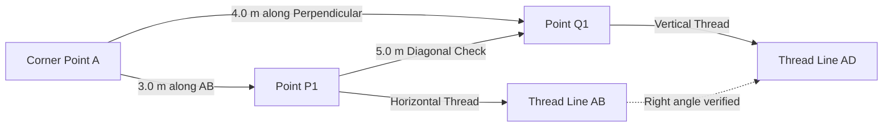
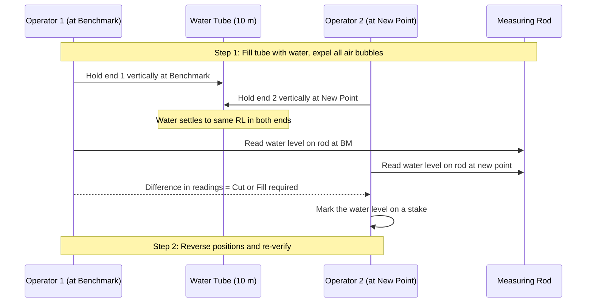
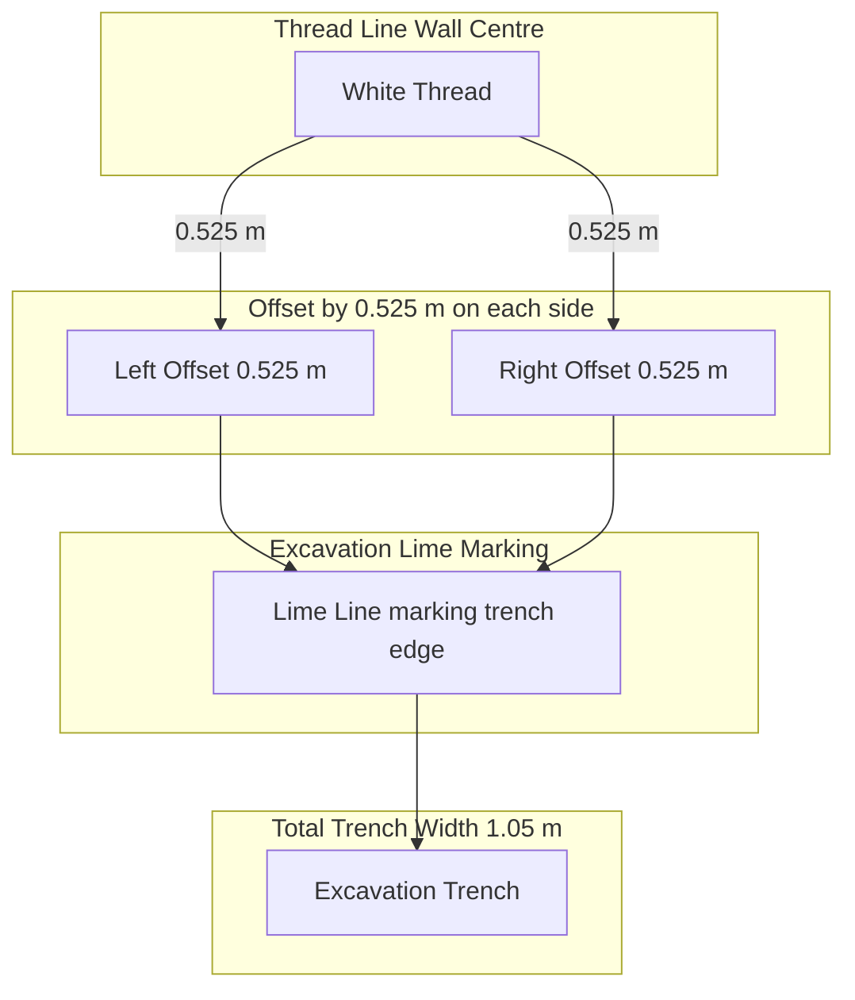
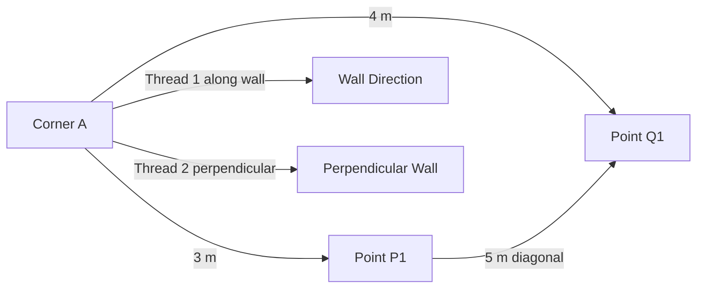

# Setting out of a two roomed building using thread, tape and water tube levelling.

<!-- SECTION_1_START -->

# Setting Out of a Two-Roomed Building Using Thread, Tape & Water Tube Level

## 1.1 Formal Academic Definition (KTU 2024 Syllabus Terminology)

> [!IMPORTANT]
> **Setting Out (Centring / Laying Out)**: The process of transferring the architectural plan of a proposed building from the drawing paper to the actual ground surface, accurately locating all corners, wall centre lines, and excavation widths before any construction activity begins. It is the **first physical step** of construction and forms the geometric foundation of the entire structure.

In the **KTU 2024 Scheme Engineering Workshop (GCESL106)** curriculum, this exercise belongs to *Module 23 – Basic Construction Practices* and is the most critical civil workshop skill because **every subsequent operation** — excavation, foundation laying, wall construction, roofing, and finishing — is geometrically dependent on the accuracy of the initial setting out.

**Setting Out** is performed using three primary tools:
1. **Thread / String Line** – to define straight wall centrelines between pegs.
2. **Measuring Tape (30 m / 50 m linen/fibreglass)** – to lay off exact plan dimensions.
3. **Water Tube Level (Hose Level / Spirit Level connected through transparent pipe)** – to transfer the **Datum / Benchmark Level** accurately across all corners.

**Standard Constants Used in Setting Out**

| Parameter | Standard Value | Purpose |
|---|---|---|
| Right angle method | **3 : 4 : 5** triangle | Squaring building corners |
| Diagonal check | $D_1 = D_2$ | Confirm rectangularity |
| Line colour | **White cotton / Nylon thread** | High ground visibility |
| Tube transparency | **Clear flexible PVC, 10–15 m** | Bubble-free water column |
| Peg cross-section | **50 mm × 50 mm × 450 mm** | Firm ground anchorage |

## 1.2 Conceptual Analogy / Intuition

> [!NOTE]
> **Real-World Analogy — "The Picture Frame on the Ground"**
>
> Imagine you are showing a child how to draw a rectangle on the floor. The drawing on paper is the **architectural plan**. The rectangle on the floor is the **building footprint**. The child uses a **ruler** to measure sides (→ **measuring tape**), a **pencil and straight edge** to mark lines (→ **thread + pegs**), and a **spirit level** to keep it perfectly flat (→ **water tube**). Setting out is exactly that — but on a much larger scale, with engineering precision, where a 10 mm error at the corners can shift the walls by centimetres at the roof level.

**Geometric Intuition (3-4-5 Rule)**
A right-angled triangle with sides proportional to 3, 4, and 5 is the simplest Pythagorean triple. For any rectangle, the diagonal must equal the hypotenuse of the 3-4-5 triangle built on its adjacent sides. This is the **only practical method** for squaring corners on-site without a theodolite.

$$D = \sqrt{L^2 + B^2}$$

For a building of length $L$ and breadth $B$, equal diagonals $D_1$ and $D_2$ confirm the building is **perfectly rectangular**.

> [!VISUALIZATION CONTROL]
> **Concept:** 3-4-5 Right-Angle Triangle used for squaring a building corner
> **GeoGebra / Desmos Input Equations:**
> * Point A = (0, 0)
> * Point B = (4, 0)
> * Point C = (0, 3)
> * Diagonal D: distance from (0,0) to (4,3) = 5
> **Visual Description:** Plot the three sides along the X-axis (length 4 units) and Y-axis (length 3 units). The hypotenuse joining them must measure exactly 5 units — this confirms a 90° corner at the origin.

<!-- SECTION_1_END -->

<!-- SECTION_2_START -->

# Deep Theoretical Analysis & KTU High-Yield Formula Sheet

## 2.1 Underlying Geometric Principles

The setting-out process rests on **three classical principles** of plane geometry and surveying:

### (a) Principle of Rectangularity
A four-cornered closed figure with all interior angles equal to **90°** and opposite sides equal & parallel is a **rectangle**. For any quadrilateral set out on the ground:
$$L_{AB} = L_{CD} \quad \text{(Lengths of opposite long walls)}$$
$$L_{BC} = L_{DA} \quad \text{(Lengths of opposite short walls)}$$
$$\angle A = \angle B = \angle C = \angle D = 90°$$

### (b) Principle of Equal Diagonals
The diagonals of a rectangle are **equal in length** and **bisect each other**:
$$D_{AC} = D_{BD} = \sqrt{L^2 + B^2}$$
This is the **primary field check** after laying out corners.

### (c) Principle of Communicating Vessels
The **water tube level** is a direct practical application of the **Hydrostatic Paradox** — the free surface of water in any connected container lies in the **same horizontal plane**, regardless of the shape, size, or path of the connecting tube.

> [!NOTE]
> **Pascal's Law of Hydrostatics** (1653): In a static fluid, pressure is the same at all points on the same horizontal plane. Hence, water columns in both ends of the transparent tube align at the **same Reduced Level (RL)** when held in air.

## 2.2 Datum & Reduced Level Concepts

Every setting-out operation requires a **Benchmark (BM)** — a permanent reference point of known elevation. The **water tube** is used to transfer this RL to all four corners of the proposed building.

$$\text{RL of any point} = \text{RL of BM} + \text{Height of water column above BM}$$

If the BM is taken as **±0.000 m**, then the **plinth level** is set typically at **+0.300 m to +0.450 m** above the natural ground level (NGL) to prevent water ingress and dampness.

## 2.3 KTU Formula Sheet (High-Yield for Board Exams)

| # | Formula / Rule | Use in Setting Out | Unit |
|---|---|---|---|
| 1 | $D = \sqrt{L^2 + B^2}$ | Diagonal length to be checked | m |
| 2 | $3^2 + 4^2 = 5^2$ | Right angle at each corner | — |
| 3 | $D_1 = D_2$ | Rectangularity check | m |
| 4 | $\text{RL}_{P} = \text{RL}_{BM} + h$ | Level transfer by water tube | m |
| 5 | $\text{Excavation width} = W_c + 2t + 2p$ | Marking trench width | m |
| 6 | $\text{Plinth level} = \text{NGL} + 0.300$ | Reference height for DPC | m |
| 7 | $\text{Setback} \geq 1.5$ m (front), $\geq 1.0$ m (side) | Per local building bylaws | m |
| 8 | $\text{Peg spacing} \leq 1.5$ m | Line support intervals | m |

> **Where:** $W_c$ = Wall thickness, $t$ = Trench offset from wall face, $p$ = Working space, $h$ = height measured on tube scale.

## 2.4 Real-World Engineering Utility

Setting out is the **un-sung hero of every civil project** — a wrongly set out foundation cannot be corrected later without demolition. In **production-grade construction practice**:

- **Residential projects**: Determines plot orientation, sun-path, and Vastu compliance.
- **Commercial complexes**: Critical for column-grid alignment (typically $6 \text{ m} \times 6 \text{ m}$ or $7.5 \text{ m} \times 7.5 \text{ m}$ bays).
- **Highways & Runways**: Uses the same 3-4-5 principle at 100× scale via total stations.
- **Land surveying**: Forms the basis of cadastral mapping and property demarcation.
- **Modern laser scanning**: Replaced by total stations, but the **geometric logic remains unchanged**.

<!-- SECTION_2_END -->

<!-- SECTION_3_START -->

# Step-by-Step Procedure, Tools, & Field Implementation

## 3.1 Required Tools, Materials & Specifications

> [!NOTE]
> The following table must be read in the **Practical / Laboratory context** as required by the KTU 2024 Scheme Engineering Workshop module.

| # | Tool / Material | Specification / Size | Quantity | Purpose in Setting Out |
|---|---|---|---|---|
| 1 | Measuring Tape | Linen / Fibreglass, **30 m** long, graduated in mm | 2 Nos. | Laying off plan dimensions |
| 2 | Cotton / Nylon Thread | White, **2 mm** thick, 50 m roll | 1 Roll | Marking straight wall lines |
| 3 | Water Tube Level | Clear PVC tube, **10–15 m**, 8–10 mm bore | 1 Set | Level transfer between corners |
| 4 | Wooden Pegs | **50 mm × 50 mm × 450 mm** hardwood | 12–15 Nos. | Anchor points for thread lines |
| 5 | Surveyor's Square | Right-angle frame (3-4-5) | 1 No. | Quick corner squaring |
| 6 | Plumb Bob | Brass, **250 g** weight | 1 No. | Vertical alignment of pegs |
| 7 | Mallet / Hammer | **1 kg** head, wooden handle | 1 No. | Driving pegs into ground |
| 8 | Lime Powder | Hydrated white lime, 2 kg | 1 Bag | Marking excavation lines |
| 9 | Mason's Level (Spirit) | **300 mm** vial, accuracy 1 mm/m | 1 No. | Verify horizontal & vertical |
| 10 | Sledge / Spade | Standard digging | 1 No. | Site clearance & trenching |
| 11 | Steel Nails | **50 mm** | 1 Packet | Fixing thread to pegs |
| 12 | Marking Paint / Chalk | Red/blue | 2 Nos. | Peg numbering & reference marks |
| 13 | Notebook & Pencil | Field log | 1 Set | Recording all measurements |
| 14 | Measuring Rod | **1 m** wooden, graduated | 1 No. | Cross-checking wall offsets |
| 15 | Plumb Rule | **1.5 m** long | 1 No. | Vertical wall checks |
| 16 | Water Bucket | 10 L plastic | 1 No. | Filling water tube |
| 17 | Anti-foam Liquid | 50 mL | 1 Bottle | Removing air bubbles from tube |

## 3.2 Pre-Setting-Out Preparations

1. **Site Clearance** – Remove all vegetation, debris, loose soil, and organic matter from the proposed footprint area (extend clearance by at least **1 m** beyond the outer wall line on all sides).
2. **Establish Reference / Benchmark** – Identify a **permanent reference point** (e.g., plinth of a neighbour's building, road kerb, or a fixed stone). Note its **Reduced Level (RL)**.
3. **Study the Plan** – Carefully read the building plan: overall dimensions, wall thicknesses, internal partitions, door & window positions.
4. **Verify Boundary Distances** – Confirm that the proposed building respects all **setback norms** from the plot boundary (front, sides, and rear as per local building rules).
5. **Rehearse the 3-4-5 Triangle** – Practise the method using a 3 m × 4 m × 5 m triangle on open ground before applying to the actual setting out.

## 3.3 Step-by-Step Setting-Out Procedure (Two-Roomed Building)

Let the building be a **two-roomed (2BHK) rectangular plan** with:
- **Length $L$ = 8.0 m**, **Breadth $B$ = 6.0 m**
- **Wall thickness $W_c$ = 0.30 m**
- **Excavation offset $t$ = 0.075 m** on each face
- **Working space $p$ = 0.30 m** on each face
- **Plinth height** = 0.45 m above NGL

> **Excavation width calculation** (Formula 5 from §2.3):
> $$W_{exc} = W_c + 2t + 2p = 0.30 + 2(0.075) + 2(0.30) = 0.30 + 0.15 + 0.60 = \mathbf{1.05 \text{ m}}$$

### **Step 1 — Locate the Front Building Line**
- Mark a point **A** on the front boundary of the plot, at the required **setback distance** (say 1.5 m from the plot edge).
- Stretch a long thread parallel to the road / plot boundary, anchored by pegs at points **A** and **B**.
- Use the water tube to confirm A and B are at the **same level** (level reference check).

### **Step 2 — Mark the Front Wall Corners (Points A and B)**
- From point **A**, measure **8.0 m** along the thread and mark point **B**.
- Hammer a peg at A and another at B. Tie the thread to both pegs at the **top of the peg** with a slight tension.

### **Step 3 — Erect Perpendiculars at A and B (3-4-5 Method)**
- At point **A**, stretch a thread along the AB direction.
- Mark a temporary point **P1** at **3.0 m** from A along AB.
- From A, stretch a second thread perpendicular to AB.
- Mark a point **Q1** at **4.0 m** from A along this perpendicular.
- Measure the distance **P1Q1** — it **must be exactly 5.0 m**. If not, swing the Q1 thread until the 5 m mark is achieved. **Now point A has a true 90° angle.**
- Repeat at point **B** on the opposite end of the front wall to mark point **D**.

### **Step 4 — Locate the Rear Corners C and D**
- The opposite wall line is at distance $B$ = **6.0 m** from the front line.
- Using the perpendiculars erected at A and B, measure **6.0 m** along each to locate points **D** and **C** respectively.
- Hammer pegs at D and C.
- Tie a thread between D and C — this is the **rear wall line**.

### **Step 5 — Diagonal Check (Rectangularity Verification)**
- Measure diagonal **D₁ = A to C**.
- Measure diagonal **D₂ = B to D**.
- **Theoretical value** (Formula 1):
$$D = \sqrt{L^2 + B^2} = \sqrt{8.0^2 + 6.0^2} = \sqrt{64 + 36} = \sqrt{100} = \mathbf{10.0 \text{ m}}$$
- Both diagonals **must measure 10.0 m** within a tolerance of **±5 mm**. If they do not match, adjust corner positions until they do.

### **Step 6 — Transferring Levels Using the Water Tube**
- Fill the transparent tube with **clean water** until water appears in both ends. Add a few drops of **anti-foam liquid** or a small amount of **soap** to eliminate air bubbles.
- Hold one end of the tube vertically against a **graduated rod** placed on the **Benchmark** (e.g., existing plinth of a neighbour at RL = +0.450 m).
- Hold the other end at corner **A** of the proposed building. Wait for the water to settle.
- Mark the **water level** on a small scale held at A. This mark is at the **same RL as the benchmark**.
- Repeat the procedure for corners **B, C, and D**.
- If the NGL at any corner is lower than the required plinth level (+0.45 m), the building corner must be **raised by filling** with compacted earth. If higher, **cutting** is required.

### **Step 7 — Marking Internal Partition Line**
- For a two-roomed building, the internal partition wall runs **parallel to the shorter side**, dividing the 8.0 m length into **two 4.0 m rooms** (typical).
- Mark a midpoint **M** on the front wall AB (at 4.0 m from A) and a corresponding midpoint **N** on the rear wall DC.
- Erect a perpendicular at M (using 3-4-5 method) and connect M to N with a thread.
- Drive pegs at **P₁, P₂, P₃, P₄** along MN at intervals of 1.5 m to support the thread.

### **Step 8 — Marking Excavation Lines with Lime**
- Using a measuring rod, offset the **wall centre line** outward by **(W_c/2 + t + p) = 0.15 + 0.075 + 0.30 = 0.525 m** on both faces of every wall.
- Lay a continuous **lime line** along the offset path — this marks the **edge of the excavation trench**.
- The total **trench width** is therefore **1.05 m** (verified in the formula calculation above).
- Mark intersection points of perpendicular walls with a **bold cross** of lime for the mason's reference.

### **Step 9 — Final Verification & Documentation**
- Re-measure all four wall lengths, both diagonals, and the internal partition length.
- Compare with the plan dimensions; the discrepancy must be **≤ 5 mm per 10 m** run.
- Take photographs and prepare a **sketch** in the field notebook showing all corner pegs, measurements, and offsets.
- The corners are now **ready for excavation**.

## 3.4 Water Tube Level — Field Operation Protocol

1. **Submerge the entire tube** in a water bucket to wet the inner surface — this prevents air-pocket formation.
2. **Fill slowly** with clean water, ensuring no air enters.
3. **Hold both ends together** at the same height to check water level — both should match exactly. If not, the tube has a blockage.
4. **In operation**, two persons hold the ends vertically. One on the benchmark rod, the other at the new point.
5. The **water meniscus** in each tube is the horizontal reference. Mark on a small scale held at the new point.
6. The **difference** between this mark and the ground at the new point gives the **cut or fill** required.
7. Always **double-check** by reversing the operators' positions and re-reading the level.

> [!IMPORTANT]
> **Bubble-Free Protocol**: Even a **single air bubble** of 5 mm length can cause an error of **±5 mm at the second meniscus** due to surface tension. Always re-fill if any bubble is visible, and walk the tube to expel trapped air.

<!-- SECTION_3_END -->

<!-- SECTION_4_START -->

# Structural Diagrams & Schematics

## 4.1 Setting-Out Workflow (Mermaid Flowchart)



## 4.2 Two-Roomed Building Setting-Out Plan View (Mermaid Block Diagram)

```mermaid
graph TB
    subgraph Boundary[Plot Boundary]
        RD[Road / Plot Edge]
    end
    subgraph Setback[Setback Zone 1.5 m]
        SB1[Front Setback]
        SB2[Side Setback]
    end
    subgraph FrontWall[Front Wall Line AB Length 8.0 m]
        PA[Peg A]
        PB[Peg B]
    end
    subgraph RearWall[Rear Wall Line DC Length 8.0 m]
        PD[Peg D]
        PC[Peg C]
    end
    subgraph Partition[Internal Partition Wall MN Length 6.0 m]
        PM[Peg M Front Mid]
        PN[Peg N Rear Mid]
    end
    subgraph Diagonals[Diagonal Verification]
        D1[Diagonal D1 A to C 10.0 m]
        D2[Diagonal D2 B to D 10.0 m]
    end
    subgraph Trench[Excavation Trench Width 1.05 m]
        TR[Marked with Lime on all 4 sides]
    end
    PA -.8.0 m.-> PB
    PB -.6.0 m.-> PC
    PC -.8.0 m.-> PD
    PD -.6.0 m.-> PA
    PM -.6.0 m.-> PN
    PA -.10.0 m.-> PC
    PB -.10.0 m.-> PD
```

## 4.3 3-4-5 Triangle Squaring Method (Mermaid Geometric Schematic)



## 4.4 Water Tube Level — Level Transfer Sequence



## 4.5 Setting-Out Wall Offset & Trench Cross-Section



<!-- SECTION_5_END -->

<!-- SECTION_5_START -->

# KTU 2024 Scheme Examination Question Bank & Topic Recap

## 5.1 Part A Questions (3 Marks Each)

### Question 1
**[KTU University Exam – July 2024, Model QP Set A]**
**Define the term "Setting Out" of a building. List the four primary tools required for setting out a small residential building.**
**Course Outcome:** CO1 | **RBT Level:** Remember

**Model Answer (3 Marks):**
**Setting Out** is the process of transferring the building plan from the drawing to the ground surface by accurately locating and marking the positions of walls, corners, and foundations prior to excavation.
**Primary Tools (any 4):**
1. Measuring tape (linen / fibreglass, 30 m).
2. Thread / string line (white cotton or nylon).
3. Water tube level (clear PVC, 10–15 m).
4. Wooden pegs (50 mm × 50 mm × 450 mm).
5. Plumb bob and spirit level (auxiliary).
*[Tool list correct: 2 Marks; Definition accurate: 1 Mark]*

### Question 2
**[KTU University Exam – Dec 2023, Model QP Set B]**
**State the 3-4-5 rule used in setting out. Why are diagonals of a rectangular building set out and checked to be equal?**
**Course Outcome:** CO1, CO2 | **RBT Level:** Understand

**Model Answer (3 Marks):**
The **3-4-5 rule** is an application of the Pythagoras theorem. From a corner, mark **3 m** along one wall and **4 m** along the perpendicular direction. The hypotenuse between these two points must measure exactly **5 m**, confirming a **90° angle**.
The diagonals are checked to be equal because, for a perfect rectangle, the **two diagonals must be identical** in length, each equal to $\sqrt{L^2 + B^2}$. Equal diagonals confirm that:
- All four corners are right angles.
- Opposite sides are parallel and equal.
- The plan is geometrically a true rectangle (no rhombus or trapezoidal distortion).
*[3-4-5 statement: 1.5 Marks; Diagonal purpose: 1.5 Marks]*

## 5.2 Part B Questions (14 Marks Each — Internal Choice)

### Question A (14 Marks)
**[KTU University Exam – July 2024, Model QP Set A]**
**(a)** Explain the procedure of setting out a two-roomed rectangular building plan of size **8 m × 6 m** using thread, tape, and the 3-4-5 method. Sketch the plan and label all dimensions. **(7 Marks)**
**(b)** Describe with a neat sketch the **water tube level** and the procedure of transferring the Benchmark Reduced Level (RL = +0.450 m) to the four corners of the building. **(7 Marks)**

**Course Outcome:** CO2, CO3 | **RBT Level:** Apply

#### Part (a) — Model Solution (7 Marks)

**Procedure Steps (Sketch + Description):**

1. **Mark front wall AB = 8.0 m**: Drive pegs at A and B; stretch thread.
2. **Erect perpendicular at A** using the **3-4-5 method**:
   - Mark P₁ at 3 m from A on AB.
   - Mark Q₁ at 4 m on a perpendicular thread from A.
   - Adjust until P₁Q₁ = 5 m. → Corner A is squared.
3. **Erect perpendicular at B** similarly → Corner B is squared.
4. **Mark D at 6 m** from A along the perpendicular, and **C at 6 m** from B along the other perpendicular.
5. **Drive pegs at C and D**; tie thread DC.
6. **Diagonal check**:
$$D_1 = D_2 = \sqrt{8.0^2 + 6.0^2} = \sqrt{100} = \mathbf{10.0 \text{ m}}$$
7. **Internal partition** at midpoint M (4 m from A) and N (4 m from B), connect M to N.

**Sketch (ASCII representation in field log):**
```
        D --------- 6.0 m --------- C
        |                         |
        |                         |
        |                         |
        | 8.0 m           8.0 m   |  6.0 m
        |                         |
        A --------- 6.0 m --------- B
                     ↑
                   Internal Partition
```

**Valuation Key:**
*[Sketch with labelled dimensions: 2 Marks]*
*[Front wall and perpendicular construction: 2 Marks]*
*[Diagonal check with numerical value: 1 Mark]*
*[Internal partition marking: 1 Mark]*
*[Logical flow of steps: 1 Mark]*

#### Part (b) — Model Solution (7 Marks)

**Water Tube Level Description:**
- A **transparent flexible PVC tube** of 10–15 m length, internal bore 8–10 mm, open at both ends.
- Filled with clean water (no air bubbles) — works on the **principle of communicating vessels**.

**Procedure to Transfer RL +0.450 m:**

1. **Establish a Benchmark (BM)** at a known RL of +0.450 m (e.g., a permanent stone or the plinth of an existing building).
2. **Fill the tube** with water, ensuring no air bubbles are trapped. Add a few drops of soap to reduce surface tension.
3. **Operator 1** holds one end of the tube vertically against a graduated rod placed on the **BM**.
4. **Operator 2** holds the other end vertically at **Corner A** of the proposed building.
5. After the water settles, **both meniscuses are at the same RL** (+0.450 m).
6. **Mark the water level** on a stake at Corner A — this point is at **+0.450 m RL**.
7. **Repeat** for corners B, C, and D. The plinth level of the building is now established at all corners.
8. **Calculate cut / fill** at each corner: Difference between RL of plinth (+0.450 m) and the existing NGL at that corner gives the **cut (if positive)** or **fill (if negative)** required.

**Field Sketch (Mermaid):**


**Valuation Key:**
*[Description of tube and principle: 2 Marks]*
*[Step-by-step level transfer procedure: 3 Marks]*
*[Cut / fill interpretation: 1 Mark]*
*[Neat field sketch: 1 Mark]*

### Question B (14 Marks — Alternative Choice)
**[KTU University Exam – Dec 2023, Model QP Set B]**
**(a)** Explain the **3-4-5 method** of squaring a building corner with a neat sketch. State the Pythagorean relationship used. **(7 Marks)**
**(b)** A two-roomed building of overall dimensions **10 m × 7 m** with 0.30 m thick walls is to be set out. Calculate the **diagonal length**, the **excavation trench width** (assuming offset 0.075 m and working space 0.30 m on each side), and the **total plinth area** to be marked. **(7 Marks)**

**Course Outcome:** CO2, CO3 | **RBT Level:** Apply, Analyse

#### Part (a) — Model Solution (7 Marks)

**The 3-4-5 Method** is a direct application of the **Pythagorean Theorem** for constructing a right angle on the ground using only a measuring tape.

**Pythagorean Relationship:**
$$3^2 + 4^2 = 5^2$$
$$9 + 16 = 25$$

**Procedure:**

1. From corner point **A**, stretch a thread along the wall direction and mark point **P₁** at exactly **3.0 m** from A.
2. From A, swing a second thread in a roughly perpendicular direction. Adjust the position of a point **Q₁** until the distance **P₁Q₁** measures **exactly 5.0 m**.
3. The distance from A to Q₁ will then be exactly **4.0 m**, and the angle at A is a **true 90°**.
4. This technique scales: e.g., **6-8-10** for higher accuracy, or **9-12-15** for very large buildings.

**Neat Sketch:**


**Valuation Key:**
*[Pythagorean statement: 1 Mark]*
*[Procedure: 3 Marks]*
*[Sketch with labels: 2 Marks]*
*[Scaling note (6-8-10 / 9-12-15): 1 Mark]*

#### Part (b) — Model Solution (7 Marks)

**Given:** $L = 10.0$ m, $B = 7.0$ m, $W_c = 0.30$ m, $t = 0.075$ m, $p = 0.30$ m.

**(i) Diagonal Length:**
$$D = \sqrt{L^2 + B^2} = \sqrt{10.0^2 + 7.0^2} = \sqrt{100 + 49} = \sqrt{149}$$
$$D = \mathbf{12.206 \text{ m} \approx 12.21 \text{ m}}$$

**[Formula statement: 1 Mark; Substitution: 1 Mark; Final value: 1 Mark]**

**(ii) Excavation Trench Width:**
$$W_{exc} = W_c + 2t + 2p = 0.30 + 2(0.075) + 2(0.30)$$
$$W_{exc} = 0.30 + 0.15 + 0.60 = \mathbf{1.05 \text{ m}}$$

**[Formula: 1 Mark; Substitution: 1 Mark; Final value: 1 Mark]**

**(iii) Total Plinth Area (outer-to-outer of walls):**
$$A_{plinth} = L \times B = 10.0 \times 7.0 = \mathbf{70.0 \text{ m}^2}$$

**[Formula and direct answer: 1 Mark]*

> [!WARNING]
> **KTU Examiner's Common Pitfall Callout**
> - **Pitfall 1**: Students often use the *inner dimensions* (room dimensions) for the diagonal check. The diagonal must be computed using the **outer / overall plan dimensions** of the building, not the clear room size.
> - **Pitfall 2**: Forgetting the **2×** multiplier for offset and working space in the trench width formula — writing $W_c + t + p$ instead of $W_c + 2t + 2p$. This is the **#1 error** in KTU valuation scripts.
> - **Pitfall 3**: Reporting the diagonal in cm (e.g., "1220.6 cm") — always convert and report in **metres with two decimal places**.
> - **Pitfall 4**: Not drawing the **excavation trench cross-section** showing the offset and working space clearly — examiners allocate 1–2 marks for this in (b)-part questions.
> - **Pitfall 5**: Failing to mention the **air-bubble elimination protocol** in the water tube procedure — a single bubble causes a **5 mm error** in level transfer.

---

## 5.3 Topic Recap & Important Things to Remember

> [!IMPORTANT]
> **Rapid Revision Checklist — Setting Out of a Two-Roomed Building**

- **Definition**: Transferring the building plan from paper to ground before construction.
- **Primary Tools**: Measuring tape (30 m), thread, water tube level, pegs, mallet, lime, plumb bob, spirit level.
- **First Step Always**: Site clearance → study the plan → verify setbacks → identify the Benchmark.
- **Reference Rectangle**: Length $L$ and Breadth $B$ marked first along the front wall line.
- **3-4-5 Method** is the **only practical field method** to erect a true 90° without instruments.
  - Scales: **3-4-5**, **6-8-10**, **9-12-15** — higher ratio = higher accuracy.
- **Diagonal Check** (MOST CRITICAL): $D_1 = D_2 = \sqrt{L^2 + B^2}$ within **±5 mm tolerance** for a 10 m run.
- **Water Tube Level**: Works on **Pascal's Law of Hydrostatics** — communicating vessels.
  - **Always expel air bubbles** before use; even a 5 mm bubble causes a 5 mm error.
  - Mark the water meniscus on a graduated scale; the difference = cut or fill.
- **Plinth Level**: Typically **+0.300 m to +0.450 m** above NGL.
- **Excavation Width**: $W_{exc} = W_c + 2t + 2p$ — always multiply offset and working space by **2** (both sides).
- **Internal Partition**: Marked at the **midpoint** of the longer wall, perpendicular to it.
- **Lime Marking**: Final step before excavation — marks the **outer edge of the trench**.
- **Field Log**: A neat sketch with all dimensions, corner labels (A, B, C, D, M, N), and the **Benchmark RL** is **mandatory** for full marks.
- **Safety**: Wear gloves and safety shoes; keep tube away from sharp edges; do not over-stretch the measuring tape.
- **Permissible Tolerance**: **±5 mm per 10 m run** for a residential building setting out.
- **Modern Alternatives**: Total station and GPS-based setting out are used for large projects, but the **3-4-5 + diagonal + water tube logic remains foundational**.

<!-- SECTION_5_END -->
