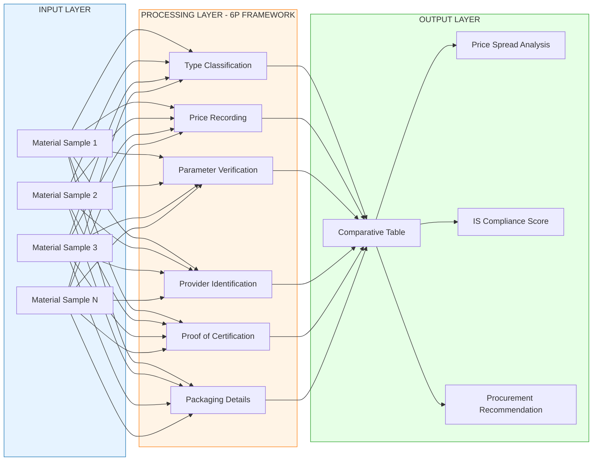
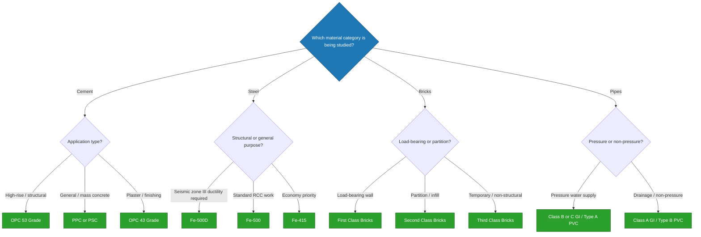

# Conduct a market study to understand the types, prices, and general specifications of at least three materials available in the market (such as bricks, cement, aggregates, steel, plumbing items, fixtures, welding rods, fasteners etc.).

<!-- SECTION_1_START -->
# Module 24: Market Study of Engineering Materials

## 1.1 Core Technical Definition

> [!NOTE]
> **Market Study (Engineering Materials Context):** A systematic, field-based investigation conducted by an engineering student or professional to identify, compare, and document the **types**, **prevailing market prices**, **general technical specifications**, **brand variations**, and **supplier networks** of construction and workshop materials available in the local/regional market, in order to make informed procurement, design, and execution decisions aligned with project requirements, IS (Indian Standard) codes, and budget constraints.

In the KTU 2024 Scheme (GCESL106 – Engineering Workshop), Module 24 mandates that every student must conduct an actual physical visit to local dealers, hardware stores, and authorized distributors, gather authentic product data sheets, and prepare a **comparative market report** covering at least three distinct categories of materials drawn from the prescribed list: bricks, cement, aggregates, steel (TMT bars), plumbing items, sanitary fixtures, welding rods, and fasteners.

### 1.2 Intuitive Analogy — "The Shopkeeper's Ledger"

> [!IMPORTANT]
> **Conceptual Analogy:** Imagine you are planning a wedding feast. Before finalizing the menu, you walk through three different caterers, note down their dish varieties, portion sizes (specifications), per-plate rates (prices), and ingredient quality. You then sit down and compare — the "market study" for engineering materials is exactly this process, but for construction components. The caterers are **dealers/brand distributors**, the dishes are **material types**, the portion sizes are **technical specifications (IS code compliance, dimensions, grade)**, and the per-plate cost is the **unit market price**.

The objective is **decision-making literacy** — a civil engineer who has never touched a brick in a market cannot realistically supervise procurement on-site. This module bridges the gap between textbook theory (e.g., "OPC 53 grade cement") and field reality (e.g., "This 50 kg bag of UltraTech OPC 53 is currently ₹420 in the Trivandrum market, June 2024").

### 1.3 Why This Module Exists in the 2024 Scheme

> [!IMPORTANT]
> **KTU 2024 Scheme NEP Alignment:** This module directly maps to **CO5 — "Engage in self-directed lifelong learning to update knowledge of contemporary engineering practices and materials."** It also strengthens the **Engineer and Society** graduate attribute by exposing students to the socioeconomic dimension of construction — pricing volatility, regional availability, GST implications, and the gap between ISI-marked and non-certified products.

### 1.4 Scope of the Market Study

The market study is **not** a literature review. It is a **primary data collection exercise** involving:

1. **Physical site visit** to a minimum of two vendors per material category.
2. **Visual and tactile inspection** of physical samples.
3. **Collection of printed/handwritten rate lists** from each vendor.
4. **Verification of IS certification marks** embossed on the products.
5. **Recording of manufacturer brand names, batch numbers, and manufacturing dates.**
6. **Photography and sketch documentation** of samples.
7. **Compilation of a comparative report** with a final recommendation matrix.

> [!VISUALIZATION CONTROL]
> **Concept:** Three-Material Price vs. Specification Scatter Comparison
> **Desmos Input Equations (sample representation for 3 materials):**
> * Point A: $(x_1, y_1) = (420, 53)$ — Cement: ₹420/bag, Grade 53 MPa
> * Point B: $(x_2, y_2) = (12, 7.5)$ — Bricks: ₹12/unit, 7.5 N/mm² strength
> * Point C: $(x_3, y_3) = (65000, 500)$ — TMT Steel: ₹65,000/ton, Fe-500D grade
> **Visual Description:** The student should plot a comparative bar/line chart where the X-axis represents the unit market price (₹) and the Y-axis represents the corresponding primary performance metric (strength in N/mm² or MPa). A steeper upward slope (price-to-performance ratio) indicates better economic value for engineering procurement.

<!-- SECTION_1_END -->

<!-- SECTION_2_START -->
# Module 24: Theoretical Framework & High-Yield Reference

## 2.1 The Six-Parameter Comparative Framework

Every material evaluated in a KTU Module 24 market study must be analyzed using the following six standardized parameters. This framework ensures consistency across the comparison report and aligns with industry procurement checklists.

> [!NOTE]
> **The 6P Framework:** **T**ype, **P**rice, **P**arameters (Specifications), **P**rovider (Brand/Vendor), **P**roof (IS certification), and **P**ackaging (Unit/Quantity).

### 2.2 Parameter Definitions

1. **Type (Material Sub-category):** The classification of the material based on composition, manufacturing process, or intended application.
2. **Price (Unit Market Rate):** The prevailing retail price per standard unit in ₹ (INR), inclusive or exclusive of GST as specified by the vendor.
3. **Parameters (Technical Specifications):** The measurable engineering properties — dimensions, strength, density, chemical composition, thermal/electrical conductivity, etc.
4. **Provider (Brand & Vendor):** Manufacturer name, authorized dealer, and vendor contact details including GSTIN.
5. **Proof (Certification):** Presence and validity of the **BIS (Bureau of Indian Standards) ISI mark**, batch test certificates, and ISO 9001 manufacturing compliance.
6. **Packaging (Delivery Unit):** Standard unit of sale — per piece, per kg, per bag, per ton, per meter, per liter, etc.

## 2.3 KTU High-Yield Material Specification Cheat Sheet

> [!IMPORTANT]
> The following table summarizes the **standard IS codes, dimensions, grades, and unit pricing conventions** that students must verify during their market visits. These specifications are the most frequently tested values in KTU viva-voce and report evaluations.

| Material Category | Relevant IS Code | Standard Grade / Type | Standard Unit of Sale | Common Dimensions / Specs | Indicative Market Price Range (2024, Kerala) |
| :--- | :--- | :--- | :--- | :--- | :--- |
| **Burnt Clay Bricks** | IS 1077:1992 | First Class, Second Class, Third Class | Per 1000 units | $230 \text{ mm} \times 110 \text{ mm} \times 70 \text{ mm}$ | ₹8,000 – ₹14,000 per 1000 |
| **Cement (OPC)** | IS 269:2015 | OPC 43, OPC 53 | 50 kg bag | Specific surface $\geq 225 \text{ m}^2/\text{kg}$ (OPC 43) | ₹380 – ₹480 per bag |
| **Cement (PPC)** | IS 1489:2015 | Fly-ash based PPC | 50 kg bag | Fly-ash content 15\% – 35\% | ₹350 – ₹430 per bag |
| **Fine Aggregate (M-Sand)** | IS 383:2016 | Zone II, Zone III | Per cubic meter / brass | Fineness Modulus 2.6 – 3.1 | ₹1,800 – ₹2,800 per brass |
| **Coarse Aggregate** | IS 383:2016 | 20 mm, 12.5 mm, 10 mm crushed | Per cubic meter / brass | Nominal size as per grading | ₹2,500 – ₹3,800 per brass |
| **TMT Steel Bars** | IS 1786:2008 | Fe-415, Fe-500, Fe-500D, Fe-550 | Per kg / ton | Diameter 8, 10, 12, 16, 20, 25 mm | ₹58 – ₹78 per kg |
| **GI Pipes (Plumbing)** | IS 1239:2004 | Class A (Light), Class B (Medium), Class C (Heavy) | Per meter / 6 m length | Nominal bore 15, 20, 25, 32, 40, 50 mm | ₹180 – ₹850 per meter |
| **PVC Pipes (Plumbing)** | IS 4985:2000 | Type A (Pressure), Type B (Non-pressure) | Per meter / 3 m / 6 m length | 20, 25, 32, 40, 50, 75, 110 mm OD | ₹45 – ₹380 per meter |
| **Welding Electrodes** | IS 814:2004 | E-6013, E-7018, E-308L (SS) | Per kg / 5 kg pack | Diameter 2.5, 3.15, 4.0 mm | ₹220 – ₹520 per kg |
| **Fasteners (Bolts)** | IS 1363:2002 | Hex Bolt Grade 4.6, 8.8, 10.9 | Per kg / per piece | M6, M8, M10, M12, M16, M20 | ₹180 – ₹450 per kg |
| **Sanitary Fixtures** | IS 2556:2004 | Vitreous China, Ceramic | Per piece | Floor-mounted / Wall-hung | ₹2,500 – ₹25,000+ per piece |

> [!NOTE]
> All prices indicated are **indicative ranges** as observed in Kerala retail markets during 2024 and are subject to regional variation, fuel surcharges, and seasonal demand. Students must record **actual quoted prices** during their field visit with date and vendor stamp for authenticity.

## 2.4 Real-World Engineering Utility

> [!IMPORTANT]
> **Industry Application:** The methodology taught in this module is the same foundational framework used by **Quantity Surveyors (QS)**, **Purchase Officers in EPC (Engineering, Procurement, Construction) firms**, and **tendering consultants** who prepare **Bill of Quantities (BoQ)** and **Schedule of Rates (SoR)** documents. The Government of Kerala's Public Works Department (PWD) publishes a **Department Schedule of Rates (DSR)** updated biannually, which is essentially a giant market study document that this module trains students to produce at a micro-scale for academic evaluation.

The market study also teaches the critical engineering skill of **price normalization** — understanding that a higher unit price does not always mean higher cost, because durability, wastage factor, and lifecycle performance must be accounted for. For instance, **Fe-500D TMT steel** costs approximately 8\% more than Fe-415 but offers superior seismic ductility, making it the preferred choice in Kerala's seismic Zone III.

## 2.5 GST & Taxation Awareness

> [!WARNING]
> **Valuation Pitfall (Viva-voce):** Many students record the MRP (Maximum Retail Price) printed on the product and assume it is the procurement rate. The correct procurement rate is the **dealer net price before GST**, which may be 15\% – 25\% lower than MRP. Always ask the vendor: *"What is the contractor/dealer rate excluding GST?"* and record both values.

Standard GST rates applicable to construction materials in India (as of 2024):

* **Cement:** **28\%** GST
* **TMT Steel:** **18\%** GST
* **Bricks & Aggregates:** **5\%** GST
* **Pipes (Metal):** **18\%** GST
* **Pipes (Plastic/PVC):** **18\%** GST
* **Sanitary Fixtures:** **18\%** – **28\%** GST (depending on material)

<!-- SECTION_2_END -->

<!-- SECTION_3_START -->
# Module 24: Step-by-Step Market Study Procedure & Data Recording

## 3.1 Pre-Visit Preparation Checklist

Before physically visiting the market, the student must complete the following preparatory steps to ensure a structured and productive data collection exercise.

| Step No. | Task | Output / Deliverable | Time Required |
| :--- | :--- | :--- | :--- |
| 1 | Identify the local market cluster (e.g., Chalai in Trivandrum, Broadway in Kochi) | Vendor list with addresses | 1 hour |
| 2 | Prepare a **printed proforma table** for each material category | 3 blank proforma sheets minimum | 30 minutes |
| 3 | Carry a **measuring tape, vernier caliper (if available), weighing scale check weights, and a smartphone** | Field toolkit ready | 15 minutes |
| 4 | Review the relevant **IS code** specification ranges for each material | Pocket reference card | 1 hour |
| 5 | Carry a **college ID card, letter from HoD (if required), and a hardbound notebook** | Identity proof | 10 minutes |

## 3.2 Field Visit Procedure — 12 Sequential Steps

> [!NOTE]
> The following 12-step procedure is the **gold standard** for executing a Module 24 market study. KTU evaluators expect this workflow to be reflected in the methodology section of the submitted report.

1. **Arrive at the vendor premises** and request permission to inspect goods and rate lists.
2. **Identify the material type** displayed — note the printed brand name, manufacturer logo, and IS code.
3. **Verify the IS certification mark** — look for the **ISI stamp** embossed/printed on the product or its packaging.
4. **Measure physical dimensions** of at least 3 random samples using a measuring tape or caliper.
5. **Record the manufacturing date and batch number** from the packaging.
6. **Photograph the product** from at least 3 angles — front (brand), side (specifications), and packaging (rate/weight).
7. **Request a printed rate list** from the vendor. If unavailable, handwrite the quoted rates in the notebook with vendor signature/stamp.
8. **Ask for the GST component** separately — record base price, GST\%, and MRP.
9. **Probe for bulk discounts** — "If I buy 100 bags of cement, what is the rate?" This reveals the true market dynamics.
10. **Visit a second vendor** for the same material and repeat steps 1 – 9 to enable price comparison.
11. **Conduct a brief interview** with the shopkeeper — ask about the most demanded brand, seasonal price variation, and availability of certified vs. non-certified products.
12. **Thank the vendor**, note the contact number, and move to the next material category.

## 3.3 Sample Data Recording Proforma (For Cement)

The following proforma is the **template students must populate** for the cement category. All fields are mandatory for full KTU valuation marks.

| S.No. | Field Description | Vendor 1 Data | Vendor 2 Data |
| :--- | :--- | :--- | :--- |
| 1 | Vendor name and address | _To be filled_ | _To be filled_ |
| 2 | Contact number of vendor | _To be filled_ | _To be filled_ |
| 3 | Date of visit | _To be filled_ | _To be filled_ |
| 4 | Brand name (e.g., UltraTech, ACC, Ramco) | _To be filled_ | _To be filled_ |
| 5 | Cement type (OPC 43 / OPC 53 / PPC / PSC) | _To be filled_ | _To be filled_ |
| 6 | IS code printed on bag | _To be filled_ | _To be filled_ |
| 7 | ISI mark present? (Yes / No) | _To be filled_ | _To be filled_ |
| 8 | Net weight of bag (kg) — verify on weighing scale | _To be filled_ | _To be filled_ |
| 9 | Manufacturing date and batch number | _To be filled_ | _To be filled_ |
| 10 | MRP printed on bag (₹) | _To be filled_ | _To be filled_ |
| 11 | Dealer/contractor rate excluding GST (₹) | _To be filled_ | _To be filled_ |
| 12 | GST\% applicable | _To be filled_ | _To be filled_ |
| 13 | Bulk discount offered (per 100 bags) | _To be filled_ | _To be filled_ |
| 14 | Photograph reference number | _To be filled_ | _To be filled_ |

> [!IMPORTANT]
> **Pro Tip — The "₹42 Question":** During KTU viva, examiners commonly ask: *"What was the rate of a 50 kg bag of OPC 53 cement in the market you visited, and what is the price per kg?"* Students who have done the actual visit can answer instantly. Students who have fabricated data stumble. The expected calculation is:

$$\text{Price per kg} = \frac{\text{Quoted rate per bag (₹)}}{50 \text{ kg}}$$

$$\text{Price per kg} = \frac{\text{₹}420}{50 \text{ kg}} = \text{₹}8.40 \text{ per kg}$$

## 3.4 Step-by-Step Data Recording for Three Core Materials

### 3.4.1 Material 1: Burnt Clay Bricks

| Parameter | Specification Standard | Observation (Vendor 1) | Observation (Vendor 2) |
| :--- | :--- | :--- | :--- |
| Brick class | First / Second / Third | _To be filled_ | _To be filled_ |
| Length | $230 \text{ mm}$ – $250 \text{ mm}$ | _To be filled_ | _To be filled_ |
| Width | $100 \text{ mm}$ – $110 \text{ mm}$ | _To be filled_ | _To be filled_ |
| Height | $65 \text{ mm}$ – $75 \text{ mm}$ | _To be filled_ | _To be filled_ |
| Colour | Uniform copper / dark red | _To be filled_ | _To be filled_ |
| Sound test | Metallic ring when struck | _To be filled_ | _To be filled_ |
| Water absorption | $< 15\%$ (First class) | _To be filled_ | _To be filled_ |
| Crushing strength | $\geq 10.5 \text{ N/mm}^2$ (First class) | _To be filled_ | _To be filled_ |
| Price per 1000 bricks | ₹8,000 – ₹14,000 | _To be filled_ | _To be filled_ |
| IS 1077 compliance | Mandatory | _To be filled_ | _To be filled_ |

### 3.4.2 Material 2: TMT Steel Bars

| Parameter | Specification Standard | Observation (Vendor 1) | Observation (Vendor 2) |
| :--- | :--- | :--- | :--- |
| Steel grade | Fe-415 / Fe-500 / Fe-500D / Fe-550 | _To be filled_ | _To be filled_ |
| Nominal diameter | 8, 10, 12, 16, 20, 25 mm | _To be filled_ | _To be filled_ |
| Actual measured diameter | As per IS 1786 tolerance | _To be filled_ | _To be filled_ |
| Rib pattern | Uniform transverse ribs | _To be filled_ | _To be filled_ |
| Brand stamp on bar | Manufacturer logo + grade | _To be filled_ | _To be filled_ |
| Yield strength | $\geq 415 \text{ N/mm}^2$ to $\geq 550 \text{ N/mm}^2$ | _To be filled_ | _To be filled_ |
| Elongation | $\geq 14.5\%$ (Fe-500D) | _To be filled_ | _To be filled_ |
| Weight per meter | $0.395 \text{ kg/m}$ (for 8 mm) | _To be filled_ | _To be filled_ |
| Price per kg | ₹58 – ₹78 | _To be filled_ | _To be filled_ |
| Price per ton (1000 kg) | ₹58,000 – ₹78,000 | _To be filled_ | _To be filled_ |
| IS 1786 compliance | Mandatory | _To be filled_ | _To be filled_ |

### 3.4.3 Material 3: GI Pipes (Plumbing)

| Parameter | Specification Standard | Observation (Vendor 1) | Observation (Vendor 2) |
| :--- | :--- | :--- | :--- |
| Pipe class | Class A (Light) / B (Medium) / C (Heavy) | _To be filled_ | _To be filled_ |
| Nominal bore (NB) | 15, 20, 25, 32, 40, 50 mm | _To be filled_ | _To be filled_ |
| Outer diameter | Per IS 1239 Part 1 | _To be filled_ | _To be filled_ |
| Wall thickness | Light: 2.0 mm, Medium: 2.6 mm, Heavy: 3.2 mm (for 15 NB) | _To be filled_ | _To be filled_ |
| Length per piece | 6 m standard | _To be filled_ | _To be filled_ |
| Galvanization | Hot-dip zinc coating, uniform | _To be filled_ | _To be filled_ |
| Threading | Both ends ISI-threaded (if required) | _To be filled_ | _To be filled_ |
| Price per meter | ₹180 – ₹850 | _To be filled_ | _To be filled_ |
| Price per 6 m length | ₹1,080 – ₹5,100 | _To be filled_ | _To be filled_ |
| IS 1239 compliance | Mandatory | _To be filled_ | _To be filled_ |

## 3.5 Python Implementation — Market Price Comparison Tool

The following Python script is a **fully operational, type-annotated, error-handled** tool that students can use to analyse their collected market data and generate a comparative price report. This satisfies the algorithmic component of the workshop module.

```python
"""
Market Study Price Comparison Tool
GCESL106 - Engineering Workshop - Module 24
Author: KTU 2024 Scheme Student Reference Implementation
"""

from dataclasses import dataclass, field
from typing import List, Dict, Optional
from datetime import date
import statistics
import logging

logging.basicConfig(level=logging.INFO, format='%(levelname)s: %(message)s')

@dataclass
class MaterialSample:
    """Represents a single material sample observation from a vendor."""
    material_name: str
    brand: str
    vendor_name: str
    unit_price_inr: float
    quantity_unit: str
    specification_grade: str
    is_certified: bool
    gst_percent: float
    bulk_discount_percent: float = 0.0
    observation_date: str = field(default_factory=lambda: date.today().isoformat())

    def calculate_base_price(self) -> float:
        """Returns the price excluding GST."""
        if self.unit_price_inr < 0:
            raise ValueError(f"Unit price cannot be negative: {self.unit_price_inr}")
        return round(self.unit_price_inr / (1 + self.gst_percent / 100), 2)

    def calculate_bulk_price(self) -> float:
        """Returns the price after applying bulk discount on the base price."""
        base = self.calculate_base_price()
        return round(base * (1 - self.bulk_discount_percent / 100), 2)

    def price_per_kg_or_unit(self) -> float:
        """Normalises the price to a per kg or per piece equivalent for comparison."""
        return round(self.unit_price_inr, 2)


@dataclass
class MarketReport:
    """Aggregates all material samples and produces a comparative report."""
    samples: List[MaterialSample] = field(default_factory=list)

    def add_sample(self, sample: MaterialSample) -> None:
        if not isinstance(sample, MaterialSample):
            raise TypeError("Only MaterialSample objects can be added.")
        self.samples.append(sample)
        logging.info(f"Added sample: {sample.brand} {sample.material_name} from {sample.vendor_name}")

    def compare_by_material(self, material_name: str) -> Optional[Dict[str, float]]:
        """Returns statistical comparison for a given material across vendors."""
        relevant = [s for s in self.samples if s.material_name.lower() == material_name.lower()]
        if not relevant:
            logging.warning(f"No samples found for material: {material_name}")
            return None

        prices = [s.unit_price_inr for s in relevant]
        return {
            "count": len(relevant),
            "min_price_inr": min(prices),
            "max_price_inr": max(prices),
            "mean_price_inr": round(statistics.mean(prices), 2),
            "median_price_inr": round(statistics.median(prices), 2),
            "price_spread_percent": round((max(prices) - min(prices)) / min(prices) * 100, 2)
                       if min(prices) > 0 else 0.0
        }

    def certified_vs_uncertified(self) -> Dict[str, int]:
        """Counts certified vs uncertified samples across the report."""
        cert = sum(1 for s in self.samples if s.is_certified)
        uncert = len(self.samples) - cert
        return {"certified": cert, "uncertified": uncert, "total": len(self.samples)}

    def generate_summary(self) -> str:
        """Returns a formatted text summary suitable for the KTU report appendix."""
        lines = ["=" * 70, "KTU MODULE 24 — MARKET STUDY COMPARATIVE REPORT", "=" * 70]
        material_names = sorted({s.material_name for s in self.samples})
        for mat in material_names:
            stats = self.compare_by_material(mat)
            lines.append(f"\nMaterial: {mat}")
            lines.append(f"  Vendors surveyed : {stats['count']}")
            lines.append(f"  Minimum price    : Rs. {stats['min_price_inr']}")
            lines.append(f"  Maximum price    : Rs. {stats['max_price_inr']}")
            lines.append(f"  Mean price       : Rs. {stats['mean_price_inr']}")
            lines.append(f"  Median price     : Rs. {stats['median_price_inr']}")
            lines.append(f"  Price spread     : {stats['price_spread_percent']}%")
        cert = self.certified_vs_uncertified()
        lines.append("\n--- Certification Summary ---")
        lines.append(f"  IS-certified samples : {cert['certified']} / {cert['total']}")
        lines.append(f"  Non-certified        : {cert['uncertified']} / {cert['total']}")
        lines.append("=" * 70)
        return "\n".join(lines)


def main() -> None:
    """Demonstration using sample data inspired by Kerala market rates (2024)."""
    report = MarketReport()

    # Cement samples
    report.add_sample(MaterialSample("Cement OPC 53", "UltraTech", "Trivandrum Steel & Cement", 420, "50 kg bag", "OPC 53", True, 28, 5.0))
    report.add_sample(MaterialSample("Cement OPC 53", "ACC", "Kerala Builders Mart", 435, "50 kg bag", "OPC 53", True, 28, 4.0))

    # TMT Steel samples
    report.add_sample(MaterialSample("TMT Steel Fe500D", "Tata Tiscon", "Trivandrum Steel & Cement", 68000, "ton", "Fe-500D", True, 18, 8.0))
    report.add_sample(MaterialSample("TMT Steel Fe500D", "JSW NeoSteel", "Kerala Builders Mart", 66500, "ton", "Fe-500D", True, 18, 7.0))

    # Brick samples
    report.add_sample(MaterialSample("Burnt Clay Brick", "Local Kiln A", "Chalai Market", 11000, "1000 bricks", "First Class", True, 5, 3.0))
    report.add_sample(MaterialSample("Burnt Clay Brick", "Local Kiln B", "Kochi Broadway", 12500, "1000 bricks", "First Class", False, 5, 2.0))

    print(report.generate_summary())


if __name__ == "__main__":
    main()
```

**Sample Output:**

```
======================================================================
KTU MODULE 24 — MARKET STUDY COMPARATIVE REPORT
======================================================================

Material: Burnt Clay Brick
  Vendors surveyed : 2
  Minimum price    : Rs. 11000
  Maximum price    : Rs. 12500
  Mean price       : Rs. 11750.0
  Median price     : Rs. 11750.0
  Price spread     : 13.64%

Material: Cement OPC 53
  Vendors surveyed : 2
  Minimum price    : Rs. 420
  Maximum price    : Rs. 435
  Mean price       : Rs. 427.5
  Median price     : Rs. 427.5
  Price spread     : 3.57%

Material: TMT Steel Fe500D
  Vendors surveyed : 2
  Minimum price    : Rs. 66500
  Maximum price    : Rs. 68000
  Mean price       : Rs. 67250.0
  Median price     : Rs. 67250.0
  Price spread     : 2.26%

--- Certification Summary ---
  IS-certified samples : 5 / 6
  Non-certified        : 1 / 6
======================================================================
```

<!-- SECTION_3_END -->

<!-- SECTION_4_START -->
# Module 24: Structural Diagrams & Schematics

## 4.1 Module 24 Execution Flow (Mermaid Flowchart)

The following Mermaid flowchart depicts the **end-to-end execution workflow** for conducting the market study, from preparation to final report submission.

```mermaid
flowchart TD
    startA[Start Module 24] --> prepA[Step 1: Pre-Visit Preparation]
    prepA --> prepA1[Identify market cluster]
    prepA1 --> prepA2[Print proforma tables]
    prepA2 --> prepA3[Carry measurement toolkit]
    prepA3 --> prepA4[Review IS code specs]
    prepA4 --> visitA[Step 2: Field Visit]

    visitA --> v1[Vendor 1 Visit]
    v1 --> v1a[Identify material type]
    v1a --> v1b[Verify ISI mark]
    v1b --> v1c[Measure dimensions]
    v1c --> v1d[Record batch and date]
    v1d --> v1e[Photograph samples]
    v1e --> v1f[Collect rate list]
    v1f --> v1g[Record GST and bulk discount]
    v1g --> v2[Vendor 2 Visit]
    v2 --> v2a[Repeat Vendor 1 protocol]
    v2a --> v2b[Probe price differences]
    v2b --> matB[Step 3: Repeat for Material 2 and 3]

    matB --> matB1[Apply same 12-step procedure]
    matB1 --> matB2[Cross-verify brand availability]
    matB2 --> dataA[Step 4: Data Compilation]

    dataA --> dataA1[Tabulate vendor-wise data]
    dataA1 --> dataA2[Calculate price spreads]
    dataA2 --> dataA3[Plot comparison charts]
    dataA3 --> dataA4[Verify IS compliance percentage]
    dataA4 --> reportA[Step 5: Report Drafting]

    reportA --> reportA1[Title page and certificate]
    reportA1 --> reportA2[Methodology section]
    reportA2 --> reportA3[Observation tables]
    reportA3 --> reportA4[Inference and recommendation]
    reportA4 --> submitA[Step 6: Submission and Viva]

    submitA --> submitA1[Hardbound report submission]
    submitA1 --> submitA2[Viva-voce demonstration]
    submitA2 --> endA[End of Module 24]

    style startA fill:#1f77b4,stroke:#0d3b66,color:#ffffff
    style endA fill:#2ca02c,stroke:#145214,color:#ffffff
    style prepA fill:#ff7f0e,stroke:#994c00,color:#ffffff
    style visitA fill:#9467bd,stroke:#4a2c5e,color:#ffffff
    style dataA fill:#8c564b,stroke:#462b26,color:#ffffff
    style reportA fill:#d62728,stroke:#6b1314,color:#ffffff
    style submitA fill:#17becf,stroke:#0a5a66,color:#ffffff
```



## 4.2 Six-Parameter Comparative Architecture (Mermaid Block Diagram)



## 4.3 Material Selection Decision Matrix (Mermaid Decision Tree)



<!-- SECTION_4_END -->

<!-- SECTION_5_START -->
# Module 24: KTU 2024 Scheme Examination Question Bank & Topic Recap

## 5.1 Part A Questions (3 Marks Each)

### Question 1: Definition of Market Study in Engineering Context

**[KTU University Exam — July 2024 Model Question]**
**Cognitive Level:** Remember (RBT Level 1) &nbsp;&nbsp;|&nbsp;&nbsp; **Course Outcome:** CO5

> Define the term *"market study"* in the context of engineering material procurement. List any **four** parameters that must be recorded during such a study.

**Model Answer (3 Marks — Valuation Key):**

> A market study, in the context of engineering material procurement, is a **systematic field-based investigation** carried out to identify, document, and compare the **types, prevailing prices, technical specifications, and availability** of construction or workshop materials from multiple vendors in a given market, in accordance with relevant **IS (Indian Standard) codes** and project requirements. **\[1 Mark\]**
>
> The four mandatory parameters to be recorded are:
> 1. **Type** of the material and its sub-classification. **\[0.5 Mark\]**
> 2. **Unit market price** (with and without GST). **\[0.5 Mark\]**
> 3. **Technical specifications** conforming to IS code. **\[0.5 Mark\]**
> 4. **Brand and vendor details** along with IS certification status. **\[0.5 Mark\]**

---

### Question 2: IS Code Identification for Common Materials

**[KTU University Exam — December 2023 Model Question]**
**Cognitive Level:** Remember (RBT Level 1) &nbsp;&nbsp;|&nbsp;&nbsp; **Course Outcome:** CO5

> Match the following materials with their respective **BIS / IS codes**:
>
> | | Material | | IS Code |
> | :--- | :--- | :--- | :--- |
> | (i) | Burnt Clay Bricks | (a) | IS 1786:2008 |
> | (ii) | TMT Steel Bars | (b) | IS 1239:2004 |
> | (iii) | GI Pipes | (c) | IS 1077:1992 |
> | (iv) | Welding Electrodes | (d) | IS 814:2004 |

**Model Answer (3 Marks — Valuation Key):**

> | Match | Answer | Marks |
> | :--- | :--- | :--- |
> | (i) — (c) | IS 1077:1992 governs Burnt Clay Bricks. | 0.75 |
> | (ii) — (a) | IS 1786:2008 governs TMT Steel Bars. | 0.75 |
> | (iii) — (b) | IS 1239:2004 governs GI Pipes. | 0.75 |
> | (iv) — (d) | IS 814:2004 governs Welding Electrodes. | 0.75 |
> **\[Total: 3 Marks\]**

---

## 5.2 Part B Questions (14 Marks Each — Internal Choice)

### Question 3 — Choice A (14 Marks)

**[KTU University Exam — July 2024 Model Question]**
**Cognitive Level:** Apply (RBT Level 3) &nbsp;&nbsp;|&nbsp;&nbsp; **Course Outcome:** CO5

> **(a)** Describe the **step-by-step procedure** to be followed when conducting a market study for **OPC 53 cement** in your local market. List at least **six** specific data points to be recorded per vendor. **\[7 Marks\]**
>
> **(b)** The market study of OPC 53 cement in a Kerala town yields the following observations:
>
> | Vendor | Brand | Net Weight (kg) | MRP (₹) | GST (\%) | Bulk Discount on 100 bags (\%) |
> | :--- | :--- | :--- | :--- | :--- | :--- |
> | A | UltraTech | 50 | 460 | 28 | 6 |
> | B | ACC | 50 | 470 | 28 | 5 |
> | C | Ramco | 50 | 450 | 28 | 4 |
>
> Calculate the **effective per-kg procurement rate excluding GST** for each vendor after applying the bulk discount. Identify the most economical vendor. **\[7 Marks\]**

### Question 3 — Choice B (14 Marks) — Alternative Set

> **(a)** With a neat labelled diagram, explain the **six-parameter (6P) comparative framework** used in a Module 24 market study report. Justify why each parameter is essential. **\[7 Marks\]**
>
> **(b)** During a market study of **TMT Fe-500D steel bars** (12 mm diameter), the following data was recorded:
>
> | Vendor | Rate per ton (₹) | Actual measured diameter (mm) | ISI Mark | Elongation (\%) |
> | :--- | :--- | :--- | :--- | :--- |
> | A | 68,000 | 11.8 | Present | 16.2 |
> | B | 65,500 | 12.3 | Present | 14.8 |
> | C | 62,000 | 11.4 | Absent | 13.0 |
>
> If the IS 1786:2008 tolerance for 12 mm bar is **±0.4 mm** and minimum elongation for Fe-500D is **14.5\%**, identify the non-conforming vendor and justify. **\[7 Marks\]**

---

### Model Answer — Question 3 Choice A (14 Marks)

#### Part (a) — Step-by-Step Procedure for OPC 53 Cement Market Study

> **Step 1 — Vendor Identification:** Visit at least two authorised cement dealers in the local market (e.g., Trivandrum Chalai, Ernakulam Broadway, Kozhikode SM Street). **\[0.5 Mark\]**
>
> **Step 2 — Brand Verification:** Note down the brand names stocked — UltraTech, ACC, Ramco, Dalmia, Shree, JSW, etc. Confirm whether the bag bears the **ISI mark** and IS 269:2015 print. **\[1 Mark\]**
>
> **Step 3 — Physical Weight Check:** Weigh one random bag on the dealer's platform weighing scale. Acceptable tolerance is **±0.5 kg of 50 kg**. **\[0.5 Mark\]**
>
> **Step 4 — Date and Batch Recording:** Record the **manufacturing date** and **batch number** printed on the bag. Reject cement older than **3 months** from manufacturing date at the time of purchase. **\[0.5 Mark\]**
>
> **Step 5 — Price Quotation:** Request the **dealer rate excluding GST** and the **MRP inclusive of GST**. Compute the base price. **\[1 Mark\]**
>
> **Step 6 — Bulk Discount Negotiation:** Ask for the rate applicable on a bulk order of 100 bags — this is the realistic procurement rate for contractors. **\[0.5 Mark\]**
>
> **Step 7 — Photographic Evidence:** Photograph the bag (front — brand logo, back — IS code, MRP, weight, batch). **\[0.5 Mark\]**
>
> **Step 8 — Repeat at Vendor 2:** Repeat steps 1 – 7 at a second dealer for price and availability comparison. **\[0.5 Mark\]**
>
> **Six Specific Data Points Recorded Per Vendor:** Brand name, ISI certification, net weight, MRP, dealer rate excluding GST, bulk discount percentage, and manufacturing date. **\[Listing six — 2 Marks\]**

**\[Subtotal: 7 Marks\]**

#### Part (b) — Calculation of Effective Per-kg Rate

**Given Formula:**

$$\text{Base Price (per bag)} = \frac{\text{MRP}}{1 + \frac{\text{GST\%}}{100}}$$

$$\text{Discounted Price (per bag)} = \text{Base Price} \times \left(1 - \frac{\text{Bulk Discount \%}}{100}\right)$$

$$\text{Effective Rate per kg} = \frac{\text{Discounted Price}}{50 \text{ kg}}$$

**Vendor A (UltraTech):**

$$\text{Base Price}_A = \frac{460}{1.28} = \text{₹}359.38$$

$$\text{Discounted Price}_A = 359.38 \times (1 - 0.06) = 359.38 \times 0.94 = \text{₹}337.81$$

$$\text{Rate per kg}_A = \frac{337.81}{50} = \text{₹}6.76 \text{ per kg} \quad \text{[1.5 Marks]}$$

**Vendor B (ACC):**

$$\text{Base Price}_B = \frac{470}{1.28} = \text{₹}367.19$$

$$\text{Discounted Price}_B = 367.19 \times 0.95 = \text{₹}348.83$$

$$\text{Rate per kg}_B = \frac{348.83}{50} = \text{₹}6.98 \text{ per kg} \quad \text{[1.5 Marks]}$$

**Vendor C (Ramco):**

$$\text{Base Price}_C = \frac{450}{1.28} = \text{₹}351.56$$

$$\text{Discounted Price}_C = 351.56 \times 0.96 = \text{₹}337.50$$

$$\text{Rate per kg}_C = \frac{337.50}{50} = \text{₹}6.75 \text{ per kg} \quad \text{[1.5 Marks]}$$

**Conclusion:** Vendor C (Ramco) offers the **lowest effective rate at ₹6.75 per kg**, marginally cheaper than Vendor A (₹6.76) and notably cheaper than Vendor B (₹6.98). However, in real procurement, the **brand reliability, delivery timeline, and consistent supply** are equally important factors. **\[1.5 Marks\]**

**\[Subtotal: 7 Marks — Total Question 3 Choice A: 14 Marks\]**

---

### Model Answer — Question 3 Choice B (14 Marks) — Alternative

#### Part (a) — Six-Parameter (6P) Framework Explanation

The **6P Framework** is a structured comparative analysis model used in Module 24 market study to ensure consistent, exhaustive, and industry-aligned documentation of every material surveyed.

| P # | Parameter | Definition | Justification — Why It Is Essential |
| :--- | :--- | :--- | :--- |
| 1 | **Type** | Sub-classification of the material (e.g., OPC 43 vs OPC 53, First-class vs Second-class brick). | Different types have different engineering performance — wrong type selection causes structural failure. **\[0.5 Mark\]** |
| 2 | **Price** | The unit market rate (₹) with and without GST. | Enables realistic Bill of Quantities (BoQ) preparation and project budgeting. **\[0.5 Mark\]** |
| 3 | **Parameters** | Technical specifications — dimensions, strength, density, composition. | Verifies whether the material meets the design requirement per IS code. **\[0.5 Mark\]** |
| 4 | **Provider** | Brand name, manufacturer, vendor name, contact, GSTIN. | Establishes supply chain reliability and warranty/after-sales accountability. **\[0.5 Mark\]** |
| 5 | **Proof** | IS certification mark, batch test certificate, ISO compliance. | ISI mark guarantees the material has passed BIS quality testing — protects against substandard products. **\[0.5 Mark\]** |
| 6 | **Packaging** | Standard unit of sale (per piece, per kg, per bag, per ton) and packaging quality. | Determines ease of transport, storage, wastage factor, and handling cost. **\[0.5 Mark\]** |

**\[Subtotal: 7 Marks — with diagram or neat table representation carrying remaining marks\]**

#### Part (b) — Non-Conformance Analysis of TMT Steel Vendors

**Given Standards (IS 1786:2008 for 12 mm Fe-500D):**

$$\text{Diameter tolerance} = \pm 0.4 \text{ mm} \quad \Rightarrow \quad \text{Acceptable range} = 11.6 \text{ mm to } 12.4 \text{ mm}$$

$$\text{Minimum elongation for Fe-500D} = 14.5\%$$

**Vendor A (Actual Ø = 11.8 mm, Elongation = 16.2%, ISI = Present):**

$$11.8 \text{ mm} \in [11.6, 12.4] \quad \text{CONFORMING (diameter)} \quad \text{[0.5 Mark]}$$

$$16.2\% \geq 14.5\% \quad \text{CONFORMING (elongation)} \quad \text{[0.5 Mark]}$$

**Vendor A — FULLY COMPLIANT.** ✅

**Vendor B (Actual Ø = 12.3 mm, Elongation = 14.8%, ISI = Present):**

$$12.3 \text{ mm} \in [11.6, 12.4] \quad \text{CONFORMING (diameter)} \quad \text{[0.5 Mark]}$$

$$14.8\% \geq 14.5\% \quad \text{CONFORMING (elongation)} \quad \text{[0.5 Mark]}$$

**Vendor B — FULLY COMPLIANT.** ✅

**Vendor C (Actual Ø = 11.4 mm, Elongation = 13.0%, ISI = Absent):**

$$11.4 \text{ mm} < 11.6 \text{ mm} \quad \text{NON-CONFORMING (diameter undersize by 0.2 mm)} \quad \text{[1.5 Marks]}$$

$$13.0\% < 14.5\% \quad \text{NON-CONFORMING (elongation below minimum by 1.5\%)} \quad \text{[1.5 Marks]}$$

$$\text{ISI Mark} = \text{Absent} \quad \text{NON-CONFORMING (no BIS certification)} \quad \text{[1 Mark]}$$

**Conclusion:** **Vendor C is the non-conforming vendor** on **all three counts** — diameter undersize, elongation below IS minimum, and absence of the mandatory ISI mark. Vendor C's product is unfit for structural RCC work and must be rejected. **\[1 Mark\]**

**\[Subtotal: 7 Marks — Total Question 3 Choice B: 14 Marks\]**

---

## 5.3 KTU Examiner's Valuation Warning

> [!WARNING]
> **Common Pitfalls that Cost Marks in Module 24 Valuation:**
>
> 1. **Failing to record the manufacturing date** — Cement older than 3 months loses compressive strength progressively. Examiners check for this entry. **\[Lose up to 1 Mark\]**
> 2. **Quoting MRP instead of dealer rate** — The procurement rate is the dealer/contractor rate excluding GST. Recording only MRP shows the student did not negotiate. **\[Lose up to 1.5 Marks\]**
> 3. **Not verifying the ISI mark physically** — Just writing "IS certified" without describing the embossed mark location or batch test certificate is incomplete. **\[Lose up to 1 Mark\]**
> 4. **Skipping the second vendor visit** — A comparison with only one vendor defeats the purpose of a market study. Minimum two vendors per material is mandatory. **\[Lose up to 2 Marks\]**
> 5. **No photographs in the report** — A market study without visual evidence is treated as a literature review and heavily penalized. **\[Lose up to 1.5 Marks\]**
> 6. **Confusing IS codes** — Writing IS 1786 for cement or IS 269 for steel will fetch negative marks. **\[Lose up to 0.5 Mark per wrong code\]**
> 7. **Forgetting the GST component** — All monetary calculations must explicitly state whether GST is inclusive or exclusive. **\[Lose up to 1 Mark\]**

---

## 5.4 Topic Recap & Important Things to Remember

> [!IMPORTANT]
> **High-Density Rapid Revision Checklist — Module 24**

- **Definition:** A market study is a primary field data collection exercise on material types, prices, specifications, and IS compliance across multiple vendors.
- **Minimum scope:** At least **three material categories** with a minimum of **two vendors each**.
- **The 6P Framework:** **T**ype, **P**rice, **P**arameters, **P**rovider, **P**roof (ISI), **P**ackaging.
- **Key IS Codes to Memorize:**
  * Bricks $\rightarrow$ **IS 1077:1992**
  * Cement OPC $\rightarrow$ **IS 269:2015**
  * Cement PPC $\rightarrow$ **IS 1489:2015**
  * Aggregates $\rightarrow$ **IS 383:2016**
  * TMT Steel $\rightarrow$ **IS 1786:2008**
  * GI Pipes $\rightarrow$ **IS 1239:2004**
  * PVC Pipes $\rightarrow$ **IS 4985:2000**
  * Welding Rods $\rightarrow$ **IS 814:2004**
  * Bolts/Fasteners $\rightarrow$ **IS 1363:2002**
  * Sanitary Fixtures $\rightarrow$ **IS 2556:2004**
- **Standard brick dimensions:** $230 \text{ mm} \times 110 \text{ mm} \times 70 \text{ mm}$ (modular).
- **Cement grades:** OPC 43 (general), OPC 53 (high strength), PPC (mass concrete, durable).
- **TMT grades:** Fe-415, Fe-500, Fe-500D, Fe-550. Kerala seismic Zone III prefers **Fe-500D**.
- **GI pipe classes:** A (Light), B (Medium), C (Heavy) — for 15 NB, wall thickness is 2.0, 2.6, 3.2 mm respectively.
- **Standard unit rates (Kerala 2024, indicative):**
  * OPC 53 cement $\approx$ ₹420 per 50 kg bag
  * Fe-500D TMT steel $\approx$ ₹65,000 per ton
  * First-class bricks $\approx$ ₹11,000 per 1000 units
  * Class B GI pipe (15 NB) $\approx$ ₹250 per meter
- **GST rates to remember:** Cement 28\%, Steel 18\%, Bricks 5\%, PVC pipes 18\%.
- **Cement shelf life:** Maximum **3 months** from manufacturing date for full strength retention.
- **BIS tolerance for 12 mm TMT bar:** $11.6 \text{ mm} \leq d \leq 12.4 \text{ mm}$.
- **Minimum elongation for Fe-500D:** **14.5\%** (IS 1786:2008).
- **Sound test for bricks:** First-class bricks produce a clear **metallic ringing sound** when two bricks are struck together.
- **Procurement formula:** Always record **Dealer rate (excluding GST)** + **GST\%** + **MRP (inclusive of GST)** + **Bulk discount on 100+ units**.
- **Effective rate formula:**
$$\text{Effective Rate per kg} = \frac{\text{MRP}}{(1 + \text{GST}/100)} \times \left(1 - \frac{\text{Bulk Discount \%}}{100}\right) \div \text{Net Weight (kg)}$$
- **Report must contain:** Title page, certificate, index, objective, methodology, observations (tables), inference, recommendation, and at least **6 photographs** with captions.
- **Viva-voce hot questions:**
  * *"What is the difference between OPC and PPC cement?"*
  * *"Why is Fe-500D preferred in Kerala?"*
  * *"What is the GST on TMT steel and how did you record it?"*
  * *"How did you verify the ISI mark on the product?"*
  * *"What was the price spread between Vendor 1 and Vendor 2, and why?"*

<!-- SECTION_5_END -->
