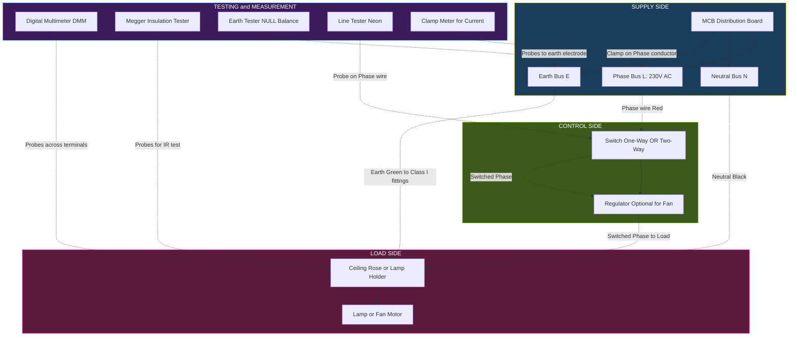
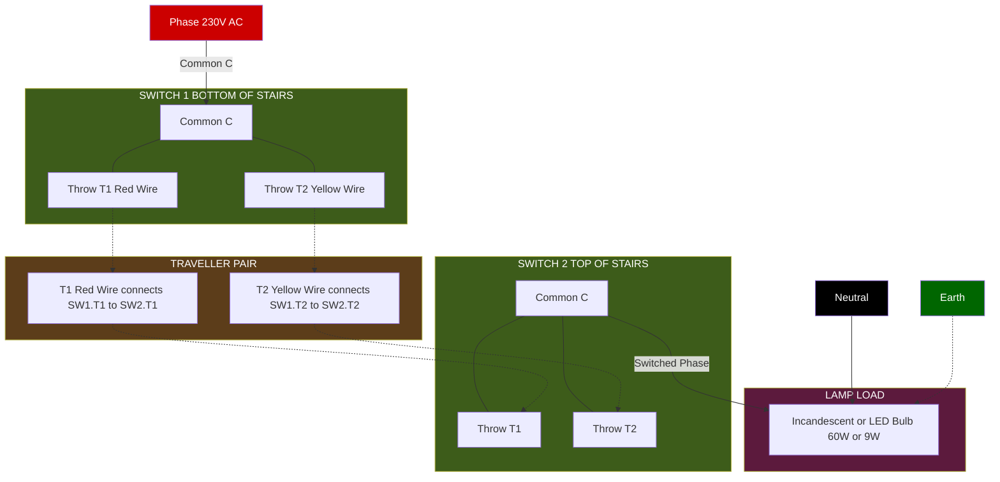
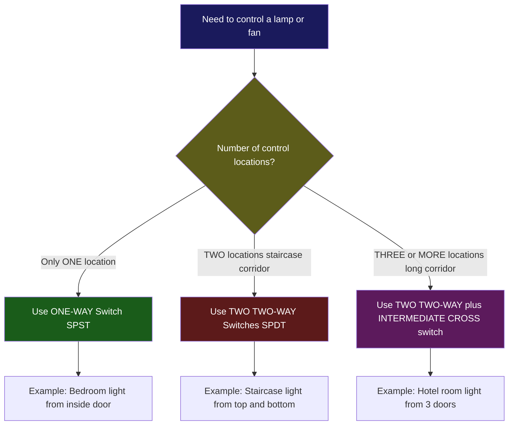
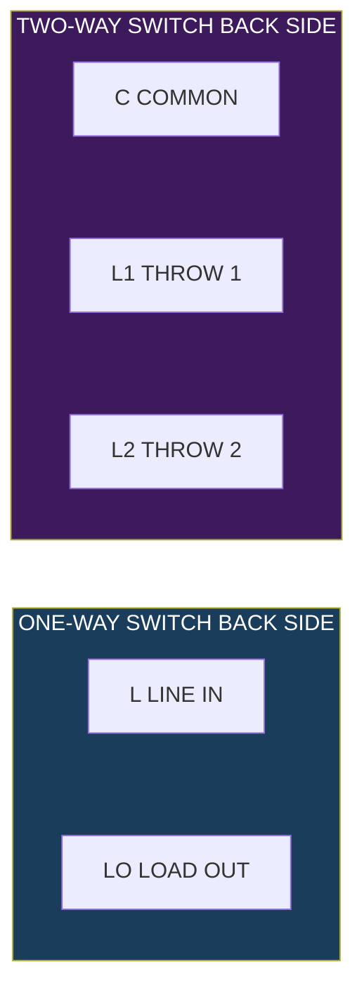

# Studying the tools and testing instruments for electrical works. Wiring a light or a fan circuit using one way and two-way switch.

<!-- SECTION_1_START -->
# ⚡ ELECTRICAL WIRING TOOLS, TESTING INSTRUMENTS & SWITCH CIRCUITS

## 1.1 Formal Academic Definition (KTU 2024 Syllabus Aligned)

> [!IMPORTANT]
> **Electrical Wiring Tools & Testing Instruments** constitute the fundamental hand tools, power tools, and measurement devices that are mandatory for the safe installation, termination, testing, and maintenance of **low-voltage (≤ 250 V AC) domestic and commercial electrical wiring systems**, conforming to **IS 732:2019** (Code of Practice for Electrical Wiring Installations) and **IE Rules 1956** as adopted by the Bureau of Indian Standards (BIS).

The workshop module specifically covers the practical wiring of **luminaires (lamp loads)** and **ceiling fan circuits** using:
- **SPST (Single Pole Single Throw) Switch** → commonly called a **One-Way Switch**
- **SPDT (Single Pole Double Throw) Switch** → commonly called a **Two-Way Switch** (used in staircase/Godown wiring)

The line voltage standard adopted in India is **230 V AC, 50 Hz, single-phase** (per **IS 12360**), with permissible tolerance of **+10% to −10%** i.e. **207 V to 253 V**.

---

## 1.2 Conceptual Analogy & Engineering Intuition

> [!NOTE]
> **Analogy — "The Plumbing vs. Electrical Pipeline Model"**
> Think of electrical wiring exactly like a household water pipeline:
> - **Wire (Copper Conductor)** = the pipe that carries the "flow" (current, measured in Amperes)
> - **Switch** = the **valve/tap** that opens or closes the flow path
> - **Load (Bulb/Fan)** = the **shower head or tap outlet** where useful work is delivered
> - **MCB/Fuse** = the **emergency shut-off valve** that trips on overload
> - **Earth Wire** = the **safety drain** that carries away leakage current
> - **Insulation (PVC)** = the **outer pipe wall** preventing leakage to surroundings

In a **one-way switch**, the valve has only two positions — **ON** (closed circuit, water flows) and **OFF** (open circuit, water stops). It is the simplest form of control from **one location only**.

In a **two-way switch**, each switch has **two possible flow paths** (think of a Y-junction pipe with two outlets). The bulb lights up **only when both switches direct current along a common path** — this enables a light to be controlled from **two different locations** (e.g., top and bottom of a staircase).

---

## 1.3 Standard Metrics & Ratings (BIS / ISI Standards)

| Parameter | Standard Value | Applicable Standard |
|---|---|---|
| **Line Voltage (Domestic)** | **230 V AC, 50 Hz, 1-Φ** | IS 12360:1988 |
| **Permissible Voltage Variation** | **+10 % to −10 %** | CEA Regulations |
| **Standard Wire Sizes (Cu)** | **1.5 mm² (lighting), 2.5 mm² (power), 4.0 mm² (AC/Fan)** | IS 694:2010 |
| **Insulation Colour Code (Phase)** | **Red / Brown / Black** | IS 5571 |
| **Insulation Colour Code (Neutral)** | **Black / Blue** | IS 5571 |
| **Insulation Colour Code (Earth)** | **Green / Green-Yellow striped** | IS 5571 |
| **Earthing Resistance (Domestic)** | **≤ 5 Ω** (with water pipe) / **≤ 8 Ω** (no water pipe) | IS 3043:2018 |
| **Insulation Resistance** | **≥ 1 MΩ (at 500 V DC)** | IS 732:2019 |
| **Earth Leakage Current Trip** | **30 mA (RCD), 100 mA (MCB)** | IS 12640 |
| **MCB Rating (Domestic)** | **6 A (light), 16 A (5 A socket), 32 A (AC)** | IS 8828 |

---

## 1.4 Visualization Callout

> [!VISUALIZATION CONTROL]
> **Concept:** One-Way vs Two-Way Switch Logic — Truth Table Visualization
>
> **Coordinate System (Switch Logic Plot):**
>
> Let Switch-1 (S1) positions be plotted on **X-axis** : $\{0, 1\}$
> Let Switch-2 (S2) positions be plotted on **Y-axis** : $\{0, 1\}$
> Lamp state $L(x,y) = 1$ when S1 and S2 throw positions create a **common pole connection** to the load.
>
> **Boolean Expression:**
> $$L_{one\text{-}way} = S_1$$
> $$L_{two\text{-}way} = (S_1 \oplus \overline{S_2}) = S_1 \cdot \overline{S_2} + \overline{S_1} \cdot S_2$$
>
> **Visual Description:** Plot four discrete grid points at coordinates $(0,0), (0,1), (1,0), (1,1)$ on the Cartesian plane. Mark the points where the lamp glows with a solid red dot ($\bullet$) and extinguished points with a hollow blue circle ($\circ$). The XOR-style activation pattern will be visible — this is the geometric "signature" of two-way switching.

---

## 1.5 Why This Module Matters in Real Engineering

> [!TIP]
> **Industry Relevance:** Every Electrical, Electronics, Mechanical, Civil, and Computer-Science engineer — regardless of branch — will at some point in their career deal with **domestic/office wiring troubleshooting** (relocating a switch, installing a fan, repairing a tripping MCB). KTU mandates this workshop module because **safety-first wiring practice is a life-saving technical literacy**, not a trade-specific skill.

<!-- SECTION_1_END -->

<!-- SECTION_2_START -->
# 🔬 DEEP THEORETICAL ANALYSIS — TOOLS, INSTRUMENTS & CIRCUIT THEORY

## 2.1 Classification of Electrical Tools

### 2.1.1 Hand Tools (Insulated, 1000 V Rated per IS 9037)

| # | Tool Name | Primary Function | Engineering Specs |
|---|---|---|---|
| 1 | **Combination Pliers (Side Cutter)** | Gripping, twisting, cutting wires | Insulated handles, 150 mm / 200 mm size, **1000 V AC** rating |
| 2 | **Long Nose Pliers** | Holding wires in terminal blocks, loop making | 150 mm, serrated jaws, insulated |
| 3 | **Wire Stripper** | Removing PVC insulation without nicking conductor | Adjustable gauge slots: 1.0, 1.5, 2.5, 4.0, 6.0 mm² |
| 4 | **Insulated Screwdriver (Flat Head)** | Tightening terminal screws on switches/sockets | Blade width: 4 mm / 6 mm, **1000 V AC** insulated shaft |
| 5 | **Insulated Screwdriver (Phillips/PH-2)** | Cross-head screws of modular accessories | PH-2 size standard |
| 6 | **Neon Line Tester (Test Screwdriver)** | Detecting presence of AC line voltage | Glows on 70 V – 500 V AC; resistor ≥ 2 MΩ internal |
| 7 | **Test Lamp (Continuity Tester with 230 V)** | Live testing of sockets/switches | 60 W bulb with two probe leads |
| 8 | **Hacksaw Frame with Blade** | Cutting PVC conduit, metal boxes | 300 mm frame, 24 TPI blade for metal / 18 TPI for PVC |
| 9 | **Electrician's Knife (Cable Knife)** | Slitting PVC insulation of multi-core cables | Fixed blade, insulated handle |
| 10 | **Hammer (Ball Pein, 250 g)** | Driving nails, conduit clips | Hardwood handle |
| 11 | **Pipe Wrench (Heavy Duty)** | Holding GI conduit while threading | 12 inch / 18 inch |
| 12 | **Reaming Tool / Half-Round File** | Deburring conduit inner edges after cutting | 150 mm, half-round second-cut |

### 2.1.2 Power Tools & Wiring Accessories

| # | Tool / Accessory | Function |
|---|---|---|
| 13 | **Hand Drilling Machine (10 mm chuck)** | Drilling holes in walls, wooden boards for switch boxes |
| 14 | **Crimping Tool (Ratchet Type)** | Crimping lugs on wire ends for terminal connections |
| 15 | **Blow Lamp / Soldering Iron (60 W)** | Soldering twisted joints (solder: 60% Sn, 40% Pb) |
| 16 | **PVC Conduit Pipe (20 mm / 25 mm)** | Mechanical protection & routing of wires through walls |
| 17 | **Conduit Boxes (1-way, 2-way, 3-way, 4-way)** | Junction / pull points for wire terminations |
| 18 | **Casing-Capping (PVC, 32 mm)** | Surface wiring alternative to conduit |
| 19 | **Cable Ties & PVC Saddles** | Securing cables to wall, ceiling, conduit clips |
| 20 | **Insulation Tape (PVC, Black)** | Re-insulating joints (color: black for phase, blue for neutral) |

### 2.1.3 Testing & Measurement Instruments

| # | Instrument | Quantity Measured | Working Principle | Key Spec |
|---|---|---|---|---|
| 21 | **Analog Multimeter (VOM)** | V, A, Ω (AC+DC) | D'Arsonval moving coil movement | Sensitivity ≥ 20 kΩ/V |
| 22 | **Digital Multimeter (DMM)** | V, A, Ω, Hz, Continuity, Diode | ADC + LCD display | 3.5 digit, ±0.5% accuracy |
| 23 | **Clamp Meter (AC/DC)** | Current without breaking circuit | Hall-effect sensor / CT | Range 0 – 400 A |
| 24 | **Megger (Insulation Resistance Tester)** | Insulation resistance | Hand-cranked DC generator (500 V / 1000 V) | 0 – 1000 MΩ |
| 25 | **Earth Resistance Tester (NULL Balance Type)** | Earth electrode resistance | Fall-of-Potential method | 0 – 10 Ω / 0 – 100 Ω |
| 26 | **Test Lamp / Phase Tester** | Phase presence, polarity | Neon glow / Tungsten filament | 230 V AC |

---

## 2.2 Switch Classification & Internal Architecture

### 2.2.1 One-Way Switch (SPST — Single Pole, Single Throw)

$$S_{1\text{-}way} : \text{2 Terminals} = \{\text{Common (C)}, \text{Throw (T)}\}$$

> **Operating Logic:** The internal **moving contact** either **bridges** C and T (ON → closed circuit) or **isolates** them (OFF → open circuit). Only **one** current path is available at a time.

### 2.2.2 Two-Way Switch (SPDT — Single Pole, Double Throw)

$$S_{2\text{-}way} : \text{3 Terminals} = \{\text{Common (C)}, \text{Throw-1 (T1)}, \text{Throw-2 (T2)}\}$$

> **Operating Logic:** The internal moving contact can bridge C to **either T1 or T2**, but not both simultaneously. The **common terminal** is the load connection point; **T1 and T2** are the two "traveller" terminals that get interconnected between the two switches via **traveller wires**.

### 2.2.3 Intermediate / Cross Switch (DPDT — Double Pole, Double Throw, 4 terminals)

$$S_{intermediate} : \text{4 Terminals} = \{T1_{in}, T1_{out}, T2_{in}, T2_{out}\}$$

> Used **between two two-way switches** when light must be controlled from **3 or more locations** (e.g., long corridors, hotel rooms).

---

## 2.3 KTU Formula Cheat Sheet — Electrical Wiring

> [!NOTE]
> Use this formula sheet for **all numerical sub-questions** in Part B. Pipes `|` are intentionally avoided using `\vert` to prevent markdown table breakage.

| # | Formula / Law | Equation | Units | Application |
|---|---|---|---|---|
| 1 | **Ohm's Law** | $V \;=\; I \cdot R$ | V, A, Ω | Sizing resistors, calculating voltage drop |
| 2 | **Electrical Power** | $P \;=\; V \cdot I \;=\; I^{2} R \;=\; \dfrac{V^{2}}{R}$ | W (Watts) | Sizing switch/MCB contact rating |
| 3 | **Electrical Energy** | $E \;=\; P \cdot t$ | Wh / kWh | Electricity bill calculation |
| 4 | **Voltage Drop in Cable** | $V_{d} \;=\; \dfrac{2 \cdot I \cdot L \cdot \rho}{A}$ | V | Verifying $\vert V_{d} \vert \le 4\%$ of nominal |
| 5 | **Resistance of Conductor** | $R \;=\; \dfrac{\rho \cdot L}{A}$ | Ω | Copper $\rho \;=\; 1.72 \times 10^{-8}$ Ω·m |
| 6 | **Power in AC (Single-Phase)** | $P \;=\; V \cdot I \cdot \cos\phi$ | W | Fan / motor loads (inductive $\cos\phi \approx 0.8$) |
| 7 | **Insulation Resistance (Acceptable)** | $R_{i} \;=\; \dfrac{V_{test}}{I_{leak}}$ | MΩ | Must be $\ge 1$ MΩ at 500 V DC |
| 8 | **Earthing Resistance Limit** | $R_{e} \;\le\; 5\,\Omega$ | Ω | Domestic, per IS 3043 |
| 9 | **Current Carrying Capacity (Cu, 1.5 mm² PVC)** | $I_{z} \;\approx\; 14$ A | A | For 2-core Cu cable, clipped direct |
| 10 | **Number of Conductors in Conduit (Bending Allowance)** | Fill Factor $\le 40\%$ | – | IS 732:2019 conduit fill rule |

### Voltage Drop Sample Calculation
> A **60 W lamp** on a **1.5 mm² Cu wire** running **15 m** from MCB (single phase, $\cos\phi = 1$):
> $$I = \frac{P}{V} = \frac{60}{230} = 0.261\text{ A}$$
> $$R_{wire} = \frac{\rho \cdot 2L}{A} = \frac{1.72 \times 10^{-8} \cdot 30}{1.5 \times 10^{-6}} = 0.344\,\Omega$$
> $$V_{d} = I \cdot R = 0.261 \cdot 0.344 = 0.0897\text{ V} \;\;\Rightarrow\;\; \frac{V_{d}}{V}\cdot 100 = 0.039\% \;\;\checkmark$$

---

## 2.4 Real-World Application Domains

| Domain | Application of Tools & Wiring Skill |
|---|---|
| **Domestic Buildings** | Light/fan/socket wiring, MCB distribution board, inverter hookup |
| **Industrial Control Panels** | Contactor wiring, relay logic, panel indicator lamps |
| **Renewable Energy** | Solar PV string wiring, earthing of PV arrays |
| **IoT / Smart Home** | Smart-switch retrofits, neutral availability testing |
| **Maintenance & Troubleshooting** | Identifying open circuits, short circuits, earth faults using Megger + DMM |
| **Fire Safety Audits** | Verifying insulation resistance, RCD trip current, polarity compliance |

<!-- SECTION_2_END -->

<!-- SECTION_3_START -->
# 🛠️ STEP-BY-STEP IMPLEMENTATION — WIRING PROCEDURES & TOOL UTILIZATION

> [!IMPORTANT]
> **Domain-Adaptive Execution Matrix Applied — Workshop / Practical Mode:** Below you will find exhaustive **component pin configurations, hardware wiring sequences, and safety monitoring steps** delivered as actionable, stepwise protocols. No step is skipped or summarized.

---

## 3.1 Component Inventory & Pin Configuration Table

| # | Component | Specification | Terminal Markings | Function in Circuit |
|---|---|---|---|---|
| 1 | **One-Way Switch (Modular, 6 A)** | ISI marked, 230 V AC, 6 A | `L` (Line in), `LO` (Load out) | Breaks phase conductor to load |
| 2 | **Two-Way Switch (Modular, 6 A)** | ISI marked, 230 V AC, 6 A | `C` (Common), `L1` (Throw 1), `L2` (Throw 2) | Selects one of two traveller wires |
| 3 | **Switch Box (Modular, 1M / 2M)** | PVC / metal, surface / flush | – | Houses switch mechanism |
| 4 | **Ceiling Rose (3-Plate Type)** | 6 A ISI marked | `P` (Phase), `N` (Neutral), `E` (Earth) | Fan/Lamp hanging + connection point |
| 5 | **Lamp Holder (B22 / E27)** | 6 A, 230 V | Two brass terminals | Holds bulb |
| 6 | **LED Bulb (9 W, 230 V AC)** | B22 base, $\cos\phi \ge 0.9$ | – | Lighting load |
| 7 | **Ceiling Fan (BLDC, 28 W or Induction 60 W)** | 230 V AC, 1-Φ | Phase, Neutral, Earth (if class-I) | Ventilation load |
| 8 | **PVC Insulated Cu Wire (1.5 mm²)** | IS 694:2010, FR grade | Red / Black / Green colour coded | Phase / Neutral / Earth |
| 9 | **Connector / Joint Kit** | Screw-type terminal strip | – | Jointing conductors |
| 10 | **Wooden Board / Wiring Board** | 18" × 24" (lab standard) | – | Mounting base for circuit demo |

---

## 3.2 Wiring Procedure — One-Way Switch Controlled Lamp Circuit

### 3.2.1 Circuit Schematic (ASCII Topology)

```
   [MCB / Phase Bus]                       [Lamp Holder]
        L (230 V)                              Bulb
          |                                       |
          |                                       N
          |                                       |
          +------[SWITCH S1: One-Way]------L1----+
                                                 (Load)
          [Neutral Bus] ----------------------N----+
          [Earth Bus]   ----------------------E----+  (if metal-bodied lamp)
```

### 3.2.2 Step-by-Step Wiring Protocol

| Step | Action | Tool Used | Safety Check |
|---|---|---|---|
| **1** | Mount the **switch board** and **lamp board** firmly on the wooden base using screws | Screwdriver (PH-2) | Boards must not wobble |
| **2** | Identify and **strip 10 mm insulation** from each conductor end using wire stripper | Wire stripper | Do NOT nick Cu strands; strip length 8–10 mm |
| **3** | Form a **closed loop (eyelet)** at the switch end using long-nose pliers (clockwise bend) | Long-nose pliers | Loop direction = clockwise to tighten, not loosen |
| **4** | **Phase wire (Red)** → Connect to `L` terminal of switch | Insulated screwdriver (flat) | Tighten to **0.8 N·m** torque |
| **5** | **Switched phase wire (Red)** → From `LO` terminal of switch to `P` terminal of ceiling rose / lamp holder | Insulated screwdriver | Check no stray strands protrude |
| **6** | **Neutral wire (Black)** → Direct connection from neutral bus to `N` terminal of lamp holder | Insulated screwdriver | Do **NOT** switch the neutral |
| **7** | **Earth wire (Green)** → Connect from earth bus to `E` terminal of metallic lamp holder / fan body | Insulated screwdriver | Mandatory for metal-bodied fittings |
| **8** | Insert the bulb into the holder | Hand | Bulb rating ≤ holder rating (6 A) |
| **9** | **Visual inspection** — tug-test each terminal to verify firm connection | Hand | Any loose terminal = spark risk |
| **10** | Inform instructor → **energize circuit** from instructor's panel MCB | – | Stand to the side, use insulated gloves |
| **11** | **Toggle switch ON** → bulb must glow; toggle OFF → bulb must extinguish | – | If reverse, swap phase/load wires |
| **12** | **De-energize**, dismantle, return tools | – | Roll up excess wire neatly |

### 3.2.3 Validation Checks After Energization
> - **Continuity test** with DMM (Ω mode): Phase-to-Load wire = 0 Ω when switch ON, OL when OFF.
> - **Voltage test** with DMM (V AC): Switched phase to neutral = 230 V when ON, 0 V when OFF.
> - **Line tester** glows on incoming `L` terminal; **does not glow** on `LO` when OFF.

---

## 3.3 Wiring Procedure — Two-Way Switch (Staircase) Circuit

### 3.3.1 Circuit Schematic (ASCII Topology)

```
   [Phase]                                              [Lamp]
      L                                                     Bulb
      |                                                      |
      +---[S1: Two-Way]----T1 -----+-----T1---[S2: Two-Way]---+
      |        (C terminal)         |          (C terminal)   |
      |                            |                          |
      |                            +-----T2---[S2 Throw 2]    |
      |                                                      N
      +---------[Traveller wire 2: T2]------------------+    |
                                                            N
   [Neutral] --------------------------------------------N----+
   [Earth]   --------------------------------------------E----+
```

> **Activation Condition:** Lamp glows when S1-throw and S2-throw are on the **same traveller** (both T1 or both T2). This is the **XOR** (exclusive-OR) logic when observed from a single user action.

### 3.3.2 Step-by-Step Wiring Protocol

| Step | Action | Tool Used | Safety Check |
|---|---|---|---|
| **1** | Mount **two switch boards** at the two ends of the wooden base (representing top/bottom of staircase) | Screwdriver | Boards aligned and levelled |
| **2** | Run **3 wires** between switch-1 and switch-2 in a conduit: 2 traveller + 1 spare (or use 3-core Cu cable) | Cable, cutter | Label wires with colour tape: T1=Red, T2=Yellow, Spare=Black |
| **3** | **Switch-1 (Two-Way):** Connect incoming Phase to `C` (Common) terminal | Screwdriver | Phase must land on Common, not L1/L2 |
| **4** | Connect **T1 wire (Red)** to `L1` and **T2 wire (Yellow)** to `L2` of Switch-1 | Screwdriver | Tighten firmly |
| **5** | **Switch-2 (Two-Way):** Connect T1 (Red) to `L1` and T2 (Yellow) to `L2` of Switch-2 | Screwdriver | Maintain colour identity end-to-end |
| **6** | From Switch-2's `C` (Common) terminal, run a **switched phase wire** to the `P` terminal of the lamp holder | Screwdriver | This is the "load wire" |
| **7** | Connect **Neutral** directly to lamp holder's `N` terminal | Screwdriver | No switch in neutral line |
| **8** | Connect **Earth** to lamp holder's `E` terminal (if metal-bodied) | Screwdriver | For class-I fittings only |
| **9** | **Continuity test (DMM Ω):** Verify that with both switches in position 1, current path from Phase → C → T1 → T1 → C → Lamp is continuous (≈ 0 Ω) | DMM | Test in Ω mode with MCB OFF |
| **10** | **Continuity test (DMM Ω):** Toggle Switch-1 only — circuit should now read OL (open) | DMM | Confirms T2 path is broken |
| **11** | Toggle Switch-2 — circuit should close again via T2 path | DMM | Confirms alternate path |
| **12** | **Energize** under instructor supervision → toggle switches in all 4 combinations | Insulated gloves | Lamp must change state in XOR pattern |
| **13** | Demonstrate to instructor and record readings in observation book | – | Note: 4 combinations → 2 ON, 2 OFF |

### 3.3.3 Truth Table — Two-Way Switch Operation

| S1 Position | S2 Position | Traveller Active | Lamp State |
|:---:|:---:|:---:|:---:|
| T1 | T1 | Red (T1) | **ON** |
| T1 | T2 | None (mismatch) | OFF |
| T2 | T1 | None (mismatch) | OFF |
| T2 | T2 | Yellow (T2) | **ON** |

---

## 3.4 One-Way Controlled Fan Circuit Variant

For a **ceiling fan**, the procedure is identical to the lamp circuit, **except**:

> 1. The **load is a 60 W induction motor / 28 W BLDC motor**, not a lamp.
> 2. The **ceiling rose is a 3-plate type** with separate terminals for fan winding, neutral, and earth.
> 3. **Capacitor (2.2 µF to 3.15 µF, 440 V AC)** is pre-fitted inside the fan body; no external connection required.
> 4. **Fan regulator (step-type or electronic)** is connected **in series** between the switch and the fan for speed control. The switch still breaks the phase; the regulator drops voltage via resistance / phase-angle control.

### Wiring Topology — Fan + Switch + Regulator
```
   Phase ──► [Switch S] ──► [Regulator] ──► [Ceiling Rose: P] ──► Fan (Phase)
   Neutral ─────────────────────────────────► [Ceiling Rose: N] ──► Fan (Neutral)
   Earth    ─────────────────────────────────► [Ceiling Rose: E] ──► Fan (Body)
```

---

## 3.5 Testing Protocol (Pre-Commissioning & Post-Commissioning)

### 3.5.1 Insulation Resistance Test (Using Megger)
| Step | Action | Expected Result |
|---|---|---|
| 1 | **Isolate** circuit from supply (MCB OFF) | MCB in OFF position, locked |
| 2 | Connect Megger **Line (L)** terminal to Phase conductor | – |
| 3 | Connect Megger **Earth (E)** terminal to Neutral conductor (combined test) | – |
| 4 | Set Megger to **500 V DC** range | – |
| 5 | Crank at **~120 rpm** for 30 seconds | – |
| 6 | Read insulation resistance | $R_{i} \ge 1$ MΩ (per IS 732) ✓ |
| 7 | Repeat for Phase-Earth, Neutral-Earth | Both $\ge 1$ MΩ |

### 3.5.2 Polarity Test
- **Test lamp** or **DMM (V AC)** must indicate **230 V** between **Phase (switched)** and **Neutral** at the load terminals when switch is ON.
- A **reversed polarity** (switch in neutral) is dangerous and a **fatal flaw** — the holder remains live even when the switch is OFF.

### 3.5.3 Earth Continuity Test
- DMM (Ω mode) between earth pin of socket and known earth rod.
- Reading must be $\le 1\,\Omega$ (including cable resistance).

### 3.5.4 Functional / Operational Test
| Test | Observation |
|---|---|
| Switch ON → Lamp glows | Pass ✓ |
| Switch OFF → Lamp extinguishes | Pass ✓ |
| Switch in 2-way mode toggles lamp from both ends | Pass ✓ |
| No tripping of MCB at rated current | Pass ✓ |
| No humming / sparking at terminals | Pass ✓ |

---

## 3.6 Safety Monitoring & PPE Checklist

> [!WARNING]
> **BEFORE, DURING, AND AFTER** any live test, the following **PPE and safety protocol** is **MANDATORY** per KTU lab rules and IS 5216:

| # | Safety Item | Standard / Spec |
|---|---|---|
| 1 | **Insulated rubber gloves** (Class 0, 1000 V) | IS 4770 |
| 2 | **Insulated safety shoes** (electrical hazard rated) | IS 15298 |
| 3 | **Face shield / safety goggles** | IS 5983 |
| 4 | **Insulated mat in front of panel** (Class A, 1.1 kV) | IS 15652 |
| 5 | **One-hand rule** — keep one hand in pocket while testing live | – |
| 6 | **"Do Not Operate" tag** on MCB during wiring | – |
| 7 | **Lockout–Tagout (LOTO)** procedure followed | – |
| 8 | **Dry hands, dry floor** — never work on live circuits in wet conditions | – |
| 9 | **Fire extinguisher (CO₂ type)** accessible within 5 m | IS 2190 |
| 10 | **First-aid kit** with burn dressing available | – |

---

## 3.7 Common Errors & Their Prevention

| # | Common Mistake | Consequence | Prevention |
|---|---|---|---|
| 1 | Switching the Neutral instead of Phase | Holder remains live → **electric shock** | Always identify phase with line tester first |
| 2 | Loose terminal screws | Arcing, fire, voltage drop | Tug-test every connection |
| 3 | Overloaded single switch (e.g., 16 A AC on 6 A switch) | Switch contact welding, fire | Match switch rating to load current |
| 4 | No earth to metal-bodied lamp | **Electrocution** on insulation failure | Always earth class-I fittings |
| 5 | Reversed L1 / L2 in two-way wiring (still works, but...) | Counter-intuitive operation | Label wires, follow colour code |
| 6 | Mixing Cu and Al in same terminal | Galvanic corrosion, hot joint | Use proper Cu-Al bi-metallic lugs |
| 7 | Skipping Megger test | Hidden insulation failure → future shock | Megger test is **mandatory** before energizing |

<!-- SECTION_3_END -->

<!-- SECTION_4_START -->
# 🗺️ STRUCTURAL DIAGRAMS & SCHEMATICS

## 4.1 Block-Level Functional Architecture — Electrical Wiring Workshop



---

## 4.2 Sequential Processing Topology — One-Way Switch Wiring


---

## 4.3 Schematic — Two-Way Switch Staircase Wiring (Traveller Logic)



---

## 4.4 Decision Matrix — When to Use One-Way vs Two-Way



---

## 4.5 Component Pin Map — Modular Switch (Visual Reference)



<!-- SECTION_4_END -->

<!-- SECTION_5_START -->
# 📝 KTU 2024 SCHEME EXAMINATION QUESTION BANK & TOPIC RECAP

---

## 5.1 Part A — Short Answer Questions (3 Marks Each)

> **[KTU University Exam — July 2024 Model]**

### **Q1. [Remember / Understand — CO1] (3 Marks)**
*List any **six** essential hand tools used in domestic electrical wiring and state the specific function of each in a single line.*

#### **Model Answer (3 Marks Distribution):**
1. **Combination Pliers (Side Cutter)** — used for gripping, twisting, and cutting Cu wires. **[0.5 M]**
2. **Wire Stripper** — removes PVC insulation without nicking the conductor. **[0.5 M]**
3. **Insulated Screwdriver (1000 V rated)** — tightens / loosens terminal screws safely on live or de-energized panels. **[0.5 M]**
4. **Long Nose Pliers** — forms eyelets and holds wires inside deep switch boxes. **[0.5 M]**
5. **Neon Line Tester** — detects presence of AC phase voltage by neon glow. **[0.5 M]**
6. **Hacksaw Frame with 24-TPI blade** — cuts PVC conduit and metal switch boxes to size. **[0.5 M]**

---

> **[KTU University Exam — Dec 2023 Model]**

### **Q2. [Understand / Apply — CO2] (3 Marks)**
*Distinguish between a **One-Way Switch (SPST)** and a **Two-Way Switch (SPDT)** in terms of (a) number of terminals, (b) internal contact arrangement, and (c) one practical application of each.*

#### **Model Answer (3 Marks Distribution):**

| Feature | One-Way Switch (SPST) | Two-Way Switch (SPDT) |
|---|---|---|
| **(a) Terminals** | **2** (Common + one Throw) | **3** (Common + Throw-1 + Throw-2) |
| **(b) Internal contact** | Single moving contact opens/closes one path | Moving contact bridges Common to **either** T1 **or** T2 |
| **(c) Application** | Bedroom light controlled from one door | Staircase light controlled from top **and** bottom |

**[1 Mark for each correct row]**

---

## 5.2 Part B — Full-Length 14-Mark Questions (Module Internal Choice)

> **KTU ESE Pattern:** Each Part B question carries **14 marks**, with sub-parts (a) = 7 marks and (b) = 7 marks. Escalation in cognitive level: part (a) typically tests *Understanding*, part (b) tests *Application / Analysis*.

---

### **QUESTION A (14 Marks) [KTU University Exam — July 2024 Style]**

**(a) [Understand — CO1] (7 Marks)**
*With a neat **labelled circuit diagram**, explain the working of a **one-way switch controlled lamp circuit**. List the **tools, instruments, and materials** required to perform this wiring on a wooden wiring board. State the **safety precautions** to be observed.*

**(b) [Apply — CO2] (7 Marks)**
*A **60 W incandescent lamp** is to be wired using a one-way switch on a **1.5 mm² Cu cable** running **20 m** from the MCB. The supply is **230 V, 50 Hz, 1-Φ**. Calculate:*
*(i) The current drawn by the lamp*
*(ii) The resistance of the cable (round trip)*
*(iii) The voltage drop in the cable as a percentage of nominal voltage*
*(iv) Comment on whether the voltage drop is within the IS 732 permissible limit of 4%.*

---

#### **Model Answer — Question A**

### Part (a) — 7 Marks

**Circuit Diagram (Labelled):**
```
   Phase (L) ─────[S1: One-Way]─────► [Lamp Holder] ──── Neutral (N)
                    ON/OFF                60 W
   Earth (E) ────────────────────────► [E terminal] (if metal-bodied)
```
**[Labelled diagram with 5 labels (Phase, Switch, Lamp, Neutral, Earth): 3 Marks]**

**Working Principle:** When switch S1 is in the **ON** position, the phase conductor is extended through the switch contact to the lamp holder, completing the circuit. Current flows from Phase → Switch → Lamp filament → Neutral, dissipating $P = V \cdot I$ as heat and light. When S1 is in the **OFF** position, the switch contact opens, the circuit is broken, and the lamp extinguishes. **[2 Marks]**

**Tools & Materials List:**
- Combination pliers, long-nose pliers, wire stripper
- Insulated screwdrivers (flat + Phillips)
- Neon line tester, DMM
- PVC 1.5 mm² Cu wire (Red, Black, Green)
- Modular one-way switch (6 A, ISI)
- Lamp holder (B22, 6 A) with 60 W bulb
- PVC insulation tape, wooden wiring board
- Ceiling rose (if required)
**[1 Mark]**

**Safety Precautions:**
- Confirm MCB is in **OFF** position; apply LOTO
- Use **insulated tools** rated 1000 V
- Identify and mark phase using line tester **before** touching terminals
- Wear rubber gloves and stand on **insulated mat**
- Tug-test all terminals before energizing
- Energize only under **instructor supervision**
**[1 Mark]**

### Part (b) — 7 Marks

**Given Data:**
$$P = 60 \text{ W}, \quad V = 230 \text{ V}, \quad L = 20 \text{ m}, \quad A = 1.5 \text{ mm}^2 = 1.5 \times 10^{-6} \text{ m}^2, \quad \rho_{Cu} = 1.72 \times 10^{-8}\,\Omega\cdot\text{m}$$

**(i) Current drawn by the lamp:** **[2 Marks]**
$$I = \frac{P}{V} = \frac{60}{230} = 0.2609 \text{ A} \;\;\approx\;\; 0.261 \text{ A}$$

**(ii) Resistance of the cable (round trip = 2L = 40 m):** **[2 Marks]**
$$R_{cable} = \frac{\rho \cdot 2L}{A} = \frac{1.72 \times 10^{-8} \cdot 40}{1.5 \times 10^{-6}}$$
$$R_{cable} = \frac{6.88 \times 10^{-7}}{1.5 \times 10^{-6}} = 0.4587 \text{ }\Omega$$

**(iii) Voltage drop in the cable:** **[2 Marks]**
$$V_{d} = I \cdot R_{cable} = 0.261 \cdot 0.4587 = 0.1197 \text{ V}$$
$$\% V_{d} = \frac{V_{d}}{V} \cdot 100 = \frac{0.1197}{230} \cdot 100 = 0.052 \%$$

**(iv) Compliance with IS 732:** **[1 Mark]**
The voltage drop is only **0.052 %**, which is **far below the IS 732 permissible limit of 4 %**.
**Result: The cable is adequately sized and the design COMPLIES with IS 732. ✓**

---

### **QUESTION B (14 Marks) [KTU University Exam — Dec 2023 Style]**

**(a) [Understand — CO1] (7 Marks)**
*Draw the **circuit diagram of a two-way switch (staircase) wiring** used to control a single lamp from **two different locations**. Explain its working with reference to the **traveller wires** and the **XOR logic** of operation. Prepare a **truth table** showing all four toggle combinations.*

**(b) [Apply — CO2] (7 Marks)**
*Explain the **step-by-step procedure** to perform a **Megger insulation resistance test** on a freshly wired domestic circuit. State the **minimum acceptable insulation resistance** value as per IS 732, and explain what corrective action should be taken if the measured value is **below** this limit.*

---

#### **Model Answer — Question B**

### Part (a) — 7 Marks

**Circuit Diagram (Labelled):**
```
                                          T1 (Red Traveller)
                       ┌─────────────────────────┐
                       │                         │
   Phase (L) ──► C [S1]                  C [S2] ──► Switched Phase ──► [Lamp]
                       │                         │
                       └──── T2 (Yellow) ────────┘
                                            │
                                          Neutral (N) ─────────────► [Lamp]
                                          Earth (E)   ─────────────► [Lamp E]
```
**[Labelled diagram showing both two-way switches, two traveller wires, lamp: 3 Marks]**

**Working Principle (with XOR logic):** **[2 Marks]**
- Each two-way switch has a **Common (C)** terminal and **two throw terminals (T1, T2)**.
- The **Common of Switch-1 (S1)** receives the incoming phase.
- The **two throw terminals of S1** are connected to the **two throw terminals of S2** via **traveller wires** (T1 and T2).
- The **Common of S2** delivers the **switched phase** to the lamp.
- **Lamp glows ON** only when both switches connect their **Common** to the **SAME traveller** (both on T1 OR both on T2). If they are on different travellers, the circuit path is interrupted.
- Mathematically: $L = S_1 \oplus \overline{S_2} = S_1 \cdot \overline{S_2} + \overline{S_1} \cdot S_2$ — this is the **XOR (exclusive-OR)** logic.

**Truth Table:** **[2 Marks]**

| S1 Position | S2 Position | Active Traveller | Lamp State |
|:---:|:---:|:---:|:---:|
| T1 | T1 | T1 (Red) | **ON** ✓ |
| T1 | T2 | Mismatch | OFF ✗ |
| T2 | T1 | Mismatch | OFF ✗ |
| T2 | T2 | T2 (Yellow) | **ON** ✓ |

### Part (b) — 7 Marks

**Megger Insulation Resistance Test — Step-by-Step Procedure:** **[5 Marks]**

| Step # | Action | Marks |
|---|---|---|
| 1 | **Isolate** the circuit by switching OFF the MCB and applying **LOTO** | **[0.5 M]** |
| 2 | **Disconnect** all loads (lamps, fans, appliances) from sockets to avoid false readings | **[0.5 M]** |
| 3 | **Short** Phase (L) and Neutral (N) conductors together at the distribution board | **[0.5 M]** |
| 4 | Connect Megger **Line (L)** probe to the combined Phase+Neutral conductor | **[0.5 M]** |
| 5 | Connect Megger **Earth (E)** probe to the **Earth** conductor | **[0.5 M]** |
| 6 | Set Megger voltage selector to **500 V DC** | **[0.5 M]** |
| 7 | Crank the handle at **~120 rpm** for **30 seconds** to stabilize reading | **[0.5 M]** |
| 8 | Read the value in MΩ on the analog scale | **[0.5 M]** |
| 9 | Repeat the test for **Phase-to-Earth** and **Neutral-to-Earth** separately | **[0.5 M]** |
| 10 | **Record** all three values in the test register with date and signature | **[0.5 M]** |

**Minimum Acceptable Insulation Resistance (per IS 732:2019):** **[1 Mark]**
$$R_{i} \;\ge\; 1 \text{ M}\Omega \;\;\text{(at 500 V DC)}$$

**Corrective Action if $R_{i} < 1\,\text{M}\Omega$:** **[1 Mark]**
- **Switch OFF** the supply immediately and **do not energize** the circuit.
- **Segmentally isolate** the circuit by opening junction boxes one-by-one to localize the faulty section.
- Check for: **moisture ingress** in conduit, **damaged insulation** (nicked wires, rodent bites), **loose terminations**, **carbon tracking** at switches.
- Replace the damaged cable / re-do the affected joint.
- **Re-test** until $R_{i} \ge 1$ MΩ is achieved.

---

> [!WARNING]
> **⚠️ KTU EXAMINER'S VALUATION PITFALL CALLOUT — DO THESE MISTAKES AND LOSE MARKS:**
> 1. **NEVER** draw a circuit without **labelling** the Phase (L), Neutral (N), Earth (E), switch positions, and load. Unlabelled diagrams = **0 marks** for that sub-part, even if the topology is correct.
> 2. **ALWAYS** show the **standard unit symbols** (A, V, Ω, W) in every numerical answer. "0.261" without "A" loses 0.5 marks.
> 3. **Show the formula substitution** clearly — the examiner must be able to give partial credit even if the final number is wrong. Writing only the answer = step marks forfeited.
> 4. **Mention safety precautions** explicitly — KTU examiners reserve 1–2 marks in every wiring question for **safety** (LOTO, insulated tools, gloves).
> 5. **In the two-way switch diagram**, students frequently mislabel the **Common** terminal as a "Line" or "Phase" terminal. The correct term is **Common (C)**. KTU key specifically checks for `C`, `L1`, `L2` markings.
> 6. **Truth table must be complete** (all 4 rows for 2-way, both rows for 1-way). A missing row = −0.5 mark per row.
> 7. **Do not switch the Neutral.** If the examiner detects phase-on-load-terminal after switching off, full **safety credit** is cancelled.

---

## 5.3 TOPIC RECAP & IMPORTANT THINGS TO REMEMBER ✨

> **A rapid-revision checklist — print this and revise 5 minutes before the exam.**

### 🔧 Tools (Know the Name → Function pair in <10 seconds)
- **Pliers** = grip + cut + twist
- **Wire stripper** = remove insulation without nicking Cu
- **Insulated screwdriver** = 1000 V rated, terminal tightening
- **Line tester** = neon glow = phase present
- **Hacksaw** = cut conduit / boxes
- **Crimping tool** = attach lugs to wire ends
- **Soldering iron** = permanent joint (60/40 Sn-Pb)

### 📏 Instruments (Know the Quantity Measured)
- **DMM** = V, A, Ω, continuity, diode, Hz
- **Clamp meter** = current without breaking circuit
- **Megger** = insulation resistance (MΩ at 500 V DC)
- **Earth tester** = earth electrode resistance (Ω, NULL balance method)

### ⚡ Switch Topologies (Draw a Diagram in 30 seconds)
- **One-Way (SPST)**: 2 terminals (`L`, `LO`) → one path
- **Two-Way (SPDT)**: 3 terminals (`C`, `L1`, `L2`) → two paths
- **Intermediate (DPDT)**: 4 terminals → inserted between two two-way switches for 3+ location control

### 🔌 Wiring Sequence (Mnemonic: **"S-S-L-N-E"** = Strip, Strip, Loop, Nut-tighten, Earth)
1. Strip 10 mm
2. Strip & label all conductors
3. Loop clockwise (eyelet) with long-nose pliers
4. Tighten terminal screws (0.8 N·m)
5. Earth to metal-bodied fittings

### 📐 Standard Values (Memorize)
- Voltage = **230 V AC, 50 Hz**
- Earth resistance ≤ **5 Ω**
- Insulation resistance ≥ **1 MΩ at 500 V DC**
- Wire 1.5 mm² (light) / 2.5 mm² (socket) / 4.0 mm² (AC)
- Colour code: **Red = Phase, Black = Neutral, Green = Earth**

### 🧠 Formulas (Carry the Formula Sheet)
- $V = I R$, $P = V I$, $E = P t$, $R = \rho L / A$, $V_d = 2 I L \rho / A$
- Two-way logic: $L = S_1 \oplus \overline{S_2}$

### 🦺 Safety (Non-Negotiable in Every Answer)
- LOTO before wiring
- Insulated tools, gloves, mat
- One-hand rule
- Identify phase with line tester
- Megger test before energizing

### ❌ Common Errors (Avoid in Exam AND Lab)
- Switching neutral instead of phase
- Loose terminals
- No earth to metal-bodied fitting
- Skipping Megger test
- Confusing Common and Throw terminals on two-way switch

> 🎯 **Final Exam Tip:** When asked to "draw and explain", **always draw first, then label, then write the principle**. This ensures the diagram — which carries 3–5 marks — is not forgotten under exam pressure.

<!-- SECTION_5_END -->
