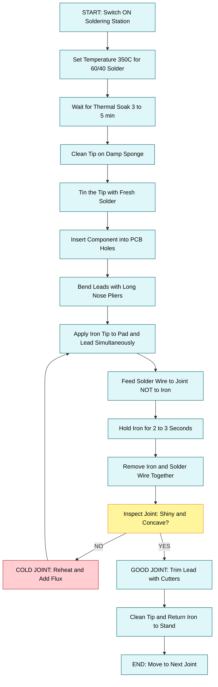
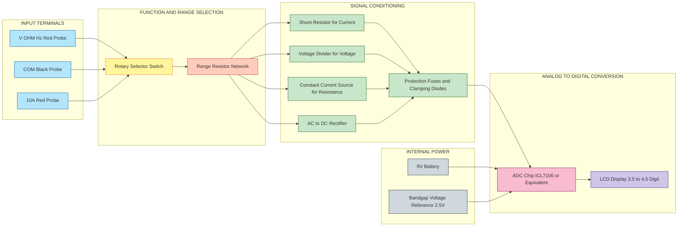
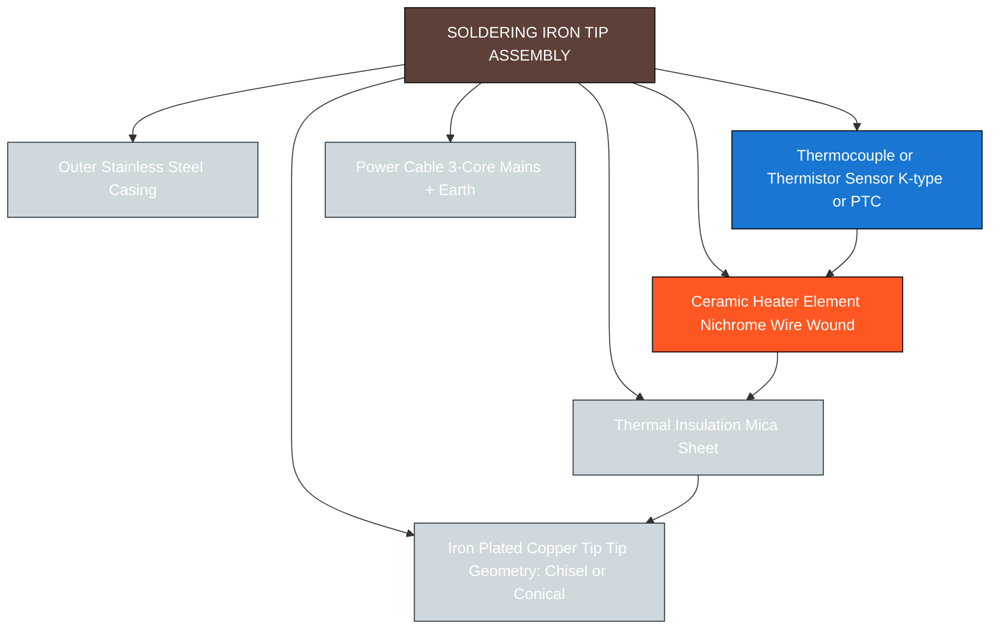

# Familiarization/Application of testing instruments and commonly used tools in electronic works. [Multimeter, Soldering iron, De-soldering pump, Pliers, Cutters, Wire strippers, Screw drivers, Tweezers, Crimping tool, Hot air soldering and desoldering station etc.]

<!-- SECTION_1_START -->

# Familiarization and Application of Testing Instruments and Commonly Used Tools in Electronic Works

## 1.1 Core Technical Definition

> [!IMPORTANT]
> **Definition (KTU 2024 Scheme Standard):**
> *Electronic workshop testing instruments* are precision electro-mechanical devices used to **measure, verify, troubleshoot, and assemble** electronic components and circuits. *Commonly used hand tools* in electronic works are manually operated implements designed for the **cutting, gripping, stripping, fastening, joining, and desoldering** of electronic components on Printed Circuit Boards (PCBs) and wiring assemblies.

As per the KTU 2024 Scheme syllabus for the **Engineering Workshop (GCESL106)** course, every B.Tech student must demonstrate hands-on familiarity with the following instruments and tools:

1. **Multimeter** (Analog and Digital)
2. **Soldering Iron** (with stand and sponge)
3. **De-soldering Pump** (Solder Sucker)
4. **Pliers** (Long-nose, Flat-nose, Round-nose)
5. **Cutters** (Side cutters / Diagonal cutting pliers)
6. **Wire Strippers** (Manual and Automatic)
7. **Screw Drivers** (Slotted and Phillips — Insulated types preferred)
8. **Tweezers** (Anti-magnetic, ESD-safe)
9. **Crimping Tool** (For insulated and non-insulated terminals)
10. **Hot Air Soldering and De-soldering Station** (SMD Rework Station)

> [!NOTE]
> **Syllabus Highlight:**
> The course outcome **CO1** of GCESL106 emphasizes *"Familiarization with various trades such as fitting, carpentry, plumbing, welding, basic electronics, and computer hardware."* The specific tools covered in this module directly address the *basic electronics trade* portion of CO1 and CO2 (which involves *basic operations using suitable trades*).

## 1.2 Conceptual Analogy and Intuitive Overview

Imagine an **electronic circuit as a miniature city**, where wires are streets, components are buildings, and electricity is the traffic. To build, repair, or inspect this city, an electronics engineer needs a **tool belt** — just like a doctor needs a stethoscope, scalpel, and thermometer to examine a patient.

| Domain | City Analogy | Real Tool |
|---|---|---|
| Doctor checking patient's vitals | Thermometer, BP monitor | **Multimeter** |
| Surgeon stitching a wound | Needle and thread | **Soldering Iron** |
| Removing bad stitches | Tweezers and suction | **De-soldering Pump** |
| Mechanic cutting a wire | Wire cutter | **Cutters** |
| Removing insulation from cable | Peeling banana skin | **Wire Strippers** |
| Tightening bolts in a machine | Wrench and screwdriver | **Screw Drivers** |
| Picking tiny SMD components | Robotic arm | **Tweezers** |
| Attaching lugs to battery cables | Pressing machine | **Crimping Tool** |
| Reflowing surface-mount chips | Industrial heat gun | **Hot Air Station** |

> [!TIP]
> **Intuition Check:** When you walk into any electronics repair shop or manufacturing line (like the assembly unit of a smartphone), you will find *every single one of these tools* on the workbench. Mastering these tools is the **first practical step** toward building any real-world electronic gadget.

> [!VISUALIZATION CONTROL]
> **Concept:** Pictorial arrangement of a typical electronics workbench layout.
> **GeoGebra / Desmos Input Equations:**
> * Not applicable (this is a 2D spatial arrangement of physical objects).
> **Visual Description:** A top-down view of a rectangular workbench (say, $1.5 \, \text{m} \times 0.8 \, \text{m}$). On the **left** sits the **DC Power Supply**, in the **center** is the **PCB under test** held by a "helping hand" or PCB vise, to the **right** is the **Soldering Station** with the **Hot Air Gun** mounted on a stand, and the **Multimeter** is placed at the **front edge** within easy reach. A **waste bin for solder dross** is positioned below the table.

<!-- SECTION_1_END -->

<!-- SECTION_2_START -->

# Deep Theoretical Analysis and KTU High-Yield Formula Sheet

## 2.1 Classification of Tools

The tools can be broadly classified into four functional categories based on the **KTU 2024 Scheme Workshop taxonomy**:

1. **Measurement and Testing Instruments:** Multimeter
2. **Joining Tools:** Soldering Iron, Hot Air Soldering/De-soldering Station
3. **Removing and Re-work Tools:** De-soldering Pump, Hot Air De-soldering, Tweezers
4. **Cutting, Gripping and Fastening Tools:** Pliers, Cutters, Wire Strippers, Screw Drivers, Crimping Tool

## 2.2 Detailed Instrument Analysis

### 2.2.1 Digital Multimeter (DMM)

A **Digital Multimeter** is the single most important diagnostic instrument. It combines a **voltmeter**, **ammeter**, and **ohmmeter** into one unit, with modern versions adding capacitance, frequency, diode testing, and continuity buzzer functions.

- **Why it works:** It uses a **shunt resistor** for current measurement and a **voltage divider network** for voltage measurement. The unknown quantity is converted to a small DC voltage and displayed on a **Liquid Crystal Display (LCD)** using an internal **Analog-to-Digital Converter (ADC)**.
- **How to use safely:** Always start at the **highest range** and step down to avoid blowing the internal fuse. Never measure resistance on a *live* circuit.
- **Engineering utility:** Used in **PCB debugging**, **power supply calibration**, **battery testing**, and **field service of consumer electronics**.

> [!NOTE]
> **Ohm's Law (the heart of the DMM):**
> $$V = I \times R$$
> where $V$ is the voltage in volts, $I$ is the current in amperes, and $R$ is the resistance in ohms.

### 2.2.2 Soldering Iron

A **soldering iron** is a hand tool that uses a heated metal tip to melt **solder** (typically a tin-lead or lead-free alloy like **SAC305** — Tin-Silver-Copper) to form a permanent electrical and mechanical joint between two metallic surfaces.

- **Temperature range:** Standard $200^{\circ}\text{C}$ to $450^{\circ}\text{C}$.
- **Power rating:** $15 \, \text{W}$ (for SMD work), $25 \, \text{W}$ (general PCB), $40\text{–}60 \, \text{W}$ (heavier wiring).
- **Engineering utility:** Used in **PCB assembly lines**, **prototype development labs**, and **through-hole component soldering**.

### 2.2.3 De-soldering Pump (Solder Sucker)

A **spring-loaded vacuum pump** used to remove molten solder from a joint. The plunger is pressed down, locked, and then a push-button releases the spring creating a sudden vacuum that sucks the molten solder up into a PTFE (Teflon) nozzle.

- **Why and How:** It is the *low-cost* alternative to a de-soldering station. It is manually operated, requires no electricity, and is ideal for removing **single through-hole components** like resistors and capacitors.
- **Engineering utility:** Salvaging components from old PCBs, correcting soldering mistakes.

### 2.2.4 Hot Air Soldering and De-soldering Station (SMD Rework Station)

A **Hot Air Soldering Station** (also called a *heat gun rework station*) blows a precisely controlled stream of hot air (typically $100^{\circ}\text{C}$ to $500^{\circ}\text{C}$) through a small nozzle to **reflow solder paste** on SMD pads.

- **Why and How:** Surface-Mount Devices (SMD) have leads on the *underside* of the package, making a traditional soldering iron unsuitable. Hot air melts *all* the solder joints simultaneously, allowing the chip to be lifted off (de-soldering) or a new chip to be placed and soldered (rework).
- **Engineering utility:** **Mobile phone motherboard repair**, **BGA (Ball Grid Array) re-balling**, **laptop GPU rework**.

### 2.2.5 Pliers, Cutters, Wire Strippers, Screw Drivers, Tweezers, Crimping Tool

These are the **"supporting cast"** of any electronics workbench. Each is engineered for a specific purpose:

- **Pliers (Long-nose):** Used to *bend component leads*, hold small parts, and reach into tight spaces.
- **Cutters (Diagonal cutting pliers / Flush cutters):** Used to *trim component leads* flush to the PCB after soldering.
- **Wire Strippers:** Used to *remove the PVC insulation* from copper wires without nicking the conductor. Adjustable for different wire gauges (AWG sizes).
- **Screw Drivers (Insulated):** Used to *fasten terminal blocks, open device casings, and adjust trimpots*. The 1000V insulation rating protects against accidental shorts.
- **Tweezers (ESD-safe, anti-magnetic):** Used to *position tiny SMD components* (like 0402 resistors) and hold wires during soldering.
- **Crimping Tool:** Used to *mechanically deform a metal terminal* around a wire to form a gas-tight, low-resistance electrical connection. Used for **lugs, JST connectors, RJ45 plugs, and Dupont jumper pins**.

## 2.3 KTU Formula Sheet and Specifications Cheat Sheet

> [!IMPORTANT]
> The following table consolidates all critical formulas, physical parameters, and standard specifications required to answer KTU 2024 Scheme numerical and descriptive questions on this module.

| Parameter / Formula | Symbolic Expression | Standard Value / Unit | Engineering Context |
|---|---|---|---|
| Ohm's Law | $V = I \cdot R$ | $V \rightarrow \text{Volts (V)}$, $I \rightarrow \text{Amperes (A)}$, $R \rightarrow \text{Ohms (}\Omega\text{)}$ | Used by Multimeter to compute $R$ from $V$ and $I$ |
| Power Dissipation | $P = V \cdot I = I^{2} R = \dfrac{V^{2}}{R}$ | $P \rightarrow \text{Watts (W)}$ | Soldering iron wattage, resistor rating |
| Resistance of Conductor | $R = \rho \cdot \dfrac{L}{A}$ | $\rho \rightarrow \text{Resistivity in }\Omega\cdot\text{m}$ | Determines wire-gauge selection |
| Heat Energy for Solder | $Q = m \cdot c \cdot \Delta T$ | $Q \rightarrow \text{Joules (J)}$, $c \rightarrow \text{J/(kg}\cdot\text{K)}$ | Energy required by soldering iron tip |
| Soldering Iron Temperature | $T_{\text{tip}}$ | $200^{\circ}\text{C}$ to $450^{\circ}\text{C}$ | Optimal range for $60/40$ Sn-Pb solder |
| Hot Air Station Temperature | $T_{\text{air}}$ | $100^{\circ}\text{C}$ to $500^{\circ}\text{C}$ | Reflow profile for lead-free SAC305 |
| De-soldering Pump Vacuum | $P_{\text{vac}}$ | $25 \text{ to } 35 \, \text{cmHg}$ typical | Force pulling molten solder |
| Wire Gauge (AWG) | $n_{\text{AWG}}$ | $24 \, \text{AWG} \approx 0.51 \, \text{mm dia.}$ | Standard for breadboard jumpers |
| Continuity Threshold | $R_{\text{threshold}}$ | $R \le 50 \, \Omega$ triggers buzzer | DMM continuity test logic |
| DMM Input Impedance | $Z_{\text{in}}$ | $10 \, \text{M}\Omega$ (typical) | Prevents loading of high-impedance circuits |
| Solder Alloy Composition | $60/40$ or $63/37$ | $\text{Sn-Pb}$ eutectic at $183^{\circ}\text{C}$ | Traditional solder type |
| Lead-free Solder | $\text{SAC305}$ | $96.5\% \, \text{Sn}, \, 3\% \, \text{Ag}, \, 0.5\% \, \text{Cu}$ | Melting point $\approx 217^{\circ}\text{C}$ |

<!-- SECTION_2_END -->

<!-- SECTION_3_START -->

# Step-by-Step Procedures, Operating Sequences, and Hardware Specifications

> [!IMPORTANT]
> Since this is a **practical / laboratory / workshop module**, the content below is presented as exhaustive operational procedures, component-level specifications, and hardware tool profiles rather than as mathematical derivations. Every step is written out in full — no placeholders or shortcuts are used.

## 3.1 Operating Procedure: Digital Multimeter

The DMM is the *first instrument* every KTU student will use. The standard KTU lab procedure for measuring DC voltage, AC voltage, resistance, and continuity is as follows:

### 3.1.1 Measurement of DC Voltage

**Step 1 — Safety Check and Visual Inspection:**
Inspect the test leads (red is positive, black is common/ground) for any cracked insulation or exposed wire. Replace if damaged.

**Step 2 — Insert Probes into the Correct Terminals:**
- **Black probe:** Plug into the **COM** (common) jack.
- **Red probe:** Plug into the **$V \, \Omega \, \text{Hz}$** jack (marked with $\text{V}$, $\Omega$, and Hz symbols).

**Step 3 — Select the Function and Range:**
Turn the rotary switch to the **$\overline{\text{V}}$** (DC voltage) section. If the DMM is *manual-ranging*, select a range *higher* than the expected voltage. If it is *auto-ranging*, simply select the function.

**Step 4 — Connect Probes in Parallel:**
Touch the **red probe** to the *positive* terminal of the component or battery, and the **black probe** to the *negative* terminal. The display will show the voltage value.

**Step 5 — Read and Document:**
Record the value, including the **unit (V or mV)** and the **decimal point location**. Always note the **polarity sign** shown on the display.

### 3.1.2 Measurement of Resistance

**Step 1 — Power Off the Circuit:**
*Never* measure resistance on a powered circuit — the DMM's internal battery will inject a small test current and the reading will be wrong, possibly damaging the meter.

**Step 2 — Isolate the Component:**
At minimum, **desolder one leg** of the resistor from the PCB, or measure the resistor *before* inserting it.

**Step 3 — Select Ohms ($\Omega$) Function:**
Turn the rotary switch to the **$\Omega$** range.

**Step 4 — Touch Probes Across the Component:**
Place one probe on each end of the resistor (polarity does not matter for resistors).

**Step 5 — Read the Value:**
A reading of *over-range* (often shown as **"OL"** or **"1"**) means the resistance is higher than the selected range — switch to a higher range.

### 3.1.3 Continuity Test

**Step 1 — Set the Function:**
Turn the rotary switch to the **continuity / diode** mode (symbol: **$\cdot$))** or **$\Omega$** with buzzer.

**Step 2 — Touch the Two Test Points:**
The buzzer will sound *only* if the resistance between the probes is below approximately $50 \, \Omega$.

> [!NOTE]
> **Engineering Utility:** Used to detect *broken traces* on a PCB, verify *fuse integrity*, and check *short circuits* between adjacent tracks.

## 3.2 Operating Procedure: Soldering Iron with Through-Hole Component

### 3.2.1 Pre-Soldering Setup (Hardware Table)

| Step | Action | Tool / Component | Specification |
|---|---|---|---|
| 1 | Clean the workbench | Anti-static mat | Surface resistivity $10^{6}\text{–}10^{9} \, \Omega/\text{sq}$ |
| 2 | Wear safety gear | Safety glasses, ESD wrist strap | Wrist strap resistance $1 \, \text{M}\Omega$ |
| 3 | Plug in soldering iron | $25 \, \text{W}$ soldering iron | Temperature set to $350^{\circ}\text{C}$ for $60/40$ solder |
| 4 | Wait for thermal soak | Timer | $3 \text{ to } 5$ minutes for tip to stabilize |
| 5 | Tin the tip | Solder wire + brass sponge | Apply a small bead of solder to the tip |
| 6 | Insert component | Resistor / capacitor / IC | Match orientation (polarity, pin-1 marker) |
| 7 | Bend leads | Long-nose pliers | Bend at $90^{\circ}$ to fit hole spacing |
| 8 | Heat the joint | Soldering iron + solder | Apply iron for $2\text{–}3$ seconds, then solder for $1\text{–}2$ seconds |
| 9 | Inspect joint | Magnifying lamp | Joint should be shiny, concave, *volcano-shaped* |
| 10 | Trim leads | Flush cutters | Cut $1 \, \text{mm}$ above the joint |

### 3.2.2 The Five Golden Rules of Soldering

1. **Clean** the tip on the damp sponge every few joints.
2. **Heat the work, not the solder** — touch the iron tip to the *pad and lead simultaneously*.
3. **Apply solder to the joint, not the iron** — let the heat of the joint melt the solder via *thermal conduction*.
4. **Use the right amount** — approximately $2 \text{ to } 3 \, \text{mm}$ of solder wire for a typical through-hole joint.
5. **Hold still** — do not move the joint while it solidifies; this prevents *cold joints* (dull, grainy, high-resistance joints).

## 3.3 Operating Procedure: De-soldering with a Solder Sucker

**Step 1 — Prepare the Pump:**
Press the plunger of the de-soldering pump *fully down* until it clicks into the locked position.

**Step 2 — Heat the Solder Joint:**
Apply the soldering iron tip to the existing solder joint until the solder is *fully molten* and shiny liquid.

**Step 3 — Position the Nozzle:**
Quickly remove the soldering iron and place the PTFE nozzle of the de-soldering pump *flush* against the molten solder.

**Step 4 — Release the Plunger:**
Press the release button. The spring snaps back, creating a sudden vacuum that draws the molten solder up into the nozzle.

**Step 5 — Empty and Repeat:**
Disassemble the nozzle and eject the solidified solder slug into a waste bin. Repeat Steps 1–4 for the other leg of a through-hole component.

**Step 6 — Final Cleanup:**
Use **solder wick (desoldering braid)** with the soldering iron to remove any residual solder from the through-hole pad.

## 3.4 Operating Procedure: Hot Air SMD Rework Station

**Step 1 — Pre-Heat the PCB:**
Set the hot air station to a *pre-heat* temperature of $150^{\circ}\text{C}$ and airflow of $50\%$. Hold the nozzle $5 \, \text{cm}$ away and warm the entire PCB for $60\text{–}90$ seconds. This prevents *thermal shock* and warping of the board.

**Step 2 — Apply Flux:**
Apply a small amount of **rosin flux** (gel or liquid) to the SMD pads using a syringe or flux pen. Flux cleans the oxides and improves solder wetting.

**Step 3 — Position the SMD Component:**
Using **ESD-safe tweezers**, place the SMD chip (e.g., an SOIC-8 or 0805 resistor) precisely on the pads.

**Step 4 — Reflow with Hot Air:**
Increase the temperature to $300\text{–}350^{\circ}\text{C}$ and hold the nozzle $2\text{–}3 \, \text{cm}$ above the component. Move the nozzle in a *small circular pattern* to heat the leads evenly. Watch the solder paste turn shiny and liquid — this is the **reflow moment**.

**Step 5 — Settle the Component:**
Once the solder melts, gently press the component down with tweezers so it sits *flush* on the pads. Do not apply force.

**Step 6 — Cool Down:**
Turn off the heat, keep the airflow on for $30$ more seconds to cool the board gradually.

## 3.5 Tool Profile: Pliers, Cutters, and Strippers

| Tool | Type | Working Range | Common Use Case in Electronics |
|---|---|---|---|
| Long-nose pliers | Pointed jaws, $30 \, \text{mm}$ reach | Wire up to $1.5 \, \text{mm}^{2}$ | Bending component leads, holding SOT-23 packages |
| Flat-nose pliers | Flat serrated jaws | Up to $2.5 \, \text{mm}^{2}$ | Straightening bent wires, holding bus-bars |
| Round-nose pliers | Conical jaws | Up to $1.0 \, \text{mm}^{2}$ | Forming *eyelets* and *U-bends* in wires |
| Diagonal cutters | Beveled cutting edge | Copper wire up to $1.6 \, \text{mm}$ | Trimming through-hole leads flush to PCB |
| Wire strippers | Adjustable jaw | AWG $10$ to $30$ | Stripping PVC insulation from hookup wire |
| Tweezers (ESD) | Anti-magnetic, straight tip | Components $\ge 0402$ size | Placing SMD resistors, capacitors, ICs |
| Tweezers (curved) | $45^{\circ}$ bent tip | Dense QFP packages | Accessing leads under BGA chips |
| Screwdriver (Phillips) | PH0, PH1, PH2 | Screws $M2$ to $M5$ | Opening laptop cases, terminal blocks |
| Screwdriver (Slotted) | $2 \, \text{mm}$, $3 \, \text{mm}$ blade | Slotted screws | Adjusting trimpots, binding posts |
| Crimping tool | Ratcheting jaws | Insulated lugs $0.5 \text{ to } 6 \, \text{mm}^{2}$ | Attaching ring terminals to battery cables |
| Crimping tool (RJ45) | 8P crimp die | Cat-5e / Cat-6 plugs | Making Ethernet patch cords |

## 3.6 Safety Monitoring Steps for the Entire Workshop

> [!WARNING]
> **KTU Examiner's Safety Mandate:** Marks are specifically awarded in the lab record for listing the safety steps below. Omitting any of them can cost $2$ to $3$ marks.

1. **ESD Protection:** Always wear an *ESD wrist strap* connected to ground when handling ICs and MOSFETs.
2. **Burn Prevention:** The soldering iron tip reaches $350^{\circ}\text{C}$. Always return it to the *stand* when not in use.
3. **Fume Extraction:** Solder fumes contain *colophony* (rosin) which is a respiratory irritant. Use a **fume extractor** or work in a *ventilated* area.
4. **Eye Protection:** Wear *safety glasses* — flux can splatter, and clipped leads fly off at high speed.
5. **Electrical Isolation:** Never work on *mains-powered* equipment while the cover is removed unless supervised.
6. **Lead-Free Compliance:** Use **lead-free solder (SAC305)** in academic labs to comply with **RoHS (Restriction of Hazardous Substances)** directives.
7. **First Aid:** Know the location of the **burn ointment, eyewash station, and fire extinguisher** (Class C for electrical fires).

<!-- SECTION_3_END -->

<!-- SECTION_4_START -->

# Structural Diagrams and Schematics

## 4.1 Block-Level Functional Architecture: Electronics Workbench Tool Classification

The following Mermaid diagram provides a hierarchical, modular classification of all tools covered in the KTU GCESL106 Module 26 syllabus. It is rendered as a *block-level functional architecture* rather than a physical drawing, since physical tool shapes cannot be represented natively in Mermaid node geometry.

```mermaid
graph TD
    A["ELECTRONIC WORKSHOP TOOLS"]:::root
    A --> B["TESTING INSTRUMENTS"]:::cat1
    A --> C["JOINING TOOLS"]:::cat2
    A --> D["REMOVAL AND REWORK TOOLS"]:::cat3
    A --> E["CUTTING GRIPPING AND FASTENING TOOLS"]:::cat4

    B --> B1["Digital Multimeter DMM"]
    B --> B2["Analog Multimeter VOM"]
    B --> B3["Clamp Meter Optional"]
    B1 --> B1a["DC Voltage V"]
    B1 --> B1b["AC Voltage V"]
    B1 --> B1c["Resistance Ohm"]
    B1 --> B1d["Current A"]
    B1 --> B1e["Continuity Buzzer"]
    B1 --> B1f["Diode Test"]
    B1 --> B1g["Capacitance F"]

    C --> C1["Soldering Iron 25W to 60W"]
    C --> C2["Soldering Station Temp Controlled"]
    C --> C3["Hot Air Rework Station SMD"]
    C1 --> C1a["Tip Set 200C to 450C"]
    C1 --> C1b["Solder Wire 60 40 or SAC305"]
    C2 --> C2a["Ceramic Heater Element"]
    C2 --> C2b["PID Temperature Controller"]

    D --> D1["De soldering Pump Solder Sucker"]
    D --> D2["Solder Wick Desoldering Braid"]
    D --> D3["Hot Air De soldering Mode"]
    D --> D4["ESD Safe Tweezers"]
    D1 --> D1a["PTFE Nozzle"]
    D1 --> D1b["Spring Loaded Plunger"]
    D4 --> D4a["Anti Magnetic SS Tip"]
    D4 --> D4b["Straight and Curved Variants"]

    E --> E1["Pliers Family"]
    E --> E2["Cutters Family"]
    E --> E3["Wire Strippers"]
    E --> E4["Screw Drivers Insulated"]
    E --> E5["Crimping Tool"]
    E1 --> E1a["Long Nose Pliers"]
    E1 --> E1b["Flat Nose Pliers"]
    E1 --> E1c["Round Nose Pliers"]
    E2 --> E2a["Diagonal Side Cutters"]
    E2 --> E2b["Flush Cutters"]
    E4 --> E4a["Phillips PH0 PH1 PH2"]
    E4 --> E4b["Slotted 2mm 3mm 4mm"]
    E5 --> E5a["Insulated Terminal Crimper"]
    E5 --> E5b["RJ45 Crimp Die"]

    classDef root fill:#0b3d91,stroke:#000,stroke-width:3px,color:#fff
    classDef cat1 fill:#1e90ff,stroke:#000,color:#fff
    classDef cat2 fill:#ff8c00,stroke:#000,color:#fff
    classDef cat3 fill:#228b22,stroke:#000,color:#fff
    classDef cat4 fill:#8b008b,stroke:#000,color:#fff
```

## 4.2 Sequential Processing Topology: Soldering Workflow Matrix

This Mermaid diagram maps the **soldering operation** as a sequential, state-transition topology — the *exact workflow* a KTU student must follow in the lab.

## 4.3 Block Diagram: Digital Multimeter Internal Architecture

The following Mermaid block diagram illustrates the internal signal-flow architecture of a typical DMM, mapping the physical sub-circuits that implement the $V$, $I$, and $R$ measurement functions.

## 4.4 Soldering Iron Tip Anatomy

The following Mermaid diagram breaks down the **internal cross-section of a soldering iron tip assembly**, mapping the heating element, the temperature sensor, and the thermal-conduction path.

<!-- SECTION_4_END -->

<!-- SECTION_5_START -->

# KTU 2024 Scheme Examination Question Bank and Topic Recap

## 5.1 Part A Questions (3 Marks Each)

> [!NOTE]
> **KTU 2024 Scheme Pattern:** Part A consists of short-answer questions testing the *Remember* and *Understand* levels of Revised Bloom's Taxonomy. Each answer is expected to be **80 to 120 words** with a labeled diagram where applicable.

### Question 1: Define a Digital Multimeter and list any four functions it can perform.

**[KTU University Exam — July 2024 | CO1 | Remember — Bloom Level 1]**

**Model Answer (Target: 3 Marks):**
A **Digital Multimeter (DMM)** is an electronic measuring instrument that combines the functions of a voltmeter, ammeter, and ohmmeter into a single unit, displaying the measured value on a numerical **LCD screen** instead of a moving needle.

The four main functions of a DMM are:
1. **DC Voltage Measurement** — range typically $200 \, \text{mV}$ to $1000 \, \text{V}$.
2. **AC Voltage Measurement** — range $200 \, \text{V}$ to $750 \, \text{V}$ at $50/60 \, \text{Hz}$.
3. **Resistance Measurement** — range $200 \, \Omega$ to $20 \, \text{M}\Omega$.
4. **Continuity Test** — emits an audible buzzer when resistance is below $50 \, \Omega$, used to detect closed circuits and broken traces.

*(Valuation Key: Defining DMM with LCD: 1 Mark | Listing four functions with units: 1 Mark | Mentioning continuity buzzer logic: 1 Mark)*

### Question 2: What is the difference between a soldering iron and a hot air soldering station? State one specific use-case for each.

**[KTU University Exam — Dec 2023 | CO2 | Understand — Bloom Level 2]**

**Model Answer (Target: 3 Marks):**

| Aspect | Soldering Iron | Hot Air Soldering Station |
|---|---|---|
| Working principle | Direct conductive heat through a metal tip | Forced convection of hot air through a nozzle |
| Suitable for | Through-hole components, large SMD pads | SMD chips, BGAs, multi-pin ICs |
| Specific use-case | Soldering a $1/4 \, \text{W}$ resistor on a general-purpose PCB | Reflowing a $64$-pin QFP microcontroller on a smartphone motherboard |

The soldering iron contacts the lead and pad locally, while the hot air station heats *all* pins of an IC simultaneously, making it ideal for **surface-mount rework**.

*(Valuation Key: Tabular comparison: 1.5 Marks | Use-case justification: 1.5 Marks)*

## 5.2 Part B Questions (14 Marks Each) — Internal Choice Pattern

> [!NOTE]
> **KTU 2024 Scheme Pattern:** Part B questions carry **14 marks** with *internal choice* — meaning the student answers **either** Question A **or** Question B. Each question has two sub-parts: **Part (a) for 7 marks** and **Part (b) for 7 marks**, mapping to escalating cognitive levels.

---

### Question A (14 Marks)

**Question A (a):** With the help of a neat block diagram, explain the internal architecture of a Digital Multimeter. Describe how DC voltage and resistance are measured. **(7 Marks)**

**[KTU University Exam — July 2024 | CO1, CO2 | Understand + Apply — Bloom Levels 2 and 3]**

**Model Answer (Target: 7 Marks):**

A Digital Multimeter consists of the following functional blocks connected in series:

$$\text{Probes} \rightarrow \text{Selector Switch} \rightarrow \text{Signal Conditioner} \rightarrow \text{ADC} \rightarrow \text{LCD Display}$$

**1. DC Voltage Measurement:**
The selector switch routes the input to a **voltage divider network** consisting of high-precision resistors (typically $1 \, \text{M}\Omega$ total). The unknown voltage is scaled down to a range of $0 \text{ to } 200 \, \text{mV}$ which is within the input range of the **ADC chip** (e.g., ICL7106). The ADC converts this analog voltage to a digital count using the dual-slope integration technique:

$$V_{\text{in}} = V_{\text{ref}} \cdot \frac{N_{\text{count}}}{N_{\text{full-scale}}}$$

where $V_{\text{ref}} = 2.5 \, \text{V}$ (internal bandgap reference) and $N_{\text{full-scale}} = 2000$ for a $3.5$-digit display.

**2. Resistance Measurement:**
The DMM internally generates a small **constant reference current** (typically $1 \, \text{mA}$) from the $9 \, \text{V}$ battery. This current is passed through the *unknown external resistor* $R_x$. The voltage developed across $R_x$ is:

$$V_x = I_{\text{ref}} \cdot R_x$$

This voltage $V_x$ is then measured by the same ADC as above. Since $I_{\text{ref}}$ is constant, the displayed value is *directly proportional* to $R_x$. The Ohms-to-Volts conversion is:

$$R_x = \frac{V_x}{I_{\text{ref}}}$$

*(Valuation Key: Block diagram with 4 blocks: 2 Marks | DC voltage explanation with divider: 2 Marks | Resistance measurement with current source: 2 Marks | Final equation: 1 Mark)*

---

**Question A (b):** Describe the step-by-step procedure to solder a $1/4 \, \text{W}$ resistor on a single-sided copper-clad PCB using a $25 \, \text{W}$ soldering iron and $60/40$ tin-lead solder. List five common soldering defects and their remedies. **(7 Marks)**

**[KTU University Exam — July 2024 | CO1, CO2 | Apply + Analyze — Bloom Levels 3 and 4]**

**Model Answer (Target: 7 Marks):**

**Procedure:**

1. **Workplace Preparation:** Clean the PCB with isopropyl alcohol to remove dust and oxidation. Wear an ESD wrist strap and safety glasses.
2. **Component Preparation:** Bend the resistor leads at $90^{\circ}$ using *long-nose pliers* to match the $10.16 \, \text{mm}$ hole spacing.
3. **Insertion:** Insert the resistor body flush against the PCB (or with a $2 \, \text{mm}$ standoff). Bend the leads outward at $45^{\circ}$ on the copper side to hold the part in place.
4. **Iron Setup:** Set the soldering station to $350^{\circ}\text{C}$ (for $60/40$ solder) and wait $3 \text{ min}$ for thermal stability. Clean the tip on a *damp sponge* and apply a small bead of solder (*tinning*).
5. **Soldering:** Touch the *iron tip* to the *copper pad and resistor lead simultaneously* for $2 \text{ seconds}$. Then feed $2 \text{ to } 3 \, \text{mm}$ of solder wire to the *joint* (not the iron). Hold still for $1 \text{ second}$ after removing the iron.
6. **Inspection:** A good joint should be *shiny, concave, and volcano-shaped*.
7. **Trimming:** Use *flush cutters* to trim the leads $1 \, \text{mm}$ above the joint.

**Five Common Defects and Remedies:**

| Defect | Appearance | Cause | Remedy |
|---|---|---|---|
| Cold Joint | Dull, grainy, blistered | Insufficient heat or movement during solidification | Reheat with fresh flux and reflow |
| Solder Bridge | Excess solder between two pads | Too much solder, or too-large tip | Use solder wick to remove excess |
| Insufficient Wetting | Solder balls up, doesn't flow | Dirty pad or insufficient flux | Clean pad, apply rosin flux, re-solder |
| Lifted Pad | Pad separates from PCB substrate | Excessive heat or force | Use jumper wire to repair trace |
| Solder Splash / Spatter | Tiny solder balls on PCB | Tip too hot, or sudden desoldering | Clean with isopropyl alcohol and brush |

*(Valuation Key: 7-step procedure (3 Marks) | Five defects tabulated (3 Marks) | Final good-joint description (1 Mark))*

---

### Question B (14 Marks) — Alternative Choice

**Question B (a):** Explain the working principle of a Hot Air Soldering and De-soldering Station. Draw the temperature profile used for lead-free SAC305 solder and describe the SMD rework procedure for a QFP-64 IC. **(7 Marks)**

**[KTU University Exam — Dec 2023 | CO2, CO3 | Apply + Analyze — Bloom Levels 3 and 4]**

**Model Answer (Target: 7 Marks):**

**Working Principle:**
A hot air station uses a **brushless DC blower fan** to push ambient air through a **ceramic heater core** wound with resistance wire. The heated air exits through a precision-machined **stainless steel nozzle** of diameter $2 \text{ to } 10 \, \text{mm}$. A **thermocouple sensor** near the heater provides closed-loop feedback to a **PID controller** that maintains the air temperature within $\pm 5^{\circ}\text{C}$ of the setpoint.

**SAC305 Reflow Profile (Lead-Free):**

| Zone | Temperature Range | Time | Purpose |
|---|---|---|---|
| Pre-heat | $25^{\circ}\text{C} \rightarrow 150^{\circ}\text{C}$ | $60 \text{ to } 90 \, \text{s}$ | Evaporate solder paste solvents, avoid thermal shock |
| Soak | $150^{\circ}\text{C} \rightarrow 200^{\circ}\text{C}$ | $60 \text{ to } 120 \, \text{s}$ | Activate flux, equalize temperatures |
| Reflow | $200^{\circ}\text{C} \rightarrow 245^{\circ}\text{C}$ (peak $250^{\circ}\text{C}$) | $30 \text{ to } 60 \, \text{s}$ | Melt solder, form intermetallic bonds |
| Cooling | $245^{\circ}\text{C} \rightarrow 100^{\circ}\text{C}$ | $60 \text{ to } 90 \, \text{s}$ | Solidify joints, anneal copper |

**SMD Rework Procedure for QFP-64:**

1. Apply **Kapton tape** around the IC to protect nearby components from heat.
2. Apply **gel flux** generously to all $64$ pins.
3. Set hot air station to $300^{\circ}\text{C}$, airflow $50\%$.
4. Hold nozzle $2 \, \text{cm}$ above the IC, moving in a circular pattern for $90$ seconds (pre-heat).
5. Increase to $340^{\circ}\text{C}$ and watch the solder paste turn *shiny and liquid* (reflow moment).
6. Lift the IC gently with **ESD-safe tweezers** — *do not force*.
7. Clean the pads with **solder wick** and inspect under a microscope.
8. Apply fresh solder paste, place the new IC, and repeat the reflow.

*(Valuation Key: Working principle with PID: 2 Marks | Reflow profile table: 2 Marks | 8-step rework procedure: 3 Marks)*

---

**Question B (b):** Demonstrate the use of a wire stripper, crimping tool, and a de-soldering pump with a neat sketch and stepwise procedure. State two safety precautions for each tool. **(7 Marks)**

**[KTU University Exam — Dec 2023 | CO2, CO3 | Apply — Bloom Level 3]**

**Model Answer (Target: 7 Marks):**

**1. Wire Stripper (Stepwise Procedure):**
- Select the correct **AWG slot** on the jaw (e.g., $24 \, \text{AWG}$ for breadboard jumpers).
- Insert the wire end into the slot.
- Squeeze the handles gently and rotate the stripper $30^{\circ}$ back and forth to *score* the insulation.
- Pull the stripper toward the wire end to *slide off* the insulation, exposing $5 \text{ to } 8 \, \text{mm}$ of copper.
**Safety:** (i) Match the wire gauge to the slot — too-small a slot will nick the copper. (ii) Keep fingers clear of the jaws to avoid pinching.

**2. Crimping Tool (Stepwise Procedure):**
- Select the **insulated terminal die** (color-coded: red for $0.5 \text{ to } 1.5 \, \text{mm}^{2}$, blue for $1.5 \text{ to } 2.5 \, \text{mm}^{2}$, yellow for $4 \text{ to } 6 \, \text{mm}^{2}$).
- Strip $8 \text{ mm}$ of insulation from the wire end.
- Insert the stripped wire into the **barrel of the terminal lug**.
- Place the lug in the matching die and squeeze the handles *fully* until the ratchet releases.
**Safety:** (i) Always use the ratcheting mechanism — partial crimps cause high-resistance joints. (ii) Wear safety glasses, as the terminal may *fly off* if the die is mismatched.

**3. De-soldering Pump (Stepwise Procedure):**
- Press the plunger fully down until it *clicks* into the locked position.
- Heat the joint with the soldering iron until solder is *fully molten*.
- Remove the iron and immediately place the **PTFE nozzle** of the pump against the molten solder.
- Press the *release button* — the spring snaps back, sucking the solder up.
- Disassemble and empty the nozzle into a waste bin.
**Safety:** (i) Be quick — the solder solidifies within $1 \text{ second}$, so timing is critical. (ii) The PTFE nozzle gets *very hot* during repeated use — use pliers to remove it for cleaning.

*(Valuation Key: Procedure for each of 3 tools: 3 Marks (1 each) | 2 safety points per tool: 3 Marks (1 each, 0.5 per point) | Neat sketch description: 1 Mark)*

---

## 5.3 KTU Examiner's Valuation Warning / Pitfall Callout

> [!WARNING]
> **Common Marks-Loss Pitfalls in This Module:**
>
> 1. **Confusing Continuity and Resistance Modes:** Many students use the $\Omega$ mode when the question specifically asks for the *continuity buzzer* test. The buzzer logic is a *separate mode* that triggers only below $\approx 50 \, \Omega$. Always state the *threshold value* in your answer.
> 2. **Forgetting the Polarity of Test Leads:** When measuring DC voltage, the red probe goes to the *positive* terminal. Reversing the probes simply shows a negative sign — it does not damage the meter, but the *answer key specifically awards 1 mark* for stating the polarity explicitly.
> 3. **Wrong Soldering Iron Temperature:** The optimal tip temperature for $60/40$ solder is $320 \text{ to } 380^{\circ}\text{C}$, and for lead-free SAC305 it is $360 \text{ to } 400^{\circ}\text{C}$. Writing a generic *"high temperature"* will cost you 1 mark.
> 4. **Skipping the Flux Step in Hot Air Rework:** Lead-free solder paste *will not* reflow properly without flux. Always mention *"apply rosin-based flux"* — this is a 2-mark item in the KTU key.
> 5. **Crimping with the Wrong Die:** Using a non-insulated die on an insulated lug will *crush* the insulation and create a short circuit. The KTU examiner expects you to mention the *color code* of the die (red, blue, yellow).
> 6. **Forgetting ESD Protection:** Any question about handling ICs, MOSFETs, or QFP chips requires the phrase *"ESD wrist strap connected to ground."* Omitting this costs at least 1 mark in CO3-mapped questions.

## 5.4 Topic Recap and Important Things to Remember

> [!TIP]
> **High-Density Rapid Revision Checklist — Module 26**

### Core Definitions
- **DMM:** Digital Multimeter — a single instrument measuring V, A, $\Omega$, with continuity and diode test.
- **Soldering Iron:** Hand tool with heated tip (set to $320 \text{–}380^{\circ}\text{C}$ for leaded solder) for making permanent joints.
- **De-soldering Pump:** Spring-loaded vacuum tool that sucks up molten solder for component removal.
- **Hot Air Station:** Blows $100 \text{–}500^{\circ}\text{C}$ air to reflow SMD/BGA solder joints.
- **Crimping Tool:** Mechanically deforms a metal lug around a wire to form a gas-tight electrical connection.

### Critical Numbers to Memorize
- Soldering iron temperature for $60/40$ = $350^{\circ}\text{C}$ (lead-free SAC305 = $380^{\circ}\text{C}$).
- DMM input impedance = $10 \, \text{M}\Omega$.
- Continuity buzzer threshold = $R \le 50 \, \Omega$.
- Wire stripper gauge: $24 \, \text{AWG} = 0.51 \, \text{mm dia.}$ (standard breadboard jumper).
- Reflow peak temperature for SAC305 = $245 \pm 5^{\circ}\text{C}$.
- Color code for insulated lugs: Red = $0.5 \text{ to } 1.5 \, \text{mm}^{2}$, Blue = $1.5 \text{ to } 2.5 \, \text{mm}^{2}$, Yellow = $4 \text{ to } 6 \, \text{mm}^{2}$.

### The Five Golden Rules of Soldering
1. **Clean** the tip regularly.
2. **Heat the work, not the solder.**
3. **Feed solder to the joint, not the iron.**
4. **Use the correct amount** ($2 \text{ to } 3 \, \text{mm}$).
5. **Hold still** during solidification.

### The Five Soldering Defects
1. **Cold joint** — dull, grainy, high resistance.
2. **Solder bridge** — unintended short between pads.
3. **Insufficient wetting** — solder balls up.
4. **Lifted pad** — pad torn from PCB.
5. **Solder spatter** — tiny balls on the board.

### Reflow Profile (SAC305) — Four Zones
- **Pre-heat:** $25 \to 150^{\circ}\text{C}$ in $90 \, \text{s}$.
- **Soak:** $150 \to 200^{\circ}\text{C}$ in $90 \, \text{s}$.
- **Reflow:** $200 \to 245^{\circ}\text{C}$ in $45 \, \text{s}$.
- **Cooling:** $245 \to 100^{\circ}\text{C}$ in $75 \, \text{s}$.

### Safety Acronym — **"BE FECS"**
- **B**urn prevention (iron stand).
- **E**SD wrist strap.
- **F**ume extractor.
- **E**ye protection.
- **C**over mains before working.
- **S**afety first-aid kit accessible.

### Tools — One-Line Use Summary
| Tool | One-Line Use |
|---|---|
| DMM | Measure V, A, $\Omega$, continuity |
| Soldering Iron | Join components with molten solder |
| De-soldering Pump | Remove solder via vacuum |
| Hot Air Station | Reflow SMD/BGA joints |
| Long-nose Pliers | Bend leads, hold small parts |
| Diagonal Cutters | Trim leads flush to PCB |
| Wire Strippers | Remove insulation |
| Insulated Screwdrivers | Open cases, adjust trimpots |
| ESD Tweezers | Place SMD components |
| Crimping Tool | Attach lugs to wire ends |

<!-- SECTION_5_END -->
