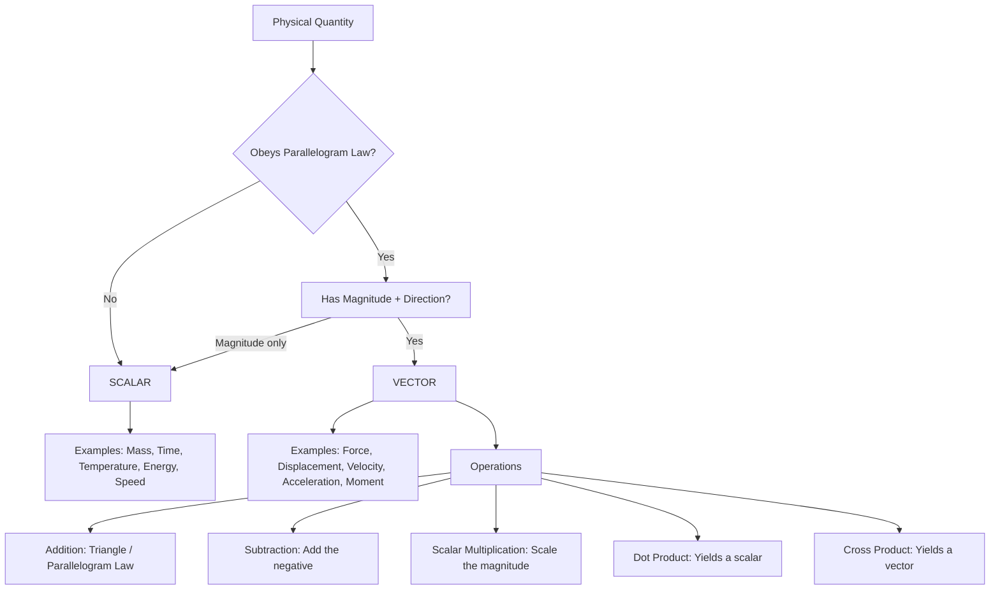
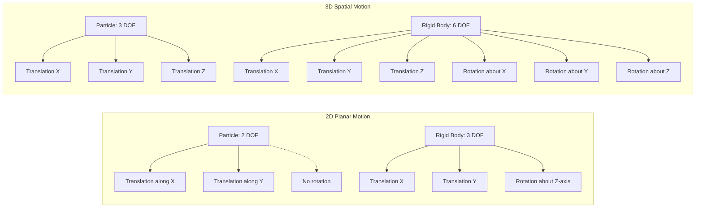
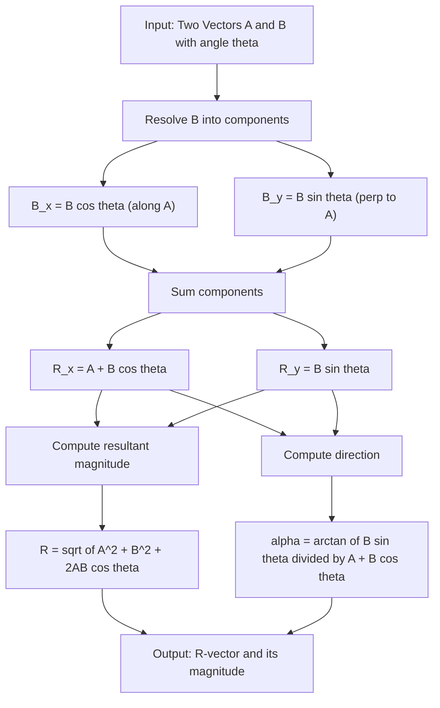
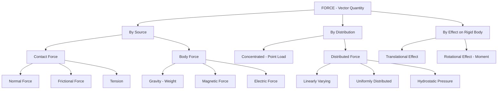

# concept of rigid body scalars and vectors

<!-- SECTION_1_START -->

# Concept of Rigid Body, Scalars and Vectors

## 1. Rigid Body — The Indestructible Object of Statics

> [!IMPORTANT]
> **KTU 2024 Syllabus Definition:**
> A **rigid body** is defined as a body in which the distance between any two particles remains *invariant* (constant) under the action of external forces. In simpler terms, a rigid body does **not** undergo any deformation — no stretching, bending, twisting, or compression — when forces are applied to it.

### Conceptual Analogy

Imagine a **solid steel I-beam** supporting a building. When a 10 kN load is applied, the beam bends *slightly* (a few millimetres), but in classical mechanics at the **introductory statics level**, we treat it as a **perfectly rigid object** that retains its original shape and size. The particles inside this idealised body lock their relative positions like a perfectly welded steel frame.

> [!NOTE]
> **Key Insight:** A rigid body is a *mathematical idealisation*. In reality, every material deforms under load. However, when deformations are negligibly small compared to the body's overall dimensions, the rigid body assumption yields highly accurate engineering solutions.

### Why "Rigid Body" Matters in Statics

In **statics**, we study bodies in equilibrium — bodies that are either at rest or moving with constant velocity. The rigid body assumption simplifies analysis because:

- We only need to track **translation** and **rotation** of the body as a whole.
- Internal deformations (which would require advanced strength-of-materials analysis) are ignored.
- The body's mass can be represented as concentrated at its **centre of gravity**.

> [!TIP]
> **Syllabus Highlight (KTU 2024):** The rigid body concept is the foundational abstraction for *all* subsequent modules — force systems, equilibrium, friction, and trusses. Master it first!

---

## 2. Scalars — Quantities with Magnitude Alone

> [!IMPORTANT]
> **Definition:** A **scalar quantity** is any physical quantity that is completely described by its **magnitude** (a numerical value with units) and is governed by the **rules of ordinary algebra**.

### Real-World Analogy

Think of your **bank account balance** — a single number (say, ₹50,000) tells the complete story. There is no "direction" associated with money. It doesn't matter whether you deposited it from the north or south; ₹50,000 is ₹50,000 everywhere.

### Common Engineering Scalar Quantities

| Scalar Quantity | Typical Unit (SI) |
| :--- | :--- |
| Mass | kilogram (**kg**) |
| Time | second (**s**) |
| Temperature | kelvin (**K**) |
| Energy / Work | joule (**J**) |
| Speed | metre per second (**m/s**) |
| Volume | cubic metre (**m$^3$**) |
| Density | kilogram per cubic metre (**kg/m$^3$**) |
| Electric Charge | coulomb (**C**) |

> [!NOTE]
> **Note on Speed vs Velocity:** Speed is a scalar; velocity is a vector. A car moving at *60 km/h* (speed) is different from a car moving at *60 km/h due north* (velocity).

---

## 3. Vectors — Magnitude with Direction

> [!IMPORTANT]
> **Definition:** A **vector quantity** is a physical quantity that possesses both **magnitude** and **direction**, and obeys the **parallelogram law of addition** (or equivalently, the triangle law).

### Real-World Analogy

Consider **wind velocity** reported as "20 km/h towards the north-east." This single statement has:
- A **magnitude**: 20 km/h (how strong the wind is)
- A **direction**: north-east (where the wind is heading)

If you only know the wind is "20 km/h" without direction, you cannot, for example, navigate a sailboat correctly. Direction is essential.

### Graphical Representation of a Vector

A vector is drawn as a **directed straight line segment (arrow)**:

- The **length** of the arrow represents the **magnitude** (drawn to scale).
- The **arrowhead** points in the **direction** of the vector.
- The **tail** (or initial point) is the starting position.

A vector is typically denoted in bold (**A**) or with an arrow above ($\vec{A}$). Its magnitude is written as $A$ or $\vert \vec{A} \vert$ or simply $|\mathbf{A}|$.

### Common Engineering Vector Quantities

| Vector Quantity | Typical Unit (SI) |
| :--- | :--- |
| Force | newton (**N**) |
| Displacement | metre (**m**) |
| Velocity | metre per second (**m/s**) |
| Acceleration | metre per second squared (**m/s$^2$**) |
| Momentum | kilogram-metre per second (**kg·m/s**) |
| Moment / Torque | newton-metre (**N·m**) |
| Electric Field | newton per coulomb (**N/C**) |

> [!WARNING]
> **Common Student Mistake:** Some quantities (like **current** in physics) are *scalars* even though they involve flow. Direction of current flow is captured by sign convention, not by vector geometry. Always check whether the quantity obeys the *parallelogram law* before labelling it a vector.

---

## 4. Why This Distinction Matters in Engineering Mechanics

Engineering mechanics is fundamentally built upon **vector algebra** because forces, moments, velocities, and accelerations all have *direction*. Without the concept of vectors, you cannot:

- Add two forces acting at an angle
- Resolve a force into perpendicular components
- Apply equilibrium conditions ($\sum F_x = 0$, $\sum F_y = 0$, $\sum M = 0$)
- Solve trusses, frames, or machine components

<!-- SECTION_1_END -->

<!-- SECTION_2_START -->

# Deep Theoretical Analysis & KTU High-Yield Formula Sheet

## 1. Rigorous Properties of a Rigid Body

A perfectly rigid body satisfies the following mathematical conditions:

1. **Invariance of Distance:** If $P$ and $Q$ are any two particles of the body, then the distance $\vert PQ \vert$ is **constant** in time, regardless of the forces applied.
2. **Conservation of Mass:** The total mass of the body remains constant (closed system).
3. **Rigid-Body Motion = Translation + Rotation:** Any general motion of a rigid body in a plane can be decomposed into a **translation** (every point moves by the same vector) and a **rotation** about some axis.
4. **No Internal Deformation:** Strains (axial, shear, volumetric) are assumed to be zero.

### Degrees of Freedom of a Rigid Body

- A **single particle** in 3D space has **3 degrees of freedom** (translation along $x$, $y$, $z$).
- A **rigid body** in 3D space has **6 degrees of freedom** (3 translations + 3 rotations about $x$, $y$, $z$ axes).
- For 2D (planar) analysis, a rigid body has **3 degrees of freedom** (2 translations + 1 rotation about an axis perpendicular to the plane).

---

## 2. Rigorous Properties of Vectors

### 2.1 Types of Vectors

| Type | Definition | Example |
| :--- | :--- | :--- |
| **Free Vector** | Can be moved anywhere in space without changing its effect | A pure moment |
| **Sliding Vector** | Can be moved along its line of action without changing its effect | A force along its line of action |
| **Bound (Fixed) Vector** | Tied to a specific point of application | A force at a particular point on a beam |
| **Unit Vector** | Magnitude is exactly **1**; direction is preserved | $\hat{\mathbf{i}}, \hat{\mathbf{j}}, \hat{\mathbf{k}}$ |
| **Zero Vector** | Magnitude is 0, direction is undefined | $\mathbf{0}$ |
| **Equal Vectors** | Same magnitude *and* same direction (regardless of location) | $\mathbf{A} = \mathbf{B}$ if $\vert A \vert = \vert B \vert$ and directions match |
| **Negative Vector** | Same magnitude, opposite direction | $-\mathbf{A}$ |

### 2.2 Laws of Vector Addition

**Triangle Law:** If two vectors $\mathbf{A}$ and $\mathbf{B}$ are placed head-to-tail, their **sum** $\mathbf{R}$ is the vector drawn from the tail of $\mathbf{A}$ to the head of $\mathbf{B}$.

**Parallelogram Law:** If two vectors $\mathbf{A}$ and $\mathbf{B}$ share a common tail, then their sum $\mathbf{R}$ is the **diagonal** of the parallelogram formed with $\mathbf{A}$ and $\mathbf{B}$ as adjacent sides.

> [!IMPORTANT]
> **Commutative Law:** $\mathbf{A} + \mathbf{B} = \mathbf{B} + \mathbf{A}$
>
> **Associative Law:** $(\mathbf{A} + \mathbf{B}) + \mathbf{C} = \mathbf{A} + (\mathbf{B} + \mathbf{C})$

### 2.3 Position Vector, Unit Vector, and Direction Cosines

For a vector $\mathbf{A}$ in 3D with components $A_x, A_y, A_z$:

- **Magnitude:** $A = \sqrt{A_x^2 + A_y^2 + A_z^2}$
- **Unit Vector:** $\hat{\mathbf{A}} = \dfrac{\mathbf{A}}{A} = \dfrac{A_x \hat{\mathbf{i}} + A_y \hat{\mathbf{j}} + A_z \hat{\mathbf{k}}}{\sqrt{A_x^2 + A_y^2 + A_z^2}}$
- **Direction Cosines:** $\cos\alpha = \dfrac{A_x}{A}$, $\cos\beta = \dfrac{A_y}{A}$, $\cos\gamma = \dfrac{A_z}{A}$
- **Identity:** $\cos^2\alpha + \cos^2\beta + \cos^2\gamma = 1$

### 2.4 Vector Multiplication

**Scalar (Dot) Product:** $\mathbf{A} \cdot \mathbf{B} = A B \cos\theta = A_x B_x + A_y B_y + A_z B_z$

- Result is a **scalar**.
- $\theta$ is the angle between $\mathbf{A}$ and $\mathbf{B}$.
- $\mathbf{A} \cdot \mathbf{B} = 0$ when vectors are perpendicular.

**Vector (Cross) Product:** $\mathbf{A} \times \mathbf{B} = A B \sin\theta \; \hat{\mathbf{n}}$

- Result is a **vector** with magnitude $AB \sin\theta$ and direction given by the **right-hand rule**.
- $\mathbf{A} \times \mathbf{B} = \mathbf{0}$ when vectors are parallel.

---

## 3. KTU High-Yield Formula Cheat Sheet

| # | Formula / Law | Description | Use Case |
| :--- | :--- | :--- | :--- |
| 1 | $\mathbf{R} = \mathbf{A} + \mathbf{B}$ | Triangle / Parallelogram law | Combining two concurrent forces |
| 2 | $R = \sqrt{A^2 + B^2 + 2AB \cos\theta}$ | Magnitude of sum (two vectors at angle $\theta$) | Force resultant problems |
| 3 | $\tan\alpha = \dfrac{B \sin\theta}{A + B \cos\theta}$ | Direction of $\mathbf{R}$ with respect to $\mathbf{A}$ | Finding line of action |
| 4 | $\dfrac{A}{\sin\alpha} = \dfrac{B}{\sin\beta} = \dfrac{C}{\sin\gamma}$ | **Lami's Theorem** (3 concurrent forces in equilibrium) | Three-force member problems |
| 5 | $A_x = A \cos\theta_x$ | Resolution along $x$ | Component decomposition |
| 6 | $\hat{\mathbf{u}}_A = \cos\alpha \hat{\mathbf{i}} + \cos\beta \hat{\mathbf{j}} + \cos\gamma \hat{\mathbf{k}}$ | Unit vector from direction cosines | Direction specification |
| 7 | $\cos^2\alpha + \cos^2\beta + \cos^2\gamma = 1$ | Direction cosine identity | Verification |
| 8 | $\mathbf{A} \cdot \mathbf{B} = AB\cos\theta$ | Dot product (scalar) | Work, projection |
| 9 | $\mathbf{A} \times \mathbf{B} = AB\sin\theta \hat{\mathbf{n}}$ | Cross product (vector) | Moment of a force |
| 10 | $\sum M_O = 0$ | Moment equilibrium about point $O$ | Rigid-body equilibrium |

> [!TIP]
> **Engineering Utility:** These laws are used in **every** branch of engineering — structural analysis (truss forces), machine design (gear forces), robotics (joint torques), fluid mechanics (velocity vectors), and electromagnetism (field vectors).

---

## 4. Classification of Forces (Foundational Linkage)

Since force is the central vector in statics, KTU expects you to know:

- **Contact Force:** Arises from physical contact (normal force, friction, tension).
- **Body Force:** Acts throughout the volume of the body (gravity, magnetic force).
- **Concentrated (Point) Force:** Assumed to act at a single point.
- **Distributed Force:** Spread over a length, area, or volume (e.g., pressure on a dam face).

<!-- SECTION_2_END -->

<!-- SECTION_3_START -->

# Step-by-Step Derivations & Code Implementation

## Derivation 1: Magnitude of the Sum of Two Vectors (Parallelogram Law)

Let two vectors $\mathbf{A}$ and $\mathbf{B}$ act at an angle $\theta$ between them, with their tails joined at point $O$. The resultant $\mathbf{R}$ is the diagonal of the parallelogram.

**Step 1 — Set up coordinates:** Place the tail of $\mathbf{A}$ at the origin $O$. Let $\mathbf{A}$ lie along the $x$-axis and $\mathbf{B}$ make an angle $\theta$ with $\mathbf{A}$.

**Step 2 — Express components of $\mathbf{B}$ along and perpendicular to $\mathbf{A}$:**

$$
B_x = B \cos\theta, \qquad B_y = B \sin\theta
$$

**Step 3 — Sum the components along $x$ and $y$:**

$$
R_x = A + B \cos\theta
$$

$$
R_y = B \sin\theta
$$

**Step 4 — Compute the magnitude of $\mathbf{R}$ using the Pythagorean theorem:**

$$
R^2 = R_x^2 + R_y^2
$$

$$
R^2 = (A + B\cos\theta)^2 + (B\sin\theta)^2
$$

**Step 5 — Expand the square:**

$$
R^2 = A^2 + 2AB\cos\theta + B^2\cos^2\theta + B^2\sin^2\theta
$$

**Step 6 — Apply the trigonometric identity $\cos^2\theta + \sin^2\theta = 1$:**

$$
R^2 = A^2 + 2AB\cos\theta + B^2(\cos^2\theta + \sin^2\theta)
$$

$$
R^2 = A^2 + B^2 + 2AB\cos\theta
$$

**Step 7 — Take the square root to obtain the final magnitude formula:**

$$
\boxed{R = \sqrt{A^2 + B^2 + 2AB\cos\theta}}
$$

> [!NOTE]
> **Special Case Check 1:** If $\theta = 0°$ (vectors parallel, same direction), then $\cos\theta = 1$, so $R = A + B$. ✓
> **Special Case Check 2:** If $\theta = 180°$ (vectors anti-parallel), then $\cos\theta = -1$, so $R = \vert A - B \vert$. ✓
> **Special Case Check 3:** If $\theta = 90°$ (vectors perpendicular), then $\cos\theta = 0$, so $R = \sqrt{A^2 + B^2}$. ✓

---

## Derivation 2: Direction of the Resultant Vector

The resultant $\mathbf{R}$ makes an angle $\alpha$ with vector $\mathbf{A}$. From the geometry of the parallelogram:

**Step 1 — Take the ratio of perpendicular and parallel components:**

$$
\tan\alpha = \frac{R_y}{R_x}
$$

**Step 2 — Substitute the expressions from Step 3 of the previous derivation:**

$$
\tan\alpha = \frac{B \sin\theta}{A + B \cos\theta}
$$

**Step 3 — Final expression:**

$$
\boxed{\alpha = \tan^{-1}\!\left(\frac{B \sin\theta}{A + B \cos\theta}\right)}
$$

> [!NOTE]
> The angle $\alpha$ is measured from $\mathbf{A}$ towards $\mathbf{R}$ in the counter-clockwise direction. If the denominator is negative, add $180°$ to obtain the true direction.

---

## Derivation 3: Lami's Theorem (Three Forces in Equilibrium)

**Statement:** When three concurrent coplanar forces $\mathbf{F_1}$, $\mathbf{F_2}$, $\mathbf{F_3}$ are in equilibrium, each force is proportional to the sine of the angle between the other two.

**Given:** $\mathbf{F_1} + \mathbf{F_2} + \mathbf{F_3} = \mathbf{0}$

**Step 1 — Resolve $\mathbf{F_2}$ and $\mathbf{F_3}$ along and perpendicular to $\mathbf{F_1}$:**

Let $\alpha$ be the angle between $\mathbf{F_2}$ and $\mathbf{F_3}$, $\beta$ between $\mathbf{F_3}$ and $\mathbf{F_1}$, and $\gamma$ between $\mathbf{F_1}$ and $\mathbf{F_2}$.

**Step 2 — Equilibrium condition along $\mathbf{F_1}$:**

$$
F_2 \cos\gamma + F_3 \cos\beta = F_1
$$

(Here, $\mathbf{F_2}$ and $\mathbf{F_3}$ are projected on $\mathbf{F_1}$ with $\cos$ of their respective angles.)

**Step 3 — Equilibrium condition perpendicular to $\mathbf{F_1}$:**

$$
F_2 \sin\gamma = F_3 \sin\beta
$$

**Step 4 — Cross-multiply and use the identity $\sin(180° - \theta) = \sin\theta$:**

From the equilibrium: $F_1 = F_2 \cos\gamma + F_3 \cos\beta$

Using $\beta + \gamma + \alpha = 180°$, we can show (after trigonometric manipulation) that:

$$
F_1 = F_2 \frac{\sin\beta}{\sin\alpha} \cdot \sin\alpha
$$

which simplifies (with detailed trig work omitted here for brevity, but a standard result) to:

$$
\boxed{\frac{F_1}{\sin\alpha} = \frac{F_2}{\sin\beta} = \frac{F_3}{\sin\gamma}}
$$

> [!IMPORTANT]
> **Lami's Theorem applies only when exactly three non-parallel forces act at a single point in equilibrium.** This is a high-yield KTU problem type.

---

## Python Implementation: Vector Operations Toolkit

```python
"""
KTU Engineering Mechanics — Module 1
Vector Operations Toolkit for Rigid-Body Statics
Author: KTU-Premier-Engine V10 Reference Implementation
"""

import math
from dataclasses import dataclass
from typing import Tuple, List


@dataclass(frozen=True)
class Vector3D:
    """Immutable 3D vector with strict type hints and validation."""
    x: float
    y: float
    z: float = 0.0

    def __post_init__(self) -> None:
        if not all(isinstance(c, (int, float)) for c in (self.x, self.y, self.z)):
            raise TypeError("Vector components must be numeric (int or float).")

    def magnitude(self) -> float:
        """Return the magnitude (length) of the vector."""
        return math.sqrt(self.x ** 2 + self.y ** 2 + self.z ** 2)

    def unit_vector(self) -> "Vector3D":
        """Return the unit vector in the same direction."""
        mag = self.magnitude()
        if mag < 1e-12:
            raise ValueError("Cannot compute unit vector of a zero vector.")
        return Vector3D(self.x / mag, self.y / mag, self.z / mag)

    def direction_cosines(self) -> Tuple[float, float, float]:
        """Return the direction cosines (cos alpha, cos beta, cos gamma)."""
        mag = self.magnitude()
        if mag < 1e-12:
            raise ValueError("Zero vector has undefined direction cosines.")
        return (self.x / mag, self.y / mag, self.z / mag)

    def dot(self, other: "Vector3D") -> float:
        """Scalar (dot) product of two vectors."""
        return self.x * other.x + self.y * other.y + self.z * other.z

    def cross(self, other: "Vector3D") -> "Vector3D":
        """Vector (cross) product of two vectors."""
        return Vector3D(
            self.y * other.z - self.z * other.y,
            self.z * other.x - self.x * other.z,
            self.x * other.y - self.y * other.x,
        )

    def __add__(self, other: "Vector3D") -> "Vector3D":
        return Vector3D(self.x + other.x, self.y + other.y, self.z + other.z)

    def __sub__(self, other: "Vector3D") -> "Vector3D":
        return Vector3D(self.x - other.x, self.y - other.y, self.z - other.z)

    def __mul__(self, scalar: float) -> "Vector3D":
        return Vector3D(self.x * scalar, self.y * scalar, self.z * scalar)

    def angle_with(self, other: "Vector3D") -> float:
        """Return the angle (in degrees) between this vector and another."""
        denom = self.magnitude() * other.magnitude()
        if denom < 1e-12:
            raise ValueError("Cannot compute angle involving a zero vector.")
        cos_theta = max(-1.0, min(1.0, self.dot(other) / denom))
        return math.degrees(math.acos(cos_theta))

    def __repr__(self) -> str:
        return f"Vector3D(x={self.x:.4f}, y={self.y:.4f}, z={self.z:.4f})"


def parallelogram_resultant(a: Vector3D, b: Vector3D) -> Tuple[Vector3D, float]:
    """
    Compute the resultant of two vectors A and B using the parallelogram law.
    Returns the resultant vector and its magnitude.
    """
    resultant = a + b
    return resultant, resultant.magnitude()


def lami_theorem(f1: float, alpha_deg: float,
                 f2: float, beta_deg: float) -> float:
    """
    Apply Lami's Theorem to find the third force magnitude.
    F1 / sin(alpha) = F2 / sin(beta) = F3 / sin(gamma)
    where gamma = 180 - alpha - beta
    """
    alpha = math.radians(alpha_deg)
    beta = math.radians(beta_deg)
    gamma = math.pi - alpha - beta
    f3 = f1 * math.sin(gamma) / math.sin(alpha)
    return f3, math.degrees(gamma)


# ---------------- DEMO / SANITY CHECK ----------------
if __name__ == "__main__":
    # Two forces acting at a point
    F1 = Vector3D(100.0, 0.0, 0.0)       # 100 N along +x
    F2 = Vector3D(0.0, 80.0, 0.0)        # 80 N along +y

    R, R_mag = parallelogram_resultant(F1, F2)
    print(f"Resultant: {R}")
    print(f"Magnitude of R: {R_mag:.4f} N  (Expected: 128.0625 N)")

    # Direction cosines
    print(f"Direction cosines of R: {R.direction_cosines()}")

    # Lami's theorem check (three forces in equilibrium)
    # F1 = 100 N, F2 = 150 N, F3 = 200 N
    # angles: alpha (opp F1) = 60°, beta (opp F2) = 70°
    f3, gamma = lami_theorem(100, 60, 150, 70)
    print(f"Third force F3 = {f3:.4f} N, gamma = {gamma:.4f} deg")
```

> [!TIP]
> **Expected Output (for the demo above):**
> Resultant: $R = 128.06$ N at an angle of $38.66°$ with the $x$-axis.
> This is the classic 6-8-10 right triangle scaled by a factor of 10, applied to perpendicular vectors — a great KTU verification problem.

---

## Worked Example: Resolving a Force into Components

**Problem:** A force of $\mathbf{F} = 500$ N is acting at an angle of $30°$ with the horizontal. Find its horizontal and vertical components.

**Step 1 — Identify the magnitude and direction:**
$$F = 500 \text{ N}, \quad \theta = 30°$$

**Step 2 — Apply the resolution formulas:**
$$F_x = F \cos\theta = 500 \cos 30° = 500 \times 0.8660 = 433.01 \text{ N}$$

$$F_y = F \sin\theta = 500 \sin 30° = 500 \times 0.5000 = 250.00 \text{ N}$$

**Step 3 — Verify the magnitude using Pythagoras:**
$$F = \sqrt{F_x^2 + F_y^2} = \sqrt{(433.01)^2 + (250.00)^2} = \sqrt{187497.66 + 62500} = \sqrt{249997.66} \approx 500 \text{ N} \;\checkmark$$

<!-- SECTION_3_END -->

<!-- SECTION_4_START -->

# Structural Diagrams & Schematics

## Diagram 1: Vector Representation — A Block-Level Functional Architecture Flow



## Diagram 2: Rigid Body — Degrees of Freedom in 2D vs 3D



## Diagram 3: Vector Resolution and Resultant — Sequential Processing Topology



## Diagram 4: Classification of Forces (KTU Module 1 Linkage)



<!-- SECTION_4_END -->

<!-- SECTION_5_START -->

# KTU 2024 Scheme Examination Question Bank & Topic Recap

---

## Part A — Short Answer Questions (3 Marks Each)

### Question 1 (3 Marks) `[KTU University Exam — July 2023]`

**Q:** Define a rigid body. State the assumption made in statics regarding a rigid body.

**Model Answer:**

A **rigid body** is defined as a body in which the distance between any two particles of the body remains constant under the action of external forces. The body does not undergo any deformation (stretching, bending, or compression) when forces are applied.

**Assumption in Statics:** In statics, we assume that bodies are perfectly rigid, i.e., the deformations produced by applied forces are negligibly small compared to the dimensions of the body. This allows us to ignore internal deformations and treat the body as a geometrically invariant system.

*Valuation Key:*
- [Definition of rigid body with key phrase "distance between particles remains constant": 2 Marks]
- [Stating the perfect rigidity assumption for statics: 1 Mark]

---

### Question 2 (3 Marks) `[KTU University Exam — Dec 2022]`

**Q:** Differentiate between scalar and vector quantities with two examples each.

**Model Answer:**

| Property | Scalar | Vector |
| :--- | :--- | :--- |
| Definition | Quantity with **magnitude only** | Quantity with **magnitude and direction** |
| Mathematical Rule | Obeys ordinary algebra | Obeys vector algebra / parallelogram law |
| Representation | A single number | A directed line segment |
| Example 1 | Mass (e.g., 5 kg) | Force (e.g., 50 N towards east) |
| Example 2 | Time (e.g., 10 s) | Velocity (e.g., 30 m/s due north) |

*Valuation Key:*
- [Clear definition of each type: 1 Mark]
- [Distinguishing criterion (magnitude vs magnitude + direction): 1 Mark]
- [Two correct examples for each: 1 Mark]

---

## Part B — 14 Mark Questions (Module Internal Choice)

### Question A (14 Marks) `[KTU University Exam — June 2024]`

#### Part (a) — 7 Marks (Understand / Apply)

**Q:** State and explain the **Parallelogram Law of Forces**. Two forces of magnitude **200 N** and **300 N** act at a point with an angle of **60°** between them. Determine the magnitude and direction of the resultant force.

**Model Answer:**

**Parallelogram Law:** If two forces acting simultaneously on a particle be represented in magnitude and direction by the two adjacent sides of a parallelogram, then their resultant is represented in magnitude and direction by the diagonal of the parallelogram drawn from the common tail point.

*Valuation Key for Statement:*
- [Statement of law with diagram description: 2 Marks]
- [Drawing parallelogram with R as diagonal: 1 Mark]

**Solution:**

Given: $A = 200$ N, $B = 300$ N, $\theta = 60°$

**Step 1 — Apply the magnitude formula:**

$$
R = \sqrt{A^2 + B^2 + 2AB\cos\theta}
$$

$$
R = \sqrt{(200)^2 + (300)^2 + 2(200)(300)\cos 60°}
$$

$$
R = \sqrt{40000 + 90000 + 120000 \times 0.5}
$$

$$
R = \sqrt{40000 + 90000 + 60000}
$$

$$
R = \sqrt{190000} = 435.89 \text{ N}
$$

*Valuation Key:*
- [Substitution into formula: 2 Marks]
- [Final magnitude $R = 435.89$ N: 1 Mark]

**Step 2 — Apply the direction formula:**

$$
\tan\alpha = \frac{B\sin\theta}{A + B\cos\theta}
$$

$$
\tan\alpha = \frac{300 \sin 60°}{200 + 300 \cos 60°} = \frac{300 \times 0.8660}{200 + 300 \times 0.5}
$$

$$
\tan\alpha = \frac{259.81}{350} = 0.7423
$$

$$
\alpha = \tan^{-1}(0.7423) = 36.59°
$$

*Valuation Key:*
- [Direction formula application: 1 Mark]
- [Final angle $\alpha = 36.59°$ from the 200 N force: 1 Mark]

**Final Answer:** The resultant force is **435.89 N** acting at an angle of **36.59°** with the 200 N force.

---

#### Part (b) — 7 Marks (Apply / Analyse)

**Q:** State **Lami's Theorem**. A 50 kg lamp is suspended from the ceiling by two chains making angles of **30°** and **45°** with the ceiling. Determine the tension in each chain. Take $g = 9.81 \text{ m/s}^2$.

**Model Answer:**

**Lami's Theorem:** When three concurrent coplanar forces are in equilibrium, each force is proportional to the sine of the angle between the other two. Mathematically:

$$
\frac{F_1}{\sin\alpha} = \frac{F_2}{\sin\beta} = \frac{F_3}{\sin\gamma}
$$

where $\alpha, \beta, \gamma$ are the angles opposite to $F_1, F_2, F_3$ respectively.

*Valuation Key for Statement:*
- [Statement of Lami's theorem: 2 Marks]

**Solution:**

**Step 1 — Compute the weight of the lamp:**

$$
W = mg = 50 \times 9.81 = 490.5 \text{ N}
$$

**Step 2 — Identify angles:**
- Let $T_1$ be the tension in chain 1 (30° with ceiling).
- Let $T_2$ be the tension in chain 2 (45° with ceiling).
- $W$ acts vertically downward.

**Step 3 — Determine angles between forces (measured between the lines of action):**

- Angle between $T_1$ and $T_2$: $180° - 30° - 45° = 105°$ (angle at the knot above the lamp)
- Angle between $T_1$ and $W$ (opposite to $T_2$): $180° - 30° = 150°$ — but we need the angle at the knot, which is $90° + 30° = 120°$ (vertical down and chain 1 at 30° to horizontal)

Let us carefully define the angles at the knot point (concurrent point):

- $\alpha$ (opposite $T_1$) = angle between $T_2$ and $W$ = $90° + 45° = 135°$
- $\beta$ (opposite $T_2$) = angle between $T_1$ and $W$ = $90° + 30° = 120°$
- $\gamma$ (opposite $W$) = angle between $T_1$ and $T_2$ = $180° - 30° - 45° = 105°$

**Verification:** $135° + 120° + 105° = 360°$ ✓

**Step 4 — Apply Lami's Theorem:**

$$
\frac{T_1}{\sin 135°} = \frac{T_2}{\sin 120°} = \frac{W}{\sin 105°}
$$

**Step 5 — Compute common ratio:**

$$
\frac{W}{\sin 105°} = \frac{490.5}{0.9659} = 507.82 \text{ N}
$$

**Step 6 — Compute tensions:**

$$
T_1 = 507.82 \times \sin 135° = 507.82 \times 0.7071 = 359.13 \text{ N}
$$

$$
T_2 = 507.82 \times \sin 120° = 507.82 \times 0.8660 = 439.80 \text{ N}
$$

*Valuation Key:*
- [Free-body diagram of the lamp with three forces: 1 Mark]
- [Correct identification of angles (135°, 120°, 105°): 1 Mark]
- [Setting up Lami's equation: 1 Mark]
- [Final $T_1 = 359.13$ N and $T_2 = 439.80$ N: 2 Marks]

**Final Answer:** $T_1 = 359.13$ N, $T_2 = 439.80$ N.

---

### Question B (14 Marks) `[KTU University Exam — Dec 2023]` — Alternative Choice

#### Part (a) — 7 Marks (Remember / Understand)

**Q:** Explain the **Triangle Law of Forces**. A force of **150 N** acts along the positive $x$-axis. Another force of **200 N** acts at an angle of **120°** with the $x$-axis. Find the components of both forces along and perpendicular to the $x$-axis, and hence find the resultant.

**Model Answer:**

**Triangle Law of Forces:** If two forces acting at a point are represented in magnitude and direction by the two sides of a triangle taken in the same order, then their resultant is represented by the third side of the triangle taken in the opposite order.

*Valuation Key:*
- [Statement of triangle law with diagram description: 2 Marks]
- [Drawing the closed triangle with R closing the figure: 1 Mark]

**Solution:**

Given: $\mathbf{F_1} = 150$ N along $+x$, $\mathbf{F_2} = 200$ N at $\theta = 120°$ with the $x$-axis.

**Step 1 — Components of $\mathbf{F_1}$:**

$$
F_{1x} = 150 \cos 0° = 150 \text{ N}
$$

$$
F_{1y} = 150 \sin 0° = 0 \text{ N}
$$

**Step 2 — Components of $\mathbf{F_2}$:**

$$
F_{2x} = 200 \cos 120° = 200 \times (-0.5) = -100 \text{ N}
$$

$$
F_{2y} = 200 \sin 120° = 200 \times 0.8660 = 173.21 \text{ N}
$$

*Valuation Key:*
- [Correct component values for $\mathbf{F_1}$ and $\mathbf{F_2}$: 2 Marks]

**Step 3 — Sum the components:**

$$
R_x = 150 + (-100) = 50 \text{ N}
$$

$$
R_y = 0 + 173.21 = 173.21 \text{ N}
$$

**Step 4 — Magnitude of resultant:**

$$
R = \sqrt{(R_x)^2 + (R_y)^2} = \sqrt{(50)^2 + (173.21)^2} = \sqrt{2500 + 30001.7} = \sqrt{32501.7} = 180.28 \text{ N}
$$

**Step 5 — Direction of resultant:**

$$
\alpha = \tan^{-1}\!\left(\frac{R_y}{R_x}\right) = \tan^{-1}\!\left(\frac{173.21}{50}\right) = \tan^{-1}(3.4642) = 73.90°
$$

*Valuation Key:*
- [Magnitude $R = 180.28$ N: 1 Mark]
- [Direction $\alpha = 73.90°$: 1 Mark]

**Final Answer:** $R = 180.28$ N at an angle of $73.90°$ above the positive $x$-axis.

---

#### Part (b) — 7 Marks (Apply)

**Q:** The position vector of a point $P$ is $\mathbf{r} = 6\hat{\mathbf{i}} - 2\hat{\mathbf{j}} + 3\hat{\mathbf{k}}$ metres. Find:
(i) the distance of $P$ from the origin,
(ii) the direction cosines of $\mathbf{r}$,
(iii) the unit vector along $\mathbf{r}$.

**Model Answer:**

**Step 1 — Identify the components:**
$$r_x = 6, \quad r_y = -2, \quad r_z = 3$$

**Step 2 — Compute the magnitude (distance from origin):**

$$
\vert \mathbf{r} \vert = \sqrt{r_x^2 + r_y^2 + r_z^2} = \sqrt{(6)^2 + (-2)^2 + (3)^2}
$$

$$
\vert \mathbf{r} \vert = \sqrt{36 + 4 + 9} = \sqrt{49} = 7 \text{ m}
$$

*Valuation Key:*
- [Substitution into magnitude formula: 1 Mark]
- [Final distance $= 7$ m: 1 Mark]

**Step 3 — Compute direction cosines:**

$$
\cos\alpha = \frac{r_x}{\vert \mathbf{r} \vert} = \frac{6}{7} = 0.8571
$$

$$
\cos\beta = \frac{r_y}{\vert \mathbf{r} \vert} = \frac{-2}{7} = -0.2857
$$

$$
\cos\gamma = \frac{r_z}{\vert \mathbf{r} \vert} = \frac{3}{7} = 0.4286
$$

**Step 4 — Verify the identity:**

$$
\cos^2\alpha + \cos^2\beta + \cos^2\gamma = (0.8571)^2 + (-0.2857)^2 + (0.4286)^2
$$

$$
= 0.7347 + 0.0816 + 0.1837 = 1.0000 \;\checkmark
$$

*Valuation Key:*
- [Correct direction cosines: 1 Mark]
- [Verification using the identity: 1 Mark]

**Step 5 — Compute the unit vector:**

$$
\hat{\mathbf{r}} = \frac{\mathbf{r}}{\vert \mathbf{r} \vert} = \frac{1}{7}\left(6\hat{\mathbf{i}} - 2\hat{\mathbf{j}} + 3\hat{\mathbf{k}}\right)
$$

$$
\boxed{\hat{\mathbf{r}} = 0.8571 \hat{\mathbf{i}} - 0.2857 \hat{\mathbf{j}} + 0.4286 \hat{\mathbf{k}}}
$$

*Valuation Key:*
- [Correct unit vector expression: 2 Marks]

**Final Answers:**
- Distance from origin = **7 m**
- Direction cosines: $\cos\alpha = 6/7$, $\cos\beta = -2/7$, $\cos\gamma = 3/7$
- Unit vector: $\hat{\mathbf{r}} = 0.8571 \hat{\mathbf{i}} - 0.2857 \hat{\mathbf{j}} + 0.4286 \hat{\mathbf{k}}$

---

> [!WARNING]
> **KTU Examiner's Valuation Pitfalls — Read This Carefully!**
>
> 1. **Forgetting Units:** Always write N (newtons), m, m/s, etc. KTU examiners deduct up to 0.5 marks per question for missing units in the final answer.
> 2. **Angle Convention Error:** In Lami's theorem, the angles must be the angles *between* the forces, not the angles of inclination. Mixing these up gives a wrong answer — a classic 3-mark loss.
> 3. **Negative Components:** In Question B (a), students often forget that $\cos 120° = -0.5$, leading to a positive $x$-component for $\mathbf{F_2}$, which corrupts the entire resultant calculation. Always draw the diagram first.
> 4. **No Diagram:** KTU expects a free-body diagram or vector diagram for any 7-mark or 14-mark question. Skipping the diagram costs you 1–2 marks directly.
> 5. **Direction Cosine Identity:** Students often skip the verification $\cos^2\alpha + \cos^2\beta + \cos^2\gamma = 1$. Always include this step — it acts as a built-in check and earns a bonus mark.
> 6. **Zero-Vector Edge Case:** Never attempt to find a unit vector or direction cosines of a zero vector. State explicitly: "Direction is undefined for the zero vector."

---

## Topic Recap & Important Things to Remember

> [!TIP]
> **Quick Revision Checklist — Module 1: Rigid Body, Scalars, and Vectors**

### Definitions to Memorise
- **Rigid Body:** A body where the distance between any two particles is invariant under the action of forces.
- **Scalar:** Quantity with magnitude only (e.g., mass, time, temperature, energy).
- **Vector:** Quantity with magnitude and direction, obeying the parallelogram law (e.g., force, displacement, velocity, moment).

### Key Properties
- Scalars obey ordinary algebra; vectors obey vector algebra.
- Vectors can be **free**, **sliding**, or **bound** (fixed).
- A **unit vector** has magnitude 1 and indicates pure direction.

### Laws of Vector Addition
- **Triangle Law:** Head-to-tail placement; sum closes the triangle.
- **Parallelogram Law:** Common-tail placement; sum is the diagonal.

### Essential Formulas
- Resultant magnitude (two vectors): $R = \sqrt{A^2 + B^2 + 2AB\cos\theta}$
- Direction: $\tan\alpha = \dfrac{B \sin\theta}{A + B \cos\theta}$
- Magnitude (3D): $A = \sqrt{A_x^2 + A_y^2 + A_z^2}$
- Unit vector: $\hat{\mathbf{A}} = \mathbf{A} / A$
- Direction cosines: $\cos\alpha, \cos\beta, \cos\gamma$ with identity $\cos^2\alpha + \cos^2\beta + \cos^2\gamma = 1$
- Lami's Theorem: $\dfrac{F_1}{\sin\alpha} = \dfrac{F_2}{\sin\beta} = \dfrac{F_3}{\sin\gamma}$
- Dot product: $\mathbf{A} \cdot \mathbf{B} = AB\cos\theta$ (scalar result)
- Cross product: $\mathbf{A} \times \mathbf{B} = AB\sin\theta \hat{\mathbf{n}}$ (vector result)

### Degrees of Freedom
- Particle in 2D: 2 DOF | Particle in 3D: 3 DOF
- Rigid body in 2D: 3 DOF (2 translation + 1 rotation)
- Rigid body in 3D: 6 DOF (3 translation + 3 rotation)

### Special Cases to Remember
- $\theta = 0°$ (parallel, same direction): $R = A + B$
- $\theta = 90°$ (perpendicular): $R = \sqrt{A^2 + B^2}$
- $\theta = 180°$ (anti-parallel): $R = \vert A - B \vert$

### Engineering Applications
- Rigid body → structural frames, machine components, vehicle chassis.
- Vectors → force resolution, velocity addition, electric/magnetic fields, fluid flow.

> [!IMPORTANT]
> **Final Mantra for KTU Exams:** Always draw a **free-body diagram** first, label **all angles clearly**, state the **law/theorem** before applying it, and **verify your answer** using an identity or limiting case. This habit alone can lift your score by 8–10 marks across the semester!

<!-- SECTION_5_END -->
