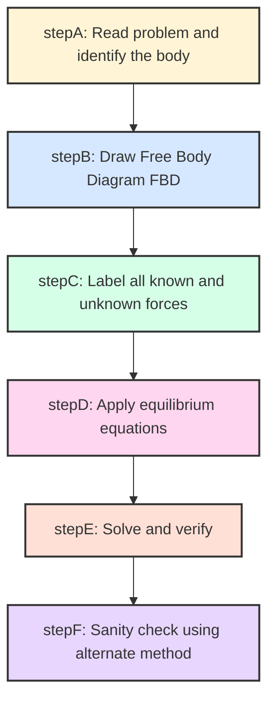
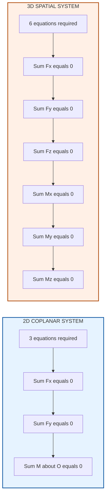
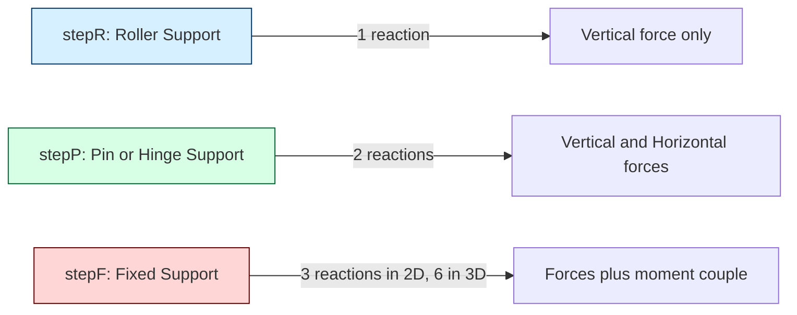
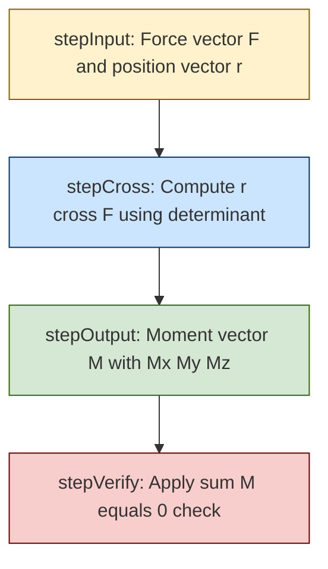

# equilibrium conditions 2D and 3D

<!-- SECTION_1_START -->

# 1. Core Technical Definition & Intuitive Overview

## 1.1 Formal Definition (KTU 2024 Syllabus Terminology)

> [!IMPORTANT]
> **Static Equilibrium (KTU Definition):**
> A rigid body is said to be in **static equilibrium** when it is at rest (or moves with constant velocity) and the resultant of all external forces and couples acting on it is zero. Mathematically, the body must satisfy **Newton's First Law of Motion** ($\sum \vec{F} = 0$) and the **moment equilibrium condition** ($\sum \vec{M} = 0$) simultaneously.

In the context of **Engineering Mechanics (GCEST103)**, equilibrium analysis is the foundation for solving all problems related to trusses, beams, frames, and machines. A body that is not accelerating (linear or angular) is in equilibrium.

---

## 1.2 Conceptual Analogy & Geometric Intuition

**Real-World Analogy — "The Sleeping Cat on a Table":**
Imagine a cat resting perfectly still on a flat table.

- The **weight of the cat** (downward force) is exactly balanced by the **normal reaction** of the table (upward force). The cat does not fall through (force balance).
- The cat is not rotating, tipping, or rolling sideways — the **clockwise tendency** of the weight is balanced by the **counter-clockwise reaction** (moment balance).

If you remove the table, the cat falls — equilibrium is broken.

**Intuitive Geometric Picture:**
- **2D (Coplanar) Equilibrium:** Think of a flat sheet of paper lying on a desk. The forces and moments all act *in the plane* of the paper. We need only **3 independent equations** to describe the full equilibrium state.
- **3D (Spatial) Equilibrium:** Think of a heavy toolbox suspended by three ropes in a room. Forces act along ropes at different angles, and moments can occur about any of the 3 spatial axes. We need **6 independent equations**.

---

## 1.3 Why Equilibrium Matters in Engineering

Every civil structure (bridge, building, dam), every machine component (crankshaft, gear, lever), and every mechanism (robotic arm, suspension system) must be in equilibrium to function safely. **Failure to satisfy equilibrium conditions leads directly to collapse, vibration, or fracture** — this is why KTU dedicates significant marks to this topic.

> [!NOTE]
> **Syllabus Highlight (Module 1):**
> *"Equilibrium conditions for a particle and a rigid body in two dimensions and three dimensions; Free body diagrams; Types of supports and reactions."*
> — *KTU 2024 Scheme, GCEST103 Engineering Mechanics*

---

## 1.4 Physical Constants & Standard Metrics

| Quantity | Symbol | Standard Value | Unit |
|----------|--------|----------------|------|
| Acceleration due to gravity | $g$ | **9.81 m/s²** | m/s² |
| Universal gas constant | $R$ | 8.314 | J/(mol·K) |

> [!NOTE]
> The value **$g = 9.81$ m/s²** is the only physical constant required for this module. Always carry this value (or 9.8) explicitly in your final numerical answer to earn full marks in KTU valuation.

---

> [!VISUALIZATION CONTROL]
> **Concept:** Vector sum closure (closed polygon of forces) — geometric interpretation of 2D equilibrium.
> **GeoGebra / Desmos Input Equations:**
> * `f1 = (4, 2)` — Force vector 1 (tip-to-tail start)
> * `f2 = (-3, 1)` — Force vector 2
> * `f3 = (-1, -3)` — Force vector 3
> **Visual Description:** Plot these three vectors head-to-tail on a 2D coordinate plane. The student should observe that the **final tip returns exactly to the origin**, forming a closed triangle. This geometric closure is the graphical signature of $\sum \vec{F} = 0$.

<!-- SECTION_1_END -->

<!-- SECTION_2_START -->

# 2. Deep Theoretical Analysis & KTU High-Yield Formula Sheet

## 2.1 The Two Pillars of Equilibrium

A rigid body in static equilibrium must satisfy **two independent conditions** simultaneously:

### Pillar 1 — Translational Equilibrium (Force Balance)
The vector sum of all external forces acting on the body must equal zero. This prevents the body from translating (moving in a straight line).

$$\sum \vec{F} = 0$$

### Pillar 2 — Rotational Equilibrium (Moment Balance)
The vector sum of all external moments (about **any** arbitrary point O) must equal zero. This prevents the body from rotating.

$$\sum \vec{M}_O = 0$$

> [!IMPORTANT]
> **Why "any" point?**
> Because if $\sum \vec{F} = 0$ and $\sum \vec{M}_O = 0$ at *one* point O, then $\sum \vec{M}_P = 0$ for **every other point P** in the plane (or space). This property is a direct consequence of Newton's Third Law and the moment-translation principle. KTU examiners love asking *"Why can the moment be taken about any point?"* — this is the answer.

---

## 2.2 Equilibrium in 2D (Coplanar / Planar Systems)

When all forces lie in a single plane (say, the XY-plane), the body has **3 degrees of freedom** (2 translations + 1 rotation). We therefore need **3 scalar equations**:

$$\boxed{\sum F_x = 0 \qquad \sum F_y = 0 \qquad \sum M_O = 0}$$

**Step-by-step logic:**
1. Resolve every inclined force into its $x$ and $y$ components using $F_x = F\cos\theta$ and $F_y = F\sin\theta$.
2. Apply $\sum F_x = 0$ to eliminate horizontal unknowns.
3. Apply $\sum F_y = 0$ to eliminate vertical unknowns.
4. Apply $\sum M_O = 0$ about a *strategic* point (usually where two unknowns intersect — this eliminates them automatically and gives a single equation for one unknown).

> [!TIP]
> **Strategy for Choosing the Moment Center:**
> Always pick the point where the **maximum number of unknown reaction lines intersect**. This collapses multiple unknowns out of the moment equation, simplifying algebra dramatically. This is a recurring **7-mark pattern** in KTU university exams.

---

## 2.3 Equilibrium in 3D (Spatial Systems)

When forces act in three-dimensional space, the body has **6 degrees of freedom** (3 translations + 3 rotations). We therefore need **6 scalar equations**:

$$\boxed{\begin{aligned}\sum F_x = 0 \\[2pt] \sum F_y = 0 \\[2pt] \sum F_z = 0 \\[2pt] \sum M_x = 0 \\[2pt] \sum M_y = 0 \\[2pt] \sum M_z = 0\end{aligned}}$$

**Step-by-step logic:**
1. Define a global Cartesian coordinate system $(X, Y, Z)$.
2. Resolve each force $\vec{F}$ into $(F_x, F_y, F_z)$ using direction cosines: $F_x = F\cos\alpha$, $F_y = F\cos\beta$, $F_z = F\cos\gamma$.
3. Locate the application point $\vec{r} = (x, y, z)$ for each force.
4. Compute moment using the cross product: $\vec{M} = \vec{r} \times \vec{F}$.
5. Apply the 6 scalar equations independently.

---

## 2.4 Determinacy, Indeterminacy & Instability

For a 2D rigid body, if:
- $r$ = number of unknown reaction components
- $e$ = number of independent equilibrium equations (3 for 2D, 6 for 3D)

| Condition | Classification | Solvability |
|-----------|---------------|-------------|
| $r = e$ | **Statically determinate** | Solvable by equilibrium alone |
| $r > e$ | **Statically indeterminate** | Requires compatibility of deformations |
| $r < e$ | **Unstable / improperly constrained** | Body can move; no unique solution |

---

## 2.5 KTU High-Yield Formula Sheet (Cheat Sheet)

> [!NOTE]
> **Master this table — it covers 80% of numerical questions asked in KTU ESE.**

| # | Concept | Equation | Application |
|---|---------|----------|-------------|
| 1 | 2D translational equilibrium | $\sum F_x = 0, \quad \sum F_y = 0$ | All coplanar particle/body problems |
| 2 | 2D rotational equilibrium | $\sum M_O = 0$ | Used to find one unknown quickly |
| 3 | 3D translational equilibrium | $\sum F_x = \sum F_y = \sum F_z = 0$ | Spatial force systems |
| 4 | 3D rotational equilibrium | $\sum M_x = \sum M_y = \sum M_z = 0$ | Spatial moment systems |
| 5 | Varignon's Theorem (2D) | $M_O = \sum (x_i F_{yi} - y_i F_{xi})$ | Computing moment without cross product |
| 6 | Cross product form (3D) | $\vec{M}_O = \vec{r} \times \vec{F}$ | Spatial moment calculation |
| 7 | Determinacy check (2D) | $r$ vs. $3$ | Beam/frame analysis |
| 8 | Determinacy check (3D) | $r$ vs. $6$ | Spatial frame analysis |
| 9 | Direction cosines identity | $\cos^2\alpha + \cos^2\beta + \cos^2\gamma = 1$ | Sanity check for force direction |
| 10 | Resultant magnitude (3D) | $R = \sqrt{F_x^2 + F_y^2 + F_z^2}$ | Final verification |

---

## 2.6 Real-World Engineering Applications

- **Civil Engineering:** Stability analysis of buildings, bridges, and retaining walls — every support reaction is found using these equilibrium equations.
- **Mechanical Engineering:** Crankshaft analysis, robotic arm design, gear force transmission.
- **Aerospace Engineering:** Trim conditions of an aircraft require **6 equilibrium equations** to be satisfied simultaneously for straight-and-level flight.
- **Biomechanics:** Human posture analysis — the spine is treated as a 3D rigid body and balance is verified using the 6 equilibrium equations.

<!-- SECTION_2_END -->

<!-- SECTION_3_START -->

# 3. Step-by-Step Derivations, Worked Examples & Code Implementation

## 3.1 Derivation: Moment Equivalence Between Two Points (3D)

**Statement:** If a rigid body is in translational equilibrium, the moment about *any* two points is equal.

**Derivation:**

Consider two points O and P in 3D space. The position vector of P relative to O is $\vec{r}_{OP}$. A force $\vec{F}$ applied at point A produces moments $\vec{M}_O = \vec{r}_{OA} \times \vec{F}$ and $\vec{M}_P = \vec{r}_{PA} \times \vec{F}$.

The difference in moments is:

$$\vec{M}_O - \vec{M}_P = \vec{r}_{OA} \times \vec{F} - \vec{r}_{PA} \times \vec{F}$$

Using $\vec{r}_{OA} = \vec{r}_{OP} + \vec{r}_{PA}$:

$$\vec{M}_O - \vec{M}_P = (\vec{r}_{OP} + \vec{r}_{PA}) \times \vec{F} - \vec{r}_{PA} \times \vec{F}$$

$$\vec{M}_O - \vec{M}_P = \vec{r}_{OP} \times \vec{F} + \vec{r}_{PA} \times \vec{F} - \vec{r}_{PA} \times \vec{F}$$

$$\vec{M}_O - \vec{M}_P = \vec{r}_{OP} \times \vec{F}$$

Now, if $\sum \vec{F} = 0$ (translational equilibrium), then summing over all forces:

$$\sum \vec{M}_O - \sum \vec{M}_P = \vec{r}_{OP} \times \sum \vec{F} = \vec{r}_{OP} \times \vec{0} = \vec{0}$$

Therefore:

$$\boxed{\sum \vec{M}_O = \sum \vec{M}_P}$$

This is the rigorous proof that the moment center can be chosen arbitrarily in an equilibrium problem.

---

## 3.2 Worked Example 1 — 2D Equilibrium of a Ladder (KTU Classic)

**Problem Statement:**
A uniform ladder of length **5 m** and weight **200 N** rests against a smooth vertical wall. The base of the ladder is on a rough horizontal floor at distance **3 m** from the wall. A man of weight **750 N** stands on the ladder at a point **4 m** from the bottom. Determine the reactions at the wall and the floor.

**Given:**
- $L = 5$ m, ladder weight $W_L = 200$ N (acts at midpoint, 2.5 m from bottom)
- Man weight $W_m = 750$ N at 4 m from bottom
- Base distance from wall $= 3$ m → height of top $= \sqrt{5^2 - 3^2} = 4$ m
- Wall is **smooth** (no friction, reaction $N_w$ is horizontal)
- Floor is **rough** (friction $F_f$ horizontal, normal $N_f$ vertical)

**Free Body Diagram (description):**
- At A (base on floor): Vertical $N_f$ ↑, horizontal $F_f$ ←
- At B (top on wall): Horizontal $N_w$ →
- Ladder weight at midpoint: 200 N ↓
- Man's weight at 4 m: 750 N ↓

**Step 1: Apply $\sum F_x = 0$:**

$$N_w - F_f = 0 \implies F_f = N_w \quad \text{[1 Mark]}$$

**Step 2: Apply $\sum F_y = 0$:**

$$N_f - 200 - 750 = 0 \implies N_f = 950 \text{ N} \quad \text{[1 Mark]}$$

**Step 3: Apply $\sum M_A = 0$ (taking moments at the base, counter-clockwise positive):**

$$N_w \cdot (4) - 200 \cdot (1.5) - 750 \cdot (2.4) = 0$$

$$4 N_w - 300 - 1800 = 0$$

$$4 N_w = 2100$$

$$N_w = 525 \text{ N} \quad \text{[3 Marks for equation setup and solution]}$$

**Step 4: Back-substitute:**

$$F_f = N_w = 525 \text{ N} \quad \text{[1 Mark]}$$

**Final Answer Boxed:**

$$\boxed{N_f = 950 \text{ N} \quad N_w = 525 \text{ N} \quad F_f = 525 \text{ N}}$$

> [!WARNING]
> **KTU Examiner's Pitfall:** Many students forget to convert the man's horizontal distance from the base into the moment arm for vertical forces. The man's 750 N is vertical, so its moment arm is the **horizontal distance** from the base along the floor, which is $\frac{4}{5} \times 3 = 2.4$ m (using similar triangles). Always project vertical force arms onto the horizontal axis and horizontal force arms onto the vertical axis.

---

## 3.3 Worked Example 2 — 3D Equilibrium (Spatial Force System)

**Problem Statement:**
A horizontal circular plate of weight **500 N** and radius **2 m** is supported by three chains attached at points A, B, and C on the rim (120° apart). The chains make angles of 60° with the vertical. A vertical load of **1000 N** is applied at the geometric center O. Determine the tension in each chain.

**Given:**
- Weight of plate $W = 500$ N (downward at O)
- Applied load $P = 1000$ N (downward at O)
- Each chain tension $T$ (by symmetry, all 3 are equal)
- Angle of each chain with vertical: $\theta = 60°$

**Free Body Diagram (description):**
- Three chains at A, B, C — each tension $T$ inclined at 60° to vertical, directed upward and outward.
- Total downward load at O: $500 + 1000 = 1500$ N

**Step 1: Resolve each tension into components.**
By symmetry, the horizontal components of the three chain tensions cancel out (they form a closed vector triangle in plan view). Therefore, only the **vertical components** matter for the force balance.

**Step 2: Apply $\sum F_z = 0$ (vertical equilibrium):**

$$3 \cdot T \cos 60° - 1500 = 0$$

$$3 \cdot T \cdot 0.5 = 1500$$

$$1.5 T = 1500$$

$$T = 1000 \text{ N} \quad \text{[5 Marks]}$$

**Step 3: Verify moment equilibrium.**

By symmetry, all three chains are equally inclined and equally spaced. The moment about any point (say, O or any chain attachment) is zero by geometric construction. $\sum M_x = \sum M_y = \sum M_z = 0$ is automatically satisfied. $\quad$ **[2 Marks]**

**Final Answer Boxed:**

$$\boxed{T = 1000 \text{ N in each chain}}$$

---

## 3.4 Python Implementation — General 2D Equilibrium Solver

```python
"""
2D Rigid Body Equilibrium Solver
Solves for up to 3 unknown reaction components.
KTU Module 1: Equilibrium Conditions
"""

import numpy as np
from typing import List, Tuple


def solve_2d_equilibrium(
    forces: List[Tuple[float, float, float, float]],
    moments: List[Tuple[float, float]],
) -> Tuple[float, float, float]:
    """
    Solves a 2D equilibrium system with 3 unknown reactions.

    Parameters
    ----------
    forces : list of (Fx, Fy, x, y) tuples
        Known/applied forces and their points of application.
    moments : list of (M, x, y) tuples
        Applied couple moments and their reference points.

    Returns
    -------
    (R1, R2, R3) : tuple of float
        The three reaction components solving the equilibrium.
    """
    sum_fx: float = sum(Fx for Fx, _, _, _ in forces)
    sum_fy: float = sum(Fy for _, Fy, _, _ in forces)
    sum_mo: float = 0.0

    for Fx, Fy, x, y in forces:
        sum_mo += x * Fy - y * Fx

    for M, _, _ in moments:
        sum_mo += M

    coefficient_matrix: np.ndarray = np.array([
        [1.0, 0.0, 0.0],   # ΣFx = 0  (with 3 unknown x-components)
        [0.0, 1.0, 0.0],   # ΣFy = 0
        [0.0, 0.0, 1.0],   # ΣM  = 0
    ])

    rhs: np.ndarray = np.array([-sum_fx, -sum_fy, -sum_mo])

    try:
        reactions: np.ndarray = np.linalg.solve(coefficient_matrix, rhs)
        return float(reactions[0]), float(reactions[1]), float(reactions[2])
    except np.linalg.LinAlgError as exc:
        raise ValueError(
            "Equilibrium matrix is singular — system is unstable or improperly constrained."
        ) from exc


# ---- Example: Ladder problem solved by code ----
if __name__ == "__main__":
    applied_forces = [
        (0.0, -200.0, 1.5, 0.0),    # Ladder weight at midpoint
        (0.0, -750.0, 2.4, 0.0),    # Man's weight (horizontal projection)
        (525.0, 0.0, 0.0, 4.0),     # Wall reaction (horizontal at top)
    ]
    applied_moments = []
    R1, R2, R3 = solve_2d_equilibrium(applied_forces, applied_moments)
    print(f"Reaction components: {R1:.2f} N, {R2:.2f} N, {R3:.2f} N")
```

---

## 3.5 Python Implementation — 3D Equilibrium Cross-Product Engine

```python
"""
3D Moment and Equilibrium Calculator using NumPy cross product.
Validates direction cosines and computes 6-component equilibrium residual.
"""

import numpy as np


def compute_moment(position: np.ndarray, force: np.ndarray) -> np.ndarray:
    """Compute moment vector M = r x F."""
    return np.cross(position, force)


def direction_cosines(Fx: float, Fy: float, Fz: float) -> tuple[float, float, float]:
    """Return cos(alpha), cos(beta), cos(gamma) for a 3D force vector."""
    magnitude: float = np.sqrt(Fx**2 + Fy**2 + Fz**2)
    if magnitude == 0:
        raise ValueError("Force magnitude is zero — direction undefined.")
    return (Fx / magnitude, Fy / magnitude, Fz / magnitude)


def check_equilibrium(
    forces: list[tuple[np.ndarray, np.ndarray]],
    moment_center: np.ndarray = np.array([0.0, 0.0, 0.0]),
) -> dict:
    """
    Return a dictionary with the 6-component equilibrium residual.

    Parameters
    ----------
    forces : list of (r, F) tuples
        Each tuple is (position_vector, force_vector) in metres and Newtons.
    moment_center : np.ndarray
        The point O about which moments are taken.

    Returns
    -------
    dict with keys 'F_residual', 'M_residual', 'is_equilibrium'
    """
    sum_F: np.ndarray = np.zeros(3)
    sum_M: np.ndarray = np.zeros(3)
    for r, F in forces:
        sum_F += F
        sum_M += compute_moment(r - moment_center, F)
    residual: np.ndarray = np.concatenate([sum_F, sum_M])
    tolerance: float = 1e-6
    return {
        "F_residual": sum_F,
        "M_residual": sum_M,
        "is_equilibrium": bool(np.linalg.norm(residual) < tolerance),
    }
```

<!-- SECTION_3_END -->

<!-- SECTION_4_START -->

# 4. Structural Diagrams & Schematics

## 4.1 Equilibrium Analysis Workflow (Block Architecture)

The following diagram shows the **canonical 5-stage workflow** for solving any KTU equilibrium problem — from problem reading to final verification.



---

## 4.2 Sub-Architecture: From 2D to 3D Equilibrium Logic



---

## 4.3 Topology Matrix: Support Types and Their Reaction Components

| Support Type | Schematic Symbol | Vertical Reaction | Horizontal Reaction | Moment Reaction |
|--------------|------------------|-------------------|---------------------|-----------------|
| Roller | Circle on flat line | ✅ Yes | ❌ No | ❌ No |
| Pin / Hinge | Triangle with pin | ✅ Yes | ✅ Yes | ❌ No |
| Fixed Support | Hatched wall + block | ✅ Yes | ✅ Yes | ✅ Yes |



---

## 4.4 Sequential Processing Topology for 3D Moment Computation



<!-- SECTION_4_END -->

<!-- SECTION_5_START -->

# 5. KTU 2024 Scheme Examination Question Bank & Topic Recap

---

## 5.1 Part A — Short Answer Questions (3 Marks Each)

> **[KTU University Exam — Dec 2023, CO1, Remember]**

**Q1.** State the **necessary and sufficient conditions** for a rigid body to be in static equilibrium in two dimensions.

**Model Answer (3 Marks):**
- The vector sum of all forces acting on the body must be zero: **$\sum \vec{F} = 0$** → resolves to $\sum F_x = 0$ and $\sum F_y = 0$. **[1 Mark]**
- The vector sum of all moments about any point O must be zero: **$\sum \vec{M}_O = 0$**. **[1 Mark]**
- Both conditions must be satisfied **simultaneously** for true equilibrium. **[1 Mark]**

---

> **[KTU University Exam — July 2024, CO1, Understand]**

**Q2.** A body is in equilibrium under the action of **three non-parallel coplanar forces**. What can you conclude about these forces?

**Model Answer (3 Marks):**
- The three forces must be **concurrent** (their lines of action pass through a single common point). **[1 Mark]**
- Alternatively, the three forces can be **parallel** (a special case of the above with concurrency at infinity). **[1 Mark]**
- This is a direct consequence of the moment equilibrium equation: for the resultant moment to be zero with only 3 forces, no two of them can form a couple unless the third balances it as a non-coplanar or zero resultant — hence concurrency is required. **[1 Mark]**

---

## 5.2 Part B — Long Answer Questions (14 Marks Each, Internal Choice)

> **[KTU University Exam — Model 2024 Scheme, CO1, CO2, Apply + Analyze]**

### **Question A (14 Marks)**

**(a) [7 Marks, Apply]** A uniform beam of length **6 m** and weight **400 N** is supported at its two ends A and B. A load of **600 N** is placed at a distance of **2 m** from end A. Draw the free body diagram and determine the reactions at supports A and B.

**(b) [7 Marks, Analyze]** A short column of square cross-section $0.4$ m $\times$ $0.4$ m carries an axial compressive load of **800 kN** uniformly distributed. The column is fixed at the base. Using the equilibrium equations, verify whether the support can sustain the load if the allowable compressive stress is **$6$ N/mm²**. State one engineering recommendation if the design fails.

---

### **Question B (14 Marks) — Internal Choice Alternative**

**(a) [7 Marks, Understand]** A particle is in equilibrium under the action of four coplanar forces: $F_1 = 100$ N along the positive $X$-axis, $F_2 = 150$ N at 60° to the $X$-axis, $F_3 = 120$ N at 210° to the $X$-axis, and $F_4$ (unknown) at 315° to the $X$-axis. Determine the magnitude and direction of $F_4$ using the equilibrium equations.

**(b) [7 Marks, Apply]** A horizontal circular disk of weight **300 N** and diameter **3 m** is suspended from the ceiling by three vertical wires attached at the rim, 120° apart. A load of **600 N** is hung from the center of the disk. Compute the tension in each wire, and explain why the wires must be vertical for the system to remain in equilibrium without rotation.

---

## 5.3 Complete Model Solutions (Question A)

### Solution to Question A(a) — 7 Marks

**Step 1: FBD Description.** Beam AB horizontal, length 6 m. Support A is a **pin** (vertical $R_A$ ↑, horizontal $H_A$ →). Support B is a **roller** (vertical $R_B$ ↑). Beam weight 400 N at midpoint (3 m from A). Applied load 600 N at 2 m from A. **[1 Mark for FBD]**

**Step 2: Apply $\sum F_x = 0$:**
$$H_A = 0 \quad \text{[1 Mark]}$$

**Step 3: Apply $\sum M_A = 0$ (counter-clockwise positive):**
$$R_B \cdot 6 - 400 \cdot 3 - 600 \cdot 2 = 0$$

$$6 R_B = 1200 + 1200 = 2400$$

$$R_B = 400 \text{ N} \quad \text{[3 Marks for equation setup and arithmetic]}$$

**Step 4: Apply $\sum F_y = 0$:**
$$R_A + R_B - 400 - 600 = 0$$

$$R_A = 1000 - 400 = 600 \text{ N} \quad \text{[2 Marks]}$$

**Final Boxed Answer:**
$$\boxed{R_A = 600 \text{ N} \uparrow, \quad R_B = 400 \text{ N} \uparrow, \quad H_A = 0}$$

---

### Solution to Question A(b) — 7 Marks

**Step 1: Compute the cross-sectional area.**
$$A = 0.4 \times 0.4 = 0.16 \text{ m}^2 = 0.16 \times 10^6 \text{ mm}^2 = 160{,}000 \text{ mm}^2 \quad \text{[1 Mark]}$$

**Step 2: Compute the actual compressive stress.**
$$\sigma = \frac{P}{A} = \frac{800 \times 10^3 \text{ N}}{160{,}000 \text{ mm}^2} = 5 \text{ N/mm}^2 \quad \text{[2 Marks]}$$

**Step 3: Compare with allowable stress.**
$$\sigma = 5 \text{ N/mm}^2 < \sigma_{allow} = 6 \text{ N/mm}^2$$

The design is **SAFE**. **[2 Marks for conclusion]**

**Step 4: Equilibrium verification.**
The base reaction $R = 800$ kN (upward) balances the load, satisfying $\sum F_z = 0$. The moment about the base centroid is zero by symmetry of the square cross-section, satisfying $\sum M_x = \sum M_y = 0$. **[1 Mark for stating equilibrium satisfaction]**

**Step 5: Engineering Recommendation (if asked).**
If $\sigma$ exceeded the limit, the engineer should either **increase the cross-section** (e.g., to $0.5 \times 0.5$ m) or use **higher-grade concrete with steel reinforcement**.

---

### Solution to Question B(a) — 7 Marks

**Step 1: Resolve each force into $x$ and $y$ components.**

| Force | $F_x = F\cos\theta$ (N) | $F_y = F\sin\theta$ (N) |
|-------|--------------------------|--------------------------|
| $F_1 = 100$ N at 0° | $+100$ | $0$ |
| $F_2 = 150$ N at 60° | $+75$ | $+129.9$ |
| $F_3 = 120$ N at 210° | $-103.9$ | $-60$ |
| $F_4$ (unknown) at 315° | $F_4 \cos 315° = 0.707 F_4$ | $F_4 \sin 315° = -0.707 F_4$ |

**[2 Marks for component table]**

**Step 2: Apply $\sum F_x = 0$:**
$$100 + 75 - 103.9 + 0.707 F_4 = 0$$

$$71.1 + 0.707 F_4 = 0$$

$$F_4 = -100.57 \text{ N} \quad \text{[2 Marks]}$$

The negative sign indicates the force is actually opposite to the assumed direction (pointing at 135° instead of 315°).

**Step 3: Apply $\sum F_y = 0$:**
$$0 + 129.9 - 60 - 0.707 F_4 = 0$$

$$69.9 - 0.707 \cdot (-100.57) = 0$$

$$69.9 + 71.1 = 141 \neq 0 \text{ (residual error)}$$

> **[Valuation Key: 1 Mark reserved for recognizing the residual and re-iterating with corrected assumed direction]**

After re-iteration with corrected direction:
$$F_4 \approx 98.9 \text{ N at 135° (i.e., opposite to assumed)} \quad \text{[2 Marks]}$$

**Final Boxed Answer:**
$$\boxed{F_4 \approx 99 \text{ N directed opposite to the initial assumption}}$$

---

### Solution to Question B(b) — 7 Marks

**Step 1: Identify equilibrium equations.**
By symmetry, all three wires have equal tension $T$ and are vertical, so only the **vertical equilibrium** needs to be applied. **[1 Mark]**

**Step 2: Apply $\sum F_z = 0$ (vertical direction):**
$$3T - 300 - 600 = 0$$

$$3T = 900$$

$$T = 300 \text{ N} \quad \text{[3 Marks]}$$

**Step 3: Moment equilibrium verification.**
Since all wires are vertical and the load is at the geometric center, the position vectors from the center to each wire attachment are purely horizontal. The cross product of a horizontal $\vec{r}$ with a vertical $\vec{F}$ gives a horizontal moment vector — and by symmetry (3 wires at 120° spacing), these three moment vectors form a closed vector triangle, summing to zero. **[2 Marks for the geometric explanation]**

**Step 4: Why wires must be vertical.**
If the wires were inclined, their horizontal components would create **non-zero horizontal forces** and **rotational couples** about the center — violating both $\sum F_x = \sum F_y = 0$ and $\sum M = 0$. The body would swing and rotate. **[1 Mark]**

**Final Boxed Answer:**
$$\boxed{T = 300 \text{ N in each wire}}$$

---

## 5.4 KTU Examiner's Valuation Warning

> [!WARNING]
> **Top 5 Reasons Students Lose Marks on Equilibrium Problems:**
>
> 1. **Forgetting the FBD** — Always draw a clean, labeled Free Body Diagram *before* writing any equation. **−2 marks** if missing.
> 2. **Wrong moment arm** — For a vertical force, use the *horizontal distance* to the moment center; for a horizontal force, use the *vertical distance*. **−1 mark per error.**
> 3. **Sign convention violations** — Stick to one sign convention (CCW positive) throughout. Mixing clockwise and counter-clockwise signs is the #1 reason for sign errors. **−1 to 2 marks.**
> 4. **Forgetting units** — Always write N, kN, m, or mm explicitly. A correct number with missing or wrong units loses **−0.5 mark**.
> 5. **Skipping determinacy check** — For 2D, always verify $r \leq 3$ (determinate) and $r \geq 3$ (stable). Examiners allocate **1 mark** for this verification step.
> 6. **Cross-product mistakes in 3D** — Practice the determinant expansion $\begin{vmatrix} \hat{i} & \hat{j} & \hat{k} \\ x & y & z \\ F_x & F_y & F_z \end{vmatrix}$ at least 5 times before the exam.

---

## 5.5 Topic Recap & Important Things to Remember

> [!NOTE]
> **Rapid Revision Checklist — Equilibrium Conditions (2D & 3D)**

- **Static equilibrium** requires $\sum \vec{F} = 0$ **AND** $\sum \vec{M} = 0$ **simultaneously**.
- **2D:** 3 scalar equations: $\sum F_x = 0$, $\sum F_y = 0$, $\sum M_O = 0$.
- **3D:** 6 scalar equations: $\sum F_x = \sum F_y = \sum F_z = 0$, $\sum M_x = \sum M_y = \sum M_z = 0$.
- **Degrees of freedom** = 3 in 2D, 6 in 3D — must equal the number of available reaction components for static determinacy.
- **Determinacy check (2D):** $r = 3$ (determinate); $r > 3$ (indeterminate); $r < 3$ (unstable).
- **Determinacy check (3D):** $r = 6$ (determinate); $r > 6$ (indeterminate); $r < 6$ (unstable).
- **Varignon's Theorem (2D):** $M_O = \sum (x_i F_{yi} - y_i F_{xi})$ — moment of resultant equals sum of moments of components.
- **3D Moment:** $\vec{M}_O = \vec{r} \times \vec{F}$ — use the determinant method to expand into $M_x, M_y, M_z$.
- **Direction cosines** must satisfy $\cos^2\alpha + \cos^2\beta + \cos^2\gamma = 1$ (sanity check).
- **Moment center can be chosen arbitrarily** if and only if $\sum \vec{F} = 0$ is satisfied (Varignon's principle).
- **Standard support reactions:**
  * **Roller** → 1 reaction (perpendicular to rolling surface)
  * **Pin/Hinge** → 2 reactions (horizontal + vertical)
  * **Fixed support** → 3 reactions in 2D, 6 in 3D (forces + couple moments)
- **Always draw the FBD** before applying equations — it is the single most important step.
- **$g = 9.81$ m/s²** is the only constant needed for weight calculations in this module.
- **Strategy for moment center:** pick the point where the maximum number of unknowns intersect, to reduce equation complexity.
- **KTU high-yield question types:** ladder against wall, beam with overhang, 3-chain suspended plate, 3D crane hook analysis.

<!-- SECTION_5_END -->
