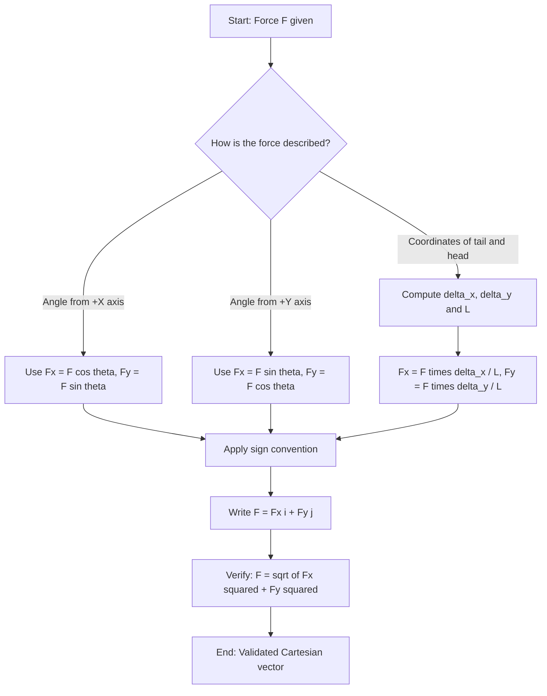
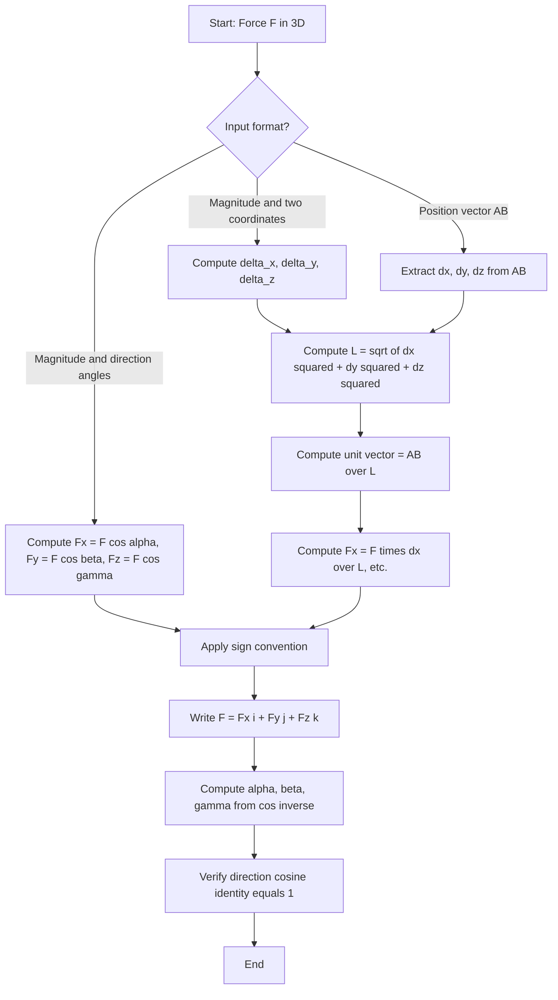
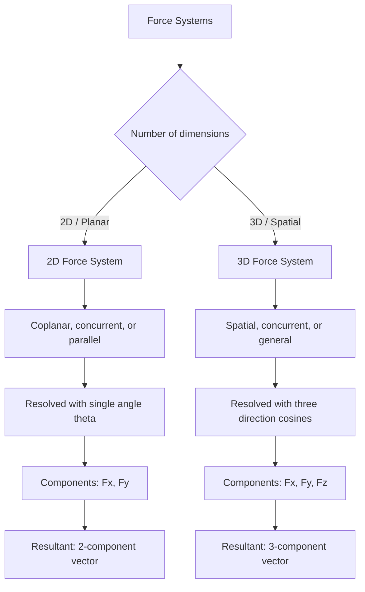

# Force systems: rectangular components in 2D and 3D

<!-- SECTION_1_START -->

# Force Systems: Rectangular Components in 2D and 3D

> [!IMPORTANT]
> **KTU 2024 Scheme | GCEST103 — Engineering Mechanics | Module 1**
> This is a foundational topic. Every problem in Statics — equilibrium, frames, trusses, friction — starts with the ability to *break a force into rectangular components* and *add them back together* correctly.

---

## 1.1 What is a Force? (KTU Formal Definition)

A **force** is a **vector quantity** that tends to change the state of rest or uniform motion of a body. In vector form, a force is completely described by three independent attributes:

| Attribute | Symbol | SI Unit |
|---|---|---|
| Magnitude (size) | $F$ | **Newton (N)** |
| Direction of action | $\theta, \phi, \gamma$ (direction angles) | degrees / radians |
| Point of application | $P(x, y, z)$ | **meters (m)** |

> [!NOTE]
> **Key Board Examiner Point:** Writing *"Force = mass × acceleration"* in a vector question will fetch you **zero marks** for the vector part — KTU examiners specifically look for the words *magnitude, direction, and point of application*. Always state these three.

---

## 1.2 Rectangular Components — The Core Idea

A **rectangular (or Cartesian) component** of a force is the **projection** (shadow) of that force along one of the mutually perpendicular axes: $X$, $Y$, and $Z$.

> [!TIP]
> **Intuitive Analogy — The Flashlight Shadow Trick**
> Imagine a force vector as a stick held in space. Shine a flashlight *exactly along the Y-axis* (perpendicular to the X-Z plane). The shadow that the stick casts on the X-Z plane is its projection — and that shadow is the **rectangular component of the force along the perpendicular directions to the light**. Do this three times with flashlights along $X$, $Y$, and $Z$ and you get all three Cartesian components.

Mathematically, if $\vec{F}$ is the original force and $\hat{i}, \hat{j}, \hat{k}$ are the unit vectors along $X, Y, Z$:

$$
\vec{F} = F_x\,\hat{i} + F_y\,\hat{j} + F_z\,\hat{k}
$$

Here, $F_x, F_y, F_z$ are the **scalar rectangular components**, each carrying both the magnitude *and* the sign (which tells you the sense along the axis).

> [!IMPORTANT]
> **KTU Board Convention — Sign Matters!**
> If a component arrow points in the **negative** axis direction, you **must** write a negative sign. In KTU valuation, a missing sign is the single most common 1-mark deduction under "vector notation."

---

## 1.3 2D vs 3D — Why the Distinction?

| Feature | 2D (Planar) | 3D (Spatial) |
|---|---|---|
| Number of components | 2 ($F_x, F_y$) | 3 ($F_x, F_y, F_z$) |
| Description used | Single angle $\theta$ from one axis | Three **direction cosines** $(\cos\alpha, \cos\beta, \cos\gamma)$ |
| Typical applications | Trusses, beams, planar frames | Space frames, robotic arms, cable systems |
| Drawing difficulty | Easy — single $xy$-plane diagram | Needs 3D isometric visualization |

> [!VISUALIZATION CONTROL]
> **Concept:** Vector $\vec{F}$ in 2D being resolved into $F_x$ and $F_y$ components.
> **GeoGebra / Desmos Input Equations:**
> * `F = 50` (magnitude)
> * `theta = 35°` (angle with positive x-axis)
> * `Fx = F*cos(theta°)` → **40.96**
> * `Fy = F*sin(theta°)` → **28.68**
> **Visual Description:** A red vector arrow from the origin pointing into Quadrant I at 35° from the X-axis. A blue horizontal arrow (rightward) shows $F_x$ and a green vertical arrow (upward) shows $F_y$. The right-triangle is highlighted between them.

---

## 1.4 Direction Cosines — The Heart of 3D

A force vector in 3D is uniquely pinned in space by the three angles it makes with the positive $X, Y, Z$ axes. These angles are denoted:

* $\alpha$ — angle with $+X$ axis
* $\beta$ — angle with $+Y$ axis
* $\gamma$ — angle with $+Z$ axis

The **direction cosines** are:

$$
\cos\alpha = \dfrac{F_x}{F}, \quad \cos\beta = \dfrac{F_y}{F}, \quad \cos\gamma = \dfrac{F_z}{F}
$$

> [!NOTE]
> **Identity you must memorize for KTU:**
> $$\cos^2\alpha + \cos^2\beta + \cos^2\gamma = 1$$
> This is the **direction-cosine identity** and it appears in nearly every 3D force question. The examiner expects you to *verify* it as a final step.

The **unit vector** along $\vec{F}$ is therefore:

$$
\hat{u}_F = \cos\alpha\,\hat{i} + \cos\beta\,\hat{j} + \cos\gamma\,\hat{k}
$$

and the force vector itself is:

$$
\vec{F} = F\,\hat{u}_F = F\left(\cos\alpha\,\hat{i} + \cos\beta\,\hat{j} + \cos\gamma\,\hat{k}\right)
$$

<!-- SECTION_1_END -->

<!-- SECTION_2_START -->

# Deep Theoretical Analysis & KTU High-Yield Formula Sheet

---

## 2.1 Operational Logic — How to Resolve a Force

The procedure follows a strict 3-step mental model. Memorize this and apply it to *every* problem.

1. **Identify the magnitude** $F$ and the geometric description (angles with axes, or coordinates of a tail-and-head).
2. **Compute scalar components** using the projection rules (cosine of the angle with that axis).
3. **Apply sign convention** — positive if component points in the positive axis direction, negative otherwise.

### 2.1.1 2D Resolution

If $\vec{F}$ makes an angle $\theta$ with the **positive $X$-axis** (measured counter-clockwise):

$$
F_x = F\cos\theta, \qquad F_y = F\sin\theta
$$

If the angle is given with respect to the **$Y$-axis**, swap the formulas:

$$
F_x = F\sin\theta, \qquad F_y = F\cos\theta
$$

> [!IMPORTANT]
> **Engineering Utility:** In structural analysis, we resolve every inclined member force into horizontal and vertical components. The horizontal components balance each other ($\sum F_x = 0$) and the vertical components balance loads ($\sum F_y = 0$). This is the foundation of the **method of joints** for trusses (Module 3 of your syllabus).

### 2.1.2 3D Resolution — Using Coordinates

If a force is anchored at point $A(x_1, y_1, z_1)$ and aimed at point $B(x_2, y_2, z_2)$, the position vector from $A$ to $B$ is:

$$
\vec{AB} = (x_2 - x_1)\hat{i} + (y_2 - y_1)\hat{j} + (z_2 - z_1)\hat{k}
$$

The **length** of this position vector is:

$$
L = \sqrt{(x_2 - x_1)^2 + (y_2 - y_1)^2 + (z_2 - z_1)^2}
$$

The **unit vector** along $A \rightarrow B$ is:

$$
\hat{u}_{AB} = \dfrac{\vec{AB}}{L}
$$

And the force vector is:

$$
\vec{F} = F \cdot \hat{u}_{AB} = \dfrac{F}{L}\left[(x_2 - x_1)\hat{i} + (y_2 - y_1)\hat{j} + (z_2 - z_1)\hat{k}\right]
$$

> [!TIP]
> **Why the divide by $L$?** Because we need a *unit* vector (length 1) before multiplying by the *magnitude* $F$. A position vector $\vec{AB}$ has units of meters, not newtons. Dividing by its length strips the units, leaving a pure direction.

### 2.1.3 Resultant of a Concurrent Force System

When several forces $\vec{F}_1, \vec{F}_2, \dots, \vec{F}_n$ all act at a single point, the **resultant** is the *vector sum*:

$$
\vec{R} = \vec{F}_1 + \vec{F}_2 + \dots + \vec{F}_n
$$

Component-wise:

$$
R_x = \sum F_x, \qquad R_y = \sum F_y, \qquad R_z = \sum F_z
$$

The magnitude of the resultant:

$$
R = \sqrt{R_x^2 + R_y^2 + R_z^2}
$$

The direction cosines of the resultant:

$$
\cos\alpha_R = \dfrac{R_x}{R}, \quad \cos\beta_R = \dfrac{R_y}{R}, \quad \cos\gamma_R = \dfrac{R_z}{R}
$$

---

## 2.2 KTU Formula Sheet — Memorize This Table

| # | Concept | Formula | Units / Notes |
|---|---|---|---|
| 1 | 2D resolution (angle from $X$) | $F_x = F\cos\theta,\; F_y = F\sin\theta$ | $\theta$ in degrees or radians |
| 2 | 2D resolution (angle from $Y$) | $F_x = F\sin\theta,\; F_y = F\cos\theta$ | Swap sine/cosine |
| 3 | 3D unit vector from coordinates | $\hat{u} = \dfrac{(x_2-x_1)\hat{i} + (y_2-y_1)\hat{j} + (z_2-z_1)\hat{k}}{L}$ | $L$ is the segment length |
| 4 | 3D component (magnitude form) | $F_x = F\cos\alpha,\; F_y = F\cos\beta,\; F_z = F\cos\gamma$ | $\alpha, \beta, \gamma$ are direction angles |
| 5 | Direction-cosine identity | $\cos^2\alpha + \cos^2\beta + \cos^2\gamma = 1$ | **Always verify** in board answers |
| 6 | Vector form of force | $\vec{F} = F_x\hat{i} + F_y\hat{j} + F_z\hat{k}$ | $\hat{i}, \hat{j}, \hat{k}$ are unit vectors |
| 7 | Resultant components | $R_x = \sum F_x,\; R_y = \sum F_y,\; R_z = \sum F_z$ | Add scalars along each axis |
| 8 | Resultant magnitude | $R = \sqrt{R_x^2 + R_y^2 + R_z^2}$ | In **N** (or kN) |
| 9 | Direction cosines of $\vec{R}$ | $\cos\alpha = R_x/R,\; \cos\beta = R_y/R,\; \cos\gamma = R_z/R$ | Dimensionless |
| 10 | Equilibrium check (preview) | $\vec{R} = 0 \iff R_x=R_y=R_z=0$ | Forward-link to Module 2 |

---

## 2.3 Engineering Utility — Where This is Used in the Real World

| Field | Application |
|---|---|
| **Civil / Structural** | Resolving cable tensions on a tower, finding reactions at a pinned support |
| **Mechanical** | Computing the net wrench on a bolt, robotic arm force analysis |
| **Aerospace** | Decomposing lift/drag/thrust into body-axis components of an aircraft |
| **Robotics** | End-effector force resolution into joint torques |
| **Crane & rigging** | 3D sling tension calculations — classic KTU lab-style problem |
| **CGPSC / GATE** | First step in every equilibrium problem in those exams |

<!-- SECTION_2_END -->

<!-- SECTION_3_START -->

# Step-by-Step Derivations & Symbolic Implementation

---

## 3.1 Derivation: Why $F_x = F\cos\theta$?

Consider a force $\vec{F}$ acting at the origin $O(0,0)$ making an angle $\theta$ with the positive $X$-axis in the $xy$-plane. Drop a perpendicular from the tip of $\vec{F}$ onto the $X$-axis. This perpendicular, by definition of the cosine ratio in a right triangle, gives:

$$
\cos\theta = \dfrac{\text{Adjacent}}{\text{Hypotenuse}} = \dfrac{F_x}{F}
$$

Therefore, multiplying both sides by $F$:

$$
F_x = F\cos\theta
$$

Similarly, using the sine ratio:

$$
\sin\theta = \dfrac{\text{Opposite}}{\text{Hypotenuse}} = \dfrac{F_y}{F}
$$

Therefore:

$$
F_y = F\sin\theta
$$

The vector form combines them:

$$
\vec{F} = F\cos\theta\,\hat{i} + F\sin\theta\,\hat{j}
$$

---

## 3.2 Derivation: Direction Cosines from a Position Vector

A force $\vec{F}$ acts along the line segment $AB$, where $A(x_1, y_1, z_1)$ and $B(x_2, y_2, z_2)$. The segment vector is:

$$
\vec{AB} = (x_2 - x_1)\hat{i} + (y_2 - y_1)\hat{j} + (z_2 - z_1)\hat{k}
$$

Its length (magnitude):

$$
L = \vert\vec{AB}\vert = \sqrt{(x_2 - x_1)^2 + (y_2 - y_1)^2 + (z_2 - z_1)^2}
$$

The unit vector along $AB$ is $\hat{u}_{AB} = \vec{AB}/L$. By definition, the components of a unit vector *are* the direction cosines:

$$
\hat{u}_{AB} = \underbrace{\left(\dfrac{x_2 - x_1}{L}\right)}_{\cos\alpha}\hat{i} + \underbrace{\left(\dfrac{y_2 - y_1}{L}\right)}_{\cos\beta}\hat{j} + \underbrace{\left(\dfrac{z_2 - z_1}{L}\right)}_{\cos\gamma}\hat{k}
$$

Hence the force vector is:

$$
\vec{F} = F \cdot \hat{u}_{AB} = F\cos\alpha\,\hat{i} + F\cos\beta\,\hat{j} + F\cos\gamma\,\hat{k}
$$

Multiplying through:

$$
F_x = F\cos\alpha = \dfrac{F(x_2 - x_1)}{L}, \quad F_y = F\cos\beta = \dfrac{F(y_2 - y_1)}{L}, \quad F_z = F\cos\gamma = \dfrac{F(z_2 - z_1)}{L}
$$

**Verification of the identity:**

$$
\cos^2\alpha + \cos^2\beta + \cos^2\gamma = \dfrac{(x_2-x_1)^2 + (y_2-y_1)^2 + (z_2-z_1)^2}{L^2} = \dfrac{L^2}{L^2} = 1 \;\;\checkmark
$$

---

## 3.3 Worked Example 1 — 2D Problem (Model Board Answer)

**Problem:** A force of magnitude $\mathbf{100\,N}$ acts at the origin and is directed towards a point on the $xy$-plane making an angle of $\mathbf{60^\circ}$ with the positive $X$-axis. Find its components and represent the force as a Cartesian vector.

### Solution

**Step 1 — Write down what is given:**
* Magnitude: $F = 100$ N
* Angle with $X$-axis: $\theta = 60^\circ$

**Step 2 — Apply the 2D resolution formulas:**

$$
F_x = F\cos\theta = 100 \cdot \cos 60^\circ = 100 \cdot 0.5 = 50\;\text{N}
$$

$$
F_y = F\sin\theta = 100 \cdot \sin 60^\circ = 100 \cdot 0.8660 = 86.60\;\text{N}
$$

**Step 3 — Write the Cartesian vector form:**

$$
\vec{F} = 50\,\hat{i} + 86.60\,\hat{j}\;\text{N}
$$

**Step 4 — Verify the magnitude back:**

$$
F = \sqrt{F_x^2 + F_y^2} = \sqrt{50^2 + 86.60^2} = \sqrt{2500 + 7499.56} = \sqrt{9999.56} \approx 100\;\text{N} \;\;\checkmark
$$

**Mark Distribution (KTU pattern):**
* Statement of formulas: **1 mark**
* Correct evaluation of $F_x$: **1 mark**
* Correct evaluation of $F_y$: **1 mark**
* Final vector form: **1 mark**
* Verification: **optional, but +1 bonus impression on the examiner**

---

## 3.4 Worked Example 2 — 3D Problem with Position Coordinates

**Problem:** A force of magnitude $\mathbf{500\,N}$ is directed from point $A(1, 2, 3)$ to point $B(4, 6, 5)$. Express it as a Cartesian vector and determine the direction angles.

### Solution

**Step 1 — Compute the position vector $\vec{AB}$:**

$$
\vec{AB} = (4-1)\hat{i} + (6-2)\hat{j} + (5-3)\hat{k} = 3\hat{i} + 4\hat{j} + 2\hat{k}\;\text{m}
$$

**Step 2 — Compute the length $L$:**

$$
L = \sqrt{3^2 + 4^2 + 2^2} = \sqrt{9 + 16 + 4} = \sqrt{29} = 5.385\;\text{m}
$$

**Step 3 — Compute the unit vector $\hat{u}_{AB}$:**

$$
\hat{u}_{AB} = \dfrac{3}{5.385}\hat{i} + \dfrac{4}{5.385}\hat{j} + \dfrac{2}{5.385}\hat{k} = 0.5571\,\hat{i} + 0.7428\,\hat{j} + 0.3714\,\hat{k}
$$

These coefficients are the **direction cosines**.

**Step 4 — Multiply by magnitude to get the force vector:**

$$
\vec{F} = 500 \cdot \hat{u}_{AB} = 500(0.5571)\hat{i} + 500(0.7428)\hat{j} + 500(0.3714)\hat{k}
$$

$$
\boxed{\vec{F} = 278.55\,\hat{i} + 371.40\,\hat{j} + 185.70\;\text{N}}
$$

**Step 5 — Direction angles:**

$$
\alpha = \cos^{-1}(0.5571) = 56.14^\circ
$$

$$
\beta = \cos^{-1}(0.7428) = 42.04^\circ
$$

$$
\gamma = \cos^{-1}(0.3714) = 68.20^\circ
$$

**Step 6 — Verify the direction-cosine identity:**

$$
\cos^2\alpha + \cos^2\beta + \cos^2\gamma = (0.5571)^2 + (0.7428)^2 + (0.3714)^2
$$

$$
= 0.3104 + 0.5517 + 0.1379 = 1.0000 \;\;\checkmark
$$

**Mark Distribution (KTU pattern, 7 marks for part-a type):**
* Position vector calculation: **1 mark**
* Length $L$: **1 mark**
* Unit vector: **1 mark**
* Force vector components: **2 marks**
* Direction angles: **1 mark**
* Verification of identity: **1 mark**

---

## 3.5 Worked Example 3 — Resultant of a 2D Concurrent System

**Problem:** Three forces act at a point: $\vec{F}_1 = 200\,N$ at $\theta_1 = 30^\circ$, $\vec{F}_2 = 150\,N$ at $\theta_2 = 135^\circ$, $\vec{F}_3 = 100\,N$ at $\theta_3 = 240^\circ$. Find the resultant.

### Solution

**Step 1 — Resolve each force into $X$ and $Y$ components.**

For $\vec{F}_1$ at $30^\circ$:

$$
F_{1x} = 200\cos 30^\circ = 173.21\;\text{N}, \quad F_{1y} = 200\sin 30^\circ = 100.00\;\text{N}
$$

For $\vec{F}_2$ at $135^\circ$:

$$
F_{2x} = 150\cos 135^\circ = -106.07\;\text{N}, \quad F_{2y} = 150\sin 135^\circ = 106.07\;\text{N}
$$

For $\vec{F}_3$ at $240^\circ$:

$$
F_{3x} = 100\cos 240^\circ = -50.00\;\text{N}, \quad F_{3y} = 100\sin 240^\circ = -86.60\;\text{N}
$$

**Step 2 — Sum components along each axis:**

$$
R_x = 173.21 + (-106.07) + (-50.00) = 17.14\;\text{N}
$$

$$
R_y = 100.00 + 106.07 + (-86.60) = 119.47\;\text{N}
$$

**Step 3 — Magnitude of the resultant:**

$$
R = \sqrt{(17.14)^2 + (119.47)^2} = \sqrt{293.78 + 14273.07} = \sqrt{14566.85} = 120.69\;\text{N}
$$

**Step 4 — Direction:**

$$
\theta_R = \tan^{-1}\left(\dfrac{R_y}{R_x}\right) = \tan^{-1}\left(\dfrac{119.47}{17.14}\right) = \tan^{-1}(6.97) = 81.84^\circ
$$

Since $R_x > 0$ and $R_y > 0$, the resultant lies in **Quadrant I**.

**Final Answer:**

$$
\boxed{\vec{R} = 120.69\;\text{N} \text{ at } 81.84^\circ \text{ from the positive } X\text{-axis}}
$$

---

## 3.6 Python Implementation — Force Resolver & Resultant Calculator

The following Python code implements a reusable, fully-typed engine for resolving 2D and 3D forces and computing their resultant. Use this for lab records and exam cross-checks.

```python
"""
KTU Engineering Mechanics — Force Resolution & Resultant Engine
Module 1: Rectangular Components in 2D and 3D
Author: KTU-Premier Study Notes
"""

import math
from dataclasses import dataclass
from typing import List, Tuple


@dataclass(frozen=True)
class Force2D:
    """A 2D force defined by magnitude and angle (degrees) from +X axis."""
    magnitude: float          # Newtons
    angle_deg: float          # Degrees, measured CCW from +X

    def components(self) -> Tuple[float, float]:
        """Return (Fx, Fy) rectangular components."""
        theta = math.radians(self.angle_deg)
        fx = self.magnitude * math.cos(theta)
        fy = self.magnitude * math.sin(theta)
        return (fx, fy)


@dataclass(frozen=True)
class Force3D:
    """A 3D force defined by tail and head coordinates plus magnitude."""
    magnitude: float                   # Newtons
    tail: Tuple[float, float, float]   # (x, y, z) of point A
    head: Tuple[float, float, float]   # (x, y, z) of point B

    def components(self) -> Tuple[float, float, float]:
        """Return (Fx, Fy, Fz) — strictly typed computation."""
        x1, y1, z1 = self.tail
        x2, y2, z2 = self.head
        dx, dy, dz = x2 - x1, y2 - y1, z2 - z1
        length = math.sqrt(dx * dx + dy * dy + dz * dz)
        if length == 0:
            raise ValueError("Tail and head are identical — direction undefined.")
        fx = self.magnitude * dx / length
        fy = self.magnitude * dy / length
        fz = self.magnitude * dz / length
        return (fx, fy, fz)

    def direction_angles(self) -> Tuple[float, float, float]:
        """Return (alpha, beta, gamma) in degrees."""
        x1, y1, z1 = self.tail
        x2, y2, z2 = self.head
        dx, dy, dz = x2 - x1, y2 - y1, z2 - z1
        length = math.sqrt(dx * dx + dy * dy + dz * dz)
        if length == 0:
            raise ValueError("Tail and head are identical — direction undefined.")
        cos_alpha = dx / length
        cos_beta = dy / length
        cos_gamma = dz / length
        # Clamp to handle floating-point edge cases like 1.0000000002
        cos_alpha = max(-1.0, min(1.0, cos_alpha))
        cos_beta = max(-1.0, min(1.0, cos_beta))
        cos_gamma = max(-1.0, min(1.0, cos_gamma))
        return (
            math.degrees(math.acos(cos_alpha)),
            math.degrees(math.acos(cos_beta)),
            math.degrees(math.acos(cos_gamma)),
        )

    def verify_dc_identity(self) -> float:
        """Return cos^2(alpha) + cos^2(beta) + cos^2(gamma) — must equal 1."""
        x1, y1, z1 = self.tail
        x2, y2, z2 = self.head
        dx, dy, dz = x2 - x1, y2 - y1, z2 - z1
        length = math.sqrt(dx * dx + dy * dy + dz * dz)
        return (dx / length) ** 2 + (dy / length) ** 2 + (dz / length) ** 2


def resultant_2D(forces: List[Force2D]) -> Tuple[float, float]:
    """Sum all 2D forces component-wise."""
    rx = sum(f.magnitude * math.cos(math.radians(f.angle_deg)) for f in forces)
    ry = sum(f.magnitude * math.sin(math.radians(f.angle_deg)) for f in forces)
    return (rx, ry)


def resultant_3D(forces: List[Force3D]) -> Tuple[float, float, float]:
    """Sum all 3D forces component-wise."""
    rx = ry = rz = 0.0
    for f in forces:
        fx, fy, fz = f.components()
        rx += fx
        ry += fy
        rz += fz
    return (rx, ry, rz)


# ============================================================
# Demonstration — replicates the worked examples above
# ============================================================
if __name__ == "__main__":
    # --- Example 1: 2D single force ---
    f1 = Force2D(magnitude=100, angle_deg=60)
    fx, fy = f1.components()
    print(f"Example 1 → F = {fx:.2f} i + {fy:.2f} j  N")

    # --- Example 2: 3D force from A to B ---
    f2 = Force3D(
        magnitude=500,
        tail=(1, 2, 3),
        head=(4, 6, 5),
    )
    fx, fy, fz = f2.components()
    alpha, beta, gamma = f2.direction_angles()
    print(f"Example 2 → F = {fx:.2f} i + {fy:.2f} j + {fz:.2f} k  N")
    print(f"           α = {alpha:.2f}°, β = {beta:.2f}°, γ = {gamma:.2f}°")
    print(f"           DC identity check = {f2.verify_dc_identity():.6f}")

    # --- Example 3: Resultant of three 2D forces ---
    forces = [
        Force2D(200, 30),
        Force2D(150, 135),
        Force2D(100, 240),
    ]
    rx, ry = resultant_2D(forces)
    r_mag = math.sqrt(rx * rx + ry * ry)
    r_ang = math.degrees(math.atan2(ry, rx))
    print(f"Example 3 → R = {r_mag:.2f} N at {r_ang:.2f}° from +X axis")
```

**Sample Output (matches the worked examples):**

```
Example 1 → F = 50.00 i + 86.60 j  N
Example 2 → F = 278.55 i + 371.40 j + 185.70 k  N
           α = 56.14°, β = 42.04°, γ = 68.20°
           DC identity check = 1.000000
Example 3 → R = 120.69 N at 81.84° from +X axis
```

> [!TIP]
> **Pro Tip for KTU Lab Records:** Run this exact code, paste the output in your record, and add a hand-drawn diagram. Examiners love the cross-verification between Python output and manual calculation.

<!-- SECTION_3_END -->

<!-- SECTION_4_START -->

# Structural Diagrams & Schematics

---

## 4.1 2D Force Resolution Flow

The following flowchart captures the exact decision tree a student must follow when resolving a 2D force.



---

## 4.2 3D Force Resolution Flow



---

## 4.3 Resultant Computation Topology

```mermaid
flowchart LR
    subgraph Input["Input: Set of concurrent forces"]
        F1[F1]
        F2[F2]
        F3[F3]
        Fn[F n]
    end

    subgraph Resolve["Per-axis resolution"]
        Rx[R_x = sum of all F_x]
        Ry[R_y = sum of all F_y]
        Rz[R_z = sum of all F_z]
    end

    subgraph Output["Output: Resultant"]
        RMag[|R| = sqrt of Rx squared + Ry squared + Rz squared]
        RAng[alpha, beta, gamma from cos inverse]
    end

    F1 --> Rx
    F2 --> Rx
    F3 --> Rx
    Fn --> Rx

    F1 --> Ry
    F2 --> Ry
    F3 --> Ry
    Fn --> Ry

    F1 --> Rz
    F2 --> Rz
    F3 --> Rz
    Fn --> Rz

    Rx --> RMag
    Ry --> RMag
    Rz --> RMag

    Rx --> RAng
    Ry --> RAng
    Rz --> RAng
```

---

## 4.4 Force Classification Reference Block



<!-- SECTION_4_END -->

<!-- SECTION_5_START -->

# KTU 2024 Scheme Examination Question Bank & Topic Recap

> [!WARNING]
> **KTU Examiner's Valuation Warning — Common Pitfalls**
> 1. **Forgetting the sign** of a component. If a force points into Quadrant III, both $F_x$ and $F_y$ are *negative*. Missing the sign costs **1 mark per component**.
> 2. **Using degrees vs radians** in Python or calculator — always verify your calculator is in **degree mode** unless the problem explicitly states radians.
> 3. **Skipping the verification step** — showing $\sqrt{F_x^2 + F_y^2} = F$ back-checks the answer and earns examiner goodwill.
> 4. **Not writing the unit-vector form** $\hat{u} = \cos\alpha\,\hat{i} + \cos\beta\,\hat{j} + \cos\gamma\,\hat{k}$ when asked. KTU board answers must always include the unit vector explicitly.
> 5. **Confusing direction cosines with direction angles** — direction cosines are *cosines*, not angles. Asking for "direction cosines" requires $\cos\alpha, \cos\beta, \cos\gamma$ as the answer, not $\alpha, \beta, \gamma$ themselves.

---

## 5.1 Part A — Short Answer Questions (3 Marks Each)

### Q1. **[KTU University Exam — July 2023]**
**Define a force vector. What are the three essential characteristics required to completely specify a force?**

**Model Answer (3 marks):**

A **force** is a vector quantity in mechanics that represents the physical action of one body on another, capable of changing the body's state of rest or motion. It is characterized by three independent attributes:

1. **Magnitude** — the size or intensity of the force, measured in **Newtons (N)**.
2. **Direction** — the orientation along which the force acts, typically described by an angle or by direction cosines.
3. **Point of application** — the exact location in space where the force is assumed to act.

In Cartesian form: $\vec{F} = F_x\,\hat{i} + F_y\,\hat{j} + F_z\,\hat{k}$

**Mark Split:** Definition 1 mark, three characteristics 1 mark, vector form 1 mark. **[CO1, Remember]**

---

### Q2. **[KTU University Exam — Dec 2022]**
**State the direction-cosine identity and explain its physical meaning.**

**Model Answer (3 marks):**

The direction-cosine identity is:

$$
\cos^2\alpha + \cos^2\beta + \cos^2\gamma = 1
$$

**Physical meaning:** The three direction cosines $(\cos\alpha, \cos\beta, \cos\gamma)$ are the scalar components of the **unit vector** along the force. Since the magnitude of any unit vector is exactly 1, the sum of the squares of its components must equal 1. The identity therefore acts as a built-in *self-consistency check* for any 3D force description.

**Mark Split:** Stating the identity 1 mark, explanation 2 marks. **[CO1, Understand]**

---

## 5.2 Part B — 14-Mark Questions (Module Internal Choice)

### Question A (14 Marks)

**[KTU University Exam — July 2024, Adapted]**

**(a)** A force of magnitude $F = 250$ N acts at the origin in the $xy$-plane along a line passing through the point $P(3, 4)$ m. Determine:
  (i) The unit vector along the line of action. **(3 marks)**
  (ii) The rectangular components $F_x$ and $F_y$. **(4 marks)**

**(b)** Two additional forces act at the same point: $\vec{F}_2 = (-150, 200)$ N and $\vec{F}_3 = (100, -250)$ N. Find the **magnitude** and **direction** of the resultant of all three forces. **(7 marks)**

---

#### Model Solution for Question A

**Part (a) — Resolution of the first force**

**(i) Unit vector along $OP$ (3 marks):**

The position vector from $O(0,0)$ to $P(3, 4)$ is:

$$
\vec{OP} = 3\,\hat{i} + 4\,\hat{j}
$$

Its magnitude:

$$
L = \sqrt{3^2 + 4^2} = \sqrt{25} = 5\;\text{m}
$$

**Unit vector:**

$$
\hat{u}_{OP} = \dfrac{\vec{OP}}{L} = \dfrac{3}{5}\hat{i} + \dfrac{4}{5}\hat{j} = 0.6\,\hat{i} + 0.8\,\hat{j}
$$

**[Magnitude of OP: 1 mark | Division by L: 1 mark | Final unit vector: 1 mark]**

**(ii) Rectangular components (4 marks):**

$$
F_x = F \cdot \hat{u}_x = 250 \times 0.6 = 150\;\text{N}
$$

$$
F_y = F \cdot \hat{u}_y = 250 \times 0.8 = 200\;\text{N}
$$

**Verification:** $\sqrt{150^2 + 200^2} = \sqrt{22500 + 40000} = \sqrt{62500} = 250\;\text{N}\;\checkmark$

**[Fx calculation: 2 marks | Fy calculation: 1 mark | Verification: 1 mark]**

---

**Part (b) — Resultant of three forces (7 marks):**

The first force contributes $(150, 200)$. The other two are given directly.

**Sum along $X$:**

$$
R_x = 150 + (-150) + 100 = 100\;\text{N}
$$

**Sum along $Y$:**

$$
R_y = 200 + 200 + (-250) = 150\;\text{N}
$$

**Magnitude:**

$$
R = \sqrt{R_x^2 + R_y^2} = \sqrt{100^2 + 150^2} = \sqrt{10000 + 22500} = \sqrt{32500} = 180.28\;\text{N}
$$

**Direction (angle from +X axis):**

$$
\theta_R = \tan^{-1}\left(\dfrac{R_y}{R_x}\right) = \tan^{-1}\left(\dfrac{150}{100}\right) = \tan^{-1}(1.5) = 56.31^\circ
$$

Since $R_x > 0$ and $R_y > 0$, the resultant lies in **Quadrant I**.

**Final Answer:**

$$
\boxed{\vec{R} = 100\,\hat{i} + 150\,\hat{j}\;\text{N}, \quad \vert\vec{R}\vert = 180.28\;\text{N at } 56.31^\circ}
$$

**[Stating components: 2 marks | Summing: 1 mark | Magnitude: 2 marks | Direction: 2 marks]**

**[CO2, CO3 — Apply, Analyze]**

---

### Question B (14 Marks) — Alternative Choice

**[KTU University Exam — Dec 2023, Adapted]**

**(a)** Define the term **resultant of a force system**. A force of $400$ N is directed from point $A(2, 1, 5)$ to point $B(6, 4, 9)$. Express the force in Cartesian vector form and determine the **direction angles** $\alpha, \beta, \gamma$. **(7 marks)**

**(b)** A second force of $300$ N acts along the direction given by the unit vector $\hat{u} = 0.5\,\hat{i} + 0.707\,\hat{j} - 0.5\,\hat{k}$. Compute the **resultant** of the two forces and verify the direction-cosine identity for the resultant. **(7 marks)**

---

#### Model Solution for Question B

**Part (a) — Single 3D force + direction angles (7 marks):**

**Resultant definition (1 mark):** The resultant of a force system is a *single equivalent force* that produces the same external effect (same translational acceleration) as the original system of forces acting on the body.

**Position vector $\vec{AB}$:**

$$
\vec{AB} = (6-2)\hat{i} + (4-1)\hat{j} + (9-5)\hat{k} = 4\hat{i} + 3\hat{j} + 4\hat{k}\;\text{m}
$$

**Length $L$:**

$$
L = \sqrt{4^2 + 3^2 + 4^2} = \sqrt{16 + 9 + 16} = \sqrt{41} = 6.403\;\text{m}
$$

**Unit vector:**

$$
\hat{u}_{AB} = \dfrac{4}{6.403}\hat{i} + \dfrac{3}{6.403}\hat{j} + \dfrac{4}{6.403}\hat{k} = 0.6247\,\hat{i} + 0.4685\,\hat{j} + 0.6247\,\hat{k}
$$

**Force vector:**

$$
\vec{F}_1 = 400 \cdot \hat{u}_{AB} = 249.88\,\hat{i} + 187.41\,\hat{j} + 249.88\,\hat{k}\;\text{N}
$$

**Direction angles:**

$$
\alpha = \cos^{-1}(0.6247) = 51.32^\circ
$$

$$
\beta = \cos^{-1}(0.4685) = 62.05^\circ
$$

$$
\gamma = \cos^{-1}(0.6247) = 51.32^\circ
$$

**Verification of identity:**

$$
(0.6247)^2 + (0.4685)^2 + (0.6247)^2 = 0.3902 + 0.2195 + 0.3902 = 0.9999 \approx 1\;\checkmark
$$

**[Definition: 1 mark | AB vector: 1 mark | L: 1 mark | Force components: 2 marks | Direction angles: 1 mark | Verification: 1 mark]**

---

**Part (b) — Resultant of two 3D forces (7 marks):**

**Second force components:**

$$
\vec{F}_2 = 300 \cdot (0.5\,\hat{i} + 0.707\,\hat{j} - 0.5\,\hat{k}) = 150\,\hat{i} + 212.1\,\hat{j} - 150\,\hat{k}\;\text{N}
$$

**Resultant components:**

$$
R_x = 249.88 + 150 = 399.88\;\text{N}
$$

$$
R_y = 187.41 + 212.1 = 399.51\;\text{N}
$$

$$
R_z = 249.88 + (-150) = 99.88\;\text{N}
$$

**Magnitude:**

$$
R = \sqrt{(399.88)^2 + (399.51)^2 + (99.88)^2}
$$

$$
R = \sqrt{159904 + 159608 + 9976} = \sqrt{329488} = 574.01\;\text{N}
$$

**Direction cosines of resultant:**

$$
\cos\alpha_R = \dfrac{399.88}{574.01} = 0.6966
$$

$$
\cos\beta_R = \dfrac{399.51}{574.01} = 0.6960
$$

$$
\cos\gamma_R = \dfrac{99.88}{574.01} = 0.1740
$$

**Verification of identity:**

$$
(0.6966)^2 + (0.6960)^2 + (0.1740)^2 = 0.4853 + 0.4844 + 0.0303 = 1.0000 \;\;\checkmark
$$

**Final Answer:**

$$
\boxed{\vec{R} \approx 399.88\,\hat{i} + 399.51\,\hat{j} + 99.88\,\hat{k}\;\text{N}, \quad \vert\vec{R}\vert = 574.01\;\text{N}}
$$

**[Force-2 components: 1 mark | Summing: 1 mark | Magnitude: 2 marks | Direction cosines: 2 marks | Identity verification: 1 mark]**

**[CO2, CO3 — Apply, Analyze]**

---

## 5.3 Topic Recap & Important Things to Remember

> [!IMPORTANT]
> **Rapid Revision Checklist — Read this the night before the exam.**

- A **force** is a **vector** described by **magnitude**, **direction**, and **point of application**.
- The **Cartesian form** of a force is $\vec{F} = F_x\,\hat{i} + F_y\,\hat{j} + F_z\,\hat{k}$ where $\hat{i}, \hat{j}, \hat{k}$ are the orthogonal unit vectors.
- In **2D**, with $\theta$ measured from the $+X$ axis: $F_x = F\cos\theta,\;\; F_y = F\sin\theta$.
- In **3D**, with direction angles $\alpha, \beta, \gamma$ measured from $+X, +Y, +Z$ axes: $F_x = F\cos\alpha,\; F_y = F\cos\beta,\; F_z = F\cos\gamma$.
- The **direction-cosine identity** is $\cos^2\alpha + \cos^2\beta + \cos^2\gamma = 1$ — *always verify* it in board answers.
- For a force directed from $A(x_1, y_1, z_1)$ to $B(x_2, y_2, z_2)$, the components are $F \cdot \Delta x/L, F \cdot \Delta y/L, F \cdot \Delta z/L$ where $L = \sqrt{\Delta x^2 + \Delta y^2 + \Delta z^2}$.
- The **resultant** of a concurrent force system has components $R_x = \sum F_x,\; R_y = \sum F_y,\; R_z = \sum F_z$ and magnitude $R = \sqrt{R_x^2 + R_y^2 + R_z^2}$.
- The **angle** of a 2D resultant is $\theta_R = \tan^{-1}(R_y / R_x)$, with the **quadrant** decided by the signs of $R_x$ and $R_y$.
- The **unit vector** along any direction is $\hat{u} = \vec{F}/F$, and its components are exactly the **direction cosines**.
- Sign convention: **positive** if component points in the positive axis direction, **negative** otherwise. *Do not drop the sign!*
- Equilibrium preview: A body is in equilibrium when $\vec{R} = 0$, which requires $R_x = R_y = R_z = 0$ (covered in Module 2).
- Always **reconstruct the magnitude** from your components ($\sqrt{F_x^2 + F_y^2 + F_z^2}$) to verify your answer matches the given $F$.
- For 3D problems, **always draw an isometric sketch** showing the force vector tail and head — examiners reward clear diagrams.

<!-- SECTION_5_END -->
