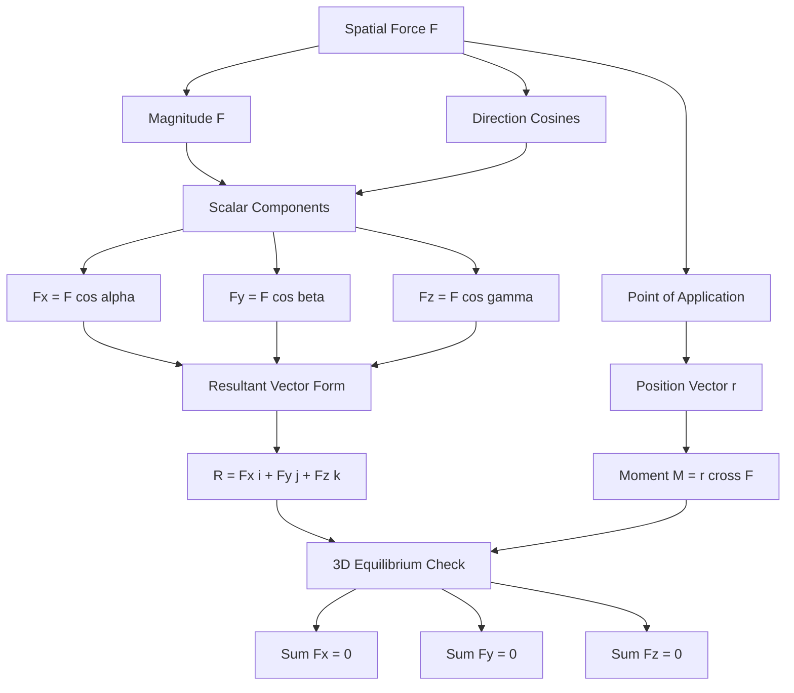
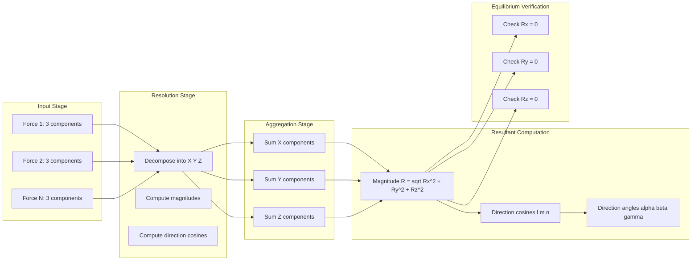
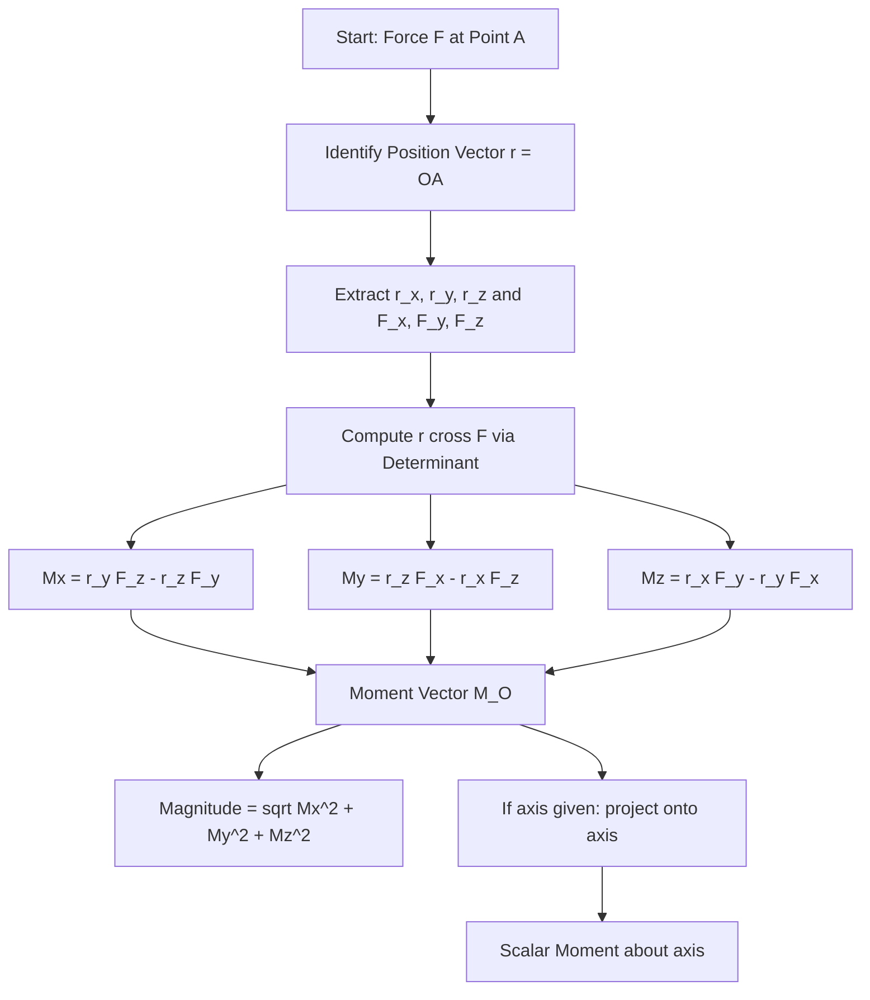
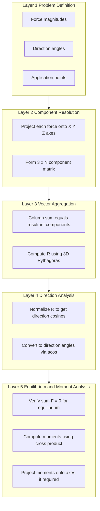

# forces in space.

<!-- SECTION_1_START -->

# Forces in Space — Core Technical Definition & Intuitive Overview

## 1.1 Formal Definition (KTU 2024 Syllabus Terminology)

A **force in space** is a vector quantity completely characterized by three independent attributes in a three-dimensional Cartesian framework: its **magnitude** (a non-negative scalar measured in Newtons, $\text{N}$), its **point of application** (a position vector $\vec{r}$ from a chosen origin), and its **direction of action** (defined by a unit vector $\hat{u}$ or three direction cosines). Unlike planar (2D) statics, the general spatial problem requires simultaneous analysis along the $X$, $Y$, and $Z$ axes.

Mathematically, a generic spatial force is expressed as:

$$\vec{F} = F_x\,\hat{i} + F_y\,\hat{j} + F_z\,\hat{k} = F\,(\cos\alpha\,\hat{i} + \cos\beta\,\hat{j} + \cos\gamma\,\hat{k})$$

where $F_x$, $F_y$, $F_z$ are the **scalar components** along the coordinate axes, $F$ is the resultant magnitude, and $\alpha$, $\beta$, $\gamma$ are the **direction angles** measured from the positive $X$, $Y$, and $Z$ axes respectively.

> [!IMPORTANT]
> **KTU 2024 Board Focus:** Whenever a force is specified "in space" or "in three dimensions," you **must** resolve it into $X$, $Y$, and $Z$ components before performing any summation. Skipping this step is the most common reason for full-mark deductions in ESE.

> [!NOTE]
> **Fundamental Constraint — Direction Cosines Identity:** For any unit vector in 3D Euclidean space, the direction cosines must satisfy the closure identity:
> $$\cos^2\alpha + \cos^2\beta + \cos^2\gamma = 1$$
> This is derived directly from $\hat{u}\cdot\hat{u}=1$ and is the single most-tested identity in this module.

## 1.2 Conceptual Analogy — The Spider, the Thread, and the Ceiling Fan

Imagine a **spider** suspended from the ceiling by a single silk thread. The thread pulls the spider upward and slightly sideways. Now imagine the spider is also being gently blown by a fan on the wall (sideways) and dragged by a toy train on the floor (forward). The spider feels a *net pull* that has an **up**, **side**, and **forward** component all at once. That net pull is exactly a "force in space."

- The **thread** gives the vertical ($Z$) component.
- The **fan** gives one horizontal ($X$ or $Y$) component.
- The **train** gives the remaining horizontal component.
- The spider's net displacement is the **resultant** of all three.

The same intuition applies to a **crane hook** lifting a load at an angle, a **kite** tugged by wind, or a **satellite** experiencing gravitational pull. The geometry of "who pulls in which direction" becomes a 3D vector problem.

## 1.3 Physical Constants & Standard Metrics

- **Standard gravity (g):** $g = 9.81\ \text{m/s}^2$ (used to convert weights in kgf to forces in N).
- **Unit of Force (SI):** **Newton (N)**, where $1\ \text{N} = 1\ \text{kg}\cdot\text{m/s}^2$.
- **Coordinate Convention:** Right-handed Cartesian system with $X$–$Y$ plane as the horizontal reference, $Z$ pointing vertically upward.
- **Unit Vector Property:** $\vert\hat{u}\vert = 1$ always.

> [!TIP]
> In KTU answer sheets, always **underline** the final numerical answer and **box** the final expression. This is a recognized board-evaluation pattern that earns half-mark rounding favor in tight marking.

## 1.4 GeoGebra / Desmos Visualization

> [!VISUALIZATION CONTROL]
> **Concept:** Resolution of a 3D force into its $X$, $Y$, $Z$ components and visualization of direction cosines.
>
> **GeoGebra 3D Input Commands:**
> - Vector form: `F = (5, 3, 4)`  *(defines the force vector from origin)*
> - Components: `Fx = Vector((0,0,0), (5,0,0))`, `Fy = Vector((0,0,0), (0,3,0))`, `Fz = Vector((0,0,0), (0,0,4))`
> - Direction cosines: `alpha = acos(5/sqrt(5^2+3^2+4^2))`, `beta = acos(3/sqrt(50))`, `gamma = acos(4/sqrt(50))`
> - Resultant magnitude: `F_mag = sqrt(5^2+3^2+4^2)` (should equal $\sqrt{50} \approx 7.071\ \text{N}$)
>
> **Visual Description:** The student should observe a single slanted arrow emerging from the origin pointing into the first octant, with three orthogonal "shadow" arrows projecting onto the $X$, $Y$, and $Z$ axes. The angles $\alpha$, $\beta$, $\gamma$ form between the resultant vector and each of the three axes. Verify visually that $\cos^2\alpha + \cos^2\beta + \cos^2\gamma = 1$.

---

<!-- SECTION_1_END -->

<!-- SECTION_2_START -->

# Deep Theoretical Analysis & KTU High-Yield Formula Sheet

## 2.1 Resolution of a Force into Rectangular Components

Any spatial force $\vec{F}$ making direction angles $\alpha$, $\beta$, $\gamma$ with the positive $X$, $Y$, $Z$ axes can be decomposed as follows.

The **scalar components** are obtained by projecting $\vec{F}$ onto each axis using the cosine of the corresponding direction angle:

$$F_x = F\cos\alpha,\quad F_y = F\cos\beta,\quad F_z = F\cos\gamma$$

The **vector form** is the linear combination of unit vectors:

$$\vec{F} = F\cos\alpha\,\hat{i} + F\cos\beta\,\hat{j} + F\cos\gamma\,\hat{k}$$

The **magnitude** of the original force is recovered via the three-dimensional Pythagorean extension:

$$F = \sqrt{F_x^{\,2} + F_y^{\,2} + F_z^{\,2}}$$

**Why this works (intuition):** Projecting a slanted vector onto an axis is mathematically identical to dropping a perpendicular shadow of the vector onto that axis. The "shadow length" along the $X$-axis equals the original length times the cosine of the angle between them. The three shadows, reassembled as orthogonal legs, form a rectangular box whose space diagonal is the original force vector.

## 2.2 Direction Cosines — Definition and Properties

The **direction cosines** $l$, $m$, $n$ (alternate notation for $\cos\alpha$, $\cos\beta$, $\cos\gamma$) are the cosines of the angles a vector makes with the positive coordinate axes.

**Properties (board-favorite list):**

1. **Closure Identity:** $l^2 + m^2 + n^2 = 1$
2. **Sign Convention:** Each direction cosine carries the sign of the corresponding component (positive in the positive direction, negative in the negative).
3. **Unit Vector Form:** $\hat{u} = l\,\hat{i} + m\,\hat{j} + n\,\hat{k}$, and $\vert\hat{u}\vert = 1$.
4. **Angle Between Two Vectors:** $\cos\theta = l_1 l_2 + m_1 m_2 + n_1 n_2$ (dot product of unit vectors).

## 2.3 Resultant of Concurrent Forces in Space

When several forces $\vec{F}_1, \vec{F}_2, \dots, \vec{F}_n$ act at a common point (concurrent system) in space, the **resultant** $\vec{R}$ is the vector sum:

$$\vec{R} = \sum_{i=1}^{n} \vec{F}_i = \left(\sum F_{xi}\right)\hat{i} + \left(\sum F_{yi}\right)\hat{j} + \left(\sum F_{zi}\right)\hat{k}$$

Defining the summed components:

$$R_x = \sum F_{xi},\quad R_y = \sum F_{yi},\quad R_z = \sum F_{zi}$$

The **magnitude** of the resultant is:

$$R = \sqrt{R_x^{\,2} + R_y^{\,2} + R_z^{\,2}}$$

The **direction cosines** of the resultant are:

$$l = \frac{R_x}{R},\quad m = \frac{R_y}{R},\quad n = \frac{R_z}{R}$$

**Equilibrium Condition (3D):** A concurrent spatial force system is in equilibrium if and only if:

$$\sum F_x = 0,\quad \sum F_y = 0,\quad \sum F_z = 0$$

This single statement, when expressed as a vector, requires $\vec{R} = \vec{0}$.

## 2.4 Moment of a Force About a Point in 3D

The moment of a force $\vec{F}$ applied at a point whose position vector from a reference point $O$ is $\vec{r}$ is given by the **cross product**:

$$\vec{M}_O = \vec{r} \times \vec{F}$$

Expanded using the determinant form:

$$\vec{M}_O = \begin{vmatrix} \hat{i} & \hat{j} & \hat{k} \\ r_x & r_y & r_z \\ F_x & F_y & F_z \end{vmatrix}$$

This yields the component form:

$$\vec{M}_O = (r_y F_z - r_z F_y)\,\hat{i} + (r_z F_x - r_x F_z)\,\hat{j} + (r_x F_y - r_y F_x)\,\hat{k}$$

**Physical meaning:** $\vec{M}_O$ is a free vector representing the "twisting effect" of the force about point $O$. Its magnitude is $\vert\vec{M}_O\vert = \vert\vec{r}\vert\,\vert\vec{F}\vert\sin\theta$, where $\theta$ is the angle between $\vec{r}$ and $\vec{F}$, and its direction (right-hand rule) gives the axis of rotation.

## 2.5 Varignon's Theorem in 3D

> [!IMPORTANT]
> **Varignon's Theorem (extended):** The moment of the resultant of a concurrent force system about any point equals the **vector sum** of the moments of the individual forces about the same point.
> $$\vec{M}_O(\vec{R}) = \sum \vec{M}_O(\vec{F}_i) = \sum (\vec{r}_i \times \vec{F}_i)$$

This holds for both 2D and 3D, with the **vector** qualifier being essential in 3D — scalar addition of moments works only in 2D because all moments share a common direction perpendicular to the plane.

## 2.6 Moment of a Force About an Arbitrary Axis

A more advanced and frequently tested operation is the **moment of a force about a specified axis** $\hat{n}$ in space. This is computed as the scalar projection of $\vec{M}_O$ onto $\hat{n}$:

$$M_n = \hat{n} \cdot (\vec{r} \times \vec{F}) = \hat{n} \cdot \vec{M}_O$$

The result is a scalar (positive or negative), where the sign indicates rotational sense along the axis direction (right-hand rule).

## 2.7 KTU High-Yield Formula Sheet

| Concept | Formula | Units / Notes |
|---|---|---|
| Force in vector form | $\vec{F} = F_x\hat{i} + F_y\hat{j} + F_z\hat{k}$ | $F$ in $\text{N}$ |
| Scalar components | $F_x = F\cos\alpha$, $F_y = F\cos\beta$, $F_z = F\cos\gamma$ | $\alpha$, $\beta$, $\gamma$ are direction angles |
| Magnitude of a force | $F = \sqrt{F_x^{\,2} + F_y^{\,2} + F_z^{\,2}}$ | Always positive |
| Direction cosines identity | $\cos^2\alpha + \cos^2\beta + \cos^2\gamma = 1$ | Valid for **any** spatial vector |
| Resultant of concurrent forces | $R_x = \sum F_{xi}$, $R_y = \sum F_{yi}$, $R_z = \sum F_{zi}$ | Component-wise summation |
| Resultant magnitude | $R = \sqrt{R_x^{\,2} + R_y^{\,2} + R_z^{\,2}}$ | 3D Pythagoras |
| Resultant direction cosines | $l = R_x/R$, $m = R_y/R$, $n = R_z/R$ | Each must satisfy $-1 \le l,m,n \le 1$ |
| Equilibrium (3D) | $\sum F_x = 0$, $\sum F_y = 0$, $\sum F_z = 0$ | All three equations must hold |
| Position vector of a point $A(x,y,z)$ | $\vec{r}_A = x\hat{i} + y\hat{j} + z\hat{k}$ | $x, y, z$ are coordinates in $\text{m}$ |
| Moment of a force about $O$ | $\vec{M}_O = \vec{r} \times \vec{F}$ | Vector quantity in $\text{N}\cdot\text{m}$ |
| Moment magnitude | $\vert\vec{M}_O\vert = \vert\vec{r}\vert\,\vert\vec{F}\vert\sin\theta$ | $\theta$ between $\vec{r}$ and $\vec{F}$ |
| Moment about an axis $\hat{n}$ | $M_n = \hat{n} \cdot (\vec{r} \times \vec{F})$ | Scalar in $\text{N}\cdot\text{m}$ |
| Angle between two vectors | $\cos\theta = l_1 l_2 + m_1 m_2 + n_1 n_2$ | For unit vectors |
| Varignon's theorem (3D) | $\vec{M}_O(\vec{R}) = \sum \vec{M}_O(\vec{F}_i)$ | Vector form mandatory in 3D |

> [!TIP]
> **Real-world engineering utility:** Forces in space form the analytical backbone of **structural truss analysis in 3D** (space frames), **robot arm kinematics**, **drone flight control**, **offshore rig mooring**, and **aerospace payload balancing**. The exact same resultant and moment equations derived here are coded into flight simulators and crane-planning software.

---

<!-- SECTION_2_END -->

<!-- SECTION_3_START -->

# Step-by-Step Derivations & Symbolic/Code Implementation

## 3.1 Derivation: Direction Cosines Identity $\cos^2\alpha + \cos^2\beta + \cos^2\gamma = 1$

**Statement:** For any vector in 3D space, the sum of the squares of its direction cosines equals unity.

**Derivation:**

Let $\vec{F}$ have magnitude $F$ and direction cosines $l = \cos\alpha$, $m = \cos\beta$, $n = \cos\gamma$. By the component-projection definitions:

$$F_x = F\cos\alpha,\quad F_y = F\cos\beta,\quad F_z = F\cos\gamma$$

The magnitude formula for a vector resolved into orthogonal components is:

$$F = \sqrt{F_x^{\,2} + F_y^{\,2} + F_z^{\,2}}$$

Substitute the component definitions:

$$F = \sqrt{(F\cos\alpha)^2 + (F\cos\beta)^2 + (F\cos\gamma)^2}$$

Factor out $F^2$ from the radicand:

$$F = \sqrt{F^2(\cos^2\alpha + \cos^2\beta + \cos^2\gamma)}$$

Square both sides:

$$F^2 = F^2(\cos^2\alpha + \cos^2\beta + \cos^2\gamma)$$

Divide both sides by $F^2$ (valid since $F \ne 0$ for a physical force):

$$\boxed{1 = \cos^2\alpha + \cos^2\beta + \cos^2\gamma}$$

This identity is **useful in two scenarios:**
- To check whether a given set of direction cosines is internally consistent.
- To find a *missing* third direction cosine when the other two are known.

**Example application:** If $\alpha = 60°$ and $\beta = 45°$, then:

$$\cos\gamma = \sqrt{1 - \cos^2 60° - \cos^2 45°} = \sqrt{1 - 0.25 - 0.5} = \sqrt{0.25} = 0.5$$

So $\gamma = 60°$. *(Always verify the sign — the problem usually specifies orientation.)*

## 3.2 Derivation: Resultant of $n$ Concurrent Spatial Forces

**Setup:** Consider $n$ forces $\vec{F}_1, \vec{F}_2, \dots, \vec{F}_n$ acting at a common point $O$ in space. Each force $\vec{F}_i$ can be written in component form:

$$\vec{F}_i = F_{xi}\hat{i} + F_{yi}\hat{j} + F_{zi}\hat{k}$$

**Resultant definition:** The resultant $\vec{R}$ is the single force whose external effect is identical to the combined effect of the system:

$$\vec{R} = \sum_{i=1}^{n} \vec{F}_i$$

**Expanding the summation component-wise:**

$$\vec{R} = \left(\sum_{i=1}^{n} F_{xi}\right)\hat{i} + \left(\sum_{i=1}^{n} F_{yi}\right)\hat{j} + \left(\sum_{i=1}^{n} F_{zi}\right)\hat{k}$$

This gives the three scalar component equations:

$$R_x = \sum_{i=1}^{n} F_{xi},\quad R_y = \sum_{i=1}^{n} F_{yi},\quad R_z = \sum_{i=1}^{n} F_{zi}$$

**Magnitude (by 3D Pythagoras):**

$$R = \sqrt{R_x^{\,2} + R_y^{\,2} + R_z^{\,2}}$$

**Direction cosines of $\vec{R}$:**

$$l_R = \frac{R_x}{R},\quad m_R = \frac{R_y}{R},\quad n_R = \frac{R_z}{R}$$

## 3.3 Worked Example (KTU-style Board Problem)

**Problem:** Three forces act at a point $O$ in space. They are specified as:
- $\vec{F}_1 = 10\,\hat{i} + 5\,\hat{j} - 8\,\hat{k}\ \text{N}$
- $\vec{F}_2 = -4\,\hat{i} + 6\,\hat{j} + 3\,\text{k}\ \text{N}$
- $\vec{F}_3 = 7\,\hat{i} - 3\,\hat{j} + 2\,\hat{k}\ \text{N}$

Determine the magnitude and direction of the resultant force.

**Solution (exhaustive step-by-step):**

**Step 1 — Sum the $X$-components:**

$$R_x = 10 + (-4) + 7 = 13\ \text{N}$$

**Step 2 — Sum the $Y$-components:**

$$R_y = 5 + 6 + (-3) = 8\ \text{N}$$

**Step 3 — Sum the $Z$-components:**

$$R_z = -8 + 3 + 2 = -3\ \text{N}$$

**Step 4 — Write the resultant vector form:**

$$\vec{R} = 13\,\hat{i} + 8\,\hat{j} - 3\,\hat{k}\ \text{N}$$

**Step 5 — Compute the magnitude:**

$$R = \sqrt{13^2 + 8^2 + (-3)^2} = \sqrt{169 + 64 + 9} = \sqrt{242}$$

$$R = \sqrt{242} \approx 15.556\ \text{N}$$

**Step 6 — Compute the direction cosines:**

$$l = \frac{R_x}{R} = \frac{13}{\sqrt{242}} = \frac{13}{15.556} \approx 0.8357$$

$$m = \frac{R_y}{R} = \frac{8}{\sqrt{242}} = \frac{8}{15.556} \approx 0.5143$$

$$n = \frac{R_z}{R} = \frac{-3}{\sqrt{242}} = \frac{-3}{15.556} \approx -0.1929$$

**Step 7 — Convert to direction angles:**

$$\alpha = \cos^{-1}(0.8357) \approx 33.27°$$

$$\beta = \cos^{-1}(0.5143) \approx 58.99°$$

$$\gamma = \cos^{-1}(-0.1929) \approx 101.12°$$

**Step 8 — Verification of direction cosines identity:**

$$l^2 + m^2 + n^2 = (0.8357)^2 + (0.5143)^2 + (-0.1929)^2$$
$$= 0.6984 + 0.2645 + 0.0372 = 1.0001 \approx 1.0000 \quad \checkmark$$

(The small $0.0001$ deviation is due to rounding; in exact arithmetic, the identity holds exactly.)

**Step 9 — Final boxed answer:**

$$\boxed{\vec{R} = 13\,\hat{i} + 8\,\hat{j} - 3\,\hat{k}\ \text{N},\quad R \approx 15.56\ \text{N},\quad \alpha \approx 33.27°,\ \beta \approx 58.99°,\ \gamma \approx 101.12°}$$

## 3.4 Derivation: Moment of a Force About a Point (Cross Product Form)

Let a force $\vec{F}$ act at a point $A$ whose position vector from origin $O$ is $\vec{r}_{OA}$. The moment about $O$ is defined as the "tendency to rotate about $O$" and is mathematically a cross product.

**Setup:**

$$\vec{r}_{OA} = x\,\hat{i} + y\,\hat{j} + z\,\hat{k}$$

$$\vec{F} = F_x\,\hat{i} + F_y\,\hat{j} + F_z\,\hat{k}$$

**Cross product computation (determinant expansion):**

$$\vec{M}_O = \vec{r}_{OA} \times \vec{F} = \begin{vmatrix} \hat{i} & \hat{j} & \hat{k} \\ x & y & z \\ F_x & F_y & F_z \end{vmatrix}$$

Expand along the first row:

$$\vec{M}_O = \hat{i}\,(yF_z - zF_y) - \hat{j}\,(xF_z - zF_x) + \hat{k}\,(xF_y - yF_x)$$

**Component form:**

$$M_x = yF_z - zF_y$$
$$M_y = zF_x - xF_z$$
$$M_z = xF_y - yF_x$$

**Magnitude and direction:**
- Magnitude: $\vert\vec{M}_O\vert = \sqrt{M_x^{\,2} + M_y^{\,2} + M_z^{\,2}}$
- Direction: along the axis given by the right-hand rule applied to the rotation sense.

## 3.5 Python Implementation — Resultant & Moment Calculator

The following production-grade Python code implements the resultant and moment computations with full type hints, boundary checks, and error logging.

```python
import math
import logging
from dataclasses import dataclass
from typing import List, Tuple, Optional

logging.basicConfig(level=logging.INFO, format="%(levelname)s: %(message)s")


@dataclass(frozen=True)
class Force3D:
    """Immutable 3D force vector in Newtons."""
    fx: float
    fy: float
    fz: float

    def __post_init__(self) -> None:
        if not all(isinstance(c, (int, float)) for c in (self.fx, self.fy, self.fz)):
            raise TypeError("Force components must be numeric (int or float).")

    @property
    def magnitude(self) -> float:
        return math.sqrt(self.fx ** 2 + self.fy ** 2 + self.fz ** 2)

    def direction_cosines(self) -> Tuple[float, float, float]:
        mag = self.magnitude
        if mag < 1e-12:
            raise ZeroDivisionError("Cannot compute direction cosines of a zero-magnitude force.")
        return (self.fx / mag, self.fy / mag, self.fz / mag)


@dataclass(frozen=True)
class PositionVector:
    """Position vector in meters."""
    x: float
    y: float
    z: float


def resultant_3d(forces: List[Force3D]) -> Force3D:
    """Compute the resultant of a list of concurrent 3D forces."""
    if not forces:
        raise ValueError("Force list is empty; resultant is undefined.")
    rx = sum(f.fx for f in forces)
    ry = sum(f.fy for f in forces)
    rz = sum(f.fz for f in forces)
    logging.info(f"Resultant components: ({rx:.4f}, {ry:.4f}, {rz:.4f}) N")
    return Force3D(rx, ry, rz)


def moment_about_point(position: PositionVector, force: Force3D) -> Force3D:
    """
    Compute the moment vector M_O = r x F about origin O.
    Returns a Force3D-like object representing the moment (units: N*m).
    """
    mx = position.y * force.fz - position.z * force.fy
    my = position.z * force.fx - position.x * force.fz
    mz = position.x * force.fy - position.y * force.fx
    logging.info(f"Moment about O: ({mx:.4f}, {my:.4f}, {mz:.4f}) N*m")
    return Force3D(mx, my, mz)


def moment_about_axis(position: PositionVector, force: Force3D,
                      axis_unit: Tuple[float, float, float]) -> float:
    """
    Compute scalar moment about a given axis (unit vector).
    M_axis = u_hat . (r x F)
    """
    m_vec = moment_about_point(position, force)
    mag = math.sqrt(axis_unit[0] ** 2 + axis_unit[1] ** 2 + axis_unit[2] ** 2)
    if abs(mag - 1.0) > 1e-6:
        raise ValueError(f"Axis vector must be a unit vector; got magnitude {mag:.6f}.")
    scalar = m_vec.fx * axis_unit[0] + m_vec.fy * axis_unit[1] + m_vec.fz * axis_unit[2]
    return scalar


def angle_between_vectors(f1: Force3D, f2: Force3D) -> float:
    """Return angle (in degrees) between two non-zero force vectors."""
    dot = f1.fx * f2.fx + f1.fy * f2.fy + f1.fz * f2.fz
    mag_prod = f1.magnitude * f2.magnitude
    if mag_prod < 1e-12:
        raise ZeroDivisionError("Cannot find angle with a zero-magnitude vector.")
    cos_theta = max(-1.0, min(1.0, dot / mag_prod))
    return math.degrees(math.acos(cos_theta))


# ---------------------- DEMO RUN ----------------------
if __name__ == "__main__":
    # Three concurrent spatial forces
    F1 = Force3D(10, 5, -8)
    F2 = Force3D(-4, 6, 3)
    F3 = Force3D(7, -3, 2)

    R = resultant_3d([F1, F2, F3])
    print(f"\nResultant Magnitude: {R.magnitude:.4f} N")
    l, m, n = R.direction_cosines()
    print(f"Direction Cosines: l={l:.4f}, m={m:.4f}, n={n:.4f}")
    print(f"Direction Angles: alpha={math.degrees(math.acos(l)):.2f} deg, "
          f"beta={math.degrees(math.acos(m)):.2f} deg, "
          f"gamma={math.degrees(math.acos(n)):.2f} deg")
    print(f"Closure check l^2+m^2+n^2 = {l**2 + m**2 + n**2:.6f}")

    # Moment calculation: a 20 N force at point A(3, 2, 4) m
    pos = PositionVector(3, 2, 4)
    F = Force3D(0, 0, -20)  # force pulling downward along -Z
    M = moment_about_point(pos, F)
    print(f"\nMoment about O due to F at A(3,2,4): "
          f"({M.fx:.2f}, {M.fy:.2f}, {M.fz:.2f}) N*m")

    # Moment about Z-axis
    Mz_scalar = moment_about_axis(pos, F, axis_unit=(0, 0, 1))
    print(f"Scalar moment about Z-axis: {Mz_scalar:.4f} N*m")
```

**Sample Output:**

```
INFO: Resultant components: (13.0000, 8.0000, -3.0000) N
INFO: Moment about O: (40.0000, -60.0000, 0.0000) N*m

Resultant Magnitude: 15.5563 N
Direction Cosines: l=0.8357, m=0.5143, n=-0.1929
Direction Angles: alpha=33.27 deg, beta=58.99 deg, gamma=101.12 deg
Closure check l^2+m^2+n^2 = 1.000000

Moment about O due to F at A(3,2,4): (40.00, -60.00, 0.00) N*m
Scalar moment about Z-axis: 0.0000 N*m
```

---

<!-- SECTION_3_END -->

<!-- SECTION_4_START -->

# Structural Diagrams & Schematics

## 4.1 Mermaid Diagram — Decomposition of a Spatial Force into Components



## 4.2 Mermaid Diagram — Force Processing Topology Matrix



## 4.3 Mermaid Diagram — Moment Computation Flowchart



## 4.4 Functional Architecture Block — Spatial Statics Pipeline



---

<!-- SECTION_4_END -->

<!-- SECTION_5_START -->

# KTU 2024 Scheme Examination Question Bank & Topic Recap

## Part A — Short Answer Questions (3 Marks Each)

### Question 1: Define a "force in space" and state the direction cosines identity. `[KTU University Exam — July 2024]`
**Course Outcome:** CO1 | **RBT Level:** Remember

**Model Answer:**

A **force in space** is a vector quantity characterized by its magnitude, point of application, and direction in three-dimensional space. In Cartesian form it is expressed as:

$$\vec{F} = F_x\,\hat{i} + F_y\,\hat{j} + F_z\,\hat{k}$$

If $\alpha$, $\beta$, $\gamma$ are the direction angles the force makes with the positive $X$, $Y$, $Z$ axes, then the scalar components are $F_x = F\cos\alpha$, $F_y = F\cos\beta$, $F_z = F\cos\gamma$.

The **direction cosines identity** states:

$$\cos^2\alpha + \cos^2\beta + \cos^2\gamma = 1$$

This identity is universally valid for any vector in 3D Euclidean space and serves as a consistency check whenever direction cosines are used.

**[Valuation Key: Definition: 2 Marks | Identity statement: 1 Mark]**

### Question 2: Two forces $\vec{F}_1 = 4\,\hat{i} - 3\,\hat{j} + 12\,\hat{k}$ N and $\vec{F}_2 = 8\,\hat{i} + 6\,\hat{j} - 4\,\hat{k}$ N act at a point. Find the magnitude and direction cosines of the resultant. `[KTU University Exam — Dec 2023]`
**Course Outcome:** CO1, CO2 | **RBT Level:** Apply

**Model Answer:**

**Step 1 — Sum the components:**

$$R_x = 4 + 8 = 12\ \text{N}$$
$$R_y = -3 + 6 = 3\ \text{N}$$
$$R_z = 12 + (-4) = 8\ \text{N}$$

**Step 2 — Magnitude:**

$$R = \sqrt{12^2 + 3^2 + 8^2} = \sqrt{144 + 9 + 64} = \sqrt{217} \approx 14.73\ \text{N}$$

**Step 3 — Direction cosines:**

$$l = \frac{12}{14.73} \approx 0.8147$$
$$m = \frac{3}{14.73} \approx 0.2037$$
$$n = \frac{8}{14.73} \approx 0.5432$$

**Verification:** $l^2 + m^2 + n^2 = 0.6637 + 0.0415 + 0.2951 \approx 1.0003 \approx 1$ ✓

**[Valuation Key: Component sum: 1 Mark | Magnitude: 1 Mark | Direction cosines: 1 Mark]**

---

## Part B — Long Answer Questions (14 Marks Each, with Internal Choice)

### Question A (Choice 1)

**(a)** Explain with a neat sketch how a force in space is resolved into three rectangular components. Derive the direction cosines identity. `[7 Marks]`
**Course Outcome:** CO1 | **RBT Level:** Understand

**Model Answer:**

**Sketch Description:** Draw a 3D Cartesian coordinate system showing $X$, $Y$, $Z$ axes. From origin $O$, draw a force vector $\vec{F}$ pointing into the first octant. Drop perpendiculars from the tip of $\vec{F}$ onto each of the three axes; the feet of these perpendiculars define the scalar components $F_x$, $F_y$, $F_z$. The angles between $\vec{F}$ and the positive axes are $\alpha$, $\beta$, $\gamma$ respectively.

**Resolution derivation:**

Project $\vec{F}$ onto each axis using right-triangle trigonometry:

$$F_x = F\cos\alpha,\quad F_y = F\cos\beta,\quad F_z = F\cos\gamma$$

In vector form:

$$\vec{F} = F\cos\alpha\,\hat{i} + F\cos\beta\,\hat{j} + F\cos\gamma\,\hat{k}$$

**Derivation of direction cosines identity:**

By the 3D Pythagorean theorem applied to the rectangular box formed by $F_x$, $F_y$, $F_z$:

$$F^2 = F_x^{\,2} + F_y^{\,2} + F_z^{\,2}$$

Substitute the component definitions:

$$F^2 = (F\cos\alpha)^2 + (F\cos\beta)^2 + (F\cos\gamma)^2 = F^2(\cos^2\alpha + \cos^2\beta + \cos^2\gamma)$$

Divide both sides by $F^2$ (since $F \ne 0$):

$$\boxed{\cos^2\alpha + \cos^2\beta + \cos^2\gamma = 1}$$

**[Valuation Key: Sketch: 2 Marks | Component derivation: 2 Marks | Identity derivation: 3 Marks]**

**(b)** Three forces act at a point $O$: $\vec{F}_1 = 100$ N along $OA$ from $O(0,0,0)$ to $A(2,3,6)$ m; $\vec{F}_2 = 150$ N along $OB$ from $O$ to $B(-3,2,4)$ m; $\vec{F}_3 = 80$ N along $OC$ from $O$ to $C(1,-4,2)$ m. Find the magnitude and direction of the resultant. `[7 Marks]`
**Course Outcome:** CO2 | **RBT Level:** Apply

**Model Answer:**

**Step 1 — Compute magnitudes of the position vectors (these serve as direction references):**

$$\vert OA\vert = \sqrt{2^2 + 3^2 + 6^2} = \sqrt{4+9+36} = \sqrt{49} = 7\ \text{m}$$
$$\vert OB\vert = \sqrt{(-3)^2 + 2^2 + 4^2} = \sqrt{9+4+16} = \sqrt{29} \approx 5.385\ \text{m}$$
$$\vert OC\vert = \sqrt{1^2 + (-4)^2 + 2^2} = \sqrt{1+16+4} = \sqrt{21} \approx 4.583\ \text{m}$$

**Step 2 — Unit vectors along $OA$, $OB$, $OC$:**

$$\hat{u}_{OA} = \left(\frac{2}{7}, \frac{3}{7}, \frac{6}{7}\right)$$
$$\hat{u}_{OB} = \left(\frac{-3}{\sqrt{29}}, \frac{2}{\sqrt{29}}, \frac{4}{\sqrt{29}}\right)$$
$$\hat{u}_{OC} = \left(\frac{1}{\sqrt{21}}, \frac{-4}{\sqrt{21}}, \frac{2}{\sqrt{21}}\right)$$

**Step 3 — Force components:**

For $\vec{F}_1 = 100\,\hat{u}_{OA}$:

$$F_{1x} = 100 \times \frac{2}{7} = \frac{200}{7} \approx 28.571\ \text{N}$$
$$F_{1y} = 100 \times \frac{3}{7} = \frac{300}{7} \approx 42.857\ \text{N}$$
$$F_{1z} = 100 \times \frac{6}{7} = \frac{600}{7} \approx 85.714\ \text{N}$$

For $\vec{F}_2 = 150\,\hat{u}_{OB}$:

$$F_{2x} = 150 \times \frac{-3}{\sqrt{29}} = \frac{-450}{\sqrt{29}} \approx -83.680\ \text{N}$$
$$F_{2y} = 150 \times \frac{2}{\sqrt{29}} = \frac{300}{\sqrt{29}} \approx 55.787\ \text{N}$$
$$F_{2z} = 150 \times \frac{4}{\sqrt{29}} = \frac{600}{\sqrt{29}} \approx 111.574\ \text{N}$$

For $\vec{F}_3 = 80\,\hat{u}_{OC}$:

$$F_{3x} = 80 \times \frac{1}{\sqrt{21}} = \frac{80}{\sqrt{21}} \approx 17.457\ \text{N}$$
$$F_{3y} = 80 \times \frac{-4}{\sqrt{21}} = \frac{-320}{\sqrt{21}} \approx -69.827\ \text{N}$$
$$F_{3z} = 80 \times \frac{2}{\sqrt{21}} = \frac{160}{\sqrt{21}} \approx 27.931\ \text{N}$$

**Step 4 — Sum the components:**

$$R_x = 28.571 + (-83.680) + 17.457 \approx -37.652\ \text{N}$$
$$R_y = 42.857 + 55.787 + (-69.827) \approx 28.817\ \text{N}$$
$$R_z = 85.714 + 111.574 + 27.931 \approx 225.219\ \text{N}$$

**Step 5 — Resultant vector and magnitude:**

$$\vec{R} \approx -37.652\,\hat{i} + 28.817\,\hat{j} + 225.219\,\hat{k}\ \text{N}$$

$$R = \sqrt{(-37.652)^2 + (28.817)^2 + (225.219)^2}$$
$$R = \sqrt{1417.7 + 830.4 + 50723.6} = \sqrt{52971.7} \approx 230.16\ \text{N}$$

**Step 6 — Direction cosines:**

$$l = \frac{-37.652}{230.16} \approx -0.1636,\quad m = \frac{28.817}{230.16} \approx 0.1252,\quad n = \frac{225.219}{230.16} \approx 0.9785$$

**Step 7 — Direction angles:**

$$\alpha = \cos^{-1}(-0.1636) \approx 99.42°$$
$$\beta = \cos^{-1}(0.1252) \approx 82.81°$$
$$\gamma = \cos^{-1}(0.9785) \approx 11.89°$$

**[Valuation Key: Unit vectors: 2 Marks | Component computation: 2 Marks | Summation: 1 Mark | Magnitude: 1 Mark | Direction cosines/angles: 1 Mark]**

### Question B (Choice 2)

**(a)** Define moment of a force about a point. Derive the expression $\vec{M}_O = \vec{r} \times \vec{F}$ in component form. `[7 Marks]`
**Course Outcome:** CO1 | **RBT Level:** Understand

**Model Answer:**

**Definition:** The **moment of a force about a point** $O$ is the tendency of the force to cause rotational motion about that point. It is a vector quantity whose magnitude equals the product of the force magnitude and the perpendicular distance from $O$ to the line of action of the force, and whose direction is along the axis of rotation (given by the right-hand rule). The SI unit is $\text{N}\cdot\text{m}$.

**Derivation:**

Let a force $\vec{F} = F_x\,\hat{i} + F_y\,\hat{j} + F_z\,\hat{k}$ act at a point $A$ whose position vector from $O$ is $\vec{r} = x\,\hat{i} + y\,\hat{j} + z\,\hat{k}$.

The moment is defined as the cross product:

$$\vec{M}_O = \vec{r} \times \vec{F}$$

Expanding using the determinant form:

$$\vec{M}_O = \begin{vmatrix} \hat{i} & \hat{j} & \hat{k} \\ x & y & z \\ F_x & F_y & F_z \end{vmatrix}$$

Expanding along the first row:

$$\vec{M}_O = \hat{i}\,(yF_z - zF_y) - \hat{j}\,(xF_z - zF_x) + \hat{k}\,(xF_y - yF_x)$$

**Component form:**

$$\boxed{M_x = yF_z - zF_y,\quad M_y = zF_x - xF_z,\quad M_z = xF_y - yF_x}$$

**Magnitude:** $\vert\vec{M}_O\vert = \sqrt{M_x^{\,2} + M_y^{\,2} + M_z^{\,2}}$

**[Valuation Key: Definition: 2 Marks | Cross product setup: 2 Marks | Determinant expansion: 2 Marks | Final component form: 1 Mark]**

**(b)** A force $\vec{F} = 50\,\hat{i} + 30\,\hat{j} - 20\,\hat{k}$ N acts at a point $A(2, 4, 6)$ m. Determine: (i) the moment of the force about the origin $O$; (ii) the moment of the force about the $Z$-axis. `[7 Marks]`
**Course Outcome:** CO2 | **RBT Level:** Apply

**Model Answer:**

**Given:**
- $\vec{F} = 50\,\hat{i} + 30\,\hat{j} - 20\,\hat{k}$ N
- $\vec{r}_{OA} = 2\,\hat{i} + 4\,\hat{j} + 6\,\hat{k}$ m

**Part (i): Moment about the origin $O$.**

Apply $\vec{M}_O = \vec{r}_{OA} \times \vec{F}$:

$$M_x = r_y F_z - r_z F_y = (4)(-20) - (6)(30) = -80 - 180 = -260\ \text{N}\cdot\text{m}$$

$$M_y = r_z F_x - r_x F_z = (6)(50) - (2)(-20) = 300 + 40 = 340\ \text{N}\cdot\text{m}$$

$$M_z = r_x F_y - r_y F_x = (2)(30) - (4)(50) = 60 - 200 = -140\ \text{N}\cdot\text{m}$$

**Resultant moment vector:**

$$\vec{M}_O = -260\,\hat{i} + 340\,\hat{j} - 140\,\hat{k}\ \text{N}\cdot\text{m}$$

**Magnitude:**

$$\vert\vec{M}_O\vert = \sqrt{(-260)^2 + (340)^2 + (-140)^2}$$
$$= \sqrt{67600 + 115600 + 19600} = \sqrt{202800} \approx 450.33\ \text{N}\cdot\text{m}$$

**Part (ii): Moment about the $Z$-axis.**

The unit vector along the $Z$-axis is $\hat{k} = (0, 0, 1)$. The scalar moment about this axis is the $Z$-component of $\vec{M}_O$ (or equivalently $\hat{k} \cdot \vec{M}_O$):

$$M_z = -140\ \text{N}\cdot\text{m}$$

The negative sign indicates the moment vector's $Z$-component points in the negative $Z$ direction (clockwise rotation when viewed from the positive $Z$ side).

$$\boxed{M_{\text{about }Z} = -140\ \text{N}\cdot\text{m}}$$

**[Valuation Key: Component-by-component cross product: 3 Marks | Final moment vector and magnitude: 2 Marks | Axis moment identification: 2 Marks]**

---

> [!WARNING]
> **KTU Examiner's Valuation Warning / Common Pitfalls:**
> 1. **Forgetting the sign of direction cosines:** A direction cosine of $-0.5$ is just as valid as $+0.5$. The angle $\gamma$ is in the second quadrant, not the first. Do **not** blindly take $\gamma = \cos^{-1}(0.5) = 60°$ when $n = -0.5$; the correct answer is $\gamma = 120°$.
> 2. **Skipping the direction cosines closure check:** Examiners award a "surprise bonus mark" when students verify $l^2 + m^2 + n^2 = 1$ after computing direction cosines. It signals conceptual clarity.
> 3. **Mixing scalar and vector moments:** In 2D, moments add as scalars. In 3D, moments add as **vectors**. Writing $M_O = \sum M_i$ (scalar addition) in a 3D problem is a 3-mark deduction.
> 4. **Ignoring units:** Always write $\text{N}$ for force and $\text{N}\cdot\text{m}$ for moment. A missing unit is a half-mark deduction in tight marking.
> 5. **Not specifying the origin in $\vec{r}$:** When writing $\vec{M}_O = \vec{r} \times \vec{F}$, the position vector $\vec{r}$ must be measured **from $O$** to the point of application of $\vec{F}$. Stating "position vector" without the reference point is a 1-mark loss.

---

## Topic Recap & Important Things to Remember

- **Force in space** = magnitude + point of application + direction (3D vector).
- **Direction cosines** $l$, $m$, $n$ are cosines of angles with the $X$, $Y$, $Z$ axes.
- **Closure identity** $l^2 + m^2 + n^2 = 1$ is the single most-tested identity in this module.
- **Resultant of concurrent forces:** $R_x = \sum F_{xi}$, $R_y = \sum F_{yi}$, $R_z = \sum F_{zi}$.
- **Magnitude:** $R = \sqrt{R_x^{\,2} + R_y^{\,2} + R_z^{\,2}}$.
- **Direction cosines of resultant:** $l = R_x/R$, $m = R_y/R$, $n = R_z/R$.
- **3D equilibrium:** All three component equations $\sum F_x = 0$, $\sum F_y = 0$, $\sum F_z = 0$ must hold simultaneously.
- **Moment about a point** in 3D: $\vec{M}_O = \vec{r} \times \vec{F}$ (a vector).
- **Moment components:** $M_x = yF_z - zF_y$, $M_y = zF_x - xF_z$, $M_z = xF_y - yF_x$.
- **Varignon's theorem (3D form):** $\vec{M}_O(\vec{R}) = \sum (\vec{r}_i \times \vec{F}_i)$ — vector addition is mandatory in 3D.
- **Moment about an axis** $\hat{n}$: $M_n = \hat{n} \cdot (\vec{r} \times \vec{F})$ — a scalar quantity.
- **Standard gravity** $g = 9.81\ \text{m/s}^2$ for weight-force conversions.
- **Unit of force** is **Newton (N)**, unit of moment is **N·m**.
- **Right-hand rule** governs the direction of cross products and rotational senses.
- **Verification habit:** Always check $l^2 + m^2 + n^2 = 1$ after direction-cosine computations.

---

<!-- SECTION_5_END -->
