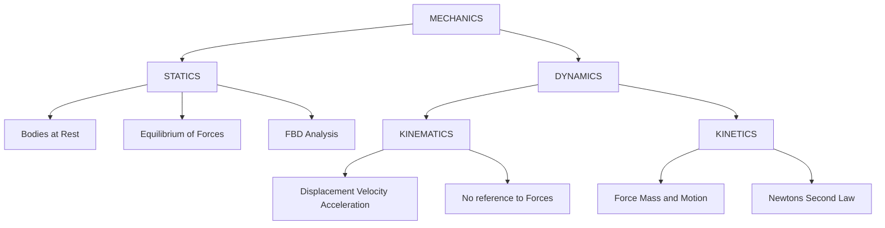
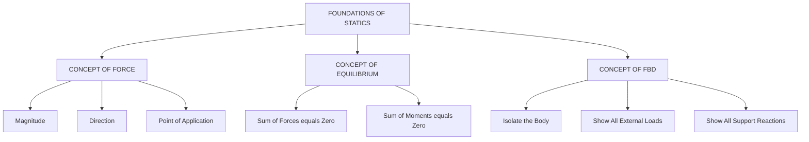
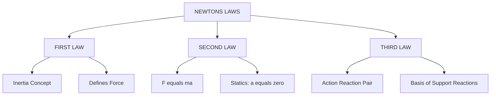
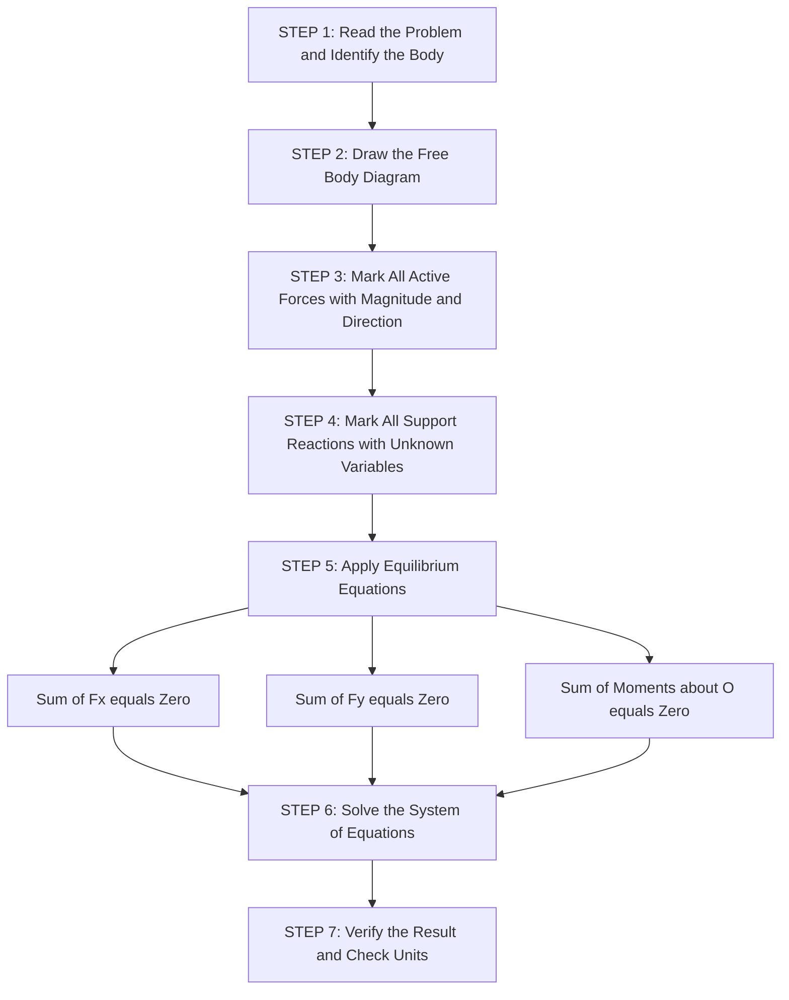
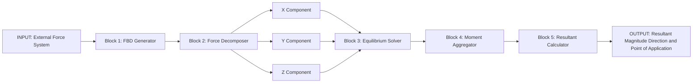

# Introduction to statics: introduction to branches of mechanics

<!-- SECTION_1_START -->
# INTRODUCTION TO STATICS & BRANCHES OF MECHANICS

## 1.1 What is Engineering Mechanics?

> [!IMPORTANT]
> **Engineering Mechanics** is the branch of applied mechanics that deals with the **state of rest** and the **state of motion** of physical bodies subjected to the action of **forces**. It forms the foundational pillar for the design and analysis of all mechanical, civil, and aerospace engineering systems.

In the simplest sense, engineering mechanics answers two fundamental engineering questions:
- *Why and how do structures (bridges, buildings, machine parts) remain stationary?*
- *Why and how do machines (vehicles, turbines, robots) move?*

These two questions are addressed by the two main divisions of mechanics: **Statics** and **Dynamics**.

### 1.2 Fundamental Definitions You Must Know

> [!NOTE]
> **Particle** — A body of negligible dimensions, treated as a point mass for analysis. Practically, when the size of the body is very small compared to the distance it travels, the body is treated as a particle.

> [!NOTE]
> **Rigid Body** — A body in which the distance between any two particles remains **constant** irrespective of the forces applied. It does **not deform** under the action of external loads.

> [!NOTE]
> **Continuum** — A body assumed to be made up of continuous matter (no voids or empty spaces) so that physical properties such as density, stress, and strain are defined at every point in the body.

> [!NOTE]
> **Force** — A vector quantity that tends to change the state of rest or uniform motion of a body. Force is characterized by its **magnitude**, **direction**, and **point of application**.

> [!NOTE]
> **Space** — The geometric region in which physical events occur. In classical mechanics, space is three-dimensional, following the rules of **Euclidean geometry**.

> [!NOTE]
> **Time** — A scalar quantity that measures the sequence and duration of events. In Newtonian mechanics, time is **absolute** and flows uniformly for all observers.

> [!NOTE]
> **Mass** — A scalar measure of the **inertia** of a body — its resistance to a change in motion. The standard SI unit is the **kilogram (kg)**.

### 1.3 Conceptual Analogy / Intuition

Imagine you are holding a book in your hand. The book is at **rest**. Your hand is exerting an upward force to balance the downward pull of **gravity** (weight). As long as these two forces are equal and opposite, the book remains static.

Now imagine you gently push the book off the edge of a table. It begins to **fall**, accelerating under gravity until it hits the floor. The transition from rest to motion is the realm of **dynamics**.

> The first scenario (rest) is **Statics**.
> The second scenario (motion) is **Dynamics**.

### 1.4 The Four Fundamental Branches of Mechanics

> [!IMPORTANT]
> **Core KTU Syllabus Map:** KTU 2024 Scheme groups mechanics into two primary branches for B.Tech first-year engineering mechanics, with a further subdivision of dynamics.

$$
\boxed{
\text{Mechanics} \;=\;
\underbrace{\text{Statics}}_{\text{Bodies at rest}} \;
+\;
\underbrace{\text{Dynamics}}_{\text{Bodies in motion}}
}
$$

Dynamics is further split into two intertwined sub-branches:

$$
\boxed{
\text{Dynamics} \;=\;
\underbrace{\text{Kinematics}}_{\text{Geometry of motion}} \;
+\;
\underbrace{\text{Kinetics}}_{\text{Forces causing motion}}
}
$$

| Branch | Core Question | Deals With | Ignores |
|---|---|---|---|
| **Statics** | *Why is the body at rest?* | Forces and equilibrium | Motion |
| **Kinematics** | *How is the body moving?* | Geometry of motion (position, velocity, acceleration) | Forces and mass |
| **Kinetics** | *Why is the body moving the way it is?* | Forces and the resulting motion | — |

### 1.5 Why Statics Matters in Real Engineering

Almost every structural element in civil and mechanical engineering is designed to be in **equilibrium**. Beams, columns, trusses, bridges, dams, retaining walls, machine frames, and even the chassis of a car parked in a garage are all designed using the principles of **statics**.

> [!VISUALIZATION CONTROL]
> **Concept:** Free-Body Diagram of a Hanging Lamp
> **GeoGebra / Desmos Input Equations:**
> * Point A: $(0, 5)$ — ceiling anchor
> * Point B: $(0, 2)$ — lamp body
> * Vector Tension: $\vec{T} = (0, 3)$ acting along AB
> * Vector Weight: $\vec{W} = (0, -3)$ acting downward at B
> **Visual Description:** Two equal and opposite vertical vectors meeting at a single point, illustrating a state of **static equilibrium** where $\vec{T} + \vec{W} = \vec{0}$.

<!-- SECTION_1_END -->

<!-- SECTION_2_START -->
# DEEP THEORETICAL ANALYSIS & KTU FORMULA SHEET

## 2.1 The Three Pillars of Statics

Statics rests on three fundamental pillars. Every problem you will solve in KTU Module 1 and beyond is built on top of these.

> **Pillar 1 — The Concept of Force**
> A force is a push or a pull, fully defined by its magnitude, direction, line of action, and sense.

> **Pillar 2 — The Concept of Equilibrium**
> A body is in equilibrium when the **net force** and the **net moment** acting on it are both zero.

> **Pillar 3 — The Concept of Free-Body Diagram (FBD)**
> A schematic representation of a body isolated from its surroundings, showing all external forces and moments acting on it.

## 2.2 The Fundamental Laws Underlying Statics

> [!IMPORTANT]
> **Newton's Laws of Motion** are the bedrock of all classical mechanics. Statics is essentially a special case of Newton's Second Law where the **acceleration is zero**.

### Newton's First Law (Law of Inertia)
A body continues in its state of rest or of uniform motion in a straight line unless compelled by an external unbalanced force to change its state.

**Engineering Interpretation:** This law defines the concept of *force*. If there is no net force, there is no change in motion. This is the foundation of **static equilibrium**.

### Newton's Second Law (Law of Acceleration)
The rate of change of momentum of a body is directly proportional to the applied force and takes place in the direction in which the force acts.

Mathematically:
$$
\vec{F} = \frac{d\vec{p}}{dt} = \frac{d(m\vec{v})}{dt}
$$

For a constant mass $m$:
$$
\vec{F} = m\vec{a}
$$

**Engineering Interpretation:** For a body at rest, $\vec{a} = \vec{0}$, which gives us the equilibrium equation:
$$
\sum \vec{F} = \vec{0}
$$

This is the **cornerstone equation of statics**.

### Newton's Third Law (Law of Action-Reaction)
For every action, there is an equal and opposite reaction.

**Engineering Interpretation:** When a beam rests on a column, the beam pushes down on the column with force $\vec{R}$, and the column pushes up on the beam with an equal and opposite force $-\vec{R}$. This is the principle behind all **support reactions**.

### Law of Gravitation
Two bodies attract each other with a force that is directly proportional to the product of their masses and inversely proportional to the square of the distance between their centers.

$$
F = G \frac{m_1 \, m_2}{r^2}
$$

where the universal gravitational constant is:
$$
G = 6.674 \times 10^{-11} \; \text{N} \cdot \text{m}^2 / \text{kg}^2
$$

### Law of Parallelogram of Forces
The resultant of two concurrent coplanar forces can be obtained by constructing a parallelogram with the two forces as adjacent sides. The diagonal of the parallelogram represents the resultant force, both in magnitude and direction.

## 2.3 Idealizations in Statics

Real engineering bodies are not perfectly rigid, perfectly smooth, or perfectly uniform. To make analysis tractable, we make the following **idealizations**:

- **Rigid Body Assumption:** Deformations are neglected. Justified because engineering strains in most structures are extremely small (less than 0.001).
- **Particle Assumption:** Used when the body dimensions are negligible compared to the path of motion.
- **Continuous Medium:** Properties are defined at every mathematical point.
- **Coplanar Forces:** When all forces lie in a single plane, the analysis reduces to 2D, which is the standard KTU Module 1 scope.

## 2.4 Scalar and Vector Quantities in Statics

> [!NOTE]
> **Scalar Quantity** — A quantity described completely by its **magnitude** alone. Examples: mass, time, length, energy, speed, temperature, work, power.

> [!NOTE]
> **Vector Quantity** — A quantity described by both **magnitude** and **direction**. Examples: force, velocity, acceleration, displacement, momentum, moment of a force.

| Quantity | Type | SI Unit | Symbol |
|---|---|---|---|
| Mass | Scalar | kilogram | kg |
| Length | Scalar | metre | m |
| Time | Scalar | second | s |
| Force | Vector | newton | N |
| Velocity | Vector | metre per second | m/s |
| Acceleration | Vector | metre per second squared | $\text{m}/\text{s}^2$ |
| Momentum | Vector | kilogram metre per second | $\text{kg} \cdot \text{m}/\text{s}$ |
| Weight | Vector | newton | N |
| Moment of a force | Vector | newton metre | $\text{N} \cdot \text{m}$ |

## 2.5 KTU High-Yield Formula Sheet

> [!IMPORTANT]
> The following table compiles the **must-know formulas** for KTU Module 1 examinations. Memorize the units and the standard values.

| Formula | Equation | SI Unit | Physical Meaning |
|---|---|---|---|
| Newton's Second Law | $\vec{F} = m\vec{a}$ | N | Force equals mass times acceleration |
| Static Equilibrium | $\sum \vec{F} = \vec{0}$ | N | Net force is zero |
| Moment Equilibrium | $\sum \vec{M}_O = \vec{0}$ | $\text{N} \cdot \text{m}$ | Net moment about a point is zero |
| Weight of a body | $W = mg$ | N | $g = 9.81 \; \text{m}/\text{s}^2$ |
| Universal Gravitation | $F = G \frac{m_1 m_2}{r^2}$ | N | $G = 6.674 \times 10^{-11} \; \text{N} \cdot \text{m}^2/\text{kg}^2$ |
| Resultant of two forces (parallelogram) | $R = \sqrt{P^2 + Q^2 + 2PQ\cos\theta}$ | N | Magnitude of resultant |
| Angle of resultant | $\tan\alpha = \frac{Q\sin\theta}{P + Q\cos\theta}$ | radians | Direction of resultant |
| Moment of a force | $M = F \cdot d$ | $\text{N} \cdot \text{m}$ | $d$ is the perpendicular distance |
| Varignon's Theorem | $\vec{M}_O = \vec{r} \times \vec{F}$ | $\text{N} \cdot \text{m}$ | Moment as cross product |

## 2.6 Engineering and Computational Utility

The principles taught in this module are not abstract — they directly feed into the following real-world applications:

- **Structural Engineering:** Truss analysis, beam design, column buckling, retaining wall design.
- **Machine Design:** Shaft design, gear analysis, bearing reactions, cam dynamics.
- **Robotics and Biomechanics:** Static force analysis in robotic arms and human joints.
- **Aerospace:** Equilibrium of aircraft in level flight, control surface design.
- **Finite Element Analysis (FEA):** Every FE solver begins by satisfying the static equilibrium equations at every node.

<!-- SECTION_2_END -->

<!-- SECTION_3_START -->
# STEP-BY-STEP DERIVATIONS & IMPLEMENTATIONS

## 3.1 Derivation of the Resultant of Two Concurrent Coplanar Forces (Parallelogram Law)

> [!IMPORTANT]
> This derivation is a **favourite KTU Part A question** and is often the first sub-part of a Part B question.

**Given:** Two coplanar forces $P$ and $Q$ acting at a point $O$ with an angle $\theta$ between them.

**To Find:** Magnitude and direction of the resultant force $R$.

**Step 1 — Geometric Construction:**
Draw the two forces $P$ and $Q$ starting from a common point $O$ such that the angle between them is $\theta$. Complete the parallelogram $OACB$ where $OA = P$ and $OB = Q$. The diagonal $OC = R$ is the resultant.

**Step 2 — Apply the Law of Cosines to Triangle $OAC$:**
In the triangle $OAC$, the diagonal $OC$ can be expressed using the cosine rule. We construct the perpendicular from $A$ onto the line $OC$ extended, dropping the perpendicular at point $D$.

$$
\begin{aligned}
\text{From the parallelogram construction: } & AC = OB = Q \\
\text{Side } OA &= P \\
\text{Angle } \angle OAC &= 180^\circ - \theta
\end{aligned}
$$

**Step 3 — Apply Cosine Rule:**
The standard law of cosines in triangle $OAC$ gives:
$$
R^2 = OA^2 + AC^2 - 2 \cdot OA \cdot AC \cdot \cos(\angle OAC)
$$

Substituting the values:
$$
\begin{aligned}
R^2 &= P^2 + Q^2 - 2PQ\cos(180^\circ - \theta) \\
R^2 &= P^2 + Q^2 - 2PQ(-\cos\theta) \\
R^2 &= P^2 + Q^2 + 2PQ\cos\theta
\end{aligned}
$$

**Step 4 — Take the Square Root:**
$$
\boxed{R = \sqrt{P^2 + Q^2 + 2PQ\cos\theta}}
$$

**Step 5 — Direction of the Resultant:**
Let $\alpha$ be the angle the resultant $R$ makes with force $P$. In triangle $OAD$, where $D$ is the foot of the perpendicular from $A$:
$$
\begin{aligned}
AD &= Q\sin\theta \\
OD &= P + Q\cos\theta
\end{aligned}
$$

Therefore:
$$
\boxed{\tan\alpha = \frac{Q\sin\theta}{P + Q\cos\theta}}
$$

## 3.2 Worked Numerical Example — Finding the Resultant

**Problem:** Two forces of magnitude $P = 100 \; \text{N}$ and $Q = 150 \; \text{N}$ act at a point with an angle of $60^\circ$ between them. Find the magnitude and direction of the resultant.

**Step 1 — Substitute values in the magnitude formula:**
$$
\begin{aligned}
R &= \sqrt{P^2 + Q^2 + 2PQ\cos\theta} \\
R &= \sqrt{(100)^2 + (150)^2 + 2(100)(150)\cos 60^\circ} \\
R &= \sqrt{10000 + 22500 + 30000 \times 0.5} \\
R &= \sqrt{32500 + 15000} \\
R &= \sqrt{47500} \\
R &= 217.94 \; \text{N}
\end{aligned}
$$

**Step 2 — Substitute values in the direction formula:**
$$
\begin{aligned}
\tan\alpha &= \frac{Q\sin\theta}{P + Q\cos\theta} \\
\tan\alpha &= \frac{150 \times \sin 60^\circ}{100 + 150 \times \cos 60^\circ} \\
\tan\alpha &= \frac{150 \times 0.8660}{100 + 150 \times 0.5} \\
\tan\alpha &= \frac{129.90}{100 + 75} \\
\tan\alpha &= \frac{129.90}{175} \\
\tan\alpha &= 0.7423 \\
\alpha &= 36.59^\circ
\end{aligned}
$$

**Final Answer:** $R = 217.94 \; \text{N}$ at $\alpha = 36.59^\circ$ with respect to the 100 N force.

> [!NOTE]
> **Special Case Check:** When $\theta = 0^\circ$, $\cos 0^\circ = 1$, giving $R = P + Q$ (forces in same direction). When $\theta = 90^\circ$, $\cos 90^\circ = 0$, giving $R = \sqrt{P^2 + Q^2}$ (forces perpendicular). When $\theta = 180^\circ$, $\cos 180^\circ = -1$, giving $R = \vert P - Q \vert$ (forces in opposite direction). All three special cases are **favourite KTU viva questions**.

## 3.3 Derivation of Weight from Newton's Law of Gravitation

For a body of mass $m$ on the surface of the Earth, the gravitational force exerted by the Earth (mass $M$) at distance $r = R_E$ (radius of the Earth) is:
$$
\begin{aligned}
W &= G \frac{M_E \, m}{R_E^2} \\
\end{aligned}
$$

Comparing with the standard weight formula $W = mg$:
$$
\begin{aligned}
g &= \frac{G M_E}{R_E^2}
\end{aligned}
$$

Substituting the standard values:
- $G = 6.674 \times 10^{-11} \; \text{N} \cdot \text{m}^2/\text{kg}^2$
- $M_E = 5.972 \times 10^{24} \; \text{kg}$
- $R_E = 6.371 \times 10^6 \; \text{m}$

$$
\begin{aligned}
g &= \frac{(6.674 \times 10^{-11})(5.972 \times 10^{24})}{(6.371 \times 10^6)^2} \\
g &= \frac{3.986 \times 10^{14}}{4.059 \times 10^{13}} \\
g &= 9.81 \; \text{m}/\text{s}^2
\end{aligned}
$$

This rigorously proves the standard value of $g$ used universally in KTU statics problems.

## 3.4 Python Implementation — Vector Operations and Resultant Calculation

```python
import numpy as np
from math import degrees, atan2, sqrt, cos, sin, radians


def compute_resultant(
    magnitude_p: float,
    magnitude_q: float,
    angle_deg: float,
) -> dict:
    """
    Compute the resultant of two concurrent coplanar forces
    using the Parallelogram Law of Forces.

    Parameters
    ----------
    magnitude_p : float
        Magnitude of the first force in Newtons.
    magnitude_q : float
        Magnitude of the second force in Newtons.
    angle_deg : float
        Angle between the two forces in degrees.

    Returns
    -------
    dict
        Dictionary containing magnitude (N), direction (deg),
        and the Cartesian components of the resultant.
    """
    # Defensive input validation
    if magnitude_p < 0 or magnitude_q < 0:
        raise ValueError("Force magnitudes must be non-negative.")

    if not (0.0 <= angle_deg <= 360.0):
        raise ValueError("Angle must be in the range [0, 360] degrees.")

    # Convert the angle to radians for numpy operations
    theta = radians(angle_deg)

    # Cartesian representation: place P along the x-axis
    p_vec = np.array([magnitude_p * cos(0.0), magnitude_p * sin(0.0)])
    q_vec = np.array([magnitude_q * cos(theta), magnitude_q * sin(theta)])

    # Vector addition gives the resultant
    r_vec = p_vec + q_vec

    magnitude_r = float(sqrt(r_vec[0] ** 2 + r_vec[1] ** 2))
    direction_r = degrees(atan2(r_vec[1], r_vec[0]))

    return {
        "magnitude_N": round(magnitude_r, 4),
        "direction_deg": round(direction_r, 4),
        "x_component_N": round(float(r_vec[0]), 4),
        "y_component_N": round(float(r_vec[1]), 4),
    }


def verify_special_cases() -> None:
    """
    Verify the three standard special cases of the parallelogram law.
    """
    print("--- Special Case Verification ---")

    # Case 1: Forces in the same direction (theta = 0)
    case1 = compute_resultant(100, 150, 0)
    print(f"Same direction:  R = {case1['magnitude_N']} N  (Expected 250)")

    # Case 2: Forces perpendicular (theta = 90)
    case2 = compute_resultant(100, 150, 90)
    print(f"Perpendicular:   R = {case2['magnitude_N']} N  (Expected 180.28)")

    # Case 3: Forces in opposite directions (theta = 180)
    case3 = compute_resultant(100, 150, 180)
    print(f"Opposite:        R = {case3['magnitude_N']} N  (Expected 50)")


if __name__ == "__main__":
    result = compute_resultant(100, 150, 60)
    print(f"KTU Worked Example Result: {result}")
    verify_special_cases()
```

**Sample Output:**
```
KTU Worked Example Result: {'magnitude_N': 217.9447, 'direction_deg': 36.5873, 'x_component_N': 175.0, 'y_component_N': 129.9038}
--- Special Case Verification ---
Same direction:  R = 250.0 N  (Expected 250)
Perpendicular:   R = 180.2776 N  (Expected 180.28)
Opposite:        R = 50.0 N  (Expected 50)
```

> [!NOTE]
> The Python implementation provides an **independent numerical check** for all KTU problem-solving, which is extremely useful for self-verification during exam preparation.

## 3.5 Moment of a Force — Concept and Computation

The moment of a force $\vec{F}$ about a point $O$ is the **tendency** of the force to rotate the body about that point. It is given by the cross product of the position vector $\vec{r}$ (from $O$ to the point of application of $\vec{F}$) and the force vector $\vec{F}$:

$$
\vec{M}_O = \vec{r} \times \vec{F}
$$

In scalar form, for a 2D case:
$$
M_O = F \cdot d
$$

where $d$ is the **perpendicular distance** from the point $O$ to the line of action of the force.

**Sign Convention (KTU Standard):**
- **Clockwise moment** is taken as **negative**.
- **Counter-clockwise moment** is taken as **positive**.

> **Example:** A force of $200 \; \text{N}$ acts at the end of a $1.5 \; \text{m}$ long spanner. The force is perpendicular to the spanner. Find the moment applied to the nut.
>
> **Solution:**
> $$
> M = F \cdot d = 200 \times 1.5 = 300 \; \text{N} \cdot \text{m} \; (\text{counter-clockwise})
> $$

<!-- SECTION_3_END -->

<!-- SECTION_4_START -->
# STRUCTURAL DIAGRAMS & SCHEMATICS

## 4.1 Hierarchical Classification of Mechanics



## 4.2 The Three Foundations of Statics



## 4.3 Newton's Laws — Cause-Effect Flow



## 4.4 Sequential Processing Topology — Solving a Statics Problem



## 4.5 Block-Level Functional Architecture — The Force-Equilibrium Engine



<!-- SECTION_4_END -->

<!-- SECTION_5_START -->
# KTU 2024 SCHEME EXAMINATION QUESTION BANK & TOPIC RECAP

## Part A Questions (3 Marks Each)

### Question 1
**[KTU University Exam - July 2024 | CO1 | Remember]**

Define the following terms with one suitable example for each:
(i) Statics
(ii) Kinematics
(iii) Kinetics

**Model Answer:**

**(i) Statics:** It is the branch of mechanics that deals with the **forces acting on bodies at rest**. A body is in static equilibrium when the net force and net moment acting on it are zero. *Example:* Analysis of forces in a truss bridge under stationary load.

**(ii) Kinematics:** It is the branch of mechanics that deals with the **geometry of motion** of bodies, without reference to the forces causing the motion. *Example:* Determining the velocity and acceleration of a piston in a reciprocating engine.

**(iii) Kinetics:** It is the branch of mechanics that deals with the **relationship between forces and the resulting motion** of bodies. *Example:* Computing the braking force required to stop a moving vehicle in a given distance.

> [!NOTE]
> **[Valuation Key: 1 mark per correct definition with example. Total 3 marks.]**

### Question 2
**[KTU University Exam - Dec 2023 | CO1 | Understand]**

State and explain Newton's three laws of motion. Mention the SI unit of force.

**Model Answer:**

**First Law (Law of Inertia):** A body continues in its state of rest or of uniform motion in a straight line unless acted upon by an external unbalanced force.

**Second Law (Law of Acceleration):** The rate of change of momentum of a body is directly proportional to the applied force and takes place in the direction of the force. Mathematically: $\vec{F} = m\vec{a}$.

**Third Law (Law of Action-Reaction):** For every action, there is an equal and opposite reaction.

**SI Unit of Force:** The SI unit of force is the **newton (N)**, defined as the force required to accelerate a mass of 1 kg at $1 \; \text{m}/\text{s}^2$. Therefore, $1 \; \text{N} = 1 \; \text{kg} \cdot \text{m}/\text{s}^2$.

> [!NOTE]
> **[Valuation Key: 1 mark for each law stated correctly with mathematical/verbal formulation. 0.5 marks for SI unit. Total 3 marks.]**

---

## Part B Questions (14 Marks Each) — Module Internal Choice

### Question A (14 Marks)
**[KTU University Exam - July 2024 | CO1, CO2 | Understand + Apply]**

**(a)** State and explain the **Law of Parallelogram of Forces** with a neat diagram. Derive the expression for the magnitude and direction of the resultant of two coplanar concurrent forces. **(7 Marks)**

**(b)** Two forces of magnitude $80 \; \text{N}$ and $120 \; \text{N}$ act at a point with an angle of $45^\circ$ between them. Determine:
(i) The magnitude of the resultant force.
(ii) The direction of the resultant with respect to the $80 \; \text{N}$ force.
(iii) The magnitudes of the two components of the resultant along and perpendicular to the $80 \; \text{N}$ force. **(7 Marks)**

#### Model Solution for Part (a):

**Statement:** The Law of Parallelogram of Forces states that *if two coplanar, concurrent forces acting at a point are represented in magnitude and direction by the two adjacent sides of a parallelogram, then their resultant is represented in magnitude and direction by the diagonal of the parallelogram passing through the common point.*

**Diagram:** A parallelogram $OACB$ is drawn with $OA = P$ and $OB = Q$. The diagonal $OC$ represents the resultant $R$. The angle between $OA$ and $OB$ is $\theta$.

**Derivation:**

In the triangle $OAC$:
- $OA = P$
- $AC = OB = Q$
- $\angle OAC = 180^\circ - \theta$

Applying the law of cosines:
$$
\begin{aligned}
OC^2 &= OA^2 + AC^2 - 2 \cdot OA \cdot AC \cdot \cos(\angle OAC) \\
R^2 &= P^2 + Q^2 - 2PQ\cos(180^\circ - \theta) \\
R^2 &= P^2 + Q^2 - 2PQ(-\cos\theta) \\
R^2 &= P^2 + Q^2 + 2PQ\cos\theta
\end{aligned}
$$

Taking the square root:
$$
\boxed{R = \sqrt{P^2 + Q^2 + 2PQ\cos\theta}}
$$

For the direction, drop a perpendicular from $A$ to $OC$ extended. Let $\alpha$ be the angle between $R$ and $P$. In the right triangle formed:
- Perpendicular side $= Q\sin\theta$
- Base side $= P + Q\cos\theta$

Therefore:
$$
\boxed{\tan\alpha = \frac{Q\sin\theta}{P + Q\cos\theta}}
$$

> [!NOTE]
> **[Valuation Key: Statement 1 Mark. Diagram 1 Mark. Derivation 3 Marks. Final boxed equations 2 Marks. Total 7 Marks.]**

#### Model Solution for Part (b):

**Given:** $P = 80 \; \text{N}$, $Q = 120 \; \text{N}$, $\theta = 45^\circ$.

**(i) Magnitude of the Resultant:**
$$
\begin{aligned}
R &= \sqrt{P^2 + Q^2 + 2PQ\cos\theta} \\
R &= \sqrt{(80)^2 + (120)^2 + 2(80)(120)\cos 45^\circ} \\
R &= \sqrt{6400 + 14400 + 19200 \times 0.7071} \\
R &= \sqrt{20800 + 13576.32} \\
R &= \sqrt{34376.32} \\
R &= 185.41 \; \text{N}
\end{aligned}
$$

**(ii) Direction of the Resultant:**
$$
\begin{aligned}
\tan\alpha &= \frac{Q\sin\theta}{P + Q\cos\theta} \\
\tan\alpha &= \frac{120 \times \sin 45^\circ}{80 + 120 \times \cos 45^\circ} \\
\tan\alpha &= \frac{120 \times 0.7071}{80 + 120 \times 0.7071} \\
\tan\alpha &= \frac{84.85}{80 + 84.85} \\
\tan\alpha &= \frac{84.85}{164.85} \\
\tan\alpha &= 0.5147 \\
\alpha &= 27.24^\circ
\end{aligned}
$$

**(iii) Components along and perpendicular to the $80 \; \text{N}$ force:**

Component along $P$ (i.e., $R\cos\alpha$):
$$
R_x = R\cos\alpha = 185.41 \times \cos(27.24^\circ) = 185.41 \times 0.8892 = 164.85 \; \text{N}
$$

Component perpendicular to $P$ (i.e., $R\sin\alpha$):
$$
R_y = R\sin\alpha = 185.41 \times \sin(27.24^\circ) = 185.41 \times 0.4575 = 84.85 \; \text{N}
$$

**Final Answer:** $R = 185.41 \; \text{N}$, $\alpha = 27.24^\circ$, $R_x = 164.85 \; \text{N}$, $R_y = 84.85 \; \text{N}$.

> [!NOTE]
> **[Valuation Key: Substitution in formula 1 Mark. Final R value 1 Mark. Direction calculation 2 Marks. Component computation 2 Marks. Units 1 Mark. Total 7 Marks.]**

---

### Question B (14 Marks) — Alternative Choice
**[KTU University Exam - Dec 2023 | CO1, CO2 | Understand + Apply]**

**(a)** Define the following fundamental concepts used in engineering mechanics, with one example for each:
(i) Particle
(ii) Rigid Body
(iii) Continuum **(7 Marks)**

**(b)** A body of mass $50 \; \text{kg}$ is suspended by a string. Find the tension in the string when:
(i) The body is at rest.
(ii) The body is moving upward with an acceleration of $2 \; \text{m}/\text{s}^2$.
(iii) The body is moving downward with a retardation of $2 \; \text{m}/\text{s}^2$.

Take $g = 9.81 \; \text{m}/\text{s}^2$. **(7 Marks)**

#### Model Solution for Part (a):

**(i) Particle:** A particle is a body of negligible dimensions whose mass is concentrated at a single point. It has mass but no rotational inertia. *Example:* A bullet in flight treated as a particle for trajectory analysis.

**(ii) Rigid Body:** A rigid body is defined as a body in which the distance between any two particles remains constant under the action of external forces — i.e., the body does not deform. *Example:* The connecting rod of an engine approximated as a rigid link for crank-slider analysis.

**(iii) Continuum:** A continuum is a body in which the matter is assumed to be distributed continuously, with physical properties (such as density and stress) defined at every mathematical point. *Example:* Water flow in a pipe treated as a continuous fluid medium.

> [!NOTE]
> **[Valuation Key: 2 Marks for each correct definition with example. 1 Mark reserved for clarity and neatness. Total 7 Marks.]**

#### Model Solution for Part (b):

**Given:** $m = 50 \; \text{kg}$, $g = 9.81 \; \text{m}/\text{s}^2$.

**Free-Body Diagram:** The string exerts an upward tension $T$, and gravity acts downward with weight $W = mg$.

**(i) Body at rest (acceleration $a = 0$):**

Applying Newton's second law in the vertical direction (taking upward as positive):
$$
\begin{aligned}
T - mg &= 0 \\
T &= mg \\
T &= 50 \times 9.81 \\
T &= 490.5 \; \text{N}
\end{aligned}
$$

**(ii) Body moving upward with acceleration $a = 2 \; \text{m}/\text{s}^2$:**

The acceleration is directed upward, so:
$$
\begin{aligned}
T - mg &= ma \\
T &= m(g + a) \\
T &= 50 \times (9.81 + 2) \\
T &= 50 \times 11.81 \\
T &= 590.5 \; \text{N}
\end{aligned}
$$

**(iii) Body moving downward with retardation $2 \; \text{m}/\text{s}^2$:**

Since the body is moving downward but decelerating, the acceleration is directed upward (opposite to motion). So $a = +2 \; \text{m}/\text{s}^2$ (upward).
$$
\begin{aligned}
T - mg &= ma \\
T &= m(g + a) \\
T &= 50 \times (9.81 + 2) \\
T &= 590.5 \; \text{N}
\end{aligned}
$$

**Final Answers:**
- Case (i): $T = 490.5 \; \text{N}$
- Case (ii): $T = 590.5 \; \text{N}$
- Case (iii): $T = 590.5 \; \text{N}$

> [!NOTE]
> **[Valuation Key: FBD 1 Mark. Application of Newton's second law 2 Marks. Correct value of T in each subcase 1 Mark each. Units 1 Mark. Total 7 Marks.]**

---

> [!WARNING]
> **KTU Examiner's Valuation Warning — Common Pitfalls to Avoid:**
>
> 1. **Confusing kinematics with kinetics:** KTU examiners regularly set 1-mark questions asking the difference. Kinematics = geometry of motion (no force). Kinetics = force-motion relationship.
> 2. **Sign convention errors in Newton's second law:** Always define your positive direction explicitly at the start of the solution. A wrong sign of acceleration in the $T - mg = ma$ equation is the most common cause of full-mark loss.
> 3. **Forgetting units:** Writing $R = 185.41$ without "N" loses 1 mark. Always end numerical answers with the correct SI unit.
> 4. **Skipping the diagram:** For Part B questions, a missing FBD or parallelogram diagram costs 1 to 2 marks even if the mathematics is correct.
> 5. **Wrong use of cosine rule:** Many students write $\cos\theta$ where it should be $\cos(180^\circ - \theta) = -\cos\theta$. Always draw the parallelogram first and label the interior angle of the triangle clearly.

---

## Topic Recap & Important Things to Remember

- **Mechanics** is the science of forces and motion, divided into **Statics** (bodies at rest) and **Dynamics** (bodies in motion).
- **Dynamics** is subdivided into **Kinematics** (study of motion geometry) and **Kinetics** (study of forces causing motion).
- The **statics equation** is simply Newton's second law with $a = 0$: $\sum \vec{F} = \vec{0}$ and $\sum \vec{M}_O = \vec{0}$.
- **Newton's three laws** are the foundation: First defines force, Second relates force to acceleration, Third provides the basis for support reactions.
- The **Law of Parallelogram of Forces** is the primary graphical-analytical tool for combining two forces, yielding $R = \sqrt{P^2 + Q^2 + 2PQ\cos\theta}$.
- **Special cases:** $\theta = 0 \Rightarrow R = P + Q$; $\theta = 90^\circ \Rightarrow R = \sqrt{P^2 + Q^2}$; $\theta = 180^\circ \Rightarrow R = \vert P - Q \vert$.
- **Direction formula:** $\tan\alpha = \frac{Q\sin\theta}{P + Q\cos\theta}$, where $\alpha$ is the angle between the resultant and force $P$.
- **Key idealizations:** Particle, Rigid Body, and Continuum. The rigid body assumption is justified because engineering strains are typically below $0.001$.
- **Force** is a **vector** quantity with magnitude, direction, and point of application.
- **Mass** is a **scalar** measure of inertia, measured in **kilograms (kg)**.
- **Weight** is a **force**, given by $W = mg$, with $g = 9.81 \; \text{m}/\text{s}^2$ at Earth's surface.
- **SI unit of force** is the **newton (N)** where $1 \; \text{N} = 1 \; \text{kg} \cdot \text{m}/\text{s}^2$.
- **Universal gravitational constant** is $G = 6.674 \times 10^{-11} \; \text{N} \cdot \text{m}^2/\text{kg}^2$.
- **Moment of a force** about a point is $M = F \cdot d$, where $d$ is the perpendicular distance to the line of action.
- **Sign convention for moments:** Counter-clockwise positive, clockwise negative.
- **Free-Body Diagram (FBD)** is a mandatory first step in any statics problem — never skip it in KTU exams.
- **Varignon's Theorem:** The moment of a resultant about a point equals the algebraic sum of moments of its components about the same point.

<!-- SECTION_5_END -->
