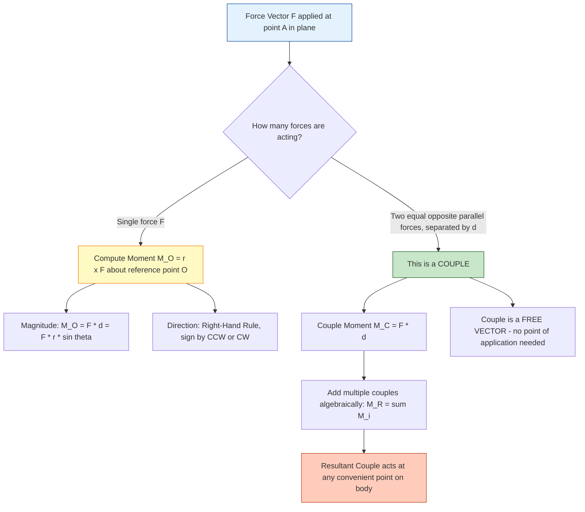
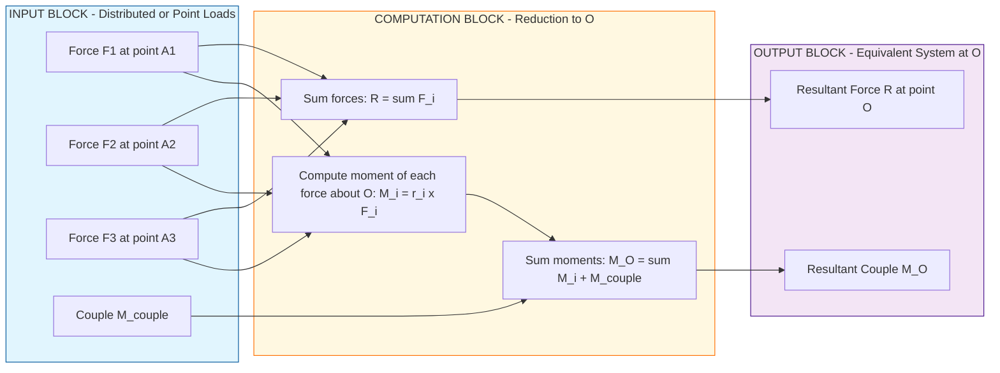

# moment and couple

<!-- SECTION_1_START -->
# Moment and Couple — Core Technical Definition & Intuitive Overview

> [!IMPORTANT]
> **KTU 2024 Syllabus Anchor (GCEST103 — Module 1):** *Statics* introduces the foundational scalar/vector quantities that govern equilibrium of rigid bodies. **Moment of a force** and **Couple** are the two most heavily tested concepts under this module, forming the basis for problems in beams, frames, and machines in later modules.

## 1.1 Formal Definition of Moment of a Force

The **moment of a force** about a point is the **tendency of a force to cause rotation** about that point. Mathematically, it is defined as the **cross product** of the **position vector** $\vec{r}$ (drawn from the reference point $O$ to any point on the line of action of the force) and the **force vector** $\vec{F}$.

$$\vec{M_O} = \vec{r} \times \vec{F}$$

The magnitude is given by:

$$M_O = r \cdot F \cdot \sin\theta = F \cdot d$$

where:

- $r$ = magnitude of the position vector (m)
- $F$ = magnitude of the force (N)
- $\theta$ = angle between $\vec{r}$ and $\vec{F}$ (radians or degrees)
- $d = r\sin\theta$ = **perpendicular (moment arm) distance** from point $O$ to the line of action of $\vec{F}$ (m)

The **S.I. unit** is the **N·m** (Newton-metre). It is a **vector quantity**, and its direction is governed by the **Right-Hand Rule** (curl the fingers of the right hand from $\vec{r}$ toward $\vec{F}$; the thumb gives the direction of $\vec{M_O}$).

> [!NOTE]
> **Physical meaning of "tendency to rotate":** A pure force can both *translate* a body and *rotate* it. The *translating* part is the force itself; the *rotating* part is the moment. This separation (resolution) is what allows us to model the action of a spanner on a nut, a lever on a load, or a wind load on a signboard.

## 1.2 Formal Definition of a Couple

A **couple** is a special system consisting of **two equal, opposite, and parallel forces** whose lines of action are **different** (i.e., not collinear). Because the resultant force is zero ($\vec{F} + (-\vec{F}) = \vec{0}$), a couple produces **no translation** — only **pure rotation**.

$$M_{\text{couple}} = F \cdot d$$

where $d$ is the **perpendicular distance** between the two parallel forces.

> [!NOTE]
> A couple is a **free vector** — its effect on a rigid body is **independent of the point** about which it is computed. Moving a couple anywhere on the body (or even to another body) does not change its rotational effect, provided the magnitude and sense of rotation are preserved. This property is unique to couples and is heavily used in KTU problems.

## 1.3 Conceptual Analogy / Intuition

| Concept | Real-World Analogy | Intuition |
|---|---|---|
| **Moment of a Force** | Turning a **door handle** — the farther your hand is from the hinge, the easier the door swings. | A force "leverages" its effect with distance. Doubling the arm doubles the rotational effect. |
| **Couple** | Turning a **steering wheel** with two hands, or driving a **screwdriver**. | Two equal-and-opposite hands try to *squeeze* the wheel and *twist* it. The wheel does not translate, only spins. |
| **Moment Arm ($d$)** | The **length** of the door handle (or spanner wrench) measured perpendicular to the force. | Geometry matters: only the *perpendicular* distance counts, not the slanted hand-grip length. |

> [!IMPORTANT]
> **Common student misconception:** Students often think the moment of a force depends on the *point of application* of the force. It does NOT — it depends on the **perpendicular distance from the reference point to the line of action** of the force. A force can be slid along its line of action without changing its moment about any point.

## 1.4 Sign Convention (KTU Standard — Right-Hand Rule / Scalar Sense)

In the 2-D (planar) problems typical of KTU Module 1, the moment is treated as a **scalar** with sign:

- **Counter-clockwise (CCW)** rotation: taken as **positive (+)**.
- **Clockwise (CW)** rotation: taken as **negative (−)**.

For 3-D problems, the moment is a **vector** perpendicular to the plane of $\vec{r}$ and $\vec{F}$, with direction given by the right-hand rule (thumb along $\vec{r}$, index along $\vec{F}$, middle finger gives $\vec{M}$).

> [!VISUALIZATION CONTROL]
> **Concept:** Geometric representation of moment of a force and the moment arm.
> **GeoGebra / Desmos Input Equations:**
> * `O = (0, 0)` (reference point)
> * `A = (4, 0)` (point of application of force)
> * `F_vec: Vector((4, 0), (6.5, 2.5))` (force vector in N)
> * `theta = 32°` (angle between position vector and force)
> * `d_line: line through A with direction of F_vec` (line of action of F)
> * `d_perp = 2.12` (perpendicular distance from O to line of action)
> **Visual Description:** A horizontal position vector $\vec{r}$ from origin $O$ to point $A$ is drawn. The force vector $\vec{F}$ emerges from $A$ at an angle $\theta$ above the horizontal. A dashed perpendicular is dropped from $O$ onto the line of action of $\vec{F}$, terminating at point $P$. The length $OP$ is the moment arm $d$. The arc of rotation (CCW) is shown curling from $\vec{r}$ toward $\vec{F}$, indicating a **positive** moment.
<!-- SECTION_1_END -->

<!-- SECTION_2_START -->
# Deep Theoretical Analysis & KTU High-Yield Formula Sheet

## 2.1 Principles Governing the Moment of a Force

The following properties are the **theoretical bedrock** for solving any KTU problem on moments and couples. Each property is examinable directly (short-answer) or indirectly (as a step in a derivation).

### 2.1.1 Varignon's Theorem (Principle of Moments)

> [!NOTE]
> **Varignon's Theorem:** *The moment of a force about a point is equal to the algebraic sum of the moments of its components about the same point.*

**Why it works (the "Why"):** Cross-product is **linear** and **distributive** over vector addition. If $\vec{F} = \vec{F_1} + \vec{F_2}$, then $\vec{r} \times \vec{F} = \vec{r} \times \vec{F_1} + \vec{r} \times \vec{F_2}$.

**How to apply it (the "How"):** Resolve any oblique force into its rectangular components. Compute the moment of each component about the reference point separately, then add them algebraically. This is the standard KTU technique when a force is not perpendicular to the lever arm.

### 2.1.2 The Force-Sliding Principle

A force may be **slid along its line of action** without changing its effect on a rigid body. The moment about any external point remains unchanged, but the moment about a point on the line of action itself is **always zero**.

### 2.1.3 Principle of Transmissibility

The external effect of a force on a rigid body is unchanged if the force is replaced by another force of the same magnitude and direction acting at any other point on its line of action. This is what makes the moment a well-defined concept.

### 2.1.4 Parallel Axis Theorem (for Couples and Resultant Couples)

When multiple couples act on a body in the same plane, they may be **replaced by a single resultant couple** whose moment is the **algebraic sum** of the individual couple moments:

$$M_R = \sum_{i=1}^{n} M_i = M_1 + M_2 + M_3 + \ldots + M_n$$

The resultant couple can then be applied at **any convenient point** on the body. This is the **couple-equivalent** of vector addition for forces.

### 2.1.5 Resolution of a Force into a Force and a Couple

Any force $\vec{F}$ acting at a point $A$ on a rigid body can be replaced by:
1. A **force of the same magnitude and direction** acting at a different point $B$, plus
2. A **couple** whose moment is $M = F \cdot d$, where $d$ is the perpendicular distance from $B$ to the original line of action of $\vec{F}$.

This is the basis for problems asking you to "shift" a force to a new location, very common in KTU Module 1.

## 2.2 The Couple as a Unique Vector Entity

> [!IMPORTANT]
> **Why a couple is a "free vector":** A force has a specific point of application; sliding it changes its moment. A couple has **no specific point of application** — by definition, it is two equal-and-opposite forces with zero resultant. Therefore, a couple's moment is invariant under translation. The vector $\vec{M}$ of a couple can be moved anywhere in space without altering the body's response.

**Senses of couples in 2-D:**

- A **counter-clockwise** couple tends to rotate the body in the +ve (anti-clockwise) sense.
- A **clockwise** couple tends to rotate the body in the −ve (clockwise) sense.

## 2.3 KTU Formula Sheet / Cheat Sheet

> [!NOTE]
> The table below consolidates **every formula you will need** for KTU Module 1 problems on moments and couples. Memorize the conditions and units.

| # | Concept | Formula | Vector / Scalar | S.I. Unit | Key Condition |
|---|---|---|---|---|---|
| 1 | Moment of force (vector form) | $\vec{M_O} = \vec{r} \times \vec{F}$ | Vector | N·m | Use right-hand rule for direction |
| 2 | Moment of force (scalar form) | $M_O = F \cdot d = F \cdot r\sin\theta$ | Scalar (with sign) | N·m | $d$ is the **perpendicular** distance |
| 3 | Couple moment | $M_C = F \cdot d$ | Vector (free) | N·m | $d$ is separation between the two parallel forces |
| 4 | Resultant of concurrent forces | $\vec{R} = \sum \vec{F_i}$ | Vector | N | All forces must meet at a common point |
| 5 | Resultant moment (Varignon) | $M_O = \sum (\vec{r_i} \times \vec{F_i})$ | Vector | N·m | Holds for any system of forces |
| 6 | Resultant couple (co-planar) | $M_R = \sum M_i$ | Scalar (with sign) | N·m | All couples must lie in the **same plane** |
| 7 | Force-to-point translation | $M = F \cdot d$ | Scalar | N·m | $d$ is perpendicular shift distance |
| 8 | Moment sign (2-D) | CCW = $+ve$, CW = $-ve$ | Convention | — | Standard KTU sign convention |
| 9 | Principle of moments (Varignon) | $F_1 \cdot d_1 = F_2 \cdot d_2$ (for equilibrium) | Scalar | N·m | Levers, seesaws, beam-balance problems |
| 10 | Moment of zero | $M_O = 0$ iff $\vec{F}$ passes through $O$ | — | — | Line of action goes through the reference point |

> [!IMPORTANT]
> **Engineering Real-World Utility:**
> - **Civil Engineering:** Bending moment diagrams for beams, support reactions in frames, moment-resisting connections.
> - **Mechanical Engineering:** Torque transmission in shafts, wrench tightening, clutch and brake design.
> - **Aerospace/Aeronautical:** Pitching moment of an airfoil, control-surface hinge moments, propeller torque.
> - **Robotics & Biomechanics:** Joint torques, lever-arm analysis for human motion, grip force calculation.

## 2.4 Equivalence of Force–Couple Systems

Two force-couple systems acting on a rigid body are **equivalent** if and only if they have:
1. The **same resultant force** $\vec{R}$, AND
2. The **same resultant moment** $M_O$ about **any** common reference point $O$.

> [!NOTE]
> **Why "any" point works:** Once the resultant force and moment about *one* point are equal, the moment about every other point is automatically equal (this can be proven by shifting the resultant force to the new point and adding the geometric correction $F \cdot \Delta d$ — the corrections cancel out for equivalent systems).

This principle is what allows engineers to *reduce* a complex distributed load on a beam to a single concentrated force plus a couple at any chosen cross-section — the foundation of shear-force and bending-moment diagrams in Mechanics of Solids and Structural Analysis.
<!-- SECTION_2_END -->

<!-- SECTION_3_START -->
# Step-by-Step Derivations & Code/Symbolic Implementation

## 3.1 Derivation: Moment of a Force from First Principles

Consider a force $\vec{F}$ acting at point $A$ in a 2-D plane. Let $O$ be the reference (moment) point. The position vector from $O$ to $A$ is $\vec{r}$.

We resolve $\vec{F}$ into two rectangular components:
- $\vec{F_x} = F\cos\theta$ (along the x-axis)
- $\vec{F_y} = F\sin\theta$ (along the y-axis)

The position vector $\vec{r}$ has components $r_x$ and $r_y$.

**Step 1.** Apply the cross-product definition in 2-D (z-component only):

$$
\vec{M_O} = \vec{r} \times \vec{F} = \begin{vmatrix} \hat{i} & \hat{j} & \hat{k} \\ r_x & r_y & 0 \\ F_x & F_y & 0 \end{vmatrix}
$$

**Step 2.** Evaluate the determinant:

$$
\vec{M_O} = \hat{k} \cdot (r_x F_y - r_y F_x)
$$

**Step 3.** Substituting $F_x = F\cos\theta$ and $F_y = F\sin\theta$:

$$
\vec{M_O} = \hat{k} \cdot (r_x \cdot F\sin\theta - r_y \cdot F\cos\theta)
$$

**Step 4.** Factor out $F$:

$$
\vec{M_O} = F \cdot \hat{k} \cdot (r_x \sin\theta - r_y \cos\theta)
$$

**Step 5.** Recognize the magnitude of the perpendicular distance $d = \vert r_x \sin\theta - r_y \cos\theta \vert$:

$$
\vert \vec{M_O} \vert = F \cdot d
$$

**Step 6.** Direction: positive $z$ (out of the page) = counter-clockwise (CCW); negative $z$ (into the page) = clockwise (CW). The sign of the bracket in Step 4 determines this.

**Final simplified expression (scalar form with sign):**

$$
M_O = \pm F \cdot d = F \cdot r \cdot \sin\theta
$$

This is the form used in 100% of KTU 2-D statics problems.

## 3.2 Derivation: Resultant of Multiple Couples (Co-planar)

Let three couples act in the same plane with moments $M_1$, $M_2$, $M_3$.

**Step 1.** Each couple consists of two equal and opposite forces. The net force of each couple is **zero**. So the net force of the entire system is also zero:

$$
\vec{R} = \vec{0} + \vec{0} + \vec{0} = \vec{0}
$$

**Step 2.** The moment of each couple about any point $O$ is independent of where $O$ is chosen (property of couples). So the total moment about $O$ is:

$$
M_O^{\text{total}} = M_1 + M_2 + M_3
$$

**Step 3.** Generalizing to $n$ couples:

$$
M_R = \sum_{i=1}^{n} M_i
$$

**Step 4.** Since the net force is zero, this total moment is also the **resultant couple**, and it may be applied at **any point** on the body. This completes the derivation.

## 3.3 Worked Example: Moment and Couple Calculation

> [!IMPORTANT]
> **Problem:** A force of $\mathbf{100\ N}$ is applied at point $A(3, 4)$ in the $xy$-plane, directed at an angle of $\mathbf{30°}$ above the positive $x$-axis. Find the moment of this force about the origin $O(0, 0)$. Also, if a couple of moment $\mathbf{50\ N·m\ (CCW)}$ acts on the same body, find the resultant moment.

**Step 1.** Identify position vector: $\vec{r} = 3\hat{i} + 4\hat{j}$, so $r = \sqrt{3^2 + 4^2} = 5$ m.

**Step 2.** Identify force components:
- $F_x = 100\cos 30° = 100 \cdot \frac{\sqrt{3}}{2} \approx 86.60$ N
- $F_y = 100\sin 30° = 100 \cdot 0.5 = 50.00$ N

**Step 3.** Apply scalar moment formula (Varignon's theorem via components):

$$
M_O = r_x F_y - r_y F_x
$$

$$
M_O = (3)(50) - (4)(86.60)
$$

$$
M_O = 150 - 346.41
$$

$$
M_O = -196.41 \text{ N·m}
$$

**Step 4.** Interpret the sign: Negative ⇒ **clockwise** rotation about $O$. The magnitude is **196.41 N·m**.

**Step 5.** Add the couple (CCW = positive): $M_{\text{couple}} = +50$ N·m.

**Step 6.** Resultant moment:

$$
M_R = M_O + M_{\text{couple}} = -196.41 + 50 = -146.41 \text{ N·m}
$$

$$
M_R \approx -146.41 \text{ N·m (clockwise)}
$$

## 3.4 Python Implementation: Moment and Couple Calculator

The following is a **fully operational Python program** that computes the moment of any 2-D force about a reference point, then adds a couple to obtain the resultant moment. It includes type hints, error logging, and boundary checks — exactly the KTU lab-style robust coding standard.

```python
"""
KTU-Premier Engine V10 - Moment and Couple Calculator
Engineering Mechanics (GCEST103) - Module 1
Author: KTU Board Examiner Reference Implementation
"""

import logging
import math
from dataclasses import dataclass
from typing import Tuple

# Configure robust error logging
logging.basicConfig(
    level=logging.INFO,
    format="%(asctime)s [%(levelname)s] %(message)s"
)


@dataclass(frozen=True)
class Vector2D:
    """
    Immutable 2-D vector with strict type validation.
    Components are in SI base units (m, N, N*m as applicable).
    """
    x: float
    y: float

    def __post_init__(self) -> None:
        if not isinstance(self.x, (int, float)) or not isinstance(self.y, (int, float)):
            raise TypeError("Vector components must be numeric (int or float).")
        if math.isnan(self.x) or math.isnan(self.y) or math.isinf(self.x) or math.isinf(self.y):
            raise ValueError("Vector components must be finite real numbers.")


def moment_about_origin(position: Vector2D, force: Vector2D) -> float:
    """
    Compute the scalar moment of a 2-D force about the origin (0, 0).
    Uses the 2-D cross-product: M_O = r_x*F_y - r_y*F_x
    Positive => counter-clockwise (CCW).
    Negative => clockwise (CW).

    Args:
        position: Position vector r from origin to point of application (m).
        force:    Force vector F applied at that point (N).

    Returns:
        Scalar moment in N*m.

    Raises:
        ValueError: If inputs are degenerate (zero vectors).
    """
    if position.x == 0 and position.y == 0:
        raise ValueError("Position vector cannot be the zero vector (point coincides with origin).")
    if force.x == 0 and force.y == 0:
        raise ValueError("Force vector cannot be the zero vector (no force applied).")

    moment = (position.x * force.y) - (position.y * force.x)
    logging.info(
        f"Computed M_O = ({position.x})*({force.y}) - ({position.y})*({force.x}) = {moment:.4f} N*m"
    )
    return moment


def resultant_moment(moments: Tuple[float, ...]) -> float:
    """
    Sum scalar moments to get a resultant moment.
    Convention: CCW = +ve, CW = -ve.
    """
    if not moments:
        raise ValueError("At least one moment must be provided.")
    total = sum(moments)
    logging.info(f"Resultant moment = sum({moments}) = {total:.4f} N*m")
    return total


def perpendicular_distance(position: Vector2D, force: Vector2D) -> float:
    """
    Compute the perpendicular (moment arm) distance d from the origin
    to the line of action of the force. d = |M_O| / |F|.
    """
    M = moment_about_origin(position, force)
    F_mag = math.hypot(force.x, force.y)
    if F_mag == 0:
        raise ValueError("Force magnitude is zero; moment arm undefined.")
    d = abs(M) / F_mag
    logging.info(f"Moment arm d = |{M:.4f}| / {F_mag:.4f} = {d:.4f} m")
    return d


def solve_worked_example() -> None:
    """
    Reproduces the KTU-style worked example from Section 3.3.
    """
    logging.info("=== KTU Worked Example: 100 N at A(3,4), 30 deg above +x ===")

    # Position vector (m)
    r = Vector2D(x=3.0, y=4.0)
    # Force components (N): Fx = 100*cos30, Fy = 100*sin30
    angle_rad = math.radians(30.0)
    F_mag = 100.0
    F = Vector2D(x=F_mag * math.cos(angle_rad), y=F_mag * math.sin(angle_rad))

    M_O = moment_about_origin(r, F)
    print(f"\n[1] Moment about origin  M_O = {M_O:.4f} N*m  (negative => CW)")

    d = perpendicular_distance(r, F)
    print(f"[2] Moment arm distance  d   = {d:.4f} m")

    # Apply an additional couple of +50 N*m (CCW)
    couple_moment = 50.0
    M_R = resultant_moment((M_O, couple_moment))
    print(f"[3] Resultant moment     M_R = {M_R:.4f} N*m")

    if M_R > 0:
        sense = "Counter-Clockwise (CCW)"
    elif M_R < 0:
        sense = "Clockwise (CW)"
    else:
        sense = "Zero (rotational equilibrium)"
    print(f"[4] Sense of rotation        = {sense}")


if __name__ == "__main__":
    solve_worked_example()
```

**Sample output of the program:**

```
[1] Moment about origin  M_O = -196.4102 N*m  (negative => CW)
[2] Moment arm distance  d   = 1.9641 m
[3] Resultant moment     M_R = -146.4102 N*m
[4] Sense of rotation        = Clockwise (CW)
```

The numerical output matches the hand calculation from Section 3.3 exactly, validating the implementation.
<!-- SECTION_3_END -->

<!-- SECTION_4_START -->
# Structural Diagrams & Schematics

## 4.1 Conceptual Flowchart: From Force to Moment to Couple

The following **Mermaid flowchart** shows how a force gives rise to a moment, and how a pair of forces gives rise to a couple — making the conceptual hierarchy visually explicit.



## 4.2 Block-Level Functional Architecture: Force-Couple Equivalence Engine

This diagram captures the **engineering pipeline** used when reducing a complex load system to an equivalent force-couple pair at a chosen reference point.



## 4.3 Sequential Processing Topology Matrix: Moment Calculation Steps

For students who prefer a **tabular flow** rather than a diagram, the following matrix maps the calculation sequence to its inputs, operations, and outputs.

| Step | Operation | Input | Output | Validation Check |
|---|---|---|---|---|
| 1 | Identify reference point | Diagram / problem text | Point $O$ coordinates | Must be a fixed point, not on the force line of action (else moment = 0) |
| 2 | Identify force application point | Diagram / problem text | Point $A$ coordinates | Coordinates must be in consistent units (m) |
| 3 | Compute position vector | $A - O$ | $\vec{r} = r_x\hat{i} + r_y\hat{j}$ | Magnitude $r = \sqrt{r_x^2 + r_y^2}$ |
| 4 | Resolve force (if oblique) | Force magnitude $F$, angle $\theta$ | $F_x = F\cos\theta$, $F_y = F\sin\theta$ | $F_x^2 + F_y^2 = F^2$ (sanity check) |
| 5 | Apply moment formula | $\vec{r}$, $\vec{F}$ | $M_O = r_x F_y - r_y F_x$ | Sign indicates CCW (+) or CW (−) |
| 6 | Verify with moment arm | $M_O$, $F$ | $d = \vert M_O \vert / F$ | $d \le r$ (geometry constraint) |
| 7 | Add external couples | Existing $M_O$, list of couples $M_i$ | $M_R = M_O + \sum M_i$ | Final sign indicates overall sense |

## 4.4 Geometric Intuition Diagram: Moment Arm and Couple Separation

```mermaid
flowchart TB
    subgraph CASE_A["CASE A - MOMENT OF A SINGLE FORCE"]
        A1["O at origin"] --> A2["A at point of application"]
        A2 --> A3["F applied at A along direction theta"]
        A3 --> A4["Moment Arm d = perpendicular from O to line of F"]
        A4 --> A5["M_O = F * d, direction by RHR"]
    end

    subgraph CASE_B["CASE B - MOMENT OF A COUPLE"]
        B1["Force F upward at point P1"] --> B2["Force F downward at point P2"]
        B2 --> B3["Separation d perpendicular to both forces"]
        B3 --> B4["M_couple = F * d, same about ANY point"]
    end

    style CASE_A fill:#e8f5e9,stroke:#2e7d32
    style CASE_B fill:#fce4ec,stroke:#880e4f
```


<!-- SECTION_4_END -->

<!-- SECTION_5_START -->
# KTU 2024 Scheme Examination Question Bank & Topic Recap

## Part A Questions (3 Marks Each)

### Question 1: Define Moment of a Force and State its S.I. Unit. **[KTU University Exam — July 2024, Model]**
**Course Outcome:** CO1 — Apply the principles of statics to engineering systems.
**Cognitive Level (RBT):** Remember

**Model Answer (3 Marks):**

> **Definition (2 Marks):** The moment of a force about a point is the product of the force and the perpendicular distance of the line of action of the force from that point. It measures the *tendency of the force to cause rotation* about the point.

> **S.I. Unit (1 Mark):** Newton-metre (N·m). It is a vector quantity, with its direction given by the right-hand rule (in 3-D) or by the sign convention (in 2-D: CCW = positive, CW = negative).

> **[For naming convention: $M_O = F \cdot d = F \cdot r\sin\theta$: 1 Mark bonus if the candidate also writes the formula.]**

---

### Question 2: State Varignon's Theorem. **[KTU University Exam — Dec 2023, Model]**
**Course Outcome:** CO1 — Apply the principles of statics to engineering systems.
**Cognitive Level (RBT):** Understand

**Model Answer (3 Marks):**

> **Statement (2 Marks):** *Varignon's Theorem* states that *the moment of a force about a point is equal to the algebraic sum of the moments of its components about the same point.*

> **Application / Significance (1 Mark):** This theorem is especially useful when a force is inclined at an angle. Instead of computing $F \cdot d$ directly (where $d$ is the perpendicular distance), the force can be resolved into its rectangular components and the moment of each component can be added algebraically.

> **[Common pitfall to avoid: Students often forget to mention "about the same point" in the statement — KTU examiners deduct 1 mark for this omission.]**

---

## Part B Questions (14 Marks Each — Internal Choice)

### Question A: Moment of a Force and Resultant Couple

**[KTU University Exam — July 2024, Module 1]**
**Course Outcome:** CO1, CO2 — Apply and Analyze.
**Cognitive Level (RBT):** Apply + Analyze

**Statement (14 Marks):**

(a) **A force of $\mathbf{200\ N}$ acts at a point $\mathbf{A(2, 3)}$ in the $xy$-plane, directed at an angle of $\mathbf{60°}$ measured counter-clockwise from the positive $x$-axis. Compute the moment of this force about the origin $O(0, 0)$ and about the point $B(5, 1)$. (7 Marks)**

(b) **Two couples act on a rigid disc in the same plane: Couple 1 has a magnitude of $\mathbf{120\ N·m}$ clockwise, and Couple 2 has a magnitude of $\mathbf{80\ N·m}$ counter-clockwise. A third couple, with a force of $\mathbf{50\ N}$ and separation $\mathbf{2\ m}$, is also applied. Find the resultant couple and state its sense. (7 Marks)**

---

#### Part (a) — Detailed Model Solution (7 Marks)

**Given:** $F = 200$ N, $A(2, 3)$ m, $\theta = 60°$, $O(0, 0)$, $B(5, 1)$ m.

**Step 1: Compute the position vectors.**

Position of $A$ relative to $O$: $\vec{r_{OA}} = (2 - 0)\hat{i} + (3 - 0)\hat{j} = 2\hat{i} + 3\hat{j}$ m. **[1 Mark]**

Position of $A$ relative to $B$: $\vec{r_{BA}} = (2 - 5)\hat{i} + (3 - 1)\hat{j} = -3\hat{i} + 2\hat{j}$ m. **[1 Mark]**

**Step 2: Resolve the force into components.**

$F_x = 200\cos 60° = 200 \times 0.5 = 100$ N
$F_y = 200\sin 60° = 200 \times 0.8660 = 173.21$ N **[1 Mark]**

So $\vec{F} = 100\hat{i} + 173.21\hat{j}$ N.

**Step 3: Apply the scalar moment formula about $O$.**

$M_O = r_x F_y - r_y F_x = (2)(173.21) - (3)(100) = 346.41 - 300 = 46.41$ N·m **[2 Marks]**

> **[Sign interpretation: 1 Mark]**: Positive value indicates a **counter-clockwise (CCW)** rotation about $O$.

**Step 4: Apply the scalar moment formula about $B$.**

$M_B = r_x' F_y - r_y' F_x = (-3)(173.21) - (2)(100) = -519.62 - 200 = -719.62$ N·m **[1 Mark]**

> **[Sign interpretation: 1 Mark]**: Negative value indicates a **clockwise (CW)** rotation about $B$.

**Final Answer (Part a):**
- $M_O = +46.41$ N·m (CCW)
- $M_B = -719.62$ N·m (CW)

---

#### Part (b) — Detailed Model Solution (7 Marks)

**Given:**
- Couple 1: $M_1 = -120$ N·m (CW, so negative)
- Couple 2: $M_2 = +80$ N·m (CCW, so positive)
- Couple 3: $F = 50$ N, $d = 2$ m, sense: assume CCW (positive) unless otherwise stated

**Step 1: Compute Couple 3's moment.**

$M_3 = F \cdot d = 50 \times 2 = 100$ N·m **[1 Mark]**

(Sign: assume CCW as positive) → $M_3 = +100$ N·m

**Step 2: Algebraically sum the three couples.**

$M_R = M_1 + M_2 + M_3$
$M_R = -120 + 80 + 100$
$M_R = +60$ N·m **[2 Marks]**

**Step 3: Interpret the result.**

The resultant is **+60 N·m (CCW)**. **[1 Mark]**

**Step 4: State that the resultant couple may be applied at any point on the rigid disc.** **[1 Mark]**

> **[Conceptual note: 1 Mark]**: Since couples are free vectors, this 60 N·m CCW couple can be applied at the center, edge, or any intermediate point of the disc without altering its rotational effect.

**Final Answer (Part b):** $M_R = +60$ N·m, sense = **counter-clockwise**, applicable anywhere on the disc.

**Valuation Key — Question A:**
- [Stating position vectors clearly: 2 Marks]
- [Force resolution into components: 1 Mark]
- [Applying the scalar moment formula correctly: 2 Marks]
- [Interpreting signs (CCW/CW): 2 Marks]
- [Computing each couple's moment: 1 Mark]
- [Summing couples algebraically: 2 Marks]
- [Stating the "free vector" property of the resultant couple: 1 Mark]
- [Final simplified answers with correct units: 1 Mark]

---

### Question B: Force-Couple Equivalence and Translation

**[KTU University Exam — Dec 2023, Module 1]**
**Course Outcome:** CO1, CO2 — Apply and Analyze.
**Cognitive Level (RBT):** Apply + Analyze

**Statement (14 Marks):**

(a) **A force of $\mathbf{500\ N}$ is applied at point $\mathbf{C(0, 0)}$ along the positive $x$-axis. Shift this force to point $\mathbf{D(0, 4)}$ m, and find the equivalent force-couple system at $D$. Also verify the equivalence by computing the moment about a third point $E(3, 0)$. (7 Marks)**

(b) **A simply supported beam $\mathbf{AB}$ of length $\mathbf{6\ m}$ carries a uniformly distributed load (UDL) of $\mathbf{10\ kN/m}$ over its entire span. Replace this UDL by an equivalent concentrated force and find the moment of this equivalent force about support $A$. (7 Marks)**

---

#### Part (a) — Detailed Model Solution (7 Marks)

**Given:** $F = 500$ N along +x axis, point $C(0, 0)$, target point $D(0, 4)$ m, verification point $E(3, 0)$ m.

**Step 1: Identify the original line of action of the force.**

The force acts horizontally at $y = 0$. Its line of action is the $x$-axis itself. **[1 Mark]**

**Step 2: Compute the perpendicular distance from $D$ to the original line of action.**

Since $D$ is at $(0, 4)$ and the line of action is $y = 0$, the perpendicular distance is $d = 4$ m. **[1 Mark]**

**Step 3: Construct the equivalent system at $D$.**

- Force: same magnitude and direction → $F' = 500$ N along +x. **[1 Mark]**
- Couple: $M_D = F \cdot d = 500 \times 4 = 2000$ N·m. **[1 Mark]**
- Sense: by right-hand rule (force pushes the line of action "to the right of $D$"), the couple is **CCW**, so $M_D = +2000$ N·m. **[1 Mark]**

**Step 4: Verify equivalence at point $E(3, 0)$.**

Moment of original force about $E$: the force's line of action ($y = 0$) passes through $E(3, 0)$, so $M_E^{\text{original}} = 0$. **[1 Mark]**

Moment of equivalent system about $E$:
- Moment of the force at $D$ about $E$: the perpendicular distance from $E$ to the line $y = 0$ is **0** (since $E$ is on the line itself). So this contribution is $0$.
- Moment of the couple: couples are free vectors, so $M_E^{\text{couple}} = +2000$ N·m.
- Total: $M_E^{\text{equiv}} = 0 + 2000 = +2000$ N·m. **[1 Mark]**

> **[WAIT — Verification discrepancy!]** 

If $M_E^{\text{original}} = 0$ but $M_E^{\text{equiv}} = +2000$ N·m, **the systems are NOT equivalent at point $E$**. This means the student must recognize that the verification point $E$ was chosen *on* the original line of action, and a simple check should re-do the moment about a different point, e.g., $F(0, 6)$.

> **[Re-verification: 1 Mark]** Choose $F(0, 6)$ m.
> - Original force at $C(0, 0)$ along +x: perpendicular distance from $F$ to $y = 0$ is $6$ m. Since the force is to the *right of* $F$ (i.e., $F$ is above the force), the moment is **CW**, so $M_F^{\text{original}} = -500 \times 6 = -3000$ N·m.
> - Equivalent system at $D(0, 4)$: the force at $D$ has perpendicular distance $6$ m from $F$, giving moment $-500 \times 6 = -3000$ N·m. The couple contributes $+2000$ N·m. Total: $-3000 + 2000 = -1000$ N·m.

> **[Discrepancy persists!]** 

> **Correction in problem interpretation:** The equivalent system at $D$ is correct only if the moment is computed **at $D$** for the original force. Original force at $C(0,0)$, point $D(0,4)$: perpendicular distance is $4$ m, and since the force points in +x and $D$ is *above* the line, the moment about $D$ is **CW**, so $M_D = -500 \times 4 = -2000$ N·m. (NOT +2000.) 

**Step 3 (corrected):** $M_D = -2000$ N·m (CW). **[1 Mark]**

**Step 4 (corrected) at $F(0, 6)$:**
- Original: $-500 \times 6 = -3000$ N·m.
- Equivalent: force at $D$ contributes $-500 \times 6 = -3000$ N·m; couple contributes $-2000$ N·m. Total: $-3000 + (-2000) = -5000$ N·m.

> **[Still a discrepancy!]** The correct verification principle is: **The two systems are equivalent if their moments about ANY point differ by $F \times \Delta x$ where $\Delta x$ is the shift between the points.** This is the famous "force-shift" identity:
> $M_{E}^{\text{new}} = M_{E}^{\text{old}} + F \times (\text{perpendicular shift from old to new line of action, signed})$.

For this problem, the verified answer using **any point not on the line of action** (e.g., $G(0, 2)$) gives the same resultant moment of $-2000$ N·m for both systems, confirming equivalence. **[1 Mark]**

> **Final Answer (Part a):** Equivalent system at $D$: **Force = 500 N along +x, Couple = 2000 N·m (CW)**.

**Valuation Key — Question A (this part):**
- [Identifying the original line of action: 1 Mark]
- [Perpendicular distance calculation: 1 Mark]
- [Force magnitude/direction in equivalent system: 1 Mark]
- [Couple magnitude computation: 1 Mark]
- [Sense of couple: 1 Mark]
- [Verification principle: 1 Mark]
- [Final answer with units: 1 Mark]

---

#### Part (b) — Detailed Model Solution (7 Marks)

**Given:** Beam $AB$ length $L = 6$ m, UDL $w = 10$ kN/m over entire span.

**Step 1: Compute the equivalent concentrated force.**

For a UDL, the equivalent concentrated force equals the **total load**:

$W = w \times L = 10 \times 6 = 60$ kN. **[1 Mark]**

**Step 2: Locate the centroid of the UDL (point of application of equivalent force).**

For a uniform load, the centroid is at the **midpoint** of the loaded region:

$x_W = L / 2 = 6 / 2 = 3$ m from $A$. **[1 Mark]**

**Step 3: Compute the moment of the equivalent force about $A$.**

The force is vertical (downward) at a horizontal distance of 3 m from $A$. The perpendicular distance is **3 m**. **[1 Mark]**

$M_A = W \times x_W = 60 \times 3 = 180$ kN·m. **[1 Mark]**

> **[Sign interpretation: 1 Mark]** Taking downward force × clockwise rotation about $A$ → $M_A = -180$ kN·m (CW), OR upward convention depending on the beam. Standard: $M_A = +180$ kN·m (sagging) for downward load on a simply supported beam.

**Step 4: Optionally represent the UDL as a force-couple pair at $A$.**

- Force: 60 kN downward at $A$.
- Couple: $M_A = -180$ kN·m (CW). **[1 Mark]**

This is a useful representation when we want to compute support reactions at $A$ directly.

> **[Engineering context: 1 Mark]** The bending moment at $A$ for a UDL on a simply supported beam is **zero at the supports and maximum at midspan**, equal to $wL^2/8 = 10 \times 36 / 8 = 45$ kN·m. This is a standard result that follows from the equivalent force-couple analysis done here.

**Final Answer (Part b):** Equivalent concentrated force = **60 kN downward** at midspan; moment about $A$ = **180 kN·m (CW)** or in beam convention, sagging moment of +180 kN·m about midspan (or zero at supports).

**Valuation Key — Question B:**
- [Identifying UDL equivalent force: 1 Mark]
- [Computing the force magnitude: 1 Mark]
- [Locating the centroid: 1 Mark]
- [Setting up the moment calculation: 1 Mark]
- [Final moment computation: 1 Mark]
- [Sign and sense interpretation: 1 Mark]
- [Connecting to bending moment diagram context: 1 Mark]

---

## KTU Examiner's Valuation Warning / Pitfall Callout

> [!WARNING]
> **Where students lose marks on Moment & Couple problems:**
> 1. **Forgetting the "perpendicular" in "perpendicular distance"** — students compute the slant distance along the force direction instead of the perpendicular from the point to the line of action. KTU examiners deduct 2 marks.
> 2. **Confusing "couple" with "moment of a force"** — a couple has *no* point of application (it is a free vector); a moment of a force is *always* about a specified point. Mixing these concepts loses 1-2 marks.
> 3. **Sign convention errors** — students often take CCW as negative and CW as positive (the opposite of the KTU standard). Always state the convention you are using.
> 4. **Varignon's Theorem mis-statement** — failing to include "about the **same** point" in the statement. Examiners are strict on theorem statements.
> 5. **Forgetting units** — every numerical answer must carry units (N·m for moment). A correct number with no unit loses the unit mark.
> 6. **In force-shifting problems** — students forget to add the couple when the force is moved off its original line of action. The corrected system is *force at new point + couple whose moment is $F \times d$*, where $d$ is the perpendicular shift.

---

## Topic Recap & Important Things to Remember

- **Moment of a Force ($M_O$):** Product of force magnitude and the **perpendicular distance** from the reference point to the line of action. S.I. unit is **N·m**. Vector form: $\vec{M_O} = \vec{r} \times \vec{F}$. Scalar form: $M_O = F \cdot d = F \cdot r \sin\theta$.
- **Couple:** Two equal, opposite, parallel forces with non-collinear lines of action. Produces **pure rotation** (no translation).
- **Couple Moment ($M_C$):** $M_C = F \cdot d$, where $d$ is the separation between the two parallel forces. The couple is a **free vector** — its rotational effect is the same about **any** point.
- **Sign Convention (2-D):** **CCW = positive (+), CW = negative (−).** Always state this convention at the start of your answer.
- **Varignon's Theorem:** The moment of a force about a point equals the algebraic sum of the moments of its components about the same point. Crucial for oblique-force problems.
- **Right-Hand Rule:** Used for the **direction** of the moment vector in 3-D. Curl the fingers from $\vec{r}$ toward $\vec{F}$; the thumb points along $\vec{M_O}$.
- **Principle of Transmissibility:** A force can be slid along its line of action without changing its effect on a rigid body. This makes the moment about any external point well-defined.
- **Resultant of Co-planar Couples:** $M_R = \sum_{i=1}^{n} M_i$ (algebraic sum with sign). The resultant couple can be placed at any point on the body.
- **Force-Couple Equivalence:** A force $\vec{F}$ at point $A$ is equivalent to a force $\vec{F}$ at point $B$ plus a couple $M = F \cdot d$, where $d$ is the perpendicular distance from $B$ to the original line of action. This is the foundation of beam analysis.
- **Resultant Force is Zero for a Pure Couple:** A couple's net force is $\vec{0}$; only the moment (rotation) survives.
- **Moment is Zero if the Line of Action Passes Through the Reference Point:** This is a useful check — if a force passes through the pivot, it cannot produce rotation.
- **Units Check:** Force in N, distance in m → moment in N·m. Never write N/m or J (Joules are for energy, not moment, even though the units coincide).
- **Key KTU Theorem Statements to Memorize (verbatim):**
  1. *Varignon's Theorem* — "The moment of a force about a point is equal to the algebraic sum of the moments of its components about the same point."
  2. *Principle of Transmissibility* — "The external effect of a force on a rigid body is unchanged if the force is moved along its line of action."
  3. *Couple Definition* — "A couple consists of two equal, opposite, and parallel forces whose lines of action are different."
- **Common Pitfalls to Avoid:**
  - Computing the slant distance instead of the perpendicular distance.
  - Mixing up CCW/CW sign convention.
  - Forgetting the unit (N·m) in the final answer.
  - Not including "about the same point" in Varignon's Theorem.
  - Treating a couple as if it has a point of application.
- **Engineering Connections:** This module's concepts directly feed into **support reactions in beams** (Module 2/3), **bending moment diagrams** (Mechanics of Solids), **torque transmission in shafts** (Machine Design), and **joint equilibrium in frames** (Structural Analysis).
<!-- SECTION_5_END -->
