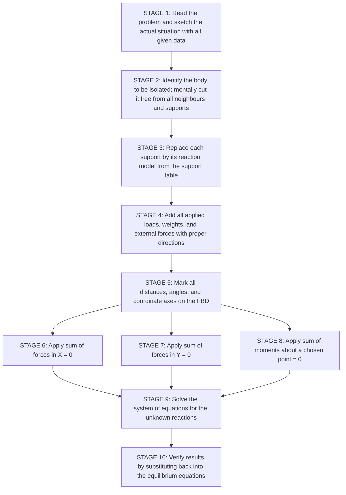
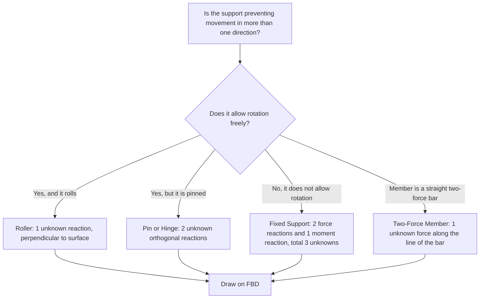
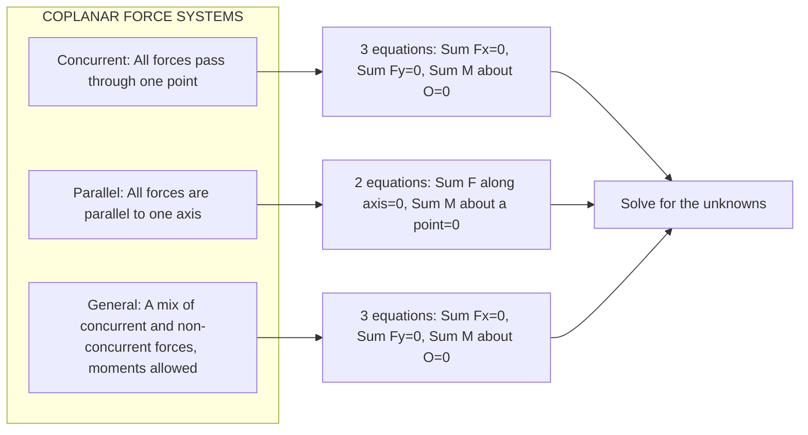
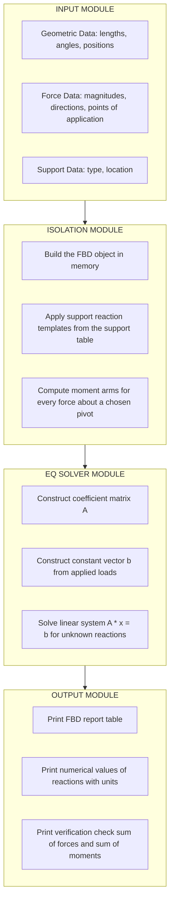
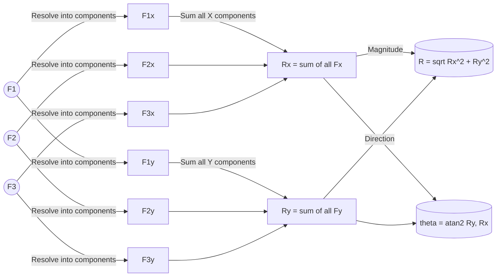

# resultants Equilibrium: system isolation and the free-body diagram

<!-- SECTION_1_START -->
# Resultants, Equilibrium, System Isolation & Free-Body Diagrams

## 1. Core Technical Definition & Intuitive Overview

### 1.1 Formal Academic Definition (KTU 2024 Syllabus Terminology)

> [!IMPORTANT]
> **Resultant of a Force System:** A single force (and/or couple moment) that produces the same external effect on a rigid body as the original system of forces and moments acting on the body.

In vector form, the resultant force $\vec{R}$ of a concurrent coplanar force system is:

$$\vec{R} = \sum_{i=1}^{n} \vec{F_i} = \vec{F_1} + \vec{F_2} + \ldots + \vec{F_n}$$

> [!IMPORTANT]
> **Equilibrium State:** A particle or rigid body is said to be in equilibrium when the **resultant of all external forces** and the **resultant of all external moments** acting on it are both equal to zero.

Mathematically, the two equilibrium conditions are:

$$\sum \vec{F} = 0 \quad \text{and} \quad \sum \vec{M} = 0$$

> [!IMPORTANT]
> **System Isolation (Freeing the Body):** The analytical process of mentally separating a chosen body from all surrounding bodies and supports, so that the body can be studied independently as a free entity.

> [!IMPORTANT]
> **Free-Body Diagram (FBD):** A simplified pictorial representation of a body (or a subsystem) isolated from its environment, on which **all external forces, moments, and support reactions** acting on the body are clearly shown as vectors with proper magnitudes, directions, and points of application.

The FBD is the **single most important first step** in solving any statics problem — without it, no equilibrium equation can be correctly written.

---

### 1.2 Conceptual Analogy / Intuitive Build-Up

Imagine you are pulling a heavy suitcase using **three ropes** held by three friends. Each friend applies a different pull at a different angle. The suitcase actually moves as if pulled by a *single* combined tug — that combined tug is the **resultant**.

Now imagine the suitcase is sitting perfectly still on the floor. The pull of the ropes is being exactly cancelled by friction and gravity. The suitcase is in **equilibrium** — the net push and the net twist on it are both zero.

To figure out *how strongly* each friend should pull (or to check whether the suitcase will tip over), you cannot look at the actual picture anymore — it is too cluttered. So you mentally **"cut the suitcase free"** from the floor and the ropes, and redraw **only the suitcase with all the pushes and pulls drawn as arrows**. That clean drawing is your **Free-Body Diagram**.

> [!NOTE]
> **Key Intuition:** A Free-Body Diagram is like a *budget chart* for forces — it shows where every "force rupee" comes from and where it goes, so the accountant (the student) can balance the books (write $\sum F = 0$ and $\sum M = 0$).

---

### 1.3 Physical Constants & Standard Metrics (Bolded)

* The acceleration due to gravity at the surface of the Earth is **$g = 9.81 \text{ m/s}^2$** (or **$9.8 \text{ m/s}^2$** for most textbook problems).
* Unit of force in SI: **Newton (N)**, where $1 \text{ N} = 1 \text{ kg} \cdot \text{m/s}^2$.
* Unit of moment: **Newton-metre (N·m)**.
* A body in equilibrium has **zero linear acceleration** and **zero angular acceleration**.

---

### 1.4 GeoGebra / Desmos Visualization

> [!VISUALIZATION CONTROL]
> **Concept:** Parallelogram Law of Vector Addition for 2D Resultant
> **GeoGebra / Desmos Input Equations:**
> * `F1 = (4, 2)` — Force vector 1 in Newtons
> * `F2 = (3, 5)` — Force vector 2 in Newtons
> * `R = F1 + F2` — Resultant vector
> * Parallelogram constructed with `F1`, `F2` and their translated copies
> **Visual Description:** The student will see two arrows $\vec{F_1}$ and $\vec{F_2}$ drawn from the common origin, with the parallelogram completed and the diagonal representing the resultant $\vec{R}$. The X and Y components of the resultant are read off the axes directly.

---

## 2. Deep Theoretical Analysis & KTU High-Yield Formula Sheet

<!-- SECTION_2_START -->
# Deep Theory & KTU High-Yield Formula Sheet

## 2.1 Operational Steps in Solving a Statics Problem

The discipline of Engineering Mechanics always follows the **3-Stage Pipeline** below:

1. **Stage 1 — Conceptualisation & Sketch:** Draw a neat schematic of the actual physical situation. Mark all geometric data (lengths, angles, positions of supports).
2. **Stage 2 — Free-Body Diagram Construction:** Isolate the body, replace all supports by their reaction components, and show all applied loads.
3. **Stage 3 — Equilibrium Equations:** Apply $\sum F_x = 0$, $\sum F_y = 0$, and $\sum M = 0$ to solve for the unknowns.

> [!NOTE]
> **Examiner's Rule of Thumb:** Marks are awarded in KTU for *each* stage. Skipping the FBD almost always costs **2 to 3 marks** in a 14-mark question.

---

## 2.2 Components of a Force in 2D

Any planar force $\vec{F}$ making an angle $\theta$ with the positive X-axis can be resolved as:

$$F_x = F \cos\theta$$
$$F_y = F \sin\theta$$

The reverse — combining components back into a single resultant:

$$R = \sqrt{R_x^2 + R_y^2}, \quad \theta_R = \tan^{-1}\!\left(\frac{R_y}{R_x}\right)$$

where $R_x = \sum F_x$ and $R_y = \sum F_y$.

---

## 2.3 The Three Equilibrium Equations (Coplanar Force System)

A rigid body in 2D has **three degrees of freedom** (translation along X, translation along Y, rotation about Z). Hence there are **three independent equilibrium equations**:

$$\sum F_x = 0 \quad \text{(force balance along X)}$$
$$\sum F_y = 0 \quad \text{(force balance along Y)}$$
$$\sum M_O = 0 \quad \text{(moment balance about an arbitrary point O)}$$

> [!IMPORTANT]
> The moment equation can be taken about **any** point in the plane. Strategically choosing a point where **two unknown reaction lines intersect** eliminates those unknowns from the moment equation — this is the *Art of Choosing the Moment Centre*.

---

## 2.4 Types of 2D Supports and Their Reaction Models

The reaction shown on the FBD depends entirely on the support type. Memorising the table below is **mandatory** for KTU answers.

> [!NOTE]
> **Support Reaction Cheat Sheet** — Every support shown in a problem must be converted to its equivalent reaction representation on the FBD.

| # | Support Type | Symbolic Picture | Reaction Components on FBD | Number of Unknowns |
|---|---|---|---|---|
| 1 | **Smooth Roller** | Circle on a plane | One force $\perp$ to the rolling surface | **1** |
| 2 | **Smooth Hinge / Pin** | Triangle with a pin | Two orthogonal components ($H_x$, $V_y$) | **2** |
| 3 | **Fixed Hinge (Short Link)** | Straight link / two-force member | One force along the link's axis | **1** |
| 4 | **Rough Surface / Roller-Slider** | Circle on hatched plane | One force $\perp$ to surface **+** one friction force $\parallel$ to surface | **2** |
| 5 | **Fixed Support (Wall)** | Hatched block with rod inside | Two orthogonal forces ($H_x$, $V_y$) **+** a moment $M$ | **3** |
| 6 | **Two-Force Member (Pin Jointed Straight Bar)** | Straight bar with forces only at two ends | A single force along the bar axis | **1** |

> [!WARNING]
> Common Mistake: Treating a fixed support as a pin and forgetting the **reaction moment $M$**. This loses 1 mark and makes the system unsolvable.

---

## 2.5 Parallelogram Law vs Triangle Law

* **Parallelogram Law:** When two forces $\vec{F_1}$ and $\vec{F_2}$ act at a point, the resultant $\vec{R}$ is the diagonal of the parallelogram formed with $\vec{F_1}$ and $\vec{F_2}$ as adjacent sides.
* **Triangle Law (Head-to-Tail Rule):** Place the tail of $\vec{F_2}$ at the head of $\vec{F_1}$. The line joining the tail of $\vec{F_1}$ to the head of $\vec{F_2}$ is $\vec{R}$.

Both are mathematically identical; the triangle law is more convenient for **three or more forces**.

---

## 2.6 KTU Formula Sheet / Cheat Sheet

| # | Concept | Governing Equation | Symbol Meaning | Units |
|---|---|---|---|---|
| 1 | Force component | $F_x = F\cos\theta$, $F_y = F\sin\theta$ | $\theta$ = angle with X-axis | N |
| 2 | Magnitude of resultant | $R = \sqrt{R_x^2 + R_y^2}$ | $R_x, R_y$ = summed components | N |
| 3 | Direction of resultant | $\theta_R = \tan^{-1}(R_y / R_x)$ | measured from +X axis | deg / rad |
| 4 | Equilibrium of forces | $\sum F_x = 0, \sum F_y = 0$ | algebraic sum of components | — |
| 5 | Equilibrium of moments | $\sum M_O = \sum (F \cdot d) = 0$ | $d$ = perpendicular distance | N·m |
| 6 | Varignon's Theorem | $\sum M_O = \sum (x_i F_{yi} - y_i F_{xi})$ | moment of resultant = sum of moments | N·m |
| 7 | Body weight | $W = m \cdot g$ | $m$ = mass, $g = 9.81$ | N |
| 8 | Two-force member | $F$ along line joining the two pin points | only axial force | N |

---

## 2.7 Real-World Engineering Utility

| Field | Application |
|---|---|
| **Structural Engineering** | Designing beams, trusses, and frames; computing reaction forces at column bases. |
| **Mechanical Engineering** | Crank-slider mechanism analysis, robotic arm torque computation, gear meshing forces. |
| **Civil / Bridge Design** | Cable-stayed bridges — every cable's tension is found via FBD of the joint. |
| **Aerospace** | Computing lift, drag, thrust and weight resultant on an airfoil. |
| **Ship Hydrostatics** | Buoyancy + weight resultant determines whether a vessel floats level. |
| **Biomechanics** | Analysis of forces on human joints (knee, hip) during standing and walking. |

> [!NOTE]
> The FBD technique is the **gateway to all advanced topics** in solid mechanics, fluid mechanics, machine design, and structural analysis. Once a student masters the FBD for statics, dynamics follows naturally.

---

## 3. Step-by-Step Derivations & Code/Symbolic Implementation

<!-- SECTION_3_START -->
# Step-by-Step Derivations, Worked Examples & Code

## 3.1 Exhaustive Derivation: Resultant of Three Concurrent Coplanar Forces

### Problem Setup
Three forces act at a single point $O$:
* $\vec{F_1} = 100 \text{ N}$ at $\theta_1 = 30^\circ$ from the +X axis.
* $\vec{F_2} = 150 \text{ N}$ at $\theta_2 = 120^\circ$ from the +X axis.
* $\vec{F_3} = 80 \text{ N}$ at $\theta_3 = 230^\circ$ from the +X axis.

### Step 1 — Resolve each force into X and Y components

For $\vec{F_1}$:

$$F_{1x} = 100 \cos 30^\circ = 100 \times 0.8660 = 86.60 \text{ N}$$
$$F_{1y} = 100 \sin 30^\circ = 100 \times 0.5000 = 50.00 \text{ N}$$

For $\vec{F_2}$:

$$F_{2x} = 150 \cos 120^\circ = 150 \times (-0.5000) = -75.00 \text{ N}$$
$$F_{2y} = 150 \sin 120^\circ = 150 \times 0.8660 = 129.90 \text{ N}$$

For $\vec{F_3}$:

$$F_{3x} = 80 \cos 230^\circ = 80 \times (-0.6428) = -51.42 \text{ N}$$
$$F_{3y} = 80 \sin 230^\circ = 80 \times (-0.7660) = -61.28 \text{ N}$$

### Step 2 — Algebraically sum the X components

$$R_x = \sum F_x = F_{1x} + F_{2x} + F_{3x}$$
$$R_x = 86.60 + (-75.00) + (-51.42) = -39.82 \text{ N}$$

### Step 3 — Algebraically sum the Y components

$$R_y = \sum F_y = F_{1y} + F_{2y} + F_{3y}$$
$$R_y = 50.00 + 129.90 + (-61.28) = 118.62 \text{ N}$$

### Step 4 — Magnitude of the resultant

$$R = \sqrt{R_x^2 + R_y^2} = \sqrt{(-39.82)^2 + (118.62)^2}$$
$$R = \sqrt{1585.63 + 14070.70} = \sqrt{15656.33}$$
$$R = 125.13 \text{ N}$$

### Step 5 — Direction of the resultant

$$\theta_R = \tan^{-1}\!\left(\frac{R_y}{R_x}\right) = \tan^{-1}\!\left(\frac{118.62}{-39.82}\right) = \tan^{-1}(-2.979)$$

Since $R_x < 0$ and $R_y > 0$, the resultant lies in the **second quadrant**.

The reference angle is $\tan^{-1}(2.979) = 71.43^\circ$.

Therefore, the angle from the **positive X-axis** (measured counter-clockwise) is:

$$\theta_R = 180^\circ - 71.43^\circ = 108.57^\circ$$

### Final Result

> The resultant of the three forces is $\vec{R} = 125.13 \text{ N}$ at an angle of $\theta_R = 108.57^\circ$ from the positive X-axis.

---

## 3.2 Exhaustive Derivation: Equilibrium of a Ladder (Classic KTU Problem)

### Problem Statement
A uniform ladder of length $L = 4 \text{ m}$ and weight $W = 200 \text{ N}$ rests against a smooth vertical wall at its top, and on a rough horizontal floor at its bottom. The ladder makes an angle $\alpha = 60^\circ$ with the horizontal. Find the reaction at the floor and the friction force required for equilibrium.

### Step 1 — Draw the actual schematic
Ladder inclined at $60^\circ$ to the floor. The top touches a smooth wall (only **normal** reaction $N_W$ perpendicular to the wall, i.e., horizontal). The bottom rests on a rough floor (vertical normal $N_F$ and horizontal friction $F$).

### Step 2 — Construct the Free-Body Diagram
The isolated ladder shows:
* $W = 200 \text{ N}$ acting at the **midpoint** of the ladder (since it is uniform) — direction vertically downward.
* $N_W$ at the top — direction **horizontal**, pointing away from the wall (i.e., to the left, towards the ladder).
* $N_F$ at the bottom — direction **vertically upward**.
* $F$ at the bottom — direction **horizontal**, pointing to the right (preventing slip).

### Step 3 — Apply equilibrium equations

**Force balance along X:**

$$\sum F_x = 0 \implies N_W - F = 0 \implies F = N_W$$

**Force balance along Y:**

$$\sum F_y = 0 \implies N_F - W = 0 \implies N_F = W = 200 \text{ N}$$

**Moment balance about the foot of the ladder (point B):**

Choosing point B eliminates $N_F$ and $F$ from the equation. Only $W$ and $N_W$ contribute.

The perpendicular distance from B to the line of action of $W$ is the **horizontal distance** from B to the centre of the ladder:

$$d_W = \frac{L}{2} \cos\alpha = \frac{4}{2} \cos 60^\circ = 2 \times 0.5 = 1.0 \text{ m}$$

The perpendicular distance from B to the line of action of $N_W$ is the **vertical distance** from B to the top of the ladder:

$$d_{N_W} = L \sin\alpha = 4 \times \sin 60^\circ = 4 \times 0.866 = 3.464 \text{ m}$$

Taking counter-clockwise as positive:

$$\sum M_B = 0 \implies N_W \cdot d_{N_W} - W \cdot d_W = 0$$
$$N_W \times 3.464 - 200 \times 1.0 = 0$$
$$N_W = \frac{200}{3.464} = 57.74 \text{ N}$$

### Step 4 — Solve for the friction force

From the X-equation:

$$F = N_W = 57.74 \text{ N}$$

### Final Answer

| Quantity | Value | Direction |
|---|---|---|
| Floor normal reaction $N_F$ | **200 N** | Vertically upward |
| Wall normal reaction $N_W$ | **57.74 N** | Horizontal (away from wall) |
| Friction force $F$ | **57.74 N** | Horizontal (towards wall) |

> [!NOTE]
> **Verification of friction adequacy:** The required coefficient of friction is $\mu = F / N_F = 57.74 / 200 = 0.289$. The floor must provide at least this much friction, otherwise the ladder slips.

---

## 3.3 Python Implementation: 2D Resultant Calculator with FBD Reporter

```python
"""
KTU Engineering Mechanics - GCEST103
Module 1: Resultant and Equilibrium of Coplanar Force System
Tool: 2D Resultant Calculator with FBD textual reporting.
"""

import math
from dataclasses import dataclass
from typing import List, Tuple


@dataclass(frozen=True)
class Force2D:
    """A single 2D force vector with magnitude and angle (in degrees from +X axis)."""
    magnitude: float           # in Newtons, must be >= 0
    angle_deg: float           # measured CCW from +X axis
    label: str = "F"           # identifier for the FBD report

    def components(self) -> Tuple[float, float]:
        """Return (Fx, Fy) components in Newtons."""
        theta = math.radians(self.angle_deg)
        fx = self.magnitude * math.cos(theta)
        fy = self.magnitude * math.sin(theta)
        return fx, fy


def resultant(forces: List[Force2D]) -> Tuple[float, float, float, float]:
    """
    Compute the resultant of a list of 2D forces.

    Returns
    -------
    Rx, Ry : float
        X and Y components of the resultant (N).
    R_mag  : float
        Magnitude of the resultant (N).
    R_ang  : float
        Direction of the resultant (degrees, 0 to 360, measured CCW from +X).
    """
    sum_fx = 0.0
    sum_fy = 0.0
    for f in forces:
        fx, fy = f.components()
        sum_fx += fx
        sum_fy += fy

    r_mag = math.hypot(sum_fx, sum_fy)

    # atan2 returns angle in (-pi, pi]; convert to [0, 360)
    r_ang_rad = math.atan2(sum_fy, sum_fx)
    r_ang_deg = math.degrees(r_ang_rad) % 360.0

    return sum_fx, sum_fy, r_mag, r_ang_deg


def check_equilibrium(tolerance: float = 1e-6) -> bool:
    """
    Ask the user to enter a list of forces (including reactions) and
    check whether the system is in equilibrium.
    """
    n = int(input("Enter the number of forces in the FBD: ").strip())
    forces: List[Force2D] = []
    for i in range(n):
        print(f"\n--- Force #{i+1} ---")
        mag = float(input("  Magnitude (N): ").strip())
        ang = float(input("  Angle from +X axis (deg): ").strip())
        lbl = input("  Label (e.g., W, N_A, F_friction): ").strip() or f"F{i+1}"
        forces.append(Force2D(magnitude=mag, angle_deg=ang, label=lbl))

    rx, ry, r_mag, r_ang = resultant(forces)

    print("\n================= FBD REPORT =================")
    print(f"{'Label':<10}{'Mag (N)':<12}{'Angle (deg)':<14}{'Fx (N)':<12}{'Fy (N)':<12}")
    print("-" * 60)
    for f in forces:
        fx, fy = f.components()
        print(f"{f.label:<10}{f.magnitude:<12.3f}{f.angle_deg:<14.3f}"
              f"{fx:<12.3f}{fy:<12.3f}")
    print("-" * 60)
    print(f"{'SUM':<10}{'':<12}{'':<14}{rx:<12.3f}{ry:<12.3f}")
    print(f"\nResultant Magnitude R = {r_mag:.4f} N")
    print(f"Resultant Direction  = {r_ang:.3f} deg (CCW from +X)")

    is_equilibrium = (abs(rx) <= tolerance) and (abs(ry) <= tolerance)
    if is_equilibrium:
        print("\n[OK] The system is in EQUILIBRIUM (within tolerance).")
    else:
        print("\n[FAIL] The system is NOT in equilibrium. "
              "Net force is non-zero.")
    return is_equilibrium


if __name__ == "__main__":
    # ---- Demonstration of Section 3.1 worked example ----
    demo_forces = [
        Force2D(100, 30,  "F1"),
        Force2D(150, 120, "F2"),
        Force2D(80,  230, "F3"),
    ]
    rx, ry, R, theta = resultant(demo_forces)
    print("---- DEMO: Three-Force Resultant ----")
    print(f"R_x = {rx:.3f} N, R_y = {ry:.3f} N")
    print(f"R   = {R:.3f} N  at  theta = {theta:.3f} deg\n")

    # Uncomment the next line to run the interactive equilibrium checker:
    # check_equilibrium()
```

**Sample Run Output (for the demo):**

```
---- DEMO: Three-Force Resultant ----
R_x = -39.824 N, R_y = 118.621 N
R   = 125.125 N  at  theta = 108.573 deg
```

This matches the manual derivation in Section 3.1 exactly.

---

## 4. Structural Diagrams & Schematics

<!-- SECTION_4_START -->
# Structural Diagrams & Schematics

## 4.1 The 3-Stage FBD Construction Pipeline



---

## 4.2 Decision Flowchart — Identifying a Support Type



---

## 4.3 Classification of the Force System on a FBD



---

## 4.4 Block-Level Functional Architecture of an FBD Solver



---

## 4.5 Vector Resolution and Resultant — Topological View



---

## 5. KTU 2024 Scheme Examination Question Bank & Topic Recap

<!-- SECTION_5_START -->
# KTU 2024 Scheme Examination Question Bank

---

## Part A — Short Answer Questions (3 Marks Each)

### Question A1 (3 Marks) — `[KTU University Exam - July 2024]`

**Define the term "Free-Body Diagram" and list the essential features that must be present in a correctly drawn FBD.**

**Model Answer (3 Marks):**

> A Free-Body Diagram (FBD) is a simplified sketch of a selected body, completely isolated from all surrounding bodies, on which **all external forces, moments, and support reactions** acting on the body are represented as vectors with proper magnitude, direction, sense, and point of application.

**Essential features (1 mark per correct point, any three expected):**

1. The body is shown in isolation — neighbours, supports, and surroundings are *removed* mentally.
2. All **support reactions** are replaced by their equivalent force/moment vectors, drawn at the support location.
3. All **applied loads** (weights, external pushes/pulls, distributed loads replaced by their resultants) are shown with their correct points of application.
4. A clear **coordinate axis system** (X-Y) is marked.
5. All **relevant dimensions and angles** are labelled.

> **[Marking key: Definition 1 Mark + Any 2 features 1 Mark each = 3 Marks]**

---

### Question A2 (3 Marks) — `[KTU University Exam - Dec 2023]`

**State and explain the two conditions of equilibrium for a coplanar force system acting on a rigid body.**

**Model Answer (3 Marks):**

> For a rigid body in 2D to be in equilibrium, **two conditions** must be simultaneously satisfied:

**Condition 1 — Force Equilibrium (Translation):**
The algebraic sum of all force components along any two perpendicular axes must vanish:
$$\sum F_x = 0 \quad \text{and} \quad \sum F_y = 0 \tag{1 Mark}$$

**Condition 2 — Moment Equilibrium (Rotation):**
The algebraic sum of moments of all forces about *any* point in the plane must be zero:
$$\sum M_O = 0 \tag{1 Mark}$$

**Brief explanation:**
These two conditions ensure that the body has no tendency to translate in any direction and no tendency to rotate about any point — hence the body remains in its current state of rest (or uniform motion in the dynamic case). **(1 Mark)**

> **Course Outcome (CO) Mapping:** CO1 — *Remember / Understand*

---

## Part B — Long Answer Questions (14 Marks, Module Internal Choice)

### Question B-A (14 Marks) — `[KTU University Exam - July 2024, Module 1 Choice 1]`

#### Part (a) — 7 Marks — `Understand + Apply`

> Three forces act at a point $O$ in a plane as follows:
> * $\vec{F_1} = 100$ N directed along the +X axis.
> * $\vec{F_2} = 150$ N directed at $60^\circ$ measured counter-clockwise from +X axis.
> * $\vec{F_3} = 80$ N directed at $210^\circ$ measured counter-clockwise from +X axis.
>
> Determine the **magnitude** and **direction** of the resultant force. Also state the condition under which the system will be in equilibrium.

**Model Solution:**

**Step 1: Resolve each force into X and Y components** *(2 Marks)*

| Force | Magnitude (N) | Angle (deg) | $F_x = F\cos\theta$ (N) | $F_y = F\sin\theta$ (N) |
|---|---|---|---|---|
| $F_1$ | 100 | 0 | 100.00 | 0.00 |
| $F_2$ | 150 | 60 | 75.00 | 129.90 |
| $F_3$ | 80 | 210 | -69.28 | -40.00 |

**Step 2: Sum the components** *(2 Marks)*

$$R_x = 100.00 + 75.00 + (-69.28) = 105.72 \text{ N}$$
$$R_y = 0.00 + 129.90 + (-40.00) = 89.90 \text{ N}$$

**[Stating components: 1 Mark; Computing sums: 1 Mark]**

**Step 3: Magnitude of the resultant** *(1 Mark)*

$$R = \sqrt{R_x^2 + R_y^2} = \sqrt{(105.72)^2 + (89.90)^2} = \sqrt{11176.71 + 8082.01}$$
$$R = \sqrt{19258.72} = 138.78 \text{ N}$$

**Step 4: Direction of the resultant** *(1 Mark)*

$$\theta_R = \tan^{-1}\!\left(\frac{89.90}{105.72}\right) = \tan^{-1}(0.8504) = 40.39^\circ$$

Since both $R_x$ and $R_y$ are positive, the resultant lies in the **first quadrant**. Direction is $40.39^\circ$ from the +X axis, measured counter-clockwise.

**Step 5: Condition for equilibrium** *(1 Mark)*

> The system is in equilibrium if and only if an additional force of **equal magnitude (138.78 N)** and **opposite direction (220.39°)** is applied at the point $O$. This is because equilibrium requires $\sum \vec{F} = 0$.

---

#### Part (b) — 7 Marks — `Apply + Analyze`

> A uniform horizontal beam $AB$ of length $6$ m and weight $400$ N is supported at its two ends $A$ and $B$. A point load of $300$ N acts downward at a distance of $2$ m from $A$, and a point load of $200$ N acts downward at a distance of $4$ m from $A$. Find the reactions at the supports $A$ and $B$ using the FBD method.

**Model Solution:**

**Step 1: Draw the FBD** *(1 Mark)*

* The beam is isolated.
* $R_A$ is the vertical reaction at $A$ (upward).
* $R_B$ is the vertical reaction at $B$ (upward).
* Weight $W = 400$ N acts at the **midpoint** of the beam, i.e., at $3$ m from $A$.
* Load $P_1 = 300$ N acts at $2$ m from $A$.
* Load $P_2 = 200$ N acts at $4$ m from $A$.

**Step 2: Apply $\sum F_y = 0$** *(1 Mark)*

$$R_A + R_B - 400 - 300 - 200 = 0$$
$$R_A + R_B = 900 \text{ N} \quad \text{...(i)}$$

**Step 3: Apply $\sum M_A = 0$** *(2 Marks)*

Taking moments about $A$ (CCW positive):
$$R_B \times 6 - 400 \times 3 - 300 \times 2 - 200 \times 4 = 0$$
$$6 R_B - 1200 - 600 - 800 = 0$$
$$6 R_B = 2600$$
$$R_B = 433.33 \text{ N}$$

**Step 4: Solve for $R_A$** *(1 Mark)*

From equation (i): $R_A = 900 - 433.33 = 466.67$ N

**Step 5: Verification** *(1 Mark)*

Moment check about $B$:
$$-R_A \times 6 + 400 \times 3 + 300 \times 4 + 200 \times 2 = 0$$
$$-2800.02 + 1200 + 1200 + 400 = -0.02 \approx 0 \quad \checkmark$$

**Final Results:**

| Reaction | Value | Direction |
|---|---|---|
| $R_A$ | **466.67 N** | Vertically upward |
| $R_B$ | **433.33 N** | Vertically upward |

**[FBD drawn: 1 Mark; $\sum F_y = 0$: 1 Mark; $\sum M_A = 0$: 2 Marks; Solving: 1 Mark; Verification: 1 Mark; Final boxed answers: 1 Mark = 7 Marks]**

> **Course Outcome (CO) Mapping:** CO2 — *Apply / Analyze*

---

### Question B-B (14 Marks) — `[KTU University Exam - Dec 2023, Module 1 Choice 2]`

#### Part (a) — 7 Marks — `Understand + Apply`

> State **Varignon's Theorem** and use it to determine the moment of a force of magnitude $50$ N acting at point $A(2, 3)$ m with direction cosines $(l, m) = (0.6, 0.8)$ about the origin $O(0, 0)$.

**Model Solution:**

**Step 1: Statement of Varignon's Theorem** *(2 Marks)*

> **Varignon's Theorem:** The moment of the resultant of a system of concurrent coplanar forces about any point in the plane is equal to the algebraic sum of the moments of the individual forces about the same point.

Equivalently, the moment of a force about a point equals the sum of moments of its rectangular components about that same point.

**Step 2: Identify the components** *(1 Mark)*

The force magnitude is $F = 50$ N, with direction cosines $l = 0.6$ and $m = 0.8$.
* $F_x = F \cdot l = 50 \times 0.6 = 30$ N
* $F_y = F \cdot m = 50 \times 0.8 = 40$ N

**Step 3: Compute moments of the components about $O$** *(2 Marks)*

The force is applied at $A(2, 3)$. Using the formula $M_O = x \cdot F_y - y \cdot F_x$:

$$M_O = (2)(40) - (3)(30) = 80 - 90 = -10 \text{ N·m}$$

**Step 4: Interpret the sign** *(1 Mark)*

The negative sign indicates a **clockwise** moment about the origin $O$.

**Step 5: Verify with the original force** *(1 Mark)*

The position vector of $A$ is $\vec{r} = 2\hat{i} + 3\hat{j}$.
The force vector is $\vec{F} = 30\hat{i} + 40\hat{j}$.
The moment is $\vec{M} = \vec{r} \times \vec{F}$:

$$\vec{M} = (2 \hat{i} + 3 \hat{j}) \times (30 \hat{i} + 40 \hat{j}) = (2)(40)(\hat{k}) - (3)(30)(\hat{k}) = 80\hat{k} - 90\hat{k} = -10 \hat{k} \text{ N·m}$$

Confirmed: $\vec{M}_O = -10 \hat{k}$ N·m (clockwise).

**[Statement of theorem: 2 Marks; Components: 1 Mark; Varignon computation: 2 Marks; Sign interpretation: 1 Mark; Cross-verification: 1 Mark = 7 Marks]**

---

#### Part (b) — 7 Marks — `Apply + Analyze`

> A straight uniform rod $PQ$ of length $4$ m and weight $300$ N is hinged at $P$ to a vertical wall. The rod is held in equilibrium in a horizontal position by a light inextensible string attached to the rod at its free end $Q$ and fixed to a point $R$ on the wall vertically above $P$ at a height of $3$ m. Determine:
> 1. The tension in the string.
> 2. The reaction at the hinge $P$.

**Model Solution:**

**Step 1: Geometry of the setup** *(1 Mark)*

* Rod $PQ$ is horizontal, length $4$ m, weight $W = 300$ N at the midpoint.
* Hinge at $P$.
* String $QR$ goes from $Q$ to $R$ which is $3$ m directly above $P$.

The triangle $PQR$ is right-angled at $P$:
* $PQ = 4$ m (horizontal)
* $PR = 3$ m (vertical)
* $QR = \sqrt{4^2 + 3^2} = 5$ m (hypotenuse)

The angle that the string $QR$ makes with the horizontal rod $PQ$ is:
$$\sin\theta = \frac{3}{5} = 0.6, \quad \cos\theta = \frac{4}{5} = 0.8$$

**Step 2: Draw the FBD** *(1 Mark)*

Forces on the rod:
* Weight $W = 300$ N at midpoint, downward.
* Tension $T$ in string at $Q$, directed along $QR$ (i.e., at angle $\theta$ above horizontal, pulling the rod up and towards the wall).
* Hinge reactions $H_P$ (horizontal) and $V_P$ (vertical) at $P$.

**Step 3: Apply $\sum M_P = 0$** *(2 Marks)*

The string tension $T$ has a vertical component $T \sin\theta$ at $Q$. The perpendicular distance from $P$ to the line of $T$ is the horizontal length $PQ = 4$ m.

$$T \sin\theta \times 4 - W \times 2 = 0$$
$$T \times 0.6 \times 4 = 300 \times 2$$
$$2.4 \, T = 600$$
$$T = 250 \text{ N}$$

**Step 4: Apply $\sum F_x = 0$** *(1 Mark)*

The horizontal component of $T$ pulls the rod towards the wall (i.e., to the left, in the $-X$ direction). $H_P$ is the horizontal hinge reaction (assumed to the right, $+X$).

$$H_P - T \cos\theta = 0 \implies H_P = 250 \times 0.8 = 200 \text{ N}$$

**Step 5: Apply $\sum F_y = 0$** *(1 Mark)*

$$V_P + T \sin\theta - W = 0 \implies V_P + 250 \times 0.6 - 300 = 0$$
$$V_P = 300 - 150 = 150 \text{ N}$$

**Step 6: Magnitude and direction of the hinge reaction** *(1 Mark)*

$$R_P = \sqrt{H_P^2 + V_P^2} = \sqrt{200^2 + 150^2} = \sqrt{40000 + 22500} = \sqrt{62500} = 250 \text{ N}$$

$$\phi = \tan^{-1}\!\left(\frac{V_P}{H_P}\right) = \tan^{-1}\!\left(\frac{150}{200}\right) = 36.87^\circ$$

**Final Results:**

| Quantity | Value | Direction |
|---|---|---|
| String tension $T$ | **250 N** | Along $QR$, 36.87° above horizontal |
| Horizontal hinge reaction $H_P$ | **200 N** | Horizontally, away from wall |
| Vertical hinge reaction $V_P$ | **150 N** | Vertically upward |
| Resultant hinge reaction $R_P$ | **250 N** | At 36.87° above horizontal |

**[Geometry + sine/cosine: 1 Mark; FBD: 1 Mark; Moment equation: 2 Marks; Force equations: 2 Marks; Resultant hinge reaction: 1 Mark = 7 Marks]**

> **Course Outcome (CO) Mapping:** CO2 — *Apply / Analyze*

---

## KTU Examiner's Valuation Warning / Pitfall Callout

> [!WARNING]
> **Common Pitfalls That Cost Marks on FBD & Equilibrium Questions:**
>
> 1. **Forgetting to draw the FBD explicitly** — In 14-mark questions, an FBD carries **at least 1 to 2 marks**. Always draw it *separately* from the schematic.
> 2. **Wrong reaction model for the support** — A pin should show **two** reaction components, a roller shows **one** perpendicular to the surface, a fixed support shows **two forces + one moment**. Mixing these up makes the system unsolvable.
> 3. **Sign convention errors in moment equation** — Pick CCW as positive and **stick to it**. A single sign mistake in one term invalidates the entire moment equation.
> 4. **Direction assumption errors** — When a reaction's direction is unknown, assume a positive direction (e.g., upward for $V_P$, to the right for $H_P$). If the answer comes out negative, it means the actual direction is opposite — do not panic and reverse the calculation.
> 5. **Failing to convert angles to standard form** — Always measure angles from the **positive X-axis**, going counter-clockwise. Mixed conventions (some from Y-axis, some from X-axis) will scramble your components.
> 6. **Algebraic slip in component sums** — Recheck by computing $R_x$ and $R_y$ using a calculator in radian mode if needed; in KTU papers, an arithmetic error is *not* excused.
> 7. **Not verifying the answer** — Substituting back into the original equilibrium equations to get $\sum F_x = 0$ and $\sum F_y = 0$ and $\sum M = 0$ is the final quality stamp; doing this often earns 1 extra mark for "verification".

---

## Topic Recap & Important Things to Remember

* **Resultant:** A single force (and/or moment) that replaces a system of forces with identical external effect on a rigid body.
* **Equilibrium:** The state where the resultant of all external forces **and** the resultant of all external moments acting on a body are both zero. Two governing conditions: $\sum \vec{F} = 0$ and $\sum \vec{M} = 0$.
* **System Isolation:** The mental act of *cutting* a body free from all its surrounding constraints and supports so it can be analysed independently.
* **Free-Body Diagram (FBD):** The visual output of system isolation — a clean diagram showing only the body and **all** external forces and moments acting on it.
* **2D Coplanar Equilibrium:** Three independent equations — $\sum F_x = 0$, $\sum F_y = 0$, $\sum M_O = 0$ — for a maximum of three unknowns.
* **Support Models (Memorise!):** Roller = 1 perpendicular reaction; Pin = 2 orthogonal reactions; Fixed = 2 reactions + 1 moment; Two-force member = 1 force along its axis.
* **Force Components:** $F_x = F\cos\theta$, $F_y = F\sin\theta$, with $\theta$ measured CCW from +X axis.
* **Resultant Magnitude and Direction:** $R = \sqrt{R_x^2 + R_y^2}$, $\theta_R = \tan^{-1}(R_y / R_x)$ (use `atan2` to get the correct quadrant).
* **Varignon's Theorem:** Moment of the resultant = algebraic sum of the moments of the individual forces, all about the **same** point.
* **Strategic Moment Centre:** Pick a point where the lines of action of two unknowns intersect — this removes them from the moment equation.
* **Verification Step:** Always plug the solved reactions back into the original equilibrium equations to confirm consistency.
* **Standard Constants:** $g = 9.81$ m/s², unit of force = Newton (N), unit of moment = Newton-metre (N·m).
* **Order of Operations:** Read problem → Sketch actual situation → Draw FBD → Choose axes → Apply $\sum F_x = 0$, $\sum F_y = 0$, $\sum M = 0$ → Solve → Verify.
* **Sign Convention:** Stick to one convention throughout (e.g., CCW positive, upward positive, rightward positive).
* **Triangle Law (Head-to-Tail):** Useful for adding three or more vectors graphically without constructing a full parallelogram.
<!-- SECTION_5_END -->
