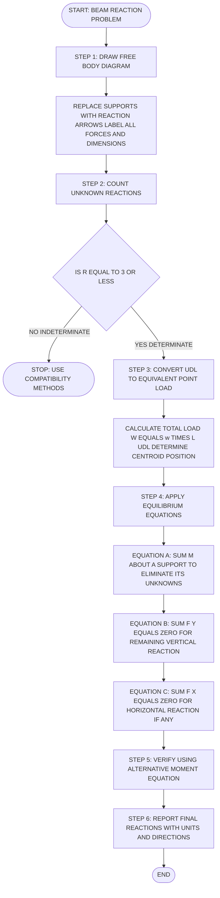
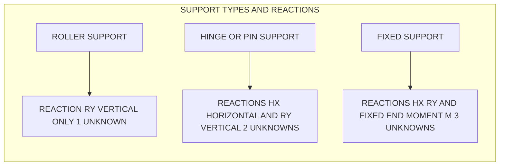
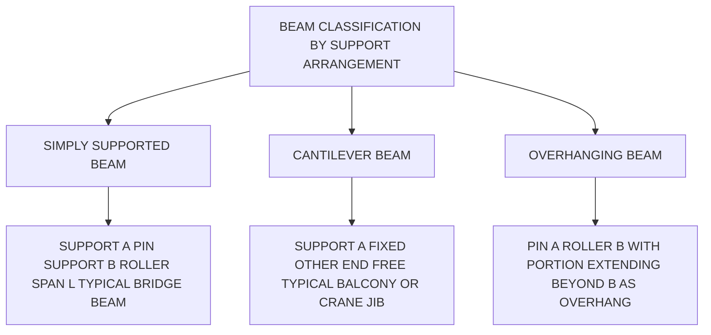
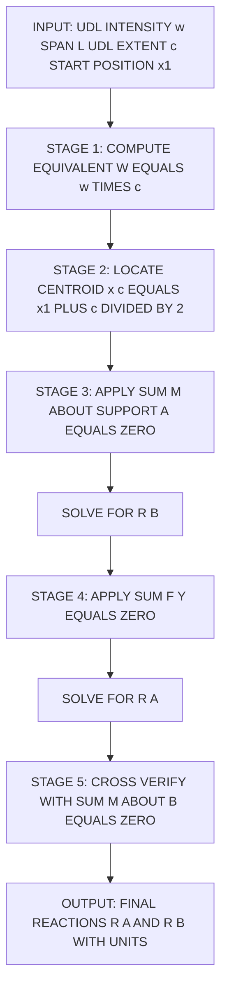
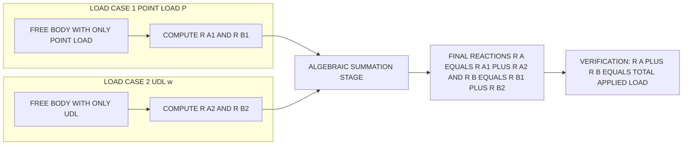
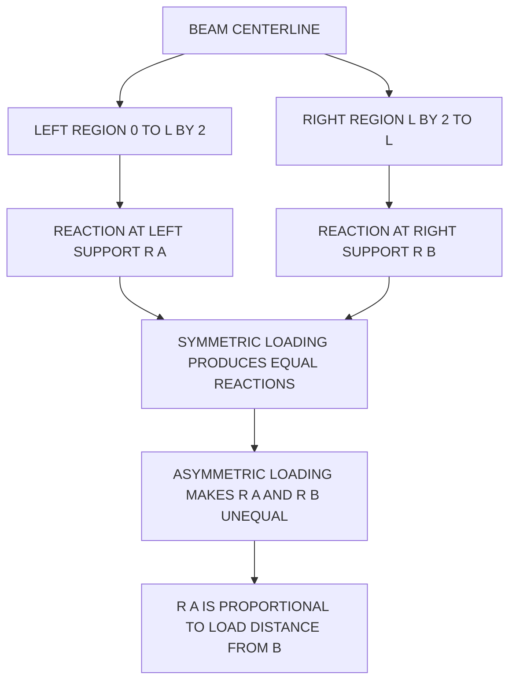

# Support reactions of beams (point load and UDL only)

<!-- SECTION_1_START -->
# Support Reactions of Beams (Point Load and UDL Only)

## 1.1 Formal Academic Definition

In **Engineering Mechanics** and **Structural Analysis**, a **beam** is a structural member primarily designed to resist transverse loads (loads applied perpendicular to its longitudinal axis), producing bending as the dominant internal action. A **support reaction** is the *responsive force* (or moment) developed at a structural support when external loads are applied to the beam. These reactions are the *internal resistance* generated by the support to maintain **static equilibrium** of the rigid body.

For a 2D (planar) rigid body in equilibrium, the governing scalar conditions are:

$$\sum F_x = 0, \quad \sum F_y = 0, \quad \sum M_z = 0$$

A beam is said to be **statically determinate** with respect to support reactions when the number of unknown reaction components exactly equals the number of useful equilibrium equations (which is 3 for a planar system). If unknowns exceed three, the beam is **statically indeterminate** and cannot be solved using statics alone.

> [!IMPORTANT]
> **KTU 2024 Syllabus Highlight (Module 1):** Under point loads and UDL, we deal *exclusively* with **statically determinate beams** — simply supported, cantilever, and overhanging beams. Indeterminate structures are covered in higher semesters under Structural Analysis.

---

## 1.2 Conceptual Analogy / Intuition

Imagine you are holding a wooden ruler horizontally on two fingers placed beneath it, then placing a small weight in the middle. The fingers "push up" against the ruler with forces that you can feel. Those upward push-forces are the **support reactions**.

Now imagine pushing down on one end of the ruler while it is held only at the other end (clamped between a table edge and your finger). The clamped end feels a **push** *and* a **twist**. That twist is a **reaction moment**.

A *point load* is like dropping a single stone on a plank. A *Uniformly Distributed Load (UDL)* is like a thin layer of sand spread evenly across the plank — instead of one concentrated force, the weight is spread out uniformly across the length, represented as a force per unit length (e.g., **kN/m** or **N/m**).

> [!NOTE]
> **Key Insight for Students:** The total load from a UDL of intensity $w$ (N/m) spread over a length $L$ is mathematically equivalent to a single concentrated point load of magnitude $wL$ acting at the **midpoint** of the distributed region. This equivalence is the foundation of all UDL problem-solving.

---

## 1.3 Support Types and Their Reaction Components

The reaction components generated by a support depend on the *constraint* it provides against motion. Since a rigid body in 2D has 3 degrees of freedom (translation in X, translation in Y, rotation), supports can restrain anywhere from 1 to 3 of these.

| Support Type | Symbol | Reactions Provided | No. of Unknowns | Physical Realization |
|---|---|---|---|---|
| **Roller Support** | Circle on line / triangle with rollers | Vertical reaction $R_y$ only | 1 | Free to roll horizontally, can rotate; resists vertical motion |
| **Hinge / Pin Support** | Triangle | $H_x$ (horizontal) and $R_y$ (vertical) | 2 | Resists motion in both X and Y; can rotate freely |
| **Fixed Support** | Hatched wall | $H_x$, $R_y$, and moment $M$ | 3 | Resists translation in X, Y, and rotation completely |

> [!IMPORTANT]
> **Determinacy Rule (Planar Beams):** Let $r$ = number of reaction unknowns and $e$ = 3 (equilateral equations). If $r = e$, the beam is **statically determinate**; if $r > e$, it is **statically indeterminate to the $(r-e)$ degree**; if $r < e$, the structure is **unstable** (a mechanism).

---

## 1.4 Types of Loads on Beams

1. **Point Load (Concentrated Load):** A single force $P$ (units: **N** or **kN**) applied at a specific point along the beam axis. Represented as a single straight arrow.

2. **Uniformly Distributed Load (UDL):** A load of constant intensity $w$ (units: **N/m** or **kN/m**) spread over a finite length $L$. Represented as a series of arrows of equal length or a shaded rectangular block above the beam line. The equivalent resultant is $W = wL$ at $L/2$ from either end of the UDL region.

3. **Uniformly Varying Load (UVL):** (Out of syllabus scope for this topic — mentioned only for completeness.)

> [!VISUALIZATION CONTROL]
> **Concept:** Visualizing a UDL acting on a simply supported beam.
> **Desmos Input:**
> * Beam line: a horizontal line from $(0, 0)$ to $(10, 0)$.
> * UDL block: shaded rectangle from $(0, 0.5)$ to $(10, 0.5)$ representing intensity $w = 5$ kN/m.
> **Visual Description:** A horizontal beam of length 10 m with a rectangular "load carpet" of uniform height floating just above it. The arrows (or the shaded block) all point downward with equal length. The centroid of the shaded block sits at the middle (x = 5 m), which is where the equivalent concentrated load $W = 50$ kN would act.

---

## 1.5 Standard Sign Convention (KTU Board Convention)

- **Forces:** Upward forces are *positive* (+ve); downward forces are *negative* (−ve). Rightward forces are +ve; leftward are −ve.
- **Moments:** **Counter-clockwise (CCW)** moments are taken as *positive* (+ve); **Clockwise (CW)** moments are taken as *negative* (−ve).
- **Distances:** All distances must be measured from the chosen moment center (origin point) to the line of action of the force, along the beam axis.

> [!NOTE]
> Once a sign convention is chosen for a problem, it must be **strictly and consistently** applied throughout. A common student error is mixing sign conventions mid-problem.

---

## 1.6 Statical Determinacy vs. Indeterminacy — A Quick Decision Map

For a beam with $r$ unknown reaction components:
* If $r = 3$ → **Statically Determinate** (solvable by 3 equilibrium equations).
* If $r > 3$ → **Statically Indeterminate** (requires compatibility equations from material mechanics).
* If $r < 3$ → **Unstable / Mechanism** (cannot be in static equilibrium).

> [!WARNING]
> **KTU Examiner's Pitfall:** Many students attempt to "solve" problems with $r = 4$ (e.g., a fixed beam) using only $\sum F = 0$ and $\sum M = 0$. This is impossible — the structure has 4 unknowns and only 3 equations. Such problems are out of scope for Module 1.

---

## 1.7 Module 1 Problem Taxonomy

The KTU Module 1 syllabus explicitly restricts us to the following beam-load combinations:

1. **Simply supported beam** with a single central point load $P$.
2. **Simply supported beam** with a point load $P$ at a distance $a$ from the left support (and $b$ from the right, $a + b = L$).
3. **Simply supported beam** carrying a UDL of intensity $w$ over the **entire span** $L$.
4. **Simply supported beam** carrying a UDL of intensity $w$ over a **partial span**.
5. **Cantilever beam** (fixed at one end) with a point load or UDL.
6. **Overhanging beam** (supports not at the ends) with point loads / UDL.
7. **Superposition** of multiple loads on the same beam.

These are addressed one by one in the sections that follow.
<!-- SECTION_1_END -->

<!-- SECTION_2_START -->
# Deep Theoretical Analysis & KTU High-Yield Formula Sheet

## 2.1 The Three Pillars of Beam Reaction Analysis

Every beam reaction problem is solved by applying the **three scalar equilibrium equations** of planar statics. These are the only "tools" needed for this entire module.

**Pillar 1: Sum of Horizontal Forces**
$$\sum F_x = 0$$
This is non-trivial only when the support has a horizontal reaction component (hinge or fixed). For a vertical beam with vertical loads, this equation is automatically satisfied (since $0 = 0$). However, it must be **stated** in the solution to earn full marks.

**Pillar 2: Sum of Vertical Forces**
$$\sum F_y = 0$$
All upward reactions minus all downward loads = 0.

**Pillar 3: Sum of Moments about Any Point**
$$\sum M_{\text{point}} = 0$$
Typically, moments are summed about one of the supports, because the moment of that support's reaction about itself is zero — eliminating one unknown and simplifying the algebra.

---

## 2.2 The Generic Solution Algorithm

For any determinate beam problem in Module 1, follow this exact 4-step sequence:

1. **Free Body Diagram (FBD):** Draw the beam as a straight line, replace each support with its reaction arrows, and replace each load with its arrow. Label *all* forces and *all* dimensions.
2. **Count Unknowns:** Verify $r = 3$ (or fewer if there is no horizontal force).
3. **Apply Equilibrium Equations:**
   * First, take $\sum M$ about a support that has *more than one* unknown reaction (if any) so those unknowns are eliminated.
   * Then apply $\sum F_y = 0$ to find the remaining vertical reaction.
   * Finally apply $\sum F_x = 0$ to find the horizontal reaction (if any).
4. **Verify / Check:** Use an alternative moment equation (about a different point) as a self-check.

---

## 2.3 KTU Formula Cheat Sheet (Beam Reactions)

> [!NOTE]
> The following are the **standard closed-form results** that examiners expect students to memorize and reproduce under exam pressure. Each formula assumes a **simply supported beam** of span $L$ unless otherwise stated.

| # | Beam Configuration | Loading | Reaction at Left Support $R_A$ | Reaction at Right Support $R_B$ | Notes |
|---|---|---|---|---|---|
| 1 | Simply supported | Point load $P$ at center ($L/2$ from each end) | $\dfrac{P}{2}$ | $\dfrac{P}{2}$ | Symmetric → reactions equal |
| 2 | Simply supported | Point load $P$ at distance $a$ from left, $b$ from right ($a+b=L$) | $\dfrac{Pb}{L}$ | $\dfrac{Pa}{L}$ | Reaction at a support is proportional to the *opposite* distance |
| 3 | Simply supported | UDL $w$ over **entire** span $L$ | $\dfrac{wL}{2}$ | $\dfrac{wL}{2}$ | Total load = $wL$, shared equally |
| 4 | Simply supported | UDL $w$ over partial length $c$ (from $x$ to $x+c$) | $\dfrac{wc(L - x - c/2)}{L}$ | $\dfrac{wc(x + c/2)}{L}$ | Resultant $W = wc$ acts at the centroid of the UDL block |
| 5 | Cantilever (fixed at A, free at B) | Point load $P$ at free end B, length $L$ | $R_A = P$ (up), $M_A = PL$ (CCW) | $R_B = 0$ | Fixed support carries the entire load and the full moment |
| 6 | Cantilever | UDL $w$ over entire span $L$ | $R_A = wL$, $M_A = \dfrac{wL^2}{2}$ | $R_B = 0$ | Resultant $wL$ at $L/2$ from fixed end |
| 7 | Overhanging beam (supports at A and B, overhang BC) | Point load $P$ at overhang tip C | $R_A$ varies; depends on geometry | $R_B$ varies | Must be computed using moment equilibrium |

> [!CRITICAL]
> **Exam Tip:** In any simply supported beam, $R_A + R_B = \text{Total downward load}$. This single line is the fastest *check* you can perform to confirm your reaction answers are correct.

---

## 2.4 Engineering and Real-World Utility

Why are beam reactions a foundational topic? Because in real-world civil and mechanical engineering:

* **Bridge Design:** Every highway bridge is essentially a series of simply supported or continuous beams. The reaction at each pier determines the *size of the foundation* required.
* **Building Floor Slabs:** Floor beams transfer loads to columns; the column reaction must be calculated before sizing the column.
* **Crane Booms:** A crane jib is a cantilever; the fixed-end moment and shear determine the *bolted connection strength* at the base.
* **Machine Tool Frames:** Reaction analysis ensures machine beds don't tip when heavy workpieces are mounted eccentrically.
* **Aerospace Structures:** Aircraft wing spars are essentially beams; tip loads (lift) produce support reactions that dictate fuselage attachment lug sizes.

> [!NOTE]
> In **production engineering design**, the reaction values are the *boundary conditions* entered into Finite Element Analysis (FEA) software. Getting them wrong propagates errors through every stress and deflection plot downstream.

---

## 2.5 Conceptual Logic Flow for the Two Core Load Types

### Path A: Point Load Analysis
1. Identify the location of the point load along the span.
2. Compute the moment of the load about one support → equate to the moment of the *other* support's reaction.
3. Solve algebraically for one reaction.
4. Apply $\sum F_y = 0$ to find the second reaction.

### Path B: UDL Analysis
1. Convert the UDL into its equivalent point load: $W = w \times L_{\text{UDL}}$, where $L_{\text{UDL}}$ is the length over which the UDL acts.
2. Locate the centroid (midpoint for uniform $w$) of the UDL block.
3. Treat the problem as Path A from this point onward.
4. If a UDL covers only part of the span, the *unloaded* regions must be carefully handled (they simply contribute no load, but the support reactions still span the *full* $L$ between supports).

---

## 2.6 Common Student Misconceptions (Pre-Correction)

1. **Misconception:** "If a UDL only acts from 0 to 4 m on a 10 m beam, the reactions are at 0 and 4 m."
   **Correction:** The supports are *physical locations on the beam*. The UDL is a *load region*. They are independent.
2. **Misconception:** "The moment of a vertical force is the force times the distance, regardless of where I measure from."
   **Correction:** The moment is the force times the *perpendicular distance from the chosen moment center to the line of action of the force*.
3. **Misconception:** "If I take moments about a support, the other support's reaction also appears in the equation."
   **Correction:** No — taking moments *about a support* eliminates that support's reactions from the equation, *not the other one's*. (Wait — that's wrong.) **Correction:** Taking moments about support A eliminates the unknowns $H_A$ and $R_A$ but **retains** $R_B$ (assuming pin at A, roller at B). You solve for $R_B$ from that one equation.
4. **Misconception:** "Reactions are always positive."
   **Correction:** Computed reactions may come out negative, indicating that the *actual* direction is opposite to the assumed direction in the FBD. The sign is meaningful.
<!-- SECTION_2_END -->

<!-- SECTION_3_START -->
# Step-by-Step Derivations, Worked Examples & Standard Cases

This section develops the standard closed-form reactions from first principles, then demonstrates the complete problem-solving procedure on representative KTU-style questions.

---

## 3.1 Derivation 1: Simply Supported Beam with Central Point Load

**Setup:** Beam AB of length $L$, pin at A (left) and roller at B (right). Point load $P$ acting downward at the center, $L/2$ from each support.

**Free Body Diagram (Conceptual):**
A horizontal line from A to B. Upward arrow $R_A$ at A, upward arrow $R_B$ at B. Downward arrow $P$ at the midpoint.

**Unknowns:** $R_A$, $R_B$ (2 unknowns). Equations available: 3. The horizontal equation is automatically $0 = 0$. We use 2 of the remaining 3 (the moment equation + vertical force equation).

**Step 1 — Apply $\sum M_A = 0$ (moments about A, CCW positive):**

The reaction $R_A$ at A has a moment arm of zero, so it contributes nothing. The load $P$ at distance $L/2$ produces a clockwise moment (negative by convention). The reaction $R_B$ at distance $L$ produces a counter-clockwise moment (positive).

$$
\begin{aligned}
\sum M_A &= 0 \\
R_B \cdot L - P \cdot \frac{L}{2} &= 0
\end{aligned}
$$

**Step 2 — Solve for $R_B$:**

$$
\begin{aligned}
R_B \cdot L &= P \cdot \frac{L}{2} \\
R_B &= \frac{P}{2}
\end{aligned}
$$

**Step 3 — Apply $\sum F_y = 0$ (upward positive):**

$$
\begin{aligned}
\sum F_y &= 0 \\
R_A + R_B - P &= 0 \\
R_A &= P - R_B \\
R_A &= P - \frac{P}{2} \\
R_A &= \frac{P}{2}
\end{aligned}
$$

**Result:** $R_A = R_B = P/2$. (Symmetric loading on a symmetric beam — expected.)

**Verification (using $\sum M_B = 0$):**

$$
\begin{aligned}
R_A \cdot L - P \cdot \frac{L}{2} &= 0 \\
R_A &= \frac{P}{2} \quad \checkmark
\end{aligned}
$$

---

## 3.2 Derivation 2: Simply Supported Beam with Eccentric Point Load

**Setup:** Beam AB of length $L$, pin at A, roller at B. Point load $P$ at distance $a$ from A and $b$ from B, where $a + b = L$.

**Step 1 — Apply $\sum M_A = 0$:**

$$
\begin{aligned}
\sum M_A &= 0 \\
R_B \cdot L - P \cdot a &= 0 \\
R_B &= \frac{Pa}{L}
\end{aligned}
$$

**Step 2 — Apply $\sum F_y = 0$:**

$$
\begin{aligned}
R_A + R_B - P &= 0 \\
R_A &= P - R_B \\
R_A &= P - \frac{Pa}{L} \\
R_A &= \frac{PL - Pa}{L} \\
R_A &= \frac{P(L - a)}{L} \\
R_A &= \frac{Pb}{L} \quad (\text{since } b = L - a)
\end{aligned}
$$

**Result:** $R_A = Pb/L$ and $R_B = Pa/L$. Notice the elegant symmetry: the reaction at a support is proportional to the load's distance from the *opposite* support.

**Special Case Check:** If $a = b = L/2$, then $R_A = P \cdot (L/2)/L = P/2$ and $R_B = P/2$. This matches Derivation 1. ✓

---

## 3.3 Derivation 3: Simply Supported Beam with UDL Over Entire Span

**Setup:** Beam AB of length $L$, UDL of intensity $w$ (kN/m) over the entire span.

**Equivalent Point Load:** Total load = $W = wL$ (kN), acting at the centroid of the UDL block, i.e., at $L/2$ from A.

**Step 1 — Apply $\sum M_A = 0$:**

$$
\begin{aligned}
R_B \cdot L - (wL) \cdot \frac{L}{2} &= 0 \\
R_B &= \frac{wL^2 / 2}{L} \\
R_B &= \frac{wL}{2}
\end{aligned}
$$

**Step 2 — Apply $\sum F_y = 0$:**

$$
\begin{aligned}
R_A + R_B &= wL \\
R_A &= wL - \frac{wL}{2} \\
R_A &= \frac{wL}{2}
\end{aligned}
$$

**Result:** $R_A = R_B = wL/2$. The UDL is shared equally by the two symmetric supports.

---

## 3.4 Derivation 4: Simply Supported Beam with UDL Over a Partial Span

**Setup:** Beam AB of length $L$. UDL of intensity $w$ acts from $x = x_1$ to $x = x_1 + c$ (so the UDL has length $c$, starting at $x_1$ from A).

**Equivalent Point Load:** $W = wc$, acting at the centroid: $x_c = x_1 + c/2$ from A.

**Step 1 — Apply $\sum M_A = 0$:**

$$
\begin{aligned}
R_B \cdot L - (wc) \cdot \left( x_1 + \frac{c}{2} \right) &= 0 \\
R_B &= \frac{wc \left( x_1 + c/2 \right)}{L}
\end{aligned}
$$

**Step 2 — Apply $\sum F_y = 0$:**

$$
\begin{aligned}
R_A + R_B &= wc \\
R_A &= wc - R_B \\
R_A &= wc - \frac{wc(x_1 + c/2)}{L} \\
R_A &= \frac{wcL - wc(x_1 + c/2)}{L} \\
R_A &= \frac{wc \left( L - x_1 - c/2 \right)}{L}
\end{aligned}
$$

**Result:** $R_A = \dfrac{wc(L - x_1 - c/2)}{L}$ and $R_B = \dfrac{wc(x_1 + c/2)}{L}$.

**Numerical Example (worked in full):**
Given: $L = 8$ m, $w = 4$ kN/m, UDL from $x_1 = 2$ m to $x_1 + c = 6$ m (so $c = 4$ m).

$$
\begin{aligned}
W &= wc = 4 \times 4 = 16 \text{ kN} \\
x_c &= 2 + \frac{4}{2} = 4 \text{ m from A} \\
R_B &= \frac{4 \times 4 \times 4}{8} = \frac{64}{8} = 8 \text{ kN} \\
R_A &= 16 - 8 = 8 \text{ kN}
\end{aligned}
$$

**Interpretation:** The UDL is symmetrically placed about the center ($x_c = 4$ m on an 8 m beam), so equal reactions are expected. ✓

---

## 3.5 Derivation 5: Cantilever Beam with Point Load at Free End

**Setup:** Beam fixed at A (left), free at B (right), length $L$. Point load $P$ downward at the free end B.

**Reactions at Fixed Support:** $H_A = 0$ (no horizontal loads), $R_A$ (vertical), and $M_A$ (moment).

**Step 1 — Apply $\sum F_y = 0$:**

$$
\begin{aligned}
R_A - P &= 0 \\
R_A &= P \quad (\text{upward})
\end{aligned}
$$

**Step 2 — Apply $\sum M_A = 0$ (CCW positive):**

The load $P$ at distance $L$ from A produces a clockwise moment. To balance it, $M_A$ must be counter-clockwise.

$$
\begin{aligned}
M_A - P \cdot L &= 0 \\
M_A &= PL \quad (\text{counter-clockwise})
\end{aligned}
$$

**Result:** $R_A = P$ (up), $M_A = PL$ (CCW). The fixed support absorbs the full load *and* a substantial moment.

---

## 3.6 Derivation 6: Cantilever Beam with UDL Over Entire Span

**Setup:** Fixed at A, UDL $w$ over length $L$.

**Equivalent Load:** $W = wL$ at $L/2$ from A.

**Step 1 — $\sum F_y = 0$:**

$$
\begin{aligned}
R_A - wL &= 0 \\
R_A &= wL
\end{aligned}
$$

**Step 2 — $\sum M_A = 0$:**

$$
\begin{aligned}
M_A - wL \cdot \frac{L}{2} &= 0 \\
M_A &= \frac{wL^2}{2}
\end{aligned}
$$

**Result:** $R_A = wL$ (up), $M_A = wL^2/2$ (CCW).

---

## 3.7 Derivation 7: Overhanging Beam with Point Load at Overhang Tip

**Setup:** Beam with pin support at A (left end), roller support at B (distance $L$ from A), and overhang of length $a$ to the free end C. Point load $P$ at the tip C (i.e., at distance $L + a$ from A).

**Step 1 — $\sum M_A = 0$:**

The load $P$ at distance $(L + a)$ from A produces a clockwise moment.

$$
\begin{aligned}
R_B \cdot L - P \cdot (L + a) &= 0 \\
R_B &= \frac{P(L + a)}{L}
\end{aligned}
$$

**Step 2 — $\sum F_y = 0$:**

$$
\begin{aligned}
R_A + R_B - P &= 0 \\
R_A &= P - R_B \\
R_A &= P - \frac{P(L + a)}{L} \\
R_A &= \frac{PL - P(L + a)}{L} \\
R_A &= \frac{PL - PL - Pa}{L} \\
R_A &= -\frac{Pa}{L}
\end{aligned}
$$

**Result:** $R_B = P(L+a)/L$ (upward) and $R_A = -Pa/L$ (the negative sign indicates that the *actual* direction of $R_A$ is **downward**, not upward as assumed).

> [!IMPORTANT]
> **Physical Interpretation:** When a heavy load sits on an overhang, the support closer to the overhang is pushed *up* very hard, while the support farther from the overhang is actually **pulled down**. To prevent the beam from lifting off, that support must be anchored (e.g., a bolted connection).

---

## 3.8 Superposition Principle

When a beam carries *multiple* loads, the principle of superposition applies (linear, elastic behavior):

> **The total reaction at any support equals the algebraic sum of the reactions due to each individual load, considered separately.**

**Worked Numerical Example (Superposition):**

A simply supported beam of length 6 m carries:
* A point load of 20 kN at 2 m from the left support.
* A UDL of 4 kN/m over the **entire** span.

**Reactions due to the 20 kN point load alone:**

$$
\begin{aligned}
R_{A1} &= \frac{P \cdot b}{L} = \frac{20 \times 4}{6} = 13.333 \text{ kN} \\
R_{B1} &= \frac{P \cdot a}{L} = \frac{20 \times 2}{6} = 6.667 \text{ kN}
\end{aligned}
$$

**Reactions due to the UDL alone:**

$$
\begin{aligned}
R_{A2} &= \frac{wL}{2} = \frac{4 \times 6}{2} = 12 \text{ kN} \\
R_{B2} &= \frac{wL}{2} = 12 \text{ kN}
\end{aligned}
$$

**Total Reactions (by Superposition):**

$$
\begin{aligned}
R_A &= R_{A1} + R_{A2} = 13.333 + 12 = 25.333 \text{ kN} \\
R_B &= R_{B1} + R_{B2} = 6.667 + 12 = 18.667 \text{ kN}
\end{aligned}
$$

**Verification:** $R_A + R_B = 25.333 + 18.667 = 44$ kN. Total downward load = $20 + 4 \times 6 = 20 + 24 = 44$ kN. ✓

---

## 3.9 Comprehensive Worked Example (KTU-Style 14-Mark Problem)

**Problem:** A simply supported beam AB of length 8 m is subjected to a point load of 30 kN at 2 m from the left support A, and a uniformly distributed load of 6 kN/m over the right half of the beam (from midspan to B). Determine the support reactions at A and B using equilibrium equations.

**Step 1 — Free Body Diagram:**
Beam horizontal from A (x = 0) to B (x = 8). Upward arrows $R_A$ at A, $R_B$ at B. Downward arrow $P = 30$ kN at $x = 2$. UDL block of intensity $w = 6$ kN/m from $x = 4$ to $x = 8$.

**Step 2 — Convert UDL to equivalent point load:**

$$
W = w \times c = 6 \times 4 = 24 \text{ kN}
$$

Centroid of the UDL block: $x_c = 4 + 4/2 = 6$ m from A.

**Step 3 — Apply $\sum M_A = 0$ (CCW positive):**

$$
\begin{aligned}
R_B \cdot 8 - 30 \cdot 2 - 24 \cdot 6 &= 0 \\
8 R_B &= 60 + 144 \\
8 R_B &= 204 \\
R_B &= 25.5 \text{ kN}
\end{aligned}
$$

**Step 4 — Apply $\sum F_y = 0$:**

$$
\begin{aligned}
R_A + R_B &= 30 + 24 = 54 \text{ kN} \\
R_A &= 54 - 25.5 \\
R_A &= 28.5 \text{ kN}
\end{aligned}
$$

**Step 5 — Verification (use $\sum M_B = 0$):**

Taking CCW positive about B:

$$
\begin{aligned}
R_A \cdot 8 - 30 \cdot 6 - 24 \cdot 2 &= 0 \\
8 R_A &= 180 + 48 \\
8 R_A &= 228 \\
R_A &= 28.5 \text{ kN} \quad \checkmark
\end{aligned}
$$

**Final Answer:** $R_A = 28.5$ kN (upward), $R_B = 25.5$ kN (upward). Total = 54 kN = applied load. ✓

**Marking Allocation (KTU Board Style):**
* [FBD with all forces, supports, dimensions labelled: 3 Marks]
* [Conversion of UDL to equivalent point load with centroid location: 2 Marks]
* [Writing $\sum M_A = 0$ equation with correct sign convention: 3 Marks]
* [Solving $R_B$: 1 Mark]
* [Writing $\sum F_y = 0$: 1 Mark]
* [Solving $R_A$: 1 Mark]
* [Verification step using an alternative equation: 2 Marks]
* [Final answer with units: 1 Mark]
<!-- SECTION_3_END -->

<!-- SECTION_4_START -->
# Structural Diagrams & Schematics

The following Mermaid diagrams visualize the structural and logical flow of beam reaction analysis. All node IDs are alphanumeric and labels use only clean uppercase text.

---

## 4.1 Master Decision Flowchart for Beam Reaction Problems

---

## 4.2 Support Type Identification Subgraph

---

## 4.3 Beam Type Taxonomy

---

## 4.4 Sequential Processing Topology for UDL Reaction Analysis

---

## 4.5 Superposition Process Matrix (Block Architecture)

---

## 4.6 Reaction Magnitude Distribution Visualization Block

<!-- SECTION_4_END -->

<!-- SECTION_5_START -->
# KTU 2024 Scheme Examination Question Bank & Topic Recap

> All questions below are mapped to the **Engineering Mechanics (GCEST103) Module 1** syllabus and the **KTU 2024 Scheme** assessment pattern.

---

## Part A Questions (3 Marks Each)

### Question 1 (3 Marks)
**[KTU University Exam – July 2024]** Define the following terms with neat sketches: (a) Point load, (b) Uniformly distributed load, (c) Reaction.

**Model Answer:**

(a) **Point Load:** A concentrated force acting at a single, specific point on a structural member. It is idealized as a single arrow of magnitude $P$ (units: N or kN). In practice, a load spread over a very small area is treated as a point load.

(b) **Uniformly Distributed Load (UDL):** A load of constant intensity $w$ (units: N/m or kN/m) acting continuously over a finite length of a beam. It is represented as a rectangular block of height $w$ above the beam line, or a series of equal-length downward arrows. The total load is $W = wL$, acting at the midpoint of the UDL region.

(c) **Reaction:** A force (or moment) developed at a support in response to the loads applied on the structure, in order to maintain static equilibrium. The reaction is perpendicular to, or along, the constrained direction of motion at that support.

> [Defining point load: 1 Mark] [Defining UDL with formula: 1 Mark] [Defining reaction: 1 Mark]

---

### Question 2 (3 Marks)
**[KTU University Exam – Dec 2023]** State and explain the three equations of equilibrium for a rigid body in two dimensions.

**Model Answer:**

For a rigid body in static equilibrium under a 2D coplanar force system, the following three scalar equations must be simultaneously satisfied:

**1. Sum of forces in the horizontal direction equals zero:**

$$\sum F_x = 0$$

This ensures there is no net translation along the X-axis.

**2. Sum of forces in the vertical direction equals zero:**

$$\sum F_y = 0$$

This ensures there is no net translation along the Y-axis.

**3. Sum of moments about any point in the plane equals zero:**

$$\sum M_O = 0$$

This ensures there is no net rotation about any point O in the plane.

> [Stating the three equations: 1.5 Marks] [Brief physical interpretation: 1.5 Marks]

---

## Part B Questions (14 Marks Each — Internal Choice Model)

### Question A (14 Marks)

**[KTU University Exam – July 2024 — Model Question Paper Style]**

A simply supported beam of span 6 m carries a point load of 20 kN at 2 m from the left support and a uniformly distributed load of 5 kN/m over the right half of the span. Determine the support reactions at both ends.

#### Part (a) — 7 Marks: Free Body Diagram and Conversion of UDL

**Step 1: FBD Construction** (3 Marks)
Draw a horizontal beam from A (left) to B (right). Mark supports: pin at A, roller at B. Upward arrows $R_A$ at A and $R_B$ at B. Downward arrow of 20 kN at 2 m from A. UDL block of intensity 5 kN/m from $x = 3$ m to $x = 6$ m (length 3 m, the right half).

**Step 2: UDL Conversion** (2 Marks)
Total equivalent point load: $W = w \cdot c = 5 \times 3 = 15$ kN. Acts at the centroid: $x_c = 3 + 3/2 = 4.5$ m from A.

**Step 3: Force Summary** (2 Marks)
The problem is now equivalent to two point loads: 20 kN at $x = 2$ m and 15 kN at $x = 4.5$ m.

#### Part (b) — 7 Marks: Equilibrium and Reaction Calculation

**Step 1: Apply $\sum M_A = 0$ (CCW positive)** (3 Marks)

$$
\begin{aligned}
R_B \cdot 6 - 20 \cdot 2 - 15 \cdot 4.5 &= 0 \\
6 R_B - 40 - 67.5 &= 0 \\
6 R_B &= 107.5 \\
R_B &= 17.917 \text{ kN}
\end{aligned}
$$

**Step 2: Apply $\sum F_y = 0$** (2 Marks)

$$
\begin{aligned}
R_A + R_B &= 20 + 15 = 35 \text{ kN} \\
R_A &= 35 - 17.917 \\
R_A &= 17.083 \text{ kN}
\end{aligned}
$$

**Step 3: Verification using $\sum M_B = 0$** (2 Marks)

$$
\begin{aligned}
R_A \cdot 6 - 20 \cdot 4 - 15 \cdot 1.5 &= 0 \\
6 R_A &= 80 + 22.5 = 102.5 \\
R_A &= 17.083 \text{ kN} \quad \checkmark
\end{aligned}
$$

**Final Answer:** $R_A = 17.083$ kN (upward), $R_B = 17.917$ kN (upward).

**Marking Key Recap:**
* [Correct FBD with all labels: 3 Marks]
* [UDL conversion and centroid location: 2 Marks]
* [Setting up $\sum M_A = 0$: 2 Marks]
* [Solving $R_B$: 1 Mark]
* [Setting up $\sum F_y = 0$: 1 Mark]
* [Solving $R_A$: 1 Mark]
* [Verification: 2 Marks]
* [Final answer with units: 1 Mark]

---

### Question B (14 Marks) — Alternative Choice

**[KTU University Exam – Dec 2023 — Supplementary Style]**

A cantilever beam of length 4 m is fixed at the left end and carries a point load of 10 kN at the free end, plus a uniformly distributed load of 3 kN/m over the entire span. Calculate the support reactions at the fixed end.

#### Part (a) — 7 Marks: FBD and UDL Conversion

**Step 1: FBD** (4 Marks)
Horizontal beam, fixed support at A (left), free end at B (right). At A, draw three reactions: $H_A$ (horizontal, assume rightward), $R_A$ (vertical, assume upward), and $M_A$ (moment, assume CCW). At B, point load of 10 kN downward. UDL of 3 kN/m from A to B.

**Step 2: UDL Conversion** (2 Marks)
Total load: $W = wL = 3 \times 4 = 12$ kN, acting at $L/2 = 2$ m from A.

**Step 3: Unknown Count** (1 Mark)
Three unknowns: $H_A$, $R_A$, $M_A$. Three equilibrium equations available. Determinate. ✓

#### Part (b) — 7 Marks: Equilibrium Equations

**Step 1: $\sum F_x = 0$** (1 Mark)

$$
H_A = 0
$$

**Step 2: $\sum F_y = 0$** (2 Marks)

$$
\begin{aligned}
R_A - 10 - 12 &= 0 \\
R_A &= 22 \text{ kN (upward)}
\end{aligned}
$$

**Step 3: $\sum M_A = 0$ (CCW positive)** (3 Marks)

The 10 kN load at 4 m produces a clockwise moment of $10 \times 4 = 40$ kN·m. The UDL resultant of 12 kN at 2 m produces a clockwise moment of $12 \times 2 = 24$ kN·m. To balance, $M_A$ must be counter-clockwise.

$$
\begin{aligned}
M_A - 40 - 24 &= 0 \\
M_A &= 64 \text{ kN·m (CCW)}
\end{aligned}
$$

**Step 4: Final Reaction Set** (1 Mark)
$H_A = 0$, $R_A = 22$ kN (up), $M_A = 64$ kN·m (CCW).

**Marking Key Recap:**
* [Complete FBD with three reactions: 4 Marks]
* [UDL conversion and centroid: 2 Marks]
* [$\sum F_x = 0$: 1 Mark]
* [$\sum F_y = 0$: 2 Marks]
* [$\sum M_A = 0$: 3 Marks]
* [Final reaction values with units: 2 Marks]

---

## KTU Examiner's Valuation Warning / Pitfall Callout

> [!WARNING]
> **Common Marks-Loss Zones — Read Carefully Before Exam:**
> 
> 1. **Forgetting the $\sum F_x = 0$ Equation:** Even when the answer is trivially $H_A = 0$, students often skip writing this equation. KTU examiners deduct **1 to 2 marks** for omitting any one of the three equilibrium equations.
> 
> 2. **Wrong Sign on the Reaction Moment:** In cantilever problems, the fixed-end moment direction is the *opposite* of the rotational tendency of the applied loads. For a downward load on the right of a fixed-left beam, $M_A$ is CCW. Confusing CW/CCW is a frequent error.
> 
> 3. **Misplacing the UDL Centroid:** The centroid of a UDL acting from $x_1$ to $x_1 + c$ is at $x_1 + c/2$ (the **midpoint of the UDL block**, not the midpoint of the beam). Verify with a sketch.
> 
> 4. **Forgetting to Convert Units:** If the beam length is in *metres* and the load in *kN*, the moment comes out in **kN·m**, not N·m or kN/m. State the units.
> 
> 5. **Mixing Sign Conventions:** If you choose CCW as positive for one moment equation, do not switch to CW positive for the verification step. Inconsistency is a major deduction trigger.
> 
> 6. **Ignoring the Verification Step:** The check $R_A + R_B = \text{Total Load}$ is the single fastest way to confirm your answer. KTU examiners appreciate seeing this explicitly; it can save partial marks if a minor arithmetic slip occurred.
> 
> 7. **Forgetting the "Downward = Negative" Rule:** When a UDL covers only part of a beam, students sometimes forget that the *unloaded* segments still have zero load — i.e., they don't add a "negative" UDL on the unloaded portion.

---

## Topic Recap & Important Things to Remember

> [!IMPORTANT]
> **Rapid Revision Checklist — Beam Reactions (Point Load and UDL Only)**

- **Beam:** A structural member designed to resist transverse loads. Module 1 covers only **statically determinate** beams.
- **Three Equilibrium Equations (Planar):** $\sum F_x = 0$, $\sum F_y = 0$, $\sum M = 0$ — must be satisfied simultaneously.
- **Support Types:**
  * **Roller** → 1 reaction (perpendicular to rolling surface, usually vertical).
  * **Hinge/Pin** → 2 reactions ($H_x$ and $R_y$).
  * **Fixed** → 3 reactions ($H_x$, $R_y$, $M$).
- **Determinacy Condition:** $r = 3$ for planar beams → **statically determinate**; $r > 3$ → **indeterminate** (not in Module 1 scope).
- **Point Load:** A single concentrated force at a known location.
- **UDL:** Constant intensity $w$ over a length; equivalent to a point load $W = wL$ at the **midpoint** of the UDL region.
- **Standard Formula (Simply Supported, Point Load):**
  $R_A = \dfrac{Pb}{L}$, $R_B = \dfrac{Pa}{L}$ (load $P$ at distance $a$ from A, $b$ from B).
- **Standard Formula (Simply Supported, Full UDL):**
  $R_A = R_B = \dfrac{wL}{2}$.
- **Standard Formula (Simply Supported, Partial UDL):**
  Equivalent load $W = wc$ at centroid $x_c = x_1 + c/2$; then $R_B = W \cdot x_c / L$ and $R_A = W - R_B$.
- **Standard Formula (Cantilever, Point Load at Free End):**
  $R_A = P$, $M_A = PL$.
- **Standard Formula (Cantilever, Full UDL):**
  $R_A = wL$, $M_A = wL^2 / 2$.
- **Overhanging Beam Rule:** Loads on the overhang can cause a support reaction to be **negative** (i.e., directed downward), meaning the beam tries to lift off that support.
- **Superposition:** Total reaction = sum of reactions from each load computed separately (valid for linear elastic systems).
- **Sign Convention (KTU Board):** Up = +, Down = −; CCW moment = +, CW moment = −.
- **Universal Check:** $R_A + R_B$ should always equal the **total downward applied load** on the beam.
- **Methodology:** Always start with the **Free Body Diagram (FBD)**; label *every* force, support, and dimension.
- **Strategic Choice of Moment Center:** Take moments about a point that eliminates the maximum number of unknowns (typically a support with more than one reaction).
- **Verification Step:** Use a different moment equation (e.g., $\sum M_B = 0$) as a sanity check.
- **Units Discipline:** Force in N or kN; Length in m; Moment in N·m or kN·m; UDL intensity in N/m or kN/m. **Always** state units in the final answer.
<!-- SECTION_5_END -->
