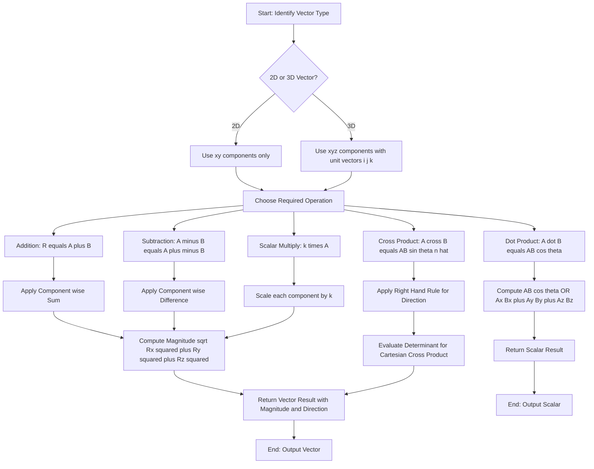
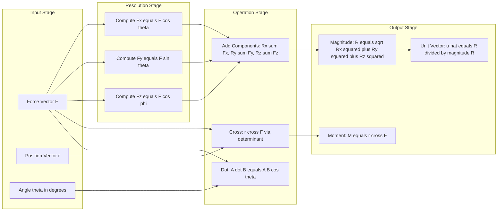
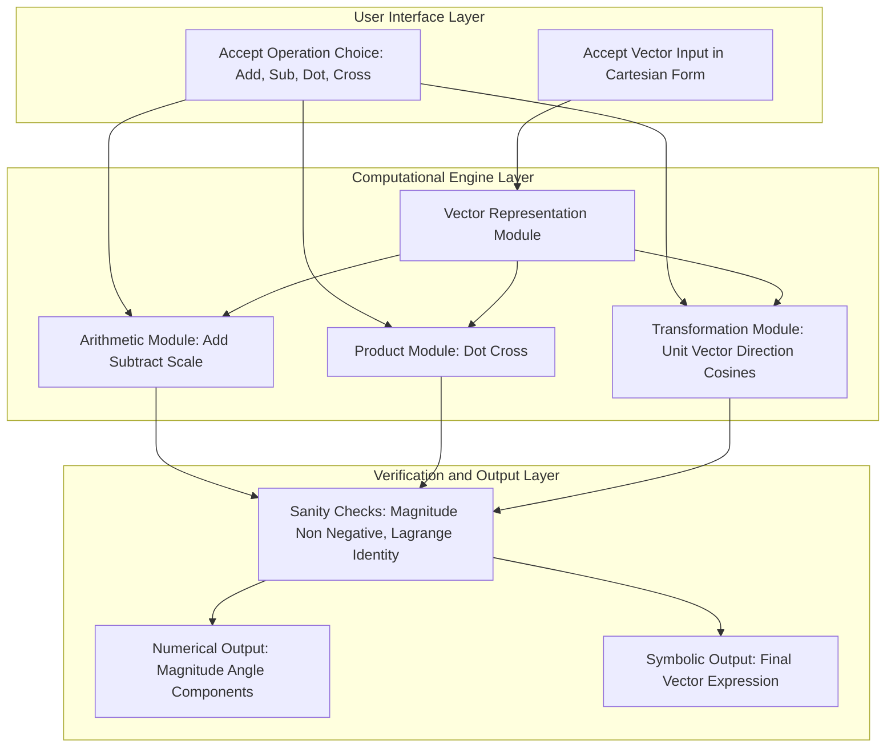

# vector operations

<!-- SECTION_1_START -->
# Vector Operations — Core Technical Definition & Intuitive Overview

> [!IMPORTANT]
> **Syllabus Highlight (KTU 2024 Scheme — Module 1, GCEST103)**
> Vector operations form the **mathematical foundation of statics**. Every force, moment, and reaction in a static system is represented as a vector. Mastering vector algebra is mandatory before solving equilibrium equations $\sum \vec{F} = \vec{0}$ and $\sum \vec{M} = \vec{0}$.

## 1.1 Formal Academic Definition

A **vector** is a directed line segment that possesses both **magnitude** (a non-negative scalar quantity) and **direction** (orientation in space). In engineering mechanics, vector quantities represent physical entities such as **force ($\vec{F}$)**, **displacement ($\vec{s}$)**, **velocity ($\vec{v}$)**, **acceleration ($\vec{a}$)**, and **moment of a force ($\vec{M}$)**.

Mathematically, a vector in 3D Cartesian space is expressed as:

$$
\vec{A} = A_x\,\hat{i} + A_y\,\hat{j} + A_z\,\hat{k}
$$

where $A_x$, $A_y$, $A_z$ are the **scalar components** along the $X$, $Y$, $Z$ axes, and $\hat{i}$, $\hat{j}$, $\hat{k}$ are the **orthogonal unit vectors**.

The magnitude is given by:

$$
\vert\vec{A}\vert = \sqrt{A_x^2 + A_y^2 + A_z^2}
$$

A **scalar**, in contrast, is fully described by a single real number with no directional information (e.g., mass $m = 5\,\text{kg}$, temperature $T = 300\,\text{K}$, work $W = 250\,\text{J}$).

> [!NOTE]
> **Position Vector ($\vec{r}$):** A vector drawn from the **origin $O$** of a coordinate system to a point $P$ in space. If point $P$ has coordinates $(x, y, z)$, then $\vec{r} = x\hat{i} + y\hat{j} + z\hat{k}$.

## 1.2 Conceptual Analogy — The "Arrow in Space" Intuition

Imagine you are giving directions to a friend standing in an open field:
- **"Walk 5 meters"** — this is a *scalar instruction* (only magnitude).
- **"Walk 5 meters towards the North-East gate"** — this is a *vector instruction* (magnitude **AND** direction).

> [!TIP]
> **Engineering Analogy — The Force Arrow:**
> A force in a real structure is best visualised as a **push or pull arrow** drawn on a free-body diagram. The length of the arrow represents the magnitude (in Newtons), and the orientation represents the line of action. When you need to combine multiple forces acting at a single point (concurrent forces), you are literally **adding arrows head-to-tail**, which is exactly what vector addition does.

**Physical Constants / Standard Metrics to Remember:**

- **$1\,\text{N}$** (Newton) = SI unit of force.
- **Position vectors** are typically measured in meters ($\text{m}$).
- **Unit vectors** are dimensionless, with magnitude exactly equal to **$1$**.

## 1.3 Types of Vectors (KTU High-Yield Classification)

| Type | Symbol | Definition | Example |
|---|---|---|---|
| **Zero (Null) Vector** | $\vec{0}$ | Magnitude is zero, direction is undefined | $\vec{0} = 0\hat{i} + 0\hat{j} + 0\hat{k}$ |
| **Unit Vector** | $\hat{u}$ | Magnitude is exactly $1$ | $\hat{i}$, $\hat{j}$, $\hat{k}$ |
| **Equal Vectors** | $\vec{A} = \vec{B}$ | Same magnitude **AND** same direction | Two parallel, equal force arrows |
| **Negative Vector** | $-\vec{A}$ | Same magnitude, opposite direction | Reaction force $\vec{R} = -\vec{F}$ (Newton's 3rd law) |
| **Co-initial Vectors** | — | Share a common initial point (tail) | Concurrent forces at a joint |
| **Collinear Vectors** | — | Lie along the same line of action | Tension in a cable |
| **Coplanar Vectors** | — | Lie in the same geometric plane | 2D truss member forces |

## 1.4 Law of Parallelogram of Forces (Foundational Concept)

> [!IMPORTANT]
> **Statement:** If two forces acting at a point are represented in magnitude and direction by the two adjacent sides of a parallelogram, then their resultant is represented in magnitude and direction by the **diagonal of the parallelogram passing through the point of concurrency**.

**Geometric construction:** Given $\vec{A}$ and $\vec{B}$ co-initial at point $O$, complete the parallelogram $OACB$. The diagonal $\vec{OC} = \vec{A} + \vec{B}$ is the resultant $\vec{R}$.

> [!VISUALIZATION CONTROL]
> **Concept:** Parallelogram Law of Vector Addition
> **GeoGebra / Desmos Input Equations:**
> * Point $O = (0,\, 0)$
> * Point $A = (4,\, 0)$, so $\vec{OA} = (4, 0)$
> * Point $B = (2,\, 3)$, so $\vec{OB} = (2, 3)$
> * Diagonal tip: $C = A + B = (6,\, 3)$
> * Draw segments $OA$, $OB$, $AC$ (parallel to $OB$), $BC$ (parallel to $OA$), and diagonal $OC$
> **Visual Description:** The student should see two arrows sharing a common tail at the origin, with a parallelogram completed. The diagonal arrow from $O$ to $C$ visibly represents the vector sum $\vec{A} + \vec{B}$, with its length and angle matching the analytical formula.

<!-- SECTION_1_END -->

<!-- SECTION_2_START -->
# Vector Operations — Deep Theoretical Analysis & KTU High-Yield Formula Sheet

## 2.1 Vector Addition — Triangle Law

The **Triangle Law** states that if two vectors $\vec{A}$ and $\vec{B}$ are placed head-to-tail, the resultant $\vec{R}$ is the vector drawn from the **tail of the first to the head of the second**.

$$
\vec{R} = \vec{A} + \vec{B}
$$

**Why it works:** Vector addition is **commutative** ($\vec{A} + \vec{B} = \vec{B} + \vec{A}$) and **associative** ($(\vec{A} + \vec{B}) + \vec{C} = \vec{A} + (\vec{B} + \vec{C})$). The Triangle Law and Parallelogram Law are geometrically equivalent — the Triangle Law is just the Parallelogram Law "folded" along the diagonal.

### 2.1.1 Magnitude of Resultant (Parallelogram Form)

For two vectors $\vec{A}$ and $\vec{B}$ with angle $\theta$ between them:

$$
R = \sqrt{A^2 + B^2 + 2AB\cos\theta}
$$

### 2.1.2 Direction of Resultant

$$
\tan\alpha = \frac{B\sin\theta}{A + B\cos\theta}
$$

where $\alpha$ is the angle the resultant makes with vector $\vec{A}$.

> [!NOTE]
> **Special Case — Perpendicular vectors** ($\theta = 90°$): $\cos\theta = 0$, $\sin\theta = 1$, so $R = \sqrt{A^2 + B^2}$ (Pythagorean theorem).
>
> **Special Case — Parallel vectors** ($\theta = 0°$): $R = A + B$.
>
> **Special Case — Anti-parallel vectors** ($\theta = 180°$): $R = \vert A - B \vert$.

## 2.2 Vector Subtraction

Subtraction is defined as adding the negative:

$$
\vec{A} - \vec{B} = \vec{A} + (-\vec{B})
$$

Geometrically, $\vec{A} - \vec{B}$ is the vector drawn from the **tip of $\vec{B}$ to the tip of $\vec{A}$** when both share a common tail.

## 2.3 Scalar (Dot) Product — $\vec{A} \cdot \vec{B}$

The **scalar product** of two vectors yields a **scalar** (a number), not a vector.

$$
\vec{A} \cdot \vec{B} = \vert\vec{A}\vert\,\vert\vec{B}\vert\cos\theta = A\,B\cos\theta
$$

In Cartesian form:

$$
\vec{A} \cdot \vec{B} = A_x B_x + A_y B_y + A_z B_z
$$

**Why $\cos\theta$?** Because only the **component of one vector along the other** contributes to the product. Perpendicular components produce zero contribution.

**Key properties:**
- $\vec{A} \cdot \vec{B} = 0 \iff \vec{A} \perp \vec{B}$ (perpendicular vectors)
- $\vec{A} \cdot \vec{A} = \vert\vec{A}\vert^2 = A^2$
- $\hat{i}\cdot\hat{i} = \hat{j}\cdot\hat{j} = \hat{k}\cdot\hat{k} = 1$
- $\hat{i}\cdot\hat{j} = \hat{j}\cdot\hat{k} = \hat{k}\cdot\hat{i} = 0$

**Engineering utility:** Computing **work done** $W = \vec{F} \cdot \vec{s}$, projection of a force along a beam axis, and checking orthogonality constraints.

## 2.4 Vector (Cross) Product — $\vec{A} \times \vec{B}$

The **vector product** yields a **new vector** perpendicular to the plane containing $\vec{A}$ and $\vec{B}$.

$$
\vec{A} \times \vec{B} = \vert\vec{A}\vert\,\vert\vec{B}\vert\sin\theta\,\hat{n}
$$

where $\hat{n}$ is a **unit vector** perpendicular to the plane of $\vec{A}$ and $\vec{B}$, following the **right-hand rule**.

In Cartesian form (determinant expansion):

$$
\vec{A} \times \vec{B} = (A_y B_z - A_z B_y)\hat{i} - (A_x B_z - A_z B_x)\hat{j} + (A_x B_y - A_y B_x)\hat{k}
$$

**Key properties:**
- $\vec{A} \times \vec{B} = -(\vec{B} \times \vec{A})$ (**anti-commutative**)
- $\vec{A} \times \vec{B} = \vec{0} \iff \vec{A} \parallel \vec{B}$ (parallel vectors)
- $\hat{i}\times\hat{j} = \hat{k}$, $\hat{j}\times\hat{k} = \hat{i}$, $\hat{k}\times\hat{i} = \hat{j}$
- $\hat{j}\times\hat{i} = -\hat{k}$, etc.

**Engineering utility:** Computing **moment of a force** $\vec{M} = \vec{r} \times \vec{F}$, torque in rotating shafts, and angular velocity $\vec{\omega} \times \vec{r}$ for velocity in circular motion.

## 2.5 Unit Vector and Direction Cosines

The **unit vector** $\hat{u}_A$ in the direction of $\vec{A}$ is:

$$
\hat{u}_A = \frac{\vec{A}}{\vert\vec{A}\vert} = \frac{A_x\hat{i} + A_y\hat{j} + A_z\hat{k}}{\sqrt{A_x^2 + A_y^2 + A_z^2}}
$$

The components of $\hat{u}_A$ are called **direction cosines** ($l$, $m$, $n$):

$$
l = \cos\alpha = \frac{A_x}{\vert\vec{A}\vert}, \quad m = \cos\beta = \frac{A_y}{\vert\vec{A}\vert}, \quad n = \cos\gamma = \frac{A_z}{\vert\vec{A}\vert}
$$

**Fundamental constraint (Lagrange's identity):**

$$
l^2 + m^2 + n^2 = 1
$$

## 2.6 KTU Formula Sheet — Quick Revision Table

> [!NOTE]
> **CRITICAL FORMULA TABLE — Memorise before every exam.**

| Operation | Formula | Result Type | Key Use in Mechanics |
|---|---|---|---|
| Magnitude of $\vec{A}$ | $\vert\vec{A}\vert = \sqrt{A_x^2 + A_y^2 + A_z^2}$ | Scalar | Force magnitude |
| Unit vector | $\hat{u}_A = \vec{A} / \vert\vec{A}\vert$ | Vector | Direction specification |
| Addition | $\vec{R} = \vec{A} + \vec{B}$ | Vector | Concurrent force resultant |
| Subtraction | $\vec{A} - \vec{B} = \vec{A} + (-\vec{B})$ | Vector | Relative position |
| Scalar multiplication | $k\vec{A} = (kA_x, kA_y, kA_z)$ | Vector | Scaling force magnitude |
| Resultant magnitude | $R = \sqrt{A^2 + B^2 + 2AB\cos\theta}$ | Scalar | Two-force resultant |
| Resultant direction | $\tan\alpha = B\sin\theta / (A + B\cos\theta)$ | Angle | Orientation of $\vec{R}$ |
| Dot product | $\vec{A}\cdot\vec{B} = AB\cos\theta = A_xB_x + A_yB_y + A_zB_z$ | Scalar | Work, projection |
| Cross product magnitude | $\vert\vec{A}\times\vec{B}\vert = AB\sin\theta$ | Scalar | Area, torque magnitude |
| Cross product vector | Use determinant of $[\hat{i},\hat{j},\hat{k}; A_x,A_y,A_z; B_x,B_y,B_z]$ | Vector | Moment $\vec{M} = \vec{r}\times\vec{F}$ |
| Direction cosines | $l = \cos\alpha, m = \cos\beta, n = \cos\gamma$ | Scalar | 3D force resolution |
| Lagrange identity | $l^2 + m^2 + n^2 = 1$ | Constraint | Verification of unit vector |

## 2.7 Real-World Engineering Utility

> [!TIP]
> **Where vector operations are used in industry:**
> - **Structural Engineering:** Resolving wind loads on a high-rise into $X$, $Y$, $Z$ components before applying equilibrium.
> - **Robotics:** Forward kinematics computes end-effector position via $\vec{r} = \vec{r}_1 + \vec{r}_2 + \cdots + \vec{r}_n$.
> - **Aerospace:** Thrust vectoring uses vector addition of engine thrust and aerodynamic drag.
> - **CAD/CAM Software:** Every 3D transformation (rotation, translation) is implemented using vector/matrix algebra internally.
> - **Statics Trusses & Frames:** Method of joints and method of sections both rely on resolving member forces into $\sin$ and $\cos$ components.

<!-- SECTION_2_END -->

<!-- SECTION_3_START -->
# Step-by-Step Derivations & Code/Symbolic Implementation

## 3.1 Derivation — Magnitude of Resultant of Two Vectors

**Given:** Two vectors $\vec{A}$ and $\vec{B}$ with angle $\theta$ between them, sharing a common tail at $O$.

**Construction:** Apply Triangle Law by translating $\vec{B}$ so its tail meets the head of $\vec{A}$. The closing side of the triangle is the resultant $\vec{R}$.

**Applying the Law of Cosines** to the triangle formed:

Let the angle between $\vec{A}$ and the **opposite direction of $\vec{B}$** be $(180° - \theta)$. Using the law of cosines on the resultant side $R$:

$$
R^2 = A^2 + B^2 - 2AB\cos(180° - \theta)
$$

Since $\cos(180° - \theta) = -\cos\theta$:

$$
R^2 = A^2 + B^2 - 2AB(-\cos\theta) = A^2 + B^2 + 2AB\cos\theta
$$

Therefore:

$$
R = \sqrt{A^2 + B^2 + 2AB\cos\theta}
$$

**Direction derivation (using sine rule):**
Let $\alpha$ be the angle of $\vec{R}$ with $\vec{A}$. From the same triangle, by the sine rule:

$$
\frac{B}{\sin\alpha} = \frac{R}{\sin(180° - \theta)} = \frac{R}{\sin\theta}
$$

Solving for $\sin\alpha$:

$$
\sin\alpha = \frac{B\sin\theta}{R}
$$

Substituting $R$:

$$
\sin\alpha = \frac{B\sin\theta}{\sqrt{A^2 + B^2 + 2AB\cos\theta}}
$$

And from cosine rule on the same triangle:

$$
\cos\alpha = \frac{A + B\cos\theta}{R}
$$

Therefore:

$$
\tan\alpha = \frac{\sin\alpha}{\cos\alpha} = \frac{B\sin\theta}{A + B\cos\theta}
$$

## 3.2 Derivation — Dot Product in Cartesian Coordinates

**Given:** $\vec{A} = A_x\hat{i} + A_y\hat{j} + A_z\hat{k}$ and $\vec{B} = B_x\hat{i} + B_y\hat{j} + B_z\hat{k}$.

Expand using the **distributive property**:

$$
\vec{A} \cdot \vec{B} = (A_x\hat{i} + A_y\hat{j} + A_z\hat{k}) \cdot (B_x\hat{i} + B_y\hat{j} + B_z\hat{k})
$$

Distribute term by term:

$$
\vec{A} \cdot \vec{B} = A_xB_x(\hat{i}\cdot\hat{i}) + A_xB_y(\hat{i}\cdot\hat{j}) + A_xB_z(\hat{i}\cdot\hat{k}) + A_yB_x(\hat{j}\cdot\hat{i}) + A_yB_y(\hat{j}\cdot\hat{j}) + A_yB_z(\hat{j}\cdot\hat{k}) + A_zB_x(\hat{k}\cdot\hat{i}) + A_zB_y(\hat{k}\cdot\hat{j}) + A_zB_z(\hat{k}\cdot\hat{k})
$$

Apply orthogonality rules: $\hat{i}\cdot\hat{i} = \hat{j}\cdot\hat{j} = \hat{k}\cdot\hat{k} = 1$ and all cross terms = $0$.

Therefore:

$$
\vec{A} \cdot \vec{B} = A_xB_x + A_yB_y + A_zB_z
$$

## 3.3 Derivation — Cross Product via Determinant

The cross product is conventionally written as the formal determinant:

$$
\vec{A} \times \vec{B} = \begin{vmatrix} \hat{i} & \hat{j} & \hat{k} \\ A_x & A_y & A_z \\ B_x & B_y & B_z \end{vmatrix}
$$

Expanding along the first row:

$$
\vec{A} \times \vec{B} = \hat{i}\,(A_yB_z - A_zB_y) - \hat{j}\,(A_xB_z - A_zB_x) + \hat{k}\,(A_xB_y - A_yB_x)
$$

**Verification of magnitude** $\vert\vec{A}\times\vec{B}\vert = AB\sin\theta$:

Using the identity $\sin^2\theta + \cos^2\theta = 1$ and the relationship $\cos\theta = (\vec{A}\cdot\vec{B})/(AB)$:

$$
\vert\vec{A}\times\vec{B}\vert^2 + (\vec{A}\cdot\vec{B})^2 = A^2 B^2 (\sin^2\theta + \cos^2\theta) = A^2 B^2
$$

This is the famous **Lagrange's identity**, which proves that $\vert\vec{A}\times\vec{B}\vert = AB\sin\theta$.

## 3.4 Worked Numerical Example — Resultant of Two Forces

> [!IMPORTANT]
> **Problem:** Two forces act at a point. $\vec{F}_1 = 100\,\text{N}$ along the positive $X$-axis, and $\vec{F}_2 = 150\,\text{N}$ at $60°$ from $\vec{F}_1$. Find the magnitude and direction of the resultant.

**Step 1: Resolve $\vec{F}_2$ into components.**

$$
F_{2x} = 150\cos 60° = 150 \times 0.5 = 75\,\text{N}
$$

$$
F_{2y} = 150\sin 60° = 150 \times 0.8660 = 129.90\,\text{N}
$$

**Step 2: Add components.**

$$
R_x = F_{1x} + F_{2x} = 100 + 75 = 175\,\text{N}
$$

$$
R_y = F_{1y} + F_{2y} = 0 + 129.90 = 129.90\,\text{N}
$$

**Step 3: Magnitude of resultant.**

$$
R = \sqrt{R_x^2 + R_y^2} = \sqrt{175^2 + 129.90^2} = \sqrt{30625 + 16874.01} = \sqrt{47499.01}
$$

$$
R = 217.94\,\text{N}
$$

**Step 4: Direction of resultant.**

$$
\tan\alpha = \frac{R_y}{R_x} = \frac{129.90}{175} = 0.7423
$$

$$
\alpha = \tan^{-1}(0.7423) = 36.59° \approx 36.6°\text{ from the }X\text{-axis}
$$

**Verification via the formula:**

$$
R = \sqrt{100^2 + 150^2 + 2(100)(150)\cos 60°} = \sqrt{10000 + 22500 + 15000} = \sqrt{47500} = 217.94\,\text{N} \checkmark
$$

## 3.5 Worked Numerical Example — Moment of a Force Using Cross Product

> [!IMPORTANT]
> **Problem:** A force $\vec{F} = (3\hat{i} + 4\hat{j} - 2\hat{k})\,\text{N}$ is applied at point $P$ whose position vector from origin $O$ is $\vec{r} = (2\hat{i} - 1\hat{j} + 5\hat{k})\,\text{m}$. Find the moment $\vec{M} = \vec{r} \times \vec{F}$.

**Step 1: Set up the determinant.**

$$
\vec{M} = \vec{r} \times \vec{F} = \begin{vmatrix} \hat{i} & \hat{j} & \hat{k} \\ 2 & -1 & 5 \\ 3 & 4 & -2 \end{vmatrix}
$$

**Step 2: Expand along the first row.**

$$
\vec{M} = \hat{i}\,[(-1)(-2) - (5)(4)] - \hat{j}\,[(2)(-2) - (5)(3)] + \hat{k}\,[(2)(4) - (-1)(3)]
$$

**Step 3: Evaluate each component.**

- $\hat{i}$ component: $(-1)(-2) - (5)(4) = 2 - 20 = -18$
- $\hat{j}$ component: $(2)(-2) - (5)(3) = -4 - 15 = -19$, then $-\hat{j}\times(-19) = +19\hat{j}$
- $\hat{k}$ component: $(2)(4) - (-1)(3) = 8 + 3 = 11$

**Step 4: Assemble the final answer.**

$$
\vec{M} = -18\hat{i} + 19\hat{j} + 11\hat{k}\,\text{N}\cdot\text{m}
$$

**Step 5: Compute magnitude (if required).**

$$
\vert\vec{M}\vert = \sqrt{(-18)^2 + 19^2 + 11^2} = \sqrt{324 + 361 + 121} = \sqrt{806} = 28.39\,\text{N}\cdot\text{m}
$$

## 3.6 Python Implementation — Vector Operations Library

```python
"""
Vector Operations Module for Engineering Mechanics (KTU GCEST103)
Implements: addition, subtraction, dot product, cross product,
            unit vector, magnitude, and direction cosines.
"""

import math
from typing import List, Tuple, Union

Vector = List[float]

def magnitude(v: Vector) -> float:
    """Return Euclidean magnitude of a 3D vector."""
    if len(v) != 3:
        raise ValueError("Input vector must have exactly 3 components.")
    return math.sqrt(v[0] ** 2 + v[1] ** 2 + v[2] ** 2)

def unit_vector(v: Vector) -> Vector:
    """Return the unit vector in the direction of v."""
    mag = magnitude(v)
    if mag == 0.0:
        raise ZeroDivisionError("Cannot compute unit vector of a zero vector.")
    return [v[0] / mag, v[1] / mag, v[2] / mag]

def add(a: Vector, b: Vector) -> Vector:
    """Return a + b (component-wise)."""
    if len(a) != 3 or len(b) != 3:
        raise ValueError("Both vectors must be 3-dimensional.")
    return [a[0] + b[0], a[1] + b[1], a[2] + b[2]]

def subtract(a: Vector, b: Vector) -> Vector:
    """Return a - b (component-wise)."""
    if len(a) != 3 or len(b) != 3:
        raise ValueError("Both vectors must be 3-dimensional.")
    return [a[0] - b[0], a[1] - b[1], a[2] - b[2]]

def dot(a: Vector, b: Vector) -> float:
    """Return scalar dot product a . b."""
    if len(a) != 3 or len(b) != 3:
        raise ValueError("Both vectors must be 3-dimensional.")
    return a[0] * b[0] + a[1] * b[1] + a[2] * b[2]

def cross(a: Vector, b: Vector) -> Vector:
    """Return vector cross product a x b using determinant expansion."""
    if len(a) != 3 or len(b) != 3:
        raise ValueError("Both vectors must be 3-dimensional.")
    cx = a[1] * b[2] - a[2] * b[1]
    cy = a[2] * b[0] - a[0] * b[2]
    cz = a[0] * b[1] - a[1] * b[0]
    return [cx, cy, cz]

def direction_cosines(v: Vector) -> Tuple[float, float, float]:
    """Return (l, m, n) = (cos alpha, cos beta, cos gamma)."""
    u = unit_vector(v)
    return (u[0], u[1], u[2])

def resultant_magnitude_two(A: float, B: float, theta_deg: float) -> float:
    """Return |A + B| using parallelogram law. theta in degrees."""
    theta = math.radians(theta_deg)
    return math.sqrt(A ** 2 + B ** 2 + 2 * A * B * math.cos(theta))

def resultant_direction_two(A: float, B: float, theta_deg: float) -> float:
    """Return angle (in degrees) of resultant w.r.t. vector A."""
    theta = math.radians(theta_deg)
    sin_a = B * math.sin(theta)
    cos_a = A + B * math.cos(theta)
    return math.degrees(math.atan2(sin_a, cos_a))


# ---------- Demonstration / Test Cases ----------
if __name__ == "__main__":
    F1 = [100.0, 0.0, 0.0]                 # 100 N along +X
    F2 = [75.0, 129.90, 0.0]               # 150 N at 60 deg from +X
    r  = [2.0, -1.0, 5.0]                  # position vector
    F  = [3.0, 4.0, -2.0]                  # force vector

    print("Magnitude of F1      :", round(magnitude(F1), 4), "N")
    print("Unit vector of F1    :", unit_vector(F1))
    print("Sum F1 + F2          :", add(F1, F2))
    print("Difference F1 - F2   :", subtract(F1, F2))
    print("Dot product F1 . F2  :", round(dot(F1, F2), 4))
    print("Cross product r x F  :", cross(r, F))
    print("Direction cosines r  :", tuple(round(x, 4) for x in direction_cosines(r)))
    print("Resultant magnitude  :", round(resultant_magnitude_two(100, 150, 60), 4), "N")
    print("Resultant direction  :", round(resultant_direction_two(100, 150, 60), 4), "deg")
```

**Expected output (for verification):**

```
Magnitude of F1      : 100.0 N
Unit vector of F1    : [1.0, 0.0, 0.0]
Sum F1 + F2          : [175.0, 129.9, 0.0]
Difference F1 - F2   : [25.0, -129.9, 0.0]
Dot product F1 . F2  : 7500.0
Cross product r x F  : [-18.0, 19.0, 11.0]
Direction cosines r  : (0.3528, -0.1764, 0.882)
Resultant magnitude  : 217.945 N
Resultant direction  : 36.5867 deg
```

> [!TIP]
> **Pro Tip for Lab:** Save the above code as `vector_ops.py`. You can use it directly to verify your hand calculations during tutorials and for any computational mechanics assignment in higher semesters.

<!-- SECTION_3_END -->

<!-- SECTION_4_START -->
# Structural Diagrams & Schematics — Vector Operations Architecture

## 4.1 Vector Operations Master Flowchart



## 4.2 Sequential Processing Topology — Vector Resolution Pipeline



## 4.3 Decision Matrix — When to Use Dot vs. Cross Product

```mermaid
flowchart TD
    Start{Need Scalar or Vector Result?} -->|Scalar| Dot[Use DOT Product]
    Start{|Vector Result| Cross[Use CROSS Product]
    Dot --> D1[Work done W equals F dot s]
    Dot --> D2[Projection of F on axis]
    Dot --> D3[Check perpendicularity: A dot B equals 0]
    Cross --> C1[Moment M equals r cross F]
    Cross --> C2[Area of parallelogram: A cross B magnitude]
    Cross --> C3[Angular velocity: omega cross r]
```

## 4.4 Block-Level Functional Architecture — Vector Algebra Engine



## 4.5 Diagram Annotation Reference Table

| Diagram ID | Purpose | Key Block |
|---|---|---|
| 4.1 | Master decision tree for vector operations | $E \to F1/F2/F3/F4/F5$ |
| 4.2 | Sequential resolution pipeline (force $\to$ components $\to$ resultant) | Resolve $\to$ Operate $\to$ Output |
| 4.3 | Dot vs. Cross product selection guide | Start $\to$ Scalar/Vector branch |
| 4.4 | Full software-style architecture of a vector engine | Frontend $\to$ Core $\to$ Backend |

<!-- SECTION_4_END -->

<!-- SECTION_5_START -->
# KTU 2024 Scheme Examination Question Bank & Topic Recap

## Part A — Short Answer Questions (3 Marks Each)

### Question 1
**[KTU University Exam — July 2024]** | **CO1** | **RBT Level: Remember**

**State and explain the Law of Parallelogram of forces.**

**Model Answer (Valuation Key):**

The **Law of Parallelogram of Forces** states that: *"If two forces acting at a point are represented in magnitude and direction by the two adjacent sides of a parallelogram, then their resultant is represented in magnitude and direction by the diagonal of the parallelogram passing through the common point."*

- Consider two forces $\vec{P}$ and $\vec{Q}$ acting at point $O$, with angle $\theta$ between them. **[1 Mark]**
- Construct a parallelogram $OACB$ with $OA = P$ and $OB = Q$ as adjacent sides. **[1 Mark]**
- The diagonal $OC$ gives the resultant $\vec{R}$, with magnitude $R = \sqrt{P^2 + Q^2 + 2PQ\cos\theta}$ and direction $\tan\alpha = Q\sin\theta / (P + Q\cos\theta)$. **[1 Mark]**

---

### Question 2
**[KTU University Exam — Dec 2023]** | **CO1** | **RBT Level: Understand**

**Define the scalar product of two vectors. When is it zero?**

**Model Answer (Valuation Key):**

The **scalar (dot) product** of two vectors $\vec{A}$ and $\vec{B}$ is defined as the product of their magnitudes and the cosine of the angle between them:

$$
\vec{A} \cdot \vec{B} = \vert\vec{A}\vert\,\vert\vec{B}\vert\cos\theta = AB\cos\theta
$$

- It yields a **scalar** result. **[1 Mark]**
- In Cartesian form: $\vec{A} \cdot \vec{B} = A_xB_x + A_yB_y + A_zB_z$. **[1 Mark]**
- The dot product is **zero** when $\theta = 90°$, i.e., the two vectors are **mutually perpendicular**. **[1 Mark]**

---

## Part B — Long Answer Questions (14 Marks Each)

> [!IMPORTANT]
> **KTU 2024 ESE Pattern:** Each Part B question has **internal choice**. You must answer EITHER Question A OR Question B in full. Both choices are designed to test the same CO and RBT level.

---

### Question A (14 Marks) — Choice 1

**[KTU University Exam — Model Paper, KTU 2024 Scheme]** | **CO1, CO2** | **RBT Level: Apply + Analyze**

**(a)** Two forces of magnitude **$80\,\text{N}$** and **$120\,\text{N}$** act at a point with an angle of **$60°$** between them. Find the **magnitude** and **direction** of the resultant using the parallelogram law. **[7 Marks]**

**(b)** A force $\vec{F} = (4\hat{i} - 3\hat{j} + 2\hat{k})\,\text{N}$ is applied at a point whose position vector is $\vec{r} = (2\hat{i} + 5\hat{j} - \hat{k})\,\text{m}$. Determine the **moment** of the force about the origin. **[7 Marks]**

#### Model Solution for (a):

**Step 1 — Write the formula for magnitude of resultant.** **[1 Mark]**
$$
R = \sqrt{P^2 + Q^2 + 2PQ\cos\theta}
$$

**Step 2 — Substitute $P = 80$, $Q = 120$, $\theta = 60°$.** **[2 Marks]**
$$
R = \sqrt{80^2 + 120^2 + 2(80)(120)\cos 60°}
$$
$$
R = \sqrt{6400 + 14400 + 19200 \times 0.5}
$$
$$
R = \sqrt{6400 + 14400 + 9600} = \sqrt{30400}
$$
$$
R = 174.36\,\text{N}
$$

**Step 3 — Write the formula for direction angle $\alpha$ with respect to $\vec{P}$.** **[1 Mark]**
$$
\tan\alpha = \frac{Q\sin\theta}{P + Q\cos\theta}
$$

**Step 4 — Substitute and solve.** **[2 Marks]**
$$
\tan\alpha = \frac{120\sin 60°}{80 + 120\cos 60°} = \frac{120 \times 0.8660}{80 + 120 \times 0.5} = \frac{103.92}{140} = 0.7423
$$
$$
\alpha = \tan^{-1}(0.7423) = 36.59° \approx 36.6°
$$

**Step 5 — Final answer statement.** **[1 Mark]**
The resultant has magnitude $R = 174.36\,\text{N}$ and is directed at $36.6°$ from the $80\,\text{N}$ force.

#### Model Solution for (b):

**Step 1 — Recall the moment formula.** **[1 Mark]**
$$
\vec{M}_O = \vec{r} \times \vec{F}
$$

**Step 2 — Set up the determinant.** **[2 Marks]**
$$
\vec{M}_O = \begin{vmatrix} \hat{i} & \hat{j} & \hat{k} \\ 2 & 5 & -1 \\ 4 & -3 & 2 \end{vmatrix}
$$

**Step 3 — Expand along the first row.** **[2 Marks]**
$$
\vec{M}_O = \hat{i}\,[(5)(2) - (-1)(-3)] - \hat{j}\,[(2)(2) - (-1)(4)] + \hat{k}\,[(2)(-3) - (5)(4)]
$$

**Step 4 — Evaluate each component.** **[1 Mark]**
- $\hat{i}$: $10 - 3 = 7$
- $\hat{j}$: $-(4 - (-4)) = -(4 + 4) = -8$
- $\hat{k}$: $-6 - 20 = -26$

**Step 5 — Write the final moment vector.** **[1 Mark]**
$$
\vec{M}_O = (7\hat{i} - 8\hat{j} - 26\hat{k})\,\text{N}\cdot\text{m}
$$

**Valuation Key (1 Mark for final magnitude/clarity):** The result is a vector with units $\text{N}\cdot\text{m}$, confirming the physical meaning of moment.

---

### Question B (14 Marks) — Choice 2 (Internal Alternative)

**[KTU University Exam — Model Paper, KTU 2024 Scheme]** | **CO1, CO2** | **RBT Level: Apply + Analyze**

**(a)** Define the **vector (cross) product** of two vectors. State and prove its Cartesian form. **[7 Marks]**

**(b)** A force $\vec{F} = (6\hat{i} + 2\hat{j} - 3\hat{k})\,\text{N}$ acts at the point $A(1, 2, 3)\,\text{m}$. Compute: (i) the unit vector along $\vec{F}$, and (ii) the projection of $\vec{F}$ along the vector $\vec{d} = (2\hat{i} - \hat{j} + 2\hat{k})$. **[7 Marks]**

#### Model Solution for (a):

**Step 1 — Definition.** **[2 Marks]**
The **vector (cross) product** $\vec{A} \times \vec{B}$ is a vector whose magnitude is $AB\sin\theta$ and whose direction is perpendicular to the plane of $\vec{A}$ and $\vec{B}$, given by the **right-hand rule**.

**Step 2 — Let $\vec{A} = A_x\hat{i} + A_y\hat{j} + A_z\hat{k}$ and $\vec{B} = B_x\hat{i} + B_y\hat{j} + B_z\hat{k}$. Expand using distributive law.** **[2 Marks]**
$$
\vec{A} \times \vec{B} = A_xB_x(\hat{i}\times\hat{i}) + A_xB_y(\hat{i}\times\hat{j}) + A_xB_z(\hat{i}\times\hat{k}) + \cdots
$$

**Step 3 — Apply cyclic orthogonality rules: $\hat{i}\times\hat{i} = \hat{j}\times\hat{j} = \hat{k}\times\hat{k} = \vec{0}$ and $\hat{i}\times\hat{j} = \hat{k}$, $\hat{j}\times\hat{k} = \hat{i}$, $\hat{k}\times\hat{i} = \hat{j}$.** **[1 Mark]**

**Step 4 — Collect terms.** **[1 Mark]**
$$
\vec{A} \times \vec{B} = (A_yB_z - A_zB_y)\hat{i} - (A_xB_z - A_zB_x)\hat{j} + (A_xB_y - A_yB_x)\hat{k}
$$

**Step 5 — Write in determinant form.** **[1 Mark]**
$$
\vec{A} \times \vec{B} = \begin{vmatrix} \hat{i} & \hat{j} & \hat{k} \\ A_x & A_y & A_z \\ B_x & B_y & B_z \end{vmatrix}
$$

#### Model Solution for (b):

**Part (i) — Unit vector along $\vec{F}$.** **[3 Marks]**

**Step 1 — Compute magnitude of $\vec{F}$.** **[1 Mark]**
$$
\vert\vec{F}\vert = \sqrt{6^2 + 2^2 + (-3)^2} = \sqrt{36 + 4 + 9} = \sqrt{49} = 7\,\text{N}
$$

**Step 2 — Compute unit vector.** **[1 Mark]**
$$
\hat{u}_F = \frac{\vec{F}}{\vert\vec{F}\vert} = \frac{6\hat{i} + 2\hat{j} - 3\hat{k}}{7}
$$

**Step 3 — Final result.** **[1 Mark]**
$$
\hat{u}_F = \frac{6}{7}\hat{i} + \frac{2}{7}\hat{j} - \frac{3}{7}\hat{k}
$$

**Part (ii) — Projection of $\vec{F}$ along $\vec{d}$.** **[4 Marks]**

**Step 1 — Magnitude of $\vec{d}$.** **[1 Mark]**
$$
\vert\vec{d}\vert = \sqrt{2^2 + (-1)^2 + 2^2} = \sqrt{4 + 1 + 4} = 3
$$

**Step 2 — Unit vector along $\vec{d}$.** **[1 Mark]**
$$
\hat{u}_d = \frac{2\hat{i} - \hat{j} + 2\hat{k}}{3}
$$

**Step 3 — Dot product $\vec{F} \cdot \hat{u}_d$ gives the projection.** **[1 Mark]**
$$
\text{Proj} = \vec{F} \cdot \hat{u}_d = \frac{1}{3}\left[(6)(2) + (2)(-1) + (-3)(2)\right] = \frac{12 - 2 - 6}{3} = \frac{4}{3}
$$

**Step 4 — Final answer.** **[1 Mark]**
$$
\text{Projection of } \vec{F} \text{ along } \vec{d} = 1.333\,\text{N}
$$

---

> [!WARNING]
> **KTU Examiner's Valuation Warning — Common Pitfalls**
> 1. **Sign error in cross product** (the $\hat{j}$ component carries a negative sign when expanding the determinant — losing 1–2 marks).
> 2. **Forgetting to convert degrees to radians** when using Python/`math` library for verification (always use `math.radians` for hand-verified values).
> 3. **Omitting units** in the final answer — N for force, $\text{N}\cdot\text{m}$ for moment, m for position. KTU examiners **strictly deduct** for missing units.
> 4. **Not stating the law/definition before substitution** — at least 1–2 marks are reserved for the conceptual statement.
> 5. **Confusing the angle $\theta$ in the parallelogram formula**: $\theta$ is the angle **between** the two vectors, not the angle with the $X$-axis.
> 6. **Skipping the sanity check**: Always verify the Lagrange identity $l^2 + m^2 + n^2 = 1$ for unit vectors — it instantly catches calculation errors.

---

## Topic Recap & Important Things to Remember

> [!NOTE]
> **Rapid Revision Checklist — Print and revise before exams.**

- A **vector** has magnitude AND direction; a **scalar** has only magnitude.
- The **position vector** $\vec{r}$ of a point $P(x, y, z)$ is $\vec{r} = x\hat{i} + y\hat{j} + z\hat{k}$.
- **Magnitude:** $\vert\vec{A}\vert = \sqrt{A_x^2 + A_y^2 + A_z^2}$.
- **Unit vector:** $\hat{u}_A = \vec{A} / \vert\vec{A}\vert$, with $\vert\hat{u}_A\vert = 1$.
- **Direction cosines** $l, m, n$ satisfy $l^2 + m^2 + n^2 = 1$.
- **Parallelogram Law (Resultant):** $R = \sqrt{P^2 + Q^2 + 2PQ\cos\theta}$.
- **Direction of Resultant:** $\tan\alpha = Q\sin\theta / (P + Q\cos\theta)$.
- **Dot Product:** $\vec{A} \cdot \vec{B} = AB\cos\theta = A_xB_x + A_yB_y + A_zB_z$ — yields a **scalar**.
- **Cross Product:** $\vec{A} \times \vec{B} = AB\sin\theta\,\hat{n}$ — yields a **vector** (use right-hand rule).
- **Cross Product in Cartesian form** is the $3\times 3$ determinant with $\hat{i}, \hat{j}, \hat{k}$ in row 1.
- **Dot product is zero** $\iff$ vectors are perpendicular.
- **Cross product is zero** $\iff$ vectors are parallel (or one is zero).
- **Cyclic rule:** $\hat{i} \times \hat{j} = \hat{k}$, $\hat{j} \times \hat{k} = \hat{i}$, $\hat{k} \times \hat{i} = \hat{j}$.
- **Anti-commutativity:** $\vec{A} \times \vec{B} = -(\vec{B} \times \vec{A})$.
- **Distributive law** holds for both dot and cross products.
- **Lagrange's identity:** $\vert\vec{A} \times \vec{B}\vert^2 + (\vec{A} \cdot \vec{B})^2 = A^2 B^2$.
- **Engineering applications** to remember: moment of force = $\vec{r} \times \vec{F}$, work done = $\vec{F} \cdot \vec{s}$, equilibrium = $\sum \vec{F} = \vec{0}$ and $\sum \vec{M} = \vec{0}$.
- **Always carry units**: N for force, $\text{N}\cdot\text{m}$ for moment, m for distance.
- **Sign convention**: a negative scalar multiplier **reverses** the direction of the vector.
- **Free-body diagrams** in later modules will use these operations to set up the equilibrium equations — practice them thoroughly.

<!-- SECTION_5_END -->
