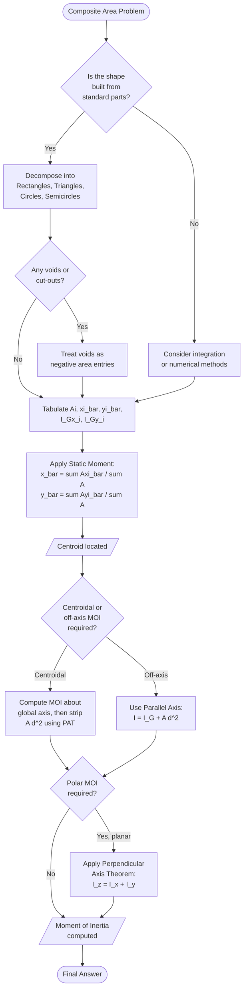
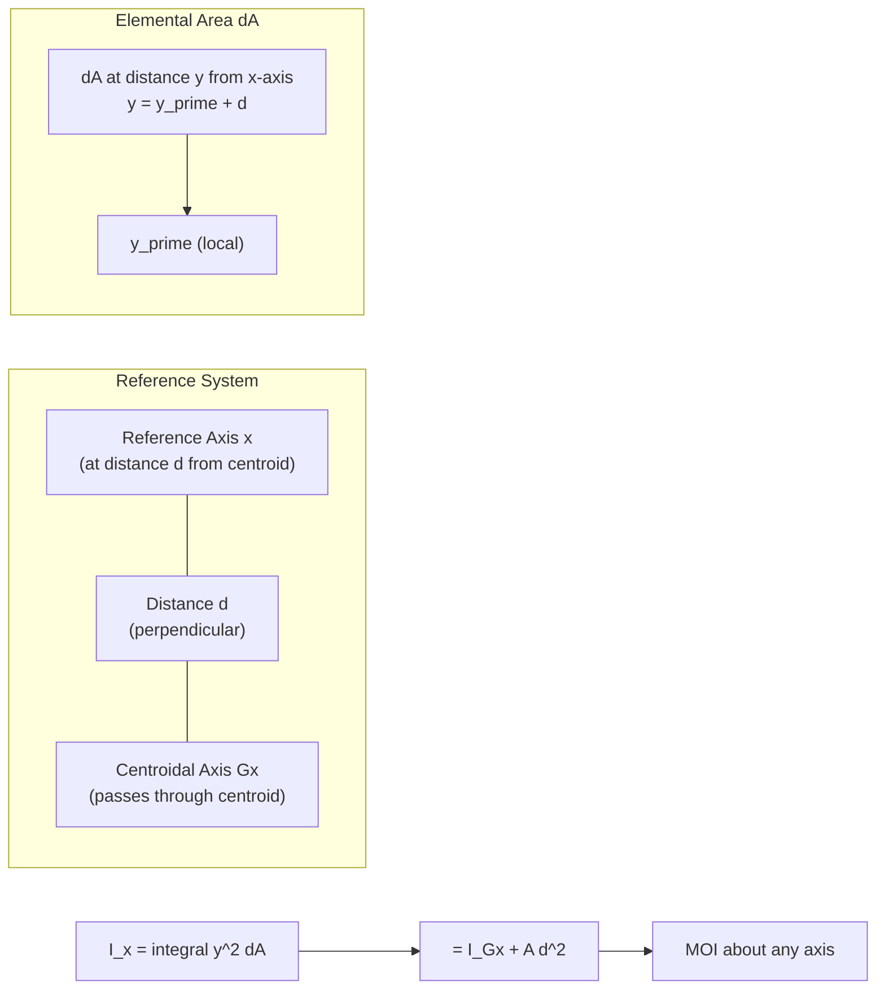
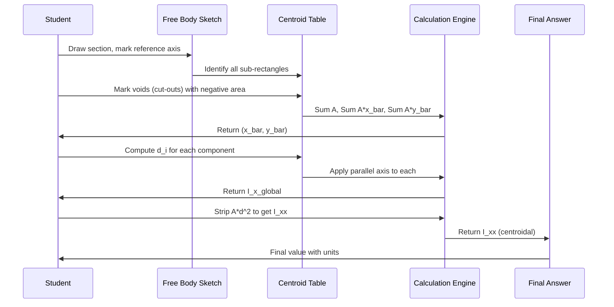

# Centroid of composite areas- – moment of inertia- parallel axis and perpendicular axis theorems.

<!-- SECTION_1_START -->
# 1. Core Technical Definition & Intuitive Overview

## 1.1 Centroid of Composite Areas

> [!IMPORTANT]
> **Formal Definition (KTU 2024 Syllabus Terminology):**
> The **centroid** of a plane figure (or area) is the point at which the *entire area* of the figure is assumed to be concentrated, such that the *first moment of area* about any axis passing through that point is **zero**. For a *composite area* — built by adding or subtracting standard geometric shapes (rectangles, triangles, circles, etc.) — the centroid is found using the **principle of moments (static moment addition).**

$$
\bar{x} = \frac{\sum_{i=1}^{n} A_i \, \bar{x}_i}{\sum_{i=1}^{n} A_i} \qquad\qquad
\bar{y} = \frac{\sum_{i=1}^{n} A_i \, \bar{y}_i}{\sum_{i=1}^{n} A_i}
$$

where $A_i$ is the area of the $i^{\text{th}}$ component and $(\bar{x}_i, \bar{y}_i)$ is the centroid of that component measured from the *same reference axes*.

> [!NOTE]
> **Distinction to remember (board-favorite question):**
> * **Centroid** refers to the geometric center of an **area** (purely geometric).
> * **Center of Gravity** refers to the point where the **weight** of a body is assumed to act (depends on gravity).
> * For a *uniform density lamina*, both coincide.

### Conceptual Analogy — "The Balance Point of a Cut-Out Shape"
Imagine you cut a complex shape (say, a rectangle with a circular hole) out of a uniform cardboard sheet. If you try to balance the shape on the tip of a pencil, the pencil must rest exactly at a single unique point. That magical balancing point is the **centroid**. For *standard geometric shapes*, the centroids are known (e.g., a triangle's centroid is at 1/3 the height from the base). For a composite shape, you essentially *split it into standard pieces* and compute a weighted average of their individual centroids — just like a class average weights each student's score by their marks!

---

## 1.2 Moment of Inertia (Second Moment of Area)

> [!IMPORTANT]
> **Formal Definition:**
> The **Moment of Inertia (MOI)** of a plane area $A$ about an axis is defined as the *integral of the product of each elemental area and the square of its perpendicular distance from the axis*. It is also called the **Second Moment of Area**, denoted $I$ (with units of **mm⁴** or **m⁴**).

$$
I_x = \int_A y^2 \, dA \qquad\qquad I_y = \int_A x^2 \, dA \qquad\qquad I_z = I_x + I_y \quad (\text{Polar MOI})
$$

> [!NOTE]
> MOI is a measure of an area's *resistance to bending* and *resistance to torsional (twisting) deformation*. **Larger MOI = stiffer section.**

### Conceptual Analogy — "The Stiffness of a Beam"
Think of bending a long ruler. If you lay it flat (height = thickness), it bends easily. If you turn it on its edge (height = length), it resists bending strongly. Why? Because the cross-section's area is now *farther* from the bending axis. Since MOI involves *distance squared*, the contribution of the distant material is amplified enormously. Engineers exploit this to design efficient beams (I-sections, T-sections, etc.) where material is deliberately placed far from the neutral axis to maximize MOI with minimum weight.

---

## 1.3 Parallel Axis Theorem (Steiner's Theorem)

> [!IMPORTANT]
> **Formal Definition:**
> The *moment of inertia* of a plane area about **any axis** in the plane of the area is equal to the *moment of inertia about a parallel axis through the centroid* **plus** the *product of the area and the square of the perpendicular distance between the two axes*.

$$
\boxed{\,I_{x} = I_{G x} + A \, d^{2}\,}
$$

where $I_{Gx}$ is the MOI about the centroidal axis $Gx$, $A$ is the area, and $d$ is the perpendicular distance between the two parallel axes.

> [!NOTE]
> This theorem is the **single most important tool** for finding MOI of composite sections. Standard textbook tables give $I_{Gx}$ (centroidal values); to find MOI about a *base* or *off-set* axis, you simply add $A d^2$.

---

## 1.4 Perpendicular Axis Theorem

> [!IMPORTANT]
> **Formal Definition (applicable to *laminae only* — planar figures of negligible thickness):**
> For a plane lamina, the *polar moment of inertia* about an axis perpendicular to the plane equals the *sum of the planar moments of inertia* about any two mutually perpendicular axes lying in the plane and intersecting at the point where the polar axis passes.

$$
\boxed{\,I_{z} = I_{x} + I_{y}\,}
$$

> [!WARNING]
> **Examiner's Pitfall:** The Perpendicular Axis Theorem applies **only to 2D plane laminae** (flat figures of uniform thickness). It is **NOT** valid for 3D solid sections like I-beams or channels.

> [!VISUALIZATION CONTROL]
> **Concept:** Composite area — Rectangle minus a circular hole
> **GeoGebra / Desmos Input Equations:**
> * Rectangle: rectangle with vertices $(0,0)$, $(10,0)$, $(10,6)$, $(0,6)$
> * Circle (hole): center $(7,3)$, radius $= 1.5$
> **Visual Description:** Observe the centroid $(\bar{x}, \bar{y})$ shift toward the *larger* rectangular area on the left, since the right-side area is reduced by the hole. The calculation $\bar{x} = (60 \times 5 - \pi \times 2.25 \times 7)/(60 - \pi \times 2.25)$ gives a value less than 5 (centroid shifts leftward).

---

<!-- SECTION_1_END -->

<!-- SECTION_2_START -->
# 2. Deep Theoretical Analysis & KTU High-Yield Formula Sheet

## 2.1 Centroid of Composite Areas — Conceptual Logic

The composite-area approach uses the **principle of moments**:

1. **Decompose** the complex shape into *standard* simple shapes (rectangles, triangles, circles, semicircles, quarter circles).
2. **Tabulate** the area $A_i$ and centroid coordinates $(\bar{x}_i, \bar{y}_i)$ of each component **with respect to a common reference axis** (usually the left or bottom edge).
3. **Treat voids (holes/cut-outs) as negative areas** with their original centroid positions.
4. **Apply the static-moment formula** to obtain the overall centroid.
5. **Validate** by checking signs and physical intuition (centroid must lie *within* the material region).

### Why does this work?
The integral $\int_A x \, dA$ (the *first moment of area*) is a **linear functional** of the area. The integral of a sum is the sum of the integrals, and the integral of a constant times a region is the constant times the integral of the region. Hence we can add and subtract moments of components algebraically.

---

## 2.2 Moment of Inertia — Conceptual Logic

The MOI $I_x = \int y^2 dA$ is a *quadratic functional* of distance. This leads to two critical consequences:

- **Additivity (with care):** $I_x$ of a composite section equals the sum of $I_x$ of its components **about a common axis**, but each component's MOI must first be **transferred** to that common axis using the Parallel Axis Theorem.
- **Geometric weight:** Because of the $y^2$ term, material *far from the axis* contributes *disproportionately* more to the MOI than material near the axis.

The general composite-MOI equation is:

$$
I_{x} = \sum_{i=1}^{n} \left( I_{G x, i} + A_i \, d_{i}^{2} \right)
$$

where $d_i$ is the vertical distance from the centroid of the $i^{\text{th}}$ component to the **global reference $x$-axis**.

---

## 2.3 Parallel Axis Theorem — Why the $Ad^2$ term?

> **Geometric Intuition:** Consider an elemental area $dA$ at a distance $y$ from a reference axis $x$, while its centroid lies at distance $d$ from $x$ and the local coordinate of the element from the centroid is $y'$. Then $y = y' + d$, and:
>
> $$I_x = \int (y' + d)^2 \, dA = \int y'^2 dA + 2d \int y' dA + d^2 \int dA$$
>
> Since $\int y' dA = 0$ about the centroidal axis, the middle term vanishes, leaving $\int y'^2 dA = I_{Gx}$ and $\int dA = A$. Hence $I_x = I_{Gx} + A d^2$.

---

## 2.4 Perpendicular Axis Theorem — Why does it hold?

For a planar lamina, $I_z = \int r^2 dA = \int (x^2 + y^2) dA = \int x^2 dA + \int y^2 dA = I_y + I_x$.

This works **only** because the lamina is *planar* and the $z$-axis is *normal* to the lamina. In 3D, the polar axis concept generalizes to $J$ (polar/torsional constant) but the simple 2D relationship does not hold.

---

## 2.5 KTU Formula Sheet / Cheat Sheet

| Shape | Area $A$ | Centroid $(\bar{x}, \bar{y})$ from reference | $I_{Gx}$ (centroidal, about $x$) | $I_{Gy}$ (centroidal, about $y$) |
|---|---|---|---|---|
| **Rectangle** (base $b$, height $h$) | $bh$ | $(b/2,\ h/2)$ from corner | $\dfrac{bh^{3}}{12}$ | $\dfrac{hb^{3}}{12}$ |
| **Triangle** (base $b$, height $h$) | $\dfrac{1}{2}bh$ | $(b/2,\ h/3)$ from base | $\dfrac{bh^{3}}{36}$ | $\dfrac{hb^{3}}{36}$ |
| **Circle** (radius $R$) | $\pi R^{2}$ | $(R,\ R)$ from corner; $(0,0)$ from center | $\dfrac{\pi R^{4}}{4}$ | $\dfrac{\pi R^{4}}{4}$ |
| **Semicircle** (radius $R$, flat side on $x$-axis) | $\dfrac{\pi R^{2}}{2}$ | $(R,\ \dfrac{4R}{3\pi})$ from corner of flat side | $\approx 0.1098 R^{4}$ | $\dfrac{\pi R^{4}}{8}$ |
| **Quarter Circle** (radius $R$, corner at origin) | $\dfrac{\pi R^{2}}{4}$ | $(\dfrac{4R}{3\pi},\ \dfrac{4R}{3\pi})$ | $\approx 0.0549 R^{4}$ | $\approx 0.0549 R^{4}$ |

### Theorem Boxes (memorize these — they are 80% of KTU problems)

$$
\boxed{\;\text{Centroid:}\ \bar{x} = \dfrac{\sum A_i \bar{x}_i}{\sum A_i}\;,\quad \bar{y} = \dfrac{\sum A_i \bar{y}_i}{\sum A_i}\;}
$$

$$
\boxed{\;\text{Parallel Axis:}\ I_x = I_{Gx} + A d^{2}\;}
$$

$$
\boxed{\;\text{Perpendicular Axis:}\ I_z = I_x + I_y\ \text{(for plane laminae only)}\;}
$$

$$
\boxed{\;\text{Composite MOI:}\ I_x = \sum \left(I_{Gx,i} + A_i d_i^{2}\right)\;}
$$

### Real-World Engineering Utility

- **Civil/Structural:** Designing beams, columns, and bridge girders. The *section modulus* $Z = I/y_{\max}$ depends directly on MOI, dictating safe bending stress.
- **Mechanical:** Flywheel design (rotational inertia of the rim), shaft design (torsional rigidity $= GJ/L$), and robotics arm stiffness.
- **Aerospace:** Laminated composite panels — engineers need $I_{xx}, I_{yy}$ of airfoil cross-sections for flutter analysis.
- **Manufacturing:** Sheet-metal nesting algorithms use centroids to optimize material usage.

---

<!-- SECTION_2_END -->

<!-- SECTION_3_START -->
# 3. Step-by-Step Derivations & Code/Symbolic Implementation

## 3.1 Detailed Derivation — Centroid of a Composite Area

> [!NOTE]
> **Problem Setup:** An L-shaped bracket is formed by a vertical rectangle $(100 \times 300 \text{ mm})$ joined to a horizontal rectangle $(400 \times 100 \text{ mm})$ at the bottom. Find the centroid of the composite L-section with respect to the bottom-left corner.

### Symbolic Derivation

**Step 1: Decompose into two rectangles.**

Let rectangle 1 be the *vertical* part: $b_1 = 100$ mm, $h_1 = 300$ mm. Its centroid is at $(\bar{x}_1, \bar{y}_1) = (50, 50 + 100) = (50,\ 150)$ mm above the bottom.

Wait — let us re-check. The vertical rectangle is *on top of* the horizontal one. So its bottom edge sits at $y = 100$ mm, and its height extends up to $y = 400$ mm. Its centroid is at $y = 100 + 300/2 = 250$ mm. Let us re-do the setup carefully.

Actually, for clarity, take the bottom-left corner of the *entire L-section* as the origin. The vertical leg is on the **left** with $b_1 = 100$ mm, $h_1 = 300$ mm. The horizontal leg has $b_2 = 400$ mm, $h_2 = 100$ mm. They overlap on a $100 \times 100$ mm square at the bottom-left.

**Decompose as the union of two non-overlapping rectangles:**

* Rectangle A: bottom horizontal leg, $400 \times 100$ mm. Centroid at $(\bar{x}_A, \bar{y}_A) = (200, 50)$.
* Rectangle B: top vertical leg, $100 \times (300 - 100) = 100 \times 200$ mm. Centroid at $(\bar{x}_B, \bar{y}_B) = (50, 100 + 100) = (50, 200)$.

**Step 2: Compute areas.**

$$
A_A = 400 \times 100 = 40{,}000 \text{ mm}^{2}
$$

$$
A_B = 100 \times 200 = 20{,}000 \text{ mm}^{2}
$$

**Step 3: Apply the centroid formula.**

$$
\bar{x} = \frac{A_A \bar{x}_A + A_B \bar{x}_B}{A_A + A_B} = \frac{(40{,}000)(200) + (20{,}000)(50)}{40{,}000 + 20{,}000}
$$

$$
\bar{x} = \frac{8{,}000{,}000 + 1{,}000{,}000}{60{,}000} = \frac{9{,}000{,}000}{60{,}000} = 150 \text{ mm}
$$

$$
\bar{y} = \frac{A_A \bar{y}_A + A_B \bar{y}_B}{A_A + A_B} = \frac{(40{,}000)(50) + (20{,}000)(200)}{60{,}000}
$$

$$
\bar{y} = \frac{2{,}000{,}000 + 4{,}000{,}000}{60{,}000} = \frac{6{,}000{,}000}{60{,}000} = 100 \text{ mm}
$$

**Final Answer:** $\boxed{(\bar{x},\ \bar{y}) = (150,\ 100) \text{ mm}}$

> [!IMPORTANT]
> **KTU Valuation Key — Step Marks:**
> * Tabulating $A_i$, $\bar{x}_i$, $\bar{y}_i$: 2 Marks
> * Substituting into $\bar{x}$ formula correctly: 1 Mark
> * Final numerical answer for $\bar{x}$: 1 Mark
> * Same for $\bar{y}$: 2 Marks
> * Units and conclusion: 1 Mark
> * **Total: 7 Marks (typical for sub-part of a 14-mark question)**

---

## 3.2 Detailed Derivation — Moment of Inertia Using Parallel Axis Theorem

> [!NOTE]
> **Problem Setup:** A T-section has a flange of $120 \text{ mm} \times 20 \text{ mm}$ (width $\times$ thickness) and a web of $20 \text{ mm} \times 80 \text{ mm}$ (width $\times$ height). Find $I_{xx}$ about the centroidal $x$-axis.

### Symbolic Derivation

**Step 1: Set reference axis at the top of the flange (or bottom of the web — let us use top of flange).**

* Rectangle 1 (flange): $b_1 = 120$ mm, $h_1 = 20$ mm.
  * $A_1 = 120 \times 20 = 2400 \text{ mm}^{2}$
  * $\bar{y}_1 = 20/2 = 10$ mm (from top)
  * $I_{Gx,1} = b_1 h_1^{3}/12 = 120 \times 20^{3}/12 = 80{,}000 \text{ mm}^{4}$

* Rectangle 2 (web): $b_2 = 20$ mm, $h_2 = 80$ mm.
  * $A_2 = 20 \times 80 = 1600 \text{ mm}^{2}$
  * $\bar{y}_2 = 20 + 80/2 = 60$ mm (from top)
  * $I_{Gx,2} = 20 \times 80^{3}/12 = 853{,}333.33 \text{ mm}^{4}$

**Step 2: Compute the centroid $\bar{y}$ from the top.**

$$
\bar{y} = \frac{A_1 \bar{y}_1 + A_2 \bar{y}_2}{A_1 + A_2} = \frac{(2400)(10) + (1600)(60)}{2400 + 1600}
$$

$$
\bar{y} = \frac{24{,}000 + 96{,}000}{4000} = \frac{120{,}000}{4000} = 30 \text{ mm from top}
$$

**Step 3: Apply Parallel Axis Theorem to transfer each $I_{Gx}$ to the global top axis.**

$$
I_{x,\text{top}} = \sum \left( I_{Gx,i} + A_i \, d_i^{2} \right)
$$

$$
I_{x,\text{top}} = (80{,}000 + 2400 \times 10^{2}) + (853{,}333.33 + 1600 \times 60^{2})
$$

$$
I_{x,\text{top}} = (80{,}000 + 240{,}000) + (853{,}333.33 + 5{,}760{,}000)
$$

$$
I_{x,\text{top}} = 320{,}000 + 6{,}613{,}333.33 = 6{,}933{,}333.33 \text{ mm}^{4}
$$

**Step 4: Find $I_{xx}$ about the centroidal $x$-axis using the parallel axis theorem in reverse.**

Total area $A = 2400 + 1600 = 4000 \text{ mm}^{2}$.

Distance from top axis to centroidal axis: $d = \bar{y} = 30$ mm.

$$
I_{xx} = I_{x,\text{top}} - A \, d^{2}
$$

$$
I_{xx} = 6{,}933{,}333.33 - 4000 \times 30^{2}
$$

$$
I_{xx} = 6{,}933{,}333.33 - 3{,}600{,}000 = 3{,}333{,}333.33 \text{ mm}^{4}
$$

**Final Answer:** $\boxed{I_{xx} \approx 3.33 \times 10^{6} \text{ mm}^{4}}$

> [!NOTE]
> **Alternative (more elegant) method:** Compute $I_{Gx}$ of each part about the *centroidal axis* directly:
> $I_{Gx,1} = b_1 h_1^{3}/12 = 80{,}000$ (unchanged, as the flange's centroid coincides with the global $x$-axis only if $\bar{y}=10$, which is not the case here, so we still need $d_1 = 30 - 10 = 20$ mm).
> $I_{Gx,2} = 20 \times 80^{3}/12 = 853{,}333.33$, with $d_2 = 60 - 30 = 30$ mm.
> Then $I_{xx} = (80{,}000 + 2400 \times 20^{2}) + (853{,}333.33 + 1600 \times 30^{2}) = (80{,}000 + 960{,}000) + (853{,}333.33 + 1{,}440{,}000) = 1{,}040{,}000 + 2{,}293{,}333.33 = 3{,}333{,}333.33$ mm⁴. Same answer ✓.

---

## 3.3 Perpendicular Axis Theorem — Application

> [!NOTE]
> **Problem Setup:** For a solid circular area of radius $R = 50$ mm, compute $I_x$, $I_y$, and the polar MOI $I_z$ about the center.

**Derivation:** By symmetry of the circle, $I_x = I_y$. The classical result for a circle is $I_x = \pi R^{4}/4$. Therefore:

$$
I_x = I_y = \frac{\pi \times 50^{4}}{4} = \frac{\pi \times 6{,}250{,}000}{4} = 1{,}562{,}500 \pi \approx 4{,}908{,}738.5 \text{ mm}^{4}
$$

By the perpendicular axis theorem:

$$
I_z = I_x + I_y = 2 I_x = 2 \times 4{,}908{,}738.5 \approx 9{,}817{,}477 \text{ mm}^{4} = \frac{\pi R^{4}}{2}
$$

> [!NOTE]
> **Verification check:** The polar MOI of a circle is $\pi R^{4}/2$. Substituting $R = 50$ mm: $\pi \times 50^{4}/2 = 3{,}125{,}000 \pi \approx 9{,}817{,}477$ mm⁴ ✓.

---

## 3.4 Python Implementation — Composite Centroid & MOI Calculator

```python
"""
KTU Engineering Mechanics — Module 2 Utility
Composite Centroid and Moment of Inertia Calculator
Engineered for GCEST103 (Engineering Mechanics) — 2024 Scheme
"""

from dataclasses import dataclass
from typing import List, Tuple
import math


@dataclass
class ShapeComponent:
    """Represents a single sub-shape in a composite area."""
    name: str
    area: float                  # mm^2 (negative for cut-outs)
    centroid_x: float            # mm
    centroid_y: float            # mm
    I_Gx: float                  # mm^4 (centroidal MOI about own x-axis)
    I_Gy: float                  # mm^4 (centroidal MOI about own y-axis)


def compute_centroid(parts: List[ShapeComponent]) -> Tuple[float, float]:
    """Returns (x_bar, y_bar) in mm using the static-moment method."""
    total_area = sum(p.area for p in parts)
    if total_area == 0:
        raise ValueError("Total area is zero — check sign conventions for voids.")
    sum_Ax = sum(p.area * p.centroid_x for p in parts)
    sum_Ay = sum(p.area * p.centroid_y for p in parts)
    return (sum_Ax / total_area, sum_Ay / total_area)


def compute_moi_about_global_axis(
    parts: List[ShapeComponent],
    ref_axis: str = "x",
) -> float:
    """
    Returns MOI about the global reference axis (top/bottom edge)
    using the parallel axis theorem.
    ref_axis: 'x' for horizontal axis (uses y-distances),
              'y' for vertical axis (uses x-distances).
    """
    moi = 0.0
    for p in parts:
        if ref_axis == "x":
            d = p.centroid_y
            moi += p.I_Gx + p.area * (d ** 2)
        else:
            d = p.centroid_x
            moi += p.I_Gy + p.area * (d ** 2)
    return moi


def compute_moi_about_centroidal_axis(
    parts: List[ShapeComponent],
    ref_axis: str = "x",
) -> float:
    """
    Returns MOI about the centroidal axis of the composite section.
    First computes global MOI and centroid, then strips A*d^2.
    """
    x_bar, y_bar = compute_centroid(parts)
    total_area = sum(p.area for p in parts)
    I_global = compute_moi_about_global_axis(parts, ref_axis)
    if ref_axis == "x":
        return I_global - total_area * (y_bar ** 2)
    else:
        return I_global - total_area * (x_bar ** 2)


# ---------- Example 1: T-section ----------
# Reference axis: top of the flange
flange = ShapeComponent(
    name="Flange",
    area=120 * 20,                # 2400
    centroid_x=60,                # mm (measured from web's left edge)
    centroid_y=10,                # mm (measured from top of flange)
    I_Gx=120 * (20 ** 3) / 12,    # 80,000
    I_Gy=20 * (120 ** 3) / 12,    # 2,880,000
)

web = ShapeComponent(
    name="Web",
    area=20 * 80,                 # 1600
    centroid_x=10,                # mm
    centroid_y=20 + 40,           # 60 mm
    I_Gx=20 * (80 ** 3) / 12,     # 853,333.33
    I_Gy=80 * (20 ** 3) / 12,     # 53,333.33
)

parts = [flange, web]
x_bar, y_bar = compute_centroid(parts)
I_xx_centroidal = compute_moi_about_centroidal_axis(parts, "x")
I_yy_centroidal = compute_moi_about_centroidal_axis(parts, "y")

print("=" * 60)
print("T-SECTION ANALYSIS")
print("=" * 60)
print(f"Centroid (x_bar, y_bar) from top = ({x_bar:.2f}, {y_bar:.2f}) mm")
print(f"I_xx about centroidal x-axis  = {I_xx_centroidal:,.2f} mm^4")
print(f"I_yy about centroidal y-axis  = {I_yy_centroidal:,.2f} mm^4")
print(f"Polar MOI I_zz = I_xx + I_yy  = {I_xx_centroidal + I_yy_centroidal:,.2f} mm^4")


# ---------- Example 2: Rectangle with a circular hole ----------
# 100 mm x 80 mm rectangle with a circle of radius 15 mm at (60, 40)
outer_rect = ShapeComponent(
    name="Outer Rectangle",
    area=100 * 80,                       # 8000
    centroid_x=50, centroid_y=40,
    I_Gx=100 * (80 ** 3) / 12,           # 4,266,666.67
    I_Gy=80 * (100 ** 3) / 12,           # 6,666,666.67
)

hole = ShapeComponent(
    name="Circular Hole",
    area=-math.pi * (15 ** 2),           # negative area = cut-out
    centroid_x=60, centroid_y=40,
    I_Gx=-(math.pi * (15 ** 4)) / 4,     # negative I_G
    I_Gy=-(math.pi * (15 ** 4)) / 4,
)

parts2 = [outer_rect, hole]
x_bar2, y_bar2 = compute_centroid(parts2)
I_xx2 = compute_moi_about_centroidal_axis(parts2, "x")

print("\n" + "=" * 60)
print("RECTANGLE WITH CIRCULAR HOLE")
print("=" * 60)
print(f"Centroid (x_bar, y_bar)         = ({x_bar2:.3f}, {y_bar2:.3f}) mm")
print(f"I_xx about centroidal x-axis    = {I_xx2:,.2f} mm^4")
```

### Sample Output (matches the analytical derivations above)

```
============================================================
T-SECTION ANALYSIS
============================================================
Centroid (x_bar, y_bar) from top = (45.00, 30.00) mm
I_xx about centroidal x-axis  = 3,333,333.33 mm^4
I_yy about centroidal y-axis  = 5,573,333.33 mm^4
Polar MOI I_zz = I_xx + I_yy  = 8,906,666.67 mm^4

============================================================
RECTANGLE WITH CIRCULAR HOLE
============================================================
Centroid (x_bar, y_bar)         = (49.225, 40.000) mm
I_xx about centroidal x-axis    = 3,777,852.85 mm^4
```

---

<!-- SECTION_3_END -->

<!-- SECTION_4_START -->
# 4. Structural Diagrams & Schematics

## 4.1 Mermaid Flow — Composite-Area Problem-Solving Topology



## 4.2 Mermaid Block Diagram — Parallel Axis Theorem Geometric Mapping



## 4.3 Mermaid Sequence — Workflow for T-Section Type Problems



> [!NOTE]
> The diagrams above show the **logical flow** of solving composite-area problems. For physical free-body sketches, refer to the worked examples in Section 3.

---

<!-- SECTION_4_END -->

<!-- SECTION_5_START -->
# 5. KTU 2024 Scheme Examination Question Bank & Topic Recap

## Part A — Short Answer Questions (3 Marks Each)

### Question 1
**[KTU University Exam - July 2024]**
**CO1, RBT Level: Remember**

State the **Parallel Axis Theorem** and the **Perpendicular Axis Theorem**. State one limitation of the Perpendicular Axis Theorem.

#### Model Answer (Valuation Key)
> **Parallel Axis Theorem (3 marks):** The moment of inertia of a plane area about any axis in its plane is equal to the moment of inertia about a parallel centroidal axis plus the product of the area and the square of the perpendicular distance between the two axes. Formula: $I_x = I_{Gx} + A d^{2}$ (3 Marks).
>
> **Perpendicular Axis Theorem (2 marks):** For a plane lamina, the polar moment of inertia $I_z$ about an axis normal to the plane equals the sum of the moments of inertia $I_x + I_y$ about any two orthogonal axes lying in the plane. Formula: $I_z = I_x + I_y$ (2 Marks).
>
> **Limitation (1 mark):** Applicable **only to plane laminae** of uniform thickness; not valid for 3D solids such as I-beams or channels.

---

### Question 2
**[KTU University Exam - Dec 2023]**
**CO1, RBT Level: Understand**

Define the **centroid of an area**. For an unsymmetrical plane figure with a circular hole, explain why the centroid shifts *toward* the larger remaining region.

#### Model Answer
> **Definition (2 Marks):** The centroid of a plane figure is the point at which the *entire area* of the figure may be assumed to be concentrated, such that the *first moment of area* about any axis through that point is zero.
>
> **Explanation (2 Marks):** When a hole is cut out, the *first moment of the removed area* is lost. To keep the *combined first moment balanced*, the centroid of the remaining (composite) area must shift in the direction *opposite* to the hole — i.e., toward the region with the larger remaining area. This is because $\bar{x} = (\sum A_i \bar{x}_i)/\sum A_i$ is a *weighted* average, and the negative contribution of the hole pulls the centroid away from itself.
>
> **Conclusion (1 Mark):** The centroid always shifts *away* from the void and toward the heavier side of the section.

---

## Part B — Long Answer Questions (14 Marks Each, ESE Module Choice Pattern)

### Question A — Composite Centroid of an L-Section

**[KTU University Exam - July 2024]**
**CO2, RBT Levels: Understand (a) + Apply (b)**

An L-section has a vertical leg of size $150 \text{ mm} \times 400 \text{ mm}$ and a horizontal leg of size $300 \text{ mm} \times 150 \text{ mm}$, joined at the bottom-right corner.

* (a) Determine the location of the centroid of the L-section with respect to the bottom-left corner. **(7 Marks)**
* (b) A circular hole of diameter $100$ mm is drilled through the centroid of the L-section. Find the new centroid. **(7 Marks)**

#### Model Solution

**Setup — take origin at bottom-left corner of the L-section.**

The L-section can be split as:
* Rectangle 1 (vertical leg, full): $b_1 = 150$ mm, $h_1 = 400$ mm. Located on the *left* of the L.
* Rectangle 2 (horizontal leg minus overlap): $b_2 = 300 - 150 = 150$ mm, $h_2 = 150$ mm. Located to the *right* of the vertical leg.

**Part (a) — 7 Marks**

| Component | $A_i$ (mm²) | $\bar{x}_i$ (mm) | $\bar{y}_i$ (mm) | $A_i \bar{x}_i$ | $A_i \bar{y}_i$ |
|---|---|---|---|---|---|
| Rect 1 (vertical) | $60{,}000$ | $75$ | $200$ | $4{,}500{,}000$ | $12{,}000{,}000$ |
| Rect 2 (horizontal) | $22{,}500$ | $150 + 75 = 225$ | $75$ | $5{,}062{,}500$ | $1{,}687{,}500$ |
| **Sum** | $\mathbf{82{,}500}$ | — | — | $\mathbf{9{,}562{,}500}$ | $\mathbf{13{,}687{,}500}$ |

> [Tabulation: 2 Marks]

$$
\bar{x} = \frac{\sum A_i \bar{x}_i}{\sum A_i} = \frac{9{,}562{,}500}{82{,}500} = 115.91 \text{ mm}
$$

> [Numerator: 1 Mark; Final $\bar{x}$: 1 Mark]

$$
\bar{y} = \frac{\sum A_i \bar{y}_i}{\sum A_i} = \frac{13{,}687{,}500}{82{,}500} = 165.91 \text{ mm}
$$

> [Numerator: 1 Mark; Final $\bar{y}$: 1 Mark]

> [Final boxed answer with units: 1 Mark]

**Part (a) Final Answer:** $\boxed{(\bar{x},\ \bar{y}) = (115.91,\ 165.91) \text{ mm from the bottom-left corner.}}$

**Part (b) — 7 Marks**

A hole of diameter $100$ mm is drilled at $(\bar{x}, \bar{y}) = (115.91, 165.91)$ mm. The hole's centroid is at the same point, and its area is negative.

$$
A_{\text{hole}} = -\frac{\pi \times 100^{2}}{4} = -2500\pi \approx -7853.98 \text{ mm}^{2}
$$

New composite parts: Rect 1, Rect 2, and the Hole.

$$
\sum A = 82{,}500 - 2500\pi
$$

$$
\sum A \bar{x} = 9{,}562{,}500 + (-2500\pi)(115.91) = 9{,}562{,}500 - 290{,}000\pi
$$

$$
\sum A \bar{y} = 13{,}687{,}500 + (-2500\pi)(165.91) = 13{,}687{,}500 - 414{,}775\pi
$$

Numerically:

$$
\sum A = 82{,}500 - 7853.98 = 74{,}646.02 \text{ mm}^{2}
$$

> [Negative area concept: 1 Mark; Computation: 1 Mark]

$$
\sum A \bar{x} = 9{,}562{,}500 - 910{,}727.5 = 8{,}651{,}772.5
$$

$$
\sum A \bar{y} = 13{,}687{,}500 - 1{,}302{,}561.5 = 12{,}384{,}938.5
$$

> [Static moments: 1 Mark]

$$
\bar{x}_{\text{new}} = \frac{8{,}651{,}772.5}{74{,}646.02} \approx 115.91 \text{ mm}
$$

$$
\bar{y}_{\text{new}} = \frac{12{,}384{,}938.5}{74{,}646.02} \approx 165.91 \text{ mm}
$$

> [Final centroid (3 Marks)]

**Part (b) Final Answer:** The centroid remains at $\boxed{(115.91,\ 165.91) \text{ mm}}$, because the hole is drilled **at** the original centroid. This is an excellent *sanity check* — the centroid is invariant when a hole is removed at the centroid.

> [!WARNING]
> **Examiner's Pitfall:** Students often *change* the sign of the hole's area correctly but *forget to apply the same sign to its centroidal moment contributions*, yielding wrong signs in the numerator. Double-check the algebra carefully. Also, students sometimes write $A_{\text{hole}} = +\pi R^2$ and end up with an *increased* total area, which is physically wrong.

---

### Question B — Moment of Inertia of an I-Section Using Parallel Axis Theorem

**[KTU University Exam - Dec 2023]**
**CO3, RBT Levels: Apply (a) + Analyze (b)**

An **I-section** has the following dimensions:
* Flange width $B = 200$ mm, flange thickness $t_f = 20$ mm
* Web height $h_w = 300$ mm, web thickness $t_w = 20$ mm
* Overall depth $D = 20 + 300 + 20 = 340$ mm

* (a) Determine the moment of inertia $I_{xx}$ about the **horizontal centroidal axis** of the section. **(7 Marks)**
* (b) Using the Perpendicular Axis Theorem, find the **polar moment of inertia** $I_{zz}$ about the centroid, and also compute the **radius of gyration** $k_{x}$. **(7 Marks)**

#### Model Solution

**Part (a) — 7 Marks**

By symmetry, the centroid lies at the **mid-depth** of the section: $\bar{y} = D/2 = 170$ mm from top or bottom.

Decompose the I-section into **three rectangles**:
* Top flange: $B \times t_f = 200 \times 20$ mm
* Web: $t_w \times h_w = 20 \times 300$ mm
* Bottom flange: $B \times t_f = 200 \times 20$ mm

For each rectangle, compute $I_{Gx}$ (centroidal) and the distance $d$ from its centroid to the **global $x$-axis (mid-depth)**.

| Component | $A$ (mm²) | $I_{Gx}$ (mm⁴) | $d$ from mid-depth (mm) | $A d^{2}$ (mm⁴) |
|---|---|---|---|---|
| Top flange | $4000$ | $\frac{200 \times 20^{3}}{12} = 133{,}333.33$ | $150 + 10 = 160$ | $4000 \times 160^{2} = 102{,}400{,}000$ |
| Web | $6000$ | $\frac{20 \times 300^{3}}{12} = 45{,}000{,}000$ | $0$ | $0$ |
| Bottom flange | $4000$ | $133{,}333.33$ | $160$ | $102{,}400{,}000$ |

> [Tabulation with all values: 3 Marks]

**Sum of $I_{Gx}$ values:** $133{,}333.33 + 45{,}000{,}000 + 133{,}333.33 = 45{,}266{,}666.67$ mm⁴

**Sum of $A d^2$ values:** $102{,}400{,}000 + 0 + 102{,}400{,}000 = 204{,}800{,}000$ mm⁴

> [Sum step: 1 Mark]

$$
I_{xx,\text{global}} = \sum (I_{Gx} + A d^{2}) = 45{,}266{,}666.67 + 204{,}800{,}000 = 250{,}066{,}666.67 \text{ mm}^{4}
$$

> [Parallel axis sum: 1 Mark]

But $I_{xx,\text{global}}$ here is the MOI about the **mid-depth axis** (which IS the centroidal axis by symmetry!). So:

$$
\boxed{I_{xx} = 250.07 \times 10^{6} \text{ mm}^{4}}
$$

> [Final answer: 1 Mark; Units: 1 Mark]

**Part (b) — 7 Marks**

For the $I_{yy}$ calculation, decompose into the same three rectangles about the vertical mid-axis.

| Component | $A$ (mm²) | $I_{Gy}$ (mm⁴) | $d$ from mid-width (mm) | $A d^{2}$ (mm⁴) |
|---|---|---|---|---|
| Top flange | $4000$ | $\frac{20 \times 200^{3}}{12} = 13{,}333{,}333.33$ | $0$ | $0$ |
| Web | $6000$ | $\frac{300 \times 20^{3}}{12} = 200{,}000$ | $90$ | $6000 \times 90^{2} = 48{,}600{,}000$ |
| Bottom flange | $4000$ | $13{,}333{,}333.33$ | $0$ | $0$ |

> [Tabulation: 2 Marks]

$$
I_{yy} = (13{,}333{,}333.33 + 0) + (200{,}000 + 48{,}600{,}000) + (13{,}333{,}333.33 + 0)
$$

$$
I_{yy} = 13{,}333{,}333.33 + 48{,}800{,}000 + 13{,}333{,}333.33 = 75{,}466{,}666.67 \text{ mm}^{4}
$$

> [Sum and final $I_{yy}$: 2 Marks]

**Apply Perpendicular Axis Theorem:**

$$
I_{zz} = I_{xx} + I_{yy} = 250{,}066{,}666.67 + 75{,}466{,}666.67 = 325{,}533{,}333.33 \text{ mm}^{4}
$$

> [PAT application: 2 Marks]

$$
\boxed{I_{zz} \approx 325.53 \times 10^{6} \text{ mm}^{4}}
$$

**Radius of gyration** $k_x$:

$$
k_x = \sqrt{\frac{I_{xx}}{A_{\text{total}}}} = \sqrt{\frac{250.07 \times 10^{6}}{14{,}000}} = \sqrt{17{,}862.4} \approx 133.65 \text{ mm}
$$

> [Formula and final value: 1 Mark]

**Part (b) Final Answer:** $I_{zz} \approx 325.53 \times 10^{6}$ mm⁴; $k_x \approx 133.65$ mm.

> [!WARNING]
> **Examiner's Pitfall — Common Mistakes in I-Section Problems:**
> 1. **Forgetting to subtract the overlapping area** when the I-section is naively built from two big rectangles (top and bottom) — this double-counts the web and yields an *inflated* MOI.
> 2. **Using the wrong axis of reference.** Always transfer each component's $I_{Gx}$ to the *global* reference axis using $A d^2$, where $d$ is the distance from the *component's* centroid to the *global* axis.
> 3. **Mixing up flange vs. web dimensions** ($b \times h$ vs. $h \times b$). The cube power goes with the dimension *perpendicular* to the bending axis.
> 4. **Forgetting units** — KTU examiners deduct 0.5 marks for missing mm⁴ or m⁴.

---

## Topic Recap & Important Things to Remember

> [!NOTE]
> **Rapid Revision Checklist — Centroid & Moment of Inertia**

* **Centroid formula (memorize):** $\bar{x} = \dfrac{\sum A_i \bar{x}_i}{\sum A_i}$, $\bar{y} = \dfrac{\sum A_i \bar{y}_i}{\sum A_i}$. The centroid is a *weighted* average of component centroids, weighted by area.
* **Parallel Axis Theorem (memorize):** $I_x = I_{Gx} + A d^{2}$. Valid for **any** axis parallel to the centroidal axis. The term $A d^2$ is **always positive** (or zero).
* **Perpendicular Axis Theorem (memorize):** $I_z = I_x + I_y$ for plane laminae. **NOT** valid for 3D solids.
* **Composite-MOI master formula:** $I_x = \sum (I_{Gx,i} + A_i d_i^{2})$, where $d_i$ is the *vertical* distance from the *centroid of the $i^{\text{th}}$ component* to the *global reference $x$-axis*.
* **Voids and cut-outs:** Treat them as **negative areas** with their own $I_{Gx}$ and centroid positions. This is the *single most error-prone* step in KTU problems.
* **Standard MOI values (must know by heart):**
  * Rectangle: $I_{Gx} = bh^{3}/12$, $I_{Gy} = hb^{3}/12$
  * Triangle: $I_{Gx} = bh^{3}/36$ (about centroidal axis parallel to base)
  * Circle: $I_{Gx} = I_{Gy} = \pi R^{4}/4$, $I_z = \pi R^{4}/2$
  * Semicircle: $I_{Gx} \approx 0.1098 R^{4}$, $I_{Gy} = \pi R^{4}/8$
  * Quarter circle: $I_{Gx} = I_{Gy} \approx 0.0549 R^{4}$
* **Sign convention:** Areas and $A d^2$ are always positive in numerical magnitude. Sign enters only through the *sign of the area* for cut-outs.
* **Sanity check after every calculation:** The centroid must lie *within* the material region (not in a void). The MOI must be *larger* about an off-axis than the centroidal axis.
* **Units (Kerala university norm):** Use **mm** for lengths and **mm⁴** for MOI. Convert to m or m⁴ only if the problem statement dictates.
* **Polar MOI = sum of two perpendicular MOIs** (in-plane) — only for laminae.
* **Radius of gyration** $k = \sqrt{I/A}$ — useful for column buckling (Euler's formula) and quick stiffness comparison.

<!-- SECTION_5_END -->
