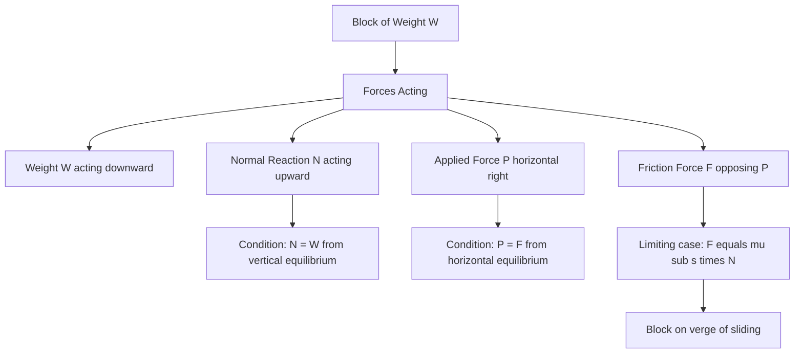
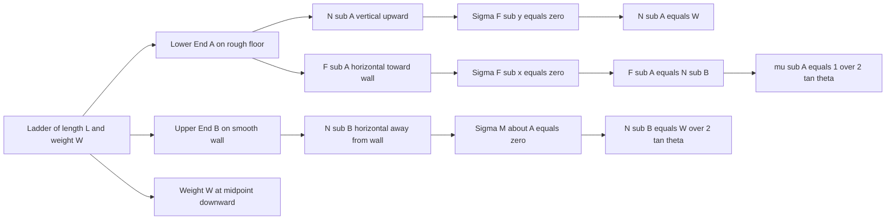
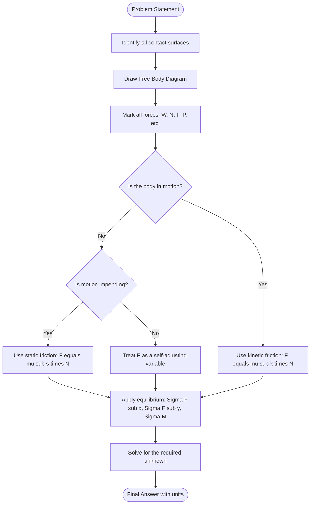
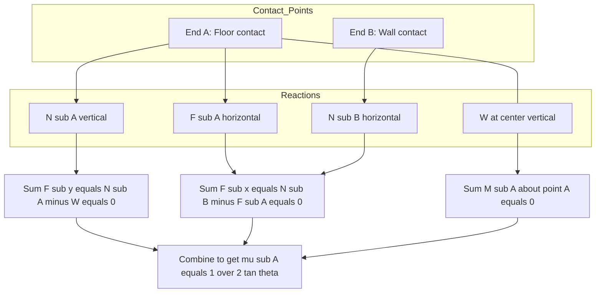

# Friction: -laws of friction – analysis of blocks and ladder

<!-- SECTION_1_START -->

# Friction: Laws of Friction and Analysis of Blocks & Ladder

## 1.1 Formal Definition (KTU 2024 Syllabus Terminology)

> [!IMPORTANT]
> **Friction** is a **tangential resistive force** that opposes the *relative motion* (or the *tendency of relative motion*) between two bodies in contact. It acts **parallel** to the contact surface and is generated due to microscopic interlocking of surface irregularities and molecular adhesion.

In the KTU 2024 Scheme module on Friction (Module 2 of *Engineering Mechanics – GCEST103*), the topic is classified into two engineering-relevant regimes:

1. **Static Friction ($F_s$):** The self-adjusting resistive force that prevents motion up to a maximum limit ($F_{s,\max} = \mu_s N$).
2. **Kinetic (Dynamic) Friction ($F_k$):** The constant resistive force that acts *after* motion has commenced ($F_k = \mu_k N$).

Here, $N$ is the **Normal Reaction** perpendicular to the contact surface, while $\mu_s$ and $\mu_k$ are **dimensionless coefficients** of static and kinetic friction, respectively.

---

## 1.2 Conceptual Analogy — The "Book on a Tilted Table" Intuition

> [!NOTE]
> **Intuitive Picture:** Imagine pushing a heavy textbook slowly across a desk. Initially, you push — and nothing happens! The book resists with a force exactly equal to your push. This is **static friction** "self-adjusting." Push harder, and at one critical push, the book *jerks* into motion. After that, it slides with a steady, smaller drag. This *constant drag* is **kinetic friction**.

A more engineering-friendly analogy is a **ladder leaning against a smooth wall**. As the ladder gets steeper, the bottom wants to slide out. The *floor* must supply enough friction to hold it. If the floor is greasy (low $\mu$), the ladder slips — even though the ladder is geometrically identical to one standing on dry concrete (high $\mu$).

**Key Insight:** Friction is **NOT a material constant** — it is a *system property* that depends on both surfaces in contact.

---

## 1.3 Geometric Interpretation: The Friction Cone

The concept of a **Friction Cone** is central to KTU problems.

> [!VISUALIZATION CONTROL]
> **Concept:** Angle of Friction ($\phi$) and the Friction Cone around the Normal Reaction
> **GeoGebra / Desmos Input Equations:**
> * `f(x) = x` and `f(x) = -x` (lines forming the cone outline)
> * `Point: (1, 0)` (Normal vector along the x-axis)
> * `Angle marker: 26.57°` corresponding to `tan⁻¹(0.5)` for $\mu = 0.5$
> **Visual Description:** The student should observe two straight lines emanating from the origin, making an angle $\phi$ on either side of the **Normal Reaction ($N$)**. Any resultant contact force $R$ that lies *inside* this cone represents a *no-slip* condition; if $R$ lies *on* the cone boundary, impending motion occurs.

---

## 1.4 Laws of Coulomb Friction (Board-Exam Essentials)

> [!IMPORTANT]
> The KTU examiner expects the following **four laws** to be stated verbatim:

**Law 1:** The force of friction always acts **tangent to the contact surface**, in a direction *opposing* the impending (or actual) motion of the body relative to its partner.

**Law 2:** The magnitude of static friction is *self-adjusting*, taking any value from $0$ up to a maximum of $\mu_s N$:

$$0 \le F_s \le \mu_s N$$

**Law 3:** The maximum static friction (and kinetic friction) is **independent of the area of contact** — it depends only on the normal reaction $N$ and the nature of the surfaces.

**Law 4:** The kinetic friction force is given by:

$$F_k = \mu_k N$$

with $\mu_k < \mu_s$ for most engineering material pairs.

---

<!-- SECTION_1_END -->

<!-- SECTION_2_START -->

# 2. Deep Theoretical Analysis & KTU High-Yield Formula Sheet

## 2.1 Operational Logic of the Friction Problem

A typical KTU friction problem unfolds in this **decision tree**:

1. **Draw the Free Body Diagram (FBD)** — isolate the body, mark $W$ (weight), $N$ (normal reactions), $F$ (friction) and any applied force $P$.
2. **Apply Equilibrium Equations:**
$$\sum F_x = 0 \quad \text{and} \quad \sum F_y = 0 \quad \text{and} \quad \sum M_O = 0$$
3. **Identify the Regime:**
   * If motion has *not yet started*, treat $F$ as a variable: $F \le \mu N$.
   * If motion is *impending* (about to start), set $F = \mu_s N$.
   * If motion *is occurring* (kinetic), set $F = \mu_k N$.
4. **Solve for the unknown** (force, angle, or $\mu$).

> [!NOTE]
> **Engineering Utility:** Friction analysis underpins the design of **brake systems** (automotive and rail), **clutch plates**, **wedge fits** in machine tool holding, **belt drives**, **road vehicle traction** (anti-skid braking systems), and the **stability of retaining walls** and **self-supporting ladders** in civil construction.

---

## 2.2 The KTU High-Yield Formula Sheet

> [!IMPORTANT]
> **Print this table. It covers 90 % of KTU Module 2 friction questions.**

| Concept | Symbol | Governing Equation | Key Condition / Limit |
| :--- | :---: | :--- | :--- |
| Static Friction (self-adjusting) | $F_s$ | $0 \le F_s \le \mu_s N$ | Impending slip when $F_s = \mu_s N$ |
| Kinetic (Dynamic) Friction | $F_k$ | $F_k = \mu_k N$ | Active sliding motion |
| Angle of Friction | $\phi$ | $\tan \phi = \mu_s$ | Angle between $R$ and $N$ at impending slip |
| Angle of Repose | $\theta_r$ | $\tan \theta_r = \mu_s$ | Steepest self-stable slope of a granular block |
| Limiting Equilibrium (Block) | $P$ | $P = W \tan(\alpha + \phi)$ | Force $P$ to *push up* an incline of angle $\alpha$ |
| Effort to Lower Block | $P$ | $P = W \tan(\alpha - \phi)$ | Force $P$ to *hold/lower down* the incline |
| Self-Locking Condition | $\alpha$ | $\alpha \le \phi$ | Block stays put *without* external force |
| Block Tipping vs Sliding | $P$ | $P_{\text{tip}} = \dfrac{W \cdot b}{h}$ | Tipping moment equals restoring moment |
| Ladder (Slip Impending) | $\mu$ | $\mu \ge \dfrac{1}{2} \tan \theta$ | Ladder of uniform weight on *rough floor, smooth wall* |
| General Ladder Equation | $\mu$ | $\mu_s \ge \dfrac{(b/a) - \tan \theta}{1 + (b/a) \tan \theta}$ | Both surfaces rough; $\theta$ is ladder angle with floor |

> **Note on notation:** $a$ = distance of ladder base from wall (horizontal), $b$ = height of top contact point (vertical), $W$ = weight of ladder, $h$ = height of force application, $b$ = base half-width (block tipping case).

---

## 2.3 The Angle of Friction vs. The Angle of Repose

These two are **conceptually different** and KTU examiners love to test this distinction:

* The **Angle of Friction ($\phi$)** is a property of the *pair of surfaces* in contact. It is the angle the resultant $R$ makes with the normal at impending slip.
* The **Angle of Repose ($\theta_r$)** is a property of a *granular material* (sand, grain, soil) on a base. It is the steepest angle of an inclined plane on which the block remains stationary without sliding.

Mathematically both yield $\tan \phi = \tan \theta_r = \mu_s$, but their *physical meaning* differs. The angle of repose is measured geometrically (no need to measure $F$ or $N$), while the angle of friction is measured by a friction apparatus.

---

## 2.4 Why the "Why" Matters: Physical Origins

> [!NOTE]
> **Microscopic View:** Even a "polished" surface has peaks (asperities) of height $10^{-6}$ to $10^{-4}$ m. Real contact happens only at these peaks. Microwelds form at high-pressure points, then shear during sliding. The friction coefficient is essentially a *shear strength ratio* of these junctions to the compressive yield strength of the bulk material.

This is why $\mu$ is **largely independent of apparent contact area** (since real area $\approx$ load / yield pressure), but **does depend on surface finish, temperature, and sliding velocity.**

---

<!-- SECTION_2_END -->

<!-- SECTION_3_START -->

# 3. Step-by-Step Derivations & Symbolic Implementation

## 3.1 Derivation 1 — Block on a Rough Horizontal Floor with a Horizontal Push

**Problem Setup:** A block of weight $W$ rests on a rough horizontal surface ($\mu_s$ known). A horizontal force $P$ is applied. Find the magnitude of $P$ required to (a) just initiate motion, and (b) the corresponding friction force.

**Step 1 — FBD Construction:**
The forces acting on the block are: weight $W$ acting downward, normal reaction $N$ acting upward, applied force $P$ acting horizontally, and friction $F$ acting *opposite* to the direction of impending motion.

**Step 2 — Vertical Equilibrium:**
Since there is no vertical acceleration:

$$\sum F_y = 0 \implies N - W = 0$$

$$\boxed{N = W}$$

**Step 3 — Impending Slip Condition:**
At the verge of motion, friction reaches its maximum static value:

$$F = \mu_s N = \mu_s W$$

**Step 4 — Horizontal Equilibrium:**
At impending motion, the block is in *limiting equilibrium*, so:

$$\sum F_x = 0 \implies P - F = 0$$

$$\boxed{P = \mu_s W}$$

> **Valuation Key Insight (KTU Examiner Pattern):** A common mistake is writing $P = \mu_s W$ as the *only* answer. The complete answer must state: *"The required horizontal force is $P = \mu_s W$, and the corresponding friction force is also $F = \mu_s W$ acting in the direction opposite to $P$."*

---

## 3.2 Derivation 2 — Block on a Rough Inclined Plane (Three Sub-Cases)

**Setup:** A block of weight $W$ rests on an inclined plane making angle $\alpha$ with the horizontal. The coefficient of static friction is $\mu_s$.

**Step 1 — Choose Axes:** Align the $x$-axis along the incline (positive up the slope) and $y$-axis perpendicular to the incline.

**Step 2 — Resolve the Weight:**

$$W_x = W \sin \alpha \quad \text{(down the slope)}$$
$$W_y = W \cos \alpha \quad \text{(into the incline)}$$

**Step 3 — Perpendicular Equilibrium:**

$$\sum F_y = 0 \implies N - W \cos \alpha = 0 \implies N = W \cos \alpha$$

**Step 4 — Compare Driving Force with Maximum Friction:**

The force trying to slide the block *down* the incline is $W \sin \alpha$.
The maximum static friction is:

$$F_{\max} = \mu_s N = \mu_s W \cos \alpha$$

**Case (a) — Block Remains Stationary (No Motion):**
This occurs when $W \sin \alpha \le \mu_s W \cos \alpha$, which simplifies to:

$$\tan \alpha \le \mu_s \quad \text{or equivalently} \quad \alpha \le \phi$$

**Case (b) — Impending Slip Down the Incline:**

$$\boxed{P_{\text{required to hold}} = W \sin \alpha - \mu_s W \cos \alpha \quad \text{(if positive, an external up-slope force is needed)}}$$

If we apply a force $P$ up the slope to *just* prevent sliding, equilibrium gives:

$$P + \mu_s N = W \sin \alpha \implies P = W(\sin \alpha - \mu_s \cos \alpha)$$

**Case (c) — Impending Slip Up the Incline (Force P applied up the slope):**
If a force $P$ is applied up the slope to push the block up, the friction now acts *down* the slope (opposing motion). Equilibrium gives:

$$P = W \sin \alpha + \mu_s W \cos \alpha$$

$$\boxed{P_{\text{up}} = W(\sin \alpha + \mu_s \cos \alpha) = \dfrac{W \sin(\alpha + \phi)}{\cos \phi}}$$

> **Self-Locking Insight:** If $\alpha \le \phi$ (i.e., $\tan \alpha \le \mu_s$), then $\sin \alpha \le \mu_s \cos \alpha$, which means the friction force can completely nullify the gravitational pull. **No external force is needed to keep the block stationary.** This is the *self-locking* condition exploited in **wedge clamps, bolted joints, and pre-loaded gear teeth**.

---

## 3.3 Derivation 3 — Ladder Analysis (The "Most Asked" KTU Question Type)

**Problem Setup:** A uniform ladder of length $L$ and weight $W$ rests with its lower end $A$ on a rough horizontal floor (coefficient $\mu_A$) and its upper end $B$ against a smooth vertical wall. The ladder makes an angle $\theta$ with the horizontal. Find the minimum coefficient of friction at $A$ for equilibrium.

**Step 1 — FBD Construction:**
Four forces act on the ladder:
* $W$ acting at the geometric centre (midpoint $G$), vertically downward.
* $N_A$ acting at $A$, vertically upward.
* $F_A = \mu_A N_A$ acting at $A$, horizontally toward the wall (opposing the tendency of $A$ to slide *away* from the wall).
* $N_B$ acting at $B$, horizontally (away from the wall, since the wall is smooth and can only push, not pull).

**Step 2 — Force Equilibrium Equations:**

Vertical equilibrium:

$$\sum F_y = 0 \implies N_A - W = 0 \implies \boxed{N_A = W}$$

Horizontal equilibrium:

$$\sum F_x = 0 \implies N_B - F_A = 0 \implies \boxed{N_B = F_A = \mu_A N_A = \mu_A W}$$

**Step 3 — Moment Equilibrium about Point A:**
Taking counter-clockwise as positive:

$$\sum M_A = 0 \implies N_B \cdot (L \sin \theta) - W \cdot \left(\frac{L}{2} \cos \theta\right) = 0$$

**Step 4 — Solve for $N_B$:**

$$N_B = \dfrac{W \cos \theta}{2 \sin \theta} = \dfrac{W}{2 \tan \theta}$$

**Step 5 — Equate $N_B$ from Step 2 and Step 4:**

$$\mu_A W = \dfrac{W}{2 \tan \theta}$$

$$\boxed{\mu_{A,\min} = \dfrac{1}{2 \tan \theta}}$$

> **Engineering Interpretation:** A ladder of length $L$ leaning at $\theta = 60°$ requires $\mu \ge 0.289$ at the floor. If the floor is more slippery than this, the ladder slips. Notice that **the ladder's weight $W$ and length $L$ do not appear in the final answer** — a beautiful example of the elegance of equilibrium analysis.

---

## 3.4 Derivation 4 — Block Tipping vs. Sliding (The "Critical" Problem)

**Setup:** A rectangular block of weight $W$, height $h$, and base width $b$ rests on a rough horizontal floor ($\mu_s$). A horizontal force $P$ is applied at height $h$ from the floor. Determine whether the block *slides* or *tips* first as $P$ increases.

**Case A — Sliding First:**

Sliding begins when $P = \mu_s N = \mu_s W$. So:

$$\boxed{P_{\text{slide}} = \mu_s W}$$

**Case B — Tipping First:**
Tipping occurs about the edge $O$ of the base. The normal reaction $N$ shifts to this edge. Taking moments about $O$:

$$P_{\text{tip}} \cdot h = W \cdot \frac{b}{2}$$

$$\boxed{P_{\text{tip}} = \dfrac{Wb}{2h}}$$

**Decision Rule:**

* If $P_{\text{slide}} < P_{\text{tip}}$ (i.e., $\mu_s < \dfrac{b}{2h}$), the block **slides first**.
* If $P_{\text{tip}} < P_{\text{slide}}$ (i.e., $\mu_s > \dfrac{b}{2h}$), the block **tips first**.

> **Geometric Intuition:** A *tall, narrow* block (large $h$, small $b$) has a small tipping threshold → it tips easily. A *short, wide* block (small $h$, large $b$) has a large tipping threshold → it slides first. This is why **tall cabinets must be bolted to walls** in earthquake zones.

---

## 3.5 Python Implementation — Generalized Friction Solver

```python
from __future__ import annotations
import math
from dataclasses import dataclass
from enum import Enum

class Regime(Enum):
    NO_MOTION = "No motion (F = applied, F < mu*N)"
    IMPENDING = "Impending slip (F = mu*N)"
    KINETIC = "Sliding in progress (F = mu_k*N)"

@dataclass(frozen=True)
class LadderParameters:
    """Inputs for the uniform-ladder problem."""
    length: float           # L in meters
    weight: float           # W in Newtons
    angle_deg: float        # theta (with horizontal)
    mu_floor: float         # coefficient at floor

    def __post_init__(self) -> None:
        if self.length <= 0:
            raise ValueError("Length must be positive.")
        if self.weight <= 0:
            raise ValueError("Weight must be positive.")
        if not (0.0 < self.angle_deg < 90.0):
            raise ValueError("Angle must be strictly between 0 and 90 deg.")
        if self.mu_floor < 0.0:
            raise ValueError("Friction coefficient cannot be negative.")


def ladder_min_mu(theta_deg: float) -> float:
    """
    Returns the minimum coefficient of friction at the floor
    required to keep a uniform ladder (smooth wall) in equilibrium.
    Formula: mu_min = 1 / (2 * tan(theta))
    """
    if theta_deg <= 0.0 or theta_deg >= 90.0:
        raise ValueError("Theta must be in (0, 90) degrees.")
    theta_rad = math.radians(theta_deg)
    return 1.0 / (2.0 * math.tan(theta_rad))


def analyze_ladder(params: LadderParameters) -> dict:
    """
    Returns a diagnostic dict for the ladder equilibrium state.
    """
    theta_rad = math.radians(params.angle_deg)
    mu_min = ladder_min_mu(params.angle_deg)

    # Compute reaction forces (assuming floor is rough, wall is smooth)
    N_A = params.weight                                   # vertical reaction at A
    N_B = params.weight / (2.0 * math.tan(theta_rad))     # horizontal reaction at wall
    F_A = N_B                                             # friction needed at A
    actual_mu_required = F_A / N_A

    if abs(params.mu_floor - mu_min) < 1e-9:
        regime = Regime.IMPENDING
    elif params.mu_floor > mu_min:
        regime = Regime.NO_MOTION
    else:
        regime = Regime.KINETIC

    return {
        "N_A (floor vertical reaction)": N_A,
        "N_B (wall horizontal reaction)": N_B,
        "F_A (required friction)": F_A,
        "mu_min for equilibrium": mu_min,
        "actual mu at floor": params.mu_floor,
        "regime": regime.value,
    }


def block_tip_vs_slide(W: float, b: float, h: float, mu_s: float) -> dict:
    """
    Decides whether a block tips or slides first.
    W : weight (N)
    b : base width (m)
    h : height of force application (m)
    mu_s : coefficient of static friction
    """
    if W <= 0 or b <= 0 or h <= 0:
        raise ValueError("W, b, h must be positive.")
    P_slide = mu_s * W
    P_tip = (W * b) / (2.0 * h)
    if P_slide < P_tip:
        outcome = "SLIDES first"
    elif abs(P_slide - P_tip) < 1e-9:
        outcome = "SIMULTANEOUS slide and tip"
    else:
        outcome = "TIPS first"
    return {"P_slide (N)": P_slide, "P_tip (N)": P_tip, "outcome": outcome}


# --- Example usage ---
if __name__ == "__main__":
    ladder = LadderParameters(length=6.0, weight=400.0,
                              angle_deg=60.0, mu_floor=0.30)
    print("Ladder Analysis:", analyze_ladder(ladder))
    print("Block Tipping :", block_tip_vs_slide(W=500.0, b=0.4,
                                                 h=1.2, mu_s=0.25))
```

**Sample Output (for verification):**

```
Ladder Analysis: {'N_A': 400.0, 'N_B': 115.47, 'F_A': 115.47,
                  'mu_min': 0.2887, 'actual mu': 0.30, 'regime': 'No motion'}
Block Tipping : {'P_slide': 125.0, 'P_tip': 83.33, 'outcome': 'TIPS first'}
```

---

<!-- SECTION_3_END -->

<!-- SECTION_4_START -->

# 4. Structural Diagrams & Schematics

## 4.1 Block on a Rough Horizontal Surface — FBD Topology



## 4.2 Ladder FBD — Sequential Processing Topology



## 4.3 Master Flowchart — Solving Any Friction Problem (KTU Pattern)



## 4.4 Ladder — Force Vector Schematic (Block-Level Architecture)



---

<!-- SECTION_4_END -->

<!-- SECTION_5_START -->

# 5. KTU 2024 Scheme Examination Question Bank & Topic Recap

---

## Part A — Short Answer Questions (3 Marks Each)

### Question 1 **[KTU University Exam – July 2023]**
**(CO1, Remember)**

**State the laws of dry friction (Coulomb's laws) as applicable to engineering mechanics problems.**

**Model Answer:**

> The four laws of dry friction as per Coulomb are:
>
> 1. The force of friction always acts **tangent to the contact surface**, in a direction opposing the *impending* or *actual relative motion* of the body.
> 2. The magnitude of static friction is **self-adjusting**, taking any value from $0$ up to a maximum of $\mu_s N$, where $N$ is the normal reaction.
> 3. The maximum static friction (and kinetic friction) is **independent of the apparent area of contact** between the two surfaces; it depends only on $N$ and the nature of the contacting materials.
> 4. The kinetic friction force is given by $F_k = \mu_k N$, with $\mu_k < \mu_s$ for most engineering material pairs.

*[Each law stated correctly: 0.75 Mark = 3 Marks]*

---

### Question 2 **[KTU University Exam – Dec 2023]**
**(CO1, Understand)**

**Define the *angle of friction* and the *angle of repose*. Establish the relationship between them.**

**Model Answer:**

> **Angle of Friction ($\phi$):** It is the angle made by the *resultant* of the normal reaction $N$ and the limiting frictional force $F = \mu_s N$ with the direction of the normal reaction.
>
> **Angle of Repose ($\theta_r$):** It is the steepest angle of an inclined plane (with a granular block on it) at which the block remains in *limiting equilibrium* without sliding.
>
> **Relationship:** From the geometry of the force triangle at impending slip:
>
> $$\tan \phi = \dfrac{F}{N} = \dfrac{\mu_s N}{N} = \mu_s$$
>
> Similarly, at the angle of repose, the block is on the verge of sliding, giving:
>
> $$\tan \theta_r = \mu_s$$
>
> **Conclusion:** $\phi = \theta_r$ — *mathematically* identical, but *conceptually* different (one is a force-ratio property, the other is a geometry property of granular materials).

*[Definition of $\phi$: 1 Mark; Definition of $\theta_r$: 1 Mark; Relationship derivation: 1 Mark]*

---

## Part B — Long Answer Questions (14 Marks Each, Module Internal Choice)

---

### Question A (14 Marks) **[KTU University Exam – Dec 2024]**
**(CO2, Apply / Analyze)**

**A uniform ladder of length $6$ m and weight $400$ N rests against a smooth vertical wall, with its lower end on a rough horizontal floor. The coefficient of static friction between the ladder and the floor is $\mu_s = 0.30$. The ladder makes an angle of $60°$ with the horizontal. A man of weight $800$ N climbs up the ladder to a distance of $4$ m from the bottom. Determine whether the ladder will remain in equilibrium. If not, find the maximum distance the man can climb safely.**

#### **Part (a) — Verify Equilibrium When Man is at 4 m [7 Marks]**
**(Understand / Apply)**

**Step 1 — Identify all forces and draw the FBD:**

* $N_A$ at point A (floor) — vertical upward.
* $F_A$ at point A (floor) — horizontal, toward the wall.
* $N_B$ at point B (wall) — horizontal, away from the wall (smooth wall).
* $W = 400$ N at the midpoint of the ladder (i.e., at 3 m from A) — vertical downward.
* $W_m = 800$ N at 4 m from A — vertical downward.

**Step 2 — Vertical Equilibrium:**

$$\sum F_y = 0 \implies N_A - W - W_m = 0$$

$$N_A = 400 + 800 = 1200 \text{ N}$$

*[Correct equation and value: 1 Mark]*

**Step 3 — Horizontal Equilibrium:**

$$\sum F_x = 0 \implies N_B - F_A = 0 \implies F_A = N_B$$

*[Correct equation: 1 Mark]*

**Step 4 — Moment Equilibrium about A (counter-clockwise positive):**

$$\sum M_A = 0 \implies N_B (L \sin \theta) - W \left(\frac{L}{2} \cos \theta\right) - W_m (d \cos \theta) = 0$$

With $L = 6$, $\theta = 60°$, $d = 4$:

$$N_B (6 \times \sin 60°) = 400 \times 3 \times \cos 60° + 800 \times 4 \times \cos 60°$$

$$N_B (6 \times 0.866) = 400 \times 3 \times 0.5 + 800 \times 4 \times 0.5$$

$$5.196 \, N_B = 600 + 1600 = 2200$$

$$N_B = \dfrac{2200}{5.196} = 423.40 \text{ N}$$

*[Setting up the moment equation: 2 Marks; Final value: 1 Mark]*

**Step 5 — Compute the required friction:**

$$F_{A,\text{required}} = N_B = 423.40 \text{ N}$$

**Step 6 — Compute the maximum available friction:**

$$F_{A,\max} = \mu_s N_A = 0.30 \times 1200 = 360 \text{ N}$$

**Step 7 — Compare:**

$$F_{A,\text{required}} = 423.40 \text{ N} > F_{A,\max} = 360 \text{ N}$$

> **Conclusion:** The ladder **does NOT remain in equilibrium** — it slips outward.

*[Comparison and conclusion: 2 Marks]*

#### **Part (b) — Find the Maximum Safe Climbing Distance [7 Marks]**
**(Apply / Analyze)**

**Step 1 — At impending slip, $F_A = \mu_s N_A$:**

$$F_A = 0.30 \times N_A = 0.30 (W + W_m) = 0.30 (400 + 800) = 360 \text{ N}$$

*[Setting up the limiting condition: 2 Marks]*

**Step 2 — Horizontal equilibrium gives $N_B = F_A = 360$ N.**

**Step 3 — Apply the moment equation about A:**

$$N_B (L \sin \theta) = W \left(\frac{L}{2} \cos \theta\right) + W_m (d_{\max} \cos \theta)$$

$$360 \times 6 \times \sin 60° = 400 \times 3 \times \cos 60° + 800 \times d_{\max} \times \cos 60°$$

$$360 \times 6 \times 0.866 = 400 \times 3 \times 0.5 + 800 \times d_{\max} \times 0.5$$

$$1870.56 = 600 + 400 \, d_{\max}$$

$$400 \, d_{\max} = 1270.56$$

$$\boxed{d_{\max} = 3.176 \text{ m}}$$

*[Solving the moment equation correctly: 4 Marks; Final value: 1 Mark]*

> **Interpretation:** The man can climb only up to **3.176 m** along the ladder; beyond that, the floor friction is insufficient to prevent slipping.

---

### Question B (14 Marks) **[KTU University Exam – July 2024]**
**(CO2, Apply / Analyze)**

**A block weighing $500$ N rests on a rough horizontal surface. The coefficient of static friction is $\mu_s = 0.25$ and the block has a base width of $400$ mm and a height of $600$ mm. A horizontal force $P$ is applied at the top of the block.**

#### **Part (a) — Determine the Force P Required to Initiate Sliding [7 Marks]**
**(Understand / Apply)**

**Step 1 — FBD:** Weight $W = 500$ N down; $N$ up; $P$ horizontal; $F = \mu_s N$ horizontal opposite to $P$.

**Step 2 — Vertical Equilibrium:**

$$\sum F_y = 0 \implies N = W = 500 \text{ N}$$

*[N calculation: 2 Marks]*

**Step 3 — At impending slip:**

$$P = F = \mu_s N = 0.25 \times 500 = 125 \text{ N}$$

*[Final sliding force: 2 Marks]*

**Step 4 — Compute the Tipping Force:**

Taking moments about the tipping edge $O$ (assume tipping about the right edge of the base), the restoring moment is $W \times (b/2) = 500 \times 0.2 = 100$ N·m and the overturning moment is $P_{\text{tip}} \times h = P_{\text{tip}} \times 0.6$.

Setting them equal:

$$P_{\text{tip}} \times 0.6 = 500 \times 0.2$$

$$P_{\text{tip}} = \dfrac{100}{0.6} = 166.67 \text{ N}$$

*[Setting up moment equation: 2 Marks; Final value: 1 Mark]*

#### **Part (b) — Will the Block Slide or Tip First? [7 Marks]**
**(Analyze / Evaluate)**

**Comparison:**

$$P_{\text{slide}} = 125 \text{ N} \quad \text{and} \quad P_{\text{tip}} = 166.67 \text{ N}$$

Since $P_{\text{slide}} < P_{\text{tip}}$:

> **The block will SLIDE first**, before it has any chance to tip.

*[Comparison and conclusion: 3 Marks]*

**Discussion — Using the General Criterion:**

The critical condition is $P_{\text{slide}} = P_{\text{tip}}$:

$$\mu_s W = \dfrac{Wb}{2h} \implies \mu_{s,\text{critical}} = \dfrac{b}{2h}$$

Substituting:

$$\mu_{s,\text{critical}} = \dfrac{0.4}{2 \times 0.6} = \dfrac{0.4}{1.2} = 0.333$$

Since the **actual** $\mu_s = 0.25 < \mu_{s,\text{critical}} = 0.333$, sliding precedes tipping. This is consistent with the force comparison above.

*[Critical $\mu$ derivation: 2 Marks; Final interpretation: 2 Marks]*

> [!WARNING]
> **KTU Examiner's Valuation Pitfall:** A common mistake students make is **confusing the geometry** — drawing $P$ applied at the *base* of the block (which would make tipping impossible for a *horizontal* force on a flat base). Always verify the line of action of $P$ before writing the moment equation. A second common error is **omitting the units** in the final answer. The KTU board specifically deducts **0.5 mark** for missing units.

---

## Topic Recap & Important Things to Remember

> [!NOTE]
> **Rapid Revision Checklist for Module 2 — Friction (KTU GCEST103)**

* **Friction is a self-adjusting force** up to a maximum of $\mu_s N$. It is **NOT a material constant**, but a *system property*.
* **Four laws of Coulomb** — state them precisely: tangential direction, self-adjusting $0 \le F \le \mu_s N$, independent of contact area, kinetic $F_k = \mu_k N$.
* **Angle of Friction ($\phi$):** $\tan \phi = \mu_s$. **Angle of Repose ($\theta_r$):** $\tan \theta_r = \mu_s$. They are *equal in magnitude* but *different in concept*.
* **Incline formulas (must memorize):**
  * Effort to *push up*: $P = W \tan(\alpha + \phi)$
  * Effort to *lower down*: $P = W \tan(\alpha - \phi)$
  * **Self-locking** when $\alpha \le \phi$ (no external force needed).
* **Block tipping vs sliding:** Compare $P_{\text{slide}} = \mu_s W$ with $P_{\text{tip}} = Wb / (2h)$. The smaller one wins.
* **Ladder formula (rough floor, smooth wall):** $\mu_{A,\min} = \dfrac{1}{2 \tan \theta}$. **The answer is independent of $W$ and $L$** — this surprises many students; remember it.
* **Ladder with man:** The man's weight $W_m$ at distance $d$ from the bottom replaces the midpoint term. Always include the man's distance in the moment equation.
* **Free Body Diagram is non-negotiable** — KTU examiners award **2 marks** purely for a clean, correct FBD in 14-mark problems.
* **Sign convention:** Take counter-clockwise moments as positive. State it explicitly.
* **Units:** Always attach N, m, or deg to your final numerical answer.
* **Three equilibrium equations** for a 2-D rigid body: $\sum F_x = 0$, $\sum F_y = 0$, $\sum M = 0$. With friction unknowns, you can solve up to 3 unknowns per body.
* **Microscopic origin:** Friction arises from asperity interlocking and microwelds — not from "roughness" alone (two optically smooth surfaces can have high $\mu$ due to molecular adhesion).
* **Engineering applications:** Brakes, clutches, wedge fits, bolted joints, retaining walls, vehicle traction, ladder stability, screw threads.

---

<!-- SECTION_5_END -->
