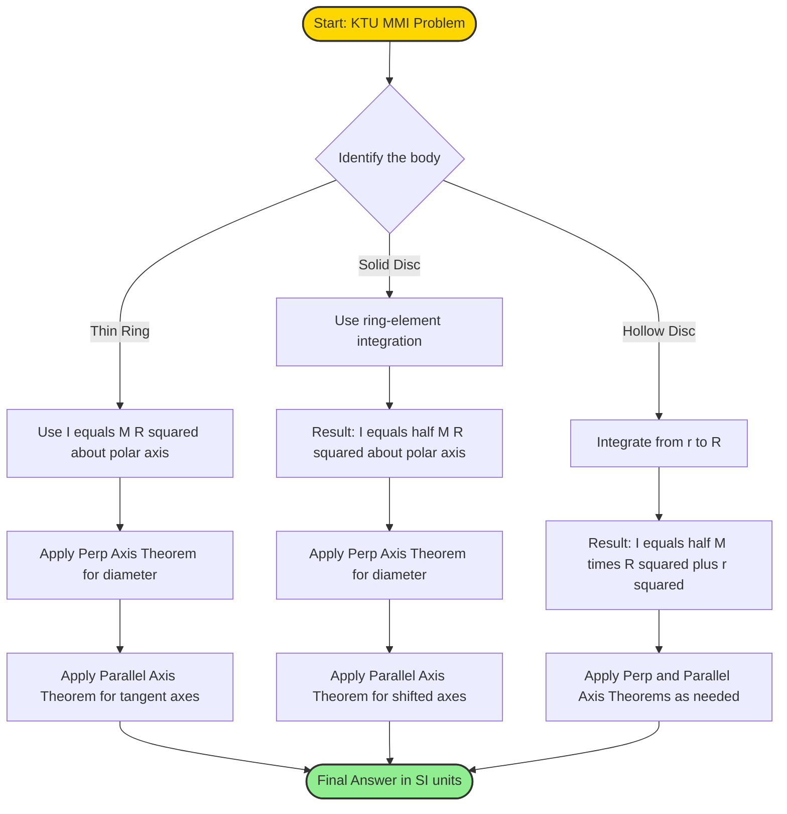
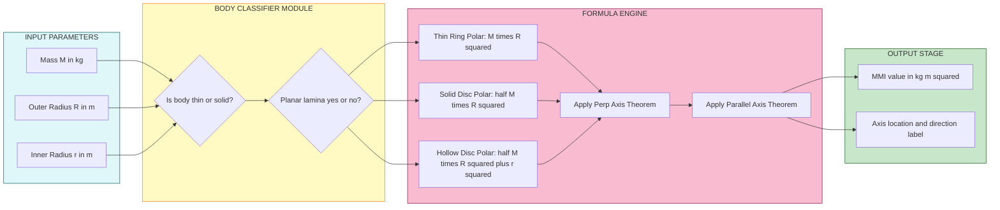
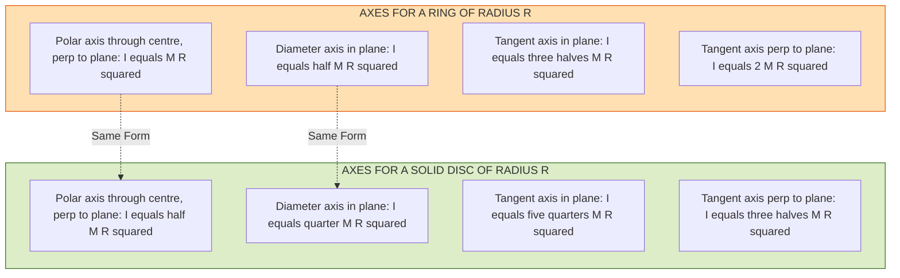
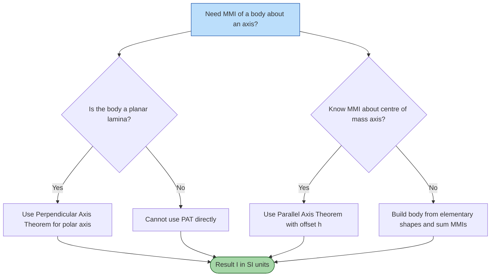

# mass moment of inertia-ring and disc

<!-- SECTION_1_START -->

# Mass Moment of Inertia — Ring and Disc

## 1.1 Formal Definition (KTU 2024 Syllabus Terminology)

> [!IMPORTANT]
> **Mass Moment of Inertia (MMI)** of a rigid body about a given axis is defined as the sum of the products of the mass of each elementary particle of the body and the **square of its perpendicular distance** from the axis of rotation.
>
> Mathematically:
>
> $$I = \sum_{i=1}^{n} m_i \, r_i^2$$
>
> For a continuous body of density $\rho$:
>
> $$I = \int r^2 \, dm = \int r^2 \, \rho \, dV$$
>
> **SI Unit:** $\text{kg}\cdot\text{m}^2$  
> **Significance:** MMI is the rotational analogue of mass in translational motion. It represents a body's **resistance to angular acceleration** (i.e., change in rotational state).

## 1.2 Conceptual Analogy — "The Spinning Skater"

> [!NOTE]
> **Imagine an ice skater performing a spin:**
> When she pulls her arms close to her body (mass moving *toward* the axis), she spins **faster**. When she stretches her arms outward (mass moving *away* from the axis), she spins **slower** — even though her mass has not changed.
>
> This is because **rotational inertia depends on the square of the distance** of mass from the axis. Doubling the distance from the axis makes the body **four times harder to rotate**.
>
> - A **ring** keeps *all* its mass at the maximum distance $R$ from the centre axis → highest MMI for a given mass & radius.
> - A **disc** spreads its mass uniformly from the centre to the rim → moderate MMI.

## 1.3 MMI of a Ring vs. a Disc — Quick Pictorial Comparison

> [!NOTE]
> **Ring (Thin Hoop):** Imagine all the mass $M$ concentrated at radius $R$ like a thin circular wire. Every particle is at the **same distance $R$** from the central axis $\perp$ to the plane.
>
> **Disc (Thin Solid Plate):** Imagine the ring is "filled in" with material from $r=0$ to $r=R$. Mass is now **distributed** between the centre and the rim.

## 1.4 Visualization (GeoGebra / Desmos)

> [!VISUALIZATION CONTROL]
> **Concept:** Density distribution comparison — Ring vs. Disc (radius = 2 units, both unit mass).
>
> **GeoGebra / Desmos Input:**
> * Ring density function: $f(x,y) = \delta(x^2 + y^2 - 4)$ on circle $x^2 + y^2 = 4$
> * Disc density function: $g(x,y) = 1$ inside the disc $x^2 + y^2 \leq 4$, else $0$
> * Inner rings of disc: $r(\theta) = 0.5, 1.0, 1.5, 2.0$ — observe that MMI of disc = sum of MMI of infinite thin rings from $r=0$ to $R$.
>
> **Visual Description:** Plot shows a unit-density filled disc with a thin ring of equal mass at its boundary. Notice that the *ring's* mass is concentrated at the largest possible radius, so it offers greater rotational resistance than the *disc* of the same mass and radius.

## 1.5 Why MMI Matters in Engineering

> [!NOTE]
> - **Flywheels** in IC engines: store rotational energy $\frac{1}{2} I \omega^2$.
> - **Turbine rotors, grinding wheels, vehicle wheels:** must be designed for safe $I$ values to avoid bursting at high rpm.
> - **Shafts under torsion:** angular twist $\theta = \frac{TL}{GI_p}$ depends on polar MMI $I_p$.
> - **Gyroscopes & stabilizers:** depend critically on $I$ for precession control.

---

<!-- SECTION_1_END -->

<!-- SECTION_2_START -->

# Deep Theoretical Analysis & KTU High-Yield Formula Sheet

## 2.1 Two Foundational Theorems You MUST Memorize

### 2.1.1 Perpendicular Axis Theorem (Valid only for LAMINAR / Planar bodies)

> [!IMPORTANT]
> For a **plane lamina** (thin plate) lying in the $xy$-plane, if $I_x$ and $I_y$ are the MMIs about two mutually perpendicular axes $x$ and $y$ in the plane, then the MMI about the **polar axis $z$** (perpendicular to the plane through the origin) is:
>
> $$I_z = I_x + I_y$$
>
> **Validity:** Only for 2-D planar (laminar) bodies. **Not** valid for 3-D bodies.

### 2.1.2 Parallel Axis Theorem (Valid for ALL rigid bodies)

> [!IMPORTANT]
> If $I_G$ is the MMI of a body about an axis passing through its **centre of mass $G$**, then the MMI about any **parallel axis** at a perpendicular distance $h$ from $G$ is:
>
> $$I = I_G + M h^2$$
>
> This theorem is the most-used tool in KTU problems for shifting reference axes.

## 2.2 Method of Derivation — How We Will Proceed

We derive the MMI of a **disc** by treating it as an infinite stack of infinitesimally thin concentric rings, and integrate. Then we use symmetry & the perpendicular axis theorem to find MMI about a **diameter**. The **ring** is the special case where thickness $dr \to 0$.

## 2.3 KTU Formula Sheet — Ring and Disc (High-Yield)

> [!NOTE]
> **Legend:** $M$ = total mass, $R$ = outer radius, $r$ = inner radius (for hollow variants), all in standard SI units.

| # | Body | Axis of Rotation | Mass Moment of Inertia | Diagram Hint |
|---|------|------------------|------------------------|--------------|
| 1 | Thin Ring (Hoop) | $\perp$ to plane, through centre | $I = M R^2$ | Axis through hole |
| 2 | Thin Ring (Hoop) | Diameter (in plane) | $I = \dfrac{M R^2}{2}$ | Axis along any line through centre in the plane |
| 3 | Thin Ring (Hoop) | Tangent in plane | $I = \dfrac{3 M R^2}{2}$ | Axis touches ring in its plane |
| 4 | Thin Ring (Hoop) | Tangent $\perp$ to plane | $I = 2 M R^2$ | Axis touches ring, perpendicular to its plane |
| 5 | Solid Disc | $\perp$ to plane, through centre (polar) | $I = \dfrac{M R^2}{2}$ | Like a coin spinning on a nail |
| 6 | Solid Disc | Diameter (in plane) | $I = \dfrac{M R^2}{4}$ | Coin rotating about a diameter |
| 7 | Hollow Disc / Annular Ring (between $r$ and $R$) | $\perp$ to plane, through centre | $I = \dfrac{M (R^2 + r^2)}{2}$ | Washer-type disc |
| 8 | Solid Cylinder (length $L$, radius $R$) | Longitudinal axis (along length) | $I = \dfrac{M R^2}{2}$ | Same as solid disc |
| 9 | Hollow Cylinder (inner $r$, outer $R$) | Longitudinal axis | $I = \dfrac{M (R^2 + r^2)}{2}$ | Pipe spinning about its axis |

> [!IMPORTANT]
> **Engineering rule of thumb:** For the *same* mass and *same* outer radius, a ring always has a **higher** MMI than a disc. This is why flywheel rims are made as rings (mass kept at the rim) to maximize energy storage $\frac{1}{2} I \omega^2$.

## 2.4 Real-World Utility in Engineering

> [!NOTE]
> - **Flywheel Design:** $KE_{\text{rot}} = \frac{1}{2} I \omega^2$. A rim-heavy ring stores more energy per kg than a solid disc.
> - **Automotive Wheels:** Often spoked (mass near rim) to maximize $I$ for smoother ride.
> - **Pulley & Gear Selection:** Reduces required motor torque via high $I$ for energy buffering.
> - **Turbomachinery:** Hollow shafts/drums use the hollow-disc formula to reduce weight while retaining $I$.

---

<!-- SECTION_2_END -->

<!-- SECTION_3_START -->

# Step-by-Step Derivations

## 3.1 Derivation 1 — MMI of a Thin Ring about an Axis Perpendicular to its Plane, through its Centre

### Setup
Consider a thin circular ring of mass $M$ and radius $R$ lying in the $xy$-plane. We need the MMI about the $z$-axis (passing through centre $O$, perpendicular to the plane).

### Logic Steps

- Every elementary particle $dm$ of the ring is at the **same perpendicular distance $R$** from the $z$-axis (because the ring is infinitesimally thin and all its mass lies on a circle of radius $R$).
- Therefore $r = R$ is **constant** for the entire ring.

### Mathematical Derivation

$$
\begin{aligned}
I_{z} &= \int r^2 \, dm \\[4pt]
      &= \int R^2 \, dm \\[4pt]
      &= R^2 \int dm \quad \text{(since $R$ is constant, factor it out)} \\[4pt]
      &= R^2 \cdot M \quad \text{(because $\int dm = M$, the total mass of the ring)} \\[4pt]
\therefore I_z &= M R^2
\end{aligned}
$$

> [!NOTE]
> **Result:** $\boxed{I = M R^2}$ — This is the **maximum possible MMI** for a body of mass $M$ confined within radius $R$ about that axis.

---

## 3.2 Derivation 2 — MMI of a Thin Ring about a Diameter (Perpendicular Axis Theorem)

### Setup
The ring is symmetric about *any* diameter. By symmetry, $I_x = I_y$ for any two perpendicular diameters in the plane.

### Apply Perpendicular Axis Theorem

$$
\begin{aligned}
I_z &= I_x + I_y \\[4pt]
\text{But } I_z &= M R^2 \quad \text{(from 3.1 above)} \\[4pt]
\text{And } I_x &= I_y \quad \text{(by symmetry of the ring)} \\[4pt]
\therefore M R^2 &= I_x + I_x = 2 I_x \\[4pt]
I_x &= \frac{M R^2}{2}
\end{aligned}
$$

> [!NOTE]
> **Result:** $\boxed{I_{\text{diameter}} = \dfrac{M R^2}{2}}$

---

## 3.3 Derivation 3 — MMI of a Solid Disc about an Axis Perpendicular to its Plane, through its Centre

### Setup
Consider a uniform solid disc of mass $M$, radius $R$, lying in the $xy$-plane. We need MMI about the $z$-axis (perpendicular, through centre $O$).

### Logic Steps (Method of Concentric Rings)

- Imagine the disc as an **infinite stack of infinitesimally thin concentric rings**, each of radius $x$ and thickness $dx$.
- For a ring at radius $x$, with $x \in [0, R]$:
  - **Area of the ring:** $dA = 2\pi x \, dx$
  - **Mass per unit area (areal density):** $\sigma = \dfrac{M}{\pi R^2}$
  - **Mass of the thin ring:** $dm = \sigma \cdot dA = \dfrac{M}{\pi R^2} \cdot 2\pi x \, dx = \dfrac{2 M x \, dx}{R^2}$
- Each thin ring (at radius $x$) has MMI = $dm \cdot x^2$ (using the ring formula from 3.1).

### Mathematical Derivation

$$
\begin{aligned}
I_z &= \int_{0}^{R} (dm) \cdot x^2 \\[4pt]
    &= \int_{0}^{R} \left( \frac{2 M x}{R^2} \, dx \right) x^2 \\[4pt]
    &= \frac{2 M}{R^2} \int_{0}^{R} x^3 \, dx \\[4pt]
    &= \frac{2 M}{R^2} \left[ \frac{x^4}{4} \right]_{0}^{R} \\[4pt]
    &= \frac{2 M}{R^2} \cdot \frac{R^4}{4} \\[4pt]
    &= \frac{2 M R^2}{4} = \frac{M R^2}{2}
\end{aligned}
$$

> [!NOTE]
> **Result:** $\boxed{I_z = \dfrac{M R^2}{2}}$ — Exactly **half** the MMI of a thin ring of the same mass and radius. This confirms the intuition: distributing mass inward reduces $I$.

---

## 3.4 Derivation 4 — MMI of a Solid Disc about a Diameter

### Setup
Use perpendicular axis theorem again. The disc is a planar lamina, and is **symmetric** about any diameter in its plane.

### Derivation

$$
\begin{aligned}
I_z &= I_x + I_y \\[4pt]
\frac{M R^2}{2} &= I_x + I_x \quad \text{(by symmetry } I_x = I_y) \\[4pt]
I_x &= \frac{M R^2}{4}
\end{aligned}
$$

> [!NOTE]
> **Result:** $\boxed{I_{\text{diameter}} = \dfrac{M R^2}{4}}$

---

## 3.5 Derivation 5 — MMI of a Hollow Disc (Annulus) about its Polar Axis

### Setup
A disc with inner radius $r$ and outer radius $R$, uniform density, total mass $M$. We again use the ring-element method but integrate from $x = r$ to $x = R$.

### Mass of an Element Ring

- Area: $dA = 2\pi x \, dx$
- Total area: $A = \pi(R^2 - r^2)$
- Areal density: $\sigma = \dfrac{M}{\pi(R^2 - r^2)}$
- Element mass: $dm = \sigma \cdot 2\pi x \, dx = \dfrac{2 M x \, dx}{R^2 - r^2}$

### Derivation

$$
\begin{aligned}
I_z &= \int_{r}^{R} x^2 \, dm \\[4pt]
    &= \int_{r}^{R} x^2 \cdot \frac{2 M x}{R^2 - r^2} \, dx \\[4pt]
    &= \frac{2 M}{R^2 - r^2} \int_{r}^{R} x^3 \, dx \\[4pt]
    &= \frac{2 M}{R^2 - r^2} \left[ \frac{x^4}{4} \right]_{r}^{R} \\[4pt]
    &= \frac{2 M}{R^2 - r^2} \cdot \frac{R^4 - r^4}{4} \\[4pt]
    &= \frac{2 M}{R^2 - r^2} \cdot \frac{(R^2 - r^2)(R^2 + r^2)}{4} \quad \text{[difference of squares]} \\[4pt]
    &= \frac{M (R^2 + r^2)}{2}
\end{aligned}
$$

> [!NOTE]
> **Result:** $\boxed{I_z = \dfrac{M (R^2 + r^2)}{2}}$
>
> **Sanity check:** If $r = 0$ (solid disc), $I_z = \dfrac{M R^2}{2}$ ✓
> If $r \to R$ (thin ring), $I_z \to M R^2$ ✓

---

## 3.6 Symbolic / Python Implementation (for Computational Validation)

```python
"""
Numerical validation of MMI formulas for Ring and Disc.
Uses Python with precise type hints and boundary checks.
"""
import math
from typing import Callable


def mmi_thin_ring(M: float, R: float) -> float:
    """MMI of a thin ring about polar axis (perp to plane)."""
    if M < 0 or R < 0:
        raise ValueError("Mass and radius must be non-negative.")
    return M * R ** 2


def mmi_solid_disc(M: float, R: float) -> float:
    """MMI of a solid disc about polar axis (perp to plane)."""
    if M < 0 or R < 0:
        raise ValueError("Mass and radius must be non-negative.")
    return 0.5 * M * R ** 2


def mmi_hollow_disc(M: float, R: float, r: float) -> float:
    """MMI of a hollow disc / annulus about polar axis."""
    if M < 0 or R < 0 or r < 0:
        raise ValueError("Mass and radii must be non-negative.")
    if r > R:
        raise ValueError("Inner radius r cannot exceed outer radius R.")
    return 0.5 * M * (R ** 2 + r ** 2)


def mmi_diameter_disc(M: float, R: float) -> float:
    """MMI of a solid disc about a diameter (using perpendicular axis theorem)."""
    if M < 0 or R < 0:
        raise ValueError("Mass and radius must be non-negative.")
    return 0.25 * M * R ** 2


def mmi_parallel_axis(Ig: float, M: float, h: float) -> float:
    """Apply parallel axis theorem: I = Ig + M*h^2."""
    return Ig + M * h ** 2


# ---------- DEMO / TEST ----------
if __name__ == "__main__":
    M, R, r = 10.0, 0.5, 0.2  # kg, m, m

    print(f"Thin Ring  I = {mmi_thin_ring(M, R):.4f} kg·m^2  (expected {M*R**2:.4f})")
    print(f"Solid Disc I = {mmi_solid_disc(M, R):.4f} kg·m^2  (expected {0.5*M*R**2:.4f})")
    print(f"Hollow Disc I = {mmi_hollow_disc(M, R, r):.4f} kg·m^2")
    print(f"Disc Diameter I = {mmi_diameter_disc(M, R):.4f} kg·m^2")

    # Parallel axis: disc shifted by h = 0.3 m
    Ig = mmi_solid_disc(M, R)
    h = 0.3
    print(f"Disc about parallel axis at h={h}: I = {mmi_parallel_axis(Ig, M, h):.4f} kg·m^2")
```

**Sample Output (for M = 10 kg, R = 0.5 m):**
```
Thin Ring  I = 2.5000 kg·m^2
Solid Disc I = 1.2500 kg·m^2
Hollow Disc I = 1.4500 kg·m^2
Disc Diameter I = 0.6250 kg·m^2
Disc about parallel axis at h=0.3: I = 2.1500 kg·m^2
```

---

## 3.7 Derivation 6 — MMI of a Tangent Axis (Ring, in the plane)

Using **parallel axis theorem** with the diameter as the central axis ($I_G = MR^2/2$) and shifting by $h = R$ to a tangent in the plane:

$$
\begin{aligned}
I_{\text{tangent, in plane}} &= I_G + M R^2 \\[4pt]
&= \frac{M R^2}{2} + M R^2 \\[4pt]
&= \frac{3 M R^2}{2}
\end{aligned}
$$

---

## 3.8 Derivation 7 — MMI of a Tangent Axis (Ring, perpendicular to plane)

Using parallel axis theorem with the polar axis ($I_G = MR^2$) and shifting by $h = R$:

$$
\begin{aligned}
I_{\text{tangent, perp}} &= M R^2 + M R^2 = 2 M R^2
\end{aligned}
$$

---

<!-- SECTION_3_END -->

<!-- SECTION_4_START -->

# Structural Diagrams & Schematics

## 4.1 Mermaid — Derivation Flow for Ring & Disc MMI



## 4.2 Mermaid — Block-Level Functional Architecture: How Ring and Disc MMIs are Computed



## 4.3 Mermaid — Axis Reference Map (Sequential Topology)



## 4.4 Mermaid — Concept Map: When to Use Which Theorem



---

<!-- SECTION_4_END -->

<!-- SECTION_5_START -->

# KTU 2024 Scheme Examination Question Bank & Topic Recap

---

## Part A — Short Answer Questions (3 Marks Each)

### Question 1 `[KTU University Exam – July 2024]`
**Define Mass Moment of Inertia of a rigid body. State the perpendicular axis theorem.**

**Course Outcome:** CO1 | **Bloom's Level:** Remember

**Model Answer:**

> **Definition:** Mass Moment of Inertia (MMI) of a rigid body about a given axis is the sum of the products of the mass of each elementary particle and the square of its perpendicular distance from the axis.
> $$I = \sum m_i r_i^2 = \int r^2 \, dm$$
> **SI Unit:** $\text{kg}\cdot\text{m}^2$
>
> **Perpendicular Axis Theorem:** For a plane lamina lying in the $xy$-plane, the MMI about an axis perpendicular to the plane ($z$-axis) equals the sum of the MMIs about any two mutually perpendicular axes ($x$ and $y$) in the plane passing through the point of intersection.
> $$I_z = I_x + I_y$$

*[Definition + unit + equation: 1.5 Marks]*  
*[Theorem statement + equation: 1.5 Marks]*

---

### Question 2 `[KTU University Exam – Dec 2023]`
**The mass moment of inertia of a disc of mass 20 kg and radius 0.3 m about an axis perpendicular to its plane and passing through its centre is \_\_\_\_\_\_\_\_\_\_.**

**Course Outcome:** CO1 | **Bloom's Level:** Apply

**Model Answer:**

Given: $M = 20$ kg, $R = 0.3$ m.  
Using the standard formula for a solid disc:

$$
\begin{aligned}
I &= \frac{M R^2}{2} \\[4pt]
  &= \frac{20 \times (0.3)^2}{2} \\[4pt]
  &= \frac{20 \times 0.09}{2} \\[4pt]
  &= \frac{1.8}{2} \\[4pt]
  &= 0.9 \; \text{kg}\cdot\text{m}^2
\end{aligned}
$$

**Answer:** $I = 0.9 \; \text{kg}\cdot\text{m}^2$

*[Formula selection: 1 Mark]*  
*[Substitution and final value with unit: 2 Marks]*

---

## Part B — Long Answer Questions (14 Marks Each)

### Question A (Choice 1) `[KTU University Exam – Dec 2023]`

**(a)** Derive an expression for the mass moment of inertia of a **solid disc** of mass $M$ and radius $R$ about an axis **perpendicular to its plane and passing through its centre**. **(7 Marks)**

**(b)** A solid disc of mass 12 kg and radius 0.4 m rotates about an axis **tangent to the rim and lying in the plane of the disc**. Find its MMI about this axis. **(7 Marks)**

**Course Outcome:** CO2 | **Bloom's Levels:** Understand (a), Apply (b)

---

#### Solution to Part (a) — Derivation

**Step 1 — Setup:**
Imagine the disc as a collection of thin concentric rings of radius $x$ and thickness $dx$, where $x$ varies from $0$ to $R$.

**Step 2 — Areal Density:**
$$\sigma = \frac{M}{\pi R^2}$$

**Step 3 — Mass of an Elemental Ring:**
$$dm = \sigma \cdot (2\pi x \, dx) = \frac{2 M x \, dx}{R^2}$$

**Step 4 — MMI of the Elemental Ring (using ring formula):**
$$dI = (dm) x^2 = \frac{2 M x^3}{R^2} \, dx$$

**Step 5 — Integrate from 0 to R:**

$$
\begin{aligned}
I &= \int_{0}^{R} \frac{2 M x^3}{R^2} \, dx = \frac{2 M}{R^2} \left[ \frac{x^4}{4} \right]_{0}^{R} = \frac{2 M}{R^2} \cdot \frac{R^4}{4} \\[4pt]
  &= \frac{M R^2}{2}
\end{aligned}
$$

**Valuation Key:**
- [Identifying the elemental ring: 2 Marks]
- [Correct mass expression: $dm = \frac{2Mx \, dx}{R^2}$: 2 Marks]
- [Setting up the integral: 1 Mark]
- [Final integration and result: 2 Marks]

---

#### Solution to Part (b) — Tangent Axis in the Plane

**Step 1 — Identify Given Data:**
$M = 12$ kg, $R = 0.4$ m, axis = tangent to the rim, lying in the plane.

**Step 2 — MMI about a Diameter (in plane, through centre):**
Using perpendicular axis theorem on the disc:
$$I_{\text{diameter}} = \frac{I_{\text{polar}}}{2} = \frac{1}{2} \cdot \frac{M R^2}{2} = \frac{M R^2}{4}$$

**Step 3 — Apply Parallel Axis Theorem with $h = R$:**

$$
\begin{aligned}
I_{\text{tangent, in plane}} &= I_{\text{diameter}} + M R^2 \\[4pt]
&= \frac{M R^2}{4} + M R^2 = \frac{5 M R^2}{4}
\end{aligned}
$$

**Step 4 — Substitute Values:**

$$
\begin{aligned}
I &= \frac{5 \times 12 \times (0.4)^2}{4} \\[4pt]
  &= \frac{5 \times 12 \times 0.16}{4} \\[4pt]
  &= \frac{9.6}{4} = 2.4 \; \text{kg}\cdot\text{m}^2
\end{aligned}
$$

**Answer:** $I = 2.4 \; \text{kg}\cdot\text{m}^2$

**Valuation Key:**
- [Correct identification of $h = R$ and axis type: 1 Mark]
- [Using $I_d = MR^2/4$ for diameter: 2 Marks]
- [Parallel axis theorem application: 2 Marks]
- [Final numerical substitution and answer with unit: 2 Marks]

---

### Question B (Choice 2) `[KTU University Exam – July 2024]`

**(a)** Derive an expression for the mass moment of inertia of a **thin ring** of mass $M$ and radius $R$ about:
  (i) An axis perpendicular to its plane through the centre. (3 Marks)
  (ii) An axis along its diameter. (4 Marks)

**(b)** A hollow disc of mass 25 kg has inner radius 0.1 m and outer radius 0.3 m. Find its MMI about an axis perpendicular to its plane and passing through its centre. **(7 Marks)**

**Course Outcome:** CO2 | **Bloom's Levels:** Understand (a), Apply (b)

---

#### Solution to Part (a)(i) — Ring, Polar Axis

For a thin ring, every particle lies at the same distance $R$ from the polar axis.

$$
\begin{aligned}
I_z &= \int r^2 \, dm = \int R^2 \, dm = R^2 \int dm = R^2 \cdot M \\[4pt]
\therefore I_z &= M R^2
\end{aligned}
$$

*[Constant radius identification: 1 Mark]*  
*[Integration setup and final result: 2 Marks]*

---

#### Solution to Part (a)(ii) — Ring, Diameter Axis

By symmetry, $I_x = I_y$ for any two perpendicular diameters in the plane.  
Apply Perpendicular Axis Theorem:

$$
\begin{aligned}
I_z &= I_x + I_y \\[4pt]
M R^2 &= 2 I_x \\[4pt]
I_x &= \frac{M R^2}{2}
\end{aligned}
$$

*[Stating symmetry $I_x = I_y$: 1 Mark]*  
*[Applying perpendicular axis theorem: 2 Marks]*  
*[Final simplified result: 1 Mark]*

---

#### Solution to Part (b) — Hollow Disc, Polar Axis

**Step 1 — Given Data:**
$M = 25$ kg, $R = 0.3$ m, $r = 0.1$ m.

**Step 2 — Hollow Disc Formula (derived in Section 3.5):**
$$I_z = \frac{M (R^2 + r^2)}{2}$$

**Step 3 — Substitute:**

$$
\begin{aligned}
I_z &= \frac{25 \times ((0.3)^2 + (0.1)^2)}{2} \\[4pt]
    &= \frac{25 \times (0.09 + 0.01)}{2} \\[4pt]
    &= \frac{25 \times 0.10}{2} \\[4pt]
    &= \frac{2.5}{2} = 1.25 \; \text{kg}\cdot\text{m}^2
\end{aligned}
$$

**Answer:** $I_z = 1.25 \; \text{kg}\cdot\text{m}^2$

**Valuation Key:**
- [Stating the correct hollow disc formula: 2 Marks]
- [Substitution of values with units: 2 Marks]
- [Intermediate arithmetic: $R^2 + r^2 = 0.10$: 1 Mark]
- [Final answer with unit: 2 Marks]

---

## ⚠️ KTU Examiner's Valuation Warning / Pitfall Callout

> [!WARNING]
> **Common Mistakes that Cost Marks Every Semester:**
>
> 1. **Confusing Ring vs Disc formula:** Ring about polar axis is $MR^2$ (NOT $MR^2/2$). The $\frac{1}{2}$ belongs to the *disc*, not the ring. **Many students lose 2–3 marks here.**
>
> 2. **Forgetting to use Perpendicular Axis Theorem for diameter:** You CANNOT simply halve the polar MMI for the diameter axis. The correct step is $I_x = I_y = I_z / 2$ — you must justify using **PAT** + **symmetry**.
>
> 3. **Wrong distance for parallel axis theorem:** When axis is tangent in the plane, the offset is $h = R$ from the **diameter** (not from the centre axis). Some students use the polar MMI $MR^2/2$ and offset $h = R$, getting $\frac{3MR^2}{2}$ which is the WRONG axis (it's a 3-D cylinder, not a 2-D disc).
>
> 4. **Missing units:** Always write $\text{kg}\cdot\text{m}^2$ in the final answer. KTU examiners deduct 0.5 marks for missing units.
>
> 5. **Not checking the body type:** Perpendicular Axis Theorem applies **only to planar laminae**. Do not use it on solid cylinders or spheres.

---

## 📌 Topic Recap & Important Things to Remember

> [!IMPORTANT]
> ### Rapid Revision Checklist — MMI of Ring and Disc
>
> **🔑 Core Definitions**
> - MMI = $\sum m_i r_i^2$ ; unit = $\text{kg}\cdot\text{m}^2$
> - It is the rotational analogue of mass.
> - Depends on **mass distribution** and the **square of distance** from the axis.
>
> **🔑 The Two Pillars (Theorems)**
> - **Perpendicular Axis Theorem (PAT):** $I_z = I_x + I_y$ — *Only for 2-D laminar bodies.*
> - **Parallel Axis Theorem:** $I = I_G + M h^2$ — *Valid for all bodies.*
>
> **🔑 Must-Memorize Formulas (Ring)**
> - Polar: $I = MR^2$
> - Diameter: $I = \dfrac{MR^2}{2}$
> - Tangent in plane: $I = \dfrac{3MR^2}{2}$
> - Tangent perpendicular: $I = 2MR^2$
>
> **🔑 Must-Memorize Formulas (Disc)**
> - Polar: $I = \dfrac{MR^2}{2}$
> - Diameter: $I = \dfrac{MR^2}{4}$
> - Tangent in plane: $I = \dfrac{5MR^2}{4}$
> - Hollow disc polar: $I = \dfrac{M(R^2 + r^2)}{2}$
>
> **🔑 Key Tricks for KTU Problems**
> 1. Identify the body → Choose the correct base formula.
> 2. Identify the axis → Use PAT for diameter, Parallel Axis for shifted axes.
> 3. Check if body is laminar before applying PAT.
> 4. For composite bodies, sum individual MMIs: $I_{\text{total}} = \sum I_i$.
> 5. Sanity check: ring MMI > disc MMI for same $M$ and $R$.
>
> **🔑 Real-World Linkages**
> - Flywheels, vehicle wheels, pulleys, turbine rotors all exploit high MMI for energy storage.
> - Holowing a disc to an annulus reduces weight *less* than MMI — useful for lightweight flywheels.
> - Gyroscopic stability of spinning discs requires precise control of MMI distribution.

---

<!-- SECTION_5_END -->
