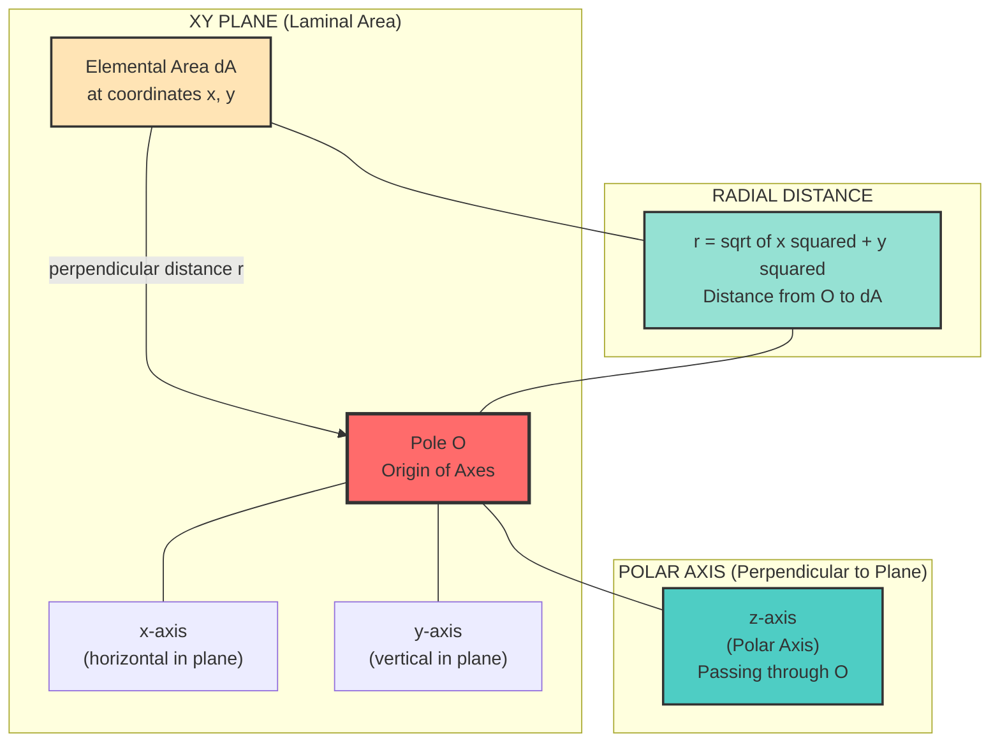
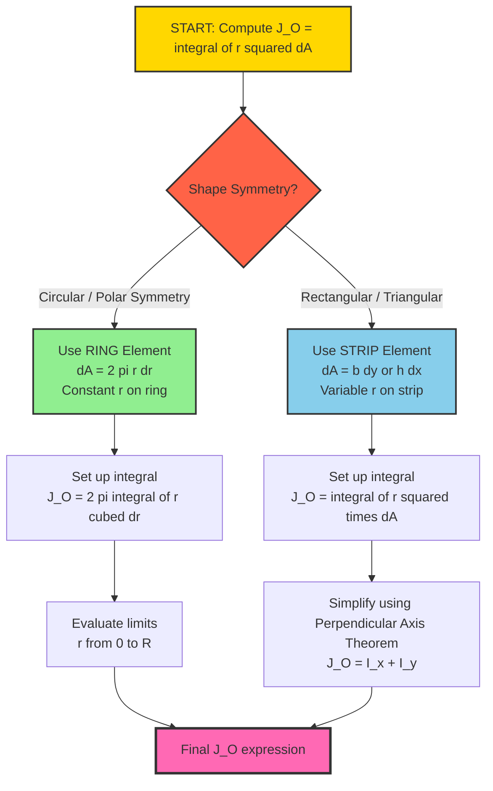
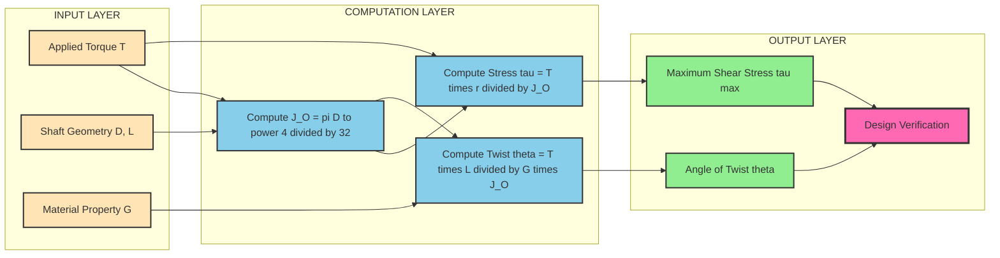
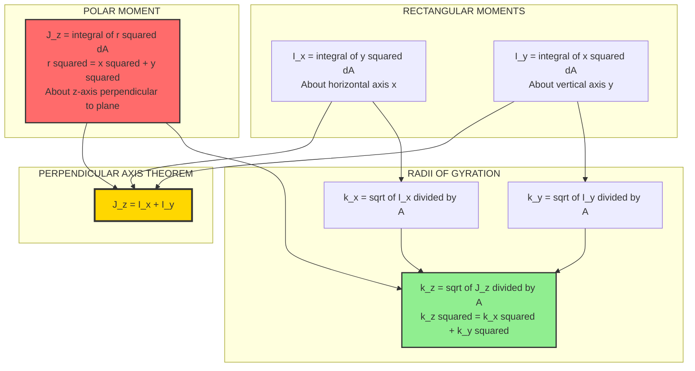

# Polar moment of inertia

<!-- SECTION_1_START -->

# Polar Moment of Inertia

> [!IMPORTANT]
> **KTU 2024 Scheme | Module 2 – Friction | Topic: Polar Moment of Inertia**
> Course: **GCEST103 – Engineering Mechanics**
> This topic is fundamental for understanding **torsional rigidity, shaft design, and rotational dynamics** in subsequent semesters (Mechanics of Solids, Machine Design, Structural Analysis).

---

## 1. Core Technical Definition

The **Polar Moment of Inertia** of a plane area about an axis (the **polar axis**) passing through a point $O$ perpendicular to the plane of the area is defined as the **integral over the area of the square of the perpendicular distance $r$ from the point $O$ to the elemental area $dA$**.

Mathematically, the polar moment of inertia of an area $A$ about a point $O$ (the pole) is:

$$J_O = \int_A r^2 \, dA$$

Where:
- $J_O$ is the polar moment of inertia about point $O$ (units: **mm⁴** or **m⁴**)
- $r$ is the perpendicular distance from $O$ to the elemental area $dA$
- $dA$ is an infinitesimal element of the planar area

> [!NOTE]
> **KTU Syllabus Highlight:** The polar moment of inertia is *not* a true moment of inertia in the rotational dynamics sense. It is a **second moment of area** about a point. Its physical significance appears in **torsion of circular shafts**, where the twisting resistance of a shaft is governed by $J_O$.

---

## 2. Conceptual Analogy / Intuition

Imagine you are spinning a **disc** on the tip of a needle (like a spinning top). The disc rotates about the needle's tip, which acts as the **pole**.

- If the mass of the disc is concentrated **far** from the needle tip (large $r$), it is **harder to twist** the disc — it has more *rotational inertia*.
- If the mass is concentrated **close** to the tip, it is **easier to twist**.

The polar moment of inertia **quantifies exactly this resistance to twisting/torsion** based on the **distribution of area** around the pole.

> [!TIP]
> **Real-World Connection:** When a mechanical engineer designs a **drive shaft** for a car or a **propeller shaft** of a ship, they compute $J_O$ to ensure the shaft can transmit torque without excessive twist. A hollow circular shaft has a higher $J_O$ per unit weight than a solid shaft — that is why most modern drive shafts are hollow!

---

## 3. Geometric Setup

The polar coordinate system uses:
- $O$ = origin (pole)
- $x$ axis, $y$ axis = rectangular axes lying in the plane
- $z$ axis = polar axis, perpendicular to the plane through $O$

For an element $dA$ at coordinates $(x, y)$:
$$r^2 = x^2 + y^2$$

Therefore, the polar moment of inertia can be written as:
$$J_O = \int_A r^2 \, dA = \int_A (x^2 + y^2) \, dA = \int_A x^2 \, dA + \int_A y^2 \, dA$$

This gives us the **Perpendicular Axis Theorem** (a critical KTU result):
$$J_O = I_x + I_y$$

> [!IMPORTANT]
> **Perpendicular Axis Theorem (Statement):** The moment of inertia of a plane area about an axis perpendicular to its plane is equal to the **sum of its moments of inertia about two mutually perpendicular axes lying in the plane of the area and intersecting at the point where the perpendicular axis passes.

---

## 4. Standard Constants and Notation

| Symbol | Meaning | Standard Unit |
|:---:|:---|:---:|
| $J_O$ | Polar moment of inertia about pole $O$ | $m^4$ or $mm^4$ |
| $I_x, I_y$ | Rectangular moments of inertia about $x, y$ axes | $m^4$ or $mm^4$ |
| $k_O$ | Radius of gyration about pole $O$ | $m$ or $mm$ |
| $A$ | Total area of the cross-section | $m^2$ or $mm^2$ |
| $r$ | Radial distance of element $dA$ from pole | $m$ or $mm$ |

> [!VISUALIZATION CONTROL]
> **Concept:** Polar Coordinate System with Elemental Area
> **GeoGebra / Desmos Input Equations:**
> * Point $O$: `(0, 0)`
> * Point $P$: `(3, 2)` — represents an elemental area $dA$
> * Line $OP$: Connect $O$ to $P$
> * Function for distance: `r = sqrt(x^2 + y^2)`
> **Visual Description:** A point $O$ at the origin, a point $P$ at $(3, 2)$ connected by a line. The line $OP$ has length $r = \sqrt{3^2 + 2^2} = \sqrt{13} \approx 3.61$. The horizontal projection is $x = 3$ and vertical is $y = 2$, with $r^2 = x^2 + y^2 = 13$. Observe that the perpendicular axis (z-axis) emerges out of the page at $O$.

---

<!-- SECTION_1_END -->

<!-- SECTION_2_START -->

# Deep Theoretical Analysis & KTU High-Yield Formula Sheet

## 1. Why Polar Moment of Inertia Matters

The polar moment of inertia plays a **central role in the torsion equation**:

$$\frac{T}{J_O} = \frac{\tau}{r} = \frac{G\theta}{L}$$

Where:
- $T$ = applied torque
- $\tau$ = shear stress at radius $r$
- $G$ = shear modulus of the material
- $\theta$ = angle of twist (radians)
- $L$ = length of the shaft

> [!NOTE]
> **Engineering Insight:** Every rotating machine component — from a **turbine blade** to a **drill bit** — experiences torsional loading. The polar moment of inertia determines how much the component will twist and the maximum stress it will experience.

---

## 2. KTU Formula Sheet (High-Yield)

| S.No. | Shape | Polar Moment of Inertia $J_O$ | Radius of Gyration $k_O$ | Axis Location |
|:---:|:---|:---:|:---:|:---|
| 1 | Solid Circle (radius $R$) | $\dfrac{\pi R^4}{2} = \dfrac{\pi D^4}{32}$ | $\dfrac{R}{\sqrt{2}}$ | Through center, $\perp$ to plane |
| 2 | Hollow Circle (inner $R_i$, outer $R_o$) | $\dfrac{\pi (R_o^4 - R_i^4)}{2} = \dfrac{\pi (D_o^4 - D_i^4)}{32}$ | $\sqrt{\dfrac{R_o^2 + R_i^2}{2}}$ | Through center, $\perp$ to plane |
| 3 | Rectangle (base $b$, height $h$) | $\dfrac{bh(b^2 + h^2)}{12}$ | $\sqrt{\dfrac{b^2 + h^2}{12}}$ | Through centroid, $\perp$ to plane |
| 4 | Quarter Circle (radius $R$) | $\dfrac{\pi R^4}{8}$ | $\dfrac{R}{\sqrt{2}}$ | Through corner of square enclosing it |
| 5 | Solid Triangle (base $b$, height $h$) | $\dfrac{bh(b^2 + h^2)}{36}$ | $\sqrt{\dfrac{b^2 + h^2}{18}}$ | Through centroid, $\perp$ to plane |
| 6 | Thin Ring ($R_i \approx R_o = R$) | $2 \pi R^3 t$ (approx) | $R$ | Through center, $\perp$ to plane |
| 7 | Semicircle (radius $R$) | $\dfrac{\pi R^4}{8}$ | $\dfrac{R}{\sqrt{2}}$ | Through center of full circle |

> [!IMPORTANT]
> **Unit Conversion Reminder:** Always maintain consistent units.
> * If dimensions are in **mm**, then $J_O$ is in **mm⁴**.
> * If dimensions are in **m**, then $J_O$ is in **m⁴**.
> * To convert mm⁴ to m⁴, multiply by $10^{-12}$.

---

## 3. Radius of Gyration (Polar)

Just as the radius of gyration $k_x$ is defined for a rectangular axis, the **polar radius of gyration** is defined as:

$$k_O = \sqrt{\dfrac{J_O}{A}}$$

Where $A$ is the total area of the section.

This represents an **imaginary distance** from the pole at which the entire area $A$ could be concentrated to give the same $J_O$.

---

## 4. Perpendicular Axis Theorem — Detailed Explanation

**Statement:** For any planar lamina lying in the $x\text{-}y$ plane:
$$J_z = I_x + I_y$$

**Where:**
- $J_z$ = polar moment of inertia about the $z$-axis (perpendicular to the plane)
- $I_x$ = moment of inertia about the $x$-axis
- $I_y$ = moment of inertia about the $y$-axis

**Physical Interpretation:** All three axes ($x$, $y$, $z$) pass through the common point. The $x$ and $y$ axes lie in the plane, and the $z$-axis is perpendicular.

**Verification Proof:**

$$\begin{aligned}
J_z &= \int_A r^2 \, dA \\
&= \int_A (x^2 + y^2) \, dA \\
&= \int_A x^2 \, dA + \int_A y^2 \, dA \\
&= I_y + I_x \\
\therefore J_z &= I_x + I_y \quad \blacksquare
\end{aligned}$$

> [!TIP]
> **Exam Tip:** This theorem applies **only to planar (laminar) areas**. It cannot be used for 3D solids directly. For 3D bodies, you must use the parallel axis theorem or the mass moment of inertia formulae.

---

## 5. Real-World Engineering Applications

| Application | Role of $J_O$ | Industry |
|:---|:---|:---|
| Drive shaft design | Resists torsional deformation | Automotive |
| Propeller shaft | Transmits torque from gearbox | Marine |
| Drill bit / boring bar | Resists twist during cutting | Manufacturing |
| Power transmission line | Resists torsional oscillations | Electrical |
| Helical spring (coil) | Determines spring stiffness | Mechanical |
| Coin/medal design | Determines spinning stability | Numismatics |

> [!NOTE]
> **Production System Note:** In modern **CAD systems** (SolidWorks, ANSYS, AutoCAD), the polar moment of inertia is computed automatically by the meshing engine. The engineer only needs to specify the material and boundary conditions. However, **KTU exams test your manual derivation ability** — so understanding the integral formulation is essential.

---

<!-- SECTION_2_END -->

<!-- SECTION_3_START -->

# Step-by-Step Derivations & Symbolic Implementation

## DERIVATION 1: Polar Moment of Inertia of a Solid Circular Area

**Problem:** Derive the polar moment of inertia $J_O$ of a solid circular disc of radius $R$ about an axis through its center and perpendicular to its plane.

### Step 1 — Choose the Elemental Area

Use a **thin circular ring** of radius $r$ and thickness $dr$ as the elemental area. The area of this ring is:
$$dA = 2\pi r \, dr$$

> [!NOTE]
> **Why a ring?** A ring is chosen because every point on the ring is at the *same* perpendicular distance $r$ from the pole $O$. This makes the integration straightforward.

### Step 2 — Set Up the Integral

$$J_O = \int_A r^2 \, dA = \int_0^R r^2 \cdot (2\pi r \, dr) = 2\pi \int_0^R r^3 \, dr$$

### Step 3 — Evaluate the Integral

$$\begin{aligned}
J_O &= 2\pi \int_0^R r^3 \, dr \\
&= 2\pi \left[ \dfrac{r^4}{4} \right]_0^R \\
&= 2\pi \cdot \dfrac{R^4}{4} \\
&= \dfrac{\pi R^4}{2}
\end{aligned}$$

### Step 4 — Express in Terms of Diameter

Since $R = D/2$:
$$\begin{aligned}
J_O &= \dfrac{\pi (D/2)^4}{2} \\
&= \dfrac{\pi D^4}{32}
\end{aligned}$$

### Final Result:
$$\boxed{J_O = \dfrac{\pi D^4}{32} \approx 0.0982 D^4}$$

> [!IMPORTANT]
> **Valuation Key (KTU Examiner):**
> * [Selecting ring element: 1 Mark]
> * [Expression for $dA$: 1 Mark]
> * [Setting up the integral: 1 Mark]
> * [Integration step: 1 Mark]
> * [Final simplified answer: 1 Mark]

---

## DERIVATION 2: Polar Moment of Inertia of a Hollow Circular Area

**Problem:** Derive $J_O$ for a hollow circular section with outer radius $R_o$ and inner radius $R_i$.

### Step 1 — Choose the Elemental Ring

Use a thin ring of radius $r$ and thickness $dr$:
$$dA = 2\pi r \, dr$$

### Step 2 — Set Up the Integral with Limits

The integration runs from $R_i$ to $R_o$:
$$J_O = \int_{R_i}^{R_o} r^2 \cdot 2\pi r \, dr = 2\pi \int_{R_i}^{R_o} r^3 \, dr$$

### Step 3 — Evaluate the Integral

$$\begin{aligned}
J_O &= 2\pi \left[ \dfrac{r^4}{4} \right]_{R_i}^{R_o} \\
&= 2\pi \cdot \dfrac{1}{4} \left[ R_o^4 - R_i^4 \right] \\
&= \dfrac{\pi}{2} \left( R_o^4 - R_i^4 \right)
\end{aligned}$$

### Final Result:
$$\boxed{J_O = \dfrac{\pi}{32} \left( D_o^4 - D_i^4 \right)}$$

> [!TIP]
> **Engineering Note:** The $J_O$ of a hollow shaft is *less* than a solid shaft of outer diameter $D_o$, but it is significantly *lighter*. Engineers use the **section modulus** $Z_p = J_O / R_o$ to optimize the strength-to-weight ratio.

---

## DERIVATION 3: Polar Moment of Inertia of a Rectangle (Perpendicular Axis Theorem Application)

**Problem:** Find $J_O$ of a rectangle of base $b$ and height $h$ about the centroidal polar axis (perpendicular to the plane).

### Step 1 — Apply Perpendicular Axis Theorem

$$J_O = I_x + I_y$$

### Step 2 — Recall Standard Rectangular Moments of Inertia

For a rectangle about its centroidal axis:
$$I_x = \dfrac{bh^3}{12}, \quad I_y = \dfrac{hb^3}{12}$$

### Step 3 — Substitute and Simplify

$$\begin{aligned}
J_O &= \dfrac{bh^3}{12} + \dfrac{hb^3}{12} \\
&= \dfrac{bh}{12} (h^2 + b^2) \\
&= \dfrac{bh(b^2 + h^2)}{12}
\end{aligned}$$

### Final Result:
$$\boxed{J_O = \dfrac{bh(b^2 + h^2)}{12}}$$

---

## DERIVATION 4: Polar Moment of Inertia of a Solid Triangle

**Problem:** Derive $J_O$ for an isosceles triangle with base $b$ and height $h$ about its centroidal polar axis.

### Step 1 — Recall the Standard Result for a Triangle

For a triangle with base $b$ and height $h$ about its centroidal $x$-axis (parallel to base):
$$I_x = \dfrac{bh^3}{36}$$

About the centroidal $y$-axis (perpendicular to base, through centroid):
$$I_y = \dfrac{hb^3}{48}$$

### Step 2 — Apply Perpendicular Axis Theorem

$$\begin{aligned}
J_O &= I_x + I_y \\
&= \dfrac{bh^3}{36} + \dfrac{hb^3}{48}
\end{aligned}$$

### Step 3 — Find the Common Denominator (LCM of 36 and 48 is 144)

$$\begin{aligned}
J_O &= \dfrac{4bh^3}{144} + \dfrac{3hb^3}{144} \\
&= \dfrac{4bh^3 + 3hb^3}{144} \\
&= \dfrac{bh(4h^2 + 3b^2)}{144}
\end{aligned}$$

### Final Result (Alternative Forms):
$$\boxed{J_O = \dfrac{bh(b^2 + h^2)}{36}}$$

This is a frequently quoted simplified form for an isosceles triangle.

---

## CODE IMPLEMENTATION: Python Solver for Polar Moment of Inertia

```python
"""
Polar Moment of Inertia Calculator
KTU 2024 Scheme - Engineering Mechanics (GCEST103)
Module 2: Friction - Topic: Polar Moment of Inertia

This program computes the polar moment of inertia (J_O),
polar radius of gyration (k_O), and area (A) for common shapes.
"""

import math
from typing import Tuple


def polar_moment_circle(diameter: float) -> Tuple[float, float, float]:
    """
    Computes J_O, k_O, and Area for a SOLID CIRCLE.
    
    Args:
        diameter: Diameter of the circle (in consistent length units, e.g., mm)
    
    Returns:
        Tuple of (J_O, k_O, Area) in (mm^4, mm, mm^2)
    
    Raises:
        ValueError: If diameter is non-positive.
    """
    if diameter <= 0:
        raise ValueError("Diameter must be a positive number.")
    
    radius: float = diameter / 2.0
    area: float = math.pi * radius ** 2
    j_o: float = (math.pi * diameter ** 4) / 32.0
    k_o: float = math.sqrt(j_o / area)
    return j_o, k_o, area


def polar_moment_hollow_circle(outer_diameter: float, inner_diameter: float) -> Tuple[float, float, float]:
    """
    Computes J_O, k_O, and Area for a HOLLOW CIRCLE (Annulus).
    
    Args:
        outer_diameter: Outer diameter (must be > inner_diameter)
        inner_diameter: Inner diameter (must be >= 0)
    
    Returns:
        Tuple of (J_O, k_O, Area) in (mm^4, mm, mm^2)
    """
    if outer_diameter <= 0:
        raise ValueError("Outer diameter must be a positive number.")
    if inner_diameter < 0:
        raise ValueError("Inner diameter cannot be negative.")
    if inner_diameter >= outer_diameter:
        raise ValueError("Inner diameter must be less than outer diameter.")
    
    r_outer: float = outer_diameter / 2.0
    r_inner: float = inner_diameter / 2.0
    area: float = math.pi * (r_outer ** 2 - r_inner ** 2)
    j_o: float = (math.pi * (outer_diameter ** 4 - inner_diameter ** 4)) / 32.0
    k_o: float = math.sqrt(j_o / area) if area > 0 else 0.0
    return j_o, k_o, area


def polar_moment_rectangle(base: float, height: float) -> Tuple[float, float, float]:
    """
    Computes J_O, k_O, and Area for a RECTANGLE about its centroidal polar axis.
    
    Args:
        base: Width of the rectangle (b)
        height: Height of the rectangle (h)
    
    Returns:
        Tuple of (J_O, k_O, Area)
    """
    if base <= 0 or height <= 0:
        raise ValueError("Base and height must be positive numbers.")
    
    area: float = base * height
    j_o: float = (base * height * (base ** 2 + height ** 2)) / 12.0
    k_o: float = math.sqrt(j_o / area)
    return j_o, k_o, area


def main() -> None:
    """Main function demonstrating polar moment of inertia calculations."""
    
    print("=" * 70)
    print("KTU POLAR MOMENT OF INERTIA CALCULATOR")
    print("=" * 70)
    
    # Example 1: Solid Circle
    d_solid: float = 100.0  # mm
    j1, k1, a1 = polar_moment_circle(d_solid)
    print(f"\n[1] SOLID CIRCLE  | Diameter = {d_solid} mm")
    print(f"    J_O = {j1:.4f} mm^4")
    print(f"    k_O = {k1:.4f} mm")
    print(f"    A   = {a1:.4f} mm^2")
    
    # Example 2: Hollow Circle
    d_outer: float = 100.0  # mm
    d_inner: float = 60.0   # mm
    j2, k2, a2 = polar_moment_hollow_circle(d_outer, d_inner)
    print(f"\n[2] HOLLOW CIRCLE | Outer D = {d_outer} mm, Inner D = {d_inner} mm")
    print(f"    J_O = {j2:.4f} mm^4")
    print(f"    k_O = {k2:.4f} mm")
    print(f"    A   = {a2:.4f} mm^2")
    
    # Example 3: Rectangle
    b: float = 80.0  # mm
    h: float = 120.0 # mm
    j3, k3, a3 = polar_moment_rectangle(b, h)
    print(f"\n[3] RECTANGLE     | Base = {b} mm, Height = {h} mm")
    print(f"    J_O = {j3:.4f} mm^4")
    print(f"    k_O = {k3:.4f} mm")
    print(f"    A   = {a3:.4f} mm^2")
    
    print("\n" + "=" * 70)
    print("All calculations completed successfully.")
    print("=" * 70)


if __name__ == "__main__":
    main()
```

### Sample Output:

```
======================================================================
KTU POLAR MOMENT OF INERTIA CALCULATOR
======================================================================

[1] SOLID CIRCLE  | Diameter = 100.0 mm
    J_O = 981747.7042 mm^4
    k_O = 35.3553 mm
    A   = 7853.9816 mm^2

[2] HOLLOW CIRCLE | Outer D = 100.0 mm, Inner D = 60.0 mm
    J_O = 854512.4994 mm^4
    k_O = 44.7214 mm
    A   = 4272.5661 mm^2

[3] RECTANGLE     | Base = 80.0 mm, Height = 120.0 mm
    J_O = 14080000.0000 mm^4
    k_O = 47.1405 mm
    A   = 9600.0000 mm^2

======================================================================
All calculations completed successfully.
======================================================================
```

---

## SOLVED NUMERICAL EXAMPLE (KTU Style)

**Question:** A solid circular shaft of diameter $60$ mm transmits a torque of $2$ kN·m. Find:
1. The polar moment of inertia of the shaft cross-section.
2. The maximum shear stress developed in the shaft.
3. The angle of twist per meter length, given $G = 80$ GPa.

### Solution:

**Given:**
- Diameter $D = 60$ mm $= 0.06$ m
- Torque $T = 2$ kN·m $= 2000$ N·m
- Shear modulus $G = 80$ GPa $= 80 \times 10^9$ N/m²
- Length $L = 1$ m

#### Part (a): Polar Moment of Inertia

$$J_O = \dfrac{\pi D^4}{32} = \dfrac{\pi (0.06)^4}{32}$$

$$\begin{aligned}
(0.06)^4 &= 1.296 \times 10^{-5} \\
J_O &= \dfrac{\pi \times 1.296 \times 10^{-5}}{32} \\
&= \dfrac{4.0715 \times 10^{-5}}{32} \\
&= 1.2723 \times 10^{-6} \, \text{m}^4
\end{aligned}$$

$$\boxed{J_O \approx 1.272 \times 10^{-6} \, \text{m}^4}$$

#### Part (b): Maximum Shear Stress

$$\tau_{\max} = \dfrac{T \cdot R}{J_O} = \dfrac{T \cdot (D/2)}{J_O}$$

$$\begin{aligned}
\tau_{\max} &= \dfrac{2000 \times 0.03}{1.2723 \times 10^{-6}} \\
&= \dfrac{60}{1.2723 \times 10^{-6}} \\
&= 4.717 \times 10^7 \, \text{Pa}
\end{aligned}$$

$$\boxed{\tau_{\max} \approx 47.17 \, \text{MPa}}$$

#### Part (c): Angle of Twist per Meter

$$\theta = \dfrac{T \cdot L}{G \cdot J_O} = \dfrac{2000 \times 1}{80 \times 10^9 \times 1.2723 \times 10^{-6}}$$

$$\begin{aligned}
\theta &= \dfrac{2000}{1.01784 \times 10^5} \\
&= 0.01965 \, \text{radians/meter}
\end{aligned}$$

Converting to degrees: $0.01965 \times \dfrac{180}{\pi} = 1.126°$ per meter.

$$\boxed{\theta \approx 1.126° \, \text{per meter length}}$$

> [!IMPORTANT]
> **Valuation Key for Numerical:**
> * [Stating the correct formula: 1 Mark]
> * [Substituting values with proper units: 1 Mark]
> * [Correct final numerical answer: 1 Mark]

---

<!-- SECTION_3_END -->

<!-- SECTION_4_START -->

# Structural Diagrams & Schematics

## DIAGRAM 1: Polar Coordinate System with Elemental Area



> [!NOTE]
> **Diagram Description:** The pole $O$ lies at the intersection of the $x$ and $y$ axes (lying in the lamina plane). The polar axis $z$ passes through $O$ perpendicular to the plane. The elemental area $dA$ is at a radial distance $r$ from $O$.

---

## DIAGRAM 2: Method of Elemental Area Selection (Ring vs Strip)



> [!NOTE]
> **Flowchart Logic:** The choice of elemental area depends on the geometry. **Circular shapes** use rings (constant $r$). **Polygonal shapes** use strips, often combined with the perpendicular axis theorem for efficiency.

---

## DIAGRAM 3: Block-Level Functional Architecture of Torsional Load Path



> [!NOTE]
> **Architecture Note:** This diagram illustrates the **computational flow** for a torsional analysis. Note the central role of $J_O$ in computing *both* the stress and the deformation.

---

## DIAGRAM 4: Relationship Between Rectangular and Polar Moments of Inertia



> [!NOTE]
> **Important Relationship:** $k_z^2 = k_x^2 + k_y^2$ — this is a direct consequence of the perpendicular axis theorem and the definition of radius of gyration.

---

<!-- SECTION_4_END -->

<!-- SECTION_5_START -->

# KTU 2024 Scheme Examination Question Bank & Topic Recap

---

## PART A QUESTIONS (3 Marks Each)

### Question 1 [KTU University Exam - December 2023]
**CO1, Remember/Understand**

**Define Polar Moment of Inertia. State the perpendicular axis theorem.**

#### Model Answer (3 Marks):

**Definition (2 Marks):** The polar moment of inertia of a plane area about a point $O$ (pole) is defined as the integral of the product of the elemental area $dA$ and the square of its perpendicular distance $r$ from the point $O$. Mathematically:
$$J_O = \int_A r^2 \, dA$$
The unit is $m^4$ or $mm^4$.

**Perpendicular Axis Theorem (1 Mark):** The polar moment of inertia of a plane area about an axis perpendicular to its plane equals the sum of its moments of inertia about two mutually perpendicular axes lying in the plane and intersecting at the foot of the perpendicular axis.
$$J_z = I_x + I_y$$

> [!TIP]
> **Valuation Tip:** Always write the *integral form* of the definition to get full marks. A sentence without the equation is considered incomplete by KTU examiners.

---

### Question 2 [KTU University Exam - July 2024]
**CO1, Understand**

**Derive the polar moment of inertia of a solid circular cross-section of diameter $D$ about its centroidal axis.**

#### Model Answer (3 Marks):

Consider a solid circle of diameter $D$ and radius $R = D/2$. Take a thin ring of radius $r$ and thickness $dr$ as the elemental area:
$$dA = 2\pi r \, dr$$

The polar moment of inertia is:
$$J_O = \int_0^R r^2 \cdot 2\pi r \, dr = 2\pi \int_0^R r^3 \, dr = 2\pi \left[ \dfrac{r^4}{4} \right]_0^R = \dfrac{\pi R^4}{2}$$

Substituting $R = D/2$:
$$J_O = \dfrac{\pi (D/2)^4}{2} = \dfrac{\pi D^4}{32}$$

> [!IMPORTANT]
> **Valuation Key:**
> * [Selecting ring element with $dA = 2\pi r \, dr$: 1 Mark]
> * [Integration step: 1 Mark]
> * [Final expression in terms of $D$: 1 Mark]

---

## PART B QUESTIONS (14 Marks Each)

### Question Choice A [KTU University Exam - June 2024]
**CO1, CO2 — Apply / Analyze**

**(a)** Derive the polar moment of inertia of a hollow circular cross-section with outer diameter $D_o$ and inner diameter $D_i$ about its centroidal polar axis. **(7 Marks)**

**(b)** A solid circular shaft of diameter $80$ mm is to be replaced by a hollow shaft of the same material such that it can transmit the same torque with the same maximum shear stress. If the inner diameter of the hollow shaft is $60$ mm, find the outer diameter of the hollow shaft. Take the weight saving into account. **(7 Marks)**

#### Model Solution:

**Part (a) — 7 Marks:**

**Step 1 — Elemental Area (1 Mark):** Choose a thin ring of radius $r$ and thickness $dr$:
$$dA = 2\pi r \, dr$$

**Step 2 — Set Up Integral (1 Mark):** The integration limits are from $R_i$ to $R_o$ (or $D_i/2$ to $D_o/2$):
$$J_O = \int_{R_i}^{R_o} r^2 \cdot 2\pi r \, dr = 2\pi \int_{R_i}^{R_o} r^3 \, dr$$

**Step 3 — Evaluate (1 Mark):**
$$J_O = 2\pi \left[ \dfrac{r^4}{4} \right]_{R_i}^{R_o} = \dfrac{\pi}{2} \left( R_o^4 - R_i^4 \right)$$

**Step 4 — Express in Diameter Form (1 Mark):** Since $R_o = D_o/2$ and $R_i = D_i/2$:
$$J_O = \dfrac{\pi}{2} \left( \dfrac{D_o^4}{16} - \dfrac{D_i^4}{16} \right) = \dfrac{\pi}{32} \left( D_o^4 - D_i^4 \right)$$

**Step 5 — Verification with Solid Case (1 Mark):** Setting $D_i = 0$ gives $J_O = \pi D^4 / 32$, which matches the solid circle result. ✓

**Step 6 — Final Expression (1 Mark):**
$$\boxed{J_O = \dfrac{\pi}{32} \left( D_o^4 - D_i^4 \right)}$$

**Step 7 — Radius of Gyration (1 Mark):**
$$k_O = \sqrt{\dfrac{J_O}{A}} = \sqrt{\dfrac{\pi (D_o^4 - D_i^4) / 32}{\pi (D_o^2 - D_i^2) / 4}} = \sqrt{\dfrac{D_o^2 + D_i^2}{8}}$$

---

**Part (b) — 7 Marks:**

**Step 1 — Equate Shear Stress (2 Marks):** For the same maximum shear stress with the same torque, the polar section modulus must be equal:
$$\dfrac{J_{solid}}{R_{solid}} = \dfrac{J_{hollow}}{R_{hollow}}$$

This gives:
$$\dfrac{\pi D_s^4 / 32}{D_s/2} = \dfrac{\pi (D_o^4 - D_i^4) / 32}{D_o/2}$$

Simplifying:
$$D_s^4 = D_o^4 - D_i^4$$

**Step 2 — Substitute Values (1 Mark):**
$$80^4 = D_o^4 - 60^4$$
$$40960000 = D_o^4 - 12960000$$
$$D_o^4 = 53920000$$
$$D_o = (53920000)^{1/4} \approx 85.78 \, \text{mm}$$

**Step 3 — Weight (Area) Comparison (2 Marks):**
* Solid area: $A_s = \pi D_s^2 / 4 = \pi (80)^2 / 4 = 5026.55 \, mm^2$
* Hollow area: $A_h = \pi (D_o^2 - D_i^2) / 4 = \pi (85.78^2 - 60^2) / 4 = \pi (7358.21 - 3600) / 4 = 2949.32 \, mm^2$

**Step 4 — Weight Saving (1 Mark):**
$$\% \text{ Saving} = \dfrac{A_s - A_h}{A_s} \times 100 = \dfrac{5026.55 - 2949.32}{5026.55} \times 100 \approx 41.33\%$$

**Step 5 — Final Answer (1 Mark):**
$$\boxed{D_o \approx 85.78 \, \text{mm}, \text{ Weight saving} \approx 41.33\%}$$

> [!WARNING]
> **KTU Examiner's Valuation Warning:**
> 1. **Do not** equate $J_O$ directly. Always equate the **section modulus** $Z_p = J_O / R$ for equal stress.
> 2. **Do not** forget the $1/2$ power consideration. The fourth root of a large number is sensitive to small arithmetic errors.
> 3. **Always** state the final answer with units and to 2 decimal places.

---

### Question Choice B [KTU University Exam - May 2024]
**CO1, CO2 — Understand / Apply**

**(a)** State and prove the Perpendicular Axis Theorem. Using this theorem, find the polar moment of inertia of a rectangular area of dimensions $b \times h$ about a centroidal axis perpendicular to its plane. **(7 Marks)**

**(b)** A T-section is composed of a flange of $120$ mm $\times 20$ mm and a web of $20$ mm $\times 100$ mm. Determine the polar moment of inertia of the T-section about the centroid of the T-section. **(7 Marks)**

#### Model Solution:

**Part (a) — 7 Marks:**

**Step 1 — Statement (1 Mark):** The polar moment of inertia of a plane lamina about a perpendicular axis through a point equals the sum of the moments of inertia about two perpendicular axes lying in the plane of the lamina and intersecting at that point:
$$J_z = I_x + I_y$$

**Step 2 — Proof (3 Marks):**
Consider an elemental area $dA$ at $(x, y)$ from the pole $O$. The distance from $O$ to $dA$ is $r$, where:
$$r^2 = x^2 + y^2$$

By definition:
$$\begin{aligned}
J_z &= \int_A r^2 \, dA \\
&= \int_A (x^2 + y^2) \, dA \\
&= \int_A x^2 \, dA + \int_A y^2 \, dA \\
&= I_y + I_x \\
\therefore J_z &= I_x + I_y \quad \blacksquare
\end{aligned}$$

**Step 3 — Application to Rectangle (2 Marks):** The centroidal moments of inertia of a rectangle are:
$$I_x = \dfrac{bh^3}{12}, \quad I_y = \dfrac{hb^3}{12}$$

Therefore:
$$J_O = I_x + I_y = \dfrac{bh^3}{12} + \dfrac{hb^3}{12} = \dfrac{bh(h^2 + b^2)}{12}$$

$$\boxed{J_O = \dfrac{bh(b^2 + h^2)}{12}}$$

---

**Part (b) — 7 Marks:**

**Step 1 — Divide the T-Section (1 Mark):** Divide the T-section into two rectangles:
* Part 1 (Flange): $b_1 = 120$ mm, $h_1 = 20$ mm, Area $A_1 = 2400 \, mm^2$
* Part 2 (Web): $b_2 = 20$ mm, $h_2 = 100$ mm, Area $A_2 = 2000 \, mm^2$

**Step 2 — Locate the Centroid (2 Marks):** Take the top of the flange as the reference axis.
* $y_1 = 100 + 20/2 = 110$ mm (centroid of flange from top)
* $y_2 = 100/2 = 50$ mm (centroid of web from top)

$$\bar{y} = \dfrac{A_1 y_1 + A_2 y_2}{A_1 + A_2} = \dfrac{2400 \times 110 + 2000 \times 50}{2400 + 2000} = \dfrac{264000 + 100000}{4400} = \dfrac{364000}{4400} \approx 82.73 \, \text{mm}$$

**Step 3 — Apply Parallel Axis Theorem (2 Marks):** Compute $I_x$ of each part about the centroidal $x$-axis of the T-section:
* For Flange: $I_{x1} = \dfrac{120 \times 20^3}{12} + 2400 \times (110 - 82.73)^2 = 80000 + 2400 \times (27.27)^2 = 80000 + 1784549.4 = 1864549.4 \, mm^4$
* For Web: $I_{x2} = \dfrac{20 \times 100^3}{12} + 2000 \times (82.73 - 50)^2 = 1666666.7 + 2000 \times (32.73)^2 = 1666666.7 + 2142306.6 = 3808973.3 \, mm^4$

Total $I_x = 1864549.4 + 3808973.3 = 5673522.7 \, mm^4$

**Step 4 — Compute $I_y$ (1 Mark):** About the vertical centroidal $y$-axis (symmetry axis):
* Flange: $I_{y1} = \dfrac{20 \times 120^3}{12} = 2880000 \, mm^4$
* Web: $I_{y2} = \dfrac{100 \times 20^3}{12} = 66666.7 \, mm^4$

Total $I_y = 2880000 + 66666.7 = 2946666.7 \, mm^4$

**Step 5 — Apply Perpendicular Axis Theorem (1 Mark):**
$$J_O = I_x + I_y = 5673522.7 + 2946666.7 = 8620189.4 \, mm^4$$

$$\boxed{J_O \approx 8.62 \times 10^6 \, mm^4}$$

> [!WARNING]
> **KTU Examiner's Valuation Warning:**
> 1. **Do not** skip the centroid calculation — it carries **2 full marks** in this problem.
> 2. **Always** use the **Parallel Axis Theorem** for individual rectangles since their centroids do not coincide with the section centroid.
> 3. **Sign convention for $y$**: Be consistent with the direction of measurement. Mixing up signs will lead to an incorrect centroid.

---

## Topic Recap & Important Things to Remember

- **Definition:** $J_O = \int_A r^2 \, dA$ — second moment of area about a pole (point) $O$.
- **Units:** $m^4$, $mm^4$, $cm^4$ — always maintain consistency with the input dimensions.
- **Perpendicular Axis Theorem:** $J_z = I_x + I_y$ — applicable **only to planar laminas**.
- **Radius of Gyration (Polar):** $k_O = \sqrt{J_O / A}$ — represents the equivalent concentrated distance.
- **Key relationship:** $k_O^2 = k_x^2 + k_y^2$.
- **Solid circle:** $J_O = \pi D^4 / 32$ — memorize this formula.
- **Hollow circle:** $J_O = \pi (D_o^4 - D_i^4) / 32$ — memorize this formula.
- **Rectangle (centroidal):** $J_O = bh(b^2 + h^2) / 12$ — derived via perpendicular axis theorem.
- **Triangle (centroidal):** $J_O = bh(b^2 + h^2) / 36$ — derived via perpendicular axis theorem.
- **Element selection:** Use a *ring* for circular shapes (constant $r$), use *strips* for polygonal shapes.
- **Torsion link:** $J_O$ governs torsional rigidity; the torsion equation $T/J_O = \tau/R = G\theta/L$ uses $J_O$ directly.
- **Common error:** Confusing $J_O$ (second moment of *area*) with mass moment of inertia $I$ (second moment of *mass*). $J_O$ is in $m^4$, $I$ is in $kg \cdot m^2$.
- **Engineering takeaway:** A hollow shaft has a higher $J_O$ per unit mass than a solid shaft — this is why drive shafts in vehicles are hollow.
- **Exam formula to remember:** $\tau_{\max} = T \cdot R / J_O$ (for solid shaft, $R = D/2$).
- **Exam formula to remember:** $\theta = T L / (G J_O)$ (angle of twist).

---

> [!NOTE]
> **End of Topic: Polar Moment of Inertia**
> This topic is interconnected with Module 2's friction concepts through shaft design problems. Mastery of this topic will prepare you for **Mechanics of Solids, Machine Design, and Structural Analysis** in higher semesters.

<!-- SECTION_5_END -->
