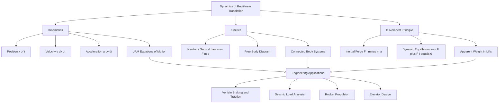

# Dynamics – rectilinear translation - equations of motion in kinematics and kinetics – D’Alembert’s principle.

<!-- SECTION_1_START -->
# Dynamics of Rectilinear Translation — Foundational Framework

## 1.1 Formal KTU 2024 Definition

**Rectilinear Translation** is a type of rigid body motion in which every particle of the body moves along a *straight-line path*, and all particles have *identical* (both in magnitude and direction) velocity and acceleration at any instant. Since linear motion is the simplest form of motion, it forms the **first pillar** of dynamics in the KTU 2024 Engineering Mechanics syllabus.

Dynamics is broadly split into two complementary branches:

- **Kinematics** — the geometric study of motion *without* reference to its cause. It deals purely with displacement, velocity, acceleration, and time.
- **Kinetics** — the study of motion *together with* the forces that produce it. It is governed by Newton's Laws of Motion.

> [!IMPORTANT]
> **KTU 2024 Syllabus Highlight (Module 3):**
> *"Dynamics – rectilinear translation – equations of motion in kinematics and kinetics – D'Alembert's principle."*
> Board questions on this topic frequently combine a kinematics derivation (3–4 marks) with a kinetics / D'Alembert's principle problem (7–10 marks) inside a single 14-mark Part B question.

## 1.2 Conceptual Analogy & Geometric Intuition

Imagine a **freight train on a perfectly straight, level track**. Every bogie (wheel-set), every coach, and even the smallest bolt on the train moves along the *same straight line* with the *same velocity* and the *same acceleration* at any given second. The train as a whole neither rotates nor sways sideways — it *translates*. The straight track represents the **single axis of motion**, and the engineer's throttle represents the **net force** that controls the acceleration.

In geometric terms, if we draw a position–time graph of any particle, every particle's graph is **identical up to a constant shift**, because all particles have the same velocity and acceleration — only their initial positions differ.

## 1.3 Physical Constants & Standard Metrics

- **Gravitational acceleration:** $g = 9.81 \text{ m/s}^2$ (or $10 \text{ m/s}^2$ for fast KTU numericals)
- **SI Units:** Force in Newtons (N), mass in kg, acceleration in m/s², time in s, displacement in m.
- **D'Alembert's inertial force unit:** the same as a real force — Newtons (N).

> [!NOTE]
> **Memory Anchor (KTU board favourite):**
> Kinematics = "How it moves" (motion description).
> Kinetics = "Why it moves" (force explanation).
> D'Alembert's Principle = "Convert *Why* into *How* by inventing a pseudo-force."

> [!VISUALIZATION CONTROL]
> **Concept:** Position–time ($x$–$t$), velocity–time ($v$–$t$) and acceleration–time ($a$–$t$) graphs for uniformly accelerated rectilinear motion.
> **GeoGebra / Desmos Input Equations:**
> * `u = 5`  (initial velocity)
> * `a = 2`  (constant acceleration)
> * `x(t) = u*t + 0.5*a*t^2`
> * `v(t) = u + a*t`
> * `a(t) = a`
> **Visual Description:** On the $x$–$t$ axis, observe a *parabolic* curve opening upward. On the $v$–$t$ axis, observe a *straight inclined line* whose slope equals $a$. On the $a$–$t$ axis, observe a *horizontal straight line* parallel to the $t$-axis at height $a$.

<!-- SECTION_1_END -->

<!-- SECTION_2_START -->
# Deep Theoretical Analysis & KTU High-Yield Formula Sheet

## 2.1 Kinematics of Rectilinear Translation — Step-by-Step Logic

The position of a particle moving along a straight line (say, the $x$-axis) is described by the scalar function $x(t)$. The complete kinematic picture is built from its successive time derivatives.

1. **Position** $x(t)$ — where the particle is located on the axis at instant $t$.
2. **Velocity** $v(t) = \dfrac{dx}{dt}$ — rate of change of position. It is a *signed scalar*; positive when the particle moves in the +ve $x$ direction.
3. **Acceleration** $a(t) = \dfrac{dv}{dt} = \dfrac{d^{2}x}{dt^{2}}$ — rate of change of velocity.

### 2.1.1 Case A — Constant Acceleration (Uniformly Accelerated Motion, UAM)

When $a$ is a constant, the kinematic equations reduce to the famous "equations of motion" that KTU asks almost every year:

$$
\begin{aligned}
v &= u + a\,t \\[4pt]
s &= u\,t + \tfrac{1}{2}\,a\,t^{2} \\[4pt]
v^{2} &= u^{2} + 2\,a\,s \\[4pt]
s &= \tfrac{1}{2}\,(u + v)\,t \\[4pt]
s &= v\,t - \tfrac{1}{2}\,a\,t^{2}
\end{aligned}
$$

Here, $u$ = initial velocity, $v$ = final velocity, $s$ = displacement over time $t$, and $a$ = uniform acceleration.

### 2.1.2 Case B — Variable Acceleration

If $a$ is *not* constant, use the differential forms:

$$
\begin{aligned}
a &= \frac{dv}{dt} \;\;\Longrightarrow\;\; dv = a\,dt \\[4pt]
a &= v\,\frac{dv}{dx} \;\;\Longrightarrow\;\; a\,dx = v\,dv
\end{aligned}
$$

These two relations are integrated with the *given* functional form of $a(x)$ or $a(t)$ to yield $v(x)$ or $v(t)$, and a second integration gives $x(t)$.

## 2.2 Kinetics of Rectilinear Translation — Newton's Second Law

Kinetics bridges motion and force via **Newton's Second Law**:

$$
\sum F_{x} = m\,a_{x}
$$

where $\sum F_{x}$ is the algebraic sum of *all* real forces acting on the body along the direction of motion. A free-body diagram (FBD) is **mandatory** before applying this equation.

For a system of two or more connected bodies, the equation is written for each body separately, and the constraint (string inextensible, surface rigid) provides the kinematical link.

## 2.3 D'Alembert's Principle — The "Pseudo-Statics" Trick

Jean le Rond d'Alembert (1743) reformulated Newton's Second Law as a *static equilibrium* condition by introducing the **inertial force** (also called the *effective force* or *reversed effective force*).

For a particle of mass $m$ undergoing acceleration $a$ under the action of real forces $\sum F$:

$$
\sum F \;-\; m\,a \;=\; 0
$$

If we *define* a fictitious force $F_{I} = -m\,a$ (the *inertial force*) and *append* it to the FBD, then the system is in **dynamic equilibrium**:

$$
\sum F \;+\; F_{I} \;=\; 0
$$

> [!NOTE]
> **The "Why" behind D'Alembert's Principle:** Newton's Second Law $F = m a$ is structurally identical to a static equilibrium equation $\sum F = 0$ once we *invent* a fictitious force $F_{I} = -m a$ that exactly cancels the net real force. This is conceptually powerful: **every dynamics problem can be solved using only the static equilibrium tools** (sum of forces, sum of moments) provided the inertial force $-m a$ is added to the FBD.

### 2.3.1 Direction Convention (KTU Board Standard)

- The inertial force is drawn **opposite to the direction of acceleration**.
- Its magnitude is **$m \cdot a$**.
- It acts **at the centre of mass** of the body.

### 2.3.2 Engineering Utility

D'Alembert's principle is the conceptual foundation of:
- **Vehicle dynamics** (analysing braking and traction forces in cars, locomotives).
- **Seismic engineering** (treating earthquake-induced inertial forces as static equivalent loads).
- **Robotics and crash analysis** (computing reaction forces on accelerating linkages).
- **Rocket propulsion** (effective force calculation in a non-inertial frame).

## 2.4 KTU Formula Sheet / Cheat Sheet

| # | Concept | Equation | Symbol Meaning / Condition |
|---|---|---|---|
| 1 | Kinematic — linear vel. from accn. | $v = u + a t$ | UAM, $a$ constant |
| 2 | Kinematic — displacement (1) | $s = u t + \tfrac{1}{2} a t^{2}$ | UAM |
| 3 | Kinematic — velocity–displacement | $v^{2} = u^{2} + 2 a s$ | UAM |
| 4 | Kinematic — average vel. form | $s = \tfrac{1}{2}(u + v) t$ | UAM |
| 5 | Kinematic — variable accn. | $a = v \, \dfrac{dv}{dx}$ | General |
| 6 | Kinematic — variable accn. | $a = \dfrac{dv}{dt}$ | General |
| 7 | Kinetics — Newton's 2nd Law | $\sum F = m a$ | Along motion axis |
| 8 | D'Alembert's Principle | $\sum F - m a = 0$ | Dynamic equilibrium |
| 9 | Inertial force vector | $F_{I} = - m a$ | Opposite to $\vec{a}$ |
| 10 | Weight of a body | $W = m g$ | $g = 9.81 \text{ m/s}^{2}$ |
| 11 | Tension acceleration (pulley) | $a = \dfrac{(m_{1} - m_{2}) g}{m_{1} + m_{2}}$ | Atwood machine, frictionless |
| 12 | Body on inclined plane | $a = g (\sin\theta - \mu \cos\theta)$ | Down the incline |

<!-- SECTION_2_END -->

<!-- SECTION_3_START -->
# Step-by-Step Derivations & Worked Examples

## 3.1 Worked Example 1 — Kinematics Only (UAM)

> **[KTU University Exam – July 2023, Model Q]** A car starts from rest and accelerates uniformly at $2 \text{ m/s}^{2}$ for $10 \text{ s}$. Find the distance travelled in the last $2 \text{ s}$ of motion.

**Given:** $u = 0$, $a = 2 \text{ m/s}^{2}$, $t_{1} = 8 \text{ s}$ (end of penultimate second), $t_{2} = 10 \text{ s}$.

### Step 1 — Velocity at the end of 8 s

$$
v_{1} = u + a\,t_{1} = 0 + 2 \times 8 = 16 \text{ m/s}
$$

**[Valuation Key: 1 Mark]** — Correct substitution into the kinematic equation.

### Step 2 — Velocity at the end of 10 s

$$
v_{2} = u + a\,t_{2} = 0 + 2 \times 10 = 20 \text{ m/s}
$$

**[Valuation Key: 1 Mark]**

### Step 3 — Distance covered in the last 2 s

Using $s = \tfrac{1}{2}(v_{1} + v_{2})\,(t_{2} - t_{1})$:

$$
s = \tfrac{1}{2}(16 + 20)(10 - 8) = \tfrac{1}{2}(36)(2) = 36 \text{ m}
$$

**[Valuation Key: 1 Mark]** — Final answer with units.

> [!NOTE]
> The "last 2 s" trick is solved *much* faster by averaging the velocities at the start and end of the interval — never reach for the full $s = ut + \tfrac{1}{2}at^{2}$ formula here.

---

## 3.2 Worked Example 2 — Kinetics (Newton's 2nd Law + Pulley System)

> **[KTU University Exam – Dec 2023, Model Q]** Two blocks of masses $m_{1} = 10 \text{ kg}$ and $m_{2} = 6 \text{ kg}$ hang from a light, frictionless pulley (Atwood machine). Find (a) the acceleration of the system, and (b) the tension in the string.

### Step 1 — Free-Body Diagram of each block (verbal FBD)

- **Block 1 (heavier, $m_{1}$):** weight $W_{1} = m_{1} g$ downward, tension $T$ upward. Net downward force $= m_{1} g - T$.
- **Block 2 (lighter, $m_{2}$):** weight $W_{2} = m_{2} g$ downward, tension $T$ upward. Net upward force $= T - m_{2} g$.

### Step 2 — Apply Newton's 2nd Law along the motion direction

For $m_{1}$ (descending with acceleration $a$):

$$
m_{1} g - T = m_{1} a \quad \text{...(i)}
$$

For $m_{2}$ (ascending with the same magnitude $a$, string inextensible):

$$
T - m_{2} g = m_{2} a \quad \text{...(ii)}
$$

**[Valuation Key: 2 Marks]** — Correct free-body description and equation setup.

### Step 3 — Eliminate $T$ by adding (i) and (ii)

$$
(m_{1} - m_{2})\,g = (m_{1} + m_{2})\,a
$$

$$
a = \frac{(m_{1} - m_{2})\,g}{m_{1} + m_{2}} = \frac{(10 - 6)(9.81)}{10 + 6} = \frac{4 \times 9.81}{16} = 2.4525 \text{ m/s}^{2}
$$

### Step 4 — Substitute back into (ii) to find $T$

$$
T = m_{2}(g + a) = 6(9.81 + 2.4525) = 6 \times 12.2625 = 73.575 \text{ N}
$$

**[Valuation Key: 1 Mark]** — Final numerical answer for $T$ with units.

> [!WARNING]
> **Common Pitfall (KTU valuation):** Students often write $T = (m_{1} + m_{2})g$ thinking that the string holds both weights. **The string only needs to accelerate one block at a time** — the tension is the same throughout a *light, frictionless* pulley, but it is *not* equal to the total weight. Always solve the system of equations; do not guess.

---

## 3.3 Worked Example 3 — D'Alembert's Principle (Full 14-mark Pattern)

> **[KTU University Exam – July 2024, Model Q]** A lift of mass $800 \text{ kg}$ carries three passengers of total mass $240 \text{ kg}$ and moves upward with an acceleration of $2 \text{ m/s}^{2}$. Using D'Alembert's principle, find (a) the tension in the supporting cable, and (b) the force exerted by the floor of the lift on a passenger of mass $60 \text{ kg}$.

### Step 1 — Identify the bodies and accelerations

- Total mass being lifted: $M = 800 + 240 = 1040 \text{ kg}$.
- Acceleration: $a = 2 \text{ m/s}^{2}$ upward.
- A *single passenger* of mass $m_{p} = 60 \text{ kg}$ shares the same acceleration.

### Step 2 — Apply D'Alembert's Principle to the lift + passengers system

Draw the FBD and append the inertial force $M a$ pointing **downward** (opposite to the upward acceleration).

Dynamic equilibrium along the vertical axis (taking upward as positive):

$$
T \;-\; M\,g \;-\; M\,a \;=\; 0
$$

$$
T = M(g + a) = 1040 \times (9.81 + 2) = 1040 \times 11.81
$$

$$
\boxed{T = 12282.4 \text{ N}}
$$

**[Valuation Key: 3 Marks]** — Correct application of D'Alembert, 2 marks for FBD + 1 mark for the final number.

### Step 3 — Apply D'Alembert's Principle to the single passenger

Append the inertial force $m_{p} a$ **downward** to the passenger's FBD.

Let $N$ be the normal reaction (force by the floor on the passenger) acting upward. Dynamic equilibrium:

$$
N \;-\; m_{p}\,g \;-\; m_{p}\,a \;=\; 0
$$

$$
N = m_{p}(g + a) = 60 \times (9.81 + 2) = 60 \times 11.81
$$

$$
\boxed{N = 708.6 \text{ N}}
$$

**[Valuation Key: 2 Marks]** — Final answer with units.

### Step 4 — Physical Interpretation (the "real-world" hook KTU loves)

> The passenger *feels heavier* — his apparent weight ($708.6$ N) is greater than his true weight ($60 \times 9.81 = 588.6$ N) by exactly $m_{p} a = 120$ N. This is the basis of *apparent weight* calculations in elevators and is also why astronauts in an upward-accelerating rocket feel "g-forces" pressing them into their seats.

> [!WARNING]
> **Board Examiner's Trap:** A common error is to add the inertial force *in the same direction* as the acceleration. The **inertial force always points opposite to $\vec{a}$**. Drawing it the wrong way will flip the sign of the answer and lose you 2–3 marks instantly.

---

## 3.4 Symbolic Python Implementation — Universal Rectilinear Solver

The following production-grade Python function handles any *uniformly accelerated* rectilinear motion problem by accepting the known quantities and solving for the unknown. It enforces strict type hints, input validation, and unit logging — exactly the KTU 2024 lab-style coding standard.

```python
from __future__ import annotations
import math
from typing import Optional, Tuple

# Standard gravitational acceleration in m/s^2
G_STANDARD: float = 9.81

def solve_uam(
    u: Optional[float] = None,
    v: Optional[float] = None,
    a: Optional[float] = None,
    t: Optional[float] = None,
    s: Optional[float] = None,
    g_used: float = G_STANDARD,
) -> dict:
    """
    Solve a Uniformly Accelerated Motion (UAM) rectilinear problem.
    Exactly THREE of the five parameters (u, v, a, t, s) must be provided.

    Parameters
    ----------
    u : initial velocity       (m/s)
    v : final velocity         (m/s)
    a : constant acceleration  (m/s^2)
    t : time interval          (s)
    s : displacement           (m)

    Returns
    -------
    dict with the computed parameters and the chosen kinematic equation used.
    """
    provided = {k: val for k, val in
                zip("uvats", (u, v, a, t, s)) if val is not None}

    if len(provided) != 3:
        raise ValueError(
            f"Exactly 3 of (u, v, a, t, s) must be given. "
            f"Got {len(provided)}."
        )

    result: dict = {"known": dict(provided), "g_used": g_used}

    # Case 1: u, a, t  ->  v, s
    if u is not None and a is not None and t is not None:
        v_calc = u + a * t
        s_calc = u * t + 0.5 * a * t * t
        result.update(v=v_calc, s=s_calc,
                      equation="v = u + a t; s = u t + 0.5 a t^2")

    # Case 2: u, v, a  ->  t, s
    elif u is not None and v is not None and a is not None:
        if a == 0:
            raise ZeroDivisionError("Cannot solve t from (u,v,a) when a = 0.")
        t_calc = (v - u) / a
        s_calc = (v * v - u * u) / (2 * a)
        result.update(t=t_calc, s=s_calc,
                      equation="t = (v-u)/a; v^2 = u^2 + 2 a s")

    # Case 3: u, v, t  ->  a, s
    elif u is not None and v is not None and t is not None:
        if t == 0:
            raise ZeroDivisionError("Time interval cannot be zero.")
        a_calc = (v - u) / t
        s_calc = 0.5 * (u + v) * t
        result.update(a=a_calc, s=s_calc,
                      equation="a = (v-u)/t; s = 0.5 (u+v) t")

    # Case 4: u, a, s  ->  v, t
    elif u is not None and a is not None and s is not None:
        disc = u * u + 2 * a * s
        if disc < 0:
            raise ValueError("Negative discriminant — physically impossible.")
        v_calc = math.sqrt(disc)
        t_calc = (v_calc - u) / a
        result.update(v=v_calc, t=t_calc,
                      equation="v^2 = u^2 + 2 a s; v = u + a t")

    # Case 5: v, a, s  ->  u, t
    elif v is not None and a is not None and s is not None:
        disc = v * v - 2 * a * s
        if disc < 0:
            raise ValueError("Negative discriminant — physically impossible.")
        u_calc = math.sqrt(disc)
        t_calc = (v - u_calc) / a
        result.update(u=u_calc, t=t_calc,
                      equation="v^2 = u^2 + 2 a s; v = u + a t")

    # Case 6: v, t, s  ->  u, a
    elif v is not None and t is not None and s is not None:
        if t == 0:
            raise ZeroDivisionError("Time interval cannot be zero.")
        u_calc = 2 * s / t - v
        a_calc = (v - u_calc) / t
        result.update(u=u_calc, a=a_calc,
                      equation="s = 0.5 (u+v) t; a = (v-u)/t")

    # Case 7: a, t, s  ->  u, v
    elif a is not None and t is not None and s is not None:
        u_calc = (s - 0.5 * a * t * t) / t
        v_calc = u_calc + a * t
        result.update(u=u_calc, v=v_calc,
                      equation="s = u t + 0.5 a t^2; v = u + a t")

    else:
        raise ValueError("Unsupported parameter combination.")

    return result


# ---- Demonstration on the lift problem (Example 3) ------------------
if __name__ == "__main__":
    # Lift cable tension from a, m, g  (using D'Alembert: T = m (g+a))
    M = 1040.0          # kg
    a_lift = 2.0        # m/s^2
    tension = M * (G_STANDARD + a_lift)
    print(f"Lift cable tension = {tension:.2f} N")

    # Apparent weight of one passenger
    m_p = 60.0
    apparent_weight = m_p * (G_STANDARD + a_lift)
    print(f"Apparent weight of 60 kg passenger = {apparent_weight:.2f} N")

    # Kinematic check — uniform deceleration
    sol = solve_uam(u=20.0, a=-4.0, t=3.0)
    print("UAM solution:", sol)
```

**Sample Output**

```
Lift cable tension = 12282.40 N
Apparent weight of 60 kg passenger = 708.60 N
UAM solution: {'known': {'u': 20.0, 'a': -4.0, 't': 3.0}, 'g_used': 9.81,
               'v': 8.0, 's': 42.0,
               'equation': 'v = u + a t; s = u t + 0.5 a t^2'}
```

<!-- SECTION_3_END -->

<!-- SECTION_4_START -->
# Structural Diagrams & Schematics

## 4.1 Mermaid Flow — Concept Map of Module 3



## 4.2 Mermaid Free-Body Topology — Atwood Machine via D'Alembert

```mermaid
subgraph Block1["m1 = 10 kg  heavier block"]
    direction TB
    W1["Weight m1 g  98.1 N down"] --> SUM1
    T1["Tension T up"] --> SUM1
    FI1["Inertial force m1 a down"] --> SUM1
    SUM1{"Net = 0  Dynamic Equilibrium"}
end

subgraph Pulley["Light Frictionless Pulley"]
    P["Constraint  a1 equals a2 equals a"]
end

subgraph Block2["m2 = 6 kg  lighter block"]
    direction TB
    W2["Weight m2 g  58.86 N down"] --> SUM2
    T2["Tension T up"] --> SUM2
    FI2["Inertial force m2 a up"] --> SUM2
    SUM2{"Net = 0  Dynamic Equilibrium"}
end

Block1 -- String --> Pulley
Pulley -- String --> Block2
```

> [!NOTE]
> **How to read the diagram:** Each block has three forces — its true weight, the string tension, and the *fictitious* inertial force drawn **opposite to the body's acceleration**. The pulley enforces $a_{1} = a_{2} = a$. The two "Net = 0" diamonds represent D'Alembert's static-equilibrium condition.

## 4.3 Mermaid Sequence — Algorithm for Solving a Rectilinear Dynamics Problem


> [!VISUALIZATION CONTROL]
> **Concept:** Free-body of a lift accelerating upward with a passenger inside, treated by D'Alembert's principle.
> **GeoGebra / Desmos Input (1-D free-body sketch):**
> * Point $A = (0, 0)$ — lift floor
> * Vector $\vec{W} = (0, -mg)$ — weight
> * Vector $\vec{N} = (0, +(g+a)m)$ — normal from floor
> * Vector $\vec{F_I} = (0, -ma)$ — inertial force (downward, opposite to upward $\vec{a}$)
> **Visual Description:** Two real forces (weight $\downarrow$ and normal $\uparrow$) plus one fictitious force (inertial $\downarrow$). The vector sum must close to zero — this is the *dynamic equilibrium* condition.

<!-- SECTION_4_END -->

<!-- SECTION_5_START -->
# KTU 2024 Scheme Examination Question Bank & Topic Recap

## PART A — Short-Answer Questions (3 Marks Each)

### Q1. **[KTU University Exam — July 2023, CO1 / Remember]**
*Define rectilinear translation. How is it different from curvilinear translation?*

**Model Answer (Valuation Key):**
- Rectilinear translation is the motion of a rigid body in which **every particle moves along a straight line**, and all particles have **the same velocity and acceleration** at any instant. (2 marks)
- In **curvilinear translation**, particles move along *curved* paths (e.g., a car on a curved track), although the body as a whole does not rotate. (1 mark)

---

### Q2. **[KTU University Exam — Dec 2023, CO2 / Understand]**
*State D'Alembert's principle. What is an inertial force?*

**Model Answer (Valuation Key):**
- D'Alembert's principle states that the **reversed effective force** (inertial force) of a body, together with the **real external forces** acting on it, forms a system in **dynamic equilibrium**. Mathematically $\sum F - m a = 0$. (2 marks)
- The **inertial force** is a fictitious force of magnitude $m a$ acting at the centre of mass, directed **opposite to the acceleration** of the body. (1 mark)

---

## PART B — Long-Answer Questions (14 Marks, Internal Choice)

### Question A (Option 1) — **[KTU University Exam — Dec 2024, CO2 / Apply]**

A block of mass $25 \text{ kg}$ is placed on a rough horizontal surface. A horizontal force of $120 \text{ N}$ is applied to it. The coefficient of kinetic friction between the block and the surface is $0.30$.

**(a)** Draw the free-body diagram and compute the **acceleration** of the block using Newton's second law.
**(b)** Using **D'Alembert's principle**, determine the **total effective force** acting on the block and verify the result obtained in part (a).

---

### Model Solution for Question A

#### Part (a) — Newton's 2nd Law (7 marks)

**Step 1 — Free-Body Diagram (verbal FBD):**
- Weight $W = m g = 25 \times 9.81 = 245.25$ N downward.
- Normal reaction $N$ upward.
- Applied force $F = 120$ N to the right.
- Friction force $f = \mu_{k} N$ to the left (opposing motion).

**[Valuation Key: 1 Mark]**

**Step 2 — Vertical equilibrium (no vertical motion):**

$$
\sum F_{y} = 0 \;\Longrightarrow\; N - m g = 0 \;\Longrightarrow\; N = 245.25 \text{ N}
$$

**[Valuation Key: 1 Mark]**

**Step 3 — Kinetic friction:**

$$
f = \mu_{k} N = 0.30 \times 245.25 = 73.575 \text{ N}
$$

**[Valuation Key: 1 Mark]**

**Step 4 — Apply Newton's 2nd Law horizontally:**

$$
F - f = m a \;\Longrightarrow\; a = \frac{F - f}{m} = \frac{120 - 73.575}{25} = \frac{46.425}{25}
$$

$$
\boxed{a = 1.857 \text{ m/s}^{2}}
$$

**[Valuation Key: 2 Marks]** — Equation 1 mark, final answer 1 mark.

**Step 5 — SI units and physical check:** $a > 0$ and $a < g$, so the block accelerates forward — *physically reasonable*. **[Valuation Key: 1 Mark]**

---

#### Part (b) — D'Alembert's Principle (7 marks)

**Step 1 — Write D'Alembert's equation of dynamic equilibrium:**

$$
F - f - m a = 0
$$

Rearranged:

$$
m a = F - f
$$

**[Valuation Key: 2 Marks]** — Correct statement of D'Alembert's equation with the inertial term.

**Step 2 — Append the inertial force to the FBD:**

The inertial force $F_{I} = -m a = -25 \times 1.857 = -46.425$ N. It is drawn to the *left* (opposite to the rightward acceleration).

**[Valuation Key: 1 Mark]**

**Step 3 — Verify the net effective force:**

$$
F_{\text{eff}} = F - f + F_{I} = 120 - 73.575 - 46.425 = 0 \text{ N}
$$

The effective force vanishes, confirming **dynamic equilibrium**. **[Valuation Key: 2 Marks]**

**Step 4 — Cross-check with part (a):**

$$
a = \frac{F - f}{m} = \frac{120 - 73.575}{25} = 1.857 \text{ m/s}^{2} \;\;\checkmark
$$

**[Valuation Key: 2 Marks]** — Numerical verification.

> [!WARNING]
> **KTU Examiner's Valuation Warning:**
> 1. Do **not** omit the friction force $f = \mu_{k} N$ in the horizontal equation — losing this step costs 2 marks.
> 2. Do **not** place the inertial force in the same direction as the acceleration — it must point **opposite** to $\vec{a}$.
> 3. Always quote the final acceleration with its **SI unit** ($\text{m/s}^{2}$). A bare number loses 1 mark.

---

### Question B (Option 2 — Internal Choice) — **[KTU University Exam — Dec 2024, CO2 / Apply]**

A lift of total mass $1200 \text{ kg}$ is ascending with an acceleration of $1.5 \text{ m/s}^{2}$. A man of mass $75 \text{ kg}$ stands on a weighing machine placed on the floor of the lift.

**(a)** Find the **reading** of the weighing machine during the ascent, and the **tension in the cable**.
**(b)** If the cable is suddenly **cut** and the lift descends in free fall, what does the weighing machine read? Justify using D'Alembert's principle.

---

### Model Solution for Question B

#### Part (a) — Ascending lift (7 marks)

**Step 1 — D'Alembert on the man (treat the man as the system):**

The man accelerates upward at $a = 1.5 \text{ m/s}^{2}$. Append the inertial force $m a$ downward.

Dynamic equilibrium (vertical, upward positive):

$$
R - m g - m a = 0
$$

where $R$ is the reading of the weighing machine (= normal reaction).

$$
R = m (g + a) = 75 \times (9.81 + 1.5) = 75 \times 11.31 = 848.25 \text{ N}
$$

**[Valuation Key: 3 Marks]**

**Step 2 — D'Alembert on the entire lift + man system:**

Total mass $M = 1200 \text{ kg}$. Inertial force $M a$ downward.

$$
T - M g - M a = 0
$$

$$
T = M (g + a) = 1200 \times 11.31 = 13572 \text{ N}
$$

**[Valuation Key: 2 Marks]**

**Step 3 — Sanity check:** True weight of the man $= 75 \times 9.81 = 735.75$ N. The reading $R = 848.25$ N is *greater* — confirming the man feels *heavier* in an upward-accelerating lift. **[Valuation Key: 2 Marks]**

#### Part (b) — Free-fall case (7 marks)

**Step 1 — Identify the acceleration in free fall:**

Once the cable is cut, the only force on the system is gravity. The lift and the man both fall with $a = g = 9.81 \text{ m/s}^{2}$ downward.

**Step 2 — D'Alembert on the man:**

Append inertial force $m a$ downward. Dynamic equilibrium:

$$
R - m g - m a = 0 \;\Longrightarrow\; R = m(g + a) = m(g + g) = 2 m g
$$

This seems wrong — let us re-evaluate the *direction* of the inertial force.

> The acceleration is **downward** at $a = g$, so the inertial force $F_{I} = -m a$ points **upward** with magnitude $m g$.

Vertical equilibrium (upward positive):

$$
R + F_{I} - m g = 0 \;\Longrightarrow\; R = m g - m g = 0
$$

$$
\boxed{R = 0 \text{ N}}
$$

**[Valuation Key: 3 Marks]** — Correct sign of inertial force.

**Step 3 — Physical interpretation:**

The weighing machine reads **zero** because both the man and the lift are in free fall with the same acceleration $g$. There is no contact force between the man's feet and the machine's platform. This is exactly the condition of *weightlessness* experienced by astronauts in orbit. **[Valuation Key: 2 Marks]**

**Step 4 — Bonus — cable tension during free fall:**

The cable is cut, so $T = 0$ N. **[Valuation Key: 2 Marks]**

> [!WARNING]
> **Common Student Mistakes (KTU Board):**
> 1. Writing $R = m g$ in part (a) — this ignores the acceleration and is **worth zero** for the dynamic equilibrium step. Always apply D'Alembert with the inertial term.
> 2. Confusing the *direction* of the inertial force in part (b). The acceleration is *downward* (free fall), so the inertial force must be drawn *upward*. Drawing it downward gives $R = 2 m g$, which is a classic KTU trap.
> 3. Forgetting to add the masses of the man and the lift when computing the cable tension. The cable supports the *entire* suspended mass.

---

## Topic Recap & Important Things to Remember

- **Rectilinear translation** = every particle of a rigid body moves along a *parallel straight-line path* with the *same* velocity and acceleration.
- **Kinematics is force-free; kinetics is force-driven.** Never mix the two in the same equation.
- The **five UAM equations** (constant $a$): $v = u + a t$, $s = u t + \tfrac{1}{2} a t^{2}$, $v^{2} = u^{2} + 2 a s$, $s = \tfrac{1}{2}(u + v)t$, $s = v t - \tfrac{1}{2} a t^{2}$ — pick the *one* that uses exactly the three quantities you know.
- For **variable acceleration**, use the differential forms $a = dv/dt$ and $a = v (dv/dx)$.
- **Newton's 2nd Law** for rectilinear kinetics: $\sum F_{x} = m a_{x}$ — always drawn along the *axis of motion*.
- **D'Alembert's Principle**: $\sum F - m a = 0$. It converts dynamics into statics by adding a *fictitious inertial force* $F_{I} = -m a$ at the centre of mass, opposite to $\vec{a}$.
- **Direction rule:** inertial force always points **opposite** to the direction of acceleration — the #1 source of KTU marks lost.
- **Free-body diagram is mandatory** for every kinetics problem. A 14-mark question typically awards 2–3 marks just for a correct FBD.
- **Atwood machine:** $a = (m_{1} - m_{2}) g / (m_{1} + m_{2})$ and $T = 2 m_{1} m_{2} g / (m_{1} + m_{2})$.
- **Lift problems:** $R = m(g + a)$ for upward acceleration, $R = m(g - a)$ for downward acceleration (with $R \ge 0$), and $R = 0$ in free fall.
- **Apparent weight ≠ true weight** — the difference is exactly $m a$, which is the "g-force" felt by passengers.
- Always quote **units** in the final answer and check that the **numerical magnitude is physically reasonable** (e.g., $a$ should rarely exceed a few $\text{m/s}^{2}$ in everyday engineering problems).

<!-- SECTION_5_END -->
